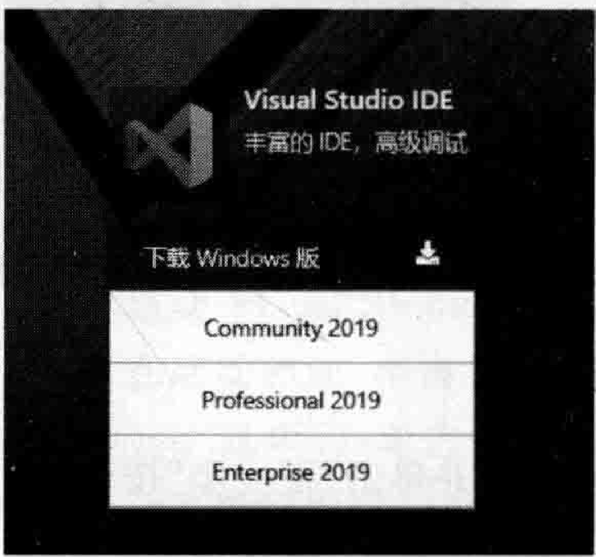
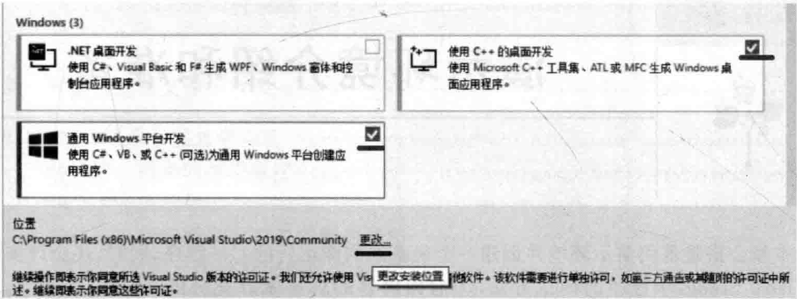
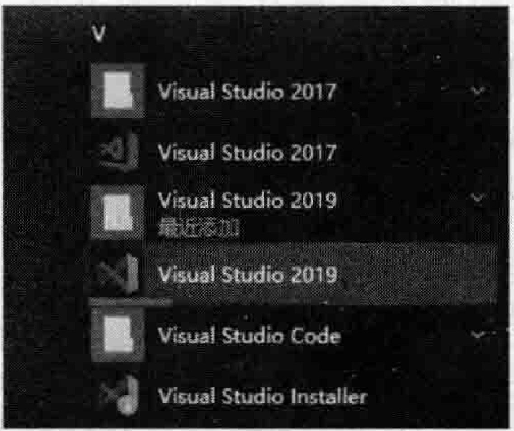
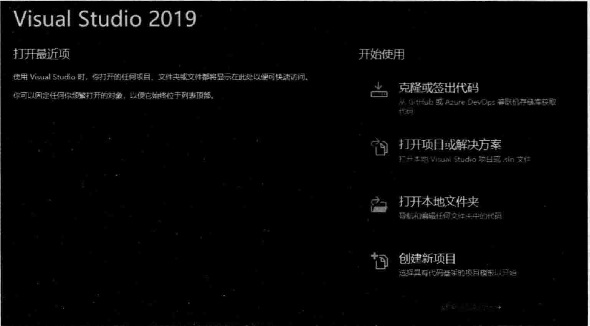

# 1.1演示环境搭建说明  

## 演示环境介绍和准备  

本章会搭建范例演示环境并创建一个最基本的能运行的 $\mathrm{C++}$ 程序，同时，还会详细解释在VisualStudio中程序的调试方法，为后面内容的讲解做好充分的  

（扫码获取资料）  

本书中所展示的各种范例会以Windows操作系统平台为主，但考虑到知识的复杂性，当Windows和Linux这两大主要的操作系统平台差异比较明显的时候，也会在Linux操作系统平台上做适当的演示。  

对于Windows操作系统平台上的演示环境要求不高，一般的开发环境就可以，所以，VisualStudio2005、2008、2010、2012任一版本，甚至更老的Visual $\mathrm{C}{+}{+}\ 2\sqrt{4}\sqrt{6}$ 版本等，只要能用起来，都不必再安装其他的 $\mathrm{C++}$ 开发环境（当然，不排除在太老的开发环境下会出现某些范例无法成功演示的窘境，所以建议还是使用VisualStudio2005之后的版本）。笔者采用的演示环境是VisualStudio2019集成开发环境，该环境使用简单，调试方便，这意味着讲解和演示会变得特别方便，同时也能大大降低读者对一些复杂知识的理解难度。为了让读者顺利地开始学习，笔者在这里将详细地阐述VisualStudio2019的安装过程（在线安装，需要网络支持）。  

  
图1.1Visual Studio 2019下载的三个版本  

VisualStudio2019是微软公司目前推出的最新版本集成开发环境，可以直接访问网站  https://visual studio.microsoft.com/zh-hans/ 这个页面就有VisualStudio2019的下载地址，分为三个版本：社区版（Community）、专业版（Professional）和企业版（Enterprise），如图1.1所示。其中社区版是可以免费使用的，下载社区版即可。  

在图1.1中单击Community2019，此时会将一个大概不到2MB的可执行文件下载到自己的计算机上。这个可执行文件实际是一个下载器，运行该下载器，它会按提示下载和安装VisualStudio2019。因这种安装方式属于在线下载和安装，整个过程可能会持续半小时到数小时之间，安装时长主要取决于网速和计算机的速度。  

安装过程中会出现复选框，让用户选择安装哪些组件，如图1.2所示。  

  
图1.2 Visual Studio 2019  

这里选择“使用 $\mathrm{C++}$ 的桌面开发”和“通用Windows平台开发”。在选择这两个选项时，安装界面右侧会出现详细的安装信息，其中有很多复选框，保持默认设置即可。请记住一个原则：只安装看上去和 $\mathrm{C++}$ 开发有关的选项，即便错过了一些选项，以后可以重复这个步骤补充安装，但切不可图省事而完全安装，因为那可能会耗费数十甚至上百GB的磁盘空间，完全没有必要。  

在图1.2左侧靠下的“位置”处，可以单击“更改”，尽量把安装位置设置到非C盘（非系统盘）的位置以尽量减少对系统盘空间的耗费。系统盘空间非常宝贵，一旦空间耗尽可能会导致计算机运行变慢甚至崩溃等各种问题，这一点也请切记！  

安装完成后，很可能在计算机的桌面上看不到VisualStudio2019程序图标，此时必须到操作系统左下角，单击“开始”按钮，然后往下翻，一直找到VisualStudio2019图标，如图1.3所示。单击并按住图形部分拖动到桌面上，创建桌面快捷方式，下次双击桌面上的该图标即可运行Visual  

Visual Studio 2019 Visual Studio 2019，启动界面如图1.4所示。  

  
图1.3“开始”菜单中的VisualStudio2019运行图标  

单击图1.4右下角的“继续但无须代码”超链接直接进人开发环境中。因为这是一个集成开发环境，可以开发很多  种计算机编程语言所编写的代码，所以第一步先设置开发环境为 $\mathrm{C++}$ 语言。在开发环境中，进行如下操作：  

（1）选择“工具” $\rightarrow$ “导人和导出设置”命令。  

（2）在弹出的对话框中，选择最下面的“重置所有设置”选项并单击“下一步”按钮

（3）选择下面的“否，仅重置设置，从而覆盖当前设置”项并单击“下一步”按钮。  

（4）选择“Visual $\mathrm{C++}$ ”选项并单击“完成”按钮。  

等待数秒时间，设置完成后单击“关闭”按钮并退出整个VisualStudio2019，就完成了将开发环境设置为 $\mathrm{C++}$ 语言的操作步骤  。  

  
图1.4-VisualStudio2019的启动界面  

VisualStudio2019会不定时更新，当需要更新时，在VisualStudio2019界面上会有提示，单击提示会出现一些操作步骤，按照操作步骤进行操作就可以在线更新。值得一提的是，可能需要注册一个账号才能进行正常的在线更新，根据系统提示进行注册即可。  

对于Linux操作系统平台上的演示环境，笔者安装了一个虚拟机（VMwareWorkstationPro），在虚拟机上安装了乌班图Linux操作系统，在这个操作系统里安装了gcc和 $\mathbf{g}^{++}$ 编译器。不熟悉Linux操作系统的读者，笔者不建议去搭建Linux开发环境，因为有一定的复杂性，可能会花费很多时间，看笔者在书中的演示和描述也能达到很好的学习效果。当然，自已能搭建起来Linux开发环境更好。在这里笔者并不准备带着读者一起搭建Linux下的 $\mathrm{C++}$ 开发环境，因为本书的重点并不是Linux操作系统上的 $\mathrm{C++}$ 开发。