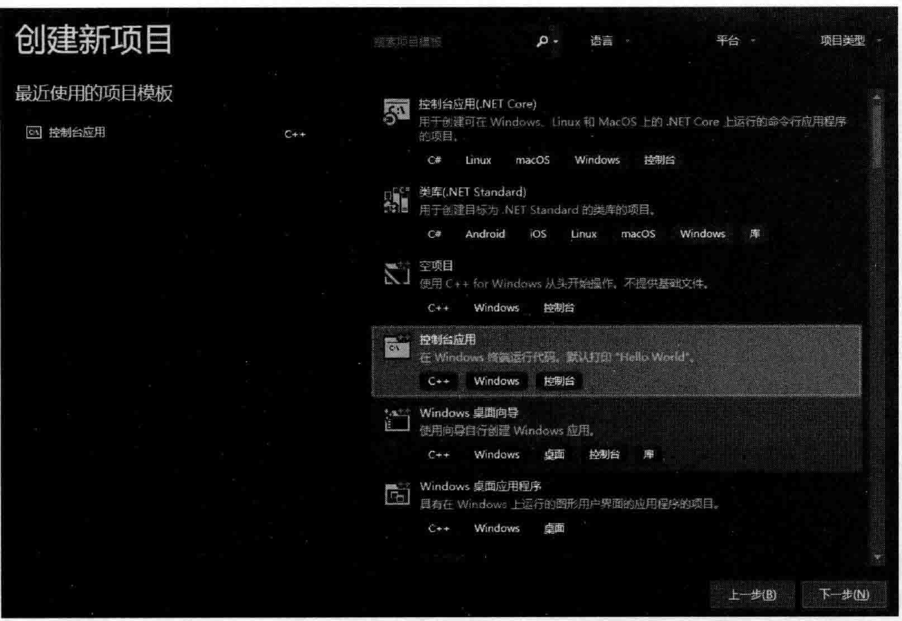
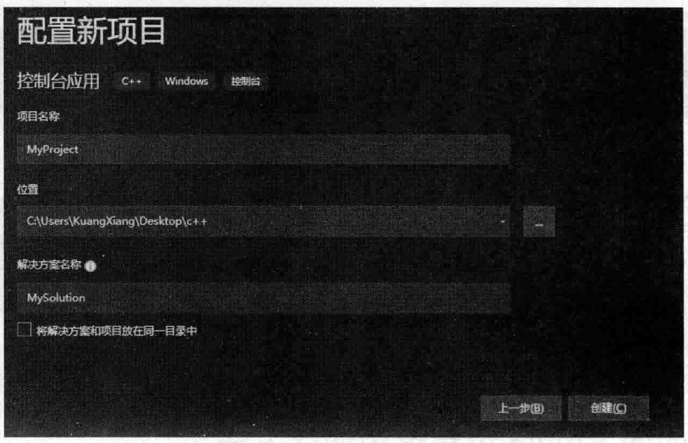
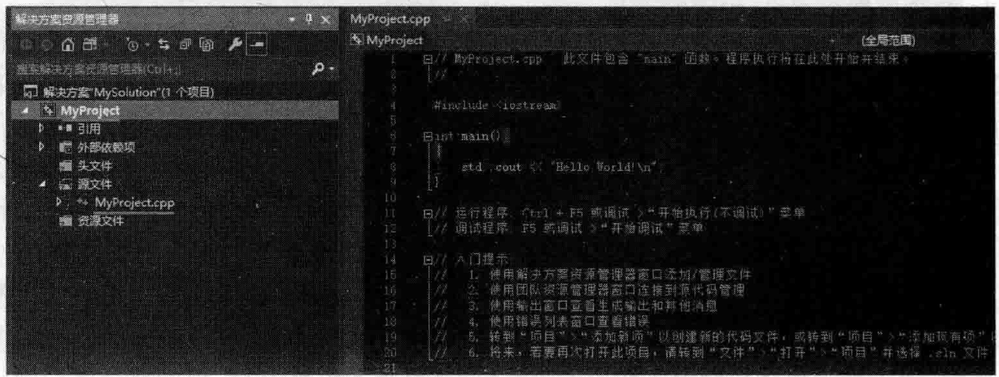
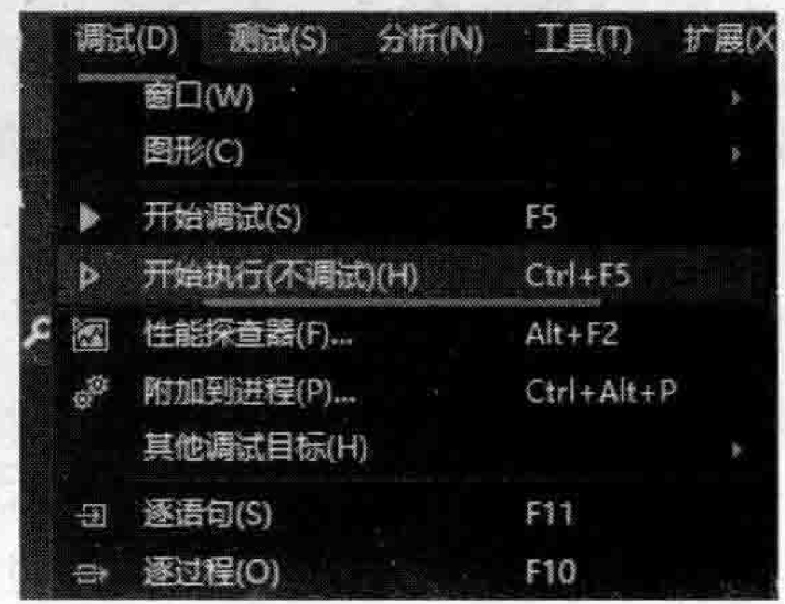
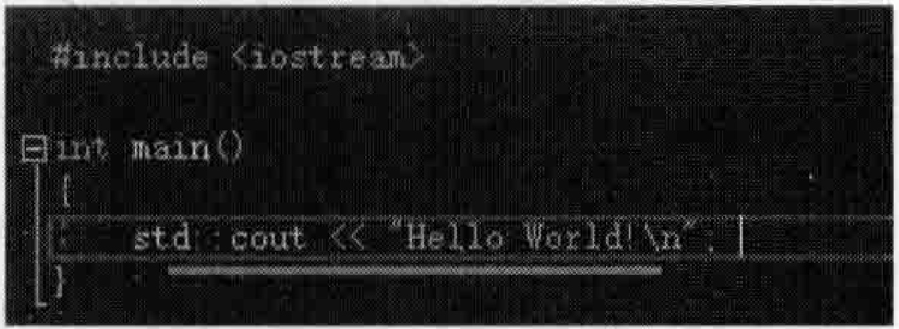

# 1.2创建最基本的能运行的C++程序  

为了后续做范例演示的方便，要做的第一件事就是创建一个最基本的能运行的 $\mathrm{C++}$ 程序。在VisualStudio2019中，只需要选择几下菜单，就能创建出一个最基本的能运行的 $\mathrm{C++}$ 程序，其他的VisualStudio版本操作也类似。下面的步骤供参考：  

（1）Visual Studio 2019  

（2）在启动界面，单击右下角“创建新项自”选项，会弹出如图1.5所示的对话框，选择“控制台应用”选项，并单击“下一步”按钮。  

（3）让系统新创建一个项目。请记住，VisualStudio2019中，任何一个可执行程序都是通过新建一个项目的手段得来，所以新建一个项目是必须的。在图1.6中填写一些项目的配置信息：  

- 项目名称：为创建的项目起的名字，例如输人MyProject。  
- 位置：保存此项目的位置，可以直接输人一个目录路径或单击后面的“”按钮选择一个已存在的目录名，这里导航到事先创建好的路径C：\UsersKuangXiangDesktop $\mathrm{C++}$ （读者可根据需要自由选择路径）。
- 解决方案名称：一个解决方案里可以包含多个项目，VisualStudio开发环境硬性要求一个项目必须被包含在一个解决方案里，同时，一个项目最终可以生成一个可执行程序，所以创建MyProject项目时，VisualStudio2019会连带创建一个解决方案并让MyProject项目包含在该解决方案里，解决方案名称这里输人MySolution。  

  
图1.5VisualStudio2019创建新项目  

（4）单击图1.6右下角的“创建”按钮，系统开始创建项目，儿秒钟后，系统创建好了一个叫MyProiect的项目，位于MySolution解决方案之下，如图1.7所示。因版本不断升级变化，读者的界面内容可能会略有差异，这不要紧，不要随意改动内容以免出错。  

如果读者使用其他VisualStudio版本，创建项目的步骤大同小异，只要能创建一个基于控制台的 $\mathrm{C++}$ 程序项目供后续学习使用即可。如果读者对自已使用的VisualStudio版本不确定如何创建项目，通过搜索引擎搜索诸如“VisualStudio2019创建新 $\mathrm{C++}$ 项目”这样的关键词组合就能找到详细答案。  

展开图1.7左侧的“源文件”文件夹的树状分支，其中包含一个MyProject.cpp文件，这是系统依据图1.6所起的项目名称生成的一个源码文件，里面已经包含一些 $\mathrm{C++}$ 源码，其实目前系统生成的该项目已经能够编译并运行了。  

项目要先编译、链接、生成可执行程序，然后才能运行，这一整套动作用快捷键Ctm十F5就可以完成，按住Ctrl键，再按F5键即可，该快捷键在很多VisualStudio版本中通用，  记住它。如果出现一个提示窗口，可以单击提示窗口中的Yes按钮，也可以直接按Enter键进行确认。  

  
图1.6新项目的一些配置信息  

  
图1.7成功创建了一个新项目  

如果按Ctrl+F 5 Visual Studio 2019任何反应，可能是这个快捷键被其他软件所占用，此时可以用VisualStudio2019中的菜单命令代替，依次单击如图1.8所示的“调试” $\rightharpoondown$ “开始执行（不调试）”命令也能达到编译、链接、生成可执行程序并开始执行的效果。  

可执行程序运行起来后，出现一个背景为黑色的窗口，其中显示的HelloWorld！字符串如图1.9所示。因为刚才创建项目时选择的是“控制台应用”，这种“控制台应用”项自运行后显示的正是一个黑色窗口，该窗口中会显示程序执行的结果，通过该窗口显示运行结果完全能够满足本书的学习要求。    

  
图 $1.8$ 编译生成可执行程序并执行  

  
图1.9可执行程序的执行结果

此时按任意键，这个黑窗口关闭，预示着该可执行程序执行结束。可执行程序执行结果中之所以会HelloWorld！，My Project.cpp源码文件中有如图1.10所示的代码行，代码的含义是属于 $\mathrm{C++}$ 的基础开发知识，相信读者会非常熟悉，在这里就不多说了。  

  
图1.10 输出语句std::cout 向屏幕输出字符串 Hello World!