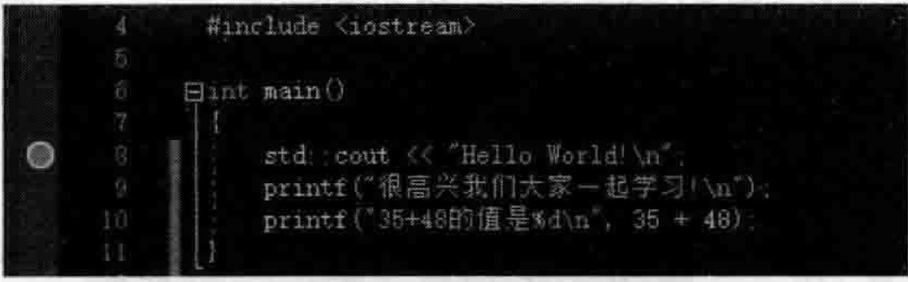
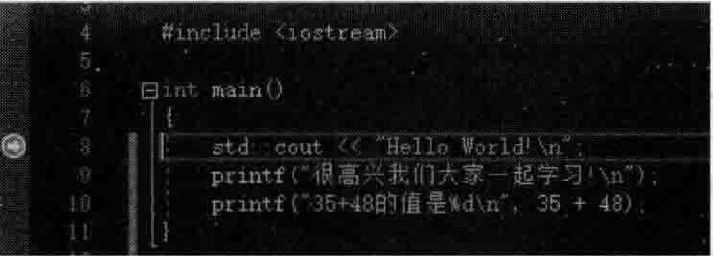
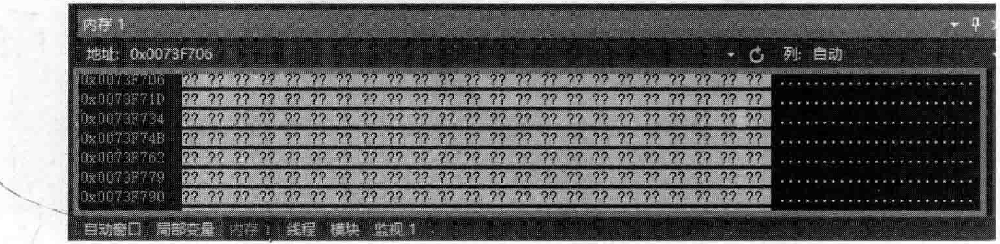
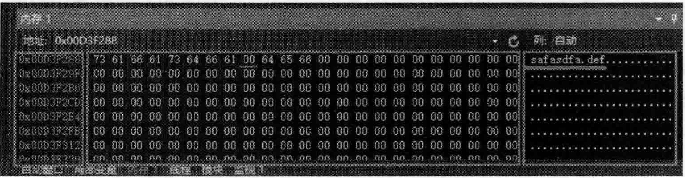
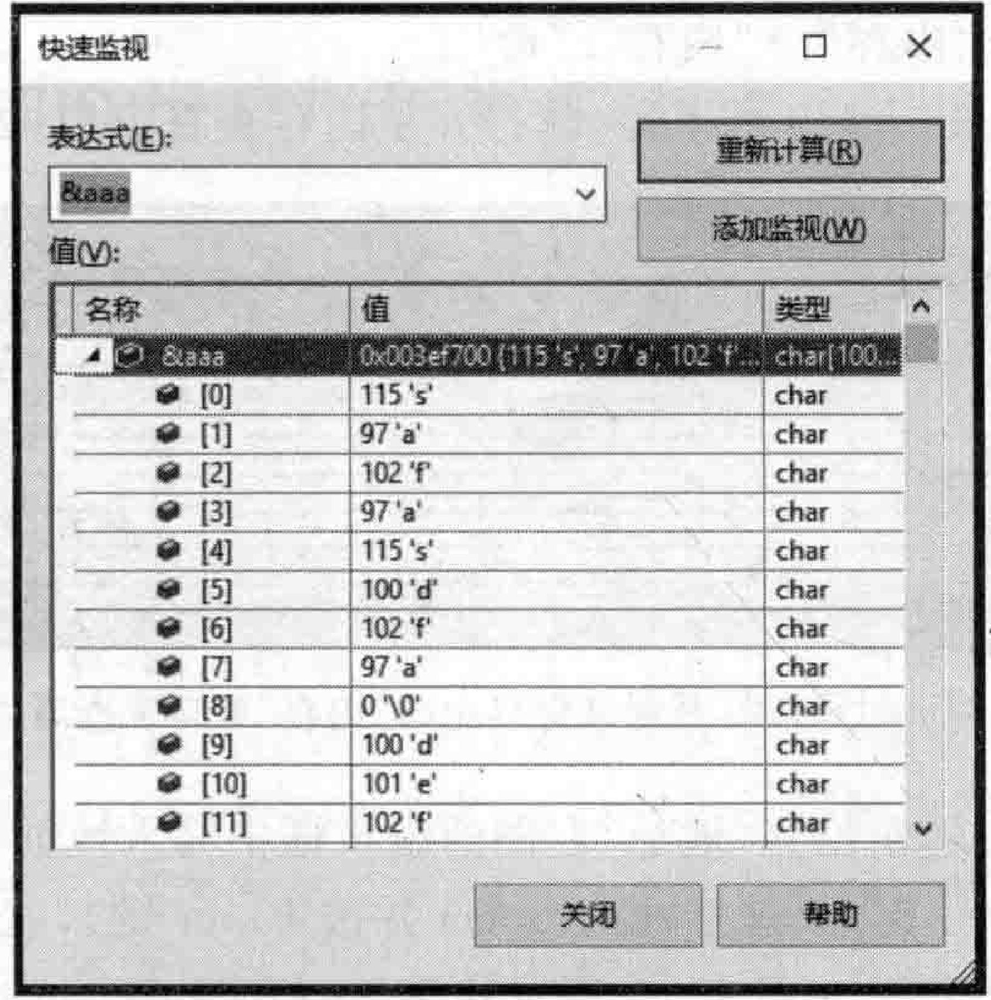

# 1.3 Visual Studio  

## 1.普通的断点调试（跟踪调试）  

首先介绍一下如何在VisualStudio2o19（其他VisualStudio版本也类似）中进行程序调试，程序调试对于日后顺利进行范例演示和讲解将起到极其重要的作用，同时也对读者理解所讲解的知识起到极其重要的作用，所以一定要掌握好程序调试的方法。  

（1）快捷键F9（对应“调试” $\twoheadrightarrow$ “切换断点”命令），用于给光标所在的行增加断点（设置断点）或取消该行已有的断点，断点行最前面会有一个红色的小圆球表示该行有一个断点，如图1.11所示，可以通过将光标定位到多个行并每次都按F9键来为多个行增加断点。一  

（2）快捷键F5（对应“调试” $\rightarrow$ “开始调试”命令），用于开始执行程序，遇到第一个断点行就停下来，如图1.12所示，程序停到了第8行，这个红色圆球中间多了一个向右指向的黄色小箭头，表示程序执行流程停正到了这一行（虽然停正到丁这一行，但是此刻这一行还没有被执行，表示即将要执行）。  

  
图1.11给某行增加断点后该行前面出现红色小圆球  

  
图1.12断点停止到了第8行  

（3）此时，因为程序执行流程已经停了下来，处于程序员（我们）的控制之中，所以就在此刻，可以多次使用快捷键F10（对应“调试” $\twoheadrightarrow$ “逐过程”命令），从当前停下来的这行开始一行一行地执行下去，一边逐行执行，一边可以观察程序的执行走向（例如，如果是条件语句就会因为不同的条件执行不同的分支）以及各种变量的值，从而达到调试的目的。  

（4）如果断点停在了一个自定义函数调用行，并且希望跟踪到这个函数里面的语句行中去，使用快捷键F11（对应“调试” $\twoheadrightarrow$ “逐语句”命令）就可以跳到函数中继续跟踪调试。  

如果想从当前所在的函数跳出去，使用快捷键Shift $\mathbf{+}$ F11（对应“调试” $\rightharpoondown$ “跳出”命令），就能够跳回到该函数的调用处并继续往下跟踪调试。  

## 2.学会调试时查看内存中的内容  

在调试程序时学会查看内存中的内容对于深人掌握 $\mathbf{C}/\mathbf{C}^{++}$ 语言编程好处巨大。下面是两行演示代码，按F9键把断点设置到如下的printf行：  

``` cpp
char aaa[1000] = "safasdfa\0def"; 
printf(aaa);
```

按F5键执行整个程序，使断点停在printf行上，则此时此刻就处于了调试程序中，如图1.13所示。  

在此种状态下，按下快捷键 $\mathrm{Alt}\,{\stackrel{+}{=}}\,6$ 或者选择“调试”  $\rightarrow$  “窗口”  $\rightarrow$  “内存”  $\rightarrow$  “内存1”命令，则在整个VisualStudio2019的下方，就打开了内存查看窗口，如图1.14所示。   

  
图1.13正处于调试程序状态中  

  
图1.14在调试时可以打开调试窗口中的“内存”窗口来查看内存中的内容  

只需要在图1.14左上角位置“地址”右侧的编辑框中输人地址符“&”，后面跟要查看的变量名，然后按一下Enter键（如这里输人&aaa并按Enter键），就可以看该变量的地址所代表的内存中的内容。当然，在图1.13所示的第78行，选中aaa这个变量名，直接按住鼠标左键往图1.14中左上角位置“地址”右侧的编辑框中拖动并按Enter键，也能达到查看aaa变量所代表的内存中内容的目的，如图1.15所示。一  

  
图1.15变量aaa在内存中的内容  

图1.15所示的“内存”窗口中，左上角的“地址”部分显示的 $\mathrm{0x00D3F288}$ 是变量aaa所代表的内存地址。往下看，分成三部分，左侧部分显示的内存地址，是变量aaa的地址和附近的内存地址：中间部分显示的是内存地址中保存的十六进制数字内容（是的，内存中保存的数据都是二进制数据，为了方便观察，VisualStudio2019中把这些二进制数据以十六进制形式显示出来，四位二进制数字显示为一位十六进制数字）；右侧部分显示的是内存中的十六进制数字所代表的一些字符，有些可显示字符会显示出来，对于不可显示的字符就用来代替。  

程序代码中的“safasdfa\0def”字样，与在内存中的内容进行比较，可以看到，“\0”这个转义字符在内存中显示的十六进制数学为00，其他的字符比如“a”这个字符在内存中显示的十六进制数字为61，十六进制的61正好是十进制的97，而十进制的97正好就是字符“a”的ASCⅡI码，所以在内存中存放一个字符时，存放的其实就是该字符的ASCII码。  

## 3.快速监视窗口  

当运行着的程序停到断点处时，也可以按Shift十F9键（对应“调试” $\rightarrow$ “快速监视”命令），并在其中输人要监视的变量内容，这样也是可以看到变量中所保存的数据的。例如，输人&aaa并按Enter键，可以看到aaa的地址，地址中的内容也是清晰可见，如图1.16所示。  

  
图1.16“快速监视”窗口用于快速查看变量的值、变量的地址等  

掌握了VisualStudio2o19中程序的调试方法，就可以在后面的学习中利用这些手段帮助自已快速掌握新知识。  

从下一章开始，就要真正进人到 $\mathrm{C++}$ 对象模型知识的学习和探索中去。在此之前，强烈建议读者把VisualStudio开发环境搭建好，因为本书所讲解的内容，如果读者能够亲自动手进行实践，那么学习效果可能要好上许多许多！