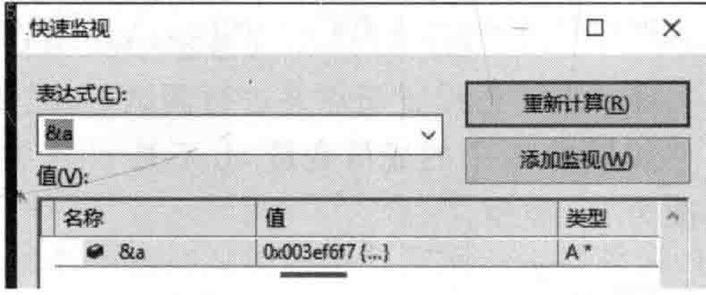
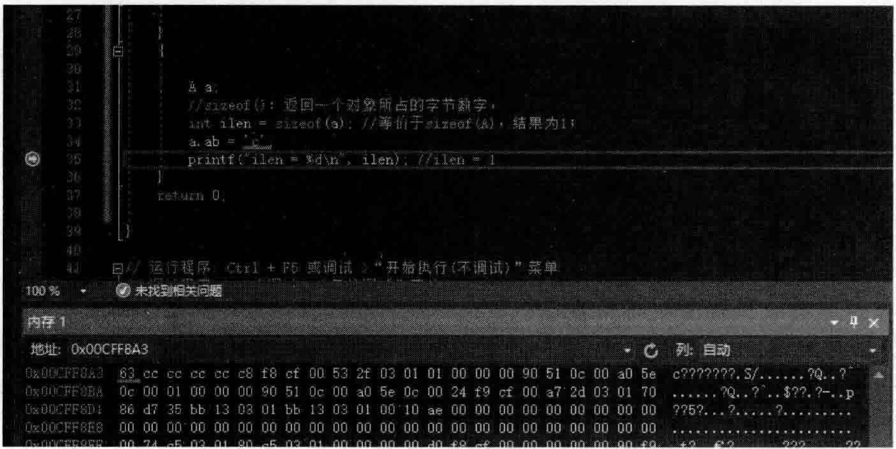
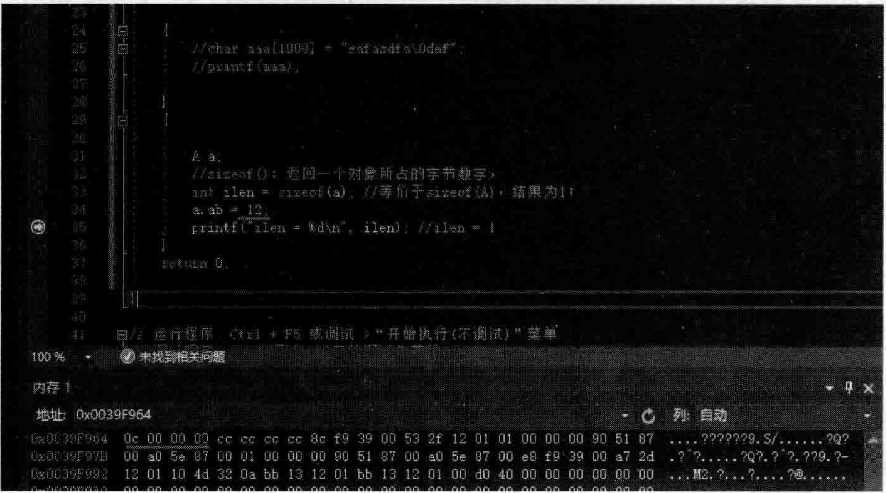

# 2.1 类对象所占用的空间  

## 第2章  对象  

本章的主题定位在“对象”。首先会介绍类对象所占用的空间问题，由这个基本问题引出对象结构的发展和演化。接看，介绍多重继承下的this指针调整，详细分析构造函数、拷贝构造函数、移动构造函数的语义。然后，探讨程序转化语义、程序的优化、深浅拷贝等话题。最后，详细讲解构造函数成员初始化列表的作用以及存在的意义。  

---

看看如下范例。在MyProject.cpp的上面，增加如下类A的定义代码：  

``` cpp
class A
{
public:
};
```

在main主函数中，增加如下代码：  

``` cpp
A a;
//sizeof()：返回一个对象所占的字节数字
int ilen = sizeof(a); //等价于sizeof(A)，结果为1
printf("ilen = %d\n", ilen); //ilen = 1
```

执行起来，看一看结果：  

``` cpp
ilen = 1  
```

为什么sizeof（a）的结果是1？如果按照直觉来讲，类A是一个空类，里面没有任何成员变量和成员函数，所以sizeof（a）的结果应该是O才对，但实际情况是sizeof（a）的结果为1，为什么？  

因为都知道，对象是有地址的。例如，Aa；代码行定义了类A的对象a，那么，&a 代表对象a的首地址，也就是该对象所对应内存的起始地址。设置断点行并跟踪调试，看一下这个对象a的首地址，如图2.1所示。  

可以看到，对象a是有地址的。内存中的一个地址单元里面保存的是1个字节的内容。所以说，即便是一个空类的对象，但是因为在内存中是有起始地址的，既然这个地址属于该对象，该对象必然最少能存得下一个字节，所以，即便sizeof（空类）或者sizeof（空类对象），得到的结果也不可能是0，而是1。这就好像买房子一样，别人向你买的房子有多大面积，你回答说是0平方米，那可能吗？只要是一个真实存在的房子，它肯定古空间，面积一定是大于0平方米。-房子的面积和计算机的内存一个道理，只要有内存地址，那就表示至少能存下一个学节。综合而言，sizeof（a）值为1，这个1的确切含义是：产生一个类A的对象时，这个对象所占用的内存大小是1个字节。   

  
图2.1在快速监视窗口中查看一个对象的地址  

现在，向类A中增加3个成员函数。增加后的类A代码如下：  

``` cpp
class A
{
public:
	void func() {};
	void func1() {};
	void func2() {};
};

```

再次计算一下sizeof（a），发现结果依旧是1字节。由此可以得到一个结论：类中的成员函数是不占用类对象内存空间的。注意这里笔者重点强调不占用的是“类对象的内存空间”。  

现在，继续往类A中增加一个成员变量 ab：  

``` cpp
public:
    char ab;
```

请想一想，这回sizeof（a）是多少个字节？  

现在已知两点：  

(1）成员函数不占类对象的内存空间。
(2）一个类对象至少占1字节内存空间。  

再次计算sizeof（a），发现结果依l旧是1字节。可能读者会觉得奇怪，空类的时候是1字节，增加了一个char类型成员变量后依旧是1字节，那么这次这1字节空间是谁的？当然是成员变量ab的，因为ab是char类型，char类型是占1个字节的。  

现在，在main主函数中增加一行给对象a的成员变量ab赋值的语句。完整的main主函数中的代码如下：  


``` cpp
A a;      
//sizeof()：返回一个对象所占的字节数字
int ilen = sizeof(a);     ////等价于sizeof(A)，结果为1
a.ab = 'c';  
printf("ilen = %d\n", ilen); //ilen = 1
```

在printf行设置断点并进行调试，如图2.2所示。

如果类A中的成员变量ab不是char类型而是int类型呢？把类A中的成员变量ab修改为int类型：

``` cpp
public: 
	int ab;
```


  
图2.2只占1个字节内存的对象a在内存中的内容是63（c  

再次修改main主函数中的给ab成员变量赋值的代码行。修改如下：  

``` cpp
a.ab=12;  
```

执行起来，看一看结果：  

``` cpp
ilen =4  
```

这次sizeof（a）等于4，那么这4字节的空间是谁的呢？当然是成员变量ab的，因为ab是int类型，int类型是占4个字节的，如图2.3所示。  

  
图2.3占4个字节内存的对象a在内存中的内容是0c000000（12）  

通过这些实践，能够得出一些结论：  

（1）成员变量是包含在每个对象中的，占字节的。  

（2）成员函数虽然也写在类定义中，但成员函数不占类对象的学节空间。也就是说，成员函数是跟着类走的，跟类对象没有关系，不管用这个类产生了多少个该类的对象。