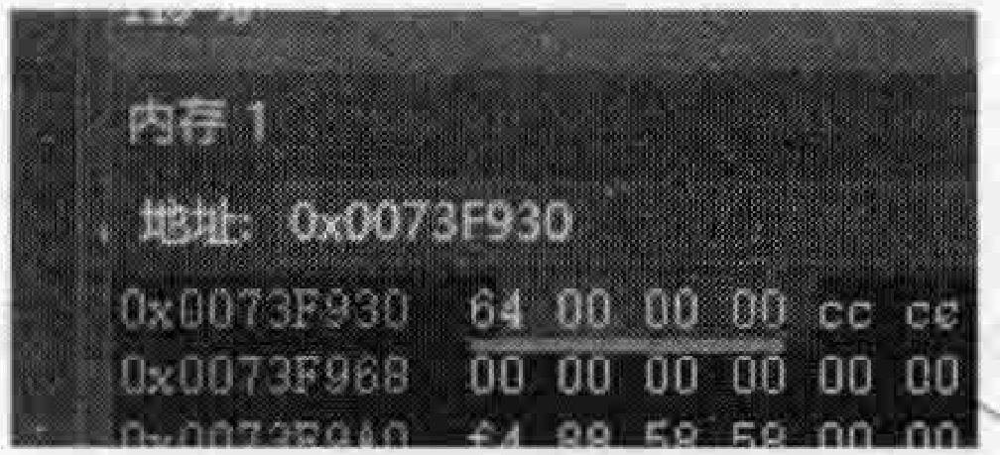
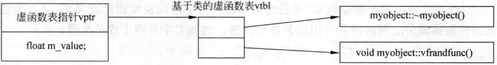
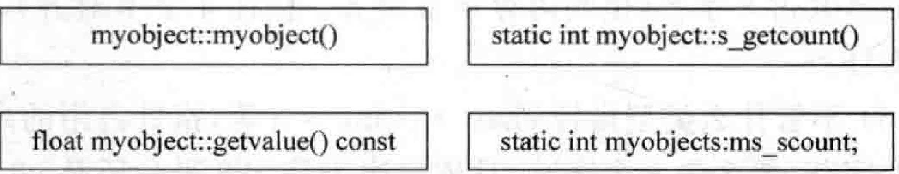

# 2.2 对象结构的发展和演化  

$\mathrm{C++}$ 对象的结构经过了多年的发展，诸多设计者提出了各种不同的见解和想法，取其精华，去其糟粕， $\mathrm{C++}$ 对象模型也就逐渐地建立起来了。  

以往在发展过程中的 $\mathrm{C++}$ 对象模型演化步骤在这里就不多谈了。下面主要谈的是当前正在采用的 $\mathrm{C++}$ 对象模型是一个什么样子。  

## 1.非静态的成员变量跟着对象走  

所谓非静态的成员变量跟着对象走，指的是非静态的成员变量保存在对象内部。也就是说，每个类对象都有自己的成员变量，什么叫都有自己的成员变量？也就是说，如果在类中定义了这个成员变量，那么sizeof这个类对象时，这个类对象占的内存就会因为这个成员变量的存在而增长。  

看看如下范例：  

``` cpp
class A
{
int a = 100; 
};
A aobj; //sizeof(aobj)=4
```

设置断点并进行跟踪调试，看看aobi所占用的4个字节内存，如图2.4所示。  

## 2.静态成员变量跟对象没有关系  

静态成员变量跟对象没什么关系，所以不会保存在对象内部，而是保存在对象外面。这里笔者使用类对象外面这种用词，表达所占用的内存空间和类对象无关的意思  

  
图2.4对象aobj所占用的4个字节内存  

看看如下范例：  

``` cpp
class A
{
static int a; 
static int b; 
};
A aobj;//sizeof(aobj)=1,不管几个静态成员变量，sizeof的大小不增加
```

## 3.成员函数  

不管静态的还是非静态的，全部都保存在类对象之外。所以不管几个成员函数，不管是否是静态成员函数，对象的sizeof值的大小都不增加。  

看看如下范例：  

``` cpp
class A
{
static void sfunc()(); 
void myfunc(){};
};
A aobj;//sizeof(aobj)=1
```

## 4.虚函数  

看看如下范例：  

``` cpp
class A
{
virtual void myfunc3(){}; 
virtual void myfunc4(){}; 
};
A aobj;//sizeof(aobj)=4
```

类中因为有了一个或者多个虚函数的存在，对象的sizeof会增加4字节，也就是该类对象所占的内存会多出4个字节。那为什么会多出4个字节？这4个字节是用来做什么的？看一看这个虚函数。  

首先，说类本身。一个类中只要有一个虚函数（或者说至少有一个虚函数），这个类就会产生一个指向虚函数的指针，有两个虚函数，这个类就会产生两个指向虚函数的指针。当然是每个虚函数一个指针，两个虚函数不就两个指针嘛！那如果这个类有一堆虚函数，那就有一堆指向虚函数的指针。一个指针也好，一堆指针也好，这些指针总得有个地方放。放哪里呢？放在一个表里，这个表称为虚函数表（virtualtable，简称vtbl），这个虚函数表一般保存在最后生成的可执行文件中，在程序执行的时候载人到内存中。  

再说一说类对象。刚才已经看到，无论往类中增加几个虚函数，类对象的sizeof只会增加4个字节。这4个字节的增加，其实是因为虚函数的存在，导致系统往类对象中添加了一个指针，这个指针正好就指向这个虚函数表，这个指针的名字叫作虚函数表指针（virtualtablepointer，简称为vptr）。什么时候这个vptr会有值以及什么时候这个值会重置等等，系统内部会做这些事。在哪些函数中做呢？一般就是在构造函数、析构函数、拷贝赋值运算符里等。  

总结一下：  

（1）静态成员变量不计算在对象的sizeof内。  

（2）普通成员函数和静态成员函数不计算在sizeof内。  

（3）虚函数不计算在对象的sizeof内，但虚函数会让对象的sizeof增加4字节以容纳指向虚函数表的指针。  

（4）虚函数表是基于类的（跟着类走，不是基于对象的）。  

（5）如果类中有多个数据成员（成员变量），那么为了访向速度和性能考虑，某些编译器可能会将数据成员之间的内存占用比例进行调整。例如类中有两个成员变量：  

``` cpp
char a;
//1字节
int b;
//4字节
```

两者本来共占5字节，但因为挨在一起，可能系统就会给char分配成4字节（32位），这两个成员共占8字节（也叫内存字节对齐：都往4字节对齐），以后读者见到这种情况不用感到奇怪。  

(6) 不管什么类型指针 char $* p 、 i n t * q$ 等, 指针占用的内存大小是固定的。一般要么是 4 个字节, 要么是 8 个字节, 具体取决于是 x86 平台还是 x64 平台 (32 位操作系统还是 64位操作系统)。看看如下范例:

``` cpp
int ilen2 sizeof(char *)//4，如果在Linux操作系统下可能会是8字节
int ilen3 sizeof(int *)//4
```


下面通过一个完整的代码整理一下讲过的知识。在 MyProject.cpp 的上面, 定义一个名字叫作 myobject 的类。

``` cpp
class myobject
{
public:
myobject(){};//构造函数 
virtual ~myobject(){};//析构函数 
float getvalue()const//普通成员函数 
{
return m_value;
}
static int s_getcount()//静态成员函数 
{
return ms_scount;
}
virtual void vfrandfunc(){};//虚函数 
protected:
float m value;//普通成员变量 
static int ms_scount;//静态成员变量 
 };
```


在main主函数中，加人如下代码：  

``` cpp
myobject obj;
int ilen sizeof(obj); 
cout << ilen << endl;//8
```

从结果可以看到，ilen的值为8。因为（以下笔者的描述均是在 $\mathbf{x86}$ 平台下）：  

（1）float m value；占4字节。  

（2）因为有虚函数在（本类有两个虚函数），系统会往类对象中添加一个指向虚函数表的指针，这个指针占4个字节。  

然后，看一看对象模型到底长什么样，如图2.5所示。  

  

  
图2.5对象obj的对象模型  

如果读者看不懂图2.5，不要紧，随着后面的学习，慢慢地就可以看懂该图。  

在图2.5中，左上角是对象obj，占8个字节，包含一个虚函数表指针vptr和一个成员变量m_value。虚函数表指针指向一个虚函数表vtbl，vtbl中有两项（两个指针）分别指向类myobject的两个虚函数的首地址。类myobject中其他的成员函数和成员变量绘制在图2.5的下面偏右的位置。当类的对象要调用虚函数的时候，实际上是通过虚函数表指针找到类的虚函数表，通过类的虚函数表就能够调用到类的虚函数。虚函数表的这种设计是 因为要支持面向对象程序设计的三大特性之一“多态性”，后面会慢慢讲解。  

属于对象obj的只有成员m_value（占4字节）和一个虚函数表指针vptr（占4字节），其他的全部都属于类myobject。  

这种布局（模型）的优点是它的空间占用适当，数据存取效率比较高。成员函数有独立的内存地址，与类对象无关，可以直接调用（成员函数的调用还是需要类对象参与的）。成员变量数据就保存在对象自己的内存中，所以存取效率是比较高的。中  

总结一下一个类对象大小的组成（一个类对象的sizeof值）：  

（1）非静态成员变量所占的内存总量和这些成员变量之间内存字节对齐所额外占用的内存。“，  

（2）若有虚函数，则会产生虚函数表指针vptr。  

当然，如果是类之间的多重继承关系在，并且每个父类都有虚函数，那么子类的情况还有不同，这个后面章节会继续讲解。