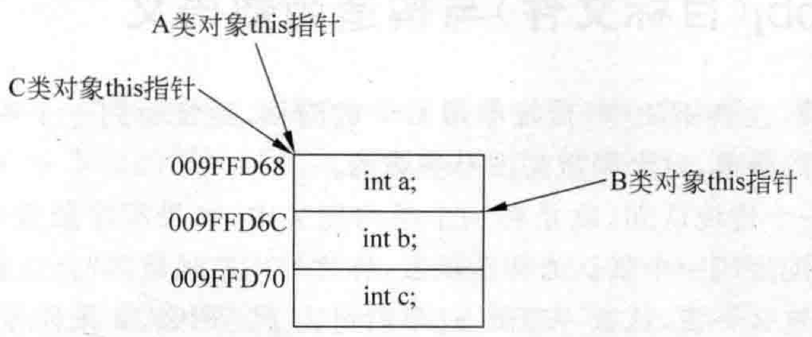

# 2.3 this指针调整  

this指针调整这件事，一般存在于多重继承的情况下。

这里笔者直接进行代码演示。在MyProject.cpp前面，增加两个基类和一个派生类：  


``` cpp
class A
{
public:
	int a;
	A()
	{
		printf("A::A() 的 this指针是：%p!\n", this);
	}
	void funA() { printf("A::funcA: this = %p\n", this); }

};

class B
{
public:
	int b;
	B()
	{
		printf("B::B() 的 this指针是：%p!\n", this);
	}
	void funB() { printf("B::funcB: this = %p\n", this); }

};

class C : public A, public B
{
public:
	int c;
	C()
	{
		printf("C::C() 的 this指针是：%p!\n", this);
	}
	void funC() { printf("C::funcC: this = %p\n", this); }
	
};

```

在main主函数中，加入如下代码：

``` cpp
cout << sizeof(A) << endl;
cout << sizeof(B) << endl;
cout << sizeof(C) << endl;
C myc;
myc.funA();
myc.funB();
myc.B::funB();
myc.funC();
```

执行起来，看一看结果：  

``` cpp
4
4 12
A::A()的this指针是：009FFD68! 
B::B()的this指针是：009FFD6C! 
C::C()的this指针是：009FFD68! 
A: funcA: this 009FFD68 
B: funcB: this 009FFD6C 
C: funcC: this 009FFD68
```

分析一下上面的结果：  

（1）前3行结果是4、4、12。这是因为，A类对象（这里也可以说成是A类）占4字节（inta；成员），B类对象占4个字节（intb；成员），而C类，因为继承自A类和B类，并且C类还有一个自己的成员变量c，因此C类对象占4（A类） $+4$ （B类） $+40$ （成员变量 $c)=12$ 字节。  

（2）接着3行的结果是执行代码行Cmyc；所致。这里要注意，执行的3个类的构造函数，父类（基类）A类构造函数的this指针与父类B类构造函数的this指针不同，差了4个字节，而C类构造函数的this指针与A类构造函数的this指针相同。  

（3）然后调用 funcA、funcB、funcC 三个成员函数,在其中打印出来的 this 指针也不同,执行 funcA 的时候得到的结果是 $A: \cdot$ funcA: this $=009 F F D 68$ ( $A$ 类子对象空间)。而执行 funcB 的时候得到的结果是 $B: \cdot$ funcB: this $=009 F F D 6 C$ ( $B$ 类子对象空间)。读者不难发现，在执行funcB的时候，this指针从原来的009FFD68调整成了009FFD6C，这属于编译器内部自动调整这个this指针。而在执行funcC的时候，通过得到的结果C：：funcC：this009FFD68（C类对象空间，也是A类对象空间）可以看到，this指针又调整回009FFD68了。  

读者注意，子类C同时继承了父类A和父类B，注意继承顺序。看代码行classC：publicA，publicB可以知道，C类是先继承A类，再继承B类，这个继承顺序很重要。所以子类C的this指针才跟父类A一样（因为先继承父类A）。绘制一张图看一看这种多重继承关系的感受，如图2.6所示。  

  
图2.6多重继承时对象布局中this指针的调整  

读者都知道，派生类（子类）对象是包含着基类子对象的。如果这个派生类只从一个基类继承，那么，这派生类对象的地址和基类子对象地址相同。但如果派生类对象同时继承多个基类，那么就要注意一下，第一个基类子对象的起始地址和派生类对象起始地址相同，后续的这些基类子对象的起始地址和派生类对象的起始地址相差多少呢？相差前面那些基类子对象所占用的内存空间（单位：字节）。所以在图2.6中，可以注意到，B类子对象的起始地址是加了4个字节的，因为A类子对象是占4个字节的。  

（4）从图2.6能观察到this指针的调整问题。当执行myc.funcA（）；和myc.funcC（）；代码行时，this指针是009FFD68，这两行的this值相同，这是因为基类A子对象和子类C对象的起始地址相同，也就是this指针相同。当执行myc.funcB（）；代码行时，因为funcB是属于基类B的成员函数，那么基类B子对象的this指针就被编译器自动调整成了009FFD6C，与子类C对象的this指针相差4字节，这4字节正好是基类A子对象的大小。  

那么，同理，如果在C类中覆盖B类的同名函数funcB：  


``` cpp
public:
void funcB(){printf("C::funcB:this =%p\n",this);}//定义在C类中
```

在main主函数中，在myc.funcB（）；代码行之后，增加如下一行代码：

``` cpp
myc.B::funB();
```

执行起来，看一看结果：  

``` cpp
4
4 12
A::A()的this指针是：009FFD68! 
B::B()的this指针是：009FFD6C!
C::C()的this指针是：009FFD68! 
A: funcA: this =009FFD68 
C: funcB: this =009FFD68 
B:: funcB: this 009FFD6C 
C: ： funcC: this = 009FFD68
```

总结一下：调用哪个子类的成员函数，这个this指针就会被编译器自动调整到对象内存布局中对应该类子对象的起始地址那去。