# 2.4分析obi（自标文件）与构造函数语义  

提起构造函数，读者不陌生，传统学习 $\mathrm{C++}$ 的时候，经常听到一个叫作“默认构造函数（缺省构造函数）”的函数，这个函数是没有参数的。  

以往一直有一个传统认知，就是在一个类的定义中，如果程序员没有定义任何构造函数，编译器会隐式地生成一个默认的构造函数，称这种构造函数为“合成默认构造函数”。  

一般来进.听这么一说，这么一理解，这事就过去厂。那么，如果程序员没有定文任何构造函数，编译器到底是否会生成一个“合成默认构造函数”呢？本节就探究一下这件事。：  

首先，笔者先给出结论：这种“合成默认构造函数”，只有在必要的时候，编译器才会为程序员合成出来，而不是必然或者必须合成出来。所以，问题的焦点在于“必要”这个词，这就是本节研究的重点：必要的时候是什么时候。  

先讲解一点前提知识：  

在 $\mathrm{C++}$ 中，要生成一个可执行文件，需要经过编译、链接的步骤。一个.cPp源码文件（也可能是其他扩展名的源码文件），经过编译，就生成了一个.obi（或者.o）文件，这个文件也叫作自标文件，也就是说，obi文件是编译的结果文件，而最终生成的可执行文件是把这些.obj文件连接起来生成的。  

所以，一般来说，一个.cpp文件，编译一下，就生成了一个.obi文件。  

.cpp文件是 $\mathrm{C++}$ 源码文件，这个读者应该都了解，那么.obi文件呢？.obj文件既然是编译器编译.cpp文件生成的，那有的时候不免也希望看一看编译器生成的.obi文件长什么样子。：obi文件属于二进制文件，不能直接看，但可以借助一些工具来看。  

这里笔者以Windows平台工具为例，介绍一下.obi文件如何查看。Linux等平台也能找到相关的工具查看，请读者注意寻找。  

看看如下范例。在MyProject.cpp的上面定义两个类，代码如下：  

``` cpp
class MATX  
{  
public:  
    MATX() //默认构造函数  
    {  
       cout << "goodHAHAHA" << endl;  
    }  
};

class MBTX  
{  
public:  
    int m_i;  
    int m_j;  
  
    void funct()  
    {  
       cout << "Iamverygood" << endl;  
    }  
};
```

在main主函数中，加入如下代码行：

``` cpp
MBTX myb;
```

然后，通过“生成” $\rightarrow$ “生成解决方案”命令来编译一下当前的项目。等待几秒到几十秒，当VisualStudio2019下面的“输出”窗口提示“成功1个”字样的时候，就代表一个.obj文件（MyProject.obj）生成了。  

下面就是找到这个.obj文件的位置。Visual Studio 2019 My Project.cpp文件名标签并在弹出的快捷菜单中选择“打开所在的文件夹”命令，如图2.7所示。  

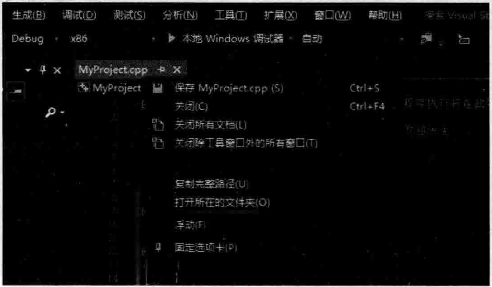  
图2.7寻找MyProject.cpp文件所在的文件夹  

此时，操作系统会弹出“文件资源管理器”窗口，并定位到MyProject.cpp所在的文件夹，进人其中的Debug子文件夹，就可以找到MyProject.obj文件，如图2：8所示。  

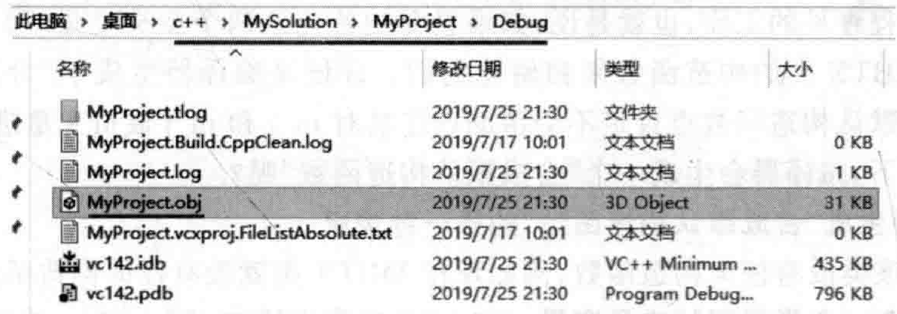  
图2.8MyProject.obj文件所在的文件夹  

MyProject.obj文件就是目标文件（在Linux平台下扩展名也许是.o）。在Linux下使用 $\mathbf{g}^{++}$ 编译器的读者可以使用-c参数来生成.o文件。  

然后需要打开开发人员命令行工具（DeveloperCommand Prompt··），Visual Studio 2019（或者其他版本的VisualStudio）一般都会带有该命令行工具，可能需要在Windows操作系统左下角的“开始”菜单中进行寻找，如图2.9所示。  

在这个命令行提示符下可以直接使用dumpbin命令行工具，不然还要自已去查找dumpbin这个工具的位置。  

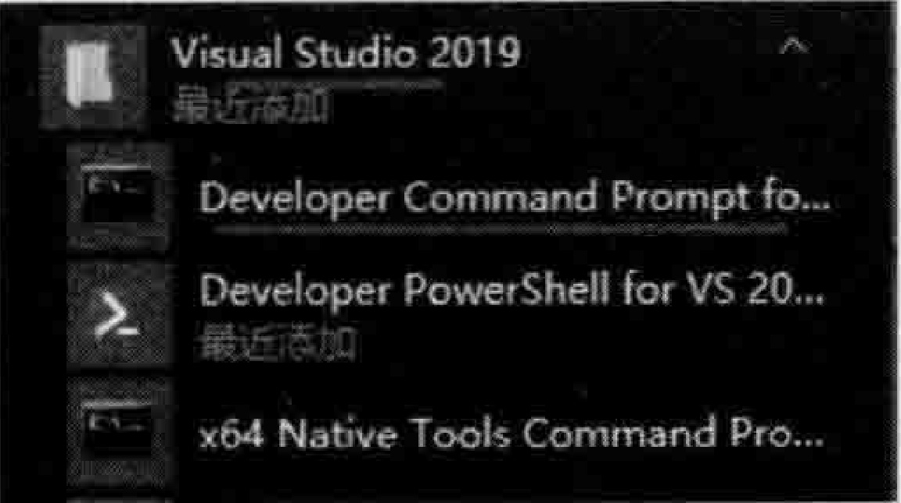  
图2.9Visual Studio 2019命令行工具  

在命令行提示符下进人到MyProject.obj文件所在的路径，并输人dumpbin/all My Project.obj $>$ MyProject.txt，如图2.10所示。  

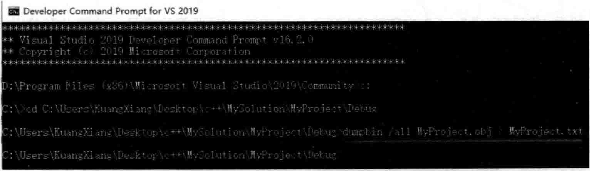  
图2.10在VisualStudio2019命令行工具中用dumpbin将.obj文件的可视化信息导出到.txt文本文件中  

此时，在与MyProject.obj相同的文件夹下，就会产生一个MyProject.txt文件。这样，就把MyProject.obj二进制文件中的可视化信息导人到了MyProject.txt文本文件中。这个文本文件可以直接使用VisualStudio打开查看。  

.obi文件的格式一般会被认为是一种COFF一通用对象文件格式（Common Obj ec iFileFormat）。这里不详细研究.obj文件的格式。  

通过查看MyProject.txt文件中的内容，能看到.obj文件中保存的诸多信息。  

在MyProject.txt文件中，按 $\mathrm{Ctrl+F}$ 快捷键查找MBTX：：MBTX字样看是否有MBTX的构造函数，此时并没有发现，也就是说，编译器根本就没有合成出该函数来。  

那么现在就要回归话题：编译器在哪些必要的时候会帮助程序员生成“合成默认构造函数”？  

这里笔者要提醒读者注意类MBTX中的 $\mathrm{m\_i}$ 和 $\mathrm{m\_j}$ 这两个成员变量的初始化，这个初始化工作是程序员的工作，也就是说，如果想要初始化这两个成员变量，那么程序员就要自已手工写MBTX类的构造函数来初始化它们。即便是编译器生成了“合成默认构造函数”，这个合成默认构造函数也肯定不会帮助程序员对 $\textrm{m}_{-}\textrm{i}$ 和 $\mathrm{~m~}_{\mathrm{~j~}}$ 成员变量进行初始化。  

什么情况下，编译器会生成一个“合成默认构造函数”呢？

## 1.编译器生成“合成默认构造函数”的第一种情况

（1）如果该类没有任何构造函数，例如现在MBTX类就没有任何构造函数。  

（2）但包含一个类类型的成员变量。在MBTX类中增加一个public修饰的MATX类型的成员变量：  

``` cpp
public:  
    MATX ma;  //类类型成员变量
```

（3）而ma成员变量所属的MATX类有一个默认构造函数。笔者已经看到，当前在MATX类中确实已经有了一个默认构造函数。  

编译链接，执行程序，看一看结果：  

``` cpp
goodHAHAHA  
```

这里可以注意到，MATX的构造函数被执行（被调用）了。  

根据上面的结果可以断定，编译器为类MBTX生成了一个“合成默认构造函数”，生成这个“合成默认构造函数”的目的是在这个“合成默认构造函数”中安插（增加）代码（编译器自动安插的代码，不需要程序员干预）来调用MATX的默认构造函数。  

通过“生成” $\rightarrow$ “生成解决方案”命令来编译一下当前的项目，重复上述的步骤，使用dump bin My Project.obj My Project.txt中，再次查找MBTX：：MBTX字样，这回可以找到了，如图2.11所示。  

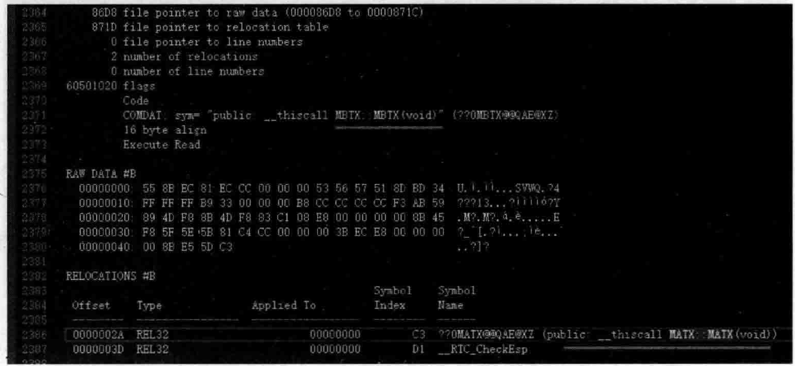  
图2.11编译器为MBTX生成了“合成默认构造函数”并调用了其他构造函数  

在图2.11中，因为对这里面的格式不太了解，所以可以边看边猜，MBTX：：MBTX（编译器生成的合成默认构造函数）里面，调用了MATX：：MATX构造函数（看图中RELOCATION S MAT X：：MATX字样，表示的就是调用关系）。  

现在再丰富一下整个范例。在MyProject，cpp的前面，类MBTX上面，增加一个新类M0TX的定义，该类也有默认构造函数：  


``` cpp
class M0TX  
{  
public:  
    M0TX()//默认构造函数  
    {  
       cout << "Ogood!" << endl;       
    }  
};
```

接着，在MBTX类中，再增加一个public修饰的MoTX类型的成员变量。现在，在 MBTX类中，就有了两个类类型的成员变量：  

``` cpp
public:  
    MATX ma;  //类类型成员变量  
    M0TX m0; //注意定义顺序，先定义的ma，再定义的m0
```

执行起来，看一看结果：  

``` cpp
goodHAHAHA
Ogood!
```

再次重复上面的dumpbin步骤，查看此时生成的MyProject.txt中的内容，并再次查找MBTX：：MBTX字样，当然还是可以找到，如图2.12所示。  

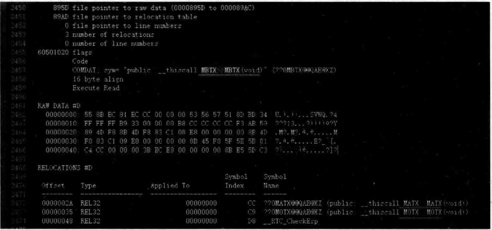  
图2.12编译器为MBTX生成了“合成默认构造函数”并调用了其他构造函数  
在图2.12中，不但看到编译器生成了“合成默认构造函数”（MBTX：：MBTX），在RELOCATIONS 里还看到了MBTX::MBTX调用了MATX::MATX 和M0TX::M0TX。

注意调用顺序。这里MBTX：：MBTX先调用的是MATX：：MATX，然后才调用M0TX：：M0TX，之所以是这样的调用顺序，是因为在MBTX类中，成员变量ma的定义在m0之前。如果调整MBTX类中这两个成员变量的定义顺序如下：

``` cpp
public:  
    M0TX m0; //调换成员变量定义顺序  
	MATX ma;  //类类型成员变量
```

再次编译项目，dump bin My Project.obj My Project.txt中并在该.txt中查找MBTX：：MBTX，如图2.13所示。  

在图2.13中可以注意到，这回MBTX：：MBTX先调用M0TX：：M0TX，后调用MATX::MATX  

执行起来，看一看结果：  

``` cpp
Ogood!  
goOdHAHAHA  
```

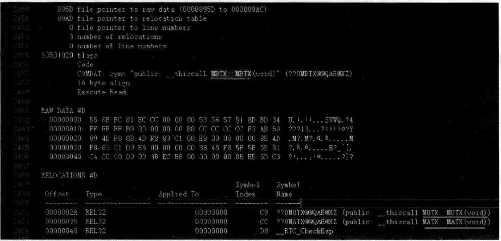  
图2.13编译器为MBTX生成了“合成默认构造函数”并调用了其他构造函数  

## 2.编译器生成“合成默认构造函数”的第二种情况  

（1）父类带有默认构造函数。（2）子类没有任何构造函数。  

当创建一个子类对象时，父类这个默认的构造函数是要被调用的，所以，编译器会为该子类生成一个“合成默认构造函数”，用以向其中安插代码来调用父类的默认构造函数。  

看看如下范例。这里就拿MBTX作为子类，然后引入MBTXPARENT作为父类，在MyProject.cpp的前面，增加MBTXPARENT类的定义：


``` cpp
class MBTXPARENT  
{  
public:  
    MBTXPARENT()  
    {  
       cout << "MBTXPARENT()构造函数执行了" << endl;  
    }  
};
```

改造MBTX类，注释掉其中的m0和ma成员变量并继承自MBTXPARENT类：

``` cpp
class MBTX:public MBTXPARENT  
{  
public:  
    int m_i;  
    int m_j;  
  
    void funct()  
    {  
       cout << "Iamverygood" << endl;  
    }  
};
```

main主函数中，保持下面这行代码不变：  

``` cpp
MBTX myb;  
```

执行起来，看一看结果：  


``` cpp
MBTXPARENT（）构造函数执行了
```


从结果可以看到，程序是调用了父类的构造函数的。看一看调用关系，编译，用dump bin My Project.obj My Project.txt文件并观察，如图2.14所示。  

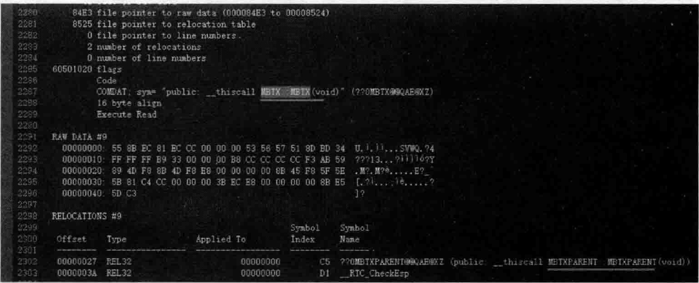  

图2.14编译器为MBTX生成了“合成默认构造函数”并调用了父类MBTXPARENT的构造函数  

在图2.14中，MBTX：：MBT X MBT X PARENT：：MBTXPARENT。读者可以动手实践一下：如果MBTX类不继承自MBTXPARENT，编译器是否还会为MBTX类生成“合成默认构造函数”？  

## 3.编译器生成“合成默认构造函数”的第三种情况  

（1）一个类含有虚函数。
（2）该类没有任何构造函数。

改造MBTX类，改造后的MBTX类代码如下：  

``` cpp
class MBTX
{  
public:  
    int m_i;  
    int m_j;  
  
    void funct()  
    {  
       cout << "Iamverygood" << endl;  
    }  
    virtual void mvirfunc() //虚函数  
    {  
       cout << "mvirfunc" << endl;  
    }  
};
```

编译，dump bin My Project.obj My Project.txt文件观察，如图2.15所示。  

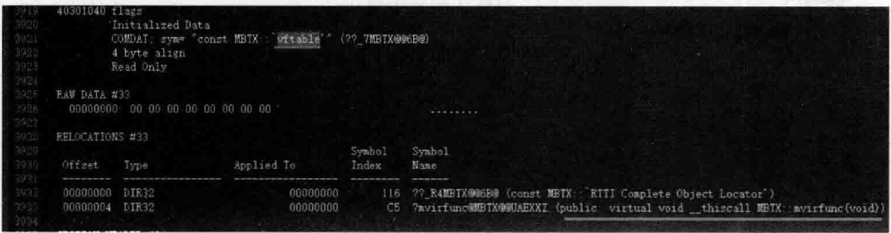  
图2.15编译器为MBTX类生成了虚函数表  

请注意，因为类MBTX中虚函数的存在，编译器会为该类生成一个虚函数表（vftable/vtb1），里面记录该类中各个虚函数的首地址。虚函数相关的概念会在后面章中详细介绍，所以本节内容如果读者看不太懂可以做个标记，等把虚函数这一章学完，回头再看本节内容，可能就一目了然了。  

同时，也是因为类MBTX中虚函数的存在，编译器为MBTX类生成了“合成默认构造函数”，如图2.16所示。  

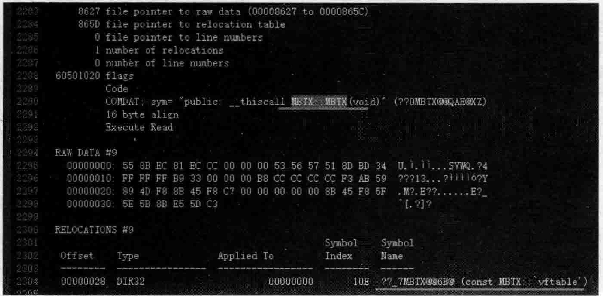  
图2.16编译器为有虚函数的MBTX类生成了“合成默认构造函数”  

编译器同时为这个合成默认构造函数安插了代码，代码其实是一个赋值语句，用于**把类MBTX的虚函数表地址赋给类对象的虚函数表指针**（读者可以把虚函数表指针看成是一个 隐藏的成员变量，隶属于类对象）。因为虚函数的调用存在“多态”的问题，所以需要用到虚函数表指针，后面章节会详细介绍虚函数表和虚函数表指针，这里先有个大概印象就行。  

现在，再次改造MBTX类，MBT X MBT X PARENT，然后给MBTX类增加一个默认构造函数。这里注意观察，看一看编译器往程序员自己写的这个默认构造函数中安插了什么代码，用来做什么事情。改造后的MBTX类代码如下：  

``` cpp
class MBTX:public MBTXPARENT  
{  
public:  
    int m_i;  
    int m_j;  
  
    MBTX() //缺省构造函数  
    {  
       m_i = 15;  
    }  
  
    void funct()  
    {  
       cout << "Iamverygood" << endl;  
    }  
    virtual void mvirfunc() //虚函数  
    {  
       cout << "mvirfunc" << endl;  
    }  
};
```

编译，用dumpbin 导出MyProject.obj对应的MyProject.txt文件并观察，如图2.17 所示。

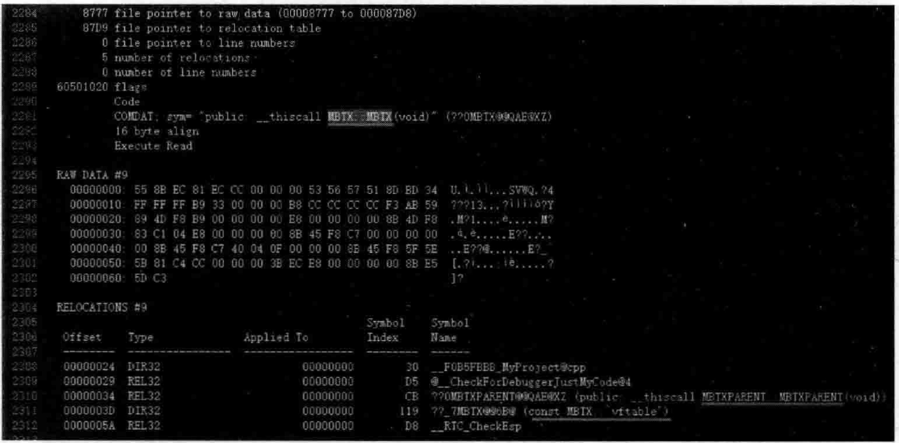  
图2.17编译器向程序员自己写的默认构造函数中安插代码调用父类构造函数和给虚函数表指针赋值  

前面说过，因为类MBTX中虚函数的存在，所以编译器为MBTX类生成了一个虚函数表，然后，编译器往MBTX的默认构造函数中安插了代码。这些代码看起来做了下面的事情：
 (1)调用了父类构造函数MBTXPARENT::MBTXPARENT。
（2）因为MBTX类中有虚函数存在，把MBTX类的虚函数表地址赋值给该类对象的虚函数表指针。

不过在图2.17中体现不到（看不到）代码行mi=15；的执行，可以考虑换一种方式观看该代码行的执行情况。

在MBTX类的构造函数中，在代码行m_i=15；设置一个断点，按F5键执行程序，当断点停留在m_i=15；代码行时，切换到反汇编窗口（菜单命令：“调试”→“窗口”→“反汇编”），不懂汇编语言也没关系，猜一猜这些汇编语言代码也同样可以达到学习效果，如图2.18所示。  

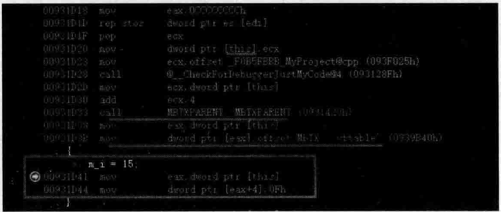  
图2.18观察反汇编窗口中MBTX类构造函数内所执行的代码行  

从图2.18可以看到，当程序员书写了自已的默认构造函数时，编译器会根据需要扩充该构造函数，向其中安插必要的代码，例如加入调用父类MBTXPARENT构造函数的代码，加人给虚函数表指针赋值的代码。  

所以，编译器是默默地做了很多事情的：在程序员没有书写默认构造函数时会根据需要决定是否帮助程序员生成“合成默认构造函数”。当程序员书写了自己的默认构造函数时会根据需要安插必要的代码来完成一些特定的事情。  

## 4.编译器生成“合成默认构造函数”的第四种情况  

如果一个类带有虚基类，编译器也会为它生成一个“合成默认构造函数”。

可以把以往的代码注释掉，专门写一段虚基类相关的代码。  

读者都知道，虚基类实际是通过两个直接基类继承同一个间接基类。所以一般是图2.19的样子，是一个三层结构，有爷爷类Grand，有两个父亲类A和A2，有孙子类C，这样才能构成虚基类（虚继承）。  

想一想，在默认（常规）情况下，派生类对象中含有继承链上的每个类的子对象。那么，如果某个类（Grand）在派生过程中多次出现，那么，派生类（C）对象就会包含该类子对象多次，这样，不但多余，占空间，还可能产生名字冲突等问题。  

例如，如果定义了一个C类对象，想访问Grand类的成员mgrand，访问这个成员可以走路线 $\mathrm{C}^{\rightarrow}$ $\mathrm{A}\!\rightarrow$ Grand：：mgrand，也可以走路线 $\mathrm{C}{\rightarrow}\mathrm{A}{2}{\rightarrow}$ Grand：：mgrand，这种访问编译器也会直接报错，访问不明确（也就是名字冲突），因为Grand类被继承了两次，因此，在C类对象中有两个Grand类子对象（一次是从A继承来的，一次是从A2继承来的）。  

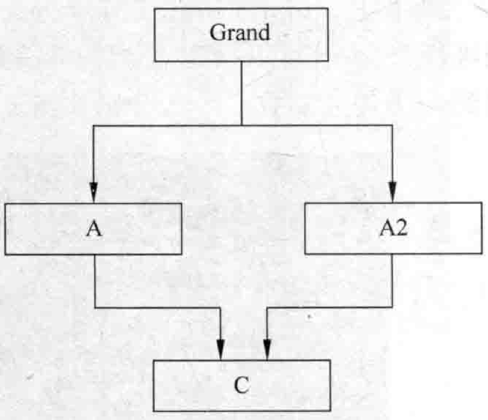  
图2.19虚继承的继承层次关系图  

而且，必须要明确的是，因为有了这个C类，并且生成了C类的对象，才导致Grand类被继承两次。  

所以引入了虚基类的概念，这个概念的特点就是无论Grand类在继承体系中出现多少次，在派生类C对象中都只会包含唯一一个该虚基类（Grand）的子对象内容。所以，如果Grand类有这个特点，那么Grand就是一个虚基类。派生类C对象中只包含一个Grand子对象。  

这样，如果想访问Grand类的成员m_grand，不管走路线 $\mathrm{C}{\rightarrow}\mathrm{A}{\rightarrow}$ Grand::m_grand,还是走路线 $\mathrm{C}{\rightarrow}\mathrm{A}{2}{\rightarrow}$ Grand：：m_grand，都是没问题的，反正Grand子对象只有一个。  

那么虚基类（虚继承）的代码怎样写呢？  

在MyProject.cpp的上面，增加如下代码，一共定义4个类：  

``` cpp
class Grand //爷爷类  
{  
public:  
};  
class A : virtual public  Grand  //注意virtual {  
public:  
};  
class A2 : virtual  public  Grand //注意virtual {  
public:  
};  
class C :public A, public A2 //这里不需要virtual  
{  
public:  
};
```

在main主函数中，增加如下代码：


``` cpp
C cc; //生成C类对象
```

编译，用dumpbin导出MyProject.obj对应的MyProject.txt文件并观察，利用查找功 能进行查找，既可以找到A类构造函数A：：A，也可以找到A2类构造函数A2：：A2，还可以找到C类构造函数C：：C，分别如图2.20～图2.22所示。

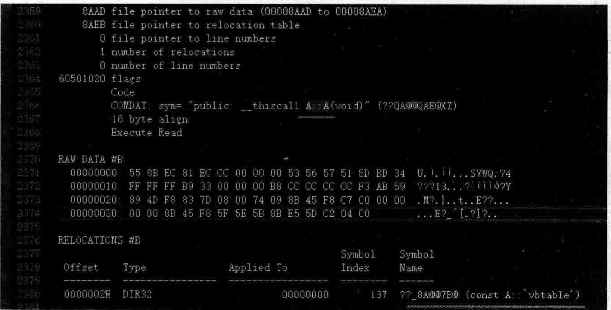  
图2.20编译器为类A生成了“合成默认构造函数”  

前面涉及一个vftable（vtbl/虚函数表），这里又涉及一个vbtable（虚基类表），vbtable是跟虚基类有关的表，后面章节讲到虚基类的时候再详细阐述，这里先不做过多说明。  

但是请注意，这种虚基类结构，编译器会为子类和父类都生成“合成默认构造函数”。  

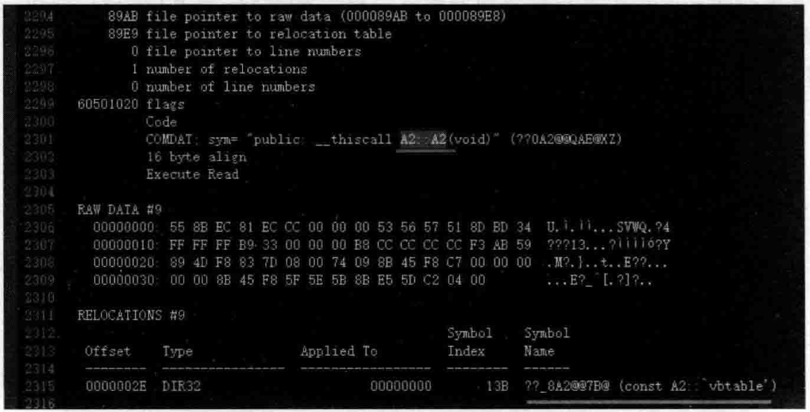  
图2.21编译器为类A2生成了“合成默认构造函数”  

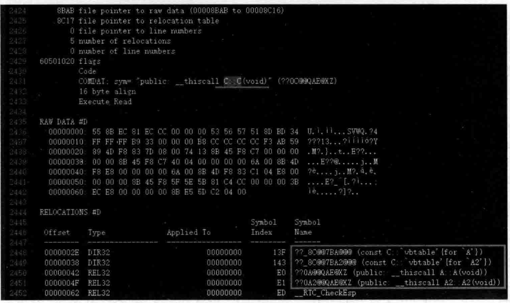  
图2.22编译器为类C生成了“合成默认构造函数”  

熟悉汇编语言的读者，想研究一下编译器到底在调用类C构造函数之前做了什么事，当然是可以的。这里可以给类C手工增加一个默认构造函数。完整的类C定义修改成下面的样子：  


``` cpp
class C :public A, public A2 //这里不需要virtual  
{  
public:  
    C()  //默认 构造函数  
    {  
       cout << "C::C()默认构造函数执行了" << endl;  
    }  
};
```

按F9键将断点设置在类C默认构造函数中cout语句行，按F5键运行程序，当断点停到类C默认构造函数中的cout语句行时，切换到反汇编窗口（菜单命令：“调试” $\rightarrow$ “窗口” $\twoheadrightarrow$ “反汇编”），看一看编译器向构造函数中额外增加了什么代码，如图2.23所示。  

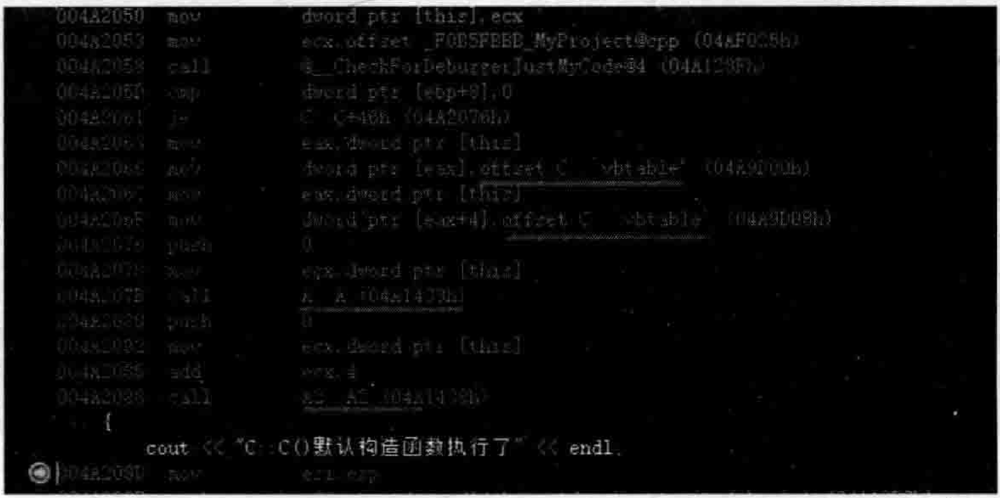  
图2.23编译器向程序员自已写的类C默认构造函数中安插代码  

看起来这些额外增加的代码就是给虚基类表指针赋值以及调用父类的构造函数。其他的就不多说。  

## 5.编译器生成“合成默认构造函数”的第五种情况  

如果在定义成员变量的时候赋初值， $\mathrm{C++}$ 11支持这种新语法。  

在MyProject.cpp前面，增加一个类Time的定义：

``` cpp
class Time  
{  
public:  
    Time() {  
       cout << "C::C()默认构造函数执行了" << endl;  
    }  
    int Second{ 10 };  
};
```


在main主函数中，加入如下代码：

``` cpp
Time mytime;  
```

编译，用 dumpbin 导出 MyProject. obj 对应的 MyProject. txt 文件并观察，利用查找功能进行查找，可以找到Time：：Time构造函数，这也是编译器为Time类生成的“合成默认构造函数”，其目的，并不难想象：在其中安插代码，初始化Second成员变量的值为0（因为代码中《内给的初值是0）。

还有哪些情况编译器会在程序员没有写自己的构造函数时为程序员生成“合成默认构造函数呢”？这个问题就留给读者进一步探索和发现了。