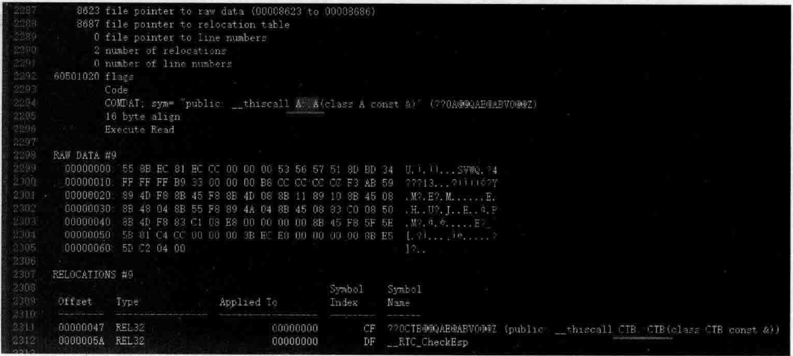
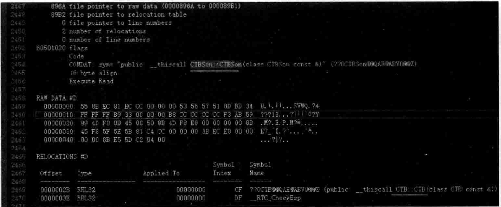
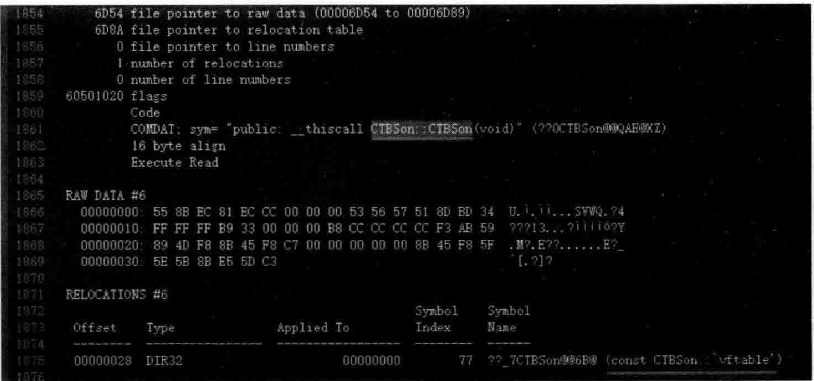
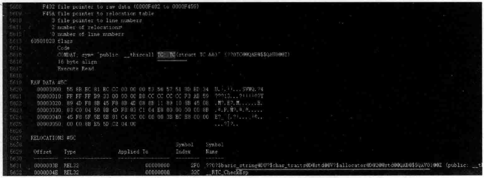

# 2.5拷贝构造函数语义与移动构造函数语义  

## 2.5.1拷贝构造函数语义  

拷贝构造函数都不陌生，尤其是当用一个类对象初始化另外一个类对象时，需要调用的是类的拷贝构造函数。  

传统上，读者可能有这样一个概念：如果程序员没有定义自己的拷贝构造函数，编译器会帮助程序员合成一个拷贝构造函数。  

实际情况也同默认构造函数一样，如果程序员没有定义自已的拷贝构造函数，编译器会在必要的时候合成出一个拷贝构造函数。  

看看如下范例。在MyProject.cpp前面，增加一个类A的定义：  

``` cpp
class A  
{  
public:  
    int m_test;  
};
```

在main主函数中，加入如下代码：  

``` cpp
A mya1;  
mya1.m_test = 15;  
A mya2 = mya1;  //这属于拷贝构造动作，但编译器没有合成拷贝构造函数
```

设置断点并运行起来观察，对象mya2的m_test成员变量确实被赋予了15，但使用dump bin My Project.obj My Project.txt文件并观察，并没有看到类A的拷贝构造函数产生。  

程序员没有书写自已的拷贝构造函数，编译器也没有产生拷贝构造函数，但是，mya2mtest却有了15这个值。为什么呢？这其实就是编译器内部的一个手法：成员变量初始化手法，如int这种简单类型，直接就按值拷贝过来了，编译器在不需要合成拷贝构造函数的情况下就能够帮助程序员做到这一点。  

在MyProject.cpp前面，增加一个ASon新类的定义，位置放在A类的上面：  

``` cpp
class ASon  
{  
public:  
    int m_testson;  
};
```
类A增加一个成员变量，修改后的类A代码如下：

``` cpp
class A  
{  
public:  
    int m_test;  
    ASon asubobj;  
};
```

在main主函数中，注释掉以往代码，加人全新的如下代码：  

``` cpp
A mya1;  
mya1.m_test = 15;  
mya1.asubobj.m_testson = 12  
A mya2 = mya1;
```

设置断点并跟踪调试，可以发现，mya2.asubobi.mtestson的值也会被设置为120。  

上面这段代码，总结一下  

（1）代码行Amya2=myal；用于拷贝构造一个对象。

（2）程序员并没有书写类A的拷贝构造函数，编译器也没有帮助程序员生成类A的拷贝构造函数。  

（3）通过设置断点并调试运行，观察发现mya1对象的成员变量值的确被复制到了mya2中，这是编译器内部的一些直接复制数据的实现手法，如果类A中有类类型（ASon）成员变量（asubobj），也会递归式地去复制这个类ASon的每个成员变量。  

但是，在某些情况下，如果程序员不书写自己的拷贝构造函数，编译器会帮助程序员生成出一个拷贝构造函数来。那么，在什么情况下编译器会帮助程序员生成拷贝构造函数，而这个生成的拷贝构造函数要做什么事呢？  

### 1.编译器生成“拷贝构造函数”的第一种情况  

（1）如果一个类A没有拷贝构造函数。  

（2）但该类含有一个类类型（CTB类，见下）的成员变量，类CTB含有拷贝构造函数。  

那么当代码中有涉及类A对象的复制构造时，编译器会为类A生成一个拷贝构造函数。  

在MvProiect.cpp前面，增加一个CTB新类的定义，该类中含有一个拷贝构造函数：  

``` cpp
class CTB  
{  
public:  
    CTB(const CTB&) //拷贝构造函数  
    {  
       cout << "CTB类的拷贝构造函数执行了" << endl;  
    }    
    CTB() //缺省构造函数  
    {  
    }  
};
```

在类A中，增加一个public修饰的类类型成员变量如下：  

``` cpp
public:  
    CTB m_ctb;
```

执行起来，看一看结果：

``` cpp
CTB类的拷贝构造函数执行了
```

那么，CTB的拷贝构造函数是谁调用的呢？是当运行到Amya2=myal；代码行时，编译器因为CTB类拷贝构造函数的存在而为类A生成了一个拷贝构造函数。为什么编译器要生成这个拷贝构造函数呢？其实就是为了向其中嵌入代码调用类CTB的拷贝构造函数。

编译，用dumpbin 导出MyProject.obj对应的MyProject.txt文件并观察，如图2.24 所示。

然后再设置断点进行一下跟踪调试。可以看到，就算是编译器为类A生成了拷贝构造函数，原来的一些成员变量值的复制都不受影响。例如，在执行了代码行Amya2=myal；后，mya2的各个成员变量的值依然和myal中相同。

  
图2.24编译器为类A生成拷贝构造函数并安插代码调用类CTB的拷贝构造函数  

所以，可以得到一个结论：编译器生成拷贝构造函数往往都是有一些特殊事情要做。如果只是一些类成员变量的值复制这些简单的事情，编译器不用专门生成拷贝构造函数来做，编译器内部就可以完成。  

### 2.编译器生成“拷贝构造函数”的第二种情况  

（1）如果一个类CTBSon没有拷贝构造函数，但是它有一个父类CTB。  

（2）父类CTB有拷贝构造函数。  

当代码中有涉及类CTBSon对象的复制构造时，编译器会为类CTBSon生成一个拷贝构造函数。  

在MyProject.cpp前面，增加一个CTBSon新类的定义：

``` cpp
class CTBSon :public CTB  
{  
public:  
};
```

在main主函数中，注释掉以往代码，加人全新的如下代码：  

``` cpp
CTBSon myctbson1;  
CTBSon myctbson2 = myctbson1;
```


执行起来，看一看结果：  

``` cpp
CTB类的拷贝构造函数执行了  
```

可以注意到，父类CTB的拷贝构造函数被调用。是谁调用的呢？是编译器生成了CTBSon类的拷贝构造函数，目的是通过向该函数中嵌人代码调用其父类CTB的拷贝构造函数。  

编译，dump bin My Project.obj My Project.txt文件并观察，如图2.25所示。  

  

图2.25编译器为类CTBSon生成拷贝构造函数并安插代码调用类CTB的拷贝构造函数  

### 3.编译器生成“拷贝构造函数”的第三种情况  

（1）如果一个类CTBSon没有拷贝构造函数。
（2）但是该类定义了虚函数或者该类的父类定义了虚函数。  

当代码中涉及类CTBSon对象的拷贝构造时，编译器会为类CTBSon生成一个拷贝构造函数。  

修改CTBSon类，不再继承自CTB类并增加一个虚函数定义：  

``` cpp
class CTBSon
{  
public:  
    virtual void mvirfunc() {}; //定义一个虚函数  
};
```

main主函数中代码保持不变。  

编译，dump bin My Project.obj My Project.txt文件并观察，如图2.26所示。  

  
图2.26编译器为类CTBSon生成拷贝构造函数并安插代码给虚函数表指针赋值  

可以看到，编译生成了类CTBSon的拷贝构造函数，并向这个拷贝构造函数中安插代码来给被复制的该类对象的虚函数表指针赋值。对于虚函数表指针的概念，在后面章节会详细讲述。  

现在，看一看父类有虚函数的情形。修改CTB类，修改后的代码如下：  

``` cpp
class CTB  
{  
public:   
    virtual void mvirfunc() {}  
};
```

修改子类CTBSon，继承自父类CTB，并去掉虚函数：  

``` cpp
class CTBSon :public CTB  
{  
public:  
};
```

main主函数中代码保持不变。  

编译，dump bin My Project.obj My Project.txt文件并观察。不难发现编译器不但生成了CTBSon类的拷贝构造函数，也生成了CTB类的拷贝构造函数。  

CTBSon类的拷贝构造函数被安插代码调用父类CTB的构造函数，同时用来给被复制的该类对象的虚函数表指针赋值。而CTB类的拷贝构造函数被安插代码用来给被复制的该类对象的虚函数表指针赋值（做了两次赋值似乎不应该，后面章节会详细分析这个问题）。  

### 4.编译器生成“拷贝构造函数”的第四种情况  

（1）如果一个类没有拷贝构造函数。  

（2）但是该类含有虚基类。  

当代码中有涉及类对象的复制构造时，编译器会为该类合成一个拷贝构造函数。  

把以往的类代码注释掉，在MyProject.cpp的前面，重新写几个类：  

``` cpp
class Grand //爷爷类  
{  
public:  
};  
class A : virtual public  Grand  
{  
public:  
};  
class A2 : virtual  public  Grand  
{  
public:  
};  
class C :public A, public A2   
{  
public:  
};
```

在main主函数中，增加如下代码：

``` cpp
C cc;  
C cc2 = cc;
```

编译，dump bin My Project.obj My Project.txt文件并观察。实际上，AA2、C类，编译器都生成了拷贝构造函数。这些拷贝构造函数里面的内容和上一节讲解的合成默认构造函数内容也都很类似，也是与vbtable（虚基类表）有关。虚基类的内容，后面章节再讲解，这里也是不做过多说明。  

还有哪些情况编译器会在程序员没有写自己的拷贝构造函数时为程序员生成拷贝构造函数呢？这个问题就留给读者探索。  

另外，如类中的赋值运算符，如果程序员没有重载，那么在某些情况下（如该类中有个其他类类型的对象，而这个其他类类型中却重载了一个赋值运算符），编译器就会为该类重载赋值运算符。道理都是相通的，读者有兴趣可以自已尝试。  

## 2.5.2移动构造函数语义  

在 $\mathrm{C++11}$ 新标准中，引人了“移动构造函数”和“移动赋值运算符”的概念。如果读者不太熟悉，可以通过搜索引擎搜索，也可以阅读笔者所著的《 $\mathrm{C++}$ 新经典》，该书中有详细介绍。  

其实，在某些情况下，如果程序员没有书写自已的“移动构造函数”和“移动赋值运算符”，编译器也会生成（合成）出“移动构造函数”和“移动赋值运算符”。  

（1）如果一个类定义了自己的拷贝构造函数、拷贝赋值运算符或者析构函数（这三者之一，表示程序员要自已处理对象的复制或者释放问题），编译器就不会为该类生成出移动构造函数和移动赋值运算符。这说明，只要程序员有自已复制对象和释放对象的倾向，编译器就不会帮助程序员生成移动动作的相关函数（所以有 $\fallingdotseq$ 些类是没有移动构造函数和移动赋值运算符的），这样就可以防正编译器合成出一个完全不是程序员自已想要的移动构造函数或者移动赋值运算符。  

（2）只有一个类没定义任何自己版本的拷贝构造函数、拷贝赋值运算符、析构函数，且类的每个非静态成员都可以移动时，编译器才会为该类合成移动构造函数或者移动赋值运算符。那什么叫成员可以移动呢？

①内置类型（如整型、实型等）的成员变量可以移动。
②如果成员变量是一个类类型，如果这个类有对应的移动操作相关的函数，则该成员变量可以移动。

此时编译器就会依据具体的代码来智能地决定是否生成移动构造函数和移动赋值运算符。看看如下范例。  

在MyProject.cpp前面，增加一个TC新类的定义：  

``` cpp
struct TC  
{  
    int i;          //内置类型可以移动  
    std::string s;  //string类型定义了自己的移动操作  
    //~TC() {}  
};
```

在main主函数中，加人如下代码：  

``` cpp
TC a;  
a.i = 100;  
a.s = "I Love China!";  
const char* p = a.s.c_str();  
TC b = std::move(a);  //导致结构/类TC移动构造函数的执行,数据移动不是std::move所为，而是string的移动构造函数所为  
const char* q = b.s.c_str();
```

增加断点，调试观察，可以看到，执行完上面的代码后，a.s已经为空（“"），这是执行了string类移动构造函数的结果。同时，注意到b.s结果为"ILoveChina！”（如果此时读者向TC结构中增加一个析构函数，就会发现a.s不再为空，因为系统不会为TC生成移动构造函数）。  

另外，p和g指向的内存位置也是不同的，这应该是string类的特性所导致。所以，这里虽然执行了string的移动构造函数，但是似乎也没节省什么性能（没体现出移动构造函数节省性能的特性）。  

其实，从上面的代码看，编译器之所以会为TC合成移动构造函数，完全是因为代码行TCb=std：：move（a）；的存在，编译器为TC合成移动构造函数的目的是往该函数中安插代码以调用string类的移动构造函数。  

编译，dump bin My Project.obj My Project，txt文件并观察，如图2.27所示。  

  
图2.27编译器为类TC生成移动构造函数并安插代码调用string类的移动构造函数  

编译器合成移动赋值运算符的情况与合成移动构造函数非常类似，笔者在这里同样不多说，读者可以根据上面所学的内容，自行尝试。  

经过多年的发展，编译器的功能已经非常强大，而且也非常智能，为了特定的需要，编译器会为程序员生成（合成）很多类中的成员函数并向其中安插代码，并不仅仅限于上面讲述的这些成员函数，请读者在学习的时候举一反三，灵活地去理解。