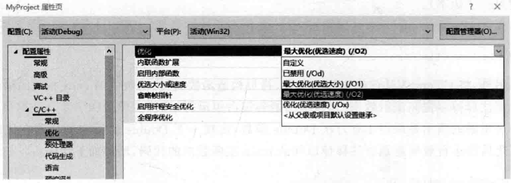
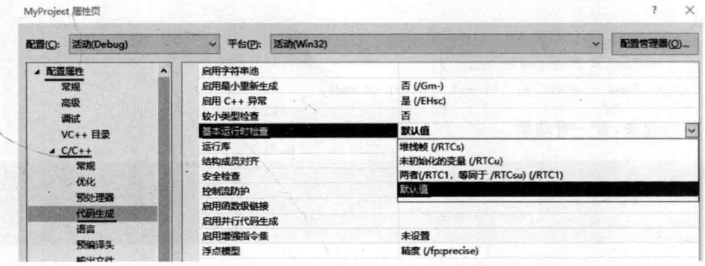

# 2.7 程序的优化  

本节谈一谈程序的优化，笔者准备从两个方面谈：①从开发者层面；②从编译器层面

## 2.7.1从开发者层面的优化  

看看如下范例。在MyProject.cpp前面，增加如下类CTempValue的定义代码：  

``` cpp
class CTempValue  
{  
public:  
    int val1;  
    int val2;  
public:  
    CTempValue(int v1 = 0, int v2 = 0) : val1(v1), val2(v2) //构造函数  
    {  
     cout << "调用了CTempValue类的构造函数!" << endl;  
     cout << "val1 = " << val1 << endl;    // cout << "val2 = " << val2 << endl;    }  
    CTempValue(const  CTempValue& t) : val1(t.val1), val2(t.val2) //拷贝构造函数  
    {  
     cout << "调用了CTempValue类的拷贝构造函数!" << endl;  
    };  
    virtual ~CTempValue() //析构函数  
    {  
     cout << "调用了CTempValue类的析构函数!" << endl;  
    };  
};
```

再增加一个函数定义（这是Double函数的第一个版本）：

``` cpp
CTempValue Double(CTempValue& ts) //第一个版本  
{  
    CTempValue tmpm; //这里会消耗我们一个构造和一个析构函数的调用  
    tmpm.val1 = ts.val1 * 2;  
    tmpm.val2 = ts.val2 * 2;  
    return tmpm;  //断点设置到这里，发现调用了拷贝构造函数和析构函数，这表示生成了临时对象  
}
```

在main主函数中，增加如下代码：

``` cpp
CTempValue ts1(10, 20);      
Double(ts1);
```

执行起来，看一看结果：

``` cpp
调用了CTempValue类的构造函数！ 
val1 = 10
val2 = 20
调用了CTempValue类的构造函数！ 
val1 = 0
val2 = 0
调用了CTempValue类的拷贝构造函数！
调用了CTempValue类的析构函数！ 
调用了CTempValue类的析构函数！ 
调用了CTempValue类的析构函数！
```

这里读者可以设置断点并跟踪调试，详细查看哪些语句行导致构造函数、拷贝构造函数和析构函数的执行。  

上面的代码中，因为Double函数返回的临时对象（returntmpm；）没有接收者，所以这个临时对象会在Double函数调用后被立即释放（调用一次析构函数），如果Double返回的临时对象有接收者，如代码行修改为这样：  

``` cpp
CTempValue ts2 = Double(ts1);
```

那么，Double函数返回的临时对象就不会被立即析构，而是会直接构造到ts2中，开且一直到ts2作用域结束后才会析构该临时对象：  

分析一下程序，不难想象，在Double函数里，CTempValuetmpm；代码行会消耗一个构造和一个析构函数的调用。而returntmpm；代码行生成了临时对象，所以最终它又占用了一个拷贝构造函数和一个析构函数的调用。  

那么针对上面这段Double函数中的代码，是否有优化空间呢？当然是有的，笔者把这两行调用构造函数的代码想办法合成一行，改造一下Double函数（这是Double函数的第二个版本）：新的Double函数代码如下：  


``` cpp
CTempValue Double(CTempValue& ts) //第二个版本  
{  
    return CTempValue(ts.val1 * 2, ts.val2 * 2);//临时对象  
}
```

执行起来，看一看结果：  

``` cpp
调用了CTempValue类的构造函数！ 
val1 = 10
val2 = 20
调用了CTempValue类的构造函数！ 
val1=20
va12 = 40
调用了CTempValue类的析构函数！ 
调用了CTempValue类的析构函数！
```

通过本次与上次执行结果的对比可以看到，修改（优化）后的代码少调用了一次拷贝构造函数和一次析构函数。  

上面优化后的代码是处于程序员的视角，那么，在编译器的视角中，优化后的Double函数代码应该是什么样子呢（注意代码中的注释）？  

``` cpp
void Double(CTempValue& tmpobj, CTempValue& ts1) //编译器会插入一个tmpobj参数  
{  
    tmpobj.CTempValue::CTempValue(ts1.val1 * 2, ts1.val2 * 2);//编译器手工调用构造函数  
    return;  
}
```

在编译器的视角中，main主函数中的代码应该又是什么样子呢？  

``` cpp
CTempValue ts1;  
ts1.CTempValue::CTempValue(10, 20);  
CTempValue tmpobj;  
Double(tmpobj, ts1);
```

## 2.7.2从编译器层面的优化  

为了研究从编译器层面的优化问题，笔者切换到Linux操作系统，因为在Linux操作系统中比较容易观察到编译器做了哪些优化。在Linux操作系统下，输人刚才没有优化过的代码（参考本节前面Double函数的第一个版本，这里不再重复这些代码）。  

用 $\mathbf{g}^{++}$ 编译并运行起来，可以发现，得到的结果与在VisualStudio2019中得到的结果并不一样，但却与在VisualStudio20l9中优化了Double函数后（参考本节前面Double函数的第二个版本）得到的结果相同。  

这种情况可以认为是 $\mathbf{g}^{++}$ 编译器的优化，属于编译器层面帮助程序员进行了优化。这里， $\mathbf{g}^{++}$ 编译器直接把Double函数的第一个版本的代码优化成了Double函数的第二个版本的代码。也就是说，编译器把Double函数第一个版本中的tmpm对象优化没了，被 $\mathbf{g}^{++}$ 编译器用Double函数第二个版本中的tmpobj取代了。  

因为编译器的这种优化是针对返回临时对象的情况所进行的优化，所以有些资料上也称之为NRV优化（Named Return Value）或者也有叫RVO（Return Value Optimization），这些叫法，读者大概了解，并不需要太详细研究。  

$\mathbf{g}^{++}$ 编译器的这种优化也是可以关闭的，使用的是-fno-elide-constructors选项。例如：  

$\mathbb{g}^{++}$  -fno-elide-constructors My Project.cpp -oMyProject  

关闭优化选项后，再次执行程序，得到的结果就与在VisualStudio2019中第一次运行得到的结果相同了（未优化前得到的结果）。  

VisualStudio20l9（以及其他的VisualStudio版本）可以做这种优化吗？可以尝试着找一找优化选项。  

在优化之前，先将代码恢复到本节刚开始展示的优化之前的Double函数的版本（Double函数的第一个版本）以验证优化选项的设置效果，然后开始进行优化选项的设置：  

（1） 在 Visual Studio 2019 中右击“解决方案资源管理器”中项目名MyProject 并在弹出的快捷菜单中选择“属性”命令，这将打开“MyProject属性页”对话框，在对话框左侧选择“配置属性”→C/C++—“优化”，对话框右侧的“优化”当前的选项是“已禁用（/Od）”，这里选择“最大优化（优选速度）（/02）”选项，如图2.28所示（其他优化选项读者可以根据需要自行研究）。

（2）依l旧是在“MyProject属性页”对话框，在对话框左侧选择“配置属性” $\rightarrow\mathrm{C/C++}\rightarrow$ “代码生成”，对话框右侧的“基本运行时检查”当前的选项是“两者（/RTC1，等同于/RTCsu）（/RTC1）”，这个选项是一种用于发现运行时代码问题的手段，如有的时候程序有栈溢出、指针问题等，编译器都能报异常，但是，如果使用了优化选项编译程序，就不能开启这个RTC1，这里选择“默认值”选项，如图2.29所示。    

  
图2.28开启VisualStudio2019中编译器的优化选项  

  
图2.29关闭VisualStudio2019中基本运行时检查选项  

执行起来，看一看结果：  

``` cpp
调用了CTempValue类的构造函数！ 
val1 = 10
val2=20
调用了CTempValue类的构造函数！ 
val1 = 0
val2 =0
调用了CTempValue类的析构函数！ 
调用了CTempValue类的析构函数！
```

可以看到，优化选项发挥了作用，实际结果少调用了一次拷贝构造函数和一次析构函数。现在，把优化选项还原回去以免影响后续的一些测试工作。  

针对Double函数代码在改造（优化）代码前后的执行效率对比，如果调用Double函数的次数少，可能感觉不到效率的提升，但是如果频繁地调用Double函数（如调用几百上干方次），那么效率的提升就会比较明显：  

为了做适当的演示，先将Double函数的代码保持在最初的未优化时的版本（Double函数的第一个版本）。

在MyProject.cpp开头位置增加对time.h头文件的包含：

``` cpp
# include<time.h>  
```

另外，将CTempValue类中构造函数、拷贝构造函数、析构函数中的cout相关的输出语句全部注释掉以提高演示效率（这些输出语句很占用运行时间）。  

这里做的演示是调用1o0万次Double函数，比较一下Double函数中的代码在优化前和优化后的运行效率差别。注释掉以往的main主函数中的代码，增加如下代码：  


``` cpp
CTempValue ts1(10, 20);  
clock_t start, end;  
start = clock(); //程序开始到本行执行时所用的毫秒数  
cout << "start = " << start << endl;  
for (int i = 0; i < 1000000; i++)  
{  
    Double(ts1);  
}  
end = clock();  
cout << "end = " << end << endl;  
cout << "end - start = " << end - start << endl;
```

执行起来，看一看结果：  

``` cpp
start =0
end = 163
end - start =163
```

多次执行，end与start的时间差在 $140{\sim}210$  

继续，将Double函数的版本调整为优化之后的版本（Double函数的第二个版本）。  

再次执行起来，看一看结果：  

多次执行，end与start的时间差在 $80\!\sim\!110$ 。可以看到，修改后的Double函数，会使执行效率有一定的提升。  

优化这种事不太好把握，针对编译器的优化（非程序员改动代码进行优化），要说明儿点：  

（1）编译器是否真优化了。如果不做各种测试，可能也不知道编译器是否真做了某些优化，而且往往编译器优化的能力更强悍（比程序员改动代码的优化效果更明显）。  

（2）如果程序员写的函数内容比较复杂，可能编译器会选择索性不优化了。  

（3）不要过度优化。有的时候用特别高优化度的优化选项也许会影响程序的功能甚至使程序运行出现错误，在应用优化选项前要搞清楚优化选项可能带来的端。  

（4）另外，优化可能使程序员犯错误。例如刚才在Linux中演示时，如果程序员不使用-fno-elide-constructors选项，那么程序执行时就不调用拷贝构造函数，如果程序员的本意是期望调用拷贝构造函数做一点什么事情，那此时程序员期望的事情就没有发生（期望落空）。