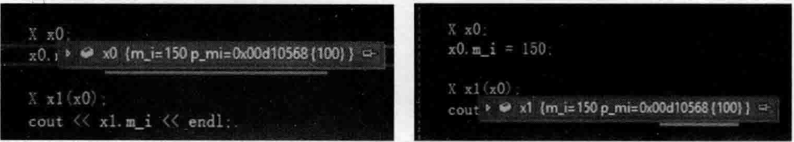

# 2.8程序优化续、拷贝构造函数续与深浅拷贝  

## 2.8.1程序优化续  

借用2.6节中的范例进行演示，并对代码进行了一些扩充。完整的代码如下：

``` cpp
class X  
{  
public:  
    int m_i;  
   
    X(const X& tmpx)  
    {
        m_i = tmpx.m_i;   
		cout << "X类的拷贝构造函数被调用" << endl;  
    }   
    X()   
    {  
       m_i = 0;  
       cout << "X类的构造函数被调用" << endl;  
    }  
    ~X()  
    {  
       cout << "X类的析构函数被调用" << endl;  
    }  
    X(int value) :m_i(value) //类型转换构造函数（带有一个形参的拷贝构造函数）  
    {  
       cout << "X类的X(int)构造函数被调用" << endl;  
    }  
};
```

在main主函数中加人如下代码（注意每行语句的写法）：  


``` cpp
cout << "----begin----" << endl;  
X x10(1000);  
cout << "--------" << endl;  
X x11 = 1000;  
cout << "--------" << endl;  
X x12 = X(1000);  
cout << "--------" << endl;  
X x13 = (X)1000;  
cout << "----end----" << endl;
```

执行起来，看一看结果：  


``` cpp
----begin----
X类的X（int）构造函数被调用
------------
X类的X（int）构造函数被调用
------------
X类的X（int）构造函数被调用
------------
X类的X（int）构造函数被调用
----end----
X类的析构函数被调用
X类的析构函数被调用
X类的析构函数被调用
X类的析构函数被调用
```

在笔者Visual Studio 2019的开发环境中，看起来main主函数中每行创建对象的代码调用的都是构造函数。但是，凭借编程经验，感觉这4行创建对象的代码执行结果应该不同（如Xx12=X（1000）；代码行看起来更应该调用拷贝构造函数）。是否是Visual Studio2019编译器内部还做了优化？笔者找了一下优化选项，似乎都关闭了，没有开优化选项，是没找到还是压根没有？读者也可以尝试着探索一下。

带着这个怀疑，笔者来到Linux操作系统下进行测试，希望发现一些新情况。为了防止Linux下的g++编译器对程序进行优化，特加入了-fno-elide-constructors选项，示意编译器 不做任何优化：

```cpp
g++ -fno-elide-constructors MyProject.cpp -o MyProject
```

程序代码在Iinu文上完全不变.看一看在工inux操作系统上经过gcc编译器编泽连接后的执行结果：  

``` cpp
----begin----
X类的X（int）构造函数被调用
------------
X类的X（int）构造函数被调用
X类的拷贝构造函数被调用
X类的析构函数被调用
------------
X类的X（int）构造函数被调用
X类的拷贝构造函数被调用
X类的析构函数被调用
------------
X类的X（int）构造函数被调用
X类的拷贝构造函数被调用
X类的析构函数被调用
----end----
X类的析构函数被调用
X类的析构函数被调用
X类的析构函数被调用
X类的析构函数被调用
```

可以注意到，与在Visual Studio 2019中执行的结果相比，出现了差异和不同。后三个创建对象的代码行都是先构造了一个临时对象，然后把临时对象复制给了等号左侧所定义的对象（所以调用了拷贝构造函数），然后又把临时对象给析构掉了。

在编译器不参与优化的情况下，只有第一行创建对象的代码似乎是最有效率的。因为在编译器的视角看来，第一行相当于：  


``` cpp
X x10;   //编译器视角是不调用构造函数的  
x10.X::X(1000);
```

后面几行创建对象的代码，感觉就不太好了，在编译器的视角看来可能大概就是这样了：  


``` cpp
X _tmp0;          //编译器生成的临时对象  
_tmp0.X::X(1000); //带一个参数的构造函数被调用  
X x12;   
x12.X::X(_tmp0);  //拷贝构造函数被调用  
_tmp0.X::~X();    //调用析构
```

而且Xx11=1000；代码行的写法和Xx12=X（1000）；或者Xx13=（X）1000；代码行的写法又不一样。因为Xx11=1000；代码行涉及隐式类型转换（涉及先把1000这个数字转换成一个临时对象），这种转换成功靠的是X（int value）：m_i（value）（··}这种类型转换构造函数。

要验证上面隐式类型转换这个说法也很容易，如果在类型转换构造函数前面增加explicit,如下：


``` cpp
explicit X(int value) :m_i(value){...}
```

那么代码行 $\mathrm{~X~x11~}\equiv1000$ ：就会报错，无法编译通过，这表示1000这个数字无法转换成X类型对象。  

总结：当编译器面临用一个类对象（哪怕是临时对象）作为另一个类对象初值的情形时，很多编译器的表现各不相同，但各个厂商的编译器都是为更高的执行效率进行努力的。所以，上面的代码写法，程序员没有办法确定所使用的编译器一定会调用拷贝构造函数。  

## 2.8.2 拷贝构造续  

那么，拷贝构造函数必须有吗？结论是不一定，视情况而定。如果只是一些简单数据类型的成员变量，如int、double类型，你会发现根本不需要什么拷贝构造函数，编译器内部本身就支持这种成员变量的所谓bitwise（按位）复制。  

改造一下代码，注释掉X类中的拷贝构造函数。在main主函数中，注释掉原有代码，增加如下代码：  

``` cpp
X x0;  
x0.m_i = 150;  
X x1(x0);  
cout << x1.m_i << endl;
```

可以发现，即使类X没有拷贝构造函数， $\mathbf{x1.\;m_{-}i}$ 的值仍旧变成了150，这就是编译器本身支持的针对成员变量的bitwise复制。读者也可以在 $g^{++}$ 编译器上尝试，效果应该是一样的。  

那么，什么时候程序员需要书写自已的拷贝构造函数呢？就是当处理一些很复杂的成员变量类型的时候，最简单的例子就是指针变量作为类的成员变量。例如，上面的类X有一个指针类型的成员变量int $\mathrm{~\textperthousand~}$ 指向一块内存，那么，用 $\mathbf{x}0$ 对象生成 $\mathbf{x}1$ 对象的时候，就会导致 $\mathbf{x}1$ 里的 $\mathrm{p\_m}$ 也指向 $\mathbf{x}0$ 的 $\mathrm{p\_m}$ 所指向的内存。那么试想，如果 $\mathbf{x}0$ 对象被析构的时候， $\mathbf{x0}$ 有责任把自己的 $\mathrm{p\_m}$ 成员所指向的内存给释放掉，那就会导致 $_{\mathrm{x1}}$ 的 $\mathrm{p\_m}$ 指向的内存非法。对于这种情况，程序员就有必要书写自己的拷贝构造函数，然后在其中为 $\mathrm{p\_m}$ 开辟内存空间，把另外一个对象 $\mathrm{p\_m}$ 所指向的内存中的内容复制过来等诸如此类操作。这就是读者常常听说的“深拷贝，浅拷贝”的话题。  

现在举一个实际例子，将类×拷贝构造函数的注释取消，并且，类X的拷贝构造函数中只保持有如下一行代码：  


``` cpp
X(const X& tmpx)  
{  
    cout << "X类的拷贝构造函数被调用" << endl;  
}
```

main主函数中代码不变，将程序执行起来，看一看结果：

``` cpp
X类的构造函数被调用
X类的拷贝构造函数被调用
-858993460 
X类的析构函数被调用
X类的析构函数被调用  
```

从结果中可以看到，打印出来的xl.mi值已经不对了。

本来，不加拷贝构造函数时xl.m_i值是对的，但是加了之后，该值反而不对了。看起来就是因为程序员加了拷贝构造函数导致编译器原本内置的bitwise（按位）复制能力失效所以结论就是：程序员往类中增加了拷贝构造函数后，就要对类中各个成员变量的初始化负责了。

## 2.8.3 深浅拷贝  

笔者在这里谈一下深浅拷贝问题，因为笔者不敢确定所有读者都听过这个话题，一旦没有听过，以后遇到类似问题掉到坑里，那么笔者也会非常自责。  

再次把类X的拷贝构造函数注释掉，并且向类X中增加若干代码。请读者留意，完整的X类当前如下：  

``` cpp
class X  
{  
public:  
    int m_i;  
    int* p_mi; //整型指针，其他类型指针都可以，道理相同  
    X()   
    {  
       m_i = 0;  
       p_mi = new int(100);  
       cout << "X类的构造函数被调用" << endl;  
    }  
    ~X()  
    {  
       delete p_mi;  
       cout << "X类的析构函数被调用" << endl;  
    }  
    X(int value) :m_i(value) //类型转换构造函数（带有一个形参的拷贝构造函数）  
    {  
       p_mi = new int(100);  
       cout << "X类的X(int)构造函数被调用" << endl;  
    }    
};
```

main主函数中，代码不变。  

将程序执行起来，发现执行出现异常。为什么？要分析一下。将断点设置到main主函数中的cout<<xl.m_i<<endl；代码行，按快捷键F5运行程序。因为类X没有拷贝构造函数，编译器执行了所谓的bitwise（按位）复制。所以，执行完代码行Xx1（x0）；，就导致x0和x1两个对象的成员变量值都一样了。这里重点观察p_mi这个指针类型成员变量的值，如图2.30所示。

  
图2.30 两个对象的指针类型成员变量居然指向同一块内存0x00d10568  

不难发现， $\mathbf{x}0$ 和 $_\mathrm{x1}$ 对象的成员变量 $\mathrm{p\_mid}$ 指向的是同一块内存。这肯定是不行的，这块内存是对象 $\mathbf{x}0$ 构造时开辟的，如果 $\mathbf{x}0$ 对象被释放了，那么 $\mathbf{x}0$ 对象的 $\mathrm{p\_mi}$ 所指向的内存会在类X的析构函数中执行deletep_mi；代码行被释放，这就等价于 $\mathbf{x}1$ 的p_mi指针失效了。当释放 $_\mathrm{x1}$ 对象的时候，类X的析构函数再次执行delete $\mathrm{p\_mid}$ ：代码行把已经被释放的内存再次释放，编译器就会报异常，所以， $\mathbf{x}1$ 对象的 $\mathrm{p\_mid}$ 也必须指向 $\mathbf{x1}$ 对象自己分配的内存。因为 $_\mathrm{x1}$ 对象是通过类×的拷贝构造函数并借助对象 $\mathbf{x}0$ 复制构造出来的，所以这时程序员必须要书写自已的拷贝构造函数，来额外处理 $\mathrm{p\_mid}$ 的内存分配问题。  

对于类定义中有指针成员变量的情况，只复制指针值（上面的代码就是这种情形），指针所指向的地址编译器并没有额外做处理，这就叫浅拷贝，是一种很坑人的复制。  

取消类X中拷贝构造函数的注释并详细修改其中的代码，请读者注意观察：  

``` cpp
X(const X& tmpx)  
{  
    p_mi = new int(100); //为指针类型成员变量单独分配内存  
    memcpy(p_mi, tmpx.p_mi, sizeof(int));  
    m_i = tmpx.m_i;  
    cout << "X类的拷贝构造函数被调用" << endl;  
}
```

上面这段代码，在拷贝构造函数中，为指针类型成员变量p_mi创建自已的内存，并复制形参 $\scriptstyle{\mathrm{tmp}}$ 中的成员变量 $\mathrm{p\_mid}$ 的值到该内存中，这种行为就叫深拷贝。当释放这个被复制对象（xl）的时候，X类的析构函数中执行的代码行deletep_mi；释放的就是在X类拷贝构造函数中分配的内存。  

这种深拷贝实现了每个不同的X类对象的指针类型成员变量p_mi都指向一块完全不同的内存，释放X类对象回收pmi所指内存时这些对象之间完全没有瓜葛，不会彼此影响。