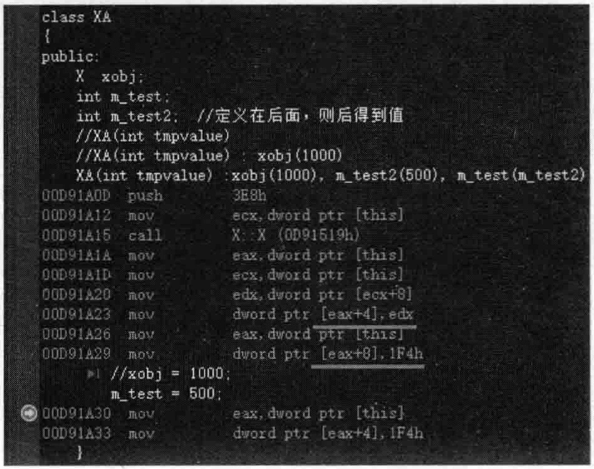

# 2.9成员初始化列表  

## 2.9.1何时必须用成员初始化列表  

看看如下范例。在MyProject.cpp的上面，增加如下类A的定义代码：  

``` cpp
class A
{  
public:  
    int m_x;  
    int m_y;  
    A() :m_x(0), m_y(0)  
    {    
    }     
};
```

上面代码中， $\mathrm{m\_x(0)\,,m\_y(0)}$ 就是初始化列表。当然，在这种情形下，可以不使用初始化列表，像下面这样书写类A的构造函数也可以：  

``` cpp
A()
{   
    m_x = 0;  
    m_y = 0;  
}
```

上面这种写法，抛开效率等说法，单纯从要实现的功能上来讲，和使用初始化列表是一样的。  

这里要思考的第一个问题是，在什么场合下必须要用初始化列表来初始化成员？  

（1）如果成员变量是引用类型在类A中增加一个引用类型的成员变量：  

``` cpp
public:  
    int &m_yy;
```

那么，在构造类A对象时，这个引用就要绑定到一个int类型变量上去。这种情况下，一般来说类A的构造函数都会带有一个形参。修改一下类A的构造函数，修改后的代码如下：  

``` cpp
A(int& tmpvalue) :m_yy(tmpvalue), m_myc(tmpvalue), Base(tmpvalue, tmpvalue), cmysub(tmpvalue)  
{  
    //m_yy = tmpvalue; //错误，不可以，必须在初始化列表中进行绑定  
    m_x = 0;  
    m_y = 0;  
    m_yy = 160;    //就等于修改外界的abc变量值  
}
```

在main主函数中，加人如下代码：  

``` cpp
int abc = 1;  
A a(abc);
```

执行起来，结果正常。显然上面的代码虽然语法正确，但比较多余，因为引入m_yy成员变量看起来并没有什么实际意义。笔者引人该成员变量的主要目的只是举例说明，如果成员变量是一个引用类型，则必须在初始化列表中进行初始化。  

至于引用类型成员变量到底有什么实际用途，读者可以在今后的学习和实践中多阅读别人的代码，进一步体会，这里笔者就不多说。  

（2）如果成员变量是const类型  

在类A中增加一个const类型的成员变量：  


``` cpp
public:  
    const int m_myc;
```

这种情况同样要在初始化列表中初始化m_myc成员变量：


``` cpp
A(int &tmpvalue):m_yy(tmpvalue), m_myc(tmpvalue){...}
```

（3）如果该类继承自一个基类，并且基类中有构造函数，这个构造函数里还有参数在MyProject.cpp的上面，增加如下类Base的定义代码：  


``` cpp
class Base  
{  
public:  
    int ba;  
    int bb;  
    Base(int tmpa, int tmpb) //构造函数  
    {  
    }  
};
```

修改类A，让其继承自Base类，注意类A构造函数中初始化列表的改动。完整的类A代码如下：  

``` cpp
class A :public Base  
{  
public:  
    int m_x;  
    int m_y;  
    int &m_yy;  
    const int m_myc;  
    A(int& tmpvalue) :m_yy(tmpvalue), m_myc(tmpvalue), Base(tmpvalue, tmpvalue), cmysub(tmpvalue)  
    {  
       m_x = 0;  
       m_y = 0;  
       m_yy = 160;  
    }  
  
};
```

（4）如果类中成员变量的类型是某个类类型，而这个类类型所指类的构造函数带有参数

在MyProject.cpp的上面，增加如下类CSub的定义代码：

``` cpp
class CSub  
{  
public:  
    CSub(int tmpvalue)  
    {  
  
    }  
};
```

修改类A，增加一个CSub类型的成员变量，并在初始化列表中对其进行初始化。完整的类A代码如下：  


``` cpp
class A :public Base  
{  
public:  
    int m_x;  
    int m_y;  
    int &m_yy;  
    const int m_myc;  
    CSub cmysub;  
   
    A(int& tmpvalue) :m_yy(tmpvalue), m_myc(tmpvalue), Base(tmpvalue, tmpvalue), cmysub(tmpvalue)  
    {  
       m_x = 0;  
       m_y = 0;  
       m_yy = 160;    //就等于修改外界的abc变量值  
    }  
  
};
```


## 2.9.2使用初始化列表的优势  

除了必须使用初始化列表的场合，程序员使用初始化列表还有什么目的？其实就是一句话一提高程序运行效率。  

这里使用两个类进行演示。在MyProject.cpp的上面，增加如下类X的定义代码：  

``` cpp
class X  
{  
public:  
    int m_i;  
    X(int value = 0) :m_i(value) //类型转换构造函数  
    {  
       printf("this = %p", this);  
       cout << "X类的X(int)构造函数被调用" << endl;  
    }  
    X(const X& tmpv)  
    {  
       printf("this = %p", this);  
       cout << "X类的拷贝构造函数被调用" << endl;  
    }  
    X& operator=(const X& tmpTime)  
    {  
       printf("this = %p", this);  
       cout << "X类的拷贝赋值运算符被调用" << endl;  
       return *this; //返回一个该对象的引用  
    }  
    ~X()  
    {  
       printf("this = %p", this);  
       cout << "X类的析构函数被调用" << endl;  
    }  
};
```

继续增加如下类XA的定义代码：  

``` cpp
class XA  
{  
public:  
    X  xobj;  
    int m_test;  
    XA(int tmpvalue)   
    {  
       xobj = 1000;  
       m_test = 500;  
    }  
};
```

在main主函数中，注释掉以往的代码，增加如下代码：  

``` cpp
XA myaobj(1000);
```

从上面的代码可以注意到，类XA中成员变量xobj的初始化放在了类XA的构造函数里。  

执行起来，看一看结果：  

``` cpp
this=00B3F9B4X类的X(int)构造函数被调用 
this=00B3F7F8X类的X(int)构造函数被调用 
this=00B3F9B4X类的拷贝赋值运算符被调用
this=00B3F7F8X类的析构函数被调用
this=00B3F9B4X类的析构函数被调用
```

可以通过设置断点并跟踪调试观察。结果中最上面一行“X（int）构造函数被调用”是执行代码行XA（inttmpvalue）时产生的。说明在执行类XA构造函数的函数体之前就构造了xobi这个对象，所以这次构造占用了一次调用类X构造函数的机会。  

站在编译器的角度相当于执行了下面两行代码：  

```cpp
X xobj;
xobj.X::X();
```

继续跟踪调试，进人到XA构造函数的函数体。不难发现，仅仅执行函数体中 $\mathbf{xo b j}=$ 1000；这行代码就会产生3条输出结果（下面3条结果取自上面5条结果中的第 $2{\sim}4$ 条）：  

``` cpp
this=00B3F7F8X类的X(int)构造函数被调用
this=00B3F9B4X类的拷贝赋值运算符被调用
this=00B3F7F8X类的析构函数被调用
```

根据这三条输出结果，分析分析。站在编译器的视角来看，针对xobj=1000；代码行，很可能生成出下面这种代码：

```cpp
X tmpobj;              //生成一个临时对象
tmpobj.X::X(1000);    //临时对象调用构造函数
xobj.X::operator=(tmpobj);  //调用xoobj的拷贝赋值运算符
tmpobj.X::~X();        //调用析构函数摧毁临时对象
```

但是，如果把xobj对象的初始化放在XA构造函数的初始化列表中呢？  

``` cpp
XA(int tmpvalue) :xobj(1000) 
{  
    m_test = 500;  
}
```

执行起来，看一看结果：  

``` cpp
this=007EF8C8X类的X(int)构造函数被调用 
this=007EF8C8X类的析构函数被调用
```

原来输出的结果是5行，现在只剩2行了。省掉了一次构造函数、一次拷贝赋值运算符、一次析构函数。  

此时，站在编译器的视角，看看编译器是如何初始化xobi的：  

```cpp
X xobj;
xobj.X::X(1000); //直接用1000调用X类的构造函数
```

其实，初始化列表中的代码可以理解成（相当于）往构造函数中插入代码，也就是说，可以把这些初始化列表中的代码看成是构造函数的函数体中代码的一部分。  

通过上面的讲解可以看到，通常，诸如xobi这种类类型成员变量的初始化，放在构造函数的初始化列表中进行初始化比放在构造函数函数体中初始化效率更高。但是，如果只是一个简单类型的成员变量（如一个int类型的成员变量），其实放在初始化列表里初始化与放在构造函数函数体里初始化没什么差别。  

将来读者面试的时候，可能有些考官很在意初始化成员变量时将它们放在构造函数初始化列表里还是放在构造函数函数体里，请尽量往初始化列表里放，这样可能会更受到考官的认可，就算是简单类型的成员变量放在初始化列表中并不提高程序执行性能，也显得更专业。  

## 2.9.3初始化列表的细节探究  

其实初始化列表的语法看起来还是挺奇怪的，如：xobj（1000），m_test（500），有冒号，也有逗号，看起来像函数调用一样。  

有几点说明：  

（1）初始化列表中的代码可以看作被编译器安插在构造函数中的。  

（2）初始化列表中的代码是在构造函数的函数体代码执行之前被执行。 

（3）初始化列表中成员变量的初始化顺序看的是这些成员变量在类中定义的顺序，而不是看在初始化列表中出现的顺序：  

假如在类XA中，定义了三个成员变量：  

``` cpp
public:  
    X  xobj;  
    int m_test;  
    int m_test2;  //定义在后面，则后得到值
```

而XA类的构造函数中的初始化列表如果像下面这样写：


``` cpp
XA(int tmpvalue) :xobj(1000), m_test2(500), m_test(m_test2){...}
```

则是错误的，因为mtest在类XA中定义在前面，会先得到值，根据构造函数初始化列表，mtest的值取决于mtest2，但mtest2此时没值，所以mtest值变得不可预料（不确定）了。读者可以设置断点并跟踪调试来查看，可以查看反汇编代码，如图2.31所示。  

  
图2.31成员变量得到值的顺序是根据它们在类中定义的顺序来的  

在图2.31中，给成员变量值是按照它们在类中定义的顺序来的，先给eax $^+$ 4(m_test)值，再给eax $+8$ (m_test2）值。  

读者千万注意上面这种问题，不要犯这种错误，因为这种错误不好检查，不容易发现。编译器本身也不会针对这类错误出现警告之类的提示（笔者测试VisualStudio2019和 $\mathbf{g}^{++}$ 都不提示这类问题）。  

因此，笔者不建议在初始化列表中进行两个成员变量之间的初始化。例如，下面这种用成员变量m_test2来初始化成员变量m_test。  

```cpp
A(int tmpvalue):xobj(1000), m_test2(500), m_test(m_test2){...}
```

哪怕是一个成员变量放在初始化列表中初始化，另一个成员变量放在构造函数的函数体内初始化，这样的执行顺序看起来也很清晰（初始化列表中的代码先执行）：  

```cpp
A(int tmpvalue): xobj(1000), m_test2(500)
{
    m_test = m_test2;
}
```