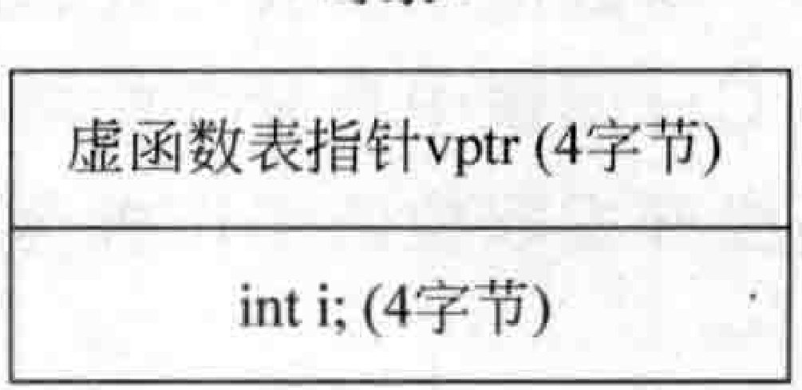

# 3.1虚函数表指针位置分析  

## 第3章  虚函数  

本章会涉及一个最重要的话题：虚函数。这里将详细阐述虚函数表指针、虚函数表等概念与虚函数的工作原理。在开始本章的学习之前，读者应该确保对虚函数的概念和用法有比较好的掌握。  

掌握虚函数表指针、虚函数表两大话题，是程序员自身开发素养和开发能力的体现，也是 $\mathrm{C++}$ 面试中最常考的两个话题，读者不可不会，否则非常容易丢掉工作机会，尤其是一些高级开发职位的工作机会。  


---


读者已经知道，一个类中如果有虚函数，则针对这个类会产生一个虚函数表。生成这个类对象的时候，该对象里就有一个指针（虚函数表指针）用来指向这个虚函数表的起始地址。这个指针可以看成类中的一个成员变量，也占一定的字节数（一般是4个或者8个字节）。既然是成员变量，那么它在对象内存中就会有一个位置，它有可能位于对象内存的开头，有可能位于对象内存的末尾，具体在什么位置取决于编译器。现在写一个范例，范例的自的是让读者感知一下虚函数表和虚函数表指针的存在。  

看看如下范例。在MyProject.cpp的上面，增加如下类A的定义代码：  

``` cpp
class A  
{  
public:  
    int i;   //一个成员变量，4字节  
    virtual void testfunc() {}  //虚函数  
};
```

在main主函数中，加人如下代码：


``` cpp
A a;  
int ilen = sizeof(a); //8：i占4字节, 虚函数表指针占4字节（皆在x86平台下）
```

现在可以确定一件事情，a对象里有一个虚函数表指针（vptr），还有一个成员变量i，成员变量是跟着对象走的，也就是说是属于该对象的。可以以图2.5做参照。  

在main主函数中继续增加如下的代码，用以感知一下虚函数表指针的存在。注意观察代码中的注释：  

``` cpp
char* p1 = reinterpret_cast<char*>(&a);       //0x006ff730 类型转换，这属于硬转，a是对象首地址  
char* p2 = reinterpret_cast<char*>(&(a.i));   //0x006ff734 if (p1 == p2) //说明a.i和a位置相同，则成员变量i在a对象内存的上面位置，那么虚函数表指针在下面位置  
{  
    cout << "虚函数表指针位于对象内存的末尾" << endl;  
}  
else  
{  
    cout << "虚函数表指针位于对象内存的开头" << endl; //本条件会成立  
}
```

执行起来，看一看结果：  

``` cpp
虚函数表指针位于对象内存的开头  
```

上面的代码比较简单，不难看到，经过测试，虚函数表指针位于对象内存的起始（上面开头）位置。在Linux操作系统下编译并运行程序，得到的结果也相同（虚函数表指针也位于对象内存的起始位置）。对象a的内存结构示意图如图3.1所示。  

  
图3.1对象a的内存结构示意图 

通过上面这个范例，感知到了虚函数表指针的存在，后续就要通过这个虚函数表指针来尝试调用一下虚函数。