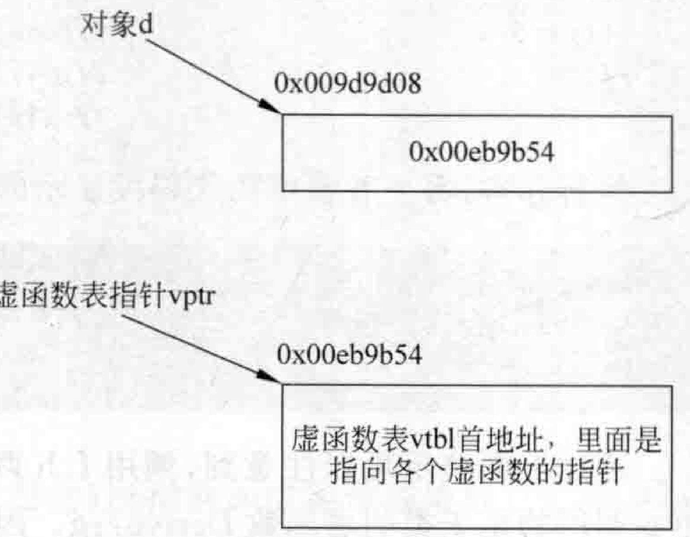
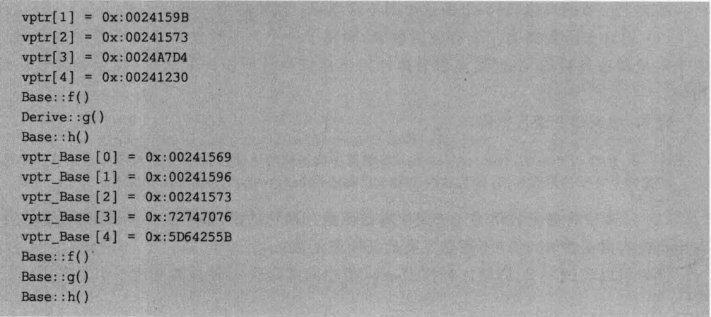

# 3.2继承关系作用下虚函数的手工调用  

通过上一节感知了一下虚函数表指针的存在，本节将把问题深人一点，创建一个父类，创建一个子类，然后，尝试着通过虚函数表指针来调用一下虚函数。  

看看如下范例，注意程序的写法，因为研究 $\mathrm{C++}$ 对象模型知识的时候程序的写法往往都是比较独特和奇怪的。在MyProject.cpp的上面，增加如下类Base和类Derive的定义代码：  

``` cpp
class Base  
{  
public:  
    virtual void f()   
    {  
       cout << "Base::f()" << endl;   
    }  
    virtual void g()   
    {   
       cout << "Base::g()" << endl;   
    }  
    virtual void h()   
    {   
       cout << "Base::h()" << endl;   
    }  
};  
class Derive : public Base {  
public:  
    void g()   
    {  
       cout << "Derive::g()" << endl;   
    }  
};
```

在main主函数中，加人如下代码（请读者仔细分析这些代码并密切注意其中的注释）：  

``` cpp
cout << sizeof(Base) << endl;   //4字节，说明虚函数表的指针在这里的x86平台是4字节的（vptr），g++编译器是8字节  
cout << sizeof(Derive) << endl; //4字节，和Base类一个道理  
Derive* d = new Derive();       //派生类指针，其实用基类指针指向派生类也一样Base *d = new Derive();      long* pvptr = (long*)d;         //指向对象d的指针转成long *型,大家注意，目前d对象里只有虚函数表指针  
long* vptr = (long*)(*pvptr);   //(*pvptr)表示pvptr指向的对象，也就是Derive对象本身。这个对象4字节，这个4字节是虚函数表地址  
                         //比如 *pvptr 可能等于15440724（0xeb9b54），这个其实就是虚函数表地址  
                         //把一个虚函数地址用(long *)一转，则本行的意思就是让vptr代表Derive对象虚函数指针，用于指向类Derive的虚函数表
```

上面几行代码请读者好好理解，在这里，笔者绘制图3.2，帮助理解上面的代码。  

读者可以参考图2.5，因为这个图比较直观。现在可以估计一下，类Derive有三个虚函数（两个继承自父类，分别是f和g，另一个覆盖了父类的同名函数h），所以，预计虚函数表里会有三项，这里输出一下该虚函数表里指向各个虚函数的指针的值。这里为了观察到更多信息，打印出五项来。在main主函数中，继续增加如下代码：  

``` cpp
for (int i = 0; i <= 4; i++)  
{  
    printf("vptr[%d] = 0x:%p\n", i, vptr[i]); //这样打印可能会打印到非法内存，但好在程序不崩溃，使我们能看到结果 }
```

  
图3.2通过代码获取类Derive虚函数表首地址，并让vptr指针变量指向该地址  

执行起来，看一看结果：  

``` cpp
4
4
vptr[0] = 0x: 00811569 
vptr[1] = 0x:0081157D 
vptr[2]= 0x: 00811573 
vptr[3]= 0x:0081A7D4 
vptr[4]= 0x: 00811230
```

可以注意到，vptr[0]、vptr[1]、vptr[2]这前三项指向的应该是三个虚函数首地址。而后面的vptr[3]和vptr[4]应该就不是有效内容了（而且内存地址看起来与前三项离得也比较远），这里可以不理会这两项。有必要提醒一下，不同的编译器vptr[3]的结果可能不同，如在Visual Studio 2017中，vptr[3]的内容可能是0x000000000。

既然拿到了vptr[o]、vptr[1]、vptr[2]这三个虚函数的首地址，那么就尝试调用一下这三个虚函数。在本范例中这些虚函数的调用格式都比较统一，因为它们没有形参也没有返回值，这就给写测试代码带来了便利（不用传递多余的东西进去就能达到调用的效果）。现在就开始写代码来调用这三个虚函数看看效果。在main主函数中，继续增加如下代码：  

``` cpp
typedef void(*Func)(void); //typedef后面是定义一个函数指针，那加上typedef就代表Func是个函数指针类型，也就是它能当类型用  
    //Func当类型用后就可以象下面这样  
    Func f = (Func)vptr[0]; //f,g,h就是 函数指针变量  vptr[0]指向第一个虚函数{project4.exe!Base::f(void)}    
Func g = (Func)vptr[1]; //vptr[1]指向第二个虚函数{project4.exe!Derive::g(void)}  
    Func h = (Func)vptr[2]; //vptr[2]指向第三个虚函数{project4.exe!Base::h(void)}  
    Func i = (Func)vptr[3]; //vptr[3]  
    Func j = (Func)vptr[4]; //vptr[4]  
    f();                    //base::f  
    g();                    //derive::g   子类覆盖父类的虚函数  
    h();                    //base::h  
//  i();                    //运行异常  
//  j();                    //运行异常
```

执行起来，看一看新增的代码段显示的结果：  

``` cpp
Base::f()
Derive::g()
Base:: h()
```

通过上面演示可以注意到，调用 $\mathrm{f,h}$ 调用的是基类的虚函数Base：：f和Base：：h，而调用g调用的是子类的虚函数Derive：：g。因为子类能够覆盖父类的虚函数，所以上述结果是正确的。  

上面演示了生成一个子类对象，并通过该对象寻找到子类Derive的虚函数表，根据这个虚函数表调用对应的虚函数。  

下面继续在main主函数中增加代码，创建一个父类（Base）对象，通过这个父类对象的虚函数表指针找到父类的虚函数表，并调用该虚函数表里面的虚函数：  

``` cpp
Base* dpar = new Base();  
    long* pvptrpar = (long*)dpar;  
    long* vptrpar = (long*)(*pvptrpar);  
    for (int i = 0; i <= 4; i++)  
    {  
       printf("vptr_Base [%d] = 0x:%p\n", i, vptrpar[i]); //这样打印可能会打印到非法内存，但好在程序不崩溃  
    }  
    Func fpar = (Func)vptrpar[0];     //project4.exe!Base::f(void)}  
    Func gpar = (Func)vptrpar[1];     //project4.exe!Base::g(void)}  
    Func hpar = (Func)vptrpar[2];     //project4.exe!Base::h(void)}  
    Func ipar = (Func)vptrpar[3];       
    Func jpar = (Func)vptrpar[4];      
    fpar();                           //base::f  
    gpar();                           //base::g    
hpar();                           //base::h  
//  ipar();                           //运行异常  
//  jpar();                           //运行异常
```

执行起来，看一看整个程序的运行结果：  


``` cpp
4
4
vptr[0] = 0x: 00241569
vptr[1] = 0x: 0024159B 
vptr[2]=0x:00241573 
vptr[3] = 0x: 0024A7D4 
vptr[4]=0x:00241230 
Base:: f()
Derive: g() 
Base: h()
vptr_Base [0] = 0x:00241569 
vptr_Base[1]=0x:00241596 
vptr_Base[2]= 0x: 00241573 
vptr_Base[3]=0x:72747076 
vptr_Base [4] 0x: 5D64255B 
Base: :f()
Base::g() 
Base::h()
```

  

观察上面的结果，可以注意到几点，总结一下：  

（1）父类对象调用的虚函数都是父类的。  

（2）注意两个虚函数表（Base类的和Derive类的）所指向的虚函数首地址：下标[0]和下标[2]的相同，都代表Base：f（）和Base：h（）的首地址。而下标[1]不同，子类对象的下标[1]代表的是 Derive：g的首地址，父类对象的下标[1]代表的是Base：g的首地址。