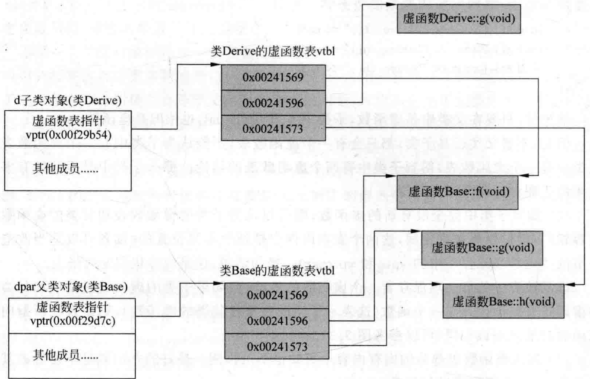

# 3.3虚函数表分析  

结合上一节的代码，绘制一下父类对象和子类对象内存布局示意图，如图3.3所示。  

  
图3.3父类对象和子类对象内存布局示意图（虚函数）  

结合上一节的具体代码，上面这个图不难理解。这里总结一下：  

（1）包含虚函数的类才会有虚函数表，同属于一个类的对象共享这个虚函数表，但是每个对象都有各自的vptr（虚函数表指针），当然该指针所指向的地址（虚函数表首地址）相同。  

例如，增加如下这行代码：  

``` cpp
Derive * d2 = new Derive(); //d2和d虽然都指向不同的地址（代表不同的对象），但是这两个地址中的四个字节的内容相同，因为这四个字节代表的是Derive类虚函数表的首地址
```

（2）父类中有虚函数就等于子类中有虚函数。换句话说，父类中有虚函数表，则子类中肯定也会有虚函数表，即便不覆盖父类的任何虚函数。  

读者可以尝试一下，即便注释掉Derive类中的虚函数 $\mathbf{g}$ ，使该类变成一个空类：  

``` cpp
class Derive : public Base {  
public:  
    void g()   
    {  
       cout << "Derive::g()" << endl;   
    }  
};
```

sizeof（Derive）的值依旧是4。这个4就代表虚函数表指针所占用的内存空间。  

也可能有人认为，如果在子类中把所覆盖的父类中的虚函数的virtual修饰符去掉，这些函数就不再是虚函数了。例如如下：  

```cpp
class Derive : public Base
{
void f() { cout << "Derive::f()" << endl; }
void g() { cout << "Derive::g()" << endl; }
void h() { cout << "Derive::h()" << endl; }
};
```

请记住，只要在父类中是虚函数，子类中不用写virtual，也依旧是虚函数。  

但是，不管父类还是子类，都只会有一个虚函数表，不能认为子类中有一个虚函数表 $^+$ 父类中有一个虚函数表，得到子类中有两个虚函数表的结论。那么子类中是否可能有多个虚函数表呢？后面会逐步介绍。  

（3）如果子类中完全没有新的虚函数，则可以认为子类的虚函数表和父类的虚函数表内容相同，但仅仅是内容相同，这两个表在内存中是处于不同位置的（读者可以适当改造上一节的代码并观察程序中的vptr和vptrpar）。换句话说，这是内容相同的两张表。  

虚函数表中的每一项保存着一个虚函数的地址，但如果子类的虚函数表某项和父类中的虚函数表某项代表同一个函数（这表示子类没有覆盖父类的虚函数），则该表项所指向的该函数的地址应该相同（可以参考图3.3）。  

（4）超出虚函数表部分的内存内容不可知也不可预测。最好的办法就是不要触碰其中的内容，以免出现程序运行异常。  

本节的范例接着上一节，但在继续讲解新知识之前，请将main主函数中原有的代码全部注释掉，加人如下新代码：  

``` cpp
typedef void(*Func)(void);  
  
Derive derive;  
long* pvptrderive = (long*)(&derive);  
long* vptrderive = (long*)(*pvptrderive);  
Func f1 = (Func)vptrderive[0];     //project4.exe!Base::f(void)  
Func f2 = (Func)vptrderive[1];     //project4.exe!Derive::g(void)  
Func f3 = (Func)vptrderive[2];     //project4.exe!Base::h(void)
```

现在，观察一下vptrderive的值，并记录下来，该值就是类Derive的虚函数表的地址。然后，再生成一个子类对象，继续在main主函数中加人如下代码（注意代码中的注释）：  

``` cpp
Derive derive2 = derive; //拷贝构造  
long* pvptrderive2 = (long*)(&derive2);  
long* vptrderive2 = (long*)(*pvptrderive2); //所指向的地址和vptrderive一样，说明两个对象指向的是同一个虚函数表（子类Derive的虚函数表）
```

继续在main主函数中加人如下代码：  

``` cpp
Base base = derive; //直接用子类对象给父类对象值  
long* pvptrbase = (long*)(&base);  
long* vptrbase = (long*)(*pvptrbase);  
Func fb1 = (Func)vptrbase[0];      //project4.exe!Base::f(void)  
Func fb2 = (Func)vptrbase[1];      //project4.exe!Base::g(void)  
Func fb3 = (Func)vptrbase[2];      //project4.exe!Base::h(void)
```

观察上面的代码可以看到，base对象的数据是从derive复制过来的。那为什么base中的vptrbase和derive中的vptrderive不一样呢？按理说如果复制过来数据，则虚函数表指针也应该相同，系统内部做了什么处理呢？  

当用一个子类对象初始化一个父类对象时，如Base base=derive；代码行，因为子类对象内存一般来讲都有更多的成员，所以子类对象内存占用一般都比父类对象内存占用大，最差子类对象内存占用量也会等于父类对象内存占用量，肯定不会小于父类对象内存占用量。所以子类对象（内存）会被切割出一部分（父类子部分）复制到父类对象（内存）中去，所以，Base base=derive;代码行其实是做了两个事情：①生成一个base对象；②用derive来初 始化base对象的值。所以编译器在这里为程序员做了一个选择——derive初始化base对象时，derive的虚函数表指针值并没有覆盖base对象的虚函数表指针值，编译器帮助程序员做到了这一点。

这里笔者额外要谈一下OO（面向对象）和OB（基于对象）的概念。  

读者都有 $\mathrm{C++}$ 编程基础，所以都知道 $\mathrm{C++}$ 是通过类对象的指针和引用来支持多态的，这种程序设计风格就是常说的面向对象模型一一OOM（Object-OrientedModel）。  

还有一种程序设计风格叫作基于对象OB（Object-Based），这种风格以前叫作抽象数据模型ADT（AbstractDatatypeModel），这种模型不支持多态，所以在这种模型下的对象运行速度更快，因为函数调用的解析不需要运行时决定（没有多态或者说没有虚函数），而是编译期间就解析完成，内存空间紧程度上更紧凑，因为没有虚函数指针和虚函数表的概念。但是显然OB的这种设计灵活性上与OO比就要差一些。  

$\mathrm{C++}$ 既支持面向对象程序设计，也支持基于对象程序设计，继承机制和多态性机制就摆在那里。不用，就是基于对象的程序设计：用了，就是面向对象的程序设计。弹性和效率方面如何选择，取决于程序员。