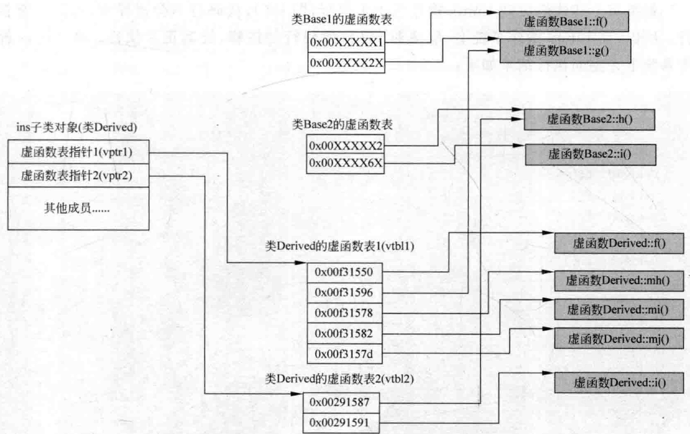
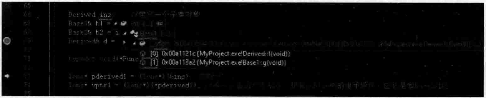
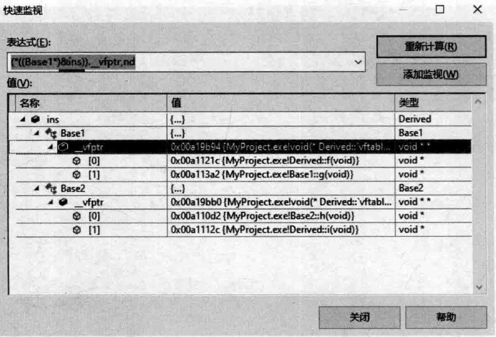

# 3.4多重继承虚函数表分析  

通过前面的学习已经知道，虚函数表指针跟着对象走，一个虚函数表指针在当前VisuaiStudio2019演示中占4个字节。  

本节将展示一下在多重继承时，虚函数表的样子。  

看看如下范例。在MyProject.cpp的上面，增加如下三个类（两个父类一个子类）的定义代码：  

``` cpp
//父类1  
class Base1  
{  
public:  
    virtual void f() {  
       cout << "base1::f()" << endl;  
    }  
  
    virtual void g() {  
       cout << "base1::g()" << endl;  
    }  
};  
  
//父类2  
class Base2  
{  
public:  
    virtual void h() {  
       cout << "base2::h()" << endl;  
    }  
    virtual void i() {  
       cout << "base2::i()" << endl;  
    }  
};  
  
//子类  
class Derived : public Base1, public Base2  
{  
public:  
    virtual void f() {  
       cout << "derived::f()" << endl;  //只覆盖base1的f  
    }  
  
    virtual void i() {  
       cout << "derived::i()" << endl;  //只覆盖base2的i  
    }  
  
    //如下三个是本类自己的虚函数  
    virtual void mh() {  
       cout << "derived::mh()" << endl;  
    }  
    virtual void mi() {  
       cout << "derived::mi()" << endl;  
    }  
    virtual void mj() {  
       cout << "derived::mj()" << endl;  
    }  
};
```

在main主函数中，加人如下代码（请详细阅读代码行中的注释）：  

``` cpp
cout << sizeof(Base1) << endl;    //4  
cout << sizeof(Base2) << endl;    //4  
cout << sizeof(Derived) << endl;  //8字节，这说明Derived里有两个虚函数表指针（2个vptr）  
  
Derived ins;    //定义一个子类对象  
Base1& b1 = ins;  
Base2& b2 = ins;  
Derived& d = ins;  
  
typedef void(*Func)(void);  
  
long* pderived1 = (long*)(&ins);  
long* vptr1 = (long*)(*pderived1); //第一个虚函数表指针，根据public中的继承顺序，应该是和base1对应  
  
long* pderived2 = pderived1 + 1;   //往后走4个字节  
long* vptr2 = (long*)(*pderived2); //第二个虚函数表指针  
  
//这些条目有规律，先从第一个继承的父类里找函数，如果自己覆盖的，就弄成自己的，如果自己没覆盖的，就弄成父亲的  
//然后接着是自己的虚函数首地址  
Func f1 = (Func)vptr1[0];   //0x00f31550 {project100.exe!Derived::f(void)} Func f2 = (Func)vptr1[1];   //0x00f31596 {project100.exe!Base1::g(void)}  
Func f3 = (Func)vptr1[2];   //0x00f31578 {project100.exe!Derived::mh(void)}  
Func f4 = (Func)vptr1[3];   //0x00f31582 {project100.exe!Derived::mi(void)}  
Func f5 = (Func)vptr1[4];   //0x00f3157d {project100.exe!Derived::mj(void)}  
Func f6 = (Func)vptr1[5];   //0x0029aa64 {project100.exe!const Derived::`RTTI Complete Object Locator'{for `Base2'}}  
Func f7 = (Func)vptr1[6];   //后面先不管  
Func f8 = (Func)vptr1[7];   //后面先不管  
  
//这里找继承的另外一个父类，如果自己覆盖的，就弄成自己的，如果自己没覆盖的，就弄成父亲的  
Func f11 = (Func)vptr2[0];  //0x00291587 {project100.exe!Base2::h(void)}  
Func f22 = (Func)vptr2[1];  //0x00291591 {project100.exe!Derived::i(void)}  
Func f33 = (Func)vptr2[2];  //非法  
Func f44 = (Func)vptr2[3];  //非法  
  
b1.f();  //derived::f()，父类引用，但引用的是子类，所以这里执行子类所覆盖的父类的虚函数  
b2.i();  //dervied::i()，父类引用，但引用的是子类，所以这里执行子类所覆盖的父类的虚函数  
d.f();   //derived::f()  
d.i();   //derived::i()   d.mh();  //derived::mh()
```

执行起来，看一看结果：  

``` cpp
4
8
Derived: :f()
Derived::i()
Derived: :f()
Derived: :i()
Derived: :mh()
```

继续在main主函数中增加虚函数的一些直接调用代码如下：  

``` cpp
cout << "-------------------" << endl;  
f1();    //derived::f()  
f2();    //base1::g()  
f3();    //derived::mh()  
f4();    //derived::mi()  
f5();    //derived::mj()  
//f6();    //异常，报错  
cout << "-------------------" << endl;  
f11();   //base2::h()  
f22();   //derived::i()  
cout << "-------------------" << endl;
```

执行起来，看一看新增的代码段显示的结果：  


注意到上述结果，执行代码行f6（）；会导致执行出现异常。  

如果将上述代码放到Linux操作系统去执行，则f6（）；代码行不会报异常，可以正常执行。所以，在Linux操作系统上，取消对f6（）；代码行的注释，让其正常执行。在Linux操作系统下完整的执行结果如下：  

  

可以看到，在Linux操作系统下，除上面三个数字显示的分别是8、8、16（因为是 $\mathbf{x}64$ 平台），与Windows操作系统下的VisualStudio2019显示的结果不一样外，一些表项看起来也不太一样：Linux操作系统下的第一个虚函数表项多出一个Derived：：i（）来。  

这表示VisualStudio2019编译器在虚函数表方面的设计和实现与 $\mathbf{g}^{++}$ 编译器略有不同。  

有几点说明：  

$(1)$ 一个对象，如果它所属的类有多个基类，则有多个虚函数表指针（注意是多个虚函数表指针，而不是多个虚函数表，不要搞混）。  

代码行cout  $<<$  sizeof(Derived)  $<<$  endl；输出的结果为8（Visual Studio 2019  $\mathbf{x86}$  平 台下），这说明Derived里有两个虚函数表指针（2个vptr）。  

在多重继承中，vp tr（class Derived：public Basel，publicBase2；）依次放置在类内存空间中，且子类与第一个基类共用同一个vptr（第二个基类有自已的vptr）。Derived Basel，后继承了Base2。  

（2）补充，图3.4适合VisualStudio2019编译器，不代表也适合其他的VisualStudio版本，也不代表适合Linux下的 $\tt g^{++}$ 编译器（如刚才看到了 $g^{++}$ 编译器的表现就不太一样）。但这没有任何关系，读者只要知道原理，知道笔者写的这些代码的目的，那么在任何编译器上，只要输人这些代码并进行适当的分析，都能很清楚地了解针对这个编译器的多重继承虚函数表特性，请读者举一反三。通过观察上面程序的输出结果，绘制出了多重继承下的子类对象内存布局示意图，如图3.4所示。  

  
图3.4多重继承下的子类对象内存布局示意图（虚函数）  

从图3.4可以看到：  

（1）子类对象ins有两个虚函数表指针—vptr1和vptr2。

（2）类Derived有两个虚函数表，因为它继承自两个基类。  

（3）子类和第一个基类共用一个vptr（所以也可以说子类和第一个基类共用一个虚函数表vtbl1），因为可以注意到类Derived的虚函数表1（vtbl1）里面的5个函数中，g正好是类Basel里的虚函数。  

（4）子类中的虚函数覆盖了父类中的同名虚函数，如Derived：：f和Derived：：i。  

另外，VisualStudio编译器也提供了基本的查看虚函数表的能力，但笔者感觉这些信息不全，只能查看到一部分，供读者参考。  

设置断点并进行调试，当程序执行流程停到断点行时，该断点行前面定义过的各种类对象都可以用鼠标放上去，展开进行观察，如图3.5所示。  

  
图3.5通过VisualStudio编译器观察某个类对象的虚函数表信息  

或者选中某个类对象，然后按下Shift $^+$ F9键，也可以查看。利用这种手段辅助分析，如图3.6所示。  

  
图3.6通过快速监视窗口观察某个类对象的虚函数表信息