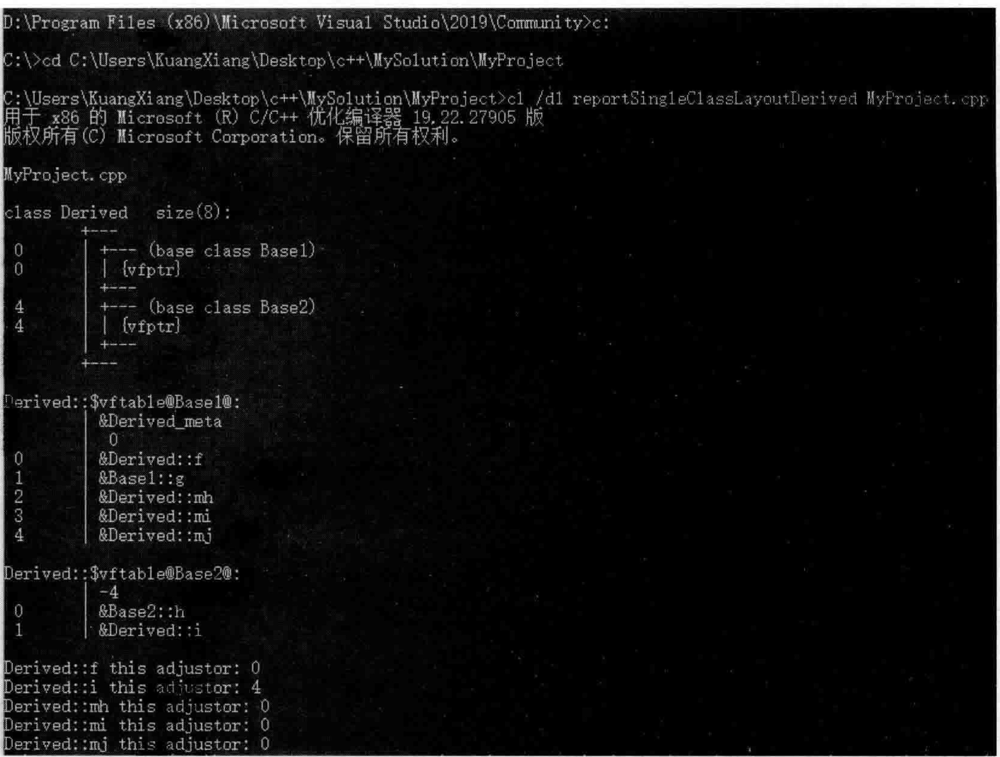
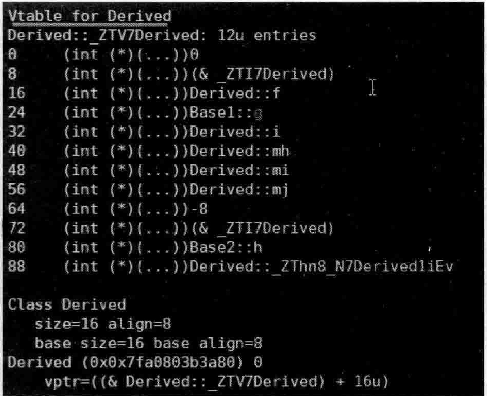
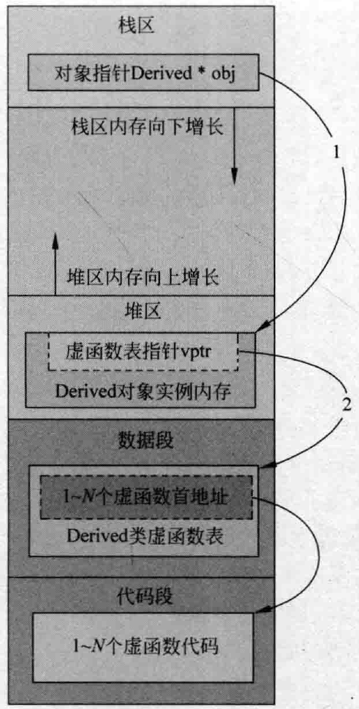

# 3.5辅助工具与vptr、vtbl创建时机  

## 3.5.1使用辅助工具香看虚函数表  

上一节讲解的范例代码，在本节保持不变。  

前面对于虚函数表，已经通过写代码的方式了解了不少虚函数表的组织结构。那么，有没有什么能借助的工具来辅助分析一下虚函数表的结构呢？还是有的。  

在VisualStudio2019（或其他VisualStudio版本）中打开开发人员命令行工具，忘记如何打开的读者可以参考图2.9。在这个命令行提示符下，可以直接使用cl命令行工具（cl是编译链接工具）。  

在命令行提示符下，进人到MyProject.cpp文件所在的路径，并输人cl/dlreport Single Class Layout Derived My Project.cpp，如图3.7所r示。  

注意上面的这个命令：  

（1）区分c1和d1，-个是小写字母1，一个是数字1，两者看上去比较像。  

（2）report Single Class Layout。  

（3）最后面跟的是要查看的类所在的.cpp源文件名。  

注意比较图3.7和图3.4。图3.7也明显指出了类Derived对象中包含两个虚函数表指针（vfptr/vptr），并分别列出了所指向的两个虚函数表和其中的表项。  

在Linux操作系统下，使用 $\mathbf{g}^{++}$ 编译器，可以利用-fdump-class-hierarchy的层次结构。命令行如下：  

g++-fdump-class-hierarchy-fsyntax-only My Project.cpp 

此时，系统会生成一个扩展名为.class的文件，该文件里就有类的布局信息。可以利用  

  
图3.7-Windows操作系统下使用cl工具查看类的虚函数表组织结构图  

vim来查看这个.class文件的内容。这个.class文件很长，大概有接近2ooo行内容，就看最后的位置就行，因为最后位置显示的就是Derived类的虚函数指针和指向的虚函数表信息，如图3.8所示。  

  
图3.8一Linux操作系统下查看类的虚函数表组织结构图  

图3.8与图3.7所显示的内容虽然有些区别，但是大同小异，核心的内容相信读者都已经理解了。  

## 3.5.2虚函数表的创建时机  

现在，请想一想，vptr（虚函数表指针）是什么时候创建的呢？  

读者已经知道，vptr是跟着对象走的，对象创建出来了，才存在这个vptr。对象什么时候创建出来的呢？当然是程序运行的时候。  

实际上，对于这种有虚函数的类，在编译时候，编译器会往类的构造函数中安插为vptr赋值的语句，这是在编译期间做的。这是编译器默默在背后为程序员做的事情，程序员并不知道。  

当程序运行的时候，遇到创建该类对象的语句时，会执行该类的构造函数，因为构造函数中有给vptr（要创建的对象所属的vptr）赋值的语句，从而让这个对象的vptr变得有有效值。  

谈完了vptr是什么时候创建的，现在谈一谈虚函数表vtbl是什么时候创建的。实际上，编译器在编译期间（不是运行期间）就为每个类确定好了对应的虚函数表vtb的内容，然后也是在编译期间在相应的类构造函数中添加给vptr赋值的语句，这样程序运行的时候，当运行到生成类对象的代码时，会调用类的构造函数，执行到类的构造函数中的给vptr赋值的语句时，这个类对象的vptr就有值了。  

下面再进一步展开一点讨论，让读者更清晰一些。  

当书写一个 $\mathrm{C++}$ 程序，经过编译、链接的步骤，最终会生成一个可执行程序（文件）。可执行程序遵循一定的文件格式，这样当执行这个可执行程序时，操作系统会把这个可执行程序根据约定的格式装载到内存中并开始执行。  

一般来讲，一个可执行程序必然有“代码段”和“数据段”用于存储各种要执行的代码和各种必要的数据。  

当这个可执行程序装载到内存后，它的代码段、数据段也一并被装载到了内存中，同时，操作系统还会根据一定的规则为这个可执行程序分配各种内存空间（如果读者真的对这方面知识特别有兴趣，笔者推荐《程序员的自我修养一一链接、装载与库》一书），如堆、栈之类的。所以，当一个可执行程序被装载到内存执行的时候，看起来大概如图3.9所示。  

在图3.9中可以看到，可执行程序中的数据段、代码段被分别载人内存，同时还有栈区和堆区用于在程序执行的过程中分配内存。  

如果执行下面这样一行代码，看一看流程是什么样，内存是什么样：  

``` cpp
Derived * obj = new Derived();
```

上面这行代码（参考图3.10辅助理解），定义了一个obj指针，这个指针当然是在栈上分配的4字节内存（这个obj本身是一个局部变量，是在栈上分配内存的），当new一个类Derived对象时，obj就会指向一个堆内存（堆区），new出来的Derived对象实例就保存在堆区中，该对象实例中的虚函数表指针vptr在执行了类Derived的构造函数代码后，就指向了存在于数据段中的类Derived的虚函数表首地址，而虚函数表中的每一项都指向代码段中某个虚函数的代码。  

  
图3.9可执行程序被载人到内存时的内存结构图  

  
图3.10new一个类对象时虚函数表指针、虚函数表、虚函数内存结构图