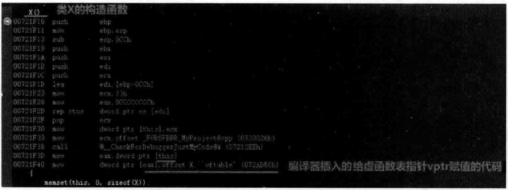
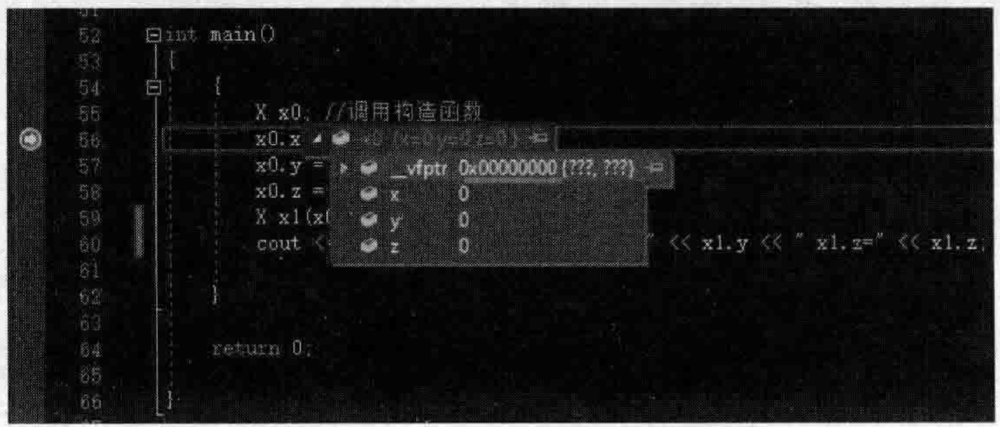
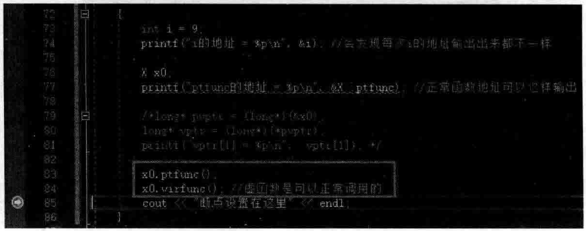
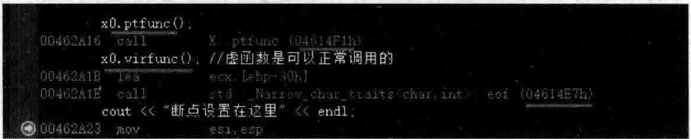
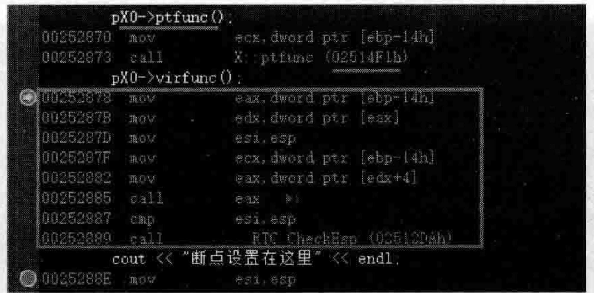
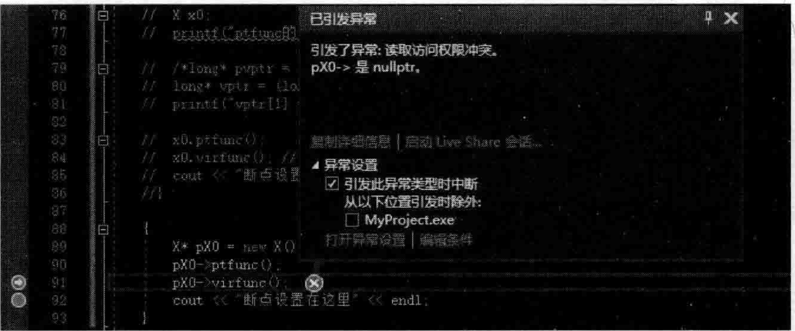

# 3.6.单纯的类不纯时引发的虚函数调用问题  

看看如下范例。在MyProject.cpp的上面，增加类X的定义代码：  


``` cpp
class X  
{  
public:  
    int x;  
    int y;  
    int z;  
    X() :x(0), y(0), z(0)  
    {       cout << "X类的构造函数被执行" << endl;  
    }
    X(const X& tm) :x(tm.x), y(tm.y), z(tm.z)  
    { 
          cout << "X类的拷贝构造函数被执行" << endl;  
    }
};
```

在main主函数中，加人如下代码：  


``` cpp
X x0; //调用构造函数  
x0.x = 100;  
x0.y = 200;  
x0.z = 300;  
X x1(x0); //调用拷贝构造函数   
cout << "x1.x=" << x1.x << " x1.y=" << x1.y << " x1.z=" << x1.z << endl;
```

执行起来，看一看结果：  

``` cpp
X类的构造函数被执行
X类的拷贝构造函数被执行
x1.x=100 x1.y=200 x1.z=300
```

可以看到，X这种类只有一些简单的成员变量，所以是很单纯的类。这种单纯的类，拷贝构造函数可以写的更有效率一点。修改类X的拷贝构造函数，修改后的代码如下：  

``` cpp
X(const X& tm)  
{  
    memcpy(this, &tm, sizeof(X));  
    cout << "X类的拷贝构造函数被执行" << endl;  
}
```


这种改造后的拷贝构造函数是通过调用memcpy直接进行内存复制，与原来的拷贝构造函数效果一样。  

另外，在类X的构造函数中，如果只有一些数值类型的成员变量，并且它们的初始值都为0，那么可以这样来修改类X的构造函数：  

``` cpp
X()  
{  
    memset(this, 0, sizeof(X));  
    cout << "X类的构造函数被执行" << endl;  
}
```

笔者相信，现实项目中，会有这样写程序的人。再次执行程序，结果没有发生变化。  

如果这个类（类X）像现在这样单纯，那么，上述这种使用memcpy、memset函数并将this作为第一个参数的写法都没有向题。但是，如果这个类并不单纯，那么上面这种用memcpy、memset函数的写法就是错误的，会导致程序崩溃。那么什么叫类并不单纯呢？  

那就是，在某些情况下，编译器会往类内部增加一些程序员看不见但真实存在的成员变量（隐藏的成员变量），有了这种变量的类，就不单纯了。  

同时，这种隐藏的成员变量的赋值时机往往都是在执行构造函数或者拷贝构造函数的函数体之前进行的。那么，请想一想：  

（1）构造一个类对象时，编译器给一些隐藏的成员变量赋值，然后在构造函数的函数体中，一执行memset，很可能把这些值覆盖（清零）了。  

（2）而复制构造一个对象时，往往对象与对象之间（复制的源对象与目标对象之间），这些隐藏的成员变量的值可能并不相同，在执行拷贝构造函数时，一执行memcpy，就会造成源对象中隐藏的成员变量值覆盖了自标对象中隐藏的成员变量值。  

例如，如果类中有一个虚函数，系统就会默认往类对象里增加一个虚函数表指针，这就是一个隐藏的成员变量。  

请注意，现在笔者向类X中增加一个public修饰的虚析构函数、一个普通的虚成员函数和一个普通的成员函数：  

``` cpp
public:  
    virtual ~X()  
    {  
       cout << "X类的析构函数被执行" << endl;  
    }  
    virtual void virfunc()  
    {  
       cout << "虚函数virfunc()执行了" << endl;  
    }  
    void ptfunc()  
    {  
       cout << "普通函数ptfunc()执行了" << endl;  
    }
```

那么，现在类X中有了虚函数，编译的时候，编译器就会往类X的构造函数插人诸如下面的代码行：  

``` cpp
vptr=vtbl；//把类X的虚函数表vtbl的首地址赋值给隶属于某个类的vptr（虚函数表指针）
```

或者是：  

``` cpp
this = vtbl；//this代表对象的首地址，而虚函数表指针就位于对象的首地址开始的四个字节里，所以这也相当于让对象的虚函数表指针vptr指向类X的虚函数表vtbl
```

其实读者只要设置一个断点在类X的构造函数所在行，按F5键执行程序并开始调试，当程序执行停留在断点行时，切换到反汇编窗口，不难看到编译器插入的用于给vptr赋值的语句，如图3.11所示。  

  
图3.11编译器插人的用于给虚函数表指针vptr赋值的语句  

问题来了，如果紧接着，在类X的构造函数的函数体中，执行memset（this，0，sizeof（X））；代码行，则会导致刚刚被赋值的vptr的值被清零（内存内容变成了0），可以设置断点调试一下观察vptr被清零的情形（这次断点设置在main主函数中的XxO：语句行的下一行），如图3.12所示。  

  
图3.12对memset的误用导致类X对象的虚函数表指针vptr被清零  

这个时候，按照理解，vptr被无意中清零，程序执行起来应该就会有问题，尤其是对虚函数调用要通过虚函数表指针vptr来进行，现在vptr值被破坏，还能正常调用虚函数吗？  

运行整个程序，根据执行结果，可以发现 $\mathbf{x}0$ 这个类对象的析构函数还是能正常执行。析构函数是虚函数，而vptr值被破坏，按道理来说调用虚函数会出现问题，但为什么 $\mathbf{x0}$ 类对象在程序终止时看起来却能够正常执行类X的析构函数（虚函数）呢？  

读者可以再次运行程序，结果如下，看起来程序运行结果是正常的，没有受到vptr值被破坏的影响，析构函数能够正常执行：  

``` cpp
类X的构造函数被执行
类X的拷贝构造函数被执行
x1.x=100 x1.y=200 x1.z=300 
类X的析构函数被执行
类X的析构函数被执行
```

如果在main主函数中增加代码行来调用一个虚函数，发现也能正常调用：  

``` cpp
x0.virfunc();  
```

虚函数virfunc（）执行』  

既然程序代码已经把虚函数指针清零了，为什么还能成功调用虚函数？  

于是，笔者修改一下写法。在main主函数中，注释掉原有代码，加人如下代码：  

``` cpp
X* px0 = new X();  
px0->ptfunc();  //可以正常调用普通该函数  
px0->virfunc(); //无法正常调用该虚函数  
delete px0;     //无法正常调用析构函数
```


运行起来，会发现普通函数可以正常调用，而virfunc虚函数无法正常调用，析构函数也无法正常调用（因为析构函数也是一个虚函数），总之一句话：虚函数变得没法正常执行厂。  

现在看到的现象是：生成一个类X的局部对象（对象在栈中），不影响通过该对象调用虚函数以及不影响该对象的正常析构，但如果用new在堆中生成一个类X的对象实例并用对象指针指向该对象实例，再用这个对象指针调用虚函数，或者delete该指针，程序执行都变得不再正常（虚函数无法被调用，指针指向的堆中的对象也无法调用虚析构函数）。这是为什么呢？  

读者对多态、虚函数、父类、子类这些概念都很清楚，也应该知道，虚函数的应用场景主要是父类指针指向子类对象的情形（有父子关系的情况下，虚函数才能体现出其作用来）。而目前的范例程序代码，只有一个X类，并不存在父类子类这种说法，只不过是在类X中有虚函数而已。那么，只有虚函数，没有继承关系时，虚函数和普通函数从功能上来说有什么区别呢？这种情况下虚函数和普通函数并没有什么区别。  

现在，把以往main主函数中的代码注释掉，并增加如下新代码行，来演示一个新内容：

``` cpp
int i = 9;  
printf("i的地址 = %p\n", &i); //会发现每次i的地址输出出来都不一样
```

将程序多执行几次，发现每次输出的i的地址都会改变。  

读者已经知道，函数是跟着类走的，虚函数也一样，也是跟着类走的。所以，继续向main主函数中增加代码，输出一下函数地址：  

``` cpp
X x0;  
printf("ptfunc的地址 = %p\n", &X::ptfunc); //正常函数地址可以这样输出
```


虚函数的地址也可以输出，在3.2节演示过，这里再写一次，继续向main主函数中增加代码，输出一下虚函数地址：  

``` cpp
long* pvptr = (long*)(&x0);  
long* vptr = (long*)(*pvptr);  
printf("vptr[1] = %p\n",  vptr[1]); 
```

上面这三行代码，因为在类X的构造函数中存在memset语句，把虚函数表指针清理成零导致程序没法正常运行，因此，现在把类X的构造函数中的memset（this，O，sizeof（X））；语句行暂时注释掉。  

执行起来，看一看结果：  

``` cpp
i的地址=008FF7A8
X类的构造函数被执行
ptfunc的地址=001614F1
vptr[1]=001614E7
X类的析构函数被执行
```

成功看到了vptr1的地址后，取消X构造函数中memset语句行的注释，然后把上面三行打印虚函数地址的代码注释掉，并继续往main函数中增加如下两行代码：  

``` cpp
x0.ptfunc();  
x0.virfunc(); //虚函数是可以正常调用的
```

执行起来，看一看结果：  

``` cpp
i 的地址= 004FFDB4
x 类的构造函数被执行
ptfunc的地址=004614F1
普通函数ptfunc（）执行了
虚函数virfunc()执行了 
X类的析构函数被执行
```

将程序多执行几次，发现每次输出的i的地址都会改变。但ptfunc的地址都不发生变化（都是004614F1）。  

如果把断点设置到 $\mathbf{x}0$ .virfunc（）；行的下一行，按F5键开始运行程序，当程序运行到断点行并停下来时，切换到反汇编窗口，如图3.13和图3.14所示。  

  
图3.13设置断点并运行程序后程序运行停止到断点行  

  
图3.14程序运行停止到断点行后通过反汇编窗口观察函数的人口地址  

图3.14中显示的04614F1h和04614E7h正是普通函数ptfunc和虚函数virfunc的地址。多次执行程序或者设置断点调试，每次运行这两个地址的值都不会改变。据此可以推断，该普通函数的地址和虚函数的地址是在编译的时候就确定了的。  

现在引人“静态联编”和“动态联编”这两个概念：  

（1）静态联编：编译的时候就能确定调用哪个函数，把调用语句和被调用函数绑定到一起。  

（2）动态联编：在程序运行的时候，根据实际情况，动态地把调用语句和被调用函数绑定到一起，动态联编一般只有在多态和虚函数情况下才存在。  

有了这种概念作为铺垫，就不难分析出来，其实：  

``` cpp
X x0;
x0.ptfunc();  
x0.virfunc();
```

这几行代码就属于静态联编，别看调用的是虚函数，因为无论普通函数还是虚函数，在编译的时候都是有固定地址的，所以，这种直接以定义对象的方式来生成一个对象并通过该对象调用虚函数时根本用不到虚函数表，所以，即使把对象中的虚函数表指针清零，也不影响对虚函数的调用，因为编译时对这些函数的调用就已经确定厂，绑定了。  

反观如下代码：  

``` cpp
X* pX0 = new X();  
pX0->ptfunc();  
pX0->virfunc();
```


可以仿照上面这样设置断点位于虚函数调用这一行，按F5键执行程序，并在停止到断点行时查看反汇编代码，如图3.15所示（请读者注意比较图3.14和图3.15中的针对虚函数调用的汇编代码行的区别）。  

  
图3.15程序运行停止到断点行后通过反汇编窗口观察new的对象进行虚函数调用时对应的汇编代码  

观察图3.15，不难发现，pX0调用普通函数ptfunc，它是直接调用（call的，因为普通函数有固定的地址，是在编译的时候确定好的（静态联编）。  

而pXo调用虚函数virfunc，可不是直接调用，而是执行了一堆代码，这堆代码就是为了实现多态用的，做的事情是通过虚函数表指针去找虚函数表，然后从中找到虚函数virfunc的地址并进行调用。但可惜的是，虚函数表指针已经在类X的构造函数中通过memset被清零了，所以这段代码不可能找到虚函数表地址，更不可能找到虚函数virfunc的地址。所以执行到调用virfunc虚函数代码行时程序会报异常，如图3.16所示。  

  
图3.16因为虚函数表指针被清零导致无法正确调用虚函数  

这就是在栈上生成一个对象：  

``` cpp
X x0;
```

和利用new在堆上new一个对象：  

``` cpp
X* pX0 = new X();
```


它们调用虚函数时的不同：一个是直接调用虚函数，一个是通过虚函数表指针找到虚函数表，在虚函数表中查询虚函数地址再调用该虚函数。所以读者更明白了，其实虚函数、多态这种概念是专门给指针和引用来使用的。  

上面的代码中， $\mathrm{pX0}$ 是一个指针，如果换一种写法（下面的xly就是一个引用）：  

``` cpp
X x1;  
X& x1y = x1; //引用      x1y.virfunc();//也报异常，因为虚函数表指针被清零导致无法找到虚函数表，从而也无法执行虚函数
```


当然，这种多态要真正发挥作用，还需要类继承关系存在（也就是有父类有子类）的情况下才能体现出来：一般都是父类指针指向子类的对象，或者是父类引用引用了子类对象。  

本例中没有子类，所以多态的效果体现不出来，但是通过上面的分析，无疑，它实际上就是多态的实现手段：用到了虚函数表指针和虚函数表来进行虚函数的调用。  

所以，回归到本节开始，请切记：  

一个类，一旦变得不再单纯，就千万不能在构造函数中使用诸如memset或在拷贝构造函数中使用memcpy等来覆盖类对象所在内存空间中的内容，否则，一旦用到该类对象指针或者引用去调用虚函数，那么一定会出问题甚至导致程序执行崩溃。  

读者已经知道，一个类中，一旦增加了虚函数，就变得不再单纯，编译器要往类中插人代码。那么同理，如果一个类中有虚基类，这个类也将变得不再单纯，编译器也同样要往类中插入代码，所以，有虚基类的场合，也千万不要在构造函数中使用诸如memset或在拷贝构造函数中使用memcpy等来覆盖类对象所在内存空间中的内容，否则，一样会面临程序不知何时会执行崩溃的局面。  

有关虚基类的问题，后面章节会详细阐述。