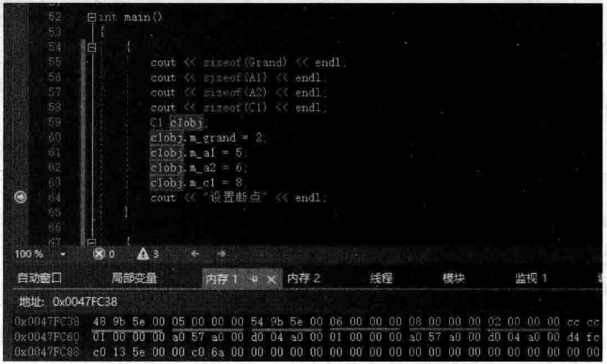

# 4.10三层结构时虚基类表内容分析与虚基类设计原由  

## 4.10.1三层结构时虚基类表内容分析  

上一节研究分析了两层结构时虚基类表的内容，本节再回过头来看一看传统的三层结构（爷爷、父亲、孙子）时虚基类表的内容。为简单清晰起见，本节重新书写范例代码（实际上就是4.8节后期的范例代码）。在MyProject.cpp的上面，增加如下代码行：  

``` cpp
class Grand //爷爷类  
{  
public:  
    int m_grand;  
};  
class A1 : virtual public  Grand//注意这里用了virtual  
{  
public:  
	int m_a1;  
};  
class A2 : virtual  public  Grand//注意这里用了virtual  
{  
public:  
    int m_a2;  
};  
class C1 :public A1, public A2 //这里不需要virtual  
{  
public:  
    int m_c1;  
};
```

在4.8.2节已经分析过传统虚基类结构的三层对象布局，其中sizeof（C1）的值是24。这24个字节的布局如图4.48所示。  

在main主函数中，加人如下代码：  

``` cpp
cout << sizeof(Grand) << endl;  
cout << sizeof(A1) << endl;  
cout << sizeof(A2) << endl;  
cout << sizeof(C1) << endl;
C1 clobj;
cobj.m_grand = 2;
cobj.m_a1 = 5;
cobj.m_a2 = 8;
cobj.m_c1 = 8;
```

对象c1obj的整个24字节内存内容如图4.63所示。  

  
图4.63对象clobj的整个24字节内存内容  

看一下vbptrl，在 $1{\sim}4$ 学节，地址是 $\mathrm{0x005E9B48}$ ，内存里的内容如图4.64所示。
看一下vbptr2，在 $9\!\sim\!12$ 字节，地址是 $0{\bf x}005{\bf E}9854$ ，内存里的内容如图4.65所示。  

  
图4.64C1类所关联的第一个虚基类表的内容  

  
图4.65C1类所关联的第二个虚基类表的内容  

现在结合上面的这些内容，可以把图4.48进一步完善一下，如图4.66所示。  

  
图4.66类C1对象数据布局以及其所指向的两个虚基类表  

图4.66中的这种 $\mathrm{0x005E9B48\,,0x005E9B54}$ 就是虚基类表的首地址，这种虚基类表读者已经知道，它编译的时候就已生成好（跟着C1类走并依附于该类），这些地址也都是固定的。如果在main主函数中创建一个新对象，例如：  

``` cpp
C1 c2obj;  
```

可以发现，c2obi的虚基类表指针的内容与clobj完全一样，clo bj c 2 obj向的虚基类表完全相同，这一点读者要认识到。  

  
图4.67：创建类C1对象clobj时的反汇编代码即将调用类C1的构造函数  

可以进人到C1类的构造函数去看一看。  

将断点设置在C1c1obi：代码行，按F5键开始调试，当程序执行流程停到断点行时，切换到反汇编窗口，如图4.67所示。  

按F10键向下走两行，遇到构造函数C1：：C1时按F11键走进该构造函数里面去（这里根据具体编译器不同可能还需要再按一次F11键）。  

类C1构造函数中的汇编代码如图4.68所示。  

从图4.68可以看到，在类C1的构造函数里，给这两个虚基类表指针（vbptr1和vbptr2）赋值，内容正好应该是刚刚看到的内存 $(\,0\,\mathbf{x}005\,\mathbf{E}9\mathrm{B}48\,,0\,\mathbf{x}005\,\mathbf{E}9\mathrm{B}54\,)$ 中的内容，然后这里又调用了A1和A2类的构造函数。  

  
图4.68类C1构造函数中所做的事  

在反汇编窗口继续按F10键一行一行跟踪代码行的执行，遇到构造函数A1：：A1时按F11键走进该构造函数里面去看一看（这里根据具体编译器不同可能还需要再按一次F11键），如图4.69所示。：  

  
图4.69类A1构造函数中所做的事  

图4.69中A1的构造函数里似乎也有一个设置虚基类表指针的语句，但这个语句前面有一个je跳转语句，这个跳转语句会跳过这里的设置虚基类表指针的语句使其不被执行。构造函数A2：：A2也是同理。所以，看得出来，给虚基类表指针值的时机实际上是在孙子类构造函数C1：：C1里面。  

把断点设置在 clo bj.m_grand $=2$ ；代码行，跟踪调试执行，看看其对应的反汇编代码，如图4.70所示。  

  
图4.70给clobj对象的m_grand成员变量赋值所对应的汇编代码  

这里读者其实也发现了一个问题，vbptr2实际是没有用到的，只用到了vbptr1。  

所以以往也谈过，这种三层结构解决了只保留一份爷爷子对象的问题，但同时引人了虚基类表指针，额外占用了内存空间（当然编译器编译时还要生成虚基类表等也同样要多占用内存）。同时，程序员要访同虚基类的成员变量，是需要通过虚基类表指针进行偏移计算的，所以在这里读者看得很清楚，上面的代码中，访问 $\mathrm{m_{-}a l_{\lambda},m_{-}a2_{\lambda},m_{-}c l}$ 等成员变量的速度明显要比访问mgrand快。将来在面试时，若面试官询问：在什么情况下，访问某个成员变量比访问其他成员变量要慢？就可以回答：访问虚基类的成员变量要比访问其他成员变量更慢。  

## 4.10.2虚基类为什么这样设计  

有些读者可能好奇，虚基类引人了很多复杂性，但是虚基类设计得如此复杂，为什么这样设计？  

这是一个非常难以回答的问题， $\mathrm{C++}$ 标准只是规定了一些框架性的东西，而编译器内部的具体实现，每一家编译器开发商都有自已的做法，上面的这些分析针对的是VisualStudio2019编译器开发商微软公司具体针对虚基类的一个实现方法。  

其他编译器厂商可能会有不同的实现方法，例如可能把虚基类表里的偏移值放到虚函数表里去，那就不用单独设计虚基类表和虚基类表指针了。总之，实现方法可能干差万别。  

有一点必须要承认，编译器开发商对各种 $\mathrm{C++}$ 模型细节的认识程度要远远超过任何常人，杏则他们根本无法开发出编译器来，他们为什么这样实现虚基类，会考虑到非常多的因素。例如，原本的三层结构（虚基类引人之前）中，是有两个Grand子对象（参考图4.35）存在的，虚继承后就变成了一个Grand子对象（参考图4.38），这种两个Grand子对象变成一个是怎样变的？C1对象布局里面父类A1和A2子对象以及类C1子对象中的成员变量如何访问？对象指针之间如何赋值（例如让父类A1的对象指针指向子类C1对象）？同时还要考虑其他继承关系如C1类通过A1和A2虚继承Grand类，但还可能同时普通继承其他的类，如图4.71所示这种继承关系图。  

如果类C1下面还有子类（如D1类），那这种虚基类Grand的成员变量在对象布局中的位置可能又要放到D1类成员变量的后面。  

另外，还有父类指针指向子类对象的情形，如下面代码的处理：  

``` cpp
A2 * pobja2 = newC1();  
```


  
图4.71虚继承与普通继承混合在一起  

所以，虚基类用起来觉得挺简单，但是编译器内部的实现绝不像表面看上去那样简单。

向main主函数中继续增加一些代码，让父类指针指向子类对象：  

``` cpp
A2* pa2 = &c1obj;  
pa2->m_grand = 8;  
pa2->m_a2 = 9;
```

可以在上面这三行代码中的任何一行设置一个断点，开始调试并观察。自然观察得到，pa2所指向的内存地址并不是clobj对象的首地址（指向的是图4.66中的A2类子对象的首地址）。例如，clobj对象的首地址可能是0x00adf9fc，而此时，pa2所指向的内存地址却是0x00adfa04.0x00adfa04-0x00adf9fc=8(这 8个字节其实就是图4.66中的A1类子对象所占的8个字节）。切换到反汇编窗口，如图4.72所示。  

从图4.72可以看到， pa2->m_grand =8; 这行代码对应的汇编代码中出现的ebp-2Ch其实就是pa2，因为pa2开始的4个字节里保存的是第二个虚基类表的首地址，所以，其实 $\mathrm{pa2->}$  m_grand $\equiv\,8$ ：这行代码用到的是图4.66中的第二个虚基类表的第 $5\!\sim\!8$ 个字节做偏移值来确定m_grand成员变量的首地址，从而为其赋值。  

  
图4.72 父类指针指向子类对象，给虚基类 成员变量赋值要经过好多步骤  

凡是访问虚基类的成员变量，都要借助虚基类表来查询偏移量.才能确定虚基类成员变 量的内存位置，比访问普通的成员要多了好几步，所以访问速度上肯定是要慢一些的。  

这里也不可能面面俱到地带着读者把各种情况下的对象数据布局全部分析到，如果有兴趣，可以通过上面这些讲解，举一反三地去研究学习。例如，如果在类Grand中有虚函数，或者在类A1、A2中有虚函数，那么可能又多出了虚函数表指针等内容，这个由读者自己扩展分析。