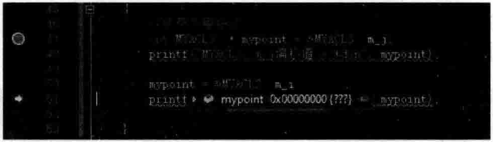
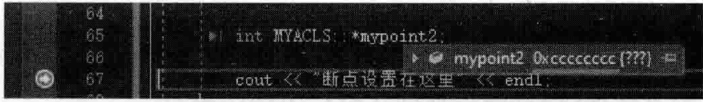
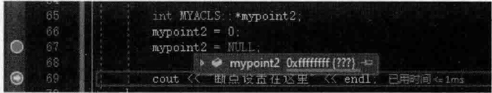

# 4.11 成员变量地址、偏移与指针等重申

## 4.11.1对象成员变量内存地址及其指针  

前面已经看到了很多数据成员布局的情形，也掌握了成员变量地址、成员变量偏移值的概念，回顾一下。  

在MyProject.cpp的上面，增加如下代码行：  

``` cpp
class MYACLS  
{  
public:  
    int m_i;  
    int m_j;  
    int m_k;  
};
```

在main主函数中，加人如下代码：  

``` cpp
MYACLS myobj;  
myobj.m_i = myobj.m_j = myobj.m_k = 0;  
printf("myobj.m_i = %p\n", &myobj.m_i); //用对象名.成员变量名，这里输出成员变量的内存地址  
  
MYACLS* pmyobj = new MYACLS();  
printf("pmyobj->m_i = %p\n", &pmyobj->m_i);  
printf("pmyobj->m_j = %p\n", &pmyobj->m_j);  
  
int* p1 = &myobj.m_i; //对象成员变量指针  
int* p2 = &pmyobj->m_j;  
*p1 = 15;  
*p2 = 30;  
printf("p1地址 = %p,p1值=%d\n", p1, *p1);  
printf("p2地址 = %p,p2值=%d\n", p2, *p2);
```

执行起来，看一看结果：  

``` cpp
myobj. m_i 00AFFDB4 
pmyobj-> m_i 00EE4FC8 
pmyobj-> m_j =00EE4FCC 
1地址=00AFFDB4,p1值=15 
p2地址=00E4FC，p2值=30
```

通过上面的演示可以看到：  

对象所属的成员变量的表现像一个独立的变量一样，有真正的内存地址，可以往地址中保存值，可以用一个指针指向对象的成员变量，也可以通过一个指针来操纵对象的成员变量，如给对象成员变量赋值等。  

## 4.11.2成员变量的偏移值及其指针  

再谈一谈成员变量偏移值的概念。这个概念应该不陌生，因为前面章节已经演示过。读者已经知道，成员变量偏移值和对象没有什么关系，不要把它和对象所属的成员变量混为一谈。  

在main主函数中，继续加人如下代码：  

``` cpp
cout << "打印成员变量偏移值---------------" << endl;  
printf("MYACLS::m_i = %d\n", &MYACLS::m_i); //打偏移值用%d更容易看懂  
printf("MYACLS::m_j = %d\n", &MYACLS::m_j);
```

执行起来，看一看结果（摘取新增加的代码产生的结果）：  

``` cpp
打印成员变量偏移值 ------------
MYACLS: m i =0 
MYACLS: :mj=4
```

用成员变量指针来输出偏移值也可以。要知道，成员变量指针里面保存的其实是偏移值，并不是真正的内存地址。  

在main主函数中，继续加人如下代码：  

``` cpp
//成员变量指针    int MYACLS::* mypoint = &MYACLS::m_j;  
printf("MYACLS::m_j偏移值 = %d\n", mypoint);  
  
mypoint = &MYACLS::m_i;  
printf("MYACLS::m_i偏移值 = %d\n", mypoint);
```

执行起来，看一看结果（摘取新增加的代码产生的结果）：  

``` cpp
MYACLS:m_j偏移值=4 
MYACLS:m_i偏移值=0
```
## 4.11.3成员变量指针和不指向任何成员变量的成员变量指针  

从上面的范例中可以看到指向第一个类中成员变量的成员变量指针，可以设置一个断点看看它的值，发现它的值是 $0(0{\bf x}00000000)$ ，如图4.73所示。  

  
图4.73成员变量指针指向类中第一个成员变量的情形  

既然成员变量指针指向了某个成员变量，那么就可以通过一个对象名或者对象指针来访问某个对象的成员变量。在main主函数中，继续加人如下代码：  

``` cpp
myobj.*mypoint = 22;   //注意写法  
pmyobj->*mypoint = 19; //注意写法
```

在函数调用中也可以使用成员变量指针作为形参。在MyProject.cpp的上面，增加如下代码：  

``` cpp
void myfunc(int MYACLS::* mempoint, MYACLS& obj)  
{  
    obj.*mempoint = 260; //注意写法  
}
```

在main主函数中，继续加人如下代码：  

``` cpp
myfunc(mypoint, myobj);  //注意调用方法  
myfunc(mypoint, *pmyobj); //注意调用方法  
cout << "sizeof(mypoint) = " << sizeof(mypoint) << endl;  //也是4字节
```

这时笔者有一点好奇：一个指向NULL的成员变量指针是否会和指向一个数据成员的成员变量指针相同呢？  

在main主函数中，继续加人如下代码：  

``` cpp
int MYACLS::*mypoint2;
```

设置断点在该代码行的下一行，并开始进行调试，当执行完该代码行后，将鼠标移动到这个成员变量指针上，观察其值，如图4.74所示。  

  
图4.74未经初始化的成员变量指针编译器默认给其值为0xcceccccc  

从图4.74可以看到，未经初始化的成员变量指针，编译器给的默认值是0xcccccccc  

当给它赋值成O或者NULL，调试时可以观察到其值是Oxffffffff，但如果输出结果的话，结果会显示为一1（0xffffffff就是一1）。在main主函数中，继续加人如下代码：  

``` cpp
mypoint2 = 0;  
mypoint2 = NULL;  
printf("mypoint2 = %d\n", mypoint2);//-1(0xffffffff)
```

设置断点在上述两行代码行的下一行，并开始进行调试，当执行完上述赋值代码行后，将光标移动到这个成员变量指针上，观察其值，如图4.75所示。  

  
图4.75给成员变量指针0或者NULL.则编译会显示其值为0xffffffff  

这说明：赋值给该成员变量指针（mypoint2）一个O值或者NULL，编译器内部给它转换成了一1而不是0。编译器的这种行为应该不难理解，因为成员变量指针是0（偏移值是0）意味着这个成员变量指针所指向的成员变量是该类对象数据布局中的第一个成员变量（前面再没有其他的人为的或者系统增加进去的成员变量），如不能有虚函数，不然系统会向类中增加虚函数表指针这种隐含的成员变量。  

所以为了区分类对象数据布局中的指向第一个成员变量的指针和一个空的成员变量指针，系统做了处理，一个空的成员变量指针，就让其值为Oxffffffff。  

根据代码mypoint=&.MYACLS::m_i;,这表示mypoint指向的是类MYACLS中的 第一个成员变量。而根据代码mypoint2=NULL；，这表示mypoint2没有指向任何类MYACLS中的成员变量，所以代码行if(mypoint= =mypoint2)这种条件显然不会成立。 但是下面两行代码，显然条件会成立（因为这两个成员变量指针都指向m_i成员变量）：

``` cpp
int MYACLS::* mypoint10 = &MYACLS::m_i;  
if (mypoint == mypoint10) //本条件是成立的  
{  
    cout << "条件成立" << endl;  
}
```

可能有些读者会想，既然mypoint2等于一1，那加1是不是会变成0？经过测试，下面三行代码，编译器都会报错。  

``` cpp
mypoint2 += 1; //语法错误，普通指针可以，但成员变量指针不可以 mypoint2++; //语法错误  
mypoint2 = ( (&MYACLS::m_i) + 1);//语法错误
```

既然语法上不充许，那只能作罢。