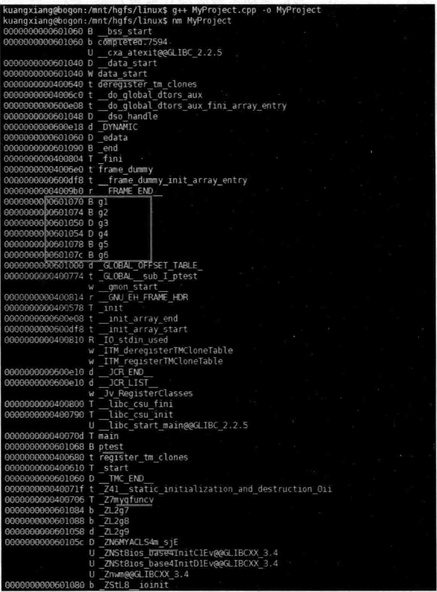

# 4.2进程内存空间布局  

因为本章讲的是数据语义学，这就意味着将更多地涉及数据。数据在内存中总要有保存位置，而且不同的数据有不同的保存时机和不同的保存位置，所以，有必要先学习一下进程的内存空间布局，看看内存是分几块，各种不同的数据可能会保存在这些内存空间中的什么位置。这就是本节的学习目的。  

当把一个可执行文件加载到内存后，就变成了一个进程。进程的虚拟地址空间一般如图4.1所示。  

这个虚拟空间（内存）大概分成以下几部分：

（1）栈（堆栈/栈区）：局部变量等放在这里。  

（2）堆（堆区）：new、malloc等申请的内存空间从这里分配。（3）BSS段：未初始化的全局变量，初始化为O的全局变量等放在这里。（4）数据段：已初始化的全局变量。从图4.1可以看到，BSS段其实是被包含到数据段里的。  

（5）代码段：存放程序执行代码的一块内存区域。  

进程的虚拟空间大概就分这5个部分，其中所保存的内容许多资料上都有介绍，介绍的内容也都大同小异。  

那么，一个可执行文件，没有加载到内存的时候，其实也是分很多部分，如也有数据段、BSS段等。  

可以写一段程序，验证一下。在MyProject.cpp的上面，增加如下代码行：  

``` cpp
int* ptest = new int(120);  
int g1;  
int g2;  
  
int g3 = 12;  
int g4 = 32;  
int g5;  
int g6 = 0;  
static int g7;  
static int g8 = 0;  
static int g9 = 10;  
void mygfunc()  
{  
    return;  
}  
//定义一个类  
class MYACLS  
{  
public:  
    int m_i;  
    static int m_si; //这是声明不是定义  
    int m_j;  
    static int m_sj;  
    int m_k;  
    static int m_sk;  
};  
int MYACLS::m_sj = 12; //这才是定义
```


  
最低内存地址  
图4.1进程的虚拟地址空间  

在main主函数中，增加如下代码：  

``` cpp
int e_mytest;  //该变量在程序运行时临时放在栈中  
e_mytest = 9;
```


上面这段程序笔者也在Linux操作系统上编译、连接并生成了可执行文件。  

在Linux操作系统下有一个 $\mathrm{nm}$ 命令，能够列出可执行文件中全局变量等存放的位置。这里演示一下，如图4.2所示。  

  
图4.2可执行文件中全局变量存放的地址信息  

从图4.2中可以看到bss段、data（数据）段在可执行文件中的开始位置（地址）、一些全局变量的地址，甚至类的静态成员变量也在里面，还有全局函数的人口地址等。  

在Windows操作系统上要查看一个可执行文件（.exe）的格式需要专门的工具，这里就不过多研究，虽然Windows操作系统和Linux操作系统上可执行文件格式有一定差异，但是大同小异，意思都差不多。  

再回到Windows操作系统下的VisualStudio2019中来，做一些测试。在main主函数中增加如下代码：  

``` cpp
printf("ptest地址=%p\n", &ptest);  
printf("g1地址=%p\n", &g1);  
printf("g2地址=%p\n", &g2);  
printf("g3地址=%p\n", &g3);  
printf("g4地址=%p\n", &g4);  
printf("g5地址=%p\n", &g5);  
printf("g6地址=%p\n", &g6);  
printf("g7地址=%p\n", &g7);  
printf("g8地址=%p\n", &g8);  
printf("g9地址=%p\n", &g9);  
printf("MYACLS::m_sj地址=%p\n", &(MYACLS::m_sj));  
printf("mygfunc()地址=%p\n", mygfunc);  
printf("main()地址=%p\n", main);
```

执行起来，看一看结果：  

  

多次执行，发现每次输出的地址值都相同。同时，注意观察地址数字，其中，gl、g2、g5、g6、g7、g8的地址值离的很近（看起来是：没给初值或者初值为0的全局量聚集在一起），而g3、g4、g9的地址值离的很近（看起来是：给了初值但初值不为0的全局量聚集在一起）。  

上述这些输出内容表明，一些全局量（全局变量、全局函数、类静态成员变量等）的地址值在生成可执行文件时就已经是确定好的，不会发生改变，它们的存放位置通常在bsS段、数据段等，一旦加载（映射）到内存时这些地址值都不发生变化。  

如果在main主函数中定义一个局部变量，例如：  

``` cpp
int i = 7;  
printf("i地址=%p\n", &i);
```

每次程序执行时，这种局部变量i的内存都会从栈中分配，而且，每次执行程序时，变量i的地址都会发生变化。