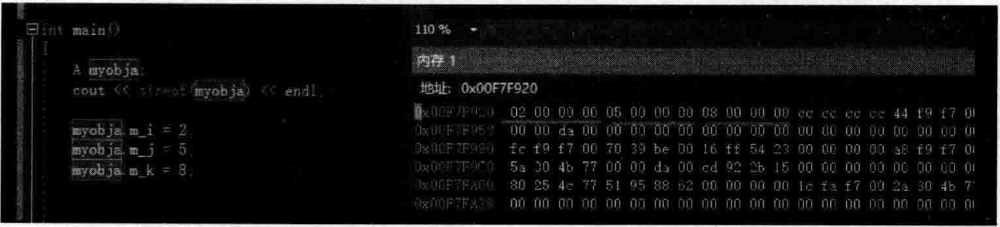
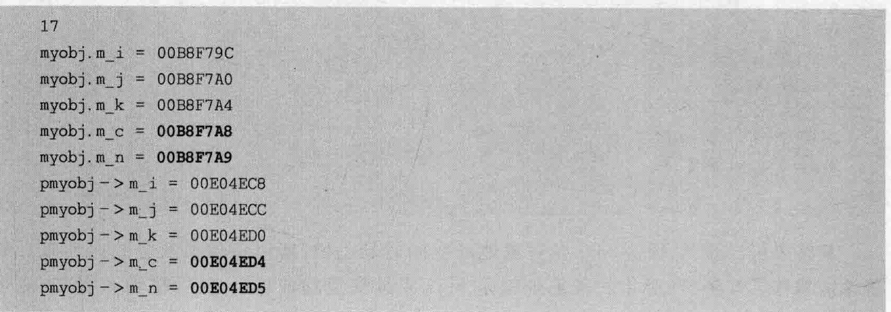
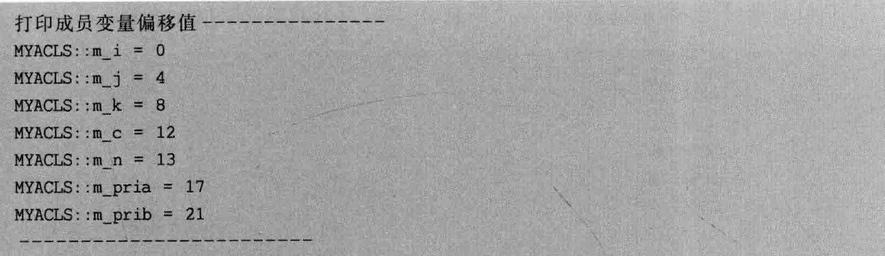
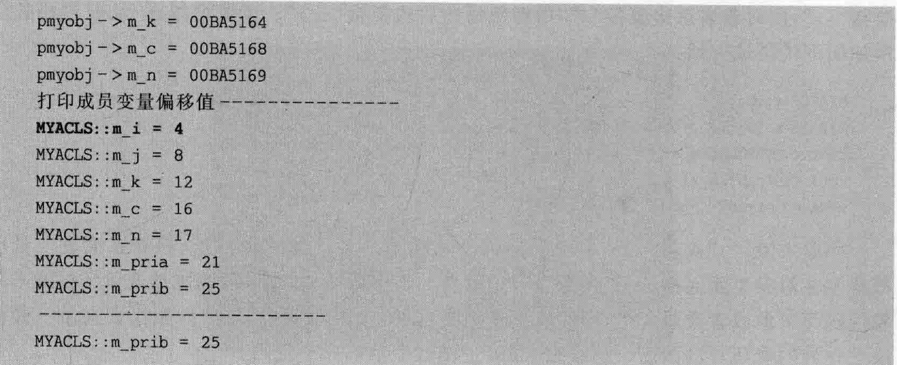

# 4.3数据成员布局  

## 4.3.1 观察成员变量地址规律  

看看如下范例。在MyProject.cpp的上面，增加如下代码行：  

``` cpp
class MYACLS  
{  
public:  
    int m_i;  
    static int m_si; //这是声明不是定义  
    int m_j;  
    static int m_sj;  
    int m_k;  
    static int m_sk;
int MYACLS::m_sj =0;//这才是定义
```

在main主函数中，加人如下代码：  

``` cpp
MYACLS myobj;  
cout << sizeof(myobj) << endl; //12
```

有几点说明：  

（1）sizeof（myobj）在这里应该是12，因为整型成员变量有3个，每个4字节，3个一共12字节，而静态成员变量是跟着类走的，所以，不占类对象的内存空间（或者说和对象无关，不属于对象布局的一部分）。实际上这些静态成员变量是存储在整个程序的数据段中的，4.2节已经详细讲解过，也看到了静态成员变量存放在其中。  

（2）在类对象的内存布局中，这些普通成员变量的存储顺序是按照在类中定义的顺序从上到下来的。在main主函数中增加如下代码，并查看myobja对象内存中数据排列如图4.3所示。  

``` cpp
myobj.m_k = 8;  
myobj.m_i = 2;  
myobj.m_j = 5;
```

  
图4.3类中普通成员变量的存储顺序是按照定义顺序来的  

在图4.3中，注意内存中存储的数据都是按照成员变量的定义顺序来存储的：02000000（代表mi）、05000000（代表mj）、08000000（代表 $\mathrm{~m~}_{-}\mathrm{~k~})$  

（3）输出一下变量的内存地址，观察一下这些地址的规律。注释掉main主函数中原有的代码，加人新代码用来分别在栈和堆上创建对象：  

``` cpp
MYACLS myobj;  
myobj.m_i = myobj.m_j = myobj.m_k = 0;  
cout << sizeof(myobj) << endl;  
printf("myobj.m_i = %p\n", &myobj.m_i);  
printf("myobj.m_j = %p\n", &myobj.m_j);  
printf("myobj.m_k = %p\n", &myobj.m_k);  
  
MYACLS* pmyobj = new MYACLS();  
printf("pmyobj->m_i = %p\n", &pmyobj->m_i);  
printf("pmyobj->m_j = %p\n", &pmyobj->m_j);  
printf("pmyobj->m_k = %p\n", &pmyobj->m_k);
```


执行起来，看一看结果：  

``` cpp
12
myobj. m_i = 00EFF7F8 
myobj. m_j= 00EFF7FC 
myobj. m_k 00EFF800 
pmyobj-> m_i 00F9DFD8 
pmyobj-> m_j =00F9DFDC 
pmyobj->m_k 00F9DFEO
```

不难看到，类对象所占的内存当然是一块连续的内存。上述代码中，myobj代表的是在栈上分配的一块内存，而pmyobj所指向的是在堆中分配的一块内存。myobj的三个成员变量的内存地址紧挨着，都间隔4；pmyobj所指向的对象的三个成员变量的内存地址也紧 挨着，也都间隔4。而且，这些地址也有规律：比较晚出现的成员变量在内存中有更大的地址值，所以，对象所属成员变量mi的地址值肯定没有 $\mathrm{~m~}\mathrm{~k~}$ 的地址值大。  

另外还要注意，一个类或者类对象的sizeof值与在类定义里面有几个public、private、protected。多个public、private、protected。  

## 4.3.2边界调整与字节对齐  

在类MYACLS中，现在看到的情况是，每个成员变量正好都占4字节，并且是连续排列的。  

那么，有些因素会导致成员之间排列不连续，也就是说，成员的边界会进行调整。边界调整就是往成员变量之间填补一些字节，使类对象的sizeof值凑成4或8的整数倍。边界调整的主要目的就是提高程序执行效率，而且编译器会自动去做，不需要程序员干预。  

在类MYACLS中的最后面，继续增加两个成员变量：  

``` cpp
char m_c; //1字节  
int m_n;  //4字节
```


在main主函数中也额外增加代码，打印出这两个成员变量的地址：  

``` cpp
printf("myobj.m_c = %p\n", &myobj.m_c);  
printf("myobj.m_n = %p\n", &myobj.m_n);  
...
printf("pmyobj->m_c = %p\n", &pmyobj->m_c);  
printf("pmyobj->m_n = %p\n", &pmyobj->m_n);
```


执行起来，看一看结果：  

``` cpp
20
myobj.m_i=0073FD48 
myobj. m_j=0073FD4C 
myobj. m_k =0073FD50 
myobj. m_c= 0073FD54 
myobj. m_n =0073FD58 
pmyobj-> m_i = 00865780 
pmyobj->m_j=00865784 
pmyobj-> m_k = 00865788 
pmyobj-> m_c = 0086578C 
pmyobj->m_n=00865790
```


观察一下结果，不难得到一些结论：类成员变量定义中间要是有这种1学节的成员，编译器可能就要往4字节凑，等等。不同的编译器，可能凑的字节数还不一样。  

做网络编程的读者可能体会更深，编译器不统一是很麻烦的事，有可能某个类在这个编译器上的sizeof值是20字节，跑到另外一个编译器上sizeof值就是24字节。所以，必须要保证该类的sizeof值无论在哪个编译器上都必须一样，不然没有办法正常通信（传输同一个类对象在两个计算机上的长度却不同）。  

所以就引人了1字节对齐（也叫“不对齐”）的概念。所谓1字节对齐，就是针对该类（结构），要求其各个成员之间紧密排列，不允许做边界调整，不允许在成员之间留任何空隙。一  

如果需要将某个类按1学节对齐，则在该类定义之前，使用如下代码行：  
``` cpp
# pragma pack（1）//1字节对齐方式  
```

接着，进行类的定义。定义完需要1字节对齐的1个或者多个类之后，使用如下代码行来结束1字节对齐方式：  

``` cpp
# pragmapack（）7/取消指定的1字节对齐，恢复默认对齐（原来是多少就恢复成多少）  
```

现在，修改一下代码，用#pragmapack将类MYACLS的定义包起来。修改后的代码大概如下：  
```cpp
#pragma pack (1)
class MYACL
{
    ...
};

#pragma pack ()
```
执行起来，看一看结果：  

  

从结果中不难看到，sizeof值从20变成17了，而且原来结果中， $\mathbf{m}\_\mathbf{c}$ 与 $\mathrm{m\_n}$ 成员变量的地址间隔是4字节，现在采用1字节对齐后， $\mathrm{m\_c}$ 与 $\mathrm{m\_n}$ 成员变量的地址间隔是1字节了（紧密挨在一起）。  

## 4.3.3成员变量偏移值的打印  

成员变量偏移值，就是指这个成员变量的地址离对象首地址偏移了多少字节。在类MYACLS的最后，增加两个private修饰的成员变量的定义：  

``` cpp
private:  
    int m_pria;  
    int m_prib;
```

接着，再增加一个public修饰的成员函数：  

``` cpp
public:  
    void printMemPoint() //因为要打印私有的成员变量偏移值，只能用成员函数打印  
    {  
       cout << "打印成员变量偏移值---------------" << endl;  
       printf("MYACLS::m_i = %d\n", &MYACLS::m_i);//类名不要省略，必须要有，打印的才是偏移值，否则打印的就是对象的该成员变量的物理地址了  
       printf("MYACLS::m_j = %d\n", &MYACLS::m_j);  
       printf("MYACLS::m_k = %d\n", &MYACLS::m_k);  
       printf("MYACLS::m_c = %d\n", &MYACLS::m_c);  
       printf("MYACLS::m_n = %d\n", &MYACLS::m_n);  
  
       printf("MYACLS::m_pria = %d\n", &MYACLS::m_pria);  
       printf("MYACLS::m_prib = %d\n", &MYACLS::m_prib);  
       cout << "------------------------" << endl;         
       cout << "MYACLS::m_prib = " << GET(MYACLS, m_prib) << endl; //利用GET宏定义来打印m_prib成员变量的偏移值  
    }
```

在main主函数中，增加如下代码行：  

``` cpp
pmyobj->printMemPoint();
```

执行起来，看一看新增加的代码行输出的结果：  

  

从结果可以看到，因为mi在对象地址空间的最上面，所以该成员变量的地址离对象首地址偏移了0字节（对象的首地址就是 $\mathbf{m_{\mathrm{-}}i}$ 成员变量的地址）；向后移动4字节，就是mj成员变量的首地址，以此类推。  

打印这种偏移值还有一种比较奇异的写法，在MyProject.cpp的最上面增加一个叫作GET的宏定义：  

``` cpp
#define GET(A,m) (int)(&((A*)0)->m)  //A代表类名，m代表成员名，这里用了一个0，违反常规的写法，但能输出出一个类成员偏移地址来
```

然后，如果想打印 $\mathbf{m_{\perp}}$ prib的偏移值，可以这样写，在printMemPoint成员函数的末尾：增加如下语句行：  

``` cpp
cout << "MYACLS::m_prib = " << GET(MYACLS, m_prib) << endl; //利用GET宏定义来打印m_prib成员变量的偏移值
```

执行起来·看一看新增加的代码行输出的结果：  

``` cpp
MYACLS:: m_prib =21
```


现在，笔者往类MYACLS定义的末尾，增加一个public修饰的虚函数的定义：  

```cpp
public:
    virtual void mfv() {}
```

因为虚函数的存在，编译器会为MYACLS类增加虚函数表指针Vptr这种隐藏的成员变量，这个成员变量当前占4字节，并且增加在类定义的开头位置。这样看来，上面的所有成员变量的偏移值都会往下移动4字节，而且，整个类的sizeof也会多出4字节。  

执行起来，看一看结果：  

``` cpp
29
myobj.m_i = 0098F8B4
myobj.m_j= 0098F8B8
myobj.m_k = 0098F8BC
myobj.m_c= 0098F8co 
myobj.m_n = 0098F8C1
pmyobj->m_i = 00BA515C
pmyobj->m_j = 00BA5160
```

  

根据上面的结果，可以看到，myobj对象的sizeof值是29（没增加虚函数之前是25）字节，而且MYACLS：：m_i的偏移值已经是4了。  

实际上，用成员变量指针也能打印成员变量的偏移值。在main主函数中，增加如下代码：  

``` cpp
int MYACLS::*mypoint = &MYACLS::m_n;  
printf("pmyobj->m_n偏移地址 = %d\n", mypoint);
```

执行起来，看一看新增加的代码行输出的结果  

``` cpp
pmyobj->m_n偏移地址=17
```