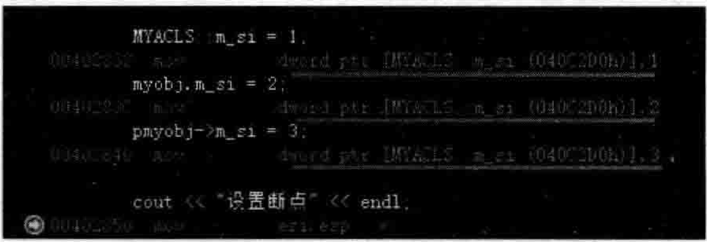
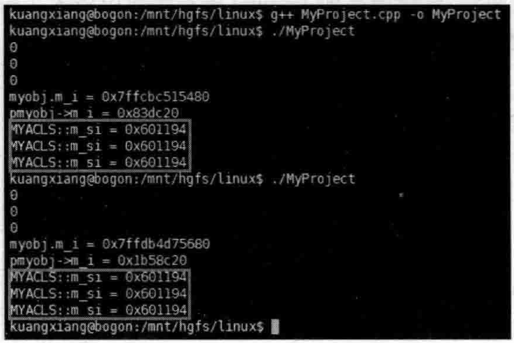
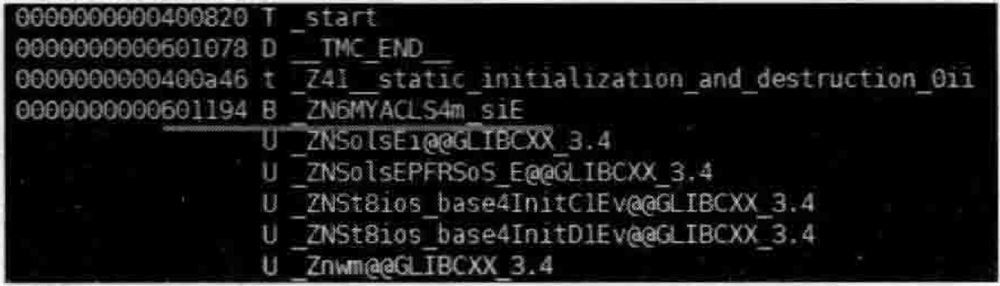
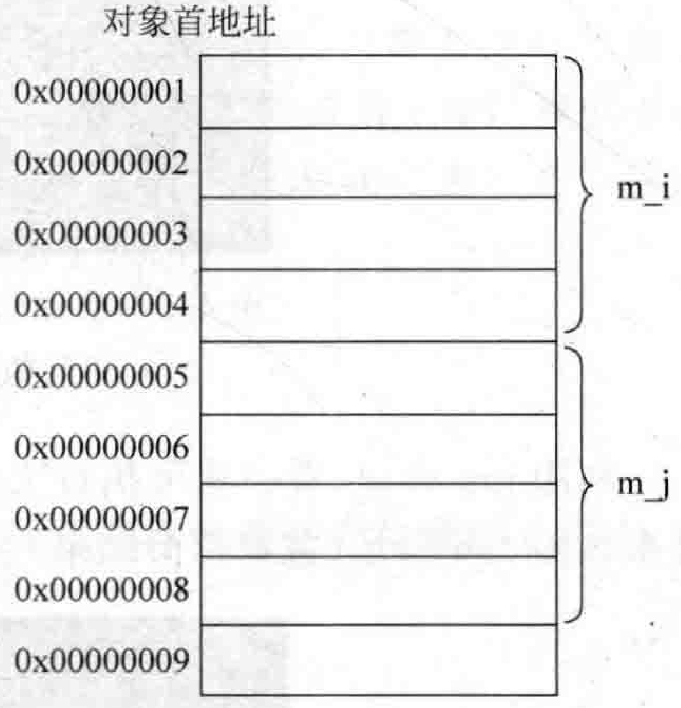
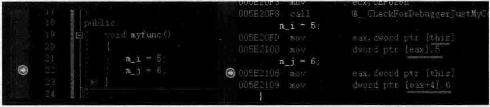
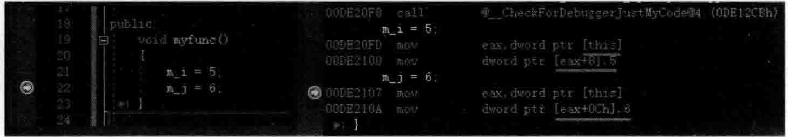
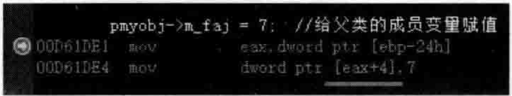

# 4.4数据成员的存取  

## 4.4.1 静态成员变量的存取  

看看如下范例。在MyProject.cpp的上面，增加如下代码行：  

``` cpp
class MYACLS : public FAC  
{  
public:  
    int m_i;  
    static int m_si; //这是声明不是定义  
    int m_j;  
}; 
int MYACLS::m_si = 0; //这才是定义
```


其实，静态成员变量可以当作一个全局变量。但是它只有在类的空间内可见，也就是说，引用它的时候，一般需要带上“类名：：”  

另外，通过4.2节的学习，读者已经知道，静态成员变量是保存在可执行文件的数据段的。  

静态成员变量的引用，可以用类名，也可以用对象名，还可以用对象指针，用类名则后面要接“：：”，用对象名后边要接“.”，用对象指针后边要接“一>”。读者可以在main主函数中增加如下代码试一试：  

``` cpp
MYACLS myobj;  
MYACLS* pmyobj = new MYACLS();  
cout << MYACLS::m_si << endl;  
cout << myobj.m_si << endl;  
cout << pmyobj->m_si << endl;
```

一般来说，“”或者“一 $>$ ”这种语法都是访问类对象中的成员变量，但静态成员变量压根就不在对象里面保存（而是在数据段里放着呢），也就是说，存取静态成员变量压根就不需要用到类对象或者类对象指针，所以这里面的这种“”或者“一>”语法只能代表这是一种语法上允许的取巧写法而已。继续在main主函数中增加如下代码：  

``` cpp
MYACLS::m_si = 1;  
myobj.m_si = 2;  
pmyobj->m_si = 3;
```

设置断点于上面三行代码中的最后一行并进行调试，当程序执行流程停到断点行后，切换到反汇编窗口，如图4.4所示。  

  
图4.4多种访问静态成员变量的方法效果都相同  

图4.4表明多种给类中静态成员变量赋值的语法，对应的汇编代码都是完全一样的。输出一下成员变量的地址。在main主函数中继续增加如下代码：  

``` cpp
printf("myobj.m_i = %p\n", &myobj.m_i);  
printf("pmyobj->m_i = %p\n", &pmyobj->m_i);  
printf("MYACLS::m_si = %p\n", &MYACLS::m_si);  
printf("MYACLS::m_si = %p\n", &myobj.m_si);  
printf("MYACLS::m_si = %p\n", &pmyobj->m_si);
```


执行起来，看一看新增加的代码行输出的结果，这里可以多次执行，注意观察：  

``` cpp
myobj. m_i =008FFBOC 
pmyobj->m_i =00A4DBEO 
MYACLS: ：m_si = 0016C2D0 
MYACLS: m_si =0016C2D0 
MYACLS: m si =0016C2D0
```


多次执行可以发现，后面三行的结果始终不发生改变，因为这三行显示的地址实际是写在可执行文件中的。  

上面这段程序笔者也在Linux操作系统上编译、连接并生成了可执行文件。执行起来，看一看结果，如图4.5所示。  

  
图4.5在Linux操作系统下多次执行程序静态成员变量的地址都不会发生变化  

利用 $\mathrm{nm}$ 命令，看一看可执行文件中这个静态成员变量的地址。输人nmMyProject结果如图4.6所示（截取部分结果）。  

  
图4.6可执行文件中静态成员变量存放的地址信息  

从图4.6所示的结果中可以清晰地看到，静态成员变量msi地址就是601194（十六进制），所以说，这个静态成员变量地址实际是在可执行文件中就确定于的。  

同时也看到了，编译器会自动地将类名和静态成员变量名结合到一起构成一个新的名字（ZN6MYACLS4m_siE）。这样，如果还有一个类里面也有一个同名的静态成员变量也没关系，通过不同的类名依旧可以区分。  

## 4.4.2：非静态成员变量的存取  

非静态成员变量也就是普通成员变量，是存放在类对象中的，需要通过类对象来存取。  

在类MYACLS中，增加一个public修饰的普通成员函数，在其中对成员变量进行一下赋值操作：  

``` cpp
public:  
    void myfunc()  
    {  
       m_i = 5;  
       m_j = 6;  
    }
```

在main主函数中，继续增加如下代码来调用myfunc成员函数：  

``` cpp
pmyobj-> myfunc();
```

在程序员的眼中，看到的是在myfunc成员函数里直接给成员变量m_i、m_j赋值，但是，站在编译器的角度来看，编译器是向myfunc成员函数中插入了一个隐式的形参this，这个this就表示对象本身。编译器视角应该是这样的：
```cpp
void MYACLS::myfunc(MYACLS * const this) //注意 const 位置，表示this这个参数指向一个对象后不可以指向其他对象
{
    this->m_i = 5;
    this->m_j = 6;
}
```

另外一个笔者要谈的事情就是对非静态成员变量的访问问题。当要访问一个成员变量（寻找一个成员变量地址）时，编译器是把类对象的首地址加上该要访问的成员变量的偏移值（偏移值概念4.3.3小节 已讲解过），如图4.7所示。  

根据图4.7，想象一下， $\mathrm{m\_j}$ 的偏移值应该是4(&MYACLS:: $\mathrm{m\_j})$ ，那么 $\mathrm{~m~}_{-j}$ 的地址怎样推算出来？应该是对象的首地址加4（形如：&myobj $\pm\,4)$  

MYA CLS my fun c意一行并进行调试，当程序执行流程停到断点行后，切换到反汇编窗口，可以看到如图4.8所示。  

  
图4.7成员变量m_i、mi所占的内存空间示意图  

  
图4.8反汇编窗口下可以看到系统是利用偏移值来找到成员变量地址的  

从图4.8可以看到，this代表的对象首地址就是mi成员变量的地址，而this十4（eax十4），代表的就是mi成员变量的地址。这个偏移值数字4，是在汇编代码中直接出现的，说明成员变量的偏移值是在编译的时候就已经计算好的，所以存取的效率会很高。  

这里再把 $\mathrm{~m~}\lrcorner\mathrm{i}$ 和 $\textrm{m}_{-}$ 成员变量的偏移值输出一下方便观察。在main主函数中增加如下代码：  

``` cpp
printf("MYACLS::m_i = %d\n", &MYACLS::m_i); //0  
printf("MYACLS::m_j = %d\n", &MYACLS::m_j); //4
```

执行起来，看一看新增加的两行代码输出的结果：  

``` cpp
MYACLS: m_i=0 
MYACLS: m_j=4
```

现在，思考另外一个问题。在MyProject.cpp中类MYACLS定义的更上面位置，引入一个新的类FAC：  

``` cpp
class FAC  
{  
public:  
    int m_fai;  
    int m_faj;  
};
```

接着，让MYACLS类继承自FAC类：

``` cpp
class MYACLS : public FAC  
{  
...
};
```


在MYACLS类继承FAC类之前，MYACLS类的m_i和m_j的偏移值是0和4，那么 继承之后呢？

执行起来，看一看最后两行计算 $\textrm{m}_{-}\textrm{i}$ 和 $\mathrm{~m~}_{-}\mathrm{~j~}$ 偏移值的语句输出的结果：  

``` cpp
MYACLS: m i =8 
MYACLS: m_j=12
```

从结果可以看到， $\mathrm{m}\_\mathrm{i}$ 和mj的偏移值从0和4，变成了8和12。  

设置断点于MYACLS类myfunc成员函数中任意一行并进行调试，当程序执行流程停到断点行后，切换到反汇编窗口，可以看到如图4.9所示。  

  
图4.9反汇编窗口下可以看到系统是利用偏移值来找到成员变量地址的  

看图4.9可以发现，即便有继承关系，这种偏移值也是编译的时候就计算好的（如图中的 $\mathrm{eax}+8\,,\mathrm{eax}+0\mathrm{Ch})$  

在main主函数中继续增加如下代码行：  

``` cpp
pmyobj->m_faj = 7;  //给父类的成员变量赋值
```

设置断点于该行并进行调试，当程序执行流程停到断点行后，切换到反汇编窗口，可以看到如图4.10所示。  

所以，这种普通的成员变量，不管只有单独一个类还是单一继承，或者多重继承，不管访问父类的还是子类的成员变量，效率上都一样。  

  
图4.10反汇编窗口下看一看父类成员变量的偏移值  

当然，例外的情况是虚基类。虚基类中的成员变量的访问，需要一些间接手段，所以这种情况下访问普通成员变量的效率会慢一些，后续会详细讲解虚基类。  

在讲解虚基类之前，笔者先抛出一个问题。当前这个范例中，定义了myobj对象和pmyobj对象指针（MYA CLS my obj；和MYACLS $\nsucc$ pmyobj $\equiv$ newMYACLS();)。不知读者是否想过，myobj.m_i和pmyobj $\mathrm{>>m_{-}i}$ 这两种访问成员变量的方法，一个是通过对象名，一个是通过对象指针，这两者有什么差别吗？  

常规情况下没什么差别，刚才通过看反汇编代码也感受到了。但如果是一个虚基类，也就是有爷爷类、父亲类、孙子类，孙子类对象要访问爷爷类中的普通成员变量的话，就会有差别了。这个差别跟虚函数有点类似：  

（1）myobj这种对象名访问成员变量的方式是在编译期间就计算出来成员变量的偏移值。  

（2）pmyobj这种对象指针是在执行期间才new出来一个具体的对象，而且也不知道new的是哪种类型（父、子、孙）的对象，无法在编译期间计算成员变量的偏移值，所以需要间接手段来访问成员变量。讲解虚基类时细讲，先有个大概印象即可。