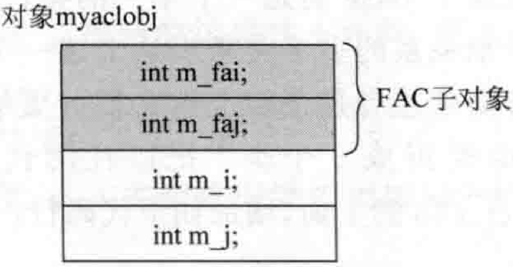
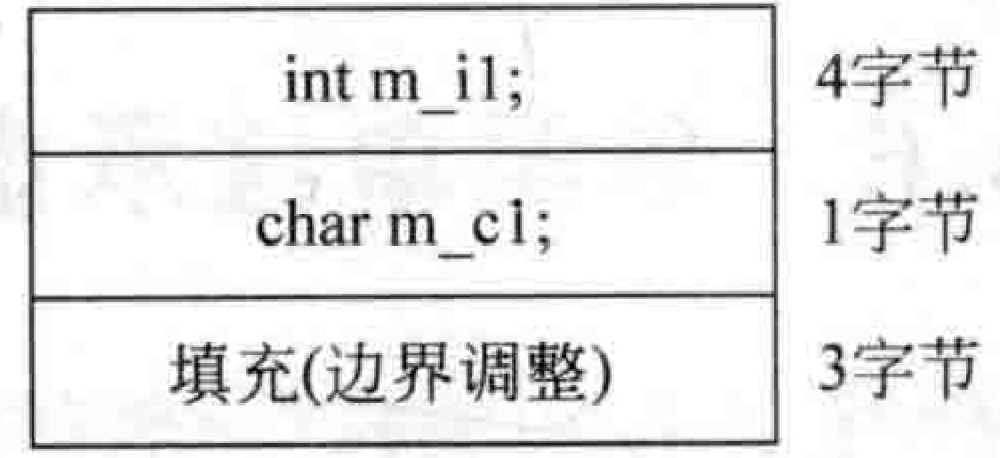
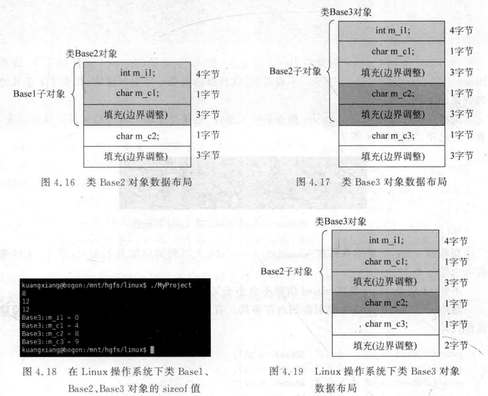

# 4.5单一继承下的数据成员布局  

看看如下范例。在MyProject.cpp的上面，增加如下代码行：  

``` cpp
class FAC  //父类  
{  
public:  
    int m_fai;  
    int m_faj;  
};  
class MYACLS : public FAC  //子类  
{  
public:  
    int m_i;  
    int m_j;  
};
```


在main主函数中，增加如下代码：  

``` cpp
printf("MYACLS::m_i = %d\n", &FAC::m_fai);  
printf("MYACLS::m_i = %d\n", &FAC::m_faj);  
printf("MYACLS::m_i = %d\n", &MYACLS::m_fai);  
printf("MYACLS::m_i = %d\n", &MYACLS::m_faj);  
printf("MYACLS::m_i = %d\n", &MYACLS::m_i);  
printf("MYACLS::m_j = %d\n", &MYACLS::m_j);
```

执行起来，看一看结果：  

``` cpp
FAC: :m fai =0 
FAC: mfaj=4 
MYACLS: m fai = 0 
MYACLS: :m faj=4 
MYACLS: m i =8 
MYACLS: mj=12
```

观察上面的结果，看一看偏移值，尤其要注意的是第三行和第四行printf语句，笔者用的是子类名，而后面的成员变量名是在父类中定义的。既然这个语法行得通，说明两个含义：  

（1）一个子类对象所包含的内容，是它自已的成员加上它父亲成员的总和。  

（2）从偏移值看，在当前的编译器中，父亲成员是先出现的，然后才是子类成员。那么有没有编译器非要倒着排，让子类成员先出现，父亲成员后出现？暂时还没发现。（虚基类除外，虚基类后续专门探讨），先探讨常规状态。  

在main主函数中增加如下代码来定义一个FAC类对象：  

``` cpp
FAC facobj;  
```

那么，对象facobj的数据布局（内存布局）看起来应该如图4.11所示。

在main主函数中增加如下代码来定义一个子类MYACLS对象：  

``` cpp
MYACLS myaclobj;  
```


那么，对象myaclobj的数据布局看起来应该如图4.12所示。  

  
图4.11对象facobi的数据布局  

  
图4.12对象myaclobj的数据布局  

上面的范例还是比较好理解的。现在再看一个稍微特殊一点的范例。把以往的代码先注释掉，在MyProject.cpp的上面，增加如下代码行：  

``` cpp
class Base  
{  
public:  
    int m_i1;  
    char m_c1;  
    char m_c2;  
    char m_c3;  
};
```

在main主函数中，增加如下代码：

``` cpp
cout << sizeof(Base) << endl;
```

输出一下结果，是一个数字8。因为整个类的成员变量实际上只有7字节，那么sizeof是8，根据4.3.2节讲解的边界调整与学节对齐知识，可以认为这多出来的1字节是边界调整的结果。  

在main主函数中继续增加代码，输出偏移值具体看一下：  

``` cpp
printf("Base::m_i1 = %d\n", &Base::m_i1);  
printf("Base::m_c1 = %d\n", &Base::m_c1);  
printf("Base::m_c2 = %d\n", &Base::m_c2);  
printf("Base::m_c3 = %d\n", &Base::m_c3);
```


执行起来，看一看结果：  

``` cpp
8
Base::m_il =0
Base::m_cl =4
Base::m_c2 = 5
Base::m_c3 = 6
```


笔者在Linux操作系统上也测试过，跟上面的结果完全一样。根据上面的结果，不难绘制出一个类Base对象的数据布局图，如图4.13所示。  

图4.13类Base对象数据布局  

图4.13总结起来就是： $\mathrm{m\_i1}$ 占4字节，m_c1、m_c2、mc3分别占1字节，填充1字节用于边界调整。  

现在这个Base类是一个单一的类，没有继承关系，如果用带继承关系的多个类来表达上述一个类呢（可能因为某些业务需求或者是逻辑上这么拆分更加合理）？笔者准 备把Base类拆成三个类。把以往的代码先注释掉，在MyProject.cpp的上面，增加如下代码行：  

``` cpp
class Base1  
{  
public:  
    int m_i1;  
    char m_c1;  
};  
  
class Base2 :public Base1  
{  
public:  
    char m_c2;  
};  
  
class Base3 :public Base2  
{  
public:  
    char m_c3;  
};
```

现在，Base3这个子类包含类Base1、Base2里所有成员。所以，Base3类和刚才的Base类差不多。但是，问题来了。在main主函数中，增加如下代码：  

``` cpp
cout << sizeof(Base1) << endl; //8  
cout << sizeof(Base2) << endl; //12  
cout << sizeof(Base3) << endl; //16
```


执行起来，看一看结果：  

``` cpp
8
12
16
```

因为最终等同于Base的类是Base3这个类，原来Base类的sizeof值是8字节，现在Base3类的sizeof值却是16字节。不难看到，这种继承关系一旦引入进来，就多了8字节的内存空间占用。  

上面这段程序笔者也在Linux操作系统上编译、连接并生成了可执行文件。执行起来，看一看结果，如图4.14所示。  

  
图4.14类Basel、Base2、Base 3 size of  

观察图4.14，发现结果和在VisualStudio2019上得到的结果并不相同，图4.14中最后一个数字是12。  

不管12还是16，子类的sizeof值都不会小于父类的sizeof值。  

输出一下现在的Base3类对象的内存布局。在main主函数中继续增加如下输出偏移值的代码：  

``` cpp
printf("Base3::m_i1 = %d\n", &Base3::m_i1);  
printf("Base3::m_c1 = %d\n", &Base3::m_c1);  
printf("Base3::m_c2 = %d\n", &Base3::m_c2);  
printf("Base3::m_c3 = %d\n", &Base3::m_c3);
```

执行起来，看一看结果：  

``` cpp
8
12 
16
Base3:: m_i1 = 0 
Base3:: m_c1 =4 
Base3::m_c2 = 8 
Base3::m_c3=12
```

现在.根据这个结果，在Windows操作系统下的VisualStudio2019环境中，分别绘制一下Basel、Base2、Base3这三个类对象的数据布局，如图4.15～图4.17所示。

在Linux操作系统上，也重新输出一下结果，如图4.18所示。  

根据图4.18，分别绘制一下在Linux操作系统下Base1Base2、Base3这三个类对象的数据布局。其中，类Base1对象的数据布局和图4.15相同：类Base2对象的数据布局和图4.16相同；类Base3对象的布局与Windows操作系统下的VisualStudio2019不同，如图4.19所示。    

类Base1对象
  
图4.15类Base1对象数据布局  

  

所以可以看到，继承关系引入后，原本内存紧挨在一起的成员变量，现在因为边界调整原因，不再挨在一起了，并且浪费了许多内存空间用于边界调整或者说用于填补空间。  

另外，通过Linux和Windows操作系统上的数据布局图也说明：  

（1）编译器在不断进步和优化。
（2）不同厂商的编译器实现的细节可能很不相同。  
（3）内存复制也必须要谨慎。例如在Linux操作系统中，现在Base3对象占用了Base2对象的布局空间，如果定义了一个Base2对象，又定义了一个Base3对象，则不能用诸如memcpy这种内存复制把Base2对象内存中的内容往Base3对象里复制。因为这两个对象虽然内存大小相同，但是Base3类对象多了一个 $\mathrm{m\_c3}$ 成员，这个Base2类对象里并没有这个成员。