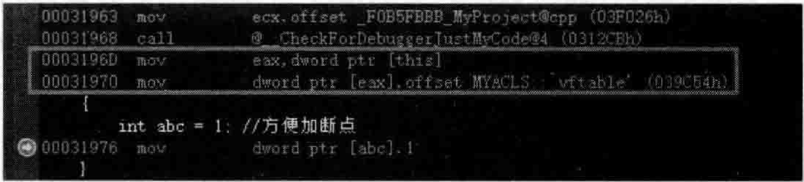
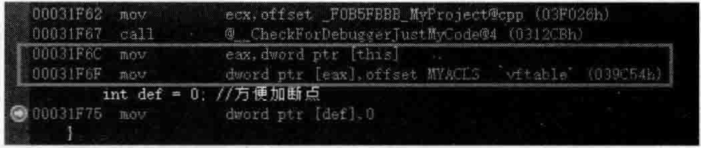
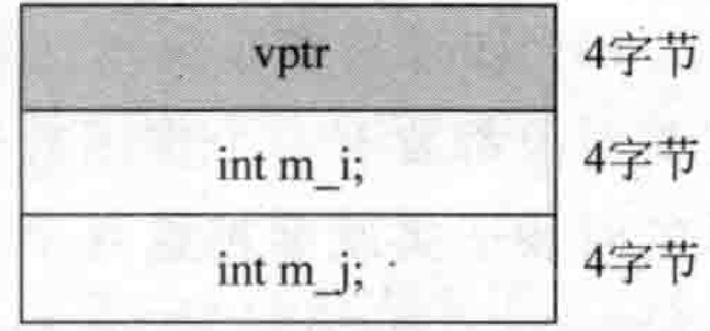
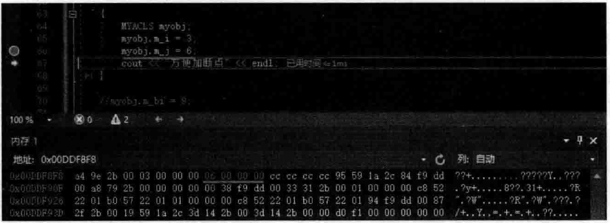
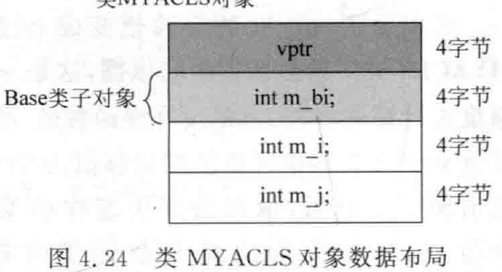
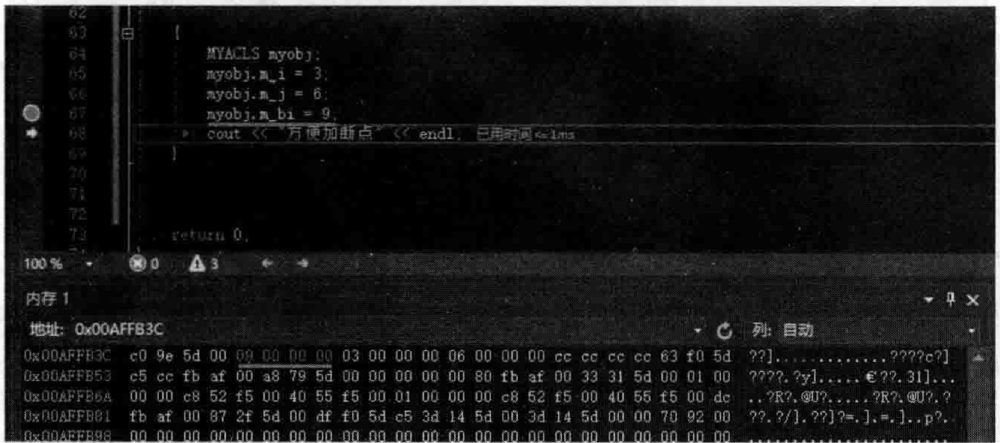
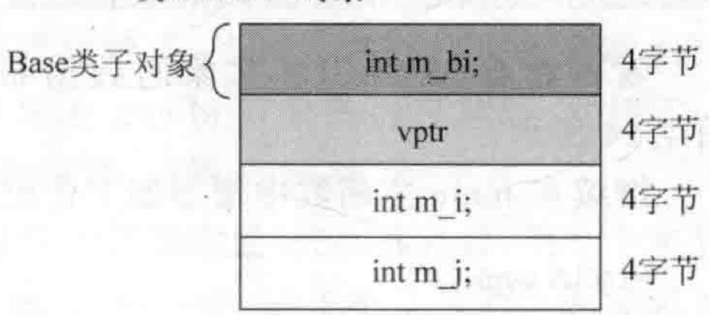
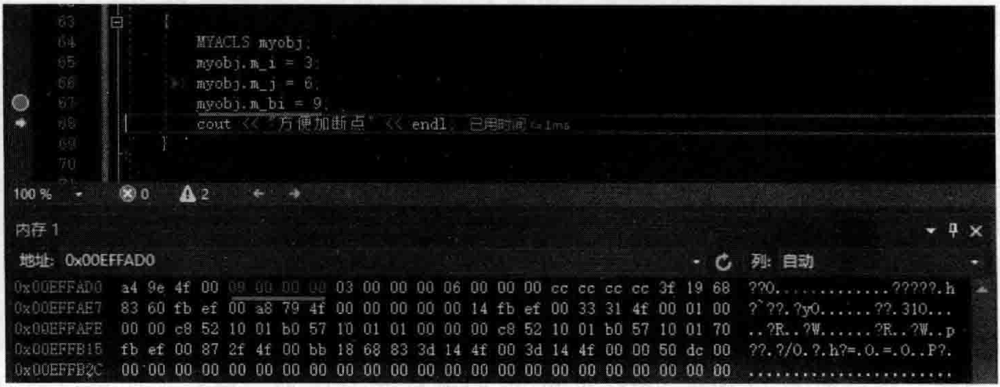

# 4.6单类单继承虚函数下的数据成员布局  

笔者进行的讲解一般都是以Windows操作系统下的VisualStudio2019编译器为准 （该编译器中解决方案平台选择的是 $\mathbf{x}863$ ，其他编译器可能会略有不同，但是，最重要的是要读者掌握原理和方法，一旦这些对象模型的道理通了，就会一通百通，可以用与笔者相同的手法对其他编译器进行分析。  

## 4.6.1一单个类带虚函数的数据成员布局  

看看如下范例。在MyProject.cpp的上面，增加如下代码行：  

``` cpp
class MYACLS
{  
public:  
    int m_i;  
    int m_j;  
  
    virtual void myvirfunc()  
    {  
    }  
    MYACLS() //构造函数  
    {  
       int abc = 1; //方便加断点  
    }  
    ~MYACLS()//析构函数  
    {  
       int def = 0; //方便加断点  
    }  
};
```


经过前面的学习，读者已经比较清楚，当类中引人虚函数的时候，会有一些额外成本效率的付出：：  

（1）编译的时候，编译器会产生类的虚函数表。  

（2）对象中会产生虚函数表指针vptr，用以指向类的虚函数表。  

（3）编译器会增加或扩展类的构造函数，增加给虚函数表指针vptr赋值的代码，让虚函数表指针指向虚函数表。读者已经知道，因为多态的原因，子类和父类的构造函数中都需要分别设定对应的vptr值。  

（4）如果是多重继承，如子类继承了两个父类，每个父类如果都有虚函数表，那么每个父类对象都要有一个虚函数表指针vptr（这也是类中的一个成员变量，只不过是隐藏的），继承的时候子类就会把这两个vptr都继承过来，如果子类自已还有额外的虚函数，那么子类与第一个父类共用同一个vptr（可以回顾3.4节）。  

（5）析构函数中似乎也被扩展增加了给虚函数表指针vptr赋值的代码，但感觉这个赋值代码似乎和构造函数中的代码相同。  

可以看看编译器向类的构造函数和析构函数中增加的代码。在main主函数中增加如下代码行：  

``` cpp
MYACLS aaa;
```

把断点分别设置到MYACLS类的构造函数和析构函数中并进行调试，当程序执行流程停到构造函数的断点行后，切换到反汇编窗口，如图4.20所示。  

  
图4.20编译器向类的构造函数中插人的用于给虚函数表指针赋值的代码  

当程序执行流程停到析构函数的断点行后，切换到反汇编窗口，如图4.21所示。  

  
图4.21一编译器向类的析构函数中插人的用于给虚函数表指针赋值的代码  

图4.21中，编译器插人的针对虚函数表指针赋值的代码看起来和构造函数中的针对虚函数表指针赋值的代码相同，那么在析构函数中为什么又一次给虚函数表指针赋值呢？请读者也一起思考一下，笔者暂时还没有更好的答案。  

目前MYACLS类对象的数据布局是什么样子呢？注释掉main主函数中原有代码，加人新的代码：  

``` cpp
cout << sizeof(MYACLS) << endl;  
printf("MYACLS::m_i = %d\n", &MYACLS::m_i);  
printf("MYACLS::m_j = %d\n", &MYACLS::m_j);
```


执行起来，看一看结果：  

``` cpp
12
MYACLS: :m_i = 4
MYACLS: :m_j = 8
```


根据执行结果，就能够把MYACLS类对象的数据布局画出来（vptr肯定在最上面），如图4.22所示。  

继续在main主函数中增加如下代码：  

``` cpp
MYACLS myobj;  
myobj.m_i = 3;  
myobj.m_j = 6;  
cout << "方便加断点" << endl;
```

类MYACLS对象  

  

图4.22类MYACLS对象数据布局  

设置断点于上面的myobj. $\mathrm{m\_j}=\mathrm{6}$ ：代码行并进行调试，当程序执行流程停到断点行后，在内存1窗口中输人 $8\ll$ myobj并按Enter键以显示myobj对象的内存地址，并按F10键向下走一行，注意观看内存中变色的位置和变色的内容，如图4.23所示。  

在图4.23中可以看到，将myobj对象的首地址作为开始地址，往后面计算，第9个字节（偏移值）开始的4个字节，在执行了代码行myobj. $\mathrm{m\_j}=6$ ；后，这4个字节的内容变成了060000006)。  

  
图4.23观察类对象数据布局和在内存中的对应关系  

## 4.6.2单一继承父类带虚函数的数据成员布局  

现在如果增加一个基类，基类里也有虚函数。在MyProject.cpp的上面，MYACLS类定义的前面，增加如下代码行来定义Base基类：  

``` cpp
class Base  
{  
public:  
    virtual  void mybvirfunc() {}  
    int m_bi;  
};
```

然后，让MYACLS类继承自Base基类：

``` cpp
class MYACLS :public Base  
{
...
};
```

在main主函数中，注释掉以往代码，加人新代码：  

``` cpp
cout << sizeof(MYACLS) << endl;  
printf("MYACLS::m_bi = %d\n", &MYACLS::m_bi);  
printf("MYACLS::m_i = %d\n", &MYACLS::m_i);  
printf("MYACLS::m_j = %d\n", &MYACLS::m_j);
```

执行起来，看一看结果：  
```cpp
16
MYACLs::m_bi= 4
MYACLs::m_i= 8
MYACLs::m_j= 12
```

  

看一看类MYACLS对象的数据布局，如图4.24所示。

继续在main主函数中增加如下代码：

``` cpp
MYACLS myobj;  
myobj.m_i = 3;  
myobj.m_j = 6;
myobj.m_bi = 9;  
cout << "方便加断点" << endl;
```

设置断点于上面的myobj. $\mathrm{m\_bi}=9$ ：代码行并进行调试，当程序执行流程停到断点行后，在内存1窗口中输人 $8\mathrm{.}$ myobj并按Enter键以显示myobj对象的内存地址，并按F10键向下走一行，注意观看内存中变色的位置和变色的内容，如图4.25所示。  

  
图4.25观察类对象数据布局和在内存中的对应关系  

在图4.25中可以看到，将myobj对象的首地址作为开始地址，往后面计算，第5个字节（偏移值）开始的4个字节，在执行了代码行myobj. $\mathrm{m\_bi=9}$ ：后，这4个字节的内容变成了090000009)  

## 4.6.3单一继承父类不带虚函数的数据成员布局  

现在如果把父类Base中的虚函数去掉，那么子类MYACLS对象的数据布局会有什么变化吗？将Base中的虚函数代码行注释掉：  

``` cpp
//virtual  void mybvirfunc() {}
```

执行起来，看一看结果：  

``` cpp
16
MYACLS: :m bi =0 
MYACLS: m i=8 
MYACLS: ：m_j=12
```

可以发现，m_bi的偏移值变成0（原来是4）了。但是这个偏移值是否能作为绘制MYACLS类对象数据布局的依据，这是一个问题。为什么？因为这个偏移值是站在父类的角度去计算偏移，父类是没有虚函数的，所以mbi针对于父类对象首地址的偏移值为0，但是一旦出现了子类后，情况会发生怎样的变化呢？所以，如果用上面的结果数据来绘制子类MYACLS对象的数据布局图，有些读者可能认为是这样的，如图4.26所示。  

但真的是这样吗？这个问题必须要进一步测试一下。还是通过程序代码演示，在main主函数中现有的代码已经足够。 

类MYACLS对象  

  
图4.26类MYACLS对象数据布局  

设置断点于main主函数的myobj. $\mathrm{m\_bi}=9$ ；代码行并进行调试，当程序执行流程停到断点行后，在内存1窗口中输人 $\&.$ my obj Enter my obj，并按F10键向下走一行，注意观看内存中变色的位置和变色的内容，如图4.27所示。  

  
图4.27观察类对象数据布局和在内存中的对应关系  

通过这个演示，意味着Vptr还是在类MYACLS的开头位置，因此，真正正确的内存布局还是如图4.24所示。  

所以，单一继承父类带虚函数的数据成员布局与单一继承父类不带虚函数的数据成员布局实际上是一样的。