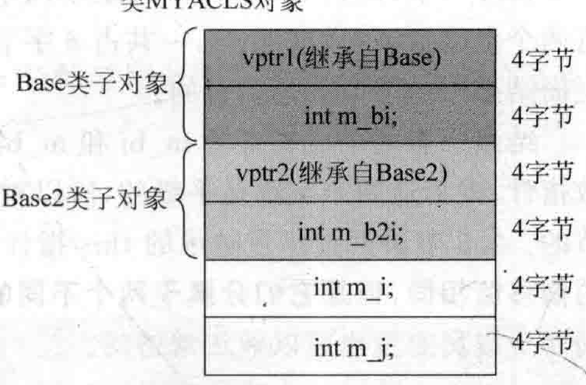
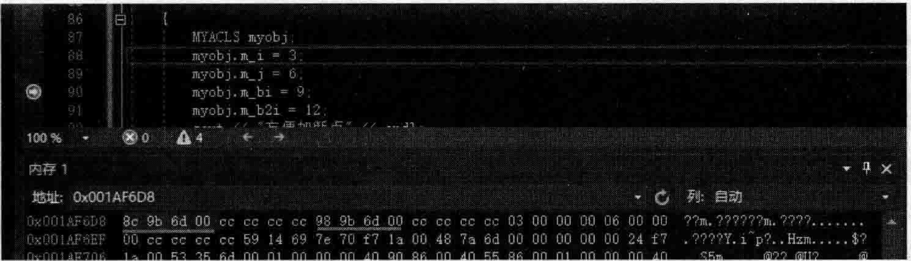
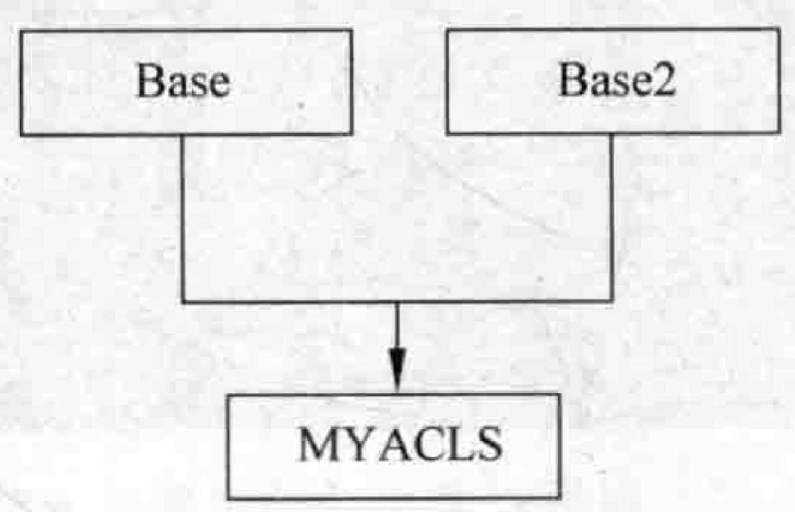
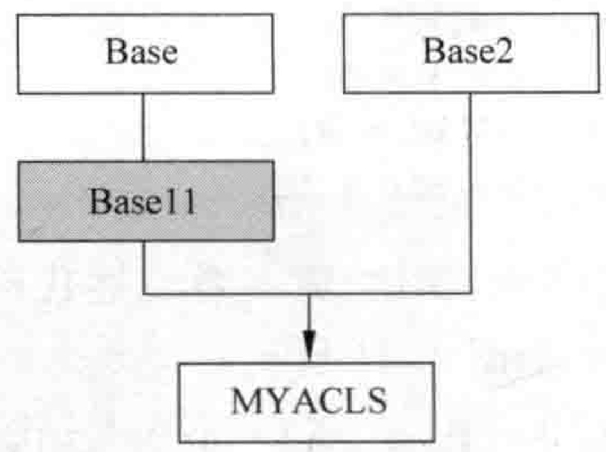
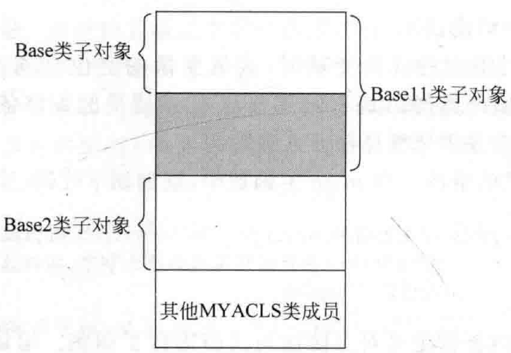
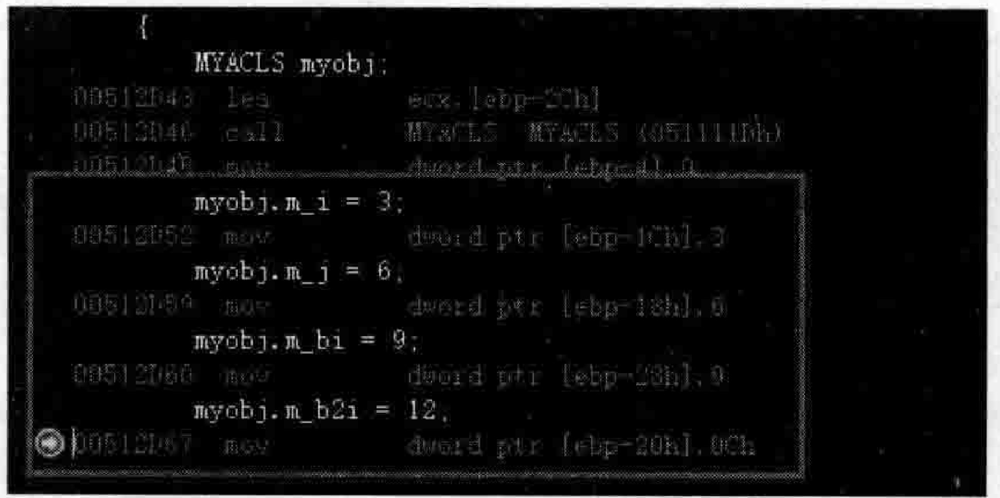
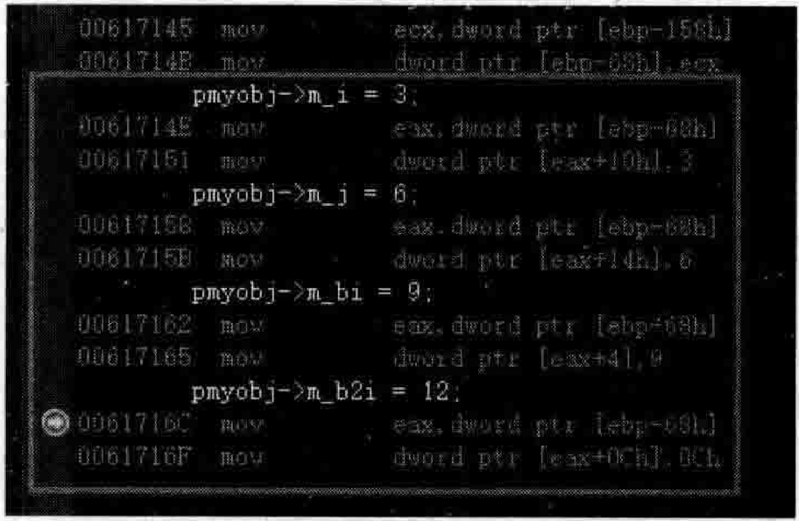

# 4.7：多重继承数据布局与this调整深谈  
## 4.7.1单一继承数据成员布局this指针偏移知识补充  


上一节最终的范例代码原样保留，本节中要使用。  

接着当前的范例，补充讲解一点，在2.3节讲解过this指针调整的话题。现在情况是父类Base没有虚函数，所以该类的对象也就没有虚函数表指针（vptr），子类MYACLS有虚函数，所以该类的对象中会多出一个虚函数表指针，根据上一节讲解的内存布局图，要访问父类对象的m_bi成员变量的话，this指针要调整往下走4个字节（参考图4.24）。  

为了验证这件事，向Base类和MYACLS类增加构造函数，打印this指针值。

向Base类增加public修饰的默认构造函数：  

``` cpp
public:  
    Base()  
    {  
       printf("Base::Base()构造函数的this指针是：%p!\n", this);  
    }
```

MYACLS类原来有默认构造函数，现在向其中增加代码。完整的MYACLS类默认构造函数代码如下：  

``` cpp
public:  
    MYACLS() //构造函数  
    {  
       int abc = 1; //方便加断点  
       printf("MYACLS::MYACLS()构造函数的this指针是：%p!\n", this);  
    }
```

执行起来，看一看结果：  

``` cpp
16
MYACLS: m bi =0 
MYACLS: m i=8 
MYACLS: mj=12
Base::Base()构造函数的this指针是：00CFF8F4! 
MYACLS::MYACLS()构造函数的this指针是：00CFF8F0!
```

观察结果，果然可以看到，要访问Base类的成员，this指针要往下跳4个字节（this指针进行了调整），跳过图4.24中的vptr，而m_bi的偏移值为0，所以跳过4个字节后，直接就能够访问到m_bi成员变量。  

如果现在Base类中要是有虚函数，那么this指针还用调整吗？将Base类中的虚函数代码行的注释取消：  

``` cpp
virtual void mybvirfunc(){}
```

执行起来，看一看结果：  

``` cpp
16
MYACLS: m bi 4 
MYACLS: m i=8 
MYACLS: m_j=12
Base::Base()构造函数的this 指针是：00EFFEOC! 
MYACLS::MYACLS()构造函数的this指针是：00EFFEOC!
```

观察结果，可以看到，this指针是相同的，不用调整，因为父类Base带有虚函数，所以该类对象有虚函数表指针（vptr），子类MYACLS的虚函数表指针可以认为是从父类继承而来的，而且也在内存布局的最上面。另外，观察到m_bi偏移值变成了4，这代表从对象首地址 $+4$ 个字节，就能够访问到 $\mathrm{m\_bi}$ 成员变量。  

## 4.7.2多重继承且父类都带虚函数的数据成员布局  

在MyProject.cpp的上面，新增加一个Base2基类:


``` cpp
class Base2  
{  
public:  
    virtual  void mybvirfunc2() {}  
    int m_b2i;
};
```


让MYACLS类同时继承Base和Base2类：

``` cpp
class MYACLS :public Base, public Base2  
{  
...
};
```

在main主函数中，增加一行打印 $\mathrm{m\_b2i}$ 成员变量偏移值的语句：  

``` cpp
printf("MYACLS: ：m_b2i = d\n", &MYACLS: ：m_b2i);
```

执行起来，看一看结果（摘取显示成员变量偏移值这部分结果）：  

``` cpp
24
MYACLS: :m bi=4 
MYACLS: m b2i=4 
MYACLS: :m i =16 
MYACLS: m_j=20
```

估算一下，因为MYACLS类继承两个都有虚函数的父类，那么MYACLS类对象应该有两个虚函数表指针（vptr），一共占8学节，加上4个int成员16学节，总和是24字节，与上面结果中的字节数是吻合的。  

结果中有两个成员变量m_bi和 $\mathrm{m\_b2i}$ 的偏移值都是4，源于这两个父类对象都有虚函数指针，因为这两个父类是平级的，所以对于每一个父类来讲，它的成员变量都是偏移4字节的。2.3节讲解过多重继承的this指针调整问题，所以虽然 $\mathrm{m\_bi,m\_b2i}$ 两个成员变量的偏移值相同，但是它们分属于两个不同的基类子对象，经过this指针调整后，偏移值相同的两个成员变量也可以被正常访问。  

向Base2类增加构造函数，打印this指针值。  

``` cpp
public:  
    Base2()  
    {  
       printf("Base2::Base2()构造函数的this指针是：%p!\n", this);  
    }
```

执行起来，看一看结果：  

``` cpp
24
MYACLS: m bi=4 
MYACLS: m b2i=4 
MYACLS: ： m_i = 16 
MYACLS: ： m_j=20
Base:: Base()构造函数的this指针是：0137FAF0! 
Base2::Base2()构造函数的this指针是：0137FAF8! 
MYACLS::MYACLS()构造函数的this指针是：0137FAF0!
```

通过结果可以看到，访问Base类成员变量的时候，this指针是不用调整的，而访问Base2类成员变量的时候，this指针是要跳过8个字节的。  

显然，根据上面这些数据，还是无法确定内存布局，所以继续完善main主函数中的代码，用老手法来找内存布局。所谓用老手法来找内存布局，其实前面早就使用过了，如果再具体详细地描述一下就是：通过设置断点来调试程序，当程序停留在断点行时，在内存的编辑框中输人对象首地址以显示出对象所代表的内存中内容，然后通过按F10键单步执行的方式执行给某个成员变量赋值的代码行，此时内存中的某些数据会发生变化，观察这些变化的数据离对象首地址有多远的距离（单位：字节）。据此，就可以确定某个成员变量的真正偏移值。  

在main主函数中，增加如下代码行：  

``` cpp
myobj.m_b2i = 12;
```

通过设置断点并不断地调试，从而确定对象的布局如下：  
```cpp
myobj.m_i = 3;    //17~20字节
myobj.m_j = 6;    //21~24字节
myobj.m_bi = 9;   //5~8字节
myobj.m_b2i = 12; //13~16字节
```

根据上面这些调试的结果信息，大概就能把数据布局画出来了。可以估计一下，根据继承的顺序，先继承Base类，再继承Base2类，那么两个vptr指针在上面的应该是继承自Base类的，在下面的应该是继承自Base2类的，所以数据布局图大概如图4.28所示。  

同图4.28是结合着上面的一些线索和调试来绘制的，能够看到或者推导出如下一些信息：  

  
图4.28类MYACLS对象数据布局

（1）通过上面this指针的打印可以看到：访问Base类成员变量this指针不用调整，而访问Base2类成员变量则this指针要跳过8个字节。  

（2）注意，mbi和 $\mathrm{~m~}\_\mathrm{b2i}$ 的偏移值都是4。  

（3）请想一想，this指针加这个偏移值就能够访问对应的成员。例如，要访问 $\mathrm{m\_b2i}$ 成员变量，this指针调整跳跃了8个字节，然后偏移值又是4字节，所以从最上面（类MYACLS对 象）跳过12个字节，就能访问到 $\mathrm{m\_b2i}$ 成员变量，和图4.28所绘制的结果一致。  

另外，观察一下myobj这个MYACLS类对象的两个虚函数表指针（vptr）指向的虚函数表（vtb1）的地址，这两个地址似乎也比较接近（反着看：一个是006d9b8c，一个是006d9b98）。如图4.29所示。  

  
图4.29类MYACLS对象的两个虚函数表指针指向的两个虚函数表的位置比较接近  

这里学习到了一个结论：  

当要访问一个类对象中的成员变量时，成员变量的定位是通过两个因素来定位的：①this指针（根据情况编译器知道是否做调整）；②该成员的偏移值。这种this指针的调整、成员偏移值的确定都是需要编译器介入进行的。

现在看一点有意思的事情。在main主函数中，增加如下代码（注意代码中的注释）：  

``` cpp
Base2* pbase2 = &myobj; //注意结果，myobj地址为0x009ffb0c，而pbase2给值后是0x009ffb14，因为this指针调整是要往后跳8字节的，所以这里myobj地址值+8字节后给了pbase2
```

请想一想，编译器内部肯定是对上面这句代码进行了调整。编译器可能像如下的方式调整的：  

``` cpp
Base2* pbase3 = (Base2*)(((char*)& myobj) + sizeof(Base));
```

在main主函数中，增加如下代码：  

``` cpp
Base* pbase = &myobj;   //pbase的地址就是myobj对象的首地址，因为this不需要调整，Base类的首地址和MYACLS类的首地址相同
```

再看一看下面这段比较有意思的代码.增加在main主函数中（仔细阅读代码中的注释）：  

``` cpp
Base2* pbase3 = new MYACLS();  //父类指针new子类对象，返回的地址是：0x01054bc8，实际这里分配是24字节  
MYACLS* psubobj = (MYACLS*)pbase3;  //得到的地址是0x01054bc0 比pbase3指向的地址少了8字节  
delete pbase3; //报异常 ，据此，可以认为pbase3里返回的地址不是分配的首地址，是this指针调整后的地址，而new分配的真正的内存首地址应该是psubobj指向的那个地址  
delete psubobj;//成功，验证了psubobj里才是真正的首地址的说法
```

目前，这个继承结构还不复杂，如图4.30所示。  

如果出现更复杂的继承结构，例如，Base类下有一个子类Basel1，MYACLS类直接继承自Base11和Base2，如图4.31所示。  

  
图4.30当前的类继承层次关系图  

  
图4.31更复杂一点的类继承层次关系图  

根据图4.31，类MYACLS对象数据布局很可能是下面这种布局（这里只大概分一下每个 子类对象的排列，具体的成员变量等数据就不细分了，留给读者去扩展分析），如图4.32所示。  

相信只要掌握笔者所讲述的分析方法，读者也一定能分析出来。希望读者举一反三，根据已经掌握的知识，来学习和推导新知识，这样，对于个人的成长好处是非常巨大的。  

另外请注意，虽然目前的继承关系可能比较复杂，但是访向哪个类中的成员变量，会发现成本都差不多，成员位置的计算在编译的时候就已经确定好了，访问成员变量只是做个偏移操作。所以，不管使用类对象也好，对象指针也罢，引用也行，总之访问这些成员变量的成本相同。设置断点，调试，看一看给一些成员变量赋值的反汇编代码，如图4.33所示。    

  
图4.32类MYACLS对象数据布局  


  
图4.33利用对象名给对象的成员变量赋值的反汇编代码  

如果用一个对象指针来给对象的成员变量赋值，又是什么情形呢？在main主函数中，增加如下代码：  

``` cpp
MYACLS* pmyobj = new MYACLS();  
pmyobj->m_i = 3;  
pmyobj->m_j = 6;  
pmyobj->m_bi = 9;  
pmyobj->m_b2i = 12;
```


设置断点，调试，看一看上述代码对应的反 汇编代码，如图4.34所示。  

图4.34中，其实ebp-68h代表的就是p my obj MYA CLS。  

  
图4.34利用对象指针给对象的成员变量赋值的反汇编代码