# 4.8虚基类问题的提出和初探  

## 4.8.1虚基类（虚继承/虚派生）问题的提出  

笔者在《 $\mathrm{C++}$ 新经典》一书中，对虚基类有比较详细的介绍和讲解，在这里简单回顾一下虚基类的概念。  

常规的多重继承如图4.35所示。这样继承导致的回题就是C1类生成的对象会有两份Grand类子对象的备份（C1从A1这里继承了一份Grand子对象，又从A2这里继承了一份Grand子对象），这容易造成很多问题一一空间问题、效率问题、二义性问题（名字冲突）等。  

在MyProject.cpp的上面，增加如下代码行：  

``` cpp
class Grand //爷爷类  
{  
public:  
    int m_grand;  
};  
class A1 : public  Grand   
{  
public:  
};  
class A2 : public  Grand  
{  
public:  
};  
class C1 :public A1, public A2  
{  
public:  
};
```

在main主函数中，加入如下代码：

``` cpp
cout << sizeof(Grand) << endl;  
cout << sizeof(A1) << endl;  
cout << sizeof(A2) << endl;  
cout << sizeof(C1) << endl;
```

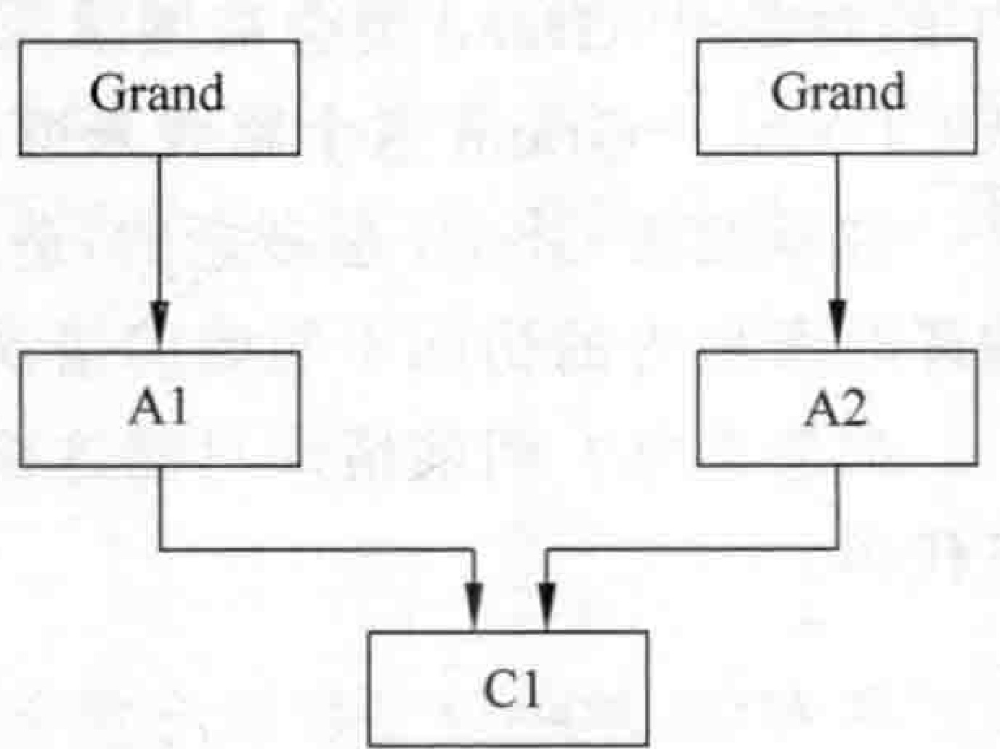  
图4.35常规的多重继承导致产生出多个爷爷类子对象的问题  


执行起来，看一看结果：  

``` cpp
4
4
4
8
```

分析一下结果中的4、4、4、8。尤其是为什么C1的sizeof值变成8了？就是因为内存中有两份Grand类子对象，从而造成有两份m_grand成员变量，一份m_grand占用4字节 内存，两份占用的是8字节内存。  

继续向main主函数中增加代码：  

``` cpp
C1 c1;  
c1.m_grand = 12; //这句编译时会报错
```


编译报错，系统提示对 $\mathrm{m_{=}}$ grand的访问不明确。为什么不明确呢？就是因为定义类C1的对象时，Grand类会被继承两次，一次是从 $\mathrm{C1}{\rightarrow}\mathrm{A1}{\rightarrow}$ Grand这个路线来继承，一次是从 $\mathrm{C1}{\rightarrow}\mathrm{A2}{\rightarrow}$ Grand这个路线来继承。  

继承两次Grand是多余的，造成的二义性问题指的就是这种cl.mgrand $=12$ ；代码编译时所报告的访问不明确的错误。  

那怎么办？当前情形只能这样访问m_grand成员变量，在main主函数中继续增加如下代码：  

``` cpp
c1.A1::m_grand = 5;  
c1.A2::m_grand = 8;
```

设置断点，调试，并观察c1对象的内存，如图4.36所示。前4字节对应的是A1路线里的m_grand，后4字节对应的是A2路线里的m_grand，这就证实了在cl对象的内存中有两个m_grand。  

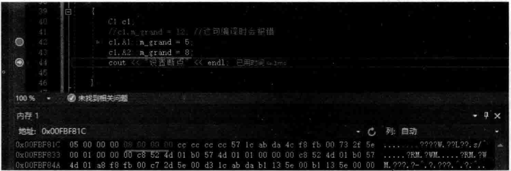  
图4.36c1对象中包含了两个m_grand成员变量  

绘制一下c1的对象数据布局，如图4.37所示。  

在图4.37中，上面的m_grand可以认为是来自于A1（A1是继承自Grand），下面这个m_grand可以认为是来自于A2（A2也是继承自Grand）。  

既然继承两次Grand是多余的，就需要让Grand只被继承一次。  

为此，引入了虚基类（虚继承）的概念。读者已经知道，虚基类必须是三层结构，有一个爷爷类，两个父亲类，还有孩子类，一般如图4.38所示。  

对象cl  

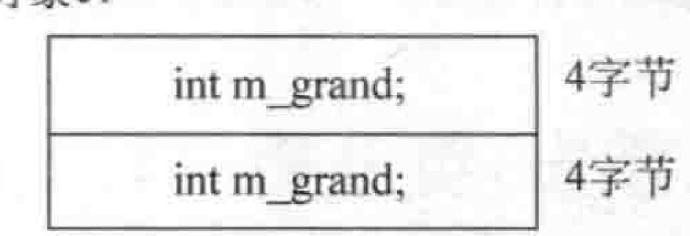  
图4.37c1对象数据布局  

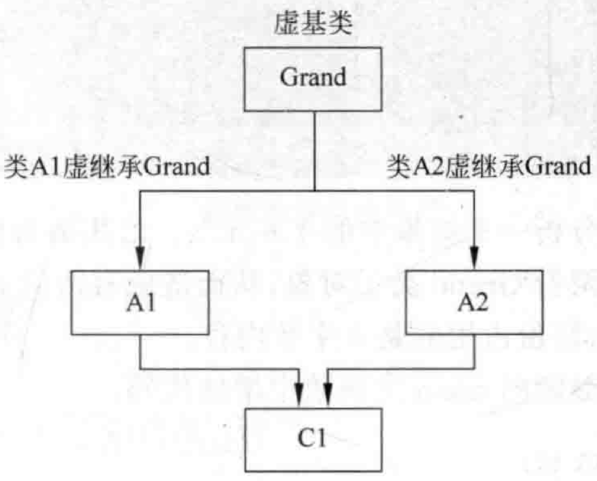  
图4.38虚继承解决了Grand被继承多次的情形  

注意图4.38中A1和A2虚继承自Grand，Grand就是虚基类，虚基类就代表一件事：在孙子类（C1）对象中，只包含一份Grand类子对象，而不管Grand在继承体系中出现多少次。这份Grand类子对象，可以说，既不来自于A1，也不来自于A2，应该看成是一份独立的Grand类子对象。  

换句话说，如果定义一个C1类的对象：  

``` cpp
 C1 c1;  
```


那么在cl对象的数据布局里只会出现一个Grand类子对象。这意味着上面的 $\mathbf{m_{-}}$ grand不会再出现两个了（出现两个的时候一个是来自于A1，一个是来自于A2，现在既不来自于A1也不来自于A2，是归属于C类对象自己的Grand类子对象）。  

不要把虚基类（虚继承）和虚函数混为一谈。虚基类解决的是多重继承时Grand这种爷爷类的子对象多次出现在C1这种孙子类对象中的问题，虚基类这种手段保证了Grand这种子对象在C1孙子类对象中只有一份。  

现在，把以往的所有代码全部注释掉，引人虚基类（虚继承）相关代码。在MyProjectcpp的上面，增加如下代码行：  

``` cpp
class Grand //爷爷类  
{  
public:  
    int m_grand;  
};  
class A1 : virtual public  Grand //注意这里用了virtual  
{  
public:  
};  
class A2 : virtual  public  Grand//注意这里用了virtual  
{  
public:  
};  
class C1 :public A1, public A2 //这里不需要virtual  
{  
public:  
};
```

在main主函数中，加人如下代码：

``` cpp
C1 c1;  
c1.m_grand = 12; //这句编译时不会再报错
```


通过上面的代码可以看到，引人虚基类后，就不会出现m_grand访问不明确的问题。因为此时只有一个Grand类子对象，而不是两个，不会再出现二义性问题。  

另外，读者需要知道的是，虚基类的想法很好，但是在编译器中支持虚基类并不是一件轻松的事，不像表面看起来这样容易，每个编译器的实现厂商都可能有自己不同的实现手段。  

另外，虚基类出现后，程序员书写代码也会有一定的变化和调整。例如，如果Grand类的构造函数带参数，以往是由A1、A2这种直接子类在构造函数初始化列表中来初始化  

Grand，引l入虚基类后，就必须在C1这个孙子类构造函数的初始化列表中初始化Grand爷爷类。相信读者的 $\mathrm{C++}$ 基础都很好，这些知识应该都已经掌握，所以这里笔者就不多说。  

## 4.8.2 虚基类初探  

现在，为了简化问题，首先注释掉Grand类中的成员变量m_grand：  

``` cpp
//  int m_grand;
```

在main主函数中，注释掉以往的代码，加人如下代码：  

``` cpp
cout << sizeof(Grand) << endl;  
cout << sizeof(A1) << endl;  
cout << sizeof(A2) << endl;  
cout << sizeof(C1) << endl;
```


执行起来，看一看结果：  

``` cpp
1
4
4
8
```


虚基类这种技术的实现和编译器底层密切相关，可能每个平台的实现略有差异，这里就以笔者的当前开发环境VisualStudio2019为主来探讨。  

一般来讲，虚基类会涉及两个概念：①虚基类表(virtual base table,vbtable);②虚基 类表指针(virtual base table pointer,vbptr)。注意这里都是带字母b的，表示base(基本)的 意思。

分析一下上面程序执行的结果，为什么是1、4、4、8这几个数字呢？  

上述范例代码为了简化问题，类中的内容都保持为空（空类）。读者已经知道，一个纯粹的空类，它的sizeof值是1，那么这里sizeof不是1的类，肯定是因为继承关系所致。  

因为Grand（爷爷类）是空类，所以sizeof值是1，这好理解。  

A1和A2类是属于虚基类层次结构的中间层（父类），虚继承（virtual）了Grand类。它们的sizeof值都是4个字节，那么这4个字节是什么呢？猜测一下不难想象，这应该是一个指针，这种虚继承父类的子类（A1和A2）里面都会被编译器插入一个虚基类表指针，这个指针相当于一个成员变量的感觉，因为这个指针是占用类对象尺寸的，也就是sizeof的时候，结果等于4。谈到占用尺寸的向题，这里就与讲解虚函数时的虚函数表指针有点类似（虚函 数表指针也是占用类对象尺寸的）。  

做一下测试，在main主函数中，加人如下代码行：  

``` cpp
A1 a1;  
A2 a2;  
cout << "设置断点" << endl;
```

设置断点于cout所在行，调试并观察a1和a2对象所在内存的数据，发现a1和a2内存中的内容不同，这说明a1和a2对象里的虚基类表指针指向的位置并不相同。  

那么这个虚基类表指针是做什么的，显然它应该是指向虚基类表的，虚基类表后面再谈。  

那么，为什么C1这个孙子类的sizeof值是8字节呢？猜一猜，C1类有A1和A2两个父类，每个父类里有一个虚基类表指针，这个虚基类表指针会被C1类继承，两个虚基类表指针是 $2\!\times\!4\!=\!8$ 字节，所以现在看到的事实是类C1的sizeof值8（字节）。  

这就是通过简单的观察和分析，推测得到的一个结论。  

上一节推测对象数据布局的时候是通过写测试代码来推测，本节通过命令来观察对象数据布局。  

在VisualStudio2019（或其他VisualStudio版本）中打开开发人员命令行工具，忘记如何打开的读者可以参考图2.9。在这个命令行提示符下，可以直接使用cl命令行工具（编译链接工具）。  

要查看Grand类的对象数据布局，在命令行提示符下，进人到MyProject.cpp文件所在的路径，并输人cl/dl report Single Class Layout Grand My Project.cpp，如图4.39所示。  

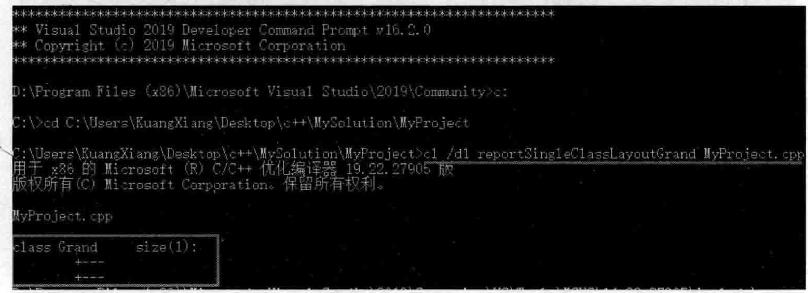  
图4.39Windows操作系统下使用cl工具查看虚基类Grand对象数据布局  

从图4.39中可以看到，虚基类Grand是空的，1字节，没有什么布局可言。  

查看A1类的对象数据布局，输入cl/d1 reportSingleClassLayoutA1 MyProject.cpp, 如图4.40所示。 

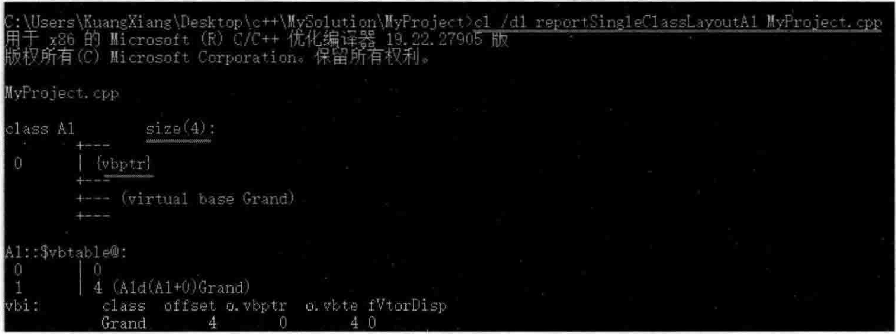  
图4.40Windows操作系统下使用cl工具查看类A1对象数据布局  

查看A2类的对象数据布局，如图4.41所示。  

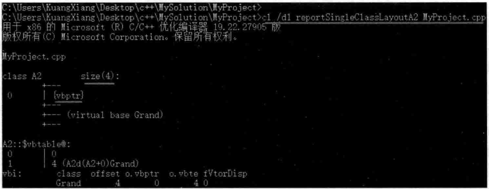  
图4.41Windows操作系统下使用cl工具查看类A2对象数据布局  

查看C1类的对象数据布局，如图4.42所示。  

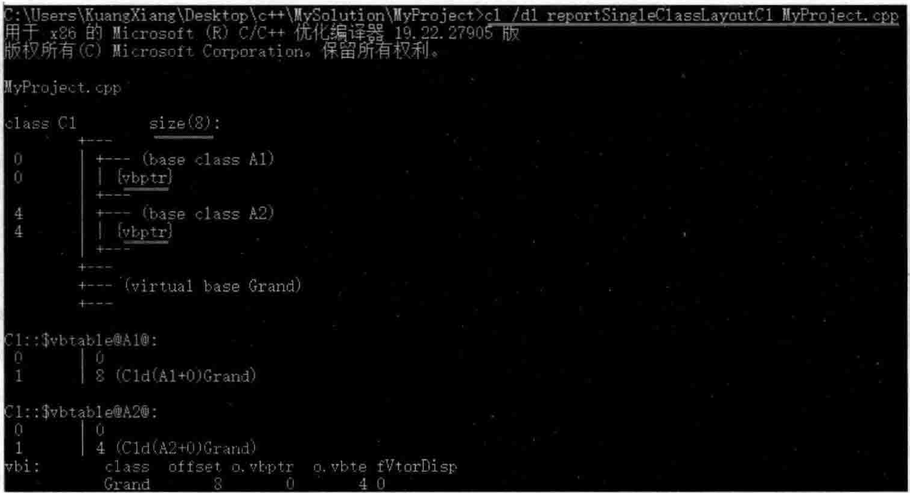  
图4.42Windows操作系统下使用cl工具查看类C1对象数据布局  

通过利用上述的cl工具，简单观察，也分别得到了Grand、A1、A2、C1的sizeof值分别为1、4、4、8的结论。  

现在，为了后续演示和观察方便，往各个类中增加一个成员变量。增加了成员变量后的各个类定义内容如下：  

``` cpp
class Grand //爷爷类  
{  
public:  
    int m_grand;  
};  
class A1 : virtual public  Grand //注意这里用了virtual  
{  
public:  
    int m_a1;  
};  
class A2 : virtual  public  Grand//注意这里用了virtual  
{  
public:  
    int m_a2;  
};  
class C1 :public A1, public A2 //这里不需要virtual  
{  
public:  
    int m_c1;  
};
```

执行起来，看一看结果：  

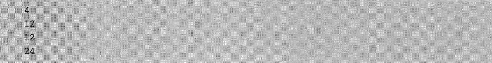  

注意比较，在往各个类中增加成员变量之前的sizeof值是1、4、4、8。  

如何理解上述这几个新的sizeof值呢？  

因为Grand（爷爷类）是包含一个int类型的成员变量，所以sizeof值是4，这好理解。  

A1类和A2类的sizeof值是12，怎样得到的？两个int类型的成员变量 $+1$ 个虚基类表指针，一共是3个4字节 $=\!12$ 字节。  

C1类的sizeof值是24，怎样得到的？四个int类型的成员变量 $+2$ 个虚基类表指针，一共是6个4字节  $=24$  字节。  

同样，用cl命令看一看此时的Grand类的对象数据布局，如图4.43所示。  

  
图4.43Windows操作系统下使用cl工具查看虚基类Grand对象数据布局  

查看A1类的对象数据布局，如图4.44所示。  

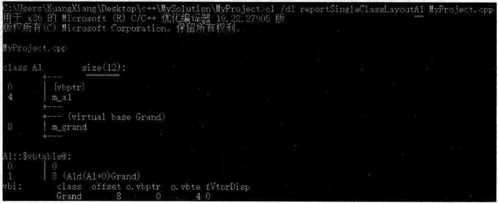  
图4.44Windows操作系统下使用cl工具查看类A1对象数据布局  

请注意，虚继承和常规继承不同：  

（1）开头4个字节是虚基类表指针： $1{\sim}4$ 字节。
（2）接着的4个字节是 $\mathrm{m\_a1}$  $5{\sim}8$ 字节。
（3）再接下来的4个字节才是m_grand： $9\!\sim\!12$ 字节。  

传统继承的情况下，m_grand应该是排在m_al前面的，而虚继承恰恰相反。编译器把Grand子对象放到了最后，它这么设计肯定有它的原因。笔者都知道，设计编译器的这些人对细节都是了如指掌的，都有他们的考虑，根据推测，放到最后应该是为了方便访问。A1对象的数据布局应该如图4.45所示。  

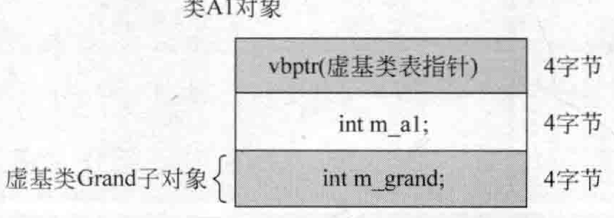  

查看A2类的对象数据布局，与A1很类似，如图4.46所示  

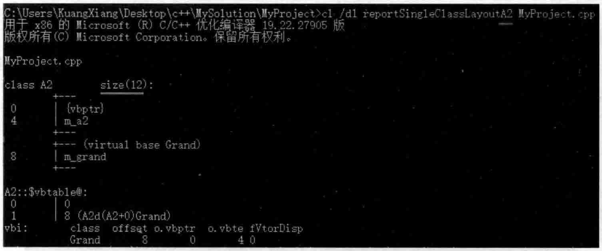  
图4.46Windows操作系统下使用cl工具查看类A2对象数据布局  

随着C1类的介人，产生了三层结构，读者已经知道，只有三层结构才能体现出虚基类设计的用处一一孙子类对象中只有一个爷爷类子对象。查看C1类的对象数据布局，如图4.47所示。  

从图4.47可以看到这24个字节的对象数据布局：  

类A1的虚基类表指针：  $1\!\sim\!4$  字节 
mal： $5{\sim}8$ 字节。
类A2的虚基类表指针：  $9\!\sim\!12$  字节 
ma2: $13\!\sim\!16$ 字节。
mcl: $17\!\sim\!20$ 字节。
mgrand:  $21\!\sim\!24$  字节。  

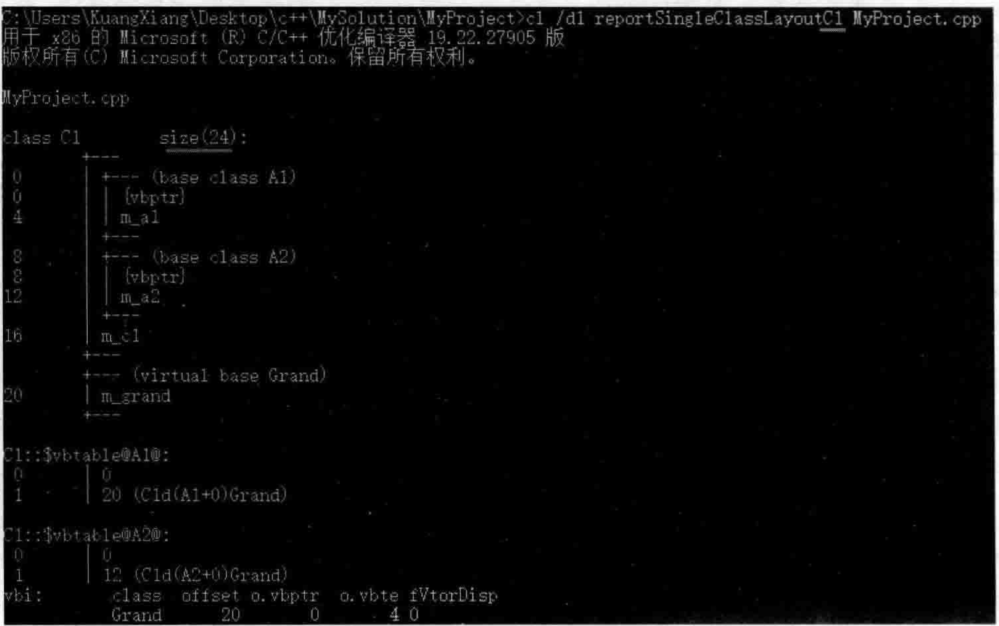  
图4.47Windows操作系统下使用cl工具查看类C1对象数据布局  

看一看C1对象的数据布局，应该如图4.48所示。  

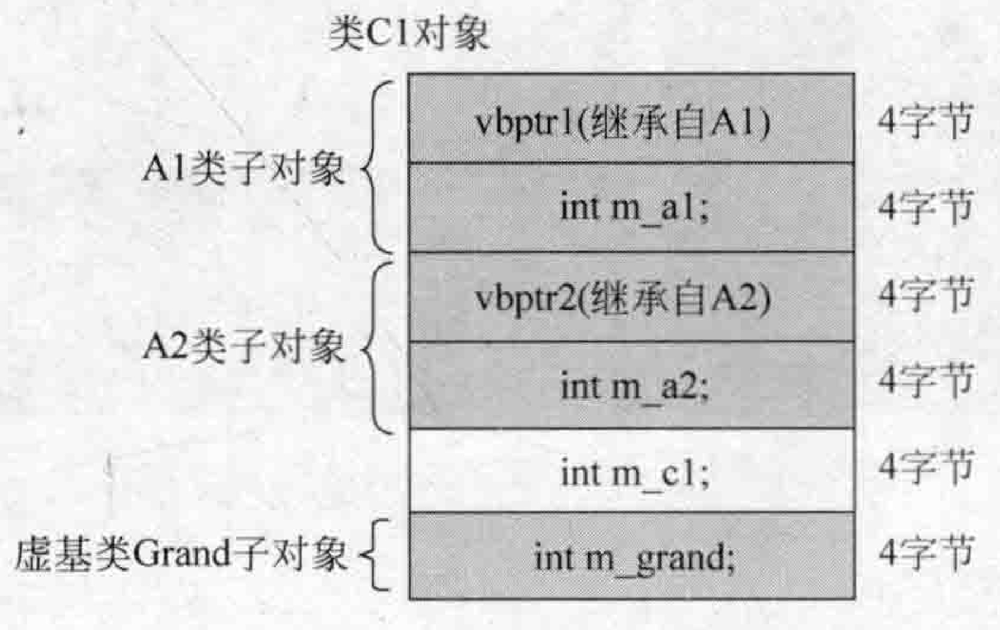  
图4.48类C1对象数据布局  

从图4.48不难观察到，m_grand依旧被排在最后。  

本节就是提出虚基类问题，并做个初步探索，主要讲述观察到的一些虚基类的内容。