# 4.9两层结构时虚基类表内容分析  

本节所说的两层结构，指的是有父类Grand，有子类A1和A2，但没有孙子类C1的意思。  

虚基类表，一般是在编译的时候，编译器就生成出来了。虚基类表是跟看类走的，依附于类而存在。一般来讲，虚基类表是8字节长（编译器就是这样设计的），4个字节为一个单位，如果有多个虚基类（classAl：virtual public Grand，virtual public Grand 2{}；），每多一个，虚基类表的长度一般要多加4个字节。  

## 4.9.1虚基类表内容之 ${\bf5}\!\sim\!{\bf8}$ 字节内容分析  

上一节最终的范例代码原样保留，本节中要使用。在图4.45中，已经看到了类A1对象的数据布局在main主函数中，加人如下代码行：  

``` cpp
A1 a1obj;  
a1obj.m_grand = 2;  
a1obj.m_a1 = 5;
```


读者已经知道，一旦有了虚基类，那么生成该类对象时，对象中就会有一个虚基类表指针（vbptr），也就是说，对象alobj中会有一个虚基类表指针（隐藏的成员变量）。  

在2.4节讲解过，在有虚基类的情况下，编译器会为类生成一个“合成默认构造函数”。这里，Grand就是虚基类，编译器会为A1类合成一个默认构造函数，并且在这个默认构造函数中，编译器会插人代码，给vbptr这个虚基类表指针赋值（这里就是虚基类表指针得到值的时机）。  

将断点设置在A1alobj；行，开始调试，当程序执行流程停留在断点行时切换到反汇编窗口，如图4.49所示。  

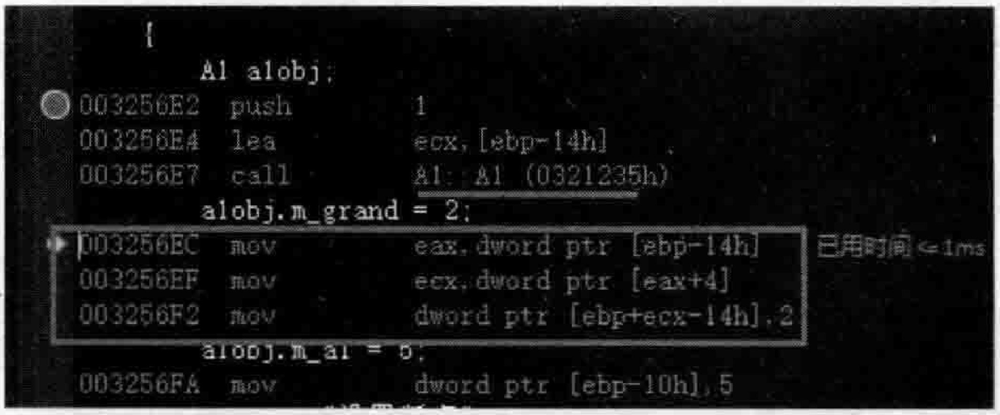  
图4.49生成A1类对象时的反汇编窗口  

在图4.49中，注意到创建alobj对象导致调用了A1：：A1构造函数，在反汇编窗口中也可以使用快捷键F10单行执行，用快捷键F11（对应“调试” $\rightarrow$ “逐语句”命令）跳人到函数内部去执行。这里可以使用F11键跳人到A1：：A1构造函数中去继续跟踪调试。根据需要配合使用F10、F11键，就可以在A1：：A1的构造函数中找到为虚基类表指针赋值的语句行，如图4.50所示。  

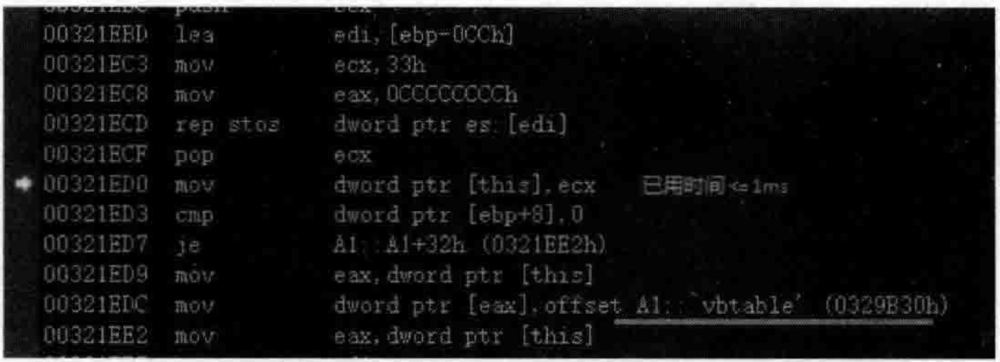  
图4.50编译器在默认构造函数中插人为虚基类表指针赋值的语句  

接着，看看怎样给虚基类（Grand）的成员变量（m_grand）赋值。继续观察图4.49，针对代码行alobj.m_grand $=2$ ；对应的汇编代码，第1行moveax，dwordptr[ebp-14h]的含义就是把当前对象内存中开始的4个字节内容放到eax里，可以使用命令“调试” $\twoheadrightarrow$ “窗口” $\rightarrow$ “寄存器”，打开寄存器窗口观察eax的值，如图4.51所示。  

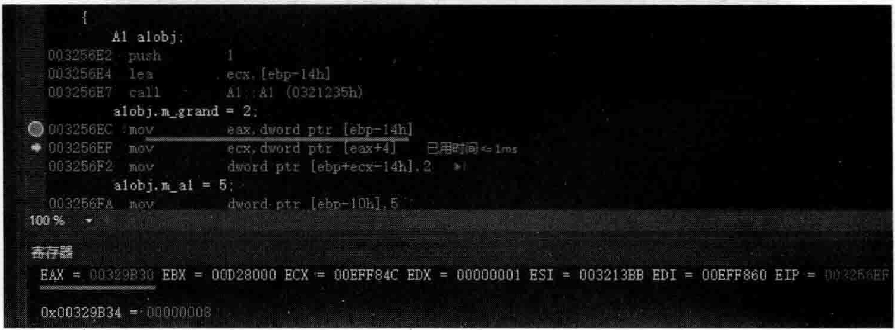  
图4.51a1obi对象内存开头的4字节内容（虚基类表地址）被放到了EAX寄存器中  

现在，就等于把虚基类表地址放入到eax寄存器里面去了（根据图4.45，对象alobj内 存开始的4个字节是虚基类表指针，指向的是虚基类表）。注意，汇编代码中的ebp-14h其实代表的就是alobj对象，而Lebp-14hl代表alobj对象首地址中的内容（实际上是前4个字节的内容）。  

第2行mov ecx，dword ptr[eax+4]的含义是虚基类表首地址，往后移动4个字节后（第5～8个字节）的内存中的内容给了ecx寄存器，执行该行后发现ecx中的值变成了8，如图4.52所示。

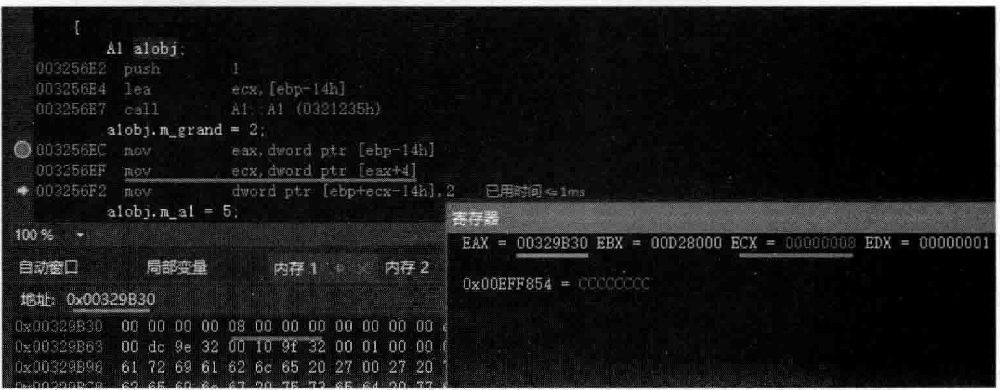  
图4.52将虚基类表首地址后移4个字节后的内存内容放到了ECX寄存器  

第3行movdwordptr[ebp十ecx一14h]，2的含义是什么呢？这里[ebp十ecx一14h]代表alobj对象代表的内存首地址往后移动8个字节（因为ecx等于8）后的内存 $(9\!\sim\!12$ 字节），而2的含义是把这段内存的内容设置为2。根据图4.45，a1obi对象往后移8个字节正好移动到m_grand成员变量的地址上去，所以这行汇编代码的含义就是把2这个值赋给m_grand成员变量。如图4.53所示。  

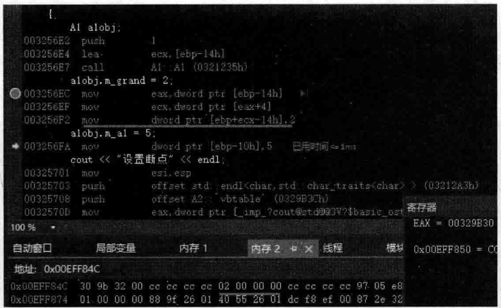  
图4.53将2这个值（00000002）写人到对象alobj所代表内存空间的第 $9\!\sim\!12$ 个字节的位置  

所以，观察图4.53不难想象，被赋值为2的内存就是图4.54中最下面的这段内存 $\left(\mathrm{m_{\mathrm{=}}}\right.$ grand所代表的内存）：  

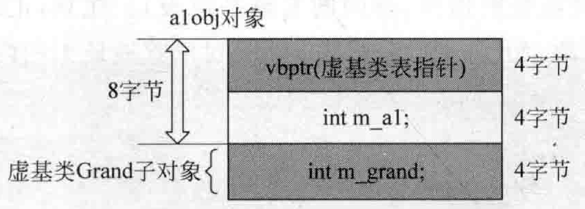  
图4.54类对象alobj的数据布局  

所以，虚基类表中的第 $5\!\sim\!8$ 个字节存储的实际是图4.54中的“虚基类表指针”这个成员变量（vbptr）的首地址和虚基类（Grand）子对象首地址之间的偏移量（两个地址相减后的差值）。也就是说，“虚基类表指针”成员变量的首地址 $+$ 这个偏移量（通过前面解说汇编代码，本例中这个偏移量的值为8）就等于这个虚基类对象首地址（其实在这里也就是m.grand成员变量的地址）。跳过这个偏移，就能访问到虚基类对象所代表的内存。  

## 4.9.2各种形式的继承  

首先，确认一下当前范例中，Grand、A1、A2、C1的sizeof值分别是4、12、12、24。  

通过上面的学习，对虚基类表第 $5\!\sim\!8$ 字节的内容已经知道是什么了，那第 $1\!\sim\!4$ 字节的内容又是什么呢？  

为了研究这个问题，需要增加一些代码。在MyProject.cpp的上面，增加一个新类Grand2  

``` cpp
class Grand2  
{  
public:  
    int m_grand2;  
};
```


现在A1来继承一下Grand2，但是这里并不是虚继承Grand2，而是普通继承（实继承）Grand2:  

``` cpp
class A1 : virtual public  Grand, public Grand2{...};
```

此时，Grand、A1、A2、C1的sizeof值分别是4、16、12、28  

这里尤其要注意的是A1的sizeof值从12变成了16。在main主函数中，继续增加一些代码，来看一看现在的对象布局。  

``` cpp
A1 a1obj;     
a1obj.m_grand = 2;  
a1obj.m_grand2 = 6;  
a1obj.m_a1 = 5;
```


设置断点，调试观察，用老手法来找内存布局（4.7.2节对老手法进行过详细的描述），从而确定对象的布局如下：  

```cpp
A1 alobj;
alobj.m_grand = 2;
//13~16 字节
alobj.m_grand2 = 6;
//1~4 字节
alobj.m_al1 = 5;
//9~12 字节
```

从而推导出虚基类表指针是第 $5\!\sim\!8$ 字节，所以A1类对象的数据布局图大概如图4.55所示：  

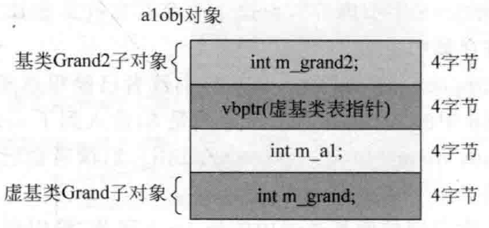  
图4.55类对象alobi的数据布局  

从图4.55可以看到，虚基类Grand子对象还是在最下面，而基类Grand2子对象跑到最上面去了，A1类对象（ $|\mathrm{m}_{-}\mathrm{a}1\rangle$ 依旧夹在虚基类表指针vbptr和虚基类Grand子对象之间。  

知道了虚基类表指针是第 $5\!\sim\!8$ 字节后，就可以在调试过程中查看虚基类表的内容了（通过在内存中直接输人虚基类表的地址即可），如图4.56所示。  

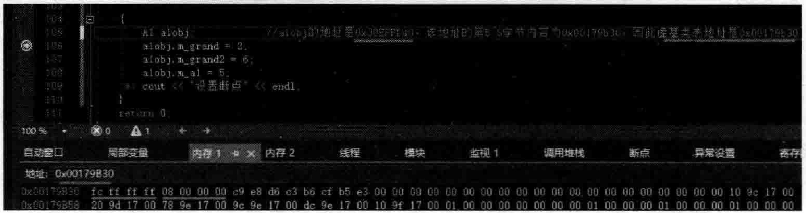  
图4.56通过对象地址找到虚基类表地址，然后显示虚基类表的内容  

从图4.56可以看到，第 $5{\sim}8$ 字节的内容还是8，没有变化，但是第 $1{\sim}4$ 字节内容发生了改变，以往是00000000，现在是fcffffff，这个值其实是一4，负数一般都是补码存储，所以看起来比较怪。如果向一个int型变量中保存一个一4，然后观察一下它的内存，就能看到fcfff这个值。  

然后看一下对应的汇编代码，如图4.57所示。  

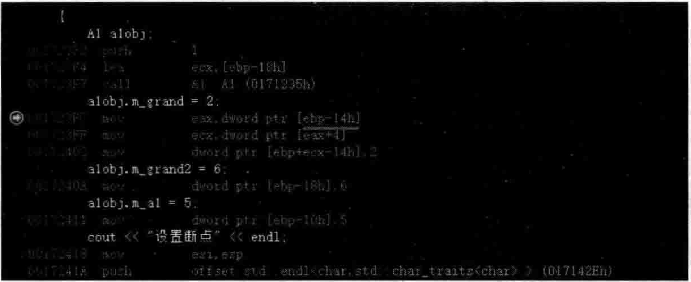  
图4.57给alobj对象的m_grand成员变量赋值所对应的汇编代码  

经过调试、查看寄存器、比对，观察alobj.m_grand $\equiv2$ 这行对应的汇编代码（和上面讲过的3行汇编代码非常类似），其实：  

（1）第1行代码moveax，dwordptr[ebp-14h]。又见到了熟悉的ebp-l4h，这里要对ebp-14h有一个更细致的理解，ebp-14h代表的其实是图4.55中虚基类表指针指向的地址（也就是对象alobj的第 $5\!\sim\!8$ 字节内容），而这个内容其实就是虚基类表的地址。现在这个地址被放人到了eax寄存器中。  

（2）第2行代码movecx，dwordptr[eax十4]，读者已经很熟悉了，依旧是虚基类表后4个字节的内容（图4.56中的 $08\ 00\ 00\ 00$ ，其实就是8）放人到了ecx寄存器中。  

（3）3 mo vd word ptr[ebp $^{\pm}$ ecx一14h]，2，读者也已经很熟悉了，依旧是给m_grand成员变量赋值2。  

不过目前看起来并没有用到虚基类表中的第 $1{\sim}4$ 字节，没用到就无须理会。  

修改一下类A1的继承关系，原来的第一个父亲是虚继承，第二个父亲是普通继承。现在反过来，第一个父亲变成普通继承，第二个父亲变成虚继承：  

``` cpp
class A1 : public  Grand, virtual public Grand2{...};
```

再次用老手法分析一下main主函数中的对象布局：  
```cpp
A1 alobj;
aloobj.m_grand = 2;//1~4字节
aloobj.m_grand2 = 6;//13~16字节
aloobj.m_a1 = 5;//9~12字节
```
从而推导出虚基类表指针是第 $5\!\sim\!8$ 字节，所以A1类对象的数据布局图大概如图4.58所示。  

跟踪调试，发现虚基类表中的内容没有发生变化，依旧是前4个字节内容为fc ff ff ff，后4个字节内容为08 00 00 00，如图4.56所示。反汇编代码也大同小异，参考图4.57，这里不再额外说明。  

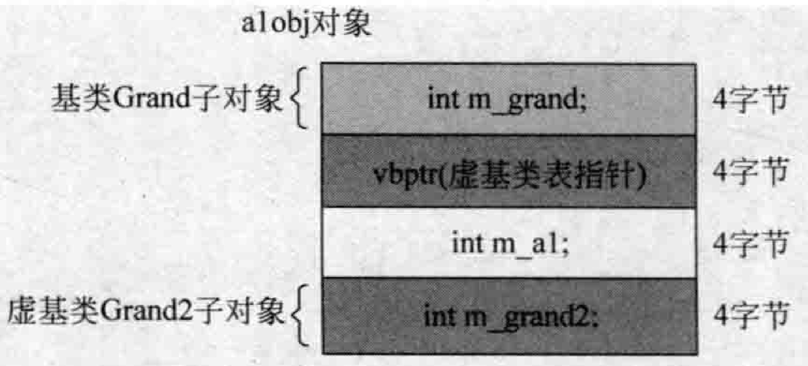  
图4.58类对象alobi的数据布局  

再次修改A1类的继承关系，这次继承的两个父亲都变成虚继承：

``` cpp
class A1 : virtual public  Grand, virtual public Grand2
```

再次用老手法分析一下main主函数中的对象布局：  
```cpp
A1 alobj;
aloobj.m_grand = 2;  //9~12字节
aloobj.m_grand2 = 6; //13~16字节
aloobj.m_al1 = 5;    //5~8字节
```
从而推导出虚基类表指针是第 $1\!\sim\!4$ 字节，所以A1类对象的数据布局图大概如图4.59所示。  

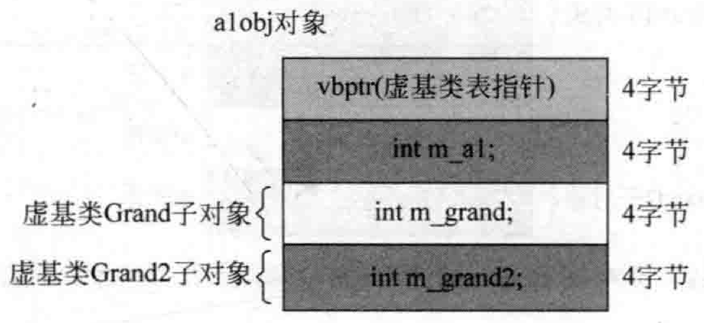  
图4.59类对象alobj的数据布局  

设置断点并调试执行，看一看虚基类表中的内容，如图4.60所示。这里关注从虚基类表首地址开始的一共12个字节的内容。  

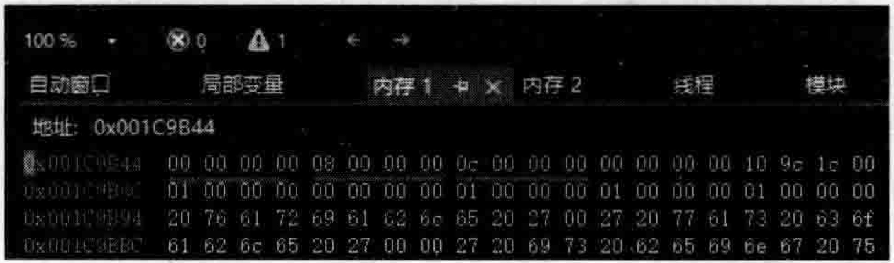  
图4.60继承自两个虚基类时A1类对应的虚基类表中的内容  

再看一下对应的汇编代码，如图4.61所示。  

观察图4.61可以得到一些结论：  

（1）虚基类表现在应该是有3项（如果按每一项有4字节计算）。因为图4.61的汇编代码用到了取虚基类表中 $+4$ 或者 $+8$ 字节后的内存内容作为偏移值，来计算成员变量 $\mathbf{m_{\bot}}$ grand和m_grand2的首地址并为它们赋值。  

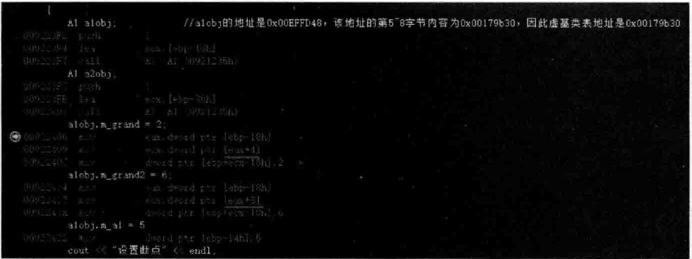  
图4.61给alobj对象的m_grand和m_grand2成员变量赋值所对应的汇编代码  

（2）虚基类表中的偏移量信息是按照继承顺序来存放的

（3）虚基类子对象一直都放在最下面。  

## 4.9.3虚基类表内容之 ${\bf1}\!\sim\!{\bf4}$ 字节内容分析  

在图4.56中，看到了虚基类表中第 $1\!\sim\!4$ 字节内容为fcffffff（一4）的情形，再次参考图4.58并把这个图进一步绘制一下，如图4.62所示。  

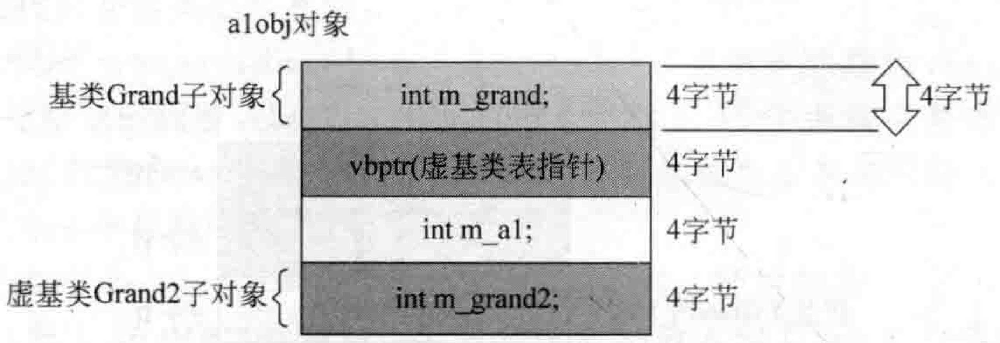  
图4.62类对象alobj的数据布局（实继承Grand，虚继承Grand2）  

所以，经过各种比较和思考，虚基类表内容的前4个字节应该是对象alobj首地址与“虚基类表指针vbptr”成员变量的首地址之间的偏移量（差值）。例如，本对象首地址为 $0{\bf x}0085f818$ ，而vbptr成员变量的首地址为 $0{\bf x}0085\mathrm{f}81\mathrm{C}$ （其实在图4.62中就是对象首地址往后移动4个字节，即 $0{\bf x}0085f818{+}4)$ ，那么， $\begin{array}{r}{0\mathbf{x}0085\mathbf{f}818\!-\!0\mathbf{x}0085\mathbf{f}81\mathrm{C},}\end{array}$ 结果就是一4。  

上面分析了不少情况，也分析了对应的汇编代码，不知读者是否发现一个规律：只有对虚基类的成员变量进行处理如赋值的时候，才会用到虚基类表一一取其中的值用作偏移值来进行虚基类成员变量首地址的定位运算。