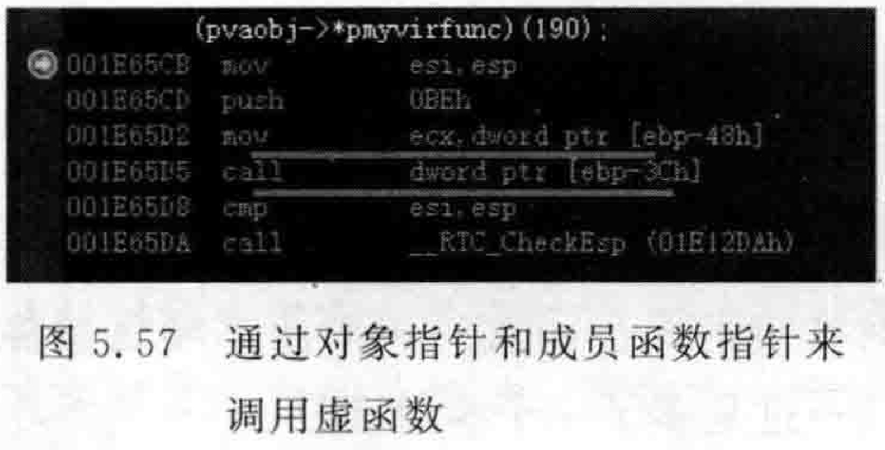
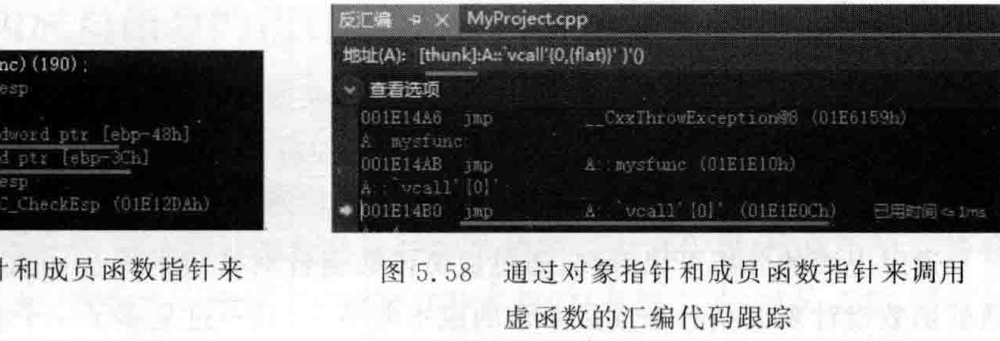
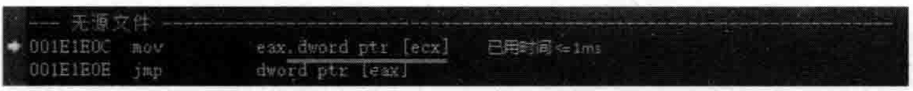
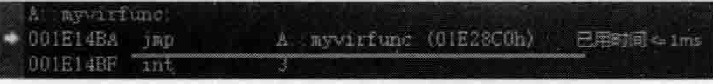
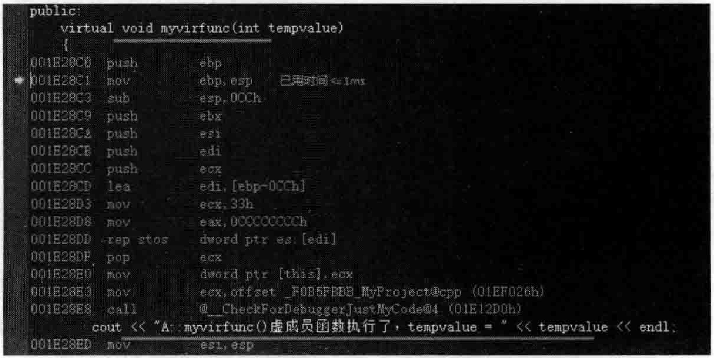
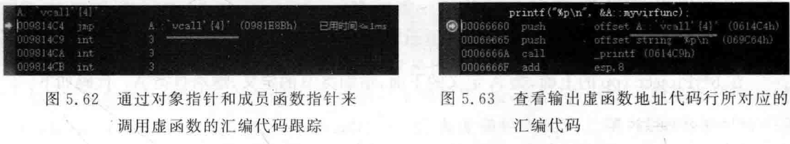
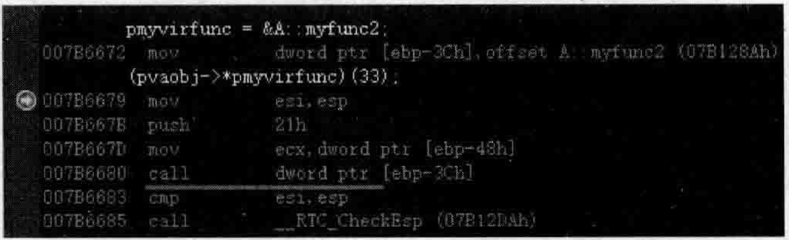
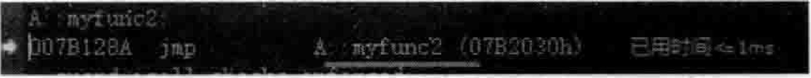
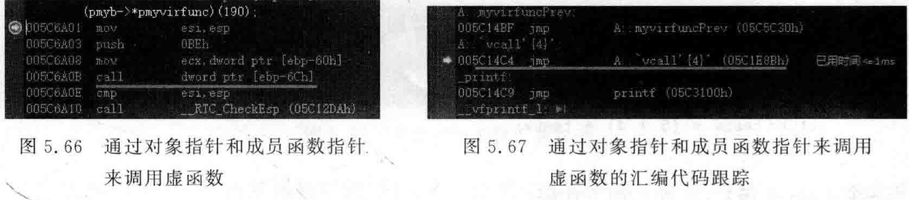
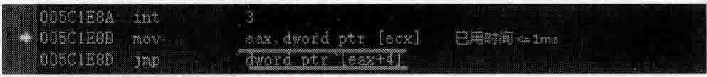

# 5.10指向成员函数的指针和vcall  

## 5.10.1-不用类对象能否调用类的虚函数和普通成员函数  

在3.2节中手工调用了虚函数，正常来讲，虚函数的调用也需要this指针（this指针将作为该虚函数的第一个隐藏的参数被传递进虚函数中去），但3.2节代码中调用虚函数并没有用到this指针，为什么也可以成功调用呢？  

这个事情可以这样理解，从本质上来讲，只要一个函数有地址，就可以直接去调用（类的普通成员函数包括虚函数都是有独立地址的），如果这个函数需要一些参数，但是调用者调用该函数时没有传递进去这些参数，那么，只要这个函数的函数体代码中没有用到这些参数，那么执行这个函数一般就不会报告异常（或者即便报告异常也会发现这个函数的函数体还是能够被成功执行的），但一旦用到这些参数，程序执行可能就会报告异常。这就解释了3.2节中不需要this指针也能直接调用虚函数的原因。  

对于一个普通的类成员函数，假如这个类成员函数没有任何参数，其实，不需要this指针也同样能够直接调用（调用的前提是函数体中不会用到this参数）。当然，这种调用是属 $\asymp$ 种奇异的编程方法，主要目的是向读者阐述道理。可以写一段代码来不通过创建类对象就能够调用类的普通成员函数。在MyProject.cpp的上面，增加如下代码行：  

``` cpp
//将一个成员函数的地址转换成普通地址  
template<typename dst_type, typename src_type>  
dst_type pointer_cast(src_type src)  
{  
    return *static_cast<dst_type*>(static_cast<void*>(&src));  
}  
class TDF  
{  
public:  
    void myf(int val)  
    {  
       cout << "myf()成员函数执行了" << endl;  
    }  
};
```

上面pointer_cast这段函数模板代码比较有趣，是笔者通过网络搜集而来。在main主函数中，输人如下代码：  

``` cpp
printf("TDF::myf的地址是%p\n", &TDF::myf);  
typedef void (*Func)();  
Func fun1 = pointer_cast<Func>(&TDF::myf);  
void* func2 = pointer_cast<void*>(&TDF::myf);  
fun1();  //把成员函数当普通函数调用
```

执行起来，看一看结果：  

``` cpp
TDF：：myf 的地址是 0060142E
myf（）成员函数执行了
```

可以看到，TDF类的普通成员函数myf确实是可以直接调用。笔者在实验过程中，尝试给myf成员函数随便增加一个参数，发现myf函数依旧能够执行，但执行时程序会报告异常。  

## 5.10.2指向成员函数的指针  

在4.3节讲解了成员变量的偏移值概念，同时也阐述了当进行成员变量存取时，需要用到类对象的首地址（当然，5.10.1小节中讲的情况除外，这里指的是常规编程情况下）。  

类中成员函数的地址是在编译的时候就确定好的，但是在调用成员函数的时候，是需要通过对象来调用成员函数的，因为成员函数的运行要依赖于一个this指针，这个this指针其实就是对象的首地址。请记住一个结论：所有这种常规的（非静态的）成员函数，要想调用，都需要一个对象来调用它。  

在MyProject.cpp的上面，增加类A的代码如下：  

``` cpp
class A  
{  
public:  
    void myfunc1(int tempvalue1)  
    {  
       cout << "tempvalue1 = " << tempvalue1 << endl;  
    }  
    void myfunc2(int tempvalue2)  
    {  
       cout << "tempvalue2 = " << tempvalue2 << endl;  
    }
};
```

在main主函数中加人如下代码：  

``` cpp
A mya;  
  
void (A:: * pmypoint)(int tempvalue) = &A::myfunc1; //定义一个成员函数指针并给初值  
pmypoint = &A::myfunc2; //给成员函数指针赋值  
  
//通过成员函数指针来调用成员函数  
(mya.*pmypoint)(15); //要使用成员函数指针来调用成员函数，必须要对象介入  
  
A* pmya = new A();  
(pmya->*pmypoint)(20); //用对象指针介入来使用成员函数指针 来调用成员函数
```

这种通过成员函数指针对成员函数的调用，编译器也是要向成员函数中插入当前对象指针作为第一个参数（this指针），也就是如下：  
```cpp
// 编译器看来，上面两行调用成员函数的语句转换成如下两行 
pmypoint(&mya, 15);
pmypoint(pmya, 20);
```

反观静态成员函数，5.2.2小节讲解了静态成员函数，当时说过，静态成员函数是跟着类走的，编译器不会向静态成员函数中插人this指针作为第一个参数。所以，如果要用函数指针调用静态成员函数，怎样做呢？  

在类A中增加一个public修饰的静态成员函数：  

``` cpp
public:  
    static void mysfunc(int tempvalue)   
    {   
       cout << "A::mysfunc()静态成员函数执行了，tempvalue = " << tempvalue << endl;   
    }
```

在main主函数中，加入如下代码：  

``` cpp
void (*pmyspoint)(int tempvalue) = &A::mysfunc; //一个普通的函数指针，而不是成员函数指针  
pmyspoint(80); //从编译器角度看也是这个代码，不需要有个所谓的this指针
```

通过上面的分析可以看到，通过成员函数指针对常规的成员函数的调用成本和通过晋通的函数指针来调用静态成员函数的成本差不多，只不过是多了一个参数而已。  

## 5.10.3指向虚成员函数的指针和vcall  

在类A中增加一个public修饰的虚函数：  

``` cpp
public:   
    virtual void myvirfunc(int tempvalue)   
    {  
       cout << "A::myvirfunc()虚成员函数执行了，tempvalue = " << tempvalue << endl;   
    }
```

读者已经知道，虚函数也是有地址的，编译的时候就确定好的。  

在main主函数中，加人如下代码：  

``` cpp
void (A:: * pmyvirfunc)(int tempvalue) = &A::myvirfunc;
```

可以看到，需要用成员函数指针来获得虚函数的地址，因为虚函数的执行也需要this指针。  

在main主函数中，加人如下代码：  

``` cpp
A* pvaobj = new A;  
pvaobj->myvirfunc(190);
```

读者已经知道，上面代码中用对象指针来调用虚函数时，执行的路径是通过虚函数表指针来找到虚函数表，通过虚函数表来查找虚函数的地址并执行该虚函数。  

继续在main主函数中加人代码，用成员函数指针来调用虚函数：  

``` cpp
(pvaobj->*pmyvirfunc)(190);
```

执行程序，一切正常，读者已经知道，pvaobj  $->$  myvirfunc（190）；代码行的调用是通过虚 函数表完成的，那么（pvaobj->\*pmyvirfunc）（190）；的调用是通过虚函数表完成的吗？实际上，依旧是通过虚函数表完成的。  

设置断点到（pvaobj->\*pmyvirfunc）（190）；代码行，开始调试，当程序执行停到断点行时，切换到反汇编窗口，如图5.57所示。  

在图5.57中，[ebp-48h]就是对象指针pvaobj，也就是对象的首地址。Lebp-3Ch]是成员函数指针pmyvirfunc所指向的地址。所以看起来是将对象的首地址放入到ecx寄存器，p my vi rf unc，F 10 Fl 1 call d word ptr[ebp3Ch]看一看，如图5.58所示。  

  

  

在图5.58中看到了在5.3节讲解过的vcal1（也叫vcallthunk）。把vcall看成一段代码，它能引导程序执行流程跳到真正的虚函数中去。其中的vcall0）表示虚函数表的第一项。  

继续按F11键往里面跟踪，如图5.59所示。  

  
图5.59通过对象指针和成员函数指针来调用虚函数的汇编代码跟踪  

在图5.59中，将ecx（对象首地址）开始的4个字节内容给厂eax，对象首地址开始的4个字节内容其实就是虚函数表指针所指向的虚函数表的首地址，现在eax寄存器中保存的就是虚函数表的首地址，继续执行jmp跳转。这里继续按F11键往里面跟踪，如图5.60所示。  

  
图5.60通过对象指针和成员函数指针来调用虚函数的汇编代码跟踪  

再继续按F11键往里面跟踪，就会进人到真正的类A的myvirfunc虚函数中去执行了，如图5.61所示。  

所以，对照5.3节提到的vcall的说法，这里进一步阐述一下vcall。  

vcall是virtualcall的缩写，翻译成中文是“虚调用”，它代表一段要执行的代码的首地址，这段代码引导程序的执行流程去执行正确的虚函数（以及进行this指针调整等），或者可以简单地把vcall看成虚函数表，如果这样看待的话，那么，vcallo}·代表的就是虚函数表里的第一个虚函数，vcall只4就代表虚函数表里的第二个虚函数。  

  
图5.61通过对象指针和成员函数指针来调用虚函数的汇编代码跟踪（进人真正的类A的虚函数中）  

在类A原虚函数myvirfunc虚函数定义之前，再增加一个public修饰的虚函数（注意定义位置放在myvirfunc之前）：  

``` cpp
public:  
    virtual void myvirfuncPrev(int tempvalue)   
    {   
       cout << "A::myvirfuncPrev()虚成员函数执行了，tempvalue = " << tempvalue << endl;   
    }
```

断点行不变，依i旧设置在（pvaobj->?pmyvirfunc）（190）；代码行，开始调试，当程序执行停到断点行时，切换到反汇编窗口，然后再按F11键往里面跟踪，如图5.62所示。  

在图5.62中看到的是vcall $\{4\}$ ，而在图5.58中看到的是vcall $\{0\}$  

继续在main主函数中增加如下代码行：  

``` cpp
printf("%p\n", &A::myvirfunc);
```

取消原来的断点行，设置断点到新加的这个printf代码行，开始调试，当程序执行停到断点行时，切换到反汇编窗口，如图5.63所示。  

  

通过这种比对和观察，可以更进一步地认识到，这种输出虚函数地址的方式用到了vcall，输出来的并不是虚函数的真正地址。  

所以这里可以完善一下理解，&A：：myvirfunc代表一个地址，这个地址中有一段代码，这个代码中记录的是该虚函数在虚函数表中的一个偏移值。有了偏移值，有了具体的对象指针，就能知道调用的是哪个虚函数表里的哪个虚函数了。  

如果这个成员函数指针指向的是普通的成员函数呢？在main主函数中，继续增加如下代码行：  

``` cpp
pmyvirfunc = &A::myfunc2;  
(pvaobj->*pmyvirfunc)(33);
```

取消原来的断点行，设置断点在（pvaobj->\*pmyvirfunc）（33）；代码行，开始调试，当程序执行停到断点行时，切换到反汇编窗口，如图5.64所示。  

  
图5.64通过对象指针和成员函数指针来调用普通成员函数  

在图5.64中按F10键向下执行代码行，在calldwordptr[ebp-3Ch]代码行按F11键跟进去，如图5.65所示。  

  
图5.65通过对象指针和成员函数指针来调用普通成员函数  

从图5.65中可以看到，调用普通的成员函数是直接调用的，不存在vcal1的问题，  

所以，Visual Studio 2019，v call（vcallthunk）地址，也可能是一个真正的成员函数地址。如果是一个vcall地址，vcall能够找出正确的虚函数表中的虚函数地址并进行调用。  

## 5.10.4vcall在继承关系中的体现  

现在引人类B，作为类A的子类，继承关系既然出现，根据以往所说过的，无论父类还是子类，都应该手工增加虚析构函数，为类A增加public修饰的虚析构函数：  

``` cpp
public:  
    virtual ~A()  
    {  
  
    }
```

在MyProject.cpp的上面，类A定义的下面，增加类B的定义，继承自类A。代码如下：  

``` cpp
class B :public A  
{  
public:  
    virtual void myvirfunc(int tempvalue)   
    {  
       cout << "B::myvirfunc()虚成员函数执行了，tempvalue = " << tempvalue << endl;   
    }  
    virtual ~B()   
    {  
    }  
};
```

在main主函数中，加人如下代码：  

``` cpp
B* pmyb = new B();  
void (B:: * pmyvirfunc)(int tempvalue) = &A::myvirfunc;//成员函数指针  
(pmyb->*pmyvirfunc)(190);
```

执行起来，看一看新加人的代码的结果：  

``` cpp
B:: myvirfunc()虚成员函数执行了, tempvalue=190
```

成员函数指针pmyvirfunc给的是类A的myvirfunc虚函数的地址，执行的却是类B的myvirfunc虚函数，读者可能对此有点不太理解。  

设置断点在（pmyb->?pmyvirfunc）（190）；代码行，开始调试，当程序执行停到断点行时，切换到反汇编窗口，如图5.66所示。  

按F11键跟踪进代码行calldwordptr[ebp-6Ch」，如图5.67所示。  

  

继续按F11键跟踪进代码行jmp A：：vcall4}（05C1E8Bh），如图5.68所示。  

  
图5.68通过对象指针和成员函数指针来调用虚函数的汇编代码跟踪  

继续按F11键跟踪进代码行jmpdwordptr[eax十4]，就跳到了B：：myvirfunc虚函数中去了。  

成员函数指针给的是类A的myvirfunc虚函数，结果执行的是类B的myvirfunc虚函数，这证明了一点：&A：：myvirfunc隐藏着一个偏移的信息，这个偏移信息与 $\&$ B：:myvirfunc隐含着的偏移信息相同（读者是否还记得，5.5.1节说过：子类虚函数表项与父类虚函数表项排列顺序一样，偏移值实际也就是虚函数表项的排列顺序）。注意这里笔者说的偏移信息就是类似图5.67中vcall后面}中的数字，如vcall4》中的4就是偏移值，一般vcall0}代表虚函数表的第一项，vcall4}·代表虚函数表的第二项，以此类推。每一项vcall后面（}中的数字要+4。  

也可以试一试将成员函数指针设置为类B的myvirfunc虚函数首地址并跟踪调试查看反汇编代码：  

``` cpp
void (B:: * pmyvirfunc)(int tempvalue) = &B::myvirfunc;
```

最终调用的也是类B的myvirfunc虚函数。说明最终总能够调用到正确的虚函数（类B my vi rf unc）。  

在main主函数中，增加如下两行代码：  

``` cpp
printf("%p\n", &A::myvirfunc);  
printf("%p\n", &B::myvirfunc);
```

执行起来，看一看这两行代码的结果：  

``` cpp
003F14C4
003F150A
```

上面结果说明这两个vcallthunk地址值是不一样的