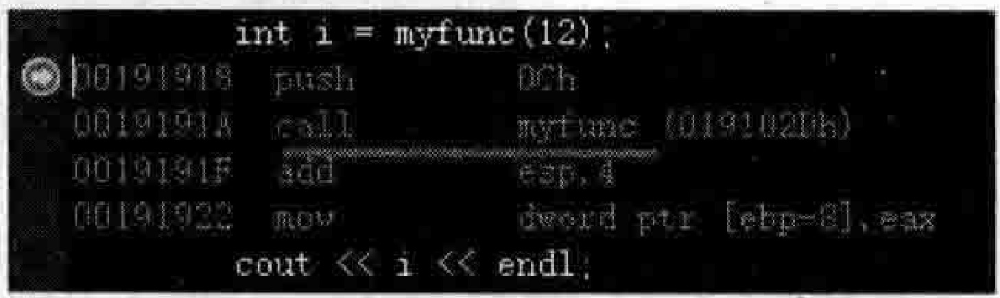
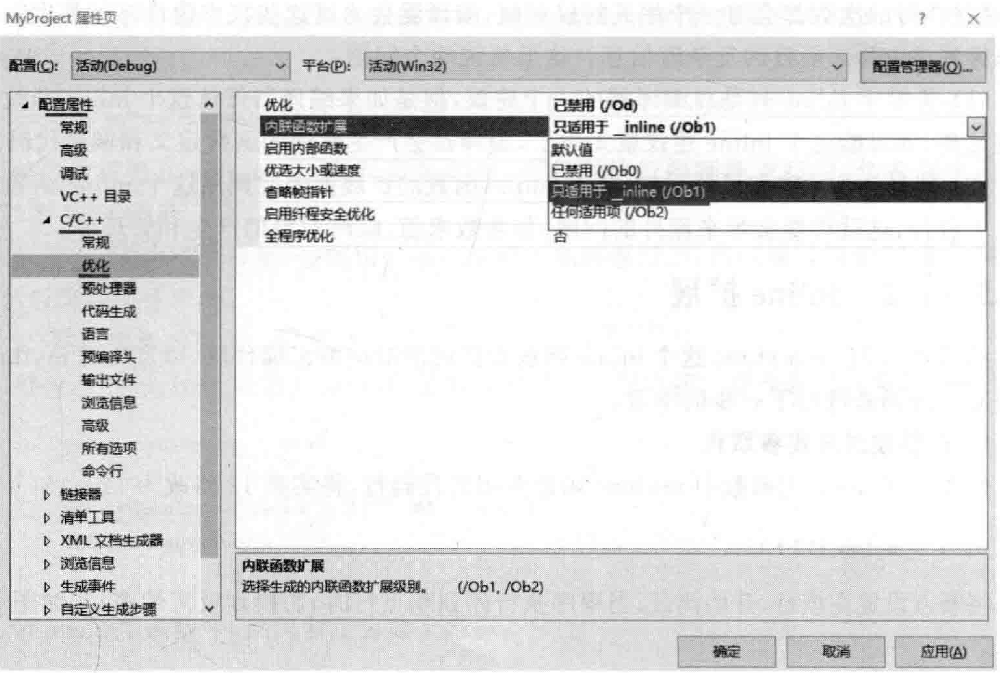
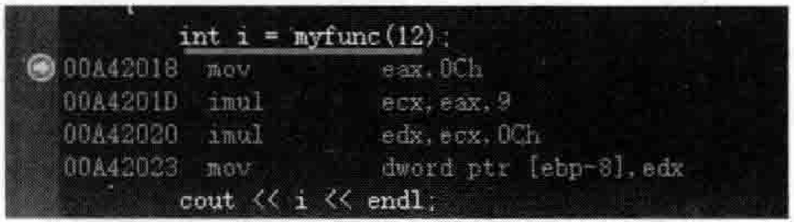
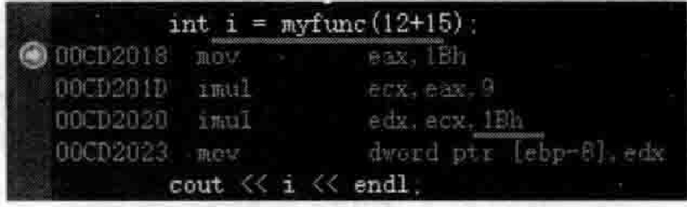
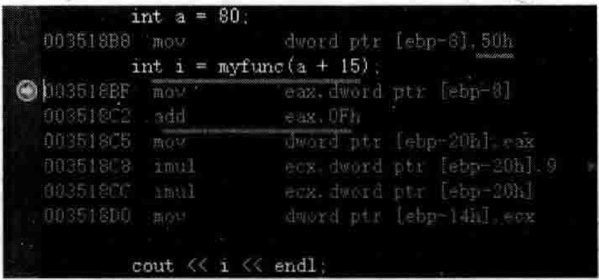
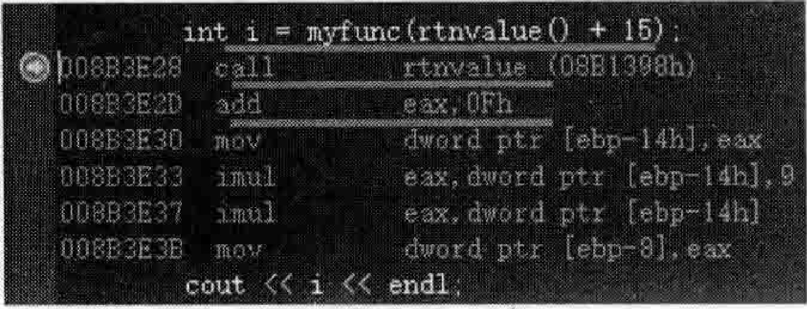
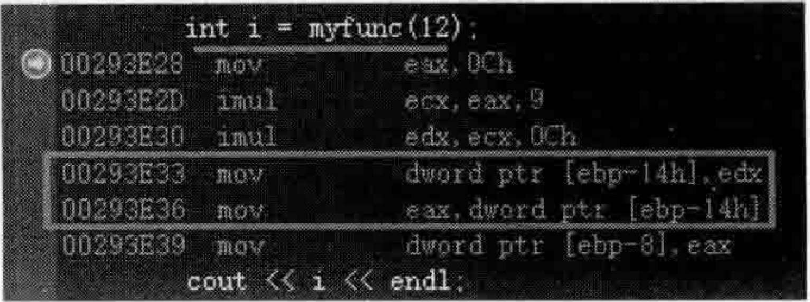
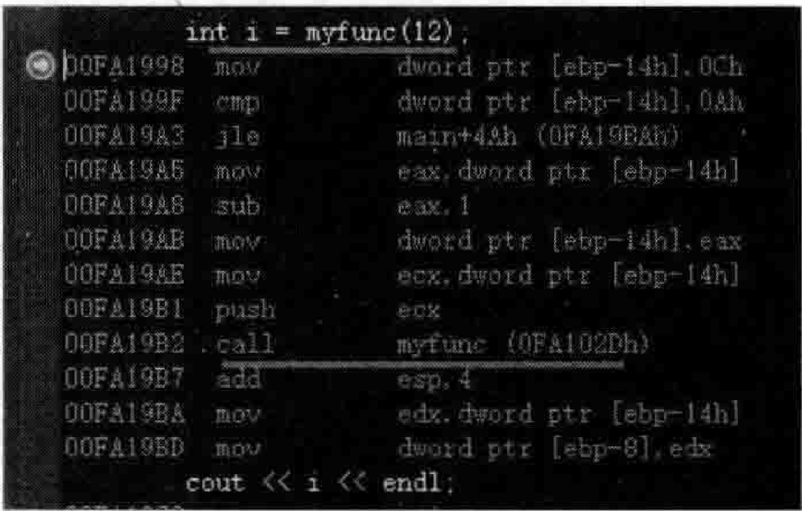

# 5.11 inline函数回顾和扩展  

## 5.11.1 inline函数回顾  

看看如下范例。在MyProject.cpp的上面，增加如下代码行：  

``` cpp
int myfunc(int testv)  
{  
    return testv * (5 + 4) * testv;  
}
```

在main主函数中，加人如下代码：

``` cpp
int i = myfunc(12);  
cout << i << endl;
```

设置断点到myfunc调用行，开始调试，当程序执行停到断点行时，切换到反汇编窗口，如图5.69所示。  

在图5.69中可以看到，汇编代码中有一个正常的函数调用行—callmyfunc（019102Dh）。  

  
图5.69直接调用一个普通的全局函数  

那么，如果把myfunc函数设置为inline函数会怎样呢？  

``` cpp
inline int myfunc(int testv)  
{  
    return testv * (5 + 4) * testv;  
}
```

再次调试，当程序执行停到断点行时，切换到反汇编窗口，看到依旧类似于图5.69。看起来该函数并没有因为增加inline关键字而被展开。这是因为在VisualStudio2019中要打开一个开关。  

右击VisualStudio左侧的“解决方案资源管理器”中的MyProject工程名，在弹出的快捷菜单中选择“属性”命令，会弹出一个对话框，在对话框左侧单击“配置属性” $^{2}{\rightarrow}\mathrm{C}/\mathrm{C}{\mathrel{+}}$ “优化”子选项，在右侧“内联函数扩展”里选择“只适用于__inline（/Obl）”并单击“确定”按钮，如图5.70所示。  

  
图5.70开启内联函数扩展选项  

图5.70中的关于“内联函数扩展”用于选择生成的内联函数扩展级别，其中的几个选项甘有用述·达王间干证一丰，小吸太细环时明九。  

（1）/Ob0：禁用内联扩展。默认情况下，扩展由编译器自行对所有函数进行（通常称为自动内联)。

(2)/Ob1:仅允许对标记为inline、_inline 或_forceinline的函数或是在类声明中定 义的.C++成员函数中进行扩展。

(3)/Ob2:默认值。允许对标记为inline、_inline或_forceinline的函数或是编译器 选择的任何其他函数进行扩展。

再次调试，当程序执行停到断点行时，切换到反汇编窗口，如图5.71所示。  

在图5.71中可以看到，对myfunc函数的调用就被展开了（与图5.69进行比较）。一般来讲，看inline函数是否被展开，切换到汇编窗口查看是比较稳妥的做法。  

  
图5.71 inline 函数被展开

大家都知道，inline这个关键字只是程序员对编译器的一个建议，编译器可以尝试去做，也可以不去做，这取决于编译器的诊断功能，也就是说决定权在编译器，程序员控制不了。  

inline函数既有优点又有缺点，优点是它的执行成本一般比常规的函数调用和函数返回所带来的成本低，提高了程序执行效率，但缺点是会导致代码的膨胀。  

当使用了inline关键字后，编译器会有比较复杂的测试算法来评估该inline函数的复杂度，这个测试算法可能会统计该inline函数中如赋值操作、各种函数调用操作等执行的次数，这些执行的次数都会有一个相关的权重值，编译器会通过这些权重值最终计算出一个和值来得到该inline函数的复杂度信息。这里要说两个问题：  

（1）关键字inline只是对编译器的一个建议，但是如果编译器评估这个inline函数的复杂度过高，那可能这个inline建议就无效了，编译器会产生常规的函数定义和调用代码。  

（2）如果inline被编译器采纳，那么inline函数的扩展就要在调用这个inline函数的那个点上进行，这就可能会带来额外的问题，如参数求值、临时对象的产生和管理等。  

## 5.11.2inline扩展  

参考图5.71中myfunc这个inline函数被扩展后对应的汇编代码，以及比对myfunc函数的 $\mathrm{C++}$ 源码来进行下一步的学习。  
### 1.形参被对应实参取代  

修改一下main主函数中myfunc函数调用的代码行，将实参12修改为 $12\!+\!15$  

``` cpp
int i = myfunc(12+15);
```

将断点设置在该行，开始调试，当程序执行停到断点行时，切换到反汇编窗口，如图5.72所示。  

在图5.72中可以看到，如果实参是一个表达式 $(\,12+15\,)$ ），编译器会先求值（ $.27\equiv$ 0x1Bh），再替换掉形参。  

如果将main主函数中的代码再次修改如下，这次myfunc函数的实参表达式中将带进来一个变量：  

``` cpp
int a = 80;  
int i = myfunc(a + 15);
```

将断点设置在myfunc调用行，开始调试，当程序执行停到断点行时，切换到反汇编窗口，如图5.73所示。  

  
图5.72inline函数被展开时会先对实参表达式求值  

  
图5.73inline函数被展开时会先对实参表达式求值  

从图5.73中可以看到，先计算a和15的和值（addeax，0Fh），然后再替换掉形参。如果在MyProject.cpp的上面引入一个全局函数rtnvalue,代码如下：

``` cpp
int rtnvalue()  
{  
    return 5;  
}
```

将main主函数中的代码再次修改如下，这次myfunc函数的实参表达式中将使用上面函数调用的返回值：  

``` cpp
int i = myfunc(rtnvalue() + 15);
```  

将断点设置在myfunc调用行，开始调试，当程序执行停到断点行时，切换到反汇编窗口，如图5.74所示。  

从图5.74中可以看到，先调用rtnvalue函数拿到返回值，用该返回值和15做运算求和值，然后再替换掉形参。  

### 2.局部变量的引入  

修改一下mvfunc函数的内容，向函数体中增加一些内容。修改后的完整代码如下：  

``` cpp
inline int myfunc(int testv)  
{  
    int tempvalue = testv * (5 + 4) * testv;  
    return tempvalue;  
}
```

在main主函数中，代码恢复为如下内容：

``` cpp
int i = myfunc(12);  
cout << i << endl;
```

将断点设置在myfunc调用行，开始调试，当程序执行停到断点行时，切换到反汇编窗口，如图5.75所示。：  

  
图5.74inline函数被展开时会先对实参表达式求值  

  
图5.75inline  函数被展开

观察图5.75，与图5.71进行对比，可以看到，多了两条m0v汇编代码的操作，把结果值（位于edx寄存器中）扔到一个临时地址[ebp-14h]中，这个临时地址代表变量tempvalue。然后这个临时变量值（结果值）扔回到eax寄存器中。所以这也是消耗，多了一个局部变量参与计算。因此，这种局部变量能少用就少用。  

### 3.inline失败的情形  

随着编译器的不断演化和升级改进，inline能处理的情形也越来越多，inline成功的机率也越来越高，但有些情况仍然会导致inline失败。例如，如果inline函数是一个递归调用的函数，inline可能就会失败，修改myfunc。修改后的代码如下：  

``` cpp
inline int myfunc(int testv)  
{  
    if (testv > 10)  
    {  
       testv--;  
       myfunc(testv);  
    }  
    return testv;  
}
```

将断点设置在myfunc调用行，开始调试，当程序执行停到断点行时，切换到反汇编窗口，如图5.76所示。  

在图5.76中看到了对函数myfunc的调用行。这说明inline并没有使myfunc展开。

可能还有其他情形也会导致inline失败，不同的编译器处理结果也不同，在书写inline函数时把握的原则就是：代码行尽量少，逻辑尽量简单。这样的函数inline的成功率就会比较高，但是到底inline是否成功，笔者认为还是看看对应的汇编代码才能够比较确定。  

  
图5.76inline函数因为包含递归调用导致inline失败