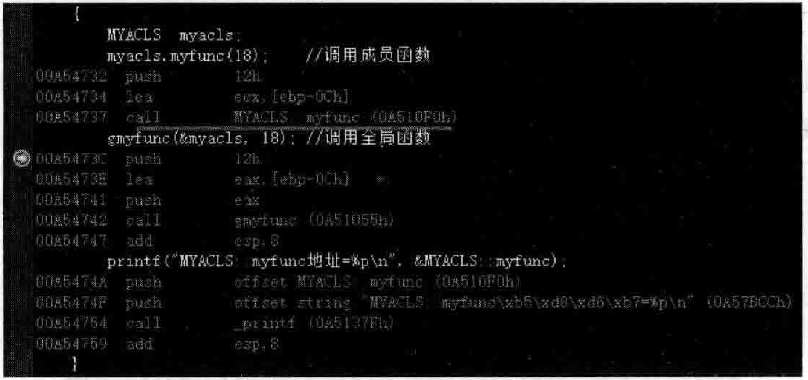
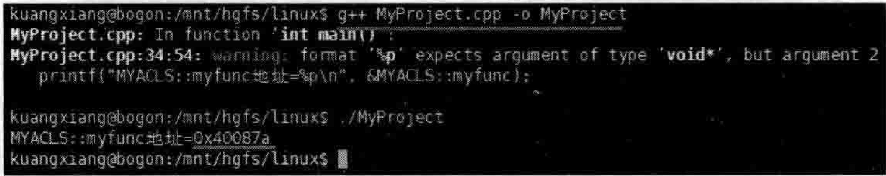
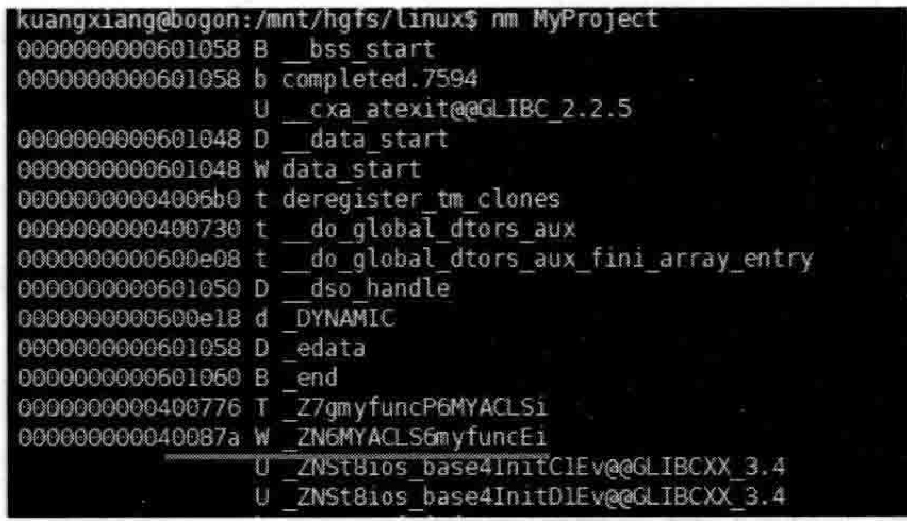
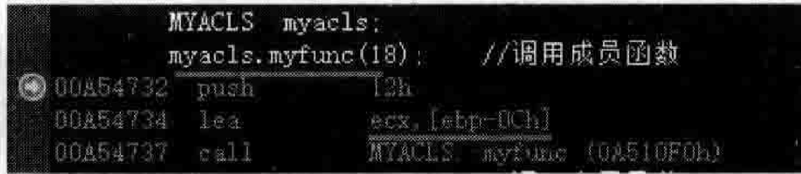
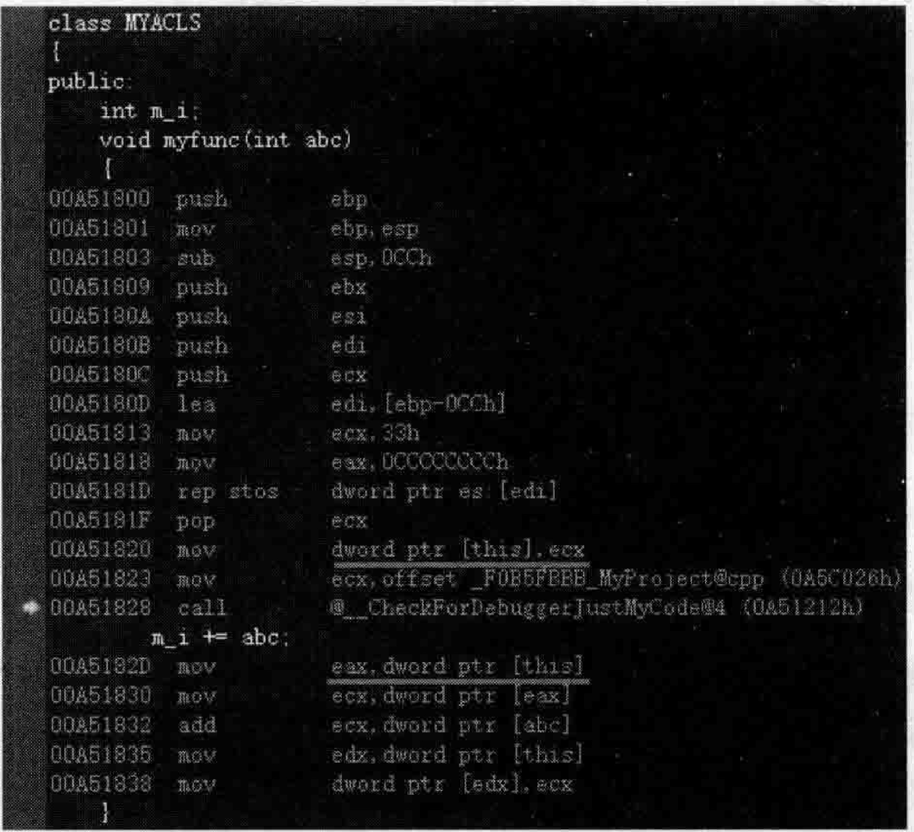

# 5.1普通成员函数调用方法  

## 5 函数语义学  

针对函数话题，本章针对普通成员函数、虚函数、静态成员函数的调用进行详细的南述。  

针对 $\mathrm{C++}$ 多态性这个话题，本章从代码实现上和表现形式上给出了详细的定义和解释，让读者对 $\mathrm{C++}$ 的多态性到底是什么有一个深人的了解，这极其重要，不但能够应付大量针对此话题的面试考题，也能够为读者将来学习设计模式相关知识打下坚实的基础。  

本章同时用大量篇幅叙述多重继承情况下带来的复杂问题并详细分析为什么父类的析构函数一定要写成虚析构函数，这经常作为 $\mathrm{C++}$ 高级程序开发人员最重要的面试考题之一。  

此外，本章也对RTTI、vcallthunk、inline等问题都有涉及，相信读者在学习后会收益良多。  


---

看看如下范例。在MyProject.cpp的上面，增加如下代码行：  

``` cpp
class MYACLS  
{  
public:  
    int m_i;  
    void myfunc(int abc)  
    {  
       m_i += abc;  
    }  
};
```

再继续增加一个全局函数，要实现上述成员函数myfunc相同的功能，就得多传递一个MYACLS * 类型的参数进来。看看代码：

``` cpp
//全局函数gmyfunc  
void gmyfunc(MYACLS* ptmp, int abc)  
{  
    ptmp->m_i += abc;  
}
```

在main主函数中，加入如下代码：

``` cpp
MYACLS  myacls;  
myacls.myfunc(18);    //调用成员函数  
gmyfunc(&myacls, 18); //调用全局函数
```

从上面的代码可以看到，一个是调用成员函数，一个是调用全局函数。这两种调用方式的调用效率有什么不同吗？  

初看上去凭直觉，总觉得调用成员函数要比调用全局函数慢。  

实际上不是这样， $\mathrm{C++}$ 语言在设计的时候就有这样一个要求：对普通成员函数的调用不应该比对全局函数的调用效率差。所以，编译器内部实际是将对成员函数myfunc的调用转换成了一种对全局函数的调用。  

读者已经知道，成员函数与全局函数一样，有独立的内存地，并且这些函数的内存地证是在编译的时候就确定好的。基于此，编译器把成员函数转换成全局函数似乎也就很简单。不妨站在编译器视角看一看成员函数被编译器转化为全局函数后的样子：  
```cpp
void myfunc(MYACLS * const this, int abc) //编译器会额外安插一个 this 指针，一般放到参数列表的开头
{
    this->m_i += abc;
}
```
这里注意：  

（1）编译器额外增加了一个叫作this的形参，是一个指针类型，指向的其实就是生成的那个对象，该形参对于确定对象所属的某个成员变量在内存中的位置有用。  

（2）常规成员变量的存取都通过this形参来进行，如上述的this->m_i。  

（3）设置断点到myacls.myfunc（18）；代码行，开始调试，当程序执行流程停到断点行时，切换到反汇编窗口，看到如图5.1中的地址0A510F0h就是这个成员函数的地址。这个地址是编译时就确定好的。  

  
图5.1调用成员函数对应的反汇编代码  

加人如下代码，可以把这个函数地址输出出来：

``` cpp
printf("MYACLS::myfunc地址=%p\n", &MYACLS::myfunc); //MYACLS: ： myfunc 地址=00A510F0
```
可以在Linux操作系统下编译运行看一下，如图5.2所示。  

  
图5.2Linux操作系统下输出成员函数地址的代码执行结果  

这里再次使用Linux操作系统下的 $\mathrm{nm}$ 命令，列出可执行文件中的全局变量、函数存放地址等信息，如图5.3所示。  

图5.3显示的成员函数地址为 $40087\mathrm{a}$ ，与图5.2显示的 $\mathrm{0x40087a}$ 是相同的结果。这说明该地址是编译的时候就确定好的。

所以，最终这种调用成员函数的代码行myacls.myfunc（18）；可能会变成下面的样子

``` cpp
_ZN6MYACLS6myfuncEi(&myacls, 18);
```

也就是说，调用成员函数最终的感觉还是相当于调用了一个全局函数。

如果香看反汇编代码也可以看得出来，如图5.4所示。  

  
图5.3用 $\mathrm{nm}$ 命令查看成员函数的地址  

  
图5.4调用成员变量对应的汇编代码  

在图5.4中，代码行myacls.myfunc（18）；对应的汇编代码中lea ecx，[ebp-0Ch]代码行的目的是把对象myacls的首地址放到ecx寄存器中（相当于把this指针放人了ecx）。例如，如果对象myacls的首地址是 $0_{ Ḋ }\mathbf{x}00 Ḍ \mathrm{B5FDC0}$ ，那么寄存器ecx中的值就会是00B5FDC0，然后汇编代码紧接着执行了callMYACLS：：myfunc（0A51oF0h），在调试时可以用F11快捷键进人该函数，如图5.5所示。  

  
图5.5调用成员函数时利用this参数完成对成员变量的计算  

从图5.5可以看到，在myfunc成员函数中，实际上是先把ecx的值给回到this，后续做m_i+= abc；运算的时候直接使用this参与运算。

另外，在Linux操作系统下，有个话题没说完，就是成员函数的函数名。已经发现编译器会对成员函数名进行适当的处理，如图5.3中看到的成员函数名被处理为ZN6MYACLS6myfuncEi。在这里，编译器为其增加了类名，然后还增加了其他一些字母数字组合，这些组合是由编译器内部的一些规则决定的，这些规则同时也能有效地防止该成员函数和其他的函数重名。  

无论成员函数也好，成员变量也罢，在处理它们名字的时候，编译器都会向名字中混合很多其他内容，例如上面看到的把类名混合进去，还有一些数字字母等也混合进去，可能这些内容是一些参数类型编码后得到的结果，主要目的应该是让这些名字唯一。  

说到这里，想一想，如果父类中有一个成员函数，所继承的子类中又有一个同名的成员函数，从程序员的角度来讲，这两个成员函数同名，但是在真正处理的时候，从编译器的角度来讲，这两个函数名字肯定是不同的。  

这些名字可以称为编译器内部名称，一般不应该显示给程序员（开发者），但如果在某种编译器中或者某种场合下（如编译程序时在出现的报错信息中）看到了，也不应该感到奇怪。