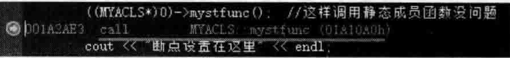

# 5.2虚成员函数与静态成员函数调用方法  

## 5.2.1虚成员函数调用方法  

上一节最终的范例代码原样保留，本节中要使用。在MYACLS类中，增加一个public修饰的虚函数。代码如下：  

``` cpp
public:  
    virtual void myvirfunc()  
    {  
       printf("myvirfunc()被调用,this = %p\n", this);  
    }
```

在main主函数中，注释掉原有代码，加人如下代码：  

``` cpp
MYACLS  myacls;  
myacls.myvirfunc();  
MYACLS* pmyacls = new MYACLS;  
pmyacls->myvirfunc();  
delete pmyacls;
```
这个范例在3.6节详细讲过，读者应该比较熟悉。  

读者知道，myacls.myvirfunc（）；和pmyacls $->$ myvirfunc（）；是不同的。用对象名myacls来调用虚函数，就像是调用普通成员函数一样，因为编译器很聪明，编译器知道这种调用不是多态，不需要通过虚函数表来查找并调用虚函数。  

但是要用对象指针来调用虚函数，则是要通过虚函数表指针查找虚函数表，然后通过虚函数表找到要调用的虚函数的地址，从而调用指定的虚函数。  

从编译器视角来看，编译会把下面的代码  

``` cpp
pmyacls-> myvirfunc();
```

转换为大致如下这种代码：  

``` cpp
(*pmyacls -> vptr[0]) (pmyacls);
```

（1）这里vptr表示编译器生成的虚函数表指针，指向虚函数表。  

（2）在这种情况下，下标0就是虚函数表中的第一项，因为这里虚函数表中只有唯一my vi rf unc。  

（3）这里传递进去一个参数，代表上一节提到的this参数（this指针），这也是编译器给加进去的。这样调用一个成员函数就等价于调用一个普通函数，this参数有特定的用途，如确定对象所属的某个成员变量在内存中的位置。  

(4)pmyacls $=>$ vptr[O]前面使用了“”之后就代表要调用的虚函数的入口地址。现在，在类MYACLS中增加另外一个public修饰的虚函数：  

``` cpp
public:  
    virtual void myvirfunc2()  
    {  
       printf("myvirfunc2()被调用,this = %p\n", this);  
    }
```

然后修改一下myvirfunc虚函数——在其中调用myvirfunc2:

``` cpp
public:  
    virtual void myvirfunc()  
    {  
       printf("myvirfunc()被调用,this = %p\n", this);  
       myvirfunc2();  
    }
```

把断点设置在myvirfunc函数中的myvirfunc2（）；代码行。开始调试，当程序执行流程停在断点行时，切换到反汇编代码，如图5.6所示。  

  
图5.6对myvirfunc2的调用是通过虚函数表进行的  

在图5.6中不难发现，对myvirfunc2虚函数的调用是通过查虚函数表来进行的。现在，继续修改myvirfunc虚函数。修改后的代码如下：  

``` cpp
public:  
    virtual void myvirfunc()  
    {  
       printf("myvirfunc()被调用,this = %p\n", this);  
       //myvirfunc2();  
       MYACLS::myvirfunc2();  
    }
```
读者能想象此时此刻，这个写法和上面的写法有什么区别吗？看一看对应的反汇编代码，如图5.7所示。  

  
图5.7对MYACLS：：myvirfunc2的调用是直接调用而不再通过虚函数表进行调用  

从图5.7中可以看到，一旦换了一种写法，这里采用“类名：：”的写法，这叫作类范围操作符，用来明确调用myvirfunc2，可以发现对myvirfunc2的调用变成了直接调用，而不再是通过虚函数表来调用了。这种调用方式的写法更有效率，而且压制住了虚拟机制，不再通过查询虚函数表来调用。  

所以，请读者注意这种调用方法：类范围操作符：：虚函数名（参数）。这种明确调用虚函数的方法等价于直接调用一个普通的成员函数。  

## 5.2.2静态成员函数调用方法  

在类MYACLS中增加一个public修饰的静态成员函数：  

``` cpp
public:  
    static void mystfunc()   
    {  
       printf("mystfunc()被调用\n");  
    }
```

在main主函数中，注释掉以往的代码，加入如下全新代码：  

``` cpp
MYACLS  myacls;  
myacls.mystfunc();  
MYACLS* pmyacls = new MYACLS;  
pmyacls->mystfunc();
```

对于静态成员函数的调用，无论用对象名来调用，还是用对象指针来调用，效果都是一样的一一都会被编译器转换为一般的针对普通函数（非成员函数）的调用形式。  

静态成员函数是跟着类走的，所以调用静态成员函数时编译器是不会插入this作为形参的。  

在Linux操作系统下，编译一下MyProject.cpp，然后用nm命令，列出可执行文件中的全局变量、函数存放地址等信息，如图5.8所示。  

  
图5.8用 $\tt m m$ 命令查看静态成员函数的信息  

所以，下面这样的调用：  

``` cpp
myacls.mystfunc();  
pmyacls->mystfunc();
```

将被编译器转换为如下这种相同的调用，这里并不需要this参数：  

``` cpp
_ZN6MYACLS8mystfuncEv(); 
_ZN6MYACLS8mystfuncEv();
```

4.3.3节讲解过一种奇异的写法来输出一个类成员变量的偏移值。这里也有类似的写法来调用静态成员函数：  

``` cpp
((MYACLS *)0)-> mystfunc();//这样调用静态成员函数没问题
```

如果是调用普通成员函数，一般需要用到对象或者对象指针。例如：  

``` cpp
obj.myfunc();
```

然后编译器会增加一个this参数到现有的参数列表中，这个this参数指向的就是这个对象本身，传递到所调用的成员函数里去的主要目的是操作对象所属的成员变量，如给一个成员变量赋值等。当然，如果这个成员函数中不操作任何成员变量，实际上是根本不需要这个this参数的，也就是说，此时是不需要通过对象或者对象指针来调用成员函数的（言下之意就是应该像全局函数一样，直接通过函数名来调用）。  

其实，读者也看到了，调用这种静态成员函数就不需要this参数。在main主函数中增加如下代码行：  

``` cpp
((MYACLS* )0)-> mystfunc();
```
设置断点在该行并开始调试，当程序执行流程停到该断点行时，切换到反汇编窗口，如图5.9 所示。  

图5.9中对静态成员函数的调用根本没涉及this参数，但是如果调用一个普通的成员函数，例如在main主函数中增加如下代码：  

  
图5.9直接调用静态成员函数时无须用到this参数  

``` cpp
((MYACLS*)0)->myfunc(12);
```

从语法层面来讲，上面这行代码没有问题，可以编译通过。设置断点在该行并开始调试，当程序执行停到该断点行时，切换到反汇编窗口，如图5.10所示。  

代码行（（MYACLS $\mathrm{\star~}).0).>$ myfunc（12）；中的这个O，其实就是this指针，放人了ecx中，  图5.10中的汇编代码行xor ecx，ecx就是将ecx清0，代表的就是这个this指针。这里就相当于把这个0当作this参数传递进普通成员函数调用中去了。

  
图5.10调用普通成员函数时需用到this参数  

虽然传递到普通成员函数中去的是一个0，但是只要程序员不调用成员变量，这个this参数就不会被使用，程序就不会产生运行时的异常，但是若写下面这样的代码就会产生运行时异常：  
```cpp
void myfunc(int abc)
{
	m_i += abc; //这里的m_i需要用到this指针(this->m_i),而传递进来的this指针若为0,
	//则本行代码执行时会报异常
}
```
但是如果在myfunc里调用静态成员函数，则毫无问题，因为静态成员函数中根本不需要用到this指针：  

``` cpp
void myfunc(int abc)   
{        
    //m_i += abc;  
    mystfunc(); //这绝对没有问题  
}
```
所以，回头想想，为什么 $\mathrm{C++}$ 支持下面这种语法？  

``` cpp
((MYACLS*)0)->mystfunc();
```
因为有些成员函数希望支持独立于类对象之外的存取操作，所以，就出现了这种解决之道，类设计者就搞出了这种奇特的写法：把0强制转型为一个类类型指针，从而提供出了一个this指针实体，作为一个参数传递给普通成员函数。当然，如果是静态成员函数，这个this实体并不作为参数，因为静态成员函数并不需要类对象指针作为隐藏参数传递进函数里去，但是可以作为一种提示（给程序员看的），提示调用的是哪个类的静态成员函数。  

那么，静态成员函数有哪些特性呢？总结如下：  

（1）静态成员函数没有his指针，这是最重要的一点。

（2）无法直接存取类中普通的非静态成员变量。

（3）静态成员函数不能在末尾增加const后缀，也不能设置为virtual。  

（4）可以用类对象来调用，但不要求一定要用类对象来调用。看一下反汇编代码就知道，即便是用类对象来调用，实际上还是被转换为了直接调用，参考图5.9会发现，所有对静态成员函数的调用都会被转化为“类名：：静态成员函数名（··）”的调用形式。  

（5）静态成员函数等同于全局函数（非成员函数），所以一般提供回调函数的场合，可以将这种函数提供为回调函数。  

静态成员函数有地址并且是在编译的时候就确定好的。读者不妨尝试用如下代码行将静态成员函数的地址输出出来：  

``` cpp
printf("MYACLS::mystfunc()地址 = %p\n", MYACLS::mystfunc);
```
在Linux下编译并运行程序，输出的静态成员函数地址信息与使用nm命令得到的静态成员函数地址信息一致，如图5.11所示。  

  
图5.11输出来的静态成员函数的地址与用 $\mathrm{nm}$ 命令查看到的静态成员函数的地址一致