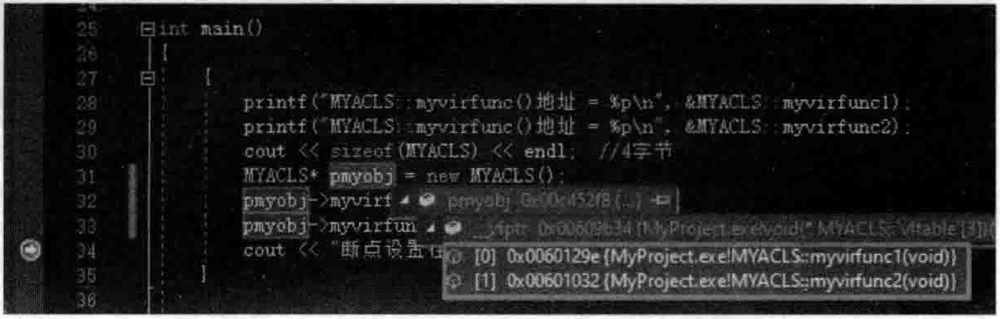
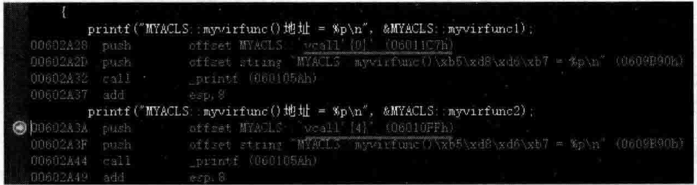
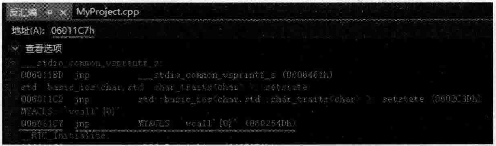
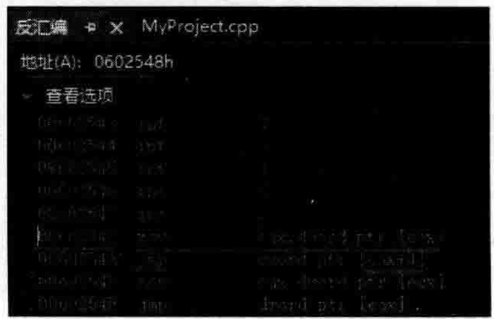

# 5.3虚函数地址问题的vcall引入  

上一节讲了一下虚成员函数（虚函数），本节要进一步探讨一下这个问题。看看如下范例。在MyProject.cpp的上面，增加如下类MYACLS的定义代码：  

``` cpp
class MYACLS  
{  
public:  
    virtual void myvirfunc1()  
    {  
       cout << "虚函数MYACLS::myvirfunc1()执行了" << endl;  
    }  
    virtual void myvirfunc2()  
    {  
       cout << "虚函数MYACLS::myvirfunc2()执行了" << endl;  
    }  
};
```
虚函数在内存中也有一个固定的地址，也是在编译时确定好的。读者可以在Linux操作系统下进行编译并用nm命令进行查看，可以查看到下面的字样：  

``` cpp
0000000000400af0 W ZN6MYACLS10myvirfunc1Ev
0000000000400b1c W ZN6MYACLS10myvirfunc2Ev
```

上面两行充分表明虚函数的地址是在编译的时候就确定好的（地址分别为00400af0和00400b1c）  

在main主函数中，加人如下代码：  

``` cpp
printf("MYACLS::myvirfunc()地址 = %p\n", &MYACLS::myvirfunc1);  
printf("MYACLS::myvirfunc()地址 = %p\n", &MYACLS::myvirfunc2);  
cout << sizeof(MYACLS) << endl;  //4字节  
MYACLS* pmyobj = new MYACLS();  
pmyobj->myvirfunc1();  
pmyobj->myvirfunc2();  
cout << "断点设置在这" << endl;
```
将断点设置在cout所在行，开始调试，当程序执行停在断点行时，将光标放到pmyobj上并展开以观察其中的虚函数表指针所指向的虚函数表项，如图5.12所示。  

  
图5.12通过new出来的一个类对象观察类的虚函数表中的表项  

如果查看pmyobj所指向的对象地址，在该对象地址中找到虚函数表指针所指向的虚函数表并查看虚函数表对应的内存地址中的内容，可以很容易地看到，虚函数表内容中的前8个字节为  $9\mathrm{e}~12~60~00~32~10~60~00$  ，四个为一组，倒序解读，就可以解读为  $0{\bf x}0060129\mathrm{\,e}$  和  $0{\bf x}00601032$ 两组信息，与图5.12显示的虚函数表中的两个虚函数地址完全一致。  

执行起来，看一看结果：  

``` cpp
MYACLS: ：myvirfunc()地址=006011C7 
MYACLS: ：myvirfunc()地址=006010FF
4
虚函数MYACLS:myvirfuncl()执行了 
虚函数MYACLS:myvirfunc2()执行了
```
将输出的结果和图5.12比较，可以注意到一个事实，两者显示的两个虚函数的地址信息并不一样。这让人很费解，看来必须要仔细分析一下了。  

把断点设置在main主函数的任意一个printf所在行，开始调试，当程序执行停在断点行时，切换到反汇编代码，如图5.13所示。  

  
图5.13输出虚函数地址的反汇编代码  

第一行反汇编代码是一个push一一压栈，看起来是把MYACLS：：vcallO}；压栈，这行汇编代码后面跟一个地址（06011C7h），其实用printf语句输出的&MYACLS：：my vi r fun cl。  

在反汇编窗口中找一找该地址，如何找？反汇编窗口左上角有个地址栏，可以直接在其中输人06011C7h并按Enter键，反汇编窗口会自动定位到该地址，如图5.14所示。  

  
图5.14-在反汇编窗口跳转到一个指定的地址  

图5.14中，在反汇编窗口跳转到了06011C7h这个地址，其对应的反汇编代码是：  

``` cpp
jmp MYACLS: :vcall'{o}'(060254Dh)
```


上面这行代码看起来又跳转到了060254Dh地址，继续，在反汇编窗口左上角输人060254Dh并按Enter键，反汇编窗口自动定位到该地址，如图5.15所示。  

看着图5.15可以猜一下，ecx中保存的可能是this指针，而一般来讲，虚函数表指针是类对象的第一个成员变量，所以mov这行汇编代码应该是把虚函数表指针所指向的地址，也就是虚表地址存到了eax中。  

接着的imp汇编代码应该是跳转到了虚函数表中所指向的某个虚函数去执行。因为是从MYACLS：：vcall $\{0\}$ 跟踪过来的汇编代码，所以估计这里应该是执行虚函数表的第一项所对应的虚函数。当然在图5.13中，如果是从MYACLS：：vca11K4追踪过来，不难发现，追踪到的汇编代码应该是如图5.16所示（注意其中的 $_\mathrm{max}\!+\!4$ 表示执行的是虚函数表中的第二项所对应的虚函数）。  

  
图5.15在反汇编窗口根据vcall $\{0\}$ 的指引跳转到另外一个指定的地址  

  
图5.16在反汇编窗口根据vcall4的指引跳转到另外一个指定的地址  

看目前的意思，这里是中转了一下，笔者要特别强调，现在笔者所用的开发环境是VisualStudio2019编译器，其他编译器不一定是这样。该编译器通过一系列的vcall函数，而后在vcall函数里做跳转，跳转到真正的虚函数去（应该是每个vcall函数都唯一对应着一个虚函数）。  

所以，下面的代码：  

``` cpp
printf("MYACLS::myvirfunc()地址=%p\n",&MYACLS::myvirfuncl); 
printf("MYACLS::myvirfunc()地址=%p\n",&MYACLS::myvirfunc2);
```
输出的是vcall函数的地址，而不是真正的虚函数地址。  

既然话题说到这，读者可能不禁要问，vcall是什么？掺和进来的自的是什么？vcall是编译生成的内容，完整的名字应该叫作vcallthunk。为什么引人vcallthunk？可以把它看成一段代码，看成一段函数也行，它有两个作用：  

（1）它能调整this指针，例如一个子类继承父类1和父类2，如果父类2的指针要调用子类的析构函数，那这个父类2的指针就需要利用这里的vca11thunk机制调整。后续讲多重继承还会谈到this指针调整。  

（2）跳到真正的虚函数中去。vcallthunk读者简单认识即可，因为编译器的开发者有他们自己的考量，有些考量可能非常细致，没必要太过深究。  

本节主要目的就是带着读者看一看vcall，vcall调用的是真实的虚函数地址。以后万一见到这个vcall，能够认识即可。后面章节会进一步给出vcall相关的范例代码。