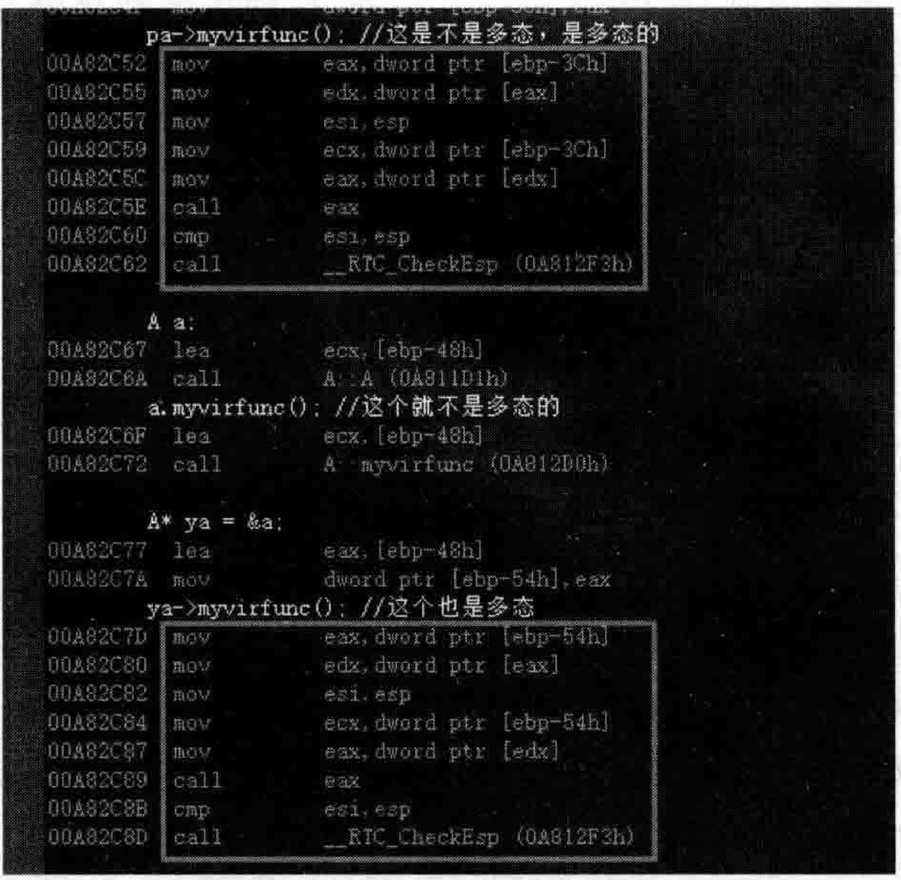

# 5.4静动态类型、绑定、坑点与多态体现深谈  

本节主要是澄清一些概念，为后续顺畅地讲解作铺垫，因为有些概念容易模糊不清，从而造成后续学习的困扰。  

## 5.4.1静态类型和动态类型  

看看如下范例。在MyProject.cpp的上面，增加两个类，有父类，有子类，先写成空类：  

``` cpp
class Base  
{  
public:  
};  
class Derive : public Base  
{  
public:  
};  
class Derive2 : public Base  
{  
public:  
};
```

引出两个概念：静态类型与动态类型。  

（1）静态类型：对象定义时的类型，编译期间就确定好的。看下面的代码，注意注释：  

``` cpp
Base base;   //静态类型是Base  
Derive derive; //静态类型是Derive  
Base* pbase;  //别管指向啥，反正定义的时候定义的是Base *，所以静态类型是Base *  
Base* pbase2 = new Derive();//静态类型依旧是Base *  
Base* pbase3 = new Derive2();//静态类型依旧是Base *
```

（2）动态类型：对象自前所指向的类型（运行的时候才决定类型的）。根据上面的代码行，一般来讲，只有指针或者引用才有动态类型的说法，而且一般都是指父类的指针或者引用。根据上面的代码行，看一看所涉及的变量的动态类型：

·Base和Derive 没有动态类型，因为它们既不是指针也不是引用。
·pbase也没有动态类型，因为它没有指向任何对象。
·pbase2有动态类型，它的动态类型是Derive。
·pbase3有动态类型，它的动态类型是Derive2。

另外，动态类型在执行过程中可以改变。例如如下：

``` cpp
pbase = pbase2;//pbase的动态类型是Derive 
pbase = pbase3;//pbase的动态类型是Derive2
```

## 5.4.2静态绑定和动态绑定  

静态绑定：绑定的是静态类型，所对应的函数或属性依赖于对象的静态类型，发生在编译期。  

动态绑定：绑定的是动态类型，所对应的函数或属性依赖于对象的动态类型，发生在运行期。  

这两个概念有些晦涩，不好理解，后续笔者会具体举例，届时请读者参照具体实例来理解。这里先给出一些结论：  

（1）普通成员函数是静态绑定，而虚函数是动态绑定。  

（2）缺省参数一般是静态绑定。

后面会有范例阐述这些绑定问题。  

## 5.4.3继承的非虚函数坑  

向Base类中增加一个public修饰的普通成员函数（不是虚函数）：  

``` cpp
void myfunc()  
{  
    cout << "Base::myfunc()" << endl;  
}
```

继续向Derive类里增加一个public修饰的普通成员函数：

``` cpp
public:  
    void myfunc()  
    {  
       cout << "Derive::myfunc()" << endl;  
    }
```

在main主函数中，加人如下代码：

``` cpp
Derive derive;  
Derive* pderive = &derive;  
pderive->myfunc();   //Derive::myfunc()  
  
Base* pbase = &derive;  
pbase->myfunc();   //Base::myfunc(),这里调用的居然是父类的myfunc，是个陷阱，写程序时一定要注意
```

注意上面代码行中的注释语句，可以看到，pbase->myfunc（）；调用的是Base类的myfunc成员函数。为什么是这样？  

这就是笔者刚才所说的：普通成员函数是静态绑定。换句话说，myfunc是普通成员函数，这里到底执行哪个myfunc成员函数取决于调用者的静态类型，pbase的静态类型是Base，Base my fun c，p derive Derive，Derivemy fun c。  

结论：不应该在子类中重新定义一个继承来的非虚成员函数。因为，上面的演示结果绝对是程序员不希望发生的结果。  

## 5.4.4虚函数的动态绑定  

下面完善一下代码，向类Base中增加一个public修饰的虚函数：  

``` cpp
public:  
    virtual void myvirfunc()  
    {  
       cout << "Base::myvirfunc()" << endl;  
    }
```

继续向Derive类里增加一个public修饰的虚函数：  

``` cpp
public:  
    virtual void myvirfunc()  
    {  
       cout << "Derive::myvirfunc()" << endl;  
    }
```

在main主函数中，继续增加如下代码行：  

``` cpp
Base base;  
pderive->myvirfunc(); //Derive::myvirfunc()  
pbase->myvirfunc();   //Derive::myvirfunc()  
pbase = &base;  
pbase->myvirfunc();   //Base::myvirfunc()
```

注意上面代码行中的注释语句，可以看到，虚函数是动态绑定。换句话说，myvirfunc是虚函数，这里到底执行哪个myvirfunc取决于调用者的动态类型，这里pbase的动态类型开始是Derive *，后来又变为Base*,所以调用的也分别是Derive 和Base的 myvirfunc,而 pderive的动态类型是 Derive *，所以调用的是 Derive 的 myvirfunc。

## 5.4.5重新定义虚函数的缺省参数坑  

修改Base类中的虚函数myvirfunc，为其增加一个缺省参数，并且在函数体中输出该参数的值：  

``` cpp
public:  
   virtual void myvirfunc(int value = 1)  
    {  
       cout << "Base::myvirfunc(),value=" << value << endl;  
    }
```

同样修改Derive类中的虚函数myvirfunc，也为其增加一个缺省参数，并且在函数体中输出该参数的值：  

``` cpp
public:  
    virtual void myvirfunc(int value = 2)  
    {  
       cout << "Derive::myvirfunc(),value=" << value << endl;  
    }
```
执行起来，看一看结果，有意思的事情发生了：  

``` cpp
Derive: myfunc()
Base: myfunc()
Derive: myvirfunc(), value=2 
Derive: myvirfunc(), value=1 
Base: myvirfunc(), value=1
```

上述结果的第4行是执行代码行pbase $\textgreater$ myvirfunc（）：产生的结果，可以注意到，执行的是子类的虚函数，但是输出的形参value的缺省值却是父类的虚函数形参的缺省值。  

正常来讲执行子类虚函数，这个形参的缺省值应该采用的是子类虚函数中的形参缺省值，可惜，事与愿违。  

这就属于函数参数缺省值的静态绑定。上面说过，缺省参数是静态绑定（pbase的静态类型是Base?），所以缺省参数绑定到父类Base对应的myvirfunc的缺省参数上去了（而不管pbase指向的是否是子类对象）。  

为什么 $\mathrm{C++}$ 要这样做？主要就是考虑到执行期间效率问题，缺省参数静态绑定好实现，动态绑定就不好实现，可能更慢和更复杂。所以 $\mathrm{C++}$ 编译器作了这样的取舍。  

结论：不要在子类中重新定义虚函数缺省参数的值  

## 5.4.6 $\mathbf{C}^{++}$ 中的多态性  

读者对 $\mathrm{C++}$ 中耳熟能详的“多态性”这个词，但请仔细想一想，多态性的概念，你真弄清楚了吗？  

多态性，显然是一种特性，那怎样体现这种特性？

首先，不管从代码实现上还是从表现形式上，有一个观点是肯定的：

多态必须存在虚函数并且调用虚函数，没有虚函数，绝不可能存在多态。

关于多态性这个概念，笔者认为分两方面谈比较容易说清楚：  

（1）从代码实现上。
（2）从表现形式上。

继续谈：  

### 1.从代码实现上  

当调用一个虚函数的时候，调用的路线是不是通过查询虚函数表来找到虚函数人口地址然后去执行虚函数？如果调用的是这个路线，就是多态：如果调用的不是这个路线（而是直接调用），那就不是多态。  

所以如果从这个角度理解，那就不用管有没有继承关系，也不用管有没有派生类。  

在MyProject.cpp的上面，先定义一个A类：  

``` cpp
class A   
{  
public:  
    virtual void myvirfunc() {}  
};
```

在main主函数中，加人如下代码（注意看代码中的注释）： 

``` cpp
A* pa = new A();  
pa->myvirfunc(); //这是不是多态，是多态的  
  
A a;  
a.myvirfunc(); //这个就不是多态的  
  
A* ya = &a;  
ya->myvirfunc(); //这个也是多态
```
上述代码是否是多态，笔者判断的理论依据是对应的汇编代码。设置断点在上面任意一行代码行，开始调试，当程序执行停到断点行时，切换到反汇编窗口，如图5.17所示。  

  
图5.17通过反汇编代码判断多态性的体现  

在图5.17中，针对调用了虚函数的代码行，只要其对应的汇编代码超过6行（只有查询虚函数表来执行虚函数才需要这么多行汇编代码），对应的汇编代码功能都应该是通过虚函数表指针查询虚函数表中虚函数的地址，然后调用对应的虚函数，从代码实现上，这就是多态性。  

### 2.从表现形式上（表现形式当然最终也是通过代码体现）  

这种情况更符合传统上对多态的理解。  

要想从表现形式上看出来是否是多态，要加几条说明：  

（1）有父类有子类（有继承关系），父类中必须含有虚函数，子类重写父类中的虚函数。  

（2）父类指针指向子类对象或者父类引用绑定（指向）子类对象。  

（3）当以父类的指针或者引用调用子类中重写了的虚函数时，就能看出来多态的表现厂，因为调用的是子类的虚函数。  

前面代码中，已经演示了父类指针指向子类对象的代码。整理如下：  
```cpp
Derive derive;

Base* pbase = &derive;

pderive->myvirfunc(); //Derive::myvirfunc()
```
或者：  

``` cpp
Base* pbase2 = new Derive(); //释放内存请读者自行释放，笔者在这里没演示  
pbase2->myvirfunc(); //Derive::myvirfunc()
```

对于父类引用绑定（指向）子类对象，看如下范例代码：  

``` cpp
Derive derive2;  
Base& yinbase = derive2;  
yinbase.myvirfunc(); //Derive::myvirfunc()
```