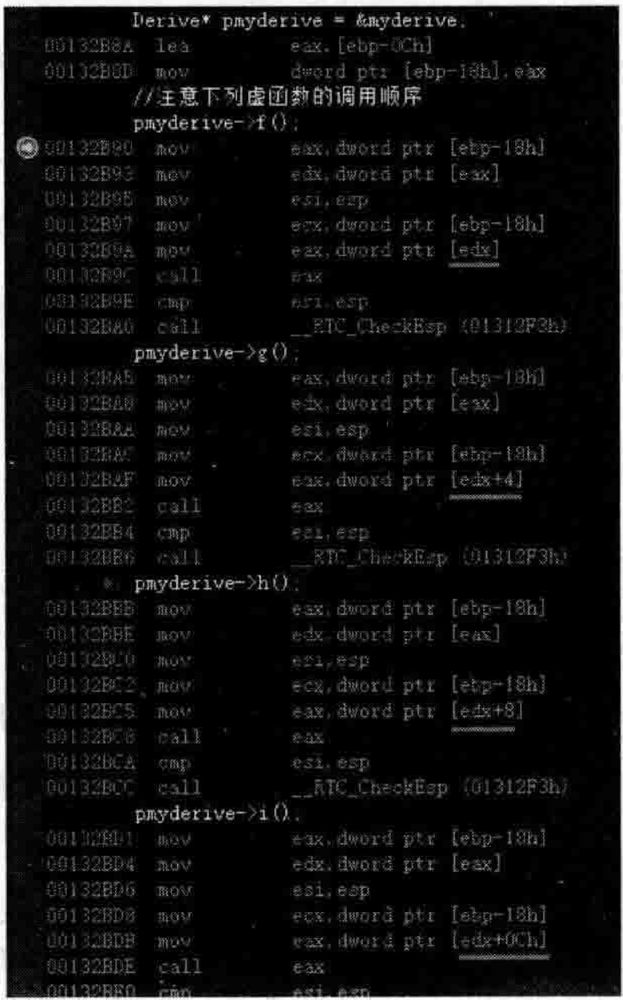
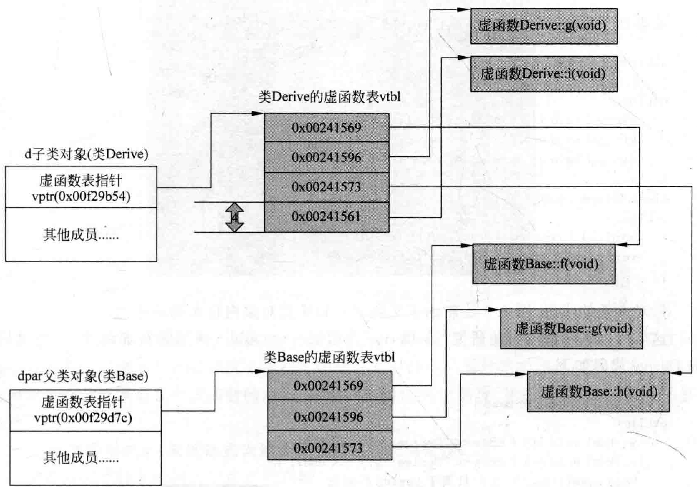

# 5.5单继承虚函数趣味性测试和回顾  

## 5.5.1单继承下的虚函数  

看看如下范例。在MyProject.cpp的上面，增加如下代码：  

``` cpp
class Base  
{  
public:  
    virtual void f() { cout << "Base::f()" << endl; }  
    virtual void g() { cout << "Base::g()" << endl; }  
    virtual void h() { cout << "Base::h()" << endl; }  
};  
class Derive : public Base {  
public:  
    virtual void g() { cout << "Derive::g()" << endl; }  
    void myselffunc() {} //只属于Derive的函数  
};
```

针对上面的代码，图3.3绘制出了父类对象和子类对象内存布局示意图。  

这里可以进行深一步的研究，给Derive类增加一个public修饰的新虚函数i。修改后Derive：  

``` cpp
class Derive : public Base {  
public:  
    virtual void i() { cout << "Derive::i()" << endl; }  
    virtual void g() { cout << "Derive::g()" << endl; }  
    void myselffunc() {} //只属于Derive的函数  
};
```
这里笔者想看一看Derive类虚函数表项的排列顺序一一虚函数i会排列在 $\mathbf{g}$ 的上面吗？  

要分析虚函数表项的排列顺序，可以写代码，也可以借助反汇编查看。这里笔者介绍一下反汇编查看之法。  

在main主函数中，加人如下代码段：  

``` cpp
Derive myderive;  
Derive* pmyderive = &myderive;
//注意下列虚函数的调用顺序  
pmyderive->f();  
pmyderive->g();  
pmyderive->h();  
pmyderive->i();
```

将断点设置在pmyderive—>f（）；代码行，开始调试程序，当程序运行停在断点行时，切换到反汇编窗口观察，如图5.18所示。  

  
图5.18通过代码检测虚函数在虚函数表中的排列顺序  

从图5.18可以看到，所调用的虚函表项分别是[edx]、[edx十4]、[edx十8]、edx十OCh，这说明这几个虚函数表项是按从上到下的顺序排列的，每次跳跃4字节。  

在增加了i这个新的虚函数后，Base父类对象和Derive子类对象内存布局示意图应该如图5.19所示。  

  
图5.19Base父类对象和Derive子类对象内存布局示意图  

从图5.19中看到了子类Derive虚函数表项的排列，首先顺序跟父类一样一一f、g、h，然后才是自己的i，这样排列是比较有好处的，下面会解释好处。现在看一看传统多态表现形式的代码。在main主函数中加人如下代码：  

``` cpp
Base* pb = new Derive();  //基类指针指向一个子类对象  
pb->g();  
  
Derive myderive;  
Base& yb = myderive;      //基类引用引用的是 一个子类对象  
yb.g();
```

既然子类的虚函数表的排列顺序与父类一致，所以想一想这种类似pb>g（）；的代，在编译的时候能不能被编译器编译成如下形式：

``` cpp
(* pb-> vptr[1]) (pb) ;
```

后面圆括号中的pb读者已经知道，是隐含的this参数，前面讲解过。这里重点观察下标[1]，可以认为编译器在编译的阶段就能确定这个下标值。为什么？因为不难发现，不管子类也好，父类也好，在虚函数表中， $\mathbf{g}$ 这个虚函数对应的就是下标[1]。观察图5.19就能理解。这也就解释了上述子类虚函数表项与父类虚函数表项排列顺序一样（一致）的好处。  

所以，要在执行期间调用虚函数，唯一需要知道的内容就是调用哪个虚函数表中的虚函数一一父类虚函数表还是子类虚函数表。  

## 5.5.2回顾和一些小试验  

5.3节曾经说过，虚函数的地址也是编译期间就知道的，固定写在可执行文件中的。  

那虚函数表呢？虚函数表在执行期间大小和内容都不会改变，所以虚函数表也是编译期间就构建出来的，跟执行期没有关系。这在3.5.2节介绍的比较清楚了。  

下面的事读者也很清楚：在虚函数表中，顺序记录看每个虚函数的首地址。而后，编译器会向类中加人虚函数表指针这个隐含的成员变量，并在类的构造函数中安插代码用于给这个虚函数表指针赋值（这些都是编译的时候做的事）。  

现在，根据一些现有的认知做一些实验。在main主函数中，增加如下代码：  

``` cpp
Derive a1;  
Derive a2;  
Derive* pa3 = new Derive();
```

可以设置断点观察al、a2对象以及pa3所指向的对象的内存，会发现这三者内存中的内容完全一样，因为Derive的sizeof值是4字节，这4字节正好是虚函数表指针的大小，所以，说明这三者的虚函数表指针指向的是同一个虚函数表。  

如果把Derive里面的内容全注释掉（只保留其继承自父类Base），如下：  

``` cpp
class Derive : public Base {  
public:  
};
```

在main主函数中，继续加入如下代码行：

``` cpp
Base bl;
```
通过设置断点观察，不难发现，即便子类Derive不重写任何虚函数，子类仍旧有自己的虚函数表，和父类Base的虚函数表不是一个表，尽管它们的表项相同。  

如果某个类中只有一个纯虚函数：  

``` cpp
class BCXu {  
public:  
    virtual void pvfunc() = 0;  
};
```

在main主函数中，加入如下代码：

``` cpp
cout << sizeof(Base) << endl;
```

执行起来，输出的sizeof值为4，这说明在类BCXu的成员变量中肯定多了一个隐藏的虚函数表指针（占4学节），而BCXu类也肯定有一个虚函数表。所以得到一个结论：即便是纯虚函数也是在虚函数表中占据一个表项的。