# 5.6多继承虚函数深释、第二基类与虚析构必加  

## 5.6.1多继承下的虚函数  

本节的范例其实是接着上一节来的，但为了演示代码的清晰性，笔者把这些代码重新整理一下，完整地列在下面，同时还增加了一个Base2类的定义，让子类Derive同时继承Base和Base2两个基类：  

``` cpp
class Base  
{  
public:  
    virtual void f() { cout << "Base::f()" << endl; }  
    virtual void g() { cout << "Base::g()" << endl; }  
    virtual void h() { cout << "Base::h()" << endl; }  
};  
  
class Base2  
{  
public:  
    virtual void hBase2() { cout << "Base2::hBase2()" << endl; }  
};  
  
class Derive : public Base, public Base2 {  
public:  
    virtual void i() { cout << "Derive::i()" << endl; }  
    virtual void g() { cout << "Derive::g()" << endl; }  
    void myselffunc() {} //只属于Derive的函数  
};
```

根据以往的学习已经知道，多重继承问题的复杂性其实就体现在后继承的这个基类上。因为如果创建Derive对象，从对象的内存布局上来看，后面这个基类所属的Base2子对象是排在Base子对象之后的，存在this指针调整的问题，这在2.3节和4.7节都说过。  

在main主函数中，加人如下代码行：  

``` cpp
Base2* pb2 = new Derive();
```  

此时，pb2指针指向的地址是经过this指针调整后的地址，指向的是·Base2这个子对象，其实编译的时候，上面这行代码会被编译器转换成如下两行代码：  

``` cpp
Derive* temp = new Derive();  
Base2* pb2 = (Base2*)((char*)(temp)+sizeof(Base));
```

这样调整之后，再访向Base2里面的成员变量等，才能正确地访问。  

继续回顾下一个问题，如果这个时候deletepb2；，发现程序的执行报告异常。这在4.7.2节已经演示过。但是这个故事没讲完，这里要继续讲。  

现在，继续在main主函数中加入如下代码行：  

``` cpp
delete pb2;
```

看起来，用pb2来new了一段内存，然后用deletepb2；来释放这段内存，这是很正常很天经地义的一个操作，但眼下程序运行后报告异常，这让人难以理解。那怎样解决这个异常的问题呢？  

## 5.6.2如何成功删除用第二基类指针new出来的子类对象  

要这样考虑这件事，虽然是用Base2指针，但是new的实际是一个Derive对象：  

``` cpp
Base2* pb2 = new Derive();
```

（1）对于这种情形来讲，当deletepb2；时，当然需要释放的是整个Derive对象内存，而不可能仅仅是pb2所指向的那块内存。  

（2）要实现（1）中的想法，编译器正常的动作应该是得能调用到Derive对象的析构函数，因为刚才也说了，实际上delete的是Derive对象，那么，Derive对象的析构函数肯定应该被正常调用。  

（3）那么，谁来调用Derive对象的析构函数？显然是系统，或者说是编译器。编译器在处理deletepb2：代码行的时候肯定会把这种delete代码解析成若干条汇编语句，其中有一条汇编语句必然是去调用析构函数。但问题的关键是，调用哪个析构函数？是Base2的，还是Derive的，还是Base的？看一看现在的类Derive对象数据布局示意图，如图5.20所示  

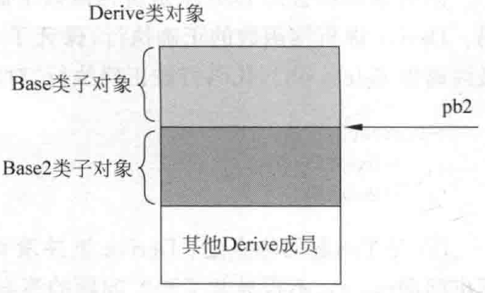  
图5.20-类Derive对象数据布局示意图  

（4）pb2显然与Base类关系不大，因为pb2是一个Base2类型的指针，那么调用析构函数应该要么是调用Base2的，要么是Derive的。根据以往学习过的虚函数知识和5.4.4节讲解过的“动态绑定知识”，可以知道“虚函数是动态绑定的”。那么想一想，当执行deletepb2；代码行时，系统会怎么动作？这里分几点说：  

①如果Base2里没有析构函数，就像现在范例代码的情形，那么编译器就会直接删除以pb2开头的这段内存，程序运行一定会报异常，因为这段内存的起始地址压根就不是new的时候返回的内存起始地址。  

②如果Base2里有一个析构函数，但这个析构函数是一个普通析构函数（非虚析构函数），那么当deletepb2；时，这个析构函数会被系统调用，但是delete的还是pb2开头的这段内存，程序运行一定会报异常，因为这段内存的起始地址压根就不是new的时候返回的内存起始地址。因为析构函数不是虚函数，编译器实施静态绑定，静态绑定就意味着deleteBase2：时删除的内存开始地址就是pb2当前指向的位置，所以肯定是错的。  

在Base2中增加一个public修饰的普通析构函数并在其中设置断点：  

``` cpp
~Base2()  
{  
    cout << "Base2::Base2()" << endl;  
}
```

开始调试后，发现断点会停止在Base2的析构函数中，如果按快捷键F5（“调试” $\twoheadrightarrow$ “继续”命令）继续运行程序，则会执行到deletepb2：代码行并报告运行异常。  

③ 如果Base2里不是一个普通的析构函数而是一个虚析构函数，事情发生了转机，可以神奇地发现，deletepb2；执行成功，不会再报告异常了。此时离正确答案很近了。  

修改Base2类的普通析构函数为虚析构函数：  


``` cpp
virtual ~Base2()  
{  
    cout << "Base2::~Base2()" << endl;  
}
```

因为pb2实际指向的是一个Derive对象，这意味着如果Derive里有虚析构函数，那么编译器在处理deletepb2；代码行时，因为多态的特性，查虚函数表去执行析构函数时执行的肯定是Derive的虚析构函数。  

然后编译器会向Derive虚析构函数中插人调用Base、Base2这两个父类析构函数的代码。Derive虚析构函数的正确执行，保证了Base析构函数和Base2析构函数被正确执行，最终确保deletepb2：代码行被正确执行，对象被完美释放。所以释放的流程应该是：  

``` cpp
~Derive()
	~Base2()
	~Basel()
```

④现在问题的焦点是：Derive里并没有虚析构函数。那么现在的范例程序为什么也不出漏洞（bug）、不报异常了呢？问题的答案正在于Base2里的虚析构函数。因为Base2里有虚析构函数，在Base2里有虚析构函数的情况下，如果Derive里没有虚析构函数，编译器会为Derive合成虚析构函数，就是为了让Derive的虚析构函数能够正确调用Base2的析构函数和Base的析构函数从而正确完成this指针的调整和内存的释放。当然，如果Derive里有虚析构函数最好（就算Derive类中的析构函数不是虚析构函数而只是普通析构函数，因为父亲Base2中有虚析构函数，所以孩子类Derive的析构函数也会自动成为虚析构函数），编译器会向Derive的析构函数中插人调用Base和Base2析构函数的代码。  

可以观察一下当前范例中，编译器合成的Derive的虚析构函数Derive：： $\sim$ Derive。在开发人员命令行工具中，进人到MyProject.obj文件所在的路径，并输人dumpbin/allMyProject.obj $>$ MyProject.txt，My Project.txt文件，打开该文件，如图5.21所示。  

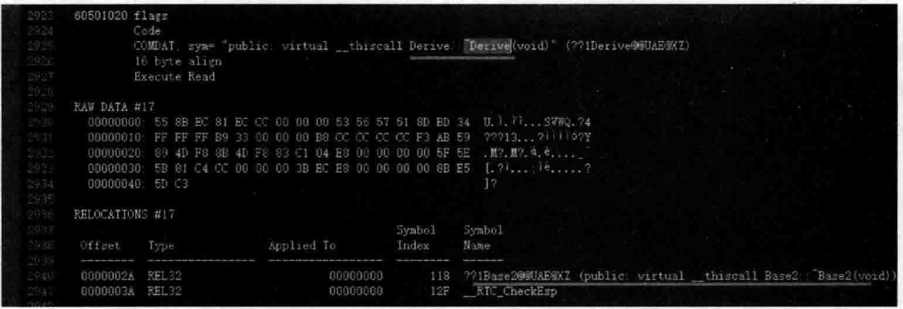  
图5.21编译器合成Derive虚析构函数用以调用Base2虚析构函数  

这里笔者要重点提一下“虚析构函数”这个词。在传统虚函数中，子类的虚函数必须与父类的虚函数同名，才能实现多态。但是“虚析构函数”是一个特殊的存在，因为子类和父类类名不相同，所以它们的析构函数名字肯定不同。但是，只要这个析构函数是一个虚函数，依旧支持多态。这个，请读者注意。  

（5）一定要记住，对于这种带继承关系的类，new一个对象后，要成功delete该对象，要求读者务必做到不管父类，还是子类，一定要明确地写出虚析构函数，千万不要省略掉，否则要么系统崩溃，要么可能导致内存泄露（下一节会实际举例）。  

现在修改代码，向所有类中加入虚析构函数，从而保证多态的正常运作，保证所有的析构函数都能被正常调用，内存能够正常回收。  

Base类中：  

``` cpp
virtual ~Base()  
{  
    cout << "Base::~Base()" << endl;  
}
```

Derive类中：

``` cpp
virtual ~Derive()  
{  
    cout << "Derive::~Derive()" << endl;  
}
```

（6）加人了虚析构函数后，将断点设置在Derive：： $\sim$ Derive虚析构函数中，调试程序，当程序运行停在断点行时，切换到反汇编窗口，如图5.22所示。  

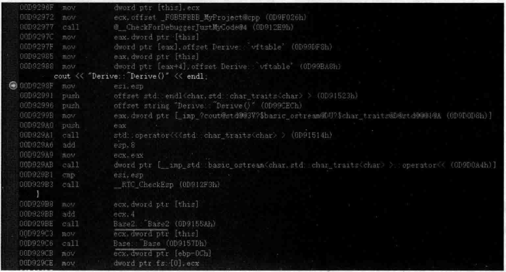  
图5.22子类的虚析构函数的函数体执行完成后分别调用了Base2和Base的虚析构函数  

从图5.22中可以看到，子类先执行了自己的虚析构函数的函数体，然后又去调用Base2和Base的虚析构函数。  

执行起来，看一看结果（注意结果中显示的析构函数的函数体执行顺序）：  

``` cpp
Derive::~Derive() 
Base2::~Base2() 
Base::~Base()
```

根据以往学习过的知识和经验，现在可以绘制一下当前这种情况下的Derive类相关的虚函数表。在绘制之前，可以在main主函数中写一些测试代码，利用测试代码，就可以绘制虚函数表：  

``` cpp
Base* pbm = new Base();  
Base2* pb222 = new Base2();  
cout << "断点设置在这里" << endl;
```

将断点设置在cout所在行，调试程序，当程序运行停在断点行时，将鼠标分别放在pbm和pb222上并展开，观察它们的虚函数表项，如图5.23所示。  

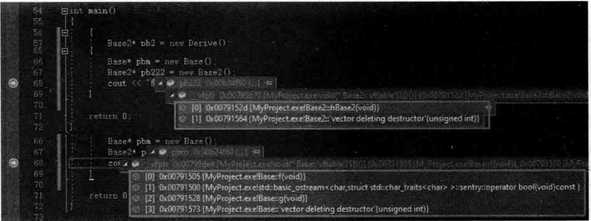  
图5.23通过new创建类对象来观察某个类关联的虚函数表中的各个表项  

虽然图5.23可能不一定全，但可以大概知道与某个类相关的虚函数表项有哪些继续在main主函数中增加一些测试代码  


``` cpp
Derive* p11212 = new Derive();  
p11212->g(); //Derive::g()  
p11212->i(); //Derive::i()，走虚函数表，查询虚函数表得到虚函数地址并调用虚函数  
  
Derive dddd;  
dddd.i();   //Derive::i()，不走虚函数表，直接调用虚函数
```

上述代码读者可以自行设置断点并进行调试，查看反汇编代码，确定哪些虚函数调用需要通过虚函数表进行，哪些虚函数调用是直接调用，不需要通过虚函数表进行，这些知识笔者在前面已经都详细地演示过了。  

根据上面的代码测试，加之各种认知，绘制一下子类Derive对象的虚函数表的组织结构图，如图5.24所示。  

观察图5.24，发现类Derive的虚函数表2中的第二项看起来是一串信息。这一长串代码是怎么来的呢？  

开始的时候笔者通过设置断点进行观察，在main主函数的代码行 $\mathrm{g11212->g()}$ ；设置了一个断点，调试程序，当程序运行停在断点行时，将鼠标移动到Derive\* $\mathrm{p11212}=\mathrm{ne}$ Derive（）：代码行的p11212并展开，查看其中的第二个虚函数表（Base2类所属的虚函数表）的内容，如图5.25所示。  

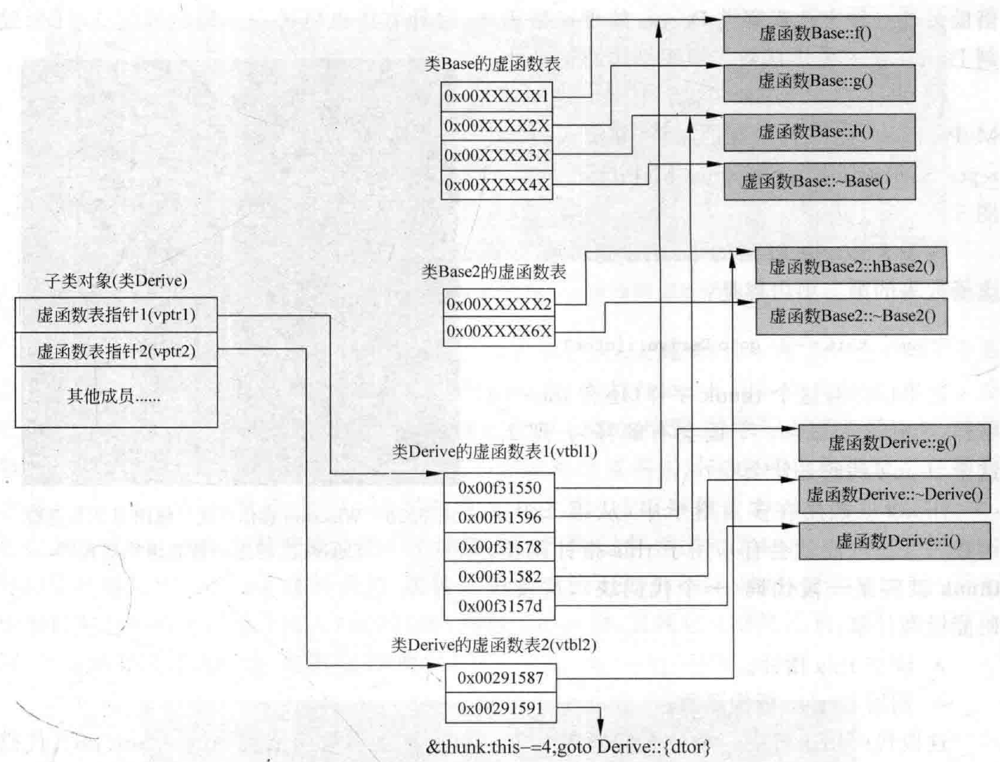  
图5.24Derive类对象虚函数表组织结构图  

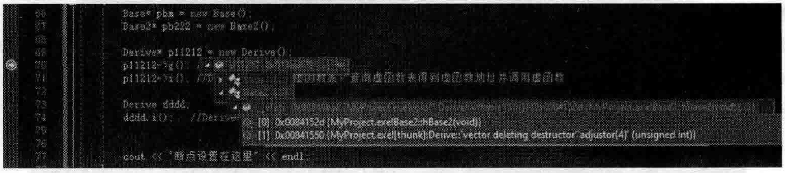  
图5.25Derive类的第二个虚函数表中的一个特殊项  

在图5.25中，可以看到第二个虚函数表中的最后一项，内容是：  

``` cpp
0x00841550 (MyProject. exe! thunk Derive: vector deleting destructor'adjustor(4)'(unsigned int)}
```

如果读者编译器中显示的信息与图5.25显示的信息差异太大，建议用“生成” $\rightarrow$ “重新生成解决方案”命令来重新编译一下整个项目，因为有时编译器也会显示出一些错乱的信息。  

上面这一堆信息中发现有一个关键词：thunk。这个关键词应该引起重视。此外，笔者借助另外一种方法观察类Derive的虚函数表项，这种方法也更进一步地验证图5.24所绘制Derive类对象虚函数表组织结构的正确性。  

使用开发人员命令行工具，进人到MyProject.cpp文件所在的路径，并输人cl/d1report Single Class Layout Derive.MyProject.cpp，如 图5.26所示。  

在图5.26中，看到的Derive类的第二个虚函数表的第二项内容是：  

``` cpp
&thunk: this-=4; goto Derive: (dtor)
```

这里依然有这个thunk字样（还有this $=4$ 字样，为什么要减4？下面会有解释）。那么，这个thunk到底是什么呢？  

thunk一般用在多重继承中（从第二个虚函数表开始可能就会有），用于this指针调整。thunk其实是一段代码（一个代码块），这段代码能做两件事：  

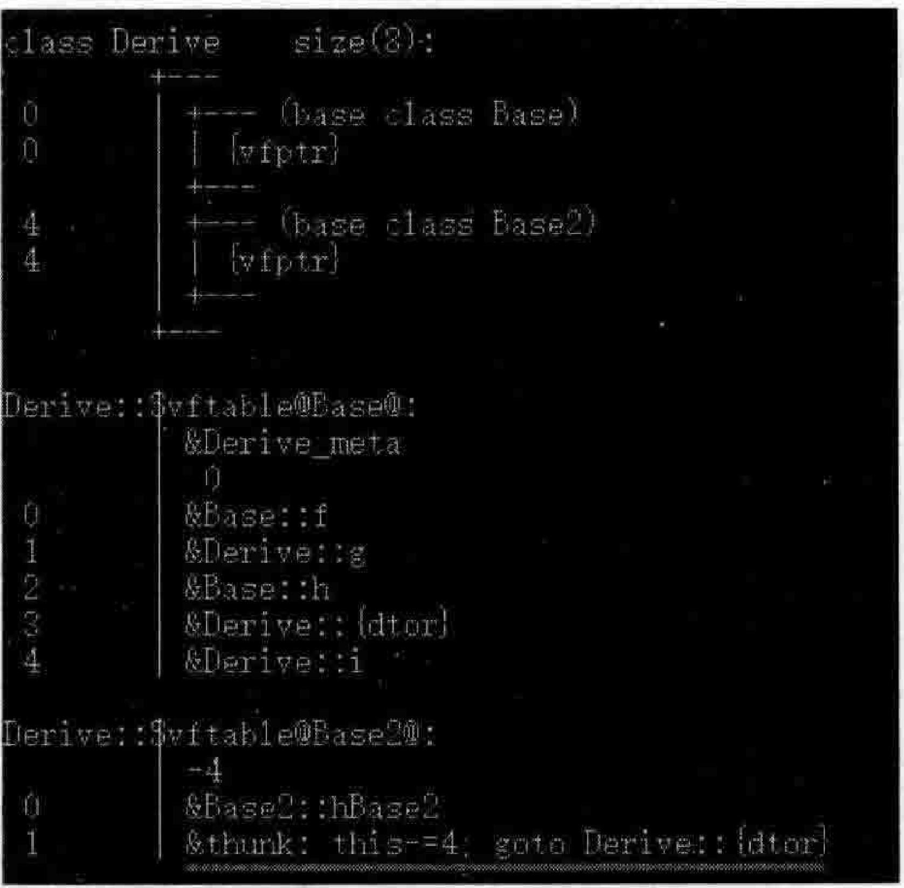  
图5.26Windows操作系统下使用cl工具查看Derive类的虚函数表组织结构图  

- 调整this指针。  
- 调用Derive析构函数。  

这段代码用来解决一个什么可题呢？正是用来解决当前面范例中的deletepb2；代码行执行时，可以通过这段代码来成功调用Derive的析构函数，从而实现正确的释放内存的目的。或者说的再明确一点，当执行deletepb2；代码行时，系统就会调用（执行）thunk这段代码。  

现在来看一看thunk对应的代码块是什么样子，虽然图5.25中显示的第二个虚函数表中的最后一项的一堆字符串似乎难以捕捉到有用的内容，但是在这一堆字符串最前面有一个地址 $0{\bf x}00841550\,0$ （这个地址就是thunk块的入口地址），在调试程序时，当断点停留在图5.25所示的断点行时可以切换到反汇编窗口，并在该窗口左上角的地址部分输入 $0\mathbf{x}00841550$ 并按Enter键，可以看到反汇编窗口导航到了该地址对应的代码行，如图5.27所示。  

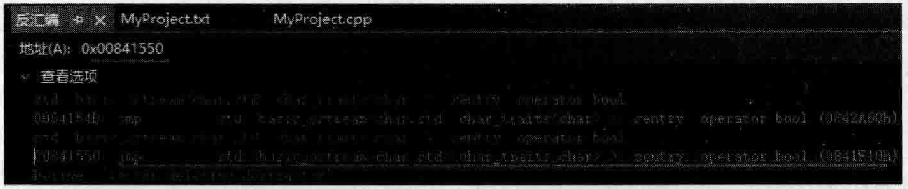  
图5.27查看虚函数表中thunk所对应的代码块  

从图5.27中看到了地址0x00841550对应的是一个jmp跳转语句，跳转到的是 $\mathrm{0x0841F10h}$ 地址。于是继续在反汇编窗口左上角的地址部分输入 $0\mathbf{x}0841\mathbf{F}10$ 并按Enter键，可以看到反汇编窗口导航到了该地址对应的代码行如图5.28所示。  

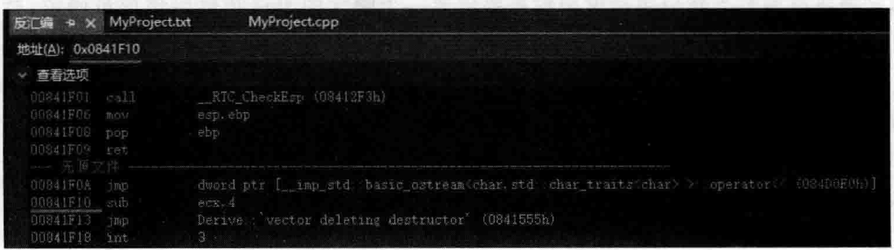  
图5.28进一步查看虚函数表中thunk所对应的代码块  

看图5.28·中的subecx，4代码行，这里表示ecx-4（ecx减4），ecx根据以往经验，应该是this指针，ecx-4就是在调整this指针（前面也刚刚说过thunk代码块能够调整this指针）。为什么这里是一4？参考图5.20，注意该图中pb2的位置，原来this指针在pb2的位置，如果想要调用Derive类的析构函数（因为删除对象要调用对应类的析构函数），必须要拿到Derive对象的首地址，所以pb2的位置向上移动4个字节就是Derive对象的首地址，所以，subecx，4实际就是把地址往小了调整4个字节，这样就指向了Derive对象的首地址。然后紧接着又是一个imp跳转语句，跳转到的应该是 $0\mathbf{x}0841555\mathrm{{h}}$ 地址，于是，继续在反汇编窗口左上角的地址部分输人 $0.0841555$ 并按Enter键，发现它又继续跳到 $0.0842\mathrm{AC}0$ 地址，于是继续跟进该地址，如图5.29所示。  

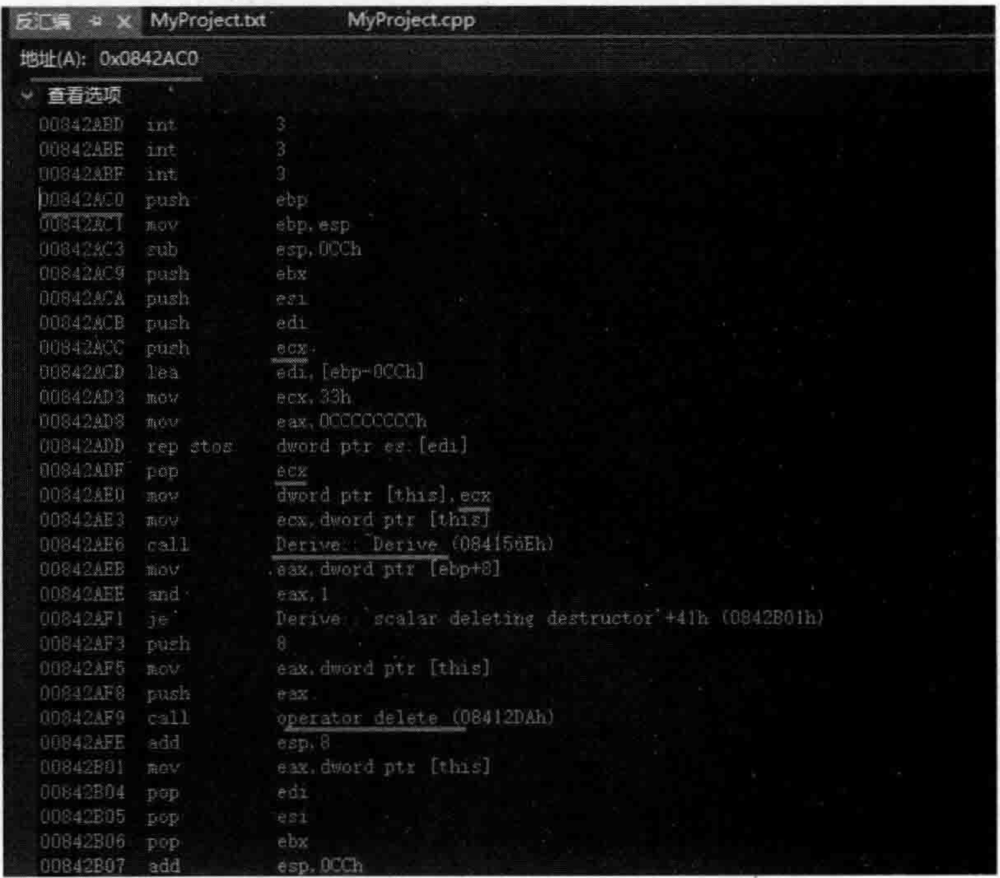  
图5.29进-步查看虚函数表中thunk所对应的代码块  

通过层层跟进thunk代码块，看到了如图5.29所示的信息，这里的汇编代码比较多，但挑重点看即可，可以看到Derive：： $\sim$ Derive析构函数被调用了（因为前面正确地指向了Derive对象的首地址，所以这里就可以正确地调用Derive的析构函数。前面讲过，调用类中的普通成员函数当然也包括虚函数需要传递一个隐含的this指针给该成员函数，所以一定要先正确地拿到Derive对象的首地址，这就是前面先调整this指针的目的）。  

上面分析了不少thunk代码块所做的事情，这里可以看得出来，编译器的设计者居然在虚函数表项自中嵌入了一个thuk代码块（实际是一个指向一个代码块的指针）专门处理deletepb2；这种代码的对象释放问题。以往可能读者会认为虚函数表中只有指向各个虚函数人口地址的指针。  

现在继续研究一下thunk代码块被调用的过程（前面已经多次说过，执行deletepb2；代码行时，就会调用这个thunk代码块）。  

将断点行设置在deletepb2：所在行，调试程序，当程序执行停留在断点行时切换到反汇编窗 口，如图5.30所示。  

图5.30中，edx其实就是pb2所指向的内存地址（也就是Derive类第二个虚函数表的首地址），所以 $\mathrm{6d}\mathbf{x}+4$ 其实就是跳到了图5.24中Derive类第二个虚函数表的第二项，其实就是thunk代码块的首地址。然后紧接着calleax正是去调用thunk代码块去了。按F11快捷键不断跟踪进去，读者就可以看到图5.29所示的画面了（thunk代码块执行的画面）。    

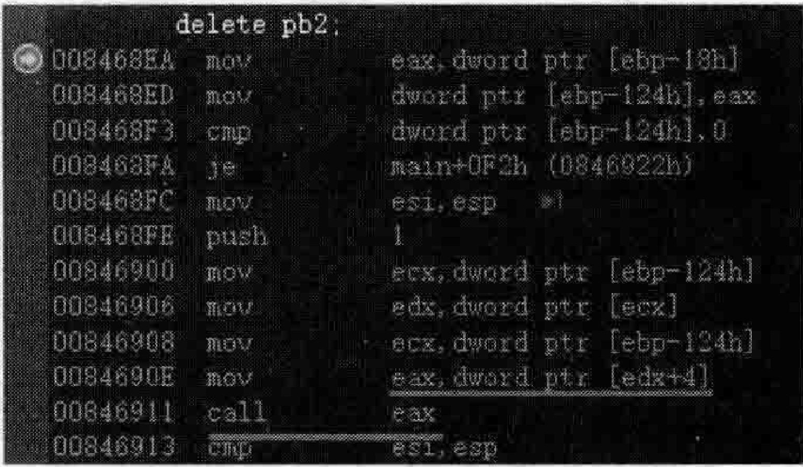  
图5.30通过调用thunk代码块实现正确地释放对象  

继续看图5.29，刚刚说到，Derive：：～Derive析构函数被调用，跟踪进该析构函数中看一看做了什么。首先执行了Derive：： $\scriptstyle\mathtt{\varepsilon}\;\mathtt{=}\;\mathtt{\varepsilon}$ Derive的函数体，然后又调用了Base2：：\~Base2和Base：：\~Base，如图5.31所示。  

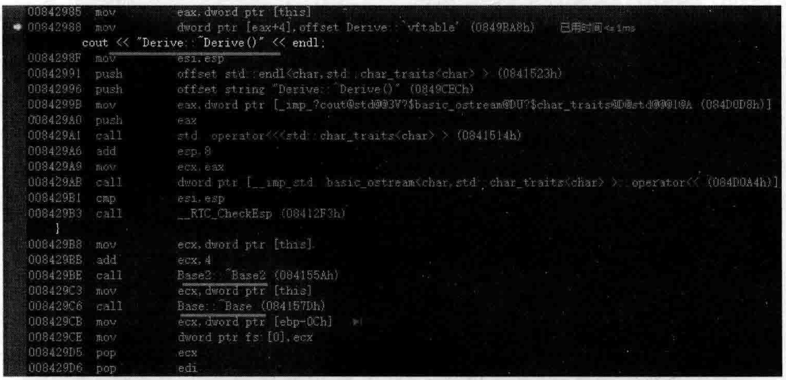  
图5.31 t hunk Derive：：\~Derive Base 2：：\~Base2和 Base:: $\scriptstyle\iff$ Base析构函数  

回头再看图5.29，在调用了Derive：： $\sim$ Derive后，operator delete（这是一个函数）用来真正地释放内存。  

总结一下，当执行deletepb2；代码行的时候，系统工作流程如图5.32所示。  

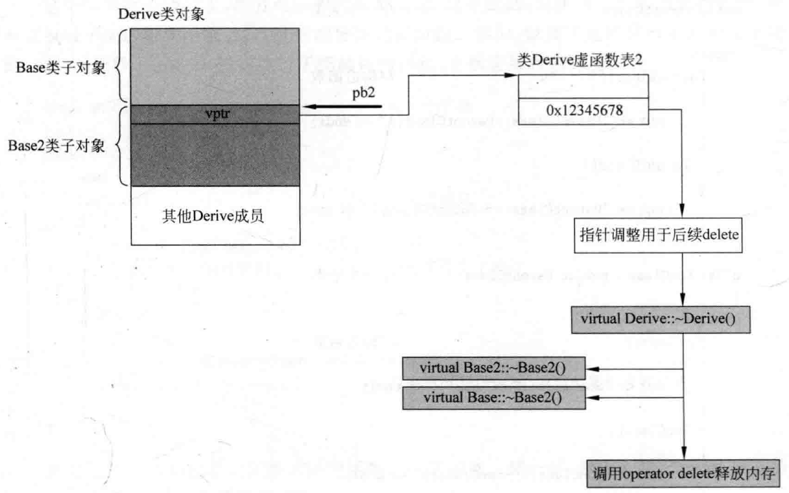  
图5.32deletepb2：代码行执行后系统工作流程图  

图5.32比较好理解，在执行了代码行deletepb2；来delete第二个基类指针（本意当然是要释放整个new出来的内存）。系统释放内存的步骤总结如下：  

（1）通过Base2类的虚函数表指针vptr去找Derive类的虚函数表2，找到了该虚函数表的第2项并调用该项。这第2项就是thunk代码块的首地址，这个代码块能够调整this指针偏移，并能够执行Derive对象的虚析构函数，那么就开始执行这个代码块。  

（2）执行this指针调整功能。  

（3）调用Derive：：\~Derive。在Derive：：～Derive Base 2：：\~Base2 和Base：：\~Base两个虚析构函数。  

（4）operator delete。  

本节用了很大篇幅带着读者走读一下汇编代码，看看用第二基类指针怎么释放整个子类对象。同时，认识了thunk，其实它就是一段汇编代码，这段汇编代码的首地址被放在了虚函数表里作为虚函数表中的一项，这段汇编代码用于this指针调整以及执行Derive的虚析构函数。当然，在不需要this指针调整的情况下虚函数表中也不会有thunk代码块首地址这一项。  

## 5.6.3 父类非虚析构函数时导致的内存泄露演示  

在 $\mathrm{C++}$ 面试中被问及最多的一个问题是：一个父类的析构函数为什么必须是虚函数？其实针对这个问题，5.6.2节已经给出了非常详细的解释和答案。  

本节的目的就是用更浅显的范例来解释“一个父类的析构函数为什么必须是虚函数”。在MyProiect.cpp的上面，增加如下代码行来定义具有父子关系的两个新类：  

``` cpp
class ParentClass //一个父类  
{  
public:  
    ParentClass() //构造函数  
    {  
       cout << "ParentClass::ParentClass()" << endl;  
    }  
    ~ParentClass()  
    {  
       cout << "ParentClass::~ParentClass()" << endl;  
    }  
};  
class SonClass : public ParentClass //一个子类  
{  
public:  
    SonClass()//构造函数  
    {  
       cout << "SonClass::SonClass()" << endl;  
    }  
    ~SonClass()  
    {  
       cout << "SonClass::~SonClass()" << endl;  
    }  
};
```

在main主函数中，加人如下代码来创建一个子类对象：  

``` cpp
SonClass sonobj;
```

执行起来，看一看新加人的这行代码的结果：  

``` cpp
ParentClass: ParentClass() 
SonClass: SonClass() 
SonClass: ~SonClass() 
ParentClass: ~ParentClass()
```

可以看到，创建sonobj时，先执行父类的构造函数体，再执行子类的构造函数体，析构sonobj时，先执行子类的析构函数体，再执行父类的析构函数体（对象的构造、析构顺序等话题第6章会详细讲解）。  

现在看起来，上面的结果没有问题。  

在main主函数中，注释掉刚才的SonClasssonobj；代码行，加人新代码行，这次用父类指针创建子类对象：  

``` cpp
ParentClass* parobj = new SonClass; //创建SonClass对象  
delete parobj;  //删除SonClass对象
```

执行起来，看一看新加人的这两行代码的结果：  

``` cpp
ParentClass: ParentClass() 
SonClass: SonClass()
ParentClass: ~ParentClass()
```
这个结果就有问题了，读者可以看的非常清楚，此时此刻，只执行了父类的析构函数，并没有执行子类的析构函数，这就有可能导致内存泄露。例如，像如下这样修改子类的定义代码，则因为删除parobj时没有执行子类的析构函数，必然会导致内存泄露：  

``` cpp
class SonClass : public ParentClass //一个子类  
{  
public:  
    char* m_p=NULL;  
    SonClass()//构造函数  
    {  
       cout << "SonClass::SonClass()" << endl;  
       m_p = new char[100];//这里分配了内存  
    }  
    ~SonClass()  
    {  
       cout << "SonClass::~SonClass()" << endl;  
       delete m_p;//这里要释放内存，否则会导致内存泄漏  
    }  
};
```

此时的解决方案就是让父类的析构函数变成虚函数。试一试，修改父类ParentClass的析构函数定义，让其成为虚析构函数：  

``` cpp
virtual ~ParentClass()  
{  
    cout << "ParentClass::~ParentClass()" << endl;  
}
```

再次执行程序，看一看结果：  

``` cpp
ParentClass: ParentClass() 
SonClass: SonClass() 
SonClass:: ~SonClass() 
ParentClass: ~ParentClass()
```

这个结果就正常了，读者可以看的非常清楚，此时此刻，子类的析构函数先执行了，然后父类的析构函数也执行了，这就不会有任何问题，内存泄露迎刃而解。这里要说明两点：  

（1）如果不涉及父类子类问题，整个系统中只有单独一个类，那么该类的析构函数是否是虚函数都没有关系。  

（2）有人说如果父类析构函数不设置为虚函数，而只把子类虚构函数设置为虚函数会怎样？读者可以测试一下，结果就是报程序执行异常。为什么会报异常，读者可以自己分析一下。这里给一些提示：  

①子类SonClass因为有了一个虚函数，会在成员变量中多出一个虚函数表指针（ $\mathbf{x86}$ 平台下是4字节），Son Class size of Parent Classsizeof值多出4字节。  

②因为多出的这4字节导致在真正调用系统底层的operatordelete释放内存时new的内存数量和delete的内存数量不等，从而使系统产生异常。  

③Parent Class virtual void f（） $\{\}$ ；虚函数定义，则再执行程序，最起码不会再报程序执行异常。  

④不管怎么说，不建议读者做只给子类析构函数设置为虚函数的尝试，似乎没什么意义。  

那么为什么父类用了虚析构函数后，执行结果就正常了？其实5.6.2节叙述的比较清楚了，这里再简述一遍。当delete指向子类对象的父类指针（parobj）时：  

（1）如果父类的析构函数不是虚函数，则不会触发动态绑定，结果就是只会调用父类的析构函数而不会调用子类的析构函数，从而可能导致内存泄露（如果子类的析构函数中存在诸如delete这样的代码没被执行的话）。  

（2）如果父类的析构函数是虚函数，则子类的析构函数一定是虚函数（就算子类析构函数前面不加virtual也还是虚析构函数，这是 $\mathbf{C}^{++}$ 语言的语法规则），则会触发系统的动态绑定，因为new的实际是一个子类对象，所以先执行的是子类的析构函数，同时编译器还会向子类的析构函数中（具体地说位置应该在子类析构函数的函数体后面）插入调用父类析构函数的代码，最终实现了先调用子类析构函数，再调用父类析构函数，达到了让整个对象完美释放的目的。