# 5.7多继承第二基类虚函数支持与虚继承带虚函数  

## 5.7.1多重继承第二基类对虚函数支持的影响（this指针调整作用）  

本节的范例保持上一节结束时的范例代码，但main主函数中的代码全部删除。  

多重继承的话题已经探讨了不少，读者已经知道，某个类继承了几个父类，就会有几个虚函数表，而单一继承只会有一个虚函数表。  

再次说一下this指针调整。回顾一下，调整的目的是做什么？因为要调用一个对象的成员函数，总得需要这个对象或者这个对象的指针，这里单说对象指针。对象指针，指向对象的首地址，也只有指向对象的首地址，才能正确地调用对象的成员函数，因为编译器内部是要把这个对象指针（对象首地址）作为this参数传递到成员函数中去，然后用这个参数来修改成员函数里面的一些成员变量的值等等，成员变量的地址需要根据这个this参数来确定（成员变量的地址 $=$ this $^+$ 成员变量偏移值）。  

所以，this指针的调整目的就是让对象指针正确地指向对象首地址，从而能正确调用对象的成员函数或者正确确定成员变量的存储位置，这样理解this指针调整即可。  

在多重继承下，有几种情况，第二或者后续的基类会对虚函数的支持产生影响，也就是说要进行this指针的调整。下面看一看有哪几种情况要进行this指针的调整。  

### 1.通过指向第二个基类的指针调用继承类的虚函数时  

例如下面的代码：  

``` cpp
Base2* pb2 = new Derive();  
delete pb2;  //这里调用了Derive类的虚析构函数
```

上面两行代码的执行细节上一节已经学习过了，因为pb2是指向Derive对象中的Base2子对象（第二基类指针），所以为了能够正确执行Derive的虚析构函数，pb2必须要调整指向Derive对象首地址。通过上一节已经看到，pb2指向的地址减了4字节（图5.28），调整上去，指向了真正Derive对象的首地址。  

### 2.一个指向派生类的指针调用第二个基类中的虚函数时  

例如下面的代码：  

``` cpp
Derive* pd2 = new Derive();  
pd2->hBase2();
```

设置断点在pd2 $\scriptscriptstyle->$ hBase2（）：代码行并开始调试，当程序执行停到该断点行时，切换到反汇编窗口，如图5.33所示。  

在上述代码中，因为pd2本身是Derive\*类型指针，而hBase2是第二基类Base2的成员函数，要想成功调用Base2的hBase2成员函 数，必须进行this指针调整，让this指针指向Base2类子对象的首地址。与图5.20类似 ，pd2只有向下走4个字节才能指向Base2类子对象的首地址，因此，这里this是需要 $+4$ 的。图5.33中，汇编代码行addecx，4就用于给.this指针进行 $\pm4$ 调整。   

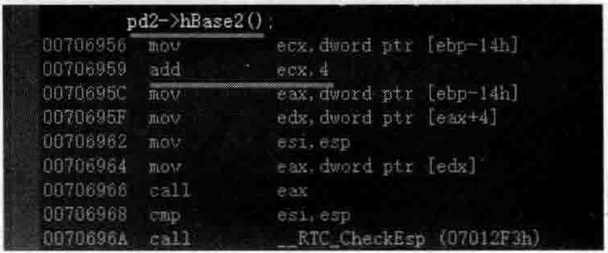  
图5.33通过反汇编窗口观察this指针调整问题  

### 3.允许虚函数的返回值类型有所变化时  

扩充一下范例代码。在Base类中增加如下public修饰的成员函数：  

``` cpp
public:  
    virtual Base* clone() const  
    {  
       return new Base();  
    }
```

在Base2类中增加如下public修饰的成员函数：  

``` cpp
public:  
    virtual Base2* clone() const  
    {  
       return new Base2();  
    }
```
在Derive类中增加如下public修饰的成员函数：  

``` cpp
public:  
    virtual Derive* clone() const  
    {  
       return new Derive();  
    }
```

在main主函数中，注释掉以往的代码，重新加人如下代码：  

``` cpp
Base2* pb1 = new Derive();  
Base2* pb2 = pb1->clone(); //执行Derive::clone()
```

执行调用clone成员函数这行代码时，pb1会调整指向Derive对象开始地址，这样调用的才是Derive版本的clone，所以this指针应该变小，应该用sub汇编语句调整。调试起来观察一下：在Base2*pb2=pb1—>clone（）；代码行设置断点并开始调试，当程序执行停到该断点行时，将鼠标放在pb1变量名上并展开观察，如图5.34所示。

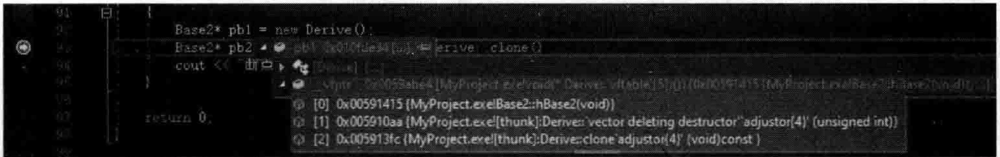  
图5.34Derive类的第二个虚函数表中的两个额外的thunk项  

从图5.34中可以看到Derive类的第二个虚函数表中有三项，其中后两项都是thunk项（代码块）。读者已经知道，thunk项的一个主要功能就是调整this指针偏移值，调整厂偏移值后，才能调用Derive类的clone成员函数。  

接着，切换到反汇编窗口，如图5.35所示。  

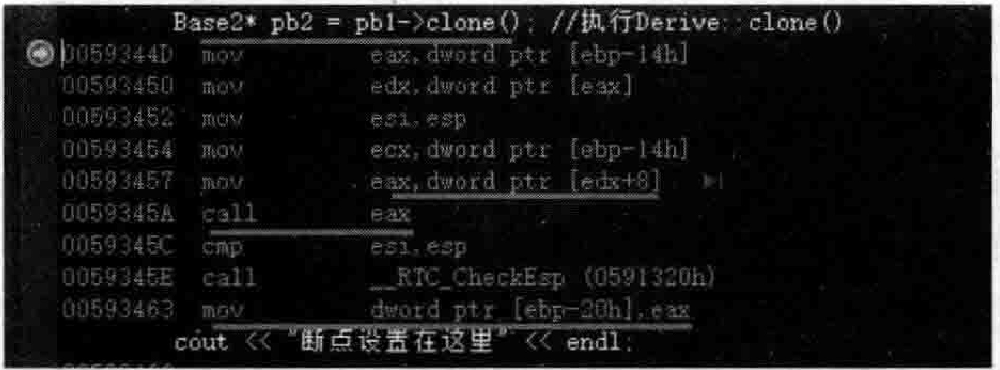  
图5.35调用Derive类的第二个虚函数表中调整this偏移值的thunk代码块  

从图5.35中可以看到 $\lceil\mathrm{edd}\mathbf{x}\!+\!8\rceil$ 字样的出现，这意味着寻找Derive类第二个虚函数表中的第三项，也就是下标为2的代码块项，并接着通过ca1l指令去执行这个代码块，按F11键跟踪进calleax代码行，如图5.36所示。  

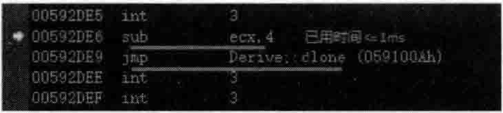  
图5.36执行thunk代码块进行this指针调整  

从图5.36中可以非常清楚地看到，通过调用sub指令将ecx的内容一4，这意味着this指针往回走了4个字节，正好走到真实的Derive对象的首地址，然后，执行jmp行来调用Derive：：clone成员函数。这里可以跟踪进汇编代码中的Derive：：clone继续观察，如图5.37所示。  

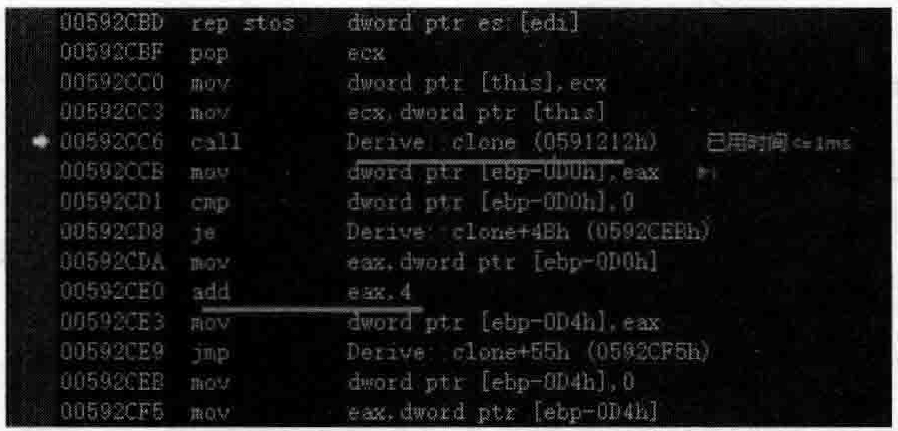  
图5.37_跟踪进Derive：：clone后继续观察对应的汇编代码  

图5.37表示已经跟踪进了Derive：：clone成员函数相关代码段，在其中，首先真正地利用call去调用了Derive：：clone成员函数。执行完Derive：：clone成员函数后，返回的是一个指向新Derive对象的指针，但是因为这个指针是要赋给pb2（Base2\*pb2=pbl->clone（）；），pb 2 Base 2 $\divideontimes$ 类型的指针，所以在赋给pb2之前，还要调整一下，也就是指针要往后走4个字节，以指向Base2子对象。所以图5.37中的addeax，4就表示指针往后走4个字节来进行调整。  

用Shift $^+$ F11键将程序执行流程跳出来后，又返回到了图5.35所示的执行流程中，其中的movdwordptr[ebp-20h]，eax代码行就是把调整后的this指针赋给了pb2。  

请注意，不同的编译器，在这些实现细节上可能各不相同，但道理相通。  

## 5.7.2虚继承下的虚函数  

为了简化问题，把以往的范例代码全部注释掉。这里重新书写：  

``` cpp
class Base  
{  
public:  
    virtual void f() {}  
    virtual ~Base() {}  
  
    int m_basei;  
};

class Derive :public virtual Base  
{  
public:  
    virtual ~Derive() {}  
  
    int m_derivei;  
};
```

笔者在main主函数中通过加几行代码来推测一下对象的数据布局，第4章中已经用此法推测过了不少对象的数据布局，但同时既有虚基类又有虚函数的对象数据布局还没研究过，这里就研究一下。在main主函数中加人如下测试代码：  

``` cpp
cout << sizeof(Derive) << endl;  //16  
Derive dobj;  
dobj.m_basei = 2;   //13-16字节  
dobj.m_derivei = 5; //5-8字节  
Derive* pdobj = new Derive();  
pdobj->f();
```

上述代码中，注意Derive的sizeof值是16，因为有一个虚基类表指针、一个虚函数表指针，以及两个int类型成员变量，一共是 $4\!\times\!4\!=\!16(\mathrm{B})$  

上面确定了两个成员变量的位置（看代码行中的注释），接下来面临的回题是确定虚函数表指针的位置。怎样确定？  

因为f函数是一个虚函数，pdobj $\textgreater$ f（）；调用走的应该是虚函数表，所以，只要找到虚函数表首地址，与pdobij对象内存的内容比较，就能确定pdobj对象内存布局中虚函数表指针 的位置。  

将断点设置在pdobj $>>$ ），代码行并开始调试，当程序执行停到该断点行时，切换到反汇编窗口，如图5.38所示。  

在图5.38中看到了一行汇编代码calleax，猜测一下，这个就是调用虚函数f，这说明在执行calleax代码行之前，eax寄存器中保存着虚函数f的入口地址。在当前的调试状态下，多次按F10快捷键单步调试程序，一直到图5.38中左侧黄色箭头停留在calleax代码行为止。此时，观察寄存器中eax的值，如图5.39所示。  

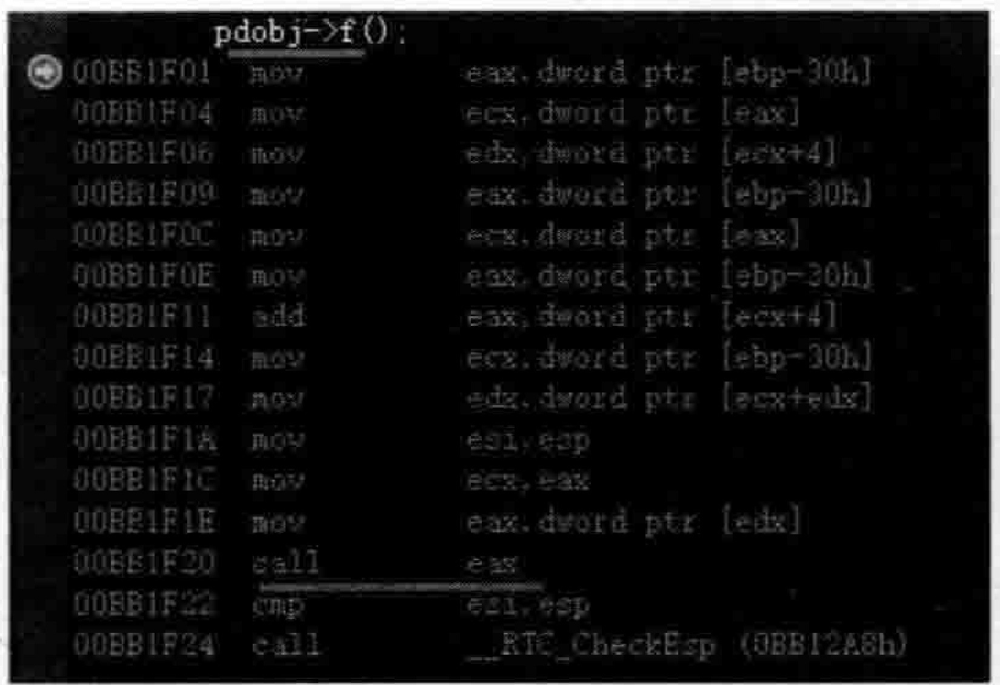  
图5.38通过汇编代码中对虚函数的调用确定虚函数表首地址  

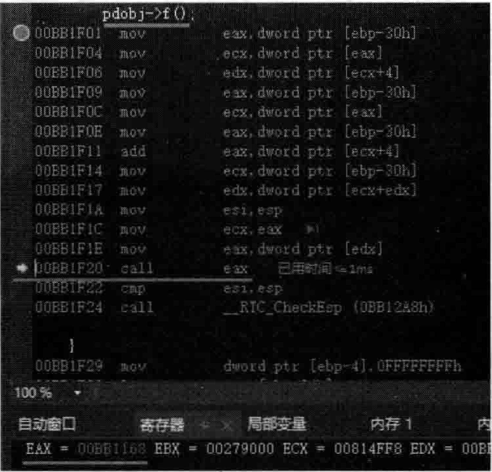  
图5.39通过汇编代码中对虚函数的调用确定虚函数人口1的地址  

在图5.39中，观察寄存器窗口中EAX的值，可以看到是00BB1168，这个地址应该就是虚函数f的人口地址。  

当然，如果在程序执行停留到断点行时直接将光标放在pdobi上并展开观察虚函数f的人口地址，则更简单，如图5.40所示。  

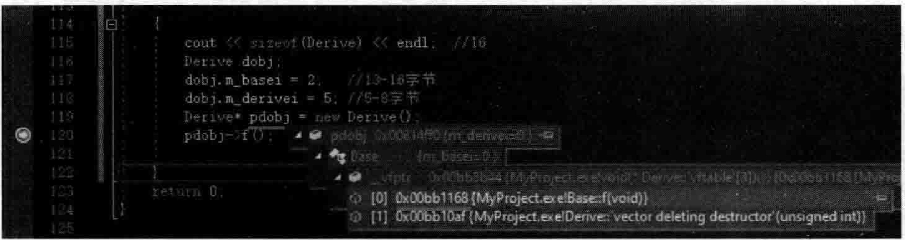  
图5.40通过new一个Derive对象可以观察到其虚函数表中某个虚函数的人口地址  

在图5.40基础之上继续观察，把pdobj这个对象指针所属的内存放到“内存1”窗口中观察，如图5.41所示。  

根据前面的测试，Derive对象的 $13\!\sim\!16$ 子节和 $5\!\sim\!8$ 字节都已经确定厂。尚不确定的就是 $1{\sim}4$ 字节和 $9\!\sim\!12$ 字节，那么哪个会是虚函数表指针所属的位置呢？观察图5.41，  

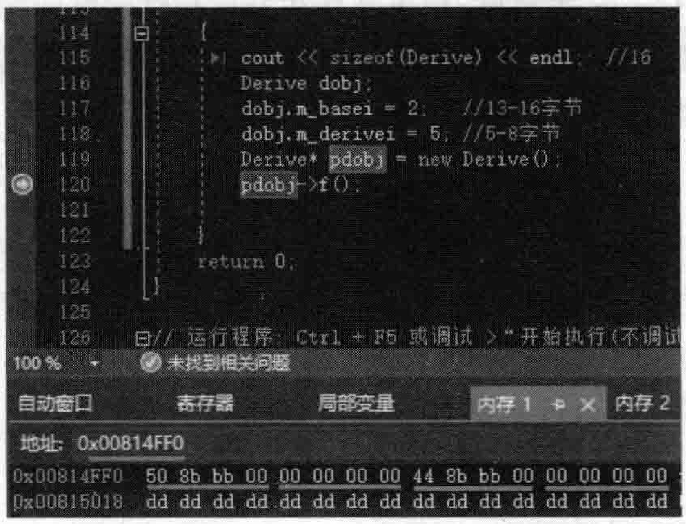  
图5.41观察pdobj所指向的Derive对象内存中的内容  

$\pm\!\sim\!4$ 字节内容是 $50~8\mathrm{b}$ bb $_{00\,,\,9\sim12}$ 字节内容是448bbb00，在内存窗口中分别观察这两个内存，哪个内存中有00BB1168字样，哪个就是虚函数表指针。  

如图5.42所示。  

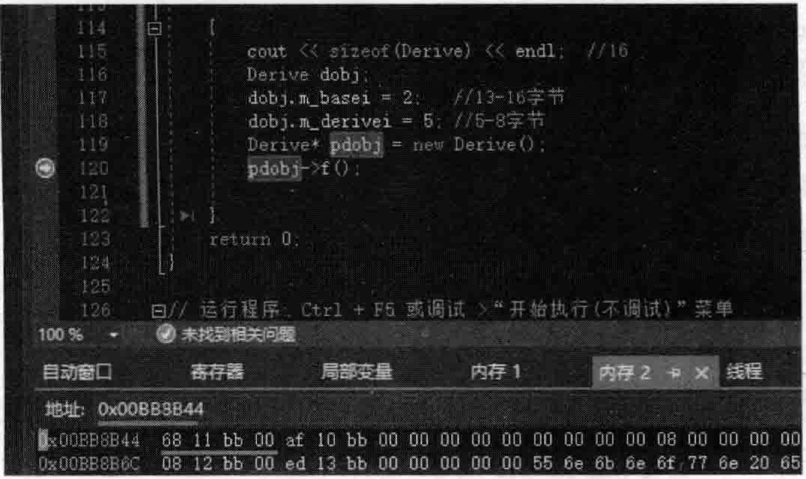  
图5.42通过观察内存内容确定虚函数表指针位置  

在图5.42中可以看到，内存0x00BB8B44中有6811bb00字样的地址，这说明Qx00BB8B44是类Derive虚函数表的开始地址，因为Derive类对象  

0x00BB8B44对应的是Derive类对象的 $9\!\sim\!12$ 字节，因此可以确定，Derive类对象的 $9\!\sim\!12$ 字节就是虚函数表指针。那么剩下的  $1\sim4$  字节就必然是 Derive类对象的虚基类表指针，所以，Derive类对象的数据布局应该如图5.43所示（图中vptr也可以写为vfptr，都表示虚函数表指针）。  

图5.43的布局还是挺反常的。因为有虚基类（虚继承）导致虚函数表指针跑到了数据布局的下面。观看整个图，Derive类对象的起始地址在最上面从vbptr虚基类表指针开始，而Base 类子对象的起始地址应该是从vptr虚函数表指针开始（不要忘记Base类里有虚函数）。所以如果Base指针指向Derive类对象，则还是存在this指针调整问题。    

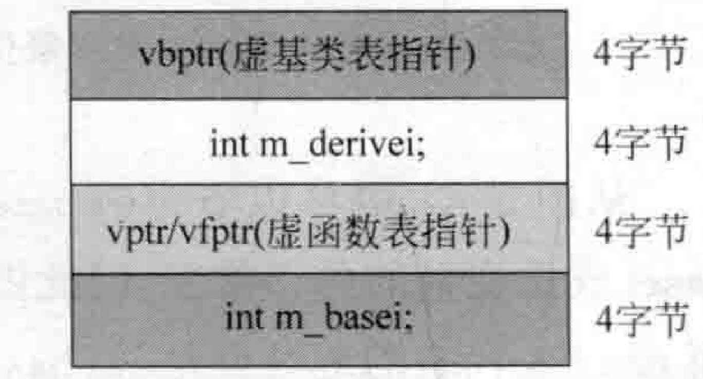  
图5.43类对象指针pdobi所指的Derive类对象的数据布局  

考虑到编译器内部对同时具有虚基类和虚函数情形的对象数据布局支持比较复杂，所以这里做相对简单一些的研究。注释掉main主函数中原有代码，加人两行新代码：  

``` cpp
Base* pbase = new Derive();  
pbase->m_basei = 6;
```
笔者原计划将断点设置在Base： $\divideontimes$ pbase $\equiv$ newDerive（）；这行并分析相关的汇编代码，但是看到这行代码对应的汇编语句居然多达30行，代码行太长，不便理解和分析，于是放弃上面两行代码，重新在main主函数中加入下面新的代码行：  

``` cpp
Derive* pderive = new Derive();  
Base* pbase2 = (Base*)pderive;  
pbase2->m_basei = 7;
```

将断点设置在pba $\mathrm{se2->m\_basei}\,=\,7\$ ：代码行并开始调试，当程序执行停到该断点行时，将鼠标分别放在pderive变量和pbase2变量上观察（这次不看汇编代码因为太过烦琐）。观察到的信息如下：  

``` cpp
pderive 0x00965238 (m_derivei=0 }
pbase2 = 0x00965240 (m_ derivei = 0}
```

可以看到pderive和pbase2间距是8个字节，此时的情形可以在图5.43的基础上进一步标注一下，如图5.44所示。  

此时，可以切换到反汇编窗口，观察代码行pbase2->m_basei $=7$ ；对应的汇编代码如图5.45所示。  

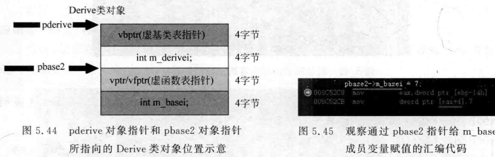  

从图5.44中可以看出，pbase2指针往后跳转4个字节，所在的内存位置正好是mbasei成员变量的内存位置，因此图5.45中eax中保存的地址就是pbase2所指向的地址，而jeax $+4$ 代表的地址就是mbasei成员变量的内存地址，符合图5.44所绘制的对象数据布局。  

另外，很多资料已经指出：虚基类中如果有虚函数，同时也定义有普通成员变量，那么父类和子类之间的偏移调整，就好像进了迷营深渊一样。所以笔者认为，掌握本节所讲述的知识已经足够，在没有特殊需求的情况下不必研究的太过深人。