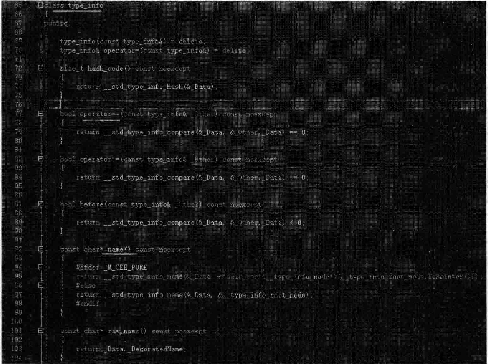
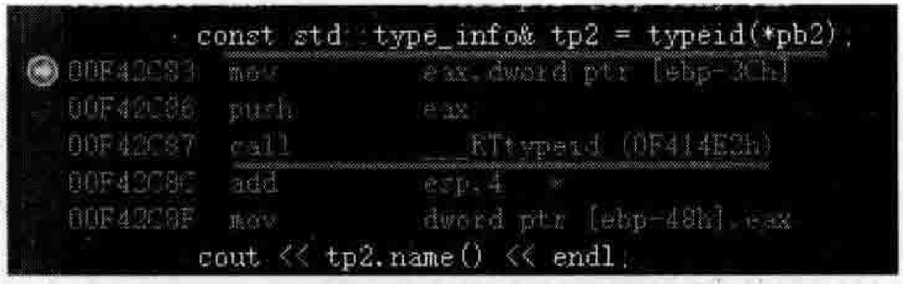
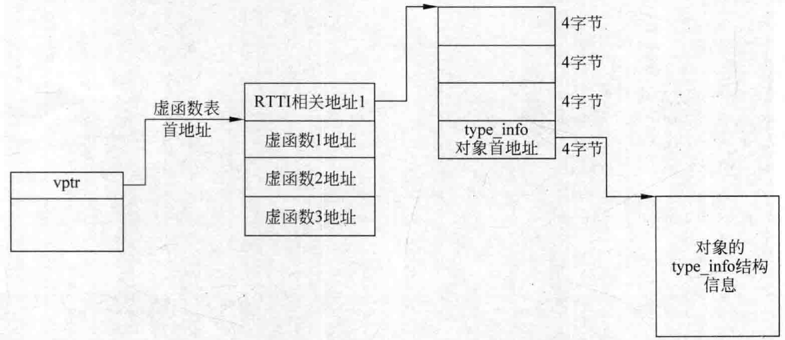
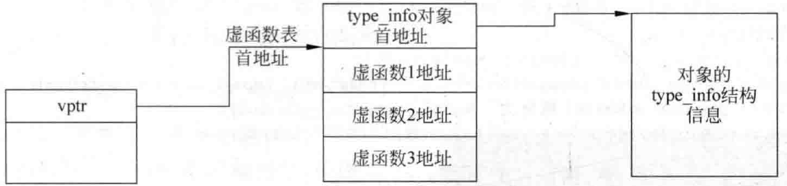

# 5.8RTTI（运行时类型识别）回顾与存储位置简介  

## 5.8.1 RTTI（运行时类型识别）简单回顾  

看看如下范例。在MyProject.cpp的上面，增加如下代码行，写一段传统的多态代码：  

``` cpp
class Base  
{  
public:  
    virtual void f() { cout << "Base::f()" << endl; }  
    virtual void g() { cout << "Base::g()" << endl; }  
    virtual void h() { cout << "Base::h()" << endl; }  
    virtual ~Base() {}  
};  
class Derive : public Base {  
public:  
    virtual void g() { cout << "Derive::g()" << endl; }  
    void myselffunc() {} //只属于Derive的函数  
    virtual ~Derive() {}  
};
```

在main主函数中，加人如下代码行：  

``` cpp
Base* pb = new Derive();  //基类指针指向一个子类对象  
pb->g();  
  
Derive myderive;  
Base& yb = myderive;  //基类引用引用的是一个子类对象  
yb.g();
```

相信读者都知道 $\mathrm{C++}$ 中运行时类型识别（RTTI），因为上面代码中的pb也好，yb也好，并不知道代码运行的时候到底它们指向或者引用的是父类对象还是子类对象，如果想得到它们指向的对象信息，就需要借助RTTI。有一点要注意，RTTI要发挥作用，父类中必须至少要有一个虚函数，没有虚函数，就无法获得准确的RTTI信息。  

有了RTTI手段，就可以在执行期间查询一个多态指针或者多态引用的信息。  

RT TI type id dynamic cast。看看如下范例，在main主函数中继续增加如下代码：  

``` cpp
cout << typeid(*pb).name() << endl;  
cout << typeid(yb).name() << endl;
```

执行起来，看一看新加人的这两行代码的结果：  

``` cpp
class Derive
class Derive
```

当然，也可以使用dynamic_cast来尝试转换类型，如果转换成功了，说明它指向的就是这个类型。在main主函数中继续增加如下代码：  

``` cpp
Derive* pderive = dynamic_cast<Derive*>(pb);  
if (pderive != NULL)  
{  
    cout << "pb指向的实际是一个Derive类型" << endl;  
    pderive->myselffunc(); //调用属于子类自己的函数  
}
```

## 5.8.2RTTI实现原理  

$\mathrm{C++}$ 引入RTTI的目的就是让程序在运行时能根据基类的指针或者引I用来获得这个指针或者引用所指向的对象的实际类型。  

刚刚回顾了RTTI的功能，演示了两个主要的运算符：typeid（获得类型名）和dynamiccast（做安全的类型转换），现在探究一下RTTI的实现原理。  

先说一说typeid。根据上面的用法可以看到，它会返回一个常量对象的引用，这个常量对象的类型一般是标准库类型type_info，type_info其实就是一个类，里面记录着跟类型有关的信息。在main主函数中继续增加如下代码：  

``` cpp
const std::type_info& tp = typeid(*pb);
```

这些与类型有关的信息，不同的平台可能会有所不同，但大同小异，如类的真实名字总是要有的。可以将光标定位到type_info中间，并按F12键跳人到type_info类的定义中去看一看，如图5.46所示（在VisualStudio2019中这个类定义在系统文件vcruntimetypeinfo.h中)。  

  
图5.46typeinfo类的定义  

比较典型的接口如图5.46中的name已经演示过了，还有操作符“ $=\bullet=\bullet$ ，用以判断所指向的类型是否相同。在main主函数中继续增加如下代码：  

``` cpp
Base* pb2 = new Derive();  
const std::type_info& tp2 = typeid(*pb2);  
if (tp == tp2) //条件成立  
{  
    cout << "很好，类型相同" << endl;  
}
```

注意看图5.46中type_info类的定义代码，可以看到其中有如下两行代码：  

``` cpp
type_info(const type_info&)= delete;
type_info& operator=(const type_info&) delete;
```

这说明该类把构造函数、拷贝赋值运算符给删除掉了，意味着对type_info这种对象无法进行复制，看起来只能通过现在的代码手段来读typeinfo对象的信息了。  

typeid有很多用法，里面可以包含很多参数。在main主函数中继续增加如下代码：  

``` cpp
cout << typeid(int).name() << endl;  
cout << typeid(Base).name() << endl;  
cout << typeid(Derive).name() << endl;  
Derive* pa3 = new Derive();  
cout << typeid(pa3).name() << endl;
```

执行起来，看一看新加人的这几行代码的结果：  

``` cpp
int
class Base
class Derive
class Derive *
```

当然，上面这几个类型应该说都属于静态类型，而不是多态类型。下面看一看多态类型。不过现在main主函数中的代码有点多，为演示方便，先全部注释掉，然后重新加人下面的代码行：  

``` cpp
Base* pb = new Derive();  
Derive myderive;  
Base& yb = myderive;  
cout << typeid(*pb).name() << endl;  //class Derive  
cout << typeid(yb).name() << endl; //class Derive  
Base* pb2 = new Derive();  
const std::type_info& tp2 = typeid(*pb2);  
cout << tp2.name() << endl;
```

执行起来，看一看结果：  

``` cpp
class Derive
class Derive
class Derive
```

可以做一个试验：只要把Base中的所有虚函数注释掉，再次执行程序，结果就不一样了。不难发现，三行输出结果都变成了classBase。此刻，读者已经发现了RTTI测试无法识别出正确的类型，这说明一个问题，RTTI的测试（检测）能力应该是与基类中是否存在虚函数有关，如果基类中没有虚函数，也就不存在基类的虚函数表，如果没有虚函数表，RTT就无法得到正确的结果（无虚函数不多态，也就是说，没有虚函数存在，就不会存在多态的概念。多态是与虚函数、虚函数表息息相关的）。  

现在还是要确保基类中有虚函数，这样typeid才能够正确拿到类型信息，换句话说，typeid运算符是在运行过程中拿到其指向的对象的实际类型。那么，问题的焦点在于：typeid是如何在运行过程中拿到这个类型信息的？这个信息是保存在哪里的？  

这里要强调一下，不同的编译器可能有不同的实现，这一点有时候是需要解读汇编代码来了解的。这里主要是针对VisualStudio2019编译器来看一看RTTI信息的保存位置。  

重点研究如下代码行，因为突破口正是在这行：  

``` cpp
const std::type_info& tp2 = typeid(*pb2);
```

将断点设置在该行并开始调试，当程序执行停到该断点行时，切换到反汇编窗口，如图5.47 所示。  

图5.47中，call RT type id（0F414E2h）代码行，这个事情的重点应该就在RTtypeid上，也只有基类存在虚函数表这种情况时，用typeid才会出现调用RTtypeid这种代码。所以初步估计，用typeid获取对象运行时的类型识别信息应该是和虚函数表有直接关系的。   

  
图5.47typeid对应的汇编代码  

通过F11快捷键，跟踪进callRTtypeid（0F414E2h）代码行，似乎又需要多次按F11键进行跟进和跳转，整体的汇编代码有一定的复杂性，因为笔者不想把这么复杂的事情全盘讲解，那样会花费很多时间，得不偿失。所以笔者换一种方法介绍RTTI的保存位置。  

笔者翻阅了一些资料，也写了一些代码进行测试核对，而后画了一张图，表示所找到的type_info结构信息的保存位置，如图5.48所示。  

  
图5.48类的type_info结构信息保存位置示意图  

根据图5.48，可以写一个程序验证一下其是否是正确的。类似的程序其实前面写过，这里再书写一次。在main主函数中，继续输人如下代码：  

``` cpp
printf("tp2地址为 :%p\n", &tp2);  
  
long* pvptr = (long*)pb2;         //指向对象pb2的指针转成long *型,大家注意，目前pb2对象里只有虚函数表指针  
long* vptr = (long*)(*pvptr);     //指向虚函数表(虚函数表首地址)  
  
printf("虚函数表首地址为:%p\n", vptr);  
printf("虚函数表首地址之前一个地址为:%p\n", vptr - 1); //注意，long在当前这个环境是4字节，所以vptr-1,其实得到的地址是往回走了4个地址  
  
//取得这个地址中的内容  
long* prttiiinfo = (long*)(*(vptr - 1));  
prttiiinfo += 3; //跳过12个字节  
long* ptypeinfoaddr = (long*)(*prttiiinfo);  
const std::type_info* ptypeinfoaddrreal = (const std::type_info*)ptypeinfoaddr;  
printf("ptypeinfoaddrreal地址为 :%p\n", ptypeinfoaddrreal);  
cout << ptypeinfoaddrreal->name() << endl;  //结果class Derive  
```

执行起来，看一看新加人的这几行代码的结果：  

``` cpp
tp2地址为：007FD150
虚函数表首地址为：007FAB70
虚函数表首地址之前一个地址为：007FAB6C
ptypeinfoaddrreal地址为:007FD150 
class Derive
```  

分析一下上面这段代码可以看到，代码行prttiiinfo $+=3$ ：用于跳过12个字节。为什么跳过12个字节？实际上这12字节是一个结构信息，这个结构信息的内容和编译器对RTTI的实现有关。不过这里笔者不准备详细讲解这个问题。另外还有多重继承，虚拟继承之类的不同的对象结构布局，type_info也可能有各种情形，这个的探索就留给读者，如果读者有兴趣，可以按照笔者的分析方法进行更深人的分析。  

回头想想，如果基类中没有虚函数，没有虚函数表，那么取得RTTI信息肯定就不是这种方法了，取出来的信息也就不叫运行时类型识别了。  

例如如下代码行：  


``` cpp
cout << typeid(int).name() << endl; //输出int
```

如果查看这行代码对应的反汇编代码，根本就不会找到图5.47中的“RTtypeid”字样，所以这时typeid取得的类型就不是所谓的运行时类型识别了。  

对RTTI这个话题有上面这些了解就可以了。  

## 5.8.3 vptr、vtbl与RTTI的type_info信息创建时机

在3.5节曾经说过vptr、vtbl的创建时机，回忆一下。  

虚函数表指针vptr是跟着对象走的，对象创建出来了，才存在vptr。对象什么时候创建出来？程序运行的时候创建出来。现在可以把这句话说的更完善一些：Vptr也是属于类中的一个成员变量，它是编译器在编译的时候就插进去的，然后vptr的赋值是在程序运行起来后，程序员创建一个对象的时候，执行编译器插人到构造函数中的赋值代码时才给vptr赋值的，让其指向该类所属的虚函数表。  

虚函数表vtbl是在编译期间就确定好的，跟着类走的。  

RTTI的type_info信息实际上也是编译期间就创建好的。程序员能够做的事情就是去读取这些信息。所以不难发现，不管生成多少个类对象，取得的type_info所指向的地址都相同。也就是说，这个信息也是基于类的。  

总结一下：RTT信息的取得，一般都是以虚函数表之前的一个位置为突破口，就算是各家的编译器实现RTTI手段各不相同，但一般以这个位置为突破口这一点是比较统一的。有的编译器可能存储的RTTI信息比较直接，如图5.49所示。  

  
图5.49类的type_info结构信息保存的另一个位置示意图