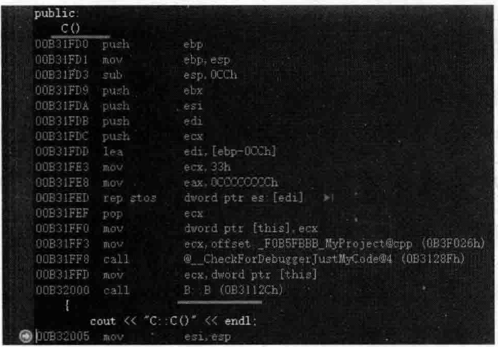
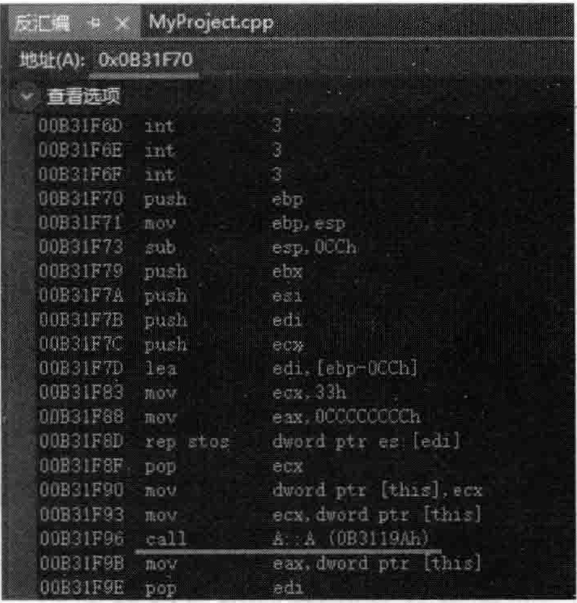
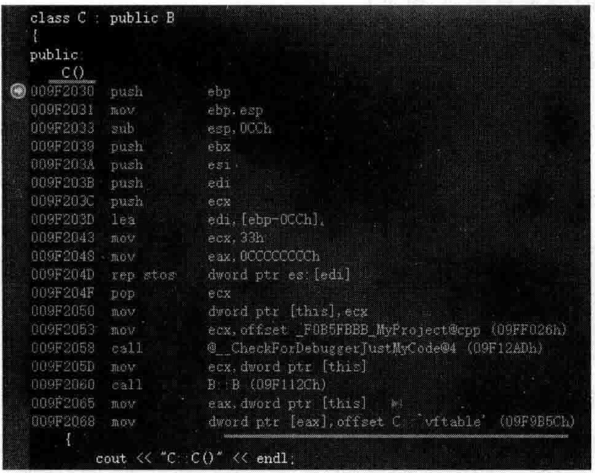
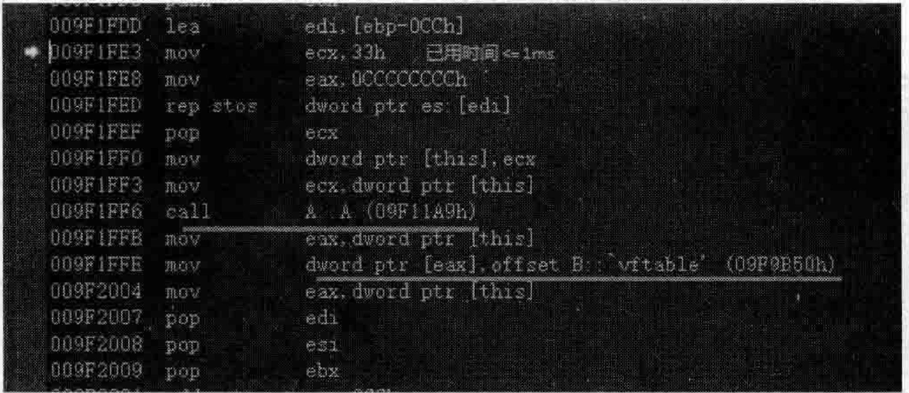
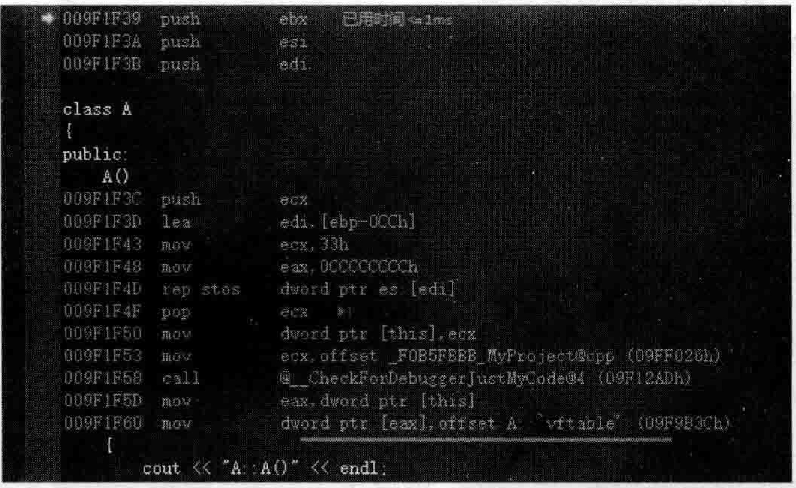

# 5.9函数调用与继承关系性能  

## 5.9.1函数调用中编译器的循环代码优化  

编译器内部的实现非常复杂，而且各个编译器的开发商所开发的编译器也各不相同，有些编译器很智能，编译出来的程序执行起来很快，有些编译器不够智能，即便是相同的代码，编译出来的可执行程序，执行起来也可能不那么快。  

举一个范例，看一看编译器在处理一些代码时的处理速度问题。这里就以VisualStudio2019编译器为例，在MyProject.cpp的上面，增加如下代码行：  

``` cpp
__int64  mytest(int mv)  
{  
    int i = 0;  
    __int64 icout = 0;  
    for (int i = 1; i <= 1000000; i++)  
    {  
       icout += 1;  
       if (i == 10000 && mv == 999)  
       {  
          printf("---\n");  
       }  
    }  
    return icout;  
}
```

在main主函数中，加人如下代码：  

``` cpp
clock_t start, end;  //记得包含头文件#include <ctime>  
__int64 mycount = 1;  
start = clock();  
for (int i = 1; i <= 1000; i++)  
{  
    mycount += mytest(6);         //参数如果是固定值，那么就很快，参数如果是一个i可变值就很慢  
}  
end = clock();  
cout << "用时(毫秒):" << end - start << endl;  
cout << "mycount = " << mycount << endl;
```

执行起来，看一看结果：  

``` cpp
用时（毫秒）：2695
mycount = 1000000001
```
出现上述的运行结果，大概需要2s。  

在VisualStudio2019（其他VisualStudio版本也类似）下，编译出来的可执行文件一般都分Debug版本和Release版本。在Debug版本，编译器会往里插人很多信息用于程序调试目的，而Release版本是发布版（一般用于商业环境中实际使用），编译器不会插人调试信息，而且还会进行优化，执行效率一般比较高。  

一般来讲，在VisualStudio2019开发和执行程序时用的都是Debug版本，这样生成的可执行文件就是Debug版本的可执行文件，如果要切换成Release版本，可以在VisualStudio2019的上面寻找一个下拉列表，如图5.50所示。  

  
图5.50可执行程序的Debug和Release版本切换下拉列表  

在图5.50所示的下拉列表中，选择Release选项即可。再次用 $_{\mathrm{CrI+F5}}$ 快捷键（“调试” $\rightarrow$ “开始执行（不调试）”命令）来执行程序，此时系统会编译、连接、生成Release版本的可执行程序并开始执行。看一看执行结果：  

``` cpp
用时（毫秒）：1
mycount = 1000000001
```

多执行几次会发现，用时要么是 $\mathrm{0ms}$ ，要么是1ms，用时非常短。试想一下，就算是运行再快，毕竞数亿次循环只用 $1\mathrm{ms}$ ，也是不可能的。  

观察一下代码在main主函数中，for循环中的mycount $+=$ mytest（6）；语句行，因为mytest里的参数是一个固定值6，所以估计整个for循环在运行时有可能被编译器直接优化成一条语句：  

``` cpp
mycount += 循环1000次的和值：  
```

而对于mytest这个函数，其中也有一个for循环，编译器也可能对其进行优化，编译器可能会把这种循环求和的语句整个优化成一条语句：  


``` cpp
icout +=循环1000000次的累计值；
```

所以，通过观察感觉编译器很智能，它可能做了两件事：  

（1）优化循环，把循环优化成1条语句。  

（2）在编译期间，编译器也是具有运算能力的，有些运算编译器在编译期间就替程序员完成了。  

现在修改一下main主函数中的代码行mycount $+=$ mytest（6）；，把这个数字6变成变量i：  

``` cpp
mycount += mytest(i); //参数如果是固定值，那么就很快，参数如果是一个i可变值就很慢
```

执行起来，看一看结果：  

``` cpp
用时（毫秒）：323
mycount = 1000000001
```

通过结果可以看到，它的运行时间突然变成了300多毫秒。说明这个修改使编译器的优化能力失效了，编译器将这种参数固定的函数调用视为一种不变的表达式，编译器会尝试做计算，尝试做优化来取消循环。结果这一修改，参数发生改变，这种情况下编译器就没法做循环优化了。  

将上面的代码恢复一下，将mycount $+=$ mytest（i）；恢复回mycount $\mp=$ mytest(6);。  

现在修改mytest函数，在其for循环中，增加几行代码。增加代码后的mytest函数如下：  

``` cpp
__int64  mytest(int mv)  
{  
    int i = 0;  
    __int64 icout = 0;  
    for (int i = 1; i <= 1000000; i++)  
    {  
       icout += 1;  
       if (i == 10000 && mv == 999)  
       {  
          printf("---\n");  
       }  
    }  
    return icout;  
}
```

执行起来，看一看结果：  

``` cpp
用时（毫秒）：382
mycount = 1000000001
```

从结果中可以看到，执行时间也显著上升，可以认为，增加了这行printf语句，导致编译器没法优化这个for循环，从而使执行时间迅速上升。  

## 5.9.2继承关系深度增加，开销也增加  

很多情况下随着继承深度的增加，开销或者说执行时间也会增加，这比较好理解，看看如下范例。在MyProject.cpp的上面，增加如下代码行：  

``` cpp
class A  
{  
public:  
    A()  
    {  
       cout << "A::A()" << endl;  
    }  
};
  
class B :public A  
{  
public:  
};  
  
class C : public B  
{  
public:  
    C()  
    {  
       cout << "C::C()" << endl;  
    }  
};
```

在main主函数中，加人如下代码行：

``` cpp
C c;  
```
执行起来，看一看新加人的代码的结果：  

``` cpp
A::A()
C::C()
```
通过前面章节知识的学习，读者想必已经非常清楚，因为类A有一个构造函数，类C的构造函数为了调用类A的构造函数，必须生成一个类B的构造函数，然后在类B的构造函数中增加调用类A构造函数的代码。  

将断点设置在类C构造函数的函数体中，开始调试（注意将图5.50中的Release版本切换回Debug版本，否则调试可能不正常），当程序执行停到断点行时，切换到反汇编窗口，如图5.51所示。  

  
图5.51编译器向类C的构造函数中插人调用类B构造函数的代码  

在图5.51中可以看到，编译器向类C的构造函数中插人调用类B构造函数的代码，图中显示的0B3112Ch应该就是类B构造函数的地址，在反汇编窗口左上角输人这个地址（0x0B3112C）并按Enter键去看一下，如图5.52所示。  

  
图5.52-观察编译器生成的类B构造函数中的代码  

在图5.52中又显示了一个impB：：B（跳转）语句，后面圆括号中显示的地址是0B31F70h，继续在反汇编窗口左上角输人这个地址（0x0B31F70）并按Enter键，如图5.53所示。  

在图5.53中不难看到，类B的构造函数中插人了调用类A构造函数的代码，所以函数调用比较多，性能上必然要差一些，而且继承关系深度越深，开销就越大。  

下面再看一看多重继承导致开销的增加。在MyProject.cpp的上面，增加A1类的定义：  

``` cpp
class A1  
{  
public:  
    A1()  
    {  
       cout << "A1::A1()" << endl;  
    }  
  
};
```

  
图5.53B类的构造函数中插入了调用A类构造函数的代码  

现在让类B同时继承自类A和A1：  

``` cpp
class B :public A, public A1  
{  
public:  
};
```
执行起来，看一看结果：  

``` cpp
A: : A( )
A1 :: A1( )
C: :C( )
```

从结果可以看到，多重继承又会去调用第二个基类的构造函数，所以显然也是会增加运行开销的。  

## 5.9.3继承关系深度增加，虚函数导致的开销增加  

为了方便演示，先把类B的多重继承去掉，恢复成类B只继承自类A：  

``` cpp
class B :public A  
{  
public:  
};
```

读者已经知道，虚函数的存在会导致编译器产生虚函数表，在多态中调用虚函数时，是要通过虚函数表寻找并调用虚函数的，这肯定会增加调用开销。  

再进一步思考一下，每个类对象会有一个虚函数表指针，在执行类的构造函数时，编译器会往这个构造函数中增加用于给虚函数表指针赋值的代码，所以每多一层继承关系，就会多执行一次对虚函数表指针赋值的代码。  

例如，在类A（不是类A1，不要加错位置）中增加一个public修饰的虚函数：  

``` cpp
public:  
    virtual void myvirfunc() {}
```
在main主函数中，增加如下代码行：

``` cpp
C * pc new C();
```
将断点设置在C构造函数所在行，开始调试，当程序执行停到断点行时，切换到反汇编窗口，如图5.54所示。  

从图5.54中可以看到，C类的构造函数中被插人了给虚函数表指针赋值的代码。此时，可以通过快捷键F10和F11往下执行，直接进入到B：：B中去观察汇编代码，如图5.55所示。  

从图5.55中可以看到，B类的构造函数中被插人了给虚函数表指针赋值的代码。同时还看到了调用A类构造函数的代码。通过快捷键F10和F11往下执行，直接进人到A：：A中去观察汇编代码，如图5.56所示。  

从图5.56中可以看到，A类的构造函数中被插人了给虚函数表指针赋值的代码。  

  
图5.54C类的构造函数中插人了给虚函数表指针赋值的代码  

  
图5.55B类的构造函数中插人了给虚函数表指针赋值的代码  

  
图5.56A类的构造函数中插人了给虚函数表指针赋值的代码  

以上看到了在继承层次体系中，会多次执行这种给虚函数表指针vptr赋值的语句，继承的深度越深，开销越大。同样，也可以推断出，如果是多重继承，也一样会因为虚函数的引人进一步增加开销，因为又多了虚函数表，又多了虚函数表指针等。这些知识前面都学习过，在这里就不多谈了。  

本节主要是想强调，函数的调用、有虚函数的存在、继承深度加深、存在多重继承等情况时，都会对程序的性能有影响。