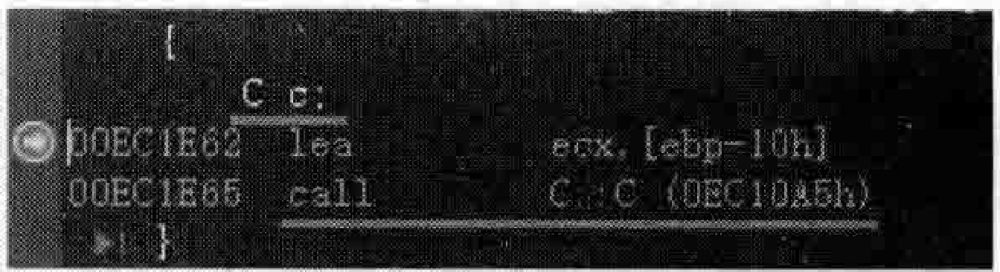
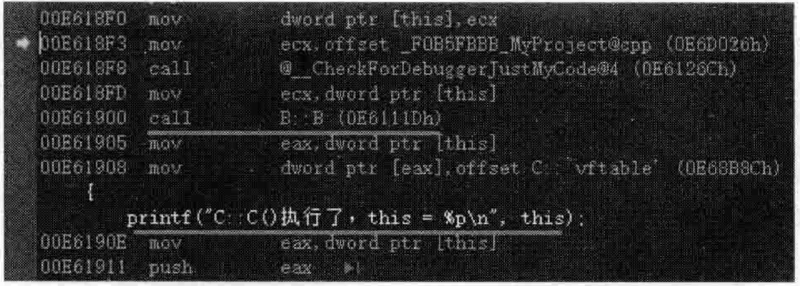
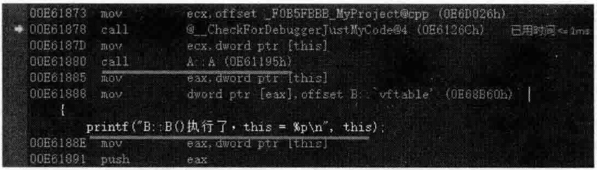
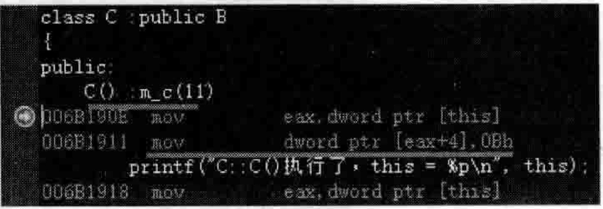
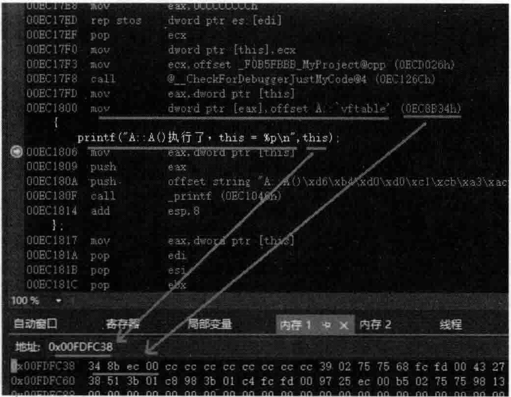
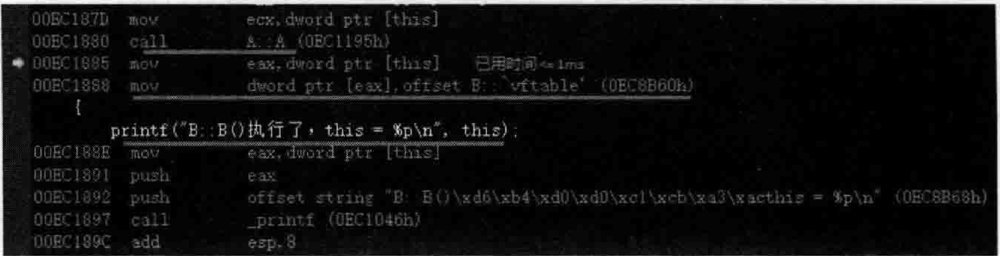
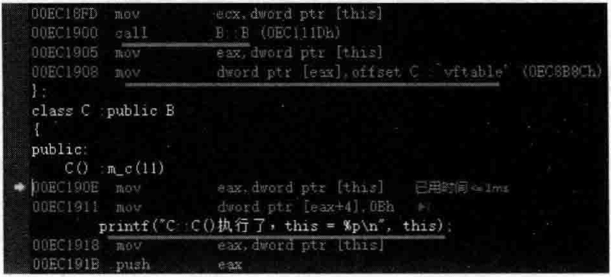
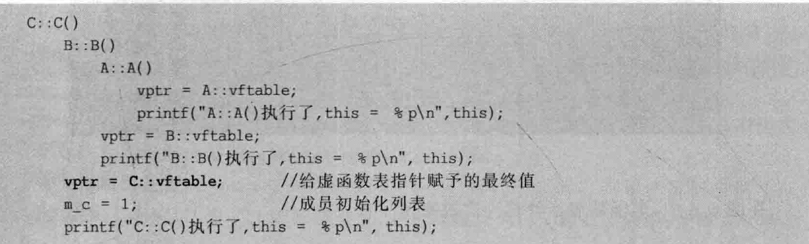
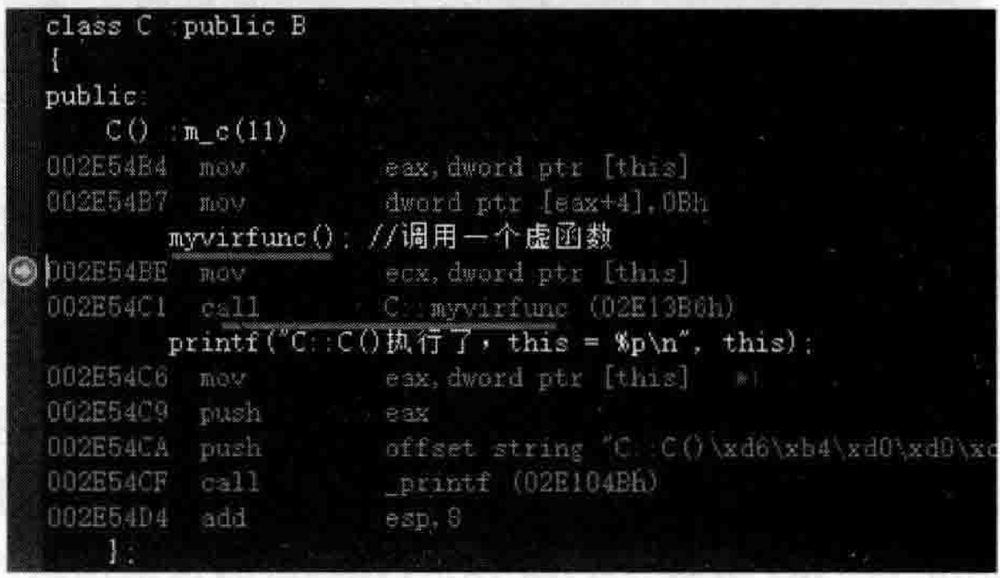
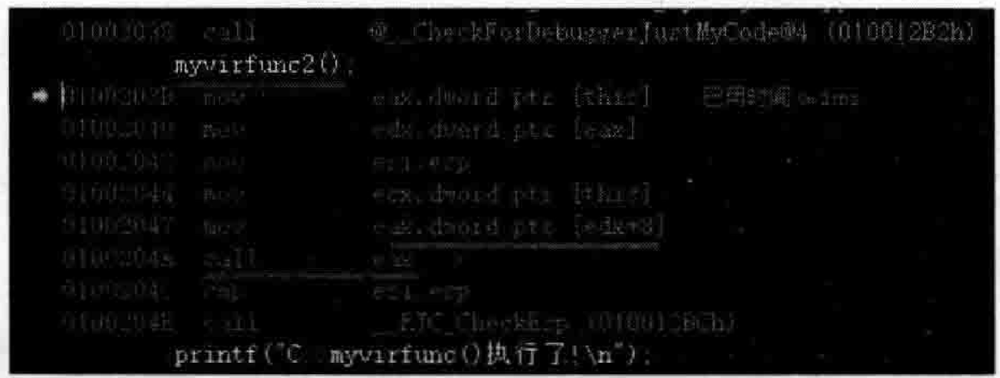

# 6.1.继承体系下的对象构造  

## 6 对象构造语义学  

本章对对象的构造、析构进行了细致的讲解，尤其是在有类继承层次的情况，对于父类子对象的构造和析构顺序进行了重点的说明和强调。  

对象的复制和析构行为，也是本章的讨论重点。  

此外，局部和全局对象、局部静态对象、临时对象等的构造和析构过程，本章都有详细 阐述。  

---

## 6.1.1 对象的构造顺序  

对象的构造，简而言之是：从父类到子类，从根源到末端。后面会详细解释。  

在进行范例演示之前，请先将图5.70设置的内联函数扩展设置回“默认值”，以免影响后续的代码调试和观察。  

在MyProject.cpp的上面，增加如下代码行：  

``` cpp
class A  
{  
public:  
    A()  
    {       
       printf("A::A()执行了，this = %p\n",this);  
    };  
    virtual ~A() {}  
  
};  
class B : public  A  
{  
public:  
    B()  
    {  
       printf("B::B()执行了，this = %p\n", this);  
    };  
    virtual ~B() {}  
};  
class C :public B  
{  
public:  
    C() 
    {  
       printf("C::C()执行了，this = %p\n", this);  
    };  
    virtual ~C()  { }
```

在main主函数中，加入如下代码行：

``` cpp
C c;
```

执行起来，看一看结果：  

``` cpp
A::A()执行了,this=0075FE8C 
B::B()执行了，this=0075FE8C 
C::C()执行了，this=0075FE8C
```

将断点设置在Cc：代码行，开始调试，当程序执行停到断点行时，切换到反汇编窗口，如图6.1所示。  

从图6.1中不难看出，对于构造一个C类对象，首先调用的是C类的构造函数C：：C。按F11键跟进C：：C构造函数，并按F10键逐行向下执行，如图6.2所示。  

  
图6.1创建一个类对象时观察对构造函数调用的反汇编代码  

  
图6.2在执行对象的构造函数体之前会先执行父类的构造函数  

观察图6.2，构造函数C：：C被编译器插人了很多代码，所以，在其执行的过程中，是先去执行构造函数B：：B，然后才执行程序员所写的构造函数C：：C的函数体代码。这一点务必要搞清楚执行顺序。  

按F11键跟进B：：B构造函数，并按F10键逐行向下执行，如图6.3所示。  

  
图6.3在执行对象的构造函数体之前会先执行父类的构造函数  

观察图6.3，构造函数B：：B同样被插人了很多代码，所以，在其执行的过程中，是先去执行构造函数A：：A，然后才执行程序员所写的构造函数B：：B的函数体代码。  

所以，最终函数的调用关系应该如下（被调用的语句行以缩进形式表示）：  

``` cpp
C::C()
	B::B()
		A::A()
		    printf("A::A()执行了，this = %p\n", this);
		printf("B::B()执行了，this = %p\n", this);
    printf("C::C()执行了，this = %p\n", this);
```

这个调用关系和程序执行得到的结果一致。现在为C类增加一个public修饰的成员变量：  

``` cpp
public:  
    int m_c;
```
然后为C类的构造函数增加初始化列表。现在C类的构造函数的代码如下：  

``` cpp
public:  
    C() :m_c(11)  
    {  
       printf("C::C()执行了，this = %p\n", this);  
    };
```
可以把断点行设置在C类内的C（）：mc（11）代码行（去掉其他断点行），开始调试，当程序执行停到断点行时，切换到反汇编窗口，如图6.4所示。  

在图6.4中，注意观察构造函数初始化列表中的 $\mathrm{m\_c(11)}$ 所在的执行位置，对应的汇编代码mo vd word ptr[eax+4],oBh。  

  
图6.4注意观察构造函数初始化列表中的代码行在哪里运行  

此刻，最终函数的调用关系应该如下：  


``` cpp
C::C()
	B::B()
		A::A()
		    printf("A::A()执行了，this = %p\n", this);
	    printf("B::B()执行了，this = %p\n", this);
    m_c = 1; // 成员初始化列表
    printf("C::C()执行了，this = %p\n", this);
```

从调用关系不难看出，先执行B类构造函数的函数体，再执行A类构造函数的函数体，再执行C类的初始化列表中的代码，最后执行C类构造函数的函数体。  

可以看到，对象c的构造的顺序是：从父类到子类，从根源到末端。父类的构造函数最先执行.所以要认识到，父类构造函数执行的时候，子类的实体还没有被构造出来，也就是说，在C类构造函数的函数体代码执行完毕之前，这个C类对象还不是一个完整的对象，当执行完其中的A类构造函数时，只能说这个A类子对象构造完毕，然后B类构造函数执行完毕，代表着B类子对象构造完毕，最终C类构造函数执行完毕，整个C类对象构造完毕，因为C类对象是包含A类子对象和B类子对象的。  

## 6.1.2虚函数  

根据前面程序执行的结果，三个this指针值输出的结果都相同。C对象中包含着B子对象，B子对象中又包含着A子对象。  

另外，类A、B、C都包含虚析构函数，那么，在各个类的构造函数中，一定有给虚函数表指针赋值的代码被编译器插人进来，看一看它们在哪里。  

再次将断点设置在main主函数中的Cc；代码行，开始调试，当程序执行停到断点行时，切换到反汇编窗口，按F11键跟踪进去，一直跟踪到A：：A构造函数中，如图6.5所示。  

  
图6.5A：：A构造函数的反汇编代码  

在图6.5中，首先看到的是给虚函数表指针赋值的语句（这是编译器插人的语句，注意插入的位置是在A：：A构造函数的函数体代码之前）：  

```cpp
mov dword ptr [eax], offset A::`vftable` (0ECHB34h)
```

上面这个赋值其实比较有意思，因为定义的是C类对象，所以该对象的虚函数表指针肯定是要指向C类的虚函数表，这里赋值后指向的却是A类的虚函数表。类似于如下：  

``` cpp
vptr A: vftable;
```

不过并没有关系，后续还会有给vptr重新赋值的语句。

接着执行了程序员书写的printf语句，输出了this指针：  


``` cpp
printf（“A：：A（）执行了，this = *p\n”，this）；
```

前面说过，执行完这条printf语句时，能拿到this地址了，但这个时候对象还没构造完只是构造出了A类子对象。  

继续向下跟踪汇编代码，从A：：A构造函数返回，就回到了B：：B构造函数中，如图6.6所示。  

  
图6.6 B：：B构造函数的反汇编代码  

在图6.6中，虚函数表指针再一次被赋值了

``` cpp
mov dword ptr [eax],offset B: :vftable' (OEC8B60h)
```

这次赋值就把上次的vptr值覆盖了，但遗憾的是，这次赋值是让vptr指向B类的虚函数表。类似于如下：  

``` cpp
vptr =B: vftable;
```

显然这也不对，没有关系，后续还会有给vptr重新赋值的语句。

接着执行了程序员书写的printf语句，输出了this指针：  

``` cpp
printf("B::B()执行了，this = %p\n", this);
```

这个时候对象还是没构造完，这里又构造出了B类子对象。  

继续向下跟踪汇编代码，从B：：B构造函数返回，就回到了C：：C构造函数中，如图6.7所示。  

  
图6.7C：：C构造函数的反汇编代码  

在图6.7中，虚函数表指针第三次被赋值：


``` cpp
mov dword ptr [eax], offset C: :"vftable' (0EC8B8Ch)
```

这次赋值就把上次的vptr值覆盖了，同时，这次对vptr的赋值也是vptr的最终值。类似于如下：  

``` cpp
vptr = C::vftable;
```

接着执行了程序员书写的printf语句，输出子this指针：  

``` cpp
printf("C::C()执行了，this = %p\n", this);
```

此刻，最终函数的调用关系应该如下：  

  

上面这种调用顺序就能够保证，构造出来的对象的虚函数表指针vptr最终指向的是类C的虚函数表。所以，千万不要在构造函数内程序员自己的代码中使用诸如memcpy或者直接操作内存等手段，去覆盖虚函数表指针这4个字节的内存内容，不然程序通过虚函数表来调用虚函数时就可能造成程序运行崩溃。  

## 6.1.3一构造函数中对虚函数的调用  

如果在构造函数中调用虚函数，会是什么样的情形呢？改造一下程序。在类A中，加人如下public修饰的虚函数：  

``` cpp
public:  
    virtual void myvirfunc()   
    {  
       printf("A::myvirfunc()执行了!\n");  
    };
```

在类B中，也加人类似的虚函数，只是printf的内容发生了变化：  

``` cpp
public:  
    virtual void myvirfunc()  
    {  
       printf("B::myvirfunc()执行了!\n");  
    };
```

在类C中，也加人类似的虚函数，只是printf的内容发生了变化：  

``` cpp
public:  
    virtual void myvirfunc()  
    {  
       printf("C::myvirfunc()执行了!\n");  
    };
```

在main主函数中，注释掉原有的代码，加人如下新代码：  

``` cpp
C* mycobj = new C();  
mycobj->myvirfunc();
```

从代码实现上，mycobj $->$ myvirfunc（）；显然是多态，因为是通过虚函数表查询虚函数并执行。  

不知读者是否想过，如果在C类的构造函数中增加代码来调用myvirfunc虚函数，会怎样呢？修改类C的构造函数：  

``` cpp
C() :m_c(11)  
{  
    myvirfunc(); //调用一个虚函数  
    printf("C::C()执行了，this = %p\n", this);  
};
```

想一想，C类构造函数中针对myvirfunc虚函数的调用，调用的是哪个类的myvirfunc虚函数呢？因为现在的情况是，C类对象还没构造完整，而且A、B、C三个类都有同名的my vi rf unc。  

不难发现，如果是在某个类的构造函数中调用一个虚函数，那么并不通过虚函数表来调用。编译器的做法是：在构造函数中调用的虚函数从所在类往根类回溯，逐次找这个虚函数，找到哪个，就直接调用（静态方式调用）哪个虚函数，而不是通过虚函数表来调用虚函数。这是 $\mathrm{C++}$ 语言的一个规则，编译器做了这种决议，可以尝试着想一想做这种决议的原因：估计原因可能是在构造函数中调用虚函数时，该对象还没有构造完整，因此不宜采用虚函数表机制调用虚函数，迫使编译器做出这种直接调用虚函数的决定。  

但笔者认为，如果单纯从调用虚函数的角度来讲，虚函数表指针vptr此时（在构造函数函数体内）有有效值了，所以通过虚函数表调用虚函数也应该是安全的，虽然这里是安全的，但试想如果在类 B 的构造函数中也调用了 myvirfunc 虚函数，若通过虚函数表来调用虚函数，调用的会是哪个虚函数呢？不要忘记此时的虚函数表指针vptr指向的可是B类的虚函数表（vptr = B：：vftable；），还没有最终指向C类的虚函数表指针（vptr = C：：vftable；）若通过虚函数表来调用虚函数，类B构造函数调用的myvirfunc肯定是类B中的myvirfunc。另外，如果这个虚函数里用到了一些成员变量，那么这些成员变量要保证先在构造函数中被初始化了，这样才能安全地在虚函数中调用。

总之，最终在C类构造函数中调用myvirfunc虚函数，调用的是C类的myvirfunc虚函数，并且是直接调用（虚函数有真实地址，可以直接调用）。  

将断点设置在C类构造函数的myvirfunc（）；代码行，开始调试，当程序执行停到断点行时，切换到反汇编窗口，如图6.8所示。  

  
图6.8C：：C构造函数中调用虚函数会直接进行调用而不是通过虚函数表  

现在往类A、B、C中再增加一个myvirfunc2虚函数。

在类A中，加人如下public修饰的虚函数：  

``` cpp
public:  
    virtual void myvirfunc2()  
    {  
       printf("A::myvirfunc2()执行了!\n");  
    };
```

在类B中，也加人类似的虚函数，只是printf的内容发生了变化：  

``` cpp
public:   
    virtual void myvirfunc2()  
    {  
       printf("B::myvirfunc2()执行了!\n");  
    };
```
在类C中，也加入类似的虚函数，只是printf的内容发生了变化：  

``` cpp
public:  
    virtual void myvirfunc2()  
    {  
       printf("C::myvirfunc2()执行了!\n");  
    };
```

在每个类的myvirfunc虚函数中的第一行都增加调用myvirfunc2虚函数的代码：  

``` cpp
myvirfunc2（）;  
```

断点依l旧设置在类C构造函数的myvirfunc（）；代码行，开始调试，当程序执行停到断点行时，切换到反汇编窗口，按F11键跟踪进人到C类的myvirfunc函数中去，如图6.9所示。  

  
图6.9C：：C构造函数中调用虚函数，在该虚函数中调用另外一个虚函数  

从图6.9中可以看到，对myvirfunc2虚函数的调用确实是通过虚函数表来进行的（而不是直接调用。看来，只有在构造函数中出现的虚函数才会获得被直接调用的待遇），这就是编译器的做法。当然，如果通过虚函数表来调用虚函数，那么就一定要注意当前的虚函数表指针指向的是哪个虚函数表（因为在构造类C对象的过程中，虚函数表指针被赋值了3次）：指向哪个类的虚函数表，调用的就是哪个类对应的虚函数（读者可以试试，在类B的构my vi rf unc，my vi rf unc my vi rf unc 2，my vi rf unc 2虚函数表调用，而且调用的是B类的myvirfunc2虚函数）。  

总结：笔者建议，不要在类的构造函数中调用虚函数，这个结论同样适合类的析构函数一一不要在类的析构函数中调用虚函数。遵循这些规则，能够开发出更加健壮的应用程序。在开发的过程中，笔者建议，当遇到有可能是陷阱的地方（自已对程序的某些写法有怀疑或者疑虑的时候），尽量绕开不去触碰，也是很好的解决问题之道。  

上面分析了多层次继承时构造函数的执行步骤，有虚函数夹杂在类中的时候虚函数表指针的初始化时机，以及有初始化列表时初始化列表的执行时机。有了这些知识作为基础，以后面临更复杂的继承结构（如虚基类）掺和进来时，就可以自行进行深人分析。同时，掌握了这些知识，也能避免无意中写出一些错误的代码。  

如果读者有兴趣进一步深人挖掘，笔者就把虚基类夹杂虚函数这种继承体系下的对象构造的步骤流程留给读者去探索，因为道理都是相通的，可能分析的步骤要烦琐一些，这里笔者就不对这种情况进行额外的分析，因为已经没有太多的新知识了。