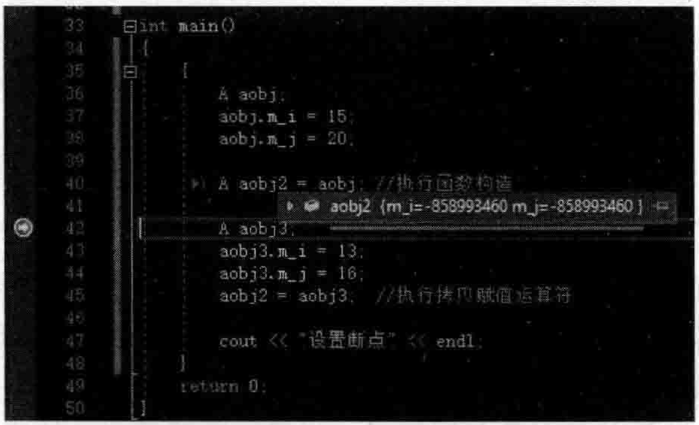
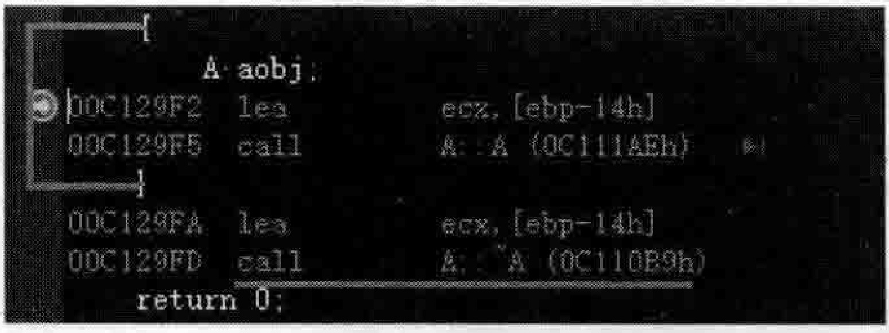
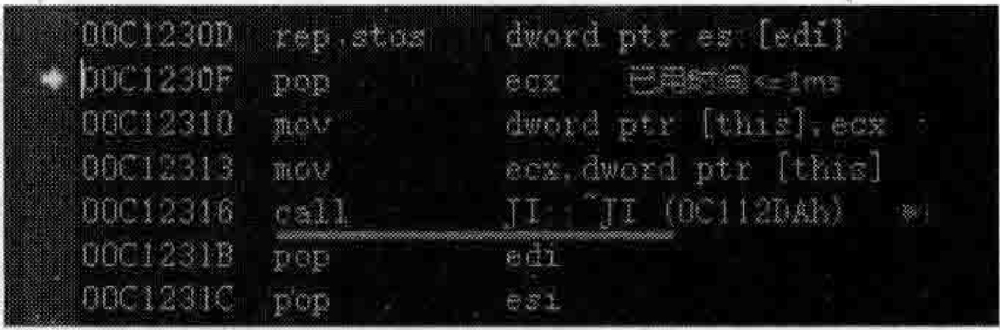
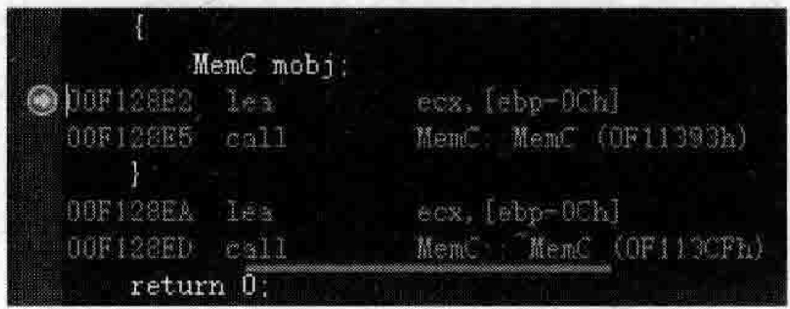
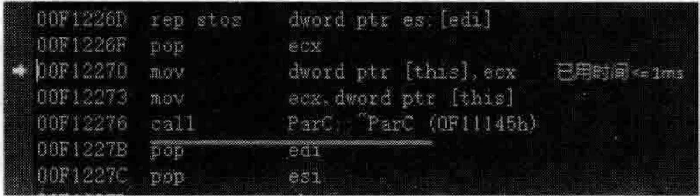
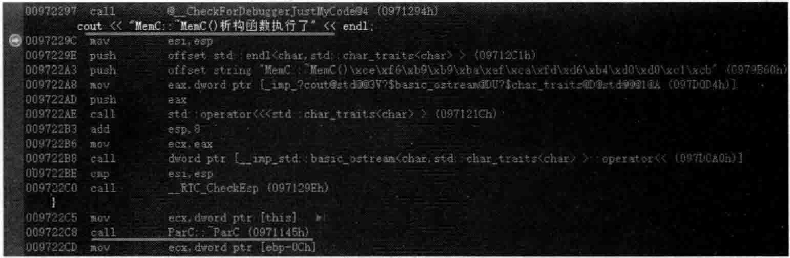
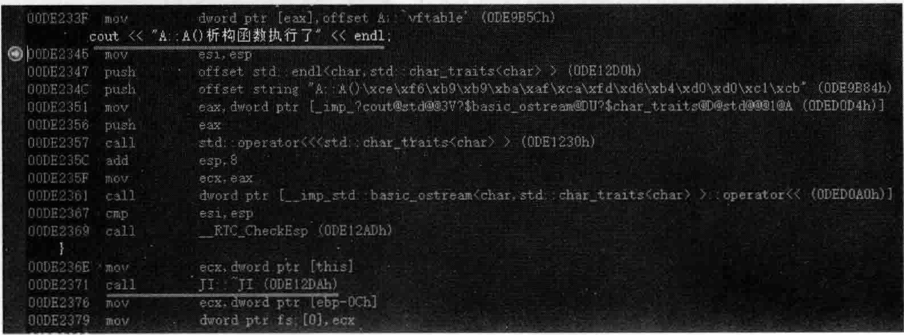

# 6.2：对象复制语义学与析构函数语义学  

## 6.2.1对象的默认复制行为  

在MyProject.cpp的上面，增加如下代码行：  

``` cpp
class A  
{  
public:  
    int m_i, m_j;
};
```

在main主函数中，增加如下代码：  

``` cpp
A aobj;  
aobj.m_i = 15;  
aobj.m_j = 20;  
  
A aobj2 = aobj; //执行拷贝构造  
  
A aobj3;  
aobj3.m_i = 13;  
aobj3.m_j = 16;  
aobj2 = aobj3;  //执行拷贝复制运算符
```

设置断点并调试观察，代码执行后不难发现，Aaobj $2=$ aobj；代码行可以把aobj对象的成员变量值原样不动地复制到aobj2中，而aobj $2=$ aobj3；代码行可以把aobj3对象的成员变量值原样不动地复制到aobj2中。  

这说明系统有一些默认的对象复制行为。当程序员不写自己的拷贝构造函数和拷贝赋值运算符时，这些默认的对象复制行为会发挥作用。  

## 6.2.2拷贝赋值运算符与拷贝构造函数  

如果只是简单的复制操作，那么对象默认的复制行为可能就够了，而且对象默认的复制行为执行效率也高（编译器不需要额外调用程序员所写的代码）。既然够了，程序员就没必要提供目已的拷贝构造函数和拷贝赋值运算符。  

这种对象默认的复制行为如果不安全或者不正确，那么就需要程序员自己书写拷贝构造函数和拷贝赋值运算符，例如在构造对象的时候需要new一块内存空间来做一些事情（如2.8.3节所说的深拷贝问题）。  

现在看一看程序员自己书写的拷贝构造函数和拷贝赋值运算符。在类A中增加如下代码：  

``` cpp
public:  
    A& operator=(const A& tmp)  
    {  
       cout << "A::operator=(const A&)拷贝赋值运算符执行了" << endl;  
       return *this;  
    }  
    A(const A& tmptime)   
    {  
       cout << "A::A(const A&)拷贝构造函数执行了" << endl;  
    }
``` 

如果现在编译项目，会出现错误提示，因为程序员提供了拷贝构造函数，导致编译器不会生成“合成默认构造函数”，那么Aaobj；、Aaobj3；这些代码行就会报语法错。这需要程序员为类A定义一个默认构造函数。代码如下：  

``` cpp
public:  
    A()  
    {  
       cout << "A::A()缺省构造函数执行了" << endl;      
    }
```

现在，将断点设置在Aaobj3；代码行，开始调试，当程序执行停到断点行时，将鼠标放在aobj2上，观察代码行Aaobj2 $\equiv$ aobj；的执行结果，如图6.10所示。  

  
图6.10拷贝构造对象  

在图6.10中发现了问题，在执行了代码行Aaobj2 $\boldsymbol{\mathbf{\rho}}_{\perp}=$ aobj；之后，aobj2对象里成员变量的值都不正常了。这是因为程序员提供了自己的拷贝构造函数和拷贝赋值运算符取代了系统缺省的对象复制行为，那么，程序员就必须要在书写的拷贝构造函数和拷贝赋值运算符中增加给对象成员有效值的代码。  

完善类A的拷贝赋值运算符和拷贝构造函数：  

``` cpp
public:  
    A& operator=(const A& tmp)  
    {  
       m_i = tmp.m_i;  
       m_j = tmp.m_j;  
       cout << "A::operator=(const A&)拷贝赋值运算符执行了" << endl;  
       return *this;  
    }  
    A(const A& tmptime)   
    {  
       m_i = tmptime.m_i;  
       m_j = tmptime.m_j;  
       cout << "A::A(const A&)拷贝构造函数执行了" << endl;  
    }
```

再次运行程序并设置断点进行观察，一切正常，无论拷贝构造对象还是对对象进行赋值，都可以得到正确的结果。  

## 6.2.3如何禁止对象的拷贝构造和赋值  

如果在实际工作中，遇到了不希望对象被拷贝构造和被赋值的需求，怎么办呢？  

(1)只需要在类A定义中把拷贝赋值运算符和拷贝构造函数私有起来，只声明，不需要写函数体。代码如下：  

``` cpp
private:  
    A& operator=(const A& tmp);  
    A(const A& tmptime);
```

（2）也可以利用 $\mathrm{C++-11}$ 新标准中引人的语法： $=$ delete；，直接把拷贝赋值运算符和拷贝构造函数标记为禁用。代码如下：  

``` cpp
public:  
    A& operator=(const A& tmp) = delete;  
    A(const A& tmptime) = delete;
```

## 6.2.4析构函数语义  

### 1.析构函数被合成  

通常来讲，如果一个类中不写析构函数，那么生成的目标文件中也不会有该类的析构函数。  

针对现在的范例，可以编译一下并查看目标文件中是否有析构函数 $\sim\!\mathrm{A}$ ，查看方法在2.4节已经介绍过（使用dumpbin将.obj目标导出成.txt文本文件查看）。实际情况是无法找到析构函数 $\sim\!\mathrm{A}$  

那么，什么情况下编译器会为类合成出一个析构函数呢？  

（1）如果当前类继承一个基类，基类带析构函数，那么编译器就会为当前类合成出一个析构函数。这个析构函数的存在意义是因为它要调用基类的析构函数。  

在MyProject.cpp的上面，类A定义的前面，增加如下新类JI：  

``` cpp
class JI  
{  
public:  
    virtual ~JI()   
    {  
       cout << "JI::~JI()析构函数执行了" << endl;  
    }  
};
```

现在让类A继承自类JI：


``` cpp
class A :public JI  
{  
...
};
```
在main主函数中，注释掉原有的代码，加人如下代码行（代码行用 $\{\}$ 以尽早结束aob对象的作用域方便调试观察）：  

``` cpp
{  
    A aobj;
}
```

现在重新编译一下项目，通过dumpbin将MyProject.obj目标文件中的信息导出成.txt文件并查找，可以找到类A的析构函数 $\sim\!\mathrm{A}$  

当然，也可以设置断点来查看。将断点行设置在Aaobj；代码行，当程序执行停到断点行时，切换到反汇编窗口，如图6.11所示。  

从图6.11中不难看到，在超出了aobj的作用域后，系统会调用类A的析构函数～A。按F11键跟踪进该析构函数，如图6.12所示。  

  
图6.11超出对象aobj作用域后会调用类A的析构函数\~A  

  
图6.12-超出对象aobi作用域后会调用当前 类A以及其父类的析构函数  

在图6.12中，类A的析构函数调用了其父类JI的析构函数 ${\sim}\mathrm{II}_{0}$  

（2）如果当前类的成员变量是一个类类型成员变量，并且这个类类型带有析构函数，编译器也会为当前类合成出一个析构函数。这个析构函数的存在意义就是要调用类类型成员变量所属类的析构函数。  

在MyProject.cpp的上面，增加两个新类的定义：  

``` cpp
class ParC  
{  
public:  
    virtual ~ParC()  
    {  
       cout << "ParC::~ParC()虚析构函数执行了" << endl;  
    }  
};  
class MemC  
{  
public:  
    ParC m_j;
};
```

在main主函数中，注释掉以往代码，增加如下新代码：  

``` cpp
{  
    MemC mobj;  
}
```

重新编译一下项目，通过dumpbin将MyProject.obj目标文件中的信息导出成.txt文件并查找，就可以找到MemC类的析构函数 $\sim$ MemC了。  

同理，如果将断点设置在MemCmobj；代码行并跟踪调试，在反汇编窗口一样能够看到系统调用了类MemC的析构函数 $\approx$ MemC，如图6.13所示。  

按F11键跟踪进该析构函数，如图6.14所示。  

  
图6.13 超出对象mobi作用域后会调用 类MemC的析构函数\~MemC  

  
图6.14MemC的析构函数 $\sim$ MemC中会调用成员变量mi所属类ParC的析构函数\~ParC  

从图6.14中不难看到，当对象mobj超出了作用域后，调用了类MemC的析构函数 $\sim$ MemC，在 $\sim$ MemC析构函数中，调用了类类型成员变量 $\mathrm{m}\lrcorner\mathrm{j}$ 所属的ParC类的析构函数\~ParC。  

### 2.析构函数被扩展  

当然，如果程序员书写了自己的析构函数，自然就不需要编译器来合成了，此时编译器就帮助程序员扩展析构函数中的代码，向其中增加调用另一个相关类析构函数的代码。  

（1）先看一下如果当前类的成员变量是一个类类型成员变量，并且这个类类型带析构函数，编译器如何扩展当前类的析构函数。  

为MemC类增加一个public修饰的析构函数：  

``` cpp
public:  
    ~MemC()  
    {  
       cout << "MemC::~MemC()析构函数执行了" << endl;  
    }
```

执行起来，看一看结果：  

``` cpp
MemC:~MemC()析构函数执行了 
ParC：：～ParC（）虚析构函数执行了
```

从结果中可以看到，先执行了类MemC的析构函数，然后又执行了ParC类的析构函数，注意执行的顺序。  

可以设置断点看一下，在MemC类析构函数的函数体中设置断点，开始调试，当程序执行停到断点行时，切换到反汇编窗口，如图6.15所示。  

  
图6.15类MemC的析构函数体执行完后调用ParC类的析构函数  

从图6.15中不难看到，编译器会向MemC类的析构函数中插人调用类ParC析构函数的代码，但是代码插人的位置是在MemC类析构函数的函数体代码之后。  

（2）再看一下如果当前类继承自一个基类，基类带析构函数，那么编译器如何扩展当前类的析构函数。  

为类A增加一个public修饰的析构函数：  

``` cpp
public:  
    ~A()  
    {  
       cout << "A::A()析构函数执行了" << endl;  
    }
```

注释掉main主函数中原来的代码，增加如下代码：


``` cpp
{  
    A aobj;  
}
```
执行起来，看一看结果：  

``` cpp
A：：A（）缺省构造函数执行了
A：A（）析构函数执行了
JI：：～JI（）析构函数执行了
```

从结果中可以看到，先执行了A类的析构函数，然后又执行了JI类的析构函数，注意执行的顺序。换句话说，就是先执行该类自已的析构函数体，然后才执行父类的析构函数体。  

可以设置断点看一下，在A类析构函数的函数体中设置断点，开始调试，当程序执行停到断点行时，切换到反汇编窗口，如图6.16所示。  

  
图6.16类A的析构函数体执行完后调用JI类的析构函数  

从图6.16中不难看到，编译器会向A类的析构函数中插人调用JI类析构函数的代码，但是代码插人的位置是在A类析构函数的函数体代码之后。  

对象析构时执行析构函数的顺序与对象构造时执行构造函数的顺序正好相反，对象构造时是先执行父类的构造函数体再执行子类的构造函数体，而对象析构时是先执行子类的析构函数体再执行父类的析构函数体。  

不妨再给JI类增加一个public修饰的构造函数：  

``` cpp
public:  
    JI()  
    {  
       cout << "JI::JI()缺省构造函数执行了" << endl;  
    }
```

执行起来，看一看结果：  

``` cpp
JI：：JI（）缺省构造函数执行了
A：：A（）缺省构造函数执行了
A：：A（）析构函数执行了
JI：：～JI（）析构函数执行了
```

如果有需要，读者可以自行设置断点并跟踪调试观察。  

另外，如果引人了虚基类，那么虚基类中构造函数和析构函数的执行时机分析就留给读者自行探索。虚基类的引人，通常都会引入更多的复杂性，同时，也会对程序执行效率有一定的影响。这两点要认识清楚。