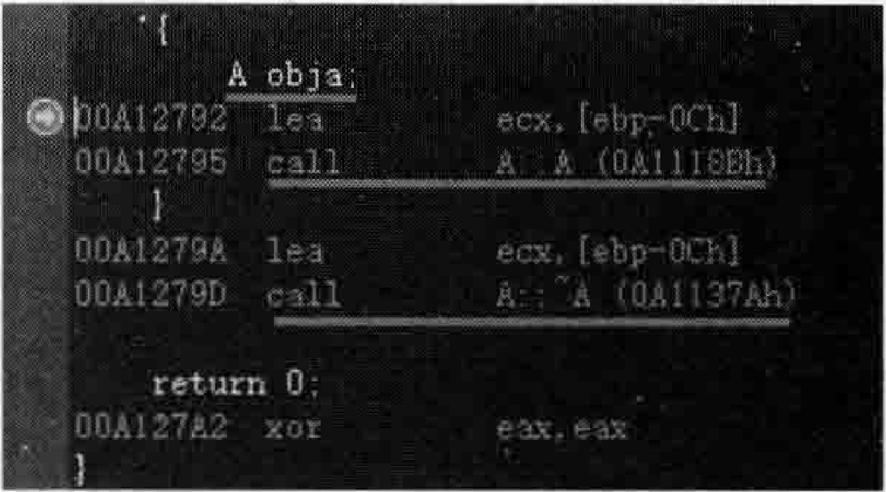
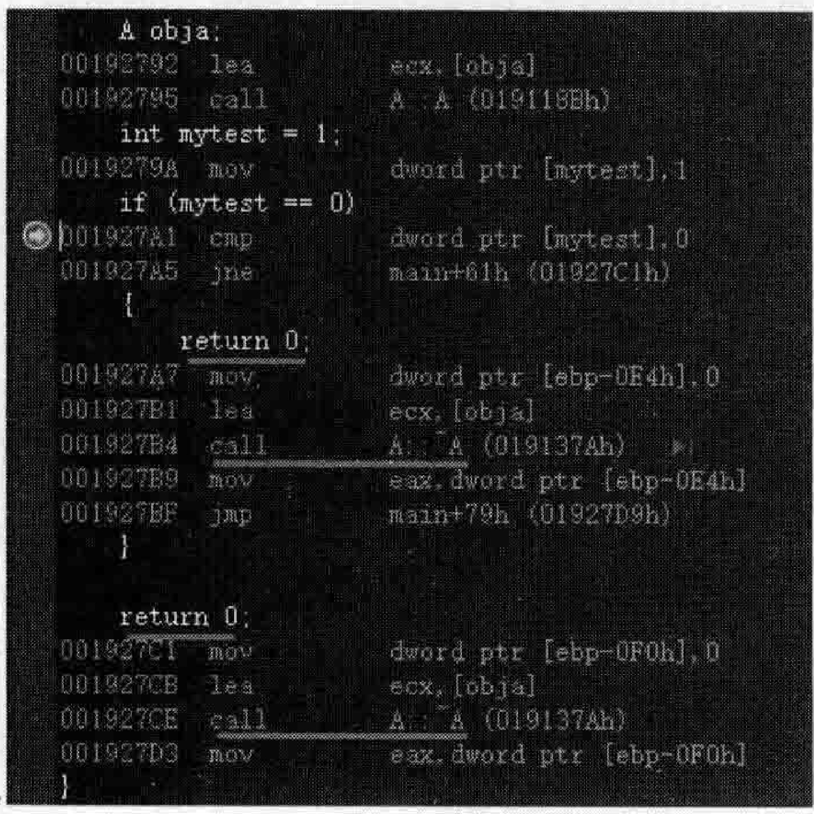
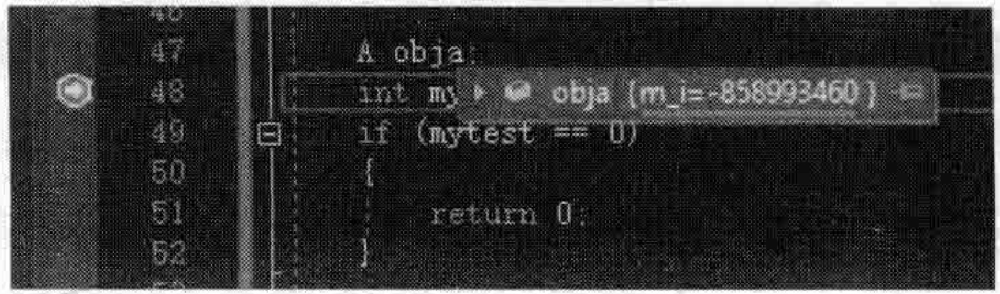
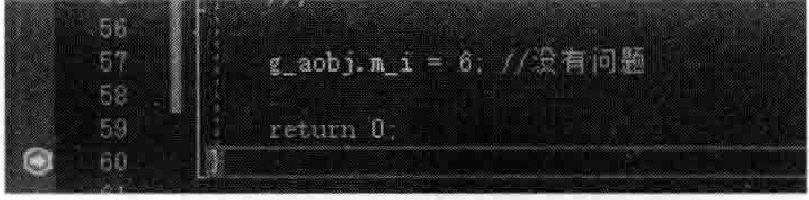
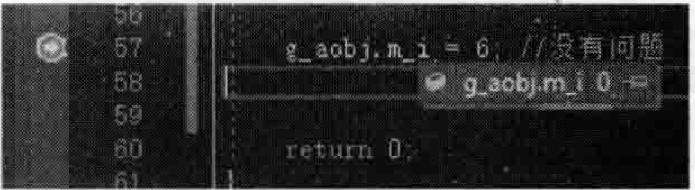
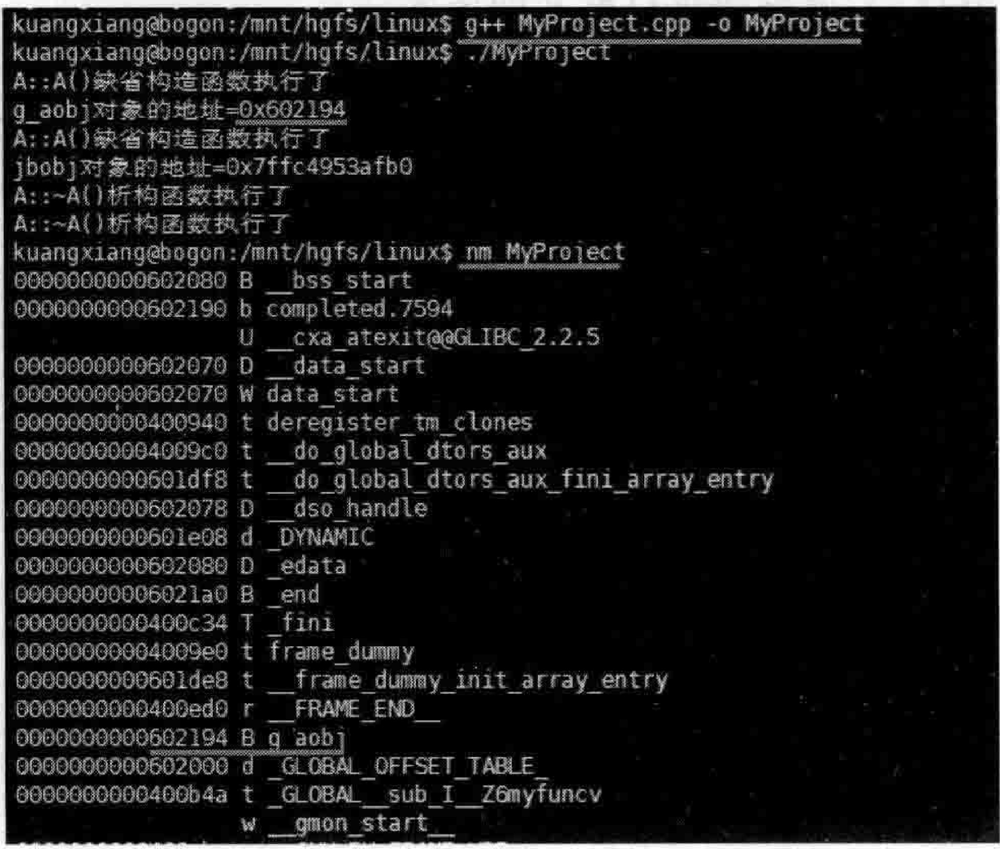

# 6.3 局部对象、全局对象的构造和析构  

## 6.3.1局部对象的构造和析构  

在MyProject.cpp的上面，增加如下代码行：  

``` cpp
class A  
{  
public:  
    A()  
    {  
       cout << "A::A()缺省构造函数执行了" << endl;  
    }  
    ~A()  
    {  
       cout << "A::~A()析构函数执行了" << endl;  
    }  
    int m_i;     
};
```

在main主函数中，增加如下代码（注意用{}将代码行括住以方便调试和观察局部对象离开作用域时的表现）：

``` cpp
{
A obja;  
}
```

将断点设置在Aobja；代码行，开始调试，当程序执行停到断点行时，切换到反汇编窗口，如图6.17所示。  

在图6.17中可以很明显地看到编译器增加的代码：在定义obja对象时，编译器帮助程序员调用了类A的构造函数，当离开obja对象作用域后，编译器帮助程序员调用了类A的析构函数。  

将main主函数中原有代码注释掉，加人全新的代码如下：  

  
图6.17查看构造和析构一个对象时编译器增加的调用构造和析构函数的代码  


``` cpp
A obja;  
int mytest = 1;  
if (mytest == 0)  
{  
    return 0;  
}
```

上面这段代码有一个if条件判断语句，当条件满足时，会执行returnO；语句，这是一条出口语句。一旦条件满足，执行了return0：就会从当前的函数中返回（对于main主函数，从当前函数中返回意味着整个程序运行的结束）。那么在返回时，对象obja就离开了其作用域，类A的析构函数是否会被调用呢？  

  
图6.18凡是函数出口的位置都会被插人调用obja对象析构函数的代码  

将断点设置在if（mytest $=0$ ）代码行，当程序执行停到断点行时，切换到反汇编窗口，如图6.18所示。  

从图6.18中可以看到，只要是任何一个main函数出口（返回）的地方，都要调用类A的析构函数用以正确释放obia对象，目前上面这段代码有两个从main函数返回的位置（一个是if条件成立后的return语句，一个是main函数执行结束时的return语句），这意味着有两次调用类A析构函数的代码生成。  

这里得到的一个结论就是：只要出了对象的作用域，编译器总会在适当的地方插人调用对象析构函数的代码。所以，编译器确实在背后为程序员做了很多事。  

通过上面的讲解可以明白一个道理，这种局部对象现用现定义，尽量把对象定义在需要立即用到它的代码段的附近（现用现定义，这也是 $\mathrm{C++}$ 和C语言的一个典型不同处），这样可以避免编译器产生不必要的对象构造和析构的代码，也可以避免编译器调用不必要的对象构造函数和析构函数。试想，如果像传统C语言那样，在函数开头就定义一个类对象则：  

（1）所有该函数的出口处，编译器都要插人对对象析构函数的调用代码。  

（2）如果因为i条件成立提前退出了该函数，则会导致该对象的析构函数被调用一次，而如果在此之前，根本就没用过该局部对象，那么对该对象析构函数的调用完全没必要。  

例如如下代码行（注意看其中的注释）：  

``` cpp
void myfunc()  
{  
    A obja; //obja定义在这里并不合适  
    if (1 == 1)  
    {  
       //这里会被编译器插入调用obja对象析构函数的代码，影响执行效率完全没必要  
       return;  
    }  
    //这里才会用到obja对象，所以obja对象定义在这里才会合适  
    obja.m_i = 10;  
    cout << "obja.m_i的值为" << obja.m_i << endl;  
    return;  
}
```

另外值得注意的是，当生成一个A类对象的时候，其成员变量 $\textrm{m}_{-}\dot{\mathbf{i}}$ 的值是随机的，程序员应该在构造函数初始化列表或者构造函数中为mi成员变量赋初值，如图6.19所示。  

  
图6.19创建一个类对象时其成员变量值随机，应在构造函数初始化列表或者构造函数中为成员变量赋初值  

## 6.3.2全局对象的构造和析构  

在main主函数的前面，定义一个全局对象：  

``` cpp
A g_aobj;
```

在上述行设置一个断点，并在main主函数的第一行代码也设置一个断点。调试时可以发现，在程序执行流程进人到main主函数之前，这个g_aobj对象就已经生成了。实际上编译器在调用main主函数之前是做了很多事情的，包括定义全局的g_aobj对象，定义这个对象时，肯定是调用了这个对象的构造函数。  

这样就可以保证这个全局对象在main主函数中可以直接使用（因为这个对象已经被构造出来了）。  

在main主函数中，注释原有的代码，加人如下新代码：  


``` cpp
g_aobj.m_i = 6;
```

上面代码行没有任何问题，可以正常执行。那么，什么时候这个全局对象会被析构掉呢？在main主函数中最后的右大括号“”所在行设置一个断点，在类A析构函数的函数体中也设置一个断点，开始调试，当程序执行停到断点行时，如图6.20所示。  

当整个main主函数执行完毕后，按F10键向下继续执行程序，才会执行到类A的析构函数来析构全局对象g_aobj。  

在4.2节讲解过进程内存空间布局，读者已经知道，全局对象（全局变量）是保存在数据段里的。前面虽然定义了这个全局对象，但是并没有给这个全局对象中的成员变量任何初值，刚才演示局部对象obja的时候，如果不给该局部对象中的 $\mathrm{m\_i}$ 成员变量初值（参考图6.19），那么mi成员值将变成一个随机值，那么全局对象呢？  

取消所有断点，将新断点设置在main主函数的gaobj. $\mathrm{m\_i=6}$ ：代码行，开始调试，当程序执行停到断点行（还没有执行该行）时，将鼠标停留在 $g_{-}$ aobj位置并观察，如图6.21所示。  

  
图6.20全局对象的析构工作在main主函数执行完毕后进行  

  
图6.21 全局对象的数值类成员变量在未给 初值的情况下会被设置为0  

从图6.21中可以看到，全局对象的成员变量（一般指数值类型成员变量）在没给初值的请况下，编译器会给一个默认值0，这是跟局部对象不同的地方。  

在4.2节也曾说过，这种全局对象的内存地址是在编译阶段确定的，每次程序执行，这些全局对象的内存地址都相同。  

在main主函数中，继续增加如下代码：  

``` cpp
printf("g_aobj对象的地址 = %p\n", &g_aobj);
A jobj;
printf("jobj对象的地址 = %p\n", &jobj);
```

执行起来，看一看结果：  

``` cpp
A：：A（）缺省构造函数执行了
g_aobj对象的地址=0041E138 
A：：A（）缺省构造函数执行了
jbobj对象的地址=00FDFE4C 
A：～A（）析构函数执行了
A：：～A（）析构函数执行了
```

多次执行，每次执行g_aobj对象的地址都相同，但jbobj对象的地址则每次执行都会不同。  

上面这段程序笔者也在Linux操作系统上编译、连接并生成了可执行文件。使用nm命令列出可执行文件中gaobi存放的位置，如图6.22所示。  

  
图6.22在Linux下使用nm命令查看全局对象g_aobj在可执行文件中分配的内存地址  

在图6.22中，注意到了如下这行：  

``` cpp
0000000000602194 B g_aobj
```

上面这行中的B表示BSS段，图4.1中曾经绘制过这个段，其中保存的数据是未初始化的全局变量、初始化为0的全局变量等。虽然程序员的代码中没有初始化该全局变量（指全局对象gaobi），但实际上，编译器会插入代码来将其成员变量初始化为0，所以在这里是将gaobi归类为初始化为0的全局变量的。在程序运行起来后，在main函数之前，就会执行到编译器插人的给全局对象所在内存的所有内容全部置0的代码，所以，如图6.20所示，在main主函数中看到的 $\mathrm{m}\_\mathrm{i}$ 成员变量的值，就已经是0了。  

现在总结一下全局对象g_aobj的初始化和释放过程：  

（1）全局对象g_aobi获得地址（全局对象的地址在可执行文件中是确定的，并且装载到内存运行的时候就直接按照这个地址来为该全局对象分配内存。所以这种全局对象分配内存和在堆、栈中分配内存不一样：堆中的内存通过delete来回收，栈中的内存只要离开变量作用域就会自动回收，而全局对象的内存在程序运行期间一直存在）。  

（2）把全局对象g_aobj的内存内容清0（静态初始化）。  

（3）调用全局对象g_aobi所对应的类A的构造函数。  

（4）执行main主函数。  

（5）当整个main主函数执行完毕后（这意味着可执行程序也即将退出），调用全局对象g_aobj所对应的类A的析构函数。  

（6）整个可执行程序执行完毕。  

有两件事情读者要理解：  

（1）在程序执行流程进人到main主函数之前，以及执行完main主函数之后，程序都还会做许多其他的事情。整个程序并不是真的从main函数才开始执行，也并不是退出main函数（从main主函数返回）后程序执行就立即结束。  

（2）从上面的流程可以看出，编译器会给程序员的代码中插人很多扩充代码和扩充数据，用来在main主函数执行之前，以及main主函数执行结束之后做很多事。例如，main之前对全局对象的静态初始化，对全局对象构造函数的调用，main之后对全局对象析构函数的调用等。这一点读者要认识到。