# 6.4局部静态对象、对象数组构造析构和内存分配  

## 6.4.1局部静态对象的构造和析构  

在MyProject.cpp的上面，增加如下代码行：  

``` cpp
class A  
{  
public:  
    A()  
    {  
       cout << "A::A()缺省构造函数执行了" << endl;  
    }  
    ~A()  
    {  
       cout << "A::~A()析构函数执行了" << endl;  
    }  
    int m_i;     
};  
  
void myfunc()  
{     
    static A s_aobj1;  
    static A s_aobj2;  
    printf("s_aobj1的地址是%p\n", &s_aobj1);  
    printf("s_aobj2的地址是%p\n", &s_aobj2);  
}
```

main主函数先保持为空。  

现在在类A的构造函数中设置一个断点，开始调试，并注意观察，可以得到结论：  

如果程序员在代码中不调用myfunc函数，那么根本不会触发类A的构造函数，也就是说，myfunc函数中的静态局部变量就跟不存在一样，根本不会被构造出来。  

现在在main主函数中加人如下代码来调用两次myfunc函数：  

``` cpp
myfunc();//调用一次  
myfunc(); //又调用一次
```

开始调试，并注意观察，可以得到结论：  

第一次调用myfunc函数时，s_aobj1和s_aobj2分别被构造，因此调用了2次类A的构造函数。但是，第二次调用myfunc函数时，类A的构造函数不会再被执行，也就是说，这种局部静态对象只能被构造一次，就算多次调用myfunc也一样。  

执行起来，看一看结果：  

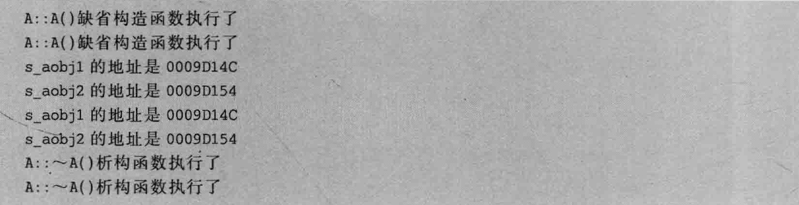  

多次执行程序不难发现，每次执行显示的s_aobj1地址和上次运行相同，s_aobj2也同样如此。  

难道s_aobjl、s_aobj2的地址也是编译的时候确定好的吗？真的是确定好的。就算是没调用构造函数构造这个对象，也可以发现这个对象其实也是有有效内存地址的，在编译的时候它的内存地址就确定了，只是到运行的时候，或者应该说是运行到对应的代码行时，它的内存才会依据事先约定好的地址分配出来。至于具体的内存分配细节，可能跟具体的编译器和操作系统都有关系。如果读者真想探究，笔者推荐《程序员的自我修养一一链接、装载与库》，里面对可执行文件的结构，以及如何装载、运行等有比较详细的介绍。  

在Linux操作系统上运行一下该程序，如图6.23所示。  

从图6.23中也可以看到，多次执行得到的s_aobj1和s_aobj2的地址是一样的。  

接着，使用nm工具在可执行文件中找一找s_aobj1和s_aobj2的地址信息，如图6.24所示。  

从图6.24中可以看出，s_aobjl和s_aobj2地址是事先确定好的，当这个可执行文件装载到内存开始运行后，这个地址也就被映射到内存中去了。所以从这个角度来说，s_aobj1和saobi2这两个局部静态对象，在编译的时候就确定好了开始地址和大小。图6.24中局部静态对象名字之前的b标记也与图6.22类似，表示BSS段，也就是该对象的内存来自于BSS段。  

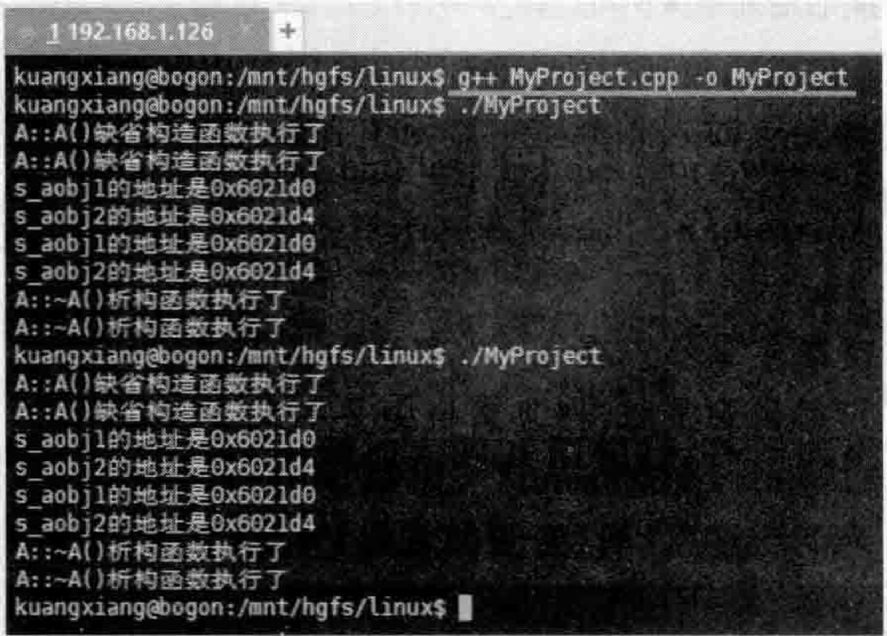  
图6.23在Linux下演示局部静态对象的构造和析构  

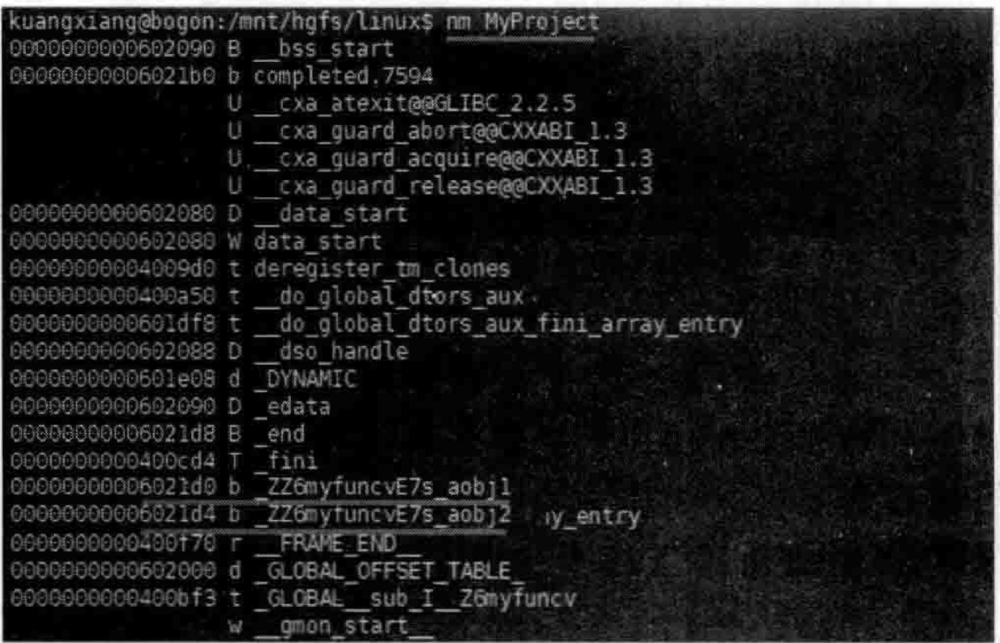  
图6.24局部静态对象在可执行文件中是有固定地址的  

去掉其他断点行，在函数myfunc中第一个printf行设置一下断点，开始调试，当程序执行停到断点行时，把鼠标放在saobi1或者saobi2上，如图6.25所示。  

从图6.25中可以看到，局部静态对象的内存默认也会被设置为0。  

去掉其他断点行，在main主函数中最后的右大括号“”所在行设置一个断点，在类A析构函数的函数体中也设置一个断点，开始调试，这里的情景与图6.20非常类似，就不赘述。所得到的结论就是：类A的析构函数在main主函数执行结束后才会被调用，这意味着在main主函数执行结束后，s_aobjl和s_aobj2这两个局部静态对象才会被释放。    

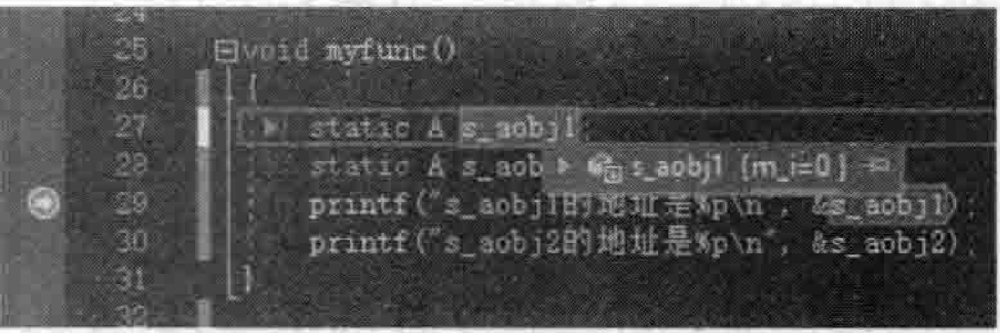  
图6.25局部静态对象的内存也会被初始化为0  

这里值得一说的是系统如何保证诸如staticAs_aobjl；这样的代码行所定义的s_aobj1对象只被初始化一次，换句话说，编译器如何保证s_aobj1静态局部对象只被构造一次（只调用一次构造函数）。  

为了方便观察，改造一下myfunc函数：  

``` cpp
const A& myfunc()  
{  
    static A s_aobj1;  
    printf("s_aobj1的地址是%p\n", &s_aobj1);  
    return s_aobj1;  
}
```

去掉其他断点行，在myfunc函数的第一行staticAsaobjl；设置断点，开始调试，当程序执行停到断点行时，切换到反汇编窗口，如图6.26所示。  

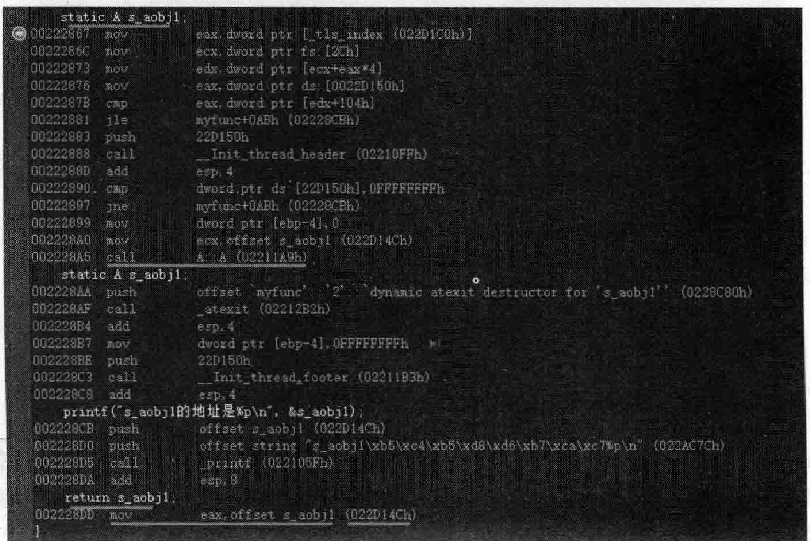  
图6.26查看局部静态对象初始化对应的汇编代码  

在图6.26中，最先映人眼帘的有调用类A构造函数的代码（callA：：A（02211A9h）），有返回s_aobj1对象地址的代码（moveax，offsets_aobj1（022D14Ch）），这个地址（022D14Ch）前面说过，是编译的时候就确定好的。  

可以把这个对象地址（022D14Ch）放到内存中查看一下，如图6.27所示（注意A类对象的sizeof是4字节）。  

保持“内存1”窗口处于打开状态，这样可以随时看到图6.27所示的内存中内容的变化。在反汇编窗口中，重复按F10键让程序逐行往下执行，当执行到图6.26 call In it thread header（02210FFh）汇编代码行时，会发现图6.27所示的4字节内存右侧的4个字节值发生了改变（从00000000变成了ffffffff），如图6.28所示。  

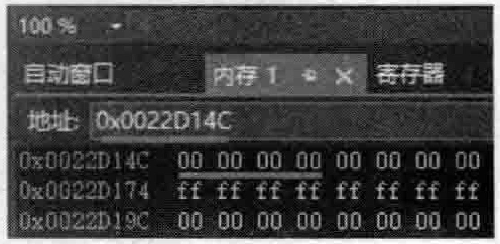  
图6.27查看s_aobj1局部静态对象内存中的内容  

在反汇编窗口中，重复按F10键让程序继续逐行往下执行，当执行到图6.26中的call_Init_thread_footer（02211B3h）汇编代码行时，图6.28中s_aobj1局部静态对象内存右侧4个字节内存的内容又发生了变化（从ffffffff变成了 $01\,\,\,00\,\,\,00\,\,\,80\,\,]$ ，如图6.29所示。  

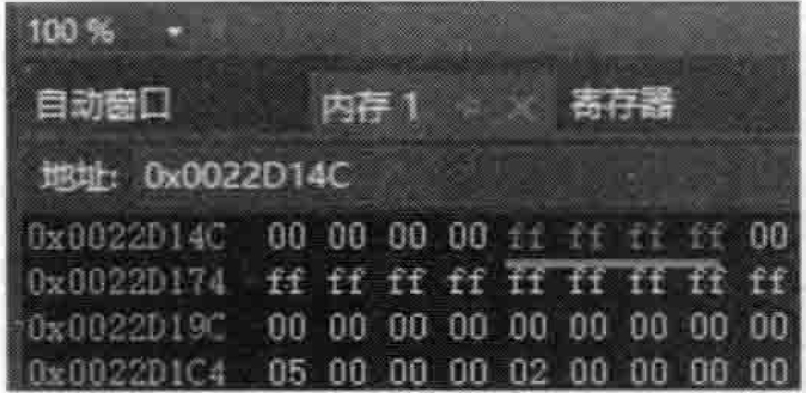  

图6.28执行callIn it thread header（02210FFh）汇编代码行会影响saobi1局部静态对象内存（4字节）右侧4个字节内存的内容  

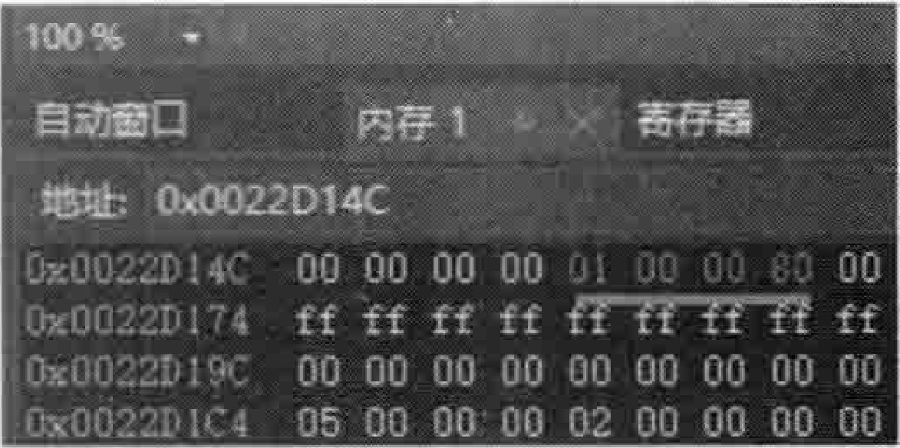  
图6.29执行callIn it thread footer（02211B3h））汇编代码行会再次影响saobi江局部静态对象内存右侧 内存的内容  

按F5键（“调试” $\twoheadrightarrow$ “继续”命令）让程序继续执行一直遇到下次停在断点处，因为在main主函数中调用了两次myfunc函数，所以，断点会再次停留在myfunc函数的staticAs_aobjl；代码行。此时，再次观察0x0022D14C内存所在的4个字节右侧的那4个学节，已然变成了 $01\ 00\ 00\ 80$ 。其实，01000080是一个标记，标记这个局部静态对象有没有被构造出来，第一次执行myfunc函数时构造并且做了一个标记，第二次比较这个标记是否已经有了，有了就不再构造该局部静态对象了，直接跳过staticAsaobjl；这一行代码。怎么跳过的，看图6.26中的：  
```cpp
mov eax, dword ptr ds:[0022D150h] // 这里是设置了标记 01 00 00 80 的内存的地址, 执行后 eax 寄存器的内容: EAX = 80000001
cmp eax, dword ptr [edx + 104h]
jle myfunc + OABh (02228CBh)
```

就是用上面这三行汇编代码进行标记判断和跳到02228CBh内存位置继续执行，而02228CBh内存位置正好是printf（"s_aobj1的地址是%pn”，&saobjl）；代码行对应的位置，如图6.30所示。  

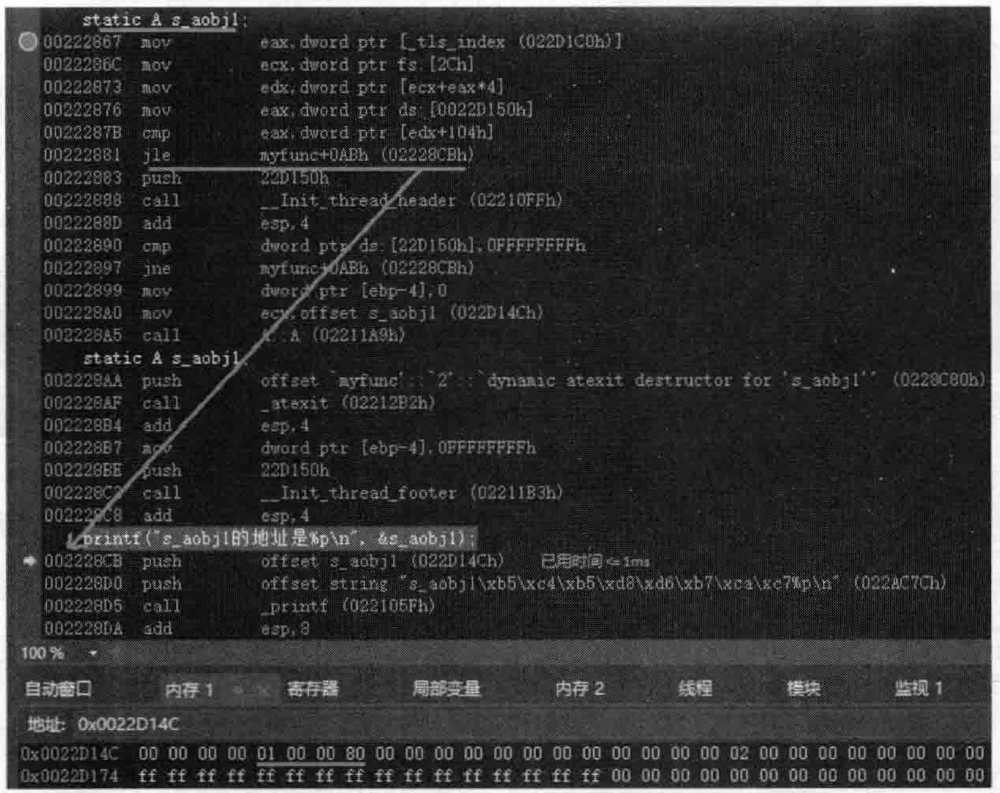  
图6.30通过设置和比较一些标记编译器可以判断出saobj1局部静态对象是否被构造过  

所以，编辑器就是通过这种标记的方式，在第二次执行staticAsaobjl；代码行时直接跳过从而不会再次构造s_aobjl，从而防止s_aobj1局部静态对象被构造多次。  

还有一个问题就是，saobi1局部静态对象被构造出来后，还需要在适当的位置进行释放（析构）。所以，编译器要把已经成功构造的局部静态对象记录起来，以供最后调用析构函数来析构它。那么，编译器是用什么手段记录这些已经成功构造的局部静态对象呢？这个问题可以参考图6.26，但为了看的更清晰，请看图6.31。  

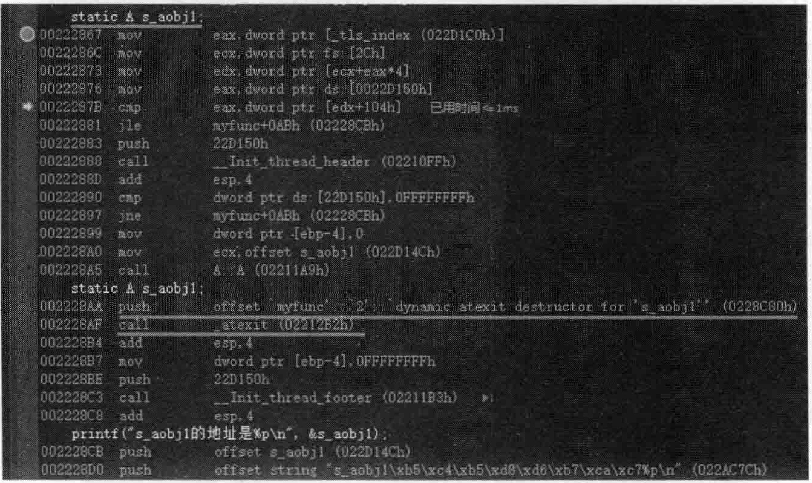  
图6.31：观看系统如何正确记录main主函数执行结束后要释放的局部静态对象  

从图6.31中可以看到，当第一次执行myfunc函数中的staticAs_aobjl；代码行时，看到了如下两行重要的汇编代码：  
```cpp
push    offset 'myfunc':2':dynamic atexit destructor for 's_aobj1'(022BC080h)
call    _atexit(02212B2h)
```

这两行汇编代码的大概意思就是调用atexit登记一些信息，告诉系统在main主函数执行完毕后要执行一段代码。哪段代码呢？就 是push末尾圆括号中对应的地址0228C80h所代表的这段代码。地址0228C80h所代表的代码段中包含了哪些内容呢？可以在反汇编窗口左上角输人这个地址观察所对应的代码内容，如图6.32所示。  

在图6.32中可以看到，saobj1静态局部对象对应的首地址022D14Ch是有的，有了这个地址，就可以确保后面调用类A的析构函数（callA：：\~A（02213CFh））能够成功执行来释放s_aobj1对象。    

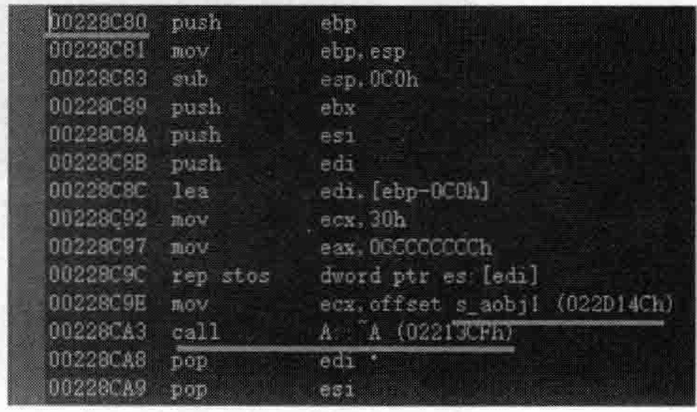  
图6.32main主函数执行结束后，整个程序退出之前，释放s_aobj1局部静态 对象时要执行的代码段  

## 6.4.2-局部静态对象数组的内存分配  

局部静态对象的构造和析构前面详细讲解了，其实局部静态对象数组也很类似。

修改myfunc函数，修改后的代码如下：  

``` cpp
void myfunc()  
{  
    static A s_aobj[5];  
    printf("s_aobj数组的首地址是%p\n", s_aobj);  
}
```
其他代码不变。执行起来，看一看结果：  

``` cpp
A：：A（）缺省构造函数执行了
A：A（）缺省构造函数执行了
A：：A（）缺省构造函数执行了
A：：A（）缺省构造函数执行了
A：A（）缺省构造函数执行了
s_aobj数组的首地址是0062D148
s_aobj数组的首地址是0062D148
A：：～A（）析构函数执行了
A：：～A（）析构函数执行了
A：：～A（）析构函数执行了
A：：～A（）析构函数执行了
A：：～A（）析构函数执行了
```

读者都知道，数组的内存空间是连续的。从运行结果看，调用了5次类A的构造函数，也调用了5次类A的析构函数。多次执行可以发现，数组首地址一直都不变。  

在Linux操作系统上运行一下该程序，如图6.33所示。  

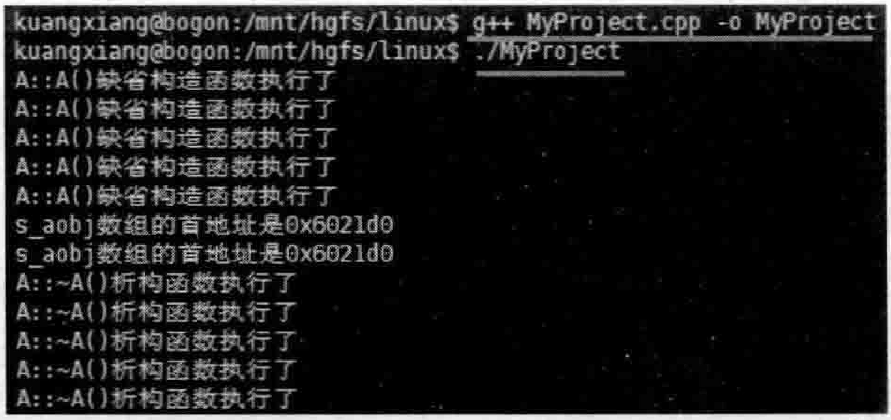  
图6.33在Linux操作系统下演示局部静态对象数组的构造和析构  

从图6.33中也可以看到，多次执行得到的saobi数组的首地址是一样的。

接着，使用nm工具在可执行文件中找一找saobi数组的首地址信息，如图6.34所示。  

在Linux下，可以用 $g^{++}$ 辅助-c参数生成目标文件，而后使用objdump工具来查看该目标文件（二进制文件）中的信息。objidump辅助-h参数可以显示目标文件头部的一些信息，借此可以看一看局部静态对象数组s_aobj的大小，如图6.35所示。  

从图6.35中可以看到，.bss段显示的是24，代表24字节，这24字节的空间里包括上面定义的静态局部数组（staticAsaobiL5」；）所占用的内存空间大小。  

所以能够看得出来，全局变量、局部静态变量等所占用的内存大小信息，一般都在目标文件或者在可执行文件里存着呢。  

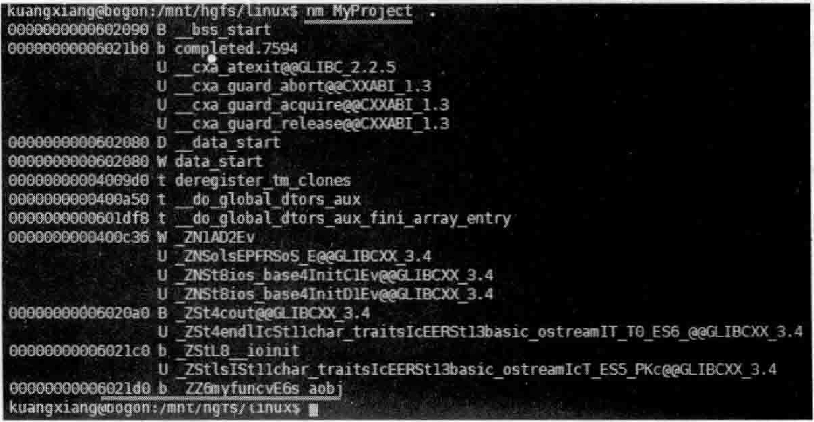  
图6.34局部静态对象数组在可执行文件中是有固定首地址的  

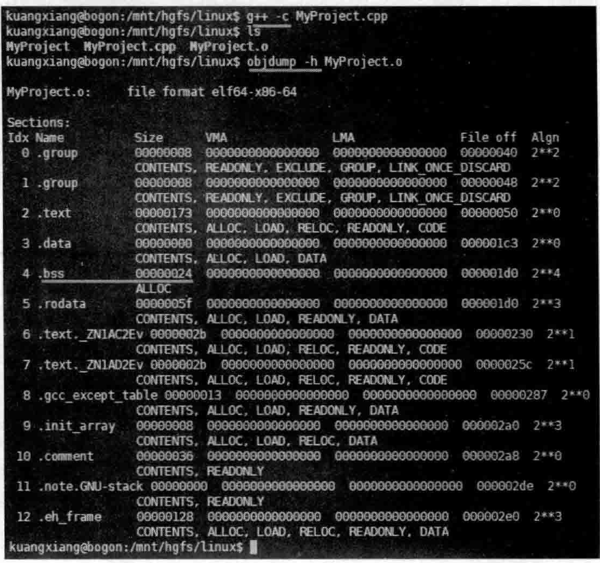  
图6.35，利用objdump工具查看目标文件头部的信息  

这里想聊一下这种局部静态对象数组的内存分配问题。例如定义一个非常非常大的静态数组，修改一下myfunc函数的代码。如下：  

``` cpp
void myfunc()
{
    // static A s_aobj[5];
    static A s_aobj[1000000]; //中间有'的数字是C++14新标准中支持的，'是数字分隔符
    printf("s_aobj数组的首地址是 %p\n", s_aobj);
}

```

现在如果执行该程序（注意，main主函数中调用了myfunc函数），系统给不给这么大的saobi局部静态对象数组分配内存呢？  

这个静态数组所需要的内存空间很庞大（大概需要几十兆字节），如果程序运行起来就分配内存，这就比较浪费子，所以这个时候编译器有它的智慧和特殊的处理。实际上，程序运行起来后，编译器并没有给这个局部静态数组分配实际的内存。测试一下看，将main主函数中的代码全部注释掉，增加如下新代码，其中包含一个while（1）循环，自的是防止main主函数执行结束从而导致整个进程执行结束：  

``` cpp
int main()  
{  
    myfunc();  
    printf("开始进入while循环\n");  
    while (1)  
    {  
    }  
    return 0;  
}
```

然后，将类A中的构造函数和析构函数都注释掉，因为其中的cout语句会影响构造对象的速度。  

使用快捷键Ctrl十F5（“调试” $\rightrightarrows$ “开始执行（不调试）”命令）将程序执行起来。  

在Windows操作系统下，启动任务管理，看看MyProject.exe这个进程占用了多大的内存，如图6.36所示。  

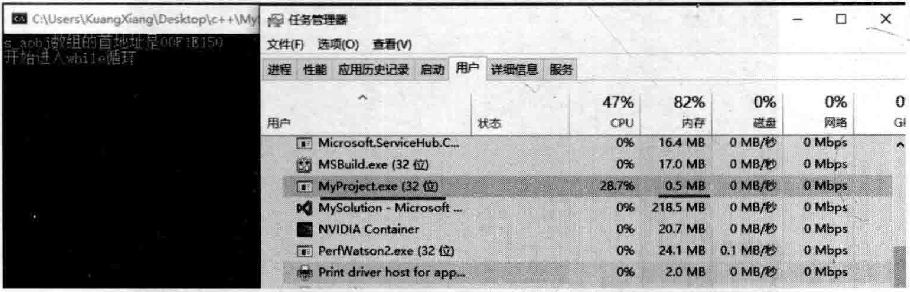  
图6.36利用任务管理器查看MyProject.exe进程所占用的内存空间  

从图6.36中不难看出，进程MyProject.exe只占了0.5MB内存空间，这说明staticA saobjl $\left[1000^{\,\dagger}0000\right]$ ；语句肯定没占内存，因为这个内存大概需要几十兆字节。：  

所以系统很智能，当它发现程序员没有针对这个静态对象数组中的对象做什么有用的事情时，它果断地不给这个对象数组分配实际的物理内存。  

这个时候读者可能就有疑问了：什么时候会为这个静态对象数组分配实际的物理内存呢？当然是针对这个对象数组做点有用的事的时候。什么叫有用的事呢？改造一下myfunc便知：  

``` cpp
void myfunc()  
{  
    static A s_aobj[1000'0000]; 
    for (int i = 0; i < 1000'0000; i++)  
    {  
       s_aobj[i].m_i = i; //这对于数组来说，一定算一件有用的事  
    }  
    printf("s_aobj数组的首地址是%p\n", s_aobj);  
}
```

从上面的代码中可以看到，每个数组中的元素保存的mi成员变量值都不同（因为都不同，编译器的智能和优化能力就发挥不出来）：再次按 $_{\mathrm{Ctrl+F5}}$ 键运行程序。启动任务管理，看看这次MyProiect.exe进程占用了多大的内存，如图6.37所示。  

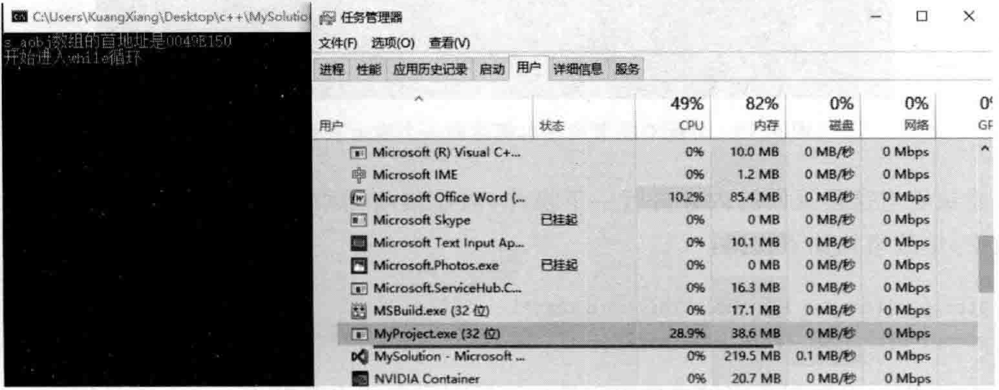  
图6.37利用任务管理器再次查看MyProject.exe进程所占用的内存  

从图6.37中不难看出，这次进程MyProject.exe占了38.6MB内存，这说明staticAsaobj $\left[1000^{\prime}0000\right]$ ；语句一定是占了内存的。  

还是那句话，不同操作系统下的不同编译器可能有不同的处理方式和处理技巧，有些技巧可能超出想象的智能，笔者在这里只是抛砖引玉，带一带路，如果读者有兴趣，可以继续深人挖掘下去。