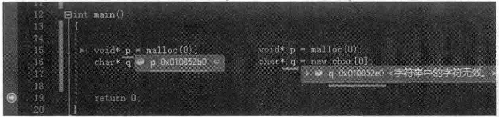

# 6.5 new、delete运算符与内存高级话题  

笔者所著的《 $\mathrm{C++}$ 新经典》一书中的“内存高级话题”一章，对new、delete等内存知识有非常详细的讲解，强烈建议读者在学习本节的时候能够详细去读一下，必然会收获多多，事半功倍。  

$\mathrm{C++}$ 新经典》一书中的“内存高级话题”一章所覆盖的问题如下：  

（1）new、delete的进一步认识
（2）new operator new、delete。
（3）内存池概念、代码实现和详细分析。
（4）嵌人式指针概念及范例、内存池改进版。
（5）重载全局new、delete，定位new及重载等。

使用malloc 和new分配0字节。 

在main主函数中加入如下代码行： 

``` cpp
void* p = malloc(0);  
char* q = new char[0];
```

读者都知道，new内部调用的就是malloc，所以上面两行代码其实几乎等价。  

上面的写法让人感到奇怪。当然，一般来讲，不会这样写代码，因为分配0学节内存违背常规的认知。  

但是也不难发现，这样写代码从语法上确实是允许的，而且从跟踪调试的结果来看，P和q也都返回了有效的内存地址，如果6.38所示。  

  
图6.38分配0字节内存也能返回一个看上去有效的地址值  

尝试着对这段返回的内存进行一下操作，向这段内存中复制一个字符串。在main主函数中，继续增加如下代码：  

``` cpp
strcpy_s((char *)p, 100, "This is a test1!");  
strcpy_s(q, 100, "This is a test2");
```

跟踪调试，发现似乎能够成功将字符串复制到指定的内存中。  

老手程序员和新手程序员最大的区别就是：老手程序员对于不会或者没弄明白的内容可以不去用，但是一般不会用错，新手程序员一般正好反过来一一发现系统没有报什么异常会觉得这种用法是正确的：  

上面这两行strcpy_s代码复制一个这么长的字符串到malloc（O）或者newchar[o]分配的内存，而且没报错，表面看起来似乎没什么问题，但实际上很可能已经危机四伏，也就是说这个程序可能可危，随时面临执行中出现各种逻辑错误甚至随时崩溃。因为这两句strcpy_s很可能把一段本来不属于程序员能够操作的内存地址中的内容给覆盖掉了，这种覆盖也许程序不会立即报错，但是程序运行的隐患和暗疾已经出现了。  

malloc（0）、new char[0]这样的写法到底编译器给分配了几个字节，不管是去猜，还是写程序去测，还是一批人集体讨论等，效果都不大。笔者认为，若真想搞明白这种写法到底分配了多少字节，就去读对应的malloc或者new的源码，别无它法。

继续在main主函数中加入释放内存的代码：  

``` cpp
free(p);  
delete[] q;
```

上面这两行代码，无论执行哪行，都会使程序崩溃。当然，如果前面没有那两行strcpys语句，则这两行释放内存的代码不会执行崩溃。所以，大概可以感觉出来，strcpy_s肯定是把内存破坏掉了，导致释放内存时一些信息错乱，株连了free和delete的执行。  

所以，在实际写代码中，不要写出malloc（o）、newcharo这种诡异代码。别看它们能执行成功，但这个内存只要进行一些写操作就可能导致free时报错。  

有资料显示，malloc（o）、newchar0可能返回空指针，也可能返回一个有效指针（取决于编译器），也有说法是malloc（o）、newcharo返回一个有效地址（指针）是语言本身的要求。但是，就算是返回一个有效地址，也不能去用这个地址，不能修改其中的内容。