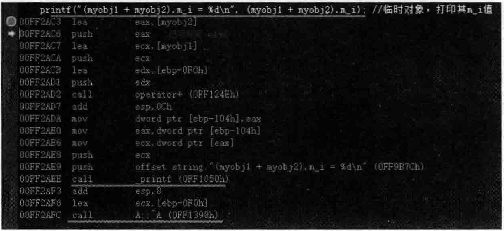

# 6.6 临时性对象的详细探讨  

## 6.6.1-拷贝构造函数相关的临时性对象  

在MyProject.cpp的上面，增加如下代码行：  

``` cpp
class A  
{  
public:  
    A()  
    {  
       cout << "A::A()构造函数执行" << endl;  
    }  
    A(const A& tmpobj)  
    {  
       m_i = tmpobj.m_i;  
       cout << "A::A()拷贝构造函数执行" << endl;  
    }  
    ~A()  
    {  
       cout << "A::~A()析构函数执行" << endl;  
    }
A operator+(const A& obj1, const A& obj2)  
{  
    A tmpobj; //调用一次构造函数  
    //这里可以做一些加法计算  
    //......  
    return  tmpobj; //执行后调用了一次拷贝构造函数，一次析构函数,说明有临时对象生成  
}
```

在main主函数中，加人如下代码：

``` cpp
A myobj1; //调用一次构造函数   
A myobj2; //调用一次构造函数 
A resultobj = myobj1 + myobj2;  
```

执行起来，看一看结果：  

``` cpp
A：：A（）构造函数执行
A：：A（）构造函数执行
A：：A（）构造函数执行
A：：A（）拷贝构造函数执行
A：：～A（）析构函数执行
A：：～A（）析构函数执行
A：：～A（）析构函数执行
A：：～A（）析构函数执行
```

从上面结果中不难发现operator+的return tmpobj；代码行产生了一个临时对象，因为结果中看到了一次拷贝构造函数，这个临时对象就是通过tmpobj拷贝构造产生的，用来放置从operator+返回的结果。

对于main 主函数中的代码行A resultobj=myobj1+ myobj2;,刚才说了，从 operator+返回了一个临时对象，实际上如果按常规思考，这个临时对象应该再次调用拷贝构造函数来拷贝构造出resultobj对象，但实际是编译器在这里做了一个优化——这个临时对象就直接构造到了resultobj的预留空间里，这样就相当于省了一次拷贝构造和一次析构。

从上面的结果中可以看到，执行了4次构造函数（拷贝构造函数也算构造函数）和4次析构函数。  

在VisualStudio2019中，设置一下优化选项（设置方法可以参考图2.28，把“优化”从原来的“已禁用（/Od）”修改为“最大优化（优选速度）（/O2）”），再设置一下基本运行时检查（设置方法可以参考图2.29，把“基本运行时检查”从原来的“两者（/RTC1，等同于/RTCsu）（/RTC1）”修改为“默认值”）。  

然后在operator+中加一行printf语句用来做一个输出标记：

``` cpp
A operator+(const A& obj1, const A& obj2)  
{  
    A tmpobj; //调用一次构造函数  
    //这里可以做一些加法计算  
    //......  
    printf("---------\n");  
    return  tmpobj; //执行后调用了一次拷贝构造函数，一次析构函数,说明有临时对象生成  
}
```

执行起来，看一看结果：  

``` cpp
A：：A（）构造函数执行
A：：A（）构造函数执行
A：：A（）构造函数执行
---------
A：：～A（）析构函数执行
A：：～A（）析构函数执行
A：：～A（）析构函数执行
```

比较两次的输出结果，发现少了一次复制构造和一次析构。  

看起来编译器优化后，还让人产生了疑惑，resultobj对象是怎么构造出来的？为什么现在的结果中只有三次构造函数的执行呢？  

为了探究这个问题，继续向operator $^+$ 中增加一些代码，输出一下这些对象的地址：  

``` cpp
A operator+(const A& obj1, const A& obj2)  
{  
    A tmpobj; //调用一次构造函数  
    printf("tmpobj的地址为%p\n", &tmpobj);  
  
    //这里可以做一些加法计算  
    //......  
    printf("---------\n");  
    return  tmpobj; //执行后调用了一次拷贝构造函数，一次析构函数,说明有临时对象生成  
}
```

在main主函数中也增加一些代码，输人一下对象的地址。修改后的main主函数代码如下：

``` cpp
A myobj1; //调用一次构造函数  
printf("myobj1的地址为%p\n", &myobj1);  
A myobj2; //调用一次构造函数  
printf("myobj2的地址为%p\n", &myobj2);  
  
A resultobj = myobj1 + myobj2;  
printf("resultobj的地址为%p\n", &resultobj);
```

执行起来，看一看结果：  

``` cpp
A：：A（）构造函数执行
myobj1的地址为001CF9CE 
A：：A（）构造函数执行
myobj2的地址为001CF9CD 
A：：A（）构造函数执行
tmpobj的地址为001CF9CF 
----------
resultobj的地址为001CF9CF 
A：：～A（）析构函数执行
A：：～A（）析构函数执行
A：：～A（）析构函数执行
```

从结果中不难发现，编译器优化之后，竟然直接把tmpobj的地址拿来做resultobj的地址了。这种优化是比较强悍的，也就是省了一次复制构造和一次析构。而且这几个对象的地址离得都很近。  

现在把刚才设置的优化选项和基本运行时检查选项恢复回去，以免对后续内容的讲解或者程序的调试产生影响：  

（1）把“优化”从“最大优化（优选速度）（/O2）"恢复为“已禁用（/Od）”）。  

（2）把“基本运行时检查”从原来的“默认值”恢复为“两者（/RTC1，等同于/RTCsu）(/RTC1)"  

## 6.6.2拷贝赋值运算符相关的临时性对象  

向类A中增加一个public修饰的拷贝赋值运算符：  

``` cpp
public:  
    A& operator=(const A& tmpaobj)  
    {  
       cout << "A::operaotor=()拷贝赋值运算符执行" << endl;  
       return *this; //返回一个该对象的引用  
    }
```

在operator $+$ 中，先把2条printf语句注释掉。

在main主函数中，把3条printf语句注释掉，还要把对象resultobj的定义的赋值操作  

分成两行来写。调整后的main主函数代码如下：  

``` cpp
A myobj1; //调用一次构造函数  
A myobj2; //调用一次构造函数  
A resultobj;  
resultobj = myobj1 + myobj2;
```

执行起来，看一看结果：  

``` cpp
A：：A（）构造函数执行
A：：A（）构造函数执行
A：：A（）构造函数执行
A：：A（）构造函数执行
A：：A（）拷贝构造函数执行
A：：～A（）析构函数执行
A：：operator=（）拷贝赋值运算符执行
A：：～A（）析构函数执行
A：：～A（）析构函数执行
A：：～A（）析构函数执行
A：：～A（）析构函数执行
```

可以将断点设置在resultobj=myobj1+myobj2；代码行，并跟踪调试查看结果。不难发现，operator+中return tmpobj；返回的临时对象调用了拷贝赋值运算符赋给了resultobj，然后，这个临时对象自己析构掉了。上述结果中的如下两行就是这个意思： 

``` cpp
A：： operator=（）拷贝赋值运算符执行
A：：～A（）析构函数执行
```

所以，这个拷贝赋值就不如上面的拷贝构造，上面的拷贝构造是直接把临时对象构造到resultobi的预留空间，执行性能上就提高了一些。  

重复前面的步骤，开启优化选项，设置基本运行时检查。  

把operator $\neq$ 里的2条printf语句和main主函数中的3条printf语句注释取消。现在operator $^+$ 和main主函数中的代码应该如下：  

``` cpp
A operator+(const A& obj1, const A& obj2)  
{  
    A tmpobj; //调用一次构造函数  
    printf("tmpobj的地址为%p\n", &tmpobj);  
  
    //这里可以做一些加法计算  
    //......  
    printf("---------\n");  
    return  tmpobj; //执行后调用了一次拷贝构造函数，一次析构函数,说明有临时对象生成  
}  
  
int main()  
{
	A myobj1; //调用一次构造函数  
	printf("myobj1的地址为%p\n", &myobj1);  
	A myobj2; //调用一次构造函数  
	printf("myobj2的地址为%p\n", &myobj2);  
  
	//A resultobj = myobj1 + myobj2;  
	A resultobj;  
	resultobj = myobj1 + myobj2;  
	printf("resultobj的地址为%p\n", &resultobj);
	return 0;  
}
```

在类A的拷贝赋值运算符中也增加一条printf语句。增加后的完整代码如下：
``` cpp
public:  
    A& operator=(const A& tmpaobj)  
    {  
       cout << "A::operaotor=()拷贝赋值运算符执行" << endl;  
       printf("tmpaobj的地址为%p\n", &tmpaobj);  
       return *this; //返回一个该对象的引用  
    }
```

执行起来，看一看结果：  

``` cpp
A：A（）构造函数执行
myobj1的地址为008FF963 
A：：A（）构造函数执行
myobj2的地址为008FF962 
A：：A（）构造函数执行
A：：A（）构造函数执行
tmpobj的地址为008FF960
--------
A：：operator=（）拷贝赋值运算符执行
tmpaobj的地址为008FF960
A：：～A（）析构函数执行
resultobj的地址为008FF961 
A：：～A（）析构函数执行
A：：～A（）析构函数执行
A：：～A（）析构函数执行
```

从结果中不难看到，这个临时对象调用拷贝赋值运算符把内容给了resultobi后，自己就析构（释放）掉了。和开启优化选项之前相比，省了一次拷贝构造和一次析构。  

所以，这种也是产生了临时对象，然后临时对象自已析构掉了。  

通过上面的讲述，综合而言：  

``` cpp
A resultobj = myobj1 + myobj2;
```

和  
``` cpp
A resultobj;  
resultobj = myobj1 + myobj2;
```
比起来，上面的写法（定义和初始化写在一行）效率更高一些。  

现在把刚才设置的优化选项和基本运行时检查选项恢复回去，以免对后续内容的讲解和程序的调试产生影响。  

## 6.6.3直接运算产生的临时性对象  

在operator十中，再次把2条printf语句注释掉。

在main主函数中为了简单，将原有的代码注释掉，修改为如下全新的代码：  

``` cpp
A myobj1; //调用一次构造函数  
A myobj2; //调用一次构造函数  
myobj1 + myobj2;
```

执行起来，看一看结果：  

``` cpp
A：：A（）构造函数执行
A：：A（）构造函数执行
A：：A（）构造函数执行
A：：A（）拷贝构造函数执行
A：：～A（）析构函数执行
A：：～A（）析构函数执行
A：：～A（）析构函数执行
A：：～A（）析构函数执行
```

可以将断点设置在myobjl $^+$ myobj2；行，跟踪调试，可以看到，在执行完该行后，类A的析构函数执行了两次。上述结果中的如下两行就是这个意思：  

``` cpp
A：：～A（）析构函数执行
A：：～A（）析构函数执行
```

这说明myobj1和myobj2这两个对象相加产生了一个临时对象（另一个临时对象是在operator $^+$ 里产生的，并没有计算在这里），并且这个临时对象立即被析构了。  

回想前面写过的代码行：  

``` cpp
A resultobj = myobj1 + myobj2;
```

这个代码行的情况是临时对象被构造到了resultobi中，并没有立即析构，而是result obj。而myobjl $^+$ myobj2这种临时对象是立即析构，因为没有一个对象来保存（接收）myobjl $^+$ myobj2返回的这个结果对象（这个结果对象是一个临时对象）。  

如果开启优化选项，那么结果如下：  

``` cpp
A：：A）构造函数执行
A：：A（）构造函数执行
A：：A（）构造函数执行
A：：～A（）析构函数执行
A：：～A（）析构函数执行
A：：～A（）析构函数执行
```

比优化之前少一次复制构造和一次析构，估计operator $\mathbf{+}$ 中那个临时对象直接构造到tmpobj里面去了。  

关于临时对象，还有点内容要说，需要调整一下代码。  

在类A中，增加一个public修饰的成员变量：  

``` cpp
public:  
    int m_i;  
```

在类A的拷贝构造函数中，增加一行代码：  

``` cpp
m_i = tmpobj.m_i;
```

在operator十中，return语句之前，增加一行代码：  

``` cpp
tmpobj.m_i = obj1.m_i + obj2.m_i;
```

在main主函数中，注释掉以往的代码，增加如下全新的代码：  

``` cpp
A myobj1; //调用一次构造函数          myobj1.m_i = 1;  
A myobj2; //调用一次构造函数                myobj2.m_i = 2;  
printf("(myobj1 + myobj2).m_i = %d\n", (myobj1 + myobj2).m_i); //临时对象，打印其m_i值
```

执行起来，能够正常输出结果。主要输出结果项如下：  

``` cpp
(myobj1 + myobj2).m_i = 3;
```

刚才说过， $\mathrm{\mathbb{j}1\!+\!m y o b j2}$ 这种临时对象是立即析构的，因为这两个对象相加后的结果并没有保存。那么这里不禁要思考一下，上面的printf语句就是输出这个临时对象的m_i成员变量值的，如果这个临时对象在printf语句执行完之前就析构，那printf语句输出出来的就是已经被析构的对象的成员变量，这显然不对。所以，实际上临时对象被析构是printf这行语句的最后一步，这样就能保证printf输出的临时对象的 $\mathrm{~m~}_{-}^{\mathrm{~i~}}$ 成员变量值有效。  

将断点设置在上面的printf行，开始调试，当程序执行停到断点行时，切换到反汇编窗口，如图6.39所示。  

  
图6.39临时对象在被 $_\mathrm{rvert}$ 语句使用完后才释放  

在图6.39中可以明显地看到，临时对象的析构是在调用完了printf语句后才进行的，这表示printf语句可以安全地输出这个临时对象的 $\mathrm{m\_i}$ 成员变量值。  

继续观察一下类似的情况。在main主函数中继续加人如下代码：  

``` cpp
if ((myobj1 + myobj1).m_i > 3 || (myobj1 + myobj2).m_i > 5)  
{  
    cout << "条件成立" << endl;  
}
```
取消其他断点，将断点设置在这条新加入的迁语句行，并调试观察，不难看到，仅仅这条f语句行就会产生如下这么多行输出：  

``` cpp
A：A（）构造函数执行
A：：A（）拷贝构造函数执行
A：：～A（）析构函数执行
A：：A（）构造函数执行
A：：A（）拷贝构造函数执行
A：：～A（）析构函数执行
A：：～A（）析构函数执行
A：：～A（）析构函数执行
```

这里不深入探究这条f判断语句导致的针对临时对象的处理。因为判断条件的原因导致f语句中“|”的左右两端的条件（关系运算）都进行了判断，因此产生了一堆针对构造、拷贝构造、析构函数的调用。如果把这条if语句的第一个条件（（myobjl+myobj1）.m_i>3）修改一下，让其为true，这样系统就不用再判断第二个条件（（myobjl+myobj2）.m_i>5）了，如此可以节省大量的A类的构造、拷贝构造、析构函数的调用。修改main主函数中刚刚的f语句如下：

``` cpp
if ((myobj1 + myobj1).m_i > 1 || (myobj1 + myobj2).m_i > 5) 
```

再次看一看这条i语句的执行产生的输出：  

``` cpp
A：：A（）构造函数执行
A：：A（）拷贝构造函数执行
A：：～A（）析构函数执行
A：：～A（）析构函数执行
```

可以看到，因为（myobjl $^+$ myobj2). $\mathrm{m_{-}i>5}$ 这个条件判断没有执行，因此输出结果节省了不少内容。  

总之，临时对象会耗费很多系统成本，而且这些成本可能往往程序员并没有注意到，在写程序的时候，是否一个不留神就写出了一个临时对象呢！  

同时也需要明白，编译器往往会在必要的地方帮助程序员插人代码来产生临时对象供编译器完成程序员的代码要实现的意图。  

### 1.临时对象被摧毁  

写程序时还是要多留心，尽量少用这种临时对象，另外有的时候一旦没用好，还可能用错。这里写一段用错的代码：  

``` cpp
const char* p = (string("123") + string("456")).c_str(); //这就有问题，临时对象被摧毁了  
printf("p = %s\n", p); //无法打印正确结果，无效内存
``` 

下面的代码是可以正确输出结果的：  


``` cpp
string aaa = (string("123") + string("456"));  
const char* q = aaa.c_str();  
printf("q = %s\n", q);
```

### 2.临时对象因绑定到引用而被保留  

如果临时对象绑定到一个引用上，看如下代码：  

``` cpp
const string& aaa = (string("123") + string("456"));  
printf("aaa = %s\n", aaa.c_str());
```

上面两行代码可以输出正确的结果。所以可以发现，如果临时对象被绑定到一个引用上，那么这个临时对象的生命周期就会变成这个引用的生命周期（引用的生命周期在这里看成是一个正常的局部变量的生命周期）。  

另外也看到了，当开启了编译器优化选项后，编译器的优化能力就会介人程序运行中，帮助程序员少产生了很多临时对象，少调用了很多构造、拷贝构造和析构函数，这对提升程序运行效率有重要和积极的意义，这方面编译器开发商就要各显其能了。但是值得一提的是，编译器的优化能力介人后，会不会导致原本计划在构造、拷贝构造和析构函数中执行的代码因为优化的原因没有去执行（没有按照程序员的本意去执行）从而使程序执行产生错误？这值得思考和注意，开发的过程中也要进行严格的测试。