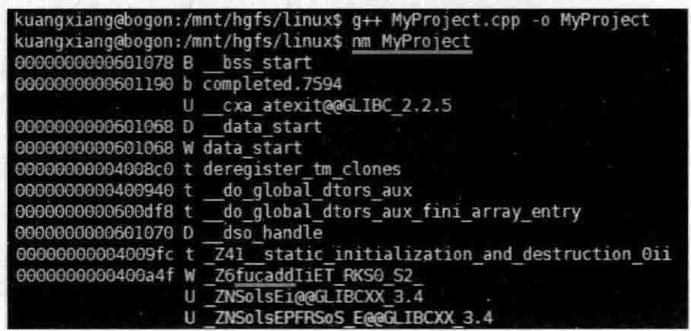
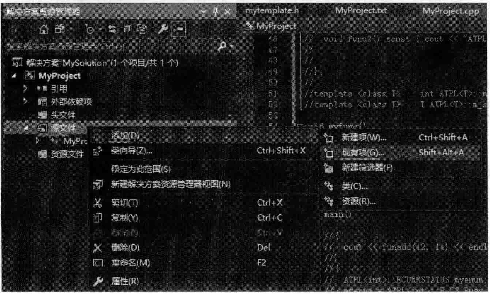
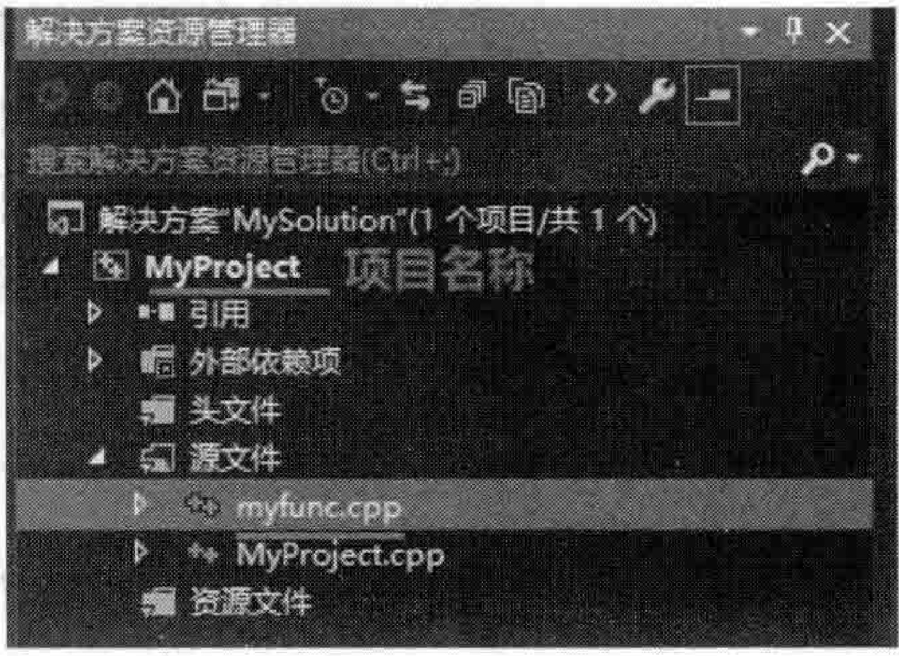

# 7.1模板及其实例化详细分析  

## 7模板实例化语义学  

本章详细阐述了模板实例化时的各种细节问题，这些细节问题也许是读者以往未曾注意甚至是根本不知道的，所以，非常有必要好好学习和掌握一下。  

---

## 7.1.1函数模板  

在MyProject.cpp的上面，增加如下代码行：  

``` cpp
template<class T>  
T funadd(const T& a, const T& b)  
{  
    T addhe = a + b;  
    return addhe;  
}
```

在main主函数中，增加如下代码行：  

``` cpp
cout << funadd(12, 14) << endl;
```

执行起来，看一看结果：  

``` cpp
26  
```

可以看到，程序执行输出了正确的结果。  

读者在学习模板的时候都知道，上述代码中针对工类型的推断，是编译器在编译的时候根据针对funcadd的调用来确定的。  

可能许多读者对这句话理解的不太深人，那么就一起观察一下。  

编译整个项目，然后参考2.4节在开发人员命令行工具下使用dumpbin工具将MyProject.obj My Project.txt。  

在MyProject.txt中寻找funcadd字样，不难发现如图7.1所示。  

在Linux操作系统上编译、链接并生成可执行文件。使用nm命令，也可以看到funcadd字样，如图7.2所示。  

  
图7.1函数模板被实例化后的情形  

  
图7.2利用 $\mathrm{nm}$ 命令观察可执行文件中函数模板被实例化后的情形  

如果把main主函数中仅有的cout代码行注释掉，那么在目标文件中就不会找到funcadd字样了。  

通过这个演示就能够很清楚地看到：编译器在编译的时候根据针对funcadd的调用来确定函数模板中T的类型。同时笔者还需要补充一句：如果并没有针对funcadd的调用代码，那么编译器不会产生任何与funcadd有关的代码，就好像函数模板funcadd从未存在过 一样。  

通过上面main主函数中这行代码（这个调用）可以观察到，编译器实际上产生了一个函数，但这个函数的名字和参数读者可要注意，这个函数的名字不是funcadd，而是funcadd  `<int>` 。完整一点说，函数的名字和参数如下：

``` cpp
int funcadd <int>(int const&, int const&)
```

然后编译器根据这些类型再生成具体针对这些类型的函数体代码。  

## 7.1.2类模板的实例化分析  

类模板的实例化都不陌生，看一个范例。在MyProject.cpp的上面，增加如下代码行：  

``` cpp
template<class T>  
class ATPL  
{   
public:  
    T m_i, m_j;  
    ATPL(T tmpi = 0, T tmpj = 0) //构造函数  
    {  
       m_i = tmpi;  
       m_j = tmpj;  
    }  
};
```

上面定义了一个类模板，但并没有在main主函数中用到这个类模板。

编译，用dumpbin将.obj文件导出成.txt文件并搜索，发现找不到ATPL字样，这说明编译器对整个类模板的定义视而不见，没有任何反应，就跟不存在ATPL一样。  
### 1.类模板中的枚举类型  

现在向ATPL类模板中增加一个枚举类型：  

``` cpp
public:  
    enum ECURRSTATUS  
    {  
       E_CS_Busy,  
       E_CS_Free,  
    };
```

当然，如果现在编译的话，编译器还是会对这个类模板视而不见。现在要想使用这个类中的枚举类型，就必须要写代码通过类模板实例化这个枚举类型。在main主函数中加人如下代码：  

``` cpp
ATPL<int>::ECURRSTATUS myenum;  //注意要加这个<int>
```

编译，用dumpbin将.obj文件导出成.txt文件并搜索，发现找不到ATPL字样。说明编译器很可能把土面这个代码行优化没了，因为程序中粮本没用到myenum这个变量。在main主函数中再加一句代码：  

``` cpp
myenum = ATPL<int>::E_CS_Busy;
```

编译，用dumpbin将.obj文件导出成.txt文件并搜索ATPL字样，只找到一个ATPL字样，这说明编译器仅仅是将整个“ATPL $<$ int>：：ECU RR STATUS一个枚举类型而已。跟ATPL类模板本身，几乎可以说是没有什么关系。  

继续在main主函数中增加代码：  

``` cpp
ATPL<int>::ECURRSTATUS myenum2;  
myenum2 = ATPL<int>::E_CS_Free;
```

编译，用dumpbin将.obj文件导出成.txt文件并搜索ATPL字样，依l旧只能搜索到一AT PL AT PL $<$ int>::ECU RR STATUS  

继续在main主函数中增加代码：  

``` cpp
ATPL<double>::ECURRSTATUS myenum3;  
myenum3 = ATPL<double>::E_CS_Free;
```

编译，用dumpbin将.obi文件导出成.txt文件并搜索ATPL字样，这次可以搜索到两个ATPL字样—一ATPL $<$ int $>$ ：ECU RR STATUS AT PL $<$ double $>$ ::ECU RR STATUS，这表示有两种枚举类型了。  

### 2.类模板中的静态成员变量  

为了演示观察方便，将main主函数中所有代码行先注释掉。

在类模板中增加一个静态成员变量的声明：  

``` cpp
public:  
    static int m_sti;
```

在类模板定义的下面，定义并初始化这个静态成员变量：  

``` cpp
template <class T>  int ATPL<T>::m_sti = 10;
```

编译，用dumpbin将.obj文件导出成.txt文件并搜索，没有发现ATPL字样和m_sti字样。  

在main主函数中，使用一下msti，增加如下代码：  

``` cpp
ATPL<int>::m_sti = 18;  
cout << ATPL<int>::m_sti << endl;
```

编译，用dumpbin将.obj文件导出成.txt文件并搜索，就会发现有一个int类型变量，名字叫作ATPL`<int>`::m_sti。

在main主函数中，继续增加代码：  

``` cpp
ATPL<float>::m_sti = 21;  
cout << ATPL<float>::m_sti << endl;
```

编译，用dumpbin将.obj文件导出成.txt文件并搜索就会发现，对于编译器来讲，会产生两个不同类型的变量，一个名字叫 $\mathrm{APL<int>}$ ：：m_sti，另外一个名字叫ATPL $<$ float>::m_sti  

现在在类模板ATPL中再增加一个静态成员变量的声明，只不过这个静态成员变量的类型用的是类型模板参数所代表的类型：  

``` cpp
public:  
    static T m_sti2;
```

在类模板定义的下面，定义并初始化这个静态成员变量：

``` cpp
template <class T>  T ATPL<T>::m_sti2 = 10;
```

上面代码行要注意一下，因为给了一个初值10，那么日后在指定m_sti2类型的时候程序员就一定要指定和10兼容的类型，不然编译就会报错。  

例如，后续如果是这样写代码就会出现编译错误：  

```cpp
ATPL<string>::m_sti2;  // 编译错误，因为<>中是 string 类型
```

但这样写代码就没有问题：  

```cpp
ATPL<int>::m_st2; // 没有问题，因为<>中是 int 类型
```

这里就可以看到类模板和类的不同之处：只有给进来具体类型，有些语法是否正确或者错误才能看得出来，所以有一些语法的检查，如果牵扯到这种类型模板参数的，那么编译器必须遇到这种实例化代码（如ATPL`<string>`：：m_sti2）的时候，才能检查出问题来。

在main主函数中继续增加如下代码：  

``` cpp
ATPL<int>::m_sti2 = 132;  
ATPL<float>::m_sti2 = 1050;  
cout << ATPL<int>::m_sti2 << endl;  
cout << ATPL<float>::m_sti2 << endl;
```

执行起来，看一看结果：  

``` cpp
18
21
132
1050
```

结果正常。编译，用dumpbin将.obi文件导出成.txt文件并搜索就会发现，对于编译器来讲，会产生出如下几个类型的变量：  

```cpp
static int ATPL< int >: : m_sti
static int ATPL<float>: : m_sti
static int ATPL< int >: : m_st2
static float ATPL< float>: : m_st2i
```

请注意，具体的ATPL模板相关的类并没有被实例化出来，编译器只会把上面的内容当成4个变量去看待。  
### 3.类模板的实例化  

为了演示观察方便，将main主函数中所有代码行先注释掉。有了类模板，那么类是如何被实例化出来的呢？在main主函数中加人如下代码：  

``` cpp
ATPL<int>* pobj = NULL;
```  

编译，用dumpbin将.obj文件导出成.txt文件并搜索就会发现，没有产生任何ATPL相关的内容，也就是说根本没实例化出来任何类，就好像这个类模板不存在一样。所以这种指针的用法，不会实例化出具体类的。  

注释上面这行代码，加人如下代码：  

``` cpp
const ATPL<int>& yobj = 0; //因为构造函数允许缺省参数，这里有隐式类型转换
```

在类模板的构造函数中设置断点并调试，发现确实能调用类模板的构造函数。如果构造函数都调用了，显然这个类模板肯定被实例化出来了。  

编译，用dumpbin将.obi文件导出成.txt文件并搜索，找ATPL字样，不难发现，编译器已经实例化出来了这个ATPL $<$ int>类了（标志就是ATPL $<$ int $>$ ::ATPL $<$ int $>$ 这种名字），如图7.3所示（构造函数）。  

  
图7.3利用类模板实例化出类的情形（可以看到实例化成类后的构造函数）  

上面这种写法其实类似于下面：  

``` cpp
ATPL< int> tmpobj(0);
const ATPL <int> &yobj = tmpobj;
```

综合而言，上面不但实例化出来了 ATPL`<int >`类，同时了也定义了属于该类的对象，因为模板类型确定了，这个对象所占用的内存空间也是确定的。那m_i和m_j两个成员变量都是4字节，加起来是8字节。  

### 4.成员函数的实例化  

现在向ATPL类模板中增加两个public修饰的成员函数：  

``` cpp
public:  
    void func1() const { cout << "ATPL::func1()" << endl; } 
    void func2() const { cout << "ATPL::func2()" << endl; }
```

从前面的代码已经看到ATPL $<$ int $>$ 类被实例化出来了，那么与这个类相关的这两个成员函数一定会被实例化出来吗？或者说有必要被实例化出来吗？  

编译，用dumpbin将.obj文件导出成.txt文件并搜索，并没有找到funcl或者func2字样，这说明编译器虽然实例化出来了ATPL $<$ int>类，但是并没有实例化出来类中的funcl、func2等成员函数。因为做这种没意义的实例化会花费大量的时间和空间，编译器觉得不值得。  

怎么才能实例化出成员函数来呢？当然是在代码中有对这些成员函数调用的代码出现时，这并不难想象。  

在main主函数中，继续增加如下代码：  

``` cpp
yobj.func1();
```

执行起来，看一看结果：  

``` cpp
ATPL::func1()  
```

编译，用dumpbin将.obj文件导出成.txt文件并搜索，一定能够找到实例化后的funcl。  

## 7.1.3多个源文件中使用类模板  

在一个项目中，可能有多个源文件（.cpp文件），每个源文件可能都要用到这个类模板，所以，一般在做实际项目的时候，是把类模板定义、实现等所有的相关内容都放到一个.h头文件中去（对于普通的类，定义和实现不能都放在一个头文件中，这是普通类和类模板的区别之一)。

基于这个想法，把刚才的类模板ATPL放到了一个专门的头文件mytemplate.h中去，并在MyProject.cpp的前面，包含该头文件。 

``` cpp
#include "mytemplate.h"
```

而mytemplate.h的完整内容如下：

```cpp
#ifndef_MYTEMPLATE_
#define_MYTEMPLATE_
using namespace std;
template<class T>  
T funadd(const T& a, const T& b)  
{  
    T addhe = a + b;  
    return addhe;  
}  
  
template<class T>  
class ATPL  
{  
public:  
    enum ECURRSTATUS  
    {  
       E_CS_Busy,  
       E_CS_Free,  
    };  
  
  
public:  
    T m_i, m_j;  
    ATPL(T tmpi = 0, T tmpj = 0) //构造函数  
    {  
       m_i = tmpi;  
       m_j = tmpj;  
    }  
  
public:  
    static int m_sti;  
    static T m_sti2;  
  
public:  
    void func1() const { cout << "ATPL::func1()" << endl; } 
    void func2() const { cout << "ATPL::func2()" << endl; } 
};  
  
template <class T>  int ATPL<T>::m_sti = 10;  
template <class T>  T ATPL<T>::m_sti2 = 10;
#endif 

```

在 MyProject.cpp 的上面，增加一个叫作 myfunc的全局函数：


``` cpp
void myfunc()  
{  
    ATPL<int> myobj;  
    myobj.m_sti2 = 18;  
    cout << myobj.m_sti2 << endl;  
}
```

在main主函数中，注释掉以往所有代码，保持为空。  

编译，用dumpbin将.obi文件导出成.txt文件并搜索ATPL字样，可以发现，编译器实例化出了ATPL $<$ int>类，参考图7.3。  

为什么会实例化出了ATPL $<$ int $>$ 类呢？是因为myfunc函数中有这样一句代码：ATPL $<$ int $>$ myobj：。即便是程序中没调用过myfunc函数，但事实证明，编译器依然实例化出了ATPL $<$ int>类。  

这里将一个新的文件myfunc.cpp（已经写好，放在了与MyProject.cpp相同的目录下）加人到当前的VisualStudio项目中来。如何加人？  

在解决方案资源管理器中右击项自下面的“源文件”文件夹，并在弹出的快捷菜单中选择“添加” $\rightharpoondown$ “现有项”命令，如图7，4所示。  

  
图7.4往一个项目中增加一个已经存在的.cPp源程序文件  

在弹出的对话框中选择myfunc.cpp并单击“添加”按钮，就可以把myfunc.cpp文件添加到“源文件”这个文件夹中来，这也就相当于把文件添加到项目中来了，如图7.5所示。  

现在整个项目（工程）就包括MyProject.cpp 和myfunc.cpp两个源程序文件了。myfunc.cpp 文件的内容如下：

``` cpp
#include <iostream>  
#include "mytemplate.h"  
using namespace std;  
int ftest()  
{  
    ATPL<int> myobj;  
    myobj.m_sti2 = 21;  
    cout << myobj.m_sti2 << endl;  
    return 15;  
}
```

  
图7.5myfunc.cpp源程序文件被增加到My Project  

编译一下工程，用dumpbin分别将MyProject.obj导出成 MyProject.txt,将 myfunc. obj导出成 myfunc.txt:

``` cpp
dumpbin /all MyProject. obj > MyProject. txt 
dumpbin /all myfunc. obj > myfunc. txt
```

前面说过了，MyProject.txt中经过确认，编译器实例化出了ATPL`<int>`类。那么在myfunc.txt中经过寻找，也证实了编译器实例化出了ATPL`<int>`类，这是因为在myfunc.cpp 的ftest 函数中代码行ATPL`<int>`myobj;的存在，虽然ftest函数并没有被调用。 

现在相当于在两个.obj文件(MyProject.obj和myfunc.obj)中有两个相同的ATPL`<int>`类了，那么编译器一般会这样处理：在编译的时候可能在多个.obj文件产生了多个相同的ATPL`<int>`类，但是链接的时候会只保留一个ATPL`<int>`类的实体，其余的会忽略掉。

### 1.虚函数的实例化  

在mytemplate.h中向以往的类模板ATPL中增加两个public修饰的虚函数： 

```cpp
public:
    virtual void virfunc1() {
        cout << ATPL::virfunc1() << endl;
    }
    virtual void virfunc2() {
        cout << ATPL::virfunc2() << endl;
    }
```

编译一下工程，dump bin My Project.obj My Project.txt，在其中查找vi r fun cl vi rf unc 2，vi r fun cl vi rf unc 2，但能够找到这两个虚函数。为什么呢？其实不难理解：因为有虚函数，所以需要产生虚函数表，而虚函数表里是各个虚函数的地址，既然需要各个虚函数的地址，那么必须要实例化出每个虚函数来。  

### 2.显式实例化  

可以在一个.cPp源文件的上面位置（任何函数之外）写如下的代码对一个类进行显式实例化：  

``` cpp
template class ATPL< double>;
```

编译一下工程，dump bin My Project.obj My Project.txt，在其中查找ATPL $<$ double>字样，能找到很多结果。  

正面这种语法叫类模板的显式实例化，这种语法似乎会把该类模板中的所有内容（类、成员函数、虚函数、静态成员变量等）都实例化出来，不管是否调用过这些成员函数等。  

当然，也可以实例化单独的成员函数，注释掉上面的templateclassATPL $<$ double $>$ 代码行，然后同样在一个.cpp源文件的上面位置（任何函数之外）写如下的代码：  

``` cpp
template void ATPL double > func2() const;
```

编译一下工程，dump bin My Project.obj My Project.txt，在其中查找ATPL $<$ double $>$ 字样，看得出来，这个类ATPL本身并没有被实例化出来（因为找不到该类的构造函数字样ATPL $<$ double $>$ ::ATPL $<$ double $>$ （double，double）），但是这个成员函数确实被实例化出来了。  

这里只是展示这种显式实例化的写法，语法上允许。但是这种显式的实例化到底有什么用，读者以后面对不同的编译器时可能会用到，在这里因为VisualStudio2019这款编译器已经把自动实例化做的很好，所以常规情况下不需要显式实例化这种写法，但是也不排除以后实际开发中遇到的类模板过大（代码过多），程序员会受到每次修改代码编译起来时间过长等问题的困扰，这种情况有可能需要显式实例化的写法。读者以后如果遇到了可能会有更深人的体会，这里就不多谈了。