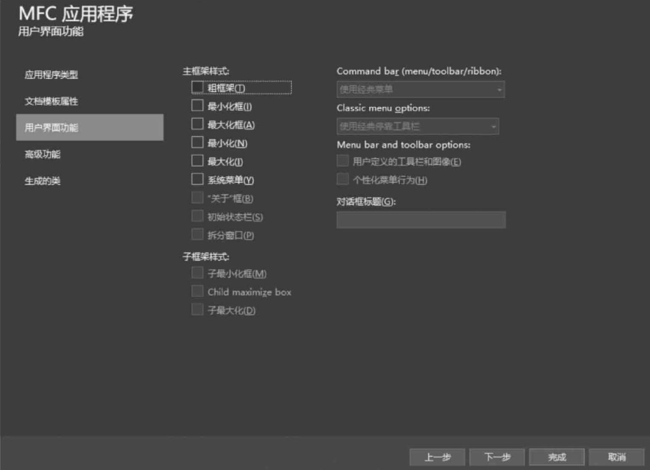
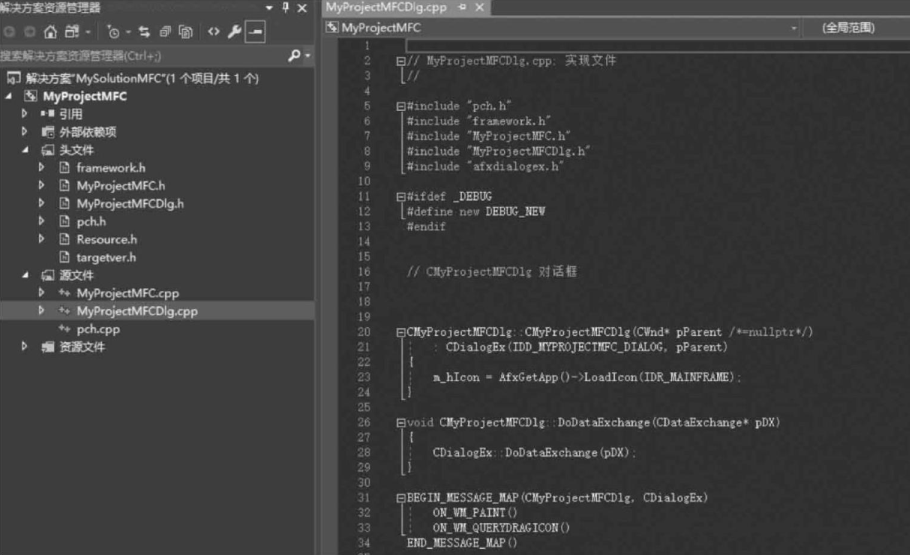
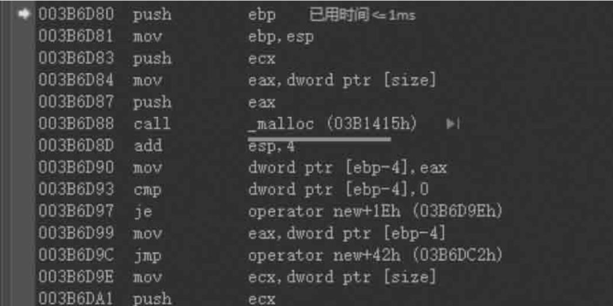
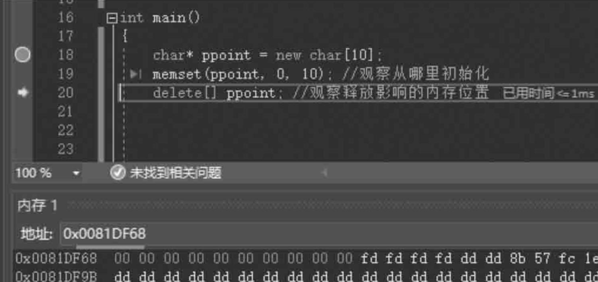
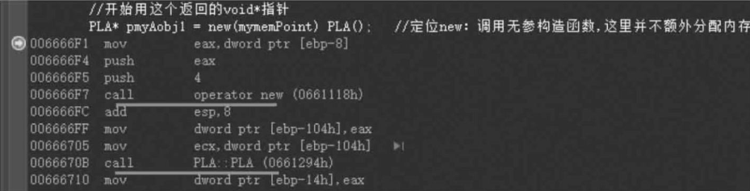

#  第13章 C++基本语言

## 13.6　函数新特性、inline内联函数与const详解

### 13.6.1　函数回顾与后置返回类型 

在C语言部分学习到了函数，也掌握了什么叫函数声明、函数定义的 概念。请注意：函数定义中如果有形参则形参应该有名字，而不光是只有 类型，但是如果并不想使用这个形参，换句话说这个形参并不在这个函数 中使用，则不给形参名也可以，但在调用这个函数的时候，该位置的实参 是必须要明确给出的。 看看如下范例，函数定义中的第二个形参只给出了类型，并没有给出 名字：

```cpp
int func(int a, int)
{
	return 4;
}
```

但是，在进行函数声明的时候，是可以没有形参名的。虽然写形参名 会帮助自己和其他读代码的人更好地理解代码，但是编译器会忽略形参 名。看如下函数声明的代码：

```cpp
int func(int, int);
```

上面这种写法叫作“前置返回类型"，也就是说函数的返回类型位于函数声明或者函数定义语句的开头。
在C++11中还引入了一种新的语法，叫后置返回类型，也就是在函数 声明或定义中把返回类型写在参数列表之后，对于有一些返回类型比较复 杂的情形，这种写法可能更容易让人看懂，同时，有一些比较特殊的场 合，还必须采用这种语法来书写，后面会讲解到。请读者先知道有这样的写法即可，当前不需要深究其他。看看如下范例：

```cpp
auto func(int, int) -> int;        //函数声明中的后置返回类型写法
auto func(int a, int b) -> int     //函数定义中的后置返回类型写法
{
	return 1;
}
```

总结一下“后置返回类型"的写法：前面放置auto关键字，表示函 数返回类型放到参数列表之后，而放在参数列表之后的返回类型是通过 “-＞"开始的。此外，补充一点函数书写时的说明：一个函数内包含的 代码不要太长，不同的功能尽量分解到多个函数中去写，一般一个函数内 (函数体)建议包含几十到上百行代码，尽量不要书写上千行代码，函数 体太过冗长也增加了他人阅读这段代码的理解难度和时间。

### 13.6.2　inline内联函数 

先看一个范例：

```cpp
inline int myfunc(int testv)   //函数定义，这里必须加inline
{
	return testv * (5 + 4) * testv;
}
```

注意上面这段代码，在该函数定义之前增加了一个inline关键字，增 加了这个关键字的函数，叫作内联函数。那么，inline有什么作用呢？
每个人都知道，调用函数是要消耗系统资源的，尤其是一些函数体很 小但却频繁调用的函数，调用起来很不划算，因为要频繁地进行压栈、出 栈动作以处理函数调用和返回的问题，这也意味着要频繁地为它们开辟内 存。为了解决这种函数体很小、调用又很频繁的函数所耗费的系统性能问 题，引入了inline关键字。该关键字的效果如下：
(1)影响编译器，在编译阶段完成对inline函数的处理，系统尝试 将调用该函数的动作替换为函数的本体(不再进行函数调用)。通过这种 方式，来提升程序执行性能。 
(2)inline关键字只是程序员(开发者)对编译器的一个建议，编 译器可以尝试去做，也可以不去做，这取决于编译器的诊断功能，也就是 说决定权在编译器，无法人为去控制。 
(3)传统书写函数时一般将函数声明放在一个头文件中，将函数定 义放在一个.cpp源文件中，如果要把函数 定义放在头文件中，那么超过1 个.cpp源文件要包含这个头文件，系统会报错，但是内联函数恰恰相反， 内联函数的定义就放在头文件中，这样需要用到这个内联函数的.cpp源文 件都能通过#include来包含这个内联函数的源代码，以便找到这个函数 的本体(源代码)并尝试将对该函数的调用替换为函数体内的语句。
那么，使用内联函数的优缺点是什么呢？
用函数本体取代函数调用，显然可以增加效率。但同时带来的问题是 函数代码膨胀了。所以内联函数函数体要尽可能短小，这样引入inline才 有意义。请读者想一想，调用一个函数时需要压栈开辟内存等动作，假如 这些动作需要花费1s的时间，如果在这个函数中代码的执行需要花费 1000s的时间，那这个函数写成内联函数之后，也就节省了1s的时间，但 是源文件代码却膨胀的很大。如果在多个地方调用这个函数，那就相当于 多个地方出现代码的重复膨胀，代码在程序运行时也是要占用内存的，因 为内存中有代码段专门保存程序代码。 
请注意： 
(1)编译器不同，可能内联的结果也不同，有些编译器很聪明，优 化好了只剩下一个结果，有些编译器差了一点，优化成一些表达式，再差 一点的编译器就真变成直接把函数体中的语句拿来替换到函数调用处了。 
(2)inline函数尽量简单，代码尽量少，尤其是各种复杂的循环、 分支、递归调用等，尽量少出现在内联函数中，否则，编译器可能会因为 这些代码的原因拒绝让这个函数成为内联函数。 
(3)前面讲解constexpr函数时，回忆一下给函数加constexpr的目 的，就是因为要将该函数用在常量表达式中。当时曾经说过，这种 constexpr函数，函数体必须要写的特别简单，如果写了某些多余的语 句，那么编译就会出错，所以，可以把constexpr函数看成是更严格的一 种内联函数，因为constexpr自带inline属性。 
(4)内联函数有点像宏展开(#define)，宏展开和内联函数有各种 差别，如类型检查等。如果读者有兴趣，可以通过搜索引擎了解一下，不 过此时可以先不了解这些，以后慢慢探究，笔者担心的是探究的内容太多 往往会适得其反，容易使读者糊涂和记忆混乱，所以在学习中，笔者比较 赞同少就是多的原则。
其实，内联函数本身也是一个庞大和复杂的话题，有些说法也不一， 五花八门的编译器都做了很多内部的额外处理，读者也就不需要一一追 究，暂时先记住笔者给出的这些结论，以后如果遇到其他情况，再具体问 题具体分析。

### 13.6.3　函数特殊写法总结 

(1)函数返回类型为void表示函数不返回任何类型。但是，可以调 用一个返回类型为void的函数让它作为另一个返回类型为void的函数的返 回值。看看如下范例： 

```cpp
void funca()
{
	//……
}
void funcb()
{
	return funca();
}
```

(2)函数返回指针和返回引用的情况。看看如下范例：

```cpp
int * myfunc()
{
	int tmpvalue = 9;   //要变成全局变量
	return &tmpvalue;   //语法上没错，但留下巨大隐患。tmpvalue应该为全局量
}
int * p = myfunc();
*p = 6;
```

再继续看范例： 

```cpp
int &myfunc2()
{
	int tmpvalue = 9;
	cout << &tnpvalue << end1;   //009DEDD4
	return tnpvalue;             //不管怎么说这都是隐患
}

int &k = myfunc2();

//k地址中的内容不属于你,千万不可以去读或者写
cout << &k << end1;              //009DFDD4，这个地址和tmpvalue的地址相同，
                                 //这种返回相当于返回地址
```

针对上面这段调用myfunc2函数的代码，如果用下面这段代码替换，会怎样呢？

```cpp
int k = myfunc2();
cout << &k << end1;              //形如00BBFC98,这个地址和tmpvalue的地址不同
```

可以看到，此时输出的&k和myfunc2中输出的&tmpvalue的结果是 不同的，这种对myfunc2的调用方式，相当于返回了一个新的值。请读 者先记住：有时从函数中返回内容时，系统会临时构造一些必需的东西并 做一些并不为人熟知的操作来实现return目的。 
(3)不带形参的函数定义也可以写成如下，或者形参列表直接空着 更好。 

```cpp
int myfunc3(void){return 1;}
```

(4)如果一个函数不调用，则该函数可以只有声明部分，没有定义 部分。 
(5)回忆：函数声明一般放在头文件中，函数定义一般放在源文件 中，所以函数只能定义一次，但可以声明多次，因为多个源文件可能都包 含一个头文件，而且习惯上，函数定义的源文件中也把函数声明的头文件 包含进来。 
(6)在13.3.4节曾经讲过引用类型作为函数的形参—— voidfunc(int&ta，int&tb)，在函数中改变值会直接影响到外界实参 的值(所以通过这种手段相当于间接实现函数能够返回多个值的能力)。 否则实参和形参之间就是值传递，那就存在实参值复制给形参(值复制的 问题)。试想，如果传递的参数是很大的类对象(结构变量)，这种值复 制的效率是很低的，此时，就要考虑通过“引用型形参来进行函数调用参 数的传递"。看看如下范例： 

```cpp
struct student ( int num;};
void fs(student &stu)
{
	stu.num = 1010;
}
student abc;
abc.num = 100;
fs(abc);
cout << abc.num << end1;           //1010
```

请注意：C++中，更习惯使用引用类型的形参来取代指针类型的形 参，所以提倡读者在C++中多使用引用类型形参。
(7)C语言中，函数允许同名，但是形参列表的参数类型或者数量 应该有明显区别，这叫函数重载。
试比较如下每对重载的函数是否可以呢？

```cpp
void fs1(const int i){}
void fs1(int i){}
```

上面这对重载的函数不可以，因为const关键字在比较同名函数时会 被忽略掉。这两个函数相当于参数类型和数量完全相同，因此函数重载不 成立，编译链接时会报错。
再比较如下这对：

```cpp
void fs2(const int i){}
void fs2(float i){}
```

上面这对重载的函数可以，没有问题，因为形参的类型并不相同，一 个是int类型，一个是float类型。
再比较如下这对：

```cpp
void fs3(const int i){}
void fs3(const int i,const int j){}
```

上面这对重载的函数可以，没有问题，因为形参的数量不相同。

### 13.6.4　constchar *、charconst *与 char*const三者的区别 

根据前面学习到的知识，可以理解下面的代码了： 

```cpp
const int abc = 12;        //不能改变abc的值
```

上面这种const比较简单，下面这种带类型又带“*"的相对复杂一 些，请读者注意看和注意区分。
现在来区分几种写法：读者都已经知道char*，那么const分别在 char之前、在char和“*"之间以及在“*"之后，有什么区别呢？ 
(1)const char *p;
看看如下范例： 

```cpp
char str[] = "I Love China!";
char* p;
p = str;
*p = 'Y';
p++;                      //p可以指向不同的位置,只要这些位置的内存归我们管即可
```

若将p的定义修改为：

```cpp
const char *p;
```

则表示p指向的内容不能通过p来修改(p所指向的目标，那个目标中的内 容不能通过p来改变)。因此，有人把p称为常量指针(p指向的内容不能 通过p来修改)。
那么，如下代码就是错误的： 

```cpp
*p = 'Y';                //错误
```

当然，通过str修改内容则没问题：

```cpp
str[0] = 'Y';            //正确
```

(2)“charconst*p;"等价于“constchar*p;" 
(3)char*constp;
看看如下范例，密切注意注释中的内容： 

```cpp
char str[] = "I Love China!";
char* const p = str;    //定义的时候必须初始化
p++;                  //这不可以,p指向一个内容后,不可以再指向其他内容(p不可以指向不同目标)
*p = 'Y';             //但可以修改指向的目标中的内容
```

因此，有人把p称为 指针常量( p不可以再指向其他内容)。 
(4)“constchar*constp=str;"或“charconst*const p;" 
结合了(1)~(3)，表示p的指向不能改变，p指向的内容不能通过 p来改变。 
(5)还有一些引用类型的const用法读者也应该熟悉起来。看看如 下范例：

```cpp
int i = 100;          
const int &a = i;     //表示a代表的内容不能修改，所以a = 200;非法   
const int &b = 156;   //可以(字面值初始化常量引用)但int & = 156;错误，
                      //b看起来是分配了内存,后面讲解左值、右值概念时会再次详细探讨
b = 157;              //错误,b看成常量,值不能修改
```

### 13.6.5　函数形参中带const 

在函数中，形参和实参之间的值传递关系和上面讲解的各种常量、变 量定义时的初始化是比较像的。接着上面讲解过的范例讲解：

```cpp
struct student {int num; }
void fs(student &stu)
{
	stu.num = 1010;
}
student abc;
abc.num = 100;
fs(abc);
cout << abc.num << end1;         //1010
```

上面这段代码，可以注意到，在fs()函数中可以修改stu里的num 成员，修改后，该值会被带回到主调函数中，也就是说，fs()函数中对 形参stu的修改实际就是对实参abc的修改，因为这里形参采用的是引用类型。
如果不希望在函数fs中修改形参stu里的值，建议形参最好使用常量 引用(这种习惯希望读者去学习，因为这种习惯经常被用到)。

```cpp
void fs(const student &stu)
{
	stu.num =1010;                //这句就错误了,不能修改stu中的内容
}
```

再继续看范例：

```cpp
void fs(const int i)          //实参可以是正常的int,形参可以用constint接,这都没问题
{
	i = 100;                      //这也不行,不能给常量赋值
}
```

这种把形参写成const形式的习惯有许多好处： 
(1)可以防止无意中修改了形参值导致实参值被无意中修改掉。
(2)实参类型可以更加灵活。看看如下范例：

```cpp
struct student {int num; };
void fs(student &stu)
{
}
```

那如下在主函数main中的调用就是错误的：

```cpp
student abc;
abc.num = 100;
const student& def = abc;
fs(def);            //错误,因为def类型是const&,而函数fs的形参不带const
```

但如果像下面这样修改fs函数的形参：

```cpp
void fs(const student &stu)
{
}
```

可以看到，const student&这种类型的形参可以接受的实参类型更 多样化(程序代码更灵活)，可以接收普通引用作为实参，也可以接收常 量引用作为实参。那么，看如下代码：

```cpp
fs(def);          //正确
fs(abc);          //形参加了const,不影响从实参中接收普通对象
```

再继续看代码：

```cpp
void func2(int &a){}      //定义函数func2
```

那么，如果这样调用func2函数，是不可以的：

```cpp
func2(156);               //不可以,必须传递进去一个变量
```

但是如果像下面这样修改函数func2的定义：

```cpp
void func2(const int &a){}
```

读者可以发现，下面代码行就没问题了:

```cpp
func2(156);           //可以,可以传递进去一个常量了
```

## 13.7　string类型

### 13.7.1　总述 

在C语言部分讲解了很多C语言的内置类型，如int、float、char等， 这些是属于语言本身提供的。在C++中，因为标准库的存在，还会接触到 很多标准库中定义的类型。其中有一些标准库中所提供的类型非常常用， 如string类型、vector类型等。string是用来处理可变长字符串用的， vector是一种集合、容器或者动态数组的概念。后续都会学到。
另外要补充的是，标准库里有很多的东西都是现成的，尽量使用它 们，而不是自己去重复开发标准库中已经提供的功能，一来是重复劳动， 二来标准库里的代码都很优秀，如果自己开发，要想超越标准库中这些代 码的性能、效率、稳定性等，虽然不是说不可能，但一般人也很难做到。

### 13.7.2　string类型简介 

string类型是一个标准库中的类型，代表一个可变长字符串。
在C语言中，一般会用字符数组来表示字符串。例如：

```cpp
char str[100] = "I Love China";
```

那么在C++中，依然可以用字符数组来表示字符串，也可以用本节所 讲的string类型来表示字符串，而且，字符数组和string类型之间还可以 相互转换，后面都会学到。到底用字符数组还是用string，笔者觉得还是 取决于个人习惯，但string类型里提供了更多的操作字符串的方法，可能 更多的人会觉得使用string更加方便。
string也位于std命名空间中。所以，要使用string类型，在.cpp源 文件前面也增加usingnamespacestd;代码行，后续就可以直接使用 string类型。如果不加这行代码，每次都要使用std::string的形式，比较麻烦。
另外可能还需要(也可能不需要)在.cpp源文件开头包含string头文件：

```cpp
# include <string>
```

string类型，读者就把它看成是一个类类型，后面会详细讲解类的概念。

###  13.7.3　定义和初始化string对象 

看一看常用的初始化string对象的一些方法：

```cpp
string s1;                       //默认初始化,结果是s1="",代表一个空串,里面没有字符
string s2 = "I love China!";     //把I1oveChina!这个字符串内容复制到了s2代表的一段内存中
string s3("I love China!");      //这个其实跟s2的写法效果一样
string s4 = s2;                  //把s2中的内容复制到了s4所代表的一段内存中
int num = 6;
string s5(num, 'a');            //把s5初始化为连续num个字'a'组成的字符串，
                                //不过这种方式系统内部会创建临时对象,不太推荐
```

可以看到，这有很多种字符串的初始化方式，如直接初始化、复制初 始化等，后续章节讲解类的时候会重点讲解这些概念和初始化方式，现在 先不用理会太多，只需要知道，这些初始化方式都能够达到初始化字符串 的目的。

### 13.7.4　string对象上的常用操作 

(1)判断是否为空empty()，返回布尔值。

```cpp
string s1;
if(s1.empty())                 //成立
{
	cout << "s1为空" << end1;
}
```

(2)size()或者length()：返回字节/字符数量，可以理解成返 回的是一个无符号数unsignedint。

```cpp
string s1;
cout << s1.size() << end1;        //0
cout << s1.length() << end1;      //0
string s2 = "我爱中国";            
cout << s2.size() << end1;        //8,一个汉字占2字节  
cout << s2.length() << end1;      //8
```

(3)s[n]：返回s中的第n个字符(n是一个整型值)，字符位置从0 开始计算，位置值n也必须小于.size()，如果用下标引用超过这个范 围，或者用下标访问一个""的string，都会产生不可预测的结果。 

```cpp
string s3 = "I love China";
if (s3.size() > 4)
{
	cout << s3[4] << end1;        //v
	s3[4] = 'w';
}
cout << s3 << end1;                   //I love China
```

(4)s1+s2：字符串连接，返回连接后的结果，其实就是得到一个 新string对象。

```cpp
string s4 = "abcd":
string s5 = "hijk";
string s6 = s4 + s5;
cout << s6 << end1;              //abcdhijk
```

(5)s1=s2：字符串对象赋值，用s2里面的内容取代原来s1里面的 内容。

```cpp
string s7 = "abcd";
string s8 = "de";
s7 = s8;
cout << s7 << endl;              //de

```

(6)s1\==s2：判断两个字符串是否相等(长度相同，字符也全相 同)，大小写敏感，也就是大写字符与小写字符是两个不同的字符。 

```cpp
string s9 = "abc";
string s10 = "abc" ;
if(s9 == s10)                   //条件成立
{
	cout << "s9 == s10" << end1;
}
```

上面这个范例如果把s10字符串中任意字符修改为大写，那么s9和 s10就不相等了。 
(7)s1 != s2：判断两个字符串是否不相等。

```cpp
string s9 = "abc";
string s10 = "abC";
if(s9 != s10)              //条件成立
{
	cout << "s9 != s10" << end1;
}
```

(8)s.c_str()：返回一个字符串s中的内容指针(也就是说这个 内容实际上就是string字符串里的内容)，返回的是一个指向正规C字符 串的常量指针，所以是以“\0"结尾的。
这个函数是为了与C语言兼容，在C语言中没有string类型，所以得 通过string类对象的成员函数c_str把string对象转换成C中的字符串样 式。 

```cpp
string s9 = "abc";
string s10 = "abC";
const char* p = s10.c_str();        //现在p指向s10里边的字符串了,可以跟踪查看
char str[100];
strcpy_s(str, sizeof(str)，p);       //字符串内容复制到str中
cout << str << end1;                //abc
```

(9)读写string对象。

```cpp
string s1;
cin >> s1;                        //输入 abc 回车
cout << s1 << end1;                //输出 abc
```

(10)字面值和string相加。

```cpp
string s1 = "abc";
string s2 = "defg";
string s3 = s1 + " and " + s2 + 'e';
cout << s3 << end1;               //abc and defge
```

以后讲解类的时候会讲到隐式类型转换，实际上在这里"and "和'e'(字符串和单个字符)都被转换成了string对象参与加法运算。
但有一点还是要注意一下： 

```cpp
string s1 = "abc";
string s2 = "defg";
string s5 = "abc" + "def";             //语法上不允许
string s5 = "abc" + s1 + "def";         //中间夹架一个string对象,语法上就允许
string s5 = "abc" + "def" + s2;         //错误,看来两个字符串不能挨着相加,否则会报语法错
```

其中：

```cpp
string s5 = "abc" + s1 + "def";
```

可以理解成"abc"+s1结果肯定是生成一个临时的string对象，然后又 跟def相加，再生成临时对象，然后复制给s5。
(11)范围for针对string的使用。
13.4.1节学习了范围for语句，能够遍历一个序列中的每个元素，这 里string就可以看成是一个字符序列。看看如下范例：

```cpp
string s1 = "I Love China";
for (auto c : s1)
{
	cout << c << end1;     //每次输出一个字符,后边跟一个换行
}
```

auto前面已经学过——变量类型的自动推断。这里相当于让编译器 自动推断c的类型，其实这里c的类型就是char。
还可以修改s1里的值，例如把小写字母变成大写字母。这里需要调整 一下这个c类型了，把这个类型调整成引用就可以了。请注意看，这里可 以设置断点调试，观看c的地址，其实是s1中字符串的地址。

```cpp
string s1 = "I love China";
const char* p = s1.c_str();
for (auto& c : s1)
{
	c = toupper(c);             //因为c是一个引用,所以这相当于改变s中的值
}
cout << s1<< end1;          //I LOVE CHINA
```

其实，针对字符串string还有很多的操作函数，这里只是先让读者认 识一下string，后面在深入学习过程中遇到其他各种string操作函数时再 继续讲解。

## 13.8 vector类型

### 13.8.1 vector类型简介

​		vector类型是一个标准库中的类型，代表一个容器、集合或者动态数组这样一种概念。既然是容器，那就可以把若干个对象放到里面。当然，这些对象的类型必须相同。简单来说，可以把一堆int型数字放到vector容器中去，复杂点说，可以把一堆相同类型的类对象放到vector容器中去。
​		所以，如果换个角度考虑，vector能把其他对象装进来，所以称为容器非常合适。容器这个概念经常被提及，读者要知道和理解这个概念。要想使用这种类型，需要在.cpp源文件开头包含vector头文件：

```cpp
#include <vector>
```

​		另外，为了方便引用这种类型，也要书写：  

```cpp
using namespace std;
```

定义一个vector类型对象。显然，一旦定义出来，这个对象就是容器了。例如想在里面保存int型数据(容器里面所要装的元素类型)，看如下代码 

```cpp
vector<int>vjihe;
```

​		上面的代码定义了一个vector类型的对象，名字叫作vjihe，这个对象里面保存的就是int型数据。为什么是int型数据呢？读者可以看到,vector后面有一对“＜＞"，“＜＞"里面是int，表示这个vector类型的对象(容器)里面存放的是int型对象(int型数据/元素)。

​		这个＜int＞的写法读者可能第一次见到，会觉得是一种奇怪的写法，在后面章节中会讲到“类模板"的概念，其实vector就是一个类模板，这里的“＜＞"实际上是类模板的一个实例化过程。但是类模板的实例化过程眼下对于读者来讲，理解起来还比较生涩，后面学习模板的时候再详细阐述，所以这里笔者换一种说法来帮助读者理解类模板。

​		vector理解成一个残缺的类类型，这意味着使用时光有类名vector还不够，还需要额外给vector类模板提供其要在其中保存什么类型数据的信息，这个信息就是通过＜int＞来提供(模板名后跟一对“＜＞"，“＜ ＞"内放入类型信息)，所以，在使用vector时，一定要在它后面跟一对“＜＞"并在其中跟一个该vector容器中要保存的数据(元素)类型的信息，这才算一个完整的类型(完整的类类型)。例如，vector不是一个完整类型，而vector＜int＞却是一个完整的类型。看看如下范例：

```cpp
struct student
{
    int num;
}
vector<student>studlist;//可以
vector<vector<string>>strchuan;//可以，该集合里面的每一个元素都是vector类型
//这样用有点绕，因为里面又包含了一层，
//所以理解起来又加大了一些，不提倡这样用
```

一般来讲，vector容器里面可以装很多种不同类型的数据作为其元素(容器中装的内容简称“元素")。看看如下范例：  

```cpp
vector<int *>vjihe2; //没问题
```

但是vector不能用来装引用。请记住，引用只是一个别名，不是一个对象。所以，下面的写法会报语法错误：  

```cpp
cppvector<int &>vjihe3; //语法错误
```

### 13.8.2 定义和初始化vector对象  

#### (1)空vector。  

定义如下：  

```cpp
vector<string>mystr;//创建一个string类型的空vector对象(容器)，现在mystr里不含任何元素
```

后续就可以用相关的一些操作函数往这个空对象里增加数据了。

例如，可以往这个容器的末尾增加一些数据。这里可以使用vector的成员函数push_back往容器末尾增加数据。看看如下范例，注意看它的下标[0]，[1]，[2]，…不断增长，如图13.3所示。

```cpp
mystr.push_back("abcd");
mystr.push_back("def");
```

#### (2)在vector对象元素类型相同的情况下，进行vector对象元素复制(新副本)  。

```cpp
vector<string>mystr2(mystr);//把mystr元素复制给了mystr2
vector<string>mystr3(mystr);//把mystr元素复制给了mystr3
```


图13.3 向vector容器末尾增加两个string类型对象(元素)

#### (3)在C++11中，还可以用初始化列表方法给初值，这个时候用“{}"括起来。  

```cpp
vector<string>def={"aaa","bbb","ccc"};
```

当然“{}"里面为空也可以，那就相当于没有初始化，是一个空的vector了。

#### (4)创建指定数量的元素。请注意，有元素数量概念的初始化，用的都是“()"。

```cpp
vector<int>ijihe2(20);//20个元素，下标[0]~[19],每一个元素都为0
vector<string>sjihe2(5);//五个元素，下标[0]~[4]，每一个元素值为""
```

#### (5)多种初始化。“()"一般表示对象中元素数量这种概念， “{}"一般表示元素的内容这种概念，但又不是绝对。看看如下范例：

```cpp
vector<int>i1(10);//圆括号括住的单个数字10，表示元素数量，每个元素值是默认的0
vector<int>i2{10};//{}括住的单个数字10，所以{}括住一般里面表示的是元素内容
vector<string>snor{"hello"};//一个元素，内容为hello
vector<string>s22{10};//10个元素，每个元素为""，因为10这个数字不能作为string 对象的内容，所以系统把他处理成元素数量了，不过不提倡这种写法
vector<string>snor{10,"hello"};;//10个元素，内容为"hello"
vector<int>i3(10,1);//先数量后内容，10个元素，每个元素值为1
vector<int>i4{10,1};//2个元素，第一个元素值为10，第二个元素值为1，等同于初始化列表
vector<int>i22{"hello"};//系统直接表编译错误
```

看上面这些范例，通过“{}"正常初始化的只有i2和snor，snor和s22看起来挺像——都带“{}"，但s22里面是一个数字，不是一个string类型值，所以无法通过“{}"这种初始化列表进行正常初始化。所以，结论就是：要想正常通过“{}"进行初始化，那么“{}"里面的值类型得跟vector后边的“＜＞"里面的元素类型相同。否则，“{}"里面提供的值就无法作为元素初始值，如s22和s23里面。

其实还有很多初始化方法，这里也不需要一一介绍，后面遇到再详细解释，基本上这里提到的初始化方法日常应用已经非常足够。     

### 13.8.3 vector对象上的操作  

其实，在使用vector时，最常见的情况是并不知道vector里会有多少个元素，使用时会根据需要动态地增加和减少。

所以一般来讲，使用者是先创建一个空的vector对象，然后通过代码向这个vector里增加或减少元素。这里将要介绍一些vector类型提供的常用方法。vector上很多的操作和string很相似。

(1)判断是否为空empty()，返回布尔值。

```cpp
vector<int>ivec;
if(ivec.empty())//条件成立
{
    cput<<"ivec为空"<<endl;
}
```

(2)push_back：一个非常常用的方法，用于向vector末尾增加一个元素。  

```cpp
vector<int>ivec;//先声明成空的vector对象
ipush.push_back(1);
ipush.push_back(2);
for(int i= 3;i<=100;i++)
{
    ivec.push.back(i);
}
```

在上面的范例中，注意观察，能够发现，值2在值1的后面(最后插入的元素在vector容器的最末尾)。调试结果如图13.4所示。  


图13.4  观察调用puch_back向vector容器末尾增加元素时的顺序问题

(3)size：返回元素个数  。

```cpp
cout<<ivec.size()<<endl;//100
```

(4)clear：移除所有元素，将容器清空  。

```cpp
ivec.clear();
cout<<ivec.size()<<endl;//0
```

(5)v[n]：返回v中的第n个字符(n是一个整型值)，位置从0开始计算，位置值n也必须小于.size()，如果下标引用超过这个范围，或者用下标访问一个空的vector，都会产生不可预测的结果(因为编译器可能发现不了这种错误)。  

```cpp
ivec.clear();
ivec.push_back(1);
ivec.push_back(2);
cout<<ivec[1]<<endl;//2
```

(6)赋值运算符(=)。  

```cpp
vector<int>ivec;先声明成空的vector对象
ivec.push_back(1);
ivec.push_back(2);
for(int i=3;i<=100;i++)
{
    ivec.push_back(i);
}
vector<int>ivec2;
ivec2.push_back(111);
ivec2=ivec;//也得到了100个元素，用ivec中的内容取代了ivec2中原有内容，上行这个111就被冲掉了
ivec2 = {12，13，14，15};//用{}中的值取代了ivec原有值
cout<<ivec2.size()<<endl;
```

(7)相等和不等(==和!=)。  

两个vector对象相等：元素数量相同，对应位置的元素值也都相同。否则就是不相等。  

```cpp
vector<int>ivec;//先声明成空的vector对象
ivec.push_back(1);
ivec.push_back(2);
    for(int i=3;i<=100;i++)
{
    ivec.push_back(i);
}
vecxtor<int>ivec2;
ivec2=ivec;
if(ivec2==ivec)
    cout<<"ivec2==ivec"<<endl;//成立
if(ivec2 != ivec)
    cout<<"ivec2!=ivec"<<endl;//成立
```

(8)范围for的应用：和讲解string时对范围for的应用类似。  

```cpp
vector<int>vecvalue{1,2,3,4,5};
for(auto& vecitem:vecvalue)//为了修改vecvalue内部值，这里是引用，引用会绑定到元素上，达到通过引用改变元素值的目的
    vecitem*=2;//扩大一倍
for(auto vecitem:vecvalue)
    cout<<vecitem<<endl;
```

针对范围for语句，这里希望引申一步进行讲解。

如果在范围for中，增加改变vector容量的代码，则输出就会变得混乱

```cpp
vector<int>vecvalue{1,2,3,4,5};
for(auto vecitem:vecvalue)
{
    vecvalue.push_back(888);//输出彻底混乱
    cout<<vecitem<<endl;
}
```

范围for，在这里用来遍历vector容器中的元素。这里的vecitem是定义的一个变量，后面的vecvalue是一个序列(容器)，for语句中使用auto来确保序列中的每个元素都能够转换成变量vecitem对应的类型，所以一般在范围for语句中习惯使用auto(编译器来指定合适的vecitem类型)。

那为什么上述代码会产生混乱的输出呢？

因为每次执行for循环，都会重新定义vecitem，并且把它的值初始化成vecvalue序列中的下一个值。在刚刚进入这个for循环时，在系统内部会记录序列结束的位置值，但一旦在这个范围for里面改动这个序列的容量(如增加/删除元素)，那么这个序列结束的位置值就肯定会发生改变，这个改变会导致for语句的混乱，其输出的值也就乱了。

所以，请记住一个结论，在for语句中，不要改变vector的容量，增加、删除元素都不可以。请读者千万千万不要写出这种错误代码，否则隐患无穷，切记切记！

其实，针对vector，还有很多其他的操作函数，这里只是先认识一下vector，后面在深入学习过程中遇到其他各种vector操作函数再继续讲解

## 13.9

#### 13.9.1　迭代器简介

迭代器是一个经常听到和用到的概念。

上一节学习了vector，笔者说过，这是一个容器，里面可以容纳很多对象。那迭代器是什么呢？迭代器是一种遍历容器内元素的数据类型。这种数据类型感觉有点像指针，读者就理解为迭代器是用来指向容器中的某个元素的。

string可以通过“[]"(下标)访问string字符串中的字符，vector可以通过“[]"访问vector中的元素。但实际上，在C++中，很少通过下标来访问它们，一般都是采用迭代器来访问。

除了vector容器外，C++标准库中还有几个其他种类的容器。这些容器都可以使用迭代器来遍历其中的元素内容。string其实是字符串，不属于容器，但string也支持用迭代器遍历。

通过迭代器，可以读取容器中的元素值、修改容器中某个迭代器所代表(所指向)的元素值。此外，迭代器可以像指针一样——通过++、--等运算符从容器中的一个元素移动到另一个元素。

许多容器如上述的vector，在C++标准库中，还有其他容器如list、map等都属于比较常用的容器，C++标准库为每个这些容器都定义了对应的一种迭代器类型，有很多容器不支持“[]"操作，但容器都支持迭代器操作。写C++程序时，笔者也强烈建议读者不要用下标访问容器中的元素，而是用迭代器来访问容器中的元素。

#### 13.9.2　容器的迭代器类型

刚刚讲过，C++标准库为每种容器都定义了对应的迭代器类型。这里就以容器vector为例，演示一下：  

```cpp
vector<int>iv={100,200,300};//定义一个容器
vector<int>::iterator iter;//定义迭代器，也必须是以vector<int>开头
```

上面的语句是什么意思呢？后面这条语句定义了一个名为iter的变量(迭代器)，这个变量的类型是vector＜int＞::iterator类型，请注意这种写法“::iterator"。iterator是什么？它是每个容器(如vector)里面都定义了的一个成员(类型名)，这个名字是固定的，请牢记。

在理解的时候，就把整个vector＜int＞::iterator理解成一种类型，这种类型就专门应用于迭代器，当用这个类型定义一个变量的时候，这个变量就是一个迭代器。

#### 13.9.3　迭代器begin/end、反向迭代器rbegin/rend操作

##### 1．迭代器

每一种容器，如vector，都定义了一个叫begin的成员函数和一个叫end的成员函数。这两个成员函数正好用来返回迭代器类型。看看如下范例

(1)begin返回一个迭代器类型(就理解成返回一个迭代器)。

```cpp 
iter = iv.begin();//如果容器中有元素，则 begin 返回的迭代器指向的是容器中的第一个元素，这
//里相当于 iter 代表着元素 iv[O]
```

(2)end返回一个迭代器类型(就理解成返回一个迭代器)  

```cpp
iter = iv.end( ) ;//end 返回的迭代器指向的并不是末端元素，而是末端元素的后面，这个后面怎么
//理解？就理解成 end()指向的是一个不存在的元素
```

对上面的代码进行跟踪调试，观察begin和end结果可以看到， end()指向了一个乱数字，如图13.5所示。  


图13.5 迭代器end操作指向的是容器末端元素的后面(一个乱内容)  

begin和end成员函数指向的容器位置示意图如图13.6所示。  

(3)如果容器为空，则begin返回的迭代器和end返回的迭代器相同。看看如下范例：

```cpp
vector<int>iv2;
vector<int>::iterator iterbegin = iv2.begin();
vector<int>::iterator iterend = iv2.end();
if(iterbegin = iterend)
{
    cout<<"容器为空"<<endl;
}
```


图13.6 容器的begin和end成员函数返回的迭代器指向示意图    

所以，end返回的迭代器并不指向容器vector中的任何元素，它起到实际上是一个标志(岗哨)作用，如果迭代器从容器的begin位置开始不断往后游走，也就是不断遍历容器中的元素，那么如果有一个时刻，iter走到了end位置，那就表示已经遍历完了容器中的所有元素。

(4)写一段代码，传统的通过迭代器访问容器中元素的方法如下：

```cpp
vector< int > iv = { 100,200,300 };//定义一个容器经典传统用法，这里用++、!=等运算符来对迭代器进行操作
for ( vector< int >::iterator iter = iv.begin(); iter != iv.end();iter++)}
{
	cout<<* iter<<endl;
}
```

运行起来看结果：100、200、300。  

##### 2．反向迭代器

如果想从后面往前遍历一个容器，那么，用反向迭代器就比较方便。反向迭代器使用的是rbegin成员函数和rend成员函数。

(1)rbegin返回一个反向迭代器类型，指向容器的最后一个元素。

(2)rend返回一个反向迭代器类型，指向容器的第一个元素的前面位置。

rbegin和rend成员函数指向的容器位置示意图如图13.7所示。


图13.7 容器的rbegin和rend成员函数返回的反向迭代器指向示意图  

看看如下范例：  

```cpp
vector< int> iv = { 100,200,300 };
for(vector < int>::reverse_iterator riter = iv.rbegin(); riter != iv.rend(); riter++)
{
cout<<* riter<<endl;
}
```

运行起来看结果：300、200、100。  

#### 13.9.4　迭代器运算符

(1)iter：返回迭代器iter所指向元素的引用。必须要保证该迭代器指向的是有效的容器元素，不能指向end，因为end是末端元素后面的位 置 ， 也 就 是 说 ， end 已 经 指 向 了 一 个 不 存 在 元 素 。 前 面 的`cout≪*iter≪endl;`就是使用*iter的演示范例，这里不做进一步演示了。

(2)++iter：和iter++是同样的功能——让迭代器指向容器中的下一个元素。但是已经指向end的迭代器，不能再++，否则运行时报错。

(3)--iter：和iter--是同样的功能——让迭代器指向容器中的前一个元素。了解++自然也就能了解--。看看如下范例

```cpp
vector< int> iv = { 100,200,300 }; //定义一个容器
vector< int >::iterator iter;
for(iter = iv. begin(); iter != iv.end(); ++iter)
{
	cout<<*iter<<endl;
}
//++iter; 
//已经指向 end 的迭代器，不能再++,否则运行时报错
--iter;//等价于 ite
cout<<*iter<<endl;r--//300
```

(4)`iter1==iter2或iter1!=iter2`：判断两个迭代器是否相等。如果两个迭代器指向的是同一个元素，就相等，否则就不相等。

(5)结构成员的引用。看看如下范例：  

```cpp
struct student
{
	int num;
};
vector < student> sv;
student mystu;
mystu.num = 100;
sv.push_back(mystu);//把对象 mystu 复 制到了 sv 容器中(是复帝l],此时 mystu 和容器 sv 中的student 没有直接关系)
mystu.num = 200;//在这 里修改 mystu 中的内容不会对容器中元素值造成影响，因 为容器中内容是复制进去的
vector< student>::iterator iter;
iter = sv.begin();//指向第一个元素
cout<<(*iter).num<<endl; //100,注意引用方法：* iter 是一个结构变量，所以用“."成员来引用成员
cout <<iter-> num<<endl;//100,注意引用方法：iter 想象成一个指针，所以用 引用成员
```

请注意，一定要确保迭代器指向有效的容器中的元素，否则范例中的这些行为可能会导致意想不到的结果。还有很多其他运算符，例如迭代器之间可以相减表示两个迭代器之间的距离，迭代器加一个数字表示跳过多少个元素，不过这些都不常用，不准备逐一介绍，意义也不大。读者如果以后遇到，有了现在所学的基础，再简单学习一下即可。  

#### 13.9.5 const_iterator迭代器  

前面学习了iterator这种迭代器类型，实际上每种容器还有另外一种迭代器类型，叫作const_iterator，从名字上能感觉到其含义：有const在，一般都表示常量，也就是说值不能改变的意思。这里的值不能改变表示该迭代器指向的元素的值不能改变，并不表示该迭代器本身不能改变，该迭代器本身是能改变的，也就是说，该迭代器是可以不断地指向容器中的下一个元素的。

所以该迭代器只能从容器中读元素，不能通过该迭代器修改容器中的元素。所以说，从感觉上来讲，const_iterator更像一个常量指针，而iterator迭代器是能读能写的。看看如下范例：

```cpp
vector < int> iv = { 100,200,300 }; //定义一个容器
vector < int>:：const_iterator iter;
for(iter = iv.begin(); iter != iv.end(); ++iter)
{
	* iter = 4; //不可以
	cout<<* iter<<endl; //可以，常量迭代器也可以正常地从容器中读元素值
}
```

什么时候用const_iterator呢？如果这个容器对象是一个常量，那么就必须使用const_iterator，否则报错：  

```cpp
const vector< int> iv = { 100,200,300 }; //定义一个容器，注意前面的 const
vector < int>::const_iterator iter;
for(iter = iv.begin(); iter != iv.end(); ++iter)//这里begin和end返回的是 const_iterator,返回的是 iterator 还是 const_iterator,取决于这个容器对象是否是 const 对象
{
	cout<<*iter<<endl;
}
```

这里再额外看一看cbegin和cend成员函数。这是C++11引入的两个新函数，与begin、end非常类似。但是，不管容器是否是常量容器， cbegin、cend返回的都是常量迭代器const_iterator。看看如下范例：   

```cpp
vector < int > iv = { 100,200,300 };//定义一个容器
for (auto iter = iv.cbegin(); iter != iv.cend(); ++iter)
{
	*iter = 58; //错误，不能给常量赋值，这说明 cbegin 返回的是常量迭代器
	cout<<* iter<<endl;
}
```

#### 13.9.6　迭代器失效

上一节在讲vector容器时谈过范围for循环语句——在遍历容器的时候，如果在for循环中，通过push_back等手段往容器中增加元素，范围for循环输出的容器中元素就会混乱。其实，范围for语句等价于常规的用迭代器对容器进行操作。看如下代码：  

```cpp
vector< int> vecvalue{ 1,2,3,4,5 };
for (auto vecitem : vecvalue)
{
	cout<<vecitem<<endl;
}
```

等价于迭代器这种操作方式：  

```cpp
for (auto beg = vecvalue.begin(), end = vecvalue.end(); beg != end; ++beg)
{
	cout<<* beg<<endl;
}
```

但如果一旦在for循环中增删容器中的元素，就会导致迭代器失效，整个结果就混乱了。其实，任何一种能够改变vector对象容量的操作，如push_back，都会使当前的vector对象迭代器失效，所以请读者谨记：在操作迭代器的过程中(使用了迭代器的这种循环体)，千万不要改变vector对象的容量，也就是不要增加或者删除vector容器中的元素。看如下代码：  

```cpp
for(auto beg = vecvalue.begin(),end = vecvalue.end();beg != end; ++beg)
{
	//这种循环内千万不要改变 vecvalue 对象的容量
}
```

对于向容器中添加元素和从容器中删除元素操作要小心，因为这些操作可能都会使指向容器元素的迭代器(也包括指针、引用等)失效。这种失效就表示它不能再代表任何容器中的元素，一旦使用这种失效的迭代器，就表示程序的书写犯了严重错误，很多情况下都会导致程序崩溃，就好比使用了没有被初始化的指针一样。

不同的容器实现机理不同(例如有的容器内部数据是连续存储的，插入元素时一旦原有内存不够用，则可能就会导致容器中原有数据全部迁移到一个新内存去，如vector等容器)，不同的插入操作、不同的插入位置，会导致迭代器、指针、引用部分或者全部失效，甚至在循环体中的诸如vecvalue.end()代码都会因为插入数据操作导致失效。

另一种情况是删除操作。如果从容器中删除一个元素，那么，当前指向这个被删除元素的迭代器、指针、引用肯定是立即失效，绝不能再引用它们。

此外，不同的容器，针对删除操作，不同的删除位置，也会导致迭代器 、 指 针 、 引 用 部 分 或 者 全 部 失 效 ， 甚 至 在 循 环 体 中 的 诸 如vecvalue.end()代码都会因为删除数据操作导致失效。

解决方法就是：如果在一个使用了迭代器的循环中插入元素到容器，那只插入一个元素后就应该立刻跳出循环体，不能再继续用这些迭代器操作容器。看看如下范例:

```cpp
for (auto beg = vecvalue.begin(), end = vecvalue.end(); beg != end; ++beg)
{
	vecvalue.push_back(888);
	break; //立刻跳出循环，这里的 beg、end 都不能再使用，以免出问题.后续重新用循环重新拿begin 和 end 来使用
}
//重新定位迭代器
for (auto beg = vecvalue.begin(), end = vecvalue.end(); beg != end; ++beg)
{
    //......
}
```

下面将进行一些灾难程序演示。

(1)灾难程序演示1

下面代码目前一切没有问题：  

```cpp
vector < int> vecvalue{ 1,2,3,4,5 };
auto beg = vecvalue.begin();
auto end = vecvalue.end();
while (beg != end)
{
	//……一些处理
	cout<<* beg<<endl;
	++beg; //注意这个不要忘记，并且要 放在循环末尾
}
```

接着，往循环中增加代码，注意while循环体中代码的变化  

```cpp
vector < int> vecvalue{ 1,2,3,4,5 };
auto beg = vecvalue.begin();
auto end = vecvalue.end();
while (beg != end)
{
	//……一些处理
	cout<<* beg<<endl;//假如想在 begin 这个位置插入新值，可以用 insert插入新值，第一个参数为插入位置，第二个参数为插入的元素.这一插人，肯定会导致哪个迭代器失效，比如说上面的 end 已经失效，或者是 beg 失效，但具体是哪个失效，取决于容器 vector 内部的实现原理，可能需要查资料才能搞明白到底哪个迭代器失效，如果搞不明白，最明智的做法是插入一个数据就跳出循环体，若要再次使用 beg 和 end,要给 beg 和 end 重新赋值
	vecvalue.insert(beg, 80);
	break; //这是明智的做法，否则肯定程序崩溃
	++beg; //上行是 break;,执行不到这行，这行其实没存在的意义
}
```

有些人可能有更多需求，例如就是想不断地插入多条数据，并且还希望迭代器不失效，那就得查资料研究，如研究针对vector容器，如何写insert这段代码，才能让迭代器不失效，让程序安全地运行。看如下代码，是一种满足连续插入多条数据的解决方案：  

```cpp
auto beg = vecvalue.begin();
int icount = 0;
while (beg != vecvalue.end())
{
	beg = vecvalue.insert(beg, icount + 80);//insert 的返回结果要保存
	icount++;
	if (icount > 10) //有个跳出循环体的条件.不能无限制地一直插入下去
		break;
	++beg; //注意这个不要忘记，并且要放在循环末尾
}
```

太细节的东西就不过多涉及，迭代器会失效的道理读者都懂了，笔者一般的做法就是如果这个循环和迭代器有关，笔者基本都只会做插入或删除操作一次，然后会立即break，因为保不准插入或删除操作导致哪个迭代器失效，所以立即break到循环体到外面去。

容器，如vector，还有很多的成员函数都不常用，并且这些成员函数和容器的实现相关，这方面的学习从简单应用层面来讲，可以不关注。

(2)灾难程序演示2

在一个程序运行结束之前，可能会习惯性地释放掉vector里面的内容。有些人可能会写出这样的代码来在程序的最后进行释放处理：


```cpp
vector < int > iv = { 100, 200, 300 };
//……
//在程序执行最后，要退出时
for (auto iter = iv. cbegin( ); iter != iv. cend( ); ++ iter)
{
	iv. erase( iter);//erase 函数，移除 iter 位置上的元素，返回下一个元素位置
}
```

运行后程序崩溃。肯定是迭代器失效导致崩溃。那就一定得要小心这种释放代码。

经过分析，erase会返回下一个元素位置，这个位置肯定要想办法保存，但因为这里用的是for循环，for循环里每次还有++iter这种操作，所以怎样改造能够让它安全释放，这是一个问题。经过思考和研究，找到了一种写法能够让容器顺利释放：

```cpp
vector < int >::iterator iter
while ( iter != iv. end( ) )
{
	iter = iv. erase( iter);
}
```

所以，如果说要把容器一下全部清空，用clear还是其他方法也好，都还算简单。但是如果需要用和迭代相关的循环来一个元素一个元素地删除，那一定更要注意。这里笔者推荐一个简单直接且有效的方法： 

```cpp 
while ( ! iv. empty( ) )
{
	auto iter = iv. cbegin( );//因为不为空，所以返回第一个元素肯定安全有效
	iv. erase( iter);////移除该位置上的元素，肯定没啥问题
}
```

#### 13.9.7　范例演示

(1)用迭代器遍历string类型数据。看看如下范例： 

```cpp 
string str("工 love China!");
for (auto iter = str.begin(); iter != str.end(); ++iter)//auto用着比较方便，一个字符一个字
//符遍历
{
	* iter = toupper( * iter);
}
cout<<str<<endl; //l LOVE CHINA!
```

(2)vector容器常用操作与内存释放。做一个小小的实践程序：假设有一些配置项，配置项里记录一些配置数据，当然这些配置项正常来讲应该写在文件中，这样方便随时修改，但因为是演示目的，就写在代码中即可。配置项如下：  

```cpp
ServerName = 1 区 //表示服务器名是什么
ServerlD = 100000//表示服务器 id 是什么
```

现在开始写代码：  

```cpp
struct conf
{
	char itemname[ 40];
	char itemcontent[100 ];
};
char * getinfo( vector < conf * > & conflist, const char * pitem)
{
	for (auto pos = conflist. begin( ); pos != conflist. end( ); ++pos)
	{
		if (_stricmp( ( * pos) - > itemname, pitem) == 0)
		{
			return ( 矢 pos ) - > itemcontent;
		}
	}
	return nullptr;
}
int main( ) //主函数
{
	conf * p_confl = new conf;
	strcpy_s( p_conf1- > itemname, sizeof (p_conf1- > itemname), "ServerName" ) ;
	strcpy_s( p_conf1- > itemcontent, sizeof (p_confl - > itemcontent ) , "1 区");
	conf * p_conf2 = new conf;
	strcpy_s( p_conf 2- > itemname, sizeof ( p_conf 2-> itemname), "ServerlD" );
	strcpy_s( p_conf 2- > itemcontent, sizeof (p_conf 2 - > itemcontent ) , "100000" ) ;
	vector < conf * > conflist;
	conflist. push_back( p_conf1) ;
	conf list. push_back( p_conf 2 );
	//现在 conf list 里就有数据了，以后要查询 ServerName ServerlD 的时候就可以查询了
	char * p_tmp = getinfo( conflist, nServerName" ) ;
	if ( p_tmp != nullptr)
	{
		cout <<p_tmp <<endl;//1 区
	}
	//要释放内存，自己 new 就要自己 delete, 否则会造成内存泄漏
	std::vector < conf * >::iterator pos;
	for (pos = conflist. begin( ); pos != conflist. end( ); ++pos)
	{
	//注意，这里并没有破坏迭代器，因为没有往 conflist 容器里增加/删除数据，只是删除迭
	//代器里元素所指向的由我们自己分配的内存
		delete ( * pos); // * pos 才是那个指针，所以这里要 delete ( * pos)
	}
	conflist.clearO;//这个要不要都可以，因为容器本身里边的内容，在容器失效后系统会自动释放
	return 0;
}
```

看一看conflist容器结构示意图，如图13.8所示。  


图13.8 conflist容器结构示意图  

## 13.10 类型转换：static_cast、reinterpret_cast等  

#### 13.10.1　隐式类型转换

在C语言部分已经对类型转换有了一定的了解，图2.21还提供了不同类型变量做混合运算时的转换规则图。例如，一个double和一个int做加法运算，那么int会转换成double，然后再和double做运算，这个类型转换是系统自动进行的，不需要人为介入，所以这种转换叫隐式类型转换。但如果用一个整型变量保存这个结果，因为是整型变量，不能保存小数部分，所以系统会把小数部分舍弃，把整数部分赋予这个变量，这也可以看作隐式类型转换。看如下代码：  

```cpp
int m = 3 + 45. 6;//48
double n = 3 + 45. 6;//48.6
```

#### 13.10.2　显式类型转换(强制类型转换)

显式类型转换，也叫强制类型转换。最简单的例子如下：  

```cpp
int k = 5 % 3. 2;//语法错，系统要求 % 两侧必须都为整型
int k = 5 % ( int)3. 2;//没问题
```

上面这个属于C语言风格的强制类型转换——直接把类型用“()"括起来。没有类型方面的检查，直接硬转，转的是对还是错，程序员必须提供保障。除了把类型用“()"括起来之外，其实，如果不括类型，括数字也可以，括数字也称为函数风格的强制类型转换(看起来有点像函数调用)：  

```cpp
int k = 5 % int(3.2); //没问题
```

在C++中，强制类型转换分为4种。当然，C语言中的强制类型转换依然支持，但这种支持只是为了语言兼容性的考虑。C++中的4种强制类型转换分别用于不同的目的，这4种强制类型转换，每一种都有一个不同的名字，C++中分这么细是为了提供更丰富的含义和功能以及更好的类型检查机制，方便代码的书写和维护。

下面来认识一下这4种强制类型转换(有时也称它们为强制类型转换运算符或者强制类型转换操作符)：static_cast、dynamic_cast、const_cast和reinterpret_cast。

可以注意到，这4种强制类型转换的名字都以_cast结尾，并且这4种强制类型转换都被称呼为“命名的强制类型转换"(因为它们每一个都有名字而且名字都不同)。

看一下这些命名的强制类型转换的通用形式：

```cpp
强制类型转换名< type >(express);
```

其中，强制类型转换名就是static_cast、dynamic_cast、const_cast、reinterpret_cast这4个名字之一，用来指定是哪种转换;type是转换的

目标类型;express是要转换的值。下面介绍一下这4种强制类型转换。

(1)static_cast：静态转换。读者就理解成正常转换，属于编译的时候就会进行类型转换的检查，用的时候要小心，代码中要保证转换的安全性和正确性，与C语言中的强制类型转换的感觉差不多，不要想太复杂了。一般的编译器能够执行的隐式的类型转换也都可以用static_cast来显式完成。

可用于：

①相关类型转换，如整型和实型之间的转换。看看如下范例：

```cpp
double f = 100.34f;
int i = (int)f;//c 风格的
int i2 = static cast < int >( f );//100,C++ 风格的
```

②后续学习类的时候子类转成父类类型(有继承关系)也能用static_cast。这里简单看一下代码，日后学习类和子类章节的时候就能理解得更深刻一点：  

```cpp
class A //父类
{
};
class B :public A //子类
{
};
int main( )
{
	B b;
	A a = static cast< A>( b);//把子类转成父类可以，但父类转成子类是不可以的
	return 0;
}
```

③void*与其他类型指针之间的转换：void *是属于“无类型指针"，也就是可以指向任何的指针类型。  

```cpp
int i = 10;
int * p = &i;
void * q = static_cast< void * >(p);
int * db = static_cast< int * >(q);//原本就是 int 指针还 要转回 int,否则可能转完里面的值就是错的
```

不可用于：  

一般不能用于指针类型之间的转换，如int *转double *、float *转double*等。  

```cpp
double f = 100.0;
double* pf = &f;
int* i = static_cast < int*>(pf); //不可以，无法编译通过
float* fd static_cast < float*>(pf); //不可以，无法编译通过
```

(2)dynamic_cast：该转换应用在运行时类型识别和检查(与static_cast不一样，static_cast是编译时类型检查)方面，主要用来进行父类型转成子类型，后面章节会详细讨论。但是因为要做类型检查，所以检查的代价很昂贵，但也保证了转换的安全性。

(3)const_cast：去除指针或者引用的const属性。换句话说，这个转换能够将const性质转换掉，这个类型转换只能做这件事(功能比较有限)。同样，也属于编译的时候就会进行类型转换的检查。

```cpp
const int ai = 90;
int ai2 = const_cast< int >(ai); //ai 不是指针，不是引用，所以不能转
const int* pai = &ai;
int* pai2 = const_cast< int* >(pai); //正确
*pai2 = 120;//通过这个写值是未定义行为，不要这么干，因为这里实际上是 const 的
cout<<ai<<endl; //调试下断点观察是 120,打印出来实际是 90
cout<<* pai<<endl; //调试下断点观察是 120,打印出来实际也是 120
```

其实上面的代码也可以写成类似的C语言风格： 

```cpp
const int ai = 90;
int* pai = (int* )&ai;
*pai = 120;//通过这个写值是未定义行为，不要这么干，因为这里实际上是 const 的
cout<<ai<<endl; //调试下断点观察是 120,打印出来实际是 90
cout<<* pai<<endl; //调试下断点观察是 120,打印出来实际也是 120
```

请注意，如果本来是一个常量，若强硬地用const_cast去掉了常量性质并往里面写值，这是一种未定义行为，不要这样做，以免产生无法预料的后果。除非它原来不是常量，后来被变为常量，再后来又用const_cast给它变回非常量，这个时候能往里写值。  

const_cast很特殊，只有这个转换能去掉表达式的常量属性，所以这个转换的能力是其他类型转换运算符无法替代的。

另外，const_cast也不能改变表达式类型。例如：

```cpp
int i = 10;
double d = const_cast < double >(i); //这不可以，用 static_cast 才行
```

(4)reinterpret_cast：也属于编译的时候就会进行类型转换的检查。但这是一个很奇怪的类型转换。reinterpret表示重新解释、重新解读的意思(将所操作的内容解释为另一种不同的类型)，用来处理无关类型的转换，也就是两个转换的类型之间没有什么关系，那就等于乱转、瞎

转、自由转的意思，就是怎么转都行，所以这个类型转换相当随意。常用于如下两种转换：

①将一个整型(地址)转换成指针、一种类型指针转成另外一种类型指针，按照转换后的类型重新解释内存中的内容。

②也可从一个指针类型到一个整型进行转换:

```cpp
int i = 10;
int * pi = &i;
int * p2 = reinterpret_cast < int* >(&i);
char * pc = reinterpret_cast < char *>(pi);
```

这种转换本身不报错，但这个地址本身存的是int，却把它转成字符指针，虽然转换成功(语法上对)，但要是当成字符指针用，肯定程序会出错。

当然，转成void*再转换回来还是可以的：

```cpp
int i = 10;
int* pi = &i;
void* pvoid = reinterpret_cast < void *>(pi); //可以
int * pi2 = reinterpret_cast < int* >(pvoid); //可以
```

笔者不建议读者轻易使用这个类型转换，这个类型转换被认为是一种危险的类型转换，似乎功能非常强大，类型之间任意转，编译器都不会报错，但从写程序的角度来讲，如果随便乱转显然没有意义，只会导致程序运行出错。所以这个类型转换安全性很差(只在一些很特殊的场合下会用)。但是以后在读他人代码时，看到这个类型转换可以观察观察别人是怎样使用的。看看如下范例：  

```cpp
int ivl = 100;
long long Ivl = 8898899400;
int* pivl = (int*)ivl;//8 字节的，88 亿多，十六进制为 2"26A,6DC8(：语言风格 = 0x00000064 {???}
int* piv2 = reinterpret_cast< int * >(ivl); // = 0xl26a6dc8 {???}
piv2 = reinterpret_cast< int*>(Ivl); //0xl26a6dc8 {???} 最前面的 2 丢了.int * 这里是 4 字节
long long ne = reinterpret_cast < long long>(piv2); //从指针类型至【整型 । ，十进制的 308964808
//等于十六进制的 0xl26a6dc8
```

#### 13.10.3　总结

(1)强制类型转换一般不建议使用。因为会干扰系统的正常类型检查。很多异常转换本来编译器会报错的，但是一旦用了这些类型转换，就会抑制编译器的报错行为。

(2)如果读者有兴趣，可以对这些类型转换做任意自己能想到的尝试，也许能够发现一些很诡异的内容或者有一些新发现也说不定。本节的主要目的还是带着读者先认识一下这些类型转换符，以免以后遇到它们时不知所措。

(3)有句话叫使用reinterpret_cast非常危险，而使用const_cast总是意味着设计缺陷。笔者觉得尤其要注意后面这半句话——读者如果真用到const_cast，就要检查检查自己代码的设计问题了，因为平白无故地利用const_cast去掉const属性是很让人费解的设计。

(4)如果实在需要用到类型转换，则写C++程序时就不建议再使用老式的C语言风格类型转换，建议全部用本节讲解的新风格。一般的， static_cast和reinterpret_cast就能很好地取代C语言风格的类型转换。

# 第14章 类

类的概念，在本章中会详细地进行介绍。整体来讲，本章讲解的内容 很基础、很全面，也极其重要。基本上C++语言必须掌握的基础内容都会 在本章出现，希望广大读者认真阅读，尽量不要错过每一个知识点。只有 基础打得牢，后面的路才会越走越顺。

## 14.1　成员函数、对象复制与私有成员 

### 14.1.1　总述

类是一种自定义的数据类型，也就是一个新类型。类与类之间，又不 是彼此孤立的，例如说一个类可以派生出子类，那么这个派生出子类的类 就变成了该子类的父类。
在设计一个类的时候要站在很多角度去考虑，这里先列举出几个比较 简单容易理解的角度。
(1)站在设计和实现者的角度来考虑，也就是自己。如何理顺在设 计一个类的时候这个类里的数据存储布局，有哪些必要的成员变量和成员 函数要定义和实现。 
(2)站在使用者的角度来考虑，需要给使用者提供哪些可以访问的 接口，而哪些接口不对外开放，只供类内的其他成员函数使用。
(3)在设计一个父类供子类继承的时候，如何设计这个父类。例如 设计一个车的类，然后将来可能很多子类会继承该类，如轿车、卡车、摩托车等，那么，设计父类时，可能就要把一些车的公共特性抽取出来放到 父类中，如都用油来驱动、都要在机动车道上行驶等这些公共特性。
因为可以有很多的角度来考虑类的设计，所以就产生了很多的设计思 想和设计概念，这些设计概念比较抽象，读者刚刚接触类，先不必了解这 些思想，而是把类的基础知识学好。

### 14.1.2　类基础 

(1)一个类就是一个用户自己定义的数据类型，可以把类想象成一 个名字空间，包着一堆内容(成员函数、成员变量)。 
(2)一个类的构成，最常见的就是成员变量、成员函数这两种。当 然，也有很多特殊的成员函数，它们的名字也特殊，功能也特殊，后续会 慢慢讲。 
(3)访问类的成员(成员函数、成员变量)时，如果用类的对象来 访问，就使用“对象名.成员名"来访问成员。如果用指向这个对象的指 针来访问，就使用“指针名-＞成员名"来访问成员。

```cpp
struct student
{
	int number;
	char name[100];
	void func(){};
}
student student1;         //定义结构变量,这里可以省略struct,直接用结构名student
student1.numbe = 1001;
strcpy_s(student1.name,sizeof(student1.name),"zhangsan" );
student1.func();          //调用成员函数
student * pstudent1 = &student1:
pstudent1 -> number = 1005;
cout << student1.number << end1;     //1005
```

(4)类中public修饰符修饰的成员提供类的访问接口，暴露给外 界，供外界调用，private成员提供各种实现类功能的细节方法，但不暴 露给外界(使用者)，外界无法使用这些private成员。
(5)struct(结构)是成员默认为public的class(类)。struct的 定义一般如下： ^

```cpp
struct A{…};
```

(6) class成员默认是private的。class的定义一般如下：

```cpp
class A{…};
```

上面定义了一个名为A的类，所以，A就成了一个类型，后续就可以 拿来使用。如此看来：

```cpp
struct A{…};
```

等价于

```cpp
class A{public: …};
```

建议写代码时尽量不要将class和struct混用，否则代码会显得比较 混乱。当然，如果把没有成员函数只有成员变量的数据结构定义为 struct，而把有成员函数的数据结构定义为class也是可以的，那就在编 写代码中一直遵循这个规则。总之，有一个共同遵循的标准，而不是随意 混用struct和class就好。

### 14.1.3　成员函数

看如下代码：

```cpp
//定义一个 Time 类
class Time
{
public:
	int Hour;
	int Minute;
	int Second;
};
//定义一个函数initTime
void initTime(Time& stmptime, int tmphour, int tmpmin,int tmpsec)
{
	stmptime.Hour = tmphour;
	stmptime.Minute = tmpmin;
	stmptime.Second = tmpsec;
}
//看看如何使用类
Time myTime;
initTime(myTime，11，14，5);      
cout << myTime. Hour << end1;       //11
cout << myTime.Minute << end1;      //14
cout << myTime. Second << end1;     //5
```

可以注意到，这样写程序是C语言中的写法，类Time和initTime函数 之间没有什么直接的关联关系。但显然，Time类和initTime函数之间应 该有关联关系。如果把initTime函数设计为类Time的成员函数，那么两 者就有关联关系了。调整Time类代码：

```cpp
class Time{
public:
	int Hour;
	int Minute;
	int Second;
	void initTime(Time& stmptime, int tmphour, int tmpmin,int tmpsec)//成员函数
	{
		stmptime.Hour = tmphour;
		stmptime.Minute = tmpmin;
		stmptime.Second = tmpsec;
	}
};
//看看如何调用成员函数
Time myTime;
initTime(myTime，11，14，5);         //这就是调用成员函数(使用成员函数)
cout << myTime. Hour << end1;       //11
cout << myTime.Minute << end1;      //14
cout << myTime. Second << end1;     //5
```

如果遵从常规的书写规范，把类定义和类实现放在分开的.h头文件 和.cpp源文件中，看看应该怎样写。在Time.h文件中，内容如下：

```cpp
#ifndef__MYTIME__
#define__MYTIME__
class Time{
public:
	int Hour;
	int Minute;
	int Second;
	void initTime(int tmphour, int tmpmin, int tmpsec);
};
# endif
```

在Time.cpp文件中，内容如下(记得要把Time.cpp加入到项目中来)：

```cpp
#include "Time. h"
//其中这两个冒号叫作用域运算符,表示initrime函数属于Time类,可能有多个不同的类,其他类
//中也可能有叫initrime()的成员函数,所以这里必须用 Time::来表明该函数属于 Time类void Time::initTime(int tmphour, int tmpmin, int tmpsec)
{
Hour = tmphour;//注意到,成员函数中可以直接使用成员变量名,哪个对象调用的该成员函数
             //那么这些成员变量就属于哪个对象.可以理解成类成员函数知道哪个对象
             //调用的成员函数自身
Minute = tmpmin;
Second = tmpsec;
}
```

主cpp文件(MyProject.cpp)的上面位置也要增加如下代码：

```cpp
#include "Time.h"c
```

其他代码都不变，编译链接后，程序可以正常执行。 
读者可能会有一点疑惑：类定义放在一个头文件中，多个.cpp文件都 包含这个头文件，那不就相当于这个类定义了多次吗？读者都知道，一个 全局变量不允许定义多次，一个类难道允许定义多次？
确实允许定义多次，类是一个特殊的存在，在多个不同的.cpp源文件 中用#include重复类定义是被系统允许的，这一点与定义一个全局变量 不同。所以许多人把类定义也称为“类声明"。

### 14.1.4　对象的复制

看如下代码：

```cpp
Time myTime2 = myTime;
Time myTime3(myTime);
Time myTime4{ myTime };
Time myTime5 = { myTime };
myTime5.Hour = 8;

Time myTime6 ;
myTime6 = myTime5;      //通过赋值操作来复制对象
```

可以注意到，对象是可以复制的，上面这几种写法都是对象复制，复 制后，每个对象都有不同的地址(每个对象的内容都保存在不同的内存 中，彼此互不影响)，而且成员变量的值都相等。
对象的复制，就是定义一个新对象时，用另外一个老对象里面的内容 进行初始化。在写法上，观察上面的代码，对象的复制可以使用“=" “()"“{}"“={}"等运算符进行。同时，上面的代码也演示了通过赋 值运算符来做对象的复制。
默认情况下，这种类对象的复制是每个成员变量逐个复制，如Time 类中的Hour、Minute、Second。那能否控制对象的这种逐个成员变量 复制的行为呢？能！只要给这个类定义一个恰当的“赋值运算符(或类似 的内容)"，就能够控制对象的复制行为，这个后面再讲，读者先有个印 象，这里提到的这个恰当的赋值运算符可以理解为一个成员函数，这个成 员函数负责控制复制哪些成员变量。

### 14.1.5　私有成员 

在Time类(Time.h)中增加一些成员，看如下代码：

```cpp
class Time{
	//……
private:
	int Millisecond;
private:
	void initMillTime(int mls);
	//……
```

类的私有成员变量和私有成员函数都只能在类的成员函数内调用，外界是无法直接调用的。
修改Time.cpp中的Time::initTime成员函数，在其中增加对 initMillTime成员函数的调用，同时，增加initMillTime成员函数的实现 代码：

```cpp
void Time::initTime(int tmphour, int tmpmin, int tmpsec)
{
	Hour = tmphour;
	Minute = tmpmin;
	Second = tmpsec;
	
	initMillTime(0);
}
void Time::initMillTime(int mls)
{
	Millisecond = mls;
}
```

私有成员的设置目的，主要是希望这些接口不暴露在外面，不被其他 使用者所知和所用(假设自己所开发的类即将被他人使用)，只为类内部 的其他成员函数使用。
所以，在设计类成员的时候要好好思考，对外暴露哪些接口，哪些接 口是类内部使用的。这样才更利于设计出优质的类结构和写出优质的代码。
在类定义内部，private和public修饰符修饰其下面的所有成员，一 直遇到其他的public或者private修饰符。因为定义class时，默认所有成 员为private，所以不加public修饰的成员全部都是private的。 
此外，一个类的定义中可以出现多个public、多个private，这都被 系统所允许。

## 14.2　构造函数详解、explicit与初始化列表

### 14.2.1　称呼上的统一 

为了书中后面内容描述的一致性，这里要做一些称呼上的统一。
(1)如果一个成员函数在class定义的内部将该成员函数完整地写出 来，包括该成员函数的所有实现代码，对于这种写法的成员函数，称为 “成员函数的定义"。例如：

```cpp
class A
{
public:
	void myfunc() //这种带有实现代码的成员函数称为成员函数的定义
	{
	//实现代码写在这里
	//.....
	}
};
```

(2)如果一个成员函数在class定义的内部(一般位于一个.h文件 中)只写出其声明，而具体的函数体代码写在了class定义的外部(一般 位于一个.cpp文件中)，那么，写在class内部的这部分称为“成员函数 的声明"，写在class外部的这部分称为“成员函数的实现"，请注意区 分。例如：

```cpp
class A
{
public:
	void myfunc();     //成员函数的声明
};

void A::myfunc()       //成员函数的实现
{
	//实现代码写在这里
	//……
}
```

当然，不管是(1)还是(2)中对成员函数的写法，都是允许的。

### 14.2.2　构造函数 

上一节建立了一个Time类，写了一个public的initTime成员函数用 于初始化成员变量的值，但问题是定义一个对象(也叫类对象)之后必须 要手工调用这个成员函数，如果忘了调用，那么该对象里面的成员变量的 值就变得不确定(未被初始化)，如果不小心使用了这些不确定值的成员 变量，就会出现代码编写错误。
在类中有一种特殊的成员函数，它的名字与类名相同，在创建类对象 的时候，这个特殊的成员函数会被系统自动调用，这个成员函数叫作“构 造函数"。显然，如果把一些成员变量的初始化代码放入构造函数中，就 摆脱了需要手工调用initTime成员函数来初始化成员变量之苦了——因为 构造函数会被系统自动调用。所以，可以简单理解成：构造函数的目的 (存在的意义)就是初始化类对象的数据成员(成员变量)。构造函数是 一个有些复杂但很重要的话题，希望读者能够认真学习。
在Time.h中的Time类内部，声明(有时也把写在.h头文件中的成员 函数的声明说成是“定义")一个public类型的构造函数：

```cpp
public :
	Time(int tmphour, int tmpmin, int tmpsec);
```

在Time.cpp中，实现这个构造函数：

```cpp
//构造函数的实现
Time::Time(int tmphour, int tmpmin, int tmpsec)
{
	Hour = tmphour;
	Minute = tmpmin;
	Second = tmpsec;
	initMillTime(0);
}
```

这里要注意几点：
(1)构造函数无返回值，以往书写无返回值函数时总在函数返回类 型位置书写void，如voidfunc(…)，而构造函数是确确实实在函数头什 么也不写，这也是构造函数的特殊之处。 
(2)不可以手工调用构造函数，否则编译会报错。 
(3)正常情况下，构造函数应该被声明为public，因为创建一个对 象时系统要调用构造函数，这说明构造函数是一个public函数，能够被外 界调用，因为class(类)默认的成员是private(私有)成员，所以必须 说明构造函数是一个public函数，否则就无法直接创建该类的对象了(创 建对象代码编译时报错)。
(4)构造函数中如果有参数，则在创建对象的时候也要指定相应的参数。
现在把所有的初始化代码放在了构造函数中，那么所有对象都会通过 调用构造函数完成创建和初始化。因为构造函数的存在，类对象的初始化 方式也就确定了，要带3个参数。看如下代码：

```cpp
Time myTime = Time(12，13，52);     //执行此行时调用构造函数
Time myTime2(12，13，52);           //执行此行时调用构造函数
Time myTime3 = Time{12，13,52};     //执行此行时调用构造函数
Time myTime4{12，13，52};           //执行此行时调用构造函数
Time myTime5 = {12，13，52};        //执行此行时调用构造函数

Time myTime6();//这不可以,没参数,而且该行可能被编译器误认为是函数声明
Time myTime7(12，13);              //不可以,缺少参数
```

上面代码中提供了多种Time对象的初始化方式，读者可以在类的构 造函数中设置断点并进行调试，可以发现，每次创建Time对象时，都会 自动调用Time类的构造函数。
在上一节内容中，如下这几种写法是进行对象的复制。对象的复制也 是用来生成新对象，但是可以注意到，如下这些复制相关代码并没有调用 传统意义上的构造函数，调用的实际是“拷贝构造函数"(后面会讲 解)。下面的代码为防止对象重名，对对象名进行了适当的修改：

```cpp
Time myTime2_1 = myTime;        //执行此行时并不调用构造函数
Time myTime3_1(myTime);         //执行此行时并不调用构造函数
Time myTime4_1{ myTime };       //执行此行时并不调用构造函数
Time myTime5_1 = { myTime };    //执行此行时并不调用构造函数
```

### 14.2.3　多个构造函数 

一个类中是否可以同时存在多个构造函数呢？可以。如果提供多个构 造函数，那么就可以为该类对象的创建提供多种创建的方法。但是，多个 构造函数之间总要有些不同的地方，如参数数量上或者参数类型上的不同。
下面在Time.h中的Time类内部再声明一个public类型的构造函数：

```cpp
Time();
```

在Time.cpp中实现这个新增的构造函数：

```cpp
//构造函数的实现
Time::Time()
{
	Hour = 12;
	Minute = 59;
	Second = 59;
	initMillTime(59);
}
```

现在换一种方法来创建类对象——创建对象时不再提供参数：

```cpp
Time myTime10   = Time();  //执行此行时调用无参的构造函数
Time myTime12;             //执行此行时调用无参的构造函数,注意写法:只有对象名
Time myTime13 = Time{};    //执行此行时调用无参的构造函数
Time myTime14{};           //执行此行时调用无参的构造函数,注意写法:跟了一个空{}
Time myTime15 = {};        //执行此行时调用无参的构造函数
```

从上面代码中可以发现，每次创建Time对象时，都会自动调用Time 类的构造函数，但这次调用的是无参的构造函数。

### 14.2.4　函数默认参数 

改造一下Time类中带3个参数的构造函数，在Time.h中，将第3个参数的默认值改为12。

```cpp
Time(int tmphour, int tmpmin, int tmpsec = 12);
```

此时，tmpsec参数就叫作函数的默认参数，也就是说如果生成Time 对象时，不给这个参数传递值，那么，这个参数的值就是12。
任何函数都可以有默认参数，对于传统函数，默认参数一般放在函数 声明中而不放在函数定义(实现)中，除非该函数没有声明只有定义。
对于类中的成员函数，默认参数写在类的成员函数声明而非实现(注 意称谓：成员函数的实现等价于传统函数的函数定义)中，也就是一般会 写在.h头文件中。
函数默认参数的规定：
在具有多个参数的函数中指定参数默认值时，默认参数都必须出现在 非默认参数的右侧，一旦开始为某个参数指定默认值，则它右侧的所有参 数都必须指定默认值。例如：

```cpp
Time(int tmphour, int tmpmin=59, int tmpsec = 12);  //可以,这没问题
Time(int tmphour, int tmpmin=59, int tmpsec);       //不可以,这不行
```

有了默认参数之后，初始化对象的时候，就可以只给该对象提供两个参数：

```cpp
Time myTime1_q{ 12, 13 };
```

但是新问题来了：如果现在在Time.h中声明一个只有两个参数的构 造函数会怎样呢？

```cpp
Time(int tmphour, int tmpmin);
```

那么，提供两个参数生成Time对象时，编译会报错：系统搞不清楚 构造这个对象时是应该调用带三个参数(含一个默认参数)的构造函数还 是带两个参数的构造函数。
那怎么解决呢？其实很简单，在Time.h中，把带三个参数的构造函 数中的默认参数值删掉即可：

```cpp
Time(int tmphour，int tmpmin，int tmpsec);//带三个参数的构造函数不带默认参数了
```

当然，要想让Time myTime1_q{12，13};这行代码能够正确地编译链接并生成可执行程序，在Time.cpp中还要把带两个参数的Time构造函数实现一下：

```cpp
//构造函数的实现
Time::Time(int tmphour, int tmpmin)
{
	Hour = tmphour;
	Minute = tmpmin;
	Second = 59;
	initMillTime(59);
}
```

### 14.2.5　隐式转换和explicit 

在C语言部分曾经学习过：一个float和一个int做运算的时候，系统 会把int型转换成float型然后两者再做运算。在类中，这种情况也可能发生。
这里谈一谈单参数的构造函数带来的隐式转换，编译系统其实背着开 发者在私下里还是做了很多事情的。如下两个对象定义和初始化，会发现 出现语法错误：

```cpp
Time myTime23 = 14;                   //现在语法错
Time myTime24 = (12，13,14,15,16);    //现在语法错,不管()中有几个数字
```

但是，当声明了单参数的构造函数时(修改Time.h文件中的Time类 定义)：

```cpp
Time(int tmphour);
```

修改Time.cpp增加单参数构造函数的实现代码：

```cpp
//单参数的构造函数
Time::Time(int tmphour)
{
	Hour = tmphour;
	Minute = 59;
	Second = 59;
	initMillTime(0);
}
```

可以发现，上面两种定义对象的方式不再出现语法错误，而且每一个 对象在定义和初始化时，都调用了单参数构造函数(尤其是括号里有很多 数字的，只有最后一个数字作为参数传递到单参数构造函数中去了)。
猜测一下上面的代码，把一个14给了myTime23，而myTime23是 一个对象，14是一个数字，那么编译系统应该是有一个行为，把14这个 参数类型转换成了Time类类型，这种转换被称为隐式转换或简称隐式类型转换。
现在再来写一个普通函数，它的形参类型就是Time类类型，格式如下：

```cpp
void func(Time myt)
{
	return ;
}
```

现在可以发现，用一个数字就能够调用func函数：

```
fune(16);     //这里依旧调用了Time类的单参数的构造函数
```

这说明系统进行了一个从数字16到对象myt(func函数的形参)的 一个转换，产生了一个myt对象(临时对象)，函数调用完毕后，对象 myt的生命周期结束，所占用的资源被系统回收。
此外，接着上面的代码行继续书写，如下代码行也调用了Time类的 单参数构造函数：

```cpp
myTime23 = 16;   //这句也调用了Time类的单参数构造函数,生成一个临时对象,然后把这个临时
                 //对象的值复制到了myTime23的成员变量去了
```

上面这些代码容易让人迷惑，也有点含糊不清，总结一下：

```cpp
Time myTime100 = {16};   //这种写法认为正常,带一个参数16,可以让系统明确调用带一个参数的
                         //构造函数
Time myTime101 = 16;     //代码比较含糊不清,这就存在临时对象或者隐式转换的问题
func(16);                //这显然也是含糊不清的代码,存在临时对象或者隐式转换的问题
```

上面这种隐式转换让人糊涂，是否可以强制系统，明确要求构造函数 不能做隐式转换呢？可以。如果构造函数声明中带有explicit(显式)， 则这个构造函数只能用于初始化和显式类型转换，来尝试一下。
现在，14.2.2 节中构造的5个对象myTime、myTime2、 myTime3、myTime4、myTime5都能够成功。此时，把带有3个参数的 Time构造函数的声明前面加上explicit(修改Time.h)，如下：

```cpp
explicit Time(int tmphour, int tmpmin, int tmpsec);
```

此时，编译项目，发现如下这行代码出现语法错误：

```cpp
Time myTime5 = { 12,13,52 };
```

把鼠标放到红色波浪线提示的错误处，可以看到，出现的错误提示信 息如图14.1所示。

图14.1　构造函数加explicit修饰后Visual Studio出现一些对象构造时的语法错误提示 

但是，myTime4这行代码比起myTime5只少了一个“="，却能够 成功创建对象。

```cpp
Time myTime4{ 12，13, 52 };     //能够成功创建对象
```

这说明一个问题：有了这个等号，就变成了一个隐式初始化(其实是 构造并初始化)，省略了这个等号，就变成了显式初始化(也叫直接初始化)。
现在，再理顺一下单参数的构造函数。目前如下调用都正常：

```cpp
Time myTime100 = { 16 }
Time myTime101 = 16;
func(16);
```

此时，把带有单参数的Time构造函数的声明前面加上explicit(修改 Time.h)。

```cpp
explicit Time(int tmphour);
```

可以看到，上面三种写法都报错，这说明三种写法都进行了隐式转 换。那如何进行修改呢？

```cpp
Time myTime100 = Time(16);    //或者Time{16}
func(Time(16));               //临时构造一个对象
```

建议：一般来说，单参数的构造函数都声明为explicit，除非有特别 的原因。当然，explicit也可以用于无参或者多个参数的构造函数中。看 如下代码：

```cpp
explicit Time();           //explicit用于无参的构造函数中
```

那么，对无参的构造函数使用了explicit之后，看看下面两行代码， 分析一下：

```cpp
Time time1{};        //可以，显式转换
Time time2 = {};     //不可以,隐式转换,就比上行多了一个“="就表示隐式初始化了
```

继续看代码：

```cpp
func({});              //不可以,隐式转换了
func({ 1,2,3 });       //不可以,隐式转换了
func(Time{});          //显式转换,生成临时对象,调用无参构造函数
func(Time{ 1,2,3 });   //显式转换,生成临时对象,调用三个参数的构造函数
```

### 14.2.6　构造函数初始化列表 

在调用构造函数的同时，可以初始化成员变量的值，注意这种写法： 笔者称它为冒号括号逗号式写法，位于构造函数定义(实现)中。注意， 这种写法只能用在构造函数中。修改Time.cpp中的内容：

```cpp
Time::Time(int tmphour, int tmpmin, int tmpsec)
                 :Hour(tmphour),Minute(tmpmin)//这就叫构造数初始化列表
```

初始化列表的执行是在函数体执行之前就执行了的。上面这种写法和 下面的写法类似，但下面的写法叫作函数体内赋值：

```cpp
Time::Time(int tmphour, int tmpmin, int tmpsec
{
	Hour = tmphour;
	Minute = tmpmin;
}
```

在这个范例中，用“构造函数初始化列表"和“函数体内赋值语句" 都可以实现对数据成员的初始化，日后随着学习的深入，会遇到一些必须 通过“构造函数初始化列表"来进行初始化的一些操作，到时候再详细讲 解和分析，目前先不涉及这么琐碎和深入的问题。
但是提倡优先考虑使用构造函数初始化列表，原因如下： 
(1)构造函数初始化列表写法显得更专业，有人会通过此来鉴别程 序员的水平。
(2)一种写法叫作初始化，一种写法叫作赋值，叫法不同。对于内 置类型如int类型的成员变量，使用构造函数初始化列表来初始化和使用 赋值语句来初始化其实差别并不大。但是，对于类类型的成员变量，使用 初始化列表的方式初始化比使用赋值语句初始化效率更高(因为少调用了 一次甚至几次该成员变量相关类的各种特殊成员函数，如构造函数等)。 这一点在后续的学习中可以更进一步体会。
避免写出下面的代码：

```cpp
Time::Time(int tmphour, int tmpmin, int tmpsec)
                  :Hour(tmphour),Minute(Hour)
                  //Hour、Minute谁先有值谁后有值是一个问题
```

上面代码段的问题在于：某个成员变量(Minute)值不要依赖其他 成员变量(Hour)，因为成员变量的给值顺序并不是依据这里的初始化 列表的从左到右的顺序，而是依据类定义中成员变量的定义顺序(从上到 下的顺序)，如果Hour定义在Minute下面(后面)，那么，给Minute 值的时候Hour值还尚未确定，所以上面的写法会让Minute中的值变得不 确定。

## 14.3　inline、const、mutable、this与static 

### 14.3.1　在类定义中实现成员函数inline 

接着上一节的Time.h和Time.cpp说，在Time.h中增加addhour成 员函数。注意，整个成员函数的定义都写在其中：

```cpp
public :
	void addhour(int tmphour)
	{
		Hour += tmphour;
	}
```

这种直接在类的定义中实现的成员函数(14.2.1节所称的“成员函数 的定义")会被当作inline内联函数来处理。回忆一下内联函数：系统将 尝试用函数体内的代码直接取代函数调用代码，以提高程序运行效率。但 还是老话：内联函数只是对编译器的建议，能不能inline成功，依旧取决 于编译器，所以，成员函数的定义体尽量写得简单，以增加被inline成功 的概率。

### 14.3.2　成员函数末尾的const 

读者对许多const的用法已经不陌生。const是“常量"的概念。这 里再介绍一种const的常用用法，就是在成员函数的末尾增加一个 const。请注意，对于成员函数的声明和实现代码分开的情形下，不但要 在成员函数的声明中增加const，也要在成员函数的实现中增加const。
那么这个成员函数末尾的const起什么作用呢？告诉系统，这个成员 函数不会修改该对象里面的任何成员变量的值等，也就是说，这个成员函 数不会修改类对象的任何状态。
这种在末尾缀了一个const的成员函数也称为“常量成员函数"。在 Time.h中增加一个新的成员函数，定义如下：

```cpp
void noone() const
{
	Hour += 10;     //错误,常量成员函数不可以修改成员变量值
}
```

从上面的代码可以看到，如果在noone成员函数中修改成员变量 Hour的值，是不被允许的。看看如下范例：

```cpp
const Time abc;          //定义const对象,这种对象有限制
abc.addhour(12);         //不可以,addhour成员函数是非const的,只能被非const对象调用
abc.noone();             //可以,因为noone成员函数是const的

Time def;
def.noone();    //noone是const成员函数,则不管 const 对象还是非 const对象都可以调用 const
                //成员函数(万人迷,性格好),而非const成员函数不能被const对象调用,只能被
                //非const 对象调用
```

普通函数(非成员函数)末尾是不能加const的。编译都无法通过， 因为const在函数末尾的意思是“成员函数不会修改该对象里面任何成员 变量值"，普通函数没有对象这个概念，所以自然不能把const放在普通 函数末尾。

### 14.3.3　mutable

mutable，翻译成中文，表示不稳定的、容易改变的意思。与const 正好是反义词。而且mutable的引入也正是为了突破const的限制。
刚刚已经看到，在末尾有const修饰的成员函数中，是不允许修改成 员变量值的。那在设计类成员变量的时候，假如确实遇到了需要在const 结尾的成员函数中希望修改成员变量值的需求，怎么办呢？
也许有人会说，那就把函数末尾的const去掉，变成一个不以const 结尾的成员函数。那这个时候可能面临上面曾提到过的另外一个问题—— 如果这个成员函数从const变成非const了，那么就不能被const对象调用 了。
所以，引入了mutable修饰符(关键字)来修饰一个成员变量。一个 成员变量一旦被mutable所修饰，就表示这个成员变量永远处于可变状 态，即使是在以const结尾的成员函数中。
在Time类定义中增加一个mutable成员变量的定义：

```cpp
mutable int myHour;
```

现在可以在noone成员函数中增加修改myHour成员函数的代码了：

```cpp
void noone() const
{
	myHour += 3;      //可以修改成员变量myHour了
}
```

这里先简单认识mutable，以后随着看到的程序越来越多，会对它具 体有什么实用价值有更深刻的理解和体会。

### 14.3.4　返回自身对象的引用——this 

在Time.h的Time类定义中增加如下代码来进行一个新成员函数 rtnhour的声明：

```cpp
public :
	Time& rtnhour(int tmphour);   //返回自身的引用
```

在Time.cpp中，增加成员函数rtnhour的实现：

```cpp
Time& Time: :rtnhour(int tmphour)
{
	Hour += tmphour;
	return * this;       //把对象自身返回了
}
```

在main主函数中书写如下代码：

```cpp
Time mytime;
mytime.rtnhour(3);     //可以设置断点,跳入该成员函数内查看this和*this
```

现在要谈一谈this了。
this用在成员函数中是一个隐藏起来的函数参数，表示的是指向本对象的指针。那么，*this表示该指针指向的对象也就是本对象。换句话 说，*this表示调用这个成员函数的那个对象。
如何具体理解this呢？调用成员函数时，编译器负责把调用这个成员 函数的对象的地址传递给这个成员函数中一个隐藏的this形参中。例如上 面mytime.rtnhour(3);这种调用，编译器在内部实际是重写了这个 rtnhour成员函数的。编译器写成这样了：

```cpp
Time& Time::rtnhour(Time * const this, int tmphour){……}
```

调用的时候编译器实际是这样调用的：

```cpp
mytime.rtnhour(&mytime,3);
```

注意，上面的代码传入的第一个实参是mytime对象的地址。
这也解释了为什么在rtnhour成员函数体中可以直接使用诸如Hour 成员变量，就是因为在系统的角度看来，任何对类成员的直接访问都被看 作 通 过 this 做 隐 式 调 用 。 所 以 在 rtnhour 中 的 代 码 “Hour+=tmphour;"等价于“this-＞Hour+=tmphour;"。
this是系统保留字，所以参数名、变量名等都不能起名叫this，系统 不允许。
其实，this本身是一个指针常量(不是常量指针，参考13.6.4节的说 法)，总是指向这个对象本身，不可以让this再指向其他地方。
关于this有一些说法，请注意：
(1)this指针只能在成员函数(普通成员函数，后面会讲解比较特 殊的成员函数)中使用，全局函数、静态函数等都不能使用this指针。
(2)在普通成员函数中，this是一个指向非const对象的指针常量。 例如，类类型为Time，那么this就是Time*const类型的指针(指针常 量)，表示this只能指向Time对象。笔者认为：“指针常量"这个名字 起的不好，因为这个名字听起来更像是一个常量而不是一个指针。 
(3)在const成员函数中，this指针是一个指向const对象的const 指针。例如，类类型为Time，那么this就是constTime*const类型。
既然能返回对象本身，那么如果再写一个类似rtnhour这样的函数， 这两个函数就能串起来调用。
在Time.h的Time类定义中增加如下代码来进行一个新成员函数 rtnminute的声明：

```cpp
public :
	Time& rtnminute(int tmpminute);     //返回自身的引用
```

在Time.cpp中，增加成员函数rtnminute的实现：

```cpp
Time& Time::rtnminute(int tmpminute)
{
	Minute += tmpminute;//如果传递进来的形参也叫Minute,那么成员变量 Minute可以写成
                       //this.Minute以和形参做区别,代码就变成this.Minute+=Minute
	return * this;//把对象自身返回了
}
```

在main主函数中书写如下代码：

```
Time mytime;
mytime.rtnhour(3).rtnminute(5);       //可以设置加断点调试,会发现:先调用 rtnhour,再调用                                       // rtnminute           
```

另外值得强调的是：this一般不写在代码中。当然，读者以后也许能 见到一些使用this的代码，但一般来讲，还是很少直接使用this的。换句 话说，代码中其实是在隐式使用this，并没有写到明面来使用，因为多数 情况下摆到明面使用this属于画蛇添足。例如，非要写如下代码(把针对 成员的引用前面都加上this-＞)也是可以的：

```cpp
Time::Time(
{
	this -> Hour = 12
	this -> Minute = 59;
	this -> Second = 59;
	this -> initMillTime(59);
}
```

### 14.3.5　static成员 

static关键字在C语言部分已经详细讲解过，参考7.6.5节。
现在看一看static关键字在类中的能力。看如下代码：

```cpp
Time mytime1;          //调用的是无参构造函数
mytime1.Minute = 15;

Time mytime2;
mytime2.Minute = 30;
```

设置断点并跟踪调试可以看到，mytime1对象的Minute成员变量值 是15，而mytime2对象的Minute成员变量值是30。不同对象的成员变量 Minute有不同的值，彼此互不影响。为什么互不影响？因为Minute这种 成员变量是属于对象的(跟着对象走)，mytime1和mytime2是两个不 同的对象，所以它们的Minute成员变量自然可以理解成是两个不同的变 量——各自占用不同的内存地址。
那有没有这样一种成员变量，不属于某个对象的，而是属于整个类的 (跟着类走)？有。这种成员变量就叫static成员变量(静态成员变 量)，其特点是：不属于某个对象，而是属于整个类，这种成员变量可以 通过对象名来修改(也可以通过类名来修改)，但一旦通过该对象名修改 了这个成员变量的值，则在其他该类对象中也能够直接看到修改后的结果。
例如上面的Minute成员变量，每个对象针对该成员变量都有个副本，可以保存不同的值，而static成员变量是所有该类的对象共享同一个副本。也就是说，这种成员变量只有一个副本。同时，可以用“类名::成 员变量名"的方式对这种成员变量进行引用。
当然，不仅对于成员变量，成员函数也可以在其前面增加static关键 字，增加了这种关键字的成员函数同样不隶属于某个对象，而是隶属于整 个类，调用的时候可以用“类名::成员函数名(……)"这种调用方式。 当然，在static成员函数中，一般也只能操作和类相关的成员变量 (static成员变量)，不能操作和对象相关的成员变量，如Minute。
看如下代码，在Time.h中的Time类内部，声明一个静态成员变量和 一个静态函数：

```cpp
public :
	static int mystatic;                   //声明静态成员变量但没有定义
	static void mstafunc(int testvalue);   //声明静态成员函数
```

静态成员变量和普通成员变量不同，普通成员变量在定义一个类对象 时，就已经被分配内存了。那静态成员变量什么时候分配内存呢？
其实，上面的“staticintmystatic;"这行代码是对静态成员变量的 声明，这代表着还没有给该静态成员变量分配内存，这个静态成员变量还 不能使用。为了能够使用，必须定义这个静态成员变量，也就是给静态成 员变量分配内存。
那一般怎样定义这个静态成员变量呢？一般会在某一个.cpp源文件的 开头来定义这个静态成员函数，这样能够保证在调用任何函数之前这个静 态成员变量已经被成功初始化，从而保证这个静态成员变量能够被正常使 用。
在MyProject.cpp最上面写如下代码：

```cpp
int Time::mystatic = 5;     //可以不给初值,则系统默认会给0,定义时这里无须用 static
```

现在可以在主函数中直接打印该静态成员变量的值：

```cpp
cout << Time::mystatic << end1;          //5
```

虽然上面的代码是用“类名::成员变量名"的方式来访问静态成员变 量，但也可以使用“对象名.成员变量名"的方式来访问静态成员变量。 看如下代码：

```cpp
Time mytime1;
Time mytime2;
mytime1.mystatic = 12;               //可以用对象名来引用静态成员变量
cout << Time::mystatic << end1;      //12
cout << mytime1.mystatic << end1;    //12
cout << mytime2.mystatic << end1;    //12
```

回头再说一说静态成员函数的实现。在Time.cpp源文件中来书写， 注意，静态成员函数实现时就不需要在前面加static关键字了：

```cpp
void Time::mstafunc(int testvalue)
{
	//Minute = testvalue;    //错误,和对象相关的成员变量不能出现在静态成员函数中
	mystatic = testvalue;    //这个可以
}
```

再来看一看如何调用。看如下代码：

```cpp
Time::mstafunc(1288);              //用类名::静态成员函数名的方式来调用静态成员函数
cout << Time::mystatic << end1;    //1288
```

当然，依旧可以用“对象名.静态成员函数名"的方式来调用静态成 员函数。看如下代码：

```cpp
Time mytime1;
mytime1.mstafunc(2000);
cout << Time::mystatic << end1;    //2000
```

## 14.4　类内初始化、默认构造函数、“=default;"和 “=delete;" 

### 14.4.1　类相关非成员函数 

在实际编写代码中，有时候也会遇到一些额外的功能函数，例如某个 功能函数是打印某个类中一个成员变量的值，这种额外的功能函数虽然和 这个类有点关系，但感觉这种函数又不应该定义在类里面，那么这种函数 应该怎样写，怎样调用呢？
这种函数的定义可以放在该类成员函数实现的代码中(Time.cpp 中)。看如下代码：

```cpp
#include<iostream >
//注意这是普通函数,不是成员函数
void WriteTime(Time& mytime)
{
	std::cout << mytime.Hour << std::end1;
}
```

在Time.h中，在Time类定义的后面，加入函数WriteTime的声明代码：

```cpp
void writeTime(Time& mytime);   //函数声明,形参是引用,避免了对象复制产生的效率损耗
```

在main主函数中加入如下代码：

```cpp
Time mytime(12，15，17);
WriteTime(mytime);
```

### 14.4.2　类内初始值 

在C++11新标准里，可以为新成员变量提供一个类内的初始值，那么 在创建对象的时候，这个初始值就用来初始化该成员变量。对于没有初始 值的成员变量，系统有默认的初始策略，如读者熟知的整型成员变量，系 统会随便扔个值进去。
在Time.h中的Time类内部，修改一下成员变量Second的定义：

```cpp
int Second{ 0 };    //或者int Second = 0;两种写法都可以
```

如果使用构造函数初始化列表或在构造函数中给Second值，该值会 覆盖掉初始值：

```cpp
Time::Time(int tmphour, int tmpmin, int tmpsec)
				:Second(tmpsec)       //通过初始化列表来给Second值或者
{
	Second =tmpsec;                   //通过赋值来给Second值
}
```

### 14.4.3　const成员变量的初始化 

对于类的const成员，只能使用初始化列表来初始化，而不能在构造 函数内部进行赋值操作。
在Time.h中的Time类内部，增加如下内容：

```cpp
const int testvalue;      //当然这里可以给初值,如const int testvalue = 19
```

那么在Time.cpp类的构造函数中，代码应该如下：

```cpp
Time::Time(int tmphour, int tmpmin, int tmpsec)
				:Hour(tmphour),Minute(tmpmin),testvalue(18)
{
	testvalue =6;           //不可以在这里初始化testvalue
    //......
}
```

解释一下：上面创建testvalue这种常量属性的变量时，Time构造函 数完成初始化之后，也就是Time::Time(…)…，testvalue(18)这行 执行完后，testvalue才真正具备了const属性，在构造testvalue这个 const变量(对象)过程中，Time构造函数可以向其内部写值，如上面的 testvalue(18)。
因为构造函数要进行很多看得见和看不见的写值操作，所以构造函数 不能声明成const的，这一点读者朋友可以自己尝试。

### 14.4.4　默认构造函数

前面已经学习过了构造函数，并且知道了一个类中可以有多个构造函数，其中，没有参数的构造函数称为默认构造函数。
为了方便演示，照葫芦画瓢，创建Time2.h和Time2.cpp，并把 Time2.cpp加入到当前项目中。特别留意Time2.h中类定义最后面的分号 不能少，否则会出现语法错误。
先定义一个无参的构造函数(Time2.h中)：

```cpp
#ifndef__MYTIME2__
#define__MYTIME2__

//类定义,有人也叫类声明
class Time2 {
public :
	explicit Time2();        //explicit禁止隐式转换
public:
	int Hour ;
	int Minute;
	int Second{ 0 };
};//分号不要忘记
#endif
```

再看Time2.cpp文件：

```cpp
#include < iostream >
#include "Time2.h"
Time2::Time2()      //构造函数
{
	Hour = 12;
}
```

在MyProject.cpp文件的开头部分包含Time2.h：

```cpp
#include "Time2.h"
```

在main主函数中增加如下代码：

```cpp
Time2 mytime2;    //生成对象会调用构造函数
```

现在分别在Time2.h和Time2.cpp中把Time2类的构造函数注释掉， 不难发现，上面的代码也能成功地生成mytime2对象。
所以得到一个结论：如果一个类中没有构造函数，那么也是能够成功 生成一个对象的。
这里要特别指出，有的资料认为(或者说：许多读者认为)，如果一 个类没有自己的构造函数，编译器会生成一个所谓“合成的默认构造函 数"，正是因为这个“合成的默认构造函数"的存在，才使Time2 mytime2;这句代码能够执行成功。
其实，读者需要知道的是，编译器只有在满足一定情形之下才会生成 这个“合成的默认构造函数"。而即便一个类没有自己的构造函数，编译 器也没有生成“合成的默认构造函数"，“Time2 mytime2;"这句代 码依然能够执行成功。
所以，创建类对象(mytime2)并不需要类(Time2)一定存在构 造函数，这一点可能超出了读者以往的认知。如果读者要确认到底是否生 成了构造函数，可以观察编译器生成的目标文件MyProject．obj(以及 其他所有本项目相关的．obj文件)来寻找诸如Time2::Time2的字样。
现在增加一个新的构造函数，带一个参数。在Time2.h中，代码如下：

```cpp
Time2(int itmpvalue){};
```

但此时可以发现，刚才的“Time2 mytime2;"代码行报错。报错 截图如图14.2所示。

图14.2　增加带一个参数的构造函数引起定义类对象出错 

从图14.2可以看到，提示的错误是类Time2不存在默认构造函数，也 就是无参的构造函数。因为“Time2 mytime2;"这句代码的执行成功 必须要有一个无参的构造函数存在，而现在的Time2类中并没有这样的构 造函数。
有的资料认为，一旦程序员自己写了一个构造函数，不管这个构造函 数带几个参数，编译器就不会创建合成的默认的构造函数了。笔者经过严 格测试，确认这句话是真实的。这里有两个意思，需要强调：
(1)如果一个类没有自己的构造函数，编译器可能会生成一个“合 成的默认构造函数"，也可能不生成一个“合成的默认构造函数"，生成 与否取决于具体需要。但不管如何，生成该类的对象都会成功，例如 “Time2 mytime2;"这句代码都会执行成功。
(2)假设编译器因为需要，原本是能够生成一个“合成的默认构造 函数"。但是，如果程序员自己写了一个构造函数，那么编译器就不会生 成这个“合成的默认构造函数"。
其实，编译器是否生成“合成的默认构造函数"并不需要去关心，但 问题是，此时代码“Time2 mytime2;"无法执行成功了。所以，不难得出结论 ，一旦程序员书写了自己的构造函数，那么在创建对象的时候， 必须提供与书写的构造函数形参相符合的实参，才能成功创建对象。那 么，此时要成功创建Time2对象，就要写如下这样的代码：

```cpp
Time2 mytime2(1);    //因为构造函数带一个形参,这里必须提供一个实参
```

回头再说一说编译器只有在满足一定情形之下才会生成这个“合成的 默认构造函数"这件事。现在把带一个参数的构造函数注释掉，使整个 Time2类都不存在任何构造函数。main主函数中的代码“Time2 mytime2(1);"恢复为“Time2 mytime2;"，现在整个项目是能 够编译成功的，证明目前代码没有错误。
那么，此时此刻，编译器到底是否生成了“合成的默认构造函数" 呢？答案是肯定的，编译器生成了“合成的默认构造函数"(观察编译器 生成的目标文件MyProject.obj，会发现Time2::Time2的字样)。为什 么？其实只是因为在Time2.h的Time2类定义中有一行代码 “intSecond｛0｝;"，因为这行代码的存在，导致编译器需要生成 “合成的默认构造函数"，并且往这个“合成的默认构造函数"中插入代 码来把Second成员变量的值初始化为0。这就是这个“合成的默认构造函 数"的使命。太细节的论述超出了本书的研究范围，笔者会在《C++新经典：对象模型》书籍中专门论述，这里就不多谈。
显然，这种“合成的默认构造函数"做不了太多事，如果这个类很简 单，没有几个成员变量需要初始化，那么不写自己的构造函数，用这种 “合成的默认构造函数"也还可以。但是对于比较复杂的类，可能需要初 始化很多成员变量等。此时，一般来讲，就都要写自己的构造函数来进行 初始化处理，而不是用编译器创建的“合成的默认构造函数"，因为这种 “合成的默认构造函数"无法正确地处理很多成员变量的初始化问题。当 然，还有一些琐碎的情况要求必须写自己的构造函数而无法使用“合成的 默认构造函数"。例如，如果这个类中包含一个其他类类型的成员变量， 而这个其他类中存在唯一的构造函数并且是带单参数的，那么编译器就无 法初始化该成员变量，开发者必须定义自己的构造函数。
在Time2.h的最上面，Time2类定义之外，创建一个新类，取名 OneClass。看如下代码：

```cpp
class OneClass
{
public:
	OneClass(int)
	{
	}
}
```

还是在Time2.h中，在Time2类定义中增加如下代码：

```cpp
OneClass oc;      //定义一个类类型0neClass的成员变量oc
```

此时编译工程能够发现，在main主函数中的“Time2 mytime2;" 代码行会报错，如图14.3所示。

图14.3　增加一个类类型成员变量导致的编译错误 

看得出来，如果Time2不提供构造函数，则生成Time2对象 mytime2无法成功。究其原因，是因为无法构造成员变量oc(因为构造 oc需要为OneClass的构造函数提供一个参数)。
此时，必须为Time2提供自己的构造函数而无法再使用编译器创建的 “合成的默认构造函数"。需要进行如下操作：
(1)取消Time2.h中对默认构造函数声明行的注释： 

```cpp
explicit Time2();
```

(2)取消Time2.cpp中对默认构造函数实现的注释并在初始化列表 中为成员变量oc的创建提供一个实参：

```cpp
Time2::Time2():oc(18)           //构造函数
{
	Hour = 12;
}
```

此时编译整个项目，不会再出现问题。
在14.2.6节中，笔者谈到过一些必须通过“构造函数初始化列表"来 进行初始化的操作，那么14.4.3节中const成员变量的初始化以及本小节 刚刚谈到的类类型成员变量oc的初始化，都属于必须通过“构造函数初始 化列表"来进行初始化的操作。

### 14.4.5　“=default;"和“=delete;"

在 C++11 中 ， 引 入 了 两 种 新 的 写 法 “=default;" 和 “=delete;"。这两种新的写法将通过演示的方式来讲解。
1．=default;
为了顺利演示，现在调整一下代码。
(1)在Time2.h中，注释掉默认构造函数，取消对单参数构造函数 的注释，注释掉成员变量oc定义这行。现在Time2.h有用的代码看起来如下： 

```cpp
class Time2{
public:
	Time2(int itmpvalue){};
public:
	int Hour;
	int Minute;
	int Second{ 0 };
};
```

(2)在Time2.cpp中，注释掉无参构造函数Time2::Time2的实现代码。
(3)此时编译工程能够发现，在main主函数中的“Time2 mytime2;"代码行会报错。这种错误有两种解决方法，任选一种即可：
①在创建Time2对象的时候必须为该Time2的单参构造函数提供一个 参数。例如，类似“Time2 mytime2(1);"是可以的。
②为Time2类写一个默认(不带参数)构造函数。看看这个默认构造 函数如何书写：
在Time2.h的Time2类定义中，增加下面这行语句：

```cpp
Time2() = default;
```

请注意这个写法，这相当于在默认构造函数声明的末尾，分号之前增 加了一个“=default"。这样写了之后，Time2默认构造函数就带有了 “=default"特性——编译器能够为这种“=default"的函数自动生成函 数体(等价于空函数体“{}")。此时，在main主函数中的“Time2 mytime2;"代码行就不会再报错了。可以看到，增加“=default"是 一种偷懒写法，让开发者不用自己写默认构造函数的函数体。
一般这种“=default"写法只适合一些比较特殊的函数，如默认构造 函数(不带参数)，普通成员函数就不能这样写，例如如下写法是错误的：

```cpp
int ptfuncX() = default;
```

而带参数的构造函数，系统也不认为是特殊函数，所以如下写法也是 错误的：

```cpp
Time2(int, int) = default;
```

以后还会看到一些特殊的函数，如析构函数、拷贝构造函数等，遇到了再讲解。
上面是把“=default"放在Time2类声明(Time2.h)中，所以，这 个无参构造函数具备了inline特性。其实，把“=default"放在Time2类 定义(Time2.cpp)中也可以。当然此时这个无参构造函数就不具备 inline特性了。
(1)在Time2.h的Time2类定义中，修改Time2默认构造函数。修改后如下：

```cpp
Time2();     //默认构造函数声明
```

(2)在Time2.cpp中，放默认构造函数的实现代码。如下：

```cpp
Time2();     //默认构造函数声明
```

2．=delete;
现在再来看看“=delete;"，这个写法是用来让程序员显式地禁用 某个函数而引入的。
为了演示方便，在Time2.h和Time2.cpp中，注释掉所有和Time2类 构造函数相关的代码，无论是带几个参数的构造函数。
现在在main主函数中的代码行“Time2 mytime2;"是可以成功执行的。
刚刚讲过，因为没有书写任何构造函数，又因为Time2.h中代码行 “intSecond{0};"的存在，导致编译器需要生成“合成的默认构造函数"，并且往这个“合成的默认构造函数"中插入代码来把Second成员 变量的值初始化为0。
那如果想禁用编译器生成这个“合成的默认构造函数"，怎么做到 呢？这就需要用到“=delete;"了。在Time2.h文件中书写如下代码：

```cpp
Time2() = delete;
```

此时会发现，main主函数中的代码行“Time2 mytime2;"再次报错，如图14.4所示。

图14.4　禁用编译器生成“合成的默认构造函数"导致生成Time2对象出错 

按照上面的讲解，在生成Time2对象时，因为要把Second成员变量 初始化为0，所以编译器需要生成“合成的默认构造函数"，但是现在， 通过“Time2()=delete;"代码行禁止编译器生成“合成的默认构造 函数"，所以代码行“Time2 mytime2;"报错并不奇怪。
但是，聪明的读者也许想到了另外一个问题：如果把类Time2定义中 的“intSecond{0};"代码行注释掉，那么编译器就不需要生成“合成的 默认构造函数"来初始化Second成员变量，那么是不是此时代码行 “Time2 mytime2;"就不报错了呢？
通过实践发现，代码行“Time2 mytime2;"依旧报错，而且错误 提示和图14.4一样。
这样看起来会给读者造成一种理解(误解)：要成功构造mytime2 对象，必须存在一个默认构造函数，如果程序员自己不写默认构造函数， 编译器必然会生成“合成的默认构造函数"。
但如果读者观察编译器生成的目标文件MyProject.obj(以及其他所 有本项目相关的.obj文件)，可以发现一个事实，即便去掉“Time2() =delete;" 代 码 行 ， 也 只 有在类Time2 定义中存在代码行 “intSecond{0};"时编译器才会生成“合成的默认构造函数"，否则编译器不会生成“合成的默认构造函数"。 
所以笔者认为：“ Time2()=delete;"代码行导致“ Time2 mytime2;"代码行报错的问题焦点不在于编译器是否生成了“合成的 默认构造函数"，而在于 在编译器看来，这两行代码就是不能共存。
本小节的内容是经过笔者详细测试后整理的内容，可能与很多读者的 以往了解和认知，甚至一些权威C++著作上的观点并不相同。如果读者在 阅读时有什么不同的观点，欢迎与笔者交流。在探索一些知识点的过程 中，笔者会尽全力来保证书写正确的内容，并非常期望将自己真实的理解 传达出来，这是笔者的一种责任感使然，但一旦笔者犯错，也请读者海涵！

## 14.5　拷贝构造函数 

14.1.4节中曾经讲解过对象的复制问题。对象因为本身比较复杂，内 部有很多成员变量等，所以对象的复制和普通变量的复制显然不同。普通 变量复制类似如下代码：

```cpp
int a = 3;
int b = a;    //普通的复制行为
```

14.1.4节曾经提过，默认情况下，类对象的复制是每个成员变量逐个 复制(赋值)。
本节依旧使用上一节用到的范例代码中的Time类。但在Time.h中， 为方便演示，先把“constinttestvalue;"代码行注释掉，在Time.cpp 中也把涉及testvalue的代码全部注释掉。
下面这些代码都是和对象复制相关的代码，设置断点并观察可以看 到，执行完下述代码后，每个对象里的内容都和myTime对象一样：

```cpp
Time myTime;             //这会调用默认构造函数(不带参的)
Time myTime2 = myTime;   //没有调用构造函数,但myTime2的成员变量值也等于myTime了
Time myTime3 (myTime);
Time myTime4 {myTime};
Time myTime5 = {myTime};
Time myTime6 ;
myTime6 = myTime5;       //这会调用默认构造函数(不带参的)
```

下面就要引出拷贝构造函数的概念。
如果一个类的构造函数的第一个参数是所属的类类型引用，若有额外 的参数，那么这些额外的参数都有默认值。该构造函数的默认参数必须放 在函数声明中，除非该构造函数没有函数声明，那么这个构造函数就叫拷 贝构造函数。这个拷贝构造函数会在一定的时机被系统自动调用。
在Time.h中的Time类内部，再声明一个public类型的构造函数(拷 贝构造函数)：

```cpp
Time(const Time& tmptime,int a = 3);
```

在Time.cpp中实现这个构造函数：

```cpp
Time::Time(const Time& tmptime, int a)
{
	std::cout << "调用了Time::Time(const Time& tmptime)拷贝构造函数" << std::endl;
}
```

那如果在Time.h中的Time类内部再定义另外一个拷贝构造函数是否 可以呢？

```cpp
Time(const Time& tmptime,int a = 3, int b = 6){}  //错误,提示指定了多个拷贝构造函数
```

再次执行本节开始提到的这些代码，设置断点注意跟踪观察：

```cpp
Time myTime;                   //这会调用默认构造函数(不带参的)
Time myTime2 = myTime;         //调用了拷贝构造函数
Time myTime3 ( myTime);        //调用了拷贝构造函数
Time myTime4 { myTime };       //调用了拷贝构造函数
Time myTime5 = {myTime};       //调用了拷贝构造函数
Time myTime6 ;                 //这会调用默认构造函数(不带参的)
myTime6 = myTime5;             //没有调用拷贝构造函数
```

可以注意到一些问题：
(1)const问题。这个拷贝构造函数的第一个参数是带了const的。 一般来讲，拷贝构造函数的第一个参数都是带const修饰的(请习惯这种 写法)，带const修饰的好处在13.6.5节详细讲过。当然，这不是绝对 的，不带const也是可以的。
(2)explicit问题。14.2.5节讲过隐式转换和explicit，当时说过： 只要在构造函数声明前面增加explicit，那么在定义对象时一些进行了隐 式转换的构造对象方法就会失败，这里可以测试一下在拷贝构造函数声明 之前增加explicit后，上面这些语句哪些会失败，凡是失败的说明都进行 了隐式转换，如图14.5所示。

图14.5　为拷贝构造函数增加explicit修饰后观察到的一些失败的构造对象方法

从图14.5中可以看到，对象myTime2和myTime5的构建都会失败。 所以这里给出一些使用上的常用习惯：①单参数的构造函数，一般声明为 explicit，以防止出现代码模糊不清的问题;②拷贝构造函数，一般都不 声明为explicit。
所以这里就把拷贝构造函数声明前面的explicit去掉吧。
现在可以设置断点并仔细观察。在本节开始尚未创建拷贝构造函数 时，这种“Time myTime2=myTime;"代码是能够把myTime对象里 的各种成员变量的值逐个复制到myTime2里面去的，但是在创建了拷贝 构造函数之后，这种“TimemyTime2=myTime;"代码的执行结果却 发生了变化，也就是说，myTime里面成员变量的值居然一个也没有复制 到myTime2里面去，如图14.6所示。

图14.6　增加拷贝构造函数后对象myTime的成员变量值居然无法正确复制给myTime2

显然，“成员变量逐个复制"的功能因为定义了自己的拷贝构造函数 而失去了作用，或者说，“成员变量逐个复制"的功能被自己的“拷贝构 造函数"取代了。所以，自己写的拷贝构造函数就值得研究一下了：
(1)如果一个类没有自己的拷贝构造函数，编译器可能会合成一个 “拷贝构造函数"，也可能不会合成一个“拷贝构造函数"，是否合成取 决于具体需要。但上面代码的情况下，如果不书写自己的拷贝构造函数， 编译器并不会合成“拷贝构造函数"，编译器内部只需要简单按对象成员 变量的值复制到新对象对应的成员变量中去就行。
(2)如果是编译器合成的拷贝构造函数，大概应该长这个样子，看 上去和自己书写的拷贝构造函数非常类似：

```cpp
Time::Time(const Time& tmptime…){……}
```

这个合成的拷贝构造函数一般也是会将参数tmptime的成员等逐个复 制(利用赋值语句)到正在创建的对象中，这里要说明的是，每个Time 类成员变量的类型决定了该成员如何复制，例如说成员变量如果是整型这 种简单数据类型，那么直接就进行值复制(利用赋值语句)，如果成员变 量是类类型呢？那就会调用这个类的拷贝构造函数来进行复制。
在Time.h的最上面，Time类定义之外，创建一个新类，取名 Tmpclass。看如下代码：

```cpp
class Tmpclass
{
public:
	Tmpclass()
	{
		std::cout << "调用了Tmpclass::Tmpclass()构造函数" << std::endl;
	}
	Tmpclass(const Impclass& tmpclass)
	{
		std::cout << "调用了Impclass::Tmpclass(const Tmpclass& tmpclass)拷贝构造函数"<< std::end1;
	}
}
```

同时，在Time.h和Time.cpp中，将刚刚声明和实现的拷贝构造函数 代码注释掉，并在Time.h的Time类中定义一个public的成员变量：

```cpp
Tmpclass tmpcls;
```

运行整个程序，看到如图14.7所示的结果。从中可以看到， Tmpclass类的构造函数执行了2次，Tmpclass类的拷贝构造函数执行了 4次。

图14.7　Time对象复制时因Time类内含有类类型对象tmpcls，Tmpclass拷贝构造函数也会执行

其实，此时因为类Time的拷贝构造函数已经被注释掉，又因为类类 型对象tmpcls所在的类Tmpclass存在拷贝构造函数，所以，此时编译器 会合成一个Time类的拷贝构造函数，编译器合成这个拷贝构造函数的目 的就是向其中插入能够去调用类Tmpclass中拷贝构造函数的代码。 
(3)如果定义了自己的拷贝构造函数，那么就取代了编译器合成的 拷贝构造函数(假如编译器合成了拷贝构造函数)，这时就必须在自己的 拷贝构造函数中给类中成员逐个赋值(前面也称为值复制)，以免出现类 成员没有被赋值就拿来使用的情况。
另外，如果定义了自己的拷贝构造函数，并希望在其中执行 Tmpclass类的拷贝构造函数以正确构造tmpcls对象，那么在Time.cpp 的拷贝构造函数实现代码中应该写成如下的样子(注意初始化列表的修 改)：

```cpp
Time::Time(const Time& tmptime, int a):tmpcls(tmptime.tmpcls), Hour(tmptime. Hour), Minute(tmptime.Minute)
{
	//其他成员变量赋值语句放在这，当然也可以放在初始化列表中
	Second = tmptime.Second;
	std::cout << "调用了 Time::Time(const Time& tmptime)拷贝构造函数" << std::endl;
}
```

笔者建议：如果定义对象时搞不太清楚是调用构造函数还是拷贝构造函数，可以向自己定义的构造函数或者拷贝构造函数中增加一些打印语句 来确认是否调用。例如，上面代码的std::cout语句就是专门用来打印一些信息辅助观察和思考的。
上面介绍了一些调用拷贝构造函数的情形，还有一些情形也会调用拷贝构造函数：
(1)将一个对象作为实参传递给一个非引用类型的形参(因为要进 行复制构造，因此这种写法效率低，不提倡使用)：

```cpp
void func(Time tmptime)
{
	return;
}
//main主函数中如下
Time func()
{
	Time linshitime;
	return linshitime;
}
//main主函数中如下
fune();
```

(2)从一个函数中返回一个对象。

```cpp
Time func()
{
	Time linshitime;
	return linshitime;
}
//main主函数中如下
fune( );
```

执行上面的代码，可以看到调用了Time类的拷贝构造函数。如果改造一下主函数：

```cpp
Time mytime = func();
```

发现执行的结果是一样的。
上面这个写法可能会让读者感到好奇：在func函数中，linshitime是 一个局部对象(临时对象)，然而却把这个临时对象return出去了，并且 此时系统调用了拷贝构造函数。
可能读者的疑问在于局部的临时对象也能return吗？离开func函数 后对象linshitime不是失效了吗？确实能return，请注意这种写法，而且 因为可以看到系统调用了拷贝构造函数，这说明return回去的这个对象并 不是在func函数里产生的这个临时对象linshitime。实际可以这样理解： func函数return的时候，系统会产生一个临时对象，这个临时对象的内容来源是linshitime对象，然后系统把这个临时对象当作上面的mytime 来用。
关于临时对象的深入探讨，在本章的后面会有专门的章节来论述。如 果读者在这里稍感困惑，并不要紧，后面的论述一定会让读者印象深刻。
(3)还有一些其他情况系统也会调用拷贝构造函数，以后遇到时再 探究，这里并不做太深入的讲解。

## 14.6　重载运算符、拷贝赋值运算符与析构函数 

### 14.6.1　重载运算符

运算符的种类非常多，判断两个整数是否相等，可以用“=="。判 断大小关系可以用“＞"“＞="“＜"“＜="“!="。还有各种算术运 算符，如“++"“--"“+="“-="“+"“-"等。输出、输入可以用 cout≪、cin＞等。赋值可以用“="。
这些运算符都已经很熟悉了，例如如果进行两个整数是否相等的比 较，看看如下代码：

```cpp
int a = 4, b = 5;
if(a == b){…}
```

但如果进行两个对象是否相等的比较，看看如下代码：

```cpp
Time myTime;
Time myTime2 ;
if(myTime == myTime2)
{
	//...
}
```

编译上面的代码发现编译报错。系统对通过“=="来比较两个对象 是否相等很茫然，系统不知道两个对象相等的比较应该怎样比，比较成员 变量吗？如果成员变量都是整型的还好说，如果是指针类型的成员变量， 如何判断它们是否相等呢？
难道真不能比较两个对象是否相等吗？能比！通过重载“=="运算 符，就可以让两个对象(如两个Time对象)进行比较。什么叫重载 “=="运算符呢？也就是说，需要程序员写一个成员函数，这个成员函 数名就叫“=="，这个成员函数里面有一些比较逻辑。比较逻辑是什 么，由程序员自己决定。就拿Time对象而言，例如如果两个Time对象的 成员变量Hour相等，那么就认为这两个对象相等，那么在这个名为 “=="的成员函数里只要进行Hour相等的判断，然后返回一个bool值就 可以了。当把“=="这个成员函数写出来后，这两个Time对象就可以用 “=="进行比较了。重载的“=="运算符大概看起来如下：
在Time.h中的Time类内可以用public修饰符来声明：

```cpp
bool operator == (Time& t);
```

在Time.cpp中重载的“=="运算符的实现代码大概看起来如下：

```cpp
//重载"=="运算符
bool Time::operator ==(Time&t)//当执行if(myTime ==myTime2)时,会被自动调用这个成员所
                              //数(operator==其实也是一个成员函数)
{
	if (Hour == t.Hour)
		return true;
	return false;
}
```

总结一下：上述的很多运算符如果想要应用于类对象中，就需要对这 些运算符进行重载，也就是以这些运算符名为成员函数名来写成员函数， 以实现这些运算符应用于类对象时应该具备的功能。
所以，重载运算符本质上是函数，函数的正式名字是：operator关键 字后面接这个运算符。既然本质上是函数，那么这个函数当然也就具有返 回类型和参数列表。
有些类的运算符如果不自己重载，某些情况下系统(编译器)会帮助 我们重载，如赋值运算符。看看如下代码：

```cpp
Time myTime5;
Time myTime6 ;
myTime6 = myTime5;     //能赋值成功,系统不报错
```

从上面代码已经看到，当把myTime5赋值给myTime6的时候，并没 有报错，能够成功赋值。有些资料上会解释成系统替我们重载了赋值运算 符使得“myTime6=myTime5;"能成功执行，其实，这种说法并不完全正确。 
(1)如果一个类没有重载赋值运算符，编译器可能会重载一个“赋 值运算符"，也可能不会重载一个“赋值运算符"。是否重载取决于具体 需要。但上面代码的情况下，如果程序员没有重载赋值运算符，编译器并 不会重载一个“赋值运算符"，编译器内部只需要简单将对象成员变量的 值复制到新对象对应的成员变量中去就可以完成赋值。
(2)如果Time类中有另外一个类类型(Tmpclass)的成员变量， 代码如下：

```cpp
Tmpclass tmpcls;
```

而这个Tmpclass类类型内部却重载了赋值运算符：

```cpp
class Tmpclass
{
public:
	{
	Tmpclass& operator = (const Impclass&)//重载赋值运算符
	{
		//...
		return * this;
	}
};
```

这种情况下，当执行类似“myTime6=myTime5;"代码行时，因 为Time类中并没有重载赋值运算符，编译器就会在Time类中重载“赋值 运算符"并在其中插入代码来调用Tmpclass类中重载的赋值运算符中的代码。
回过头，假设程序员没有重载“=="运算符，那么如下的代码：

```cpp
Time myTime;
Time myTime2 ;
if (myTime == myTime2){…}       //报错
```

上面几行代码在编译器遇到“=="时报错，显然，编译器内部没有 针对“=="的默认处理动作，也没有重载“=="，这意味着，除非程序 员自己重载“=="，否则编译一定会报错。
这说明编译器对待“="和“=="有不同的待遇，对待更常用的 “="，显然要比“=="友好得多。接下来看一看针对类Time对象的赋值 运算符的重载应该怎样写。

### 14.6.2　拷贝赋值运算符(赋值运算符)

拷贝构造函数已经很熟悉，请注意，下面的代码行中有两行是调用了 拷贝构造函数的：

```cpp
Time myTime;                   //这会调用默认构造函数(不带参数)
Time myTime2 = myTime;         //调用了拷贝构造函数
Time myTime5 = { myTime };     //调用了拷贝构造函数


```

但是如下代码不调用拷贝构造函数：

```cpp
Time myTime6;        //这会调用默认构造函数(不带参数)
myTime6 = myTime5;    //这是一个赋值运算符,并不调用拷贝构造函数
```

现在笔者要说的是，如果给对象赋值，那么系统会调用一个拷贝赋值 运算符(简称赋值运算符)，就是刚刚提到的重载的赋值运算符，也就是 一个函数。可以自己进行赋值运算符的重载，如果不自己重载这个运算 符，编译器会用默认的对象赋值规则为对象赋值，甚至在必要的情况下帮 助我们重载赋值运算符(上面已经说过)，看来编译器格外喜欢赋值运算 符。当然，编译器重载的赋值运算符功能上可能会比较粗糙，只能完成一 些简单的成员变量赋值以及调用类类型成员变量所对应类中提供的拷贝赋 值运算符(如上面类Tmpclass中重载的operator==)。
但为了精确地控制Time类对象的赋值动作，往往会由程序员自己来 重载赋值运算符。
赋值运算符既然是一个函数，就有返回类型和参数列表，这里的参数 就表示运算对象，如上面myTime5就是运算对象(因为是myTime5要把 值赋给myTime6，所以myTime5就是运算对象)。
每一个运算符怎样重载，参数、返回类型都是什么，比较固定，读者 可以通过搜索引擎来搜集和整理，建议可以适当地记忆，至少在需要的时 候要能够随时查阅到。下面是一个赋值运算符重载的声明，可以将其写在 Time.h文件的Time类定义中(实现代码后面再谈)并用public修饰符来修饰：

```cpp
Time& operator = (const Time&);       //赋值运算符重载
```

那么，在执行诸如“myTime6=myTime5;"这种针对Time对象赋 值的语句时，系统就会调用这里的赋值运算符重载的实现代码。
针对“myTime6=myTime5;"这行代码，对照Time类中针对赋值 运算符的重载“Time&operator=(constTime&);"，有几点说明：
(1)左侧对象myTime6就是这个operator=运算符里的this对象。 myTime5就是operator=里面的形参。也就是说，调用的“="重载运算 符实际上是对象myTime6的“="重载运算符(而不是myTime5的，这一点读者千万不要搞糊涂)。
另外，operator=中的形参写成了const类型，目的是防止误改 myTime5里面的值，本来代码是myTime5给myTime6赋值，万一写出 来的代码一个不小心把myTime5内成员值给修改了，那就太不科学了， 所以形参中加入了const，防止把myTime5值无意中修改掉。
(2)operator=运算符的返回值通常是一个指向其左侧运算符对象 的引用，也就是这个myTime6的引用。读者是否还记得14.3.4节谈到过 的return*this？把对象自己返回去。 
(3)如果想禁止Time类型对象之间的赋值，又该怎么做呢？显然在 Time.h中声明赋值运算符重载时，用private修饰就行了。例如：

```cpp
private:
	Time& operator = (const Time&);
```

当然，这里并不需要禁止Time类型对象之间的赋值。所以，显然上 面这行赋值运算符重载的声明的代码应该用public来修饰。
下面把这个赋值运算符重载的函数体写到Time.cpp文件中：

```cpp
Time& Time::operator=(const Time& tmpTime)
{
	Hour = tmpTime.Hour;
	Minute = tmpTime.Minute;
	//……可以继续增加代码来完善,把想给值的成员变量全部写进来
	return *this;//返回一个该对象的引用
}
```

此时，可以在代码行myTime6=myTime5;设置断点，并开始跟 踪，当断点停止到这行的时候，按快捷键F11(对应“调试"→“逐语 句"命令)跟踪进去会发现，程序会自动调用上述的operator=，请读者 在跟踪过程中注意观察myTime6对象的地址(&myTime6)和 myTime5对象的地址，再继续观察operator=中的形参tmpTime的地 址，从而确认调用的是myTime6的operator=函数以及确定传递进来的形 参是myTime5的引用。
这样就重载了Time类的赋值运算符，下次再给一个Time对象赋值的 时候，系统就会自动调用这里书写的赋值运算符重载(实际就是 operator=函数)。

### 14.6.3　析构函数(释放函数)

析构函数与构造函数正好是相对的，或者说是相反的，定义对象的时 候，系统会调用构造函数，对象销毁的时候，系统会调用析构函数。析构函数也没有返回值。
如果不写自己的析构函数，编译器可能会生成一个“默认析构函 数"，也可能不会生成一个“默认析构函数"，是否生成取决于具体需要。例如，如果上面的Tmpclass类中有析构函数如下：

```cpp
~Tmpclass() //Tmpclass类的析构函数,以"~"开头并跟着类名,没有返回值
{

}
```

并在Time类定义中有如下代码表明tmpcls是类类型成员变量：

```cpp
Tmpclass tmpcls;
```

那么，编译器会生成一个Time类的“默认析构函数"，并在该“默 认析构函数"中插入代码来调用Tmpclass类的析构函数。这样，当销毁 (也叫“释放"或者“析构")一个Time类对象的时候，也同时能够顺 利地销毁Time类中的类类型成员变量tmpcls。
那么，在什么情况下有必要书写自己的析构函数呢？
例如，在构造函数里如果new了一段内存，那么，一般来讲，就应该 写自己的析构函数。在析构函数里，要把这段new出来的内存释放 (delete)掉。请注意，即便编译器会生成“默认析构函数"，也绝不会 在这个“默认析构函数"里释放程序员自己new出来的内存，所以，如果 不自己写析构函数释放new出来的内存，那就会造成内存泄漏。久而久之，程序将会因内存耗尽而运行崩溃。
析构函数也是类中的一个成员函数，它的名字是由波浪线连接类名构 成，没有返回值，不接受任何参数，不能被重载，所以一个给定的类，只 有唯一一个析构函数。当一个对象在离开其作用域被销毁的时候，那么该 对象的析构函数就会被系统调用。
再提一下函数重载这个概念。系统允许函数名字相同，但是这些同名 函数带的参数个数或者参数类型不同，系统允许这些同名函数同时存在， 但调用这些函数的时候，系统根据调用这个函数时提供的实参个数或实参 类型，就能区别出来到底想调用哪个函数。
但在这里，因为析构函数压根就不允许有参数存在，所以也就不存在 针对析构函数的重载。
现在来为Time类写一个析构函数。
在Time.h中的Time类内部，声明public修饰的析构函数(注意用 public修饰否则编译会报错)：

```cpp
public :
	~Time();    //声明Time类的析构函数
```

在Time.cpp中书写类Time的析构函数实现代码：

```cpp
Time::~Time()
{
	//这里随便写一点代码
	int abc;
	abc = 0;
}
```

可以在析构函数中设置断点，发现main函数执行完成后，释放局部 的myTime5和myTime6对象时系统都会调用自己所写的析构函数。
注意，在断点落到Time析构函数中的时候，可以通过“调用堆栈" 窗口并单击该窗口的第2行，就能够看到谁调用的Time析构函数，如图 14.8所示。

图14.8　当程序运行停到断点处，利用调用堆栈可以看到函数的调用关系 
如果没有看到“调用堆栈"窗口，请在程序执行停在某个断点处时使 用“调试"→“窗口"→“调用堆栈"命令打开“调用堆栈"窗口观察函 数关系，双击该窗口中的某一行，可以随时查看某个函数的调用关系和调 用时的上下文状态。请读者自己尝试和熟悉。
“调用堆栈"窗口也是调试程序时常用的一个窗口，要求熟练掌握。

### 14.6.4　几个话题 

1．构造函数的成员初始化 
对于构造函数的实现，例如如下这个带两个形参的构造函数实现代码：

```cpp
Time::Time(int tmphour, int tmpmin, int tmpsec)
			:Hour(tmphour),Minute(tmpmin)     //初始化列表
{
	//这里是函数体……
}
```

这个构造函数做的事其实可以看成两部分：函数体之前和函数体之中。
根据上面的代码，成员Hour、Minute的初始化是在函数体开始执行之前进行的(初始化列表先执行)，如上面的Hour(tmphour)、 Minute(tmpmin)。但要注意这两个成员变量的初始化顺序——按照 它们在Time类中定义的顺序来初始化而不是按照这里的书写顺序来初始化。
然后再执行函数体(也就是{}包着的部分)，如果在函数体中给成员 变量值，如形如Hour=tmphour;，那就成了赋值而不是成员变量初始化了。
在14.2.6节中已经提到过，对于一个基本数据类型的成员变量，如上 面的Hour，无论是通过初始化列表的方式给值，还是通过赋值的方式给值，对于系统来讲，所执行的代码几乎没差别。
但是，对于类类型的成员变量，使用初始化列表的方式初始化比使用赋值语句初始化效率更高。为什么？这是一个让很多读者朋友都很费解的问题，笔者这里试图用最简单的举例来说明。
(1)当用诸如“TimemyTime3c(10，20，30);"这行代码生成一个Time类型对象的时候，所有人都会注意到这会导致Time类带三个参数的构造函数的执行，但是请往下看。 
( 2 ) 因 为 Time 类 中 有 一 个 类 类 型 成 员 变 量 tmpcls(Tmpclasstmpcls;)的存在，细心的读者一定能够观察到，在 执行Time类的带三个参数的构造函数的初始化列表的那个时刻，tmpcls 所属的类Tmpclass的构造函数(Tmpclass())被执行了一次。这表 明，在执行Time类的带三个参数的构造函数的初始化列表的那个时刻， 系统会给一次构造类类型对象tmpcls的机会。 
(3)现在为了演示得更丰满，笔者修改Tmpclass类的构造函数， 为其新增一个int类型的形参并给一个默认值(带默认参数)。

```cpp
Tmpclass(int itmpvalue = 0)
{
	std::cout << "调用了Tmpclass::Tmpclass(int itmpvalue)构造兩数" << std::endl;
}
```

之所以要给Tmpclass这个构造函数形参一个默认值，是因为这样可 以保证构造Tmpclass类对象时无论是否带实参都能够成功。例如，代码 “Tmpclassa;"或者“Tmpclassa(100);"都能够成功构造出类 Tmpclass对象a。 
(4)读者可以试想一下，在执行“TimemyTime3c(10，20， 30);"这行代码的时候，如果想用带一个参数的Tmpclass构造函数来 初始化Time的成员变量tmpcls，那就 绝对不应该放过“执行Time类的带 三个参数的构造函数的初始化列表的那个时刻系统给的那次构造类类型对 象tmpcls的机会"，那Time的带三个参数的构造函数就应该这样写：

```cpp
Time::Time(int tmphour, int tmpmin, int tmpsec)
			:Hour(tmphour), Minute(tmpmin)
			,tmpcls(100)   //不放过这次构造tmpcls对象的机会,在初始化列表里直接构造
{
	//这里是函数体……
}
```

上面的tmpcls(100)会导致Tmpclass(int itmpvalue)构造函 数 被 执 行 一 次 。 但 是 就 算 没 有 tmpcls ( 100 ) ， Tmpclass(intitmpvalue)构造函数也会被执行一次，因为这次是系统 自动给的，不要也不行。
(5)但是如果像下面这样写代码：

```cpp
Time::Time(int tmphour,int tmpmin, int tmpsec)
			:Hour(tmphour),Minute(tmpmin)
{
	//这里是函数体……
	tmpcls = 100;
}
```

那就不但浪费了系统给的那次构造类类型对象tmpcls的机会，而且 还会因为代码行Tmpcls=100;的存在导致Tmpclass类的构造函数、 operator=、析构函数分别被执行了一次(读者可以设置断点细致地跟踪 观察)，这是完全没必要的，并且浪费了效率。
所以，读者一定可以看出，对于类类型成员变量的初始化，能放在构 造函数的初始化列表里进行的，千万不要放在构造函数的函数体里来进 行，这样可以节省很多次不必要的成员函数调用，从而提高不少程序的执行效率。
2．析构函数的成员销毁 
这里谈如下几个问题：
(1)析构函数做的事情，其实也可以看成两部分：函数体之中和函数体之后。
当释放一个对象的时候，首先执行该对象所属类的析构函数的函数 体，执行完毕后，该对象就被销毁，此时对象中的各种成员变量也会被销毁。
所以，在理解的时候千万不要认为对象中的成员变量是在析构函数的 函数体里面销毁的，而是函数体执行完成后由系统隐含销毁的。
(2)另外一个问题是成员变量的初始化和销毁顺序问题。
成员变量初始化的时候是在类中先定义的成员变量先进行初始化，销 毁的时候是先定义的成员变量后销毁。
(3)如果是用malloc/new等分配的内存，则一般都需要自己释放 (通过在析构函数中使用free/delete来释放内存)。例如，如果有一个 Time类的成员变量如下：

```cpp
char *m_p;
```

在Time的构造函数中有如下代码：

```cpp
m_p = new char[100];    //分配内存
```

那么，在Time的析构函数中，就应该有如下代码：

```cpp
delete[ ]m_p;           //释放内存
```

不要指望系统帮助释放m_p指针成员变量所指向的内存，系统不会做这件事。
(4)对象销毁这种操作一般不需要人为去干预，如果是一个类类型 成员变量，那么对象销毁的时候，系统还会去调用这个成员变量所属类的 析构函数。所以说，成员销毁时发生的事情是依赖于成员变量类型的，如 果成员变量是int这种系统内置类型，那销毁的时候也不需要干什么额外 的事情，系统可以自行处理，因为这些内置类型也没有析构函数，所以系 统就会直接把它们销毁掉。
3．new对象和delete对象 
现在展示的范例都是生成一个临时对象，例如：

```cpp
Time myTime5;
```

可以看到，当执行这行代码时，系统调用Time类的构造函数，当整 个main主函数执行完时，也就是myTime5所在的函数执行完毕，那么 myTime5这个变量的作用域也就到此结束，这时系统调用Time的析构函 数。析构函数执行完毕后，系统会把这个myTime5对象销毁掉。
这里介绍另外一种生成对象的方法，就是使用new。new在13.4.2节 中讲解过。例如：

```cpp
Time* pmytime5 = new Time;   //调用不带参数的构造函数
Time* pmytime6 = new Time();//调用不带参数的构造函数,带括号的new Time和不带括号的new
                            //Time有点小区别,有兴趣可以通过搜索引擎了解一下,暂时建议
                            //可以先认为这两者没什么区别
```

可以注意到一个事实，用new创建一个对象的时候，系统调用了该 Time类的构造函数。
但是必须要注意，自己new出来的对象，自己必须想着释放，否则会 造成内存泄漏，所以，在程序停止运行之前的某个时刻，一定要用如下代码：

```cpp
delete pmytime5;      //调用Time类的析构函数
delete pmytime6;      //调用Time类的析构函数
```

把这两个new出来的对象释放掉。注意，什么时候delete了new出来 的对象，系统就会在什么时候去调用Time类的析构函数。
所以，这种new和delete创建和销毁对象的方式，必须配对使用(有 new必然要有delete)，不要想当然地认为pmytime5是一个局部指针， 一旦离开作用域了它指向的内存会被自动释放。手工new出来的对象(占 用内存)必须手工调用delete去释放(释放内存)。也只有手工delete的 时候，Time类的析构函数才会被系统调用，一旦new一个对象，用完后 忘记了delete，就会造成内存泄漏，如果泄漏的内存多了，后果严重，整 个程序可能会因为内存资源耗尽而最终崩溃。为什么许多人写C++程序不 稳定？忘记释放内存导致内存不断泄漏，也是一个很大的诱因。

## 14.7　子类、调用顺序、访问等级与函数遮蔽 

### 14.7.1　子类概念 

很多类之间有一种层次关系，有父亲类(简称父类/基类/超类)， 有孩子类(简称子类/派生类)。例如卡车和轿车，它们都是车，既然是 车，就有一些共性，比如说都烧油，都有轮子，都在机动车道上行驶。
细想一想，可以定义一个车的类，把这个车的类当成父类，从这个父 类派生出卡车、轿车等，那么，卡车类、轿车类就属于子类。
有父类，有子类，这种层次关系就叫“继承"(也叫“继承性")！ 也就是说子类能够从父类那里继承很多东西，“继承"这种概念(或者称 为“性质")是面向对象程序设计的核心思想之一。在13.1.1节也曾提及过。
这种继承需要先定义一个父类，父类中主要是定义一些公共的成员变 量和成员函数，然后通过继承这个父类来构建新的类，这个新的类称为子 类，通过继承，父类中的很多成员变量和成员函数就自动继承到了子类 中，那么，在书写子类的时候就减少了很多编码工作量——只写子类中独 有的一些内容即可。所以，通常来讲，子类会比父类有更多的成员变量以 及成员函数，换句话说，子类一般比父类更庞大(创建子类对象时占用的内存空间更多)。
现在来定义一个父类，名字为Human。专门创建Human.h和 Human.cpp来定义和实现这个父类。
Human.h中，内容如下：

```cpp
#ifndef__HUMAN__
#define__HUMAN__
#include <iostream>
class Human
{
public:
	Human();
	Human(int);
public:
	int m _Age;
	char m_Name[100];
};
#endif
```

Human.cpp中，内容如下(记得要把Human.cpp加入到项目中来)：

```cpp
#include "Human. h"
#include <iostream>
Human::Human()
{
	std::cout << "执行了Human::Human( )构造函数" << std::endl;
}
Human::Human(int age)
{
	std::cout << "执行了Human: :Human(int age)构造所数" << std::endl;
}
```

再来定义一个子类，名字为Men。专门创建Men.h和Men.cpp来定义和实现这个子类。注意观察子类的写法。
Men.h中，内容如下：

```cpp
#ifndef__MEN__
#define__MEN__
#include "Human. h"
class Men : public Human
{
public:
	Men();
};
#endif
```

Men.cpp中，内容如下(记得要把Men.cpp加入到项目中来)：

```cpp
#include "Men. h"
#include <iostream>
Men::Men()
{
	std::cout << "执行了Men::Men()构造函数" << std::endl;
}
```

编译一下整个项目，没有什么错误，一切正常。
现在，请注意Men.h中的下面这行代码：

```cpp
class Men : public Human
```

上面这行代码的含义是定义一个子类Men，派生自父类Human。定义子类的一般形式为：

```cpp
class 子类名: 继承方式 父类名
```

- 继承方式(访问等级/访问权限)：public、protected、 private之一，后面会详细介绍。
- 父类名：已经定义了的一个类名。一个子类可以继承自多个父 类，但比较少见。一般的继承关系都是子类只继承自一个父类。 所以这里就先只研究继承自一个父类的情形。

### 14.7.2　子类对象定义时调用构造函数的顺序

在MyProject.cpp的开头部分包含Men.h文件：

```cpp
#include "Men.h"
```

main主函数中，编写如下代码：

```cpp
Men men;     //定义一个Men类对象men
```

读者可以任意设置断点并进行逐行跟踪， 可以看到，整个程序的运行结果是先执行父类构造函数的函数体，再执行子类构造函数的函数体。这个执行顺序，请牢记，如图14.9所示。

图14.9　创建子类对象时执行构造函数体的顺序是：先执行父类构造函数体再执行子类构造函数体 

### 14.7.3　访问等级(public、protected与private)

前面曾经讲解过public和private这两种访问权限(访问等级/访问权 限)，专门用于修饰类中的成员，public表示“公共"的意思，private 表示“私有"的意思，当时没有提及protected，其实protected是“保 护"的意思，访问等级介于public和private之间，一般有父子关系的类 谈protected才有意义。
现在对这三种访问权限修饰符(专用于修饰类中的成员变量、成员函 数)进行一下总结：

- public：可以被任意实体所访问。
- protected：只允许本类或者子类的成员函数来访问。
- private：只允许本类的成员函数访问。
  现在再来看看刚刚讲到的类继承时的继承方式(专用于子类继承父 类)，也依然是这三种：
- public继承。
- protected继承。
- private继承。
  针对三种访问权限以及三种继承方式，笔者总结了一张比较详细的表 14.1，这个表不要求死记硬背，但要求能够理解，在需要的时候随时查阅即可。
  
  表14.1　访问权限及继承方式总结
  总结：
  (1)子类public继承父类，则父类所有成员在子类中的访问权限都 不发生改变;
  (2)protected继承将父类中public成员变为子类的protected成 员;
  (3)private继承使得父类所有成员在子类中的访问权限变为 private;
  (4)父类中的private成员不受继承方式的影响，子类永远无权访 问;
  (5)对于父类来讲，尤其是父类的成员函数，如果你不想让外面访 问，就设置为private;如果你想让自己的子类能够访问，就设置为 protected，如果你想公开，就设置为public。
  现在有了表14.1，可以在Human类的定义中增加一些代码以方便进 一步学习研究。修改Human.h文件以定义一些protected和private修饰 的成员变量和成员函数，修改后的Human.h文件看起来如下：

```cpp
class Human
{
public :
	Human();
	Human( int);
public:
	int m_Age;
	char m_Name[100];
	void funcpub(){};
protected:
	int m_prol;
	void funcpro(){};
private:
	int m_privl;
	void funcpriv(){};
};
```

而后，可以将Men类对Human类的继承方式分别从原来的public修 改为protected、private，并在main主函数中书写一些代码，测试一下对类中各种成员变量、成员函数的访问权限。
举个例子：假如Men类继承Human类的继承方式是protected，也 就是如下：

```cpp
class Men : protected Human{...}
```

那么，如果在main主函数中书写如下测试代码，是否会有问题？

```cpp
Men men;
men.m_Age = 10;              //有问题
cout << men.m_Age << endl;   //有问题

men.m_priv1 = 15;            //有问题
cout<< men.m_privl << endl;  //有问题
```

上面的代码针对m_Age成员变量的访问和针对m_priv1成员变量的访 问都有问题。因为：
(1)m_Age在Human中被定义为public类型，而Men类是用 protected继承方式来继承Human类的。查表14.1中间部分(竖着查看 每一列)，父类的访问权限为public，子类的继承方式为protected，从 而得到子类的访问权限是protected，继续查表14.1左上角，protected 访问权限只允许在本类或者子类的成员函数中访问，不允许在main主函 数中直接访问，也就是说，如下两行语句都是有问题的： 

```cpp
men.m_Ag = 10               //有问题
cout << men.m_ge << endl;   //有问题
```

(2)同理，m_priv1在Human中被定义为private类型，而Men类 是用protected继承方式来继承Human类的。查表14.1，父类的访问权 限为private，子类的继承方式为protected，从而得到子类无权访问，这 意味着m_priv1就好像完全不存在于子类Men中(无法用Men类对象访问 m_priv1)，所以，在main主函数中出现下面两行代码是绝不可以的：

```cpp
men.m_priv1 = 15;              //有问题,m_priv1完全不存在于Men类中
cout << men.m_privl << endl;   //有问题,m_priv1完全不存在于Men类中
```

### 14.7.4　函数遮蔽 

正常情况下，父类中的成员函数只要是用pubic或者protected修饰 的，子类只要不采用private继承方式来继承父类，那么子类中都可以调用。
但是，在C++的类继承中，子类会遮蔽父类中的同名函数，不论此函数的返回值、参数。也就是说，父类和子类中的函数只要名字相同，子类中的函数就会遮蔽掉父类中的同名函数。
看如下代码，在父类Human.h的Human类定义中，增加两个 public修饰的成员函数的声明：

```cpp
public :
	void samenamefunc();
	void samenamefunc(int);
```

在Human.cpp中，增加这两个成员函数的实现代码：

```cpp
void Human::samenamefunc()
{
	std::cout << "执行了Human: :samenamefunc( )" << std::endl;
}
void Human::samenamefunc( int)
{
	std::cout << "执行了Human::samenamefunc(int)" << std: :endl;
}
```

在子类Men.h的Men类定义中，增加一个public修饰的成员函数的声明：

```cpp
public :
	void samenamefunc(int);
```

在Men.cpp中，增加这个成员函数的实现代码：

```cpp
void Men::samenamefunc(int)
{
	std::cout << "执行了 void Men::samenamefunc(int)" << std: :endl;
}
```

在main主函数中，增加如下代码：

```cpp
Men men;
men.samenamefunc();    //报错,无法调用父类中不带参数的samenamefunc函数 
men.samenamefunc(1);   //遗憾,只能调用子类中带一个参数的 samenamefunc函数,无法调用父类                           //带一个参数的samenamefunc函数
```

通过上面的范例可以看到，只要子类中有一个和父类同名的成员函数，那么，通过子类对象，完全无法调用(访问)父类中的同名函数。
如果确实想调用父类中的同名函数，能办到吗？可以，可以借助子类 的成员函数samenamefunc来调用父类的成员函数samenamefunc，只 要在子类的成员函数samenamefunc中使用“父类::成员函数名(…)" 的方式就可以调用父类的samenamefunc函数。例如，修改Men.cpp中 Men类的成员函数samenamefunc的代码：

```cpp
void Men::samenamefunc(int)
{
	Human::samenamefunc();        //可以调用父类的无参的samenamefunc函数
	Human::samenamefunc(120);     //可以调用父类的带一个参数的samenamefunc函数
	std::cout << "执行了 void Men: :samenamefunc(int)" << std::endl;
}
```

当然，如果子类Men是以public继承方式来继承Human父类，那么 也可以在main主函数中用“子类对象名.父类名::成员函数名(…)"的 方式来调用父类的同名成员函数。看如下代码：

```cpp
men.Human::samenamefunc();    //调用父类中不带参数的samenamefunc函数
men.Human::samenamefunc(160);  //调用父类中带一个参数的samenamefunc函数
```

另外，通过13.2.1节的学习已经知道，using namespace一般用于 声明(使用)命名空间。在C++11中，还可以通过using这个关键字让父 类同名函数在子类中可见。换句话说就是“让父类的同名函数在子类中以 重载方式使用"。
现在，在Men.h中的Men类内书写如下代码行，注意用public修饰符：

```cpp
public :
using Human::samenamefunc;    //using声明让父类函数在子类可见
```

现在，在main主函数中写如下代码：

```cpp
Men men;
men.samenamefunc(1); //执行子类的 samenamefunc函数,虽然父类也有带一个参数的该函数,但
                     //子类函数还是覆盖了父类同名函数
men.samenamefunc();      //执行父类的不带参数的samenamefunc函数
```

通过上面的代码可以看到，可以直接调用父类的samenamefunc不 带参数的方法了。有几点说明：
(1)这种using声明只能指定函数名，不能带形参列表，并且父类 中的这些函数必须都是public或者protected(只能在子类成员函数中调 用)，不能有private的，否则编译会出错。换句话说，是让所有父类的 同名函数在子类中都可见，而无法只让一部分父类中的同名函数在子类中 可见。 
(2)using声明这种方法引入的主要目的是实现可以在子类实例中 调用到父类的重载版本的函数。
再回忆一下重载函数的概念：重载函数就是函数名字相同，但函数的 参数类型或者参数个数并不相同。
如果子类中的成员函数和父类中的同名成员函数参数个数、参数类型 完全相同，那么是无法调用到父类中的该函数的。例如，上面 men.samenamefunc(1);是无法调用到父类的带一个参数的成员函 数samenamefunc的。这时如果要在main主函数中调用父类的带一个参数的成员函数samenamefunc，就应该这样调用：

```cpp
men.Human::samenamefunc(160);
```

如果是在Men子类的成员函数中调用父类的带一个参数的成员函数 samenamefunc，就应该这样调用：

```cpp
Human::samenamefunc(120);
```

虽然子类确实可以调用父类的同名函数，但这样做的实际意义值得商 榷，如果子类覆盖了父类的同名成员函数，一般来讲子类对象都应该不想 调用父类的同名成员函数吧！

## 14.8　父类指针、虚/纯虚函数、多态性与析构函数

### 14.8.1　父类指针与子类指针 

14.6.4节中讲解过，对象是可以new出来的。看如下代码(本节演示 的范例代码，接着上一节来)：

```cpp
Human *phuman = new Human();    //完全没问题
Men *pmennew Men;             //完全没问题
```

当学习了子类的概念之后，又遇到了新的new对象的方法——父类指 针可以new一个子类对象：

```cpp
Human *phuman2 = new Men;      //这个可以(父类指针new一个子类对象)
```

但是反过来可不行——子类指针new一个父类对象是不可以的。例如 如下代码，编译器会报错：

```cpp
Men* pmen2 = new Human;       //这个报错,子类指针new(指向)父类对象不可以
```

通过以上的演示说明，父类指针很强大，不仅可以指向父类对象，也 可以指向子类对象。
现在，在Human.h文件的Human父类定义中，增加一个用public 修饰的成员函数定义(注意：函数体保持为空即可)：

```cpp
void funchuman(){};
```

再在Men.h文件的Men子类定义中，增加一个用public修饰的成员 函数定义：

```cpp
void funcmen(){};
```

在main主函数中，增加如下代码：

```cpp
phuman2 -> funchuman();   //可以,父类类型,可以调用父类的成员函数
phuman2 -> funcmen();    //不可以,虽然new的是子类对象,但phuman2毕竟是父类指针,无法调用子
                        //类成员函数
```

上面的情形似乎比较尴尬，既然父类指针没有办法调用子类的成员函 数，那为什么还允许父类指针new(指向)一个子类对象呢？有什么用处 吗？这就是下面要讲到的问题。

### 14.8.2　虚函数 

现在，再来定义一个Human类的子类，名字为Women。专门创建 Women.h和Women.cpp文件来定义和实现这个子类。注意观察子类的写法。
Women.h文件中，内容如下：

```cpp
#ifndef__WOMEN__
#define__WOMEN__
#include <iostream>
#include "human. h"
class Women : public Human
{
public :
	Women();        //构造函数声明
};                  //末尾的分号不要忘记
#endif
```

Women.cpp文件中，内容如下(记得要把Women.cpp加入到项目中来)：

```cpp
#include "women.h"
#include <iostream>
Women::Women()           //构造函数实现
{
}
```

现在，在父类Human和两个子类Men、Women的定义中，都加入 如下的用public修饰的同名成员函数eat定义(都加在各自类定义的.h头 文件中)：

```cpp
void eat(){}
```

完善eat成员函数，增加一些输出语句，当该函数被调用的时候可以 输出一些信息。
在Human类(Human.h)中，完整的eat成员函数定义如下：

```cpp
void eat()
{
	std::cout << "人类吃各种粮食" << std::endl;
}
```

在Men类(Men.h)中，完整的eat成员函数定义如下：

```cpp
void eat()
{
	std::cout << "男人喜欢吃米饭" << std::endl;
}
```

在Women类(Women.h)中，完整的eat成员函数定义如下：

```cpp
void eat()
{
	std::cout << "女人喜欢吃面食" << std::endl;
}
```

在main主函数中，代码如下：

```cpp
Human* phuman = new Human;
phuman -> eat();          //人类吃各种粮食
```

从上面这行代码可以看到，调用的是Human类的成员函数eat，因为 phuman是Human类型指针，而new的时候new的也是Human类对象 (Human类指针指向Human类对象)。
那么，如何调用Men和Women类中的eat成员函数呢？有的读者 说，很简单，定义两个子类对象，每个子类对象调用自己的eat成员函数 不就行了。此外，上一节也讲过“函数遮蔽"问题——子类可以遮蔽父类 的同名函数。
在MyProject.cpp的开头，把Women.h头文件包含进来：

```cpp
#include "Women.h"
```

在main主函数中，增加如下代码：

```cpp
Men* pmen = new Men;
pmen -> eat();              //调用了Men类的eat数
Women* pwomen = new Women;
pwomen -> eat();            //调用了Women类的eat 函数
```

能够感觉到，上面的解决方案并不好，为了调用不同子类的同名函 数，竟然又定义了两个子类的对象指针。
有没有一个解决办法，能够做到只定义一个对象指针，就能够调用父 类以及各个子类的同名成员函数eat呢？有，这个指针就是刚才说过的父类对象指针。请注意，该指针定义时的类型必须是父类类型。看如下代码：

```cpp
Human * phuman2 = new Men;    //父类类型指针phuan2指向子类对象
phuman2 -> eat();             //依旧调用的是Human类的eat函数,即便指向的是Men子类对象
```

现在的需求是想通过一个父类指针(定义时的类型是父类类型， phuman2就是一个父类类型的指针)，既能够调用父类，也能够调用子 类中的同名同参成员函数(eat)，这是可以做到的。但是对这个同名同 参的成员函数有要求：在父类中，这个成员函数的声明的开头必须要增加 virtual关键字声明，将该成员函数声明为虚函数。当然，如果该成员函数直接定义在.h文件中，则在成员函数定义的行首位置加virtual关键字即可。
这里注意，virtual关键字是增加在父类的成员函数(eat)的声明中，这是必须的要求。否则通过父类指针就没有办法调用子类的同名同参 成员函数了。
那么在子类中，该函数(eat)声明前是否增加virtual没有强制要 求，但笔者建议加上，不加也可以。因为一旦某个类中的成员函数被声明 为虚函数，那么所有子类中(被子类覆盖后)它都是虚函数。所以，子类 中在eat函数声明前面是否加virtual都一样，但为方便他人阅读，建议增 加virtual。
另外，值得强调的是，子类的虚函数(eat)的形参要和父类的完全一致。否则会被认为是和父类中的虚函数(eat)完全不同的两个函数了。
为了演示得更清晰，对范例程序做一些改造，现在把Human类中的 eat成员函数的声明和实现分开。
在Human.h文件的Human类定义中，只保留eat成员函数的声明部分，注意，在声明的时候前面增加virtual关键字，表明eat成员函数是虚函数：

```cpp
virtual void eat();
```

在Human.cpp中，增加成员函数eat的实现代码，不过在实现代码中，不需要在前面增加virtual关键字：

```cpp
void Human::eat()
{
	std::cout << "人类吃各种粮食" << std::endl;
};
```

按照同样的方式来修改Men类。
在Men.h文件的Men类定义中，保留eat成员函数的声明部分：

```cpp
virtual void eat();
```

在Men.cpp中，增加成员函数eat的实现代码：

```cpp
void Men::eat()
{
	std::cout<<"男人喜欢吃米饭"<<std::endl;
}
```

按照同样的方式来修改Women类。
在Women.h文件的Women类定义中，保留eat成员函数的声明部分：

```cpp
virtual void eat();
```

在Women.cpp中，增加成员函数eat的实现代码：

```cpp
void Women::eat( )
{
	std::cout << "女人喜欢吃面食" << std::endl;
}
```

好了，现在可以在main主函数中增加代码进行演示了：

```cpp
Human* phuman = new Men;   //父类Human指针指向子类Men对象
phuman -> eat();           //男人喜欢吃米饭,调用的是Men类的eat函数
delete phuman;

phuman = new Women;        //父类Human指针指向子类Women对象
phuman -> eat();           //女人喜欢吃面食,调用的是Women类的eat函数
delete phuman;

phuman = new Human;        //父类Human指针指向父类(本身)对象
phuman -> eat();           //人类吃各种粮食,调用的是Human类的eat函数
delete phuman;
```

观察上面的代码，当执行“Human*phuman=new Men;"后， 调用“phuman-＞eat();"调用的是Men子类的eat成员函数(指针 始终是父类类型，而new的是哪个对象，执行的就是哪个对象的eat虚函 数)，那么，当phuman指向一个子类(Men类)对象时，能否实现用 phuman调用Human类的eat成员函数(而不是Men类的eat成员函数) 呢？当然也是可以的。看如下代码，注意实现方法：

```cpp
Human* phuman = new Men;   //父类Human指针指向子类Men对象
phuman -> eat();           //男人喜欢吃米饭,调用的是Men类的eat函数
phuman -> Human::eat();    //人类吃各种粮食,调用的是Human类的eat函数,注意调用格式
delete phuman;
```

为了避免在子类中写错虚函数，在C++11中，可以在函数声明所在行 的末尾增加一个override关键字。注意，这个关键字是用在子类中，而且 是虚函数专用的。修改Men.h和Women.h的相关类定义中的eat成员函数 声明(成员函数实现中不需要加)：

```cpp
virtual void eat() override;
```

override这个关键字主要就是用来说明派生类中的虚函数，用了这个 关键字之后，编译器就会认为这个eat是覆盖了父类中的同名的虚成员函 数(virtual)的，那么编译器就会在父类中找同名同参的虚成员函数， 如果没找到，编译器就会报错。这样，如果不小心在子类中把虚函数写错 了名字或者写错了参数，编译器就会帮助开发者找出错误，方便开发者的修改。
例如，如果在Men.h的eat虚成员函数中加一个参数，编译器一定会 报错，如图14.10所示。

图14.10　末尾用override修饰的子类虚成员函数声明中，函数名、形参都必须和父类相同

与override关键字相对的还有一个final关键字，final关键字也是用 于虚函数和父类中的。如果在函数声明的末尾增加final，那么任何在子类 中尝试覆盖该成员函数的操作都将引发错误。
假如，在Human.h文件的Human类定义中将eat成员函数的声明这 样修改：

```cpp
virtual void eat() final;
```

那么无论在Men类还是在Women类中的eat成员函数的声明语句都 会引发编译错误：

```cpp
virtual void eat() override;    //这将引发编译错误,因为用final声明的函数不能被覆盖
```

另外，子类的虚函数返回类型一般也和父类所要覆盖的虚函数返回类 型一样，也可以有点小差别。这里详细描述以下这件事： 
(1)例如随便一个类CSuiBian，它有一个子类名字为 CSuiBian_Sub。
(2)如果Human父类中有一个虚函数ovr，返回的类型是 CSuiBian*，代码如下：

```cpp
virtual CSuiBian* ovr(){return NULL;}
```

(3)那么子类Men或者Women中，对应的虚函数可以返回 CSuiBian *类型，也可以返回CSuiBian_Sub*类型(CSuiBian的子类 类型指针)。看如下代码，两种写法都可以：

```cpp
virtual CSuiBian_Sub* ovr(){return NULL;}
virtual CSuiBian * ovr(){return NULL;}
```

通过上面的演示，已经看到virtual关键字定义的虚函数的作用了。 总结一下：
(1)用父类的指针调用一个虚成员函数时，执行的是动态绑定的eat 函数。什么叫动态绑定呢？所谓动态，表示的就是在程序运行的时候(运 行到调用eat函数这行代码时)才能知道调用了哪个子类的eat函数(虚成 员函数)。读者知道，一个函数如果不去调用，编码时可以只写该函数的 声明部分，不写该函数的定义部分。但是虚函数，因为是在程序运行的时 候才知道调用了哪个虚函数，所以虚函数必须写它的定义部分(以备编译 器随时使用随时就存在)，否则会编译出错。
可以看到，程序运行的时候，作为父类的指针phuman，如果new的 是Men子类对象(也叫实例)，那么调用的eat函数就是Men类的虚函数 eat;如果new的是Women子类对象，那么调用的eat函数就是Women 类的虚函数eat，这就叫动态绑定——运行的时候(根据new的是哪个类 的对象)才决定phuman调用哪个eat函数。
(2)如果不是用phuman父类类型指针，而是用普通对象来调用虚 函数，那虚函数的作用就体现不出来了，因为这就不需要运行时(根据 new的是哪个类的对象)决定绑定哪个eat函数，而是在编译的时候就能 确定。看如下代码：

```cpp
Men men;
men.eat();      //调用的就是Men的eat函数
Women women;
women.eat();    //调用的就是Women的eat函数
Human human;
human.eat();    //调用的就是Human的eat函数
```

### 14.8.3　多态性

多态性只是针对虚函数说的，这一点请读者牢记——非虚函数，不存 在多态的说法。
“多态"(也叫“多态性")这种概念(或者称为“性质")是面向 对象程序设计的核心思想之一。在13.1.1节也曾提及过。随着虚函数的提出，“多态性"的概念也就浮出了水面。
多态性的解释有如下两方面：
(1)体现在具有继承关系的父类和子类之间。子类重新定义(覆 盖/重写)父类的成员函数eat，同时父类和子类中又把这个eat函数声明 为了virtual虚函数。
(2)通过父类的指针，只有到了程序运行时期，根据具体执行到的 代码行，才能找到动态绑定到父类指针上的对象(new的是哪个具体的对 象)，这个对象有可能是某个子类对象，也有可能是父类对象，而后，系 统内部实际上是要查类的“虚函数表"，根据虚函数表找到函数eat的入 口地址，从而调用父类或者子类的eat函数，这就是运行时期的多态性。
“虚函数表"的概念超出了本书的研究范围，笔者会在《C++新经 典：对象模型》书籍中专门论述，这里就不多谈。

### 14.8.4　纯虚函数与抽象类

就算是没有子类，也可以使用虚函数，而且，如果子类中不需要自有 版本的虚函数，可以不在子类中声明和实现(定义)该虚函数。如果不在 子类中定义该虚函数，则调用该虚函数时，调用的当然是父类中的虚函数。
纯虚函数是在父类中声明的虚函数，它在父类中没有函数体(或者说 没有实现，只有一个声明)，要求任何子类都要定义该虚函数自己的实现 方法，父类中实现纯虚函数的方法是在函数原型后面加“=0"，或者可 以说成是在该虚函数的函数声明末尾的分号之前增加“=0"。
为了方便演示，在Human.h文件中的Human类定义前面，增加个 新类(临时类)定义，取名为Human2。其内容如下：

```cpp
class Human2
{
public:
	virtual void eat() = 0;    //这是一个纯虚函数
};
```

这时请注意，一个类中一旦有了纯虚函数，那么就不能生成这个类的对象了。例如如下代码都不合法：

```cpp
Human2* phuman2 = new Human2;  //不合法,含纯虚雨数的类不允许创建对象
Human2 human2 ;                //不合法,含纯虚函数的类不允许创建对象
```

抽象类：这种带有纯虚函数的类(Human2)就叫抽象类。抽象类 不能用来生成对象，主要目的是统一管理子类(或者说建立一些供子类参 照的标准或规范)。
请记住几点：
(1)含有纯虚函数的类叫抽象类。抽象类不能用来生成对象，主要当作父类用来生成子类。
(2)子类中必须要实现父类(抽象类)中定义的纯虚函数(否则就 没法用该子类创建对象——创建对象就会编译错误)。在Human.h文件 中的Human2类定义的后面，再新定义一个新类Human2_sub，这个新 类继承Human2类，并且必须要实现Human2类中的eat纯虚函数：

```cpp
class Human2 sub : public Human2
{
public:
	virtual void eat()     //子类必须实现父类的纯虚函数,才能用该子类创建对象
	{
		std::cout << "Human2 sub::eat()" << std::endl;
	}
}
```

(3)这样在main主函数中，就可以用类Human2_sub来创建对象 了：

```cpp
Human2_sub *psubhuman2 = new Human2_sub;  //没问题
Human2_sub subhuman;                      //没问题 
```

在抽象类这个问题上可以这样理解：
(1)抽象类不是必须用，不用当然也可以。
(2)抽象类中的虚函数不写函数体，而是推迟到子类中去写。抽象 类(父类)就可以“偷懒"少写点代码。
(3)抽象类主要是用来做父类，把一些公共接口写成纯虚函数，这 些纯虚函数就相当于一些规范，所有继承的子类都要实现这些规范(重写 这些纯虚函数)。
当然，有些读者可能会认为，压根就不需要有抽象类(父类)，每个 类(子类)都实现自己的eat接口不就可以了吗？如果是这样，那还怎么 实现多态功能？
(1)请不要忘记，多态的实现是：父类指针指向子类对象。如果没 有父类，也就不存在多态。
(2)请不要忘记，纯虚函数也是虚函数，因此是支持多态的。

### 14.8.5　父类的析构函数一般写成虚函数

为了后面讲解的方便，这里来完善一下代码。
在Human.h文件的Human类定义中已经有了默认构造函数的声 明，在Human.cpp中已经有了默认构造函数的实现。
在Human.h文件的Human类定义中增加析构函数的声明：

```cpp
public:
	~Human();
```

在Human.cpp文件中增加析构函数的实现代码：

```cpp
Human::~Human()
{
	std::cout<<"执行了Human::~Human()析构函数"<< std::endl;
}
```

在Men.h文件的Men类定义中增加析构函数的声明：

```cpp
public:
	~Men();
```

在Men.cpp文件中增加析构函数的实现代码：

```cpp
Men::~Men( )
{
	std::cout << "执行了Men::~Men()析构兩数" << std::endl;
}
```

继续在Women.h文件的Women类定义中增加析构函数的声明：

```cpp
public :
~Women();
```

在Women.cpp文件中增加析构函数的实现代码：

```cpp
Women::~Women()
{
	std::cout << "执行了Women::~Women()析构函数" << std::endl;
}
```

完善一下Women.cpp中Women构造函数的实现代码——增加一条 输出语句如下：

```cpp
Women::Nomen()
{
	std::cout << "执行了Women::Women()构造函数" << std::endl;
}
```

现在，在Human父类、Men子类和Women子类中都有了构造函数 和析构函数，而且在每个构造函数和析构函数中都有输出语句 std::cout，这样，当执行这些函数的时候，可以看到一些输出结果。
在main主函数中，增加如下代码：

```cpp
Men men;
```

程序执行后，显示结果如图14.11所示。
从图14.11不难看出，当定义一个子类对象时，先执行的是父类的构 造函数体，再执行子类的构造函数体。当对象超出作用域范围被系统回收 时，先执行的是子类的析构函数体，再执行父类的析构函数体。
继续测试，在main主函数中，增加如下代码：

```cpp
Men *pmen = new Men       //先调用父类构造函数,再调用子类构造函数
```

程序执行后，上面这行代码显示结果如图14.12所示。

图14.11　创建子类对象，分别执行了父类、子类构造函数，释放时分别执行子类、父类 析构函数 

图14.12　用new创建子类对象，分别执行了父类、子类构造函数

从图14.12不难看出，当用new的方式创建子类对象时，也是先执行 父类的构造函数体，再执行子类的构造函数体。但是，new出来的对象内 存并没有释放(没有被系统回收)，这需要程序员自己释放。继续在 main主函数中增加如下代码来释放内存，回收对象：

```cpp
delete pmen;      //先调用子类的析构函数,再调用父类的析构函数
```

程序执行后，上面这行代码显示结果如图14.13所示。

图14.13　delete用new创 建的子类对象，分别执行 了子类、父类析构函数

请读者注意执行构造函数的顺序以及执行析构函数的顺序，千万不要记错。
以上这些显示结果都在意料之中，也是开发者 所需要的——开发者正需要创建对象时系统既调用 父类的构造函数，也调用子类的构造函数，释放时 既调用子类的析构函数，也调用父类的析构函数。
但是，现在请读者注意了，如果像下面这样创建对象，在main主函 数中增加如下代码(父类指针，指向子类对象)：

```cpp
Human* phuman = new Men;    //先调用父类构造函数,再调用子类构造函数
```

程序执行后，上面这行代码显示结果如图14.14所示。
继续，请读者再次注意了，继续在main主函数中增加如下代码来释 放内存，回收对象：

```cpp
delete phuman;     //只调用了父类析构函数,这就坏了,没有调用子类的析构函数
```

程序执行后，上面这行代码显示结果如图14.15所示。
   
图14.14　用new创建子类对象(父类指针指向的子类对象)，分别执行了父类、子类构造函数
  
图14.15　delete用new创建的对象(父类指针指向的子类对象)，只执行了父类析构函数，没有执行子类析构函数

上面的执行结果预示着麻烦来了(因为子类析构函数没有被执行)， 请读者设想一下，如果在子类Men的构造函数中new了一块内存，并且在 Men的析构函数中delete这块内存，如果系统能够正常调用Men的析构函 数，那这段代码是没问题。但是，此时此刻，赫然发现， deletephuman;这行代码没有调用Men类的析构函数，只调用了 Human类的析构函数，这一定会导致内存泄漏。
那么，可以得到一个结论：用父类指针new一个子类对象，在delete 的时候系统不会调用子类的析构函数。这肯定是有问题的，不但是程序员 自己在Men构造函数中new的内存没有在Men的析构函数中delete掉(因 为Men析构函数压根没执行)，就是站在系统的角度看，没有正常地调用 子类的析构函数说明phuman这个对象也只删除了一半，肯定没删干净， 肯定是泄漏了内存，只有Men析构函数也被调用，phuman这个对象才 算完整地删除。
如何解决上述的问题？很简单，只需要把父类Human的析构函数声 明为虚函数即可。修改Human.h文件中Human类定义里的析构函数声明：

```cpp
virtual ~human();
```

其他代码一概不需要改动，再次执行程序。运行到deletephuman; 代码时所得到的结果如图14.16所示。

图14.16　delete用new创建的对象(父类指针指向的子类对象)，只要父类析构函数被声明为虚函数，就可以正常调用子类析构函数

不难发现，图14.16所示的结果比图14.15多做了一件事——执行了 Men类的析构函数。这样，子类Men和父类Human的析构函数都被调用 了，那就再也不担心在Men类的构造函数中new出来一块内存，而不能在 Men类的析构函数中释放的问题(因为Men的析构函数能够被执行)， 只需要把delete这块内存的代码放在Men类的析构函数中即可。
所以请记住： 
(1)只有虚函数才能做到用父类指针phuman调用到子类的虚函数 eat。也是因为这种虚函数的调用特性，所以只要把析构函数声明为虚函 数，系统内部就能够正确处理调用关系，从而在图14.16中可以看到，子 类Men和父类Human的析构函数都被执行，这是非常正确的。 
(2)另外，父类中析构函数的虚属性也会被继承给子类，这意味着 子类中的析构函数也就自然而然地成为虚函数了(就算不用virtual修饰 也没关系)，虽然名字和父类的析构函数名字不同。所以，Men类和 Women类的析构函数~Men和~Women其实都是虚函数。等价于如下代码：

```cpp
virtual ~Men();
virtual ~Women();
```

总而言之，delete phuman时肯定是要调用父类Human的析构函数 体，但在调用父类析构函数之前要想让系统先调用子类Men的析构函数， 那么Human这个父类中的析构函数就要声明为virtual的。也就是说， C++中为了获得运行时的多态行为，所调用的成员函数必须得是virtual 的，这些概念在前面讲虚函数时其实已经讲过。
所以给出如下结论，请读者牢记：
(1)如果一个类想要做父类，务必要把这个类的析构函数写成 virtual析构函数。只要父类的析构函数是virtual(虚)函数，就能够保 证delete父类指针时能够调用正确的析构函数。
(2)普通的类可以不写析构函数，但如果是一个父类(有孩子的 类)，则必须要写一个析构函数，并且这个析构函数必须是一个虚析构函 数(否则肯定会出现内存泄漏)。
(3)虚函数(虚析构函数也是虚函数的一种)会增加内存和执行效 率上的开销，类里面定义虚函数，编译器就会给这个类增加虚函数表，在 这个表里存放虚函数地址等信息。 
(4)读者将来在寻找C++开发工作时，遇到面试官考核诸如“为什 么父类(基类)的析构函数一定要写成虚函数"的问题时，一定要慎重回 答，简而言之的答案就是：唯有这样，当delete一个指向子类对象的父类 指针时，才能保证系统能够依次调用子类的析构函数和父类的析构函数， 从而保证对象(父指针指向的子对象)内存被正确地释放。

## 14.9　友元函数、友元类与友元成员函数

### 14.9.1　友元函数

友元，或者称为朋友，翻译成英文是friend，这个概念偶尔也会被提及，需要有一定的掌握。
友元函数显然是一个函数。
14.7.3节提到了三种访问权限修饰符，回顾一下：

- public：可以被任意实体所访问。
- protected：只允许本类或者子类的成员函数访问。
- private：只允许本类的成员函数访问。 
  本节演示的范例代码接着上一节来。
  在Men.h文件的Men类定义中，增加一个public成员函数定义。看如下代码：

```cpp
public:
	void funcmen2()
	{
		std::cout << "Men:funcmen2" << std::endl;
	};
```

在MyProject.cpp文件的main主函数上面写一个普通函数。看如下代码：

```cpp
void func(const Men &tmpmen)
{
	tmpmen.funcmen2();      //这行报错
}
```

编 译 ， 发 现 上 述 代 码 行 报 错 ——“void Men::funcmen2(void)"：不能将“this"指针从“constMen"转 换为“Men&"。这个错误在14.3.2节中讲过，修改一下Men类中的 funcmen2成员函数的定义，在其末尾增加const即可：

```cpp
public:
	void funcmen2() const
	{
		std::cout << "Men:funcmen2" << std::endl;
	};
```

在main主函数中，增加如下代码：

```cpp
Men men;
func(men);
```

可以看到，代码可以成功运行。
现在，把Men类中的funcmen2成员函数变成用private来修饰。

```cpp
private:
	void funcmen2() const
	{
		std::cout << "Men:funcmen2" << std::endl;
	};
```

再次编译，发现函数func内部的“tmpmen.funcmen2();"代码行报错，原因是funcmen2是类Men的私有函数，不可以在外界通过 “类名.成员函数名"的方式来调用，也就是说，只能在类Men的其他成 员函数中调用。
那么，是否还有其他方法让func函数依旧能够通过“类名.成员函数 名"的方式来调用类Men的私有成员函数funcmen2呢？有。只要func 函数成为Men类的友元函数，那么func函数就能够访问Men类中的所有 成员(成员变量、成员函数)，而不管这些成员是用什么修饰符 (private、protected、public)来修饰的。
现在，重新组织一下代码，创建一个新文件func.h文件。内容如下：

```cpp
#ifndef__FUNC__
#define__FUNC__
#include "Men.h"
void func(const Men& tmpmen);
#endif
```

再创建一个新文件func.cpp并加入到项目中。内容如下：

```cpp
#include "Men.h"
#include <iostream>
void func(const Men& tmpmen)
{
	tmpmen.funcmen2();
}
```

当然，还需要将原来在MyProject.cpp文件的main主函数上面写的 func函数(内容已经放到func.cpp文件中)删除。在MyProject.cpp的 前面，增加如下代码：

```cpp
#include "func.h"  //有些编译器可以不加这行,因为下面会有类Men对友元函数 func的声明
```

现在，请读者注意，要让func函数成为Men类的友元函数，在 Men.h文件的Men类定义中，增加如下代码：

```cpp
friend void func(const Men& tmpmen);   //一个声明,表明该函数是本类的友元函数
```

上面这行友元函数声明代码不受public、protected、private的限 制，只有类成员的声明或者定义才需要public、protected、private来修 饰。
再次执行程序，发现已经能够成功执行。
做一个总结：友元函数本身是一个函数，通过将其声明为某个类的友 元函数，它就能够访问这个类的所有成员，包括任何用private、 public、protected修饰的成员。

### 14.9.2　友元类 

上面看到了普通的非成员函数(func)可以成为类(Men)的友元 函数。那么类还可以把其他类定义成友元类。如果类B是类A的友元类， 那么B就可以在B的成员函数中访问类A的所有成员(成员变量、成员函 数)，而不管这些成员是用什么修饰符(private、protected、public) 来修饰的。
在Men.h文件的Men定义外部上面位置定义一个新类A。代码如下：

```cpp
class A
{
private:
	int data;
};
```

从上面代码可以看到，类A有一个私有的成员变量data，如果定义一 个类B，内含一个成员函数，该成员函数想访问类A的私有成员变量 data，代码如下(类B的定义写在类A定义下面即可)：

```cpp
class B
{
public:
	void callBAF(int x, A& a)
	{
		a.data = x;               //正常情况肯定无法访问类的私有成员变量
		std::cout << a.data << std::endl;
	}
};
```

现在编译项目，肯定报错，因为类B的成员函数callBAF无法访问类A 的私有成员变量data。这就需要修改类A的定义，让类B成为类A的友元 类，这样，类B的成员函数callBAF就可以访问类A的私有成员变量 data。修改后的类A完整代码如下：

```cpp
class A
{
	friend class B;//友元类的声明,不需要public、protected、private修饰.尽管此时还没定义
	               //类B,系统也不报错
private:
	int data;
};
```

现在重新编译项目，就不会报任何编译错误。在main主函数中，加 入如下代码：

```cpp
A a;
B b;
b.callBAF(3, a);        //3
```

运行程序后，显示结果为3，一切正常。
每个类都负责控制自己的友元类和友元函数，所以，有一些注意点要 说明：
(1)友元关系是不能被子类继承的。
(2)友元关系是单向的，例如上面类B是类A的友元类，但这并不表 示类A是类B的友元类。
(3)友元关系也没有传递性，例如类B是类A的友元类，类C是类B 的友元类，这并不代表类C是类A的友元类。友元类关系的判断，最终还 是要看类定义中有没有对应的friend类声明。

### 14.9.3　友元成员函数

刚才讲解了让类B成为类A的友元类。这样，在类B中就可以访问类A 里的私有成员变量。
但是，这种让整个类B成为类A友元类的方式，有点显得太霸道，范 围太广泛(影响太广)，因为这样做，类B(类A的友元类)的所有成员 函数都可以访问类A的私有成员变量。那么，考虑换一种解决方式：不让 整个类B成为类A的友元类，而是只让类B中的某些成员函数成为类A的友 元函数，这样，只有这些成为了类A友元函数的类B中的成员函数才能访 问类A中用private、protected、public修饰的成员。
写这种友元成员函数，就需要注意代码的组织结构了，否则很容易写 错，请读者认真参考笔者的写法。现在把类A的定义和实现代码放入A.h 文件和A.cpp文件中，把类B的定义和实现代码放入B.h文件和B.cpp文件 中(原来类A和类B定义相关的代码，当然要从Men.h中移除)。然后， 把A.cpp和B.cpp文件加入项目中。
A.h文件的内容如下：

```cpp
#ifndef__A__
#define__A__
#include <iostream>
#include "B.h"
class A
{
	friend voidB::ca11BAF(int x, A& a);//声明类B的cal1BAF 成员函数是本类(A类)的友元成员
	                                   //函数
private:
	int data;
};
# endif
```

A.cpp文件的内容如下：

```cpp
# include "A.h"
```

B.h文件的内容如下，请注意最上面一行类声明(前置声明)的写 法：

```cpp
#ifndef__B__
#define__B__
#include <iostream>
class A;      //类声明,仅仅声明了有这样一个类型,因为可能类A的定义在类B之后,而在本.h文件
              //中类B的定义又用到了类A,所以这里先做个类声明,这样编译就不会报错
class B
{
public:
	void callBAF(int x,A& a);
};
#endif
```

B.cpp文件的内容如下：

```cpp
#include "A.h"
#include "B.h"
void B::callBAF(int x,A& a)
{
	a.data = x;
	std::cout << a.data << std::endl:
}
```

在MyProject.cpp文件的开头包含两个头文件，如下：

```cpp
#include "A.h"
#include "B.h"
```

在main主函数中，测试代码依旧不变：

```cpp
A a;
B b;
b.callBAF(3, a);     //3
```

运行程序后，显示结果为3，一切正常。
现在，总结一下友元概念的优缺点。
(1)优点：允许在特定情况下某些非成员函数访问类的protected或 者private成员，从而提出“友元"概念，使访问protected和private成 员成为可能。 
(2)缺点：这也破坏了类的封装性(例如本来private修饰的成员用 意就是不允许外界访问)，降低了类的可靠性和可维护性。
面向对象的三大特性：封装性、继承性、多态性。请注意，面向对象 程序设计有哪三个特性也是在C++面试中常考的问题。
使用或者不使用友元，可以依据自己的实际需求来决定。

## 14.10　RTTI、dynamic_cast、typeid、type-info与虚 函数表

### 14.10.1　RTTI是什么

RTTI(RunTime Type Identification)，翻译成中文的意思是“运 行时类型识别"。也就是通过运行时类型识别，程序能够使用父类(基 类)的指针或引用来检查这些指针或引用所指的对象的实际子(派生)类 型。
14.8.2节讲解了父类指针和虚函数，当时谈及：父类指针可以指向 (new)一个子类对象。看如下代码：

```cpp
Human *phuman = new Men;
Human & = *phuman;         //*phuman 表示指针phuman所指向的对象

Men mymen;
Human &f = mymen;          //父类引用指向(引用/代表)子类对象
```

现在遇到了一个问题，在上面这段代码执行时，phuman指针指向了 一个对象，那phuman到底指向哪个类(父类还是子类)对象？要得到所 指向的对象相关的类信息就比较困难。所以RTTI就是要来解决这类问题 的——获取phuman所指向的对象相关的类的信息。
RTTI可以看作系统提供出来的一种功能，或者说是一种能力。这种 功能或者能力通过两个运算符来实现。 
(1)dynamic_cast运算符：能将父类的指针或者引用安全地转换 为子类的指针或者引用。在13.10.2节中提起过该运算符。
(2)typeid运算符：返回指针或者引用所指对象的实际类型。
这里特别值得注意的是：上述两个运算符要能够正常的如所期望的那 样工作，父类中至少要有一个虚函数，不然这两个运算符工作的结果很可 能与预期的不一样。因为只有虚函数的存在，这两个运算符才会使用指针 或者引用所指对象的类型(new时的类型)。
在学习虚函数的时候已经知道，如果父类中有一个虚函数，并且在子 类中覆盖了这个虚函数，那么，当父类指针指向子类对象的时候，调用的 虚函数是子类里的虚函数。
再继续思考，如果子类中有一个父类中没有的普通成员函数(非虚函 数)，那么，即便是父类指针指向了该子类对象，但也没办法用父类指针 调用子类中的这个普通成员函数。那么如果就想用父类指针调用子类中的 这个普通成员函数，该怎样做呢？能够想到的办法可能是： 
(1)把这个函数在父类和子类中都写成虚函数(其实在父类中只要 是虚函数，在子类中自然就是虚函数)，但是，这样做比较啰唆，而且显 然，子类中每增加一个新成员函数就要在父类中增加等同的虚函数，不管 怎样说，这种解决方案虽然可以，但不太让人满意。 
(2)既然虚函数这种解决方案不太让人满意，那么RTTI运算符就能 派上用场了。可以使用dynamic_cast运算符进行类型转换，在写程序时 必须要很小心，要清楚地知道转换的目标类型并且转换类型后还需要检查 这种转换是否成功。

### 14.10.2　dynamic_cast运算符 

刚才说过：dynamic_cast运算符能将父类指针或者引用安全地转换 为子类的指针或者引用。
本节演示的范例代码接着上一节来。
在Men.h文件的Men类定义内部，增加如下public修饰的成员函数 定义：

```cpp
public:
	void testfunc()
	{
		std::cout << "testfunc" << std::endl;
	}
```

在main主函数中若通过父类指针调用这个成员函数，看如下代码：

```cpp
Human* phuman = new Men;
Men* p = (Men*)(phuan);  //用C语言风格的强制类型转换,强制把指针转成Men*型
p -> testfunc();         //正常调用Men类的成员函数
```

上面这种转换属于强制转换(硬转)，因为程序代码是自己写的，所 以程序员知道phuman是可以正常地转成Men*类型的。当然因为是强制 转换，所以这里就算是强制转换成Women类型，也是不会报语法错误 的。看如下代码：

```cpp
Women* p1 = (Women*)(phuman);        //这种写法不报语法错
```

假如开发中使用的是别人写的库，那传递过来一个指针，想区分这个 指针是父类类型还是子类类型，使用dynamic_cast运算符就能够判断出 来——用dynamic_cast能转换成功，就说明这个指针实际上是要转换到 的那个类型(如上面的phuman实际上就是Men类型指针)。所以 dynamic_cast运算符是帮助开发者做安全检查。
看看如下范例，在运行时将父类指针转换成子类指针：

```cpp
Human* phuman = new Men;
Men* pmen = dynamic_cast<Men*>(phuman);
if(pmen != nullptr)
{
	cout << "phuman实际指向一个Men类型对象" << endl;
	//在这里操作Men类里的成员函数、成员变量等都是安全的
}
else
{
	//转换失败
	cout << "phuman实际指向的不是一个 Men 类型对象" << endl ;
}
```

请读者再次注意，使用dynamic_cast运算符的前提条件是：父类中 必须至少有一个虚函数。否则，使用dynamic_cast运算符，要么编译时 就会报错(最新编译器)，要么无法得到正确的运行结果(较老版本编译器)。
下面再看一个演示：针对引用类型，dynamic_cast运算符如何使 用。“引用类型"判断类型转换是否成功和“指针类型"不太一样，指针 类型是判断是否为空指针，而引用是没有空引用这个说法的。所以，对于 引用这种情况，如果转换失败，程序会抛出一个std::bad_cast异常，这 个异常在标准库头文件里是有定义的。捕捉异常常用try{}和catch(){}。 看如下代码：

```cpp
Men mymen;
Human&myhuman_y = mymen;        //父类引用指向子类对象
try
{
	Men& ifment = dynamic_cast<Men&>(myhuman y);
	//走到这里，表示转换成功
	cout << "myhuman y实际是一个 Men类型" << endl;
	//在这里操作Men类里的成员函数、成员变量等都是安全的
}
catch(bad cast)
{
	//转换失败
	cout << "myhuman y不是一个Men 类型" << endl;
}
```

成功转换后，就可以调用子类的成员函数、引用子类的成员变量等。

### 14.10.3　typeid运算符

typeid运算符有两种形式：

- typeid(类型)。
- typeid(表达式)。通过这个运算符，可以获取到对象的类型信 息。这个运算符会返回一个常量对象的引用。这个常量对象的类型一般是 标准库类型type_info，其实type_info就是一个类(类类型)。
  看看如下范例：

```cpp
Human* phuman = new Men;
Human& q = *phuman;
cout << typeid( * phuman).name()<< endl;   //class Men
cout << typeid(q).name( )<< endl;          //class Men
```

其实，typeid运算符里面可以给任意类型的表达式。再继续看范例：

```cpp
char a[10] = { 5,1 };
int b = 120;
cout << typeid(a).name() << endl;        //char [10]
cout << typeid(b).name() << endl;        //int
cout << typeid(19.6).name() << endl;     //double
cout << typeid("asd").name() << endl;    //char const[4]
```

一般来讲，使用typeid运算符其实是为了比较两个指针是否指向同一 种类型。继续看下面几个范例，各不相同，注意写法：
(1)只要两个指针定义时的类型(静态类型)相同(都是Human *)，不管它们指向的是父类还是子类实例(不管new的是什么对象)， typeid就相等：

```cpp
Human *phuman = new Men;
Human *phuman2 = new Women;
if(typeid(phuman) == typeid(phuman2))             //成立
{
	cout << "phuman和phuman2指针的定义类型相同" << endl;
}
```

(2)只要两个指针运行时指向的类型相同(new的对象类型相 同)，typeid就相等，不管它们定义时的类型是否相同：

```cpp
Human* phuman = new en;
Men* phuman2 = new Men;
Human* phuman3 = phuman2;
if(typeid(*phuman) == typeid(*phuman2))      //成立,都指向Men
{
	cout << "phuman和phuman2指向同一种类型对象【看运行时实际new出来的或者指向的对象】"<< endl;
}
if(typeid(*phuman2) == typeid(*phuman3))     //成立,都指向 Men
{
	cout << "phuman2和phuman3指向同一种类型对象【看运行时实际new出来的或者指向的对象】"<< endl;
}
```

还有一种写法如下：

```cpp
Human* phuman = new Men;
if(typeid(*phuman) == typeid(Men))      //成立
{
	cout << "phuman指向 Men看运行时实际 new出来的或者指向的对象】" << endl;
}
```

切记：要想让上面这些范例得到正确的结果，父类必须要有虚函数。 只有当父类含有虚函数时，编译器才会对typeid中的表达式进行求值，否 则，typeid返回的是表达式(参数)定义时的类型(静态类型)。定义时 的类型，编译器根本不需要对表达式求值(根本不需要运行代码)，在编 译阶段就可以知道。看如下代码，如果父类中没有虚函数时就会成立：

```cpp
Human* phuman = newMen;
if(typeid(xphuman) == typeid(Human))
{
	cout << "父类(Human类)没有虚函数时就成立" << endl;
}
```

### 14.10.4　type_info类

前面说过，typeid运算符会返回一个常量对象的引用，这个对象的类 型一般是标准库类型type_info，这其实是一个类。下面看看该类的一些 成员。
(1)成员函数name：用于获取类型名字信息。看如下代码：

```cpp
Human* phuman = new Men;
const std::type info& tp = typeid(*phuman);
//.name:返回一个C风格字符串,表示类型名字的可显式形式,类型名的生成方式因系统而异,甚至
//可能与在程序中使用的名字不一致.但不管怎么说,类型不同,返回的字符串肯定不同
cout << tp.name() << endl;
//父类有虚函数,结果就是 class Men;没虚函数,结果就是 class Human
```

(2)==和!=：这是type_info类中的两个重载运算符，重载运算符概 念参考14.6.1节。
==：两个type_info对象表示同一种类型则返回true，否则返回 false。
!=：两个type_info对象表示不同种类型则返回true，否则返回 false。
继续上面的范例代码来写：

```cpp
Human* phuman2 = new Men;
const std::type_info& tp2 = typeid(*phuman2);
if(tp == tp2)
{
	cout << "类型相同" << endl;       //成立,都是Men
}
Human* phuman3 = new Women;
const std::type_info& tp3 = typeid(*phuman3);
if(tp == tp3)
{
	cout << "tp == tp3 类型相同" << endl;//不成立,因为是Men和 women 比较,但同样,如果基                                          //类中没有虚函数，则就成立
}
```

### 14.10.5　RTTI与虚函数表

在C++中，如果这个类里要含有虚函数，编译器就会针对该类产生一 个虚函数表，虚函数表里有很多表项，每一项都是一个指针，每个指针指 向这个类里的各个虚函数的入口地址。
有些编译器比较特殊，虚函数表的第一项并不指向虚函数的入口地 址，而是指向这个类所关联的type_info对象信息。
另外有些编译器，虚函数表第一项的上面(位于虚函数表第一项之前 的内存位置)这个位置依旧是一个指针，指向这个类所关联的type_info 对象信息。
所以，上面这些范例代码所取得的type_info对象信息其实是来自于 这里。
关于虚函数表细节的论述超出了本书的研究范围，笔者会在《C++新 经典：对象模型》书籍中专门论述，这里就不多谈。

## 14.11　基类与派生类关系的详细再探讨 

### 14.11.1　派生类对象模型简介

特别提示，为了描述方便和描述术语上的不重复，本节很多地方会把 以往的“父类"称为“基类"，把以往的“子类"称为“派生类"，这一 点请读者注意。
本节演示的范例代码接着上一节来。
看看下面这行代码：

```cpp
Men mymen;
```

一个派生类对象，其实是包含多个组成部分(多个子对象)的：

- 一个是含有派生类自己定义的成员变量、成员函数的子对象。
- 一个是该派生类所继承的基类的子对象，这个子对象中包含的是 基类中定义的成员变量、成员函数(这代表派生类对象中含有基 类对应的组成部分)。
  那为什么基类指针可以new一个派生类对象呢(或者说基类引用可以 指向/引用一个派生类对象)？因为派生类对象含有基类部分，所以可以 把派生类对象当成基类对象来使用，换句话说就是可以用基类指针new一 个派生类对象。当然，一个是基类指针，一个是派生类对象，肯定涉及一 个类型转换问题，请不用担心，编译器会在内部隐式执行这种派生类到基 类的类型转换。这种转换的好处就是有些需要基类引用的地方可以用派生 类对象的引用来代替，如果有些需要基类对象指针的地方可以用派生类对 象的指针来代替。

### 14.11.2　派生类构造函数

前面已经看到，构造一个派生类对象时，基类的构造函数会被调用， 派生类的构造函数也会被调用，这说明一个问题：虽然在派生类中含有从 基类继承而来的成员变量、成员函数，但是，派生类并不能直接初始化这 些成员，派生类实际上是使用基类的构造函数来初始化它的基类部分。所 以这个感觉就是：基类控制基类部分的成员初始化，派生类控制派生类部 分的成员初始化，各司其职。
如果构造派生类对象时，基类的构造函数需要参数，怎样通过派生类 把基类构造函数的参数传递给基类构造函数呢？通过派生类构造函数的初 始化列表可以达到此目的。当然，如果基类构造函数不带参数，那事情就 简单了，不需要额外做什么，基类部分自己会去执行默认的初始化。
看看如下范例，可以将这些测试代码放入Men.h文件中Men类定义的 上面(外面)：

```cpp
class A          //定义类A
{
public:
	A(int i) :m_valuea(i){};           //构造函数带一个参数
	virtual ~A(){}
	void myinfoA()
	{
		std::cout << m_valuea << std::endl;
	}
private:
	int m_valuea;
};
```

现在定义子类B，看如下代码：

```cpp
class B :public A
{
public:
	B(int i, int j, int k):A(i), m_valuec(k){}; //注意因为父类A的构造函数要求参数,所以                                                 //在子类的构造函数初始化列表里要提供参数。
	                                           //这里格式是:类名加上圆括号,圆括号内部                                                  //是实参列表，以这样的形式为类的构造数提
                                               //供初始值
	virtual ~B(){}
	void myinfoB()
	{
		std::cout << m_valuec << std::endl;
	}
private:
	int m_valuec;
};
```

在main主函数中，增加如下代码：

```cpp
B btest(10,20,50);
btest. myinfoB();     //50
btest. myinfoA();     //10
```

另外一点要说明的是，要注意构造函数和析构函数的调用顺序：当定 义一个派生类对象时，基类的构造函数会先执行(也就是说基类部分会先 被初始化)，然后再执行派生类的构造函数。而释放的时候，是派生类的 析构函数先执行，基类的析构函数后执行。这在14.8.5节中已经讲解过， 这里又强调了一次。

### 14.11.3　既当父类又当子类 

一个类可以既是某个类的父类，同时又是另外一个类的子类。
例如：

```cpp
class gra{…};
class fa:public gra{…};
class son:public fa{…};
```

这里的fa是gra的子类，同时也是son的父类，所以gra称为fa的直接 基类，同时gra也是son的间接基类(爷爷类)。
因为每个类都会继承直接基类的所有成员，所以对于最终派生类son 来讲，它继承直接基类fa的成员，而fa又继承fa的父类也就是gra的成 员，这种继承关系依次传递下来，就构成了一种继承链，所以，最终结果 就是派生类son会包含它的直接基类的成员以及每个间接基类的成员。

### 14.11.4　不想当基类的类

某些类可能不想当基类，C++11中提供了final关键字，加在类名后 面，有这个关键字的类，不可以作为基类。看看如下范例：

```cpp
class AA final{};         //AA不可以作为基类
class BB : public AA{};   //编译报错,因为A不能作为基类


```

再继续看范例：

```cpp
class AA{};
class BB final : public AA{};    //如果BB不想作为基类
class CC : public BB {};          //编译错误,BB不能作为基类
```

### 14.11.5　静态类型与动态类型

在讲多态的时候，静态类型和动态类型的概念其实已经遇到过多次， 只是那个时候并没有正式提出这两个概念。在这里，正式提一下。
看看如下范例：

```cpp
Human *phuman = new Men();    //基类指针指向一个派生类对象
Human &q = *phuman;            //基类引用绑定到派生类对象上
```

这里的静态类型指的是什么呢？静态类型就是变量声明时的类型，静 态类型编译的时候就是已知的，如上面代码中的phuman、q，它们的静 态类型就是Human类型指针和Human类型引用。
动态类型指的是什么呢？动态类型就是这个指针或者引用所代表的 (所表达的)内存中的对象的类型，phuman的动态类型是Men类型指 针，而q的动态类型是Men类型引用。显然，动态类型只有在运行的时候 (执行到这行代码的时候)才能知道。
所以，只有基类指针或者引用才存在这种静态类型和动态类型不一致 的情况。如果不是基类的指针或者引用，那么静态类型和动态类型永远都 应该是一致的。

### 14.11.6　派生类向基类的隐式类型转换

看看如下范例：

```cpp
Human *phuman = new Men()      //基类指针指向一个派生类对象
Human &q = *phuman;            //基类引用绑定到派生类对象上
```

上面这两行代码之所以成立，是因为编译器会隐式地执行这种派生类 到基类的转换。这种转换之所以能够成功，是因为每个派生类对象都包含 一个基类对象部分，所以基类的引用或者指针是可以绑到基类对象这部分上的。能够看得出来：基类对象能独立存在，也能作为派生类对象的一部 分而存在。
但是这个说法不能反过来，也就是说，不存在从基类到派生类的自动 类型转换。因为基类只含有基类定义的成员，不含有派生类定义的成员， 所以不能从基类转到派生类。看看如下范例：

```cpp
Men* pmen = new Human();     //这是不可以的,非法
Human human;
Men& my = human;             //不可以,非法,不能将基类转成派生类
Men* pmy = &human;           //不可以,非法,不能将基类转成派生类
```

上面比如最后一行代码，要真转成功的话，那就不妙了。例如，用 pmy访问子类中的成员就肯定出错，因为该指针指向的实际是一个 Human类对象，很多Men子类中的成员Human类根本就没有，能够访 问的只有基类Human中的成员。
再继续看范例：

```cpp
Men men;
Human* phuman = &men;    //可以
Men *pmen = phuman;      //不可以,编译器通过静态类型来推断转换的合法性,发现基类不能转成派
                         //生类
//如果基类中有虚函数,则下面的代码没问题
Men* pmen2  =dynamic_cast<Men*>(phuman);
if(pmen2 != nullptr)
{
	//……
}
```

### 14.11.7　父类、子类之间的复制与赋值 

看看如下范例：

```cpp
Men men;                //派生类对象
Human human(men);       //用派生类对象定义并初始化基类对象.这会导致基类拷贝构造函数的执行
```

14.5节学习过拷贝构造函数，拷贝构造函数有一个形参，上面的代码 相当于把men这个实参传输给了Human类型的形参。写一下Human类 的拷贝构造函数。
在Human.h文件的Human类定义中，增加public修饰的拷贝构造 函数声明：

```cpp
public:
	Human(const Human& tmphuman);
```

在Human.cpp文件中，增加拷贝构造函数的实现：

```cpp
Human::Human(const Human& tmphuman)
{
	std::cout << "执行了 Human::Human(const Human& tmphuman)拷贝构造函数" << std::endl;
};
```

运行程序，看看执行结果，注意拷贝构造函数的执行。
当执行这个拷贝构造函数的时候，形参tmphuman代表的就是men 对象的引用，但Human类作为基类，它只能处理基类自己的成员，无法 处理派生类中的成员，尽管men是一个派生类对象。
赋值运算符也是一样，在Human.h文件的Human类定义中，增加 public修饰的赋值运算符的重载声明：

```cpp
public:
	Human& operator = (const Human& tmphuman);
```

在Human.cpp文件中，增加赋值运算符重载的实现：

```cpp
Human& Human::operator = (const Human& tmphuman)
{
	std::cout << "执行了operator =(const Human& tmphuman)" << std::endl;
	return *this;
}
```

在main主函数中，增加如下代码：

```cpp
Men men;
Human human;
human = men;
```

运行程序，看看执行结果，注意赋值运算符重载代码段的执行。
当执行赋值运算符重载(相当于一个成员函数)时，形参 tmphuman代表的就是men对象的引用，但Human类作为基类，它只 能处理基类自己的成员，无法处理派生类中的成员，尽管men是一个派生 类对象。
所以得到一个结论：用派生类对象为一个基类对象初始化或者赋值 时，只有该派生类对象的基类部分会被复制或者赋值，派生类部分将被忽 略掉。也就是说，基类部分只做基类部分自己的事，多余的部分不会去操 心。

## 14.12　左值、右值、左值引用、右值引用与move

### 14.12.1　左值和右值 

左值、右值的概念偶尔就会听到，但是能理解好并不容易，尤其是对 于初学者。建议读者多阅读几遍本节的内容，能理解多少算多少，随着越 来越熟练地运用书中的知识，可能会有一种豁然开朗、突然明白的感觉。 不必强求自己一定要当时弄懂。
一般来讲，需要名字来表示内存中的某些数据。看看下面这行代码：

```cpp
int i = 10;
```

其实这里的i是一个整型变量，也可以称呼它为对象。对象就是指一 块存储区域。
那么，左值和右值又是什么意思呢？
左值，从字面意思来讲，就是“能用在赋值语句等号左侧的内容(它 得代表一个地址)"。为了把左值这个概念阐述的更清楚，又定义了“右 值"的概念。右值就是“不能作为左值的值"。所以，右值不能出现在赋 值语句中等号的左侧。
不难得出一个结论：C++中的一条表达式，要么就是右值，要么就是 左值，不可能两者都是。但是一个左值有时又能够被当作右值使用。看看 下面这行代码：

```cpp
i = i + 1;
```

i出现在赋值语句等号的左侧，所以i是左值。但是又可以注意到，i在 赋值语句等号的右侧也出现了，但这并不表示i是右值，因为i已经是左值 了，所以它不会同时又是右值。
归纳一下这个说法：i，这里就将它看成一个对象。这个对象在赋值 语句等号的右侧时，用的是这个对象的值，此时可以称这个对象有一种右 值属性(注意不是右值)。当这个对象在赋值语句等号左侧时，用的是对 象在内存中的地址，此时可以称这个对象有一种左值属性，所以 一个左值 它可能同时具有左值属性和右值属性。
回忆一下需要用到左值的运算符。 
(1)赋值运算符“="。
赋值运算符左侧的对象就是一个左值，其实整个赋值语句的结果仍然 是左值。只不过进行输出的时候被当作右值使用(这就是刚刚说的左值具 有右值属性)。

```cpp
int a;
printf("%d\n", a = 4);       //4
```

那为什么说整个赋值语句的结果仍然是左值呢？因为下面这行代码可 以正常执行：

```cpp
(a = 4) = 8;      //正常执行没问题，最终结果a = 8
```

(2)取地址运算符“&"。

```cpp
int a = 5;
&a;   //&肯定要作用于一个左值对象。但它返回的是一个地址(指针)，这个指针是一个右值，如
      //0x008ffdd4，如&123肯定不成功
```

(3)string、vector的下标运算符[]等都要用到左值。迭代器的递 增、递减运算符也要用到左值。

```cpp
string abc = "I love China!";
abc[0];                           //如123[0]肯定不成立
vector<int>::iterator iter;
//.....
iter++;iter--;                    //如9--肯定不成立
```

(4)还有很多运算符都要用到左值。怎么判断一个运算符是否要用 到左值呢？如果这个运算符在一个字面值上不能操作，那这个运算符基本 上就是用到左值的。例如，i++可以，但是3++可以吗？不可以。如果弄 不清，就写个字面值上来判断，就比较容易判断出来。
另外请注意，有的时候会听到一种叫法：“左值表达式"和“右值表 达式"。上面阐述了“左值"和“右值"的概念，现在多出来“表达式" 三个字，其实，不要被“表达式"三个字迷惑，如一个变量，也可以叫它 为一个表达式。所以，这样理解： 左值表达式就是左值，右值表达式就是 右值。
左值代表一个地址，所以左值表达式求值的结果就得是一个对象，得 有地址。那100这个数字是左值还是右值？显然它是右值。

### 14.12.2　引用分类

通过前面的学习已经知道，引用就是变量的别名。看如下代码：

```cpp
int value = 10;
int& refval = value;        //value的别名是refval,&在此不是求地址运算,而是起标识作用(标                              识是//个引用)
refval = 13;                //等价于value=13;         
```

其实，细分起来，引用是有三种形式的。 
(1)左值引用(绑定到左值)：引用那些希望改变值的对象，如上 面的refval就是左值引用，左值引用带一个“&"。看刚刚的范例。
(2)const引用(常量引用)：也是左值引用，引用那些不希望改 变值的对象，如常量等。继续刚才的范例： 

```cpp
const int& refval2 = value;
refval2 = 18;                //错,编译器提示:表达式必须是可修改的左值
```

(3)右值引用(绑定到右值)：这是一个新概念，是属于C++11新 标准中的概念。首先它也是一个引用，但右值引用所侧重表达的意思往往 是表示所引用对象的值在使用之后就无须保留了(如临时变量)。其实读 者这里不用管右值引用到底表达啥意思以免难以理解。右值引用带两个 “&&"。简单看个范例：

```cpp
int&& refrightvalue = 3;       //绑定到一个常量
refrightvalue = 5;             //还可以修改值
```

具体为什么要引入右值引用这个概念，有什么用途，后续会逐步深入 地学习，这里只是希望读者有个简单的印象。

### 14.12.3　左值引用

从表面理解起来，左值引用就是引用左值的，换句话说，就是绑定到 左值的引用。
刚刚讲解了左值，左值代表一个地址、一个变量的这种感觉，所以左 值引用比较好理解了，以往学习的引用就是左值引用。
引用不像指针，指针可以指向NULL或者nullptr以表示指针指向一个 空，或者说是空指针，但是引用没有空引用这个说法，引用是一定要对应 或者说绑定一个对象的，所以必须要初始化引用。看看如下范例：

```cpp
int a = 1;     
int& b{ a };           //b绑到a,当然可以
int& c;                //不可以,引用必须要初始化(绑定一个对象)
int& c = 1;            //不可以,c要绑到左值上,不能绑定到右值1上
const int& c = 1;      //可以,const引用可以绑定到右值上,所以const引用可以说比较特殊


```

上面这段代码最后一行等价于下面这两行：

```cpp
int tempvalue = 1;             //可以把tempvalue看成一个临时变量
const int& c = tempvalue;
```

### 14.12.4　右值引用

从表面理解起来，右值引用就是引用右值的，换句话说就是绑定到右 值的引用。
先把“右值引用"这个概念尽量好好理解一下，至于右值引用有什么 用处和怎样用，后面会介绍。
右值引用就是必须绑定到右值的引用，要通过“&&"而不是“&" 来获得右值引用。一般来讲，右值引用其实主要是用来绑定到那些“即将 销毁/临时的对象"上(笔者几乎可以肯定大多数人理解不了这句话，随 着后续的深入学习，可能慢慢就能理解了)。
右值引用也是引用，读者还是要将它理解成某个对象的另一个名字。 例如上面的：

```cpp
int&& refrightvalue = 3;      //其实把 refrightvalue 理解成一个 int 型变量也可以
```

在本节之前谈到的所有引用，其实全部都是指左值引用，而这里讲的 是右值引用，两者名字不同，请读者要区分开。
左值引用绑左值，右值引用绑右值，两者正好相反，能绑定左值引用 上的内容一般绑不到右值引用上去，反之亦然。看如下范例：

```cpp
int value =10;
int& refval = value;         //refval能绑到左值value上去
int& refval2 = 5;            //不可以,能绑到左值上的绑不到右值
```

下面还是研究一下各种范例来加强和巩固理解。

```cpp
string strtest{ "I love China!" };
string& r1{ strtest };             //可以,左值引用绑定左值
string &r2{ "I love China!" };     //不可以,左值引用不能绑定到临时变量上
const string& r3{ "I love china!" };//可以,创建一个临时变量,绑定到左值r3上,const引用不
                                 // 但可以绑定到右值,还可以执行到string的隐式类型转换并
                                 //将所得到的值放到string临时变量中

string &&r4{ strtest };          //不可以,右值引用不能绑到左值上去
string&& r5 { "I love China!" }; //可以,绑定一个临时变量,临时变量内容是I love China!
int i = 10;
int& ri = i;                     //可以,左值引用,没问题
int &&ri2 = i;                   //不可以,不能将一个右值引用绑定到一个左值上
int &ri3 = i * 100;              //不可以,左值引用不能往右值上绑,i*100是右值
const int& ri4 = i * 100;        //可以,const引用可以绑定到右值
int&& ri5 = i * 1000;            //可以,乘法结果是右值
```

总结一下：
返回左值引用的函数，连同赋值、下标、解引用和前置递增递减运算 符等，都是返回左值表达式(左值)的例子，可以将一个左值引用绑定到 这类表达式的结果上。
下面范例顺便解释一下什么叫解引用：

```cpp
int a = 8;
int* p = &a;
(*p) = 5;        //*操作符为解引用操作符,它返回指针p所指的地址所保存的值,这里等价于a = 5
int& q = (*p);  //将左值引用绑定到左值表达式,因为(*p)返回的是左值
```

返回非引用类型的函数，连同算术、关系、位以及后置递增运算符， 都生成右值，不能将一个左值引用绑定到这类表达式上，但可以将一个 const的左值引用或者一个右值引用绑定到这类表达式的结果上。
这里要额外解释一下前置递增递减运算符和后置递增递减运算符。
前置递增递减运算符，如++i、--i，在C语言部分已经学习过，是先 加/减后用的意思。那为什么它们是左值表达式(返回左值表达式)呢？ 这里以++i为例来说明。
++i是直接给i变量加1，然后返回i本身，因为i是变量，所以可以被赋 值，因此是左值表达式。看看如下范例：

```cpp
int i = 5;
(++i) = 20;   //i被赋值成20
```

后置递增递减运算符，如i++、i--，是先用后加/减的意思，那为什 么它们是右值表达式呢？这里以i++为例来说。
i++先产生一个临时变量来保存i的值用于使用目的，再给i加1，接着 返回临时变量，之后系统再释放这个临时变量，临时变量被释放掉了，不 能再被赋值，因此是右值表达式。看看如下范例：

```cpp
int i = 5;
(i++) = 20;      //语法错误,提示:表达式必须是可修改的左值
```

但是，再继续看范例：

```cpp
int i = 1;
int&& r1 = i++;     //可以,成功绑定右值,但此后1的值和i的值没有关系
int &r2 = i++;      //不可以,左值引用不能绑定右值表达式
int& r3 = ++i;      //可以,r3是i的别名,此后r3的值改变就等于i值改变
int &&r4 = ++i;     //不可以,右值引用不能绑定左值表达式
```

这里有几点要重点强调一下：
(1)如上范例中， 虽然&&r1绑定到了右值，但r1本身是左值(要 把它看成一个变量)，因为它位于等号左边，这是其一。其二，因为它是 左值，所以一个左值引用能成功绑定到它。

```cpp
int& r5 = r1;     //可以,说明它是一个左值
int&& r6 = r1;    //不可以，r6是右值引用,但r1是左值
```

(2)所有变量都要看成左值，因为它们是有地址的，而且用右值绑 定也绑不上。看看如下范例：

```cpp
int i = 5;
i = i + 1;
int &&r11 = i;     //不可以
```

(3)任何函数里的形参都是左值，就算是诸如“voidf(int &&w);"这种写法，这里的 形参w的类型是右值引用(需要绑定到右 值)，但w本身是左值。 
(4)临时对象都是右值，后面章节会详细讲解什么是临时对象。
下面要详细探讨一下右值引用的引入目的。
这是一段极其重要的话，请认真阅读。
读者肯定很疑惑：右值引用到底有什么用？为什么要学习这个概念？ 现在来解释。
(1)右值引用是C++11引入的新概念，用两个“&&"来代表，所 以，可以认为这是一个新的数据类型，既然是一个新的数据类型，引入肯 定是有目的的。什么目的呢？请往下看。
(2)右值引用引入的目的是提高程序运行效率问题，提高的手段是 把复制对象变成移动对象从而提高程序运行效率。
复制对象读者很清楚了，因为14.5节已经学习过拷贝构造函数， 14.6.2节学过拷贝赋值运算符，如对象A，这个对象对应一段内存，里面 保存着各种成员数据。那么如果要把对象A复制给对象B，则要给对象B分 配内存，并把对象A里面的数据逐个往对象B里复制，这需要书写拷贝构 造函数或者拷贝赋值运算符中的代码来做这件事。但显然，复制对象效率 很低，因为要给B开辟内存，还要把A的数据往B里复制，效率肯定高不 了，这就是复制对象的概念。那再看移动对象的概念。
移动对象这个概念是这样的：假设对象A不再使用了，那么就可以把 对象A里面有一些如用new分配的内存块的所有权转给对象B，对于B来 讲，就不用new出一些内存块了，把对象A中new的内存块直接转给B， 然后对象A再把指向这些内存块的指针清空一下(因为这个内存块属于 B，A就应该切断和这些内存块的联系)。这就相当于把对象A中的一些内 存块转给了对象B，而对象B就不用自己再重新分配一块内存块，而直接 用在A中分配的内存块就好了，这就叫移动对象(把老对象里面的一些东 西转给了新对象)。也就是说，很多分配出去的内存并没有被回收而是转 移给了新对象B，这种把某一些内存块从原来的主人A转成了现在的主人B 这种动作就叫移动。
不难想象，这种移动的动作效率肯定要比复制高。试想如果对象A要 复制给对象B，那么很多对象A中new分配内存的动作在对象B中也要用 new来分配内存，然后还要把对象A中对应内存的内容复制到对象B的 new出的内存中来。当回收对象A时还要把A中new出来的内存释放掉。 这一来一回折腾好几轮。如果A中new出来这段内存直接给了B，那么B就 不用重新new内存了，效率显然会高很多。也有人把这种对象A中的一些 数据移交给对象B的行为叫“偷"，其实这个叫法也行。就好像有个东 西，原来是A的，现在A把这个东西给了B，那这个东西现在就属于B的 了。
当把对象A的一些数据移动给对象B之后，程序员自己写的代码中要 保证不再使用对象A(因为A中的很多东西都已经给B了)，否则可能会导 致意想不到的问题。
(3)那么，移动对象是如何发生的呢？通过前面的学习已经知道， 当定义一个对象并用另外一个同类型对象初始化时，系统会调用拷贝构造 函数，当用另外一个对象给一个对象赋值时，系统会调用拷贝赋值运算 符。
同样，有两个特殊的类成员函数叫作移动构造函数和移动赋值运算 符，外观看起来与拷贝构造函数和复制赋值运算符非常像，只不过移动构 造函数和移动赋值运算符需要的参数类型是“&&"这种右值引用类型， 而拷贝构造函数和拷贝赋值运算符需要的参数类型是“&"这种左值引用 类型。说到这里各位读者就明白了右值引用类型的用处：一旦一个构造函 数带右值引用类型参数，系统就明白这是一个移动构造函数，系统就会在 一定的时机像调用拷贝构造函数那样来调用移动构造函数。至于什么时机 调用，后面讲移动构造函数和移动赋值运算符时会详细讲解。

### 14.12.5　std::move函数

std::move是一个C++11标准库里的新函数，因为move这个名字比 较容易和其他函数名重名，所以使用的时候，往往都把前面的std::带上， 而不是因为使用了using namespacestd就把前面的std::省略了。
move翻译成中文是“移动"的意思，但实际上这个函数并没有做任 何移动的操作，所以笔者认为这个函数名字起得比较糟糕。
这个move函数就是把一个左值强制转换成一个右值(带来的结果就 是一个右值引用可以绑到这个转换成的右值上去了)。本来一个右值引用 是绑不到左值上去的，但是经过move一处理，这个右值引用就能够绑定 到原本的一个左值上去了。有些函数的参数是一个右值引用，需要绑定到 右值，此时就可以用这个move把左值转成右值，就可以当作实参传递给 该函数了。
看看如下范例：

```cpp
void fff(int&& brv){}          //这是一个函数,形参是一个右值引用,需要绑右值
//下面的代码可以写在main主数中
int i = 10;
int&& ri20 = i;               //不可以，因为i是左值，不能绑到右值引用上去             
int&& ri20 = std::move(i);    //可以,所以move是把一个左值转换为一个右值
ri20 = 15;                    //可以,现在i20就代表i了,执行后i的值也变成15了
i = 25;                       //可以，i也就代表ri20,执行后ri20也就变成25了
fff(std::move(i));         //用std::move将左值转换成右值,就可以传递给右值引用的形参类型了
```

再继续看范例：

```cpp
int&& ri6 = 100;              //可以
int &&ri8 = ri6;              //不可以，ri8是右值引用,但ri6是左值
int&& ri8 = std::move(ri6);   //可以，所以move是把一个左值转换为一个右值
ri6 = 68;                     //可以,执行后ri8也跟着变成68了
ri8 = 52;                     //可以,执行后ri6也跟着变成52了
```

再继续看范例，这个范例就有点与众不同了：

```cpp
string st = "I love China!";
const char* p = st.c_str();//0x008ff9d8
string def = std::move(st);//string里的移动构造函数把st的内容转移到了 def 中去,这个转移
                           //并不是std::move干的
const char* q = def.c_str();    //0x008ff9b4
```

上面两行运行起来看一下结果，读者会发现，执行std::move后，st 中的内容变为空("")了，而def的内容变为"IloveChina!"了。此时读者 可能就会对std::move产生一些误解，误以为st的值被移动到了def中去。 其实不是这么回事，因为前面明确地说过了，std::move根本没有移动的 能力，那为什么执行了上面的std::move后，st变为空，而def的内容变 为"IloveChina!"呢？其实，整个std::move(st)就是一个右值，而语句 stringdef=std::move(st);会导致string这个类里面的移动构造函数 的执行，而这个移动构造函数的功能就是把st的内容清空，并且把原来st 里的值移动到了def所代表的字符串中去了。
而且，因为string有一个比较令人尴尬的限制，虽然看起来上面的代 码是把st清空，把"IloveChina!"这个字符串保存到了def中去，实际上， string这个类因为设计上的一些限制会导致系统没有办法把st中对应 的"IloveChina!"这一段内存的操作权移交给def，在def中，实际是重新开 辟了一块内存，然后把"IloveChina!"给复制进去的(看上面代码行中的p 和q指针指向不同的内存地址也能得到这个结论)。所以，语句 “stringdef=std::move(st);"这行语句和“stringdef=st;"比， 并没有节省什么成本(也没提高什么效率)。
再继续看范例：

```cpp
string st = "I love China! "
std::move(st);     //执行后,st没变为空(因为std::move没有移动能力),其实是值压根没变,这更进
                   //一步证明前面范例中的st变为空是string这个类中的移动构造函数所致


```

再继续看范例：

```cpp
string st = "I love China!";
string&& def = std::move(st);  //这个不会触发string的移动构造函数,st值不会变为空,这行代
                               //码只是将st转成右值并绑到de上
st = "abd";                    //执行后 def也就变成"abd"了
def = "cde" ;                  //执行后st也变成"cde"了
```

这 里 必 须 再 次 严 肃 提 醒 读 者 ， 对 于 代 码 “stringdef=std::move(st);"是触发了string类的移动构造函数的 ( 因为这种写法涉及对象的移动构造)，而对于代码 “string&&def=std::move(st);"并没有触发string类的移动构造函 数，那么如下说法必须注意：
( 1 )这种触发了string 类 移 动 构 造 函 数的代码行 “stringdef=std::move(st);"执行完后，后续的代码就不应该再去 使用st对象了，因为st对象里面的有些内容被移动走了，st已经残缺不全 了。 
(2)而“string&&def=std::move(st);"代码并没有触发 string类的移动构造函数，只是一个单纯的绑定动作，所以后续的代码无 论使用st对象还是使用def这种右值引用都可以，两者其实代表同一个对 象。
有资料上说，调用move意味着承诺：除了对move中的参数赋值或者 销毁外，将不再使用它。在调用move之后，不能对移动后原对象(移动 之后的原对象如上面代码行“string def=std::move(st);"中的st) 的值做任何假设。不知读者是否可以理解这句话？
这句话可以理解成：系统希望/建议在调用move时，程序员自己应该 如 何 看 待 move 函 数 中 的 形 参 ( 如 代 码 行 “stringdef=std::move(st);"中的st)，希望程序员以一种什么样 的态度或者眼光去看move中的形参。
后续学习移动构造函数的时候，读者会对左值、右值、左值引用、右 值引用、std::move有更进一步的认识。
这里提供一段std::move可能的源码，供读者参考和理解：

```cpp
template<typename T>
decltype(auto) move(T&& param) //decltype用于推导类型,后面会详细讲解;T&&是万能引用,后面
                              //会详讲
{
	using ReturnType = remove_reference_t<T> &&;//就看成是一个右值引用类型即可
	return static_cast<ReturnType>(param);
}
```

这段源码读者现在读不懂，需要学习完后面的章节才能理解，但不代 表完全不能理解这段代码做了什么事情，其实这段代码(std::move函 数)就类似于一个强制类型转换运算符(把一个左值转成一个右值——强 制类型转换)，好理解吧！

### 14.12.6　左值、右值总结说明

C++提出左值、右值、左值引用、右值引用概念的时候，强制给左 值、右值施加了很多让人比较疑惑的概念，如谈到左值、右值的区别时， 资料上这样说：
一般来讲，左值是一个持久的值，右值是一个短暂的值。为什么说右 值短暂呢？因为右值要么就是字面值常量，要么就是一个表达式求值过程 中创建的临时对象，这个临时对象的特性：

- 所引用的对象将要被销毁。
- 该对象没有其他用户。
  所以，右值引用能自由地接管所引用的对象资源。
  资料描述这段话的本意是希望读者按照资料上提的思想去看待左值、 右值、左值引用、右值引用，而不是必须得这样看待。读者可以完全按照 自己的方式去理解而不必拘泥于资料上的理解方式。下一节就来深入谈一 谈临时对象。

## 14.13　临时对象深入探讨、解析与提高性能手段

### 14.13.1　临时对象的概念

临时对象是一种经常被忽略的对象，它不太容易理解。
回顾上一节内容，讲解了i++和++i，其中++i是返回左值表达式，而 i++是返回右值表达式。
读者应该还记得笔者讲解i++为何返回的是右值表达式。
笔者说： i++先产生一个临时变量来保存i的值用于使用目的，再给i加1，接着返回 临时变量，之后系统再释放这个临时变量，临时变量被释放掉了，不能再 被赋值，因此是右值表达式。
这里提到的临时变量是系统自己产生的，程序员看不见，但是通过右 值引用，就可以把这个临时变量绑过来，绑过来之后，当然就可以理解成 系统就不会再释放这个临时变量了。换句话说，这个右值引用(看成一个 变量名)的有效范围是多少，就等于绑到这个右值引用上的临时变量的有 效范围是多少。当时还举了一个例子：

```cpp
int i = 1;
int &&rl = i++;     //可以,成功绑定右值,但此后r1的值和i的值没有关系
```

现在，r1就绑定了临时变量，那么临时变量就不会再被释放，只要是 在变量r1(右值引用)的有效范围内，就等于这个临时变量一直有效。
可以看到，i++因为功能需要产生的这种临时变量或者叫临时对象， 因为其固有的工作机制(有兴趣的读者可以搜索一下“++"这种运算符 的实现源码)问题，系统会创建出来以实现功能，比较难以避免，除非不 用i++，否则肯定会产生出临时变量来。当然，这类临时变量可能还有很 多，但是本节重点讨论的不是这种很难避免的临时对象，而是另外一些临时对象。
又有一些临时对象，却是因为代码的书写问题而产生的，因为临时对 象会额外消耗系统资源，所以编写代码的原则就是产生的临时对象越少越 好。本节的侧重点在于讲解一些因为代码的书写原因造成系统产生临时对 象，同时讲解如何通过优化代码把这些临时对象优化掉，尽量不让它们产 生，以提高程序性能。
回顾以往讲过的堆和栈的概念，一般用new分配的内存会在堆上，需 要自己用delete来手工释放这块内存。而栈上一般用来放局部变量，由编 译器自动分配和释放，那么临时对象也是编译器产生的，一般来讲也是放 在栈上。所以，临时对象一般不用程序员手工去释放。
为什么要了解临时对象呢？因为临时对象的产生和销毁都是有成本 的，都会影响程序执行性能和效率，所以如果能有效地减少临时对象的产 生，那么无疑意味着程序性能和效率的提升。所以，临时对象值得研究。
往长远了说一下临时对象的重要性：临时对象，构成后面学习一些更 深入概念的基础，所以读者一定要先把临时对象的概念学会，这也是本节 的主要目的。
除了一些必要的情况系统必须要生成临时对象以应付一些特殊需求之 外，多数情况下，临时对象的产生是因为程序员的代码写的不够好导致 的，所以为了提升程序性能和效率，读者在学习了本节，了解了临时对象 产生原因的情况下，要尽可能避免产生临时对象。

### 14.13.2　产生临时对象的情况和解决方案

下面将逐一论述系统产生临时对象的几种情况和解决方案。
1．以传值的方式给函数传递参数 
在讨论临时对象的时候，笔者要做的就是尽量让读者感知到临时对象 的存在，所以，笔者通过书写代码来达到这个目的。
在MyProject.cpp文件的上面，创建一个新类CTempValue，代码如 下：

```cpp
class CTempValue
{
public:
	int val1;
	int val2;
public:
	CTempValue(int v1 = 0, int v2 = 0);   //构造函数
	CTempValue(const CTempValue& t) : val1(t.val1),val2(t.val2)
	{
		cout << "调用了拷贝构造函数!" << endl;
	};
	virtual~CTempValue()
	{
		cout << "调用了析构函数!" << endl;
	};

public:
	int Add(CTempValue tobj);           //普通成员函数
};

CTempValue::CTempValue(int v1, int v2) :val1(v1),val2(v2)
{
	cout << "调用了构造函数!" << endl;
	cout << "val1 = "<< val1 << endl;
	cout << "val2 ="<< val2 << endl;
}

int CTempValue::Add(CTempValue tobj)
{
	int tmp = tobj.val1 + tobj.val2;
	tobj.val1 = 1000;                    //这里修改对外界没什么影响
	return tmp;

}
```

在main主函数中，加入如下代码：

```cpp
CTempValue tm(10, 20);                    //调用构造函数
int Sum = t.dd(tm);                       //这会导致拷贝构造函数的执行
cout << "Sum=" << Sum << endl;            //Sum= 30
cout << "tm.vall =" << tm.vall << endl;   //tm.val1 = 10
```

执行一下程序可以看到，结果如下：

```cpp
调用了构造函数!
val1 = 10
val2 = 20
调用了拷贝构造函数!
调用了析构函数!
Sum = 30
tm.val1 = 10
调用了析构函数!
```

请注意，结果中调用了拷贝构造函数，为什么会调用CTempValue 类的拷贝构造函数呢？这是因为调用Add成员函数时把对象tm传递给了 Add成员函数，此时，系统会调用拷贝构造函数创建一个副本tobj(成员 函数Add的形参)，用于在函数体Add内使用，因为这是一个副本(复 制)，所以可以注意到，修改副本的val1的值为1000，并不会影响到外 界tm对象的val1值(tm对象的val1值仍旧为10)。
不难看出，“intCTempValue::Add(CTempValue tobj)"代码行中的形参tobj是一个局部对象(局部变量)，从程序 功能的角度来讲，函数体内需要临时使用它一下，来完成一个程序上的功 能，就是求和运算，但它确实又是一个局部变量，只能在Add函数体里使 用。所以严格意义上来讲，它又不能称为一个临时对象，因为真正的临时 对象往往指的是真实存在，但又感觉不到的对象(至少从代码上是不能直 接看到的对象)。
所以在这里，上面这个tobj对象，笔者称之为“假临时对象"。
不管真临时对象还是假临时对象，代码生成tobj对象，调用了 CTempValue类的拷贝构造函数，有了复制的动作，就会影响程序执行 效率，那可以改造一下代码，不调用拷贝构造函数来达到目的，以提升程 序执行效率。很简单，在定义和实现中，把对象修改为引用。修改后的代 码如下：
类CTempValue的Add成员函数声明代码如下：

```cpp
int Add(CTempValue& tobj);
```

类CTempValue的Add成员函数实现代码如下：

```cpp
int CTempValue::Add(CTempValue &tobj)
{
	int tmp = tobj.val1 + tobj.val2;
	tobj.val1 = 1000;                   //这里修改对外界直接产生影响
	return tmp;
}
```

执行一下程序可以看到，结果如下：

```cpp
调用了构造函数!
val1 = 10
val2 = 20
Sum = 30
tm.val1 = 1000
调用了析构函数!
```

观察上面的结果可以发现，少了一次调用拷贝构造函数和析构函数 [提升了效率，如果对象很大，并且还从其他父类继承(继承会导致父类 的拷贝构造函数也执行)，那效率也许会提升很大]，但是tm.value1的值 在函数内部修改，直接被带到了函数外部，影响了函数外部tm对象的 值，这就是引用的能力(能影响外界的实参)，读者们已经不陌生了。
2．类型转换生成的临时对象/隐式类型转换以保证函数调用成功
这里要讲的是一个真临时对象，因为这个临时对象确实存在，但是从 程序代码的角度不能直接看到它。在main主函数中写如下代码：

```cpp
CTempValue sum;
sum = 1000;
```

执行一下程序可以看到，结果如下：

```cpp
调用了构造函数!
val1 = 0
val2 = 0
调用了构造函数!
va11 = 1000
va12 = 0
调用了析构函数!
调用了析构函数!
```

不妨好好跟踪一下上述代码，其中代码行CTempValue sum;执行 后的结果如下：

```cpp
调用了构造函数!
val1 = 0
val2 = 0
```

上面的执行结果说明调用了构造函数，这是对的，因为构造了sum这 个对象。继续执行代码行“sum=1000;"。
这一条语句使结果突然多出如下4行(不同的编译器因为优化选项不 同，所以下面这个结果只供参考，不一定完全一样)：

```cpp
调用了构造函数!
val1 = 1000
val2 = 0
调用了析构函数!
```

从这4行结果看得出来，系统调用了一次CTempValue类的构造函数 和析构函数，这说明系统肯定产生了一个对象，但这个对象在哪里，通过 代码完全看不到，所以这个对象是一个真正的临时对象。
产生这个临时对象的原因是什么呢？是因为把1000赋给sum，而 sum本身是一个CTempValue类型的对象，1000是一个数字，那怎样把 数字能转化成CTempValue类型的对象呢？所以编译器这里帮助我们以 1000为参数调用了CTempValue的构造函数创建了一个临时对象，因为 CTempValue构造函数的两个参数都有默认值，所以这里的数字1000就 顶替了第一个参数，而第二个参数系统就用了默认值，所以从1000是可 以成功创建出CTempValue对象的。
为了方便进一步观察，往CTempValue类中增加public修饰的拷贝 赋值运算符的定义代码，如下：

```cpp
CTempValue& operator = (const CTempValue& tmpv)
{
	//不能用初始化列表,只有构造函数才有初始化列表
	val1 = tmpv.val1;
	val2 = tmpv.val2;
	cout << "调用了拷贝赋值运算符!" << endl;
	return *this;
}
```

再次执行程序，当执行sum=1000;这一条语句时，出现了如下5行 结果：

```cpp
调用了构造函数!
val1 = 1000
val2 = 0
调用了拷贝赋值运算符!
调用了析构函数!
```

这个结果比上一个结果多了一个“调用了拷贝赋值运算符！"，而且 也注意到了sum对象的成员变量val1的值变成了1000，这是因为“拷贝 赋值运算符"里面的代码所致。
总结“sum=1000;"这行代码系统做了哪些事：

- 用1000这个数字创建了一个类型为CTempValue的临时对象。
- 调用拷贝赋值运算符把这个临时对象里面的各个成员值赋给了 sum对象。
- 销毁这个刚刚创建的CTempValue临时对象。
  既然产生了临时对象，那是否能够想办法把代码优化一下？可以的。 把main主函数中刚刚写的两行代码优化成下面一行：

```cpp
CTempValue sum = 1000;
```

通过设置断点调试跟踪的手法执行这行代码，出现了如下3行结果：

```cpp
调用了构造函数!
val1 = 1000
val2 = 0
```

通过这3行结果可以真正看到，系统没有生成临时对象，所以系统少 调用了一次构造函数，少调用了一次拷贝赋值运算符、少调用了一次析构 函数。
针对“CTempValuesum=1000;"代码行，这里的“="不是赋值 运算符，而是“定义时初始化"的概念，笔者已经多次强调过。这行代码 的工作过程是怎么样的呢？可以这样理解：在这里定义了sum对象，系统 就为sum对象创建了预留空间，然后用1000调用构造函数来构造临时对 象的时候，这种构造是在为sum对象创建的预留空间里进行的，所以并没 有真的产生临时对象。
再举一例，看一看“隐式类型转换以保证函数调用成功"的例子，与 上个例子异曲同工，写法有点区别：

```cpp
//统计字符ch在字符串strsource里出现的次数,把次数返回去
int calc(const string& strsource, char ch)
{
	const char* p = strsource.c_str();
	int icount = 0;
	//...具体的统计代码
	return icount;
}
```

在main主函数中代码如下：

```cpp
char mystr[100] = "I love China, oh, yeah!";
int result = calc(mystr, 'o');
```

上面这两行代码调用了calc函数，显然mystr的类型和calc函数中形 参strsource的类型不同，一个是char数组，一个是constrstring&，但 是这个函数能调用成功。这说明什么呢？这说明编译器帮助我们做了一些 事情，解决了这里类型不匹配的问题。那编译器是怎样做的呢？那就是编 译器产生了一个类型为string的临时对象，这个临时对象的构造方式就是 用mystr作为参数，调用了string的构造函数，这样形参strsource就绑 定到这个string临时对象上了。当calc函数返回的时候，这个临时对象会 被自动销毁。
这种临时对象的产生和销毁就是成本，对效率肯定是有一定影响，所 以应该尽量好好设计代码，避免这种临时对象的产生。
同时，还要注意到另外一个问题，上面的代码如果简单修改一下calc 函数，把第一个形参中的const去掉，会发现编译出现错误。为什么？反 过来想就想通了：这个string&strsource表示一个引用，如果前面不加 const，系统就会认为，程序员可能会修改strsource所绑定的对象的 值，或者程序员有修改strsource对象所绑定的值的倾向(如果没有这个 倾向为啥不在前面加const？)。
但是不要忘了，系统产生的是一个临时string对象，系统当然不能容 许有修改临时string对象的情形发生，所以系统一定要将这种修改string 临时对象的倾向或者想法消灭在萌芽之中。怎么消灭在萌芽之中呢？那就 是：C++语言 只会为const引用(如上面这个calc成员函数中的形参 conststring&strsource) 产生临时对象，而不会为非const引用(如 string&strsource)产生临时对象，这一点在17.3.3节中还有一个更详 细一点的描述。
所以，如果不加const，就会导致系统产生不了临时string类型对 象。那显然char[]和string类型不兼容，那就自然而然地产生编译错误。 如果非不加这个const在string&strsource之前，那么代码只能这样修改：

```cpp
string mystr = "I love China,oh,yeah!"
int result = calc(mystr, 'o');
```

最终，笔者写了两个calc函数(重载关系)，分别如下：

```cpp
int calc(const string& strsource, char ch)
{
	const char* p = strsource.c_str();
	int icount = 0;
	//……具体的统计代码
	return icount;
}
int calc(string& strsource, char ch)
{
	const char* p = strsource.c_str();
	int icount = 0;
	//……具体的统计代码
	return icount;
}
```

而后在main主函数中写了三段测试代码，读者可以一一测试，看一 看调用了哪个calc函数：

```cpp
{
	char mystr[100] = "I love China,oh,yeah!";
	int result = calc(mystr, 'o');     //看调用的是哪个calc函数(第一个)
}
{
	string mystr = "I love China,oh,yeah!";
	int result = calc(mystr, 'o');     //看调用的是哪个cale函数(第二个)
}
{
	const string mystr = "I love China,oh,yeah!";
	int result = cale(mystr, 'o');     //看调用的是哪个calc函数(第一个)
}
```

3．函数返回对象的时候
这是一个真临时对象，因为这个临时对象确实存在，但是从程序代码 的角度又无法直接看到它。
继续以刚才的类CTempValue来讲解，现在这个类已经有了构造函 数、析构函数、拷贝构造函数、拷贝赋值运算符。对于演示来讲，已经足 够。
在MyProject.cpp的前面增加一个普通的全局函数：

```cpp
CTempValue Double(CTempValue& ts)
{
	CTempValue tmpm;  //这里会消耗一次构造和一次析构函数的调用
	tmpm.val1 = ts.val1 * 2;
	tmpm.val2 = ts.val2 * 2;
	return tmpm;      //断点到这里,会发现调用了拷贝构造函数和析构函数,这表示生成了临时对象
}
```

在main主函数中增加如下代码：

```cpp
CTempValue ts1(10, 20);
Double(ts1):           //为简单,先不接收函数Double返回的结果
```

设置断点，运行起来，进行跟踪和调试，可以发现，在上面的 Double函数中，return tmpm;这行代码一执行，结果会立即多出如下 两行输出结果，这两行输出结果表示肯定生成了一个临时对象：

```cpp
调用了拷贝构造函数!
调用了析构函数!
```

看上面的结果：

- 其中，“调用了拷贝构造函数！"，认为是系统生成了一个临时 CTempValue对象所导致，同时，系统还把tmpm对象信息复制 给临时对象了，因为tmpm对象的生命周期马上要结束，在销毁 之前，系统要把tmpm的信息复制出来(复制到临时对象中 去)。
- 其中，“调用了析构函数！"，认为是Double函数里面的 tmpm对象销毁时系统调用了CTempValue类的析构函数所致。
  继续跟踪程序运行，当程序执行流程从Double函数返回，可以看到 程序又输出了一行结果信息：

```cpp
调用了析构函数!
```

目前整个的程序输出信息如图14.17所示。

图14.17　函数返回临时对象结果演示

上面结果中多出来的“调用了析构函数！"又是哪个对象被销毁(释 放)所致？这个其实就是上面提到的临时对象的，因为Double函数中返 回了一个临时对象，但是这个临时对象并没有被用到(也就是Double函 数返回的结果并没有变量来接收)，所以从Double函数返回后，这个临 时对象直接就被系统释放了。
所以，通过上面分析不难看到，这个临时对象又导致多调用了一次拷 贝构造函数和一次析构函数。
现在修改一下main主函数中的代码。修改后的代码如下，用ts3来接 Double函数返回的值：

```cpp
CTempValue ts1(10, 20);
CTempValue ts3 = Double(ts1);
```

继续加断点调试，看看这次的结果和上面的区别是什么。可以发现， 唯一区别就是当执行“CTempValuets3=Double(ts1);"这行，并 且正好从Double函数返回时，输出结果中并没有多出一行“调用了析构 函数"这个信息，如图14.18所示(注意和图14.17进行比较)。

图14.18　函数返回临时对象但该临时对象有变量来接收结果演示

所以，通过分析这个结果可以看到，函数Double返回的临时对象实 际是被直接构造到ts3里面去了，并不是说构造了一个临时对象，然后把 临时对象的值再复制到ts3里，最后再把临时对象释放掉，相当于临时对 象被ts3接管了或者说ts3其实就是这个临时对象了(这就属于编译器内部 的一些优化手段和措施)。所以，Double函数返回的这个临时对象直接 使用了为ts3预留的空间，这些概念很重要，又不太好理解，请读者更多 一些细心和耐心。
这里可以根据前面讲解的左值、右值概念，进一步思考一下，前面说 过：右值引用一般绑一些即将销毁的临时对象上。那么Double函数返回 了一个临时对象，可以尝试用一个右值引用去绑一下看看。修改main主 函数中的代码如下：

```cpp
CTempValue ts1(10, 20);
CTempValue&& ts3 = Double(ts1);
```

上面代码运行起来没问题，可以成功绑定，而且Double函数调用这 行代码执行完后，得到的结果和图14.18一样(输出结果中同样比图 14.17少一行)。这同样说明，Double函数返回的临时对象的生命周期 并没有完结，而是被ts3接管去了，只要在ts3的作用域范围内，这个临时 对象就一直有效。从这个角度来讲，感觉右值引用ts3和如下行效果差不 多：

```cpp
CTempValue ts3 = Double(ts1);
```

这里请读者记住一个结论： 临时对象就是一种右值。
现在把调用Double函数会消耗的内容汇总一下：

```cpp
CTempValue tmpm;     //这行会消耗一次构造函数和一次析构函数的调用
return tmpm;         //返回临时对象最终它又占用了一次拷贝构造函数和一次析构函数的调用
```

分析并弄明白这些来龙去脉之后，不禁要问一个问题，代码有没有优 化的空间？其实是有的，尝试把这两行调用构造函数的代码合成一行。改 造一下Double函数如下：

```cpp
CTempValue Double(CTempValue& ts)
{
	return CTempValue(ts.val1 * 2, ts.val2 * 2);
}
```

设置断点并进行跟踪调试可以看到，在执行“return CTempValue ( ts.val1*2,ts.val2*2 ) ;" 代 码 行 时 ， 系 统 调 用 CTempValue类构造函数构造了一个对象，这个对象能从代码里看到 (假临时对象)。如果有一个变量用来接收Double函数返回的值，则不 会立即调用这个对象(假临时对象)的析构函数，否则会立即调用这个对 象(假临时对象)的析构函数。

```cpp
CTempValue &&ts3 = Double(ts1);      //这表示Double函数返回的值由ts3来接
```

所以，通过优化代码，用了一次构造函数一次析构函数的代价取代了 “一次构造函数、一次拷贝构造函数、两次析构函数"，也就是省下了 “一次拷贝构造函数、一次析构函数"的代价。
4．类外的运算符重载之中的优化
这里先介绍一个额外的知识点：类外的运算符重载。
14.6.2节曾讲过拷贝赋值运算符的重载，当时是把赋值运算符写在类 的里面作为类的成员函数，这种感觉如下：

```cpp
Time& Time::operator = (const Time& tmpTime)
{
	……
	return *this;
}
```

其实运算符的重载不非要依托于类，也可以写成一个独立的函数，只 不过写成独立的函数时，参数有一定的变化。
如果写成一个独立的函数，那这个函数就应该有两个参数(谁赋值给 谁的问题)，当然函数也得修改。这里笔者并不准备带着读者写这种独立 的赋值运算符，为了讲解临时对象的概念，笔者准备写一个独立的“+" 运算符。看看代码应该怎样写(不太推荐这种写法，这种运算符还是应该 写在类里边，体现出代码的一种封装性。笔者之所以会讲这种写法是防止 读者日后看到这样的代码不知所措)，可以将下面的代码添加在 MyProject.cpp文件的上面：

```cpp
class mynum
{
public:
	mynum()//构造函数
	{
		cout << "调用了构造函数!" << endl;
	}
	mynum( const mynum&t)//拷贝构造函数
	{
		cout << "调用了拷贝构造函数!" << end1;
	};


	virtual ~mynum()//析构函数
	{
		cout << "调用了析构函数!" << endl;
	};
public:
	int num1;
	int num2;
};
//类外的运算符重载,针对两个mymum类对象的加法运算符
mynum operator + (mynum& tmpnum1, mynum& tmpnum2)
{
	mynum result;
	result.numl = tmpnum1.num1 + tmpnum2.num1;
	result.num2 = tmpnum1.num2 + tmpnum2.num2;
	return result;
}
```

在main主函数中：

```cpp
mynum tm1;
tm1.num1 = 10;
tm1.num2 = 100;
mynum tm2;
tm2.num1 = 20;
tm2.num2 = 200;
mynum tm3 = tm1 + tm2;           //会执行operator + (…)
```

重点看operator+这个函数中的代码，其中有个局部的对象result被 return出去了，这种函数返回一个对象的情况也会导致产生临时对象。这 里operator+必须返回一个对象，这个对象表示两个类对象相加的和(而 “和"这个对象是局部的，不可能带到外面去，所以编译器肯定会通过生 成临时对象来处理结果的返回问题)。
所以，这种临时对象，系统肯定是要付出调用构造函数、拷贝构造函 数和析构函数成本的。
如何优化呢？相信通过上一个例子的讲解，读者已经找到了本例子的 优化方法，就是从operator+入手，修改该函数。修改后的代码如下：

```cpp
mynum operator + (mynum &tmpnum1, mynum &tmpnum2)
{
	return mynum(tmpnum1.num1 + tmpnum2.num1,tmpnum1.num2 + tmpnum2.num2)
}
```

当然，还需要在mynum类的定义中修改原来的构造函数。修改后的 构造函数如下(注意带两个默认参数)：

```cpp
mynum(int x = 0, int y = 0) :num1(x), num2(y)   //构造函数
{
	cout << "调用了构造函数!" << endl;
}
```

执行起来，经过这样的优化之后，少调用了一次拷贝构造函数，也少 调用了一次析构函数。
给出两点建议：

- 在写代码的时候，尽量用本节所讲的写代码的方法，减少甚至避 免临时对象的产生。
- 要锻炼眼神，能够尽量看出哪些地方可能会产生临时对象，一般 来讲以上述讲到的几种情况居多，尤其是一个函数只要返回一个 对象，一般都会产生临时对象。

## 14.14　对象移动、移动构造函数与移动赋值运算符 

### 14.14.1　对象移动的概念 

14.5节详细讲过对象复制的概念，而14.13节也详细讲了临时对象的 概念。可以想象到，临时对象的产生肯定要面临大量数据的复制，例如把 数据复制给临时对象，然后又把数据从临时对象复制出来等。这种复制显 然会极大地影响程序运行效率，所以C++11中引入了一种新概念，叫作 “对象移动"。
如何理解“对象移动"这个概念？或者说这个概念/特性有什么优点 呢？
读者都知道，临时对象的生存期一般都很短，一旦过了生存周期，系 统会把它们销毁。如果在它们将要销毁之前，把这些临时对象中的某些有 价值的数据如new的一块内存接管过来，那么创建该类新对象时就不用再 new一块新内存。也就是说，把临时对象中一些内容的所有权转移给自己 的其他对象(如new出来的内存从A对象的变成B对象的)。所有权转移 之后，销毁临时对象时，已经转移出去的数据当然就不需要随之一起销毁 了。
总结：对象移动，就是把一个不想用了的对象A中的一些有用的数据 提取出来，在构建新对象B的时候就不需要重新构建对象中的所有数据 ——从不想用了的对象A中提取出来的有用数据在构建对象B时都可以拿 来使用。
这里不太明白并没有关系，后面会写详细的实现代码，相信届时读者 就会明白对象移动是如何运作的。

### 14.14.2　移动构造函数和移动赋值运算符概念

移动构造函数和移动赋值运算符都是C++11中引入的新概念。
14.12节学习了左值、右值、左值引用、右值引用的概念，还学习了 std::move函数，该函数强制把一个左值转成一个右值。
读者肯定有一个疑问，搞出这么多概念是用来做什么的？其实引入这 些主要就是为了解决一个问题：效率问题。程序的高效运行是每位程序员 所希望看到的，但是程序员也会遇到尴尬的问题，如对象之间的复制、对 象之间的赋值等操作，这些操作无疑效率不会很高，所以，为了程序运行 效率的进一步提高，引入了一种新的构造函数——移动构造函数。
前面学习了拷贝构造函数、拷贝赋值运算符等，相信每位读者都有一 个感觉：对象复制的成本是很高的，尤其是容器，里面如有几千个元素， 那么如果对这个容器对象进行复制，里面的元素都要逐个复制，非常影响 程序运行效率。
为此，提出了移动构造函数和移动赋值运算符的概念，与拷贝构造函 数和拷贝赋值运算符有些类似。有两点要说明： 
(1)如果复制数据，如要把对象A复制给对象B，那对象A里面的数 据还能使用，但如果把对象A(实际上是对象A中部分数据)移动给对象 B(对象A的数据就会出现残缺)，那显然对象A就不能再被使用，否则因 为数据的残缺可能会导致出现问题。
(2)这里移动的概念并不是把内存中的数据从一个地址倒腾到另外 一个地址，因为倒腾数据这个动作工作量很大(跟复制没啥区别)，影响 效率。所以，这里所讲的移动，指的是把一块内存地址中的数据的所有者 从原来的所有者标记为新所有者，如原来这块数据的所有者是对象A，经 过所谓的“移动"后，这块数据的所有者就变成对象B了。此时对象A就 变得残缺了，原则上就不要再去使用对象A了。
显然，移动这件事效率会很高，比复制效率高得多，如果源对象A不 再使用，那么，直接把源对象A中的某些new出来的数据移动给目标对象 B，那就相当于数据还是这一堆数据，只是属主换了另外一个人，这种数 据移动的效率，显然比数据复制就高，甚至某些情况下会高很多。
移动构造函数与拷贝构造函数很类似，拷贝构造函数的写法可以回忆 一下：

```cpp
Time::Time(const Time& tmptime){...}
```

请注意这里拷贝构造函数里的形参是一个const引用，也是一个左值 引用带一个“&"。
在移动构造函数中，这个形参是一个右值引用而不是左值引用，也就 是带两个“&"(&&)的引用。其实，右值引用这个概念，就是为了支 持这里所说的对象移动的操作的。所以C++11这个标准才新创造出来一个 带两个“&&"的类型。
很多资料上都说：右值引用主要是用来绑定到那些即将销毁/一些临 时的对象上。笔者不常提这种说法，因为这种说法会让读者感到疑惑，因 为没有上下文环境，单独就说右值绑定到那些即将销毁的对象上，很让人 难以理解，为什么要绑定到即将销毁的对象上？
但是，结合这里讲解的移动构造函数，就不难理解了，移动构造函 数，形参是带两个“&&"的引用，也就是右值引用，C++就是这样规定 的：移动构造函数的第一个参数就是一个右值引用参数(那实参就得传递 进来一个右值，因为右值引用形参正是要绑右值的，所以，右值作为实 参)，C++就是根据传递进来的是否是一个右值实参来确定是不是要调用 移动构造函数或者是不是要调用移动赋值运算符。
又因为，例如说要把对象A移动给对象B，这意味着对象A的某些数据 移动给对象B，那意思就很明显：对象A并不准备再使用了，今后只使用 对象B了。所以，在移动构造函数/移动赋值运算符中，传递进来的这第 一个参数(右值)，换句话说就是对象A，那么读者可能会明白为什么很 多资料说，右值引用主要是用来绑定到那些即将销毁/一些临时的对象 上，因为这里的对象A就是程序员不想在后续再使用的对象，也就是这个 即将销毁的或者说临时的对象。
移动构造函数除了第一个参数是右值引用之外，如果有其他额外的参 数，那么这些额外的参数都要有默认值，这一点和拷贝构造函数完全相 同。
因为移动构造函数和移动赋值运算符都是函数，函数体代码要由程序 员自己来写，当然代码可以随意书写，甚至可以在这个函数中一行代码都 不写，如拷贝构造函数，虽然名字上来说它叫拷贝构造函数，但如果程序 员不往里面写任何一行代码，那实际上这个拷贝构造函数就没有完成它自 己应该完成的使命——没有真正实现拷贝构造函数应该实现的数据复制功 能。
移动构造函数和移动赋值运算符也一样，这些函数的代码是系统在一 定时机调用，但代码内容却是由程序员自己来写，程序员应该写出负责任 的代码，这些代码应该规范地完成移动构造函数和移动赋值运算符本来应 该完成的使命。
所以写移动构造函数或者移动赋值运算符时，要实现一些主要的功 能：
(1)要完成资源的移动(对于对象A中要移动给对象B的内存，让对 象B指向这块内存，斩断对象A和这段内存的关系，防止后续对象A误操作 这块内存，这块内存已经不再属于对象A了)。
(2)确保移动后源对象处于一种“即便被销毁也没有什么问题"的 状态，这个就是上面所说的对象A。在程序代码中要自动自觉地确保执行 完移动构造函数后，不再使用对象A，因为对象A的数据有一部分已经转 移给了对象B，本身已经残缺。而且，对于程序员来讲，一般也是在不需 要继续使用对象A的情况下才会把对象A的一些数据移动给对象B。

### 14.14.3　移动构造函数演示

在文件MyProject.cpp的main主函数上面定义一个类B，类B中包含 一个构造函数和一个拷贝构造函数：

```cpp
class B
{
public:
	B():m_bm(100)
	{
		std::cout << "类B的构造所数执行了" << std::endl;
	}
	B(const B& tmp)
	{
		m_bm = tmp.m_bm;
		std::cout << "类B的拷贝构造所数执行了" << std::endl;
	}
	
	virtual ~B()
	{
		std::cout << "类B的析构所数执行了" << std::endl;
	}
	int m_bm;
};
```

在main主函数中，增加如下代码：

```cpp
B* pb = new B();         //new时,系统会调用B类的构造函数
pb -> m_bm = 19;
B* pb2 = new B(*pb);     //这种给参数的new系统会调用B类的贝构造函数
delete pb;
delete pb2;
```

上面这几行代码通过设置断点跟踪调试不难发现，pb和pb2指向的是 不同的内存，这意味着这两个对象指针分别指向了两个不同的类B对象。
下面在已经定义好的类B下面再定义一个类A，类A中有个B*类型的 成员变量m_pb用来指向B类对象，请注意m_pb成员的初始化代码怎样写：

```cpp
class A
{
public:
	A() :m_pb(new B())              //这要调用类B的构造函数
	{
		std::cout << "类A的构造所数执行了" << std::endl;
	}
	A(const A& tmpa) : m_pb(new B(*(tmpa.m_pb)))    //这要调用类B的拷贝构造函数
	{
		std::cout << "类A的拷贝构造函数执行了" << std::endl;
	}
	~A()
	{
		delete m_pb;
		std::cout << "类A的析构所数执行了" << std::endl;
	}
private:
	B* m_pb;
```

在类A定义的下面，再写一个普通的函数getA：

```cpp
static A getA()
{
	A a;
	return a;
}
```

在main主函数中，看如下代码：

```cpp
A a = getA();
```

执行代码，注意观察输出结果(此时可以把类B成员函数中显示的输 出信息暂时注释掉，防止信息太多影响观看)：

```cpp
类A的构造函数执行了
类A的拷贝构造函数执行了
类a的析构函数执行了
类A的析构函数执行了
```

通过执行结果不难发现，调用了一次构造函数，调用了一次拷贝构造 函数(这个拷贝构造函数实际上就是用于产生临时对象的)，这里目前实 际上是生成了临时对象，这些内容在14.13节已经详细讲解过。
现在给类A增加一个移动构造函数，在类A定义中增加用public修饰 的移动构造函数代码。代码先这样写：

```cpp
A(A&&tmpa)//移动构造函数定义代码和拷贝构造函数定义代码,非常类似,只有参数不同
{
	std::cout << "类的移动构造数执行了" << std::endl;
}
```

再次执行代码，注意观察输出结果：

```cpp
类A的构造函数执行了
类A的移动构造函数执行了
类A的析构函数执行了
类A的析构函数执行了
```

通过执行结果不难发现，上次执行时调用了一次拷贝构造函数，而本 次执行没有调用拷贝构造函数，而是调用了一次移动构造函数。这说明系 统的工作比较智能，有它自己的考量和判断，它发现调用移动构造函数更 合适的时候它会调用移动构造函数，尤其是生成了临时对象这种情形，更 应该调用移动构造函数而不是拷贝构造函数，因为临时对象是右值 (14.13.2节详细说过)，而移动构造函数的形参正好是右值引用，所以 调用移动构造函数比调用拷贝构造函数更合适。
结合此时的输出结果，再分析函数getA的代码，很显然，getA函数 中的代码就相当于对象a中的数据移动给临时对象(要返回的这个对 象)。注意下面为getA函数代码增加了一行注释：

```cpp
static A getA()
{
	A a;              
	return a;      //这里会执行类A的移动构造函数,把对象a的数据移动给要返回的临时对象
}
```

现在虽然类A的移动构造函数已经写出来了，但是其中没有实质性的 代码，程序员要负责在其中加入有实际意义的工作代码，完成应该完成的 功能。在类A的移动构造函数中，应该完成什么功能呢？
思考后不难发现，在类A的移动构造函数中应该处理m_pb成员变 量。因为我们是希望用m_pb来产生一个类B对象的，所以在类A的构造函 数和拷贝构造函数中都有newB的相关代码。读者都知道，new分配的内 存是在堆上，其释放的时间是程序员来控制的，所以假如有a1、a2(临 时对象)两个类A对象，如果要用a1移动构造a2，那么a1所指向的m_pb 这块内存就要转让给a2，这样构造a2的时候，就不需要创建m_pb这块内 存了。
图14.19所示是对象a1原始的样子。注意，对象a1的m_pb成员变量 正指向一个new出来的类B对象(堆中对象，只有堆中的对象的所有权才 能被转移)。

 图14.19　对象a1内存

当使用对象a1移动构造对象a2后，示意图如图 14.20所示。注意，此时对象a1的m_pb成员变量的指 向已经被打断，而对象a2的m_pb成员变量指向由原来 对象a1的m_pb成员变量所指向的B类对象内存。
观察图14.20不难看出，移动构造函数中应该做两件事：

- 让临时对象a2中的m_pb指向对象a1中的 m_pb所指向的内存。
- 指向示意图 ·　打断对象a1中的m_pb所指向的内存(如图14.20中的叉标 记)，否则对象a1释放的时候会把m_pb所指向的内存(对象 b)给释放掉(因为类A的析构函数里有delete)。
  
  图14.20　用对象a1移动构造对象a2后的内存指向示意图

现在看一看类A的移动构造函数里的代码应该怎样写。改造一下类A 的移动构造函数：

```cpp
//形参tmpa就是a1对象
A(A&& tmpa) :m_pb(tmpa.m_pb)//原来对象a1中m_pb指向的内存由临时对象(a2)的m_pb接管(指向)
{
	tmpa.m_pb = nullptr;    //打断原对象a1中pb所指向的内存
	std::cout << "类的移动构造函数执行了" << std::endl;
}
```

在写自己的移动构造函数时要小心，指针类型的成员要仔细处理，因 为一旦处理不好，程序就会运行崩溃。
运行一次整个程序，感觉没什么问题。
改造一下main主函数，往里面增加一行代码。现在main主函数的代 码看起来是下面这个样子：

```cpp
A a = getA();
A a1(a);
```

再次运行整个程序，结果如下：

```cpp
类A的构造函数执行了
类A的移动构造函数执行了
类A的析构函数执行了
类A的拷贝构造函数执行了
类A的析构函数执行了
类A的析构函数执行了
```

其中，前3行输出是执行“Aa=getA();"代码行所产生的结果。 简单分析一下：

- 第1行结果，是因为getA函数中的“Aa;"代码行所产生。
- 第2行结果，是因为getA函数中的“return a;"代码行所产 生，这行代码导致产生临时对象，调用临时对象的移动构造函 数。
- 第3行结果，是因为离开了getA函数导致该函数中的对象a被释 放从而调用了析构函数。 
  再继续看另外3行结果，最后两行是程序退出的时候对象a和对象a1 释放时调用了析构函数，所以最后两行不用管。重点聚焦在结果的第4行 输出——“类A的拷贝构造函数执行了"这行。
  第4行结果显然是代码行“Aa1(a);"的执行引起的，这说明构造 对象a1的时候用到了类A的拷贝构造函数。
  根据类A的拷贝构造函数的实现代码，类A的拷贝构造函数中new出 来一个B对象，这个执行效率就差一些。如果在执行完代码行 “Aa1(a);"之后，后续代码不准备再使用对象a了，那可以把对象a 中的信息移动给对象a1，这种构造对象a1的效率(程序执行效率)肯定 更高。
  现在继续改造一下类A的移动构造函数，在函数后面增加noexcept关 键字(这也是C++11新标准引入的一个关键字)。注意，如果移动构造函 数的函数声明和函数实现分开的话，那么在声明和实现部分都加 noexcept关键字。这个noexcept关键字用来通知编译器该移动构造函数 不抛出任何异常(提高编译器工作效率，否则编译器会为可能抛出异常的 函数做一些额外的处理准备工作)。如果加了noexcept关键字，但是该 函数里抛出了异常(“异常"用得比较少，抛出异常可以用一些专门的代 码。不过这里并不准备专门讲解异常，读者有兴趣的话可以借助搜索引擎 来了解)，那么整个程序会被终止运行。
  读者目前不用想太多，就记住移动构造函数习惯性地加noexcept在 末尾，所以就遵照习惯，把它加上，注意noexcept的位置。修改后的类A 的移动构造函数如下：

```cpp
A(A&& tmpa) noexcept :m_pb(tmpa.m_pb)
{
	tmpa.m_pb = nullptr;
	std::cout << "类A的移动构造函数执行了" << std::endl;
}
```

现在注释掉main主函数中的所有代码，重新写过，准备生成一个对 象a2，通过对象a来生成。这里的需求是希望通过类A的移动构造函数来 生成对象a2，也就是说把对象a的数据转移给a2，那如何做到让系统调用 类A的移动构造函数来生成对象a2呢？这时就需要用到std::move。通过 前面的学习，已经知道std::move的功能并不是用来移动什么，而是能够 把一个左值变成一个右值，因为移动构造函数的形参正好需要右值，所以 在main主函数中重新写过的代码行如下：

```cpp
A a = getA();
A a2(std::move(a));
```

再次运行整个程序，结果如下：

```cpp
类A的构造函数执行了
类A的移动构造函数执行了
类A的析构函数执行了
类A的移动构造函数执行了
类A的析构函数执行了
类A的析构函数执行了
```

观察main主函数中的代码，本例中对象a2的构造和上例中对象a1的 构造相比，a1对象的构造调用的是类A的拷贝构造函数，而对象a2的构造 调用的是类A的移动构造函数。也就是说，当系统判断到构造a2对象时圆 括号后面的实参是一个右值时就会帮助调用移动构造函数来构造对象了 (因为移动构造函数的形参正好是一个右值引用，专接收右值)。
通过跟踪调试不难发现，执行完“Aa2(std::move(a));"这行 代码后，a.m_pb已经等于nullptr了(这是类A移动构造函数中代码行 “tmpa.m_pb=nullptr;"执行的结果)，如图14.21所示。

图14.21　对象a的(某些)数据移动到了对象a2后的内存指向示意图

现在读者对移动构造函数何时会被调用，以及移动构造函数中应该做 一些什么事情，应该有了一个比较清晰和直观的理解和认识了。
现 在笔者要换一种写法，把刚才main主函数中的 “Aa2(std::move(a));"代码行注释掉，变成如下代码行：

```cpp
A &&a2(std::move(a));
```

请各位读者仔细看上面的代码行，不要被迷惑。这行代码根本不产生 新对象，当然也不会调用类A的移动构造函数，可以通过跟踪调试观察， 这行代码的效果等同于把对象a的名修改为a2，或者说对象a和对象a2代 表同一个对象。
现在把话题转回去，还是看“Aa2(std::move(a));"代码行， 这个代码行通过对象a构造对象a2，构造对象过程中调用了类A的移动构 造函数，从而节省了一定的构造对象的效率(因为对象a2的成员变量 m_pb所指向的内存不用重新开辟了)。
此时，把main主函数中所有代码行注释掉，增加全新的代码行如 下：

```cpp
A &&ady = getA();
```

执行程序，得到如下输出结果：

```cpp
类A的构造函数执行了
类A的移动构造函数执行了
类A的析构函数执行了
类A的移动构造函数执行了
类A的析构函数执行了
类A的析构函数执行了
```

设置断点并跟踪调试不难发现，代码行“A &&ady=getA();"执 行完毕后产生的结果是前面的3行。这意味着从getA函数中返回的临时对 象被绑定到ady上了(被ady接管了)，那么这个临时对象的生命周期就 持续到ady结束(ady的生命周期是整个main主函数结束时才结束)。

### 14.14.4　移动赋值运算符演示

14.6.2节学习了拷贝赋值运算符，所以这里要讲的移动赋值运算符也 就不难理解。 现在在原有基础上向类A中增加拷贝赋值运算符和移动赋值运算符：

```cpp
//拷贝赋值运算符
A& operator = (const A& src)
{
	if(this == &src)
		return *this;

	delete m_pb;                         //把自己原来这块内存释放掉
	m_pb = new B(*(src.m_pb));           //重新分配一块
	std::cout << "类A的拷贝赋值运算符执行了" << std::endl;
	return *this;
}
//移动赋值运算符，末尾也增加noexcept
A& operator = (A&& src) noexcept
{
	if(this == &src)
		return *this;
		
	delete m_pb;                 //把自己原来这块内存释放掉
	m_pb = src.m_pb;             //对方的内存直接拿过来
	src.m_pb = nullptr;          //斩断源(也就是对方和该内存的关联)
	std::cout << "类A的移动赋值运算符执行了" << std::endl;
	return *this;
}
```

在main主函数中，增加全新的代码(以往的代码注释掉)：

```cpp
A a = getA();       //移动构造,临时对象直接构造在a上
A a2;               //普通构造
//a2 = a;           //拷贝赋值运算符,换成如下
a2 = std::move(a);  //移动赋值运算符
```

运行程序，可以看到相关的输出结果，“a2=a;"代码行会调用类A 的拷贝赋值运算符，而“a2=std::move(a);"调用的是类A的移动赋 值运算符。 请注意拷贝赋值运算符和移动赋值运算符的写法。程序代码并不复 杂，可以运用前面讲过的知识，设置断点并进行跟踪调试来不断加强理 解。

### 14.14.5　合成的移动操作 

通过前面的学习已经知道，如果不生成自己的拷贝构造函数和拷贝赋 值运算符，那么，在某些情况下，编译器会合成拷贝构造函数和拷贝赋值 运算符，同样道理，在某些情况下，编译器会合成移动构造函数和移动赋 值运算符。针对合成问题有一些说法，总结如下：
(1)如果一个类定义了自己的拷贝构造函数、拷贝赋值运算符或者 析构函数(这三者之一，表示程序员要自己处理对象的复制或者释放问 题)，编译器就不会为它合成移动构造函数和移动赋值运算符。这说明只 要程序员有自己复制对象和释放对象的倾向，编译器就不会帮助程序员生 成移动动作的相关函数(所以有一些类是没有移动构造函数和移动赋值运 算符的)，这样就可以防止编译器合成出一个完全不是程序员自己想要的 移动构造函数或者移动赋值运算符。
(2)回顾前面范例中的类A，如果类A中没有提供移动构造函数和移 动赋值运算符，那么前面调用类A中移动构造函数和移动赋值运算符的代 码行都会变成去调用类A的拷贝构造函数和拷贝赋值运算符来代替。这一 点是很有意思的事(虽然移动构造函数与拷贝构造函数的形参并不相同以 及移动赋值运算符和拷贝赋值运算符的形参并不相同)。这一点读者可以 自行尝试。 
(3)只有一个类没定义任何自己版本的拷贝构造函数、拷贝赋值运 算符、析构函数，且类的每个非静态成员都可以移动时，编译器才会为该 类合成移动构造函数或者移动赋值运算符。那什么叫成员可以移动呢？

- 内置类型(如整型、实型等)的成员变量可以移动。
- 如果成员变量是一个类类型，如果这个类有对应的移动操作相关 的函数，则该成员变量可以移动。 
  此时编译器就会依据具体的代码来智能地决定是否合成移动构造函数 和移动赋值运算符。看看如下范例。
  在MyProject.cpp上面定义一个简单的struct，代码如下：

```cpp
struct TC
{
	int i;           //内置类型可以移动
	std::string s;   //string类型定义了自己的移动操作
}
```

在main主函数中，加入如下代码：

```cpp
TC a;
a.i = 100;
a.s = "I love China!";
const char* p = a.s.c_str();
IC b = std::move(a);         //导致结构/类IC移动构造函数的执行,数据移动不是std::move所                                //为,而是string的移动构造函数所为
const char* q = b.s.c_str();
```

增加断点调试观察可以看到，执行完上面的代码后，a.s已经为空 ("")，这是执行了string类移动构造函数的结果。同时，注意到b.s结果 为"IloveChina!"(如果此时读者往TC结构中增加一个析构函数，就会发 现a.s不再为空，因为系统不会为TC合成移动构造函数)。
另外，p和q指向的内存位置也是不同的，这应该是string类的特性所 导致，所以这里虽然执行了string的移动构造函数，但是似乎也没节省什 么性能。
其实，从上面的代码看，编译器之所以会为TC合成移动构造函数， 完全是因为代码行“TCb=std::move(a);"的存在，编译器为TC合 成移动构造函数的目的是往该函数中插入代码以调用string类的移动构造 函数。这段话有点晦涩，请读者慢慢理解！

### 14.14.6　总结 

(1)在有必要的情况下，应该考虑尽量给类添加移动构造函数和移 动赋值运算符，达到减少拷贝构造函数和拷贝赋值运算符调用的目的，尤 其是需要频繁调用拷贝构造函数和拷贝赋值运算符的场合。当然，一般来 讲，只有使用new分配了大量内存的这种类才比较需要移动构造函数和移 动赋值运算符。 
(2)不抛出异常的移动构造函数、移动赋值运算符都应该加上 noexcept，用于通知编译器该函数本身不抛出异常。否则有可能因为系 统内部的一些运作机制原本程序员认为可能会调用移动构造函数的地方却 调用了拷贝构造函数。此外，此举还可以提高编译器的工作效率。
(3)一个对象移动完数据后当然不会自主销毁，但是，程序员有责 任使这种数据被移走的对象处于一种可以被释放(析构)的状态。因此， 上面范例中，诸如类A的移动构造函数中的“tmpa.m_pb=nullptr;"语 句以及移动赋值运算符中的“src.m_pb=nullptr;"语句存在的意义都 是使被移走的对象处于一种可以被释放的状态。 
(4)一个本该由系统调用移动构造函数和移动赋值运算符的地方， 如果类中没有提供移动构造函数和移动赋值运算符，则系统会调用拷贝构 造函数和拷贝赋值运算符代替。

## 14.15　继承的构造函数、多重继承、类型转换与虚继承

### 14.15.1　继承的构造函数 

特别提示，为了描述方便和描述术语上的不重复，父类在这里有时也 会被称为基类，子类在这里有时也会被称为派生类。
以一个范例开始，在MyProject.cpp的前面增加如下两个父子关系的 类的定义：

```cpp
class A
{
public:
	A(int i, int j, int k){};
};
class B :public A
{
public:
	B(int i,int j,int k):A(i, j, k){}
};
```

在main主函数中，加入如下代码：

```cpp
B ad(3,4,5);
```

编译、链接并运行程序，没有任何问题。
C++11中，派生类能够重用其直接基类定义的构造函数，这种感觉有 点像派生类继承了基类的构造函数。
一个类只继承其直接基类(父类)的构造函数(不能继承间接基类如 爷爷类的构造函数)。
看一看类B是怎样继承类A(父类)的构造函数的。现在全部重写类B 的代码如下：

```cpp
class B :public A
{
	public:
	using A::A;      //继承A的构造函数
};
```

using已经见过多次了，14.7.4节中讲函数遮蔽时就是用这个关键字 使父类中的同名函数在子类中可见。所以，using的功能就是让某个名字 在当前作用域内可见。
那么using在这里是做什么的呢？在这里，当using作用于(后面的 代码是)父类的构造函数时，编译器碰到这条using语句就会产生代码。 产生什么代码呢？编译器会把父类的每个构造函数都生成一个与之对应的 子类构造函数，也就是说，父类中的每一个构造函数，编译器都在子类中 生成一个形参列表相同的构造函数(但函数体为空)。
可以设想一下编译器生成的子类构造函数的样子：

```cpp
B(构造函数形参列表…):A(照抄的构造函数形参列表){}
```

所以，上述的代码，编译器生成的构造函数应该是下面的样子：

```cpp
B(int i, int j, int k):A(i, j, k){}
```

请注意，如果父类的构造函数有默认参数，那么编译器遇到这种 using A::A;代码的时候，就会在子类B中构造出多个构造函数：

- 第一个构造函数是带所有参数的构造函数。
- 其余的构造函数，每个分别省略掉一个默认参数。 
  例如，如果父类构造函数如下：

```cpp
A(int i, int j, int k = 5){…}
```

那么在子类中的“using A::A;"代码相当于构造了两个子类的构造 函数：

```cpp
B(int i, int j, int k):A(i, j, k){};
B(int i, int j):A(i, j){};
```

那么，在main主函数中，就可以用两个实参来构造类B的对象：

```cpp
B ad(3, 4);
```

如果父类含有多个构造函数，多数情况下子类会继承所有这些构造函 数。当然，如果在子类中定义的构造函数与父类中定义的构造函数有相同 的参数列表，那从父类中继承过来的构造函数会被在子类中的定义覆盖掉 (其实这就相当于只继承了一部分父类中来的构造函数)。
这种继承构造函数的机制，其实就相当于系统帮助程序员在子类中写 了一个构造函数，如果父类的构造函数有默认参数，那么就相当于系统帮 助程序员在子类中写了几个构造函数，而且这些函数体都是空的。
继承的构造函数应用的场合不算特别多，但是如果父类中构造函数特 别多，用于简化子类中构造函数的书写还是有一定用处的。更多的关于 “继承的构造函数"话题，笔者在这里不准备多谈，有兴趣的读者可以做 更深入的研究。

### 14.15.2　多重继承 

1．多重继承的概念 
在前面学习子类时已经看到，多数子类都只继承自一个父类，这种形 式的继承称为“单继承"。
如果从多个父类产生出子类，就叫“多重继承"，以往一个子类只有 一个父类，现在多重继承相当于一个子类有多个父类。既然有多个父类， 子类就继承了所有父类的内容。
多重继承概念上说起来简单，但内部实现起来很复杂：因为有多个父 类，多个父类之间以及父类与子类之间的交织关系使多重继承内部的设计 和实现都很烦琐。当然，对于程序员来讲，如果不关心内部工作机制，只 是单纯使用，则并不复杂(对于广大读者，能够使用好就可以了，不做更 多要求)。
这里直接通过范例来讲解多重继承。
先注释掉MyProject.cpp以往的各种测试代码，在MyProject.cpp的 前面先定义一个Grand类(爷爷类)：

```cpp
class Grand          //爷爷类
{
public:
	Grand(int i) :m_valuegrand(i){}
	virtual ~Grand(){}
	void myinfo()
	{
		cout << m_valuegrand << endl;
	}
public:
	int m_valuegrand;
};
```

再定义一个类A继承自Grand类：

```cpp
class A : public Grand
{
public:
	A(int i) :Grand(i), m_valuea(i){};//每个子类的构造函数,负责解决自己父类的初始化问题
	virtual ~A(){}
	void myinfo()
	{
		cout << m_valuea << endl;
	}
public:
	int m_valuea;
};
```

再定义一个独立的B类：

```cpp
class B         //该类没继承自任何类
{
public:
	B(int i) :m_valueb(i){};
	virtual ~B(){}
	void myinfo()
	{
		cout << m_valueb<< endl;
	}
public:
	int m_valueb;
};
```

现在定义子类C，同时继承父类A和父类B：

```cpp
//类C,公有继承父类A,公有继承父类B,如果这个public不写,默认继承的话,则看C.如果C是
//class(类)则默认是private继承;如果C是struct(结构)则是public 继承
class C :public A, public B       //C++语言没明确规定父类可以有多少个
{
public:
	C(int i, int j, int k) :A(i)，B(j), m_valuec(k){};//注意,因为父类A、B的构造函数都要
	          //求参数,所以在子类的构造函数初始化列表里要提供参数.这里格式是类名加上圆括号
	          //内部是实参列表,以这样的形式为类A和类B的构造函数提供初始值
	virtual ~C(){}
	void myinfoC()
	{
		cout << m_valuec << endl;
	}
public:
	int m_valuec;
};
```

在main主函数中，增加如下代码：

```cpp
C ctest(10, 20, 50);       //跟踪调试,发现分别调用了类A和类B的构造函数
ctest.myinfoC();           //50
```

运行程序，结果一切正常。读者可以注意到，Grand类、A类、B 类、C类的构造函数都被执行了。
但是，在main主函数中，如果像下面这样调用，就会出现问题：

```cpp
ctest.myinfo();    //系统不明白是调用父类A还是B的成员函数,因而编译会报错
```

此时必须要添加作用域，明确地告诉系统调用的是A类的还是B类的 成员函数：

```cpp
ctest.A::myinfo();   //10
```

这种不明确(二义性)在多重继承中偶尔就能碰到，因为基类比较 多，保不准哪两个基类就有同名函数。前面是通过添加作用域来明确调用 哪个函数，还有一个解决方法是在这个派生类中给该函数定义一个新版 本，这个新版本就会遮蔽父类中的同名函数，这在14.7.4节讲解函数遮蔽 时已经讲解过。例如在C类中增加如下用public修饰的成员函数：

```cpp
public:
	void myinfo( )
	{
		cout << m_valuec << endl;
	}
```

这样的话，再调用ctest.myinfo();代码就不会存在不明确的问题 了。
再看看成员函数内如何调用基类的成员函数。改造一下C类的 myinfoC成员函数，分别调用父类A和父类B的myinfo成员函数。修改后 的代码如下：

```cpp
void myinfoC()
{
	cout << m_valuec << endl;
	A::myinfo();              //调用父类的myinfo函数
	B::myinfo();              //调用父类B的myinfo数
	myinfo();
}
```

多重继承与单一继承一个道理，派生类对象会包含每个基类的子对 象。上面范例类的继承关系体系结构如图14.22所示，而C类对象的内存 模型如图14.23所示。

图14.22　类的多重继承关系体系结构图

图14.23　C类对象内存模型

2．静态成员变量
静态成员变量并不包含在对象中，因为静态成员属于类，不属于某个 类的对象。所以说，静态成员变量是跟着类走的。
在Grand类中声明一个public修饰的静态成员变量：

```cpp
public:
	static int m_static;
```

为了能够使用静态成员变量，光声明是不行的，还必须定义这个静态 成员变量，也就是给静态成员变量分配内存，这一点在14.3.5节中曾经讲 过。定义方法如下。
在Grand类定义的下面加入如下代码行：

```cpp
int Grand::m_static = 5;   //如果在代码中没有用到该静态成员变量,则可以不定义,但用到了必须
                           //定义，否则链接时会报错
```

在main主函数中，继续增加如下代码，读者可以认真研读：

```cpp
Grand::m_static = 1:    //可以用类名来引用静态变量,此时用“::"
A::m_static = 2;
//B::m static =3;       //不可以,这个静态量不属于B
C::m_static = 4:
ctest.m_static = 5;     //可以用对象名来引用静态变量,此时用“."
```

3．派生类构造函数与析构函数
现在，为了观察方便，在每个类的构造函数和析构函数中都增加一条 打印信息。
注释掉原来main主函数中的所有代码，只写如下这一行代码：

```cpp
C ctest(10, 20, 50);
```

执行程序，得到如下输出结果：

```cpp
Grand类构造函数执行了
A类构造函数执行了
B类构造函数执行了
B类析构函数执行了
A类析构函数执行了
Grand类析构函数执行了
```

通过上面的结果，可以得到一些结论：
(1)构造一个派生类对象将同时构造并初始化它的所有基类子对象 (子部分)。
(2)派生类的构造函数初始化列表中能初始化它的直接基类。每个 类的构造函数初始化列表都负责初始化它的直接基类，就会让所有类都得 到初始化。
(3)派生类构造函数的初始化列表将实参分别传递给每个直接基 类。基类的构造顺序与派生类定义时列表(派生列表)中基类的出现顺序 保持一致。例如：

```cpp
class C :public A, public B{…};   //基类的构造顺序由这里的基类出现顺序决定
```

而与派生类构造函数初始化列表中基类的初始化顺序无关，例如如下 先出现类A还是类B无所谓：

```cpp
C(int i, int j, int k):A(i), B(j), m_valuec(k){};
```

下面看一看显式的初始化基类与隐式的初始化基类概念。
(1)如下这样的代码就是显式的初始化基类：

```cpp
C(int i, int j, int k):A(i), B(j), m_valuec(k){};
```

(2)如果B类有一个不带参数的默认构造函数：

```cpp
public :
	B()
	{
		cout << "B类默认构造函数执行了" << endl;
	};
```

则可以把上面的C类构造函数初始化列表代码行修改为如下，不出现 B，那么就是隐式地使用B的默认构造函数(不带参数的构造函数)来初 始化B子对象：

```cpp
C(int i, int j, int k) :A(i), m_valuec(k){};
```

可以设置断点并跟踪调试，虽然初始化列表中没有出现B()字样， 但依旧会执行B的默认构造函数。
从上面调用析构函数的顺序来看，还可以得到以下结论：
派生类的析构函数只负责清除派生类本身分配的资源，然后会看到， 就像有一种传导关系一样，系统会自动调用派生的父类、爷爷类等的析构 函数，每个类都负责销毁类本身分配的资源。特别值得注意的是，如果程 序员new了一块内存，程序员要负责在析构函数中delete这块内存以免造 成内存泄漏。
另外要注意的是构造函数的函数体执行顺序和析构函数的函数体执行 顺序，构造函数函数体的执行顺序是爷爷、父亲、孩子，析构函数则正好 相反，是孩子、父亲、爷爷。
4．从多个父类继承构造函数
刚刚谈过“继承的构造函数"这个话题，那么请想一想，如果一个派 生类继承了多个基类，如C类继承了A、B两个基类，而A、B两个基类的 构造函数恰好参数相同。这时如果C类从A、B类中继承相同的构造函数， 程序就会产生错误。例如如下代码：

```cpp
class A
{
public:
	A(int tv){};
};
class B{
public:
	B(int tv){};
};
class C :public A, public B{

public:
	using A::A;   //继承A的构造函数
	              //等价于C(int tv):A(tv){}
	using B::B;   //这行会产生错误
	              //等价于C(int tv):B(tv){}
};
```

这种错误就相当于函数已经定义过了，再定义就变成重复定义了。
所以，如果一个类从它的基类中继承了相同的构造函数，这个类必须 为该构造函数定义自己的版本。自己的版本自然就覆盖了所继承的基类的 版本：

```cpp
class C :public A, public B{
public:
	using A::A;                //继承A的构造函数
	using B::B;                //这行会产生错误  
	C(int tv):A(tv), B(tv){};  //定义自己的版本
};
```

总之，使用多重继承时要十分小心，经常会出现二义性问题。本书中 所举的范例是比较简单的，如果派生的类再复杂一些，层次再多一些，继 承的基类再多一些，就很容易把人搞糊涂了。所以多重继承的使用不太提 倡，只有在比较简单和不易出现二义性的情况下或实在是非常必要时才使 用多重继承，能用单一继承解决的问题就不要使用多重继承。

### 14.15.3　类型转换 

前面曾经说过，基类指针可以指向一个派生类对象，这是因为编译器 会帮助我们隐式地执行派生类到基类的转换，这种转换之所以能够成功， 是因为每个派生类对象都包含一个基类对象子部分，所以基类的引用或指 针是可以绑到派生类对象中的基类对象这部分上。
这个结论在多重继承中一样成立。因为派生类会包括所有直接基类甚 至间接基类子部分，所以如下这些写法都是合理的：

```cpp
Grand* pg = new C(1, 2, 3);
A* pa = new C(1, 2, 3);
B* pb = new C(4, 5, 6);
C myc(6, 7, 8);
Grand mygrand(myc);
```

如果读者对上述代码有兴趣，可以自行尝试更多类似的写法。

### 14.15.4　虚基类与虚继承(虚派生)

派生列表中，同一个基类只能出现一次。例如如下这种写法是不行 的：

```cpp
class C :public A, public B, public A{…};     //A出现2次是不可以的
```

但如下两种情况是例外的：

- 派生类可以通过它的两个直接基类分别继承同一个间接基类。
- 直接继承某个基类，然后通过另一个基类间接继承该类。
  读者知道，默认情况下，派生类中含有继承链 上的每个类对应的子部分，那如果某个类在派生过 程中多次出现，派生类岂不是会包含该类的子内容 (子对象)多次了吗？而且，包含多次，不但多 余，占空间，还可能产生名字冲突。
  
  图14.24　类的重复继承关 系体系结构图

为了演示这个问题，笔者增加一个A2类并来实 现一个如图14.24所示的继承关系体系结构图(Grand类通过A类和A2类 被间接继承了2次)。
看一看类A2的定义：

```cpp
class A2 : public Grand
{
public:
	A2(int i) :Grand(i), m_valuea2(i)
	{
		cout << "A2 类构造所数执行了" << endl;
	};

	virtual ~A2()
	{
		cout << "A2 类析构函数执行了" << endl;
	}
	void myinfo()
	{
		cout << m_valuea2 << endl;
	}
public:
	int m_valuea2;
};
```

修改一下C类的定义如下，增加类C针对类A2的继承：

```cpp
class C :public A, public A2, public B{......}
```

再修改一下C类的构造函数，修改后内容如下：

```cpp
C(int i, int j, int k) :A(i), A2(i), B(j), m_valuec(k){};
```

在main主函数中，写入全新的测试代码：

```cpp
C ctest(10, 20, 50);
```

执行程序，得到如下输出结果：

```cpp
Grand类构造函数执行了
A类构造函数执行了
Grand类构造函数执行了
A2类构造函数执行了
B类构造函数执行了
B类析构函数执行了
A2类析构函数执行了
Grand类析构函数执行了
A类析构函数执行了
Grand类析构函数执行了
```

通过结果发现Grand的构造函数被执行2次，这表示Grand子内容 (子对象)被构造了多次。
在main主函数中，继续增加如下代码：

```cpp
ctest.m_valuegrand = 10;
```

编译项目，报错，系统表示对m_valuegrand的访问不明确。为什么 不明确呢？这是因为定义类C的对象时Grand会被继承两次，一次是从 C→A→Grand这个路线来继承，一次是从C→A2→Grand这个路线来继 承。笔者刚刚也说了，继承两次Grand是多余的，占空间，还可能产生名 字冲突(也就会产生诸如“ctest.m_valuegrand=10;"代码行访问不 明确的错误)。
观察图14.24这个继承体系结构可以看到，如果仅仅观察类Grand、 A、A2这三个类，并不存在类的多次继承问题，但是一旦加入了类C这个 从类A、A2派生而来的类，立即就出现了Grand被多次继承的情形，所以 问题的起因在于类C的出现。
那怎样避免出现类C后定义类C的对象时类Grand被继承两次的问题 呢？就是“虚继承"的机制。
讲虚继承就离不开一个概念叫“虚基类(virtual base class)"， 虚基类的特点就是无论这个类在继承体系中出现多少次，派生类中都只会 包含唯一一个共享的该类子内容(子对象)，那么显然Grand就应该符合 一个虚基类的身份，如果Grand符合了虚基类身份，那么派生类中就只会 包 含 一个Grand 子 内 容 ( 子 对 象 ) ， 那 么 ， 代码行 “ctest.m_valuegrand=10;"编译时就不会出现访问不明确的问题， 因为无论走C→A→Grand这个路线，还是走C→A2→Grand这个路线， 反正Grand子内容只有一份。
现在即将增加虚继承，改造一下图14.24。改造完毕后的类继承关系 体系结构如图14.25所示。

图14.25　类的虚继承关系体系结构图

可以看到，在设计Grand、A、A2 类的时候，这种虚继承关系就得事先设 计好，这样以后出现C类的时候(在设 计C类的时候)，这种虚继承的作用才 能体现出来，如果事先没有设计好类A、 A2从Grand虚继承，这个C类就避免不 了包含Grand类子内容多次(多次继 承)的命运。
所以，能够观察到一个现象，这种 虚继承只对C类有意义，其实对于C的父 类A、A2没有意义。换句话来说，A、A2从Grand类的虚继承，只影响到 从A、A2这些类中进一步派生出来的类，如类C，而对A、A2本身没有什 么影响。
 同时必须提醒读者，类A和类A2都得从Grand虚继承，一个都不能 少。如果只有某一个从Grand虚继承(如类A或者类A2)，另外一个没有 虚继承，则类C还是摆脱不了产生两份Grand类子内容的命运。扩展开来 说，就是所有从Grand而来的派生类都要虚继承Grand类。
那么，下一步就涉及具体代码了。如何让类A虚继承类Grand呢？类 A的定义修改为：

  ```cpp
class A :virtual public Grand{…};//表示类A从Grand 虚继承.virtual和 public的顺序可以互换
  ```

继续改造，让类A2也虚继承类Grand。类A2的定义修改为：

   ```cpp
class A2 :public virtual Grand{…}//public和virtual 顺序互换没关系
   ```

现在，类Grand就是类A和类A2的虚基类了(因为类A和类A2都从类 Grand虚继承了)。virtual关键字表达了一种意愿，表示后续派生自本 类(如这里的类A、A2)的派生类(类C)中应该共享虚基类(类 Grand)的同一份子内容/实例(就不会出现多次继承Grand的情形 了)。
此时，定义类C的写法依旧不变。还是：

```cpp
class C :public A, public A2, public B{…};
```

但是C类的构造函数中初始化列表的写法要发生改变了。以往C类的 构造函数只需要对其直接基类(如类A、A2、B)初始化即可。但是，因 为虚基类(类Grand)在派生类(类C)中只有一份子内容了，所以这份 子内容由虚基类Grand的直接子类A和A2谁来初始化呢？难以抉择，所以 系统规定，干脆这个虚基类Grand的初始化工作也必须由这个派生类C来 做(有点爷爷类的初始化工作由孙子类来做的感觉——中间隔了一个辈 分)，于是就有了如下修改过后的类C构造函数代码：

```cpp
public:
	C(int i, int j, int k) :A(i), A2(i), B(j), Grand(i), m_valuec(k){};
```

有两点说明：
(1)现在由C类来初始化Grand类，这里可以拓展一下，如果以后 C类还有派生类怎么办呢？那么则由C类的派生类初始化Grand类。换句 话说，虚基类Grand是由最底层的派生类来初始化，目前在现有的代码 中，C类就是最底层的派生类。
(2)在上面的初始化列表中，初始化类A、A2、B、Grand的顺序 问题。
前面讲过，派生类构造函数的初始化列表将实参分别传递给每个直接 基类。基类的构造顺序跟派生类定义时列表(派生列表)中基类的出现顺 序保持一致而与派生类构造函数初始化列表中基类的初始化顺序无关。
但是，含有虚基类时有点不一样：虚基类子部分会被最先初始化(不 管这个虚基类在继承体系中是什么位置、什么次序等)，然后再按派生列 表中基类的出现顺序来初始化其他类。 
例如，即便定义C类的代码修改成如下：

```cpp
class C :public B, public A, public A2{…};
```

那么依旧是Grand类的构造函数比B类的构造函数先执行。
但如果继承体系中有多个虚基类，那多个虚基类的初始化顺序则还是 按照派生类定义时列表(派生列表)中基类的出现顺序来追溯，看这些直 接基类是否含有虚基类。总之，先追溯到哪个虚基类，就先构造哪个虚基 类子内容。销毁顺序和构造顺序正好相反。
现在，类C通过类A、A2继承了Grand，类A、A2是以虚继承的方式 来继承Grand类的，所以在类C中只有一份Grand子内容/实例。
现在，代码行“ctest.m_valuegrand=10;"就没问题了，因为只 有一份Grand子内容，再也不存在对m_valuegrand的访问不明确问题。
有一个问题可以思考一下：
如果在类A中也有m_valuegrand定义，则A中的m_valuegrand会覆 盖掉Grand类的，也就是说，类A中m_valuegrand的优先级比虚基类 Grand中m_valuegrand优先级高(父类比爷爷类更亲近)，所以，代码 行“ctest.m_valuegrand=10;"依然没有什么问题。
但是，如果同时A2类中也有m_valuegrand定义，那系统就会报错， 搞不清楚m_valuegrand是来自类A还是来自类A2了，这样不明确性(二 义性)就又产生了。当然，可以在C中重新定义m_valuegrand来解决， 因为C类会覆盖父类A、A2中的m_valuegrand。
另外值得一提的是，一旦Grand成为虚基类之后，Grand类的初始 化工作就不会再由它的直接子类A、A2来初始化了。也就是说，在类A和 类A2中看到的如下构造函数初始化列表中的代码行：

```cpp
A(int i) :Grand(i), m_valuea(i)
A2(int i) :Grand(i), m_valuea2(i)
```

不会再去调用Grand类的构造函数，所以Grand类的初始化不会被多次 进行。Grand类的初始化工作只会由派生类C来进行。所以，最终Grand 类构造函数还是只会被执行一次。
虽然上面代码中的诸如Grand(i)不会去调用Grand类的构造函 数，但也不可以删除，一旦删除，编译时会报语法错，这一点读者可以自 行尝试。

## 14.16　类型转换构造函数、运算符与类成员指针

对于类类型，也能进行类型转换，这一点可能不太好想象，但确实可 以做到。这就需要通过类型转换构造函数和类型转换运算符来做到。

### 14.16.1　类型转换构造函数 

类型转换构造函数其实并不陌生，在14.2.5节讲隐式转换的时候已经 见到过了类型转换构造函数，例如可以把一个数字转成一个类对象，后面 会举例。
迄今为止，已经见过、写过各种各样的构造函数。构造函数的主要特 点如下：

- 以类名作为函数名。
- 没有返回值。 
  构造函数可以写很多个，可以带不同数量、不同类型的参数等。甚至 前面也学习了拷贝构造函数、移动构造函数等。
  在这么多的构造函数中，有一种构造函数被称为“类型转换构造函 数"，这种构造函数主要是可以将某个其他的数据类型数据(对象)转换 成该类类型的对象。
  类型转换构造函数有如下特点：
- 该构造函数只有一个形参，该形参又不是本类的const引用(不 然就成拷贝构造函数了)。其实，形参是待转换的数据类型(就 是把哪种其他类型数据转换成该类类型对象)，所以显然待转换 的数据类型都不应该是本类类型。
- 在类型转换构造函数中，需要指定转换的办法。 
  下面看一个范例。这个范例在前面已详细讲过，但这里为了突出介绍 类型转换构造函数的概念，做一下回顾。
  在MyProject.cpp文件上面，增加类TestInt的定义：

```cpp
class TestInt     //一个类,里面保存0~100之间的数字
{
public:
	TestInt(int x = 0) :m_i(x)//类型转换构造函数,本构造函数可以将数字转换成类类型对象
	{
		if(m_i < 0) m_i = 0;      //限制一下范围
		if(m_i > 100) m_i = 100;  //限制一下范围
	}  
public:
	int m_i;
};

```

在main主函数中，加入如下代码：

```cpp
TestInt ti = 12;  //隐式类型转换,将数字转换成TestInt对象(调用类型转换构造函数)
TestInt ti2(22);  //调用类型转换构造函数,但这个不是隐式类型转换
```

如果不希望发生隐式类型转换，可以在TestInt的类型转换构造函数 前增加explicit，这表示禁止进行隐式类型转换：

```cpp
explicit TestInt(int x = 0) :m_i(x)
```

如果此时编译项目，会发现编译器针对代码行TestIntti=12;报错， 这说明该行是做了隐式类型转换的，编译器通过类型转换构造函数把数字 12转换成一个TestInt对象并构造在ti对象预留的空间里。
那么既然禁止了隐式类型转换，现在代码就要做调整才能编译通过：

```cpp
TestInt ti= TestInt(12);    //这也是调用类型转换构造函数的
```

其实，可以把这种构造函数看作普通的构造函数，因为它就是带了一 个形参的构造函数，长相不太出奇，但是要把其他类型数据转换成类类型 对象，就会调用这个构造函数来实现。

### 14.16.2　类型转换运算符(类型转换函数)

类型转换运算符也有人叫它类型转换函数，因为它看起来是一个成员 函数，所以这两种叫法都可以。
类型转换运算符和类型转换构造函数的能力正好相反：类型转换运算 符是类的一种特殊成员函数，它能将一个类类型对象转成某个其他类型数 据。这种成员函数的一般形式为：

```cpp
operator 类型名() const;
```

有几点说明：

- 末尾的const是可选的项，表示不应该改变待转换对象的内容， 但不是必须有const。
- “类型名"表示要转换成的某种类型，一般只要是能作为函数返 回类型的类型都可以。所以一般不可以转成数组类型或者函数类 型(把一个函数声明去掉函数名剩余的部分就是函数类型，如 void(inta，intb))，但是转换成数组指针、函数指针、引用 等都是可以的。
- 类型转换运算符，没有形参(形参列表必须为空)，因为类型转 换运算符是隐式执行的，所以无法给这些函数传递参数。同时， 也不能指定返回类型，但是却会返回一个对应类型(“类型名" 所指定的类型)的值。
- 必须定义为类的成员函数。
  为继续测试，去掉TestInt类类型转换构造函数前面的explicit以允许 隐式类型转换，然后完善一下上面的TestInt类，增加public修饰的类型 转换运算符：

```cpp
public:
	//类型转换运算符,可以从本类类型转换成其他类型
	operator int() const
	{
		return m_i;//返回的就是一个int类型,就可以把该类对象转成int类型
	}
```

在main主函数中，继续增加代码：

```cpp
ti2 = 6;        //隐式转换把6转成一个临时的TestInt对象,然后调用赋值运算符把临时对象给ti2
int k = ti2 + 5;      //k=11,这里调用operatorint()将ti2转成int,结果为6,再和5做加法运算
                      //结果给k
int k2 = ti2.operator int() + 5;//也可以显式地调用,注意写法,没有形参,所以括号内为空
```

这里给出类型转换运算符的使用建议：请谨慎使用，至少要在类类型 和要转换的目标类型之间存在明显的关系时才使用。一般来讲，通过定义 类成员函数来解决实际的问题感觉比使用类型转换运算符要更好一些。
1．显式的类型转换运算符
观察刚刚在main主函数中书写的“intk=ti2+5;"代码行，可以发 现，这里做了ti2转int的隐式类型转换，当然这种场合下这种隐式类型转 换是可以的，也是所希望的。但也存在某些时候或者某种场合下，开发者 并不希望ti2转换成int类型，但编译器却把ti2转成了int类型的情况，这 时就要用到explicit关键字，在14.2.5节曾经学习过这个关键字，当时是 把这个关键字用到了类的构造函数上，以防止进行隐式类型转换，也就是 说，用了explicit，则只能进行显式类型转换。
修改上面的类型转换运算符，增加explicit关键字：

```cpp
explicit operator int() const
{
	return m_i;
}
```

这样编译的时候代码行“intk=ti2+5;"就会报错，这表示ti2无法 被隐式转换为int类型了。
怎样解决这个问题呢？这就要用到static_cast转换符了，这个转换符 在13.10.2节讲解过，它是一个静态转换，也就是正常转换的意思。注意 下面代码的写法：

```cpp
int k = static_cast<int>(ti2) + 5;//11,调用operator int()将ti2转成int,结果为6,再和5
                                  //做加法运算，结果给k
```

可以看到，上面的类型转换运算符已经是显式的了。所以要执行类型 转换，就要通过显式的强制类型转换运算符static_cast来做到。当然，不 难发现，main主函数中的“intk2=ti2.operatorint()+5;"代码行依 然可以正确调用(因为这本身就等价于成员函数的正常调用)。
2．有趣范例——类对象转换为函数指针 
引入这个范例的主要目的是让读者看一下这个类型转换运算符的写 法，写法上还是挺值得学习的。在原来TestInt类中继续增加public修饰 的内容：

```cpp
//typedef void(*tfpoint)(int); //类型定义(函数指针类型),这个*后的tfpoint是类型名
using tfpoint = void(*)(int);//类型定义(函数指针类型),这个using后的 tfpoint 是类型名
                             //*后不能有tfpoint,本行等价于上面typedef行,以后会详细
                             //讲using的格式,这里只需要记住是类型定义
//一个静态成员函数
static void mysfunc(int v1)  //静态成员函数
{
	//随便写几句测试代码
	int test;
	test = 1;
}
//类型转换运算符,能把本类类型对象转换成一个雨数指针类型
operator tfpoint()           //const不是必加的
{
	//那就必须要返回一个雨数指针
	return mysfunc;         //函数地址作为函数指针类型返回了
}
```

在main主函数中，写入全新的代码观察结果：

```cpp
TestInt myi(12);
myi(123);  //执行operator tfpoint(),然后会执行mysfunc 成员函数
```

读者可以设置断点并跟踪调试这里的“myi(123);"代码行，跟 踪调试会发现该代码行会执行operator tfpoint()，然后再执行 staticvoidmysfunc(…)。
此外，myi(123);代码行也可以写成如下代码行：

```cpp
myi.operator TestInt::tfpoint()(123);  //tfpoint是TestInt中定义的类型,所以其前面要增                                          //加TestInt::进行限定
```

效果是一样的。观察一下这种写法，前面这段(myi.operator TestInt::tfpoint())是返回一个函数指针，然后以123为参数去调用对 应的函数(mysfunc)，因为operatortfpoint()没有形参，所以圆括 号内为空。

### 14.16.3　类型转换的二义性问题

类型转换这件事，无论把其他类型转换为类类型，还是把类类型转换 为其他类型，建议都少用，因为这种代码看起来比较难读，也比较难懂， 这只是一方面。另外，这样写代码也很容易出现一些无法预料的二义性问 题，所谓二义性就是这样做也行，那样做也行，导致编译器不知道该怎样 做，所以只能报错。
例如要把一个类类型转换为一个数字，那在类中定义的类型转换一般 只建议一个就够了。如果定义两个，就可能出现二义性问题。例如：

```cpp
operator int(){};        //定义一个转换成整型数字的类型转换运算符
operator double(){};     //又定义一个转换成实型数字的类型转换运算符
```

如果在main主函数中，写下如下代码：

```cpp
TestInt aa;
int abc = aa + 12;      //会报二义性(不明确)错误
```

一旦出现二义性错误，建议尽量查看编译器返回的错误提示信息，以 定位到底是哪些代码行产生了二义性行为。
再继续看范例，分别定义两个新类CT1和CT2如下：

```cpp
class CT1
{
public:
	CT1(int ct){};     //类型转换构造函数
};
class CT2
{
public:
	CT2(int ct){};    //类型转换构造函数
};
```

再定义两个重载函数：

```cpp
void testfunc(const CT1& C){};
void testfunc(const CT2& C){};
```

在main主函数中，写入如下代码：

```cpp
testfunc(101);       //会报二义性,int可转换成CT1对象,也可以转换成CT2对象
```

修改后的代码如下：

```cpp
testfunc(CT1(101));   //能明确调用“void testfunc(const cT1 &C){};",但是这种手段表明代                        //码设计的不好
```

### 14.16.4　类成员函数指针 

讲解类成员函数指针的主要目的是让读者熟悉一下这种写法，因为以 后有可能会遇到，虽然用到的场合不太多，但一旦遇到也要能够理解。
类被需要的时候会被载入内存。当然，类的成员函数也会一并被载入 内存，所以类的成员函数是有真正的内存地址的。这个地址一般跟具体的 类对象没有什么关系。
而类成员函数指针，通俗地讲，是一个指针，指向类成员函数。
1．对于普通成员函数
使用“类名::*函数指针变量名"来定义(声明)普通成员函数指针， 使用“&类名::成员函数名"来获取类成员函数地址，这是一个真正的内 存地址。
直接看演示，定义名字叫作CT的类：

```cpp
class CT
{
public:
	void ptfunc(int tmpvalue){ cout << "ptfunc普通成员兩数被调用,value=" << tmpvalue << endl;}
	virtual void virtualfunc(int tmpvalue){ cout << "virtualfunc 虛成员所数被调用,value =" << tmpvalue << endl;
	static void staticfunc(int tmpvalue){ cout << "staticfunc静态成员函数被调用,value = " << tmpvalue << endl;}
};
```

在main主函数中，写入如下代码：

```cpp
void(CT:: * myfpointpt)(int);   //一个类成员函数指针变量的定义,变量名字为myfpointpt
myfpointpt = &CT::ptfunc;       //类成员函数指针变量myfpointpt被赋值
```

上面代码可以设置断点跟踪调试，看一看myfpointpt中的内容，如 图14.26所示。

图14.26　普通的类成员函数指针值

可以注意到，类的成员函数地址和类对象(类实例)没有关系，是归 属于类的(有类在就有成员函数地址在)，所以类的成员函数在内存中是 有地址的(读者不要理解成必须要创建出个类对象/类实例才会有成员函 数地址)。可以直接用类成员函数指针来获取类成员函数地址。
虽然类的成员函数指针可以获取到类的成员函数地址，但是要使用这 个成员函数指针就必须要把它绑定到一个类对象。
对于类对象，使用“类对象名.*函数指针变量名"来调用成员函数， 对于类对象指针，使用“指针名-＞*函数指针变量名"来调用成员函数。
在main主函数中，继续加入如下代码：

```cpp
CT ct, * pct;
pct = &ct;
(ct.*myfpointpt)(100);    //对象ct,调用成员函数指针变量 myfpointpt 所指向的成员函数
(pct -> *myfpointpt)(200);//对pct所指的对象,调用成员函数指针变量myfpointpt 所指向的成
                          //员函数
```

请注意，上面的代码中用“()"把前面的内容括上，后面这个函数 调用运算符“()"的优先级高于“.*"与“-＞*"，因此成员函数指针 所指向的成员函数被调用时，必须把类对象或对象指针和后面的“.*"或 “-＞*"运算符以及成员函数指针名这三者的组合用圆括号“()"括起 来。
2．对于虚成员函数
虚成员函数(虚函数)与普通成员函数一样的写法，在main主函数 中，继续加入如下代码：

```cpp
void (CT:: * myfpointvirtual)(int) = &CT::virtualfunc;
```

上面代码可以设置断点跟踪调试，看一看myfpointvirtual中的内 容，如图14.27所示。

图14.27　虚函数指针值

请注意，这个地址其实也是一个真正的内存地址。类中一旦有虚函 数，就会自动产生一个虚函数表，虚函数表里有许多表项，每个表项是一 个指针，每个指针指向一个虚函数地址。
也必须要把这个指针绑定到一个类对象才能调用，在main主函数 中，继续加入如下代码：

```cpp
(ct.*myfpointvirtual)(100);    //对象ct,调用指针变量 myfpointvirtual所指向的虚成员函数
(pct -> *myfpointvirtual)(200);//对pct所指的对象,调用指针变量myfpointvirtual所指向的虚
                               //成员函数
```

3．对于静态成员函数
使用“*函数指针变量名"来声明静态成员函数指针，使用“&类名:: 成员函数名"来获取类成员函数地址，这个地址也是一个真正的内存地 址。
14.3.5节中讲过静态成员，因为静态成员函数是跟着类走的，与具体 的类对象无关，这表示静态成员函数被看作全局函数，因此并没有用“类 名::"这种作用域限定符来限定。看看如下范例：

```cpp
void(*myfpointstatic)(int) = &CT::staticfunc;//定义一个静态的类成员函数指针并给初值
myfpointstatic(100);           //直接使用静态成员函数指针名即可调用静态成员函数
```

### 14.16.5　类成员变量指针

讲解类成员变量指针的主要目的也是让读者熟悉一下这种写法，因为 以后可能会遇到这种写法，虽然用到的地方不太多。
1．对于普通成员变量
在前面定义的CT类中增加public修饰的成员变量如下：

```cpp
public:
	int m_a;
```

在main主函数中，写入如下代码：

```cpp
int CT::*mp = &CT::m_a;      //定义一个类成员变量指针,注意这种写法
```

设置断点并跟踪调试，可以看到如图14.28所示的结果。

图14.28　类成员变量的指针值

读者可能很奇怪看到的数字居然是0x00000004。其实，这个指针并 不是真正意义上的指针，也就是说，它不是指向内存中的某个地址，而是 该成员变量与该类对象首地址之间的偏移量(这里偏移量为4)。假设一 个类里面只有两个int型成员变量m_a和m_b，那么m_a与该类对象首地 址之间的偏移量就应该是0，而m_b与该类对象首地址之间的偏移量就应 该是4。因为int型正好占4字节，所以m_b与m_a之间也正好隔4字节， 如图14.29所示。

图14.29　类成员变量的偏移值 

那回归到现在的CT类，为什么图14.28中的m_b成员变量指针值是 0x00000004呢？这是因为CT类因为虚函数的存在，因此该类也会伴随 一个虚函数表，当生成一个CT类对象时，该对象中会包含一个虚函数表 指针，用于指向CT类的虚函数表，而这个虚函数表指针正好占对象内存 空间的前4字节(0x00000000~0x00000003)，所以，CT类中m_a成 员变量的偏移量是0x00000004(太细节的论述超出了本书的研究范围， 笔者会在《C++新经典：对象模型》书籍中专门论述，这里就不多谈)。
因为成员变量指针要附着在一个对象上，才能指向成员变量的真正地 址，所以在main主函数中，继续加入如下代码：

```cpp
CT ct;
ct.*mp = 189;            //通过类成员变量指针来修改成员变量值,等价于ct.m_a = 189
cout << ct.*mp << endl;  //189
cout << ct.m_a << endl;  //189
```

2．对于静态成员变量 和普通成员变量不同，C++的静态成员变量是属于类的，和类的对象 没有关系。所以静态成员变量指针的地址不是一个偏移量，而是一个真正 意义上的地址。 现在，向CT类中增加一个public修饰的静态成员变量：

```cpp
public:
	static int m_stca;     //声明静态成员变量
```

上面这行代码只是对静态成员变量的声明，在main主函数的上面还 要进行定义：

```cpp
int CT::m_stca = 1;        //定义类C的静态成员变量
```

在main主函数中，写入如下代码：

```cpp
int* stcp = &CT::m_stca;   //定义一个静态成员变量指针
```

设置断点并跟踪调试，可以看到如图14.30所示的结果。

图14.30　类静态成员变量的指针值 

从图14.30中可以看到，静态成员变量m_stca指向的是一个真正的 内存地址(而不是偏移量/偏移值)。在main主函数中，继续加入如下代码:

```cpp
*stcp = 796;             //等价于CT::m_stca= 796
cout << *stcp << endl;   //796
```

# 第15章 模板与泛型  

模板与泛型编程是现代C++编程中的重要内容，很多大型的项目、工程中都大量运用模板与泛型编程技术，即便读者在实际的开发中不常运用本章的内容，但是在阅读一些源码、库的时候，仍旧不可避免地要面对模板与泛型编程。所以，本章内容要求广大读者尽量掌握，尤其是前6节的内容。  

## 15.1 模板概念与函数模板的定义、调用

### 15.1.1 模板概念

模板与泛型的概念，在具体的C++开发中经常能够听到或用到。包括C++标准库里的很多内容都使用了模板技术，例如，前面曾经学习过的容器vector，使用时总会在vector后面跟一对尖括号，尖括号里指定该容器中的元素类型。

其实vector就是类模板，通过尖括号，给这个类模板传递进去一个类型参数，如vector＜int＞，编译器就通过传递进去这个类型参数int生成一个真正的类，也就是vector＜int＞类。

有一些比较传统的概念，在这要提前说一下，这些概念并不指望读者一下就理解，随着学习的深入，慢慢就会理解了：

- 泛型编程是以独立于任何特定类型的方式编写代码。使用泛型编程时，需要提供具体程序实例所操作的类型或者值。
- 模板是泛型编程的基础。模板是创建类或者函数的蓝图或者公式。通过给这些蓝图或者公式提供足够的信息，让这些蓝图或公式真正地转变为具体的类或者函数，这种转变发生在编译时。
- 模板支持将类型作为参数的程序设计方式，从而实现了对泛型程序设计的直接支持。也就是说，C++模板机制允许在定义类、函数时将类型作为参数。

模板一般分为函数模板和类模板，本节重点是学习函数模板。

### 15.1.2 函数模板的定义

创建一个函数，能将两个int类型的形参相加，将结果值返回。在MyProject.cpp的上面，增加如下代码：

```cpp
int funcadd(int il, int i2)//求和函数
{
	int addhe = il + i2;
	return addhe;
}
```

如果是两个float类型的形参相加呢？那么还要再写一个函数版本：  

```cpp
float funcadd(float dl, float d2)
{
	float addhe = dl + d2;
	return addhe;
}
```

可以看到，上面是两个同名函数，属于函数重载。

那这两个函数的区别有多大呢？除了参数类型，函数体的代码基本是一样的，重复写这种代码完全没必要，如果将来参数类型再发生改变，还得再写一个类似的函数，那么，这种场合就是使用函数模板的最好场合。

这里不想为每种类型都定义一个不同的函数，所以采取定义一个通用的函数模板的策略。看一看怎样利用模板写出一个适合多种数据类型的求和函数。在MyProject.cpp中，将刚才的两个重载函数全部注释掉，增加如下代码来定义一个函数模板：

```cpp
template< typename T> //定义函数模板
T funcadd(T a, T b)
{
	T addhe = a + b;
	return addhe;
}
```

上面这段代码就定义了一个函数模板(也称模板函数)，相当于定义了一个公式，或者相当于定义了一个样板。有几点说明：

(1)模板的定义是用template关键字开头的，后面是尖括号，尖括号里面是模板参数列表，如果这里的模板参数有多个，则用逗号分开，尖括号里至少要有一个模板参数。模板参数前有个typename关键字，这里可以写成typename，也可以写成class(这里的class显然不是用来定义类的)，这是固定写法，请读者硬记即可。如果这里的模板参数有多个，那就得写多个typename或者class，甚至如果有多个模板参数时混用typename和class都行。不过一般来讲更常用typename。

(2)模板参数列表里面表示在函数定义中用到的“类型"或者“值"，也和函数参数列表类似，使用的时候有时得指定模板实参，指定的时候也得用“＜＞"把模板实参包起来。有时又不需要指定模板实参，系统自己能够根据一些信息推断出来，后续都会举例。

(3)funcadd这个函数声明了一个名字为T的类型参数，注意，这个T是类型，这个T到底代表什么类型，编译器在编译的时候会根据针对funcadd的调用来确定。

### 15.1.3 函数模板的调用  

函数模板和函数一样，都是需要去调用，而且调用起来与对正常函数的调用没什么区别，调用的时候，编译器会根据调用这个函数模板时提供的实参去推断模板参数列表里的形参类型，所以请读者一定要注意措辞：模板参数是推断出来的，推断的依据是什么呢？是根据程序员调用这个函 数模板时所提供的实参来推断的。当然有时候，光凭所提供的实参推断不出模板参数，此时就要用“＜＞"来主动提供模板参数了。

所以调用的时候先不用看函数模板定义中template＜＞这里有多少个模板参数，看的还是函数模板定义里面的函数名后面的参数数量。

在main主函数中，增加如下调用：

```cpp
int he = funcadd(3,1);
```

上面这行代码的实参类型是int，所以编译器能推断出来模板的形参是一个int类型。也就是说，那个参数T是int类型。编译器在推断出来这个模板的参数类型后，就会实例化一个特定版本的函数。所谓实例化，就是指生成了一个特定类型的函数版本，如代码行“int he=funcadd(3， 1);"的调用，编译器就会实例化出下面这个函数：  

```cpp
int funcadd(int a, int b)//或者理解成 int funcadd < int >(int a, int b)也行
{
	int addhe = a + b;
	return addhe;
}
```

而代码行“`float he=funcadd(3.1f，1.2f);"`的调用，编译器就会实例化出下面这个函数：  

```cpp
float funcadd(float a, float b)
{
	float addhe = a + b;
	return addhe;
}
```

那如果是对于如下代码行呢？  

```cpp
float he = funcadd(3, 1.2f);
```

上面代码行会导致编译出错——不知道模板参数类型应该推断为int类型还是float类型。  

### 15.1.4 非类型模板参数  

看一看上述案例的模板参数列表：  

```cpp
template< typename T>
```

这里的T，因为前面是用typename来修饰，所以T代表一个类型，是类型参数。在这个模板参数列表里，还可以定义非类型参数。

类型参数表示的是一个类型，而非类型参数表示的是一个值。既然非类型参数表示的是一个值，当然就不能用typename/class来修饰，而是要用以往学过的传统类型名来指定非类型参数，例如非类型参数s是一个整型，那就写成ints，就是如此简单。

当模板被实例化之后，这种非类型模板参数的值或者由用户提供，或者由编译器推断，都可以。但这些值必须都得是常量表达式，因为实例化这些模板是编译器在编译的时候来实例化的(只有常量表达式才能在编译的时候把值确定下来)。

在MyProject.cpp中，增加另外一个版本的函数模板定义：

```cpp
template< int a, int b>//定义函数模板
int funcaddv2()
{
	int addhe = a + b;
	return addhe;
}
```

这个例子读者看到了，这里没有类型模板参数，只有非类型模板参数，那怎样调用这个函数模板呢？换句话说，如何给这个非类型模板参数提供值？这里用的就是尖括号“＜＞"(用的位置是在函数名之后)。看如下写法代码：  

```cpp
int result = funcaddv2<12, 13 >();// 要通过来传递参数，就得看函数模板里有几个参数.这种 写法就是显式指定模板参数，在尖括号中提供额外信息
cout<<result<<endl; //25
```

请注意这种“＜＞"的写法，是属于显式指定模板参数的一种写法，用“＜＞"，非类型模板参数有的时候系统能推断出来，有的时候推断不出来(或者说有的时候需要显式传递非类型模板参数)，就需要用到“＜ ＞"。

换一种写法看看行不行？

```cpp
int a = 12;
int result = funcaddv2 < a, 14>();//这不可以，非类型模板参数必须是常量表达式，值必须是在编译的时候就能确定，因为实例化模板是在编译的时候做的事
```

再看一个例子。在MyProject.cpp中，增加第3个版本的函数模板定义  

```cpp
template< typename T, int a, int b>
int funcaddv3(T c)
{
	int addhe = (int)c + a + b;
	return addhe;
}
```

如何调用？看如下写法代码：  

```cpp
int result = funcaddv3 < int, 11, 12>(13);
cout<<result<<endl; //36
```

上面这行funcaddv3调用的代码，类型参数为int，实参为13，int和13正好类型一致，如果类型不一致会怎样？看看下面的代码行：  

```cpp
int result = funcaddv2 < double, 11, 12 >(13);
cout<<result<<endl; //36
```

此时，系统会以用“＜＞"传递进去的类型为准，而不是以13推断出来的类型为准。

再看一个例子。在MyProject.cpp中，增加一个新的函数模板定义：

```cpp
template < unsigned LI, unsigned L2 > //本例依旧没有类型参数
int charscomp(char const(&pl)[LI]z char const(&p2)[L2])
{
	return strcmp(pl, p2);
}
```

如何调用？看如下写法代码：  

```cpp
int result = charscomp("test2","test");//根据 test2 能推断出大小是6 个(算末尾的\0)取代L1,L2,同理，推断出大小是5 个
cout<<result<<endl; //1
```

上面这行针对charscomp的调用，编译器会实例化出来的版本是：  

```cpp
int charscomp(const char(&pl)[6], const char(&p2)[5]){•••}
```

再次提醒，非类型模板参数必须是一个常量表达式，否则编译会出错。另外，函数模板也可以写成inline的。inline的位置放在模板参数列表之后：  

```cpp
template < unsigned LI, unsigned L2>
inline int charscomp(const char(&pl)[LI], const char(&p2)[L2])
{
	return strcmp(pl, p2);
}
```

函数模板的定义并不会导致编译器生成相关代码，只有调用这个函数模板时，编译器才会实例化一个特定版本的函数并生成函数相关代码。编译器生成代码的时候，需要能够找到函数模板的函数体部分，所以函数模板的定义通常都是在.h头文件中。

关于模板参数，有一个简单的总结，如图15.1所示。  


图15.1 模板参数分类总结  

## 15.2 类模板概念与类模板的定义、使用  

### 15.2.1 类模板概念  

上一节学习了函数模板，本节学习类模板。类模板，也是产生类的模具，通过给定的模板参数生成具体的类，也就是实例化一个特定的类，这个概念听起来与函数模板差不多。

函数模板中，有时需要提供模板参数，有时编译器自己推断模板参数。但是类模板有点不一样：编译器不能为类模板推断模板参数。所以，为了使用类模板，必须在模板名后面用尖括号“＜＞"提供额外信息，这些信息其实就是对应着模板参数列表里的参数。

例如读者已经非常熟悉的vector＜int＞，这里面的vector是类模板，尖括号里的int就理解成模板参数，通过这个模板参数指出容器vector中所保存的元素类型。

考虑一个问题，C++中为什么会出现类模板这个概念呢？当然这也与函数模板一个道理，一个容器，如vector容器，可以往里面放整型元素、实型元素、字符串，甚至还可以装其他类对象，能往里装的内容很多，但若每装一个不同类型的元素，就写一个新类来处理，那就把人累死了，也烦死了(因为如果真要写成不同的类，那么这些不同的类肯定会有很多重复的代码)。

所以，为了避免出现很多重复的代码，引入了类模板，然后通过模板参数，往这个类模板中传递不同的类型或者非类型参数，从而实现同一套代码，可以应付不同的数据类型，这样，代码就显得精简和通用多了。

### 15.2.2 类模板的定义  

类模板(也称模板类)定义的一般形式如下：  

```cpp
template< typename 形参名 1, typename 形参名 2, •••,typename 形参名 n>
class 类名
{
	//……
};
```

请注意，template后面的“＜＞"中如果有多个模板参数的话，参数之间要用逗号分隔。

演示一下，写一个比较正规的类模板，可以考虑模拟C++标准库提供的vector，写一个自己的vector，起名为myvector。

以往实现一个类的时候可以写一个.h文件来进行类定义，然后再写一个.cpp文件实现类的各种成员函数。但是对于类模板，因为实例化具体类的时候必须有类模板的全部信息，包括类模板中成员函数的函数体具体内容等，所以，类模板的所有信息，不管是声明，还是实现等内容，都必须写到一个.h文件中去，其他的要用到类模板的源程序文件(如.cpp文件)，只要#include这个类模板的.h文件即可。

创建一个myvector.h文件，内容如下：

```cpp
#ifndef_MYVECTOR_
#defin _MYVECTOR_
//自己的容器类模板
template< typename T>//名字为T 的模板参数，表示 myvector 这个容器所保存的元素类型
class myvector
{
public:
	typedef T* myiterator; //迭代器
public:
	myvector(); //构造函数
	myvector& operator =(const myvector&);////赋值运算符重载，在类模板内部使用模板名 myvector并不需要提供模板参数。当然提供也行，可以写成 myvector<T>
public：
//迭代器接口
	myiterator mybegin( );//迭代器起始位置
	myiterator myend();//迭代器结束位置
};
#endif
```

在MyProject.cpp中，如何实例化这个类模板呢？首先在开头部分包含类模板的.h头文件：  

```cpp
# include "myvector.h"
```

在main主函数中，要给这个类模板用尖括号“＜＞"提供明白无误的模板参数(也就是提供容器中的元素类型)，所以加入如下代码：  

```cpp
myvector< int > tmpvec; //T 被替换成了 int
```

上面这行就是实例化类模板，编译器就会生成一个具体的类(类名为myvector＜int＞)，类模板参数中的T就被替换成了通过“＜＞"传递进来的具体的类型，这里就是int类型。也就是说，每种类型，编译器都会生成一个不同的类。再往main主函数中增加两行代码：  

```cpp
myvector < double> tmpvec2;//T 被替换成了 double
myvector < string> tmpvec3;//T 被替换成了 string
```

所以，读者必须要明确：  

myvector是类模板名，不是一个类型名(或者说是一个残缺的类型名)，类模板是用来实例化类型的。所以myvector＜int＞、myvector＜ double＞或者myvector＜string＞才是真正的类型名(实例化了的类模板)。所以可以看出，一个通过类模板实例化了的类类型总会用尖括号包含着模板参数。

编译一下项目，在进行链接这个环节时报错，发现构造函数没写，那就在下一个话题中写一写。

### 15.2.3 类模板的成员函数  

类模板成员函数可以写在myvector.h的vector类模板定义中，这种写在类模板定义中的成员函数就被隐式声明为内联函数。

当然，类模板的成员函数也可以在vector类模板定义中声明，而在vector类模板定义之外实现。

下面在myvector.h的myvector类模板中，增加如下成员函数的定义(定义：声明和实现写在一起)：

```cpp
public:
	void myfunc( ) {};
```

观察一下，类模板的成员函数和普通类的成员函数也没什么区别，该怎么写就怎么写。但是类模板一旦被实例化之后，这个类模板的每个实例都会有自己版本的成员函数。所以，类模板的成员函数具有和这个类模板相同的模板参数(这句话的核心意思是：类模板的成员函数是有模板参数的)。

那么类模板成员函数的模板参数是怎样体现出来的呢？如果这个类模板的成员函数定义在类模板里面，那么这个成员函数的模板参数体现不出来，但假如把类模板的成员函数的实现写在类模板定义的外面，那么这个成员函数的模板参数就体现出来了。也就是说，定义在类模板之外的成员函数必须以关键字template开始，后面接类模板参数列表。同时，在类名后面要用尖括号“＜＞"把模板参数列表里面的所有模板参数名列出来，如果是多个模板参数，则用“，"分隔。

现在看一看，如果myfunc的实现要是写在类模板定义外面，怎样写？首先，在myvector类模板内部，书写myfunc成员函数的声明：

```cpp
public:
	void myf unc( );
{
 
}
```

然后，在myvector.h的类模板myvector定义的外部(下面)，写一下myfunc成员函数的实现：

```cpp  
template < typename T >
void myvector < T >: :myf unc ( )
```

继续在类模板myvector定义的外部，写一下构造函数的实现：  

```cpp
template < typename T >
myvector < T >: :myvector( )
{
    
}
```

有一点值得注意，一个类模板虽然里面可能有很多成员函数，但是，当实例化模板之后，如果后续没有使用到某个成员函数，则这个成员函数是不会被实例化的。换句话说，一个实例化的模板，它的成员只有在使用的时候才会被实例化(程序员编写的代码中出现了调用该成员函数的代码)。

再次编译一下项目，没有问题，编译链接都成功。

### 15.2.4 类模板名字的使用  

在类模板myvector中有一个赋值运算符的重载代码：  

```cpp
myvectorS operator = (const myvectorS) ;
```

上面的赋值运算符重载返回一个myvector的引用。请注意，在类模板内部，可以直接使用类模板名，并不需要在类模板名后跟模板参数。因为在类模板定义内部，如果没提供类模板参数，编译器会假定类模板名带与不带模板参数等价(也就是myvector等价于myvector＜T＞)。

当然，非要在类模板名后面跟模板参数也可以：

```cpp
myvector <T>& operator = (const myvector < T>&); //赋值运算符重载
```

但是，假如要在类模板定义之外实现这个赋值运算符重载。看看要怎样写：

```cpp  
template < typename T >
myvector <T〉& myvector <T>::operator =(const myvector <T〉&)//第一个<T>表示返回的是一个
//实例化了的 myvector,第三个
//＜T＞不是必加
//……
return * this;
```

可以发现，如果在类模板定义之外实现这个赋值运算符重载，就不能光写类模板名，一定要带上模板参数，表示这个赋值运算符返回的是一个实例化了的myvector。类模板的赋值运算符重载一般就这样写，套路写法比较固定，记一记就行了。  

### 15.2.5 非类型模板参数的使用  

模板参数并不局限于类型，普通的值也能作为模板参数，也就是非类型模板参数。

上一节讲解函数模板时曾经讲过非类型模板参数，myvector类模板中是一个类型模板参数。那么看看非类型模板参数怎样用，为了清晰，这里创建一个新的类模板来演示。

创建一个新文件myarray.h，模拟一个类似数组行为的类模板。内容如下：

```cpp
#ifndef _ MYARRAY _
#define _ MYARRAY _
template < typename T, int size = 10 >
class myarray {
	private:
	T arr[size];
};
#endif
```

从上面代码可以看到非类型模板参数size的存在，而且还给了一个默认值，模板参数给默认值一般也是可以的。

在MyProject.cpp的开头部分包含类模板的.h头文件：

```cpp
#include "myarray.h"
```

在main主函数中，增加如下代码：  

```cpp
myarray < int, 100 > tmparr;
```

当然，也可以使用默认的非类型模板参数值，这样就可以少传递进一个模板参数：  

```cpp
myarray < int > tmparr;
```

同时也要注意，myarray类模板里面有两个模板参数，在类定义之外书写成员函数实现的时候也要注意写法。首先，在类模板内增加一个用public修饰的myfunc成员函数的声明。代码如下：  

```cpp
public:
	void myfunc();
```

在类模板外面实现这个成员函数的时候要注意书写方式：成员函数的前面先加上template＜typenameT，intsize＞，同时，在类名后面要用尖括号把模板参数列表中的所有模板参数名列出来，因为这里是多个模板参数，参数之间用“，"分隔。

在 myarray.h 的 类 模 板 myarray 定 义 的 外 部 ( 下 面 ) ， 写 一 下myfunc成员函数的实现：

```cpp
template < typename T, int size >
void myarray < T, size >::myfunc()
{
	std::cout <<size<<std::endl;
	return;
}
```

在main函数中，加入如下代码来做一下调用：  

```cpp
myarray < int> tmparr;
tmparr.myfunc(); //10
myarray < int, 50> tmparr2;
tmparr2.myfunc(); //50
```

注意，这种非类型的模板参数，参数的类型还是有一定限制的。

(1)浮点型一般不能作为非类型模板参数。例如下面的代码不可以  

```cpp
template < typename T, double size>
class myarray{•••};
```

(2)类类型也不能作为非类型模板参数。例如下面的代码也不可以  

```cpp
class a {
    ......
};
template < typename T, a size>
class myarray{•••};
```

## 15.3 使用typename的场合、函数模板、默认模板参数与趣味写法分析

### 15.3.1 typename的使用场合

typename主要用来表明“其后面跟的是一个类型"。

(1)在模板定义里，表明其后的模板参数是类型参数，这个前面讲解中已经见过。看一个函数模板的定义：

```cpp
template< typename T,int a, int b>
int funcaddv2(T c){…}
```

再看一个类模板的定义：

```cpp
template < typename T>//名字为 T 的模板参数，表示 myvector 容器所保存的元素类型
class myvector{•••};
```

这里，typename也可以写成class，这两个关键字在这里功能一样。但需要注意的是，这里如果写成class，和类定义时用的class完全是两个不同的含义，不要混为一谈。

(2)用typename标明这是一个类型(类型成员)：

“::"是作用域运算符，读者已经很熟悉了，当访问类中的静态成员变量时需要用到，即类名::静态成员变量名，这在14.3.5节中讲解过。例如 ， 定 义 一 个 类 的 静 态 成 员 变 量 并 赋 初 值 ： “int Time::mystatic=5;"。

另外，“::"还可以用来标明类型成员，本节范例接上一节来，查看一下myvector.h文件。现在把其中的mybegin成员函数(迭代器接口)的实现放到类模板myvector定义之外。看代码：

```cpp
template< typename T>
typename myvector <T> ：:myiterator myvector < T>::mybegin()
{
	//……
}
```

上面的代码首先要强调作用域运算符“::"的第二个用法——访问类型成员。可以看到，myiterator是一个类型(因为它是用typedef定义出来的)，mybegin成员函数返回的正好是这种类型。所以，在类模板定义之外要书写这种类型就要用到“::"，就是上面看到的这种myvector＜T ＞::myiterator写法来代表一个类型。

继续观察不难看到，在myvector＜T＞::myiterator之前，额外用到了一个typename。为什么要用这个typename呢？首先，普通类用不到，类模板才会用到。为什么？可以看到，类模板中有个模板参数T(其实T这个名字可以随便叫，叫T是一种习惯)，因为这个T可能是任意一种类型，编译器在遇到这种T::后面跟着一些内容的时候或者说只要T和“::"一起出现的时候，都会导致编译器无法区分“::"之后的内容(也就是这里的myvector＜T＞::myiterator)到底表示一个类型还是表示一个静态成员变量，直到遇到实例化这个类模板的实例化代码时才会确定它到底是一个类型还是一个静态成员变量。但是编译器在处理这个类模板时，它还必须要知道这个myiterator到底是一个静态数据成员变量名还是一个类型，因为解释成这两种东西都是可能的。而默认情况下，C++假定通过作用域运算符访问的是静态成员变量而不是类型，所以，这里如果不加typename来修饰，编译器会给出一个警告和一些错误。这个警告是： “myiterator"：依赖名称不是类型，解决办法就是显式地告诉编译器myiterator是一个类型，所以在其前面用typename来修饰。

所以，typename的第二个用法总结为：通知编译器，某个名字代表的是一个类型。但请注意，这里的typename不能用class来替换。

再看一个范例，写一个函数模板(代码可以直接写在MyProject.cpp的上面)：

```cpp
template < typename T>
typename T::size_type getlength(const T& c) //前面要力口 typename,否贝U报错
{
	if (c.empty())//这些诸如 empty、size 等成员函数，在函数模板未被实例化之前，谁也不知道这些成员函数到底写得对还是不对，但一旦被实例化，自然可知
		return 0;
	return c.size();
}
```

在main主函数中，加入如下代码：  

```cpp
string mytest = "I love China! **;
//size_type 类似 unsigned int 类型.定义于 string 类中，一般和 string 配套使用，考 虑到各 种机器中数M类型的差异，所以引人这个类型，保证程序与实际的机器匹配的目的
//string::size_type size = mytest.size();
string::size_type size2 = getlength(mytest);
cout<<size2 <<endl; //13
```

可能typename还有其他使用场合，这里先描述两个，以后遇到新的使用场合再继续讲解。  

### 15.3.2 函数指针作为其他函数的参数  

有下面这样一个函数：  

```cpp
int mf(int tmpl, int tmp2 )
{
//……
	return 1;
}
```

假如现在要把函数指针作为某个函数的参数进行传递，那怎样来写代码呢？请注意写法，这里主要要讲的就是函数指针作为函数参数时的写法。在MyProject.cpp文件开头来定义一个函数指针类型：  

```cpp
typedef int( * FunType)(int,int);//可以在一个头文件中定义一个函数指针类型和函数本身的参数，返回值类型都一致，这里定义在 cpp 文件开头就可以
```

有了这些，函数指针就可以作为某个函数的参数进行传递了。可以看到，上述写法用到了typedef，这说明有的时候用typedef是很必要的。现在来定义一个函数：  

```cpp
void testftmc(int i, int j, FunType funcpoint)//最后一个参数为函数指针类型
{
//可以通过函数指针调用函数
	int result = funcpoint(i, j); //这个就是通过函数指针调用函数
	cout <<result<<endl;
}
```

在main主函数中，加入如下代码：

```cpp
testfunc(3, 4, mf);//调用 testfunc, 其中第三个参数为另外一个函数的函数名，函数名被作为函数首地址可以传递到函数 testfunc 的第三个参数里，而 testfunc 的第三个参数正好是函数指针(函数指针代表函数首地址)
```

继续观察，在testfunc函数里，因为拿到了函数mf的函数指针，所以可以通过这个指针调用函数mf。

以上就是函数指针作为其他函数形参的一个用法，请注意这种写法。下一小节讲解一个函数模板范例，其中的模板参数类型就是一个函数指针类型。

### 15.3.3 函数模板趣味用法举例

笔者从资料中找了一个范例，比较有代表性，因此拿出来讲解一下，主要目的是展示一下模板参数的用法和写法。

上面回顾了一下函数指针，现在把上面的testfunc函数改写成函数模板。如下：

```cpp
template < typename T, typename F >
void testfunc ( const T& i, const T& j, F funcpoint)
{
	cout <<funcpoint ( i, j ) <<endl;
}
```

其他都不变，运行看效果，打印出的结果为1。

这里不妨分析一下代码，因为main主函数中做了如下调用：

```cpp
testfunc(3, 4, mf ) ;
```

系统通过第一个参数3和第二个参数4，推断出testfunc的模板参数T是int类型，推断出模板参数F是函数指针类型，所以funcpoint就是函数指针，从而可以直接使用funcpoint来进行函数调用。

现在引入“可调用对象"的概念，这个概念后面章节会详细讲解。这里先简单了解一下：如果一个类，重载了“()"运算符，那么如果生成了该类的一个对象，就可以用“对象名(参数……)"的方式来使用该对象，看起来就像函数调用一样，那么用这个类生成的对象就是一种可调用对象(可调用对象有很多种，这里先只说这一种)。

现在写一个可调用对象所代表的类，只要重载“()"运算符即可。在MyProject.cpp的上面，创建一个新类如下：

```cpp
class tc
{
	public:
		tc() { cout<<"构造函数执行" <<endl; }
		tc(const tc& t) { cout <<"拷贝构造函数执行" <<endl; }
	//重载圆括号
	int operator( )(int vl, int v2) const
	{
		return vl + v2;
	}
}
```

在main主函数中，加入如下代码：

```cpp
tc tcobj;
testfunc(3, 4, tcobj); //这里调用拷贝构造函数
```

看上面第2行代码，函数testfunc的第3个参数传递进去了一个tcobj对象，系统推断模板参数F的类型应该为tc(类类型)，因此testfunc函数模板这里会调用tc类的拷贝构造函数来生成一个叫作funcpoint的tc类型的对象。

然 后 ， 在 testfunc 这 个 函 数 模 板 中 ， 代 码 行 “cout ≪funcpoint(i，j)≪endl;"实际执行的就是可调用对象(把类对象当成函数一样调用)，也就是tc类中重载的“()"运算符。所以这行代码打印出来的结果为7。  

在main主函数中，现在换一种写法：

```cpp
testfunc(3, 4, tc( ));
```

跟踪调试一下不难发现，上面代码行调用了tc类的构造函数，生成了一 个 tc 类 的 对 象 ( 临 时 对 象 ) ， 直 接 传 递 到 函 数 模 板 testfunc 的funcpoint形参里面去了。可以看到，这里并没有执行tc类的拷贝构造函数，只执行了一次tc类的构造函数。这说明系统推断F类型应该为tc(类类型)，然后直接把代码tc()生成的临时对象构造到funcpoint对象(形参)中去了，这样就节省了一次拷贝构造函数的调用，自然也就节省了一次对析构函数的调用。这里涉及临时对象这个概念，如果不熟悉，请参考14.13节。

总结一下：

同一个函数模板testfunc，根据传递进去的参数不同，就能够推断出不同的类型，上面的演示推断出了两种类型：

·　推断出的是函数指针。

·　推断出的是一个对象，而且是一个可调用对象。

这两种类型一个是“函数指针"，一个是“对象"，在这里共用同一个函数模板，是一个很有趣味的范例。

必须要提醒读者的是，tc类对象必须是一个可调用对象，也就是tc类本身必须重载“()"运算符，并且这个运算符里面的参数和返回值类型必须要与函数模板里面进行函数或可调用对象调用时所需要的参数类型以及返回值类型匹配。

### 15.3.4 默认模板参数

函数参数可以有默认值，模板参数也可以有默认值。

#### 1．类模板

前面讲过，类模板名后面必须用尖括号“＜＞"来提供额外信息，这和函数模板不一样，函数模板有很多时候是不需要用“＜＞"(编译器能够推断出类型)的，而类模板中的尖括号“＜＞"必须有，“＜＞"表示类必须是从一个类模板实例化而来，所以“＜＞"有一个表示“这是一个模板"的强调作用。

上一节所讲解的类模板myarray，如果第一个模板参数也给一个默认值，代码如下：

```cpp
template< typename T = string, int size = 5 >
class myarray {•••};
```

这里要注意的是，如果某个模板参数有默认值，那么从这个有默认值的模板参数开始，后面的所有模板参数都得有默认值(这一点和函数的形参默认值规则一样)。

调用的时候，如果完全用默认值，则可以直接使用一个空的尖括号(空的尖括号不能省)：

```cpp
myarray <> abc;
```

一般来讲，在程序中遇到这种类名后面带“＜＞"的形式，都表示这是一个类模板并且使用的是默认模板参数。

如果想提供一个模板参数，而另外一个模板参数要用默认值，可以这样写代码：

```cpp
myarray < int> def;
```

#### 2．函数模板

老的C++标准只允许为类模板提供默认模板参数，C++11新标准也可以为函数模板提供默认模板参数。

现在有这样一个需求，希望用如下调用方式：

```cpp
testfunc(3, 4);
```

就可以调用函数模板testfunc。也就是说，最后一个模板参数并没有提供。这里就要给函数模板testfunc提供默认参数，让上面的调用能够实现调用tc类里重载的“()"的能力，看应该如何改造函数模板testfunc。如下：

```cpp
template < typename T, typename F = tc >
void testfunc(const T & i, const T & j, F funcpoint = F())
{
	cout<<funcpoint(i, j)<<endl;
}
```

注意上面的写法，这里不但为模板参数F提供默认参数tc(类名)，还为函数模板testfunc的第三个形参提供了默认值，注意这个默认值的写法Ffuncpoint=F()。这个等于默认在这里构造(定义)了一个临时的类tc的对象，直接构造到funcpoint所代表的空间，现在funcpoint就是一个类tc的对象。有几点说明：

(1)必须同时为模板参数和函数参数指定默认值，一个也不能少，否则语法通不过且语义也不完整。

(2)这种产生一个临时对象作为默认值的写法，在函数里以往没这样写过，所以感觉比较新鲜(甚至可能一时没反应过来，看不懂)，请注意解读，见到过一次后就熟悉了。其实这等价于如下代码：

```cpp
void testfunc(const int const int &j, tc funcpoint = tc())
{
	cout<<funcpoint(i, j)<<endl;
}
```

( 3 ) tc 类 必 须 重 载 “ ( ) " 运 算 符 ， 也 就 是 说 ， 必 须 保 证funcpoint是一个可调用对象，否则代码行“`cout ≪funcpoint(i，j) ≪endl;`"编译时会报错。

(4)有一点不要忘记，一旦给函数提供了正常参数，那默认参数就不 起 作 用 了 。 例 如 ， 虽 然 上 面 testfunc 函 数 模 板 中 写 了Ffuncpoint=F()，但是一旦给进去一个函数名，例如：

```cpp
testfunc(3, 4, mf ) ;
```

那么函数模板testfunc的默认模板参数F=tc以及函数默认参数funcpoint=F()就没有任何作用了。

现在考虑一下，针对函数模板testfunc换一种默认参数，也要保证代码testfunc(3，4);能够正常执行。但希望testfunc函数模板默认情况调用的是mf函数，那这个函数模板怎样给默认参数呢？代码如下：

```cpp
template < typename T, typename F = FunType >
void testfunc(const T & i, const T & j, E funcpoint = mf )
{
	cout<<funcpoint( iz j) <<endl;
}
```

有几点说明：

(1)必须同时为模板参数和函数参数指定默认值，一个也不能少，否则语法通不过且语义也不完整。

(2)默认模板参数F是一个函数指针类型(FuncType)，函数参数funcpoint=mf中的mf是函数名，代表函数首地址。

## 15.4 成员函数模板，模板显式实例化与声明

### 15.4.1 普通类的成员函数模板

不管一个普通类，还是一个类模板，它的成员函数本身可以是一个函数模板，这种成员函数称为“成员函数模板"，但是这种成员函数模板不

可以是虚函数，如果写一个虚函数模板，编译器就会报错。在MyProject.cpp开头的位置，增加如下类A的定义：

```cpp
class A
{
	public:
	template < typename T >
	void myft(T tmpt)
	{
		cout <<tmpt <<endl;
	}
}
```

可以注意到，myft就是成员函数模板，前面已经学习过函数模板，这里成员函数模板的样子和函数模板相同，也是以模板参数列表开始。在用的时候也比较简单，在main主函数中，增加如下代码：  

```cpp
A a;
a. myft( 3 ); //3
```

在调用myft成员函数模板时，编译器就会实例化这个成员函数模板，这里编译器会自动根据传递进来的实参推断模板参数T的类型，这里大概就能推断出这是一个int类型，然后把tmpt的值打印出来。

### 15.4.2 类模板的成员函数模板

类模板，也是可以为它定义成员函数模板的，这种情况就是类模板和其成员函数模板都有各自独立的模板参数。把刚才的类A改造一下，改造成一个类模板。注意这里构造函数也引入了自己的模板参数，该模板参数和整个类的模板参数没有任何关系：

```cpp
template < typename C>
class A
{
    public:
    template < typename T2>
    A(T2 vl, T2 v2)//构造函数也引入自己的模板参数 T2,和整个类的模板参数 C 没有关系
    {

    }
    template < typename T>
    void myft(T tmpt)
    {
        cout<<tmpt<<endl;
    }
        C m_ic;
};
```

在main主函数中，增加如下代码：  

```cpp
A<float>a(l, 2); //类模板的模板参数必须用“<>"指定，函数模板的模板参数可以推断
A< float> a2(l.l, 2.2);
a.myft(3); //3
```

从上面范例可以看到，类模板本身有自己的模板参数C，而成员函数模板A、myft也有自己的模板参数T2、T，两者之间互不打扰。

现在考虑一个问题：如果要把这个成员函数模板的实现代码写到类模板定义之外去，怎样写？例如，要把这里的构造函数模板移到类模板定义之外，看一看写法。

首先在类模板内部写下构造函数模板的声明：  

```cpp
template < typename T2>
A(T2 vl, T2 v2);
```

然后在类模板定义的下面，书写构造函数模板的实现：  

```cpp
template < typename C>
template < typename T2 >
A<C>::A(T2 vl, T2 v2)
//先跟类模板的模板参数列表，要排在上面(如果排在下面会报错)再跟构造函数模板白己的模板参数列表
{
	cout<<vl<<v2<<endl;
}
```

main主函数中代码不变，还是下面这两句，注意看代码的注释部分  

```cpp
A<float> a(l, 2); //实例化了一个 A < float >类，并用 int 型来实例化构造函数
A<float> a2(l.lfz 2.2f);//A<float〉已经被上面代码行实例化过了，这里用float 来实例化构造函数
```

请记住下面的说法：

· 类模板中的成员函数，只有源程序代码中出现调用这些成员函数的代码时，这些成员函数才会出现在一个实例化了的类模板中。

· 类模板中的成员函数模板，只有源程序代码中出现调用这些成员函数模板的代码时，这些成员函数模板的具体实例才会出现在一个实例化了的类模板中。

### 15.4.3 模板显式实例化与声明

前面已经说过，模板只有被使用时才会被实例化。

但是现在有这样一个问题，一个项目中可能有多个.cpp源码文件(也可能是其他扩展名的源码文件)。这里为讲解方便，再创建一个叫作test.cpp的源码文件并加入到项目中来。

再创建一个ca.h头文件，把刚才这个类模板A的定义放到头文件里。而后在MyProject.cpp和test.cpp的顶部，#include这个头文件。这样两个.cpp源文件就都可以使用这个类模板了。现在分别确定一下几个文件的内容。

ca.h头文件内容如下：

```cpp
# ifndef _ CAH _
#define _CAH _
template < typename C>
class A
{
public:
    template < typename T2 >
    A(T2 vl, T2 v2);
    template < typename T>
    void myft(T tmpt)
    {
    	std::cout<<tmpt<<std::endl;
    }C
    m_ic;
};
template < typename C >
template < typename T2>
A< C>::A(T2 vl, T2 v2)
{
	std::cout<<vl<<v2<<std::endl;
} 
#endif
```

test.cpp源文件内容如下(注意其中有一个新函数mfunc)：  

```cpp
#include < iostrearn>
#include < vector>
#include "ca.h"
using namespace std;
void mfunc()
{
    A < float> a(1, 2);
}
```

MyProject.cpp源文件内容如下：  

```cpp
#include < iostream >
# include < vector >
# include "ca. h"
using namespace std;
int main( )
{
    A < float > a(1, 2);
    A < float > a2 (1.1, 2.2);
    a. myft(3) ; //3
    return 0;
}
```

现在要编译这个项目，已经知道的事实是：这些.cpp源文件对于编译器来讲都是独立编译的(每个.cpp编译后可能生成一个.obj文件，多个.cpp编译后自然生成多个.obj文件)。

当这两个.cpp代码中的“A＜float＞a(1,2);"这行代码在编译的时候，因为每个.cpp文件独立编译，所以编译器在MyProject.cpp中会实例化出一个A＜float＞类(也可以叫模板类A的一个实例)，在test.cpp中也会实例化出一个A＜float＞类，可想而知，多个.cpp都实例化出来了相同的类模板，如果项目很大，.cpp文件很多，那这个额外的开销比较大，增加了很多编译时间并且没有必要，这并不是我们想看到的情况。

可以通过“显式实例化"来避免这种生成多个相同类模板实例的开销。看一看怎样写这个显式实例化。

可以在test.cpp文件头写入如下代码：

```cpp
template A<float>;这叫"实例化定义"，只有一个.cpp 文件里这样写，编译器为其生成代码
```

上面这行代码的意思就是让编译器实例化出一个A＜float＞。然后，在其他的.cpp文件中，当然不需要再实例化了，只需要在其他的.cpp的头上声明这个实例化出来的类就行了。可以这样写：  

```cpp
extern template A< float >;//其他所有.cpp 文件都这样写
```

为什么要在.cpp文件头上写这些呢？因为编译器遇到使用类模板的代码会自动对模板实例化，所以在.cpp文件头上写的代码肯定比那些使用该类模板的代码先执行到。

这个带extern的代码行被称为模板实例化声明，当编译器遇到extern模板实例化声明时，就不会在本.cpp源文件中生成一个extern后面所表示的类模板的实例化版本代码。这个extern的意思就是告诉编译器，在其他的.cpp源文件中已经有一个该类模板的实例化版本了，所以这个extern一般写在多个.cpp源文件的文件开头位置。

读者可以注意到这个写法：模板实例化定义的格式是以template开头，而模板实例化声明的格式是以externtemplate开头。

函数模板也是一样的。在ca.h中，首先可以定义一个函数模板，增加在文件开头位置：

```cpp
template < typename T>
void myfunc(T vl, T v2)
{
	std::cout<<<<vl + v2<<std：：endl;
}
```

然后可以在test.cpp中的上面位置这样写：

```cpp  
template void myfunc( int& vl, int& v2);//函数模板实例化定 义,编译器会为其生成实例化代码
```

在MyProject.cpp中的上面位置这样写：  

```cpp
extern template void myfunc( int& vl, int& v2 );//函数模板实例化声明
```

通过上面这些步骤，float版本的A类模板(A＜float＞)以及int版本的 myfunc 函 数 模 板 就 都 会 在 test.cpp 文 件 中 实 例 化 ， 而 不 会 在MyProject.cpp文件中实例化。

当然，如果此时在MyProject.cpp的main主函数中使用了int作为模板 参 数 的 类 模 板 A ， 那 这 个 int 作 为 模 板 参 数 的 类 模 板 A 还 会 在MyProject.cpp中被实例化：

```cpp
A < int> d(6,7); //int 版本的 A(A< int>)会被实例化
```

特别注意：模板的实例化定义只有一个，模板的实例化声明可以有多个。实例化定义不要忘记写，否则就达不到减少系统额外开销的效果或者会造成链接出错。

针对本节讲解的内容，笔者这里做了一定的测试，如果读者朋友有兴趣也可以自己测试，笔者估计，不同编译器测试结果可能不一样。笔者测试的时候其实是观察编译生成的.obj目标文件(用文本编辑器直接打开就可以观察)，就是想看看到底.obj文件里是否存在通过类模板实例化出来的具体类。

笔者在Visual Studio 2017和Visual Studio 2019中分别做了测试(不一定100%对，但可以供参考)，测试的结论是：extern是有作用的，尤其是如果在.cpp文件中调用一个成员函数，可以很明显地看到，使用了externtemplate的.cpp文件没有实例化出这个成员函数。

另外请注意，一旦利用代码行“templateA＜float＞;"进行显式实例化，那么系统会把这个类模板以及所有成员函数都给实例化出来(感觉这样并不好)，包括内联的成员函数。同时，如果代码中调用了哪个函数模板，那么系统也会把这个函数模板根据所调用的参数实例化出来。

那为什么会实例化类模板的所有成员函数呢？因为像“templateA＜ float＞;"代码行这种实例化方式，编译器并不了解程序使用了哪些成员函数，所以就一股脑地把类模板的所有成员函数都给实例化了，不管代码中用到的，还是没用到的。

做一个总结：

(1)使用Visual Studio 2017或者Visual Studio 2019的读者，不推荐使用类模板显式实例化特色，因为该特色虽然有作用但也会把所有成员函数都实例化出来，增加了编译时间和代码长度。其他平台编译器，读者有条件可以自行测试来验证一下本节所讲的内容。另外，毕竟我们不是编译器的开发者，所以可能对“模板显式实例化"实现的复杂性有所低估。

(2)笔者讲解本节内容的另外一个目的就是希望读者日后遇到这种写法的程序代码能够看得懂，例如如下这种语句：  

```cpp
template A < float>;
extern template A < float>;
```

## 15.5 using定义模板别名与显式指定模板参数  

### 15.5.1 using定义模板别名  

通过前面的学习，已经认识了typedef——一般用来定义类型别名。例如：  

```cpp
typedef unsigned int uint_t; //相当于给 unsigned int 类型起了个别名 uint_t
```

现在有这样一个类型std::map＜std::string，int＞，想给它起个别名，方便在程序中书写，那应该怎样写呢？注意，这里std::map类似于std::vector，也是一个容器，里面的每个元素都是一个键(key)/值(value)对，后面章节会对这个容器做进一步讲解。如果读者想立即详细了解std::map容器，可以借助搜索引擎来搜索学习。  

```cpp
typedef std：:map< std::string, int> map_s_i; //现在这么长的类型名可以换成一个短类型，写起来方便多了
```

后面就可以以下面这种方式来定义这种类型的变量(对象)并进行正常的使用：  

```cpp
map_s_i mymap;
mymap.insert({ '*first'*,1 }); //插入元素到容器，容器中每个元素都是一个键值对
```

如果还有一种类型std::map＜std::string，std::string＞，也想给它起个别名，方便在程序中书写，就要这样写：  

```cpp
typedef std::map<std::string, std::string> map_s_s;
```

后面就可以这样使用该类型：  

```cpp
mapss mymap2;
mymap2.insert({ "first","firstone" });//key 是 first,value 是 firstone
```

如果在实际开发中有这样一个需求：希望定义一个类型，但这个类型不固定，例如对于map类型容器中的元素，元素的键(key)固定是std::string类型，但值(value)不希望固定为int或者固定为string类型，希望可以自己自由指定。

这个需求通过typedef是很难办到的，因为typedef一般都是用来给固定类型起别名，而这里的类型名不固定，像一个模板一样，typedef真是有点无能为力。

于是C++98标准那个时代，开发者就想了一个变通的办法来达到这个目的——通过一个类模板来实现。看一看代码，这段代码可以增加到MyProject.cpp的上面位置：

```cpp
template < typename wt>
struct map_s
{
	typedef std::map< std::string, wt> type;//定义了一个类型
｝
```

在main主函数中，增加如下代码：  

```cpp
map_s<int>::type mapl;//等价于“std::map < std::string, int> mapl;""
mapl.insert({ "first",1});

```

可以看到，为了实现这种比较通用的以string类型为key，以任意类型为value的map容器，不得不写一个类模板(map_s)来达到此目的，这种实现手段并不是那么让人满意。

现在C++11的新标准使类似的问题解决起来变得非常简单，不用定义类模板了，如下两行代码就解决问题：

```cpp
template < typename T >
using str map t = std::map < std::string, T >;
```

在main主函数中，增加如下代码：  

```cpp
str_map_t < int> mapl;
mapl.insert({ "first",1 });
```

分析一下上面的代码：

既然是template开头，肯定是用于定义模板的，然后通过using关键字给这个模板起了一个名字(别名模板)，这里叫str_map_t。后面这个“`std::map＜std::string,T＞;`"是类型，所以不难猜测，using是用来给一个跟类型有关的模板起名字用的，有了名字，后续才能使用。

其实以往已经看到过多次using的不同用法，如用它来暴露子类中同名的父类函数(14.7.4节)、子类继承父类的构造函数(14.15节)，而这里的using所起的作用是什么？

读者也许猜到了，using在这里的用法和typedef很类似。

实际上using包含了typedef的所有功能，只不过语法上两者不太一样。比较一下下面两行代码：

```cpp
typedef unsigned int uint_t;
using uint_t = unsigned int; //typedef 后的两个内容的位置反过来
```

再比较：  

```cpp
typedef std::map< std::string, int > map_s_i;
using map_s_i = std::map < std::string, int >;
```

可以看到，using也可以定义普通类型，但在语法格式上，正好和typedef定义类型的顺序相反。

typedef这种定义类型的顺序，就好像定义一个变量一样，typedef后面先写上系统的类型名，然后接一个空格，再接自己要起的类型别名。但是总感觉这种语法顺序不太符合感受和习惯。15.3.2节曾经用typedef来定义过一个函数指针类型，写法如下：

```cpp
typedef int(*FunType)(int,int)
```

这里，该函数指针代表的函数的返回类型是int类型，后面“()"里是两个形参的类型。看一看换成using该怎样写。using这个写法感觉像赋值语句，似乎更符合书写习惯：

```cpp
using FunType = int(*)(int,int)//注意第一个圆括号中间的内容变成了(*)了
```

总之，在这里根据个人的习惯来选择使用typedef或者using即可。笔者更倾向于using这种写法。

这里再看一个例子，看看using如何定义类型相关的模板(给函数指针类型模板起别名)：

```cpp
template <typeplate T>
using myfunc_M =int(*)(T,T)
```

在main主函数中，增加如下代码：

```cpp
myfun_M<int>pointFunc;//函数指针，该函数返回一个int，参数是两个int，注意myFunc_M<int>是类型名(类型别名)并不是一个类模板实例化后的类
```

在MyProject.cpp的前面再增加一个函数定义：

```cpp
int RealFunc(int i,int j)
{
    return 3;
}
```

在main主函数中，继续增加如下代码：

```cpp
pointFunc = RealFunc;//把函数地址赋予给函数指针
cout<<poinFunc(1,6)<<endl;//通过函数指针调用函数
```

总结一下：

- 用using定义类型相关模板与定义普通类型差不太多，只是在前面要增加一个template开头的模板参数列表。
- 在using中使用的这种模板，既不是类模板，也不是函数模板，可以看成是一种新的模板形式——别名模板。

### 15.5.2 显式指定模板参数

前面已经学习过，类型模板参数是可以显式指定的，这里再巩固一下这方面的知识。

现在写一个函数模板来求和，可以指定返回的结果类型从而控制显示的精度。看看代码：

```cpp
template < typename Tl, typename T2, typename T3>
T1 sum(T2 i, T3 j)
{
	T1 result = i + j;
	return result;
}	
```

在main主函数中，增加如下代码：  

```cpp
auto result = sum(2000000000, 2000000000);//报错
cout<<result<<endl;
```

编译代码，发现报错，提示“未找到匹配的重载函数"。观察一下：这里的T2和T3类型可以通过调用sum函数时的实参推断出来，但是T1没有办法通过函数实参推断出来。所以这里必须要至少给进来一个模板参数T1：  

```cpp
auto result = sum < int>(2000000000, 2000000000);
```

另外两个模板参数T2和T3可以不提供，不提供的话系统会自己推断，但若是提供则一定要提供正确的类型，如果提供错误的类型如需要int类型却提供了一个char类型，那么就会按照char类型进行计算，计算结果很可能会出错(因为char才1字节，而int占4字节)。计算出错而不是编译器报错，是因为char类型和int类型兼容，可以转换，所以这里只会出现计算结果错误。但若是类型给的完全不对，则编译器也会直接报错。例如：  

```cpp
auto result = sum < int, string, string >(2000000000, 2000000000);//编译器直接报错
```

还是把代码修改回来：  

```cpp
auto result = sum < int >(2000000000, 2000000000);
```

现在的问题是结果不对，result被推断为int类型，而int类型是保存不下这两个数字的和值的。所以修改一下代码：  

```cpp
auto result = sum < double>(2000000000, 2000000000);
```

虽然double类型能够保存下这两个数字的和值，但结果也不对，为什么？如果跟踪调试一下，不难发现，在sum函数模板里面的代码行“T1result=i+j;"计算的和值结果就已经出错了。

20亿+20亿，每个都是int型，但是这两个int相加的结果是40亿，显然超过了每个int类型能保存的范围了，系统并不理会result变量是什么类型，系统处理的时候20亿+20亿肯定是溢出了，得到了错误的结果。所以这里如果将加法操作的每个操作数类型都指定为double类型，则两个double类型相加的结果当然还会是double类型。所以修改代码

```cpp
auto result = sum < double, double, double>(2000000000, 2000000000);//4e+09,指数形式显示，结果正确
```

通过观察不难发现，提供显式的类型模板实参的方法是从左到右按顺序与对应的模板参数匹配。对于能推导出来的模板参数，可以省略，不过如果这个参数省略了，那后面的参数也得省略。例如如下写法，也都是能编译通过的：  

```cpp
auto result = sum < double, double >(2000000000, 2000000000);
auto result = sum< double >(2000000000, 2000000000);//这个写法虽然编译运行没问题，但求和结果不正确
```

但是，如果像下面这样设计函数模板，那必须三个模板参数都得提供模板实参：  

```cpp
template < typename Tl,typename T2,typename T3 >
T3 sum(Tl i, T2 j){…}
```

因为T3是必须要给进去模板实参的(无法推断出来)，而系统并不支持把T1和T2参数空着只提供T3参数的语法格式。例如如下格式是不可以的：  

```cpp
auto result = sum<, zdouble>(12,13);
```

## 15.6 模板全特化与偏特化(局部特化)

提到特化这个概念，不免让人想到了一个和特化相对的概念——泛化。什么叫泛化？模板就是一种泛化的表现，因为模板在用的时候可以为其指定任意的模板参数，这就叫泛化(更宽广的范围)。

那特化呢？

例如，写一个类模板或者函数模板，传递进去一个类型模板参数。这个传递进去的类型可以自己指定，但是存在这样一种情况，给进去一个A类型，这个模板能够正常实例化，但给进去一个B类型，这个模板就无法正常实例化，如编译报错等。或者换句话说，B类型是一种比较独特的类型，程序员要针对这种类型给这个模板做单独的设计和代码编写，原来的

这种模板代码(通用模板代码或者叫泛化模板代码)不适合这种比较独特的类型。所以引出了模板特化的概念，也就是程序员要对这种类型进行特殊对待，为其开小灶，为其编写专门的代码。

### 15.6.1 类模板特化

#### 1．类模板全特化1)常规全特化

看下面这个类模板的定义，可以写在MyProject.cpp的上面

```cpp
template < typename T, typename U>
struct TC
{
	TC()
	{
		cout<<"TC 泛化版 本构造函数"<<endl;
	}
	void functest(){
		cout<<TC 泛化版本"<<endl;
	｝;
}
```

这里定义了一个TC类模板，这就属于一个泛化的类模板(以往实现的类模板也都属于泛化的类模板)，得先有泛化版本才能有特化版本，所以，只要涉及特化，一定先存在泛化。

现在有了泛化的类模板(TC)，怎样特化呢？例如要针对“int， int"类型做专门的处理，那这里的类型模板参数T和U就可以都用int类型代表。既然T和U用int类型来代表了，T和U类型就不存在了(被绑定成一个具体类型了)。

注意“全特化"这个称呼，就是所有类型模板参数(这里是T和U)都得用具体的类型代替。

针对T和U都为int类型的特化版本要这样写，下面代码要放在TC类模板泛化版本代码的下面(因为所有类型模板参数都用具体类型代表，因此下面版本是一个全特化版本)：  

```cpp
template <> //全特化所有类型模板参数都用具体类型代表，所以，<>"里就空了
struct TC<int,int>//全面的 T 绑定到这里的第一个 int, 上面的 U 绑定到这里的第二个 int
{
    TC()
    {
    	cout<<"TC < int, int >特化版本构造函数"<<endl;
    }
    //在这里可以对该特化版本做单独处理
    void functest( ) 
    {
    	cout<<"TC< int, int >特化版本"<<endl;
    }
};
```

再写一个“double，int"版本的全特化：  

```cpp
template <>
struct TC < double, int >//上面的 T 绑定到这里的 double, 上面的 U 绑定到这里的 int
    {
    TC()
    {
    	cout<< "TC < double, int >特化版本构造函数"<<endl;
    }
    //在这里可以对该特化版本做单独处理
    void functest( )
    {
    	cout<<"TC < double，int >特化版本"<<endl;
    };
}
```

现在，如果抛开这两个特化的版本，那生成任何TC类模板的对象并调用functest成员函数，都应该执行泛化版本的functest()函数。但现在，因为有了两个TC类模板的特化版本，分别是TC＜int，int＞和TC＜ double，int＞，那么如果使用TC类模板并指定了“int，int"或者“double，int"类型，编译器就会执行这些特化版本的代码(特化版本代码具有优先被选择权)。

在main主函数中，写入如下代码：

```cpp
TC < char, int > tcchar;
tcchar. functest( );//TC 泛化版本构造函数
TC < int, int > tcint;//TC 泛化版本
tcint. functest( );//TC< int, int >特化版本构造函数
TC < double, int > tcdouble;//TC< int, int >特化版本
tcdouble. functest( ) ;//TC< double, int >特化版本构造函数
```

这种特化版本可以有任意多，随便写多少个都行，目前写了两个特化版本。

2)特化类模板的成员函数

继续在MyProject.cpp中书写：

```cpp
//特化类模板的成员函数
template<> //全特化
void TC<double, double >::functest( )
{
cout<< "TC < double, double >的 functest( )特化版本"<<endl;
}
```

在main主函数中，写入如下代码：  

```cpp
TC < double, double > tdbldbl;//TC 泛化版本构造函数
tdbldbl. functest( );//TC < double, double >的 functest( )特化版本
```

注 意 观 察 上 面 这 两 行 代 码 的 结 果 ， 笔 者 并 没 有 为 “double ， double"来特化TC类模板(特化的只有“int，int"和“double， int")，所以，构造tdbldbl对象调用的是泛化版本的TC类模板的构造函数 。 但 是 ， 因 为 专 门 为 成 员 函 数 functest 进 行 了 一 个 “double ， double"类型的特化，所以，虽然tdbldbl对象执行的构造函数是泛化版本的，但调用functest时调用的依旧是“double，double"的functest特化版本。  

2．类模板偏特化(局部特化)  

上面讲解的是全特化，也就是把所有类型模板参数都用具体类型代表。这里讲解的是偏特化，也叫局部特化。这里要从两个方面说，一个是模板参数数量上的偏特化，一个是模板参数范围上的偏特化。

1)模板参数数量上的偏特化

在MyProject.cpp的上面，创建一个新的TCP类模板，带三个模板参数，以方便观察和讲解：

```cpp
template < typename T, typename U, typename W >
struct TCP
{
    TCP( )
    {
    	cout<< "TCP 泛化版本构造函数"<<endl;
    }
    void functest( ) {
    	cout<< "TCP 泛化版本"<<endl;
    }
};
```

上面的TCP类模板有三个模板参数，如果想特化(绑定到具体类型)其中的两个模板参数，留一个模板参数(因为有留下来的，所以称为局部特化，也叫偏特化)。代码要这样写：  

```cpp
template < typename U>//另外两个模板参数被绑定了，所以这里只剩一个模板参数 U 了，当然必须写出来
struct TCP<int, U, double>//注意，这里绑了第一个和第三个模板参数，留下了第二个模板参数
{
    TCP( )
    {
    	cout<< "TCP< double〉偏特化版本构造函数"<< endl;
    }
    void functest( ) {
    	cout << n TCP < int, U, double >偏特化版本"<< endl;
    }
}
```

在main主函数中，写入如下代码：  

```cpp
TCP 〈double, int, double > tcpdi//TCP 泛化版本构造函数
tcpdi. functest( )//TCP 泛化版本
TCP < int, intz double > tcpii;//TCP < int, U, double >偏特化版本构造函数
tcpii. functest( );//TCP < double〉偏特化版本
```

2)模板参数范围上的偏特化

首先理解一下参数范围的概念，例如原来是int类型，如果变成const int类型，是不是这个类型的范围上就变小了！再如，如果原来是任意类型T，现在变成T*(从任意类型缩小为指针类型)，那这个类型从范围上也是变小了！还有T&(左值引用)、T&&(右值引用)针对T来说，从类型范围上都属于变小了。

先写一个接收任意类型(泛化)的类模板(得先有泛化版本才能有特化版本，所以，只要涉及特化，一定先存在泛化)，在MyProject.cpp的上面，创建一个新的TCF类模板：

```cpp
template < typename T>
struct TCF
{
    TCF()
    {
    	cout<< "TCF 泛化版本构造函数"<< endl;
    }
    void functest(){
    	cout<< "TCF 泛化版本" << endl;
    }
}
```

写一个模板参数范围上的特化版本(const T特化版本)：  

```cpp
//模板参数范围上的特化版本
template < typename T>
struct TCF < const T > //const 特化版本
{
    TCF()
    {
    	cout<<nTCF< const T>特化版本构造函数" << endl;
    }
    void functest(){
    	cout<<"TCF < const T>特化版本"<<endl;
    }
}
```

再写一个模板参数范围上的特化版本(T *特化版本)：  

```cpp
template < typename T>
struct TCF<T*> //T* 特化版本，告诉编译器，如果使用者用指针，则调用这个版本
{
    TCF()
    {
    	cout<< nTCF<T *>特化版本构造函数" <<endl;
    }
    void functest(){
    	cout<< "TCF <T* >特化版本"<< endl;
    }
}
```

再写一个模板参数范围上的特化版本(T &左值引用特化版本)：  

```cpp
//左值引用
template < typename T>
struct TCF<Ts> //左值引用特化版本
{
    TCF()
    {
   		cout<< "TCF < T &>特化版本构造函数"<< endl;
    }
    void functest(){
    	cout<< "TCF<T &>左值弓 |用特化版本" << endl;
    }
｝
```

再写一个模板参数范围上的特化版本(T &&右值引用特化版本)：  

```cpp
//右值引用
template < typename T >
struct TCF<T&&> //右值引用特化版本
{
    TCF( )
    {
    	cout << "TCF < T &&>特化版本构造函数" <<endl;
    }
    void functest( ) {
    	cout << "TCF<T &&>右值弓 |用特化版本"<< endl;
    }
}
```

在main主函数中，写入如下代码：  

```cpp
TCF < double > td;//TCF 泛化版本构造函数
td. functest ( );//TCF 泛化版本
TCF < double * > tcfd;//TCF< T *>特化版本构造函数
tcfd. functest( ) ;//TCF<T*>特化版本
TCF < const int > tcf i;//TCF< const T>特化版本构造函数
tcf i. functest ( );//TCF< const T>特化版本
TCF< int&> tcfyi;//TCF<T &>特化版本构造函数
tcfyi. functest ( );//TCF<T &>左值引用特化版本
TCF < int&& > tcfyii//TCF<T &&>特化版本构造函数
tcfyii. functest ( );//TCF< T&&>右值引用特化版本
```

所以可以看到，即便是偏特化(局部特化)，特化完了它本质上还是一个模板。  

### 15.6.2 函数模板特化  

#### 1．函数模板全特化

这里直接来一个泛化版本的函数模板范例，写在MyProject.cpp的前面

```cpp
template < typename T, typename U>
void tfunc(T& tmprv, U& tmprv2)
{
    cout<< "tfunc 泛化版本"<< endl;
    cout<< tmprv << endl;
    cout<< tmprv2<< endl;
}
```

在main主函数中，写入如下代码：  

```cpp
const char* p = "工 love China!";
int i = 12;
tfunc(p, i);
```

运行看结果：  

```powershell
tfunc 泛化版本
I love China!
1
```

从上面这个范例不难看出，执行“tfunc(p，i);"代码行时，会实例化tfunc函数模板tfunc＜constchar*，int＞，所以，在该实例化中，T代表着constchar *，形参tmprv就应该是const char*&类型，U代表着int，形参tmprv2就应该是int&类型。现在写一个全特化版本——两个类型模板参数一个为int的，一个为double的，位置接在刚才的泛化版本的函数模板tfunc的后面：  

```cpp
template <>//全特化 里就是空的
void tfunc( ints tmprv, doubled tmprv2)//替换原来的 T,U,这格式要与泛化版本一一对应，不然编译就报错，例如第二个参数写成 double tmprv2 就会报错
{
    cout<< "begin "<< endl;
    cout<< "tfunc< int,double>特化版本" <<endl;
    cout<< tmprv << endl;
    cout<< tmprv2 << endl;
    cout<< " end "<< endl;
}
```

在main主函数中，写入如下代码：  

```cpp
int k = 12;
double db = 15.8f;
tfunc(k, db); //这里调用的就是特化版本
```

运行看结果：  

```powershell
-----------begin-----------
tfunc< int,double>特化版本
12
15.8
-----------end-----------
```

全特化实际上等价于实例化一个函数模板，并不等价于一个函数重载。注意比较下面两行代码：  

```cpp
void tfunc < int, double >(int& tmprv, double& tmprv2){•••};//全特化长这样，等价于实例化一个函数模板
void tfunc( int& tmprv, doubled tmprv2){•••}//重载的函数长这样
```

上面已经存在了“int，double"类型的函数模板tfunc全特化，如果再存在一个“int，double"类型形参的重载函数，代码如下：

```cpp
void tfunc(int& tmprv, double& tmprv2)
{
    cout<< " begin " << endl;
    cout<< "tfunc 普通函数" << endl;
    cout<< " end " << endl;
}
```

那么此时前面main主函数中的代码行“tfunc(k，db);"就不会调用tfunc函数模板的特化版本，而是会去调用tfunc重载函数。再次执行程序，结果如下：

```powershell
-----------begin-----------
tfunc 普通函数
-----------end-----------
```

这说明一个问题，如果将来读者遇到一个函数调用，选择普通函数也合适，选择函数模板(泛化)也合适，选择函数模板特化版本也合适的时候，编译器考虑顺序是最优先选择普通函数，没有普通函数，才会考虑函数模板的特化版本，如果没有特化版本或者特化版本都不合适，才会考虑函数模板的泛化版本。

针对函数模板的特化版本的选择问题，如果恰好碰到两个模板特化版本都合适的，那编译器会选择那种最最合适的特化版本。例如，如果传递一个字符串给函数模板，函数模板特化版本中有数组类型模板参数和指针类型模板参数都可以接字符串类型，但在系统看来，很可能数组版本类型模板参数比指针类型模板参数更合适，所以系统会选择那个数组类型的模板参数的特化版本。

#### 2．函数模板偏特化

函数模板不能偏特化。例如如下代码，编译会出现错误，所以只有类模板才能偏特化：

```cpp
//函数模板不能偏特化，下列代码编译报错
template< typename U>
void tfunc < double, U >(doubled tmprv, U& tmprv2)
{
    cout<< " begin "<< endl;
    cout<< "tfunc < double,U>偏特化版本"<< endl;
    cout<< tmprv<< endl;
    cout<< tmprv2 << endl;
    cout<< " end " << endl;
}
```

### 15.6.3 模板特化版本放置位置建议

前面已经说过，模板定义和实现一般都放在.h文件中。本节又讲解了模板特化，所以模板的特化版本应该和模板泛化版本等都放在同一个.h文件中，并且特化版本一般放在泛化版本的后面即可。    

## 15.7 可变参模板与模板模板参数  

前面学习了函数模板和类模板，在其中看到了模板参数，这些参数的数量都 是固定的 。在 C++11中 ，引 入了可变参模板 ， 英文 名叫作 VariadicTemplates。这种可变参模板允许模板定义中含有0到多个(任意个)模板参数，这种模板在语法上也和传统模板不太一样，多了一个“..."符号，这个符号代表省略号的意思。  

### 15.7.1 可变参函数模板

#### 1．简单范例

看看如下范例，代码可以写在MyProject.cpp的上面位置：
```cpp
template < typename... T>
void myfunctl(T.. . args) //T：— 包类型，args: — 包形参
{
    cout<< sizeof...(args)<< endl; //sizeof...属于固定语法，用在可变参模板内部，用来表示收到的模板参数个数，只能针对这种…的可变参
    cout<< sizeof...(T)<< endl; //本行和上行效果一样
}
```
在main主函数中加入如下代码：
```cpp
myfunctl( );//0
myfunctl(10, 20);//2
myfunctl(10, 25.8, "abc"，68);//4,注意参数类型不同
```
运行起来看到，输出结果为0、2、4，这就是对可变参函数模板的一个最简单的认识——能够把传递进去的参数的数量打印出来。有几点说明：

(1)一般把上面的args称为一包或者一堆参数，而且每个参数的类型可以各不相同。所以理解T这个名字的时候，不能把它理解成一个类型，而是要理解成0到多个不同的类型。

(2)这包参数中可以容纳0个到多个模板参数，而且这些模板参数可以为任意的类型。

(3)注意，名字要理顺一下：

代码行voidmyfunct1(T...args)中，因为T后面带了“..."，所以，将T称为“可变参类型"，看起来是一个类型名，实际上里面包含的是0到多个不同的类型(一包类型)。

args：可变形参，既然T代表的是一包类型，那显然args代表的是一包形参。

有了上面的认识，再看一个范例，加深一下认识：

```cpp
template < typename T, typename...U>
void myfunct2(const T& firstarg, const U& ...otherargs)
{
    cout<< sizeof...(firstarg)<< endl;//编译会出错，说明 sizeof…只能用在一包类型或者一包形参上
    cout<< sizeof...( otherargs)<< endl;
}
```

在main主函数中加入如下代码：  

```cpp
IImyfunct2();//语法错，必须要有一个 firstarg
myfunct2(10);//firstarg 对应第一个参数，因为没有其他参数,
//所以 sizeof...(otherargs) = 0
myfunct2(10, "abc", 12.7);//firstarg 对应第一个参数，剩余两个参数，
//所以 sizeof...(otherargs) = 2
```

(4)注意，这三个点(…)出现的位置：

在template中出现在了typename的后面。在具体的函数形参中，出现在了类型名的后面，如果这个类型后面有引用符号，则出现在引用符号的后面。

#### 2．参数包的展开

通过上面的演示，对可变参函数模板有了一个基本的认识。接下来，面临的另外一个问题是在获得了这一包参数之后，必须要把这一包参数逐个地拿到手来进行处理，也就是参数包的展开(一包参数怎样展开)，对这种可变参函数模板，展开的套路也是比较固定的。一般都是用递归函数的方式展开参数包。

这种方式展开参数包，要求在代码编写中有一个参数包展开函数和一个同名的递归终止函数，通过这两个函数把参数包展开。

为了避免在参数包展开时引入更多的复杂代码，一般会把可变参函数模板写成上面范例中的myfunct2形式，这种形式的可变参函数模板具备如下特点：①带一个单独的参数;②后面跟一个“一包参数"。

因而最适合参数包的展开，所以日后在书写可变参函数模板时，也建议写成myfunc2的形式(一个单独的参数跟着一包参数)。看一看如何书写展开相关的代码。

(1)参数包展开函数。注意写法，继续调整和完善myfunct2中的代码。完整的代码如下：

```cpp
template < typename T, typename. . . U>
void myftinct2( const T& f irstarg, const U& . . . otherargs )
{
    cout<< "收至I］的参数值为："<< f irstarg << endl;
    myfunct2( otherargs. . . ) ;//递归调用，注意塞进来的是一包形参，这里...不能省略
}
```

(2)一个同名的递归终止函数(是一个函数，不是一个函数模板)。一般带0个参数的同名函数，就是递归终止函数，这个递归终止函数放在刚才myfunct2可变参函数模板的上面位置：  

```cpp
//因为参数是被一个一个剥离，剥离到最后，参数个数就为 0 个，所以此时就会调用到这个版本的
//myfunct2( )
void myfunct2( ) //这是一个普通函数，而不是函数模板
{
    cout<< "参数包展开时执行了递归终止函数 myfunc2( )"<< endl;
}
```

在main主函数中，保留下面这行代码：  

```cpp
myfunct2(10,"abc",12.7);
```

执行起来，看一看结果：  

```cpp
收到的参数值为：10
收到的参数值为：abc
收到的参数值为：12.7
参数包展开时执行了递归终止函数 myfunc2( )
```

解释一下这个结果：

第一次调用myfunct2，firstarg拿到10，剩余2个参数被otherargs拿到了，输出10。

第二次调用myfunct2，otherargs里面的2个参数一个被拆分给了firstarg，剩余1个被otherargs拿到了，输出abc。

以此类推，每次调用myfunct2，otherargs中的参数数量就减少1个。最终当这一包参数为空的时候，此时firstarg和otherargs都为空，就会调用voidmyfunct2()。此时，就看到了这个终止函数被执行了。

通过这种把第一个和其余的参数分开的手段把可变参函数模板中的参数 逐 个 拿 到 手 。 这 个 调 用 过 程 拆 开 后 其 实 就 是 ：

①myfunct2(10，"abc"，12.7);

②myfunct2("abc"，12.7);

③myfunct2(12.7);④myfunct2();。

现在很容易想到，如果不把myfunct2函数模板写成①带一个单独的参数;②后面跟一个“一包参数"，那恐怕要展开参数还需要引入另外一个包含①带一个单独的参数;②后面跟一个“一包参数"的可变参函数模板，那就多此一举了。

另外，除了递归函数的方式展开参数包，还有没有其他展开参数包的方式呢？其实还有，但笔者不准备在这里介绍，因为这种展开方式最好理解，其他方式不是那么好理解。读者先认识这么多，以后工作中真要用到了，再进一步学习不迟  

### 15.7.2 可变参类模板

演示了可变参函数模板之后，再看一看可变参类模板。

和上面讲解的一样，可变参类模板也同样允许模板定义中含有0到多个(任意个)模板参数。

但是可变参类模板参数包的展开方式和可变参函数模板不一样，理解上来讲也不如可变参函数模板好理解。可变参类模板的用途应该定位成中高级应用，一般写程序用到的不多，这里进行适当深度的讲解，笔者尝试通过写代码来帮助读者理解可变参类模板。

#### 1．通过递归继承方式展开参数包

看一个可变参类模板的范例，先写一个可变参类模板的偏特化：

```cpp
template< typename First, typename... Others>
class myclasst < First, Others...> : private myclasst < Others...〉//偏特化
{
};
```

上面代码注意观察，观察继承的是谁，参数也是分开成一个和一包，这种写法比较固定。

如果此时编译，会报错，因为要先写一个泛化版本的类模板，然后才能写特化版本的类模板。所以在上面代码的更前面，书写如下代码：

```cpp
//主模板定义(泛化版本的类模板)
template< typename ...Args>
class myclasst
{
};
```

现在编译，就不会报错了。实际上也有人像下面这么写：  

```cpp
template< typename ...Args> class myclasst; //主模板声明
```

按照上面这行修改，再次编译，发现也没问题。这样写就不是类模板定义，而是类模板声明。当然，这种声明写法能编译成功的前提条件是不用声明的这个类模板来创建对象。但显然，后续肯定会用该类模板来创建对象，所以在本范例中，还是要进行类模板定义而不是声明。现在继续改造上面的可变参类模板的偏特化写法，在其中增加构造函数和一个成员变量：  

```cpp
template < typename First, typename... Others >
class myclasst < First, Others...> : private myclasst < Others…〉//偏特化
{
public：
    myclasst( ) :m_i( 0)
	{
    	print£( "myclasst::myclass( ) 偏特化版本执行了，this = % p, sizeof...( Others) = % d\
    n", this, sizeof ...(Others) );
    }
    First mi;
};
```

然后改造一下主模板的定义，也加入一个构造函数：  

```cpp
//主模板定义(泛化版本的类模板)
template< typename ...Args>
class myclasst
{
public：
	myclasst ( )
	{
		print£("myclasst::myclasst()泛化版本执行了，this = % p\nn , this);
    };
};
```

在main主函数中，加入如下代码：  

```cpp
myclasst < int, float, double> myc;
```

执行起来，看一看结果：  

```cpp
myclasst: :myclasst( )泛化版本执行了，this = 012FFE44
myclasst: :myclasst( )偏特化版本执行了，this = 012FFE44z sizeof ...(Others) = 0
myclasst: :myclasst()偏特化版本执行了，this = 012FFE44,sizeof...(Others) = 1
myclasst: :myclasst( )偏特化版本执行了，this = 012FFE44, sizeof ...(Others) = 2
```

这里执行了4个构造函数，那就要猜测一下，系统实例化出来了4个类。先来说其中的后三个类，因为分析源码不难分析出来：执行代码行myclasst＜int，float，double＞myc;时，系统会去实例化的是三个类型模板参数的类模板。根据写法class myclasst＜First，Others...＞： private myclasst＜Others...＞，它继承的是两个类型模板参数的类，而两个类型模板参数的类模板继承的是一个类型模板参数的类模板，因此，系统首先会去实例化带一个类型模板参数的类模板(从最老的开始，没有老的哪里有小的)，然后实例化带两个类型模板参数的类模板，最后实例化带三个类型模板参数的类模板。

描述一下继承关系，如图15.2所示。

想象一下，这种继承方法是：把一包拆成一个和一包，那剩余这一包，因为每次都分出去一个，就会变得越来越小。拆到第三次，所继承的这个父类(myclasst＜Others...＞)，就会是继承一个模板参数为0个的这么一个很特殊的特化版本，而这个特化版本并不满足class myclasst ＜First，Others...＞这种格式(因为这种格式要求必须带至少一个模板参数)，而现在带的是0个模板参数。

结合刚才程序的运行结果，编译器遇到带0个模板参数的类模板时，就停止了类模板的继承。同时，这种带0个模板参数的类模板是通过myclasst的泛化版本(也就是myclasst主模板的定义)实例化出来的。

所以，最终得到的完整的可变参类模板递归继承方式层次图应该如图15.3所示。


结合图15.3，完整的实例化顺序应该是：

(1)实例化带0个类型模板参数的类(先执行的是主模板类的构造函数)。

(2)实例化带1个类型模板参数的类。

(3)实例化带2个类型模板参数的类。

(4)实例化带3个类型模板参数的类。

上面说过，这种带0个模板参数的类模板的实例化是通过myclasst的泛化版本实例化出来的，那如果自己写一个模板参数为0的特化版本当然也是可以的。看看怎么写：

```cpp
template<> class myclasst <>
{
public:
    myclasst()
    {
        //一个特殊的特化版本
        printf("myclasst<>::myclasst( )特殊的特化版本执行了，this = 宅 p\n", this);
    };
};
```

再次执行起来，看一看结果(注意结果第一行，发生了变化):

```powershell
myclasst <>::mYclasst( )特殊的特化版本执行了，this = 001AF940
myclasst::myclasst( )偏特化版本执行了，this = 001AF940,sizeof…(Others) = 0
myclasst::myclasst( )偏特化版本执行了，this = 001AF940,sizeof...(Others) = 1
myclasst::myclasst( )偏特化版本执行了，this = 001AF940zsizeof...(Others) = 2
```

通过上面的学习可以注意到，myclasst＜＞做了老祖宗类。

现在在上面的偏特化代码中，增加一个有参数的构造函数，让它变得更实用一些，看看代码怎么写。这里要在初始化列表中给成员变量赋值，还要调用父类的有参构造函数，注意写法(完整的偏特化写法代码)：

```cpp
template < typename First, typename... Others >
class myclasst< First, Others...> : private myclasst< Others...〉//偏特化
{
public:
    myclasst( ) :m_i(0)
    {
        printf("myclasst::myclasst()偏特化版本执行了，this = % p,sizeof...(Others) = % d\n", this,sizeof...(Others));
    }
    //注意第二个参数，这一包东西的写法
    myclasst(First parfz Others...paro) :m i(parf), myclasst < Others.,.>(paro...)
    {
        cout<<" begin "<< endl;
        printf("myclasst::myclasst(parfz ...paro ftTzthis = % p\n",this);
        cout<<"m_i = "<< m_i<< endl;
        cout<<" end "<< endl;
    }
    First m_i;
};
```

在main主函数中代码如下：  

```cpp
myclasst < int, float, double> myc(12z 13.5, 23 );
```

执行起来，看一看结果：  

```powshell
myclasst <>::myclasst( )特殊的特化版本执行了，this = 012FFE40
------------------------begin------------------------
myclasst: :myclasst(parf, ...paro) 执行了，this = 012FFE40
m_i = 23
------------------------end------------------------
------------------------begin------------------------
myclasst::myclasst(parf, ...par。)执行了，this = 012FFE40
m_i = 13. 5
------------------------end------------------------
------------------------begin------------------------
myclasst: :myclasst(parf,...paro)^^7T, this = 012FFE40
m_i = 12
------------------------end------------------------
```

其实，这里讲解的范例的代码取材于标准库中的tuple(元组)。tuple就是把各种不同类型的数据组合起来，构成tuple(本节后面会提供一个tuple用法的简单范例)。如果读者有兴趣，可以通过搜索引擎了解一下tuple。从上面代码中可以看到，tuple的实现代码理解和适应起来还是需要一个过程的。

#### 2．通过递归组合方式展开参数包

前面讲解了通过递归继承方式展开参数包，把前面的代码做个调整，调整成通过递归组合方式展开参数包。回忆一下组合关系(也称复合关系)，其实就是一种包含关系：

```cpp
class B
{
public:
    //.....
}
class A
{
public:
    Bb;
}
//A 中包含 B 对象,b 作为类 A 的成员变量
```

A与B之间就是一种组合关系，如图15.4所示。

这个实心菱形在哪个类这边，就表示哪个类中包含另外一个类的对象(这里是A类包含B类的对象)作为成员变量。那么，如何调整上一部分的可变参数类模板myclasst的偏特化代码，来达成本部分的“通过递归组合方式展开参数包"的目的呢？如下：  


```cpp
template< typename First, typename... Others>
class myclasst < First, Others...> //: private myclasst < Others...> //偏特化
{
public:
    myclasst() :m_i(0)
    {
        printf("myclasst::myclasst()偏特化版本执行了，this = % p,sizeof…( Others) = % d\
        n", this, sizeof...(Others));
    }
    //注意第二个参数，这一包东西的写法
    myclasst( First parf, Others... paro) ：m_ i(parf),m_ o(paro...)II, myclasst < Others...>
    (paro...)
    {
        cout<< " begin " << endl;
        printf("myclasst::myclasst(parf,...paro) T,this = %p\n", this);
        cout<< "m_i = " << m_i<< endl;
        cout<< " end " << endl;
    }
    First m_i;
    myclasst < Others...> m o;
};
```

上面的代码和继承相关的那部分代码已经注释掉，而后增加了一个m_o成员变量，在构造函数初始化列表中对m_o进行初始化，注意观察。main主函数中代码不变，依旧是：  

```cpp
myclasst < int, float, double> myc(12, 13.5, 23);
```

执行起来，看一看结果：  

```powershell
myclasst ＜〉：：myclasst( )特殊的特化版本执行了，this = 002AFD04
------------------------begin------------------------
myclasst::myclasst(parf,…paro)执行了，this = 002AFCFC
m_i = 23
------------------------end------------------------
------------------------begin------------------------
myclasst::myclasst(parfz ...paro) T,this = 002AFCF4
m_i = 13.5
------------------------end------------------------
------------------------begin------------------------
myclasst::myclasst(parf,...par。)执行了，this = 002AFCEC
m_i = 12
------------------------end------------------------
```

这个结果跟改造之前(通过递归继承方式展开参数包)代码的结果进行比较，能发现一些问题：

(1)通过递归继承方式展开参数包执行的结果中，打印出的this值都相等，这说明实例化出来的这个对象由很多子部分构成(如图15.3所示的几个子部分)。

(2)通过递归组合方式展开参数包执行的结果中，打印出的this值都不相等，这说明产生了几个不同的对象。

看一看可变参类模板递归组合方式展开参数包所形成的层次关系，如图15.5所示。


可以观察一下，在编译生成的obj目标文件中，编译器为上面的myclasst可变参类模板实例化出了几个类。

在安装诸如Visual Studio 2019等开发环境的过程中，也会伴随安装 命 令 行 提 示 符 工 具 ， 如 如 图 15.6 所 示 的 Developer Command Prompt for VS 2019。


单击并执行这个工具，会打开一个黑色的命令行窗口。在编译当前项目的过程中，会生成.obj目标文件，如本项目会产生一个MyProject.obj文件(位于MyProject.cpp文件所在目录的Debug子目录下)。

在黑色窗口命令行中切换到这个.obj文件所在的目录并输入：

```powershell
dumpbin /all MyProject.obj > MyProject.txt
```

操作界面如图15.7所示。  


图15.7 利用dumpbin命令行工具将.obj文件中的一些信息输出到文本文件  

这样就可以把MyProject.obj中的一些有用的信息输出到一个叫作MyProject.txt的文本文件中，方便查看(因为MyProject.obj是二进制文 件，不方便查看)。

然后打开生成的MyProject.txt文件，搜索myclasst字样，就可以在其中查看到编译器为这个可变参类模板实例化出了哪些具体的类。

#### 3．通过tuple和递归调用展开参数包

(1)tuple的概念和简单演示。

前面说过，tuple也叫元组，里面能够装各种不同类型的元素(数据)。可以将下面代码放入main主函数中演示并观察结果，增加对tuple的认识：

```cpp
tuple< float, int, int > mytuple(12.5f, 100, 52);//一个 tuple(元组)：一堆各种类型数据的组合
元组可以打印，用标准库中的 get(函数模板)
cout<< get <0>(mytuple)<< endl; //12.5
cout<< get < 1 >(mytuple)<< endl; //100
cout<< get <2>(mytuple)<< endl; //52
```

继续演示，在main主函数上面(外面)写一个可变参函数模板：  

```cpp
template < typename...T>
void myfunctuple(const tuple < T...>& t)//可变参函数模板
{
    //......
}
```

在main函数中，继续增加如下代码，可以设置断点并观察程序的执行  

```cpp
myfunctuple(mytuple); //成功调用 myfunctuple
```

(2)有了上面tuple使用的简单认知，就可以回归正题，看一看如何通过tuple和递归调用展开参数包。

这种方式展开参数包需要写类的特化版本，整体有一定难度，认识一下就好。具体的实现思路就是有一个计数器(变量)从0开始计数，每处理一个参数，这个计数+1，一直到把所有参数处理完，最后提供一个模板偏特化，作为递归调用结束。这里就创建一个新的可变参类模板，取名为myclasst2(和前面的myclasst名字不同，以示区别):

```cpp
//类模板的泛化版本
template < int mycount, int mymaxcount, typename ...T> //mycount 用于统计，从 0 开始，mymaxcount
//表示参数数量，可以用 sizeof…取得
class myclasst2
{
public:
    //下面的静态函数借助 tuple(类型)、借助 get(函数)就能够把每个参数提取出来
    static void mysfunc(const tuple < T...>& t)//静态函数.注意，参数是 tuple
    {
        cout<< "value = " << get < mycount>(t)<< endl;//可以把每个参数取出来并输出
        myclasst2< mycount + 1, mymaxcount, T...>::mys£unc(t);//计数每次 + 1,这里是递归调用，调用自己
    }
}
```

然后必须要有一个特化版本，用于结束递归调用：  

```cpp
//偏特化版本，用于结束递归调用
template < int mymaxcount, typename ...T>
class myclasst2 < mymaxcount, mymaxcount, T...>//注意“<>"中前两个都是 mymaxcount
{
public:
    static void mysfuncfconst tuple< T...>& t)
    {
    //这里其实不用干啥，因为计数为 0、1、2 是用泛化版本中的 mysfunc 处理，到这里时是 3,不
    //用做什么处理了
    };
};
```

然后，继续完善上面的可变参函数模板myfunctuple的代码，在其中将使用刚刚定义的myclasst2类模板：  

```cpp
template < typename...T>
void myfunctuple(const tuple < T...>& t)//可变参函数模板
{
	myclasst2 < 0, sizeof...(T)z T...>::mysfunc(t);//注意第一个参数是 0,表示计数从 。开始
}
```

main主函数中代码保持不变，还是：  

```cpp
tuple< float, int, int> mytuple(12.5f, 100, 52);
myfunctuple(mytuple);
```

执行起来，看一看结果：  

```cpp
value = 12.5
value = 100
value = 52
```

非常好，成功地利用tuple展开了参数包。  

#### 4．总结

展开(获取)可变参模板参数包中参数的方式有很多种，并不限于上面列举的范例，但一般来说，都离不开递归的手法。以后各位读者在查阅各种资料或者观看他人代码时也可能发现更多的可变参模板参数包展开方式。这里就不一一列举了。

### 15.7.3 模板模板参数  

这个名字比较绕嘴，理解起来有一定难度。前面已经讲解过类模板，这里先看一个最简单的类模板范例：  

```cpp
template < typename T, typename U>
class myclass
{
public:
    T m_i;
};
```

读者已经知道，上面的T和U都称为模板参数，在这里它们代表类型，因为它们前面都有typename，所以又叫类型模板参数。

这里引入一个新概念——模板模板参数。这表示这个模板参数本身又是一个模板(而类型模板参数表示的是这个模板参数本身是一个类型)。

上面这段代码中的U这个类型模板参数在myclass中还没有用到，如果把U这个类型模板参数改成模板模板参数，看一看代码应该怎样写:

```cpp
template <
    typename T, //类型模板参数
    template < class > class Container//这就是一个模板模板参数，写法比较固定.这里的名字叫Container,实际上叫 U 也可以，因为模板模板参数一般是做容器用，所以这里取名 Container
>
class myclass
{
public:
    T m_i;
};
```

上面的范例最重要的就是理解这一行：template＜class＞class Container。为了让读者理解这一行，笔者在classmyclass里面增加使用这个Container的代码行，在myclass类模板定义中增加如下代码：  

```cpp
public:
	Container < T> myc;
```

这样就看到用法了，Container作为一个类模板来使用(因为它的后面带着＜T＞，所以它是一个类模板)。所以看到这个用法读者也许就明白了，如果想把Container当成一个类模板来用，就必须把它变成一个模板模板参数。

从整体来看，template＜class＞class Container是myclass这个类模板的模板参数，而Container本身也是一个模板，所以Container的完整名字就叫模板模板参数。

下面的代码和刚刚所写的代码效果完全相同，读者将来阅读他人所写代码时，一旦遇到这种写法也要能够认识：

```cpp
template<
    typename T,
    //template < class > class Container
    template < typename W > typename Container//可否理解这种写法？
>
class myclass
{
    ......
}
```

上面代码中的W没有什么用，可以省略。  

只有用这种模板模板参数的技术才能够在myclass中写出这种“Container＜T＞myc;"语法，各位读者可以试试，用其他手法能不能让“Container＜T＞myc;"这行代码正常编译。

可能有人认为，既然Container是一个类型，那就这样写：

```cpp
template <
    typename T,
    //template< class> class Container
    //template< typename W > typename Container
    typename Container
>......
```

如果像上面这样写代码，编译就会报错。提示：error C2059：语法错误：“＜"。

然后继续，在myclass类模板中增加一个public修饰的构造函数：

```cpp
public:
myclass() //构造函数
{
    for(int i = 0; i < 10; ++i)
    {
        myc.push_back(i);//这行代码是否正确取决于实例化该类模板时所提供的模板参数类型
    }
}
```

编译一下，没有问题。

在main主函数中，增加如下代码：

```cpp
myclass< int, vector > myvecobj;//本意：这里 int 是容器中的元素 类型，vector 是容器类型
```

编译一下，发现报错：类模板“std::vector"的模板参数列表与模板参数“Container"的模板参数列表不匹配(C++17新标准已不会再报错)。

正常来讲，感觉这个代码应该没问题，之所以报错，是因为其实容器vector还有个分配器作为第二个参数(分配器的概念后面章节会讲解)，如图15.8所示


第二个参数一般来说不需要提供，是有默认值的，但是在这里涉及模板模板参数传递，似乎这个默认值就失灵了，编译器也有编译器的难处——它可能推导不出这个分配器的类型。那就得靠程序员解决这个编译错误。怎样解决呢？

15.5.1节讲过“using定义模板别名"，此时就需要用到这个技术。下面看一看如何用using定义模板别名来解决这个问题。

在main主函数的上面找个位置，给容器定义别名。代码如下：

```cpp
template < typename T>
using MYVec = vector < T, allocator < T»;//这个写法其实也很固定
template< typename T>
using MYList = list < T, allocator < T»;//list容器，理解成和 vector 功能类似即可
```

同时，在MyProject.cpp的最上面包含两个必需的C++标准库提供的头文件：  

```cpp
#include < vector >
#include < list >
```

在main主函数中加入如下代码：  

```cpp
myclass < int, MYVec > myvecobj;
myclass < int, MYList> mylistobj;
```

编译通过，问题解决。读者可以自行增加断点并调试运行来观察运行过程和结果。  

# 第16章 	智能指针  

对于许多程序员，尤其是新手程序员，代码中经常会出现内存泄漏的情形，当程序长期运行时，这些内存泄漏就会积少成多，从而导致内存资源的不足直至最后整个程序运行崩溃。

智能指针的引入正是为了防止无意之间写出有内存泄漏的程序。内存释放的工作将交给智能指针来完成，在很大程度上能够避免程序代码中的内存泄漏。

当然，智能指针的使用也有一定的复杂性和陷阱，一旦错用或误用，比不用更加糟糕。本章的主要目的在于让读者能够正确地认识C++中智能指针的设计思想以及正确使用C++中的智能指针。

## 16.1 直接内存管理(new/delete)、创建新工程与观察内存泄漏

### 16.1.1 直接内存管理(new/delete)

在一个函数内定义一个变量(对象)，那么一旦离开这个函数，这个变量的生命周期就结束了，如“int i;"中的变量i。而局部静态变量(static变量／对象)是在第一次使用前分配内存，这个变量的内存即使离开这个函数也不释放，一直到程序结束的时候释放，如“static int i;"中的变量i。

上面谈的变量(对象)一般都是在栈或者静态内存上分配和释放变量所需要的空间，不需要程序员去干预。

再如有一个叫作A的类，定义一个属于该类的对象很简单：

```cpp
A a; //系统来处理对象的创建和销毁
```

13.4.2节曾讲过栈和堆的概念，14.6.4节曾讲过“new对象和delete对象"，读者已经知道，对象也可以new出来，new一个对象实际上是在堆上分配内存。而且自己new出来的对象也必须自己想着用delete释放，以回收内存，否则就会造成内存泄漏，如果泄漏内存的次数太多，导致泄漏的内存过大，那程序就会因为缺少内存而运行崩溃。

由程序员自己用new来为对象分配内存(new返回的是该对象的指针)的方式叫作动态分配。这种动态分配内存的方式就相当于对内存直接进行管理，具体地说就是针对new和delete的应用。看如下代码

```cpp
int * pointi = new int; //pointi指向一个 int 对象
```

这个分配的int对象其实没有名，或者说是一个无名对象，但是new可以返回一个指向该对象的指针，可以通过这个指针操作这个无名的int对象。

动态分配的对象是否可以给初值呢？

很多内置类型(如int类型)对象，如若不主动提供初值，其初值就是未定义的(不确定的)，设置断点并跟踪调试，如图16.1所示的-842150451就是一个不确定的值。


图16.1 动态new int对象若未给初值则初值是不确定的  

如果new一个类类型的对象，就会用这个类的构造函来对类的成员进行初始化。看如下代码：  

```cpp
string* mystr = new string;
```

设置断点并跟踪调试，会看到mystr代表的是一个空的字符串""，这说明调用了string的构造函数来对string中保存的字符串内容进行了初始化，如图16.2所示。  


图16.2 动态new string对象若未给初值则初值为空("")  

看一看new一个对象的同时进行初始化：  

```cpp
int * pointi = new int(lOO); //跟踪调试，指针指向的值变成了 100
string* mystr2 = new string(5, 'a'); //生成 5 个 a 的字符串，调用的是符合给进去的参数的string 构造函数来构造出合适的字符串内容_
vector< int>* pointv = new vector< int>{ 1,2,3,4,5 };//一个容器对象,里面有 5 个元素，分别是 1,2,3,4,5
```

还有一种初始化的说法叫值初始化。看一看值初始化的写法：  

```cpp
string * mystr2 = new string( );//"值初始化"，感觉和 string * mystr = new string;效果一样，总之最终字符串内容为("")
int* pointi3 = new int(); //值被初始化为 0, 这个“( )"加与不加确实不一样，只有加了“( )"值才会被初始化为 0
```

但是请注意，如果自己建一个类，例如：  

```cpp
class A
{
public:
A()
	{
		cout<< "A" << endl;
	}
	int m_i;
}
```

那么，在main主函数中如下的两行代码：

```cpp
A * pal = new A;
A * pa2 = new A();
```

效果一样，都是调用A的构造函数，也就是说，自己定义的类，在new该类的对象时，所谓的值初始化是没有意义的。所以有意义的是这种内置类型，如上面的int类型。

所以，笔者的建议是对于动态分配的对象，能进行初始化的就初始化一下为好，防止它的值没有被初始化。而一旦使用这种没有被初始化的值，可能就会导致程序执行错误。

C++11新标准中，auto也可以和new一起使用。例如：

```cpp
string* mystr2 = new string(5z 'a');
auto mystr3 = new auto(mystr2);//注意这种写法，mystr3 会被推断成 string ** 类型
```

上面这两行代码可以加断点调试，但是仍然有点复杂。实际上， mystr3会被推断成string**类型(指针的指针类型)，所以上面的auto这行代码的感觉类似于如下：

```cpp
string** mystr3 = new (string *)(mystr2);
```

这里不用深究，最终不要忘记释放内存。下面两行必不可少  :

```cpp
delete mystr2;
delete mystr3;
```

const对象也可以动态分配：  

```cpp
const int* pointci = new const int(200);//new 后面这个 const 可以不写，似乎都差不多;当然
//const 对象不能修改其值
* pointci = 300; //不合法
```

关于new和delete的说明：

(1)new和delete成对使用，有new，必然要有delete。delete的作用是回收一块用new分配的内存，也就是释放内存。没用new分配的内存，不能用delete来释放。前面有些范例代码段中new后并未delete，因为这些代码段只是为了演示new用法的目的，而在实际开发的项目中，有new必须要有delete，不然一定会造成内存泄漏。

(2)但是要注意，delete一块内存，只能delete一次，不可以delete多次(因为第一次delete之后，这块内存就不是自己的了，不是自己的内存当然不能乱delete)，否则报告异常或者是产生未预测的情况。而且delete时所带的参数是new出来的那个指针(代表所new出来的内存的首地址)，一旦delete了这个指针，那这个指针就不能再继续使用了。

当然，可以给delete传递一个空指针，这样确实能delete指针(空指针)多次。但delete一个空指针多次并没有什么实际意义：

```cpp
char * p = nullptr;
delete p;
delete p;
```

再看下面这段错误的代码：  

```cpp
int i;
int * p = &i;
delete p;//不是 new 出来的不能 delete,否则编译不报错，但执行时会出现异常
```

再看一例：  

```cpp
int* p = new int( );
int* p2 = p;
delete p2;//没问题
delete p;//异常，因为 p 和 p2 指向同一块内存，该内存已经通过 delete p2 释放了，所以两个指针指
//向同一块内存这种情形也比较麻烦，释放了P 就不能再释放 P2,释放了 p2 就不能再释放
//P，换句话说，如果释放了 P2,也就不能再使用 p
```

const对象值不能被改变，但可以被delete。看下面的范例：  

```cpp
const int * pci = new const int(300);
delete pci; //可以 delete const 对象
```

注意事项总结： (1)new出来的内存千万不要忘记delete，否则内存泄漏，泄漏的内存累积到一定程度，程序会因为内存耗尽而崩溃，而且这种错误不到程序崩溃时发现不了，例如有的程序连续运行数天甚至数十天才崩溃，所以这种错误非常难以发现。(2)delete后的内存不能再使用，否则编译不报错，但执行报告异常：  

```cpp
int * pci = new int(300);
delete pci;
* pci = 900; //异常
```

有 人 在 delete 一 个 指 针 后 会 把 该 指 针 设 置 为 空(pci=nullptr;)，笔者提倡这种写法。因为一个指针即便被delete，该指针中依然保存着它所指向的那块动态内存的地址，此时该指针叫悬空指针(程序员不能再操作这个指针所指向的内存)，那么如果给该指针一个nullptr，表示该指针不指向任何内存，是一个好的习惯。

(3)内存被释放后千万不可以再对其读或者写，且同一块内存千万不可释放两次：设想两个指针指向同一块内存的情形。如果delete一个指针从而回收该指针所指向的内存，然后把该指针设置为nullptr。那么另外一个指向这块内存的指针依然不能再操作这块内存，当然也不可以再次delete这块内存。

所以，使用new/delete来直接进行内存操作(管理)要非常小心，新手往往容易犯错，而一旦所写的程序很重要，要服务于大量用户，那么不难想象所写的程序一旦出现这些内存问题而运行崩溃，就会给公司造成损失：轻则，客户流失，重则，公司倒闭。这种血淋淋的例子在笔者的职业生涯中屡见不鲜。

也正是因为这些问题的产生，C++新标准开始出现了智能指针，能够很好地解决直接内存管理带来的各种风险。所以，对于所写代码没有太大把握的程序员或者初学者，推荐使用智能指针(后面会详细讲解)。

### 16.1.2 创建新工程与观察内存泄漏

前面的各种演示代码创建的是“控制台应用"来做演示(参考图2.1所示)。

现在，笔者希望能够演示一下内存泄漏的情况。所以，这里将创建一个新项目，但这个新项目不是“控制台应用"，而是“MFC应用"。这个“MFC应用"的特点是：在程序运行结束(退出)的时候，如果这个程序有内存泄漏，“MFC应用"能够报告出来。所以“MFC应用"能够在一定程度上帮助程序员检测程序代码中是否有内存泄漏。

MFC是微软公司推出的一个基础程序框架(MFC基础类库)，适用于开发一些界面程序。而“MFC应用"可以自动帮助程序员生成一个可执行的带窗口(带界面)的程序框架，程序员可以向里面增加自己的功能代码。目前，MFC框架的应用场合相对不算太多，MFC中也封装了很多功能，例如，C++写界面比较麻烦，MFC能够比较大地简化用C++开发界面程序的工作量。如果读者对MFC有兴趣，可以通过搜索引擎进一步了解。但在这里只是为了演示内存泄漏的问题，因为MFC框架里面包装着一些能够发现内存泄漏的功能模块，笔者只是借用这个功能，所以并不会对MFC有更多的讲述。

当然，在实际项目中，不能太依赖它(MFC应用)，因为很多项目的内存泄漏都是在程序运行之中产生的，到程序运行结束的时候才发现泄漏就已经晚了。这里就不过多地讲解发现内存泄漏的手段，只是强调通过这种“MFC应用"，可以在一定程度上发现自己代码中可能产生的内存泄漏，这比自己用眼睛一行一行地看代码能更方便快捷地定位代码中的内存泄漏问题。

参考图2.1(创建新项目)，首先观察右侧是否有“MFC应用" (图2.1上面部分有搜索编辑框，可以在其中输入mfc来辅助搜索)，如果没有，则说明当前的Visual Studio 2019并没有安装MFC，需要手工安装MFC。

如何手工安装MFC(这段内容对于已经安装了“MFC应用"的读者可以忽略)？


图16.3 Visual Studio Installer运行图标  

1)单击Windows操作系统左下角的“开始"菜单，寻找一个叫作Visual Studio Installer的图标并单击执行，如图16.3所示，这是一个Visual Studio安装器，用来向Visual Studio 2019中增加一些新的安装选项。

如 果 没 找 到 该 图 标 ， 可 以 尝 试 到 C:\Program Files(x86)\Microsoft Visual Studio\Installer 目 录 去 寻 找vs_installer.exe并双击执行。

(2)弹出如图16.4所示的对话框，因笔者计算机中既安装了Visual Studio 2017也安装了Visual Studio 2019，因此图16.4中会出现两个大的已安装条目(Visual Studio Community 2017和Visual Studio Community 2019)。


图16.4 Visual Studio Installer运行结果

(3)单击Visual Studio Community 2019中的“修改"按钮为Visual Studio 2019补充安装MFC相关选项。在弹出的对话框中单击右侧的“使用C++的桌面开发"以展开其中的选项，向下看到“C++MFCforv142生成工具(x86和x64)"选项，将该选项勾选，等待几秒钟并单击右下角的“修改"按钮，如图16.5所示。

(3)单击Visual Studio Community 2019中的“修改"按钮为Visual Studio 2019补充安装MFC相关选项。在弹出的对话框中单击右侧的“使用C++的桌面开发"以展开其中的选项，向下看到“C++MFCforv142生成工具(x86和x64)"选项，将该选项勾选，等待几秒钟并单击右下角的“修改"按钮，如图16.5所示。  


图16.5 通过Visual Studio Installer为Visual Studio 2019补充安装MFC相关选项

(4)此时建议手工退出所有先前正在运行的Visual Studio 2019(如果不手工退出系统也会提示退出)，并开始等待下载安装，如图16.6所示。  


图16.6 等待Visual Studio Installer安装新选项  

(5)根据网络下载速度和安装速度，大概等待10分钟，新的安装选项就可以安装完毕。此时再次单击图16.4中针对Visual Studio Community 2019 的 “ 启 动 " 按 钮 来 再 次 启 动 Visual Studio  Community 2019。启动后的界面如图1.4所示，单击图1.4右下角的“创建新项目"选项，弹出“创建新项目"对话框，因为该对话框中的选项太多，直接在对话框上面的编辑框中输入mfc，搜索结果中会立即出现“MFC应用"(这里可以把“MFC应用"看成是一个创建样板，Visual Studio Community 2019会依据该样板创建MFC应用项目)，如图16.7所示。  


图16.7 Visual Studio Community 2019创建“MFC应用"项目  

现在单击图16.7中的“MFC应用"，并单击右下角的“下一步"按钮，出现配置新项目对话框，如图16.8所示。这个对话框不陌生，类似于图2.2。填入必需的信息后单击“创建"按钮。  


图16.8 创建“MFC应用"项目中的一些配置信息  

出现如图16.9所示的对话框(看左侧显示的是“应用程序类型")。在这个应用程序类型对话框中间偏左上位置“应用程序类型"下拉框中选择“基于对话框"，其他内容不变，单击“下一步"按钮。

进入“文档模板属性"对话框，不需要改动任何内容，直接单击“下一步"按钮。进入“用户界面功能"对话框，如图16.10所示。在该对话框中取消任何勾选项并单击“下一步"按钮。


图16.9 创建“MFC应用"项目中的一些设置信息(应用程序类型)  



图16.10 创建“MFC应用"项目中的一些设置信息(用户界面功能)  

进入“高级功能"对话框，如图16.11所示。在该对话框中，同样取消任何勾选项并单击“下一步"按钮。  


图16.11 创建“MFC应用"项目中的一些设置信息(高级功能)  

进入“生成的类"对话框，如图16.12所示。在该对话框中，将中间偏左上位置“生成的类"下拉框中的App选项修改为Dlg，其他内容不变，单击右下角的“完成"按钮。  


图16.12 创建“MFC应用"项目中的一些设置信息(生成的类)  

稍等数秒钟时间，系统创建好了一个叫MyProjectMFC的项目，位于MySolutionMFC解决方案之下，如图16.13所示。因版本不断升级变化，读者的界面内容可能会略有差异，这不要紧，不要随意改动内容以免出错。  



图16.13 成功创建了一个MFC新项目  

至此，一个MFC应用程序被系统自动创建出来。现在生成的这个程序是能够运行的。按Ctrl+F5键或选择“调试"→“开始执行(不调试)"命令，运行结果界面如图16.14所示。  


图16.14 “MFC应用"生成的程序框架运行结果  

可以看到，一个最简单的带窗口应用程序已经成功运行。单击图16.13左侧的MyProjectMFCDlg.cpp，将其源码显示出来，后续的  

一些测试代码将写在该文件中。

现在MyProjectMFCDlg.cpp的源码内容都是系统生成的，需要把自己的代码穿插写入到该文件中。

首先，在MyProjectMFCDlg.cpp源码文件的开头包含一些必要的头文件并增加命名空间的声明。代码如下：

```cpp
# include < iostream>
#include < string>
using namespace std;
```

然后，可以借助快捷键Ctrl+F打开搜索框，输入搜索内容并按Enter键，在本文件中从上往下寻找OnInitDialog字样，会找到类似下面这段成员函数的实现代码：  

```cpp
BOOL CMyProjectMFCDlg::OnInitDialog()
{
    CDialogEx::OnInitDialog();
    //设置此对话框的图标.当应用程序 主窗口不是对话框时，框架将自动执行此操作
    Setlcon(m_hlcon, TRUE);//设置大图标
    Seticon( m_hlcon, FALSE); //设置小图标
    //TODO: 在此添 加额外的初始化代码
    return TRUE; //除非将焦点设置到控件，否则返回 TRUE
}
```

当程序执行并显示对话框时，上面这段代码(OnInitDialog成员函 数 ) 会 被 系 统 自 动 调 用 。 所 以 ， 下 面 的 测 试 代 码 也 将 写 在OnInitDialog成员函数中，具体的书写位置是在下面这行注释代码行的下面：  

```cpp
//TODO: 在此添加额外的初始化代码
```

现在写一条用new分配内存但并没有用delete释放内存从而导致内存泄漏的代码。看一看如何利用MFC应用查看内存泄漏：  

```cpp
std::string * ppts = new std::string("I love China!");
```

写完上述代码行之后，使用F5键(或选择“调试"→“开始调试"命令)来运行程序，F5键的功能是运行程序，运行到断点，但是因为并没有给这个程序加断点，所以程序会以调试的状态运行起来。这样，当程序退出时，一些内存泄漏信息可以通过下方的输出窗口看到。

按F5键运行程序，等待几秒钟，就会出现图16.14所示的运行窗口界面。此时，单击“确定"按钮来结束程序运行。在Visual Studio 2019下面的“输出"窗口中就能看到该程序在结束运行(退出)时是否有内存泄漏发生，如图16.15所示。


图16.15 内存泄漏出现时输出窗口会给出泄漏的字节数  

观察图16.15可以看到“Detected memory leaks!"字样，翻译成中文表示出现了内存泄漏。而且泄漏的地方有2处，1处是8字节，1处是28字节，总共泄漏36字节。

当 然 ， 如 果 把 “std::string*ppts=newstd::string ( "I love China!");"代码行注释掉，再次用F5键运行程序并单击“确定"按钮来结束程序运行会发现，在“输出"窗口不会出现报告内存泄漏的字样，因为没有发生内存泄漏了。请读者自行尝试。

这就是笔者讲解的通过“MFC应用"项目来让Visual Studio 2019编译器(其他版本的Visual Studio也类似)帮助程序员发现内存泄漏。下面就可以在这个框架里书写必要的测试代码了。  

## 16.2 new/delete探秘、智能指针总述与shared_ptr基础

### 16.2.1 new/delete探秘

现在读者对new/delete有了一定深度的了解，也能够进行一定的使用，接下来就有必要做一个更加深入的了解，这种了解对于打牢基础、方便后续内容的学习非常必要。

#### 1．new/delete是什么

new和delete都是关键字(也叫运算符／操作符)，都不是函数。当然new、delete背后的工作机制非常复杂，这里把握一个研究的度，不准备研究太深，但一些基本的知识还是要知道的。

13.4.2节讲过new和delete，同时谈到过malloc和free，当时说过：malloc和free用于C语言编程中，而new和delete用于C++编程中。new/delete这一对组合与malloc/free这一对组合都用于在堆中动 态 分 配 内 存 ， 这 两 对 有 什 么 区 别 呢 ？ 13.4.2 节 曾 经 说 过 ： new/delete这一对比malloc/free这一对多做了不少事情，例如new相比于malloc不但分配内存，还会额外做一些初始化工作，而delete相比于free不但释放内存，还会额外做一些清理工作。

这两对组合最明显的区别是什么呢？在MyProject.cpp的上面增加如下代码来定义一个类A：

```cpp
class A
{
public:
    A()
    {
    	cout << "A()构造函数被调用" << endl;
    }
    〜A( )
    {
    	cout << "〜 A()析构函数被调用" << endl;
    }
}

```

在main主函数中，加入如下的代码：  

```cpp
A * pa = new A( ) ;    //类 A 的构造函数被调用
delete pa;    //类 A 的析构函数被调用
```

通过上面的代码可以得到一个结论：new/delete和malloc/free最明显的区别之一就是使用new生成一个类对象时系统会调用该类的构造函数，使用delete删除一个类对象时系统会调用该类的析构函数(释放函数)。既然有调用构造函数和析构函数的能力，这就意味着new和delete具备针对堆所分配的内存进行初始化(把初始化代码放在类的构造函数中)和释放(把释放相关的代码放在类的析构函数中)的能力，而这些能力是malloc和free所不具备的。当面试中问起

new/delete与malloc/free的区别时，这是非常重要的一个答案。

#### 2．operator new()和operator delete()

在MyProject项目的main主函数中，加入如下的代码：

```cpp
int * pi = new int;
delete pi;
```

将鼠标分别放到new和delete上，会看到图16.16所示字样的悬浮提示。


图16.16 鼠标放到new、delete上所出现的悬浮提示信息  

这里见到了以往没见到过的内容：operator new(…)和operator delete(…)。

其实operator并不陌生，14.6.1节讲解重载运算符与14.13.2节讲解类外运算符重载中都见过。

重载运算符实际的表现就是一个函数，所以operator new(…)与operator delete(…)实际上是函数。那么，这两个函数和new/delete操作符有什么关系呢？可以这样理解。

(1)new运算符做了两件事：①分配内存;②调用构造函数初始化该内存。

new运算符是怎样分配内存的呢？new运算符就是通过调用operator new(…)来分配内存的。这个函数能直接调用，但一般很少有人这样做：

```cpp
void * myorgpoint = operator new(100);//分配 100 字节内存，一般没人这样做
```

(2)delete运算符也做了两件事：①调用析构函数;②释放内存。

delete运算符就是通过调用operator delete()来释放内存的。

#### 3．new如何记录分配的内存大小供delete使用

不同编译器的new内部都有不同的实现方式。看如下代码：

```cpp
int * p = new int; //分配出去 4 字节
delete p;//回收内存的时候，编译器怎样知道要回收 4 字节？这就是 new 内部有记录机制，它分配出去多少，它会找个地方记录下来，回收的时候就按这个字节数回收
```

#### 4．申请和释放一个数组

上面在MyProject项目中演示了new和delete一个类对象，也演示了new和delete一个int对象。

这里先说出一个结论：为数组动态分配内存时，往往需要用到[]，如new[…]，而释放数组时，往往也要用到[]，如delete[…]，这意味着，往往new[]和delete[]要配套使用。

下面的代码在MyProjectMFC(MFC应用)项目中进行演示，以方便观察内存泄漏。首先将刚才在MyProject项目中类A的定义代码原封不动地搬到MyProjectMFC项目中，放在MyProjectMFCDlg.cpp文件的开头位置，然后加入如下测试代码并逐一观察：

```cpp
int * p = new int(lOO);//不 delete,发现泄漏了 4 字节内存
int* p = new //动态分配一个整型数组，有 2 个元素，如果不释放，猜测是 8 字节泄漏，发
//现确实是 8 字节泄漏，2 个 int=8 字节
int ilen = sizeof (A) ;//:1 字节，为什么不是 0 字节？类 A 里明明没有任何成员，为什么不是 0 字节？
//因为一个类对象肯定有地址，一个内存地址至少能保存 1 字节，所以这里
//是 1 字节不会是 0 字节.这就跟买房子一样，不可能买得到 0 平方米面积
//的房子，只要它是个房子，它肯定大于 0 平方米
A* pA = newA();//不 delete, 发现泄漏了1 字节内存
A* pA = newA[2]();//给对象数组分配内存但不 delete, 发现泄漏了 6 字节内存，这里为什么是
//6 字节，而不是 2 字节？多出的 4 字节是用来干吗的？为什么 int* p = new
//int[2];不多泄漏 4 字节呢？这就是 int 内置类型和 A 类类型的差别.多出
//来这 4 字节后面会解释
```

下面说一下内存的释放。读者都知道，new[]分配的内存要用delete[]来释放，对于代码行：  

```cpp
int *p = new int[2];
```

如何释放为这个整型数组分配的内存？看下面两行代码的两种释放方式：

```cpp
delete p;//没有使用[ ]释放内存，似乎也可以直接释放 p 这个 int 数组，并没有内存泄漏
delete [ ]p;//这种释放方法是规范的，没有问题的
```

对于代码行：

```cpp
A * pA = new A[2 ]( );
```

如何释放为这个A类对象数组所分配的内存？看下面两行代码的两种释放方式：

```cpp
delete pA; //系统报异常，为什么系统报异常呢？
delete] ]pA;//这种释放方法是规范的，没有问题的，调用了两次析构函数(因为分配内存时调用了
//两次构造函数)
```

这里出现一个问题：“delete []pA;"为什么这个调用会导致调用两次类A的析构函数？系统如何知道new的时候new出了几个数组元素(类A对象)呢？

请读者记住：C++的做法是在分配数组空间时多分配了4字节的大小(这就是上面“A *pA=newA[2]();"为什么多分配出4字节内存的原因)，专门保存数组的大小，在delete []时就可以取出这个数组大小的数字，就知道了需要调用析构函数多少次了。

#### 5．为什么new/delete、new[]/delete[]要配对使用

刚才看到了，对于new一个int型数组“int *p=new int[2];" “delete p;"“delete []p;"似乎效果一样。它们真一样吗？ “delete p;"这种释放内存的方式会不会有什么后遗症？

上面已经注意到了，代码行“int *p=new int[2];"并没有多分配出4字节内存，否则，忘记释放内存时泄漏的就不是8字节而是12字节。

这种内置类型如int类型，delete的时候不存在调用类的析构函数的说法(只有类对象或类对象数组delete的时候才存在调用类的析构函数的说法)，所以new的时候系统并没有多分配4字节内存，系统在调用operator delete(…)函数来释放内存时，因为new内部还有一些深入的在这里并不打算太细深究的工作原理，系统能够知道要释放的内存大小究竟是多少。

所以对于int类型，上面的“delete p;"和“delete[]p;"效果一样，从而得出一个结论：


如果一个对象，是用new[]分配内存，而却用delete(而不是delete[])来释放内存，那么这个对象满足的条件是：对象的类型是内置类型(如int类型)或者是无自定义析构函数的类类型。

现在，如果把类A的析构函数注释掉，就会发现：

```
A * pA = new A[2]; //这里不再分配 6 字节，而是 2 字节了
delete pA; //这里不再出现内存泄漏，也不再报异常
```

那事情反过来看，如果类A书写了自己的析构函数，则用new[]为对象数组分配内存，而用单独的delete来释放内存，就会报异常：

```cpp
A * pA = new A[2];//这里分配 6 字节
delete pA;//这里报异常，为什么异常？
```

报异常的原因是，代码行“delete pA;"做了两件事：

(1)调用一次类A的析构函数。new的时候创建的是两个对象，调用的是两次构造函数，而释放的时候调用的是一次析构函数，虽然不致命，但也存在后遗症(如类A的构造函数中如果分配了内存，指望在析构函数中释放内存，那么如果少执行一次析构函数，就会直接导致内存的泄漏)。

(2)调用“operator delete(pA);"来释放内存。系统所报的异常，其实就是执行这行代码的调用导致的。就是因为多分配这4字节的问题导致释放的内存空间错乱。例如，明明应该释放一个0x00000012作为开始地址的内存，因为内存空间错乱，导致释放了0x00000016作为开始地址的内存，从而导致出现异常。

以此类推，如果new一个类A的对象但用delete[]释放，也同样会发生不可预料的问题，如程序无法正常运行或者运行后报异常、执行错 乱 等 。 例 如 ， 如 果 类 A 带 析 构 函 数 ， 在 MyProject 项 目 ( 非MyProjectMFC项目)下测试，可能会出现不断调用类A析构函数的错乱行为。演示代码如下：

```cpp
A * pA = new A;
delete[ ] pA;//出现不断调用类 A 析构函数的错乱;//
```

所以，new/delete、new []/delete[]要配对使用，否则程序运行

出错，程序员也会自食恶果。

new和delete的工作机制比较复杂，在这里并不准备进行太过深入的探讨，后面还有内存高级话题相关的章节，届时还会更多地介绍一些内存相关的内容。

### 16.2.2 智能指针总述

通过前面的讲解能够体会到，new出来一个内存后，在合适的位置、合适的时机delete掉这块内存并不容易，一不小心就容易出错。

许多初学者经常new出来内存后就忘记了delete。还有一些人过早地把一些new出来的对象delete掉，然后又去用已经delete掉的对象，从而造成程序运行时的错误。此外，如果多个指针指向同一个对象，那就更加啰唆，什么时候释放该对象还是一个问题了，只有最后一个指向该对象的指针被销毁时才应该释放该对象。所以不难看出，通过new动态分配出来的内存并不容易管理。

这种直接new一个对象的方式返回的是一个对象的指针，这个对象的指针很多人称其为裸指针。请注意这个字，所谓裸，指的就是这种直接new出来的指针没有经过任何包装的意思。显然，这种指针功能强大，使用灵活，同时开发者也必须全程负责维护，一不小心就容易犯错，一旦使用错误，造成的问题可能就极大。例如一个程序运行了2个小时后，突然崩溃，弹出一个出错提示框，更有甚者，这个程序运行一段时间后，完全消失不见了，再也找不到，这种事情让程序员或者开发者很崩溃。

为了解决这种裸指针可能造成的各种使用问题，C++中引入了智能指针的概念。毫无疑问，智能指针肯定是有一定的智能性，智能指针读者就可理解成是对“裸指针"进行了包装，给裸指针外面包了一层。包装成智能指针之后，为程序员带来了方便，最突出的就是智能指针能够“自动释放所指向的对象"，程序员从此再也不用担心自己new出来的对象或内存忘记释放了。

所以在开发程序的时候，笔者建议优先选择智能指针，基本上裸指针能做的事情，智能指针也都能做，但是却能让程序员少犯很多错误，很多事情智能指针帮程序员做了，所以使用智能指针的程序更健壮。

C++ 标 准 库 中 有 4 种 智 能 指 针 ， 即 std::auto_ptr 、std::unique_ptr、std::shared_ptr、std::weak_ptr。每一个都有适用的场合，它们的存在就是为了帮助程序员管理动态分配的对象(new出来的对象)的生命周期，既然智能指针能够管理对象的生命周期，所以能够有效地防止内存的泄漏。

这4种智能指针中，std::auto_ptr是C++98就有的(其实C++98中也只有这一种智能指针)，而其他几种则是C++11标准中推出的，目前std::auto_ptr已经完全被std::unique_ptr所取代，所以不要再使 用 std::auto_ptr 。 C++11 标 准 中 也 反 对 再 使 用 ( 弃 用 ) std::auto_ptr了，该升级编译器就要及时升级，用新标准里的新内容来进行日常的开发工作，笔者在本章中会简单提及std::auto_ptr，但讲解的重点还是会放在其余三种C++11标准中推出的智能指针上。

这三种智能指针其实都是类模板，可以将new获得的地址赋给它们。

- ·shared_ptr是共享式指针的概念。多个指针指向同一个对象，最后一个指针被销毁时，这个对象就会被释放。
- ·weak_ptr这个智能指针是用来辅助shared_ptr工作的，后面都会详细介绍。
- ·unique_ptr是一种独占式指针的概念，同一个时间内只有一个指针能够指向该对象，当然，该对象的拥有权(所有权)是可以移交出去的。
- ·作为智能指针，程序员不用再担心内存的释放问题，即便忘记了delete，系统也能够帮助程序员delete，这是智能指针的本职工作。

### 16.2.3 shared_ptr基础

shared_ptr指针采用的是共享所有权来管理所指向对象的生存期。所以，对象不仅仅能被一个特定的shared_ptr所拥有，而是能够被多个shared_ptr所拥有。多个shared_ptr指针之间相互协作，从而确保不再需要所指对象时把该对象释放掉。

在决定是否采用这种智能指针时首先得想一个问题：所指向的对象是否需要被共享，如果需要被共享(类似于多个指针都需要指向同一块内存)，那就使用shared_ptr，如果只需要独享(只有一个指针指向这块内存)，就建议使用后面即将讲到的unique_ptr智能指针，因为shared_ptr虽然额外开销不大，但毕竟为了共享还是会有一些额外开销。

shared_ptr的工作机制是使用引用计数，每一个shared_ptr指向相同的对象(内存)，所以很显然，只有最后一个指向该对象的shared_ptr指针不需要再指向该对象时，这个shared_ptr才会去析构所指向的对象。所以说到这里，读者可以想象一下最后一个指向该对象的shared_ptr在什么情况下会释放该对象呢？

- 这个shared_ptr被析构时。
- 这个shared_ptr指向其他对象时。

说到这里，感觉智能指针与一些编程语言中的垃圾回收机制有些类似，从此就不必再担心对象或内存何时要delete了。

智能指针是一个类模板，需要用到尖括号“<>"。“<>"中是指针可以指向的类型，后面跟智能指针名字。看一看使用shared_ptr的一般形式：

```cpp
shared_ptr v指向的类型> 智能指针名;
```

看看如下范例：

```cpp
shared_ptr < string> pl;//这是一个指向 string 的智能指针，名字为 pl
```

这种默认初始化的情形，该智能指针里面保存的是一个空指针nullptr(可以指向类型为string的对象)。

#### 1．常规初始化(shared_ptr和new配合使用)看看如下范例：

```cpp
shared_ptr< int> pi(new int(lOO));//pi指向一个值为 100 的 int 型数据
shared ptr < int > pi2 = new int(100);//这个写法不行，智能指针是 explicit,是不可以进行隐式
//类型转换的，必须用直接初始化形式.而带等号一般都表
//示要隐式类型转换
```

对于返回值为shared_ptr<int>类型，看看如下范例：

```cpp
shared_ptr < int> makes(int value)
{
	return new int ( value ) ;//不可以，因为无法把 new 得到的 int * 转换成 shared ptr
}
```

所以要修改成如下，注意写法：

```cpp
shared ptr < int > makes( int value)
{
	return sharedptr < int >(new int(value) ); //可以，显式用 int * 仓ij建 sharedptr < int >
}
```

裸指针可以初始化shared_ptr，但这是一种不被推荐的用法(智能指针和裸指针不要穿插使用，一不小心容易出问题，尽量采用后续要讲解到的make_shared)，后续章节还会讲解裸指针初始化shared_ptr可能遇到的陷阱。现在先看一下如下的代码：

```cpp
int * pi = new int;
shared ptr < int > pl (pi);
```

上面的写法并不推荐，虽然内存也能够被正常释放，但即便用裸指针，也应该直接传递new运算符而不是传递一个裸指针变量。修改为如下，原因后续讲解陷阱时再细谈：

```cpp
shared_ptr < int > pl ( new int) ;
```

#### 2．make_shared函数

这是一个标准库里的函数模板，被认为是最安全和更高效的分配和使用shared_ptr智能指针的一个函数模板。

它能够在动态内存(堆)中分配并初始化一个对象，然后返回指向此对象的shared_ptr。看看如下范例：

```cpp
shared_ptr < int> p2 = std::make_shared < int>(100);//这个 shared_ptr 指向一个值为 100 的整型的内存，类似 int * pi = new int(100);
shared_ptr < string> p3 = std::make_shared < string>(5, 'a'); //5个字符 a,类似于 string mystr(5, 0);,注意到，make_shared 后圆括号里的参数的形式取决于“<>"中的类型名，此时这些参数必须和 string 里的某个构造函数匹配
shared_ptr < int> p4 = make shared < int>();//p4指向一*个 int,int 里保存的值是 0; 这个就是值初始化
p4 = make_shared < int >( 400 );//p4 释放刚才的对象，重新指向新对象
auto p5 = std::make_shared < string>( 5z 'a');//用 auto 保存 make shared 结果，写法上比较简单
```

make_shared使用起来虽然不错，但是后续会讲到一个知识，就是可以自定义删除器，如果使用make_shared方法生成shared_ptr对象，那就没有办法自定义删除器了，后续讲自定义删除器时还会提到。

## 16.3 shared_ptr常用操作、计数与自定义删除器等

### 16.3.1 shared_ptr引用计数的增加和减少

通过上一节的学习已经知道了shared_ptr是共享式指针，使用引用计数，每一个shared_ptr的复制都指向相同的对象(内存)，只有最后一个指向该对象的shared_ptr指针不需要再指向该对象时，这个shared_ptr才会去析构所指向的对象(释放内存)。

#### 1．引用计数的增加

每个shared_ptr都会记录有多少个其他shared_ptr指向相同的对象：

```cpp
auto p6 = std: :make_shared< int>(100) ;//目前 p6 所指的对象只有 p6 —个引用者
auto p7(p6);//写成 auto p7 = p6;也可以，智能指针复制，p7 和 p6 指向相同的对象，此对象目前有两个引用者
```

设置断点并进行调试，把鼠标放在p7上观察一下，会发现对象有两个引用计数(分别是p6和p7)，如图16.17所示。


图16.17 鼠标放到p7上观察所指向对象的引用计数

前面说过，shared_ptr的工作机制就是使用引用计数，可以这样理解：每个shared_ptr都关联着一个引用计数，当在下述几种情况下，所有指向这个对象的shared_ptr引用计数都会增加1。(1)像上面的代码这样，用p6来初始化p7智能指针，就会导致所有指向该对象(内存)的shared_ptr引用计数全部增加1。(2)把智能指针当成实参往函数里传递。看如下代码：

```cpp
void myf unc( shared_ptr < int > ptmp)//如果传递引用作为形参进来，则引用计数不会增加
{
	return;
}
```

在main主函数中，继续增加如下代码：

```cpp
myfunc(p7);//当然，这个函数执行完毕后，这个指针的引用计数会恢复
```

(3)作为函数的返回值。看如下代码:

```cpp
shared_ptr < int> myfunc2(sharedptr < int > & ptmp)//这里是引用，所以计数还是为 2
{
	return ptmp;
}
```

在main主函数中，继续增加如下代码：

```cpp
auto p8 = myfunc2(p7);//如果有 p8 接收 myfunc2 函数返回值，那么此时引用计数会变成 3
```

上面代码可以设置断点，调试观察，如图16.18所示。


图16.18 鼠标放到p8上观察所指向对象的引用计数

但如果没有变量来接收myfunc2的返回值，则引用计数保持2不变。例如如下代码：

```cpp
myfunc2(p7);//引用计数保持 2 不变，因为没有变量来接收 myfunc2(p7)调用的返回值
```

#### 2．引用计数的减少

(1)给shared_ptr赋一个新值，让该shared_ptr指向一个新对象。在main主函数中，继续增加如下代码：

```cpp
p8 = std::make_shared< int>(200);//p8指向新对象计数 I,p6、p7 计数恢复为 2
p7 = std::make_shared< int>(200);//p7 指向新对象计数 1,p6 指向的原对象恢复计数为 1
p6 = std::make_shared< int>(200);//p6 指向新对象计数 l,p6 指向的原对象内存被释放
```

(2)局部的shared_ptr离开其作用域。回顾一下刚刚演示过的下面三行代码：

```cpp
auto p6 = std::make_shared < int>(100);//目前 p6 所指向的对象只有 p6 —个引用者
auto p7(p6); //p7 和 p6 指向相同的对象，此对象目前有两个引用者
myfunc(p7);//进入函数体 myfunc 中时有 3 个引用计数.从 myfunc 中返回时引用计数恢复为 2
```

(3)当一个shared_ptr引用计数变为0，它会自动释放自己所管理的对象：

```cpp
auto p9 = std::make_shared < int>(100);//只有 p9 指向该对象
auto plO = std::make_shared < int>(100);
p9 = plO;//给 p9 赋倡让 p9 指向 plO 所指向的对象，该对象引用计数为 2; 而原来 p9 指向的对象引用计数会变成 0,所以会被自动释放
```

### 16.3.2 shared_ptr指针常用操作

#### 1.use_count成员函数该成员函数用于返回多少个智能指针指向某个对象。该成员函数主要用于调试目的，效率可能不高。看如下代码：

```cpp
shared_ptr< int> myp(new int(100));
int icount = myp.use_count(); //1
shared_ptr < int> myp2(myp);
icount = myp.use_count(); //2
shared_ptr < int> myp3;
myp3 = myp2;
icount = myp.use_count(); //3
icount = myp3.use_count(); //3
```

#### 2．unique成员函数是否该智能指针独占某个指向的对象，也就是若只有一个智能指针指向某个对象，则unique返回true，否则返回false：

```cpp
shared_ptr < int> myp(new int(100));
if(myp.unique())
{
//"myp"独占所指向的对象
	cout<< "myp unique ok" << endl;
}
shared_ptr < int> myp2(mYP);
if (myp.unique())
{
	cout<< "myp unique ok" << endl;
}
```

#### 3．reset成员函数

##### (1)当reset不带参数时。

若pi是唯一指向该对象的指针，则释放pi指向的对象，将pi置空。

若pi不是唯一指向该对象的指针，则不释放pi指向的对象，但指向该对象引用计数会减1，同时将pi置空。

继续演示若pi不是唯一指向该对象的指针的情形：

##### (2)当reset带参数(一般是一个new出来的指针)时。

若pi是唯一指向该对象的指针，则释放pi指向的对象，让pi指向新内存。

若pi不是唯一指向该对象的指针，则不释放pi指向对象，但指向该对象的引用计数会减1，同时让pi指向新内存。继续演示若pi不是唯一指向该对象的指针的情形。

```cpp
shared_ptr < int > pi(new int(100) ) ;
auto pi2(pi);
pi. reset(new int(1) ) ;
if (pi. unique( ) )
{
cout << "pi unique ok" << endl;
}
if (pi2. unique( ) )
{
cout << "pi2 unique ok" << endl;
}
```

#### (3)空指针也可以通过reset来重新初始化。  

```cpp
shared_ptr< int> p; //p现在是空指针
p. reset(new int(100) );//释放 pi 指向的对象，让 pi 指向新内存，因为原来 pi 为空，所以就等于啥也没释放
```

### 4．*解引用  

*p：解引用的感觉，获得p指向的对象。  

```cpp
shared_ptr< int> pother(new int(12345) ) ;
char outbuf [1024];
sprintf _s(outbuf z sizeof( outbuf ) z "%d", * pother );//outbuf中的内容就是 12345, pother 不发生任何变化，引用计数仍旧为 1
OutputDebugStringA(outbuf );//在 MyProjectMFC 工程中使用 F5 运行，执行到这行时可以在"输出"
//窗口中打印出 outbuf 中的内容，但在 MyProject 工程中，这行无法编译通过
```

### 5．get成员函数

p.get()：返回p中保存的指针。小心使用，若智能指针释放了所指向的对象，则返回的这个指针所指向的对象也就变得无效了。看如下代码：

```cpp
shared_ptr < int> myp(new int(100) ) ;
int * p = myp. get( ) ;
* p = 45;
```

为什么要有这样一个函数呢？主要是考虑到有些函数的参数需要的是一个内置指针(裸指针)，所以需要通过get取得这个内置指针并传递给这样的函数。但要注意，不要delete这个get到的指针，否则会产生不可预料的后果

### 6．swap成员函数


用于交换两个智能指针所指向的对象。当然，因为是交换，所以引用计数并不发生变化：

```cpp
shared_ptr< string > psi(new string("I love Chinal!'*));
shared_ptr < string> ps2(new string(*'I love China2!"));
std::swap(psi, ps2); //可以
psi.swap(ps2); //也可以
```

### 7．=nullptr;

- · 将所指向对象的引用计数减1，若引用计数变为0，则释放智能指针所指向的对象。

- ·　将智能指针置空。


### 8．智能指针名字作为判断条件

```cpp
shared_ptr< string> psi(new string( n 工 love Chinal!**));
//若 psi 指向一个对象，则条件成立
if (psi) //条件成立
{
	cout<<"psi"<< endl; //执行
}
```

### 9．指定删除器和数组问题

#### 1)指定删除器

智能指针能在一定的时机自动删除它所指向的对象。那么，它是怎样自动删除所指向的对象呢？这其实比较好想象，delete它所指向的对象就应该可以了。默认情况下，shared_ptr正是使用delete运算符作为默认的删除它所指向的对象的方式。

同时，程序员可以指定自己的删除器，这样当智能指针需要删除一个它所指向的对象时，它不再去调用默认的delete运算符来删除对象，而是调用程序员为它提供的删除器来删除它所指向的对象。

shared_ptr指定删除器的方法比较简单，一般只需要在参数中添加具体的删除器函数名即可(注意，删除器是一个单形参的函数)。

通过如下代码，看一看如何指定删除器：

```cpp
void myDeleter(int* p)//自己的删除器，删除整型指针用的，当 p 的引用计数为 0,则自动调用
//这个删除器删除对象，释放内存
{
	delete p;
}
```

在main主函数中，加入如下代码：

```CPP
shared_ptr < int > p( new int(12345 ) , myDeleter);//指定删除器
shared_ptr < int > p2(p);
p2. reset ( ) ;
//现在两个引用计数指向该对象
//现在一个引用计数指向该对象,P2 为 nullptr 了
p. reset();//此时只有一个指针指向该对象，所以释放指向的对象，调用自己的删除器 myDeleter,
//同时 P 置空
```

如果注释掉myDeleter删除器中的代码行delete p;，则意味着没有真正地删除该智能指针所指向的对象，那么显然上面代码会导致泄 漏 4 字 节 ( 1 个 int 类 型 是 4 字 节 ) 的 内 存 。 读 者 可 以 在MyProjectMFC工程中跟踪调试并观察泄漏的字节数量。

删除器也可以是一个lambda表达式，lambda表达式后面章节(20.8节)会讲，暂时可以把lambda表达式理解成一个匿名函数(是一个表达式，但使用起来也比较像一个匿名函数)。注意，用{}

包着的部分都是lambda表达式的组成部分，直接作为一个参数来用：

```CPP
shared_ptr < int > p( new int(12345 ), [ ] ( int * p) {
	delete p;
});
p. reset( ); //会调用删除器( lambda 表达式 )
```

读者可能有一个疑问，就是自己指定删除器有什么用途呢？ shared_ptr提供的默认的删除器不是用得挺好的吗？

常规情况下，默认的删除器工作的是挺好，但是有一些情况需要自己指定删除器，因为默认的删除器处理不了——用shared_ptr管理动态数组的时候，就需要指定自己的删除器，默认的删除器不支持数组对象。看如下代码：

```cpp
shared_ptr < int[ ]> p(new int[10], [ ] ( int * p) {
delete[ ] p;
});
p. reset ( );
```

结合16.2.1节的内容，回忆一下：如果一个类定义中带有析构函数，那么程序员必须指定自己的删除器，否则会报异常。

例如有如下类A的定义：

```cpp
class A
{
public:
A()
{
	cout << "A( ) 构造函数被调用" << endl;
}
~A( )
{
	cout  << "~A( ) 析构函数被调用" << endl;
}
```

在main主函数中，加入如下代码，运行起来就会报异常：

```cpp
shared_ptr < A > pA(new A[10] ) ;//异常，因为系统释放 pA 是使用delete pA 而不是使用delete[ ]pAz
//所以必须自己写删除器
```

像如下这样修改，问题就可以解决了：

```cpp
shared_ptr< A> pA( new A[10 ], [ ] ( A * p) {
delete[ ] p;
}); //一切正常
```

此外，可以将default_delete作为删除器，这是一个标准库里的类模板，注意写法。这个删除器的内部也是通过delete来实现功能的：

```cpp
shared_ptr < A > pA( new A[10 ], std: :default delete < A[ ]>( ) ) ;
```

正如上面这些范例，当遇到数组的时候，程序员做的很多工作都是为了保证数组能够正常释放。其实，在定义的时候如果像下面这样，即使不写自己的删除器，也能正常释放内存：

```cpp
shared_ptr < A[ ]> pA(new A[10] );//<>中力 [ ]就行了
shared_ptr < int[ ]> p(new int[10] );//<>中力 [ ]就行了，而且力口了口后，引用也方便，如 p[0],…，p[9]直接拿来用
```

所以笔者建议，定义数组时在尖括号“<>"中都加“[]"。

另外，自己写一个函数模板来封装shared_ptr数组，也是可以的

```cpp
//定义一个函数模板，解决 shared_ptr 管理动态数组的情形
template< typename T>
shared_ptr < T> make_shared_array( size_t size)
{
return shared_ptr < T > ( new T[size], default_delete < T[ ]>( ) ) ;//指定了删除器
}
```

在main主函数中，加入如下代码：


2)指定删除器的额外说明就算是两个shared_ptr指定的删除器不相同，只要它们所指向的对象相同，那么这两个shared_ptr也属于同一个类型：在main主函数中，加入如下代码：

```cpp
shared_ptr < int> pintArr = make_shared_array < int>(5);//末尾数字代表数组元素个数
shared_ptr < A > pAArr = make_shared_array < A>(15);//末尾数字代表数组元素个数
```

上面的代码读者可以在lambda表达式中设置断点并运行观察。同一个类型有个明显的好处是可以放到元素类型为该对象类型的容器里，方便操作。继续在main主函数中增加如下代码：

```cpp
auto lambdal = []( int* p)
{
delete p;
};
auto lambda2 = [](int * p)
{
delete p;
};
shared_ptr < int> pl(new int(100)z lambdal);//指定 lambdal 为删除器
shared ptr < int> p2(new int(200), lambda2);//指定 lambda2 为删除器
p2 = pl;//p2 会先调用 lambda2 把自己所指向对象释放，然 后指向 pl 所指对象，现在该对象引用计
//数为 2. 整个 main 函数执行完毕之前还会调用 lambdal 释放 pl、p2 共同指向的对象
```

前面介绍过make_shared，make_shared是一种被提倡的生成shared_ptr 的 方 法 ， 但 是 如 果 使 用 make_shared 方 法 生 成shared_ptr对象，那就没有办法自定义删除器了。这一点从上面这些范例代码中能够看得出来。

```cpp
vector < shared_ptr < int» pvec{ plz p2 };//在.cpp 源文件头# include < vector>
```

## 16.4 weak_ptr简介、weak_ptr常用操作与尺寸问题

### 16.4.1 weak_ptr简介

16.2.2 节 曾 经 说 过 ， weak_ptr 这 个 智 能 指 针 是 用 来 辅 助shared_ptr工作的。那么，现在就来介绍一下weak_ptr。

weak翻译成中文是“弱"的意思，弱和强是反义词，那“强"指的又是谁呢？容易想象，强指的就是shared_ptr，弱指的就是weak_ptr。后续谈强或者弱的时候，读者就能够知道笔者说的是哪类智能指针了。

weak_ptr是一个智能指针，也是一个类模板。这个智能指针指向一个由shared_ptr管理的对象，但是这种指针并不控制所指向的对象的生存期。换句话来说，将weak_ptr绑定到shared_ptr上并不会改变shared_ptr的引用计数(更确切地说，weak_ptr的构造和析构不会增加或者减少所指向对象的引用计数)。当shared_ptr需要释放所指向的对象时照常释放，不管是否有weak_ptr指向该对象。这就是weak“弱"的原因——能力弱(弱共享／弱引用：共享其他的shared_ptr所指向的对象)，控制不了所指向对象的生存期。

弱引用可以理解成是监视shared_ptr(强引用)的生命周期用的，是一种对shared_ptr的扩充，不是一种独立的智能指针，不能用来操作所指向的资源，所以它看起来像是一个shared_ptr的助手(旁观者)这种感觉。所以它的智能也就智能在能够监视到它所指向的对象是否存在了。当然还有些额外用途，后续也会讲解。

看一看weak_ptr的创建。

创建weak_ptr的时候，一般是用一个make_shared来初始化。看看用法：

```cpp
auto pi = make_shared < int>(100);
weak_ptr < int> piw(pi);//piw 弱共享 pi,pi 引用计数(强引用计数)不改变，弱引用计数会从 0 变
//成 1; pi 和 piw 两者指向相同位置
```

这里要强调一下，前面谈到的shared_ptr指向的对象代表的引用统统指的都是强引用，而weak_ptr所指向的对象代表的引用统统都是弱引用。上面两行代码可以设置断点并将鼠标放到pi或者piw上观察，如图16.19所示。

从图16.19中不难发现，其中1 strong ref翻译成中文的意思就是“1个强引用"，而后面的1 weak ref翻译成中文的意思就是“1个弱引用"。整体的意思就是表示当前这个对象有一个强引用和一个弱引用同时指向它。


图16.19 强引用、弱引用辨识

上面两行代码中的第二行可以拆成两行来写：

```cpp
weak_ptr< int> piw;
piw = pi;//i 这里是一个 shared ptr,赋值给一个 weak ptr. pi 和 piw 两者指向相同位置
```

继续增加如下代码：

```cpp
weak_ptr < int> piw2;
piw2 = piw;//把 weak_ptr 赋给另外一个 weak_ptr,现在 pi 是一个强引用两个弱引用
```

可能读者也想到了，既然weak_ptr所指向的对象有可能会不存在，所以，程序员是不能使用weak_ptr来直接访问对象的，必须要使用一个叫作lock的成员函数，lock的功能就是检查weak_ptr所指向的对象是否还存在，如果存在，lock能够返回一个指向共享对象的

shared_ptr(当然原shared_ptr引用计数会+1)，如果不存在，则返回一个空的shared_ptr。继续增加如下代码：

```cpp
auto pi2 = piw.lock();//强引用(shared_ptr)计数会加 1,现在 pi 是两个强引用两个弱引用
if (pi2 != nullptr) //条件成立;写成 if(pi2)也可以
{
cout<<"所指对象存在"<< endl;
}
```

如果修改一下代码，看一看所指对象不存在的情形：

```cpp
auto pi = make_shared < int>(100);
weak_ptr < int> piw(pi);//piw 弱共享 pi,pi 强引用计数不改变，弱引用计数会从 0 变成 1
pi.reset(); //因为 pi 是唯一指向该对象的指针，则释放 pi 指向的对象，将 pi 置空
auto pi2 = piw.lock();//因为所指向的对象被释放了，所以 piw 弱引用也属于"过期"的了
if (pi2 != nullptr) //条件不再成立
{
	cout<<"所指对象存在"<<endl;
}
```

所以可以看到，weak_ptr具备能够判断所指向的对象是否存在的能力。

### 16.4.2 weak_ptr常用操作

#### 1．use_count成员函数

获取与该弱指针共享对象的其他shared_ptr的数量，或者说获得当前所观测资源的引用计数(强引用计数)。看如下代码：

```cpp
auto pi = make_shared < int >(100);
auto pi2(pi);
weak_ptr < int > piw(pi);
int isc = piw.use_count();
//pi2 类型是一个 shared ptr
//2:与本 piw 共享对象的 shared_ptr 数量
```

#### 2．expired成员函数

是否过期的意思，若该指针的use_cout为0(表示该弱指针所指向的对象已经不存在)，则返回true，否则返回false。换句话说，判断所观测的对象(资源)是否已经被释放。继续增加如下代码：

```cpp
pi.reset();
pi2.reset();
if (piw.expired())
{
cout<< "piw 已过期"<< endl;
}
```

3．reset成员函数

将该弱引用指针设置为空，不影响指向该对象的强引用数量，但指向该对象的弱引用数量会减1。看如下代码：

```cpp
auto pi = make_shared < int>(100);
weak_ptr < int > piw(pi);
piw.reset(); //pi 是 1 个强引用，无弱引用
```

4．lock成员函数

获取所监视的shared_ptr。上面曾演示了一下，这里再看一个完整的演示：

```cpp
auto pl = make_shared < int >(42);
weak_ptr < int> pw;
pw = pl; //可以用 shared
一
ptr 给 weak_ptr 值，现在 pl 是 1 个强引用 1 个弱引用
if (!pw.expired( )) //条件成立
{
//没过期
auto p2 = pw.lock();//返回的 p2 是一个 shared_ptr,现 pl 是 2 个强引用 1 个弱引用
if (p2 != nullptr) //条件成立
{
cout <<"所指对象存在"<< endl;
}
//离开这个范围,pl 的强引用计数恢复为 1,弱引用保持为 1
}
else
{
cout<< "pw 已经过期"<< endl;
}
//走到这里，pl 是 1 个强引用1 个弱引用
```

把上面代码改造一下，看如下这个比较完整的演示，引入一个“{}"：  

```cpp
weak_ptr< int> pw;
{
auto pl = make_shared < int>(42);
pw = pl; //可以用 shared_ptr 给 weak ptr 值
}//离开这里时 pl 就失效了，那么 pw 会变成啥情况？
//这里 pw 这个 weak_ptr 就会过期了
if (pw.expired( )) //条件成立
{
cout<< "pw 已经过期"<< endl;
}
```

### 16.4.3 尺寸问题

其实weak_ptr尺寸(就是大小或者sizeof)和shared_ptr对象尺寸一样大，后续章节里会提到shared_ptr的尺寸问题，这里先提一下weak_ptr对象尺寸问题。weak_ptr的尺寸是裸指针的2倍。看如下代码：

```cpp
shared_ptr < int > pl ( new int(100 ) ) ;
weak_ptr < int > pw(pl);
int ilen = sizeof (pl ) ;
int ilen2 = sizeof (pw);
```

在当前Visual Studio的x86平台下，一个裸指针的sizeof值是4字节。从上面代码可以看到，weak_ptr或shared_ptr的尺寸都是8字节，其实，这8字节中包含了两个裸指针，如图16.20所示。  


图16.20 std::shared_ptr和std::weak_ptr布局  

可以看到：

(1)第一个裸指针指向的是该智能指针所指向的对象。

(2)第二个裸指针指向一个很大的数据结构(控制块)。这个控制块里面有：

- ·　所指对象的引用计数。
- ·　所指对象的弱引用计数。
- · 其他数据，如自定义的删除器的指针(如果指定了自定义删除器)等。

控 制 块 实 际 是 由 shared_ptr 创 建 出 来 的 ， 而 后 ， 当 使 用shared_ptr对象创建weak_ptr对象时，weak_ptr对象也指向了这个控制块。具体后面还会讲到shared_ptr的控制块，到时再细讲。

在本节中虽然讲解了weak_ptr的用途，但笔者并没有介绍在实际工作中的应用。一般来讲，智能指针的实战代码还是有点复杂的，读者在学习了这些基本知识后，能够具备读懂实战代码的能力，也就能够通过自身的扩展学习来进一步成长和提高了，这其实就是笔者的初衷。

## 16.5 shared_ptr使用场景、陷阱、性能分析与使用建议

前面已经对智能指针shared_ptr和weak_ptr有了一定的了解，那么本节就对shared_ptr这种共享式的智能指针做更进一步的讲解。

### 16.5.1 std::shared_ptr使用场景

直接看一个范例：

```cpp
shared_ptr< int> createO(int value)
{
return make_shared < int>(value); //返回一个 shared_ptr
}
void myfunc(int value)
{
shared_ptr < int > ptmp = createO(10);
return; //ptmp 离开了作用域( ptmp 是局部变量)，因此它指向的内存会被自动释放
}

```

在main主函数中，加入如下代码：  

```cpp
myfunc(12);
```

上面代码比较简单，分析一下即可明白含义。现在改造一下上面的myfunc函数，如下：

```cpp
shared_ptr < int> myfunc(int value)
{
shared_ptr < int> ptmp = createO(10);
return ptmp;//这个 return 会导致引用计数递增，所以 ptmp 指向的内存不会释放 .这相当于返
//回了一个 ptmp 的复制.ptmp 销毁计数-1,return ptmp;使计数 +1
}
```


在main函数中调用myfunc函数，如果不用一个变量接收该函数返回的结果，那么myfunc返回的shared_ptr会被销毁，它指向的对象也会被销毁。例如下面的代码：

```cpp
myfunc(12);//如果这里不用变量接收返回结果，则调用 myfunc 返回的 shared_ptr 会被销毁，该
IIshared_ptr 指向的对象也会被销毁
```

或者，如果用一个变量接收该函数返回的结果，那么myfunc返回的shared_ptr就不会被销毁，当然，它所指向的对象也就不会被销毁。例如下面的代码：

```cpp
auto pll = myfunc(12);//这里用了变量接收 myfunc 返回结果，所以 myfunc 返回的 shar6d_ptr 不
//会被销毁，指向的对象也不会被销毁，此时 P11 是 1 个强引用
```

### 16.5.2 std::shared_ptr使用陷阱分析

智能指针虽然智能，但使用是有陷阱和禁忌的，不要以为用了智能指针就高枕无忧了，一旦用错了，也是致命的。

#### 1．慎用裸指针看如下代码:

```cpp
void proc( shared_ptr < int > ptr)
{
return;
}
```

在main主函数中，加入如下代码：

```cpp
int * p = new int(100);//裸指针
//proc(p);  //语法错 int * p 不能转换成 shared_ptr < int>
proc( shared_ptr < int >(p) ) ;//参数是一个临时 shared_ptr,用一个裸指针显式构造的
* p = 45;//不可以预料到的结果;由为 P 指向的内存已经被释放了
```

所以要注意，把一个普通裸指针绑到了一个shared_ptr上，那内存管理的责任就交给了这个shared_ptr，这时就不应该再使用裸指针(内置指针)访问shared_ptr指向的内存了。那么如何修改上述的问题呢？只修改main中内容即可。修改为如下：

```cpp
shared_ptr < int> myp(new int(100) ) ;
proc(myp) ;
* myp = 45; //myp 可是 shared_ptr 类型，* 代表解引用
```

另外请注意，裸指针虽然可以初始化shared_ptr，不要用裸指针初始化多个shared_ptr。看如下代码：

```cpp
int * pi = new int;
shared_ptr < int > pl (pi);
shared_ptr < int> p2(pi); //pl 一个引用，p21个引用，会导致 pl、p2 两个指针之间无关联关系(每
//个的强引用计数都是 1),所以释放时 pi 所指向的内存释放 2 次，这显
//然会出问题
```

为了避免这个问题，即便用裸指针，直接传递new运算符而不是传递一个裸指针变量。修改为如下

```cpp
shared_ptr< int> pl(new int); //这种写法至少大大降低了用 pi 来创建 P2 的可能性
```

#### 2．慎用get返回的指针

16.3.2节讲解过get成员函数。get返回的指针不能delete，否则会产生异常。看如下代码：

```cpp
shared_ptr < int > myp( new int(100) ) ;
int * p = myp. get( ) ;//返回 myp 中保存的指针
delete p;//不可以这样，会导致异常
```

也不能将其他智能指针绑到get返回的指针上。看如下代码：

```cpp
shared_ptr < int> myp( new int(100) ) ;
int * p = myp. get( ) ;//这个指针千万不能随便释放，否则 myp 就没有办法正常管理该指针了
{
shared ptr < int > myp2 ( p);//这行代码万万不可，现在 myp 和 myp2 引用计数都为 1,但是一旦
//跳出这个程序块，往下看，其实测试中发现,这句代码本身就会在
//程序执行结束时产生异常
}
//离开上面这个 myp2 的有效范围，导致 myp 指向的内存也被释放了
*myp = 100; //该内存已经释放，赋值会导致不可预料的后果
```

在上面这个范例中，因为myp和myp2彼此是独立创建的，每一个都有自己的独立引用计数(都是1)，myp2跑出作用域后导致其所指向的对象(内存)被销毁，而这块内存恰好也是myp所指向的内存。

如何修改呢？修改“{}"中的内容如下：

```cpp
{
shared_ptr< int> myp2(myp);//执行后 myp 和 myp2 引用计数都为 2,跳出程序块后，myp2 失效,
//myp 引用计数恢复为 1,myp 可以正常使用
}
```

所以结论就是：永远不要用get得到的指针来初始化另外一个智能指针或者给另外一个智能指针赋值。

#### 3．用enable_shared_from_this返回this

看如下代码：

在main主函数中，加入如下代码：

```cpp
class CT
{
public:
shared_ptr < CT > getself ( )
{
return shared ptr < CT >(this);
}
}
```

但若把上面的代码进行如下修改：

```cpp
shared ptr < CT> pct1(new CT);
shared_ptr < CT> pct2 = pctl; //这没问题，2 个强引用
```

上面这两行代码是用同一个指针构造了两个智能指针pct1和pct2，这两个智能指针之间没有任何关系。这类似于上面讲过的：用裸指针初始化多个shared_ptr的感觉。也就是在释放时一个对象内存会释放两次。那怎样能够让pct1和pct2产生关联关系(换句话说，也就是安全地通过this指针创建一个shared_ptr)呢？这里就得用到一个C++标准库里的类模板enable_shared_from_this。直接看代码——修改CT类

```cpp
class CT:public std::enable shared from this < CT>//这是 C++标准库里提供的一个类模板
{
public:
shared_ptr< CT> getself()
{
//return shared_ptr < CT>(this);
return shared from this(); //这个是 enable_shared_from_this 类中方法，要通过此
//方法返回智能套针
}
};
```

main主函数中代码不变，依旧是如下：

```cpp
shared_ptr< CT> pctl(new CT);
shared_ptr < CT> pct2 = pctl -> getself();//现在强弓|用计数就是 2 了
```

现在在类外创建CT对象的智能指针以及通过CT对象返回的this智能指针都是安全的了。这个问题其实也就是如何让多个shared_ptr安全地指向同一个类对象的问题。

这里解释一下shared_from_this的工作原理：

enable_shared_from_this是一个类模板，它的类型模板参数就是继承它的子类的类名。该类模板中有一个弱指针weak_ptr，这个弱指针能够观测this，调用shared_from_this方法的时候，这个方法内部 实 际 是 调 用 了 这 个 weak_ptr 的 lock 方 法 ， lock 方 法 会 让shared_ptr指针计数+1，同时返回这个shared_ptr。

4．避免循环引用

循环引用会导致内存泄漏。这个问题在MyProjectMFC项目中方便观察一些，因此下面的演示在MyProjectMFC项目中进行。

在MyProjectMFCDlg.cpp的前面位置，加入如下代码

```cpp
class CA;
class CB;
class CA
{
public:
shared_ptr < CB > m_pbs;
〜CA()
{
cout <<"〜 A( )执行了"<< endl;
}
};
class CB
{
public:
shared_ptr < CA > m_pas;
〜CB()
{
cout << "〜B( )执行了"<< endl;
}
}
```

在前面介绍的BOOL CMyProjectMFCDlg::OnInitDialog()的指定位置，加入要测试的代码：

```cpp
shared_ptr < CA > pea(new CA) ;
shared ptr < CB > pcb(new CB) ;
pea - > m_pbs = peb;
peb - > m_pas = pea;
```

这是一段很诡异的代码(笔者搜集到的一个范例)，能写出这样一段代码不容易，执行的结果就是CA和CB的析构函数都没执行，也就是pca和pcb这两个智能指针所指向的对象都没删除，那显然程序退出的时候，new出来的对象没删除，就等于内存泄漏。这个代码演示了一个循环引用问题，主要是如下两行代码：

```cpp
pea - > m_pbs = peb;//现在等价于指向 CB 对象的有两个强引用
peb - > m_pas = pea;//现在等价于指向 CA 对象的有两个强引用
```

导致这两个对象的引用计数都变成2了，离开作用域时，计数-1，-1变成1了，没有变成0，所以导致pca和pcb这两个对象都没被释放，产生内存泄漏，如图16.21所示。


图16.21 shared_ptr的循环引用导致内存泄漏的问题

那该如何解决呢？可 以 把 CA 类 或 者 CB 类 里 面 的 任 何 一 个 成 员 变 量 修 改 为weak_ptr，这里就把CB里面的成员变量m_pas修改为weak_ptr吧：

```cpp
class CB
{
public:
//shared_ptr < CA > m_pas;
weak ptr < CA > m_pas;
〜CB()
{
cout << "〜B( )执行了" << endl;
}
}
```

其他不用动(main主函数中还是下面的代码)，运行起来正常，不泄漏内存，两个智能指针都能正确释放，正确调用析构函数：

```cpp
sharedptr < CA > pea(new CA) ;
shared_ptr < CB > pcb(new CB) ;
pea- > m_pbs = peb;//现在等价于指向 CB 对象的有两个强引用
peb-> m_pas = pea;//因为 m_pas 是弱引用，所以指向 CA 对象的只有 1 个强引用，离开作用域后 pea
//引用W数变成 0,所以先执行 CA 的析构函数.CA 析构函数执行完后,CA 内的 m_
//pbs 引用计数减少 1,也就是指向 CB 对象的引用计数减少 l,pcb 离开作用域后
//指向 CB 的引用计数再减少 1,到 0,析构 CB 对象
```

上面代码的执行结果是先执行CA类的析构函数，再执行CB类的析构函数。

如果把弱指针的修改放到CB类中，那么显然执行的结果应该是先执行CB类的析构函数，再执行CA类的构造函数，读者可以试试。

### 16.5.3 性能说明

#### 1．尺寸问题

16.4.3节简单谈过shared_ptr的尺寸问题，shared_ptr的尺寸是裸指针的2倍。看如下演示：

```cpp
char* p;
int ilenp = sizeof(p);//4 字节
shared_ptr < string > pl;
int ilensp = sizeof(pl);//8 字节
```

这8字节的内容包括两个裸指针，如图16.20所示。看起来shared_ptr和weak_ptr的指向没有什么不同。

这个控制块是跟着类的，它的大小可能十几字节甚至更多，如指定了删除器等，那么这里的字节数可能会稍微变大一些。这个控制块是由第一个指向某个指定对象的shared_ptr来创建，这个控制块内部比 较 复 杂 ， 这 里 不 准 备 深 究 。 因 为 weak_ptr 对 象 也 是 通 过shared_ptr 创 建 出 来 的 ， 因 此 weak_ptr 对 象 也 使 用 这 个 由shared_ptr创建的控制块。

这里可以总结一下这个控制块创建的时机：

(1)make_shared：分配并初始化一个对象，返回指向此对象的shared_ptr。所以make_shared总是创建一个控制块。

```cpp
shared_ptr< int> p2 std::make_shared < int >(100);
```

(2)使用裸指针来创建一个shared_ptr对象时。

前面讲解shared_ptr使用陷阱时强调，不要用裸指针初始化多个shared_ptr，否则会产生多个控制块，也就是多个引用计数，导致析构所指向的对象时会析构多次，彻底混乱，导致程序运行异常。

```cpp
int * pi = new int;
shared_ptr < int > pl(pi);
```

这里不难发现一个事实，即便指定自己的删除器，也不会影响shared_ptr智能指针的大小，它始终都是裸指针的2倍。

2．移动语义

14.14节学习了移动语义、对象移动、移动构造函数与移动赋值运算符等概念。在shared_ptr智能指针里，也存在移动语义的概念。看如下代码：

```cpp
shared_ptr < int > pl (new int(lOO) ) ;//pl指向该对象(内存)
shared_ptr < int > p2(std: :move(pl) ) ;//移动语义，移动构造 p2,pl 不再指向该对象而变成空,
//p2 指向了该对象，引用计数保持为 1
shared_ptr < int > p3;
p3 = std: :move(p2);//移动赋值，p2 指向空，p3 指向该对象，整个对象引用计数依旧为 1
```

可以看到，复制会使shared_ptr的强引用计数递增，而移动并不会使shared_ptr的强引用计数递增。

### 16.5.4 补充说明和使用建议

学习到这里，已经掌握了绝大部分shared_ptr使用方法。当然，讲解不会面面俱到，有些很晦涩也不常用的内容，并没有讲出来。例如不但可以给shared_ptr提供删除器，还可以给它提供分配器来解决内存分配问题，内存分配器的信息其实也是保存在控制块中。例如：

```cpp
shared_ptr< int> p( ( new int), myDeleter( ), myMallocator < int >( ) ) ;…
```

但是这种分配器涉及一些很罕见的内存分配语法，用处也比较小，所以在这里就不讲了。读者如果今后工作中遇到，可以通过搜索引擎进一步了解和学习。

另外一点，凡是笔者没讲解的一些用法，请一定要慎重使用，不要轻易去尝试违反常理的用法。例如，不要去new shared_ptr<T>，不要去memcpy shared_ptr<T>等，这些都是属于违反常理，会导致错误的用法。一旦读者自我感觉对shared_ptr的用法不是那么大众，值得商榷，那么自己就一定要注意分析，千万别用错，以免给自己带来麻烦甚至造成灾难。

下面这一小段关于make_shared的内容为查阅资料所得，笔者并未亲自通过阅读代码得出结论，仅供读者借鉴。

优先使用make_shared构造智能指针，编译器内部会有一些针对内存分配的特殊处理，所以会使make_shared效率更高，如消除重复代码、改进安全性等。看如下代码：

```cpp
shared_ptr < string> psi(new string("I love China!"));

```

上面这行代码会至少分配两次内存，第一次是为string类型的实例 分 配 内 存 ( 从 而 保 存 字 符 串 "I love China!" ) ， 第 二 次 是 在shared_ptr构造函数中给该shared_ptr控制块分配内存。

而如下代码，针对make_shared，编译器只会分配一次内存，这个内存分配的足够大，既能保存字符串("I love China!")又能够同时保存控制块：

```cpp
auto ps2 = make_shared < string >("I love China!");
```

## 16.6 unique_ptr简介与常用操作

### 16.6.1 unique_ptr简介

虽然讲解了不少shared_ptr的知识，但是谈到使用智能指针，一般来说，最先想到和优先考虑选择使用的还是unique_ptr智能指针。

unique_ptr智能指针是一种独占式智能指针，或者理解成专属所有权这种概念也可以，也就是说，同一时刻，只能有一个unique_ptr指针指向这个对象(这块内存)。当这个unique_ptr被销毁的时候，它所指向的对象也会被销毁。

看一看使用unique_ptr的一般形式：

```cpp
unique_ptr <指向的对象类型>智能指针变量名;
```

1．常规初始化(unique_ptr和new配合)

看看如下范例：

```cpp
unique_ptr < int > pi; //可以指向 int 对象的一个空指针
if (pi == nullptr) //条件成立
{
	cout << "pi 目前还是空指针"<< endl;
}
unique_ptr < int > pi2(new int(105) ) ; //定义该智能指针时，直接把它绑定到一个 new 返回的指针
//上，此时 pi2 就指向一个值为 105 的 int 对象了
```

2.make_unique函数

C++11中没有make_unique函数，但是C++14里提供了这个函数。

与常规初始化比，也是要优先选择使用make_unique函数，这代表着更高的性能。当然，后续会讲解“删除器"概念，如果想使用删除器，那么就不能使用make_unique函数，因为make_unique不支持指定删除器的语法。

看看如下范例：

```cpp
unique_ptr < int> pl = std::make_unique < int>(100);
auto p2 = std::make_unique< int>(200)//; 可以用 auto 简写
```

如果不用make_unique，就得这样写：

```cpp
shared_ptr < int> p3(new int(100)); //int 重复两次。而且不能使用 auto 来简写，不然 p3 就变
//成普通指针(裸指针)而不是智能指针了
```

### 16.6.2 unique_ptr常用操作

#### 1．unique_ptr不支持的操作

看如下代码：

```cpp
unique_ptr< string> psi(new string("I love China!"));
unique_ptr < string > ps2(psi);//不可以，该智能指针不支持复制动作
unique_ptr < string> ps3 = psi;//不可以，该智能指针不支持复制动作
unique_ptr < string > ps4;
ps4 = psi;//不可以，该智能指针不支持赋值动作
```

总结：unique_ptr不允许复制、赋值等动作，是一个只能移动不能复制的类型。怎样移动，看下面。

#### 2．移动语义

虽然刚刚讲述了unique_ptr不支持的操作，如它不支持复制动作，但是它支持移动。看一看这种移动语义的写法。可 以 通 过 std::move 来 将 一 个 unique_ptr 转 移 到 其 他 的unique_ptr：

```cpp
unique_ptr< string> psl(new string("I love China!"));
unique_ptr < string> ps3 = std::move(psi);//转移后 psi 为空了，ps3 指向原来 psi 所指
```

#### 3．release成员函数

放弃对指针的控制权(切断了智能指针和其所指向的对象之间的联系)，返回指针(裸指针)，将智能指针置空。返回的这个裸指针可以手工delete释放，也可以用来初始化另外一个智能指针，或者给另外一个智能指针赋值。

```cpp
//将所有权从 psi 转移(移动)给 ps2
unique_ptr< string> psi(new string("工 love China!"));
unique_ptr < string> ps2(psi.release());
if (psi == nullptr) //条件成立
{
	cout<< "psi 被置空" << endl;
}
```

若此时继续加入如下代码：

```cpp
ps2.release(); //这会导致内存泄漏
```

所以必须要像下面这样修改：

```cpp
string* tempp = ps2.release();
delete tempp;
```

#### 4．reset成员函数

当reset不带参数时，释放智能指针指向的对象，并将智能指针置空。当reset带参数时，释放智能指针原来所指向的内存，让该智能指针指向新内存。

看看如下reset不带参数的范例：

```cpp
unique_ptr < string > prs(new string(nI love China!"));
prs.reset();//当 reset()不带参数时，释放 prs 指向的对象，并将 prs 置空
if (prs == nullptr) //条件成立
{
	cout<< "prs 被置空" << endl;
}
```

上面代码可以在MyProjectMFC项目中运行测试，发现内存不产生泄漏，这非常好。再看看如下reset带参数的范例：

```cpp
unique_ptr < string> prsdc(new string(nI love China 1!"));
unique_ptr < string> prsdc2(new string("工 love China 2!"));
//当 prsdc2.reset(…)中带参数时，释放 prsdc2 原来所指向的内存，让 prsdc2 指向新内存
prsdc2.reset(prsdc.release()); //reset 释放原来 prsdc2 指向的对象内存，让 prsdc2 指向 prsdc
//所指向的内存，同时 prsdc 被置空
prsdc2.reset(new string( nI love China!"));//reset参数可以是一个裸指针，reset 释放原来 prsdc2
//指向的对象内存，让 prsdc2 指向新 new 出来的 string
```

#### 5．=nullptr;

释放智能指针所指向的对象，并将智能指针置空。看看如下范例：

```cpp
unique_ptr< string> psi(new string(uI love China!"));
psi = nullptr; //释放 psi 指向的对象，并将 psi 置空
```

#### 6．指向一个数组

看看如下范例：

```cpp
std::unique_ptr < int[]> ptrarray(new );//前面带上空括号 是数组，下面行才可以
//用[下标]来引用数组元素
ptrarray[O] = 12; //数组提供索引运算符[]
ptrarray[1] = 24;
ptrarray[9] = 124;//能访问的下标是 0〜9,不要超过这个范围，否则可能导致程序异常
```

再看一例，定义一个有析构函数的类：

```cpp
class A
{
public:
	A()  
    {
    }
    ~A()
    {
    }
};
```

而在main主函数中，代码如下：

```cpp
std: :unique_ptr < A > ptrarray( new A[10]);//本行报异常 .一个类 A 的数组，而且类 A 有析构函数，
//但前面的<>中没有使用 A口，就报异常.原因在 16.2.1 节的第 5 部分中已经解释了
auto mydel = [ ]( A * p) { //写自己的删除器
delete[ ] p;
};
std::unique_ptr < A, decltype( mydel )> ptrarray2( new A[10 ], mydel) ;//带自己的删除器，就不会再
//报异常，unique_ptr 的删除器后面会详讲，decltype 关键字用于推导类型，后面章节会详讲
std::unique_ptr < A[ ]> ptrarray(new A[10]); //这个写法没有问题，也不会泄露内存，注意前面的
//<>中正常的书写为 A[]
```

那再次回顾一下shared_ptr讲解过的代码写法(16.3.2节的第9部分)：

```cpp
std::shared_ptr < A > ptrarray(new A[10] ) ;//这行代码同样会报异常
shared_ptr < A > ptrarray2( new A[10 ], [ ] ( A * p) {//写自己的删除器，就不再报异常
delete[ ] p;
});
std::shared_ptr < A[ ]> ptrarray(new A[10]); // 这个写法没有问题，也不会泄漏内存
```

智能指针数组并不常用，因为std::vector，std::string工作起来

比智能指针数组更好用。

#### 7．get成员函数

返回智能指针中保存的对象(裸指针)。小心使用，若智能指针释放了所指向的对象，则返回的对象也就变得无效了。看如下代码：

```cpp
unique ptr < string > psi(new string(nI love China!"));
string* ps = psi.get();
const char* pl = ps-> c_str();
* ps = "This is a test very good! n;
const char* p2 = ps-> c_str();//调试观察不难发现 pl 和 p2 是不同的内存地址，这是 string 内
//部工作机制决定的
```

为什么要有这样一个函数呢？主要是考虑到有些函数的参数需要的是一个内置指针(裸指针)，所以需要通过get取得这个内置指针并传递给这样的函数。但要注意，不要delete这个get到的指针，否则会产生不可预料的后果。

#### 8．*解引用*p：解引用的感觉，获得p指向的对象。

```cpp
unique ptr< string> psl(new string(nI love China! *'));
const char* pl = psi -> c_str();
* psi = "This is a test very good!
const char* p2 = psi -> c_str()//; 调试观察不难发现 pl 和 p2 是不同的内存地址，这是 string 内
//部工作机制决定的
std::unique_ptr< int[]> ptrarray(new int[10]);//对于定义的内容是数组，是没有 * 解引用运算符的
* ptrarray; //错误
```

#### 9．swap成员函数

用于交换两个智能指针所指向的对象：

```cpp
unique_ptr< string> psl(new string("I love Chinal!"));
unique_ptr < string> ps2(new string("I love China2!"));
std::swap(psi, ps2);//用全局函数也可以
psi.swap(ps2);//也可以
```

#### 10．智能指针名字作为判断条件

```cpp
unique_ptr < string > psi(new string("I love Chinal! n));
//若 psi 指向一个对象，则为 true
if (psi) //条件成立
{
	cout<< "psi 指向了一个对象"<< endl;
}
```

#### 11.转换成shared_ptr类型

如果unique_ptr为右值，就可以将其赋给shared_ptr。模板shared_ptr包含一个显式构造函数，可用于将右值unique_ptr转换为shared_ptr，shared_ptr将接管原来归unique_ptr所拥有的对象。

```cpp
auto myfunc( ) //— 函数
{
return unique ptr< string>(new string("I love China!"));//这就是一 右值(短暂的临时对象
//都是右值,14.12.4 节中详细说过)
} 在
main 主函数中:
shared_ptr< string> pssl = myfunc(); //可以成功，引用计数为 1
```

另外前面讲过，一个shared_ptr创建的时候，它的内部指针会指向 一 个 控 制 块 ， 当 时 讲 解 过 这 个 控 制 块 创 建 时 机 ， 那 么 ， 把unique_ptr转换成shared_ptr的时候，系统也会为这个shared_ptr创建控制块。因为unique_ptr并不使用控制块，只有shared_ptr才使用控制块。也可以这样写：

```cpp
unique_ptr< std::string> ps(new std::string("I love China!"));
shared_ptr < string > ps2 = std::move(ps);//执行后 ps 为空，ps2 是 shared_ptr 且引用计数为 1
```

## 16.7 返回unique_ptr、删除器与尺寸问题

### 16.7.1 返回unique_ptr

虽然上面说过，unique_ptr智能指针不能复制。但有一个例外，如果这个unique_ptr将要被销毁，则还是可以复制的，最常见的是从函数返回一个unique_ptr。看如下范例：

```cpp
unique_ptr < string > tuniqp()
{
unique_ptr < string > pr(new string("工 love China!"));
return pr; //从函数返回一个局部 unique_ptr 对象是可以的，返回局部对象 pr 会导致系统生
//成临时 unique_ptr 对象，并调用 unique_ptr 的移动构造函数
}
```

当然，上述的tuniqp也可以像下面这样写：

```cpp
unique_ptr< string> tuniqp( )
{
return unique_ptr < string>(new string("工 love China!"));
}
```

在main主函数中，加入如下代码：

```cpp
unique_ptr < string> ps;
ps = tuniqp(); //可以用 ps 接收 tuniqp 返回结果，则临时对象直接构造在 ps 里，如果不接收，则临
//时对象会释放，同时释放掉所指向的对象的内存
```

### 16.7.2 删除器

#### 1．指定删除器

默认情况下，当析构一个unique_ptr时，如果这个智能指针非空( 指 向 一 个 对 象 ) ， 则 在 unique_ptr 内 部 ， 会 用 delete 来 删 除unique_ptr所指向的对象(裸指针)。所以这里的delete可以看成是unique_ptr智能指针的默认删除器。程序员可以重载这个默认的删除器，换句话说，就是提供一个自己的删除器，提供的位置就在unique_ptr的尖括号“<>"里面，并在所指向的对象类型之后。格式如下：

```cpp
unique_ptr <指向的对象类型，删除器>智能指针变量名
```

那么，这个删除器究竟是什么呢？其实就是一个可调用对象，可调用对象在15.3.3节中有所提及，在后面的章节也会更详细地讲解。简单来说，例如：函数是可调用对象的一种，另外，如果一个类中重载了“()"运算符，就可以像调用函数一样来调用这个类的对象，这也叫可调用对象。

前面已经学习过shared_ptr的删除器，shared_ptr的删除器指定比较简单，在参数中书写一个具体删除器名(如函数名、lambda表达式等)就可以了。

而unique_ptr的删除器相对复杂一点，多了一步——先要在类型模板参数中传递进去类型名，然后在参数中再给具体的删除器名。看一看删除器的写法和使用方法。

(1)范例。

在main主函数中加入如下代码：

```cpp
//删除器
void mydeleter( string * pdel)
{
	delete pdel;
	pdel = nullptr;
}
```

(2)做个修改

```cpp
typedef void( * fp)( string* );//定义一个函数指针类型，类型名为 fp
unique_ptr < string, fp> psi (new string("工 love China!"), mydeleter);
```

其他地方不动，main中修改成下面的代码：

```cpp
using fp2 = void( * )(string* );//用 using 定义一个函数指针类型，类型名为 fp2
unique_ptr< string, fp2 > ps2(new string("工 love China! mydeleter);
```

(3)继续在main主函数中做修改。在main主函数中加入如下代码：

```cpp
typedef decltype(mydeleter)* fp3;//注意这里多了个* ，因为 decltype 是返回函数类型，加 关表示
//函数指针类型，现在 fp3 应该是 void *(string * ),decltype
//后面会讲
unique_ptr< string, fp3 > ps3(new string("工 love China! mydeleter);
```

(4)继续在main主函数中做修改。在main主函数中加入如下代码：

```cpp
std::unique_ptr < string, decltype(mydeleter)*> ps4(new string("工 love China!"), mydeleter);
```

(5)改用lambda表达式的写法再看看(lambda表达式在20.8节中详讲)。

```cpp
auto mydella = [](string * pdel){
delete pdel;
pdel = nullptr;
};
std::unique_ptr < string, decltype(mydella)> ps5(new string(nI love China!"), mydella)
```

#### 2．指定删除器额外说明

还记得学习shared_ptr的时候曾说过：就算是两个shared_ptr指定的删除器不相同，只要它们所指向的对象相同，那么这两个shared_ptr也属于同一个类型。

但 是 unique_ptr 不 同 ， 指 定 unique_ptr 中 的 删 除 器 会 影 响unique_ptr的类型。因为在unique_ptr中，删除器类型是智能指针类型的一部分(在“<>"里)，所以从这一点来讲，shared_ptr的设计更灵活。

在讲解shared_ptr的时候，删除器不同，但指向类型(所指向对象的类型)相同的shared_ptr，可以放到同一个容器中。但到了unique_ptr这里，如果删除器不同，则就等于整个unique_ptr类型不同，那么，这种类型不同的unique_ptr智能指针没有办法放到同一个容器中去的。

### 16.7.3 尺寸问题

通常情况下，unique_ptr的尺寸与裸指针一样。看如下代码：

```cpp
string* p;
int ilenp = sizeof(p); //4(字节)
unique_ptr < string > psi(new string("I love China!"));
int ilen = sizeof(psi); //4(字节)
```

可以看到，unique_ptr也基本和裸指针一样：足够小，操作速度也够快。但是，如果增加了删除器，那unique_ptr的尺寸可能不变化，也可能有所变化。

(1)如果删除器是lambda表达式这种匿名对象，unique_ptr的尺寸就没变化。

```cpp
int ilen = sizeof(ps5); //尺寸无变化，还是 4 字节
```

(2)如果删除器是一个函数，unique_ptr的尺寸就会发生变化。

```cpp
int ilen = sizeof(psi); //尺寸发生变化，已经是 8 字节
```

unique_ptr尺寸变大肯定对效率有一定影响，所以把一个函数当作删除器，还是要慎用。这一点与shared_ptr不同，shared_ptr是不管指定什么删除器，其大小都是裸指针的2倍。

## 16.8 智能指针总结

### 1．智能指针背后的设计思想

智能指针主要的目的就是帮助程序员释放内存，以防止忘记释放内存时造成内存泄漏。实际上，作为一个严谨的程序员，写出内存泄漏的代码当然是不应该的，但作为新手程序员，内存泄漏这样的事情确实是时有发生。例如如下代码：

```cpp
void myfunc( )
{
	string* ps = new std::string(UI love China! u);
	//……
	if (true) //当某个条件为真，就 return,忘记释放内存导致泄漏
	{
		return;
	}
	delete ps; //释放内存
	return;
};
```

在main主函数中加入如下代码：

```cpp
myfunc();
```

这种本不应该出现的内存泄漏在已然发生的情况下，智能指针的好处就体现出来了。通过修改一下代码解决内存泄漏问题。这里笔者用C++98中的auto_ptr演示，读者可以先理解成auto_ptr和已经讲解的unique_ptr一样。修改代码如下：

```cpp
void myfunc()
{
    //string * ps = new std::string("I love China!");
    std::auto_ptr< std::string > ps(new std::string(nI love China!"));
    //……
    if (true)//当某个条件为真，就 return
    {
    	return;
    }
    //delete ps;
    return;
}
```

代码经过上面的修改，就不需要担心忘记delete造成内存泄漏的问题了。所以，这里面的自动释放内存就是智能指针背后设计的思想。

### 2．auto_ptr为什么被废弃

auto_ptr是C++98时代的智能指针，具有unique_ptr的部分特性。实际上，在C++11新标准之前，也只有auto_ptr这么一个智能指针。而unique_ptr、shared_ptr、weak_ptr都是C++11新标准出现后才出现的。

auto_ptr有些使用上的限制(缺陷)，如不能在容器中保存auto_ptr，也不能从函数中返回auto_ptr。所以，在C++11新标准中，auto_ptr已经被unique_ptr取代(在支持C++11新标准的编译器上，读者也不要再使用auto_ptr了)。

看如下代码：

```cpp
std::auto_ptr < std：:string > ps(new std::string("I love China!"));
std::auto__ptr < std::string> ps2 = ps;//ps2 指向字符串，ps 变为空，这可以防止 ps 和 ps2 析构
//一个 string 两次，所以这个代码没问题
```

现在，ps已经变为空，如果此时使用ps，则系统运行到使用ps的代码行时就会崩溃。这也是auto_ptr用法上的陷阱，那如果修改为shared_ptr呢？

```cpp
std::shared_ptr < std::string > ps(new std::string(nI love China!"));
std::shared_ptr < std::string > ps2 = ps;//ps2 和 ps 都有效，引用计数为 2,所以这个代码没问题
```

如果修改为unique_ptr呢？那编译就会直接出错：

```cpp
std::unique_ptr < std::string> ps(new std::string(*'I love China! '*));
std::unique_ptr < std::string > ps2 = ps;//编译出错
```

虽 然 auto_ptr 和 unique_ptr 都 是 独 占 式 智 能 指 针 ， 但unique_ptr这种编译的时候就会报错，而不会默默地就把ps的所有权转移到ps2上去的方式，避免了后续误用ps导致程序崩溃的问题。

当然，如果使用unique_ptr的移动语义，也能达到上面auto_ptr的效果：

```cpp
std::unique_ptr< std::string> ps(new std::string("I love China!"));
std::unique_ptr < std::string > ps2 = std::move(ps);//要用移动语义了
```

不难看出，auto_ptr被废弃的主要原因就是设计的不太好，容易被误用引起潜在的程序崩溃等问题，所以C++11中使用unique_ptr来取代auto_ptr，因为unique_ptr比auto_ptr使用起来更安全。

### 3．智能指针的选择

- 如果程序中要使用多个指向同一个对象的指针，应选择shared_ptr。
- 如果程序中不需要多个指向同一个对象的指针，则可使用unique_ptr。

总 之 ， 在 选 择 的 时 候 ， 优 先 考 虑 使 用 unique_ptr ， 如 果unique_ptr不能满足需求，再考虑使用shared_ptr。

# 第17章 并发与多线程
作为一个希望向高阶迈进的C++程序员，多线程概念和开发知识 的学习是必须得掌握的，这不是一个选择题，而是一个必做题。
本章所讲述的内容，不仅仅覆盖C++11新标准中多线程程序开发 的绝大部分常用知识，同时涉及非常广泛的多线程程序开发理念和具 体实现细节，许多知识点在所有多线程程序开发中都通用。因而也可 以说，多线程程序开发的大部分核心思想、理念都包含在本章中。
学习好本章定会让读者受益匪浅。
## 17.1 基本概念和实现 
### 17.1.1 并发、进程、线程的基本概念和综述
1．并发
		并发表示两个或者更多任务（独立的活动）同时发生（进行）。 例如，一面唱歌一面弹琴，一面走路一面说话，画画的时候听小说 等。回归到计算机领域，所谓并发，就是一个程序同时执行多个独立 的任务。

以往计算机只有单核CPU（中央处理器）的时候，这种单核CPU 某一个时刻只能执行一个任务，它实现多任务的方式就是由操作系统 调度，每秒钟进行多次所谓的“任务切换” ，也就是这个任务做一小 会如做10ms，再切换到下个任务再做10ms等，诸如此类。因为任务 切换的速度很快，所以在人类的感觉中，好像是多个任务在同时进行 中（并行执行），其实这是一种并发的假象（不是真正的并发）。当 然，这种任务之间的切换（也称上下文切换）也有一定的时间开销， 例如操作系统要保存任务切换时的各种状态、执行进度等信息，因为 一会儿任务切换回来的时候要复原这些信息。
随着计算机硬件的发展，专门用于服务器和高性能计算领域的 “多处理器计算机” ，甚至是家用台式机等均已出现，早先都是单核 CPU，而现在在一块芯片上有多个CPU，双核、四核屡见不鲜，甚至 还有8核、10核甚至更多核等。这些多处理器计算机以及多核计算机 能够真正实现并行执行多个任务（这叫硬件并发），因为有多个 CPU，就可以同时做多件事情。当然，如果并发的任务数量超过了 CPU的数量，如现在有10个任务，但却只是双核CPU，那任务切换这 种事情肯定还是存在的。而当代的计算机，不难发现它们同时都在处 理几百上千个任务，例如打开任务管理器就可以看到，如图17.1所 示，其中线程数量就可以理解为并发的任务数量。

例如有4个任务，CPU是一个双核CPU，任务切换如图17.2所示 （当然可能任务切换也不一定是这样的平均和均衡，因为操作系统的 任务调度算法是很复杂的）。

图17.1 任务管理器中某一时刻线程的数量（并发任务数量）

图17.2 4个任务在双核CPU上的任务切换 

可以看到，使用并发的原因主要就是能够让多件事情同时做，从 而提高整体做事情的效率，也就是提高整体的运行性能。
2．可执行程序
可执行程序就是磁盘上的一个文件（也叫程序），如在Windows 操作系统下，一个扩展名为.exe的程序一般就是一个可执行程序。而 在Linux操作系统下，有可执行权限的文件如权限是-rwxrw-r--，这 里的x表示的就是可执行权限，有这种权限的文件一般就是可执行程 序。
3．进程
知道了什么叫可执行程序，可执行程序当然是能运行的，在 Windows操作系统下，双击一个.exe可执行程序，这个程序就运行起 来了；又如，在Visual Studio 2019中，使用Ctrl+F5快捷键也可以 运行程序；而在Linux操作系统下，如一个可执行程序叫作a，那么， 输入“./a”，然后按Enter键就可以把这个可执行程序运行起来。
这样就引出了进程的概念：一个可执行程序运行起来，这就叫创 建了一个进程。如果再次运行这个可执行程序，就又创建了一个进 程，如此反复，多次运行一个可执行程序，就可以创建出多个进程。
所以，进程就是运行起来了的可执行程序。
如果以前面所创建的MyProjectMFC项目为例，如果在Visual Studio 2019下，连续两次按下Ctrl+F5快捷键，可以运行对应的可 执行程序两次，从而产生两个进程，如图17.3所示。
打 开 任 务 管 理 器 可 以 看 到 ， 图 17.4 中 显 示 的 两 行 MyProjectMFC（32位）代表的就是产生的两个进程（每行一个）。
单击图17.3某个进程界面右下角的“确定”按钮，就可以结束这 个进程。
4．线程 
请先记住两件事：
- 每个进程都有一个主线程，这个主线程是唯一的，也就是一 个进程中只能有一个主线程。

图17.3 同一个可执行程序运行两次产生两个进程（左右各一个）

图17.4 同一个可执行程序执行两次产生两个MyProjectMFC进程

- 当运行一个可执行程序，产生了一个进程之后，这个主线程 就随着这个进程默默启动起来了。
这里以创建的MyProject项目为例说明一下。
当按Ctrl+F5键执行MyProject项目的可执行程序（编译链接后会 生成可执行程序）后，程序从main主函数开始执行代码，一直遇到 main主函数中的return 0；语句行，从而结束整个程序的运行。实 际上是由主线程来执行main主函数中的代码，如图17.5所示。
所以要把线程理解成一条代码的执行通路（道路）。
这就好比从北京到深圳，这里有一条道路，主线程走的是这条道 路，如图17.6所示。在这里，北京就相当于main主函数的开始代 码，深圳就相当于main主函数的“return 0；”结束代码。要从 main主函数的开始代码执行，一直执行到main函数的结束代码 “return 0；”为止。

图17.5 main主函数中的执行步骤

除了主线程之外，可以通过编写代码来创建其他线程，其他线程 可以走别的道路，去不同的地方。例如，从北京到南京就是一条新的 道路，这就是上面讲的并发的概念，非常简单。每创建一个新线程， 就可以在同一时刻多做一件不同的事情，如图17.7所示。

图17.6 从北京到深圳（主道）

图17.7 一个线程从北京到深圳，一个线程从北京到南京 

当然，线程并不是越多越好，每个线程都需要一个独立的堆栈空 间（耗费内存，如一个线程占用1MB堆栈空间），而且线程之间的切 换也要保存很多中间状态等，这也涉及上面提到过的上下文切换。所 以，如果线程太多，上下文切换的就会很频繁，而上下文切换是一种 必须但是没有价值和意义的额外工作，会耗费本该属于程序运行的时 间。
举个最实际的例子，例如要开发一个游戏服务器，同时针对100 个玩家提供服务，其中有一个玩家（玩家1）要充值，充值需要游戏 服务器去联络充值服务器，如图17.8所示。

图17.8 网络游戏服务器基本架构图

那么，和充值服务器通信、充值、充值服务器反馈假如大概需要 10s的等待时间（一般来说，手机游戏充值，都需要10~20s甚至更长 的等待时间），等待充值服务器给玩家1反馈信息。那么，假如在等 待的10s时间内，另一个玩家（玩家2）如果有一个新需求，玩过手机 游戏的读者都知道，如玩家2要抽一张卡，那作为游戏服务器的开发 者总不可能让玩家2等10s，等玩家1充值完再为玩家2提供抽卡服 务，否则玩家2肯定要抓狂了。
所以，游戏服务器必须采用多线程方式来处理多个玩家的各种不 同需求。如图17.9所示，一个线程处理玩家1的充值，另外一个线程 处理玩家2的抽卡，两者互不影响，同时进行。

图17.9 网络游戏服务器基本架构图之多线程 

对线程做一个总结：
- 线程是用来执行代码的。
- 把线程理解成一条代码的执行通路（道路），一个新线程代 表一条新的通路。
- 一个进程自动包含一个主线程，主线程随着进程默默启动并 运行，并可以包含多个其他线程（非主线程，需要用代码来 创建其他线程），但创建线程的数量最大一般都不建议超过 200~300个，至于到底多少个合适，在实际项目中要不断调 整和优化，有时候线程多了效率还会降低。
- 因为主线程是自动启动的，所以一个进程中最少也是有一个 线程（主线程）的。所以读者可能会感觉，进程与线程有点 像父亲和孩子的关系。
- 多线程程序可以同时做多件事，所以运行效率更高。但到底 有多高，并不是一个很容易评估和量化的事情，仍旧需要在 实际编程与实际项目中体会和调整。
5．学习心得 
很多人对于多线程开发觉得复杂、难用、不好控制。其实，多线 程是一种非常强大的工具，能把多线程程序写好，写高效和稳定，不 但是作为一个高级开发人员实力的体现，也是很多实际的项目必须采 用的一种开发方式，因为只有这样，程序的运行效率才能满足实际生 产环境的需要（就像上面举的例子，不可能让玩家2白白地等10s）。 换句话说，很多场合下，必须用多线程开发技术，所开发的程序才有 实际的商用价值。
这个世界上没有免费的午餐，程序运行效率的提高必然代表学习 和程序书写难度的增加。线程的学习有一定的难度，线程的程序实现 代码也更复杂，理解上也更难一些，需要一定的学习时间，因为会面 对很多新概念，这些概念对读者在C++学习道路上的成长特别关键。 所以，请放松心情，戒骄戒躁，千万不要急于求成，不要以为线程是 一个很小的话题。线程其实是一个很大的话题，请各位读者要稳扎稳 打，一步一个脚印地把线程学好，这会终身受益。
另外，以后想拿高薪，想往网络通信、网络服务器等方向发展的 读者，多线程是绝对绕不开的，必须学会。
### 17.1.2 并发的实现方法
这里还是要总结一下，把并发、进程、线程概念往一起串一串。
怎样实现并发呢？以下两种实现手段都可以：

- 通过多个进程来实现并发，每个进程做一件事。这里所说的 进程，指的是这种只包含一个主线程的进程，这种手段并不 需要在程序代码中书写任何与线程有关的代码。

- 在单独的一个进程中创建多个线程来实现并发，这种情况下 就得书写代码来创建除主线程外的其他线程了（主线程不需 要创建，进程一启动，主线程自动就存在并开始运行了）。

  1．多进程并发

  看一看多进程并发。执行一个可执行程序就生成了一个进程，如 果思路拓展一点，想一想，例如启动了一个Word（Office办公软件之 一）用来打字，就是一个Word进程；启动浏览器观看一个网页，就 是一个浏览器进程。
  回归到项目中来，例如写一个网络游戏，有账号服务器、游戏逻 辑服务器，这每一个都是一个可执行程序，把它们运行起来，每个服 务器就是一个进程，这些进程之间可能也需要互相通信，例如账号服 务器要把账号信息发送给游戏逻辑服务器用来进行身份验证。进程之 间的通信手段比较多，如果是同一台计算机上的进程之间的通信，可 以使用管道、文件、消息队列、共享内存等技术来实现，而在不同的 计算机之间的进程通信可以使用socket（网络套接字）等网络通信技 术来实现。由于进程之间数据保护问题，即便是在同一个计算机上， 进程之间的通信也是挺复杂的。
  2．多线程并发
  多线程就是在单个的进程中创建多个线程。所以，线程有点类似 于轻量级的进程，每个线程都是独立运行的，但是一个进程中的所有 线程共享地址空间（共享内存），还有诸如全局变量、指针、引用 等，都是可以在线程之间传递的，所以可以得出一个结论：使用多线 程的开销远远小于多进程。
  当然，多线程使用共享内存虽然灵活，但是也带来了新的问题 ——数据一致性问题。例如，线程A要写一块数据，同时线程B也要写 这块数据，那么，就需要采取一定的技术手段，让它们有先有后地去 写，而不能同时去写，如果同时去写，可能写进去的数据就会出现互 相覆盖等数据不一致的错误。
  虽然多进程并发和多线程并发可以混合使用，但是一般来讲，建 议优先考虑使用多线程的技术手段来实现并发而不是多进程。在本章 中也只讲解多线程的并发相关的技术。所以，后续谈到并发，指的都 是多线程并发。
  3．总结
  和多进程并发比较来讲，多线程并发的优缺点如下。
  优点：线程启动速度更快，更轻量级；系统资源开销更少；执行 速度更快。
  缺点：使用起来有一定难度，要小心处理数据的一致性问题。

### 17.1.3 C++11新标准线程库
以往要写多线程的程序，每个不同的操作系统平台都有不同的线 程创建方法，如Windows操作系统下，用CreateThread函数创建线 程，并且还有一堆和线程相关的其他函数和概念，如临界区、互斥量 等。Linux操作系统下也一样，如用pthread_create创建线程。

所以可以看到，这些代码都不一样，不能跨操作系统（跨平台） 使 用 。 当 然 ， 如 果 使 用 一 些 跨 平 台 的 多 线 程 库 如 POSIX thread（pthread）是可以的，这样就可以在不同的操作系统平台上 写相同的多线程相关程序代码。但是，为了支持pthread，在 Windows操作系统下要配置一番，如果换成Linux操作系统，也要在 Linux操作系统下配置一番，这两个不同的操作系统平台，配置方法 多多少少会有不同，所以pthread使用起来也并不是那么方便。

现在，好消息来了，从C++11新标准开始，C++语言本身增加了 针对多线程的支持。这意味着可以使用C++语言本身提供的编程接口 （方法）来编写和具体的操作系统平台无关的多线程程序，极大地增 加了程序的可移植性，在Windows下开发的C++多线程程序代码可以 不用修改源代码，直接拿到同样支持C++11新标准的Linux平台的 C++编译器上编译（这就是跨平台）。在实际的开发中，如果要求必 须实现跨平台开发时，这会大量地减少开发人员的工作量，实在是很 好。
所以，在本章就要学习一下C++11新标准下的多线程程序该怎样 写。

## 17.2 线程启动、结束与创建线程写法
### 17.2.1 范例演示线程运行的开始和结束 
通过前面的学习已经知道，一个程序运行起来就生成了一个进 程，该进程的运行也代表着该进程所属的主线程开始自动运行。主线 程就从main主函数开始执行，如果main函数执行结束，也就是主线 程运行结束，这意味着整个进程就运行结束了（也可以说这个程序运 行结束）。
看看如下范例：
```cpp
int main()
{
	cout << "I love China!" << endl;//实际上这个就是主线程在执行,主线程从 main 函数返回,                                     //则整个进程执行完毕
	return 0;
}
```
上面这个程序很简单。下面写一个线程程序，自己创建一个线程 （自己创建的线程可以称呼为子线程）。不难想象，程序运行起来后 （进程）就有了一个自动生成的主线程，程序员再创建一个线程，这 样这个程序运行起来后就会有两个线程，相当于这个程序有两条线在 跑（主线程一条线，程序员创建的线程一条线）。
主线程是从main主函数开始执行的，自己创建的线程也得从一个 函数（初始函数）开始执行，就好像主线程执行完main主函数后会退 出一样，自己创建的线程从某个函数开始执行，一旦这个函数执行完 毕，那么自己创建的这个线程也就运行结束了。

但是这里要提醒读者的是，一般来讲，整个进程（程序）是否执 行完毕的标志是主线程是否执行完，如果主线程执行完毕了，则整个 程序（进程）就执行完毕了，此时，如果其他子线程没执行完毕，那 么这些子线程也会被操作系统强制终止。这就得到一个结论：如果想 保持子线程一直处于运行状态，则必须要让主线程一直保持运行，千 万不要让主线程运行完毕（后面讲到detach时会打破这个规律，讲到 时再细说）。
这里即将写一个自己的线程：
（1）在MyProject.cpp文件开始位置要#include一个头文件， 这个头文件里包含了创建线程有关的函数声明信息：

```cpp
#include <thread>
```
（2）程序员创建的线程要从myprint函数开始运行，所以先完成 这个函数：
```cpp
//自己创建的线程也是从一个函数开始运行
void myprint( )
{
	cout << "我的线程开始执行了" << endl;
	//...
	cout << "我的线程执行完毕了" << endl;
	return;
}
```
（3）在main主函数中，加入如下代码：
```cpp
std::thread mytobj(myprint); //这就是创建线程的代码,显然这是一个线程对象,然后给的参数是一
                          //个函数名,代表这个线程是从myprint这个函数(初始函数)开始运行
mytobj.join();          //join会卡在这里,等待myprint线程执行完毕,程序流程才会继续往下走
cout << "main 主函数执行结束!" << endl;//这行由主线程执行,主线程从 main返回,则整个进程执
                                     //行完毕
```
执行起来，看一看结果：
```cpp
我的线程开始执行了
我的线程执行完毕了
main主函数执行结束!
```
观察这个结果，仔细查看输出的信息顺序：先执行所创建线程对 应的函数，然后执行main主函数中的cout语句输出“main主函数执 行结束！”，最后整个程序结束。

现在必须明确一点，有两个线程在跑，相当于这个程序的执行有 两条线在同时走，所以它可以同时做两件事情，即使一条线被堵住 了，另外一条线还是可以通行，这就是多线程，如图17.10所示。

图17.10 多线程代表多条执行通路 

上面看到了几行新代码，介绍一下：
（1）thread。
```cpp
std::thread mytobj(myprint);     //创建一个线程,也可以称为创建一个子线程
```
thread是C++标准库里面的类，这个类就是用来创建线程的。可 以看到，用这个类生成一个对象，名字为mytobj，里面是一个可调用 对象（此处的可调用对象是函数myprint）作为thread构造函数的实 参来构造这个thread对象。
这行代码一执行，新线程创建出来了，并且立即开始执行新线程 的初始函数myprint。
（2）join。
```cpp
mytobj.join();
```
从字面翻译来看，join的意思是“加入／汇合”。换句话说，就 是“阻塞”的意思——主线程等待子线程执行完毕，执行流程最终汇 合到一起（子线程执行完毕，执行流程回归主线程并执行完main主函 数）。整个执行流程的感觉如图17.11所示。

所以，join成员函数的功能是：用来等待myprint函数（线程的 入口函数，也就是代表自己创建的这个线程）运行完成。一旦执行了 join这行代码，主线程就阻塞到这一行，等待mytobj对象所代表的线 程执行完毕，也就是等待myprint函数执行完毕。

如果把mytobj.join（）；代码行注释掉，那么程序运行起来会报 异常，而且程序的输出结果也是乱序的，例如可能是如下的输出结果：

图17.11 主线程通过调用join来等待子线程执行完毕返回，最终再结束整个主线程 的执行 

```cpp
main主函数执行结束!
我的线程开始执行了
我的线程执行完毕了
```
通过这个乱序结果不难发现，还没等子线程执行完毕，主线程先 执行完毕了。这问题就来了，请想一想：子线程正在执行中（没执行 完），主线程执行完了，这会导致整个进程退出了。这样的程序代码 是不稳定、不合格的，编写这样代码的程序员也是不称职的。

试想如果子线程正在写一个文件，主线程退出会导致整个程序的 执行退出，那么，这个正在写文件的子线程就会被操作系统强行终 止，这种强行终止很可能导致正在写的文件破损，变成废文件无法打 开来使用。
所以，一个书写良好的程序，应该是主线程等待子线程执行完毕 后，自己才能最终退出。这就是上面这条join语句的必要性。现在把 join代码行的注释取消，再次看看结果。如下的结果顺序才是正确 的：

```cpp
我的线程开始执行了
我的线程执行完毕了
main主函数执行结束!
```
（3）detach。
刚才说过，主线程有义务等待所有子线程执行完毕后，自己才能 最终退出。这是传统的多线程程序的写法。
但是随着语言的发展，也看到了打破传统的一些程序写法，这就 是现在要介绍的detach成员函数。翻译成中文，detach是“分离” 的意思。所谓分离，就是主线程不和子线程汇合了，主线程执行主线 程的，子线程执行子线程的，主线程不必等子线程运行结束，可以先 执行结束，这并不影响子线程的执行。

为什么会引入detach这样一个功能呢？说法就是：如果创建了很 多子线程，让主线程逐个等待子线程结束，这种编程方法并不一定就 是最好的，所以引入detach这种写法。

有的资料解释称，线程一旦detach后，那么与这个线程关联的 thread对象就会失去与这个线程的关联（那当然了，因为thread对象 是在主线程中定义的），此时这个线程就会驻留在后台运行（主线程 跟这个线程也就相当于失去联系了），这个新创建的线程相当于被 C++运行时库接管了，当这个线程执行完后，由运行时库负责清理该 线程相关的资源。这种分离的线程作为开发Linux的读者可能比较熟 悉它的名字——守护线程（大概守护进程更常听说）。
把上面的范例改造一下，看代码：

```cpp
void myprint()
{
	cout << "我的线程执行完毕了1" << endl;
	cout << "我的线程执行完毕了2" << endl;
	cout << "我的线程执行完毕了3" << endl;
	cout << "我的线程执行完毕了4" << endl;
	cout << "我的线程执行完毕了5" << endl;
	cout << "我的线程执行完毕了6" << endl;
	cout << "我的线程执行完毕了7" << endl;
	cout << "我的线程执行完毕了8" << endl;
	cout << "我的线程执行完毕了9" << endl;
	cout << "我的线程执行完毕了10" << endl;
	return;
}
```
在main主函数中，删除以往代码，加入如下代码：
```cpp
thread mytobj(myprint);
mytobj.detach();           //加人detach后,程序也不再报异常,能正常运行
cout << "main主数执行结束!" << endl;
```
这里多次执行，看一看结果，其实每次结果可能都有差别，不一 样，多数情况下，输出结果为下面1行：
```cpp
main主函数执行结束!
```
少数情况下，输出结果为下面2行甚至更多行：
```cpp
main主函数执行结束!
我的线程执行完毕了1
```
可以看到，有时候看不到线程myprint输出的任何结果，有时候 能看到myprint输出了1行结果（也可能更多行），然后，因为主线程 执行完毕，可执行程序（进程）退出执行，所以，myprint显示的结 果也中断了，最终整个结果可能就1行（绝大多数情况下），也可能 是2行甚至更多行。也就是当主线程执行完毕，但myprint代表的子线 程并没有执行完毕，而是转入后台去继续执行，因为主线程执行结 束，当然也看不到这个转入到后台执行的myprint所输出的结果了 （因为这个输出结果的窗口关联的是主线程）。

另外，值得提醒读者的是：针对一个线程，一旦调用了detach， 就不可以再调用join了，否则会导致程序运行异常。读者可以自行测 试。

detach会导致程序员失去对线程的控制。所以在多数实际项目 中，join更为常用，因为毕竟多数情况下程序员需要控制线程的生命 周期，而创建一个线程并扔到后台不管的情况比较少。当然这也不是 绝对的，读者在将来的工作中，如果子线程要做的事情和主线程没有 直接关系，那么还是可以使用detach的。 
（4）joinable。
判断是否可以成功使用join或者detach。
如果在main主函数中，只有如下这样一条代码：

```cpp
thread mytobj(myprint);
```
那么此时此刻，joinable返回的是true：
```cpp
cout << mytobj.joinable() << endl;   //1
```
但是如果随后调用了join或者detach，那么joinable会变成 false。例如main主函数代码行修改为如下内容：
```cpp
thread mytobj(myprint);
if(mytobj.joinable())
{
	cout << "1: joinable() == true" << endl;  //成立
}
else
{
	cout << "1: joinable() == false" << endl;
}
mytobj.join();//无论这里调用 join()还是 detach(),后续的 joinable()都会返回 false
if(mytobj.joinable())
{
	cout << "2: joinable() == true" << endl;
}
else
{
	cout << "2: joinable() == false" << endl;   //成立
}
```
所以，joinable有一定的用处——判断针对某个线程是否调用过 join或者detach：
```cpp
if(mytobj.joinable())          //可以join的时候就join一下
	mytobj.join();             //或者这里修改为mytobj.detach()也行
```
### 17.2.2 其他创建线程的写法
前面是用了一个函数myprint创建了一个线程，线程开启后直接 执行myprint函数。那么既然thread类接受的是一个可调用对象作为 参数来创建线程，那么，看一看换种写法来创建线程。
1．用类来创建线程
创建一个名字叫作TA的类：
```cpp
class TA
{
public:
	//15.3.3节提过的可调用对象:重载圆括号
	void operator()()         //不带参数
	{
		cout << "TA::operator()开始执行了" << endl;
		//......
		cout << "TA::operator()执行结束了" << endl;
	}
};
```
在main主函数中，加入如下代码：
```cpp
TA ta;
thread mytobj3(ta);  //ta,可调用对象:这里不可以是临时对象thread mytobi3(TA());否则编译
                     //无法通过
mytobj3.join();      //为保证等待线程执行结束,这里使用join
cout << "main主数执行结束!" << endl;
```
执行起来，结果一切正常。
另外，类与detach结合使用可能会带来意外问题。
修改TA类：
```cpp
class TA
{
public:
	TA(int& i) :m_i(i){}
	void operator()()
	{
		cout << "mi1 的值为:" << m_i << endl;     //隐患,mi可能没有有效值
		cout << "mi2 的値为:" << m_i << endl;
		cout << "mi3 的值为:" << m_i << endl;
		cout << "mi4 的値为:" << m_i << endl;
		cout << "mi5 的值为:" << m_i << endl;
		cout << "mi6 的値为:" << m_i << endl;
	}
	int& m_i;                                   //引入一个引用类型的成员变量
};
```
在main主函数中，加入如下代码：
```cpp
int myi = 6;
TA ta(myi);
thread mytobj3(ta);        //创建并执行子线程
mytobj3.detach();
cout << "main主数执行结束!" << endl;

```
分析一下上面的程序，看看有什么问题。

请注意，在类TA中，成员变量m_i是一个引用，绑定的是main主 函数中的myi变量。所以，当主线程执行结束，很可能子线程在后台 在继续运行，但是主线程结束时，myi会被销毁，子线程仍旧使用已 经销毁的myi，产生不可预料的后果（也有可能执行时没啥异常表 现，但始终是一颗定时炸弹）。这里读者可以通过打印类TA中m_i的 地址来确定和main主函数中的myi地址相同来证明类TA中的成员变 量m_i绑定的是main主函数中的myi。

当然，还有个疑问：一旦在main主函数中detach，那么主线程 执行结束后，main主函数中的ta对象会被销毁，那么，子线程中看起 来正在使用这个ta对象，如果被主线程销毁，是否会出现问题呢？其 实，ta对象是会被复制到子线程中。所以，虽然执行完主线程后，ta 对象被销毁，但复制到子线程中的对象依旧存在，所以这不是问题。 但是，这个对象中如果有引用或者指针，那就另当别论了，那就可能 产生问题。

为了进一步演示，给TA类的构造函数增加一行输出语句，并增加 public修饰的析构函数和拷贝构造函数：

```cpp
public:
	TA(int& i):m_i(i){
		printf("TA()构造函数执行,m_i = %d,this = %p\n", m_i, this);
	}
	~TA(){
		printf("~TA()析构函数执行,m_i = %d,this = %p\n", m_i, this);
	}
	TA(const TA& ta) :m_i(ta.m_i){
		printf("TA()拷贝构造函数执行,m_i = %d,this = %p\n", m_i, this);
	}
```
执行起来，看一看结果（注意：多次执行结果可能不一样，但至 少会有4行输出结果）：
```cpp
TA()构造函数执行,m_i = 6,this = 00EFFAF0
TA()拷贝构造函数执行,m_i = 6,this = 01150550
main主数执行结束!
mi1的值为:~TA()析构函数执行,m_i = 6,this = 00EFFAF0
```
通过结果可以看到，TA类的拷贝构造函数执行了一次，这说明ta 对象被复制到线程（程序员创建的子线程）中去了。主线程执行完毕 后，此时子线程并没有执行完毕，所以从主线程中可以看到，只执行 了一次TA析构函数，就是针对ta对象的析构，而另外一个用拷贝构造 函数复制到线程中去的对象，因为主线程的退出导致子线程已经跑到 后台去了，所以子线程中用到的对象的析构函数的输出结果并不会显 示到屏幕上（主线程的退出导致屏幕上无法看到子线程的后续输出结 果）。

当然，如果main主函数中不用detach，而用join，那就可以看 到完整的输出结果（包括主线程和子线程的）。main主函数中代码如下：

```cpp
int myi = 6;
TA ta(myi);
thread mytobj3(ta);
//mytobj3. detach();
mytobj3.join();
cout << "main主所数执行结束!" << endl;
```
执行起来，看一看结果：
```cpp
TA()构造所数执行,m_i = 6,this = 00AFF8A4
TA()拷贝构造所数执行,mi = 6,this = 00D4DF98
mi1的值为:6
mi2的值为:6
mi3的值为:6
mi4的值为:6
mi5的值为:6
mi6的值为:6
~TA()析构所数执行,m_i = 6,this = 00D4DF98
main主函数执行结束!
~TA()析构函数执行,m_i = 6,this = 00AFF8A4
```
从结果不难看到，先释放复制到线程里面去的ta对象（注意this 值），因为main中的代码一直在join行等待子线程执行完毕，子线程 执行完，当然会先把子线程的对象释放（析构），然后最后一行释放 的才是主线程的ta对象。请读者注意比较构造和析构函数输出结果中 的this值，这样就能够正确地匹配构造和析构函数的输出结果行。例 如上面结果中，下面两行是一对，因为this值相同：
```cpp
TA()构造函数执行,m_i = 6,this = 00AFF8A4
~TA()析构函数执行,m_i = 6,this = 00AFF8A4
```
而下面两行因为this值相同，也是一对：
```cpp
TA()拷贝构造函数执行,m_i = 6,this = 00D4DF98
~TA()析构函数执行,m_i = 6,this = 00D4DF98
```
还有一个值得注意的问题就是TA类中的m_i成员变量。为了保证 detach能够正常地运行（保证不存在任何隐患），所以TA类中m_i成 员变量不应该是一个引用类型，而应该是一个正常的int类型修改一下 类TA中的内容：
```cpp
public:
	TA(int i):m_i(i){
		printf("TA()构造所数执行,m_i = %d,this = %p\n", m_i, this);
	}
public:
	int m_i;
```
经 过 了 上 面 的 修 改 ， 则 在 main 主 函 数 中 ， 无 论 调 用 “mytobj3.join（）；”还是“mytobj3.detach（）；”都可以保 证程序安全健壮地运行。
2．用lambda表达式来创建线程
修改main函数中的代码如下：
```cpp
auto mylamthread = []{
	cout << "我的线程开始执行了" << endl;
	//......
	cout << "我的线程执行完毕了" << endl;
};
thread mytobj4(mylamthread);
mytobj4.join();
cout << "main主函数执行结束!" << endl;
```
执行起来，看一看结果：
```cpp
我的线程开始执行了
我的线程执行完毕了
main主函数执行结束!
```
上面这段代码和执行的结果非常简单，就不多解释。20.8节有针 对lambda表达式的详细讲解。
## 17.3 线程传参详解、detach坑与成员函数作为线程 函数
### 17.3.1 传递临时对象作为线程参数
前面学习了创建一个线程的基本方法，在实际工作中，可能需要 创建不止一个工作线程，例如需要创建10个线程，编号为0~9，这10 个线程可能需要根据自己的编号来确定自己要做什么事情，如0号线 程加工前10个零件，1号线程加工第11到第20个零件，以此类推，这 说明每个线程都需要知道自己的编号。那线程如何知道自己的编号 呢？这就需要给线程传递参数。

本节的主要目的是分析各种容易犯错的问题，如果读者自己去摸 索，则很可能不知不觉中就中招了，如果笔者带着读者一起分析，就 可以在很大程度上避免今后犯同样的错误。
以一个范例开始，在MyProject.cpp上面增加如下线程入口函 数：

```cpp
void myprint(const int& i, char* pmybuf)
{
	cout << i << endl;
	cout << pmybuf << endl;
	return;
}
```
在main主函数中，加入如下代码：
```cpp
int mvar = 1;
int& mvary = mvar;
char mybuf[] = "this is a test!";
std::thread mytobj(myprint, mvar, mybuf);
mytobj.join();
cout << "main主函数执行结束!" << endl;
```
执行起来，看一看结果：
```cpp
1
this is a test!
main主函数执行结束!
```
1．要避免的陷阱1
如果把main主函数中的join换成detach：
```cpp
mytobj.detach();
```
程序就可能出问题了，根据观察（跟踪调试），函数myprint 中，形参i的地址和原来main主函数中mvar地址不同（虽然形参是引 用类型），这个应该安全（也就是说thread类的构造函数实际是复制 了这个参数），而函数myprint中形参pmybuf指向的内存铁定是 main中mybuf的内存，这段内存是主线程中分配的，所以，一旦主 线程退出，子线程再使用这块内存肯定是不安全的。

所以如果真要用detach这种方式创建线程，记住不要往线程中传 递引用、指针之类的参数。那么如何安全地将字符串作为参数传递到 线程函数中去呢？修改一下myprint如下：

```cpp
//14.13.2节讲过:C++语言只会为const引用产生临时对象,所以第二个参数要加constvoid myprint(int i, const string& pmybuf)//第一个参数不建议使用引用以免出问题,第二个参数
          //虽然使用了引用&string,但实际上还是发生了对象复制,这个与系统内部工作机理有关
{
	cout << i << endl;
	//cout << pmybuf << endl;
	const char* ptmp = pmybuf.c_str();
	cout << pmybuf.c_str() << endl;
	return;
}	
```
main主函数中代码不变。
笔者的设想是main主函数中会将mybuf这个char数组隐式构造 成string对象（myprint函数的第二个形参）。string里保存字符串 地址和mybuf里的字符串地址通过断点调试发现是不同的，所以改造 后目前的代码应该是安全的。但真是这样吗？
2．要避免的陷阱2 
如果以为现在这个程序改造的没有bug（潜在问题）了，那就错 了。其实这个程序还是有bug的，只不过这个bug隐藏得比较深，不 太好挖出来。现在来挖一挖，看看如下这句代码：
```cpp
std::thread mytobj(myprint, mvar, mybuf);
```
上面这行代码的本意是希望系统帮助我们把mybuf隐式转换成 string，这样就可以在线程中使用string，线程中就不会引用main中 mybuf所指向的内存，那么，mybuf内存的销毁（回收）就跟线程没 有什么关系。

但现在的问题是，mybuf是在什么时候转换成string？如果main 函数都执行完了，才把mybuf往string转，那绝对不行，因为那个时 候mybuf都被系统回收了，使用回收的内存转成string类型对象，显 然危险依旧存在。其实，上面的范例确实存在mybuf都被回收了 （main函数执行完了）才去使用mybuf转换成string类型对象的可 能，这程序就危险了（或者称之为程序存在潜在问题）。后面会证明 这种危险。

笔者经过查阅资料、测试、比对，最终把上面的代码修改为这样：

```cpp
std::thread mytobi(myprint, mvar, string(mybuf));         //这里直接将mybuf 转换成                          //string 对象,这可以保证在线程myprint中所用的pmybuf肯定是有效的
```
上面这行代码中，这种转一下的写法是用来生成一个临时string 对象，然后注意到myprint函数的第二个参数pmybuf是一个string引 用，似乎意味着这个临时对象被绑到了pmybuf上。如下：
```cpp
void myprint(int i, string &pmybuf){...}
```
但上面这种生成临时string对象的解决方案到底是否有效，还是 应该求证一下，也就是说，需要求证的是：是不是必须把mybuf用 string（mybuf）转一下。转了真就没问题了吗？

给出结论：转了之后，确实是没问题了。但为什么转成临时对象 就没问题了呢？所以，要写一些测试代码来求证这个结论。因为 string是系统提供的类，不方便测试上面的这个结论，所以笔者自己 写一个类，请注意看笔者是如何测试的。引入一个新的类A：

```cpp
class A
{
public:
	A(int a) :m_i(a){ cout << "A::A(int a)构造兩数执行" << this << endl; }
	A(const A& a){ cout << "A::A(const A)拷贝构造数执行" << this << endl; }
	~A(){ cout << "~A::A()析构函数执行" << this << endl; }
	int m_i;
};
```
请注意，笔者这里写的是带一个参数的构造函数，14.16.1节学 习过“类型转换构造函数” ，这种写法就可以把一个int数字转成一个 A类型对象。

myprint线程入口函数也要修改，注意把类A的定义代码放在 myprint线程入口函数代码的上面：

```cpp
void myprint(int i, const A& pmybuf)
{
	//cout << i << endl;
	cout << &pmybuf << endl;         //这里打印对象pmybuf的地址
	return;
}

```
在main主函数中，代码调整成如下的样子：
```cpp
int mvar = 1
int mysecondpar = 12;
std::thread mytobj(myprint, mvar, mysecondpar);  //希望mysecondpar转成A类型对象传递给                                                  //myprint的第二个参数
//mytobj.detach();
mytobj.join();
cout << "main主数执行结束!" << endl;
```
执行起来，先看一看结果：
```cpp
A::A(int a)构造所数执行0143F87C
0143F87C
~A::A()析构所数执行0143F87C
main主函数执行结束!
```
这说明，通过mysecondpar构造了一个A类对象，根据myprint 里输出的结果——这个this指针值，说明myprint函数的第二个参数 的对象确实是由mysecondpar构造出来的A对象。现在假如把上面代 码中的join替换成detach，那么很不幸的事情发生了。执行起来，看 看替换成detach后的结果：
```cpp
main主函数执行结束!
```
观察到了一个让人揪心的问题：结果只有一行，为什么？
本来希望的是用mysecondpar来构造一个A类对象，然后作为参 数传给myprint线程入口函数，但看上面的结果，似乎这个A类对象 还没构造出来（没运行A类的构造函数呢），main主函数就运行结束 了 。 这 肯 定 是 个 问 题 ， 因 为 main 主 函 数 一 旦 运 行 结 束 ， mysecondpar就无效了，那么再用mysecondpar构造A类对象，就 可能构造出错，导致未定义行为。
所以，仿照上面的解决方案，构造一个临时对象，看看构造完临 时对象会有什么变化。main主函数中直接修改创建mytobj代码行如 下：
```cpp
std::thread mytobj(myprint, mvar, A(mysecondpar));
```
再次执行起来，看一看结果：
```cpp
A::A(int a)构造所数执行003BF7D8
A::A(const A)拷贝构造所数执行00A2DF98
~A::A()析构函数执行003BF7D8
main主函数执行结束!
```
因为detach的原因，多次运行可能结果会有差异，但是不管运行 多少次，都会发现一个问题：输出结果中都会出现执行一次构造函 数、一次拷贝构造函数，而且线程myprint中打印的那个对象 （pmybuf）的地址应该就是拷贝构造函数所创建的对象的地址。

这意味着myprint线程入口函数中的第二个参数所代表的A对象 肯定是在主线程执行结束之前就构造出来了，所以，就不用担心主线 程结束的时候mysecondpar无效导致用mysecondpar构造A类对象 可能会产生不可预料问题。
所以这种在创建线程同时构造临时对象的方法传递参数可行。

但是，这里额外发现了一个问题，那就是居然多执行了一次类A 的拷贝构造函数，这是事先没有预料到的。虽然myprint线程入口函 数 希 望 第 二 个 参 数 传 递 一 个 A 类 型 的 引 用 ， 但 是 不 难 发 现 ， std::thread还是很粗暴地用临时构造的A类对象在thread类的构造函 数中复制出来了一个新的A类型对象（pmybuf）。
所以，现在看到了一个事实：只要用这个临时构造的A类对象作 为参数传递给线程入口函数（myprint），那么线程中得到的第二参 数（A类对象）就一定能够在主线程执行完毕之前构造出来，从而确 保detach线程是安全的。 
不构造临时对象直接期望用mysecondpar作为参数传递给线程入 口函数不安全，而用mysecondpar构造临时对象，将这个临时对象作 为参数传递给线程入口函数就安全，相信这个结论有点让人始料未 及。但这就是thread内部的一个处理方式。

后续会进一步验证这个问题，先把这个问题放一放。但是，不管 怎样，使用detach都是会把简单问题复杂化。所以，使用detach一 定要小心谨慎。3．总结 
通过刚才的学习，得到一些结论：

- 如果传递int这种简单类型参数，建议都使用值传递，不要使 用引用类型，以免节外生枝。
- 如果传递类对象作为参数，则避免隐式类型转换（例如把一 个char*转成string，把一个int转成类A对象），全部都在创 建线程这一行就构建出临时对象来，然后线程入口函数的形 参位置使用引用来作为形参（如果不使用引用可能在某种情 况下会导致多构造一次临时类对象，不但浪费，还会造成新 的潜在问题，后面会演示）。这样做的目的无非就是想办法 避免主线程退出导致子线程对内存的非法引用。
- 建议不使用detach，只使用join，这样就不存在局部变量失 效导致线程对内存非法引用的问题。
### 17.3.2 临时对象作为线程参数继续讲 
笔者并没有阅读thread源码，因为这可能会面对很复杂的代码， 一时半刻难以读懂，所以，笔者使用的是“测试法” ，来尝试发现 thread工作中的一些比较可能存在问题的地方。

同时，笔者也想把上面的问题继续深入探究一下：为什么手工构 建临时对象就安全，而用mysecondpar让系统帮我们用类型转换构造 函数构造对象就不安全？虽然笔者猜测这是thread类内部做的事，但 还是希望找到更有利的证据证明这一点。这里尝试找找更进一步的证据。
1．线程id概念
现在写的是多线程程序，前面的程序代码写的是两个线程的程序 （一个主线程，一个是自己创建的线程，也称子线程），也就是程序 有两条线，分别执行。

现在引入线程id的概念。id就是一个数字，每个线程（不管主线 程还是子线程）实际上都对应着一个数字，这个数字用来唯一标识这 个线程。因此，每个线程对应的数字都不同。也就是说，不同的线 程，它的线程id必然不同。
线程id可以用C++标准库里的函数std::this_thread::get_id来获 取。后面会演示该函数的用法。
2．临时对象构造时机抓捕 
现在改造一下前面的类A，希望知道类A对象是在哪个线程里构造 的。改造后的类A代码如下：

```cpp
class A
{
public:
	A(int a) :m_i(a){
		cout << "A::A(int a)构造函数执行,this =" << this << ",threadid =" << std::this_thread::get_id() << endl;
	}
	A(const A& a){
		cout << "A::A(const A)拷贝构造函数执行,this =" << this << ",threadid =" <<  std::this_thread::get_id() << endl;
	}
	~A()
	{
		cout << "~A::A()析构兩数执行,this =" << this << ",threadid =" <<  std::this_thread::get_id() << endl;
	}
	int m_i;
};
```
再写一个新的线程入口函数myprint2来做测试用：
```cpp
void myprint2(const A& pmybuf)
{
	cout << "子线程myprint2的参数pmybuf的地址是: " << &pmybuf << ",threadid =" << std::this_thread::get_id()<< endl;
}
```
main主函数中修改为如下代码：
```cpp
cout << "主线程id =" << std::this_thread::get_id() << endl;
int mvar = 1;
std::thread mytobj(myprint2, mvar);
mytobj.join();                       //用join方便观察
cout << "main主所数执行结束!" << endl;
```
执行起来，看一看结果：
```cpp
主线程id = 4604
A::A(int a)构造函数执行,this = 00ECFB1C,threadid = 10572
子线程myprint2的参数pmybuf的地址是: 00ECFB1C,threadid = 10572
~A::A()析构函数执行,this = 00ECEB1C,threadid = 10572
main主函数执行结束!
```
通过上面的结果来进行观察，因为是通过mvar让系统通过类A的 类型转换构造函数生成myprint2需要的pmybuf对象，所以可以清楚 地看到，pmybuf对象在构造的时候，threadid值为10527，而 10527是所创建的线程（子线程）id，也就是这个对象居然是在子线 程中构造的。那可以设想，如果上面的代码不是join而detach，就可 能出问题——可能main函数执行完了，才用mvar变量来在子线程中 构造myprint2中需要用到的形参，但是mvar因为main主函数执行完 毕而被回收，这时再使用它就可能产生不可预料的问题。
现在进一步调整main主函数中的代码，修改thread类对象生成 那行所在的代码。修改后的代码如下：
```cpp
std::thread mytobj(myprint2, A(mvar));
```
这时可以看到一件神奇事情的发生了（可以多次执行程序）。仔 细观察结果：
```cpp
主线程id = 412
A::A(int a)构造函数执行,this = 00B5F630,threadid = 412
A::A(const A)拷贝构造函数执行,this = 00CBDD80,threadid = 412
~A::A()析构函数执行,this = 00B5F630,threadid = 412
子线程myprint2的参数pmybuf的地址是:00CBDD80,threadid = 10700
~A::A()析构所数执行,this = 00CBDD80,threadid = 10700
main主函数执行结束!
```
会发现一个事实：线程入口函数myprint2中需要的形参pmybuf 是在主线程中就构造完毕的（而不是在子线程中才构造的）。这说明 即便main主函数退出（主线程执行完毕）了，也没问题，这个 myprint2入口函数中需要的形参已经被构造完毕，已经存在了。
这就是经过反复测试得到的结论：给线程入口函数传递类类型对 象形参时，只要使用临时对象作为实参，就可以确保线程入口函数的 形参在main主函数退出前就已经创建完毕，可以安全使用。所以前面 提到的放一放的问题，笔者这里通过测试，给出了答案和结论。
再次观察上面的结果，看到了类A的拷贝构造函数执行了一次。
如果把线程入口函数myprint2的形参修改为非引用：
```cpp
void myprint2(const A pmybuf){...}
```
执行起来，看一看结果：
```cpp
主线程id =5584
A::A(int a)构造函数执行,this = 004FF69C,threadid = 5584
A::A(const A)拷贝构造函数执行,this = 0067D7D0,threadid = 5584
~A::A()析构函数执行,this = 004FF69C,threadid = 5584
A::A(const A)拷贝构造函数执行,this = 0096F6D0,threadid = 632
子线程myprint2的参数pmybuf的地址是:0096F6D0,threadid = 632
~A::A()析构函数执行,this = 0096F6D0,threadid = 632
~A::A()析构函数执行,this = 0067D7D0,threadid = 632
main主函数执行结束!
```
可以看到，上面执行了两次拷贝构造函数，而且这两次执行相关 的threadid值还不一样。所以，这第二次执行的拷贝构造函数的执行 显然没有必要，而且第二次执行拷贝构造函数的threadid还不是主线 程的threadid，而是子线程的threadid，这就又回到刚才的问题：子 线程可能会误用主线程中已经失效的内存。所以线程入口函数 myprint2的类类型形参应该使用引用：
```cpp
void myprint2(const A& pmybuf){...}
```
### 17.3.3 传递类对象与智能指针作为线程参数
已经注意到，因为调用了拷贝构造函数，所以在子线程中通过参 数传递给线程入口函数的形参（对象）实际是实参对象的复制，这意 味着即便修改了线程入口函数中的对象中的内容，依然无法反馈到外 面（也就是无法影响到实参）。
继续对代码做出修改。
类A中，把成员变量修改为用mutable修饰，这样就可以随意修 改，不受const限制：
```cpp
mutable int m_i;
```
修改线程入口函数myprint2，增加一行代码。完整的myprint2 函数如下：
```cpp
void myprint2(const A& pmybuf)
{
	pmybuf.m_i=199;//修改该值不会影响到main主函数中实参的该成员变量
	cout << "子线程myprint2的参数pmybuf的地址是:" << &pmybuf << ",threadid =" << std::this_thread::get_id() << endl;
}
```
在main主函数中，代码调整成如下的样子：
```cpp
A myobj(10);                                 //生成一个类对象
std::thread mytobj(myprint2, myobj);         //将类对象作为线程参数
mytobj.join();
cout < "main主数执行结束!" << endl;
```
在cout行设置断点并跟踪调试可以发现，myobj对象的m_i成员 变量并没有被修改为199。
还有一点要说明，就是线程入口函数myprint2的形参要求是一个 const引用：
```cpp
void myprint2(const A &pmybuf){...}
```
它这块的语法规则就是这样，如果不加const修饰，大概老一点 的编译器不会报语法错，但新一点的编译器（如Visual Studio 2019 编译器）会报语法错。这个事其实在14.13.2节提过：C++语言只会 为const引用产生临时对象。因为myprint2线程入口函数的形参涉及 产生临时对象，所以必须加const。如果解释的再细致一点就像下面 这样解释（以下这段内容摘自一些查阅的资料，方便读者理解）：
“临时对象不能作为非const引用参数，也就是必须加const修 饰，这是因为C++编译器的语义限制。如果一个参数是以非const引 用传入，C++编译器就有理由认为程序员会在函数中修改这个对象的 内容，并且这个被修改的引用在函数返回后要发挥作用。但如果把一 个临时对象当作非const引用参数传进来，由于临时对象的特殊性， 程序员并不能操作临时对象，而且临时对象随时可能被释放掉，所 以，一般来说，修改一个临时对象毫无意义。据此，C++编译器加入 了临时对象不能作为非const引用的语义限制，意在限制这个非常规 用法的潜在错误”。
但一个问题随之而来，如果加了const修饰，那么修改pmybuf对 象中的数据成员就变得非常不便，上面使用了mutable来修饰成员变 量，但不可能每个成员变量都写成用mutable来修饰。而且还有一个 重要问题就是，myprint2函数的形参明明是一个引用，但是修改了这 个pmybuf对象的成员变量，而后返回到main主函数中，调用者对象 myobj（实参）的成员变量也并没有被修改。这个问题又如何解决 呢？
这时就需要用到std::ref了，这是一个函数模板。
现在要这样考虑，为了数据安全，往线程入口函数传递类类型对 象作为参数的时候，不管接收者（形参）是否用引用接收，都一概采 用复制对象的方式来进行参数的传递。如果真的有需求明确告诉编译 器要传递一个能够影响原始参数（实参）的引用过去，就得使用 std::ref，读者这里无须深究，某些场合看到了std::ref，自然就知道 它该什么时候出场了。
在main主函数中，修改创建thread类型对象的行。修改后如 下：
```cpp
std::thread mytobj(myprint2, std::ref(myobj));
```
此时，也就不涉及调用线程入口函数myprint2会产生临时对象的 问题了（因为这回传递的参数真的是一个引用了而不会复制出一个临 时的对象作为形参），所以myprint2的形参中可以去掉const修饰：
```cpp
void myprint2(A& pmybuf){...}
```
类A中成员变量m_i前面的mutable也可以去掉了。
```cpp
int m_i;
```
设置断点，调试程序，发现线程入口函数myprint2执行完毕后， myobj里的m_i值已经变为199。
如果不设置断点而直接执行，结果如下：
```cpp
A::A(inta)构造函数执行,this = 004FFBF0,threadid = 12360
子线程myprint2的参数pmybuf的地址是:004FFBF0,threadid = 5024
main主函数执行结束!
~A::A()析构函数执行,this = 004FFBF0,threadid = 12360
```
从结果可以看到，没有执行类A的拷贝构造函数，说明没有额外 生成类A的复制对象。如果将断点设置在子线程中，也可以观察对象 pmybuf（形参）的地址。不难看到，该对象实际就是main中的 myobj对象（看上面的结果，可以知道这两个对象的地址相同，都是 004FFBF0）。
再考虑一个有趣的问题。如果将智能指针作为形参传递到线程入 口函数，该怎样写代码呢？这回将myprint3作为线程入口函数。代码 如下：
```cpp
void myprint3(unique_ptr<int>pzn){
	return;
}
```
在main主函数中，代码调整成如下的样子：
```cpp
unique_ptr<int>myp(new int(100));
std::thread mytobj(myprint3, std::move(myp));
mytobj.join();
cout << "main主函数执行结束!" << endl;1
```
在16.6.2节讲解过用std::move将一个unique_ptr转移到其他的 unique_ptr ， 上 面 代 码 相 当 于 将 myp 转 移 到 了 线 程 入 口 函 数 myprint3的pzn形参中，当std::thread所在代码行执行完之后， myp指针就应该为空。读者可以设置断点进行跟踪调试并观察。
此外，上述main主函数中用的是join，而不是detach，否则估 计会发生不可预料的事情。因为不难想象，主线程中new出来的这块 内存，虽然子线程中的形参指向这块内存，但若使用detach，那么主 线程执行完毕后，这块内存估计应该会泄漏而导致被系统回收（笔者 通过在工程MyProjectMFC中反复确认，这块内存的确会泄漏，因为 主线程执行完了），那如果子线程中使用这段已经被系统回收的内 存，笔者认为是很危险的事情。
### 17.3.4 用成员函数作为线程入口函数
这里正好借用类A做一个用成员函数指针作为线程入口函数的范 例。上一节讲解了创建线程的多种方法，讲过用类对象创建线程，那 时调用的是类的operator（）来作为线程的入口函数。现在可以指定 任意一个成员函数作为线程的入口函数。
在类A中，增加一个public修饰的成员函数：
```cpp
public:
	void thread work(int num)         //带一个参数 
	{
		cout << "子线程 thread work 执行,this =" << this << ",threadid =" <<  std::this_thread::get_id() << endl;
	}
```
在main主函数中，代码调整成如下的样子：
```cpp
A myobj(10);
std::thread mytobj(&A::thread_work, myobj, 15);
mytobj.join();
cout << "main主数执行结束!" << endl;
```
执行起来，看一看结果：
```cpp
A::A(int a)构造函数执行,this = 0113FBAC,threadid = 10436
A::A(const A)拷贝构造函数执行,this = 0135E35C,threadid = 10436
子线程thread_work执行,this = 0135E35C,threadid = 10728
~A::A()析构函数执行,this = 0135E35C,threadid = 10728
main主函数执行结束!
~A::A()析构函数执行,this = 0113FBAC,threadid = 10436
```
通过上面的结果不难看到，类A的拷贝构造函数是在主线程中执 行的（说明复制了一个类A的对象），而析构函数是在子线程中执行 的。
当然，main主函数中创建thread对象mytobj时的第二个参数可 以是一个对象地址，也可以是一个std::ref。修改main主函数中的创 建thread对象这行代码：
```cpp
std::thread mytobj(&A::thread_work, &myobj, 15);//第二个参数也可以是 std::ref(myobj)
```
执行起来，看一看结果：
```cpp
A::A(int a)构造函数执行,this = 00EFF8D8,threadid = 14480
子线程thread_work执行,this = 00EFF8D8,threadid = 12100
main主函数执行结束!
~A::A()析构函数执行,this = 00EFF8D8,threadid = 14480
```
此时就会发现，没有调用类A的拷贝构造函数，当然也就没有复 制出新对象来，那main中也必须用“mytobj.join（）；”，而不能 使用“mytobj.detach（）；”，否则肯定是不安全的。
另外，这里再把17.2.2节中讲解的用类来创建线程的写法完善一 下。
在类A中增加如下public修饰的圆括号重载，这里带一个参数：
```cpp
public:
void operator()(int num)
{
	cout << "子线程()执行,this =" << this << "threadid =" << std::this_thread::get_id() << endl;
}
```
在main主函数中，代码调整成如下的样子：
```cpp
A myobj(10);
thread mytobj(myobj,15);
mytobj.join();
cout << "main主函数执行结束!" << endl;
```
执行起来，看一看结果：
```cpp
A::A(int a)构造函数执行,this = 010FFAA0,threadid = 14512
A::A(const A)拷贝构造函数执行,this = 012EDF54,threadid = 14512
子线程()执行,this = 012EDF54threadid = 13212
~A::A()析构函数执行,this = 012EDE54,threadid = 13212
main主函数执行结束!
~A::A()析构函数执行,this = 010FF0,threadid = 14512
```
通过上面的结果不难看到，类A的拷贝构造函数是在主线程中运 行的（说明复制了一个类A的对象），而析构函数是在子线程中执行 的。
然后，修改main主函数中的创建thread对象这行代码，使用 std::ref。看一看：
```cpp
thread mytobj(std::ref(myobj), 15);//第二个参数无法修改为&myobj,编译会报错
```
执行起来，看一看结果：
```cpp
A::A(int a)构造函数执行,this = 008EFD50,threadid = 5024
子线程()执行,this = 008EFD50threadid = 6652
main主函数执行结束!
~A::A()析构函数执行,this = 008EFD50,threadid = 5024
```
此时就会发现，没有调用类A的拷贝构造函数，当然也就没有复 制出新对象来。那main中也必须用“mytobj.join（）；”，而不能 使用“mytobj.detach（）；”，否则肯定是不安全的。
总之，在思考、学习以及实践的过程中，遇到不太理解或者理解 不透彻需要求证的地方，完全可以仿照笔者的做法，在类的构造函 数、拷贝构造函数、析构函数以及线程入口函数甚至主线程中增加各 种输出语句，把对象的this指针值、对象或者变量的地址、线程的id 等各种重要信息输出到屏幕供查看，以便更深入和透彻地理解问题和 学习知识，达到更好的学习效果。
## 17.4 创建多个线程、数据共享问题分析与案例代码 
### 17.4.1 创建和等待多个线程
在实际的工作中，可能要创建的线程不止一个，也许有多个。所 以，这里笔者展示一下创建多个线程的一种写法，读者可以举一反 三。
在MyProject.cpp的上面位置，书写线程入口函数myprint：
```cpp
void myprint(int inum)
{
	cout << "myprint线程开始执行了,线程编号 =" << inum << endl;
	//干各种事情
	cout << "myprint线程结束执行了,线程编号 =" << inum << endl;
	return;
}
```
在main主函数中，加入如下代码：
```cpp
vector <thread> mythreads;
//创建5个线程。当然,线程的人口函数可以用同一个,这并没什么问题
for(int i = 0; i < 5; i++)
{
	mythreads.push_back(thread(myprint, i));     //创建并开始执行线程
}
for (auto iter = mythreads.begin(); iter != mythreads.end(); ++iter)
{
	iter -> join();       //等待5个线程都返回
}
cout << "main主函数执行结束!" << endl;    //最后执行这句,然后整个进程退出
```
执行起来，看一看结果（由于多个线程无序输出，结果看起来比 较乱）：
```cpp
myprint线程开始执行了,线程编号 = myprint线程开始执行了,线程编号 = 2myprint线程开始执行了,线程编号 = 0
1
myprint线程结束执行了,线程编号 = 1

myprint线程结束执行了,线程编号 = myprint线程开始执行了,线程编号 = 3
myprint线程结束执行了,线程编号 = 3
2
myprint线程开始执行了,线程编号 = 4
myprint线程结束执行了,线程编号 = 4
myprint线程结束执行了,线程编号 = 0
main主函数执行结束!
```
从结果可以看到：
- 多个线程之间的执行顺序是乱的。先创建的线程也不见得就 一定比后创建的线程执行得快，这个与操作系统内部对线程 的运行调度机制有关。
- 主线程是等待所有子线程运行结束，最后主线程才结束，所 以笔者推荐join（而不是detach）写法，因为这种写法写出 来的多线程程序更容易写得稳定、健壮。
- 把thread对象放到容器里进行管理，看起来像一个thread对 象数组，这对一次性创建大量的线程并对这些线程进行管理 是很方便的。
### 17.4.2 数据共享问题分析 
1．只读的数据
一段共享数据，如有一个容器，这里说一说容器里面的数据。如 果数据是只读的，每个线程都去读，那无所谓，每个线程读到的内容 肯定都是一样的。
例如有一个全局的容器：
```cpp
vector <int> g_v = { 1,2,3 };
```
在main主函数中依旧是上面这样创建5个线程，每个线程都打印 容器g_v中的元素值，main中代码不需要修改，只需要修改线程入口 函数myprint中的代码。修改为如下：
```cpp
void myprint(int inum)
{
	cout << "id为" << std::this_thread::get_id() << "的线程 打印 g_v値" << g_v[0] <<  g_v[1] << g_v[2] << endl;
	return;
}
```
执行起来，虽然结果看起来比较乱，但其实程序执行的是稳定和 正常的。
2．有读有写
事情坏就坏在有读有写上了，如创建了5个线程，有2个线程负责 往容器里写内容，3个线程负责从容器中读内容，那这种程序就要小 心谨慎地写，因为代码一旦写不好就容易出问题，或者换句话说，如 果写的代码不对，肯定出问题。
最简单的处理方式是：读的时候就不能写，写的时候就不能读， 两个（或者多个）线程也不能同时写，两个（或者多个）线程也不能 同时读。
请细想一下，这件事情不难理解，比如说写，写这个动作其实有 很多细节步骤，如分10步，如第1步是移动指针，第2步往指针位置处 写，第3步……，那这10步是一个整体，必须从头到尾把10步全做 完，才能保证数据安全地写进来，所以必须用代码保证这10步都一次 做完，如果写这个动作正做到第2步，突然来了个读，那可能数据就 乱套了。可能正好就读到了正在写还没写完的数据等，那么，各种诡 异和不可预料的事情就会发生，一般的表象就是程序会立即运行崩 溃。
3．其他案例
这种数据共享的问题在现实生活中随处可见。例如卖火车票，若 这趟火车从北京到深圳，卖这趟火车车票的售票窗口有10个（1~10 号），如果1号和2号售票窗口同时发出了定20号座位票的动作，那么 肯定不能这两个窗口都订成功这张票（一个座位不可能卖给两个 人），肯定是一个窗口订票成功，另一个窗口订票失败。那么，订票 这个动作至少要分成两个小步骤：
（1）订票系统要先看这个座位是否已经被其他人订了（这是一 个读操作），如果订过了，订票系统就直接告诉售票窗口“订票失 败”，如果这个座位没被订，就继续进行下面的第二步。
（2）订票系统帮助售票窗口订这个座位的票、设置这个座位的 状态为已经被订状态、记录被哪个售票窗口所订、订的时间等（这是 一个写操作），然后返回订票成功信息给售票窗口（注意这一步中的 所有这些动作都要一次完成，中间不能被截断）。
那请想一想，1号售票窗口订票的时候，其他售票窗口想订票， 那也必须得等着，等1号售票窗口做完了订票这个动作之后，其他售 票窗口才能继续订票，否则，就有可能两个人都订到了20号座位（同 一个座位）的票，那这两个人就得打架了。
### 17.4.3 共享数据的保护实战范例
这里举一个实际工作中能够用到的范例来讲解共享数据的保护问 题。
就以一个网络游戏服务器开发为例来说明。这里把问题简化，假 设现在在做一个网络游戏服务器，这个网络游戏服务器程序包含两个 线程，其中一个线程用来从玩家那里收集发送来的命令（数据），并 把这些数据写到一个队列（容器）中，另一个线程用来从这个队列中 取出命令，进行解析，然后执行命令对应的动作。
这里就假设玩家每次发送给本服务器程序的是一个数字，这个数 字就代表一个玩家发送过来的命令。
定义一个队列，这里使用list容器。list容器与vector容器类似， 只是list在频繁按顺序插入和删除数据时效率更高，而vector容器随机 插入和删除数据时效率比较高。如果想更详细地了解list容器，可以借 助搜索引擎学习。后面也会有专门的章节讲述C++标准库中的常用容 器。
下面开始写这个服务器程序。
在MyProject.cpp的开始位置增加如下#include语句：
```cpp
#include<list>
```
同时，这里准备使用类的成员函数作为线程入口函数的方法来书 写线程。类A的定义如下（代码写在MyProject.cpp文件的上面位 置）：
```cpp
class A
{
public:
	//把收到的消息人到队列的线程
	void inMsgRecvQueue()
	{
		for(int i = 0; i < 100000; i++)
		{
			cout << "inMsgRecvQueue()执行,插入一个元素" << i << endl;
			msgRecvQueue.pushback(i);//假设这个数字就是收到的命令,则将其直接放到消息
		                             //队列里	
		}
	}

	//把数据从消息队列中取出的线程
	void outMsgRecvOueue()
	{
		for(int i = 0; i < 100000; i++)
		{
			if(!msgRecvQueue.empty())
			{
				int command = msgRecvQueue.front();//返回第一个元素但不检査元素存在与否
				msgRecvQueue.pop_front();          //移除第一个元素但不返回
				//这里可以考虑处理数据
				//......
			}
			else
			{
				cout << "outMsgRecvQueue()执行了,但目前收消息队列中是空元素" << i << endl;
			}
		}
		cout << "end" << endl;
	}
	
private:
	std::list<int>msgRecvQueue;//容器(收消息队列),专门用于代表玩家给咱们发送过来的命令
};
```
在main主函数中，代码调整成如下的样子：
```cpp
A myobja;
std::thread myOutnMsgObj(&A::outMsgRecvQueue, &myobja);   //注意这里第二个参数必须是引用(用//std::ref也可以),才能保证线程里用的是同一个对象(上一节详细分析过了)
std::thread myInMsgObj(&A::inMsgRecvQueue, &myobja);
myInMsgObj.join();
myOutnMsqObj.join();
cout << "main主数执行结束!" << endl;
```
至此这个范例就写出来了。可以猜测一下，运行起来之后，会发 生什么情况。
执行起来，看一看结果（这里可以多运行几次）。
可以发现，程序很可能运行几秒钟后就会报异常（程序运行处于 不稳定状态），这表示程序代码写得有问题。如图17.12所示为程序 报异常后弹出的错误提示。

图17.12 多线程程序代码写的有缺陷时程序运行弹出的异常提示窗口

根据刚才讲解的数据共享问题理论，很容易分析到这个异常问题 出在哪里。
inMsgRecvQueue不断往队列中写数据，而outMsgRecvQueue 不断从队列中读取和删除数据。
这就叫作有读有写，如果程序员完全不控制，让这两个线程随意 执行，那一定会出错，只是早一点出错或晚一点出错的问题。试想一 个线程正在写还没写完，另外一个线程突然去读，或者去删除，还没 删完，第一个线程又突然往里面写，这想都不用想，数据肯定乱套， 程序肯定报异常。
明白了产生问题的原因，并不难想到解决问题的办法。
只要程序员能够确保inMsgRecvQueue线程往队列里写数据的时 候，outMsgRecvQueue线程等待，等inMsgRecvQueue写完数据的 时候，outMsgRecvQueue再去读和删除。或者换一种说法，只要程 序员确保outMsgRecvQueue线程从队列中读数据和删除数据时，线 程inMsgRecvQueue等待，等outMsgRecvQueue读和删除完数据的 时候，inMsgRecvQueue再去写数据，那就保证不会出问题。
所以这里面读者看到了，这个队列：
```cpp
std::list<int>msgRecvQueue;       //队列,也是容器
```
就是所说的共享数据，当某个线程操作该共享数据的时候，就用一些 代码把这个共享数据锁住，其他想操作这个共享数据的线程必须等待 当前操作完成并把这个共享数据的锁打开，其他线程才能继续操作这 个共享数据。这样都按顺序和规矩来访问这个共享数据，共享数据就 不会被破坏，程序也就不会报异常。
现在抛出了问题，并给出了解决这个问题的初步想法，那具体该 怎样解决问题？如何把这个初步的解决问题的想法代码化呢？
这里引入C++解决多线程保护共享数据问题的第一个概念——互 斥量。这是一个非常重要的概念，请读者现在开始强化记忆这个词。
## 17.5 互斥量的概念、用法、死锁演示与解决详解
### 17.5.1 互斥量的基本概念 
互斥量，翻译成英文是mutex，互斥量实际是一个类，可以理解 为一把锁。在同一时间，多个线程都可以调用lock成员函数尝试给这 把锁头加锁，但是只有一个线程可以加锁成功，其他没加锁成功的线 程，执行流程就会卡在lock语句行这里不断地尝试去加锁这把锁头， 一直到加锁成功，执行流程才会继续走下去。
例 如 上 一 节 范 例 中 的 inMsgRecvQueue 线 程 和 outMsgRecvQueue 线 程 都 尝 试 去 加 锁 这 把 锁 头 ， 但 是 inMsgRecvQueue加锁成功，那它就可以去执行“共享数据的操作” 代码段，这些代码段执行完后，inMsgRecvQueue线程再把这把锁头 解锁，那么outMsgRecvQueue这个正卡在lock这里不断尝试加锁这 把锁头的线程就会成功加锁这把锁头，那么此时outMsgRecvQueue 就可以执行“共享数据的操作”代码段。同理，执行完这个代码段 后，outMsgRecvQueue也要负责把这个锁头解锁。
互斥量需要小心使用，原则就是保护需要保护的数据，不要多也 不要少，保护的数据少了（例如明明有两行代码都是操作共享数据 的，却只保护了一行代码），没达到保护效果，程序执行可能还出现 异常，保护的数据多了，就会影响程序运行效率，因为操作这段被保 护的数据时，别人（其他线程）都在那里等着，所以操作完之后要尽 快把锁头解锁，别人才能去操作这段共享数据。
### 17.5.2 互斥量的用法
下面看一看互斥量具体怎样使用。
首先要引入互斥量对应的头文件。在MyProject.cpp的开始位置 增加如下#include语句：
```cpp
#include<mutex>
```
然后，继续上一节的代码，在类A中定义一个互斥量（成员变 量）：
```cpp
std::mutex my_mutex;       //创建互斥量
```
1．lock与unlock 
进一步改造一下类A的代码，改造的方向就是给访问共享数据的 代码段加上锁，操作完共享数据后还得解锁，这就需要用到类mutex 的两个成员函数lock和unlock。
lock 和 unlock 的 使 用 规 则 ： 成 对 使 用 ， 有 lock 必 然 要 有 unlock，每调用一次lock，必然要调用一次unlock，不应该也不允 许调用1次lock却调用了2次unlock，也不允许调用2次lock却调用1 次unlock，否则都会使代码不稳定甚至崩溃。
下面修改一下类A中inMsgRecvQueue成员函数的代码。修改后 的代码如下：
```cpp
void inMsgRecvQueue()
{
	for(int i = 0; i < 100000; i++)
	{
		cout << "inMsgRecvQueue()执行,插入一个元素" << i << endl;
		my_mutex.lock();              //要操作共享数据，所以先加锁
		msgRecvQueue.push_back(i);
		my_mutex.unlock();           //共享数据操作完毕,解锁
	}
};
```
针对类A中outMsgRecvQueue成员函数，考虑要把共享数据的 操作整理成一个单独的函数，这样方便加锁和解锁。
笔者先整理一个outMsgRecvQueue的没加锁版本，目的是方便 后续加锁，把需要加锁的代码段单独提取成一个函数。容易想象：锁 定的代码段越少，执行的效率越高，因为锁住的代码少，执行得快， 其他等待锁的线程等待的时间就短。在这里引入新的成员函数 outMsgLULProc。代码如下：
```cpp
bool outMsgLULProc(int& command)
{
	if(!msgRecvQueue.empty())
	{
		command = msgRecvQueue.front();
		msgRecvQueue.pop_front();
		return true;
	}
	return false;
}
```
修 改 老 的 成 员 函 数 outMsgRecvQueue ， 在 其 中 调 用 outMsgLULProc成员函数。修改后的代码如下：
```cpp
void outMsgRecvQueue()
{
	int command = 0;
	for(int i = 0; i < 100000; i++)
	{
		bool result = outMsgLULProc(command);
		if(result == true)
		{
			cout << "outMsgRecvQueue()执行了,从容器中取出一个元素" << command << endl;
			//这里可以考虑处理数据
			//......
		}
		else
		{
			cout << "outMsgRecvQueue()执行了,但目前收消息队列中是空元素" << i << endl;
		}
	}
	cout << "end" << endl;
};
```
执行起来，看一看结果（这里可以多运行几次）。
可以发现，程序很可能运行几秒钟后依旧会报异常，这表示当前 的程序代码还是有问题。当然，有问题是正常的，因为目前共享数据 的访问还是乱的。
继续改造代码，直接修改outMsgLULProc成员函数即可。修改 后的代码如下（一个地方加了lock，两个地方加了unlock）：
```cpp
bool outMsgLULProc(int& command)
{
	my_mutex.lock();
	if(!msgRecvQueue.empty())
	{
		command = msgRecvQueue.front();      //返回第一个元素但不检查元素存在与否
		msgRecvQueue.pop front();
		my_mutex.unlock();
		return true;
	}
	my_mutex.unlock();
	return false;
};
```
注意上面的代码，笔者用了一个lock，但用了两个unlock，两个 出口（从函数return出去的地方就叫出口）都需要用unlock，千万不 要少用一个unlock，否则就会出现把锁头锁上但不给解锁的情形，那 么，另外一个线程始终打不开锁（也叫拿不到锁），另外一个线程就 始终卡在lock那里走不下去。
多次执行程序，看一看结果，虽然程序输出的内容比较多，看不 太清楚结果，但是这个程序的运行是稳定的，不会再报异常。
上面代码不难理解：
（1）两个线程都执行到了lock语句行，只有一个线程lock加锁 成功，该线程的执行流程就会继续往下走，而另一个线程lock肯定失 败，其执行流程就会卡在lock这行代码并不断尝试获取锁。 
（2）代码从哪里开始lock，到哪里unlock，由程序员决定，所 以程序员必须非常明确自己想保护的共享数据所对应的代码段。
（3）拿到锁的线程执行流程继续从lock语句行往下走，处理完 了共享数据，必须调用unlock把锁头解开，这一解开会导致刚才lock 失败的线程自动尝试再次lock时成功从而有机会让该线程的执行流程 继续往下走。 
（4）两个线程反复，一个拿到锁另外一个就要等，一个线程解 开锁就给了另外一个线程拿到锁的机会，但不管怎么说，同一时刻只 有一个线程能够拿到锁，这意味着同一时刻只有一个线程能操作这个 共享数据，从而不会使共享数据的操作产生混乱（如不会读的中间去 写）。这样，整个程序的执行就不会出现异常了。
写上面的代码时要非常小心，尤其是用了两个unlock的地方，一 旦少写了一个unlock，整个程序就会执行卡死（程序的输出界面突然 卡住不动了），程序员甚至不一定知道这个程序是怎样死的。对于初 学者经常犯这种错误：有lock，却最终没有unlock。尤其是某些if条 件成立提前return出函数的时候，很容易把unlock忘记，直接导致程 序卡死（锁死），况且这个if条件要不是总成立的话，可能程序运行 到这个if条件成立的时候才会出现卡死，平时还不卡死，所以这种问 题很难排查。
C++语言很体谅程序员，特意引入了一个叫作std::lock_guard的 类模板。这个类模板非常体贴，它有一个很好的功能，就是即便开发 者忘记了unlock也不要紧，它会替开发者unlock。读者还记得学智 能指针的时候，智能指针的神奇功能是当程序员忘记释放内存的时 候 ， 智 能 指 针 能 够 替 程 序 员 释 放 。 所 以 从 这 个 角 度 来 讲 ， std::lock_guard类模板的工作和智能指针有点类似（程序员忘记 unlock的时候，它替程序员unlock）。
2．std::lock_guard类模板 
std::lock_guard类模板直接可以用来取代lock和unlock，请注 意，lock_guard是同时取代lock和unlock两个函数，也就是说，使 用了lock_guard之后，就再也不需要使用lock和unlock了。改造 outMsgLULProc成员函数的代码。改造后的代码如下：
```cpp
bool outMsqLULProc(int& command)
{
	std::lock_guard<std::mutex>sbguard(my_mutex);   //sbguard 是随便起的变量名
	//my mutex.lock();
	if(!msgRecvQueue.empty())
	{
		command = msgRecvQueue.front();     //返回第一个元素但不检查元素存在与否
		msgRecvQueue.pop_front();
		//my_mutex.unlock();
		return true;
	}
	//my_mutex.unlock();
	return false;
}
```
读者可能不明白std::lock_guard的工作原理，其 实它的工作原理很简单，这样理解：在lock_guard类模板的构造函数 里，调用了mutex的lock成员函数，而在析构函数里，调用了mutex 的unlock成员函数，仅此而已。当执行下面这行代码：
```cpp
std::lock_guard<std::mutex>sbguard(my_mutex);
```
就等于调用了mutex的lock成员函数。当return到outMsgLULProc 函数外边去的时候，sbguard（这是一个局部变量）超出了作用域， 系统会自动调用它的析构函数，相当于调用了mutex的unlock成员函 数。所以从此就不用再担心lock后忘记unlock的问题。
虽然sbguard（std::lock_guard类型对象）使用 起来很方便，但它不如单独使用mutex灵活，因为如果单独使用 mutex，则可以随时通过调用mutex的unlock成员函数来解锁互斥 量。而使用sbguard无法做到这一点，仅当sbguard超出作用域或者 所在函数返回的时候才会因为std::lock_guard析构函 数的执行而去调用mutex的unlock成员函数。下面再改造一下 inMsgRecvQueue成员函数的代码，笔者特意将sbguard用“{}”包 起来，当超过这个“{}”所代表的范围／作用域时，sbguard就会调 用mutex的unlock成员函数。
```cpp
void inMsgRecvQueue()
{
	for(int i = 0; i < 100000; i++)
	{
		cout << "inMsgRecvQueue()执行,插人一个元素" << i << endl;
		{
			std::lock_guard<std::mutex>sbguard(my_mutex);
			//my_mutex.lock();      //要操作共享数据，所以先加锁
			msgRecvQueue.push_back(i);
			//my_mutex.unlock();    //共享数据操作完毕,解锁
		}//执行到这里sbguard的析构函数就会调用mutex的unlock
	}
}
```
总之，要保证一点，在这些互斥量包裹的位置（互斥量包裹的位 置，就是指lock和unlock之间）之外，不要修改msgRecvQueue这 种公共数据（共享数据），例如切不可把这种共享数据当作参数传递 到其他不受lock和unlock保护的函数中去操作，否则肯定还会出问 题。
### 17.5.3 死锁
死锁这个词读者也许并不陌生，但死锁到底是什么意思？它是如 何产生的呢？
在这里，笔者举一个现实生活中的死锁例子。
张三站在北京的大道上对全世界喊： “如果李四不来北京，我就 站在这里等他一辈子。” 
李四站在深圳的大道上对全世界喊： “如果张三不来深圳，我就 站在这里等他一辈子。” 
结果这两个人都得站在那里等对方一辈子，这就是死锁，都僵在 那里等着对方呢！
回到C++开发中，死锁是什么意思呢？
例如有两个锁头（死锁这个问题是由至少两个锁头也就是两个互 斥量才能产生）——金锁（JinLock）和银锁（YinLock），有两个 工作线程——线程A和线程B。
假设因为某种业务需求，需要线程A和线程B都要把这两把锁头锁 上才能开始某项工作。
（1）线程A执行的时候，这个线程先锁金锁头，把金锁头lock成 功了，然后去锁银锁头，就在线程A要去锁银锁头但还没有锁的时 候，因为上下文切换的原因，线程B开始执行。
（2）线程B执行了，这个线程先锁银锁头，因为银锁头还没有被 锁，所以线程B显然把银锁头lock成功了，然后线程B又去锁金锁头。
此时此刻，死锁就产生了，因为：
（1）线程A手里攥着金锁头在等着银锁头解锁。
（2）线程B手里攥着银锁头在等着金锁头解锁。
（3）线程A因为拿不到银锁头，所以流程走不下去，虽然后面的 代码有解锁金锁头的代码但流程走不下去，所以金锁头解不开。 
（4）线程B因为拿不到金锁头，所以流程走不下去，虽然后面的 代码有解锁银锁头的代码但流程走不下去，所以银锁头解不开。
这样每个线程都在这里等着对方线程把锁头解锁，你等我我等 你。
1．死锁演示
这里使用lock和unlock来演示死锁问题，以达到更明显的演示效果。
通过前面的讲解已经知道，死锁问题的产生至少需要两个互斥量 （而且至少也需要两个线程同时运行），所以在类A中再定义一个互 斥量作为成员变量：
```cpp
std::mutex my_mutex2;   //创建互斥量
```
这里主要改造的是inMsgRecvQueue和outMsgLULProc这两个成员函数：
```cpp
void inMsgRecvQueue()
{
	for(int i = 0; i < 100000; i++)
	{
		cout << "inMsgRecvQueue()执行,插入一个元素" << i << endl;
		my_mutex.lock();  //两行1ock()代码不一定紧挨着,可能它们要保护不同的数据共享块
		//......需要保护的一些共享数据
		my_mutex2.lock();
		msgRecvQueue.push_back(i);
		my_mutex2.unlock();
		my_mutex.unlock();
	}
}
bool outMsqLULProc(int& command)
{
	my_mutex2.lock();
	my_mutex.lock();
	if(!msgRecvQueue.empty())
	{
		command = msgRecvQueue.front();
		msgRecvQueue.pop_front();
		my_mutex.unlock();
		my_mutex2.unlock();
		return true;
	}
	my_mutex.unlock();
	my_mutex2.unlock();
	return false;
}
```
执行起来会发现某个时刻，程序锁住了，执行不下去了，屏幕上 再无任何输出了。这就是典型的程序死锁。
2．死锁的一般解决方案
不难感受到，死锁主要的问题是线程入口函数inMsgRecvQueue 中 加 锁 的 顺 序 是 先 锁 my_mutex 后 锁 my_mutex2 ， 而 outMsgLULProc中加锁的顺序正好反过来了——先锁my_mutex2而 后锁了my_mutex。所以，只要程序员确保这两个互斥量上锁的先后 顺序相同就不会死锁。
所以修改outMsgLULProc代码，把其中的lock语句行的顺序调 整一下：
```cpp
my_mutex.lock();
my_mutex2.lock();
```
而unlock的顺序则没有太大关系（建议谁后lock，谁就先 unlock）。所以两对unlock可以建议调整（上面的lock顺序是必须 调整，而这里的unlock顺序是建议调整）成如下顺序：
```cpp
my_mutex2.unlock()
my_mutex.unlock();
```
再次执行起来，结果一切正常，死锁问题解决。
上面的范例直接使用的是mutex的lock和unlock成员函数，其实 使 用 std::lock_guard 类 模 板 也 是 可 以 的 。 改 造 一 下 inMsgRecvQueue的代码：
```cpp
void inMsgRecvQueue()
{
	for(int i = 0; i < 100000; i++)
	{
		cout << "inMsgRecvQueue()执行,插人一个元素" << i << endl;
		std::lock_guard<std::mutex>sbguard1(my_mutex);
		std::lock_guard<std::mutex>sbguard2(my_mutex2);
		msgRecvQueue.push_back(i);
	}
} 
```
再改造一下outMsgLULProc的代码：
```cpp
bool outMsgLULProc(int& command)
{
	std::lock_guard<std::mutex>sbguard1(my_mutex);
	std::lock_guard<std::mutex>sbguard2(my_mutex2);
	if(!msgRecvQueue.empty())
	{
		command = msgRecvQueue.front();
		msgRecvQueue.pop_front();
		return true;
	}
	return false;
}
```
3．std::lock函数模板
std::lock函数模板能一次锁住两个或者两个以上的互斥量（互斥 量数量是2个到多个，不可以是1个），它不存在多个线程中因为锁的 顺序问题导致死锁的风险。
如果这些互斥量中有一个没锁住，就要卡在std::lock那里等着， 等所有互斥量都锁住，std::lock才能返回，程序执行流程才能继续往 下走。
可以想象一下std::lock的工作步骤。例如它先锁第一个互斥量， 成功锁住，但锁第二个互斥量的时候如果锁定失败，此时它会把第一 个锁住的互斥量解锁（不然别的用到这个锁的线程就会卡死），同时 等在那里，等着两个互斥量都能锁定。所以std::lock锁定两个mutex 的特点是：要么两个mutex（互斥量）都锁住，要么两个mutex都没 锁住，此时std::lock卡在那里不断地尝试锁这两个互斥量。
所以，std::lock是要处理多个互斥量的时候才出场的。
这里用std::lock改造一下上面的inMsgRecvQueue函数：
```cpp
void inMsgRecvQueue()
{
	for(int i = 0; i < 100000; i++)
	{
		cout << "inMsgRecvQueue()执行,插入一个元素" << i << endl;
		std::lock(my_mutex,my_mutex2);  //相当于每个互斥量都调用了1ock
		msqRecvOueue.push_back(i);
		my_mutex2.unlock();             //前面锁住2个,后面就得解锁2个
		my_mutex.unlock();
	}
}
```
接着改造一下outMsgLULProc函数：
```cpp
bool outMsgLULProc(int& command)
{
	std::lock(my_mutex2,my_mutex);   //两个顺序谁在前谁在后无所谓
	if(!msgRecvQueue.empty())
	{
		command = msgRecvQueue.front();
		msgRecvQueue.pop_front();
		my_mutex.unlock();           //先unlock谁后unlock谁并没关系
		my_mutex2.unlock();
		return true;
	}
	my_mutex2.unlock();
	my_mutex.unlock();
	return false;
}
```
执行起来，整个程序的运行没有什么问题。
上面的代码还是有略微遗憾的，因为还要程序员自己操心unlock 的事，能不能继续借助std::lock_guard来帮助程序员unlock呢？ 能！这就需要再次修改inMsgRecvQueue代码（见下面的修改）。
std::lock这种一次锁住多个互斥量的函数模板，要谨慎使用（对 于互斥量，还是建议一个一个地锁）。因为一般来讲，用到两个或者 两个以上互斥量的线程，每个互斥量都应该是保护不同的代码段，也 就是说，两个互斥量的lock应该是有先有后，两个互斥量同时（在同 一行代码中或者叫同一个时刻）锁住的情况不多见。
4．std::lock_guard的std::adopt_lock参数 
再次修改inMsgRecvQueue代码为如下内容：
```cpp
void inMsgRecvQueue( )
{
	for(int i = 0; i < 100000; i++)
	{
		cout << "inMsgRecvQueue()执行,插入一个元素" << i << endl;
		std::lock(my_mutex, my_mutex2);
		std::lock_guard<std::mutex>sbguard1(my_mutex, std::adopt_lock);
		std::lock guard<std::mutex>sbguard2(my mutex2, std::adopt_lock);
		msgRecvQueue.push_back(i);
	}
}
```
执行起来，整个程序的运行没有什么问题。 
可以注意到，在生成std::lock_guard对象的时 候，第二个参数是std::adopt_lock，原来没有这个参数，现在有了。
前面讲解std::lock_guard对象时谈到，在该对象 的构造函数中会调用互斥量的lock函数，在析构函数中会调用互斥量 的unlock函数。现在的情况是已经调用std::lock把这两个互斥量都 lock上了，就不需要再通过std::lock_guard来lock一次了，所以这里 给 出 了 std::lock_guard 对 象 的 第 二 个 参 数 std::adopt_lock，std::adopt_lock其实是一个结构体对象，这里就 是起一个标记作用，不用深究。这个标记起的作用就是通知系统其中 的互斥量已经被lock过了，不需要std::lock_guard对 象在构造函数中再次lock，只需要在析构函数中unlock这个互斥量就 可以了。
### 17.6 unique_lock详解
unique_lock是一个类模板，它的功能与lock_guard类似，但是 比 lock_guard 更 灵 活 。 在 日 常 的 开 发 工 作 中 ， 一 般 情 况 下 ， lock_guard就够用了（推荐优先考虑使用lock_guard），但是，读 者以后可能参与的实际项目千奇百怪，说不准就需要用unique_lock 里 面 的 功 能 ， 而 且 如 果 阅 读 别 人 的 代 码 ， 也 可 能 会 遇 到 unique_lock，所以这里讲一讲unique_lock。
有一点要说明一下，那就是笔者不会面面俱到地把所有涉及多线 程的C++11类模板、函数等都讲一遍，因为有很多内容用到的机会非 常少，而理解起来难度却很大，所以笔者把握的原则是把一些最基 本、最重要、最常用的内容传达给读者，让读者能够应付绝大多数工 作，其他很少用到的知识点，读者可以在以后的实际工作中去进一步 学习，从而不断完善自己的知识体系。
上一节学习了lock_guard，已经知道了lock_guard能够取代 mutex（互斥量）的lock和unlock函数。lock_guard的简单工作原 理就是：在lock_guard的构造函数里调用了mutex的lock成员函数， 在lock_guard的析构函数里调用了mutex的unlock成员函数。
unique_lock和lock_guard一样，都是用来对mutex（互斥量） 进 行 加 锁 和 解 锁 管 理 ， 但 是 ， lock_guard 不 太 灵 活 ： 构 造 lock_guard对象的时候lock互斥量，析构lock_guard对象的时候 unlock互斥量。相比之下，unique_lock的灵活性就要好很多，当 然，灵活性高的代价是执行效率差一点，内存占用的也稍微多一点。
先把代码恢复到上一节使用lock_guard时的状态。类A的完整代 码如下：
```cpp
class A
{
public:
	//把收到的消息(玩家命令)放入到一个队列的线程
	void inMsqRecvQueue()          //unlock()
	{
		for(int i = 0; i < 100000; ++i)
		{
			cout << "inMsgRecvQueue()执行,插入一个元素" << i << endl;
			std::lock_guard<std::mutex>sbquardl(my_mutex);
			msgRecvQueue.pushback(i);   //假设这个数字就是收到的命令,则把它直接放到消息
			                            //队列里
			//......
			//其他处理代码
		}
		return;
	}

	bool outMsqLULProc(int& command)
	{
		std::lock_guard<std::mutex>sbguardl(my_mutex);
		
		if(!msgRecvQueue.empty())
		{
			//消息不为空
			command = msgRecvQueue.front();   //返回第一个元素,但不检查元素是否存在
			msgRecvQueue.pop_front();         //移除第一个元素，但不返回
			return true;
		}
		return false;
	}
	
	//把数据从消息队列中取出的线程
	void outMsgRecvOueue()
	{
		int command=0;
		for(int i = 0; i < 100000; ++i)
		{
			bool result = outMsgLULProc(command);
			if(result == true)
			{
				cout << "outMsgRecvQueue()执行了,从容器中取出一个元素" << command << endl;
				//可以考虑进行命令(数据)处理
				//......
			}
			else
			{
				//消息对列为空
				cout << "outMsgRecvQueue()执行了,但目前收消息队列中是空元素" << i << endl;
			}
		}
		cout << "end" << endl;
	}
private:
	std::list<int>msgRecvQueue;    //容器(消息队列),专门用于代表玩家给咱们发送过来的命令
	std::mutex my mutex;           //创建了一个互斥量(一把锁头)
};
```
在main主函数中代码没什么变化，依旧如下：
```cpp
A myobja;
std::thread myOutnMsgObj(&A::outMsgRecvQueue, &myobja);
std::thread myInMsgObj(&A::inMsgRecvQueue, &myobja);
myInMsgObj.join();
myOutnMsgObj.join();
cout << "main 主函数执行结束!" << endl;
```
### 17.6.1 unique_lock取代lock_guard 
首先要说的是：unique_lock可以完全取代lock_guard。直接修 改 源 代 码 ， 一 共 有 两 个 地 方 需 要 修 改 ， 每 个 地 方 都 直 接 用 unique_lock替换lock_guard即可：
```cpp
std::unique_lock<std::mutex>sbguard1(my_mutex)
```
执行起来，一切都没有问题。
### 17.6.2 unique_lock的第二个参数
lock_guard 带 的 第 二 个 参 数 前 面 讲 解 过 了 一 个 —— std::adopt_lock。相关代码如下：
```cpp
std::lock_guard<std::mutex>sbguard1(my_mutex, std::adopt_lock);
```
std::adopt_lock参数起的是一个标记作用。
1．std::adopt_lock
std::adopt_lock标记表示这个互斥量已经被lock过了（程序员要 确保互斥量已经调用了lock成员函数，否则代码会报异常），不需要 std::lock_guard对象在构造函数中再lock这个互斥量 了。换句话说，这个标记的效果是“假设调用方线程已经拥有互斥量 的所有权（已经调用了lock）”。 
unique_lock也可以带这个标记，含义也一样，就是不希望在 unique_lock的构造函数中lock这个互斥量。当然如果代码写成如下 这样：
```cpp
std::unique_lock<std::mutex>sbguard1(my_mutex,std::adopt_lock);
```
则铁定出现异常（因为互斥量还没有被lock呢），此时将程序代 码中每个出现std::unique_lock的行修改为如下两行即可：
```cpp
my mutex.lock();
std::unique_lock<std::mutex>sbguard1(my_mutex,std::adopt_lock)
```
执行起来，一切都没有问题。
到目前为止，看到的unique_lock还是依旧和lock_guard功能一 样，但笔者刚才说过，unique_lock更占内存，运行效率差一点，但 也更灵活。它的灵活性怎样体现呢？
现在介绍两行有趣的代码，后面会用到，这两行代码可以让线程 休息一定的时间：
```cpp
std::chrono::milliseconds dura(20000);  //定义一个时间相关对象,初值2万,单位毫秒
std::this_thread::sleep_for(dura);      //卡在这里2万毫秒(20s)
```
现在修改一下outMsgLULProc函数，修改后的代码如下，主要 是修改了前面几行代码：
```cpp
bool outMsqLULProc(int& command)
{
	std::unique_lock<std::mutex>sbguard1(my_mutex);
	std::chrono::milliseconds dura(20000);    //卡在这里20s
	std::this_thread::sleep_for(dura);
	if(!msgRecvQueue.empty())
	{
		command = msgRecvOueue.front();
		msgRecvQueue.pop_front();
		return true;
	}
	return false;
}
```
然后修改一下inMsgRecvQueue函数，把如下两行代码：
```cpp
my_mutex.lock();
std::unique_lock<std::mutex>sbguard1(my_mutex, std::adopt_lock);
```
还原为如下一行：
```cpp
std::unique_lock<std::mutex>sbquardl(my_mutex);
```
运行起来并跟踪调试不难发现，一旦outMsgLULProc被卡住 20s，则inMsgRecvQueue这个线程因为lock不成功，也会被卡 20s。因为main主函数中outMsgRecvQueue线程先被创建，所以一 般 会 先 执 行 （ 不 是 绝 对 的 ， 也 可 能 后 执 行 ） ， 因 此 其 调 用 的 outMsgLULProc函数也会率先lock成功互斥量，如图17.13所示。

图17.13 一个线程拿到锁后休息20s会导致另一个线程因为拿不到锁而卡在lock处 

20s 所以outMsgLULProc中休息20s会导致inMsgRecvQueue也被 卡了20s。
有 些 读 者 可 能 觉 得 outMsgLULProc 休 息 20s 可 以 ， 但 导 致 inMsgRecvQueue也被卡了20s，感觉不太好。
读者已经知道，mutex的lock调用后，拿到锁就会立即返回，拿 不到锁就会卡在lock调用这行一直等着拿到锁。其实下面这行代码也 是一样的，拿不到锁就一直卡在这行（执行流程不往下走）：
```cpp
std::unique_lock<std::mutex>sbguard1(my_mutex);
```
这时unique_lock的灵活性就体现出来了。如果unique_lock拿 不到锁，那么不让它卡住，可以让它干点别的事。
这 就 引 出 了 unique_lock 所 支 持 的 另 一 个 第 二 参 数 ： std::try_to_lock。
总结：使用std::adopt_lock的前提是开发者需要先把互斥量lock 上。
2．std::try_to_lock 
这个第二参数的含义是：系统会尝试用mutex的lock去锁定这个 mutex，但如果没锁成功，也会立即返回，并不会阻塞在那里（使用 std::try_to_lock的前提是程序员不能自己先去lock这个mutex，因 为std::try_to_lock会尝试去lock，如果程序员先lock了一次，那这里 就等于再次lock了，两次lock的结果就是程序卡死了）。
当然，如果lock了，在离开sbguard1作用域或者从函数中返回 时会自动unlock。
修改inMsgRecvQueue函数代码，在其中使用std::unique_lock 以及第二参数std::try_to_lock。代码如下：
```cpp
void inMsgRecvQueue()
{
	for(int i = 0; i < 100000; ++i)
	{
		cout << "inMsgRecvQueue()执行,插入一个元素" << i << endl;
		std::unique_lock<std::mutex>sbguard1(my_mutex, std::try_to_lock);
		if(sbguardl.owns_lock())        //条件成立表示拿到了锁头
		{
			//拿到了锁头，离开sbguard1作用域锁头会自动释放
			msgRecvQueue.push_back(i);
			//......
			//其他处理代码
		}
		else
		{
			//没拿到锁
			cout << "inMsgRecvQueue()执行,但没拿到锁,只能干点别的事" << i << endl;
		}
	}
	return;
}
```
然 后 可 以 把 outMsgLULProc 函 数 中 代 码 行 “std::chrono::milliseconds dura（20000）；”休息的时间改短 一点，方便设置断点观察（否则在inMsgRecvQueue中的if条件内设 置断点会很难有机会触发到）。修改为：
```cpp
std::chrono::milliseconds dura(200);     //休息200ms
```
执行起来不难发现，即便是outMsgLULProc函数休息的时候， inMsgRecvQueue函数的代码也不会卡住，总是不断地在执行下面这 行代码：
```cpp
cout << "inMsgRecvQueue()执行,但没拿到锁,只能干点别的事" << i << endl;
```
总结：使用std::try_to_lock的前提是开发者不可以自己把互斥量 lock上。
3．std::defer_lock
unique_lock所支持的另一个第二参数：std::defer_lock（用这 个defer_lock的前提是程序员不能自己先去lock这个mutex，否则会 报异常）。
std::defer_lock的意思就是初始化这个mutex，但是这个选项表 示并没有给这个mutex加锁，初始化了一个没有加锁的mutex。那读 者可能有疑问：弄一个没加锁的mutex干什么呢？这个问题问得好， 这个没加锁的mutex也同样体现了unique_lock的灵活性，通过这个 没加锁的mutex，可以灵活地调用很多unique_lock相关的成员函 数。
借着这个std::defer_lock参数的话题，介绍一下unique_lock这 个类模板的一些重要的成员函数，往下看。
总结：使用std::defer_lock的前提是开发者不可以自己把互斥量 lock上。
### 17.6.3 unique_lock的成员函数
1.lock 
给互斥量加锁，如果无法加锁，会阻塞一直等待拿到锁。改造一 下inMsgRecvQueue函数的代码，如下：
```cpp
void inMsgRecvOueue)
{
	for(int i = 0; i < 100000; ++i)
	{
		cout << "inMsgRecvQueue()执行,插人一个元素" << i << endl;
		std::unique_lock<std::mutex>sbquardl(my_mutex, std::defer_lock);
		sbguard1.lock();  //反正unique_lock能自动解锁,不用自己解,所以这里只管加锁
		msgRecvQueue.push_back(i);
	}
	return;
}
```
其他代码不需要改动，执行起来，一切正常。
2．unlock
针对加锁的互斥量，给该互斥量解锁，不可以针对没加锁的互斥 量使用，否则报异常。
在加锁互斥量后，随时可以用该成员函数再重新解锁这个互斥量。当然，解锁后，若需要操作共享数据，还要再重新加锁后才能操 作。
虽然unique_lock能够自动解锁，但是也可以用该函数手工解 锁。所以，该函数也体现了unique_lock比lock_guard灵活的地方 ——随时可以解锁。
3．try_lock 
尝试给互斥量加锁，如果拿不到锁，则返回false；如果拿到了 锁，则返回true。这个成员函数不阻塞。改造一下inMsgRecvQueue 函数的代码，如下：
```cpp
void inMsgRecvOueue()
{
	for(int i = 0; i < 100000; ++i)
	{
		cout << "inMsgRecvQueue()执行,插人一个元素" << i << endl;
		std::unique_lock<std::mutex>sbquardl(my_mutex, std::defer_lock);
		if(sbguard1.try_lock() == true) //返回 true表示拿到了锁,自己不用管unlock问题
		{
			msgRecvQueue.push_back(i);
		}
		else
		{
			cout << "抱歉,没拿到锁,做点别的事情吧!" << endl;
		}
	}
	return;
}
```
执行起来，一切正常。
4．release返回它所管理的mutex对象指针，并释放所有权。也 就是这个unique_lock和mutex不再有关系。严格区别release和 unlock这两个成员函数的区别，unlock只是让该unique_lock所管 理的mutex解锁而不是解除两者的关联关系。
一旦解除该unique_lock和所管理的mutex的关联关系，如果原 来mutex对象处于加锁状态，则程序员有责任负责解锁。
改造一下inMsgRecvQueue函数的代码，如下：
```cpp
void inMsgRecvQueue()
{
	for(int i = 0; i < 100000; ++i)
	{
		cout << "inMsgRecv0ueue()执行,插入一个元素" << i << endl;
		std::unique_lock<std::mutex>sbguardl(my_mutex);  //mutex锁定
		std::mutex* p_mtx = sbguard1.release();//现在关联关系解除,程序员有责任自己解锁
												//了,其实这个就是mymutex,现在sbguard1
												//已经不和mymutex关联了(可以设置断点
												//并观察)
		msgRecvQueue.push_back(i);
		p_mtx -> unlock();             //因为前面已经加锁,所以这里要自己解锁了
	}
	return;
}
```
执行起来，一切正常。
总结：其实，这些成员函数并不复杂。lock了，就要unlock，就 是这样简单。使用了unique_lock并对互斥量lock之后，可以随时 unlock。当需要访问共享数据的时候，可以再次调用lock来加锁，而 笔者要重点强调的是，lock之后，不需要再次unlock，即便忘记了 unlock也无关紧要，unique_lock会在离开作用域的时候检查关联的 mutex是否lock，如果lock了，unique_lock会帮助程序员unlock。 当然，如果已经unlock，unique_lock就不会再做unlock的动作。
可能有读者会问，为什么lock中间又需要unlock然后再次lock 呢？因为读者要明白一个原则：锁住的内容越少，执行得越快，执行 得快，尽早把锁解开，其他线程lock时等待的时间就越短，整个程序 运行的效率就越高。所以有人也把用锁锁住的代码多少称为锁的粒 度，粒度一般用粗细描述：
- 锁住的代码少，粒度就细，程序执行效率就高。
- 锁住的代码多，粒度就粗，程序执行效率就低（因为其他线 程访问共享数据等待的时间会更长）。
所以，程序员要尽量选择合适粒度的代码进行保护，粒度太细， 可能漏掉要保护的共享数据（这可能导致程序出错甚至崩溃），粒度 粗了，可能影响程序运行效率。选择合适的粒度，灵活运用lock和 unlock，就是高级程序员能力和实力的体现。
### 17.6.4 unique_lock所有权的传递
不难看出，unique_lock要发挥作用，应该和一个mutex（互斥 量）绑定到一起，这样才是一个完整的能发挥作用的unique_lock。
换句话说，通常情况下，unique_lock需要和一个mutex配合使 用或者说这个unique_lock需要管理一个mutex指针（或者说这个 unique_lock正在管理这个mutex）。
可以设置一个断点跟踪一下代码，看一看unique_lock和mutex 的关联关系，如图17.14所示。

图17.14 unique_lock和mutex的关联性（unique_lock看起来正指向一个mutex对 象）

读者应该知道，一个mutex应该只和一个unique_lock绑定，不 会有人把一个mutex和两个unique_lock绑定吧？那是属于自己给自 己找不愉快。如下代码不应该而且还会报异常：
```cpp
std::unique_lock<std::mutex>sbguard1(my_mutex);
std::unique_lock<std::mutex>sbguard10(my_mutex);
```
这里引入“所有权”的概念。所有权指的就是unique_lock所拥 有的这个mutex，unique_lock可以把它所拥有的mutex传递给其他 的unique_lock。所以，unique_lock对这个mutex的所有权是属于 可以移动但不可以复制的，这个所有权的传递与unique_ptr智能指针 的所有权传递非常类似。
改造一下inMsgRecvQueue函数的代码，如下：
```cpp
void inMsgRecvOueue(
{
	for(int i = 0; i < 100000; ++i)
	{
		cout<<"inMsgRecvQueue()执行,插入一个元素"<<i<<endl;
		std::unique_lock<std::mutex>sbguard1(my_mutex);
		//std::unique_lock<std::mutex>sbguard10(sbguard1);//复制所有权,不可以
		std::unique_lock<std::mutex>sbguard10(std::move(sbguard1));
		             //移动语义,现在 my_mutex和sbguard10可以绑定到一起了
		             //设置断点调试,移动后sbguard1指向空，sbguard10指向了该my_mutex
		msgRecvQueue.push_back(i);
	}
	return;
}
```
另外，返回unique_lock类型，这也是一种用法（程序写法）。 将来读者看到类似代码的时候，也要能够理解。
在类A中增加一个成员函数，代码如下：
```cpp
std::unique_lock<std::mutex>rtn_unique_lock()
{
	std::unique_lock<std::mutex>tmpguard(my_mutex);
	return tmpguard;//从函数返回一个局部unique_lock对象是可以的,返回这种局部对象
	//tmpguard 会导致系统生成临时unique_lock对象,并调用unique_lock的移动构造函数
}
```
改 造 一 下 inMsgRecvQueue 函 数 的 代 码 ， 增 加 对 rtn_unique_lock成员函数的调用：
```cpp
void inMsgRecvQueue()
{
	for(int i = 0; i < 100000; ++i)
	{
		std::unique_lock<std::mutex>sbguard1 = rtn_unique_lock();
		msgRecvQueue.push_back(i);
	}
	return;
}
```
执行起来，一切正常。读者可以设置断点并跟踪调试进一步深入 理解这段代码。
## 17.7 单例设计模式共享数据分析、解决与call_once
前面讲解了互斥量，互斥量是最通用的保护共享数据的机制。但 是也有其他的保护共享数据的机制。
### 17.7.1 设计模式简单谈
“设计模式”在前些年是非常流行的一个术语，设计模式就是开 发程序的一些代码写法（这些写法往往比较特别，与常规写法不 同），运用了这些代码写法的程序，其特点就是程序写起来比较灵活 （增加或者减少某些功能不会牵一发而动全身），但如果全面接管和 掌控运用设计模式所书写的项目，会感觉非常痛苦（例如常规下1个 类就能实现的功能，运用设计模式后可能需要3~5个类才能实现）。
用设计模式书写的程序有点像变形金刚。变形金刚全身每个零件 都能动，都灵活，所以它变形、扩展都方便，但笔者相信，制作、研 究其结构、组装它的人一定是很痛苦的。
用设计模式理念写出来的代码确实是很晦涩的，但国内有那么一 个阶段，非常流行设计模式，面试必考，那个时候被面试的人要是一 口气不说出10个或8个设计模式，那工作都找不到，谈到写程序必然 谈到设计模式。
设计模式，其实是国外的开发者应付特别大的项目时把项目的开 发经验、模块划分经验等总结起来构成的一系列开发技巧（先有开发 需求，后有理论总结和整理）。不过这件事情拿到国内来就有点不太 一样了，很多人拿着程序硬往设计模式上套，一个小小的项目非要用 几个设计模式进去，本末倒置，与推出设计模式的初衷完全相反。
设计模式有它独特的优点，但读者如果接触到设计模式，还是应 该活学活用，不要深陷其中，生搬硬套，笔者认为这对程序员的成长 弊大于利。
### 17.7.2 单例设计模式 
其中有一种设计模式叫单例模式，使用频率比较高。什么叫单例 呢？就是整个项目有某个或者某些特殊的类，属于该类的对象，只能 创建一个，无法创建多个。
例如以往有个类A：
```cpp
class A
{
public:
};
```
要创建属于该类的对象，则愿意创建几个就创建几个，没有什么 限制。例如，创建两个A类对象a1和a2，这是完全可以的。代码如 下：
```cpp
A a1;
A a2;
```
但是，单例类特殊在只能创建该类的一个对象（后面会有演示），整个项目中就用这一个对象来进行各种相关操作。为什么说单 例模式使用频率比较高呢？例如做一些配置文件的读写等工作，整个 项目中用这一个对象操作就够用了，根本不需要创建多个相同类型的 对象。
有一个项目，参与开发者分别是张三、李四、王五，现在张三开发了一个和配置文件相关的类，但是张三不希望李四、王五生成这个类的很多对象去操作这个配置文件，因为不但没这个必要，而且代码 管理起来也很混乱，容易出问题，所以张三就把这个配置文件相关的类写成了一个单例类。
现在写一个单例类，请注意看代码，看看用C++如何写一个比较 实用的单例类。这段代码也许读者在日后的工作中能够拿来商用，请注意代码积累。
类MyCAS可以写在MyProject.cpp的上面，代码如下，请读者仔细阅读：
```cpp
class MyCAS                           //这是一个单例类
{
private:
	MyCAS(){}                         //构造函数是私有的

private:
	static MyCAS* m_instance;
	
public:
	static MyCAS* GetInstance()
	{
		if(m_instance == NULL)
		{
			m_instance = new MyCAS();
			static CGarhuishou cl;     //生命周期一直到程序退出
		}
		return m_instance;	
	}
	class CGarhuishou                 //类中套类,用于释放对象
	{
	public:
		~CGarhuishou()
		{
			if(MyCAS::m_instance)
			{
				delete MyCAS::m_instance;
				MyCAS::m_instance = NULL;
			}
		}
	};
	void func()                    //普通成员函数,方便做一些测试调用
	{
		cout<<"测试"<<endl;
	}
};
```
接着，要对静态成员变量m_instance定义和初始化一下。接着上述类MyCAS定义代码行的下面继续写：
```cpp
MyCAS* MyCAS::m_instance = NULL;      //类静态成员变量定义并初始化
```
上面是一段比较精巧的代码，值得读者仔细阅读和分析，注意看它是怎样new，怎样delete的，尤其是delete的技巧，是比较不常见 到的，这里介绍给读者。
注意到该类的构造函数是用private修饰的，这样就不能创建基于该类的对象了。例如下面的代码都将无法编译通过，这正是单例类要 达到的效果。
```cpp
MyCAS a1;                   //非法
MyCAS *pa = new MyCAS();    //非法
```
那么，在main主函数中，如何创建这个单例类的对象呢？在main主函数中，加入如下代码：
```cpp
MyCAS* p_a = MyCAS::GetInstance();    //创建单例类MyCAS类的对象
p_a->func();                          //一条测试语句,用于打印结果
MyCAS::GetInstance()->func();         //这种写法的测试语句也可以打印结果
```
执行起来，看一看结果：
```cpp
测试
测试
```
从结果中可以看出，运行一切正常。
读者可能有个疑问：这个单例类对象所占用的内存在程序退出时会主动释放吗？会主动释放的（当然，不主动释放等待程序运行结束 时由操作系统来回收也可以，但主动释放是一个更好的习惯）。读者 可以把程序断点设置在如下代码行：
```cpp
delete MyCAS::m_instance;
```
跟踪调试，当整个程序结束的时候，上面代码行会被执行，从而在程序结束之前，主动释放单例类对象的内存空间（这样程序退出时 就不会造成任何内存泄漏）。可以以static CGarhuishou cl；代码 行为突破口，分析一下上面这行delete代码是如何被执行的。
这里简单说一下该单例类对象在程序运行结束时的释放原理。因为cl是一个静态成员变量，其生命周期会一直持续到整个程序的退 出，当整个程序退出的时候，会调用cl所属类（CGarhuishou）的析 构函数，在该析构函数中释放该单例类对象的内存。
### 17.7.3 单例设计模式共享数据问题分析、解决
接下来可能要面临一个问题，就是这个单例类可能会被多个线程使用，如果能够做到这个单例类中的数据被初始化完之后是只读的， 那么不要紧，只读数据是可以被多个线程同时读的，不需要互斥。
在上面的代码中，这个单例类对象的创建是在主线程中完成的， 这没有什么问题，而且在主线程中并在所有其他子线程创建并运行之 前创建MyCAS单例类对象的做法是笔者强烈推荐的。因为这个时候 不存在多线程对这个单例类对象访问的冲突问题。如果这个单例类对 象还需要从配置文件中装载数据，那么也可以在这个时机把所有该装 载的文件数据都装载进来。这样如果以后在所有其他线程中都只需要 从这个单例类中读共享数据，那么在多个线程中访问（读）这些共享 数据都不需要加锁，可以随意随时读。
但是笔者并不排除，在实际项目中可能会面临着需要在程序员自 己创建的线程（而不是主线程）中创建MyCAS单例类对象，而且程 序员自己创建的线程可能还不是1个，而是至少2个，也就是说，这段 创建MyCAS单例类对象的代码（GetInstance）可能需要做互斥。看 看如下这种写法。
在MyProject.cpp的上面增加如下线程入口函数：
```cpp
void mythread( )
{
	cout<<"我的线程开始执行了"<<endl;
	MyCAS* p_a = MyCAS::GetInstance();   //在这里初始化就很可能出现问题
	cout<<"我的线程执行完毕了"<< endl;
	return;
}
```
在main主函数中删除以往代码，加入如下代码：
```cpp
std::thread mytobjl(mythread);
std::thread mytobj2 (mythread);
mytobj1.join();
mytobj2.join();
```
虽然这两个线程用的是同一个线程入口函数，但这是两个线程， 所以有可能会有两个流程（两条通路）同时开始执行mythread线程 入口函数。
在线程中调用如下代码初始化就可能出现问题：
```cpp
MyCAS *p_a = MyCAS::GetInstance();
```
试想这种可能，线程1刚要执行如下行：
```cpp
m_instance = newMyCAS();
```
操 作 系 统 突 然 切 换 到 线 程 2 ， 线 程 2 判 断 if （m_instance==NULL）条件成立，则线程2也要执行如下行：
```cpp
m_instance = new MyCAS();
```
当线程2把上面这行执行完毕后，操作系统又切换回线程1继续执 行 ， 导 致 第 一 个 线 程 执 行 了 一 次 “m_instance =newMyCAS（）；”。
这样看起来， “m_instance=new MyCAS（）；”其实是被执 行了两次（每个线程各执行了一次）。
这就有问题了，尽管每个线程分别newMyCAS对象一次的情况很 少出现（多次执行这个可执行程序才有可能碰到这里描述的情形）， 但毕竟是有概率发生的。这个时候，读者可能马上就想到解决办法 了：使用一个互斥量来解决不就可以了嘛！好，加个互斥量看一看。
在类MyCAS定义的前面，增加一个全局互斥量：
```cpp
std::mutex resource_mutex;
```
然后，就要修改一下MyCAS类里的GetInstance成员函数，把这 个互斥量用进去。修改后的代码如下：
```cpp
static MyCAS* GetInstance()
{
	std::unique_lock<std::mutex>mymutex(resource_mutex);//自动加锁
	if(m_instance == NULL)
	{
		m_instance = new MyCAS();
		static CGarhuishou cl;             //生命周期一直到程序退出
	}
	return m_instance;
}
```
说到这里，也许一些读者认为这个话题就结束了。其实没有结 束，因为这样写程序，肯定会被高手不屑或被项目经理痛骂。在其他 线程中可能需要用到这个单例类对象，而且在实际项目中，也可能会 频繁地在许多这个或者那个线程中不停地调用MyCAS::GetInstance 函数，因为只有通过（借助）GetInstance成员函数才能获取单例类 MyCAS的对象从而能够调用到MyCAS中的成员函数。例如，若想调 用MyCAS类中的func成员函数，就要写下面这样的代码：
```cpp
MyCAS *p_a = MyCAS::GetInstance();
p_a->func();
```
那么，在GetInstance成员函数中，就为了解决一个初始化该类 对象时的互斥问题，居然在GetInstance中增加互斥量，导致所有调 用该函数的调用者线程都被互斥一下，这非常影响性能。因为除了初 始化那个时刻，其他的时候完全不需要互斥。一旦初始化完毕，不管 是否互斥调用GetInstance，这个if（m_instance==NULL）条件都 不 会 成 立 ， 从 而 完 全 可 以 确 保 初 始 化 完 毕 之 后 ， “m_instance=newMyCAS（）；”代码行绝不会被再次执行。
所以，把互斥量写在这里非常影响效率。那怎样改进呢？看一看 笔者写的改进代码：
```cpp
static MyCAS* GetInstance()
{
	if(m_instance == NULL)
	{
		std::unique_lock<std::mutex>mymutex(resource_mutex);//自动加锁
		if(m_instance == NULL)
		{
			m_instance = newMyCAS();
			static CGarhuishou cl;               //生命周期一直到程序退出
		}
	}
	return m_instance;
}
```
可以注意到，在上面多包了一层if（m_instance==NULL），也就是有两个if（m_instance==NULL），许多资料上叫这种写法为 “双重锁定”或者“双重检查”。
第一次看到这种代码的读者可能不太习惯，也不太理解为什么要多包一层if（m_instance==NULL），其实就是为了提高效率而采用的一种代码书写手段。笔者解释一下： 
（1）必须要承认一点：如果条件if（m_instance!=NULL）成立，则肯定代表m_instance已经被new过了。
（ 2 ） 如 果 条 件 if （ m_instance==NULL ） 成 立 ， 不 代表 m_instance 一 定 没 被 new 过 ， 因 为 很 可 能 线 程 1 刚 要 执行 “m_instance=new MyCAS（）；”代码行，就切换到线程2去了（结果线程2可能就会new这个单例对象），但是一会切换回线程1时，线程1会立即执行“m_instance=newMyCAS（）；”来new这个单例对象（结果new了两次这个单例对象）。
所以笔者才会说：if（m_instance==NULL）成立，不代表 m_instance一定没被new过。
那么，在m_instance可能被new过（也可能没被new过）的情况下，再去加锁。加锁后，只要这个锁能锁住，那再次判断条件 if（m_instance==NULL），如果这个条件依然满足的话，那肯定表示这个单例类对象还没有被初始化，这个时候就可以放心地用new来初始化。
例 如 ， 线 程 1 马 上 要 执 行 代 码 行 “m_instance=newMyCAS（）；”时，一下切换到线程2去了，那线程2拿不到锁它就要卡在那里（此时又会自动切换回线程1），等线程1执行完new的操作，然后释放了锁，线程2拿到锁，此时线程再判断if（m_instance==NULL）条件肯定就不成立了。
那平时常规调用GetInstance的时候，因为最外面有一个条件判断 if （ m_instance ==NULL ） 在 ， 这 样 就 不 会 每 次调 用 GetInstance都会创建一次互斥量。也就是说，平常的调用根本就执 行不 到 创 建 互 斥 量 的 代 码 ， 而 是 直 接 执 行 “returnm_instance；”，这样调用者就能够直接拿到这个单例类 的对象，所以肯定提高了执行GetInstance的效率。
说到这里，这个话题其实就可以告一段落了。因为这段代码的效率也可以说还是可以的：因为只有初始化单例类对象的时候临界一下，其他常规调用都不需要临界。
这里笔者留下一个思考题：GetInstance这个成员函数，除开效率问题，有没有什么隐含在代码中的缺陷，欢迎读者和笔者一同思考，如果有什么发现，也欢迎一起交流。笔者留下这个思考题当然不 是卖关子，而是唯恐自身在知识体系上有所缺陷而误导读者，所以如果读者朋友发现有什么不妥之处，还请联系笔者，不吝赐教！
### 17.7.4 std::call_once
这里借着刚才所讲述的案例，顺便简单讲解一下call_once的用法。这是一个C++11引入的函数，这个函数的第二个参数是某个其他的函数名。
假设有个函数，名字为a，call_once的功能就是能够保证函数a只被调用一次。读者都知道，例如有两个线程都调用函数a，那么这个函数a肯定是会被调用两次。但是，有了call_once，就能保证，即 便是在多线程下，这个函数a也只会被调用一次。请读者想象，如果把刚才的单例类对象的初始化代码放到这种只被调用一次的函数a 里，是不是也能解决刚才所面对的单例对象在多线程情况下初始化需要互斥的问题。
所以从这个角度讲，call_once也是具备互斥量的能力的，而且效率上据说比互斥量消耗的资源更少。
引入std::once_flag，这是一个结构，在这里就理解为一个标记即可，call_once就是通过这个标记来决定对应的函数a是否执行，调 用call_once成功后，call_once会反转这个标记的状态，这样再次调 用call_once后，对应的函数a就不会再次被执行了。
下面改造一下代码。首先定义一个全局量如下：
```cpp
std::once_flag g_flag;   //这是一个系统定义的标记
```
在 MyCAS 类 定 义 中 ， 增 加 如 下 private 修 饰 的 成 员 函 数 CreateInstance：
```cpp
private:
	static void CreateInstance()
	{
		//如下两行是测试代码
		//std::chrono::milliseconds dura(20000);//1s=1000ms,所以20000ms= 20s
		//std::this thread::sleep for(dura);   //休息一定的时长
		m_instance = new MyCAS():
		cout<<"CreateInstance()执行完毕";      //测试用
		static CGarhuishou cl;
	}
```
然后也要重新修改GetInstance成员函数：
```cpp
static MyCAS* GetInstance()
{
	std::cal1l_once(g_flag, CreateInstance); //两个线程同时执行到这里时,其中一个线程卡在
	                   //这行等另外一个线程的该行执行完毕(所以可以把g_flag看成一把锁)
	return m_instance;
}
```
通 过 设 置 断 点 、 跟 踪 调 试 以 及 在 CreateInstance 中 增 加 std::this_thread::sleep_for等手段，调试程序可以发现，当两个线 程同时执行到代码行std::call_once的时候，只有一个线程真正进入 了对CreateInstance的调用中去了，此时，另外一个线程卡在 std::call_once所在行处于一直等待中。当进入CreateInstance的线 程返回时，g_flag标记被设置，这个设置导致卡在std::call_once行的 另一个线程不会再去调用CreateInstance函数，从而保证即便是有多 个线程存在，但对CreateInstance函数的调用只有一次，从而确保了 单例类对象只会被new一次（“m_instance =newMyCAS（）；” 代码行只会被执行一次）。
再调整一下GetInstance的写法，加一个条件判断，是否可以让 效率再提高一点，请读者自行品评：
```cpp
static MyCAS* GetInstance( )
{
	if(m_instance == NULL)                   //同样为提高效率
	{
		std::call_once(g_flag, CreateInstance);
	}
	return m_instance;
}
```
最后值得再次说明的是，虽然本节讲的还是多线程互斥的话题， 但是针对这种单例类对象的初始化工作，强烈建议放在主线程中其他 子线程创建之前进行，这样当各个子线程开始工作时，单例类对象已 经创建完毕，就完全不必要在GetInstance成员函数中考虑多线程调 用时的互斥问题，只需要像本节最初那样书写GetInstance版本代码 行即可。也就是下面这个版本：
```cpp
public:
	static MyCAS* GetInstance()
	{
		if(m_instance == NULL)   //在主线程中其他子线程创建之前创建单例类对象,完全不必考
		                         //患多线程互斥问题
		{
			m_instance = new MyCAS();
			static CGarhuishou cl;      //生命周期一直到程序退出
		}
		return m_instance;
	}
```
## 17.8 condition_variable、wait、notify_one与 notify_all
### 17.8.1 条件变量std::condition_variable、wait 与notify_one
C++11新标准中提供的多线程函数总是比较多，适合于各种不同 的应用场景，在学习一个新知识点的时候首先要考虑的问题就是它有 什么实际用途，结合着实际用途学习新知识、新函数，就很容易掌 握。
这里讲解的话题是条件变量。条件变量有什么用处呢？当然也是 用在线程中，例如它用在线程A中等待一个条件满足（如等待消息队 列中有要处理的数据），另外还有个线程B（专门往消息队列中扔数 据），当条件满足时（消息队列中有数据时），线程B通知线程A，那 么线程A就会从等待这个条件的地方往下继续执行。
现在把代码恢复到第17.6节讲unique_lock时的代码，这段代码 读者已经比较熟悉了，inMsgRecvQueue负责往消息队列中插入数 据，而outMsgRecvQueue所调用的outMsgLULProc负责从消息队 列中取得数据。
整个代码看起来如下：
```cpp
class A
{
public:
	//把收到的消息(玩家命令)放入到一个队列的线程
	void inMsqRecvOueue()
	{
		for(int i = 0: i < 100000; ++i)
		{
			cout<<"inMsgRecvQueue()执行,插人一个元素" <<i<<endl;
			std::unique_lock<std::mutex>sbguard1(my_mutex);
			msgRecvQueue.push_back(i);  //假设这个数字就是收到的命令,则将其直接放到消息
			                            //队列里
			//......
			//其他处理代码
		}
		return;
	}
	
	bool outMsqLULProc(int& command)
	{
		std::unique_lock<std::mutex>sbguard1(my_mutex);
		if(!msgRecvQueue.empty())
		{
			//消息不为空
			command = msgRecvOueue.front();    //返回第一个元素,但不检查元素是否存在
			msgRecvQueue.pop_front();          //移除第一个元素，但不返回
			return true;
		}
		return false;
	}
	
	//把数据从消息队列中取出的线程
	void outMsgRecvQueue()
	{
		int command = 0;
		for(int i = 0: i < 100000; ++i)
		{
			bool result = outMsqLULProc(command);
			if(result == true)
			{
				cout<<"outMsgRecvQueue()执行了,从容器中取出一个元素"<<command<<endl;
				//可以考虑进行命令(数据)处理
				//.....	
			}
			else
			{
				//消息对列为空
				cout<<"outMsgRecvQueue()执行了,但目前收消息队列中是空元素"<<i<<endl;
			}
		}
		cout << "end" << endl;
	}

private:
	std::list<int>msgRecvQueue;//容器(消息队列),专门用于代表玩家给咱们发送过来的命令
	std::mutex my_mutex;      //创建了一个互斥量(一把锁头)
```
main主函数内容如下：
```cpp
int main()
{
	A myobja;
 	std::thread myOutnMsgObj(&A::outMsgRecvQueue, &myobja);    //第二个参数是引用,才                                                         //能保证线程里用的是同一个对象
	std::thread myInMsgObj(&A::inMsgRecvQueue, &myobja);
	myInMsgObj.join();
	myOutnMsgObj.join();
	cout<<"main主数执行结束!"<<endl;
	return 0;
}
```
现在这个代码是稳定、正常工作的。笔者希望在这个代码基础之 上，引入新的类std::condition_variable的讲解。
现 在 分 析 一 下 上 述 代 码 中 一 些 不 如 人 意 的 地 方 ， 如 outMsgLULProc函数。可以看到，代码中是不停地尝试加锁，一旦 加锁成功，代码就判断消息队列是否为空，如果不为空，就从队列中 取出数据，然后处理数据、输出数据等都可以。
但是这样不停地尝试加锁，锁住再去判断消息队列是否为空，这 种代码实现方式虽然能正常工作，但可想而知，代码的效率肯定不会 很高。
有些读者也许想到了上一节所讲解的“双重锁定”或者“双重检 查”。可能自己会动手修改一下代码来提高效率。例如，修改一下 outMsgLULProc成员函数：
```cpp
bool outMsqLULProc(int& command)
{
	if(!msgRecvQueue.empty())       //不为空
	{
		std::unique_lock<std::mutex>sbguardl(my_mutex);
		if(!msgRecvQueue.empty())
		{
			//消息不为空
			command = msqRecvQueue.front();    //返回第一个元素,但不检查元素是否存在
			msgRecvQueue.pop_front();          //移除第一个元素,但不返回
			return true;
		}
	}
	return false;
}

```
执行起来，结果一切正常。程序整体运行是稳定的，可以认为效 率上是有一定的提升。但是这种不断地测试empty的方法，肯定也是 让人感觉非常不好的。
在实际工作中，这种不好的写法很多人都在用。通过一个循环 （如这里outMsgRecvQueue中的while死循环）不断地检测一个标 记，当标记成立时，就去做一件事情。
那么，能不能有更好的解决方法，避免不断地判断消息队列是否 为空，而改为当消息队列不为空的时候做一个通知，相关代码段（其 他线程的代码段）得到通知后再去取数据呢？这个想法很好，但要怎 样实现呢？
这就需要用到std::condition_variable，这是一个类，一个和条 件相关的类，用于等待一个条件达成。这个类需要和互斥量配合工 作，用的时候要生成这个类的对象，看一看代码应该怎样写，首先， 在类A中定义一个新的私有成员变量：
```cpp
private:
	std::condition_variable my_cond;        //生成一个条件对象
```
接下来，要改造outMsgRecvQueue成员函数。改造的目标就是 希望outMsgRecvQueue只有在有数据的时候才去处理，没数据的时 候保持一种等待状态。
把outMsgRecvQueue中原来的代码注释掉，写入一些新代码 （请详细查看下列代码中的注释行）。完整的outMsgRecvQueue代 码现在如下：
```cpp
void outMsqRecvOueue()
{
	int command = 0;
	while(true)
	{
		std::unique_lock<std::mutex>sbguard1(my_mutex);    //临界进去
		//wait()用于等一个东西
		//如果 wait()第二个参数的 lambda 表达式返回的是 true,wait 就直接返回
		//如果 wait()第二个参数的 1ambda 表达式返回的是 false,那么 wait()将解锁互斥量并堵
		//塞到这行。那堵到什么时候为止呢?堵到其他某个线程调用notify_one()通知为止
		//如果 wait()不用第二个参数,那跟第二个参数为 lambda 表达式并且返回 false 效果一样
		//(解锁互斥量并堵塞到这行,堵到其他某个线程调用notify_one()通知为止)
		my_cond.wait(sbguardl,[this]{
			if(!msgRecvQueue.empty())
				return true;
			return false;
			});
		//一会再写其他的……
	}//end while
}
```
接着，改造一下inMsgRecvQueue函数。看怎样写：
```cpp
void inMsgRecvQueue()
{
	for(int i = 0; i < 100000; ++i)
	{
		cout<<"inMsgRecvQueue()执行,插入一个元素"<<i<<endl;
		std::unique_lock<std::mutex>sbguardl(my_mutex);
		msgRecvQueue.push_back(i);
		my_cond.notify_one();//尝试把卡(堵塞)在 wait()的线程唤醒,但仅唤醒了还不够,这里
		                     //必须把互斥量解锁，另外一个线程的 wait()才会继续正常工作
	}
	return;
}
```
视线继续回到outMsgRecvQueue中来：outMsgRecvQueue线 程中的wait被inMsg-RecvQueue线程中的notify_one唤醒了。就好 像一个人正在睡觉，被其他人叫醒的感觉。wait被唤醒之后，开始恢 复干活，恢复之后的wait做了什么事情呢？
（1）wait不断地尝试重新获取并加锁该互斥量，若获取不到， 它就卡在这里反复尝试获取，获取到了，执行流程就继续往下走。
（2）wait在获取到互斥量并加锁该互斥量后：
①如果wait有第二个参数（lambda）表达式，就判断这个 lambda表达式：
- 如果lambda表达式为false，那么这个wait又对互斥量解 锁，然后又堵塞在这里等待被notify_one唤醒。
- 如果lambda表达式为true，那么wait返回，执行流程走下 来（注意现在互斥量是被锁着的）。
②如果wait没有第二个参数表达式，则wait返回，流程走下来 （注意现在互斥量是被锁着的）。
请 读 者 仔 细 考 虑 ， lambda 表 达 式 中 的 if（!msgRecvQueue.empty（））判断行，这行非常重要，因为唤 醒这件事，存在虚假唤醒（本章后面会谈这个话题）的情形，也存在 一次唤醒一堆线程的情形。总之，一旦wait被唤醒后（因为此时互斥 量 是 加 锁 的 ， 多 线 程 操 作 也 安 全 ） ， 用 if 语 句 再 次 判 断 msgRecvQueue中到底有没有数据是非常正确的做法。所以，请读者 认真学习这种代码写法。
现在继续完善outMsgRecvQueue函数。可以确定，流程只要能 够从wait语句行走下来，msgRecvQueue中必然有数据存在（锁住了 互斥量又判断了msgRecvQueue不为空）。所以下面的代码安全，没 有任何问题：
```cpp
void outMsgRecvQueue()
{
	int command = 0;
	while(true)
	{
		std::unique_lock<std::mutex>sbguardl(my_mutex);
		my_cond.wait(sbguard1, [this]{
			if(!msgRecvQueue.empty())
				return true;
			return false;
			});
		//现在互斥量是锁着的,流程走下来意味着msgRecvQueue队列里必然有数据
		command = msgRecvQueue.front();  //返回第一个元素,但不检查元素是否存在
		msgRecvQueue.pop_front();        //移除第一个元素,但不返回
		sbguard1.unlock();//因为unique 1ock的灵活性,可以随时unlock解锁,以免锁住太长时间
		cout<<"outMsqRecvQueue( )执行,取出一个元素"<<command<<endl;
	}//end while
}
```
上 面 代 码 请 仔 细 阅 读 ， 当 从 msgRecvQueue 中 取 出 数 据 ， outMsgRecvQueue把互斥量解锁后（其实不用程序员解锁也可以， 系统能够自动解锁），inMsgRecvQueue线程就又可以获取互斥量并 能够继续往msgRecvQueue中插入数据了。
当 然 ， 这 个 程 序 不 完 美 ， 但 不 影 响 学 习 和 研 究 std::condition_variable的用法。
有几点要说明：
（ 1 ） 例 如 当 inMsgRecvQueue 执 行 完 ， 若 没 有 唤 醒 outMsgRecvQueue，则outMsg-RecvQueue的执行流程会一直卡 在wait所在行。
（2）当wait有第二个参数时，这个参数是一个可调用对象，如 函数、lambda表达式等都属于可调用对象。后面章节也会专门讲解 可调用对象。
（3）假如outMsgRecvQueue正在处理一个事务，需要一段时 间，而不是正卡在wait行进行等待，那么此时inMsgRecvQueue中调 用的notify_one也许不会产生任何效果。
通过上面的改造可以认为，程序效率肯定是有所提升，那么可以 认为，这个改法还是不错的。下面进一步研究深入一点的问题。
### 17.8.2 上述代码深入思考
上述代码执行的比较顺利，但有一点千万不能忽略，这些代码只 是一些演示代码，如果想用在商业用途中，则还要进行更严密的思考 和完善。
（1）例如，在outMsgRecvQueue中，当wait运行下来的时 候，可能msgRecvQueue中包含着多条数据，不仅仅是一条，如果队 列中数据过多，outMsgRecvQueue处理不过来怎么办？
再 者 就 是 为 什 么 队 列 中 的 数 据 会 有 多 条 ？ 这 说 明 inMsgRecvQueue和outMsgRecvQueue都会去竞争锁，但到底谁拿 得 到 是 不 一 定 的 。 当 inMsgRecvQueue 执 行 了 my_cond.notify_one，虽然一般都会唤醒my_cond.wait，但这不代 表 my_cond.wait 就 一 定 能 拿 到 锁 （ 也 许 锁 立 即 又 被 inMsgRecvQueue拿去了）。
（2）另外，notify_one是用来把wait代码行唤醒，如果当前执 行的流程没有停留在wait代码行，那么notify_one的执行就等于啥也 没做（没有任何效果）。这也是一个值得思考的问题。
读者在学习多线程编程的过程中，凡是自己可能用到的多线程相 关类、函数等，一定要研究明白，清晰地知道它们的工作流程，然后 再使用。如果没有研究明白就使用，那很可能就会出现用错的情况， 导致程序写出来不能按照预想来工作，而且这种错误非常难排查。
当然可能出现因为想不到的原因，导致程序并没有按照期望工 作，这就是经验的价值，也就是许多老程序员工资比年轻程序员高一 大截的原因，每个程序员的成长都要爬过无数的坑，摔无数的跟头。 笔者希望这本书能让读者尽量少摔跟头！
另外某些函数，如果觉得没有把握用好，就不用它，想其他的办 法解决。例如，本节虽然讲解了std::condition_variable，但不代表 必须要用它，可能读别人代码的时候别人使用了，那么自己能读懂别 人写的代码也是很好的。
特别值得一提的是，笔者在本节提供了一个额外的课件文件 ngx_c_threadpool.cxx供读者参考。在这个文件中展现了一个商业质 量的线程池代码（比较完善），其中实现的功能和本节所讲的内容非 常类似（但解决了本小节提到的所有让人担心的问题），虽然它的多 线程实现代码用的是pthread多线程库，但都可以在本章中找到相匹 配的函数。如果读者有兴趣，可以尝试利用C++11新标准提供的多线 程函数改造ngx_c_threadpool.cxx中的代码。当然，改造的前提是先 能够读懂其源码。其中，ThreadFunc成员函数就类似于本节所讲的 outMsgRecvQueue成员函数，而inMsgRecvQueueAndSignal成员 函数就类似于本节所讲的inMsgRecvQueue成员函数。
如果读者无法读懂ngx_c_threadpool.cxx中的内容也不要紧，因 为其中的内容是非常高级的C++编程话题，具有较高的掌握难度，可 能需要一段时间才能慢慢理解。当然，笔者会在《C++新经典： LinuxC++通信架构实战》书籍中详细讲述这些代码。
### 17.8.3 notify_all
上 面 学 习 了 notify_one ， 用 于 通 知 一 个 线 程 （ outMsgRecvQueue ） 某 个 事 件 的 到 来 。 假 设 现 在 有 两 个 outMsgRecvQueue线程，来改造一下main函数看一看：
```cpp
int main()
{
	A myobja;
	std::thread myOutnMsgObj(&A::outMsgRecvQueue, &myobja); //第二个参数是引用,才能
	                                                   //保证线程里用的是同一个对象
	std::thread myOutnMsgObj2(&A::outMsgRecvQueue, &myobja);
	std::thread myInMsqObj(&A::inMsqRecvQueue, &myobja);
	myInMsqObj.join();
	myOutnMsgObj2.join();
	myOutnMsgObj.join();
	cout<<"main主数执行结束!"<<endl;
	return 0;
}
```
执行起来，结果一切正常。
请 想 想 执 行 过 程 ， inMsgRecvQueue 调 用 notify_one ， notify_one调用一次可以通知一个线程，但具体通知哪个线程，不一 定，因为这里有两个outMsgRecvQueue线程可能都在wait。
为了验证这个问题，修改一下outMsgRecvQueue函数最后一行 （cout）的输出代码，把线程id也输出出来：
```cpp
cout<<"outMsgRecvQueue()执行,取出一个元素"<<command<<"threadid ="<<std::this_thread::get_id()<<endl;
```
再次执行起来，例如可能是如下的输出结果：
```cpp
outMsgRecvQueue()执行,取出一个元素45770threadid = 13388
outMsgRecvQueue()执行,取出一个元素45771threadid = 13388
outMsgRecvQueue()执行,取出一个元素45772threadid = 11536
……
outMsgRecvQueue()执行,取出一个元素45776threadid = 13388
```
在上面的结果中可以看到，threadid有时候是13388，有时候是 11536，这充分说明了notify_one唤醒哪个outMsgRecvQueue线程 是不确定的。但不管怎么说，系统只唤醒一个outMsgRecvQueue线 程。因为两个outMsgRecvQueue线程做的事情都一样，所以唤醒其 中任意一个outMsgRecvQueue线程都是没问题的。
在实际工作中，也许会遇到两个不同的线程做两件不同的事情， 但 这 两 个 线 程 可 能 都 在 wait 同 一 个 条 件 变 量 （std::condition_variable），系统是能够同时通知这两个线程的， notify_one做不到通知多个线程，而是要改用notify_all。顾名思义， notify_all用于通知所有处于wait状态的线程。
这里修改一下inMsgRecvQueue，把其中的notify_one修改为 notify_all：
```cpp
void inMsgRecvQueue()
{
	for(int i = 0; i < 100000; ++i)
	{
		cout<<"inMsgRecvQueue()执行,插入一个元素"<<i<<endl;
		std::unique_lock<std::mutex>sbguardl(my_mutex);
		msgRecvQueue.push_back(i);
		//my_cond.notify_one();
		my_cond.notify_all();
	}
	return;
}
```
再次执行起来，结果一切正常，并没有发生什么变化。
在 这 个 范 例 中 ， 即 便 使 用 notify_all 来 通 知 两 个 outMsgRecvQueue线程，当这两个线程都被唤醒后，这两个线程中 的每一个也需要尝试重新获取锁，结果还是只有一个线程能获取到锁 往下走，另外一个获取不到锁会继续卡在wait那里等待。所以这里用 notify_all的结果和用notify_one的结果相同。请各位读者发挥想象 力，想象一下notify_all的适用场景。在明白了这些函数的工作原理 后，也可以尝试在网络上找一些范例进行练习，好好体会这些函数的 用法。
对于初次接触多线程编程的读者，本节所讲的内容有一定难度， 但随着时间的推移，您会觉得其实也没有那么难。
## 17.9 async、future、packaged_task与promise 
### 17.9.1 std::async和std::future创建后台任务并返回值
1．std::async和std::future的用法
以往的多线程编程中，用std::thread创建线程，用join来等待线程。
现在有一个需求，希望线程返回一个结果。当然，可以把线程执 行结果赋给一个全局变量，这是一种从线程返回结果的方法，但是否 有其他更好一点的方法呢？有，就是本节所讲的std::async和 std::future。
std::async是一个函数模板，通常的说法是用来启动一个异步任 务，启动起来这个异步任务后，它会返回一个std::future对象 （std::future是一个类模板）。
std::async所谓的启动一个异步任务，就是说std::async会自动 创建一个新线程（有时不会创建新线程，后面会举例）并开始执行对 应的线程入口函数。它返回一个std::future对象，这个对象里含有线 程入口函数的返回结果。可以通过调用future对象的成员函数get来获 取结果。
future中文含义是“将来” ，有人称std::future提供了一种访问 异步操作结果的机制，就是说这个结果可能没办法马上拿到，但不久 的将来等线程执行完了，就可以拿到（未来的值）。所以可以这样理 解：future中会保存一个值，在将来某个时刻能够拿到。
看一个范例，既然要用到std::future，就需要在MyProject.cpp 文件开始位置#include一个头文件：
```cpp
#include <future>
```
继续写一个线程入口函数。代码如下：
```cpp
int mythread()
{
	cout << "mythread() start" << "threadid = " << std::this_thread: :get_id() << endl;
	                                           //新的线程 id
	std::chrono::milliseconds dura(20000);     //1s = 1000ms,所以20000ms = 20s
	std::this_thread::sleep_for(dura);         //休息一定的时长
	cout << "mythread() end"<<" threadid = " << std::this_thread::get_id() << endl;
	return 5;
}
```
在main主函数中，代码如下：
```cpp
int main()
{
	cout << "main" << " threadid = "<< std::this_thread::get_id() << endl;
	std::future<int>result = std::async(mythread);  //流程并不会卡在这里,注意如果线程
	                                               //入口函数需要参数，可以把参数放在
	                                               //async的第二个参数的位置
	cout << "continue...!" << endl;
	cout << result.get() << endl;//卡在这里等待线程执行完,但是这种 get 因为一些内部特殊操
	                             //作,不能get多次,只能get一次,否则执行会报异常
	cout << "main主函数执行结束!" << endl;
	return 0;
}
```
执行起来，看一看结果：
```cpp
main threadid = 15064
continue......!
mythread() start threadid = 6896
mythread() end threadid = 6896
5
main主函数执行结束!
```
整个程序并不难理解，async自动创建并开始运行mythread线程。当主线程执行到result.get这行时，卡在这里，等待mythread线程执行完毕（等待20s），当mythread线程执行完毕后，result.get 会返回mythread线程入口函数所返回的结果（5），通过代码行 cout<<result.get()<<endl;将结果5输出到屏幕，而后主线程执行完毕，进程结束执行。
上面通过std::future的get成员函数等待线程结束并返回结果。 所以，future的get是很特殊的一个函数，不拿到值誓不罢休，程序执 行流程必须卡在这里等待线程返回值为止。
所以必须要保证，和std::future有关的内容一定要返回值或者一 定要给result值，不然后续的result.get就会一直卡着。
std::future还有一个叫wait的成员函数，这个成员函数只是等待 线程返回，但本身不返回结果。读者可以把main主函数中的代码行 “cout<<result.get()<<endl;"换成"result.wait();"试试。
```cpp
result.wait();      //流程卡在这里等待线程返回,但本身不返回结果
```
可以给async带参数，和前面讲解的std::thread里带的参数很类 似，前面的范例看到的async只带一个参数（线程入口函数名）。如 果用类的成员函数做线程入口函数，那async就要跟std::thread一 样，看一看代码该怎样写。
创建一个类A，可以直接把上面的mythread改造成类A的成员函 数，然后给mythread加一个形参，并在最上面加一行代码输出形参 值。 
类A看起来如下：
```cpp
class A
{
public:
	int mythread(int mypar)
	{
		cout<<mypar<<endl;
		cout<<"mythread()start"<<"threadid = "<<std::this_thread::get_id()<<endl;
		std::chrono::milliseconds dura(20000);
		std::this_thread::sleep_for(dura);
		cout<<"mythread()end"<<" threadid = "<<std::this_thread::get_id()<<endl;
		return 5;
	}
};
```
在main主函数中注释掉原来的代码，加入如下代码：
```cpp
int main()
{
	A a;
	int tmppar = 12;
	cout<<"main"<<"threadid ="<<std::this_thread::get_id()<<endl;
	std::future<int>result = std::async(&A::mythread, &a, tmppar);
                                               //这里第二个参数是对象地
								               //址,才能保证线程里面用的
								               //是同一个对象.第三个参数
								               //是线程人口函数的参数
cout<<"continue......!"<<endl;
cout<<result.get()<<endl;
cout<<"main主函数执行结束!"<<endl;
return 0;
}
```
执行起来，结果一切正常。
```cpp
main threadid = 11552
continue......!
12
mythread() start threadid = 13868
mythread() end threadid = 13868
main主函数执行结束!
```
通过前面的范例演示可以注意到，mythread线程一旦创建起 来，就开始执行了。
2.std::async额外参数详解
可以给async提供一个额外的参数，这个额外参数的类型是 std::launch类型（一个枚举类型），来表示一些额外的含义。看一 看这个枚举类型可以取哪些值。
（1）std::launch::deferred。
该参数表示线程入口函数的执行被延迟到std::future的wait或者 get函数调用时，如果wait或者get没有被调用，则干脆这个线程就不 执行了。
修改main主函数中的async代码行如下：
```cpp
auto result = std::async(std::launch::deferred, &A::mythread, &a, tmppar);
//这里注意,偷懒写法:auto
```
这样写之后，线程并没有创建，如果main主函数中后续既没有调 用wait也没有调用get，则什么事情也不会发生。
如果后续调用wait或者get，则可以发现mythread线程入口函数 被执行了，但同时也会惊奇地发现，认知中的async调用在这里根本 没创建新线程，而是在主线程中调用的mythread线程入口函数，因 为看下面的执行结果，子线程和主线程的线程id相同，都是15072：
```cpp
main threadid = 15072
continue......!
12
mythread() start threadid = 15072
mythread() end threadid = 15072
5
main主函数执行结束!
```
上面这种写法没有创建出新线程，那么如果程序员希望创建新线 程来执行mythread线程入口函数，该怎样做到呢？
（2）std::launch::async。
该参数表示在调用async函数时就开始创建并执行线程（强制这 个异步任务在新线程上执行）。这意味着系统必须要创建出新线程来 执行。
修改main主函数中的async代码行如下：
```cpp
auto result = std::async(std::launch::async, &A::mythread, &a, tmppar);
```
执行起来，看一看结果：
```cpp
main threadid =9892
continue......!
12
mythread() start threadid = 7916
mythread() end threadid = 7916
main主函数执行结束!
```
观察上面的结果可以发现，会创建新的线程（主线程id和子线程 id不同）。现在的情况是async调用后线程就创建并立即开始执行。 
（3）std::launch::deferred和std::launch::async。
如果同时使用std::launch::deferred和std::launch::async参 数，会是什么样的情形呢？
修改main主函数中的async代码行如下：
```cpp
auto result = std::async(std::launch::async | std::launch::deferred, &A::mythread, &a, tmppar);//"|"符号表示两个枚举值一起使用
```
这里的两个枚举值用“|”连起来，是什么含义？这个含义千万 不要理解错，这里非常容易理解错。这个“|”是或者的关系（参见 11.1.2节的按位或运算），意味着async的行为可能是“创建新线程 并立即开始执行线程”或者“没有创建新线程并且延迟到调用 result.get或result.wait才开始执行线程入口函数（确切地说，这只 是在主线程中调用线程入口函数而已）”，两者居其一。
也就是说，这种带“|”的用法，是否创建新线程，是不确定 的，可能创建新线程，可能不创建新线程，系统根据一定的因素（如 是否系统硬件资源即将枯竭等）去评估，去自行选择。换句话来说： 任务以同步（不创建新线程）或者异步（创建新线程）的方式运行皆 有可能。
执行起来，看一看结果（这个结果显然任务是以异步也就是创建 新线程的方式运行）：
```cpp
main threadid = 16256
continue......!
12
mythread() start threadid = 15796
mythread() end threadid = 15796
5
main主函数执行结束!
```
（4）不用任何额外的参数。
前面使用过async的这种用法，修改main主函数中的async代码 行如下：
```cpp
std::future<int>result = std::async(&A::mythread, &a, tmppar);
```
执行起来，看一看结果：
```cpp
main threadid = 12296
continue...!
12
mythread() start threadid = 15188
mythread() end threadid = 15188
5
main主函数执行结束!
```
其实，这的效果和前面（3）中描述的效果完全相同。也就是 说，如果std::async调用中不使用任何额外的参数，那么就相当于使 用了std::launch::async|std::launch::deferred作为额外参数，这 意味着系统自行决定是以同步（不创建新线程）或者异步（创建新线 程）的方式运行任务。
有些读者可能想知道“系统自行决定”的含义。也就是说，什么 时候会创建出新线程来执行这个异步任务，什么时候不会创建出新线 程来执行这个异步任务呢？这就涉及下面要讲解的话题。
3．std::async和std::thread的区别 
通过前面的学习可以知道，创建一个线程，一般都是使用 std::thread方法。但是如果在一个进程中创建的线程太多导致系统资 源紧张（或者是系统资源本来就很紧张的情况下），继续调用 std::thread可能就会导致创建线程失败，程序也会随之运行崩溃。
而且，std::thread这种创建线程的方式，如果这个线程返回一个 值，程序员想拿到手也并不容易。例如，类似下面这样的代码用来创 建一个普通线程：
```cpp
int mythread (){ return 1;}
```
在main主函数中：
```cpp
std::thread mytobj(mythread);
mytobj.join();
```
那么这个时候就想到了std::async，它与std::thread不同， std::thread是直接的创建线程，而std::async其实是叫创建异步任 务，也就是说std::async可能创建线程，也可能不创建线程。同时， std::async还有一个独特的优点：这个异步任务返回的值程序员可以 通过std::future对象在将来某个时刻（线程执行完）直接拿到手。
例如类似下面这样的代码：
```cpp
int mythread(){ return 1;}
```
在main主函数中：
```cpp
std::future<int>result = std::async(mythread);    //流程并不会卡在这里
cout<<result.get()<<endl;                         //卡在这里等待线程执行完
```
以下重点来了，由于系统资源的限制：
（1）如果用std::thread创建的线程太多，则很可能创建失败， 程序会报异常并且崩溃。
（2）如果用std::async，一般就不会报异常崩溃，如果系统资 源紧张导致无法创建新线程，std::async不加额外参数（或者额外参 数是std::launch::async|std::launch::deferred）的调用就不会创 建新线程而是后续谁调用了result.get来请求结果，那么这个异步任 务就运行在执行这条get语句所在的线程上。也就是说，std::async不 保证一定能创建出新线程来。如果程序员非要创建一个新线程出来， 那就要使用std::launch::async这个额外参数，那么使用这个额外参 数要承受的代价就是：当系统资源紧张时，如果非要创建一个新线程 来执行任务，那么程序运行可能会产生异常从而崩溃。
（3）根据经验来讲，一个程序（进程）里面创建的线程数量， 如果真有非常大量的业务需求，则一般以100~200个为好，最高也不 要超过500个。因为请不要忘记，线程调度、切换线程运行都要消耗 系统资源和时间，读者日后可以依据具体的项目来测试创建多少个线 程合适（所谓合适就是运行速度最快，效率最高）。
4．std::async不确定性问题的解决
std::async 不 加 额 外 参 数 （ 或 者 额 外 参 数 是 std::launch::async|std::launch::deferred）的调用，让系统自行 决定是否创建新线程，存在了不确定性，这种不确定性可能会面对比 较尴尬的无法预知的潜在问题。
例如，如果系统自动决定延迟运行（std::launch::deferred）， 则意味着用std::async创建的任务不会马上执行。甚至如果不调用 std::future对象的get或者wait方法，这个任务入口函数（这里称任 务入口函数比称线程入口函数更合适）不会执行。
这些潜在问题测试可能还测试不出来，因为只有计算机运行时间 过长负荷太重的时候std::async无额外参数调用才会采用延迟调用策 略。否则std::async一般都会创建线程来干活，因为创建线程是属于 并行干活，效率肯定更高一些。看下面代码行：
```cpp
auto result = std::async(&A::mythread, &a, tmppar);
```
现在问题的焦点在于如何确定上面这行代码所代表的异步任务到 底有没有被推迟运行，这个话题在下一节学习了std::future对象的 wait_for函数后会续谈。
### 17.9.2 std::packaged_task
从字面意思理解，packaged_task是打包任务，或者说把任务包 装起来的意思。
这是一个类模板，它的模板参数是各种可调用对象。通过 packaged_task把各种可调用对象包装起来，方便将来作为线程入口 函数来调用。
这里笔者的主要目的是把packaged_task的功能介绍给读者，以 让读者有一个大概的印象，具体有什么样的用途，还需要读者在日后 的学习中（包括阅读他人所写的代码）慢慢体会。
看看如下范例。如下是一个单独的函数，名字为mythread，其 实在前面已经见过：
```cpp
int mythread(int mypar)
{
	cout << mypar << endl;
	cout << "mythread()start" << " threadid = " << std::this_thread::get_id() << endl;
	std::chrono::milliseconds dura(5000);//1s=1000ms，所以5000ms=5s
	std::this_thread::sleep_for(dura);//休息一定的时长
	cout << "mythread()end" << "threadid =" << std::this_thread::get_id() << endl;
	return 5;
}
```
在main主函数中，代码如下：
```cpp
int main()
{
	cout<<"main"<<"threadid ="<<std::this_thread::get_id()<<endl;
	std::packaged_task<int(int)>mypt(mythread); //把函数 mythread 通过             
	                                            //packaged_task 包装起来
	std::thread t1(std::ref(mypt), 1);//线程直接开始执行,第二个参数作为线程入口函数的参数
	t1.join();//可以调用这个等待线程执行完毕,不调用这个不行,程序会崩溃
	std::future<int>result = mypt.get_future();//std::future对象里含有线程入口函数的
	                                   //返回结果，这里用result保存mythread返回的结果
	cout<<result.get()<<endl;
	cout<<"main主数执行结束!"<<endl;
	return 0;
}
```
执行起来，结果如下，一切正常：
```cpp
main threadid = 3040
mythread() start threadid = 11308
mythread() end threadid = 11308
main主函数执行结束!
```
如果要利用std::packaged_task包装一个lambda表达式可不可 以呢？可以的。只需要在main主函数重新书写如下代码即可：
```cpp
int main( )
{
	cout<<"main"<<"threadid ="<<std::this_thread::get_id()<< endl;
	std::packaged_task<int(int)> mypt([](int mypar)
	{
		cout<<mypar<<endl;
		cout<<"lambda mythread() start"<<" threadid = "<<std::this_thread::get_id()<<endl;
		std::chrono::milliseconds dura(5000);
		std::this_thread::sleep_for(dura);
		cout<<"lambda mythread() end"<<" threadid = "<<std::this_thread::get_id()<< endl;
		return 15;
	};
	std::thread t1(std::ref(mypt), 1);
	t1.join();
	std::future<int>result = mypt.get_future();
	cout<<result.get()<<endl;
	cout<<"main主数执行结束!"<<endl;
	return 0;
}
```
执行起来，结果如下，一切正常：
```cpp
main threadid =10332
1
lambda mythread() start threadid = 1380
lambda mythread() end threadid = 1380
15
main主函数执行结束!
```
当然，packaged_task包装起来的对象也可以直接调用。所以从 这个角度来讲，packaged_task对象也是一个可调用对象。改造 main主函数，改造后的代码如下：
```cpp
int main()
{
	cout<<"main"<<"threadid ="<<std::this_thread::get_id()<<endl;
	std::packaged_task<int(int)>mypt([](int mypar)
	{
		cout<<mypar<<endl;
		cout<<"lambda mythread() start"<<"threadid = "<<std::this_thread::get_id()<<endl;
		std::chrono::milliseconds dura(5000);
		std::this_thread::sleep_for(dura);
		cout<<"lambda mythread() end"<<"threadid = "<<std::this_thread::get_id()<<endl;
		return 15;
	});
	mypt(105);             //可调用对象，直接调用
	std::future<int>result = mypt.get_future();
	cout<<result.get()<<endl;
	cout<<"main主数执行结束!"<<endl;
	return 0;
}
```
执行起来，结果如下，一切正常。当然，这里并没有创建什么新线程：
```cpp
main threadid = 3356
105
lambda mythread() start threadid = 3356
lambda mythread() end threadid = 3356
15
main主函数执行结束!
```
在实际工作中，可能遇到packaged_task的各种用途，如放到容 器中去，然后需要的时候取出来用。
在main主函数的上面定义一个全局量：
```cpp
vector<std::packaged_task<int(int)>>mytasks;
```
在main主函数中，写入下面的代码：
```cpp
int main()
{
	cout<<"main"<<"threadid = "<<std::this_thread::get_id()<<endl;
	std::packaged_task<int(int)>mypt([](int mypar)  //创建或者叫包装一个任务
	{
		cout<<mypar<<endl;
		cout<<"lambda mythread() start"<<"threadid = "<<std::this_thread::get_id() <<endl;
		std::chrono::milliseconds dura(5000);
		std::this_thread::sleep_for(dura);
		cout<<"lambda mythread() end"<<"threadid ="<<std::this_thread::get_id()<< endl;
		return 15;
	});
	//入容器
	mytasks.push_back(std::move(mypt)); //移动语义。这里要注意,人进去后mypt 就empty了
	//出容器
	std::packaged_task<int(int)>mypt2;
	auto iter = mytasks.begin();
	mypt2 = std::move(*iter);             //用移动语义
	mytasks.erase(iter);                  //删除第一个元素,迭代器已经失效,不能再用
	mypt2(123);                           //直接调用
	//要取得结果，则还是要借助这个future
	std::future<int>result = mypt2.get_future();
	cout<<result.get()<<endl;
	cout<<"main主数执行结束!"<<endl;
}
```
执行起来，结果如下，一切正常。当然，这里并没有创建什么新 线程：
```cpp
main threadid = 11712123
lambda mythread() start threadid = 11712
lambda mythread( ) end threadid = 11712
15
main主函数执行结束!
```
前面介绍了一些基本的packaged_task用法。当然，用法本身就 是多变的，读者以后可能会遇到各种各样的调用方式和各种奇怪的写 法，但是有了前面讲解的这些基础，再辅以慢慢分析，在必要的情况 下借助搜索引擎，相信理解各种写法的代码并非难事。
### 17.9.3 std::promise 
这是一个类模板，这个类模板的作用是：能够在某个线程中为其 赋值，然后就可以在其他的线程中，把这个值取出来使用。
例如，创建一个线程，进行一个复杂的运算，这个运算大概需要 好几秒钟，运算完毕了，需要知道运算结果，实现的方法有很多，包 括前面讲解的get也能拿到。但这里介绍用promise来拿这个结果。直 接看代码：
```cpp
void mythread(std::promise<int>&tmpp, int calc)//注意第一个参数
{
	cout<<"mythread()start"<<"threadid ="<<std::this_thread::get_id()<<endl;
	//做一系列复杂操作
	calc++;
	calc * = 10;
	//做其他运算,整个花费了5s
	std::chrono::milliseconds dura(5000);
	std::this_thread::sleep_for(dura);
	//终于计算出了结果
	int result = calc;     //保存结果
	tmpp.set_value(result);//结果保存到了tmPp这个对象中
	cout<<"mythread()end"<<"threadid = "<<std::this_thread::get_id()<<endl;
}
```
在main主函数中，写入下面的代码：
```cpp
int main()
{
	cout<<"main"<<"threadid = "<<std::this_thread::get_id()<<endl;
	std::promise<int>myprom;//声明std::promise对象myprom,保存的值类型为int
	//创建一个线程t1,将函数mythread及对象myprom作为参数放进去
	std::threadtl(mythread, std::ref(myprom), 180);
	t1.join();      //等线程执行完毕,这个必须有,否则报异常,join放在.get后面也可以
	//获取结果值
	std::future<int>fu1 = myprom.get_future();//promise和 future绑定用于获取线程返回值
	auto result = fu1.get();//获取值,但是这种 get因为一些内部特殊操作,不能get多次,只能
                            //get一次
	cout<<"result ="<<result<<endl;
	cout<<"main主函数执行结束!"<<endl;
	return 0;
}
```
执行起来，结果如下，一切正常：
```cpp
main threadid = 10740
mythread() start threadid = 1436
mythread() end threadid = 1436
result = 1810
main主函数执行结束!
```
总结起来，就是可以通过promise保存一个值，在将来的某个时 刻通过把一个future绑到这个promise上来得到这个绑定的值。
如果把上面代码中的join所在行注释掉，虽然程序会卡在 “fu1.get（）；”行一直等待线程返回，但整个程序会报异常。当 然，把join所在行放到get所在行之后也是可以的。总之：
- join和get谁先出现，执行流程就会卡在其所在的行等待线程 返回。
- 程序中需要出现对join的调用，否则执行后程序会报异常。 这一点读者可以自己测试。
拿到这个值之后，可以再创建一个线程，把这个结果值放进去， 引入mythread2函数。代码如下：
```cpp
void mythread2(std::future<int>& tmpf)      //注意参数
{
	auto result = tmpf.get();           //获取值,只能get一次否则会报异常
	cout<<"mythread2 result ="<<result<<endl;
	return;
}
```
在main主函数中，代码做适当的调整。调整后的完整代码如下：
```cpp
int main()
{
cout<<"main"<<"threadid ="<<std::this_thread::get_id()<<endl;
	std::promise<int>myprom;//声明一个std::promise对象myprom,保存的值类型为 int
	//创建一个线程t1,将函数mythread及对象myprom作为参数放进去
	std::thread t1(mythread, std::ref(myprom), 180);
	t1.join();//等线程执行完毕,这个必须有,否则报异常,join放在.get后面也可以

	//获取结果值
	std::future<int>fu1 = myprom.get_future();//promise和future 绑定用于获取线程返回值
	//auto result = fu1.get();   //获取值,但是这种 get因为一些内部特殊操作,不能get多次,只能 get 一次
//cout<<"result ="<< result<<endl;
std::thread t2(mythread2, std::ref(fu1));
t2.join();//等线程执行完毕

cout<<"main主数执行结束!"<<endl;
return 0;
}
```
所以，感觉就是通过std::promise对象，实现了两个线程之间的 数据传递。
当然这里只是简单的传递整型数据，其实数据的类型可以是各种 各样的，有时间和兴趣可以自己尝试其他数据类型。
### 17.9.4 小结 
读者也许会有这样一个疑惑：学习了这么多各种各样的多线程函 数、对象，那么它们到底怎么用？什么时候用？
其实，学这些东西并不是为了把它们都用在自己实际的开发中。 相反，如果能用最少的知识和技巧写出一个稳定、高效的多线程程 序，更值得赞赏。
在程序员的成长道路上，阅读一些高手写的代码是非常必要的， 从他们的代码中可以快速地实现自己代码库的积累（每个程序员都应 该积累一套自己的代码库，里面的代码片段可以随时拿出来用于实际 的开发工作中），技术也会有一个比较大幅度的提升。每个程序员都 会遇到各种高手，他们写代码的习惯、风格和偏好也可能各不相同。 所以在这里学习各种各样的多线程编程知识，笔者更愿意将学习的理 由（目的）解释为：为将来能够读懂高手甚至大师写的代码而铺路。
## 17.10 future其他成员函数、shared_future与 atomic
### 17.10.1 std::future的其他成员函数 
现在把源代码恢复到上一节讲解async时的源代码：
```cpp
int mythread()
{
	cout<<"mythread()start"<<"threadid = "<<std::this_thread::get_id()<<endl;
	                                                              //新的线程id
	std::chrono::milliseconds dura(5000);//1s=1000ms，所以5000ms=5s
	std::this thread::sleep for(dura);//休息一定的时长
	cout<<"mythread() end"<<"threadid = "<<std::this_thread::get_id()<<endl;
	return 5;
}
```
在main主函数中，代码如下：
```cpp
int main()
{
	cout<<"main"<<"threadid = "<<std::this_thread::get_id()<<endl;
	std::future<int>result = std::async(mythread);//流程并不会卡在这里
	cout<<"continue......!"<<endl;
	cout<<result.get()<<endl;//卡在这里等待线程执行完,但是这种 get 因为一些内部特殊操
	                         //作(移动操作)，不能get多次，只能get一次
	cout<<"main主数执行结束!"<<endl;
	return 0;
}
```
执行起来，结果如下，一切正常：
```cpp
main threadid = 12024
continue.....,!
mythread() start threadid = 3916
mythread() end threadid = 3916
5
main主函数执行结束!
```
实际上future还有很多方法，下面要调整main主函数中的代码， 请读者认真阅读下面的代码和注释，因为其中包含着新知识，包括：
- 判断线程是否执行完毕。
- 判断线程是否被延迟执行（而且是通过主线程而非创建子线 程来执行）。
调整后的代码如下：
```cpp
int main(
{
	cout<<"main"<<"threadid = "<<std::this_thread::get_id()<<endl;
	std::future<int>result=std::async(mythread);
	//std::future<int>result=std::async(std::launch::deferred,mythread);//流程并不会
                                                                        //卡在这里
	cout<<"continue......!"<<endl;
	//cout<<result.get()<<endl;   //卡在这里等待线程执行完,但是这种 get 因为一些内部特殊
	                              //操作,不能get多次,只能get一次
	//future status看成一个枚举类型
	std::future_status status = result.wait_for(std::chrono::seconds(1));
	//等待1秒。注意写法,但如果asymc的第一个参数用了std::launch::deferred,则这里是不会做任      //何等待的,因为线程根本没启动(延迟)
	if(status == std::future_status::timeout)
	{
		//超时线程还没执行完
		cout<<"超时线程没执行完!"<<endl;
		cout<<result.get()<<endl;     //没执行完这里也要求卡在这里等线程返回
	}
	else if(status == std::future_status::ready)
	{
		//线程成功返回
		cout<<"线程成功执行完毕并返回!"<<endl;
		cout<< result.get()<< endl;
	}
	else if(status == std::future_status::deferred)
	{
		//如果async的第一个参数被设置为std::launch::deferred,则本条件成立
		cout<<"线程被延迟执行!"<<endl;
		cout<<result.get()<<endl;//上一节说过,这会导致在主线程中执行了线程入口函数
	}
	cout<<"main主函数执行结束!"<<endl;
	return 0;
}
```
### 17.10.2 续谈std::async的不确定性问题
在17.9.1节的第4个话题中，讲述了std::async不加额外参数 （或者额外参数是std::launch::async|std::launch::deferred）的 调用，会让系统自行决定是否创建新线程从而会产生无法预知的潜在 问题。也谈到了问题的焦点在于如何确定异步任务到底有没有被推迟 运行。
这里只需要对17.10.1节中的代码做一点小小的改动，就可以确 定异步任务到底有没有被推迟运行。改造main主函数，其中wait_for 的时间给成0s即可。
```cpp
int main()
{
	cout<<"main start"<<"threadid ="<<std::this_thread::get_id()<< endl;
	std::future<int>result = std::async(mythread);
	std::future_status status = result.wait_for(std::chrono::seconds(0));
	                                            //可以写成0s,还支持ms(毫秒)写法
	if(status == std::future status::deferred)
	{
		cout<<"线程被延迟执行!"<<endl;
		cout<<result.get()<<endl;    //可以使用.get、.wait()来调用mythread(同步调用),                                      //会卡在这里等待完成
	}
	else
	{
		//任务未被推迟,已经开始运行,但是否运行结束,则取决于任务执行时间
		if(status == std::future_status::ready)
		{
			//线程运行完毕，可以获取结果
			cout<<result.get()<<endl;
		}
		else if(status == std::future status::timeout)
		{
			//线程还没运行完毕
			//......
		}
	}
	cout<<"main主数执行结束!"<<endl;
	return 0;
}
```
所以，std::async如何用还是取决于个人，如果说就需要异步执 行（创建线程运行），那么就要毫不客气地使用std::launch::async 作为std::async的第一个参数：
```cpp
std::future<int>result = std::async(std::launch::async, mythread);
```
### 17.10.3 std::shared_future
现在把源代码恢复到上一节讲解packaged_task时的源代码：
```cpp
int mythread(int mypar)
{
	cout<<"mythread() start"<<"threadid = "<<std::this_thread::get_id()<< endl;
	std::chrono::milliseconds dura(5000);     //1s=1000ms，所以5000ms=5s
	std::this_thread::sleep_for(dura);        //休息一定的时长
	return 5;
}
void mythread2(std::future<int> & tmpf)       //注意参数
{
	cout<<"mythread2()start"<<"threadid = "<<std::this_thread::get_id()<<endl;
	auto result = tmpf.get();                //获取值,只能get一次否则会报异常
	cout<<"mythread2 result = "<<result<<endl;
	return;
}
```
在main主函数中，代码如下：
```cpp
int main()
{
	cout<<"main"<<"threadid = "<<std::this_thread::get_id()<<endl;
	std::packaged_task<int(int)>mypt(mythread);    //把函数 mythread 通过
	                                              //packaged_task 包装起来
	std::thread t1(std::ref(mypt), 1);//线程直接开始执行,第二个参数作为线程入口函数的参数
	t1.join();//调用这个等待线程执行完毕,不调用这个不行,程序会崩溃
	std::future<int>result = mypt.get_future();
	std::thread t2(mythread2, std::ref(result));
	t2.join();//等线程执行完毕
	cout<<"main主数执行结束!"<<endl;
	return 0;
}
```
请回忆一下：用packaged_task把线程入口函数包装起来，然后 创建线程mythread，用join等待线程执行结束，结束后线程的执行结 果 其 实 就 保 存 在 result 这 个 future 对 象 中 了 。 然 后 启 动 线 程 mythread2，在该线程中把future对象（也就是result）作为参数传 递到线程中，而后在线程中调用future对象的get函数，拿到了线程 mythread的返回结果。整个程序的工作流程还是比较清晰的。上一 节已经有过类似程序的演示了。
但是需要说明的是，因为future对象的get函数被设计为移动语 义，所以一旦调用get，就相当于把这个线程结果信息移动到result里 面去了，所以再次调用future对象中的get就不可以了，因为这个结果 值已经被移走了，再移动会报异常。那请想想，现在一个线程 （mythread2）来get这个结果还好说，如果多个线程都需要用到这 个结果，都去调用future对象的get函数，程序肯定报异常。
那么，怎样解决这个问题呢？下面要讲的std::shared_future就 上场了。
std::shared_future 和 std::future 一 样 ， 也 是 一 个 类 模 板 。 future对象的get函数是把数据进行转移，而shared_future从字面分 析，是一个共享式的future，所以不难猜测到，shared_future的get 函数应该是把数据进行复制（而不是转移）。这样多个线程就都可以 获取到mythread线程的返回结果。
下面改造一下程序。首先改造main主函数，请注意阅读其中的代 码和注释，都很重要：
```cpp
int main( )
{
	cout<<"main"<<"threadid = "<<std::this_thread::get_id()<<endl;
	std::packaged_task<int(int)>mypt(mythread);//把函数 mythread 通过
	                                           //packaged_task 包装起来
	std::thread t1(std::ref(mypt), 1);//线程直接开始执行,第二个参数作为线程人口函数的参数
	t1.join();//调用这个等待线程执行完毕,不调用这个不行,程序会崩溃
	std::future<int>result = mypt.get_future();
	
	//valid,判断future对象里面的值是否有效
	bool ifcanget = result.valid();  //没有被get 过表示能通过 get 获取,则这里返回 true
	//auto mythreadresult = result.get(); //获取值,只能get一次否则会报异常
	//ifcanget = result.valid();//future对象get过了,里面的值就没了,这时就返回 false
	std::shared_future<int>result_s(std::move(result));//std::move(result)也可以
							//替换成result.share(),在没针对result调用get时,把result
							//的内容弄到shared future中来,此时future中空了
	ifcanget = result.valid();//因为result中空了,所以ifcanget为false了,这时不能再用
	//result内容
	ifcanget = result_s.valid();//因为results里有内容了,所以ifcanget为true了
	auto mythreadresult = result_s.get();
	mythreadresult = result_s.get();     //可以调用多次,没有问题
	std::thread t2(mythread2, std::ref(result_s));
	t2.join();  //等线程执行完毕
	cout<<"main主兩数执行结束!"<<endl;
	return 0;
}
```
mythread2的代码也要修改，修改后的代码如下：
```cpp
void mythread2(std::shared_future<int> & tmpf )//注意参数
{
	cout<<"mythread2() start"<<"threadid = "<<std::this_thread::get_id()<<endl;
	auto result = tmpf.get();//获取值，get多次没关系
	cout<<"mythread2 result ="<<result<<endl;
	return;
}
```
执行起来，一切正常。
那么，如果在main主函数中，直接构造出一个shared_future对 象不是更好吗？可以的，改造main主函数中的代码。改造后的内容如 下：
```cpp
int main()
{
	cout<<"main"<<"threadid ="<<std::this_thread::get_id()<<endl;
	std::packaged_task<int(int)>mypt(mythread);
	std::thread t1(std::ref(mypt), 1);
	t1.join();
	std::shared_future<int>result_s(mypt.get_future());//通过 get_future 返回值
	                                               //直接构造了一个shared future对象
	auto mythreadresult = result_s.get();
	mythreadresult = result_s.get();//可以调用多次,没有问题
	std::thread t2(mythread2, std::ref(result_s));
	t2.join();//等线程执行完毕
}
```
执行起来，结果如下，一切正常：
```cpp
main threadid = 11640
mythread() start threadid = 13732
mythread2() start threadid = 1908
mythread2 result = 5
main主函数执行结束!
```
### 17.10.4 原子操作std::atomic 
1．原子操作概念引出范例 
17.5节讲解了互斥量。读者都知道，互斥量是用来在多线程编程 时“保护共享数据”的。形象地说就是用一把锁把共享数据锁住，操 作完了这个共享数据之后，再把这个锁打开，这就是互斥量的应用。
在讲解原子操作之前，首先应该知道一个概念：如果有两个线 程，即便是对一个变量进行操作，这个线程读这个变量值，那个线程 去写这个变量值，哪怕这种读或者写动作只用一行语句。例如读线 程，代码这样写：
```cpp
int tmpvalue = atomvalue;   //这里 atomvalue 代表的是多个线程之间要共享的变量


```
写线程，代码这样写：
```cpp
atomvalue++;
```
上面的代码也会出现问题，读者可能认为读atomvalue值的时 候，要么读到的是atomvalue被赋新值之前的老值，要么读到的是被 赋值之后的新值，这个想法看起来是对的，但如果更深入地思考一 下，事情也许并不如此简单。即便是一个简单的赋值语句操作，在计 算机内部也是需要多个步骤来完成的。若对汇编语言比较熟悉，可能 感触比较深，一般C++语言的一条语句会被拆解成多条汇编语句来执 行。假设这里的自加语句（atomvalue++；）对应的是3条汇编语句 来完成这个自加动作（相当于把自身值加1并将结果赋给自己），虽 然这3条汇编语句每一条在执行的时候不会被打断，但这可是3条汇编 语句，如果执行到第2条汇编语句被打断了，想象一下：修改一个变 量的值，需要执行3条汇编语句，执行到第2条汇编语句时被打断（切 换到另一个线程），那所赋值的这个变量里到底是什么值，就不好把 握。
为了验证这个问题，笔者写一段演示程序：
```cpp
int g_mycout = 0;                  //定义了一个全局量
void mythread( )
{
	for(int i = 0; i < 10000000; i++);        //1000 万
	{
		g_mycout++;
	}
	return;
}
```
在main主函数中，代码调整成如下的样子：
```cpp
int main()
{
	cout<<"main"<<"threadid = "<<std::thisthread::getid()<<endl;
	thread mytobjl(mythread);
	thread mytobj2(mythread);
	mytobj1.join();
	mytobj2.join();
	cout<<"两个线程都执行完毕,最终的g_mycout的结果是"<<g_mycout<<endl;
	cout<<"main主函数执行结束!"<<endl;
	return 0;
}
```
多次执行，结果每次都不同：
```cpp
main threadid = 8352
两个线程都执行完毕,最终的g_mycout的结果是15524139
main主函数执行结束!
```
得 到 的 结 果 基 本 都 会 比 2000 万 小 。 这 不 难 以 想 象 ， 如 果 g_mycout要得到最终的正确结果，它每次自加1，都应该是上次+1顺 利完成，中间不被打断作为基础。
利用以往学习过的互斥量的知识是可以解决这个问题的：
```cpp
std::mutex g_my_mutex;         //创建一个全局互斥量
```
修改mythread，用互斥量把共享数据代码段锁起来：
```cpp
void mythread()
{
	for(int i = 0; i < 10000000; i++)        //1000万
	{
		g_my_mutex.lock();
		g_mycout++;
		g_my_mutex.unlock();
	}
	return;
}
```
执行起来，结果如下，一切正常：
```cpp
main threadid = 6028
两个线程都执行完毕,最终的g_mycout的结果是20000000
main主函数执行结束!
```
要注意，上面的代码不能把整个for锁起来，否则这两个线程一个 执 行 “g_mycout++；” 的 时 候 ， 另 外 一 个 就 无 法 执 行 “g_mycout++；”了。那就等于一个线程在执行，因此也就无法达 到要演示的效果了。
这样修改之后，多次执行，因为有了互斥量加锁的存在，执行效 率上虽然有所减慢（其实慢的还挺明显），但是结果不出错。
除了用这种互斥量加锁的方式来解决对g_mycout进行自加 （++）操作时的临界问题，保证g_mycount在自加的时候不被打断， 还有没有其他的方法达到这个效果，实现这个目的呢？有，就是这里 要讲的原子操作。有了原子操作，g_mycout++操作就不会被打断， 如 果 有 两 个 线 程 ， 一 个 线 程 读 g_mycout 的 值 ， 一 个 线 程 用 g_mycout++来改写g_mycout的值，那么这种原子操作也能够让数据 的正确性得到保障：
- 读线程读到的g_mycout值要么是老的g_mycout值，要么是 新的g_mycout值，也就是说该值在程序员的预料之中，如 果不用原子操作，也许会出现程序员无法预料到的值也未尝 可知。
- g_mycout++操作不会被打断，即便多个写线程同时执行 g_mycout++操作，也能保证g_mycout得到的最终结果是正 确的。
这就是原子操作存在的意义。读者已经看到，互斥量可以达到原 子操作的效果，所以，可以把原子操作理解成是一种不需要用到互斥 量加锁（无锁）技术的多线程并发编程方式，或者可以理解成，原子 操作是在多线程中不会被打断的程序执行片段。从效率上来讲，也可 以认为，原子操作的效率更胜一筹。
不然用互斥量就行了，谁还会用 原子操作呢。 另外有一点要意识到，互斥量的加锁一般是针对一个代码段（几 行代码），而原子操作针对的是一个变量，而不是一个代码段。
有了以上这些基础知识做铺垫，读者对“原子操作”是一个什么 概念就有了一定的认识，下面这些话就好理解了：
在自然界中，原子是很小的，没有比原子更小的物质了，那么在 计算机的世界中，原子操作也有类似的意思，一般就是指“不可分割 的操作” ，也就是说这种操作的状态要么是完成，要么是没完成，不 会出现一种半完成状态（半完成：执行到一半被打断）。
在C++11中，引入std::atomic来代表原子操作，这是一个类模 板。这个类模板里面带的是一个类型模板参数，所以其实是用 std::atomic来封装一个某类型的值。例如下面这行代码：
```cpp
std:atomic<int>g_mycout;
```
上面代码行就封装了一个类型为int的值，可以像操作int类型变 量这样来操作g_mycout这个std::atomic对象。
2．基本的std::atomic用法范例 
把刚才的程序改造一下，不使用加锁的互斥量，改用原子操作， 看看程序怎样修改：
```cpp
//int g_mycout = 0;            //定义了一个全局量
//std::mutexgmy mutex;         //创建一个全局互斥量
std::atomic<int>g_mycout = 0;  //这是一个原子整型类型变量;可以像使用整型变量一样使用
void mythread()
{
	for(int i = 0; i < 10000000; i++)        //1000万
	{
		//g_my_mutex.lock();
		g_mycout++;                        //对应的操作就是原子操作，不会被打断
		//g_my_mutex.unlock();
	}
	return;
}
```
多次执行，结果每次都相同且都正确，而且执行的速度比互斥量 要快许多：
```cpp
main threadid = 10500
两个线程都执行完毕,最终的g_mycout的结果是20000000
main主函数执行结束!
```
通过这个范例可以看到，这种原子类型的对象g_mycout，多个 线程访问它时不会出现问题，赋值操作不会被从中间打断。
上 面 的 代 码 中 ， 如 果 将 “g_mycout++；” 代 码 行 修 改 为 “g_mycout+=1；”效果会如何呢？请进行相应的代码修改：
```cpp
g_mycout += 1;              //对应的操作就是原子操作,不会被打断
```
多次执行，结果每次都相同且都正确。
但是，如果进行下面的修改：
```cpp
g_mycout = gmycout + 1;     //这样写就不是原子操作了
```
多次执行，每次结果都不同，而且结果基本上是不对的。如下：
```cpp
main threadid = 2584
两个线程都执行完毕,最终的g_mycowt的结果是11374812
main主数执行结束!
```
根据上面的结果得到一个结论：
std::atomic并不是所有的运算操作都是原子的。一般来 讲，包含++、--、+=、-=、&=、|=、^=等简单运算符的运算是原子 的，其他的一些包含比较复杂表达式的运算可能就不是原子的。
如果遇到一个表达式，其运算是否是原子的拿不准，则写类似上 面的代码段来测试一下即可得到结论。
上面的范例针对的是原子int类型变量，再看一个小范例，原子布 尔类型变量，其实用法也非常类似：
```cpp
std::atomic<bool>g_ifend = false;     //线程退出标记,用原子操作,防止读和写混乱
```
mythread修改成如下的代码：
```cpp
void mythread()
{
	std::chrono::milliseconds dura(1000);
	while(g_ifend == false)                    //不断的读
	{
	//系统没要求线程退出,所以本线程可以干自己想干的事情
	cout<<"thread id ="<<std::this_thread::get_id()<<"运行中…"<<endl;
	std::this_thread::sleep_for(dura);     //每次休息1s
	}
	cout<<"thread id ="<<std::this_thread::get_id()<<" 运行结束!"<<endl;
	return;
}
```
改造main主函数中的代码，改造后的内容如下：
```cpp
int main( )
{
	cout<<"main"<<"threadid ="<<std::this_thread::get_id()<<endl;
	thread mytobjl(mythread);
	thread mytobj2(mythread);
	std::chrono::milliseconds dura(5000);
	std::this_thread::sleep_for(dura);
	g_ifend = true;                         //对原子对象的写操作,让线程自行运行结束
	mytobj1.join();
	mytobj2.join();
	cout<<"main主所数执行结束!"<<endl;
	return 0;
}
```
执行起来，结果如下（多次运行可能结果不同），一切正常：
```cpp
main threadid = 12032
thread id = 6992运行中…
thread id = 11944运行中…
thread id = 6992运行中…
thread id = 11944运行中…
thread id = 6992运行中…
thread id = 11944运行中…
threadid = 6992运行中…
threadid = 11944运行中…
thread id = 6992运行中…
thread id = 11944运行中…
threadid = 6992运行结束!
threadid = 11944运行结束!
main主函数执行结束!
```
上面的程序代码非常简单，当主线程将g_ifend设置为true的时 候，每个子线程判断到了g_ifend被设置为true从而跳出while循环并 结束子线程自身的运行，最终等待两个子线程运行结束后，主线程运 行结束，这意味着整个程序运行结束。
另外，std::atomic有一些成员函数，都不复杂，但感觉用处不 大，讲太多反而容易让人糊涂，如果生搬硬套地为了演示某个函数的 功能来写一段没什么实际价值的测试代码，写出来后，即便读者知道 这个函数的功能，但也不知道有什么实际用途，这种演示有还不如没 有，无实际意义。如果日后真碰到这些成员函数，建议读者自行学习 研究。
笔者认为，简单是美，在书写代码的过程中，不建议写得太过复 杂（千万不要学很多外国人那样写代码，那简直写得太复杂、太恐 怖），自己容易忘，别人不好读，维护起来可能也不好维护，笔者提 倡简单、粗暴、明了、有效的书写代码方式。
3．笔者心得
原子操作针对的一般是一个变量的原子操作，防止把变量的值给 弄乱，但若要说这种原子操作到底有多大用处，读者需要在实际工作 中慢慢体会。
在笔者的实际工作中，这种原子操作适用的场合相对有限，一般 常用于做计数（数据统计）之类的工作，例如累计发送出去了多少个 数据包，累计接收到了多少个数据包等。试想，多个线程都用来计 数，如果没有原子操作，那就跟上面讲的一样，统计的数字会出现混 乱的情形，如果用了原子操作，所得到的统计结果数据就能够保持正 确。
有些读者对各种事物抱有好奇心，喜欢写出各种代码来做各种尝 试，从研究的角度来讲，笔者支持这种尝试，但从实际的工作、写商 业代码的角度来讲，建议谨慎行动。对于自己拿不准表现的代码，要 么就写一小段程序来反复论证测试，要么就干脆不要使用，尤其是在 商业代码中，只使用自己最有把握能够写好的代码，以免给自己服务 的公司带来损失，尤其是对于缺人缺钱的小公司，商业代码一旦出 错，这种损失可能对于公司是承受不起甚至是致命的。
## 17.11 Windows临界区与其他各种mutex互斥量
### 17.11.1 Windows临界区
在17.5节学习了mutex互斥量，学习了lock_guard的用法，这 些知识已经很熟悉了。
先把当时的代码放在这里回顾一下：
```cpp
class A
{
public:
	//把收到的消息放入到一个队列的线程
	void inMsqRecvQueue() 
	{
		for(int i = 0; i < 100000; ++i)
		{
			cout << "inMsgRecvQueue()执行,插入一个元素" << i << endl;
			my_mutex.lock();
			msgRecvQueue.pushback(i);
			my_mutex.unlock();
		}
		return;
	}

	bool outMsqLULProc(int& command)
	{
		my_mutex.lock();
		if(!msgRecvQueue.empty())
		{
			command = msgRecvQueue.front();
			msgRecvQueue.pop_front();
			my_mutex.unlock();
			return true;
		}
		my_mutex.unlock();
		return false;
	}
	
	void outMsgRecvOueue()
	{
		int command = 0;
		for(int i = 0; i < 100000; ++i)
		{
			bool result = outMsgLULProc(command);
			if(result == true)
			{
				cout << "outMsgRecvQueue()执行了,从容器中取出一个元素" << command << endl;
				//可以考虑进行命令(数据)处理
				//......
			}
			else
			{
				cout << "outMsgRecvQueue()执行了,但目前收消息队列中是空元素" << i << endl;
			}
		}
		cout << "end" << endl;
	}
private:
	std::list<int>msgRecvQueue;    //容器(消息队列),专门用于代表玩家给咱们发送过来的命令
	std::mutex my mutex;           //创建了一个互斥量
};
```
main主函数代码如下：
```cpp
int main()
{
	A myobja;
	std::thread myOutnMsgObj(&A::outMsgRecvQueue, &myobja);
	std::thread myInMsgObj(&A::inMsgRecvQueue, &myobja);
	myInMsgObj.join();
	myOutnMsgObj.join();
	cout << "main 主函数执行结束!" << endl;
	return 0;
}
```
上面的代码使用了很原始的mutex的lock和unlock进行操作。一个线程向队列中插入数据，另一个线程从队列中取得数据。
实际上这段范例代码中互斥量的用法和Windows平台编程里面“临界区”的用法几乎完全相同，用途也几乎完全相同。为了引入一些新知识，这里笔者把该范例改成Windows临界区的写法，请仔细看 如何修改代码。
在MyProject.cpp的开头，包含Windows平台编程需要用到的头文件：
```cpp
#include <windows.h>
```
在类A定义的上面增加宏定义，该宏定义作为一个开关，可以随时开启和关闭Windows临界区功能，这样对于后面的测试非常方便：
```cpp
#define __WINDOWSLJQ__
```
修改类A的定义，把Windows临界区功能插入其中。修改后的内容如下：
```cpp
class A
{
public:
	A()
	{
#ifdef __WINDOWSLJQ__
		InitializeCriticalSection(&my_winsec);  //初始化临界区
#endif
	}
	virtual ~A()
	{
#ifdef __WINDOWSLJQ__
		DeleteCriticalSection(&my_winsec);      //释放临界区
#endif
	}
	//把收到的消息放人到队列的线程
	void inMsgRecvQueue()
	{
		for(int i = 0; i < 100000; i++)
		{
			cout<<"inMsgRecvQueue()执行,插入一个元素"<<i<<endl;
#ifdef __WINDOWSLJQ__
			EnterCriticalSection(&my_winsec);  //进入临界区
			msgRecvQueue.push_back(i);
			LeaveCriticalSection(&my_winsec);  //离开临界区
#else
			my_mutex.lock();
			msgRecvQueue.push_back(i);
			my_mutex.unlock();
# endif
		}
	}
	
	bool outMsqLULProc(int& command)
	{
# ifdefWINDOWSLJQ
		EnterCriticalSection(&my_winsec);
		if(!msgRecvQueue.empty())
		{
			int command = msgRecvOueue.front();
			msgRecvQueue.pop_front();
			LeaveCriticalSection(&my_winsec);
			return true;
		}
		LeaveCriticalSection(&my_winsec);
#else
		my_mutex.lock();
		if(!msgRecvQueue.empty())
		{
			command = msqRecvQueue.front();
			msgRecvQueue.pop_front);
			my_mutex.unlock();
			return true;
		}
		my_mutex.unlock();
#endif
		return false;
	}

	void outMsgRecvQueue()
	{
		int command = 0;
		for(int i = 0; i < 100000; i++)
		{
			bool result = outMsqLULProc(command);
			if(result == true)
			{
				cout<<"outMsgRecvQueue()执行了,从容器中取出一个元素"<<command<<Endl;
				//这里可以考虑处理数据
				//......
			}
			else
			{
				cout<<"outMsgRecvQueue()执行了,但目前收消息队列中是空元素"<<i<<endl;
			}
		}
		cout<<"end"<<endl;
	}
private:
	std::list<int>msgRecvQueue;
	std::mutex my_mutex;
#ifdef __WINDOWSLJQ__
	//windows下叫临界区(类似于互斥量mutex)
	CRITICAL_SECTION my_winsec;
#endif
};

```
现在因为定义了宏__WINDOWSLJQ__，所以实际上是新加入的 代码在执行。
执行起来，一切正常。
所以，这里针对多线程编程，笔者用Windows平台下的临界区编 程代码实现了与C++新标准中的互斥量编程代码完全相同的功能。
### 17.11.2 多次进入临界区试验
所谓临界区，也就是那些需要在多线程编程中进行保护的共享数 据相关的代码行（区域）。这几行代码相信读者在学习互斥量的过程 中都已经完全熟悉了，只不过在Windows平台下称其为临界区。
在 进 入 临 界 区 的 时 候 ， EnterCriticalSection（&my_winsec）；代码行用于获取到锁（进 入 临 界 区 ） 。 操 作 完 共 享 数 据 后 ， LeaveCriticalSection（&my_winsec）；代码行释放锁（离开临界 区 ） 。 所 以 这 两 行 代 码 其 实 与 my_mutex.lock （ ） ； 与 my_mutex.unlock（）；含义相同（等价）。
现 在 来 做 一 个 小 测 试 ， 进 入 临 界 区 两 次 ， 直 接 修 改 inMsgRecvQueue中的代码。修改后的代码如下：
```cpp
void inMsgRecvQueue()
{
	for(int i = 0; i < 100000; i++)
	{
		cout<<"inMsgRecvQueue()执行,插人一个元素"<<i<<endl;	
#ifdef __WINDOWSLJQ__
		EnterCriticalSection(&my_winsec);
		EnterCriticalSection(&my_winsec);   //调用两次
		msgRecvQueue.push_back(i);
		LeaveCriticalSection(&my_winsec);
		LeaveCriticalSection(&my_winsec)   //也要调用两次
#else
		my_mutex.lock();
		msgRecvQueue.push_back(i);
		my_mutex.unlock();
#endif
	}
}
```
执行起来，一切正常。
经过上面的演示，可以得到结论：
在同一个线程（若是不同的线程，一个线程进入临界区没有离开 时另外一个线程就会卡在进入临界区那行代码上）中，Windows中的 同 一 个 临 界 区 变 量 （ my_winsec ） 代 表 的 临 界 区 的 进 入 （ EnterCriticalSection ） 可 以 被 多 次 调 用 ， 但 是 调 用 几 次 EnterCriticalSection，就要调用几次LeaveCriticalSection，这两 者在数量上必须完全相同。
如果改用C++11新标准中的互斥量，看一看能否多次调用lock， 只需要把下面代码行注释掉：
```cpp
//#define __WINDOWSLJQ__      //宏定义
```
这样就关闭了Windows的临界区代码，开启了C++11新标准的 互斥量代码。
直接修改inMsgRecvQueue中的代码。修改后的代码如下：
```cpp
void inMsgRecvQueue()
{
	for(int i = 0; i < 100000; i++)
	{
		cout<<"inMsgRecvQueue()执行,插入一个元素"<<i<<endl;
#ifdef __WINDOWSLJQ__
		EnterCriticalSection(&my_winsec);//进入临界区
		EnterCriticalSection(&my winsec);//调用两次
		msgRecvOueue.push_back(i);
		LeaveCriticalSection(&my_winsec);//离开临界区
		LeaveCriticalSection(&my_winsec);//也要调用两次
#else
		my_mutex.lock();
		my_mutex.lock();        //连续两次调用1ock直接报异常
		msgRecvQueue.push_back(i);
		my_mutex.unlock();
		my_mutex.unlock();
#endif
	}
}
```
执行起来，程序直接报异常。
通过上面的演示可以知道，即便是同一个线程中，相同的mutex 变量（不同的mutex变量没问题）的lock不能连续调用两次，不然会 报异常。笔者认为这是C++11的lock设计的不好的地方。
这个连续调用报异常的问题先放一放，过会儿再讨论。
### 17.11.3 自动析构技术
再讨论一下std::lock_guard，17.5.2节已经详细 讲 解 过 ， 为 了 防 止 lock 后 忘 记 unlock 的 问 题 ， 改 用 std::lock_guard帮助程序员lock和unlock互斥量。
改造一下inMsgRecvQueue的代码，把lock_guard用起来。改造后的代码如下：
```cpp
void inMsgRecvQueue()
{
	for(int i = 0; i < 100000; i++)
	{
		cout<<"inMsgRecvQueue()执行,插入一个元素"<<i<<endl;
#ifdef __WINDOWSLJQ__
		EnterCriticalSection(&my_winsec);//进入临界区
		EnterCriticalSection(&my_winsec);//调用两次
		msgRecvOueue.push_back(i);
		LeaveCriticalSection(&my_winsec);//离开临界区
		LeaveCriticalSection(&my_winsec);//也要调用两次
#else
		//my_mutex.lock();
		//my_mutex.lock();        //连续两次调用1ock直接报异常
		std::lock_guard<std::mutex>sbguard(my_mutex);
		msgRecvQueue.push_back(i);
		//my_mutex.unlock();
		//my_mutex.unlock();
#endif
	}
}
```
执行起来，一切正常。
当然，如果连续两次使用std::lock_guard，也会报异常：
```cpp
std::lock_guard<std::mutex>sbguard(my_mutex);
std::lock_guard<std::mutex>sbguard2(my_mutex);//这个也一样报异常
```
读者可能会问，Windows下是否有和lock_guard功能类似的线 程调用接口，笔者还真不知道类似的接口，但是完全可以自己实现一 个和lock_guard类似的功能，试一下看。
引入一个新类CWinLock，用来实现lock_guard类似的功能：
```cpp
//本类用于自动释放 windows下的临界区,防止忘记 Leavecriticalsection的情况发生,
//类似于 C++11中的std::lock_guard<std::mutex>功能
class CWinLock
{
public:
	CWinLock(CRITICAL_SECTION* pCritSect)        //构造函数
	{
		m_pCritical = pCritSect;
		EnterCriticalSection(m_pCritical);
	}
	~CNinLock()                                   //析构函数
	{
		LeaveCriticalSection(m_pCritical);
	}
private:
	CRITICAL_SECTION* m_pCritical;
};
```
如何使用这个类呢？非常简单，先把Windows开关放开：
```cpp
#define __WINDOWSLJQ__//宏定义
```
修改inMsgRecvQueue函数：
```cpp
void inMsgRecvQueue()
{
	for(int i = 0; i < 100000; i++)
	{
		cout<<"inMsgRecvQueue()执行,插入一个元素"<<i<<endl;
#ifdef __WINDOWSLJQ__
		//EnterCriticalSection(&my_winsec);//进入临界区
		//EnterCriticalSection(&my_winsec);//调用两次
		CWinLock wlock(&my_winsec);
		CWinLock wlock2(&my_winsec);     //调用多次也没问题
		msgRecvOueue.push_back(i);
		//LeaveCriticalSection(&my_winsec);//离开临界区
		//LeaveCriticalSection(&my_winsec);//也要调用两次
#else
		//my_mutex.lock();
		//my_mutex.lock();        //连续两次调用1ock直接报异常
		std::lock_guard<std::mutex>sbguard(my_mutex);
		//std::lock_guard<std::mutex>sbguard2(my_mutex);//这个也一样报异常
		msgRecvQueue.push_back(i);
		//my_mutex.unlock();
		//my_mutex.unlock();
#endif
	}
}
```
CWinLock类中做的事情比较清晰。构造函数中进入临界区，析 构函数中离开临界区，仅此而已，非常简单。
有人把CWinLock类相关的对象如上面的wlock、wlock2叫作 RAII对象，CWinLock类也叫RAII类，RAII（Resource Acquisition Is Initialization）翻译成中文是“资源获取即初始化” ，这种技术的 关键就是在构造函数中初始化资源，在析构函数中释放资源（防止程 序员忘记释放资源）。典型的如智能指针、容器等都用到了这种技 术。
### 17.11.4 recursive_mutex递归的独占互斥量
现在把#define WINDOWSLJQ代码行注释掉，聚焦在C++11的 多线程编程上。
```cpp
//#define __WINDOWSLJQ__     //宏定义
```
有了上面的知识做铺垫之后，再谈回上面的话题。在同一个线程 中，如果用C++11多线程编程接口，连续调用两次相同互斥量的lock 成员函数就会导致程序报异常而崩溃，这是非常让人遗憾的事。
有的读者可能会有疑问：为啥要连续两次调用相同的互斥量呢？ 当然肯定不会故意写两条挨在一起的lock语句：
```cpp
my_mutex.lock();
my_mutex.lock();
```
这种代码毫无意义，但是设想这样一种场景，例如实际项目中A 类可能有一个成员函数如testfunc1做一些事情，代码如下：
```cpp
void testfunc1()
{
	std::lock_quard<std::mutex>sbguard(my_mutex);
	//……做一些事
}
```
然后有另外一个成员函数testfunc2做另外一些事情，代码如 下：
```cpp
void testfunc2()
{
	std::lock_quard<std::mutex>sbguard(my_mutex);
	//…做另外一些事
}
```
在 正 常 的 使 用 中 ， 如 果 要 么 调 用 testfunc1 ， 要 么 调 用 testfunc2，这都没问题，但是随着代码的不断增加，也许有一天， testfunc1里面需要调用到testfunc2里面的代码：
```cpp
void testfunc1( )
std::lock guard<std::mutex>sbguard(my mutex);//…做一些事
testfunc2();
//悲剧了,程序异常崩溃了
```
在inMsgRecvQueue函数中，在std::lock_guard代码行之后试 着调用一次testfunc1成员函数：
```cpp
......
std::lock_guard<std::mutex>sbguard(my_mutex);
testfunc1();               //悲剧了,异常.因为多次(超过1次)调用了1ock
......
```
执行起来，程序报异常。为什么会这样呢？问题的根本还是因为 连续调用同一个mutex的两次lock成员函数所致。所以，因为有 Windows程序设计的前车之鉴，那么mutex这种设计就显得不够人性 化了。怎么办？
引入现在要讲解的recursive_mutex，这叫作“递归的独占互斥量”。
现在各位读者已经掌握的是std::mutex，称为“独占互斥量” ， 是很好理解的一个概念——当前线程lock的时候其他线程lock不了， 要等当前线程unlock，这就叫独占互斥量。
那么，recursive_mutex递归的独占互斥量又是什么意思呢？显 然，它肯定能解决多次调用lock成员函数导致报异常的问题。但是它 的叫法中的“递归”二字还是容易让人产生误解的。但笔者相信，经 过前面知识的铺垫，理解“递归”的意思也不难，就是解决多次调用 同一个mutex的lock成员函数报异常的问题。也就是说，它允许同一 个线程多次调用同一个mutex的lock成员函数。
修改代码，将下面独占互斥量my_mutex定义的代码行：
```cpp
std::mutex my_mutex;
```
修改为如下代码行，让my_mutex变成递归的独占互斥量：
```cpp
std::recursive_mutex my_mutex;
```
同时，在类A中，所有涉及使用my_mutex的代码行都需要做出 调整：
例如代码行：
```cpp
std::lock_quard<std::mutex>sbquard(my_mutex);
```
应该调整为：
```cpp
std::lock_quard<std::recursive_mutex>sbguard(my_mutex);
```
执行起来，一切正常。
虽然程序现在功能正常了，但不禁还有些思考：如果使用这种递 归锁，或者说如果需要两次调用lock，是否是程序写的不够简化、不 够精练？是否程序代码能够进行一定的优化呢？
一般来说，这种递归的互斥量比独占的互斥量肯定消耗更多，效 率上要差一些。
据说这种递归（锁多次）也不是无限次，可能次数太多也一样报 异常（并不确定），笔者没有亲测过到底递归多少次才能产生异常， 但一般来讲，正常使用是绝对够用的。如果读者有兴趣，可以自行测 试。
### 17.11.5 带超时的互斥量std::timed_mutex和 std::recursive_timed_mutex
std::timed_mutex是带超时功能的独占互斥量。
std::recursive_timed_mutex是带超时功能的递归的独占互斥 量。
不难发现，多了一个超时的概念，以往获取锁的时候，如果拿不 到，就卡那里卡着，现在获取锁的时候增加了超时等待的功能，这样 就算拿不到锁头，也不会一直卡那里卡着。
std::timed_mutex有两个独有的接口专门用来应对超时问题，一 个是try_lock_for，一个是try_lock_until。
try_lock_for是等待一段时间，如果拿到锁或者等待的时间到了 没拿到锁，流程都走下来。
试 试 这 个 功 能 ， 修 改 类 A 的 成 员 变 量 my_mutex 的 类 型 为 std::timed_mutex类型：
```cpp
std::timed_mutex my_mutex;
```
testfunc1和testfunc2成员函数不使用，所以都注释掉。修改 inMsgRecvQueue成员函数：
```cpp
void inMsgRecvQueue()
{
	for(int i = 0; i < 100000; i++)
	{
		std::chrono::milliseconds timeout(100);
		if(my_mutex.try_lock-for(timeout))        //尝试获取锁,这里只等100ms
		{
			//在这100ms之内拿到了锁
			cout<<"inMsgRecvQueue()执行,插入一个元素"<<i<<endl;
			msgRecvOueue.push_back(i);//用完了，还要解锁my mutex.unlock();
		}
		else
		{
			//这次没拿到锁就休息一下等待下次拿吧
			std::chrono::milliseconds sleeptime(100);
			std::this_thread::sleep_for(sleeptime);
		}
	}
}
```
运行起来，通过观察结果可以看到，每次inMsgRecvQueue执行 时，都可以成功地拿到锁，那么如何演示拿不到锁的情况呢？可以修 改outMsgLULProc，在其中的my_mutex.lock（）；语句行下面， 休息相当长的一段时间不放开锁：
```cpp
std::chrono::milliseconds sleeptime(100000000);
std::this_thread::sleep_for(sleeptime);
```
这样就可以很容易地观察到inMsgRecvQueue中拿不到锁时执行 的代码段，读者可以自行试试。
其实，timed_mutex也有lock成员函数，其功能与mutex中lock 成员函数的功能是一样的。
另外，timed_mutex还有一个try_lock_until接口。刚刚讲解 try_lock_for时可以看到，try_lock_for是尝试获取锁，等待一段时 间，时间到达后，无论获取到或者获取不到锁，程序流程都走下来， 不会在try_lock_for行卡着。
而try_lock_until的参数是一个时间点，是代表一个未来的时 间，在这个未来的时间没到的这段时间内卡在那里等待拿锁，如果拿 到了或者没拿到但是到达了这个未来的时间，程序流程都走下来。
尝试一下把刚才用try_lock_for写的代码改成用try_lock_until来 写。
只需要把下面这一行：
```cpp
if(my_mutex.try_lock_for(timeout))     //尝试获取锁,这里只等100ms
```
修改为：
```cpp
if(my_mutex.try_lock_until(chrono::steady_clock::now() + timeout))//now:当前时间
```
执行起来，一切正常。
std::timed_mutex的功能就介绍上面这些。
std::recursive_timed_mutex是带超时功能的递归的独占互斥 量，也就是允许同一个线程多次获取（多次lock）这个互斥量。 std::timed_mutex和std::recursive_timed_mutex两者的关系 与上面讲解的std::mutex和std::recursive_mutex关系一样，非常简 单，笔者就不做过多的解释了。代码中如果把如下的定义：
```cpp
std::timed_mutex my_mutex;
```
换成如下的定义，也完全没有问题：
```cpp
std::recursive_timed_mutex my_mutex;
```
执行起来，一切正常。
## 17.12 补充知识、线程池浅谈、数量谈与总结 
### 17.12.1 知识点补充
1．虚假唤醒
在17.8节比较详细地讲述了条件变量condition_variable、 wait、notify_one与notify_all的用法，请读者认真学习和思考，充分 理解wait、notify_one、notify_all的工作细节，因为它们可能在日后 的C++11多线程编程中被频繁使用。
回顾一下17.8节中的代码：
```cpp
class A
{
public:
	//把收到的消息(玩家命令)放入到一个队列的线程
	void inMsqRecvOueue()
	{
		for(int i = 0: i < 100000; ++i)
		{
			cout<<"inMsgRecvQueue()执行,插人一个元素" <<i<<endl;
			std::unique_lock<std::mutex>sbguard1(my_mutex);
			msgRecvQueue.push_back(i);  //假设这个数字就是收到的命令,则将其直接放到消息
			                            //队列里
			my_cond.motify_one();//尝试把卡（堵塞）在wait()的线程唤醒，但光唤醒了
			                     //还不够，这里必须把互斥量解锁，另一个线程
			                     //的wait()才会继续正常工作
		}
		return;
	}
	
	//把数据从消息队列中取出的线程
	void outMsgRecvQueue()
	{
		intcommand = 0;
		while(true)
		{
			std::unique_lock<std::mutex>sbguardl(my mutex);//临界进夫
			my——cond.wait(sbguard1, [this]{
				if(!msqRecvQueue.empty())
					return true;
				return false;
				});
				
			//现在互斥量是锁着的,流程走下来意味着msgRecvQueue队列里必然有数据
			command = msqRecvOueue.front();//返回第一个元素,但不检查元素是否存在
			msgRecvQueue.pop_front();//移除第一个元素，但不返回
			sbguard1.unlock();//因为unigue lock的灵活性,可以随时unlock解锁,以免锁住太
			                  //长时间
			cout<<"outMsgRecvQueue()执行,取出一个元素"<<command<<"threadid ="<<std::this_thread::get_id()<<endl;
		}//end while
	}
private:
	std::list<int>msgRecvQueue;//容器(消息队列)
	std::mutex my_mutex;//创建了一个互斥量(一把锁头)
	std::condition_variable my_cond;//生成一个条件对象
};
```
main主函数代码如下：
```cpp
int main()
{
	A myobja;
	std::thread myOutnMsgObj(&A::outMsgRecvQueue, &myobja);//第二个参数是引用(地址),
	                                           //才能保证线程里用的是同一个对象
	std::thread myInMsgObj(&A::inMsqRecvQueue, &myobja);
	myInMsgObj.join();
	myOutnMsgObj.join();
	cout<<"main 主所数执行结束!"<<endl;
	return 0;
}
```
执行起来，一切正常。
在这里提及一个概念，叫作“虚假唤醒”。
虚 假 唤 醒 ， 就 是 wait 代 码 行 被 唤 醒 了 ， 但 是 不 排 除 msgRecvQueue（消息队列）里面没有数据的情形。醒来是为了处理 数据，但是实际没有可供处理的数据，这就叫虚假唤醒。
虚假唤醒产生的情况很多，例如push_back一条数据，调用多次 notify_one，或者是有多个outMsgRecvQueue线程取数据，但是 inMsgRecvQueue 线 程 里 只 push_back 了 一 条 数 据 ， 然 后 用 notify_all把所有的outMsgRecvQueue线程都通知到了，就总有某个 outMsgRecvQueue线程被唤醒，但是队列中并没有它要处理的数 据。
现在读者看到的代码已经把虚假唤醒处理得很好，笔者在这里只 是介绍“虚假唤醒”的概念而已，防止日后听到这个概念感觉陌生。 那代码是怎样处理虚假唤醒的呢？就是下面这段代码（if语句所在 行）：
```cpp
my_cond.wait(sbguard1, [this]{
	if(!msgRecvQueue.empty())
		return true;//该lambda 表达式返回 true,则 wait 就返回,
		            //流程走下来,互斥锁被本线程拿到
	return false;//解锁并休眠，卡在wait等待被再次唤醒
};
```
所以请注意，wait的第二个参数（lambda表达式）特别重要， 通过里面的if判断语句来应付虚假唤醒。因为wait被唤醒后，是要先 拿锁，拿到锁后才会执行这个lambda表达式中的判断语句，所以此 时这个lambda表达式里面的判断是安全的。
另外已经知道，对于wait，如果一直不notify或者notify的时机 不对，可能唤醒不了wait，这就会导致一直卡在wait行，所以在书写 使用condition_variable、wait、notify_one、notify_all的代码时， 要透彻理解，小心测试，以免不小心写出错误代码，而且一旦出现错 误，比较难排查。
建议读者找一些知名的代码，并详细剖析，理解其工作的稳定性 如何，总结出一套属于自己的稳定好用的多线程代码库，方便在实际 工作中随时取用。
2．atomic的进一步理解
atomic表示原子操作，在17.10.4节中已经有过详细的介绍。
在MyProject.cpp的开头包含下列头文件：
```cpp
#include <atomic>
```
在类A中增加成员变量如下：
```cpp
atomic<int>atm;
```
在类A的构造函数中给这个成员变量初值：
```cpp
public :
	A()                      //构造函数
	{
		atm = 0;
	}
```
现在把inMsgRecvQueue和outMsgRecvQueue这两个类A的成 员函数（也是线程入口函数）原有内容全部注释掉，写入新内容。写 入新内容后的两个成员函数如下：
```cpp
void inMsgRecvQueue()
{
	for(int i = 0; i < 1000000; ++i)
	{
		atm += 1;           //原子操作
	}
	return;
}
void outMsgRecvQueue()
{
	while(true)
	{
		cout << atm << endl;
	}
}
```
执行起来，一切正常，最终的输出结果始终是1000000（虽然程 序写得很差，还用到了死循环，但执行结果并没有什么问题）。
现在以inMsgRecvQueue为线程入口函数，再创建一个新的线 程，这只需要修改main主函数即可做到。修改后的main主函数代码如下：
```cpp
int main()
{
	A myobja;
	std::thread myOutnMsgObj(&A::outMsgRecvQueue, &myobja);
	std::thread myInMsgObj(&A::inMsgRecvQueue, &myobja);
	std::thread myInMsgObj2(&A::inMsgRecvQueue, &myobja);
	myInMsgObj.join();
	myInMsgObj2.join();
	myOutnMsgObj.join();
	cout<<"main主函数执行结束!"<<endl;
	return 0;
}
```
执行起来，一切正常，最终的输出结果始终是2000000。
现在修改inMsgRecvQueue线程入口函数。修改之后的代码如 下：
```cpp
void inMsgRecvQueue(
{
	for(int i = 0; i < 1000000; ++i)
	{
		atm = atm + 1;                 //非原子操作
	}
	return;
}
```
执行起来，最终的输出结果就会小于2000000。因为有两个 inMsgRecvQueue线程来同时改写atm的值，但“atm=atm+1；” 这行代码却不是原子操作。所以，导致最终的结果是错的。
那么，outMsgRecvQueue线程中的如下这行代码，怎样理解 呢？
```cpp
cout << atm << endl;
```
上面这行代码出现了atm，表示要读atm的值，读该值是原子操 作，但是这可是整个一行语句，这整个一行语句却不是原子操作。

“<<”是把atm的值往屏幕上输出，可能输出的同时，其他 inMsgRecvQueue线程又已经改变了atm的值。换句话说，此时此刻 屏幕上输出的值应该是一个atm的曾经值。当然，最后当atm不再继 续增加的时候，在屏幕上输出的会是atm的最终值，此后atm的输出 结果就会一直保持不变。
随便找个位置试一下下面这行代码，例如在类A的构造函数中写 入：

```cpp
auto atm2 = atm;            //不允许,编译时报语法错
```
编 译 的 时 候 系 统 会 报 错 ， 提 示 的 错 误 诸 如 “std::atomic::atomic（const std::atomic&）” ：尝 试引用已删除的函数。

分析一下，上面这行代码会调用atomic的拷贝构造函数，这里提 到的已删除的函数应该指的就是拷贝构造函数（用14.4.5节中讲过的 =delete；方式就可以把拷贝构造函数删除）。
为什么编译器不让其进行复制构造呢？因为这里如果允许这样给 值，那auto推断也会推断成atomic类型，因为atomic对象是原 子的，上面这种“定义时初始化的语句”肯定很难弄成原子操作，所 以系统处理的方式很简单直接，干脆不让用拷贝构造函数来构造新的 atomic对象。
同理，复制赋值运算符也不可以使用。下面的代码也不合法：

```cpp
atomic<int>atm3;
atm3 = atm;                       //不允许,编译时报语法错
```
既然复制构造不可以，复制赋值也不行，那如何实现类似的功能 呢？atomic提供了一些成员函数能够做类似的事情。
（1）load——以原子方式读atomic对象的值：
```cpp
atomic<int>atm5(atm.load());              //这是可以的
```
（2）store——以原子的方式写入内容：
```cpp
atm5.store(12);
```
那么， “atm5=12；”这种代码是否是原子操作呢？通过一定的 调试观察，感觉这种赋值内部调用的也是store成员函数。所以 atm5=12；笔者认为也是原子操作，与“atm5.store（12）；”似 乎没有什么本质差异。如果读者有什么不同的观点，欢迎与笔者联系 探讨。

如果说到store、load的性能问题，不好说，当然，毕竟是 atomic对象，和非atomic对象比，性能上肯定是差一些。如果读者 有条件或者大量使用store、load的话，可以考虑专门测试一下它们的 效率问题。

### 17.12.2 浅谈线程池
1．场景设想
设想这样一个场景：开发一个服务器程序，等待客户端连接进 来。每进来一个客户端连接，这个服务器程序就创建一个新的工作线 程，专门给这个客户端提供服务，客户离开或者断线后，这个工作线 程就执行结束。

这种服务器实现方式可能写起代码来比较简单，但是也有明显的 缺陷。例如，如果客户端只有10个20个的数量，每个客户创建1个线 程当然没问题，也就是说负荷最高的时候这个服务器程序中同时运行 的线程数量也不过是20个，这种资源消耗可以说任何计算机硬件都能 应付。但有两个问题必须思考：

（1）如果是一个网络游戏，玩家特别多，如果这一个服务程序 上同时有2万个玩家客户呢？那不可能创建出2万个线程来为每个玩家 服务，系统资源肯定会枯竭，程序崩溃。所以这种情况下，不可能每 一个客户进来就创建一个线程，换句话说，在这种工作场景下，现在 这种程序写法是行不通的。 

（2）程序运行稳定性问题。不知道读者是否有一种感觉，写一 个程序，如果这个程序中偶尔就有创建线程的代码出现，可以说这种 程序的写法是有点让人不安的，创建线程这种代码相对于常规程序代 码，对内存等硬件资源会有更多的消耗，线程的运行也需要CPU进行 上下文切换，上下文切换必然要进行各种调度（如保存和恢复程序的 现场数据），所以这些消耗不能忽视。

创建线程既然有各种对系统资源的消耗问题，所以不排除，如果 系统可用资源过低等一些不太常见的情况发生时，创建线程可能会失 败，一旦创建线程失败，那该程序会不会因此而产生执行异常甚至崩 溃？所以说，程序中偶尔在某种条件达成时就创建出来一个线程，这 种程序写法是让人不安的，或者换句话说，就是写出来这个程序也总 让人觉得心里没底，感觉不够稳定，尽管这种程序绝大部分时间工作 起来都表现正常。
基于上面这些原因，也可能还存在一些这里没谈到的其他原因， 开发者提出了“线程池”的概念。“池”这个字表示把一堆线程放到 一起，进行统一的管理调度。发挥一下想象力，就是把多个线程放到 一个池子里，用的时候随手抓一个线程拿来用，用完了再把这个线程 扔回到池子里，供下次使用，也就是说循环再利用。这种统一的管理 调度线程的方式，被形象地比喻为线程池。
2．实现方式

一般来讲，最简单的线程池实现方式，就是在程序启动的时候， 一次性地创建好一定数量的线程，如少则可能10个8个，多则可能几 十上百个（后续还会谈一些对线程创建数量的建议）。

当有一个任务请求（任务）到来的时候，就从线程池中拿出来一 个预先创建好的但还没有分配任务的线程来处理任务请求，处理完任 务请求后，线程不会销毁，会继续等待下次请求任务的到来。
那么请想一想，这种线程池的编码方式是不是更让人放心：程序 开始执行的时候，就把线程预先创建好了，不会在程序执行过程中进 行线程的创建和销毁工作，这样就不会因为动态创建线程导致瞬间占 用更多系统资源，同时也提高系统运行效率（创建线程的开销比较 大，对系统效率影响比较大）。此外，作为程序开发者，也能感觉到 这种程序设计方式设计出的程序更健壮、稳定，更让人放心。

这里笔者并不打算演示如何实现一个线程池，因为线程池的实现 不管从哪个角度来说，都具有一定的复杂性，可能需要比较大的篇幅 来讲。而本书的讲解主要定位在C++语言层面。笔者会在《C++新经 典：LinuxC++通信架构实战》书籍中详细讲解线程池。因为实战主 要是讲述项目以及项目的实现手段。结合具体的项目，讲解线程池才 更容易理解和有深刻的印象，才能学以致用。

如果读者迫不及待地想研究线程池实现技术，也可以通过搜索引 擎搜索来学习。

### 17.12.3 线程创建数量谈
1.线程创建的数量极限问题
很多人可能对一个程序（进程）里面到底能创建多少个线程感到 好奇，其实这与很多因素有关，因为创建线程要消耗资源，不但是消 耗内存，还有很多与操作系统相关的其他资源，这些资源的叫法可能 对读者也不算太熟，笔者在这里就不提了。根据相关人士的测试，一 般开2000个左右线程就是极限，再创建就会导致资源枯竭甚至程序崩 溃。
2．线程创建数量建议
这个问题比较重要，笔者分两个方面谈：
（1）当程序员采用一些比较独特的开发技术来开发程序时，如 采用IOCP完成端口技术开发网络通信程序，往往会收到开发接口提供 商提出的建议，如建议创建的通信线程数量等于CPU数量、等于CPU 的数量*2、等于CPU的数量*2+2等诸如此类。建议遵从这些建议，因 为这些建议是专业的，经过大量测试的，有权威性。
（2）但如果某些线程是用来实现业务需求的，那么就要换个角 度看问题。读者都知道，一个线程就等于一条执行通路，可以做个设 想，例如这个系统要同时服务1000个客户，预计在最坏的情况下，可 能会有100个用户同时充值，假如这个充值业务是给第三方充值服务 器发起充值请求，并等待第三方充值服务器返回或者等待一个超时时 间到来，这段时间可能短则几秒，长则几分钟，这个执行通路是堵着 的，这意味着这个线程没有办法给其他用户提供服务，其他所有用户 都要等待。

那请试想，如果这个系统中开启了110个线程，那么哪怕真有 100个用户同时充值，堵在那里，还剩余10个线程可以为其他用户提 供非充值业务的其他服务，所以这个时候，创建出来110个线程就显 得非常必要。
有些读者可能认为：何必创建110个线程，系统不是最大允许创 建2000个线程吗？那直接创建1800个线程，留200个供将来扩展， 1800个执行通路，可以同时应付1800个用户充值，这是不是更好？ 这当然不是更好。
其一：要知道，线程多的话，CPU在各个线程之间切换就要大量 地保存数据和恢复数据，因为线程切换回来的时候要把线程中用到的 如局部变量等数据也要恢复回来。显然，大量的保存和恢复数据是很 占用CPU时间的，CPU都把时间花在保存和恢复数据上，它还有时间 干正事吗？所以，当创建的线程数量过多时会发现，每个线程的执行 都变得特别慢，整个系统的执行效率不升反降。

其二：现在的操作系统都是多任务操作系统，虽然系统会把一个 应用程序虚拟成一个独立的个体，看起来所有硬件都归这个独立的个 体所用，但是系统的硬件资源必定是有限的，一个程序占用的多了， 另外一个程序必然就占用的少了，当程序运行所需的资源超出了整个 计算机硬件的负荷，该计算机的运行效率就直线下降，程序执行将变 得异常缓慢。
笔者给的建议是，一个进程中所包含线程的数量尽量不要超过 500个，以200个以内为比较好，就算是根据业务需要，一般来讲， 也很少会用到超过200个线程的。如果业务太过庞大，单台计算机处 理不了，那么就要考虑集群的解决方案，拼命榨取单计算机的硬件资 源终究会有尽头。
到底创建多少个线程合适，笔者认为实践是检验真理的最好标 准。要根据不同的业务类型，找到创建工作线程的最佳数量。

### 17.12.4 C++11多线程总结 
传统上开发多线程程序的时候，不同的平台如Windows平台有自 己的线程库开发接口（可以调用函数），Linux平台也有自己的线程 库开发接口，这些接口发展多年，成熟稳定，但是，因为它们不具备 跨平台的特性，所以使用上多多少少会受到制约。

C++11中引入了多线程开发接口，从而使程序员脱离了以往在不 同的操作系统平台下要用不同的线程库开发接口来实现多线程程序开 发的尴尬境地，实现了可以通过C++语言本身提供的接口实现跨平台 统一开发多线程程序的心愿，降低了学习成本，提高了程序的可移植 性。

当然，当下C++11支撑的线程功能可能还不算太强大和成熟，但 已经足够应付绝大部分开发需求了。同时，C++标准也在不断进化， 所以有理由相信，C++对多线程的支持会越来越好，功能会越来越强 大。
当然，也许开发中会遇到C++11标准线程库中的功能和具体操作 系统平台相关线程开发接口结合使用的情形，这是很正常的，具体情 况具体分析，结合使用可以优势互补，写出更好的多线程程序。

# 第18章 内存高级话题

内存是一个比较神秘的话题，但是，对内存相关知识掌握得好，对于C++开发者，无异于如虎添翼。

在面试C++高级程序员岗位的时候，往往离不开对内存的高级话题的询问，如new的工作原理、与malloc的区别、定位new的含义等，回答的好与不好会直接影响公司对面试者的印象和薪水的高低。

在本章中将把C++中与内存相关的诸多高级话题逐一展开详讲，不但在相当程度上扩大读者的见闻，也让读者的开发实力得到进一步的提高，自信心得到进一步的增强。

## 18.1 new、delete的进一步认识

### 18.1.1 总述与回顾

在13.4.2节讲解过new动态分配内存，而在16.2节再一次谈到了new、delete，而且在16.2节中谈的相对有一定的深度，忘记了这些知识的读者，请进行回顾。

如果不涉及高级用法，只是从简单应用的层面来讲，学会new、delete的基本使用已经够应付日常的开发工作了。也就是说，常规情况下，对内存的使用、管理上，可能不需要做太多。

但是，本章作为内存高级话题，笔者希望在原有基础之上讲解一些新内容，让读者对内存有一个更深入的了解，因为这些高级内存知识的储备，对理解其他的C++话题特别有帮助，如理解模板中的内存分配等。同时，学习到这个阶段的时候，后续可能要开始实战了，实战中不可避免地会看到很多内存有关的高级用法，接触到一些项目中常用的概念，如内存池等。这也是笔者讲解本章的主要目的。

### 18.1.2 从new说起

#### 1．new类对象时加与不加括号的差别

看一段代码，定义一个类A：

```cpp
class A
{
public:
}
```

在main主函数中，代码如下：

```cpp
A * pa = new A();
A * pa2 = new A;
```

可能不少人会疑惑这两行代码的区别，分几个方面来说：

(1)如果是一个空类，这两行代码没什么区别。当然现实中也没有程序员会写一个空类。

(2)类A中如果有成员变量，先给类A增加一个public修饰的成员变量：

```cpp
public:
int m_i;
```

通过设置断点观察main主函数中的这两行代码执行后的结果可以得到如下结论，注意看注释：

```cpp
A * pa = new A();//带括号的写法，m_i 成员变量被初始化为 0
A * pa2 = new A;//这种写法，m_i 成员变量中是随机值
```

这说明带括号这种初始化对象的方式会把一些和成员变量有关的内存设置为0(内存中显示的内容是0)。

(3)如果类A中有构造函数，增加如下用public修饰的构造函数：

```cpp
public:
A() //构造函数
{
}
```

通过设置断点观察main主函数中的这两行代码执行后的结果会发现 ， main 中 的 这 两 行 代 码 执 行 的 结 果 又 变 得 相 同 了 ， “A *pa=newA();"这种写法，成员变量m_i内存也不设置为0了，想必是成员变量(如m_i)的初始化工作要转交给类A的构造函数做了(而不再是系统内部做)，而这个构造函数的函数体为空(什么也没做)，所以，m_i的值没有被初始化为0，而是一个随机的值。

(4)感觉不同。

可以看出来，“newA();"的写法类似于函数调用，感觉像调用了一个无参的构造函数——类名，后面跟一对小括号。

而单纯的“newA;"这种写法，当然不像函数调用，但实际上它也是调用类A的默认构造函数的。

其实“newA();"和“newA;"这两种写法没有什么太大的区别。

那么，如下这三行代码有什么差别吗？

```cpp
int * pl = new int;
int * p2 = new int();
int * p3 = new int(100);
```

上面这三行代码new的是简单类型(int类型)，所以这三行代码的差别主要还是在初值上。

第一行代码执行后，p1的初值为随机值。第二行代码执行后，p2的初值为0。

第三行代码执行后，p3的初值为100。

#### 2．new做了什么事

```cpp
A * pa = new A();
```

上面这行代码经常见，但其中的new是什么？new可以称为关键字，也可以称为操作符。在Visual Studio 2019中，光标定位到new关键字上，按一下F12键，会跳转到一个系统文件的某位置。在该位置处可以发现operator new字样如下(不同版本的内容看上去可能不同)：

```cpp
_Ret_notnull Post_writable_byte_size_(_Size)
_VCRT_ALLOCATOR void*_CRTDECL operator new(
size_t Size
)
```

可以在“A *pa=new A();"代码行处设置一个断点，并按F5键(或选择“调试"→“开始调试"命令)进行调试，当断点停留在该代码行时，通过选择“调试"→“窗口"→“反汇编"命令打开反汇编窗口，这样就可以看到这行代码对应的汇编语言代码是什么，如图18.1所示。

不难发现，new关键字主要做了两件事：①一个是调用operator new;②一个是调用类A的构造函数。

调试中可以使用F11键(或选择“调试"→“逐语句"命令)跳转进operator new，发现operator new调用了malloc，如图18.2所示。


图18.1 new关键字所调用的各种函数  



图18.2 operator new调用了malloc  

有些读者可能会问，operator new是什么？operator new其实是一个函数。既然是一个函数，就是可以被调用的。在main主函数中增加如下一行代码：

```cpp
operator new(12);
```

可以成功编译。如果计算机上安装了Visual Studio 2019，在其安装目录下的某个子目录中会存在一个叫作new_scalar.cpp的文件， operator new的实现源码就在该文件中。源码类似如下：

```cpp
void* CRTDECL operator new(size_t const size)
{
    for (;;)
    {
        if (void* const block = malloc(size))
        {
            return block; // 如果成功分配了内存，则返回指向该内存的指针
        }
        
        // 如果malloc失败，则调用新的处理函数
        if (_callnewh(size) == 0)
        {
            // 如果新处理函数没有恢复情况
            if (size == SIZE_MAX)
            {
                _scrt_throw_std_bad_array_new_length(); // 抛出异常，表示数组长度过大
            }
            else
            {
                _scrt_throw_std_bad_alloc(); // 抛出异常，表示内存不足
            }
        }
        // 新处理函数可能已经释放了一些内存或增加了程序可用的内存，所以再次尝试分配
    }
}
```

根据上面这些线索，可以写出new关键字分配内存时的大概调用关系。笔者习惯于缩进四格来表现调用关系(这样看起来感觉比图形更清晰)，如果再往里面调用则再缩进四格，如此反复。new关键字的调用关系如下表示：

```cpp
A * pa = new A();//操作符
operator new ();//函数
malloc();//C 风格函数分配内存
A：A();//有构造函数就调用构造函数
```

有分配内存，必然有释放内存。在main主函数中，增加一行释放内存的代码：

```cpp
delete pa;
```

同时，给类A增加一个析构函数：

```cpp
public:
〜A()
{}
```

设置断点到delete pa;行并进行跟踪调试。辅助反汇编窗口中显示的汇编代码和F11快捷键(跟踪进函数调用内部)，最终可以写出delete关键字释放内存时的大概调用关系(注意调用顺序)如下：

```cpp
delete pa;
A::〜A();//如果有析构函数，则先调用析构函数
operator delete();//函数
free( );//C 风格函数释放内存
```

上面的调用关系中，operator delete也是一个函数。如果计算机上安装了Visual Studio 2019，在其安装目录下的某个子目录中会存在一个叫作delete_scalar.cpp的文件，operator delete的实现源码就在该文件中。源码类似如下：

```cpp
CRTDECL void operator delete(void * const block) noexcept
{
#ifdef _DEBUG
    // 在调试模式下使用 _free_dbg 来释放内存，并指定未知块类型
    _free_dbg(block, _UNKNOWN_BLOCK);
#else
    // 在非调试模式下直接使用 free 来释放内存
    free(block);
#endif
}
```

注意，如果将来面试C++开发的岗位，被面试官问到new与malloc的区别，必须要能够回答上：

(1)new是关键字／操作符，而malloc是函数。

(2)new一个对象的时候，不但分配内存，而且还会调用类的构造函数(当然如果类没有构造函数，系统也没有给类生成构造函数，那没法调用构造函数了)。

(3 ) 另 外 刚 才 也 看 到 了 ， 在 某 些 情 况 下 ， “A *pa=newA();"可以把对象的某些成员变量(如m_i)设置为0，这是new的能力之一，malloc没这个能力。

同理，delete与free的区别也就比较明显：delete不但释放内存，而且在释放内存之前会调用类的析构函数(当然必须要类的析构函数存在)。

#### 3．malloc做了什么事

上面已经看到，new最终是通过调用malloc来分配内存的，这一点务必要有清晰的认知。

那么malloc是怎样分配内存的呢？这很复杂(它内部有各种链表，链来链去，又要记录分配，当释放内存的时候如果相邻的位置有空闲的内存块，又要把空闲内存块与释放的内存块进行合并等)，可能不同的操作系统有不同的做法。malloc可能还需要调用与操作系统有关的更底层的函数来实现内存的分配和管理，malloc是跨平台的、通用的函数，但是malloc再往深入探究，代码就不通用了，这也不是本书要研究的范畴，大家只需要知道最终是通过malloc来分配内存就可以了。

4．总结

如果对operator new、operator delete这种函数以及malloc、free这种C风格函数的调用有兴趣，可以自己写测试代码来研究以满足猎奇心理。其中，operator new、operator delete极少会在实际项目中用到，而malloc、free也只会在C风格的代码中才会用到。这里就不写测试代码了。

一 般 来 讲 ， 写 C++ 程 序 ， 多 数 情 况 下 还 是 提 倡 使 用 new 和delete，不提倡使用malloc和free(这是C编程风格中才使用的)。

## 18.2 new内存分配细节探秘与重载类内operator new、delete

###  18.2.1 new内存分配细节探秘

在main主函数中输入下面三行代码：

```cpp
char * ppoint = new char[10];
memset(ppoint, 0, 10); //观察从哪里初始化
delete[] ppoint; //观察释放影响的内存位置
```

断点设置在第一行，按F5键开始调试程序，当程序执行流程停在断点行时，按F10键逐行向下执行程序，在内存1窗口(2.1.7节中介绍过该窗口)中观看指针变量ppoint所指向的内存中的内容如图18.3所示。



图18.3 指针变量ppoint所指向的内存中的内容

在 图 18.3 中 可 以 看 到 ppoint 所 指 向 的 内 存 起 始 地 址 是0x0081DF68，目前分配的是10字节内存，每字节内存中的内容都是00。

现在为了进一步观察内存，把内存地址提前40字节(能查看到更前面的内存中的内容)，现在查看的内存地址是0x0081DF68，用该数字减40(十进制数字)，得到的内存地址是0x0081DF40(这是十六进制数字)，现在在内存1窗口中直接输入地址0x0081DF40来查看该地址内容如图18.4所示。


图18.4 观察指针变量ppoint所指向的内存之前40字节内存中的内容

图18.4中用横线标示出了分配给ppoint的10字节，其中的内容全部都是00。

此时此刻，按F10键执行代码行“delete[]ppoint;"，注意观察图18.4内存的变化，执行完成后，内存变成如图18.5所示。


图18.5 释放一块内存时对附近的内存中内容都有影响

通过图18.5可以注意到，释放一块内存，影响的范围很广，虽然分配内存的时候分配出去的是10字节，但释放内存的时候影响的远远不止是10字节的内存单元，而是一大片(图18.5中横线标注的40多字节的内存单元内容都受到影响)。

观察图18.6，看一看内存的分配与释放时临近内存的合并：

(1)图18.6(a)所示这5块表示分配出去了5块内存(一共new了5次)，当然每次new的内存大小可以不同。

(2)图18.6(b)表示率先释放了第3块(中间那块)内存，所以中间那块内存的颜色看起来和其余4块有差别。

(3)再过一会儿，把第2块内存也释放了，看图18.6(c)。这时free函数(释放内存的函数)还要负责把临近的空闲块也合并到一起(把原来的第2、3块内存合并成一大块)，这种与临近空闲内存块的合并是free函数的责任。这一点读者必须要知道。


图18.6 内存的分配与释放时临近内存的合并示意图

所以可以看到，free一个内存块并不是一件很简单的事，free内部有很多的处理，包括合并数据块、登记空闲块的大小、设置空闲块首位的一些标记以方便下次分配等一系列工作。

还有一个问题，不知读者是否观察到或注意到：

分配内存的时候，指明了分配10字节，但释放内存的时候，程序员并没有告诉编译器要释放多少字节，显然编译器肯定在哪里记录了这块内存分配出去的是10字节，在释放内存的时候编译器才能正好把这10字节的内存释放掉。那么，编译器是在哪里记录着呢？可以用观察法通过观察来猜测一下。观察图18.4，在ppoint所指向的首地址之前的12字节的位置有一个0a，这是十六进制数字，转换成十进制数字就是10，这里的10估计就是编译器用来记录所分配出去的内存字节数的，这样在释放内存的时候就知道所需要释放内存的大小。

利用这种方法观察下面的代码：

```cpp
char * ppoint = new char[55]; //十进制的 55 对应十六进制的 37
```

上面这行代码分配了55字节，通过设置断点调试，在所分配的55字节内存首地址前面的12字节位置是否也记录着所分配的内存大小这个数字呢？如图18.7所示，果然如此。


图18.7 所分配的内存首地址前面的第12字节的位置记录着分配出去的内存字节数

通过上面的调试和观察得到一个结论：

分配内存这件事，假设分配出去的是10字节，但这绝不意味着只是简单分配出去10字节(而是比10字节多很多)，而是在这10字节周围的内存中记录了很多其他内容，如记录分配出去的字节数等。

前面说过，分配内存最终还是通过malloc函数进行的。不同的编译器下的malloc函数，也许各有不同，但是大同小异，细微实现上可能千差万别，但是该做的事情是必须要做的，该有的步骤是必须要有的。一般来说，分配10字节内存，编译器或者说真正负责分配内存的malloc函数可能会分配出如图18.8所示的内存。


图18.8 malloc分配出去10字节内存真正分配出去的内存概貌

从图18.8可以看到，程序员只申请了10字节，但编译器处理的时候要额外多分配出许多内存空间来保存其他信息。不同的编译器可能这里的其他信息项不太一样，但是，请记住一个结论：编译器要有效地管理内存的分配和回收，肯定在分配一块内存之外额外要多分配出许多空间保存更多的信息。编译器最终是把它分出去的这一大块内存中间某个位置的指针返回给ppoint，作为程序员能够使用的内存的起始地址。也就是说，程序员拿到的ppoint的地址实际上是malloc所分配出去的地址中中间的某个地址(参考图18.8中的0x00a5e3c8)。

不难想象，本来程序员申请10字节的内存，结果系统一共分配出来了40多字节，非常浪费内存，但是没办法，系统要做到正常地管理内存(分配、回收、调试查错)，就需要这些信息！试想，一次申请1000字节，多浪费40字节，也还比较好接受，不算浪费太多，但若是程序员一次只申请1字节(如“char*ppoint=newchar;")，结果系统一下多分配出40多字节，浪费得实在太多。

当然，图18.8所示不是全部，如果是对象数组，可能在分配内存时不太一样(参考16.2.1节)，但是不管怎么说，这里追求的不是malloc究竟做了哪些细节的事情，只是要了解malloc大概做了什么事情。最终得到一个结论：分配内存时为了记录和管理分配出去的内存，额外多分配了不少内存，造成了浪费，尤其是对于频繁分配小块的内存，浪费就显得更加严重。

### 18.2.2 重载类中的operator new和operatordelete操作符

在上一节中讲述了new关键字的调用关系如下：

```cpp
A * pa = new A( );//操作符
operator new ( );//函数
malloc( );//c 风格函数分配内存
A::A();//有构造函数就调用构造函数
```

也讲述了delete关键字的调用关系如下：

```cpp
delete pa;
A::〜A();//如果有析构函数，则先调用析构函数
operator delete( );//函数
free( );//C 风格函数释放内存
```

上面只是“new A();"和“delete pa;"的调用关系，如果站在编译器的角度，把“new A();"和“delete pa;"翻译成C++代码，看一看。

new A();应该是如下的样子：

```cpp
void * temp = operator new(sizeof(A));
A * pa = static_cast < A * >(temp);
pa-> A::A();
```

delete pa;应该是如下的样子：

```cpp
pa-> A::〜 A();
operator delete(pa);
```

在上一节中用到了一个类A，现在可以自己写一个类A的operator new 和 operator delete 成 员 函 数 来 取 代 系 统 的 operator new 和operator delete函数，自己写的这两个成员函数负责分配内存和释放内存，同时，还可以往自己写的这两个成员函数中插入一些额外代码来帮助自己获取一些实际的利益(后面会演示)。
这里演示一下如何写一个类A的operator new和operator delete成员函数来取代系统的operator new和operator delete函数。特别说明一下：因为new和delete本身称为关键字或者操作符，所以类A中的 operator new 和 operator delete 叫 作 重 载 operator new 和operator delete 操 作 符 ， 但 是 这 里 将 重 载 后 的 operator new 和operator delete称为成员函数也没问题，这方面并没有太严格的规定。
目前，类A的内容如下：
```cpp
class A
{
public:
};
```
在main主函数中，加入如下代码
```cpp
A * pa = new A();
delete pa;
```
执行起来，一切正常。
看看笔者如何重载。这种写法比较固定，对于读者来说，一回生二回熟，这些代码当然一般很少在实际项目中使用，但作为向高阶C++程序员迈进，应该知道有这种写法：
```cpp
class A
{
public:
    static void * operator new(size_t size);//应该为静态函数，但不写 static 似乎也行，估计是
    //编译器内部有处理，因为 new一个对象时还没对象
    //呢，静态成员函数跟着类走，和对象无关
    static void operator delete(void * phead);
};

void * A::operator new(size_t size)
{
    cout<< "A::operator new 被调用了"<< endl;
    A* ppoint = (A* )malloc(size);
    return ppoint;
}

void A::operator delete(void * phead)
{
    cout<< nA::operator delete 被调用了"<< endl;
    free(phead);
}

```
main主函数中的内容不变，设置断点进行调试，确定可以调用类
A 的 operator new 和 operator delete 成 员 函 数 ， 并 且 观 察 调 用
operator new时传递进去的形参size的值，发现是1(因为类A本身是
1字节大小——sizeof(A)==1)。
向类A中增加public修饰的构造函数和析构函数：
```cpp
class A
{
public:
    static void * operator new( size_t size);
    static void operator delete(void * phead);
    A()
    {
    	cout << "类 A 的构造函数执行了"<< endl;
    }
    〜A()
    {
    	cout << "类 A 的析构函数执行了"<< endl;
    }
}
```
    main主函数中代码不变。执行起来，结果如下，一切正常，类A的构造函数和析构函数都
被正常地调用：
```powershell
A: :operator new 被 调用了
类 A 的构造函数执行了
类 A 的析构函数执行了
A：:operator delete 被调用了
```

现在既然在类A中实现了operator new和operater delete，那么在new和delete一个类A对象的时候，就会调用程序员自己实现的类A中的operator new和operator delete。
如 果 程 序 员 突 然 不 想 用 自 己 写 的 operator new 和 operator delete成员函数了，怎样做到呢？当然不需要把类A中的operator new和operator delete注释掉，只需要在使用new和delete关键字时在其之前增加“::"(两个冒号)即可。两个冒号叫作“作用域运算符"，在new和delete关键字之前增加“::"的写法，表示调用全局的new和delete关键字。此时，就不会调用类A中的operator new和operator delete了。
在main主函数中增加如下代码：

执行起来，结果如下，一切正常：

```powershell
类 A 的构造函数执行了
类 A 的析构函数执行了
```

上面的代码不会再调用类A中的operator new和operator delete成员函数了，但依旧会执行类A的构造函数和析构函数。

至于重载operator new和operator delete有什么用，后续再说，现在读者只需要知道，可以重载类中的operator new和operator delete即可。

### 18.2.3 重载类中的operator new[]和operator delete[]操作符

在main主函数中增加如下代码：

```cpp
A * pa = new A[3] ( ) ;
delete[ ] pa;
```

通过设置断点并跟踪调试可以观察到，这种写法并不调用上面类A中的operator new和operator delete。为什么不调用呢？

这是因为上面这两行代码是为数组分配内存，这需要重载operator new[]和operator delete[]。笔者来实现一下，在类A定义的内部增加两个public修饰的成员函数声明：

```cpp
public:
    static void * operator new[ ] (size_t size);
    static void operator delete[ ] (void * phead);
```

在类A的外面增加这两个成员函数的实现：

```cpp
void * A::operator new[ ] (size_t size)
{
    cout << "A: :operator new 用了"<< endl;
    A * ppoint = (A * )malloc(size) ;
    return ppoint;
}
void A::operator delete] ]( void * phead)
{
    cout << "A ：：operator delete 用了" << endl;
    free(phead);
}
```

读者可能注意到了，在这里写的这两个成员函数和不带“[]"的两个成员函数代码是完全相同的。

这里要特别注意这种数组操作符的调用流程，执行起来，结果如下：

```powershell
A: :operator new[ ]被调用了
类 A 的构造函数执行了
类 A 的构造函数执行了
类 A 的构造函数执行了
类 A 的析构函数执行了
类 A 的析构函数执行了
类 A 的析构函数执行了
A::operator delete 用了
```

从结果可以看到，operator new[]和operator delete[]只会被调用1次，但是类A的构造函数和析构函数会被分别调用3次，这一点千万别搞错，不要误以为3个元素大小的数组new的时候就会分配3次内存，而delete也会执行3次。

将断点设置在operator new[]函数体内，调试起来，观察形参size的值，发现是7。为什么会是7呢？因为这里创建的是3个对象的数组，每个对象占1字节，3个对象正好占用3字节。另外4字节是做什么用的呢？

跟 踪 到 operator new[] 里 面 的 代 码 行 “A*ppoint= ( A* ) malloc(size);"，执行该行，观察ppoint的返回值，如图18.9所示。

通 过 图 18.9 可 以 观 察 到 ， ppoint 返 回 的 内 存 地 址 是0x0103e398。继续按F10键逐行调试，当程序执行完main主函数的“A *pa=newA[3]();"代码行，观察pa的返回值，如图18.10所示。


图18.9 operator new[]内部调用malloc返回的内存地址观察


图18.10 “A *pa=new A[3]();"返回的内存地址观察

通过图18.10可以观察到，pa返回的内存地址是0x0103e39c。

这是什么意思呢？也就是说真正拿到手的指针是0x0103e39c，而0x0103e398实际上是编译器malloc分配内存时得到的首地址，这里9c比98多了4字节，4+3正好是7，等于operator new[]函数中形参size的值。

多出这4字节是做什么的？其实是记录数组大小的，数组大小为3，所以，这4字节(一个int或者unsigned int类型数据的大小)里面记录的内容就是3，可以想象，释放数组内存的时候必然会用到这个数字(3)，通过这个数字才知道new和delete时数组的大小是多少，从而知道调用多少次类A的构造函数和析构函数。

如 图 18.11 所 示 ， 看 看 3 这 个 数 字 记 录 在 内 存 中 的 位 置(03000000代表的就是3)。


图18.11 为对象数组分配内存时，数组大小记录在所分配的内存的前面4字节中

所以，编译器在程序员的背后还是做了很多事情的。对象数组内存分配概貌如图18.12所示。


图18.12 new一个对象数组时真正分配出去的内存概貌

有了这些基础知识，就可以开始涉猎内存管理问题了。

## 18.3 内存池概念、代码实现和详细分析

### 18.3.1 内存池的概念和实现原理简介

前面讲解了malloc内存分配原理，体会到了使用malloc这种分配方式来分配内存会产生比较大的内存浪费，尤其是频繁分配小块内存时，浪费更加明显。

所以一个叫作“内存池"的词汇就应运而生，内存池的代码实现千差万别，且代码有一定的复杂度，但是一些核心的实现思想比较统一。请想一想，内存池要解决的主要问题是什么？

- 减少malloc调用次数，这意味着减少对内存的浪费。
- ·减少对malloc的调用次数后，能不能提高程序的一些运行效率或者说是运行速度呢？从某种程度上来说，能，但是效率提升并不太多，因为malloc的执行速度其实是极快的，通过测试可以知道这一点。所以，改用内存池来处理内存分配，效率上会比malloc好一点，但好的并不明显。

那么，内存池的实现原理是什么呢？就是用malloc申请一大块内存，分配内存的时候，就从这一大块内存中一点点分配给程序员，当一大块内存差不多用完的时候，再申请一大块内存，然后再一点一点地分配给程序员使用。

请想一想，这种做法当然就有效地减少了malloc的调用次数，从而减少了对内存的浪费。当然，也容易想象，因为是申请一大块内存，然后一小块一小块分配给程序员用，那么这里面就涉及怎样分成一小块一小块以及怎样回收的问题。这就是内存池给程序员带来便利的同时，也带来了代码实现上或者说管理上的难度。

再次强调，内存池的代码实现千差万别，不同的人有不同的写法，但不管怎么说，减少内存浪费是根本，提高程序运行效率是顺带(不是最主要的)的。

### 18.3.2 针对一个类的内存池实现演示代码

上一节学习了类的operator new、operator delete操作符的重载，那么能否通过这种重载的手段来实现一个针对某个类的内存池呢？如上一节中的类A。希望用内存池的手段来实现如下这种内存分配的具体实现代码：

```cpp
A * pa = new A();
delete pa;
```

这里提供一段相对比较简单，又比较有代表性的，能够体现内存池用途的代码。在MyProject.cpp的上面位置，增加如下类A的定义代码：

```cpp
class A {
public:
    static void * operator new(size_t size);
    static void operator delete(void * phead) noexcept;
    static int m_iCount;  // 用于分配计数统计，每 new 一次 + 1
    static int m_iMallocCount;  // 用于统计 malloc 次数，每 malloc 一次 + 1
private:
    A * next;
    static A * m_FreePosi;  // 总是指向一块可以分配出去的内存的首地址
    static int m_sTrunkCount;  // 一次分配多少倍该类的内存
};

void* A::operator new(size_t size) {
    A * tmplink;
    if (m_FreePosi == nullptr) {
        // 为空，我们要申请内存，申请的是很大一块内存
        size_t realsize = m_sTrunkCount * size;  // 申请 m_sTrunkCount 这么多倍的内存
        m_FreePosi = reinterpret_cast<A *>(new char[realsize]);  // 这是传统 new, 调用底层
        // 传统 malloc
        tmplink = m_FreePosi;
        // 把分配出来的这一大块内存链接起来，供后续使用
        for (; tmplink != &m_FreePosi[m_sTrunkCount - 1]; ++tmplink) {
            tmplink->next = tmplink + 1;
        }
        tmplink->next = nullptr;
        ++m_iMallocCount;
    }
    tmplink = m_FreePosi;
    m_FreePosi = m_FreePosi->next;
    ++m_iCount;
    return tmplink;
}

void A::operator delete(void * phead) noexcept {
    (static_cast<A *>(phead))->next = m_FreePosi;
    m_FreePosi = static_cast<A *>(phead);
}

// 静态成员变量的初始化
int A::m_iCount = 0;
int A::m_iMallocCount = 0;
A* A::m_FreePosi = nullptr;
int A::m_sTrunkCount = 5;  // 一次分配 5 倍的该类内存作为内存池的大小
```

上面这段代码希望读者能够仔细阅读和分析，一定要理解这些代码做了什么事情，这样才能达到本节的学习目的和效果。

仔细分析上面这段代码，看一看operator new函数里面做了什么事。

(1)第一次调用operator new成员函数分配内存的时候，if (m_FreePosi==nullptr)条件是成立的，因此会执行该条件内的for循环语句。整个if条件中的代码执行完毕后的情形(示意图)如图18.13所示。

图18.13看起来整个是一个链表(如果读者对链表不熟悉，建议借助搜索引擎简单了解，并不复杂)，提前分配了5块内存(每块正好是一个类A对象的大小)，然后每一块的next(指针成员变量)都指向下一块的首地址，这样就非常方便从当前的块找到下一块。

跳出if语句并执行if后面的几行代码，这几行代码的含义是： m_FreePosi总是指向下一个能分配的空闲块的开始地址，而后把tmplink返回去，如图18.14所示。


图18.13 内存池初次创建时的情形  


图18.14 从内存池中返回一块能用的内存，内存池中的空闲位置指针往下走指向下一个空闲块

(2)每次new一个该类(类A)对象，m_FreePosi都会往下走指向下一块空闲待分配内存块的首地址。假设程序员new了5次对象，把内存池中事先准备好的5块内存都消耗光了，m_FreePosi就会指向nullptr了。

此 时 ， 程 序 员 第 6 次 new 对 象 的 话 ， 那 么 程 序 中 if (m_FreePosi==nullptr)条件就又成立了，这时程序又会分配出5块 内 存 ， 并 且 将 新 分 配 的 5 块 内 存 中 的 第 1 块 拿 出 来 返 回 ， m_FreePosi指向第2块新分配的内存块。如图18.15所示，深色代表已经分配出去的内存块，浅色代表没有分配出去的内存块。


图18.15 内存池用尽时就要重新new一大块内存并链入整个内存池中

至此，读者大概明白了内存是怎样分配的。再看一看内存的回收。

图18.16描述了当前已经new了9次A类对象的情形。

针对图18.16所示的内存池当前内存分配情形，笔者想把图中左上5块内存中中间的一块(第3块颜色更深一点的)内存释放掉，这时就要看一看operator delete函数里做了什么事。

特别值得提醒读者注意的是，operator delete并不是把内存真正归还给系统，因为把内存真正归还给系统是需要调用free函数的， operator delete做的事情是把要释放的内存块链回到空闲的内存块链表中来。

这里可以这样想象：

(1)由m_FreePosi串起来的这个链(链表)代表的是空闲内存块的链，m_FreePosi指向的是整个链的第一个空闲块的位置，当需要分配内存时，就把这第一个空闲块分配出去，m_FreePosi就指向第二个空闲块。

(2)当回收内存块的时候，m_FreePosi就会立即指向这块回收回来的内存块的首地址，然后让回收回来的这块内存的next指针指向原来m_FreePosi所指向的那个空闲块。所以，m_FreePosi始终是空闲块这个链的第一个空闲块(链表头)。


图18.16 内存池当前已经分配出去了9块内存，剩余1块空闲内存

(3)对于已经分配出去的内存块的next指针指向什么已经没有实际意义了，可以不用理会。已经分配出去的内存块，程序要对它们

负责，程序要保证及时地delete它们促使类A的operator delete成员函数被及时执行，从而把不用的内存块归还到内存池中。

将图18.16中左上的第3块内存回收回来后的情形如图18.17所示。


图18.17 内存池回收第3块内存块后的情形，由m_FreePosi串起整个空闲内存块链

请注意，根据对代码的分析，对于一个内存块，只有未被分配出去的时候，它的next指针才有意义(指向下一个未被分配出去的空闲内存块或者指向nullptr)，当该内存块被分配出去(被使用)后，其next指针就没有实际意义了，因此对于分配出去的内存块笔者也并未绘制其next指针的指向。

请读者认真阅读代码，发挥想象力，实在读不明白，自己画图来辅助分析，本节的主要任务就是要把内存分配、内存释放的代码搞清楚，因为上面的范例还是属于比较简单的，以后可能会面对复杂得多的代码，所以务必要把这种比较简单的代码学习明白。

现在创建类A对象时所支持的内存池功能就写好了。要如何进行测试呢？在main主函数中写入如下代码：

```cpp
//和时间有关的类型：typedef long clock_t
clock_t start, end; //包含头文件# include <ctime>
start = clock(); //程序运行到此刻所花费的时间(单位：毫秒)
for ( int i = 0;i < 5000000; i++)
{
    A * pa = new A( );
}
end = clock();
cout<< "申请分配内存的次数为 ："<< A::m_iCount<<" 实际 malloc 次数为："<< A::m_iMallocCount<<" 用时(毫秒)："<<end - start<<endl;
```

这里多次执行，看一看结果：

```powershell
申请分配内存的次数为：5000000 实际 malloc 次数为 ：1000000 用时(毫秒)：674
```

虽然每次的执行结果中用时这一项略有不同，但这个数字大概在500~800之间，也就是说，分配了500万次内存，用了大概0.5~0.8s左右的时间，这种new的速度非常快。

如果增加内存池一次分配的内存块数，从而进一步减少malloc的调用次数。看一看效果：

```cpp
int A::m_sTrunkCount = 500;
```

再次多执行几次代码，看一看结果：

```powershell
申请分配内存的次数为：5000000 实际 malloc 次数为：10000 用时(毫秒)：342
```

这次修改用时在300~500之间，感觉能提升一定的速度，但提升有限，原来的代码是调用了100万次malloc(每次分配5块)，现在是调用1万次malloc(每次分配500块)，那就是差了99万次，也就才提升200多毫秒，所以可以看到malloc的速度和自己管理内存的速度真的差不多，慢不了多少。

但是，A::m_sTrunkCount的值也不应该设置的太大，否则第一次创建出来的块太多，也浪费时间和内存。那么A::m_sTrunkCount到底多大合适，还真不好说。根据刚才的测试，似乎数字在几十之间就可以了，读者可以自己再测试测试。

如果不用内存池，而用原生的malloc进行内存分配，看一看效率如何。

在MyProject.cpp的前面位置增加一个宏定义(类似于一个开关)：

```cpp
# define MYMEMP00L 1
```
修改类A的成员函数operator new和operator delete。修改后的代码如下：
```cpp
void* A::operator new(size_t size)
{
#ifdef MYMEMPOOL
    A * ppoint = (A* )malloc(size);
    return ppoint;
# endif
	……原来的一些老代码，略
}


void A::operator delete(void * phead)
{
#ifdef MYMEMPOOL
    free(phead);
    return;
# endif
	……原来的一些老代码，略
}
```

其他代码不用改变，再多执行几次，看一看结果：  

```cpp
申请分配内存的次数为：0 实际 malloc 次数为：0 用时(毫秒)：1194
```

根据运行结果，感觉整个还是要慢一些，大概慢0.5~0.8s。500万次内存分配内存才慢这么一点时间，所以结论还是malloc的执行速度慢不了多少。

### 18.3.3 内存池代码后续说明

现在把m_sTrunkCount调整回5：

```cpp
int A::m_sTrunkCount = 5
```

把MYMEMPOOL宏定义行注释掉：

```cpp
// # define MYMEMPOOL 1
```

在main主函数中修改一下代码，分配内存的次数由原来的500万次修改为15次，方便观察内存分配数据。同时，在for循环中打印一下所分配的内存地址。现在main主函数中的完整代码如下：

```cpp
//和时间有关的类型：typedef long clock_t
clock_t start, end; //包含头文件# include <ctime>
start = clock(); //程序运行到此刻所花费的时间(单位：毫秒)
for ( int i = 0;i < 15; i++)
{
    A * pa = new A();
    printf("% p\n", pa);
}
end = clock();
cout<< "申请分配内存的次数 为：”<< A::m_iCount<< n 实际 malloc 次数为：”<< A::m_iMallocCount<<" 用时(毫秒)："<<end — start<<endl;
```

执行起来，看一看结果：

```powershell
00E09CD0
00E09CD4
00E09CD8
00E09CDC
00E09CE0
00E04E58
00E04E5C
00E04E60
00E04E64
00E04E68
00E04E98
00E04E9C
00E04EA0
00E04EA4
00E04EA8
申请分配内存的次数为 ：15 实际 malloc 次数为 ：3 用时(毫秒)：9
```

通过上面的结果不难看到，每5个分配的内存地址都是挨着的(间隔4字节)，这说明内存池机制在发挥作用(因为内存池是一次分配5块内存，显然这5块内存地址是挨在一起的)。

如果关闭内存池，会发现每次malloc的地址是不一定挨着的。要关闭内存池，只需要把MYMEMPOOL宏定义行的注释取消。来试一试：

```cpp
 #define MYMEMPOOL 1
```

执行起来，看一看结果：

```powershell
015A9638
015A9668
015A0578
015A05A8
015A61E0
015A6210
015A5130
015A5160
015A5190
015A4E58
015A4E88
015A4EB8
015AFBE0
015AF970
015AFA90
申请分配内存的次数为 ：0 实际 malloc 次数为 ：0 用时(毫秒)：11
```

上面这些就是笔者演示的内存池的一个具体实现。

当然，这个内存池代码不完善，例如分配内存的时候是用new分配的，释放内存的时候并没有真正地用delete来释放，而是把这块要释放的内存通过一个空闲链连起来而已。

可以想象，这种内存池技术的实现要是想通过delete来真正释放内存(把内存归还给操作系统)，并不容易做到，那么索性就把回收回来的内存攥在手里，需要的时候再分配出去，不需要的时候一直攥在手里(这不属于内存泄漏)，只要分配内存时不是一直用new分配下去，那这个内存池即便后续变得很大，但只要内存有分配，有回收，这个内存池耗费的内存空间总归还是有限的。当然假设物理内存有100MB，内存池非要new出120MB内存来使用，那肯定是不可以的。

当整个程序运行即将结束退出的时候，建议把分配出去的内存真正释放掉，这是一个比较好的习惯。这个内存池所占用的内存如何写代码来真正地释放掉，这个问题留给读者，相信只要细心一点，实现出这段代码并不困难。

本节所讲的内存池代码虽然以教学和演示为主，但要在实际的项目中使用这段代码也是可以的，请读者自己把握。

## 18.4 嵌入式指针概念及范例、内存池改进版

### 18.4.1 嵌入式指针

#### 1．嵌入式指针概念

嵌入式指针，英文名字叫作embedded pointer，是一个挺巧妙的小东西，即便读者不使用，但读别人代码时可能会遇到，所以应该知道这方面的知识。

嵌入式指针其实也是一个指针，为什么多了“嵌入式”三个字，相信学习完本节内容后，读者就清楚了。

嵌入式指针常用于内存池的代码实现中，上一节中讲解了内存池，写了一段代码实现了内存池，回忆一下第一次分配内存时，内存池大概的样子如图18.13所示。

在上一节的实现代码中，为了让空闲的内存块能够正确地分配出去，在类A中引入了一个成员变量next，如下：

```cpp
A * next;
```

读者都知道，这是一个指针，在当前Visual Studio 2019的x86平台下，这个指针是占4字节的，每new一个类A对象，都会有这么一个4字节的next指针出现，这个多出来的4字节仔细分析一下，是属于内存空间的浪费。

通过编码能够把这4字节省下来，这就需要用到本节所讲的“嵌入式指针”技术。当然，该技术要成功地使用需要一个前提条件，不过这个前提条件比较容易满足，稍后会谈。

“嵌入式指针”的工作原理就是：借用类A对象所占的内存空间的前4字节(代替上面谈到的next指针)，这4字节专门用来链住这些空闲的内存块。当一个空闲的内存块分配出去之后，这前4字节的内容就不需要了(因为上一节笔者曾经说过：对于已经分配出去的内存块的next指针指向什么已经没有实际意义)，即便这4字节的内容被具体的对象内的数据所覆盖，也无所谓。

既然谈到这里，读者肯定就想到了，“嵌入式指针”技术要成功地使用需要一个前提条件：

那就是这个类A的sizeof(new一个该类对象时所占用的内存字节数)必须要不少于4字节。当然，在实际的项目中，一般来讲，一个类对象(或者说一个类)的sizeof肯定会超过4字节，不巧的是，在上一节的范例中类A的sizeof值正好是4字节，而这4字节恰好是next成员变量所占的4字节。现在的主要目的是要把next取消掉，那本类这个sizeof(A)的4字节，这next一取消掉，4-4变成0了，其实不是0，而是1字节(任何一个类或者类对象的sizeof都不可能是0字节，最少都是1字节，哪怕是一个空类。笔者会在《C++新经典：对象模型》书籍中专门论述这方面的知识，这里就不多谈)。

现在的情形下，如果拿掉类A中的next成员，就导致sizeof(A)不够4字节，没法使用“嵌入式指针”技术了。为了演示嵌入式指针技术，笔者向类A中随便增加两个public修饰的int成员变量，则sizeof(A)立即变成8，这个大小足够演示“嵌入式指针”技术了：

```cpp
public:
    int mi;
    int m_j;
```

引入“嵌入式指针”技术后，图18.14就演变成了图18.18：每个对象块中都借用该块前面的4字节来保存这个嵌入式指针值(这个值用来指向下一个空闲块)。

为方便查看，在图18.18中将指向箭头绘制在对象块的左侧(因为是借用块首的4字节来当嵌入式指针用)，其实与图18.14中将指向箭头绘制在对象块右侧的效果是一样的。


图18.18 利用嵌入式指针实现的内存池初次创建时的情形

#### 2．嵌入式指针演示代码

嵌入式指针的理论已经讲得比较详细。这里看一看嵌入式指针的实现代码。这里写一个类，名字叫作TestEP，为了保证该类的sizeof值不小于4，这里给该类两个int类型的成员变量，这样该类的sizeof值至少是8，即超过了4，可以安全地在其中使用嵌入式指针。类TestEP定义如下：

```cpp
class TestEP
{
public:
    int m_i;
    int m_j;
public:
    struct obj
    {
    	struct obj* next;//next 就是一个嵌入式指针
    };
}
```

这种代码，如果读者是第一次看到，可能会很不习惯。都有哪些不习惯呢？

(1)比如说类里突然多了一个结构的定义，其实，跟在类外定义这个结构没什么区别，只不过如果把这个结构定义在类TestEP外面的话，外界要用这个obj结构名时直接写成obj，如果定义在类TestEP里面，外界要用obj类名时就需要写成TestEP::obj，所以这个嵌入式指针只不过是嵌到类里面的一个类(结构)。这就是“嵌入式”这三个字的由来。为什么obj这个结构要嵌入到类TestEP里面，显然是因为只想在类TestEP里面使用这个obj结构，而不希望在TestEP类外面也能用obj这个名字，所以放到里面来(而且一般都用private修饰)。

(2)structobj*next;。

乍一看上去这种结构成员定义也可能没反应过来。其实这不过是一个指针变量，名字叫next。这个指针变量指向什么呢？只不过是指向一个obj结构。这就是一个链表，自己是一个obj结构对象，那么把自己这个对象的next指针指向另外一个obj结构对象，最终就是把多个自己这种类型的对象通过next指针(像一个铁链)串起来，如图18.19所示。

其实图18.19的感觉和图18.13是完全一样的。

有了上面这两点的认知，写几行测试代码看一看嵌入式指针是怎样使用的。在main主函数中写入如下代码：

```cpp
TestEP mytest;
cout<< sizeof(mytest)<< endl; //8
TestEP::obj* ptmp; //定义一个指针
ptmp = (TestEP::obj* )s mytest;//把对象 mytesP 的首地址给了这个指针，这个指针指向对象
//mytest 首地址
ptmp-> next = nullptr; //前 4 字节给成了 00 00 00 00
```

根据上面这几行代码，绘制一下对象的结构数据图，如图18.20所示(注意，是ptmp指向了mytest的首地址，而ptmp->next代表的是mytest首地址开始的4字节的内容)。


图18.19 链表的实现，对象的next指针指向下一个对象，如此反复，构成一个链


图18.20 嵌入式指针演示范例结构数据图

通 过 设 置 断 点 并 跟 踪 调 试 观 察 可 以 注 意 到 ， ptmp- >next=nullptr;对应着把mytest对象内存地址的前4字节清0。所以说这里的ptmp->next占用的是对象mytest的前4字节，这一点千万不要理解错。这就是前面探讨的借用对象的前4字节保存嵌入式指针指向的内容。

上面的测试代码是让这个嵌入式指针指向空了，如果想让它指向下一个内存池中内存块的地址，那最终不就把上一节讲的next指针省下来了嘛！(这里也涉及一个类对象在内存中的布局问题，笔者会在《C++新经典：对象模型》书籍中详细介绍这方面的知识)。这就是嵌入式指针的工作原理。

### 18.4.2 内存池代码的改进

有了“嵌入式指针”概念后，笔者希望对内存池进行改进，应用“嵌入式指针”这个技术来作为块与块之间的链，同时上一节的内存池是只针对一个类(类A)而写的，如果应用到别的类如类B中，还得在类B中写一堆代码，很不方便。为了把内存池技术更好地应用到其他类中，这里单独为内存池技术的使用写一个类。

注意下面的实现代码，尤其注意“嵌入式指针”技术是如何应用到内存池的设计中来，因为这个类的大多数代码内容和上一节很类似，所以相信读者都能够懂。

```cpp
//专门的内存池类
class myallocator //必须保证使用本类的类 sizeof()不少于 4 字节，否则崩溃报错
{
public:
//分配内存接口
    void * allocate(size_t size)
    {
        obj* tmplink;
        if (m_FreePosi == nullptr)
        {
            //为空，我要申请内存，要申请一大块内存
            size_t realsize = m_sTrunkCout * size;//申请 m_sTrunkCout 这么多倍的内存
            m_FreePosi = (obj* )malloc(realsize);
            tmplink = m_FreePosi;
            //把分配出来的这一大块内存(5 小块)彼此链接起来，供后续使用
            for ( int i = 0; i < m_sTrunkCout - 1; ++i) //0--3
            {
                tmplink-> next = (obj*)((char* )tmplink + size);
                tmplink = tmplink-> next;
            } //end for

            tmplink-> next = nullptr;
        } //end if
        tmplink = m_FreePosi;
        m_FreePosi = m_FreePosi-> next;
        return tmplink;
    }
//释放内存接口
void deallocate(void * phead)
{
	((obj*)phead)-> next = m_FreePosi;
	m_FreePosi = (obj* )phead;
}
    
private:
	//写在类内的结构，这样只让其在类内使用
    struct obj
    {
    	struct obj* next; //这个 next 就是一个嵌入式指针
    }
    int m_sTrunkCout = 5; //一次分配 5 倍的该类内存作为内存池的大小
    obj* m_FreePosi = nullptr;
｝;
```

有了这个专用的内存池类或者说是内存分配类，怎样用起来？改造上一节讲解的类A中的代码。完整的类A代码现在如下：  

```cpp
class A
{
public:
    //必须保证 sizeof(A)凑够4 字节的，这里两个 int 成员 8 字节了，所以使用类 myallocator 毫
    //无问题
    int m_i;
    int m_j;
public:
    static myallocator myalloc; //静态成员变量，跟着类 A 走
    static void * operator new(size_t size)
    {
    return myalloc.allocate(size);
    }
    static void operator delete(void * phead)
    {
    return myalloc.deallocate(phead);
    }
};
myallocator A::myalloc; //在类 A 之外定义一下这个静态成员变量
```

上面的代码中定义了一个静态成员变量myalloc，然后直接改造了一下类A中的operator new和operator delete成员函数，整体比较简单。现在在main主函数中写入如下的测试代码：  

```cpp
A* mypa[100];
for(int i = 0; i < 15; ++i)
{
    mypa[i] = new A();
    printf(H % p\n", mypa[i]);
}
for(int i = 0; i < 15; ++i)
{
	delete mypa[i];
}
```

执行起来，看一看结果：  

```powershell
013AAF98
013AAFA0
013AAFA8
013AAFB0
013AAFB8
013A5840
013A5848
013A5850
013A5858
013A5860
013A4E58
013A4E60
013A4E68
013A4E70
013A4E78
```

通过上面的结果不难看到，每5个分配的内存地址都是挨着的(间隔8字节)，这说明内存池机制在发挥作用(因为内存池是一次分配5块内存，显然这5块内存地址是挨在一起的，因为这5块内存实际上是一次分配出来的一大块内存)。当然，如果觉得在类A中加入的代码还是有点多，可以用宏来简化，分别定义两个宏。如下：  

```cpp
# define DECLARE_POOL_ALLOC()\
public:\
    static void * operator new(size_t size)、
    {\ 
        return myalloc.allocate(size);\
    }\

    static void operator delete(void * phead)\
    {\
        return myalloc.deallocate(phead);\
    }\
    static myallocator myalloc;
#define IMPLEMENT_POOL_ALLOC(classname)\
myallocator classname::myalloc;
```

这样，整个类A的定义写成下面的样子即可  :

```cpp
class A
{
	DECLARE POOL ALLOC( );
public:
    //必须保证 sizeof (A)凑够 4 字节的，这里两个 int 成员 8 字节了，所以使用类 myallocator 毫无问题
    int m_i;
    int m_j;
}；
IMPLEMENT_POOL_ALLOC( A )
```

其他的代码不需要改变。

本节主要是引入嵌入式指针的概念并希望读者知道，在设计类内内存池时往往都用到嵌入式指针技术来节省4字节的额外空间。另外，本节实现了一个独立的内存池类myallocator，这样所有的类都可以用这个myallocator类来分配内存了。同时，以后读者看到嵌入式指针的用法也就能够很自然地认识了。

## 18.5 重载全局new/delete、定位new及重载

### 18.5.1 重载全局operator new和operator delete操作符

18.2.2节和18.2.3节学习了类中的operator new、operator delete以及operator new[]、operator delete[]的重载。忘记的读者请进行适当的复习。

其实，也可以重载全局的operator new、operator delete以及operator new[]、operator delete[]，当然，在重载这些全局函数的时候，一定要放在全局空间里，不要放在自定义的命名空间里，否则编译器会报语法错。

在MyProject.cpp的前面位置，增加如下代码

```cpp
void * operator new( size_t size) //重载全局 operator new
{
	return malloc(size);
}

void * operator new[ ] (size_t size)//重载全局 operator new[ ]
{
	return malloc(size);
}

void operator delete( void * phead)//重载全局 operator delete
{
	free(phead);
}

void operator delete[ ] (void * phead)//重载全局 operator delete[ ]
{
	free(phead);
}

class A
{
public:
    A()
    {
    	cout << "A: :A( )" << endl;
    }
    ~A( )
    {
    	cout << "A::〜A( )" << endl;
    }
}
```

在main主函数中写一些测试代码，读者可以设置断点并跟踪调试观察：  

```cpp
int * pint = new int(12);       // 调用重载的 operator new
delete pint;                    // 调用重载的 operator delete

char * parr = new char[10];     // 调用重载的 operator new[]
delete[] parr;                  // 调用重载的 operator delete[]

A * p = new A();                // 调用重载的 operator new,之后也执行了类 A 的构造函数
delete p;                       // 执行了类 A 的析构函数,之后也调用了重载的 operator delete

A * pa = new A[3]();            // 调用一次重载的 operator new[],之后执行了三次类 A 的构造函数
delete[] pa;                    // 执行了三次类 A 的析构函数,之后也调用了重载的 operator delete[]
```

虽 然 可 以 重 载 全 局 的 operator new 、 operator delete 、operator new[]、operator delete[]，但很少有人这样做，因为这种重载影响面太广。读者知道有这样一回事就行了。一般都是重载某个类中的operator new、operator delete，这样影响面比较小(只限制在某个类内)，也更实用。

当然，如果类A中又重载了operator new、operator delete、operator new[]、operator delete[]，那么类中的重载会覆盖掉全局的重载。在类A中重载这几个操作符(成员函数)，完整的类A代码如下

```cpp
class A {
public:
    A() 
    {
        cout << "A::A()" << endl; 
    }          // 构造函数
    ~A() 
    { 
        cout << "~A()" << endl; 
    }           // 析构函数
    
    static void * operator new(size_t size) {  // 重载的全局 new 操作符
        void * ptr = malloc(size);
        return ptr;
    }
    
    static void operator delete(void * phead) {  // 重载的全局 delete 操作符
        free(phead);
    }
    
    static void * operator new[](size_t size) {  // 重载的全局 new[] 操作符
        void * ptr = malloc(size);
        return ptr;
    }
    
    static void operator delete[](void * phead) {  // 重载的全局 delete[] 操作符
        free(phead);
    }
};
```


在main主函数中，针对下面几行代码进行跟踪和调试，注意调用的是哪个重载函数：

```cpp
A * p = new A( );
delete p;
A * pa = new A[3]( );
delete[ ] pa;
```

结果一目了然：类中的重载会覆盖掉全局的重载。

### 18.5.2 定位new(placementnew)

前面学习的new操作符都是传统的new，调用关系如下，这个前面已经讲解过了：

```cpp
A * pa = new A( );//操作符
operator new ( );//函数
malloc( );//c 风格函数分配内存
A::A();//有构造函数就调用构造函数
```

除了传统new之外，还有一种new叫作“定位new”，翻译成英文就是placement new，因为它的用法比较独特，所以并没有对应的placementdelete的说法。

那么，定位new和传统new有什么区别呢？当然有区别。在讲解区别之前，首先要注意定位new的层次关系。定位new也和传统new处于同一个层次，但定位new的功能却是：在已经分配的原始内存中初始化一个对象。请注意这句话的两个重要描述点：

- 已经分配：意味着定位new并不分配内存，也就是使用定位new之前内存必须先分配好。

- 初始化一个对象，也就是初始化这个对象的内存，可以理解成其实就是调用对象的构造函数。

总而言之，定位new就是能够在一个预先分配好的内存地址中构造一个对象。

笔者讲定位new的目的不是让读者一定要去使用，而是一旦将来遇到这种new的用法时能够读懂相关的代码。

定位new用法存在的意义，请在今后的实际工作中慢慢体会。从灵活性上来讲，定位new比较灵活。

存在一种可能性，在以后做的项目中，可能因为某些特殊的需要，读者可能会突然觉得定位new似乎比传统new灵活，更方便，这时就是定位new出场的时候。定位new的格式如下：

```cpp
new(地址)类类型(参数)
```

这里直接通过一个范例来演示定位new。为了防止与重载的operator new、operator delete产生冲突等，把上面所写的代码全部注释掉。

创建一个叫作PLA的类：

```cpp
class PLA
{
public:
    int m_a;

    PLA() : m_a(0)   // 构造函数
    {
        cout << "PLA::PLA()构造函数执行" << endl;
    }

    PLA(int tempvalue) : m_a(tempvalue)   // 构造函数
    {
        cout << "PLA::PLA(int tempvalue)构造函数执行" << endl;
    }

    ~PLA()                 // 析构函数
    {
        cout << "PLA::~PLA()析构函数执行" << endl;
    }
};
```

在main主函数中，增加如下代码：  

```cpp
void * mymemPoint = (void *)new char[sizeof(PLA)]; // 内存必须事先分配出来,为了内存分配通用性,这里返回 void * 类型

// 开始用这个返回的 void * 指针
PLA * pmyAobj1 = new(mymemPoint) PLA(); // 定位 new: 调用无参构造函数,这里并不额外分配内存

void * mymemPoint2 = (void *)new char[sizeof(PLA)];
PLA * pmyAobj2 = new(mymemPoint2) PLA(12); // 定位 new: 调用带一个参数的构造函数,这里并不额外分配内存


// 释放
pmyAobj1 ->~PLA(); // 根据需要,有析构函数就可以调用析构函数
delete[](void *)pmyAobj1; // 分配时用 new char[],释放时用 delete[],本行等价于 delete[](void *)mymemPoint;
delete[](void *)pmyAobj2; // 本行等价于 delete[](void *)mymemPoint2;
```

执行起来，结果如下：

```powershell
PLA::PLA()构造函数执行
PLA:: PLA( int tempvalue) 构造函数执行
PLA::〜PLA()析构函数执行
PLA::〜PLA()析构函数执行
```

可以看到，一般来说，写程序的时候，构造函数都是不会被直接调用的（直接调用编译器会报错），而上面这种定位new的写法就等同于可以直接调用构造函数。而析构函数是能够直接调用的（上面的代码就直接调用了析构函数）。上面这些结论，希望读者有相关的认识。可以把断点设置在定位new这行代码上并跟踪调试，当程序执行流程停到断点行时切换到反汇编窗口观察定位new都调用了哪些代码，看到的内容如图18.21所示。



图18.21 定位new调用的各种函数

从图18.21中可以看到定位new的调用关系如下表示：

```cpp
//内存必须已经分配好
PLA * pa = new (分配好的内存的首地址) PLA( ); //定位 new 操作符
operator new ( ); //函数，这里并没有调用 malloc
PLA::PLA(); //调用构造函数
```

图18.21的operator new可以追踪进去，发现它并不像传统的new是要调用malloc来分配内存的，而这个operator new中看起来并没有分配内存。

前面学习了针对一个传统的new操作符，可以在一个类中重载它所调用的operator new和operator delete函数，并在其中来分配和释放内存。

其实，定位new所调用的operator new操作符也能重载，但是定位new没有对应的operator delete操作符。

定位new所调用的operator new操作符的重载代码如下。在类PLA中，增加用public修饰的如下operator new成员函数，注意其形参:

```cpp
public:
//定位 new 操作符的重载，注意参数是比传统 new 多一个参数的
void * operator new(size_t size, void * phead)
{
//这里增加一些自己的额外代码，用于统计之类的，但不耍分配内存
return phead;//收到内存开 始地址也只返回内存开始地址即可
}
```

读者可以通过设置断点确认上面这段代码在执行定位new代码行时能够被调用。

### 18.5.3 多种版本的operator new重载

其实可以重载很多版本的operator new，只要每个版本参数不同就可以。第一个参数固定，类型都是size_t（类似于无符号整型），表示这个对象的sizeof值，其他参数通过调用new时指定进去即可。在main主函数中，代码如下：

```cpp
PLA* pla = new(1234, 56) PLA();//这其实并没有实际分配内存，也没有调用类的构造函数
```

在类PLA中，增加一个public修饰的operator new重载如下，注意其形参数量为3个：

```cpp
public:
void * operator new(size_t size, int tvpl, int tvp2)
{
	return NULL;
}
```

编译一下，出现警告：“void *PLA::operator new（size_t， int，int）”表示未找到匹配的删除运算符。如果初始化引发异常，则不会释放内存。

这个警告可以不理会，也可以在PLA类中增加对应的operator delete重载以避免这个警告（但这并不是必需的）：

```cpp
public:
void operator delete(void* phead, int tvpl, int tvp2)
{
	return;
}
```

可以设置断点并进行跟踪调试，上面重载的operator new的第二个参数和第三个参数分别传递进去了1234和56，而第一个参数，系统默认传递进去的是sizoef（PLA）的值。

另外注意，这种new的用法并不会去调用类PLA的构造函数。所以，这个重载的operator new里面要做什么事，完全由程序员来控制。

介绍上面的这些知识主要目的是帮助读者扩大见闻，并不是建议这样去用。如果读者真有这种特殊的用途需求，一定要理解透彻这种调用的过程和前因后果，以免误用导致问题。


# 第19章 STL标准模板库大局观

本章的名称叫作“STL标准模板库大局观”，以往读者也许对STL有一定的概念，也会使用其中的一些功能（最常见的如一些容器）。但是可能经常陷入对具体某个细节的使用当中，而缺乏对STL总体、全局的认识。

本章的主要目的就是带着读者从一个总体和全局的视角去认识STL。笔者无意详细介绍STL中的每一个细节，只要读者有全局性的认识，学其中的细节只是时间问题，甚至只需要掌握一些最常用的内容，其他的内容遇到时现学都来得及，捧着一本STL专著书籍拼命啃学并不是好的学习方法。

## 19.1 STL总述、发展史、组成与数据结构谈

### 19.1.1 几个概念与推荐书籍

1．C++标准库

英文名字是C++Standard Library。一般来讲，只要安装了C++编译器（如Visual Studio 2019），那么，这些标准库都会被安装进来，这样就可以在程序中使用这些标准库里提供的各种功能。例如已经很熟悉的vector容器等，都是标准库里面提供的。标准库帮助开发者解决了可复用的问题，许多功能不用程序员自己去实现，标准库就已经提供出来了。所以用好标准库中提供的常用功能对于成为一名合格的C++程序员也是必不可少的。

2．标准模板库
这个词相信很多读者都熟悉，英文名字是StandardTemplateLibrary（STL）。包含在C++标准库之中，作为C++标准库的一个重要组成部分或者说是C++标准库的核心，深深影响着标准库。

3．泛型编程

英文名字是Generic Programming。

所谓泛型编程，是使用模板（Template）为主要的编程手段来编写代码（模板在前面已经详细学习过）。

其实，模板编程这种手段编写的代码会让很多人不习惯——代码冗长晦涩，但是这种手段编写的代码也能实现一些匪夷所思的功能，与面向对象程序设计的代码书写方式很不一样。

可以认为，标准模板库就是用泛型编程的编码方式所写的一套供程序员非常方便使用的库。

4．推荐书籍

《C++标准库》是一本比较权威的书籍，但是总体有1000多页，笔者觉得可以概览，当成一本字典在需要时查阅是非常不错的。但要是从头到尾详细研读，反而太花时间，事倍功半。一般的开发者只会用到标准库中的小部分内容，绝大部分内容用不上，用不上的内容若花费大量的时间学习研读，就有点不太划算。这是笔者的观点，仅供参考。

还有一本侯捷老师的《STL源码剖析》，这也是一本值得参考借鉴的书。但是笔者的建议是：看一看侯老师怎样剖析，不建议自己去详细剖析。究其原因，剖析的难度很大是其一，其二是必要性有多大，这个需要读者自己事先想明白。

### 19.1.2 算法和数据结构谈

为什么要提起“算法和数据结构”这个话题呢？和本章要讲解的STL有什么关系吗？有关系，STL库里面的具体实现就会用到算法和数据结构领域的一些知识，如会用到树、散列表（哈希表）之类的数据结构知识，所以很多人都有一个疑惑：要不要把算法和数据结构的知识好好学一学？

这是一个非常典型的问题，笔者这里根据自己的经验尝试解答，供读者参考。

1．数据结构浅谈

学习计算机专业的同学一般都会学习“数据结构” ，这是该专业的一门课程。数据结构研究的是什么呢？是用来研究数据怎么存，怎么取的一门学问。也许有人问，数据存取还有学问吗？当然有学问，有各种各样的数据结构，如栈、队列、链表、散列表、树、图等。这么多种不同的数据结构，有的存数据速度非常快，有的取数据速度非常快，有的查询特定数据速度非常快，每种数据结构都有不同的优势和劣势，需要根据具体的使用场景来决定到底采用什么样的数据结构。当然，这些具体数据结构也是通过书写具体的代码来实现的。

2．数据结构的学习方法

不管是否学习过数据结构方面的知识，笔者要求读者对数据结构有一个简单的认识，不需要知道太多，但是，栈、队列、链表这三种数据结构还是需要大概知道是什么。如果不懂，可以通过搜索引擎进行搜索，找到一些相关的实现代码作为参考和借鉴来了解这些基本概念。

（1）栈：后进先出，后放进来的数据，取的时候先取。就跟上公交车一样，后上车的人要先下车，这个人要是不下车，堵在门口，别人下不来。

（2）队列：先进先出，就跟排队买饭吃一个道理，先排到的人先买，买了之后先走人。

（3）链表：像个大链一样，每个链上的节点长的都很类似，多个节点链（串）在一起。每个节点都有数据部分以及一个next指针（next指针用来指向链上的下一个节点，链上最后一个节点的next指针指向NULL），如图19.1所示。


图19.1 链表的外观

除了上述三种数据结构，树、图、散列表等大概有一点印象就可以了。

那么很多人疑惑，要不要把算法和数据结构的知识好好学一学？笔者认为需要从两方面回答这个问题：

（1）从面试找工作的角度。

根据笔者的见闻，许多大公司的C++开发岗位在招聘的时候，都会考许多算法和数据结构相关的知识。如果为了进入这些公司，那么对算法和数据结构知识的学习就显得有其必要性。建议读者可以通过搜索引擎了解常考的面试题有哪些，有针对性地去学习。

（2）从实用的角度来看。

除非将来从事和算法、数据结构密切相关的工作，这类工作的性质要求必须把各种算法、数据结构都研究的很透彻，才有必要精细地研究和学习算法与数据结构的知识，否则完全没必要花太多时间去学习算法和数据结构的知识，如红黑树左旋转、右旋转这些内容。90%的开发者都不需要学这些内容，因为用不到，学习这些会占用大量时间，应该把这些时间省下来去学习一些更贴近工作和更容易拿高薪的专业知识。STL库的源码中或者说内部虽然使用一些树、散列表等数据结构，但是使用STL库的程序员却不需要关心这些，因为程序员并不直接使用这些数据结构，而是直接使用封装好的各种开发接口。

3．推荐书籍

尽管笔者并不建议详细研究算法和数据结构的细节知识，但如果有一天确实需要深入地了解其中的某一部分知识的话，有一本权威的书籍做参考无异于雪中送炭，所以推荐《算法导论》，对于真正需要这本书的人，其价值自现。但是笔者还是那句话：不到万不得已，不要去啃这种书，事倍功半。当然，有兴趣深研者除外，笔者的观点仅供参考。

### 19.1.3 STL发展史和各个版本

STL在1998年被融入C++标准中，里面大量用到了泛型编程，写的代码非常复杂难懂，而且每次升级，代码的复杂度都会明显更上一个台阶。当然也有人说代码写得很精妙，从源码书写角度来讲，让人又爱又恨，从使用者角度来讲，却是一个极好的东西，因为里面包含大量现成的功能供程序员使用。

其实STL的实现有很多版本，例如：

（1）HPSTL：惠普STL，是所有STL实现版本的始祖。

（2）SGISTL：参考惠普STL实现出来，Linux下的GNU C++ （gcc、g++）用的就是这个。

（3）P.J.Plauger STL：参考惠普STL实现出来，Visual C++ （包括笔者所用的Visual Studio 2019中的C++开发环境）一般使用这个（打开iostream文件在底下能看到P.J.Plauger字样）。

当然还有其他版本，这里就不一一说明了。

### 19.1.4 标准库的使用说明

C++标准库的所有标识符都定义在std这个命名空间内，所以一般往往会在一个.cpp源文件前面加入下面这行代码，相信读者都已经很熟悉了：

```cpp
using namespace std;
```

标准库中包含很多的头文件，其中和STL相关的头文件有几十上百个（不同的STL版本的文件数目不同）。在使用STL的时候，也需要把这些头文件包含到自己的项目中来，现代版本标准库中的头文件名字，已经把.h扩展名去掉，变成了没有扩展名的头文件。例如：

```cpp
#include < iostream>
#include < string>
```

还有一些C语言的标准头文件，以往的如#include<stdlib.h>，在新版本下推荐写成#include<cstdlib>。注意，这种写法是文件名前面多了个字母c，文件扩展名.h也被去掉了。

当然，老版本的写法#include<stdlib.h>仍然能用（因为这些.h文件依然存在）。

### 19.1.5 STL的组成部分

C++标准库非常庞大，而标准模板库STL作为C++标准库的重要组成部分是本章讲解的核心内容。

在介绍细节之前，有必要对STL的组成部分做一个大概说明，因为很多程序员确实在用STL，但对STL的组成部分并不清楚。STL的组成划分为如下几个部分。

1．容器

最常用的vector、map、list等。前面详细讲解过vector容器。

2．迭代器

用于遍历或者说访问容器中的元素。前面也详细讲解过迭代器，类似一个指针，迭代器一般服务于容器。多数情况下，每种容器也都会提供适合自己的迭代器。

3．算法

算法可以理解成STL提供的一些函数，用来实现一些功能，例如查找用到search，排序用到sort，复制用到copy等。这种算法大概也有数十上百个，是否常用取决于具体项目和程序员的开发习惯。

4．分配器

分配器一般不太常用。前面在内存高级话题学习到内存池时，说到内存池存在的主要意义是针对频繁分配小块内存时，减少内存空间的浪费，并有一定的提升分配内存效率的作用。所以，分配器也有这个作用，只不过一般来讲使用的都是默认分配器，不需要程序员明确指定。这里谈的分配器应该叫作内存分配器，是服务于容器的。当在main主函数中输入vector<int，的时候，自动出现一些提示，提示中的_Alloc=allocator…字样就是分配器，如图19.2所示。  


图19.2 allocator分配器  

5．其他

例如一些适配器、仿函数（函数对象）等，把这些统一归为“其他”这个分类即可。也没必要分得太细，后续笔者会选择性地做演示。

本节从总体上介绍了一下STL，以便对STL有一个整体的印象。从下一节开始，具体学习STL的各个组成部分，先从容器学起。

## 19.2 容器分类与array、vector容器精解

上一节把STL的组成部分做了一个划分：容器、迭代器、算法（函数）、分配器（用于分配内存）、其他（包括适配器、仿函数／函数对象等）。本节先从容器谈起。

### 19.2.1 容器的分类

STL中有许多容器，如最常用的vector、list、map等，如果常读别人的代码，也能够发现，在别人的代码中也会经常用到这些容器。

容器是做什么的？当然是保存数据的，用于管理一大群元素，少则几十个，多则几百万个甚至更多元素都是可能的。

容器的实现有许多手段，所以不要认为容器中的元素在内存中是紧挨在一起的，这可不一定。

STL中的容器可以分成三类。

1．顺序容器

顺序容器（Sequence Containers）的意思就是放进去的时候把这个元素（放进容器中的数据称为容器中的元素）排在哪里，它就在哪里，例如把它排在最前面，那它就会一直在最前面待着，这就是顺序容器。如array、vector、deque、list、forward_list等容器都是

顺序容器。这些顺序容器，读者可能有的用过，有的没用过，这都不要紧，可以慢慢摸索学习。

2．关联容器

这种容器，它的每一个元素都是一个键值（key/value）对，用这个键来找这个值就特别迅速和方便。例如，学号与姓名可以作为一个键值对，这种关联容器就保证通过学号来找姓名就找的特别快，所以适合快速查找。从这个角度来讲，关联容器有点像小数据库或者小字典的感觉。

上面提到的键值对中的“值”是一个字符串（姓名）。试想，如果键值对中的“值”是一个结构（不仅仅是一个字符串），比如说结构里面有姓名、身高、年龄、体重等，那么就可以通过学号这个“键（key）”，把该学生的完整信息“值（value）”获取到，非常方便。

这种容器的内部一般是使用一种称为“树”的数据结构实现数据的存储。刚刚谈到顺序容器时笔者说过，顺序容器是那种放进去的时候把这个元素排在哪里，它就在哪里。而关联容器则不同，把一个元素放到关联容器里去的时候，该关联容器会根据一些规则，如根据key，把这个元素自动放到某个位置。容易想象，这种自动放到某个位置的做法，肯定是为了方便将来快速进行数据查询所采用的技术手段。换句话说，程序员不能控制元素插入的位置，只能控制插入的内容 。 set 、 map 、 multiset 、 multimap 等 都 属 于 关 联 容 器（Associative Containers）。

3．无序容器

这种容器是C++11里推出的容器，按照官方的说法，这种容器里面的元素位置不重要，唯一重要的是这个元素是否在这个集合内。一般插入这种元素的时候也不需要给要插入的元素安排位置，这种容器

也是会自动给元素安排位置。所以，根据这种容器的特点，无序容器（Unordered Containers）应该属于一种关联容器，只不过权威的资料上把它单独分出来，那笔者也就单独拿出来说。

“无序”这个词有什么说法呢？可以这样理解，随着往这个容器中增加的元素数量的增多，很可能某个元素在容器中的位置会发生改变，这是由该容器内部的算法决定的。因此“无序容器”这种名字还是挺贴切的。无序容器内部一般是用哈希表这种数据结构来实现的。

例如，unordered_set 、 unordered_multiset 、unordered_map、unordered_multimap等都是无序容器。

图19.3所示代表一个无序容器。该图体现了无序容器内部采用哈希表这种数据结构来实现数据的存储。


图19.3 无序容器内部的数据存储结构（哈希表）

图19.3左侧的深色方块一般称为篮子（或者叫桶），想象成装水果的篮子。其中的48、12，这些就是属于篮子上挂的元素（或者篮子中装的元素）。有的篮子是空的，有的篮子上挂一个元素，有的篮子上挂两个元素。这种容器内部有一个算法，把程序员插入的元素通过一定的计算得到一个数字，通过容器内部算法找到一个该数字对应的篮子，例如找到了编号为0的篮子，就把这个元素挂到这个篮子上。如果有第二个元素，通过一定的计算得到另外一个数字，通过容器内部算法，找到的该数字对应的篮子编号也为0，那么因为编号为0的篮子上已经有一个元素了，这个新元素就挂在老元素的后面。显然，相同的篮子上挂的元素越多，查找的时候效率越低。

所以，当这种容器中元素的个数大于或等于篮子个数的时候，这个容器会扩充篮子的数量，例如扩充为原来篮子个数的2倍（从12个扩充到24个），然后，根据这24个篮子重新计算容器中的元素适合哪个篮子并重新挂到对应的篮子上。

所以能够感受到，这种数据结构查找起数据来，速度应该也是挺快的。

另外，刚才笔者说过：“无序容器也应该属于一种关联容器”，所以也可以认为，关联容器内部的实现不但可以用树，也可以用哈希表 实 现 ， 如 hash_set 、 hash_map 、 hash_multiset 、hash_multimap等关联容器，都是采用哈希表技术来实现的。

官方有一句话：C++标准并没有规定任何容器必须使用任何特定的实现手段。但一般来讲，都有规律可循，例如map用的是树这种数据结构存储数据，hash_开头的容器一般用的是哈希表这种数据结构存储数据。

### 19.2.2 容器的说明和简单应用

笔者并不准备把每一个容器进行详细的讲解，那将耗费太多时间而且也没必要，相信读者学习到这个程度的时候可以说自学能力都非常强了。但是有一些重点的和值得注意的内容笔者还是要讲解的。

1．array

array是一个顺序容器，其实是一个数组，所以它的空间是连续的，大小是固定的，刚开始时申请多大，就是多大，不能增加它的大小。

array这种容器数据存储结构的感觉如图19.4所示。


图19.4 array顺序容器数据存储结构图

写一个针对array容器的范例，在使用array容器时，要在.cpp源文件的开头位置包含array头文件：

```cpp
# include < array >
```

在main主函数中，加入如下代码：

```cpp
array < string,5> mystring = { "I","LovelLove2Love3Love4Love5Love6Love7","China" }; //定义包
//含 5 个 string 元素
cout<< "mystring.size( ) = " << mystring.size()<< endl; //5
mystring[0] = "It it very long ~〜〜〜~long 〜〜〜〜longn";
mystring[4] ="It it very long ~〜〜〜~long 〜〜〜〜longn";
cout<< "'sizeof(string) = " << sizeof(string)<< endl;
for (size_t i = 0; i < mystring.size(); ++i)
{
    const char* p = mystring[i].c_str();
    cout<< "~〜〜〜~ begin~〜〜〜~ " << endl;
    cout << "数组元素值 = "<< p<< endl;//用下标访问，从 。开始
    printf("对象地址 = % p\n", &mystring[i]);
    printf("指向的字符串地址 = %p\n", p);
    cout << " ~〜〜〜~end ~〜〜〜~" << endl;
}
const char* pl = "LovelLove2Love3Love4Love5Love6Love7";
const char* p2 = "LovelLove2Love3Love4Love5Love6Love7";
printf("指向字符串的 pl 地址 = %pl\n", pl);
printf("指向字符串的 p2 地址 = %p2\n", p2);
```


执行起来，结果如下：

```powershell
mystring.size() = 5
sizeof(string) = 28
~~~~~~~~~~~~~~~~~~~~~~~begin~~~~~~~~~~~~~~~~~~~~~~~
数组元素值 = It it very long ~〜〜〜~long 〜〜〜〜longn
对象地址 = 0057FBF8
指向的字符串地址 = 0078CE58
~~~~~~~~~~~~~~~~~~~~~~~end~~~~~~~~~~~~~~~~~~~~~~~
~~~~~~~~~~~~~~~~~~~~~~~begin~~~~~~~~~~~~~~~~~~~~~~~
数组元素值 = Love1Love2Love3Love4Love5Love6Love7
对象地址 = 0057FC14
指向的字符串地址 = 00785958
~~~~~~~~~~~~~~~~~~~~~~~end~~~~~~~~~~~~~~~~~~~~~~~
~~~~~~~~~~~~~~~~~~~~~~~begin~~~~~~~~~~~~~~~~~~~~~~~
数组元素值 = China
对象地址 = 0057FC30
指向的字符串地址 = 0057FC34
~~~~~~~~~~~~~~~~~~~~~~~end~~~~~~~~~~~~~~~~~~~~~~~
~~~~~~~~~~~~~~~~~~~~~~~begin~~~~~~~~~~~~~~~~~~~~~~~
数组元素值 =
对象地址 = 0057FC4C
指向的字符串地址 = 0057FC50
~~~~~~~~~~~~~~~~~~~~~~~end~~~~~~~~~~~~~~~~~~~~~~~
~~~~~~~~~~~~~~~~~~~~~~~begin~~~~~~~~~~~~~~~~~~~~~~~
数组兀素值 = It it very long ~〜〜〜~long 〜〜〜〜longn
对象地址 = 0057FC68
指向的字符串地址 = 0078D0D0
~~~~~~~~~~~~~~~~~~~~~~~end~~~~~~~~~~~~~~~~~~~~~~~
指向字符串的 pl 地址 = 00EAED541
指向字符串的 p2 地址 = 00EAED542
```


注意观察结果，得到一些结论：

（1）因为string的大小是28，而array容器的元素之间是挨着的，所以对象地址之间应该挨着并且差28字节，上面的0057FC14和0057FBF8之间正好是差28，0057FC68和0057FC4C之间正好也是差28。

（2）p1和p2指向的地址相同，也就是说都指向相同的常量字符串，而常量字符串在内存中是有一个特定地址的。

通过上面的结果可以绘制出一张程序运行后的结果示意图，如图19.5所示。


图19.5 array范例结果示意图  

从图19.5中可以看到，p1和p2指向同一个字符串常量。虽然mystring[0]和mystring[3]指向的内容与p1、p2所指向的字符串内容相同，但是，mystring[0]和mystring[3]分别指向了不同位置的该字符串（这表示在内存中有该字符串的多份复制）。而mystring[2]中指向的是China字符串，但因为China字符串的内容比较短，所以China字符串的首地址就在mystring[2]这个对象地址的后面第4个位置开始处（上面结果中，mystring[2]对象的首地址为0057FC30，而China字符串的首地址为0057FC34，所以把China字符串绘制在离mystring[2]不远处），这种string对象本身的地址和其所指向的字符串地址之间的关系是string类型内部的设计决定的，与程序员无关（程序员也不必关心）。

2．vector

vector也是一个顺序容器，这种容器数据存储结构的感觉如图19.6所示。


图19.6 vector顺序容器数据存储结构图  

从图19.6可以看到，vector是一端（尾端）开口的，通过这个开口，可以进行元素（数据）的插入和删除。最左端的起始端是封死不能动的。通过这个图有几点感受：

（1）这个容器往尾端加入元素和从尾端删除元素都应该比较快速。

（2）但是要往起始端或者往中间插入元素，那么不难想象，所有塞进来这个元素所在位置以及该位置后面位置的元素都得往后移动来保持这个相对顺序。这可能会涉及元素的析构和重新构造，所以这种插入操作对效率上会产生不小的影响。

（3）感觉查找速度不会太快，似乎要沿着元素存储时的顺序一直往下查找。

所以这个容器专门有一个接口（成员函数）——push_back，用于往容器尾端插入元素。

这是一个比较坑人的容器，虽然使用的时候程序员会觉得挺好用，但是它内部的实现让人比较头疼，一旦用不好，它的效率会非常低。这里笔者带着读者看一看这个容器。

看看如下范例，首先在MyProject.cpp的开头包含vector头文件：

```cpp
# include < vector>
```

定义一个类A：

```cpp
class A {
public:
    int m_i;
    A(int tmpv) : m_i(tmpv)
    {
        cout << "A::A()构造函数执行" << endl;
    }
    A(const A& tmpA)
    {
        m_i = tmpA.m_i;
        cout << "A::A()拷贝构造函数执行" << endl;
    }
    ~A()
    {
        cout << "A::~A()析构函数执行" << endl;
    }
};
```

在main主函数中，加入如下代码：

```cpp
vector<A> myveca;
for (int i = 0; i < 5; ++i)
{
    cout << "------------------ begin ------------------" << endl;
    myveca.push_back(A(i)); //往容器末尾增加元素
    cout << "------------------ end -------------------" << endl;
}
```

在push_back行设置断点并进行跟踪调试。在第一次执行for循环后，结果如下：

```powershell
------------------------ begin ------------------------
A::A() 构造函数执行
A::A() 构造函数执行
A::A() 拷贝构造函数执行
A::~A() 析构函数执行
A::~A() 析构函数执行
A::~A() 析构函数执行
------------------------ end ------------------------
```

这个结果是比较好理解的，但是第二次执行for循环后，结果如下：

```powershell
----------------- begin -----------------
A::A() 构造函数执行
A::A() 拷贝构造函数执行
A::A() 拷贝构造函数执行
A::~A() 析构函数执行
A::~A() 析构函数执行
----------------- end -----------------
```

从上面的结果可以看到，居然多执行了一次拷贝构造函数和一次析构函数。

第三次执行for循环后，结果如下：

```powershell
------------------ begin ------------------
A::A() 构造函数执行
A::A() 拷贝构造函数执行
A::A() 拷贝构造函数执行
A::~A() 析构函数执行
A::~A() 析构函数执行
A::~A() 析构函数执行
------------------ end ------------------
```

从上面的结果可以看到，居然比第二次for循环又多执行了一次拷贝构造函数和一次析构函数，这就比较坑人了。为什么会是这种结果呢？

因为从图19.6可以看到，vector容器的内存元素是挨在一起的， vector容器有个“空间”的概念，每一个空间可以装一个元素，这个空间就好像一个抽屉，抽屉中有多个格子，每个格子都能装一个物品，每个格子就是一个空间。

当装第一个元素的时候，这个容器分配出一个空间，正好把这个元素装进去了。

当装第二个元素的时候，就没有多余的空间了，这时这个容器就会把空间增长以便容纳更多元素。有的资料说这个空间是按2倍增长，这不一定，不同的厂商有不同的实现。假设空间增长后变成了2，那么可以插入第二个元素了，但vector的空间是连续的，这个空间一增长，就要找一块新的足以容纳下当前所有元素的内存，把所有元素搬到新内存去，这一搬就很容易想到，老的容器中元素要析构，这些搬来的元素都要重新执行构造函数来构造。这显然非常影响程序执行效率。

容器里面有多少个元素可以用size来查看，而容器的空间可以用capacity来查看。根据上面的描述，可以得到一个结论：capacity的结果一定不会小于size，也就是说容器中空间的数量一定不会比元素数量少。

在main主函数的for循环中增加一些输出信息用的代码，现在完整的main主函数中的代码如下：

```cpp
vector<A> myveca;
for (int i = 0; i < 5; ++i) {
    cout << "------------- begin -------------" << endl;
    cout << "容器插入元素之前 size = " << myveca.size() << endl;
    cout << "容器插入元素之前 capacity = " << myveca.capacity() << endl;
    myveca.push_back(A(i)); // 往容器末尾增加元素
    cout << "容器插入元素之后 size = " << myveca.size() << endl;
    cout << "容器插入元素之后 capacity = " << myveca.capacity() << endl;
}
cout << "------------- end -------------" << endl;
```

执行起来，观察结果，可以看到，5次for循环，容器插入元素后capacity的值分别是1、2、3、4、6（注意没有5）。

可以看到，vector的capacity值每次的增长非常谨慎，它增长太多会耗费大量连续内存（因为vector内存空间是连续的），但增长太少也麻烦，因为要大量地搬移元素，构造、析构元素变得非常频繁。

怎么验证vector容器的空间是连续的呢？很简单，用下标来访问数组元素即可验证。vector容器支持下标，在main主函数中原有代码的后面继续增加如下代码：

```cpp
cout << "打印一下每个元素的地址看看 ---------------------" << endl;
for (int i = 0; i < 5; ++i)
{
    printf("下标为 %d 的元素的地址是 %p,m_i= %d\n", i, &myveca[i], myveca[i].m_i);
}
```

执行起来，观察新增加的这条for语句的输出结果：

```cpp
下标为 0 的元素的地址是 007C5570,m_i = 0
下标为 1 的元素的地址是 007C5574,m_i= 1
下标为 2 的元素的地址是 007C5578,m_i= 2
下标为 3 的元素的地址是 007C557C,m_i= 3
下标为 4 的元素的地址是 007C5580,m_i= 4
```

从输出结果中不难看到，每个元素的地址都间隔4字节，而容器中的类A对象的大小正好是4字节，这充分证明了容器中的元素是紧挨在一起的。

如果从vector容器的中间删除一个元素会怎样？在main主函数中原有代码的后面继续增加如下代码：

```cpp
cout << "删除一个元素看看 -----------------" << endl;
int icount = 0; // 初始化计数器

// 遍历 vector 容器 myveca
for (auto pos = myveca.begin(); pos != myveca.end(); ++pos)
{
    icount++; // 计数器加一
    
    if (icount == 2) // 当计数器等于 2 时
    {
        myveca.erase(pos); // 删除当前迭代器指向的位置上的元素
        break; // 结束循环
    }
}

// 打印 vector 中剩余元素的信息
for (int i = 0; i < 4; ++i)
{
    printf("下标为 %d 的元素的地址是 %p, m_i = %d\n", i, &myveca[i], myveca[i].m_i);
}
```

执行起来，部分输出结果如下：

```powershell
打印一下每个元素的地址看看---------------
下标为 o 的元素的地址是 00DE4E58,m_i= 0
下标为 1 的元素的地址是 00DE4E5C, m_i = 1
下标为 2 的元素的地址是 00DE4E60,m_i = 2
下标为 3 的元素的地址是 00DE4E64,m_i = 3
下标为 4 的元素的地址是 00DE4E68,m_i = 4
删除一个元素看看---------------
A::〜A() 析构函数执行
下标为 0 的元素的地址是 00DE4E58,m_i= 0
下标为 1 的元素的地址是 00DE4E5C,m_i = 2
下标为 2 的元素的地址是 00DE4E60,m_i = 3
下标为 3 的元素的地址是 00DE4E64,m_i = 4
```

通过结果可以看到，删除了一个元素，导致执行了一次析构函数，m_i为1的元素确实已经被删除，然后所有后续元素的内存往前动了（至少从表面上看元素对象是往前移动了），但并没有执行这些移动了的对象的任何构造和析构函数，这说明编译器内部有自己的处理，这个处理就很好。

继续，再插入一个元素看看。在main主函数中原有代码的后面继续增加如下代码：

```cpp
cout << "再次插入一个元素看看 ---------------------" << endl;
icount = 0;
for (auto pos = myveca.begin(); pos != myveca.end(); ++pos)
{
    icount++;
    if (icount == 2)
    {
        myveca.insert(pos, A(10));
        break;
    }
}
for (int i = 0; i < 5; ++i)
{
    printf("下标为 %d 的元素的地址是 %p,m_i = %d\n", i, &myveca[i], myveca[i].m_i);
}
```

执行起来，部分输出结果如下：

```powershell
删除一个元素看看----------------------
A::〜 A( )析构函数执行
下标为 0 的元素的地址是 00BF5630,m_i= 0
下标为 1 的元素的地址是 00BF5634,m_i= 2
下标为 2 的元素的地址是 00BF5638,m_i = 3
下标为 3 的元素的地址是 00BF563C,m_i = 4
再次插入一个元素看看----------------------
A：：A()构造函数执行
A::A()拷贝构造函数执行
A::A()拷贝构造函数执行
A::〜A()析构函数执行
A::〜 A( )析构函数执行
下标为 0 的元素的地址是 00BF5630,m_i= 0
下标为 1 的元素的地址是 00BF5634,m_i = 10
下标为 2 的元素的地址是 00BF5638,m_i = 2
下标为 3 的元素的地址是 00BF563C,m_i= 3
下标为 4 的元素的地址是 00BF5640,m_i = 4
```

通过结果可以看到，向vector容器中间插入元素会导致后续的一些元素都被析构和重新构造，但是按道理来讲后面三个元素应该被析构三次，估计同样是系统内部有处理，节省了一次构造。但不管怎么说，从中间插入元素代价都很大。

通过这些演示可以看到，如果事先不知道有多少个元素要往vector里插入，需要的时候就往里插入一个，那么显然vector容器的运行效率应该不会高——频繁大量地构造、析构、寻找新的整块内存，这都是很让开发者忌讳的。

但是，如果事先知道整个程序运行中这个vector容器里最多也不会超过多少个元素，例如程序员知道最多也不会超过10个元素，那就让capacity事先等于10（在容器中预留10个空间），这样往容器中插入元素时，只要不超过10个，那么就不需要频繁地构造和析构元素对象。换句话说，就不需要寻找新的整块内存进行元素搬迁了。

在main主函数的前面，语句行vector<A>myveca；的后面，插入下面几行代码：

```cpp
cout<< "myveca.capacity()= " << myveca.capacity()<< endl;
cout<< "myveca.size()= " << myveca.size()<< endl;
myveca.reserve(10);//为容器预留空间，前提是知道 该容器最多会容纳多少元素
cout << nmyveca.capacity()= n << myveca.capacity()<< endl;
cout<< "myveca.size()= " << myveca.size()<< endl;
```

执行起来，观察前面一段输出结果：

```powershell
myveca.capacity()= 0
myveca.size()= 0
myveca.capacity()= 10
myveca.size()= 0
-------------------------begin-------------------------
容器插入元素之前 size = 0
容器插入元素之前 capacity = 10
A::A()构造函数执行
A::A()拷贝构造函数执行
A::〜A()析构函数执行
容器插入元素之后 size = 1
容器插入元素之后 capacity = 10
-------------------------end-------------------------
-------------------------begin-------------------------
容器插入元素之前 size = 1
容器插入元素之前 capacity = 10
A::A()构造函数执行
A::A()拷贝构造函数执行
A::〜A()析构函数执行
容器插入元素之后 size = 2
容器插入元素之后 capacity = 10
-------------------------end-------------------------
```


通过结果可以看到，刚开始的时候，容器的capacity（空间）为0，而后通过reserve把容器的capacity设置为10。这就相当于容器预留了10个空间，可以预计，只要后续插入的元素数量不超过10个，那么就不会因为vector所需要的连续内存空间不足而导致整个容器元素的搬迁。既然容器中元素不会发生搬迁（迁移），所以根据结果也不难看到，例如开始的时候第二对begin和end之间是要执行一次构造函数、二次拷贝构造函数以及二次析构函数，而在这里改进之后，只需要执行一次构造函数、一次拷贝构造函数以及一次析构函数。所以，利用好capacity也能够提升vector容器的效率。

## 19.3 容器的说明和简单应用例续

根据前面所学，这里绘制一张STL组成结构图，如图19.7所示。随着后面内容的不断讲解，会不断地完善这个结构图。


图19.7 STL组成结构图（未完）  

### 19.3.1 deque和stack

1．deque

deque这种顺序容器是一个双端队列（双向开口），deque是double-ended queue的缩写。这种容器数据存储结构的感觉如图19.8所示。


图19.8 deque双端队列数据存储结构图

该队列相当于一个动态数组，因为它是双端的，所以无论在头部还是在尾部插入和删除数据都会很快，但是若要在中间插入数据，因为要移动其他元素，效率就会比较低。

看看如下范例。首先在MyProject.cpp的开头包含deque头文件：

```cpp
# include < deque >
```

本节依旧使用上一节中的类A来做演示。类A代码不做改变，依旧如下：

```cpp
class A
{
public:
    int m_i;
    A( int tmpv) :m_i( tmpv)
    {
    	cout << "A: :A()构造函数执行"<< endl;
    }
    A( const A& tmpA)
    {
    	m_i = tmpA. m_i;
    	cout << "A:: A()拷贝构造函数执行"<< endl;
    }
    〜A( )
    {
    	cout << "A::〜A() 析构函数执行" << endl;
    }
};
```

在main主函数中，加入如下代码：

```cpp
deque<A> mydeque; // 创建一个名为 mydeque 的 deque 容器，其中 A 是某种类型（未在代码片段中定义）

for (int i = 0; i < 5; ++i) { // 循环五次
    cout << "---------------- begin ----------------" << endl; // 输出开始标记
    mydeque.push_front(A(i)); // 在 deque 的前端插入元素 A(i)，A(i) 表示构造一个新的 A 类型对象，其成员 m_i 设置为 i
    cout << "---------------- end ------------------" << endl; // 输出结束标记
}

for (int i = 0; i < 5; ++i) { // 再循环五次
    cout << "---------------- begin2 ---------------" << endl; // 输出第二个开始标记
    mydeque.push_back(A(i)); // 在 deque 的后端插入元素 A(i)
    cout << "---------------- end2 -----------------" << endl; // 输出第二个结束标记
}

for (int i = 0; i < mydeque.size(); ++i) { // 循环遍历 deque 中的所有元素
    cout << "下标为" << i << "的元素的 m_i 值为: " << mydeque[i].m_i << endl; // 输出第 i 个元素的 m_i 成员的值
    printf("对象 mydeque[ %d]的地址为 %p \n", i, &mydeque[i]); // 输出第 i 个元素的地址
}
```

执行起来，部分输出结果如下：

```powershell
下标为 0 的元素的 m_i 值为 ：4
对象 mydeque[0]的地址为 01674E64
下标为 1 的元素的 值为：3
对象 mydeque]1]的地址为 01676318
下标为 2 的元素的 值为：2
对象 mydeque]2]的地址为 0167631C
下标为 3 的元素的 m_i 值为 ：1
对象 mydeque]3]的地址为 01676320
下标为 4 的元素的 m_i 值为：0
对象 mydeque]4]的地址为 01676324
下标为 5 的元素的 m_i 值为：0
对象 mydeque]5]的地址为 01674E98
下标为 6 的元素的 m_i 值为 ：1
对象 mvdeaue「61的地址为 01674E9C
下标为 7 的元素的 m_i 值为：2
对象 mydeque]7]的地址为 01674EA0
下标为 8 的元素的 m_i 值为 ：3
对象 mydeque]8]的地址为 01674EA4
下标为 9 的元素的 m_i 值为：4
对象 mydeque[9]的地址为 01674F98
```

通过结果可以看到，虽然看起来图19.8绘制的deque容器的内存是连续的，但是测试结果表明它的内存并不连续。

deque其实是一个分段数组。当插入元素多的时候，它就会把元素分到多个段中去，当然，每一段的内存是连续的（所以只能说内存是分段连续）。当然，每一段能存多少个元素或者说每一段内存有多大，笔者并没有进一步深入研究。根据上面的结果，似乎每一段能保存4个元素。

将图19.8重新绘制一下，绘制成分段连续的感觉，如图19.9所示。

其他一些和deque相关的特性、接口，这里笔者不多谈，读者有兴趣可以自行摸索。

2．stack

stack这种顺序容器和deque类似，stack称为栈或者堆栈都可以。

栈是一种比较基本的数据结构，特点是后进先出。deque是两端都有开口，而stack只有一端有开口。stack这种容器数据存储结构的感觉如图19.10所示。


图19.9 deque双端队列（分段数组）数据存储结构图


图19.10 stack堆栈数据存储结构图

有的读者可能觉得stack和vector有点类似，但请注意，vector还支持insert、erase，也就是说，vector支持从中间插入和删除元素的操作。但是stack只支持往栈顶放入元素和从栈顶取出元素（删除元素），因为stack这种容器设计的初衷就要求具备这种特性。不难看出，deque其实是包含stack功能的。

### 19.3.2 queue

前面讲过的deque是双端队列，这里要讲的queue是普通队列（简称队列）。队列是一种比较基本的数据结构，其特点是先进先出。也就是说，元素从一端进入，从另一端取出（删除元素）， queue容器设计的初衷就要求具备这种特性。

queue这种容器数据存储结构的感觉如图19.11所示。


图19.11 queue队列数据存储结构图

可以看到，queue这个普通队列，元素是从一端入，从另一端出。所以，deque其实也是包含queue功能的。

### 19.3.3 list

list这种顺序容器是一个双向链表。这种容器数据存储结构的感觉如图19.12所示。


图19.12 list双向链表数据存储结构图

从图19.12中不难看到，因为list是链表，所以各个元素之间就不需要紧挨在一起，只需要用指针通过指向把元素关联起来即可。

那么，这个list双向链表有什么特点呢？查找元素要沿着链来找，所以查找的效率并不突出，但因为它是一个双向链，所以在任意位置插入和删除元素都非常迅速——几个元素中的指针一改变指向就可以了。

在C++面试过程中，经常被问到vector和list这两个容器的区别。通过这里的学习，它们的区别显得非常明显：

- vector类似于数组，它的内存空间是连续的，list是双向链表，内存空间并不连续。

- vector插入、删除元素效率比较低，但list插入、删除元素效率就非常高。

- vector当内存不够时，会重新找一块内存，对原来内存中的元素做析构，在新找的内存重新建立这些对象（容器中的元素）。

-  vector能进行高效的随机存取（跳转到某个指定的位置存取），而list做不到这一点。例如，要访问第5个元素， vector因为内存是连续的，所以极其迅速，它一下就能定位到第5个元素（一个指针跳跃一定数量的字节就可以到达指定位置）。反观list，要找到第5个元素，得顺着这个链逐个地找下去，一直找到第5个。所以说vector随机存取非常快，而list随机存取比较慢。


这里就不针对list举例了，如果读者有兴趣，可以通过搜索引擎寻找相关范例。

### 19.3.4 其他

1．forward_list

这是C++11新增加的顺序容器，是一个单向链表。这种容器数据存储结构的感觉如图19.13所示。


图19.13 forward_list单向链表数据存储结构图

不难看出，forward_list比list少了一个方向的链（指针），官方称它为受限的list。少了一个方向的指针，会造成一定的访问不便，但是少了一个方向的指针后，一个容器中的元素就能节省下4字节的内存（在x86平台下）。容器中的元素若是很多，则省下的内存也很可观。

另外，很多容器都有push_back成员函数，但是forward_list容器只有push_front，这说明这个容器最适合的是往前头插入元素。

看看如下范例。首先在MyProject.cpp的开头包含forward_list头文件：

```cpp
# include < forward_list>
```

在main主函数中，加入如下代码：

```cpp
forward_list < A> myforlist;
myforlist. push_front(A(1));
myforlist. push_front(A(2));
```

因为代码比较简单，请读者自行设置断点并调试跟踪查看结果。

2．map和set

map和set都是关联容器。

map容器数据存储结构的感觉如图19.14所示。

观察图19.14可以看到，该图的外观像一棵树，根据资料记载， map和set这类容器内部的实现多为红黑树（树的一种），红黑树这种数据结构本身内部有一套很好的保存数据的机制，但在这里无须研究红黑树到底是怎样保存数据的。向这种容器中保存数据的时候不需要指定数据的位置，这种容器会自动给加入的元素根据内部算法安排位置。

另外注意到，图19.14所示的map容器的每个元素（树节点）包含两项（图中用两个方块代表），也就是说，每个元素其实都是一个键值对（key/value）。一般来讲，这类容器的使用通常都是通过key来查找value。例如前面说过，通过学生的学号来找到这个学生的信息。这种容器通过key查找value的速度非常快，但不允许在一个map容器中出现两个相同的key，所以，如果key有可能重复，请使用multimap容器（multimap容器的存储结构图也是图19.14）。

看看如下范例。首先在MyProject.cpp的开头包含map头文件：


图19.14 map容器数据存储结构图

```cpp
# include < map >
```

在main主函数中，加入如下代码：

```cpp
map<int, string> mymap;  // 创建一个 map 对象，键类型为 int，值类型为 string
mymap.insert(std::make_pair(1, "老王"));  // 插入一个元素，键为 1，对应的值为字符串"老王"
mymap.insert(std::make_pair(2, "老李"));  // 插入另一个元素，键为 2，对应的值为字符串"老李"
mymap.insert(pair<int, string>(3, "老赵"));  // 使用 pair 构造函数插入第三个元素，键为 3，对应的值为字符串"老赵"
mymap.insert(pair<int, string>(3, "老白"));  // 尝试插入第四个元素，键也是 3，但由于键必须唯一，所以这个插入操作将失败或覆盖之前的值
auto iter = mymap.find(3);  // 查找键为 3 的元素，返回一个迭代器
if (iter != mymap.end()) {  // 检查是否找到了匹配项
    printf("编号为 %d, 名字为 %s\n", iter->first, iter->second.c_str());  // 如果找到，打印键和值
}
```

执行起来，输出结果如下：

```powershell
编号为 3, 名字为老赵
```

再看一看set。set容器数据存储结构的感觉如图19.15所示。


图19.15 set容器数据存储结构图

set容器中的元素没有key和value之分，每个元素就是一个value。元素保存到容器中后，容器会自动把这个元素放到一个位置，每个元素的值不允许重复，重复的元素插入进去也没有效果。如果想插入重复的元素，请使用multiset容器（multiset容器的存储结构图也是图19.15）。

分析上面的这种关联容器，可以总结出一些特点：插入元素的时候，因为这类容器要给插入的元素找一个合适的位置，所以插入的速度可能会慢一些，但是，得到的好处是查找的时候快，所以对于需要快速找到元素的应用场景，重点考虑使用map、set这类容器。

容器的种类非常多，笔者就不一一提及了，最常用的容器一般就是vector、list、map，其他的，读者可以根据自己的需要（结合具体的应用场景，如要频繁地插入数据还是频繁地查询数据），以及这些容器的特性（插入删除快，还是查询快等）来选择。

3．unordered_map与unordered_set等

以往的诸如 hash_set 、 hash_map 、 hash_multiset 、hash_multimap，这些老的容器也能使用，但并不推荐使用了，新版本的容器一般都是以unordered_开头了。

以unordered_开头的容器属于无序容器（关联容器的一种），无序容器内部一般是使用哈希表（散列表）来实现的。哈希表，上一节也大概介绍了一下工作原理。其数据存储结构图如图19.3所示。

unordered_map和unordered_multimap每个元素同样是一个键 值 对 ， unordered_map 中 保 存 的 键 是 不 允 许 重 复 的 ， 而unordered_multimap中保存的键可以重复。对于内部采用哈希表这种数据结构存储数据的容器，在理解的时候就可以把这种容器中的元素理解成是无序的。所以，这两个容器的数据存储结构图也可以如图19.16所示。

unordered_set 和 unordered_multiset 的 每 个 元 素 都 是 一 个值 ， unordered_set 中 保 存 的 值 不 允 许 重 复 ， 而unordered_multiset中保存的值可以重复。这两个容器的数据存储结构图如图19.17所示。

看看如下范例 。首先在MyProject.cpp的开头包含unordered_set头文件：

```cpp
#include < unordered_set>
```


图19.16 unordered_map、unordered_multimap容器数据存储结构图


图19.17 unordered_set、unordered_multiset容器数据存储结构图

在main主函数中，加入如下代码：

```cpp
unordered_set<int> myset; // 创建一个整数类型的无序集合
cout << "bucket_count() = " << myset.bucket_count() << endl; // 输出初始桶的数量：8

for (int i = 0; i < 8; ++i) { // 插入前8个整数到集合中
    myset.insert(i);
}

cout << "bucket_count() = " << myset.bucket_count() << endl; // 再次输出桶的数量，仍然是8
myset.insert(8); // 插入第9个元素，观察桶数量是否增加
cout << "bucket_count() = " << myset.bucket_count() << endl; // 输出桶的数量变为64，说明发生了扩容
cout << "max_bucket_count() = " << myset.max_bucket_count() << endl; // 输出最大桶的数量：536870911

printf("所有篮子(本容器)里有的元素数量为 %d\n", myset.size()); // 输出当前集合中元素的数量：9
// 打印每个桶里的元素数量
for (int i = 0; i < myset.bucket_count(); ++i) {
    printf("第%d个篮子里有的元素数量为 %d\n", i, myset.bucket_size(i)); // 从0开始计数
}

auto pmyfind = myset.find(5); // 查找元素5，返回迭代器
// 对于查找这种操作，如果容器本身提供，一定要用容器本身提供的，效率最高；如果容器不提供，可以考虑使用一个全局的 find 函数，全局 find 函数也是 STL 的组成部分，是属于算法里的
if (pmyfind != myset.end()) {
    cout << "元素 5 存在于容器中" << endl;
}

if (find(myset.begin(), myset.end(), 5) != myset.end()) { // 全局 find 函数(算法)
    cout << "元素 5 存在于容器中" << endl;
}

```

上面的代码比较简单，请读者自行设置断点并调试跟踪查看结果。

至此，容器的话题就告一段落了。

## 19.4 分配器简介、使用与工作原理说

### 19.4.1 分配器简介

跟容器紧密关联在一起使用的是分配器，只是在编写代码时，一般都采用系统默认的分配器，不需要自己去指定分配器，所以很多读者对分配器并不熟悉甚至不知道有分配器的存在，因为就算不知道分配器的存在，也不影响使用STL。当然，作为STL的组成部分，还是有必要把分配器讲解一下。

当输入图 19.18 或图 19.19 所示的代码时 ，总能看到一 个typename_Alloc=allocator字样的参数提示，这就是一个分配器。


图19.18 Visual Studio 2019代码提示中的分配器参数提示1


图19.19 Visual Studio 2019代码提示中的分配器参数提示2

所以，如果输入的类型是：

```cpp
vector< int> myvec;
list < int> mylist;
```

那么就等价于

```cpp
vector < int,std::allocator < int» myvec;
list < int,std::allocator < int» mylist;
```

分配器完整一点的称呼为内存分配器。读者都知道，容器里面是要装数据（元素）的，例如说装1万个A类型的对象到容器中去，那么，这1万个A类型对象，每个对象都要分配内存，每个对象占用的内存通常不会很大，但是如果要往容器中放入1万个A类型对象作为容器的元素，那么理论上可能就要进行1万次内存分配。

通过前面的学习，对内存分配都有了一个比较深入的了解。18.3节讲解了内存池，内存池引入的主要目的就是尽量避免频繁调用底层的malloc来分配内存从而造成内存空间的浪费，因为每次调用malloc，都会多分配很多内存用于管理目的而非实际使用目的。

所以分配器的引入主要扮演内存池的角色，大量减少对malloc的调用以减少对内存分配的浪费。

那么内存池工作机制是如何减少对malloc调用的呢？前面已经详细讲过：分配一大块内存，然后每次需要内存时（每次往容器中加入新元素时），可以从这一大块内存中拿出满足需求的一小块来使用。

从图19.18和图19.19可以看到，系统默认为程序员提供了allocator这个默认的分配器，这是一个类模板，是标准库里写好的，直接提供给程序员使用的。当然，程序员也可以写一个自己的分配器用在容器中，这是可行的。

程序员当然希望标准库里提供的这个默认allocator能够实现一个内存池功能，加速内存的分配，提高容器存储数据的效率。但是这个默认的allocator到底怎样实现的，除非读它的源码，否则并不清楚它是否是通过一个内存池来实现内存分配的，也可能它根本就没实现什么内存池，而是最终简单地调用底层的malloc来分配内存，这都是有可能的。

这里可以写个程序测试一下，看看到底这个标准库提供的allocator是否是按照内存池的方式来工作的。在main主函数中，加入如下代码：

```cpp
list<int> mylist; // 创建一个整数类型的双向链表对象

mylist.push_back(10);  // 向链表末尾添加元素 10
mylist.push_back(20);  // 向链表末尾添加元素 20
mylist.push_back(36);  // 向链表末尾添加元素 36

// 遍历链表中的每个元素
for (auto iter = mylist.begin(); iter != mylist.end(); ++iter) {
    std::cout << *iter << std::endl; // 输出当前迭代器所指的值
    int* p = &(*iter);               // 获取当前元素的地址
    printf("%p\n", p);               // 输出当前元素的地址
}
```


执行起来，输出结果如下：

```cpp
0
008FE3D0
20
008FDF00
36
008FDFE0
```

通过结果可以看到，三个元素的地址根本就不挨着，这说明标准库给list容器提供的这个默认分配器压根就没采用内存池工作机制。笔者估计，它就是原样调用了底层的malloc而已。

在main主函数中，继续增加下面的代码来把尾部的元素（值为36的元素）删除掉：

```cpp
mylist. pop_back(); 〃删除 36 这个元素
```

把断点设置在该行，开始调试程序，当断点停到该行时，注意在结果窗口观察36这个元素对应的内存地址（0x008FDFE0）。然后，打开“内存1”窗口输入内存地址0x008FDFE0观察其中的内容，显示为24，这是十六进制的24，正好对应十进制的36，然后，把0x008FDFE0往回减20（减的结果是0x008FDFCC），以方便观察到更前面的内存内容，此时如图19.20所示。


图19.20 观察list容器中的36这个元素的内存情况

按F10键向下执行一行，也就是执行mylist.pop_back（）；这行来把36这个元素删除，注意观察“内存1”窗口中的变化，如图19.21所示。


图19.21 观察删除list容器中的36这个元素后的内存情况

可以看到，删除list容器中36这个元素后，“内存1”窗口中显示的内存红了一大片，这表示一大片的内存内容都因为删除这一个元素而受到影响。这进一步说明list容器自带的分配器并没有使用内存池技术来为容器中的元素分配内存。

### 19.4.2 分配器的使用

分配器是一个类模板，带着一个类型模板参数。程序员一般极少会直接使用到它。分配器一般都是用来服务于容器的，但是它也是能够被直接使用的。因为本节的主要目的是帮助读者深入一点地理解和认识分配器，所以这里简单地对它进行一个使用演示。但是不建议直接使用它，因为一般分配内存使用new、delete很方便，也很足够。

在main主函数中，加入如下代码：

```cpp
allocator<int> aalloc; // 定义 aalloc 对象，为类型为 int 的对象分配内存

int *p = aalloc.allocate(3);  // 分配器里一个重要的函数，分配一段原始未构造的内存，这段内存能保存 3 个类型为 int 的对象（12 字节）

int *q = p;
*q = 1; q++;                 // 第一个 int 给 1
*q = 2; q++;                 // 第二个 int 给 2
*q = 3;                      // 第三个 int 给 3

aalloc.deallocate(p, 3);     // 分配器里一个重要的函数，你得记住分配了几个对象，释放时释放这么多，这很方便。如果释放多了，会造成程序隐患或者崩溃
```

上面的代码比较简单，用分配器分配内存，向这段内存中写入一些数据，最终释放这段内存。

### 19.4.3 其他的分配器与原理说

上面的allocator是标准库里提供的一个默认分配器，而且这个分配器似乎最终就是调用malloc来直接分配内存，也没有用到内存池技术，所以这种分配器可以说是徒有虚名了。

有没有其他的分配器呢？分配器的资料比较少，笔者也通过网络进行了比较详细的搜索。Visual Studio用的P.J.Plauger STL版本似乎没有提供什么分配器，但是Linux下的GNU C++（gcc、g++）用的SGI STL版本应该是带一些其他分配器的。不同的STL版本实现厂商情况各不相同，而且随着版本的升级，这些分配器也是有增有减。

一个比较典型的使用了内存池技术的分配器可能如图19.22所示。

从图19.22可以看到，该分配器使用的是内存池技术，而且使用的还不是一个内存池，而是多个内存池。看图中最上面的编号，每一个编号都可以根据需要产生出一个内存池（也就是说每个编号下面都可以挂一个内存池），这些不同编号对应的内存池用来应付申请不同大小的内存。例如，1号针对申请8字节内存，2号针对申请16字节内存，以此类推。如果申请的内存是7字节，分配器内部会处理，例如往8字节靠拢，并且从1号这里分配内存。

图19.22只是一个简图，供读者学习之中做参考。实际分配器内部的工作非常复杂，绝不是看上去这样简单。


图19.22 使用了内存池技术的分配器

可以做一个总结：

分配器就是一次分配一大块内存，然后从这一大块内存中给程序员每次分配一小块来使用，用链表把这些内存块管理起来。这种内存池的内存分配机制有效地减少了调用malloc的次数，也就等于减少了内存的浪费，同时还一定程度上提高了程序运行效率。

既然分配器采用了内存池的技术，那么也会面临内存池的尴尬，那就是分配器所申请的内存，要是想通过delete来真正释放内存（把内存归还给操作系统）也是很难做到的。请想一想，除非整个这一大块内存全部没有分配出去或者全部回收回来，才能够把这一大块内存归还给操作系统（因为申请内存时底层是用malloc来申请一大块，所以真正释放时必然需要调用free来把这一大块全部释放掉）。

图19.22代表的分配器只画了4个编号，其实编号可以更多，所以这里可以想象，如果在项目中很多代码用到的容器都使用了这个分配器，那么这些容器应该是共用这一个分配器的。例如下面的代码（这里假设图19.22的分配器名字就叫allocator<T>）：

```cpp
list<int, allocator<int>> mylist1;
list<double, allocator<double>> mylist2;//分配器上面挂的不同编号对应不同大小的内存块,应付不同大小的分配内存申请
list<int, allocator<int>> mylist3;
```

如果按照图19.22这种分配器的画法，代码中的三个list容器应该是共用了一个分配器。

那分配器到底是多个容器共用还是每个容器自用主要取决于分配器代码怎样写，要是写一些静态函数来分配和释放内存，那应该就可以实现分配器中的内存被很多容器共用，要是使用普通的成员函数来分配和释放内存，那就应该是每一个容器都有自己的分配器。如果每个容器有自己的分配器，18.4.2节讲解的专门的内存池类似乎就能实现这种分配器所要实现的功能。读者如果有兴趣研究和书写自己的分配器时，应该有更深的体会。

### 19.4.4 自定义分配器

如果觉得系统提供的这些分配器不太能满足自己的需求，尤其是默认的分配器底层根本就是直接调用malloc来分配内存，对于频繁分配小块内存，肯定会造成内存极大浪费。所以，读者可能有自己写一个分配器的想法。笔者认为，如果有兴趣写是可以自己尝试书写的，当然，分配器本身比较烦琐，并不那么好写。

在自己写分配器之前，需要通过搜索引擎等找一找资料，看一看自定义分配器到底应该怎样写，因为分配器的书写是有规则要求的（例如有一些接口必须要写），必须要遵照这些规则才能写正确。考虑到需求的千差万别性以及大多数人并不需要自己写一个分配器，所以也就不在本书中实现自定义分配器了。

## 19.5 迭代器的概念和分类

在讲过了分配器后，可以完善一下图19.7，完善后如图19.23所示。


图19.23 STL组成结构图（未完）

### 19.5.1 迭代器基本概念

读者对迭代器已经不陌生了，在13.9节详细讲解过迭代器。

迭代器到底是什么？官方有一个比较确切的描述：迭代器是一个“可遍历STL容器全部或部分元素”的对象（为了方便理解，可以把迭代器理解为：行为类似于指针的对象）。迭代器用来表现容器中的某一个位置，迭代器是由容器来提供的。也就是说，一般来讲，是容器里面定义着迭代器的具体类型细节。

既然迭代器可以理解成行为类似于指针的对象，那么对于指针，可以用如*p来读取指针所指向的内容，所以对于迭代器，用如*iter一般也能读取到迭代器所指向的内容。

可以写一段简单的迭代器使用范例：

```cpp
vector<int> iv = {100, 200, 300};    //定义一个容器
for (vector<int>::iterator iter = iv.begin(); iter != iv.end(); ++iter) {//经典传统用法，这里用++、!= 等运算符来对迭代器进行操作
    cout << *iter << endl;          
}
```

### 19.5.2 迭代器的分类

迭代器是分种类的，这件事可能有些读者并不知道。这里讲一讲迭代器的分类，有了分类之后，再看一看怎样对应到这个分类。分类的依据是什么呢？依据的是迭代器的移动特性以及在这个迭代器上能做的操作。

后面学习算法（函数）的时候，这些算法一般要求用迭代器作为形参，并且对迭代器的移动特性还有一定要求，到讲算法时会详细研究。

迭代器与一个指针一样，到处跳，表示一个位置。分类也是根据它跳跃的能力来分的，每个分类都对应着一个struct结构。迭代器主要分为以下5类。

（1）输出型迭代器（Outputiterator）。

`struct output_iterator_tag`  

（2）输入型迭代器（Input iterator）。

`struct input_ iterator_tag`  

（3）前向迭代器（Forward iterator）。

`struct forward_iterator_tag`  

（4）双向迭代器（Bidirectional iterator）。

`struct bidirectional iterator tag`  

（5）随机访问迭代器（Random-access iterator）。

`struct random access iterator tag`  

看如下代码行：

```cpp
struct output_iterator_tag a;
struct input_iterator_tag b;
struct forward_iterator tag c;
struct bidirectional_iterator tag d;
struct random_access_iterator_tag e;
```

在Visual Studio（不限具体版本）中，将光标逐个定位到这些结构名上并按F12键来观察可以发现，这些结构是有继承关系的，最下面是孙，依次往上是爹、爷、祖爷。这种继承关系如图19.24所示。

前面学习到了容器，很多容器里都有迭代器。例如：

```cpp
vector < int>::iterator iterl = •••
list < int>::iterator iter2 = …
```


图19.24 迭代器分类相关结构继承关系图（最上面辈分最高，最下面辈分最低）

当然也不是所有容器都有迭代器 ，有的容器没有 ，如stack（栈）、queue（队列）等容器就不提供迭代器。因为如stack，就是后进先出，而queue，就是先进先出，不需要遍历，也不可以用迭代器遍历，所以对于这种容器，STL中连迭代器都不提供。

既然很多容器中提供了迭代器，那么这些迭代器一般就会属于上面这5类迭代器中的某一类。笔者收集整理了一下官方提供的信息，如表19.1所示，以供参考。


表19.1 迭代器种类、能力以及提供该迭代器的容器列表

表19.1中所谓随机读取，指的是跳过一定个数的元素，如当前位置在第1个元素这里，可以立即跳过3个元素直达第4个元素。

那么能否通过写一些代码来验证某个容器中迭代器的种类是否和表19.1一致呢？笔者通过网络搜集了一些代码供参考：

```cpp
// 如下这些是函数重载，函数名字都叫_display_category
void _display_category(random_access_iterator_tag mytag)
{
    cout << "random_access_iterator_tag" << endl;
}

void _display_category(bidirectional_iterator_tag mytag)
{
    cout << "bidirectional_iterator_tag" << endl;
}

void _display_category(forward_iterator_tag mytag)
{
    cout << "forward_iterator_tag" << endl;
}

void _display_category(output_iterator_tag mytag)
{
    cout << "output_iterator_tag" << endl;
}

void _display_category(input_iterator_tag mytag)
{
    cout << "input_iterator_tag" << endl;
}

template <typename T>
void display_category(T iter) // 编译器能推导出类型来
{
    cout << "---------------------------------- begin ----------------------------------" << endl;
    typename iterator_traits<T>::iterator_category cagy; // 这个叫过滤器（萃取机），用来获取这个T迭代器类型的种类；这个写法是有点意思的，萃取机的功能比较厉害
    _display_category(cagy); // 这里编译器能够帮助我们找到最适当的重载函数
    cout << "typeid(ite).name() = " << typeid(iter).name() << endl; // 打印类型名称
    cout << "---------------------------------- end ----------------------------------" << endl;
};
```

在main主函数中，加入如下代码：

```cpp
//注意 #include 各种容器所包含的头文件
//可能不同版本编译器如下名称多少会有区别
display_category(array<int, 100>::iterator()); //加()用于产生临时对象
display_category(vector<int>::iterator());
display_category(list<int>::iterator());
display_category(map<int, int>::iterator());
display_category(set<int>::iterator());
//还可以增加许多自己想显示的容器内容
//......
```

执行起来，输出结果如下：

```powershell
------------------ begin ------------------
random_access_iterator_tag
typeid(ite).name() = class std::_Array_iterator<int,100>
------------------ end ------------------

------------------ begin ------------------
random_access_iterator_tag
typeid(ite).name() = class std::_Vector_iterator<class std::_Vector_val<struct std::_Simple_types<int>>>
------------------ end ------------------

------------------ begin ------------------
bidirectional_iterator_tag
typeid(ite).name() = class std::_List_iterator<class std::_List_val<struct std::_List_simple_types<int>>>
------------------ end ------------------

------------------ begin ------------------
bidirectional_iterator_tag
typeid(ite).name() = class std::_Tree_iterator<class std::_Tree_val<struct std::_Tree_simple_types<struct std::pair<int const,int>>>>
------------------ end ------------------

------------------ begin ------------------
bidirectional_iterator_tag
typeid(ite).name() = class std::_Tree_const_iterator<class std::_Tree_val<struct std::_Tree_simple_types<int>>>
------------------ end ------------------
```

通过结果可以看到，不同的容器，它们的迭代器种类是不一样的。读者也可以对上述代码进行扩展，以查看更多容器中的迭代器种类。

回过头，笔者再把这几个迭代器的功能做个整理，引用官方的一些说法描述：

（1）输出型迭代器。

`struct output_iterator_tag  `

功能：能一步一步往前走，并且能够通过这个迭代器往容器中写数据。这种迭代器支持的常用操作如表19.2所示。

表19.2 输出型迭代器支持的常用操作


（2）输入型迭代器。

`struct input_iterator_tag`  


功能：一次一个以向前的方向来读取元素，按照这个顺序一个一个返回元素值。这种迭代器支持的常用操作如表19.3所示。

表19.3 输入型迭代器支持的常用操作

（3）前向迭代器。

`struct forward—iteratojtag`  

功能：因为继承自输入型迭代器，因此它也能以向前的方向来读取元素，同时它也支持写入操作。这种迭代器支持的常用操作如表

19.4所示（最后1行是新增的操作）。

表19.4 前向迭代器支持的常用操作


（4）双向迭代器。

`struct bidirectional_iterator_tag`  

功能：继承自前向迭代器，在前向迭代器基础之上增加了向回（反向）迭代，也就是迭代的位置可以往回退。这种迭代器支持的常用操作如表19.5所示（最后2行是新增的操作）。

表19.5 双向迭代器支持的常用操作


（5）随机访问迭代器。

`struct random_access_iterator_tag`  

功能：继承自双向迭代器，在双向迭代器基础之上又增加了所谓的随机访问能力，也就是增减某个偏移量，能够计算距离，还支持一些关系运算等。这种迭代器支持的常用操作如表19.6所示（最后8行是新增的操作）。

表19.6 随机访问迭代器支持的常用操作


表19.6中有个以往没有的就是迭代器之间的减法操作，能计算迭代器之间的距离。

对于常规使用迭代器，一般用不到这么多功能，最常用的功能是遍历一下容器中的数据。这里提到的迭代器功能既然有这么多，可以作为一种了解，将这些知识储备起来，方便日后使用时随时查阅。

下面代码演示一个随机访问迭代器（演示了*iter、!=、++iter操作）。在main主函数中，加入如下代码（读者也可以根据需要自行增加各种演示代码）：

```cpp
vector (int) iv = { 100,200,300 }; //定义一个容器
for (vector <int>::iterator iter = iv.begin(); iter != iv.end(); ++iter) //经典传统用法。这里用++、!=等运算符来对迭代器进行操作
{
    cout << *iter << endl;
}
```

执行起来，输出结果如下：

```cpp
100
200
300
```

总结：随机访问迭代器看起来最灵活，因为随机访问迭代器支持的操作最多，如一次可以跳跃多个元素等。其所支持的容器array、vector的元素内存都是连续的，所以要跳到如第5个元素上，非常方便，做个加法运算，就立即能跳过去。deque这个双端队列容器虽然支持的迭代器也是随机访问迭代器，但这个容器是分段连续的，也就是说内存中它并不是真连续，虽然不是真连续，但它的迭代器仍旧是随机访问，也就是一次可以跳跃多个元素，这个设计还是挺精妙的。总之，支持随机访问迭代器的容器多数都是内存连续的。

同时，通过本节的讲解也可以看到vector和list容器的区别：这两个容器所支持的迭代器类型不同，vector容器支持的是随机访问迭代器，list容器支持的是双向迭代器，没有随机访问迭代器支持这么多的迭代器操作。前面也讲过，vector容器和list容器的一个主要区别就是：vector能进行高效的随机存取，而list做不到这一点。

迭代器部分，掌握这些知识就差不多了。其实迭代器大部分都是用于存取容器中元素的。后续讲解算法的时候还会涉及这些迭代器具体如何在算法中发挥作用。届时再进一步讲解。

## 19.6 算法简介、内部处理与使用范例

在讲过了迭代器后，可以完善一下图19.23。完善后如图19.25所示。

### 19.6.1 算法简介

算法可以理解成函数。更准确的说法是：算法理解为函数模板。

STL中提供了很多算法，如查找、排序等，有数十上百个之多，而且数量还在不断增加中。


图19.25 STL组成结构图（未完）

在学习容器的时候，每个容器都带着许多适合该容器自身进行各种操作的成员函数，而算法不同于这些成员函数，读者可以把算法理解成全局函数或者全局函数模板（不针对某一个容器，但对部分或者大部分容器都适用）。

既然算法是函数模板，它就有参数，也就是形参，那么传递进来的这些形参的类型一般前两个形参都是迭代器类型，用来表示某个容器中元素的一个区间，这个区间还得注意一下。看如下代码：

```cpp
list < int> mylist = { 100,200,300 };
list< int>::iterator iterbg = mylist.begin(); //包含开头元素
list < int>::iterator itered = mylist.end(); //末尾元素后面的位置
```

假如要把iterbg和itered这个区间传递给算法作为算法的形参，对于和元素有关的算法（和元素无关的算法，如计算迭代器之间距离这种，distance是属于和元素无关的算法）来说，有效的元素只有100、200、300，并不包括end指向的那个位置。也就是说，实际上传递过去的区间是一个前闭后开区间[begin（），end（）），也就是包含开头的元素，但不包含最末尾的内容（因为最末尾的内容并不是容器中的元素），如图19.26所示。


图19.26 begin（）和end（）代表的容器元素区间是一个前闭后开区间

这种前闭后开区间的好处一般认为有两条：

-  算法只要判断迭代器等于后面这个开区间，那就表示迭代结束。

-  如果第一个形参等于第二个形参，也就是iterbg==itered，那这就表示是一个空区间。


所以可以认为，算法是一种搭配迭代器来使用的全局函数（或全局函数模板）。读者看到了，这些算法和具体容器没有什么关系，只跟迭代器有关，大部分容器都有迭代器。也就是说，这些算法对于大部分容器都是适合的，不需要针对某种容器专门定制。算法的这种编码方式非常好，很大程度上增加了代码编写的灵活性。

当然，算法作为单独的一个函数（函数模板）来实现，也是违背了面向对象程序设计所讲究的封装性（把成员变量、成员函数包装到一起）的特点，这一点是比较遗憾的。19.1.1节中曾经提到过“泛型编程”的概念，也了解了STL（标准模板库）采用的是泛型编程的编码方式来编写，在泛型编程思维的指导下，写出了这么多单独的函数来实现各种算法：灵活性增强，但直观性缺失，而且某些容器和算法之间的兼容性可能也不是那么好（这意味着该算法不兼容该容器或在效率上比容器本身提供的类似功能的成员函数要差）。

STL中算法到底有哪些呢？笔者推荐的《C++标准库》一书中有很长、很清晰的列表，建议读者参考该书籍以对这些算法有个大概了解。手中暂时没有该书的读者，也可以通过搜索引擎来搜索和整理一下STL中的算法，一来是以备将来不时之需，二来是避免自己去写STL中已经提供的算法（这属于重复造轮子）。

### 19.6.2 算法内部一些处理

一般在使用一个算法的时候直接传递迭代器进去作为实参就可以了，因为算法是函数模板，可以接收各种各样类型的迭代器作为形参。

上一节讲解了迭代器的分类并引入了一段代码能够区别出某个迭代器属于哪个分类。

很多算法的内部会根据传递进来的迭代器，拿到该迭代器所属的分类，不同种类的迭代器可能会有不同的处理，要编写不同的代码。这种编写不同的代码来处理不同种类迭代器的做法，主要是从算法执行的效率方面来考虑。因为对于算法来讲，效率是很重要的一个指标。例如，算法判断出传递进来的形参是一个随机访问迭代器，那么当需要进行迭代器跳转时，可能就会直接加一个数字来跳转，跳转速度就非常快。如果算法判断出是一个前向迭代器，就不能执行向回读取的操作等等，诸如此类。这也是STL内部为什么要给这些迭代器做一个分类的核心目的之一。

### 19.6.3 一些典型算法使用范例

因为算法比较多，所以笔者挑几个相对常用和典型的算法来作为范 例 进 行 一 下 演 示 。 一 般 来 说 ， 当 使 用 到 STL 中 的 算 法 时 ，在.cpp（MyProject.cpp）源程序开头位置包含如下头文件：

```cpp
# include < algorithm >
```

#### 1.for_each

for_each看起来像一个语句，实际是一个算法。看看如下范例：

```cpp
void myfunc(int i)
{
	cout<< i<< endl;
}
```

在main主函数中，加入如下代码：

```cpp
vector < int> myvector = { 10,20,30,40,50 };
for_each(myvector.begin(), myvector.end(), myfunc);
```

执行起来，输出结果如下：

```powershell
10
20
30
40
50
```

上面的代码比较清晰，for_each的第一个和第二个形参都是迭代器，表示一段范围（或者说表示某个容器中的一段元素），for_each的第三个参数实际上是一个可调用对象。这里的myfunc是一个函数，属于可调用对象的一种。myfunc有一个形参，是int类型，实际上for_each算法里面就是不断地迭代给进来的两个迭代器之间的元素，拿到这个元素后，以这个元素作为实参来调用myfunc函数。这就是for_each的工作原理。

笔者找来了一段for_each的实现源码辅助读者理解：

```cpp
template <class InputIterator, class Function>
Function for_each(InputIterator first, InputIterator last, Function f)
{
    for (; first != last; ++first)
        f(*first);//所有可调用对象，只要这样写代码，就可以被调用，非常统一
    return f;
}
```

上面代码特别值得一提的是代码行“f（*first）；”，这是在调用一个可调用对象。可调用对象在写代码的时候偶尔就会用到。可调用对象的一个共同特点是，可以像调用函数一样来调用，而且调用格式非常统一，用“可调用对象名（实参1，实参2，…）；”就可以。所以，只要是一个可调用对象（函数、重载了operator（）的类、lambda表达式等），用f（*first）；就能够直接调用，从而实现了调用代码书写上的统一。

#### 2．find

find用于寻找某个特定值，通过范例来理解。

在main主函数中，继续增加下面的代码：

```cpp
vector<int>::iterator finditer = find(myvector.begin(), myvector.end(), 400);
if (finditer != myvector.end())
{
    cout << "myvector 容器中包含内容为 400 的元素" << endl;
}
else
{
    cout << "myvector 容器中不包含内容为 400 的元素" << endl;
}
```

执行起来，输出结果如下：

```powershell
myvector 容器中不包含内容为 400 的元素
```

说到这里笔者要提一下：有些容器自己有同名的成员函数（包括但不限于这里讲到的find函数），优先使用同名的成员函数（但同名的成员函数不像算法，一般不需要传递进去迭代器作为前两个参数），如果没有同名的成员函数，才考虑用全局的算法。例如，map容器有自己的find成员函数，就优先使用该成员函数。在main主函数中加入如下代码：

```cpp
map<int, string> mymap;

mymap.insert(std::make_pair(1, "老王"));
mymap.insert(std::make_pair(2, "老李"));

auto iter = mymap.find(2); // 查找 key 为 2 的元素，有类自己的成员函数，优先用类自己的成员函数

if (iter != mymap.end()) {
    printf("编号为 %d, 名字为 %s\n", iter->first, iter->second.c_str());
} else {
    printf("没有找到 key 为 2 的元素");
}
```

执行起来，输出结果如下：

```powershell
编号为 2,名字为老李
```

#### 3．find_if

通过范例来理解find_if更容易一些。

在main主函数中，加入下面的代码：

```cpp
vector<int> myvector2 = {10, 20, 30, 40, 50};
auto result = find_if(myvector2.begin(), myvector2.end(), [](int val) { // 这里用 lambda 表达式，也是一种可调用对象
    if (val > 15)
        return true; // 返回 true 就停止遍历
    return false;
});
if (result == myvector2.end()) {
    cout << "没找到" << endl;
} 
else {
    cout << "找到了,结果为:" << *result << endl;
}
```

执行起来，输出结果如下：

```powershell
找到了，结果为：20
```

注意，find_if的调用返回一个迭代器（上面范例返回类型其实为vector<int>::iterator），指向第一个满足条件的元素，如果这样的元素不存在，则这个迭代器会指向myvector2.end（）。

这个算法与find类似，只是上面演示find时第三个参数是一个数字，而这里的find_if的第三个参数是一个可调用对象（lambda表达式），这个可调用对象里有一个规则——找第一个满足该规则的元素。

#### 4.sort

sort用于排序的目的，通过范例来理解。

在main主函数中，加入下面的代码（尤其注意代码中的注释部分内容）：

```cpp
vector<int> myvector3 = {50, 15, 80, 30, 46};

// sort(myvector3.begin(), myvector3.end()); // 默认就按照从小到大顺序排列 15, 30, 46, 50, 80
sort(myvector3.begin(), myvector3.begin() + 3); // myvector3.begin() + 3 应该是跳到元素 30 这里，但因为前闭后开区间，所以参与排序的元素是 50, 15, 80，结果是 15, 50, 80, 30, 46
```

如果不想按默认的从小到大排序，而是要从大到小排序呢？可以使用一个函数来参与排序，这个函数一般被叫作自定义比较函数，这个函数的返回值是一个bool类型。读者可以比较一下如果要从小到大排序，代码应该怎样写，如果要从大到小排序，代码又应该怎样写（尤其注意代码中的注释部分内容）。

将main主函数中的sort修改为下面的样子，注意其第三个参数：

```cpp
sort(myvector3. begin( ), myvector3. end( ) , myfuncsort) ;
```

在main主函数的外面（上面），增加myfuncsort函数的实现代码：

```cpp
bool myfuncsort(int i, int j)
{
    //return i < j;       // 从小到大排序
    return i > j;         // 从大到小排序
}
```

读者可以设置断点并跟踪调试，确认myvector3中的元素在执行完sort算法后已经进行了从大到小的排序。结果应该是80，50， 46，30，15。

如果这里不使用myfuncsort函数，而是改用另外一个可调用对象来排序，也是可以的。在MyProject.cpp的上面位置，增加一个类A的定义，注意重载operator（）：

```cpp
class A
{
public:
    bool operator()(int i, int j)
    {
        return i > j;   // 从大到小排序
    }
};
```

在main主函数中，继续增加如下代码：

```cpp
A mya;
sort(myvector3.begin(), myvector3.end(), mya);
```

执行起来，一切正常，排序没问题。

上面这种写法就是把可调用对象当作第三个参数传递到sort中去，后续sort内部可以使用形如mya（i，j）的类似函数调用的形式来调用类A的operator（）达到同样的排序效果。

前面的演示都是基于vector容器，下面再试一试list容器。经过测试发现sort算法应用于list容器时会报错，说明这个算法对list容器不适用。其实究其主要原因，是因为sort算法适用于随机访问迭代器而不适用于双向迭代器。其实很多算法都只适用于某些容器而不适用于另外一些容器，这个不用感到奇怪，当算法不适合某个容器时，尝试在该容器中寻找与算法功能相同的成员函数。

但list容器有自己的sort成员函数，当然就使用list容器自身提供的sort成员函数了。在main主函数中，加入如下代码：

```cpp
list<int> mylist = {50, 15, 80, 30, 46};
// 编译报错，sort算法不适用于双向迭代器，只适用于随机访问迭代器
// sort(mylist.begin(), mylist.end());
mylist.sort(myfuncsort);
```

设置断点并调试观察，一切正常，能够成功排序。

这里要注意一下，不是所有容器都适合排序的。前面也说过，有些容器中元素的位置不是由程序员决定的，而是由容器内部的算法决定的，所以顺序容器可以排序，但关联容器（包括无序容器）都不适合排序。

例如，下面这段代码读者可以跟踪调试：

```cpp
map<int, string> mymap; // 键值对

mymap.insert(std::make_pair(50, "老王")); // 键值对
mymap.insert(std::make_pair(50, "老王"));
mymap.insert(std::make_pair(15, "老李"));
mymap.insert(pair<int, string>(80, "老赵"));

// 不让排序，编译报错
// sort(mymap.begin(), mymap.end());

cout << "断点在这里" << endl;
```

上面这段代码虽然插入时的键的顺序是50、15、80，但插入完成后设置断点跟踪调试可以发现，mymap里的内容中的键顺序看上去是15、50、80。

再来一例。在MyProject.cpp上面位置包含如下头文件：

```cpp
# include < unordered_set>
```

在main主函数中，加入如下代码：

```cpp
unordered_set< int > myset = { 50,15,80,30,46 };
//sort(myset.begin()z myset.end()); 不让排序，编译报错
```

读者可以设置断点，看一看myset容器中的元素顺序。不同版本的编译器可能看到的顺序不一样，笔者看到的顺序是50、15、80、46、30，如图19.27所示。


图19.27 unordered_set容器中的元素自动排序

## 19.7 函数对象回顾、系统函数对象与范例

在讲过了算法后，可以完善一下图19.25，完善后如图19.28所示。


图19.28 STL组成结构图（未完）

### 19.7.1 函数对象/仿函数回顾

上一节讲解了算法，举了几个例子，在针对sort这个算法举例的时 候 可 以 注 意 到 ， sort 的 第 三 个 参 数 是 一 个 函 数 对 象（functionobjects）或者叫仿函数（functors），用来指定一个排序的规则。仿函数其实就是函数对象，只不过仿函数这个称呼比较老，新称呼是函数对象。

这种函数对象在STL里面一般都是用来跟算法配合使用以实现一些特定的功能。换句话来说，这些函数对象主要用来服务于算法，这一点读者要明确。

为什么要引入函数对象这种概念，就是因为它们的调用方式很统一。跟调用函数的语法是一样的，如下：

```cpp
名字(参数列表)
```

这里尝试把函数对象的形式整理一下，方便查看，如图19.29所示。


图19.29 函数对象的各种形式

实际上，函数对象的各种形式虽然可以细分为图19.29中的几种形式，但在叫法上可以统一叫成函数对象。

### 19.7.2 标准库中定义的函数对象

前面演示的都是自己写的函数对象，其实，标准库中也提供了许多可以现成拿来使用的函数对象。使用它们之前，要在.cpp源文件（MyProject.cpp）前面包含一个头文件：

```cpp
# include <functional>
```

在这里，先不用管这些标准库中定义的函数对象怎样使用，先看一看都有哪些，怎样分类。下面的内容取材于官方的资料，笔者以表格形式给出，方便读者参考。

1．算术运算类

算术运算类函数对象如表19.7所示。


表19.7 算术运算类函数对象

2．关系运算类

关系运算类函数对象如表19.8所示。


表19.8 关系运算类函数对象

3．逻辑运算类

逻辑运算类函数对象如表19.9所示。


表19.9 逻辑运算类函数对象

4．位运算类

位运算类函数对象如表19.10所示。


表19.10 位运算类函数对象

这里随便看一个算术运算类的函数对象，如plus<类型>（），看起来这是用来将两个参数相加。在main主函数中，找个位置输入plus并按F12键，能够看到plus到底是什么。能够观察到，这其实是一个类模板，然后里面重载了operator（）。简化一下它的源码，大概如下：

```cpp
// STRUCT TEMPLATE plus
template <class _Ty>
struct plus { // functor for operator +
constexpr _Ty operator()(const _Ty& _Left, const _Ty& _Right) const { // apply operator + to operands
    return _Left + _Right;
}
};
```

看起来，plus的源码比较简单，重载operator（）并在其中实现两个参数相加，仅此而已。

所以，实例化该类模板并生成一个相关的类对象，这个对象就是可调用对象或者叫函数对象。读者理解时就理解成：是一个对象，但又可以像函数调用一样调用。

看下面这行代码：

```cpp
cout<< plus < int>()(4,5)<<endl;//9
```

上面这行代码请读者拆开分析清楚：

```cpp
plus < int>()(4,5);
```

（1）plus <int>是一个实例化了的类。

（2）类名后面加一个圆括号也就是“plus<int>（）”代表生成一个类plus<int>的临时对象（因为plus中重载了operator（），所以这个临时对象是一个可调用对象）。

（3）为了调用这个可调用对象，在临时对象后面，增加圆括号（），之后plus类模板的operator（）中有什么参数，这个圆括号中就要有什么参数。因为plus类模板的operator（）中需要两个参数，所以要写成：

上面这行代码就是调用可调用对象，实际就是等价于执行了类plus<int>的operator（）。执行的结果是两个形参的和值，因此，上面代码的输出结果是9。

### 19.7.3 标准库中定义的函数对象范例

19.6.3节中演示了sort算法对一个vector容器中的数据进行从大到 小 排 序 ， 当 时 为 了 实 现 此 目 的 专 门 写 了 一 个 函 数 —— myfuncsort。其实，用系统提供的可调用对象也可以实现相同的功能，这样就没有必要书写自己的myfuncsort函数（可调用对象）了。

在main主函数中加入如下代码：

```cpp
vector<int> myvector3 = {50, 15, 80, 30, 46};

// 数据元素从大到小排序
sort(myvector3.begin(), myvector3.end(), greater<int>());//最后一个参数是产生一个临时对象，这里 int 就是容器中的元素类型

// 数据元素从小到大排序
sort(myvector3.begin(), myvector3.end(), less<int>());
```

上述代码用到了greater<int>（）和less<int>（）两个可调用对象。读者不要忘记，这两个可调用对象在调用的时候需要两个形参，这一点和myfuncsort函数一样。

## 19.8 适配器概念、分类、范例与总结

在讲过了函数对象后，可以完善一下图19.28。完善后如图19.30所示。


图19.30 STL组成结构图（未完）

### 19.8.1 适配器基本概念

可能有些读者不好理解适配器是什么，以及它是用来做什么的。适配器类似于转接头这种概念。假如有一个设备，没有办法接到另外一个设备上，这个设备接口窄，另外一个设备接口宽，此时就需要一个转接头做一个桥梁，把这个设备接到另外一个设备上，这就是转接头的作用。

回归到本节的主题，适配器到底是什么？读者可以这样理解：把一个既有的东西进行适当的改造，如增加一点东西，或者减少一点东西，就会成为一个适配器。光听这个解释，可能还是有点难以理解，后面会举例讲解。

适配器分很多种，不是单纯的一种，下面就按种类讲一讲各种不同的适配器。

### 19.8.2 容器适配器

前面学习过容器中的deque（双端队列），也学习了stack（堆栈）以及queue（队列）。讲解时曾经说过，deque包含了stack的能力，也包含了queue的能力。或者换句话说，stack和queue是包含了deque的部分能力，如图19.31所示。


图19.31 deque、stack、queue三容器共图

前面讲解的时候，是把stack和queue归类为容器（顺序容器），而根据适配器的基本概念，既然stack和queue都属于把既有的deque进行适当的改造，减少了一点东西（阉割），所以，在这里正式把stack和queue归类为容器适配器（从原来的容器分类中拿掉，增加到适配器分类中）。

可以观察一下queue的实现源码，在MyProject.cpp的开头包含如下头文件：

```cpp
# include < queue>
```

在main主函数中输入queue并将光标定位在这个单词中间位置按F12键，屏幕下方会出现一堆查找符号的结果，单击第一个，就可以跳转到queue的源码。

```cpp
//CLASS TEMPLATE queue(queue 类模板)

template <class class _Ty,
          class class _Container_Ty = deque<_Ty>>
class queue {
    //FIFO 队列实现与容器有关
public:
    //FIFO 队列实现与容器有关
public:
	.......
    void push(value_type&& Val) {
        c.push_back(_STD move(Val));
    }

protected:
    _Container_Ty c;
    //底层容器
};
```

通过queue的源码，可以看到它与deque是有密切关系的，其中的push成员函数用于把数据扔到队列的末尾，push成员函数直接调用的是c.push_back（…）；，而c就是_Container，_Container就是deque。也就是说，queue的push功能就是deque的push_back功能。

### 19.8.3 算法适配器

通过前面的讲解知道了算法，算法是一个函数模板，或者看成是一个函数。

而算法适配器可以叫作函数适配器。算法适配器最典型的就是绑定器（Binder），所以看一看绑定器。

从老的STL版本里可能看到过bind1st、bind2nd等（函数模板），C++11里全变成了bind，bind在后面的章节会详细讲解。bind也是一个函数模板，被归类为算法适配器中的绑定器。下面将提供一个例子，逐步引导读者看一看绑定器的使用。

在main主函数中，加入如下代码：

```cpp
vector<int> myvector = {50, 15, 80, 30, 46, 80};
// 统计某个值出现的次数
int cishu = count(myvector.begin(), myvector.end(), 80); // 算法，统计出现 80 这个元素的次数
cout << cishu << endl;
// 输出：2，表示 80 这个值出现了 2 次
```

还有一个名字叫作count_if的算法，是根据一定的条件进行统计。因为count算法的功能比较有限，只能统计某个元素，笔者希望程序更灵活一些，先在main主函数前面增加一个类A的定义：

```cpp
class A
{
public:
    bool operator()(int i)
    {
        return i > 40;     // 希望大于 40 的元素就被统计
    }
};
```

在main主函数中，继续增加如下代码：

```cpp
A myobja;
cishu = count_if(myvector. begin(), myvector.end(), myobja);
cout<< cishu<< endl; //结果等于 4,4 个元素>40
```

这时想起了一个标准库中提供的函数对象less<int>（），如果能借用这个来实现相同的功能，就不用自己写一个函数对象（可调用对象）了。

前面提到过，less<int>（）这个可调用对象在调用的时候是需要两个形参的（注意，less本身是类模板，实际是其中的operator（）需要两个形参）。

如果想把less<int>中operator（）的实现用到上面的范例中来，取代上面类A中的operator（），那怎样取代呢？必须要把less<int>中operator（）的两个参数变成一个参数才能使用。要完成这个功能，就需要用到算法适配器中的绑定器。

试想，如果less<int>中operator（）的两个参数其中一个绑定到40，这时可以认为less<int>的operator（）就剩一个参数了。这里需要用的正是1个参数的operator（），所以，焦点就集中在通过bind把less<int>中operator（）的一个参数绑定到40。

输入less并按下F12键，观察一下less的源码。如下：

```cpp
template <class _Ty = void>
struct struct less less {
    constexpr bool operator()(const _Ty& Left, const _Ty& Right) const {
        return Left < Right;
    }
};
```

比对类A中的operator（），因为less中的operator（）的return这行代码是一个小于号“<”，而类A中operator（）中的return是个大于号“>”，所以先把类A中的operator（）中的return这行代码改写一下。改写代码后的类A如下：

```cpp
class A
{
public:
    bool operator()(int i)
    {
        return i > 40;
    }
};
```

现在比较一下，类A中operator（）里的40就对应less<int>中operator（）里的_Left（第一个参数），类A中operator（）里的i就对应less<int>中operator（）里的_Right（第二个参数）。这样代码就好写了（下面代码看不懂没有关系，下一章会详细讲解bind的用法）：

```cpp
bind(less<int>(), 40, placeholders::_1);//less < int >中 operator( )的第一•个参数绑了一个 40,
//当调用这个 less < int>( )可调用对象时"ess< int>中 operator()的第二个参数，也就是这
//个 placeholders: :_1 表示在调用这个可调用对象时，被传入的第一个参数所取代
```

如果上面这行代码中的注释没看懂，可以尝试看看下面这两行代码：

```cpp
auto bf = bind(less<int>(), 40, placeholders::_1); // less<int>()中 operator()的第一个参数绑定了 40 (第一个参数值为 40)
bf(19); // 19 是 bf 的第一个参数, 调用时就传递给了 less<int>() 中 operator()作为其第二个参数 (第二个参数值为 19)
```

回过头来，改造代码，引入bind适配器，配合less<int>实现上述同样功能（大于40的元素就被统计），只需要修改count_if所在行代码。修改后的代码行如下：

```cpp
cishu=count_if(myvector.begin(),myvector.end(),bind(less < int >( ),40,placeholders: :_1) );
//临时对象 less < int >( )
```

执行起来，结果一切正常。

上面的代码执行时count_if会调用less<int>的operator（），并提供一个参数（该参数来自于myvector容器中的元素），而提供的这一 个 参 数 正 好 对 应 着 less<int> 中 operator （ ） 的 第 二 个 参 数（less<int>中operator（）的第一个参数已经固定绑定为40）。把这行代码拆分一下：

- · bind：算法（函数）适配器中的绑定器。代码实现上是一个函数模板。

-  less<int>（）：是一个函数对象（仿函数），这里是一个临时对象。

- count_if：是一个算法。


这个范例很好地演示了算法适配器中的绑定器。可以看到，bind具有比较强的能力，可以把某些参数绑住，其他的参数保持“需要被提供”的状态。该绑定器与函数对象配合起来就可以在很多场合省下程序员自己来写函数对象的时间。

关于适配器方面用法的资料可能比较少，不太常用，理解起来难度也比较大。笔者推荐两个网站，万一在开发中需要用到这些资料，可以去查询：

- http://www.cplusplus.com/ 
- https://en.cppreference.com/w/

当然，还有其他的算法适配器，不怎么常用，就不多讲了。

### 19.8.4 迭代器适配器

这里只准备举一个迭代器适配器的例子。在13.9.3节的第二个话题中讲解了反向迭代器，这其实就是一个迭代器适配器。回顾一下当时写的范例：

```cpp
vector<int> iv = { 100, 200, 300 };
for (vector<int>::reverse_iterator riter = iv.rbegin(); riter != iv.rend(); ++riter)
{
    cout << *riter << endl;
}
```

运行起来看结果：300、200、100。

### 19.8.5 总结

还有其他种类的适配器，不过很多都比较抽象，用的场合也不多，所以笔者就不在这里一一介绍了，读者以后遇到时可以慢慢研究摸索。

至此，就把STL的几大组成部分全部讲解到了。现在读者对STL的整个组成应该有一个比较具体的了解了。当然，本书不是专门讲解STL的书籍，所以，笔者也没有面面俱到地把STL的细节都讲出来。既然本章讲解的是STL标准模板库大局观，那就是要先从大处着眼来了解STL，然后具体下来，能够使用一些常用的STL功能。同时，当遇到不常见到的问题时，能够查阅相关的资料去解决，这就达到了本章的学习目的。

现在，完整的STL组成结构图如图19.32所示


图19.32 STL组成结构图（完成）  

# 第20章　高级话题与新标准

本章会介绍一些C++开发中的高级话题和C++11及之后的新标准 中出现的新技术。这些话题和技术多数比较晦涩，难以理解。
但是，本章所要讲解的内容不但经常出现在一些比较大型的项目 中，也频繁地出现在C++面试中，所以，这些内容非常重要甚至可以 说是整本书的点睛之笔。
在本章中，笔者将充分利用自己的讲解天赋，尽最大努力，用最 平实的语言把一些相当重要且理解起来难度很大的知识点以最容易理 解的方式传达给读者。

## 20.1 函数调用运算符与function类模板 

### 20.1.1 学习C++的体会

在写这本书的过程中会出现很多知识点，这些知识点非常重要， 但是又比较难以归类到前面的各章中去，所以，笔者把这些知识点统 一归到本章“高级话题与新标准”中来。
读者也许知道，C++程序员的成长有几个重要的事情必须要去 做：
（1）就是对语言本身的学习，就像读这本书一样。语言本身是 基础，所以，这一个学习环节对于任何一个人来讲都绕不过去，是 C++程序员的必经之路。
（2）就是大量练习。笔者这本书提供了极多的讲解范例，读者 不但要看，在有条件的情况下尽可能亲自动手去实践、去练习，这非 常非常重要，熟能生巧，缺少练习会导致缺少对自己的自信心和底 气，会使自己对C++的学习感到挫折。
（3）就是当自身具备了一定的能力后就要开始阅读优秀的人写 的优秀代码，对于C++开发方向，优秀的人、优秀的开源代码很多很 多，吸收这些代码的优点和精华，为自己所用，这非常关键。但是写 这些代码的人往往有各自不同的习惯和擅长，所以，要想读懂这些代 码需要对C++基础知识掌握的比较广泛，不然读代码的时候会感觉磕 磕绊绊，非常影响速度，也打击自己的信心。
本章内容会包含很多知识点，这些知识点很可能会决定读者将来 能否读懂其他人写的代码，能否在面试中脱颖而出，取得Offer（录取 通知），所以本章内容和其他章节同等重要甚至更加重要，读者切不 可因为这是最后面的章节而掉以轻心，疏于学习。

### 20.1.2 函数调用运算符

写一个函数与调用一个函数都很容易，例如，在MyProject.cpp 的前面写一个函数：

```cpp
void func(int i)
{
	cout<<"这是函数func()"<<i<<endl;
	return;
}
```

在main主函数中，加入如下调用代码：

```cpp
fune(5);
```

可以注意到，调用一个函数很简单，首先是函数名，后面跟一对 圆括号，如果这个函数有参数，就在函数调用位置的函数名后圆括号 中给出实参，在函数定义位置函数名后圆括号中给出形参。
通过上面的代码可以感受到，那就是函数调用总离不开一对圆括 号，没错， “（）”就是函数调用的一个明显标记，这个“（）”有 一个称呼叫函数调用运算符，请记住这个名字。
那么如果在类中重载了这个函数调用运算符“（）” ，就可以像 使用函数一样使用该类的对象，或者换句话说就可以像函数调用一样 来“调用”该类的对象。
在MyProject.cpp的前面位置写一个类，重载这个函数调用运算 符“（）”看一下：

```cpp
class biggerthanzero
{
public:
	//重载函数调用运算符()
	int operator()(int value)const      //如果值<0就返回0,否则返回实际的值
	{
		if(value < 0) return 0;
		return value;
	}
};
```

观察上面这个函数调用运算符，它接受一个int类型参数，如果该 参数<0则返回0，否则返回实际值。也就是说，这个函数调用运算符 的功能是：不会返回比0小的值，仅此而已。
写出来这个函数调用运算符后，怎样使用呢？分两步使用即可：
（1）定义一个该类的对象。
（2）像函数调用一样使用该对象，也就是在“（）”中增加实 参列表。
在main主函数中，加入如下代码：

```cpp
int i = 200;
biggerthanzero obj;      //含有函数调用运算符的对象
int result = obj(i);     //调用类中重载的函数调用运算符(),本行代码等价于
                         //int result = obj.operator()(i);
cout<<result<<endl;      //200
```

执行起来，结果如下，一切正常：

```cpp
200
```

现在往类biggerthanzero中增加一个public修饰的带一个参数的 构造函数。如下：

```cpp
public:
	biggerthanzero(int i)
	{
		cout<<"biggerthanzero::biggerthanzero(int i)构造函数执行了"<<endl;
	}
```

那么，现在main主函数中的代码需要改造，否则编译报错。看看 改造后的main主函数中的代码，注意与刚刚所写的main主函数中的 代码相互比较：

```cpp
int i = 200;
biggerthanzero obj(1);    //这是对象定义并初始化,所以调用的是biggerthanzero构造函数
obj(i);                   //这个才是调用类中重载的函数调用运算符()
```

这个写法读者刚接触可能会不适应，因为obj本身是一个类对象， 但是obj（i）这种写法是属于函数调用的写法。以往学习的知识都是 调用一个函数，这里变成了调用一个对象。当然现在就明白了，这实 际上是调用这个类中重载的“（）”运算符，并且在上面的范例中， 重载的“（）”运算符还带了一个参数。
所以得到一个结论：
只要这个对象所属的类重载了“（）” ，那么这个类对象就变成 了可调用对象（函数对象），而且可以调用多个版本的“（）” ，只 要在参数类型或数量上有差别即可。现在可以把类biggerthanzero中 的构造函数先注释掉了。

### 20.1.3 不同调用对象的相同调用形式

笔者希望通过一些演示范例，慢慢带着读者熟悉本节的主题和各 种概念。那么就直接开始演示，在MyProject.cpp前面增加如下函 数：

```cpp
int echovalue(int value)
{
	cout << value << endl;
	return value;
}
```

上面这个echovalue函数的功能是输出接收到的形参值并将该值 原样返回。
现在观察一下echovalue函数以及刚刚写的biggerthanzero类中 重载的函数调用运算符，发现它们的形参和返回值是相同的，这就叫 作“调用形式相同”，注意这个概念。
有一句话叫“一种调用形式对应一个函数类型” ，不管是否理解 这句话，先放在这里。
本来echovalue函数与类biggerthanzero对象之间没有什么关 系，但是因为它们调用形式相同，从而扯到了“函数类型相同”这个 关系上来了。这就好像你明明跟某个人不认识，但是左拐右拐，你发 现他居然是你姑姑的亲戚的连桥，这跟你就搭上关系了。
再看“一种调用形式对应一个函数类型”这句话，上面范例中 “函数类型”是什么？函数类型应该如下：

```cpp
int(int)
```

上面这行代表一个“函数类型” ：接收一个int参数，返回一个 int值。
现在笔者引入“可调用对象”这个概念（日后读者看到“函数对 象”“仿函数”都是同一个意思），那么如下两个都是可调用对象：

- echovalue函数。
- 重载了函数调用运算符“（）”的biggerthanzero类所生成 的对象。
  现在希望把这些可调用对象的指针保存起来，保存起来的目的是 方便后续随时调用这些“可调用对象” ，这些指针其实就是在C语言 部分学习过的函数指针。
  读者可以参考9.5.1节的范例回忆一下函数指针。其中比较重要的 代码段摘抄如下：

```cpp
int(*p)(int x, int y);  //定义一个函数指针
p = max;                //将函数max的入口地址赋给指针变量p
int c = (*p)(5, 19);//调用*p就是调用函数max,p指向函数入口,等价于 int c = max(5,19);
```

要保存这些可调用的对象的指针，这里通过一个map可以实现。 map是一个C++标准库中的容器，类似vector，只不过vector里每个 元素都是一个数据（例如是一个int或者是一个string类型数据），而 map里的每个元素都是两个数据，分别称为“键”和“值” ，如果这 个map容器里有多个元素，那么多个元素的“键”不允许重复， “值”可以重复。所以在map容器中可以通过一个键寻找一个值。 map也是一个比较常用的容器，读者可以通过搜索引擎进一步了解和 熟悉。
在这里可以用一个字符串做“键” ，用上面这些“可调用对象的 指 针 ” 做 值 。 请 注 意 看 笔 者 写 程 序 来 构 建 这 个 map 。 首 先 在 MyProject.cpp的前面包含如下头文件：

```cpp
#include <map>
```

在main主函数中，写入下面这行代码，注意看：

```cpp
map<string, int(*)(int)> myoper;
```

上面这行定义了一个map容器， “键”是一个字符串， “值”是 一个函数指针，但是这里放在map中时，函数指针只保留了“*” ， 指针名就去掉了，读者要注意这种写法，把这种写法记住。这样就可 以通过“键”来查找值，这些“值”都是可调用对象的指针（指向这 些可调用对象），那么就能够实现对这些可调用对象的调用。
继续在main主函数中增加代码：

```cpp
myoper.insert({ "ev", echovalue });  //用insert成员函数往这个容器中增加一个键值对
```

上面这行代码就把echovalue函数指针（函数名代表函数首地 址，所以可以认为是一个函数指针）放到map容器中来了。接下来， 这个来自于类的函数对象怎么放到map容器中呢？在这里用类名用对 象名都不行，例如如下代码都报错：

```cpp
biggerthanzero obj;                         //含有函数调用运算符的对象
myoper.insert({ "bt",biggerthanzero });     //报错
myoper.insert({ "bt",obj });                //报错
```

这说明系统并没有把类biggerthanzero的对象obj看成一个函数 指针，当然系统更不可能把类biggerthanzero看成一个函数指针（因 为这是个类名嘛）。

### 20.1.4 标准库function类型简介

C++11中，标准库里有一个叫作function的类模板，这个类模板 是 用 来 包 装 一 个 可 调 用 对 象 的 。 要 使 用 这 个 类 模 板 ， 在 MyProject.cpp前面要包含如下头文件：

```cpp
#include <functional>
```

要使用这个类模板，当然是要提供相应的模板参数，这个模板参 数就是指该function类型能够表示（包装）的可调用对象的调用形 式，它就长下面这样：

```cpp
function<int(int)>
```

上面这种写法是一个类类型（类名就是function），用来代表（包装）一个可调用对象，它所代表的这个可调用对 象接收一个int参数，返回一个int值。
所以看一看用法，用这个新声明的类型来代表上面的这些类型就 都没问题。
这里直接写几行代码看看这个function类型怎么 用：

```cpp
biggerthanzero obj;                //含有函数调用运算符的对象
function<int(int)>f1 = echovalue;  //函数指针
function<int(int)>f2 = obj;        //类对象,可以,因为类中重载函数调用运算符()
function<int(int)>f3 = biggerthanzero();//用类名加()生成一个临时对象,可以,因为类中重
                                        //载函数调用运算符()
//调用一下
f1(5);                    //5
cout<<f2(3)<<endl;        //3   
cout<<f3(-5)<<endl;       //0
```

现在这个function类型就好像一个标准一样，函数 指针也好，函数对象也罢，都包装成function这种类型 的对象，相当于把类型给统一了。
所以要改造一下myoper容器里每一项键值对中“值”这一项的 格式。修改后的容器应该如下：

```cpp
map<string, function<int(int)>>myoper;
```

把main主函数中以往的代码全部注释掉，重新写过。这里定义这 个map容器的时候笔者直接就对其进行初始化，把所有的可调用对象 都往map里放。代码如下：

```cpp
biggerthanzero obj;
map<string, function<int(int)>>myoper = {
	{"ev", echovalue},
	{"bt", obj},
	{"bt2", biggerthanzero()}
};
```

所 以 读 者 看 到 了 ， 可 以 把 函 数 、 可 调 用 对 象 等 都 包 装 成 function<int(int)>对象。
继续看一看这个map里面的可调用对象应该如何来调用：

```cpp
myoper["ev"](12); //"ev"是键,那myoper["ev"]就代表值,其实也就是这个echovalue函数,现在就
                  //调用这个函数了
cout<<myoper["bt"](3)<<endl;//调用obj对象的函数调用运算符()
cout<<myoper["bt2"](-5)<<endl;//调用biggerthanzero类对象的函数调用运算符()
:

```

执行起来，结果如下，一切正常：

```cpp
12
3
0
```

通过对function类模板的研究，发现一个很尴尬的问题，刚才用 如下语句成功地把函数echovalue通过function包装起来了：

```cpp
function<int(int)>f1 = echovalue;
```

但如果有一个重载的echovalue函数，参数和返回值都不一样， 例如：

```cpp
void echovalue()
{
	return;
}
```

此时语句行function<int(int)>f1=echovalue；编译时就会报 错。这说明一个问题：只要这个函数是重载的，那么就无法包装进 function中。这也是一个二义性导致的问题，那么这个问题怎样解 决？可以通过定义一个函数指针来解决。看代码：

```cpp
int(*fp)(int) = echovalue;  //定义一个函数指针,不会产生二义性,因为函数指针里有对应的参
                            //数类型和返回类型
function<int(int)>f1 = fp;    //直接塞进去函数指针而不是函数名
```

至于function<int(int)>中的模板参数int（int）无法检测到 底哪个重载的echovalue函数适合用function类型来包 装的原因，应该与编译器内部的实现机制有关，不需要深究。

### 20.1.5 总结 

本节所讲的内容说复杂也复杂说简单也简单，读者第一次碰到这 些程序写法会感觉不习惯、别扭、奇怪等，但实际细想一想，熟悉一 下这些代码，发现其实并不复杂。

## 20.2 万能引用 

### 20.2.1 类型区别基本概念

这部分比较重要，又容易被忽略，请读者看仔细。
看看下面这行代码：

```cpp
void func(const int &abc){}
```

现 在 如 果 问 ： “abc 是 什 么 类 型 ” ？ 读 者 可 以 脱 口 而 出 ： “constint &”类型，这没错，因为在那写着呢！
现在把问题深入一点。把这个func函数改造成一个函数模板：

```cpp
template<typename T>
void func(const T &abc){ }
```

在main主函数中，加入如下代码来调用一下：

```cpp
func(10);
```

现在问题来了：请问T是什么类型？abc是什么类型？
笔者抛出这个问题的时候，相信有些读者会突然意识到一些问 题：T是有类型的啊？abc也是有类型的啊？当然了，T是一个类型模 板参数，当然有类型，abc是一个变量，当然也有类型。而且T的类型 和abc的类型往往不同。例如这里，abc是用const来限定的。所以对 于func（10）；这行代码，真实的结果是：

- T的类型是int。
- abc的类型是constint&。
  通过观察，觉得T的类型之所以是int，是因为进行函数调用的时 候给的参数是10。这样考虑是对的，确实因为传递进去的是10，导致 T推断出来的是int类型。但是这句话说的不全面，T的类型到底是什 么不仅仅取决于调用这个函数模板时给进来的参数10，还取决于abc 的类型（也就是还取决于constT&）。那么，下面就要讲一讲abc的 类型为万能引用时是如何对T的类型产生影响的（不过这个话题可能 一节讲不完，要分多节讲，慢慢来）。其他情况对T类型产生的影 响，以后再讲。

### 20.2.2 universal reference基本认识

universal reference（后来被称为forwarding reference：转发 引用）翻译成中文有好几种翻译方法，笔者取两种最常见的翻译，一 种叫“万能引用” ，一种叫“未定义引用” ，都是一个意思，后续就 称为“万能引用”了。
万能引用这个概念是讲解后面的一些C++11新标准知识的基础概 念，所以在这里率先把这个概念给读者阐述清楚。首先记住一个结 论：万能引用是一种类型。就跟int是一种类型一个道理，再次强调， 万能引用是一种类型。
在14.12节讲解了右值、右值引用的概念。右值引用用两个 “&&”符号表示，读者都知道了。右值引用主要是绑定到右值上， 例如：

```cpp
int &&rv = 1000;
```

现在举一个例子，在MyProject.cpp的前面位置增加一个函数定 义：

```cpp
void myfunc( int &&tmprv)   //参数tmprv是一个右值引用类型
{
	cout<<tmprv<<endl;
	return;
}
```

在main主函数中，加入如下代码：

```cpp
myfunc(10);      //正确,右值作为实参
int i = 100;
myfunc(i);       //错,右值引用不能接(绑)左值
```

从以上代码中得到了一个结论：右值引用肯定不能接左值（形参 为右值引用类型，给的实参不能是左值）。编译的时候编译器给出的 报错信息是：无法将参数1从“int”转换为“int &&”。
现在将myfunc函数改造成函数模板，请看：

```cpp
template<typename T>
void myfunc(T&& tmprv)  //注意 &&是属于 tmprv类型的一部分,不是!类型的一部分(&&和I类型
                        //有关系)
{
	cout<<tmprv<<endl;
	return;
}
```

现在观察和思考一下，如果上面的T是一个int型，那么这个函数 模板myfunc用int类型实例化后得到的函数似乎和普通的myfunc函 数感觉应该是一样的。带着这种感觉编译程序，居然发现main主函数 中的代码行“myfunc（i）；”不再报错。显然这个感觉是不对的。 为什么写成函数模板之后， “myfunc（i）；”代码行的调用就不再 报错了？
现在看到的事实有两条：

- 第一条就是这里的函数模板中的tmprv参数能接收左值（作 为实参），也能接收右值。
- 另一条看到的事实是tmprv的类型是T&&（这两个地址符是 属于tmprv的），编译都没报错。
  本来以为myfunc函数模板中这个T会被推断成int型，但从现在 这种编译器并没有报错的情况来看，事情并不是预料的这样。T本身 应该没有被推断成int型，因为int型已经被证明“myfunc（i）；” 调用时编译器会报错。
  现在再观察一个事实，发现只有在函数模板中发生了类型模板参 数推断（简称函数模板类型推断）的时候（也就是推断这个T到底是 什么类型的时候）才出现这种tmprv参数既能接收左值，又能接收右 值，编译器都不报错。没错，这就引出了本节要讲解的新知识：万能 引用。
  万能引用（又名未定义引用，英文名universal reference）离不 开上面提到的两种语境，这两种语境必须同时存在：
- 必须是函数模板。
- 必须是发生了模板类型推断并且函数模板形参长这样： T&&。
  以后还会讲到auto类型推断也存在万能引用的概念，不过现在先 记住这两种语境。
  所以万能引用就长这样：T&&。它也用两个地址符号“&&”表 示，所以万能引用长得跟右值引用一模一样。但是解释起来却不一样 （注意语境，只有在语境满足的条件下，才能把“&&”往万能引用 而不是往右值引用解释）：
  （1）右值引用作为函数形参时，实参必须传递右值进去，不然 编译器报错，上面已经看到了。
  （2）而万能引用作为函数形参时，实参可以传递左值进去，也 可以传递右值进去。所以，万能引用也被人叫作未定义引用。如果传 递左值进去，那么这个万能引用就是一个左值引用；如果传递右值进 去，那么这个万能引用就是一个右值引用。从这个角度来讲，万能引 用更厉害：是一种中性的引用，可以摇身一变，变成左值引用，也可 以摇身一变，变成右值引用。
  必须再次提醒读者，T&&才是万能引用，千万不要理解成T是万 能引用，其实，tmprv的类型是T&&，所以tmprv的类型才是万能引 用类型（或者理解成tmprv才是万能引用），这意味着如果传递一个 整型左值进去，tmprv的类型最终就应该被推断成int&类型；如果传 递一个整型右值进去，tmprv最终就应该被推断成int&&类型（现在 先不用管是怎样推出来的这些类型，只需要知道，最终推导的类型应 该是笔者描述的这样）。
  所以，根据上面提到的万能引用存在的两种语境，可以确认 myfunc这个函数模板里的T&&并不是右值引用（只能绑定到右 值），而是一个万能引用（因为它可以绑定到左值，也可以绑定到右 值，当然，同一时刻它只能绑定到一种值上）。
  现在掌握了万能引用T&&，笔者要求读者务必记住，万能引用长 得跟右值引用虽然像，但是万能引用存在的场景要求T是类型模板参 数（不叫T，叫其他名字也可以，但必须是类型模板参数），后面必 须跟两个“&&”，也就是“T&&”，不满足这个条件的，都不是万 能引用。
  读者是否想过，为什么它叫万能引用？万能就万能在随便绑，可 以绑到很多对象上去。这也是叫它万能引用的一个原因，以后会逐步 研究看看它到底都能进行怎样的绑定。
  目前先研究眼下这种在函数模板中发生了类型模板参数推断并且 这个万能引用作为函数模板形参的情形。
  总之，通过讲解的这些内容，得到了一个结论：T&&是一个万能 引用类型。
  下面给出一些面试中的判断题，请尝试分析。判断如下的参数类 型是右值引用还是万能引用：
  题目1：

```cpp
void func(int &&param){...}//右值引用,因为func 不是函数模板而是一个普通函数
```

题目2：

```cpp
template<typename T>
void func(T&& tmpvalue){...}           //是万能引用
```

题目3：

```cpp
template<typename T>
void func(std::vector<T>&& param){...}  //右值引用
```

题目3这里为什么是右值引用呢？因为T跟“&&”不挨着（T跟 “&&”必须挨着，这个形式就得是这样T&&），所以是右值引用。 可以进行如下测试：

```cpp
template<typename T>
void func(std::vector<T>&& param){}
```

在main主函数中，加入如下代码：

```cpp
vector<int>aa = {1};
fumc(std::move(aa));    //不用std::move不行.也就是说,用左值当参数传递是不行的
```

所以以后如果读者看到下面的情况才是万能引用：
（1）一个是函数模板中用作函数参数的类型推断（参数中要涉 及类型推断），形如T&&，另一个看下边。 
（2）auto&&tmpvalue=…也是一个万能引用，这个到时候再 详细介绍。
其他的看到的“&&”的情况都是右值引用。
下面继续研究一下上述的myfunc代码段。完整的myfunc代码现 在是如下的样子：

```cpp
template<typename T>
void myfunc(T&& tmprv)  //万能引用,注意&&是属于tmprv类型的一部分,不是T类型的一部分(&&
                        //和T类型没有关系)
{
	tmprv = 12;//不管tmprv的类型是左值引用还是右值引用,都可以给tmprv赋值
	cout<<tmprv<<endl;
	return;
}
```

在main主函数中，可以注释掉以往的代码，增加如下的代码：

```cpp
int i= 100;
myfunc(i);//左值被传递,因此tmprv是左值引用,也就是类型为int&.执行完毕后,i俏变成12
i = 200;
myfunc(std::move(i)); //右值被传递,因此tmprv是右值引用,也就是类型为int&&.执行完毕后
                      //i值变成12
```

### 20.2.3 万能引用资格的剥夺与辨认

1．剥夺 
const修饰词会剥夺一个引用成为万能引用的资格，被打回原形 成右值引用。
下面改造一下myfunc，注意看代码：

```cpp
template<typename T>
void myfunc(const T&& tmprv)//有const修饰,因此万能引用资格被剥夺,因为是&&,所以只能是一个
                            //个右值引用
{
	cout<<tmprv<<endl;
	return;
}
```

此时，在main主函数中，代码如下，注意看代码中的注释部分：

```cpp
int i = 100;
myfunc(i);        //不可以,只能传递右值进去,必须是myfunc(std::move(i));
```

所以，请注意T&&前后左右都不要加什么修饰符，不然很可能就 不是万能引用而直接退化为右值引用了。
2．辨认
在MyProject.cpp前面增加mytestc类模板定义：

```cpp
template<typename T>
class mytestc
{
public:
	void testfunc(T&& x){};   //这个不是万能引用,而是右值引用
};
```

在main主函数中，加入如下代码：

```cpp
mytestc<int>mc;
int i= 100;
mc.testfunc(i);  //错,左值不能绑定到右值引用上,必须修改为mc.testfunc(std::move(i));
```

问题来了，为什么这里testfunc后面的T&&不是一个万能引用， 而是一个右值引用？因为testfunc成员函数本身没有涉及类型推断， testfunc成员函数是类模板mytestc的一部分。首先得用如下语句来 实例化这个类模板成一个具体的类：

```cpp
mytestc<int>mc;
```

实例化完这个类之后，mytestc这个类存在了，那么 testfunc这个成员函数才真正地存在了。所以testfunc成员函数存在 的时候就已经成如下这个样子了：

```cpp
void testfunc(int&& x){};
```

所以笔者说，testfunc成员函数本身没有涉及类型推断，所以这 个形参x是右值引用，不是万能引用。
修改一下mytestc类模板，向其中增加一个public修饰的成员函 数模板。现在完整的mytestc类模板定义如下：

```cpp
template<typename T>
class mytestc
{
public:
	void testfunc(T&& x){};   //这个不是万能引用,而是右值引用
	template<typename T2>
	void testfunc2(T2&&x){}//T2类型是独立的,和T没任何关系,而且x是函数模板形参,类型
	                    //是推导来的，所以这是一个万能引用
};
```

在main主函数中，可以注释掉以往代码，重新加入如下代码：

```cpp
mytestc<int>myoc;
int i= 10;
myoc.testfunc2(i);      //左值可以,给个数字3表示右值也可以
```

如果搞不清楚形参类型是否是一个万能引用，则分别传递进去一 个左值和一个右值作为实参来调用，就可以验证。

## 20.3 理解函数模板类型推断与查看类型推断结果

类型推断（推导）这方面的相关知识在现代C++开发中是经常用 到的，所以有必要对类型推断的知识理论做一些储备。本节主要讲解 函数模板类型推断的知识。

### 20.3.1 如何查看类型推断结果 

从本节开始要讲述很多函数模板类型推断的相关知识，也会站在 编译器的角度根据自己写的代码去模拟编译器来推断一些模板参数的 类型和一些普通参数的类型。
那就存在一个问题，程序员自己推断出来的模板类型和普通参数 类型与编译器推断出来的是否一样？自己推断出来的结论是否正确？
这就需要程序员能够知道编译器推断出来的模板参数类型和普通 参数类型到底是什么！也就是说，现在要解决的问题是“如何查看类 型推断结果”。程序员（读者）查看的当然是编译器给程序员进行类 型推断的结果。
笔者的目的是希望读者通过“查看编译器类型推断结果”的手段 来学习并掌握C++类型推断的规则，也就是说，最终要求读者掌握 C++类型推断规则，而不是依赖什么手段去查看编译器给程序员推断 出来的结果。
那如何查看编译器帮程序员进行类型推断的结果呢？方法不少， 笔者也都进行了相关的资料查阅和研究，但是很多方法效果不好，输 出的结果不准确。最终，笔者找到了一个比较靠谱的方法，该方法需 要依赖Boost库。Boost库是存在多年很强大的一个库，可以把它当成 C++标准库的延续和功能的扩充，它开源、跨平台，里面的代码也都 是C++写的。如果有兴趣可以研究学习这个库。现在要解决的问题 是：利用这个库来把编译器推断出的类型信息打印出来。这样操作： 
（1）访问Boost官网https://www.boost.org/，网站中央有 DOWNLOADS字样，其中包含最新版本的下载链接，如图20.1所 示。单击其中的Version1.70.0（随着版本的升级，看到的版本号也 许会更高）链接，进入专门的下载页面。
单 击 进 入 专 门 的 下 载 页 面 后 ， 如 图 20.2 所 示 ， 把 其 中 的 Windows平台下的zip文件（boost_1_70_0.zip）下载下来（下载的 文件大概有160MB）。

图20.1 Boost官网主页中间位置有“下载”链接

图20.2 Boost官网下载页面 

（ 2 ） 将 下 载 下 来 的 zip 文 件 解 压 到 一 个 目 录 ， 如 目 录 C:\Users\KuangXiang\Desktop\C++。
（3）回到Visual Studio开发环境中，在解决方案资源管理器中 自己的项目名称上右击鼠标，在弹出的快捷菜单中选择“属性”（或 者“项目”→“属性”）命令，在弹出的“MyProject属性页”对话 框左侧选择“配置属性”→“VC++目录” ，在右侧单击“包含目 录”行，在该行右侧可编辑位置增加库路径（注意在增加库路径之前 先 增 加 一 个 分 号 做 分 隔 ） C:\Users\KuangXiang\Desktop\c++\boost_1_70_0，如图20.3 所示。笔者用的是Visual Studio 2019，如果读者用其他版本的 Visual Studio，可以通过搜索引擎寻找如何把Boost库相应的包含目 录加入到项目中（方法和选项应该大同小异）。另外，不建议路径中 包含中文、空格等特殊字符，以免出现意想不到的问题。

图20.3 为Visual Studio工程增加包含目录 

（4）回到MyProject.cpp文件中，在文件的前面位置包含如下头 文件：

```cpp
#include <boost/type_index.hpp>

```

（5）具体“显示类型信息”相关的代码如下，可把这段固定的 代码抄下来准备后续使用（可以把这段代码放在MyProject.cpp的前 面位置）。

```cpp
//函数模板
template<typename T>
void myfune(T& tmprv)
{
	cout<<"--------------------begin--------------------"<<endl;
	using boost::typeindex::type_id_with_cvr;
	cout<<"T = "<<type_id_with_cvr<T>().pretty_name()<<endl; //显示T类型
	cout<<"tmprv = "<<type_id_with_cvr<decltype(tmprv)>().pretty_name()<<endl;
	                                                      //显示tmprv类型
	cout<<"--------------------end--------------------"<<endl;
}
```

这里就不解释这些代码的工作原理，如果有兴趣可以自行研究。 这些代码主要作用是显示模板参数T的类型信息和函数模板中参数 tmprv的类型信息，显示的结果是人类可以读懂的字符串信息。
对整个项目进行编译，编译成功即可，这表示上面加入的这段 Boost相关代码没有编译上的问题。

### 20.3.2 理解函数模板类型推断

直接看代码，把刚才myfunc函数模板形参列表中的tmprv类型 从T&修改为const T&，如下（函数体代码不变）：

```cpp
template<typename T>
void myfunc(const T& tmprv){...}
```

在main主函数中，加入如下代码：

```cpp
myfunc(100);
```

这里首先自己分析一下，感觉T应该会被推断为int类型，tmprv 应该会被推断为constint&类型。注意，T是T，T是类型模板参数； tmprv是tmprv，tmprv是函数模板myfunc的形参，千万不要混为一 谈。
执行起来，看一看结果：

```cpp
--------------------begin--------------------
T = int
tmprv = int const &
--------------------end--------------------
```

根据结果显示不难看出，和上面自己推断的类型一样（结果中显 示的tmprv=intconst&，其实和自己推断的constint &是同一个类 型，只不过int和const顺序互换了一下）。
分析上例，表面看起来T的类型似乎来自于myfunc（100）；代 码行中的数字100，其实T的类型不仅和调用这个函数模板时给的实参 （100）有关，还和整个这个tmprv的类型（constT&）有关。具体 分析一下。
1．指针或引用类型 
如果tmprv类型是一个指针或者引用类型，但不是一个万能引 用。
把刚才myfunc函数模板形参列表中的tmprv类型从constT&修 改回T&，如下（函数体代码不变）：

```cpp
template<typename T>
void myfunc(T& tmprv){...}
```

在main主函数中，加入如下代码（注意看注释）：

```cpp
int i = 18;       //一眼看得出来i的类型为int
const int j = i;  //一眼看得出来j的类型为const int
const int& k = i; //一眼看得出来k的类型为const int &

myfunc(i);     //先猜测一下类型:T = int, tmprv = int &.实际执行结果(编译器推断出来
               //的):T = int, tmprv = int &,说明猜测正确
myfune(i);     //因为i的类型中带了const,所以猜不出来,那么就看实际执行结果:
               //T = int const, tmprv = int const &
myfunc(k);     //看实际执行结果:T = int const, tmprv = int const &
```

执行起来，看一看结果：

```cpp
--------------------begin--------------------
T = int
tmprv = int &
--------------------end--------------------
--------------------begin--------------------
T = int const
tmprv = int const &
--------------------end--------------------
--------------------begin--------------------
T = int const
tmprv = int const &
--------------------end--------------------
```

根据结果显示可以得到一些结论：
（1）若实参是引用类型，则引用部分会被忽略掉，T不会被推导 为 引 用 类 型 ， 这 个 应 该 需 要 记 一 记 ， 参 考 代 码 行 “myfunc（k）；”。 
（2）当向引用类型的形参tmprv传入const类型实参时，形参就 会成为const引用（原来是一个引用）。这里可以看到，实参的const 属性会成为类型模板参数T类型推导的组成部分，所以不用担心在 myfunc 中 能 够 修 改 原 来 有 const 属 性 的 实 参 ， 参 考 代 码 行 “myfunc（i）；”。
所以如果此时在myfunc函数模板中增加一行代码：

```cpp
tmprv = 15;
```

编译会报错（"tmprv"：不能给常量赋值），而且会定位到 “myfunc（j）；”代码行表示该行出错。因为main主函数中的j是 常量，其值不能被改变。
把刚才myfunc函数模板形参列表中的tmprv类型从T&修改回 constT&，如下（函数体代码不变）：

```cpp
template<typename T>
void myfunc(const T& tmprv){...}
```

此时tmprv就变成一个常量引用了。main主函数中的代码不用改 变，但注意注释内容：

```cpp
int i = 18;            //一眼看得出来i的类型为int
const int j = i;       //一眼看得出来i的类型为const int
const int& k = i;      //一眼看得出来k的类型为constint&

myfunc(i);   //看实际执行结果:T=int，tmprv=intconst&,tmprv这里多了个const
myfunc(j);   //看实际执行结果:T=int，tmprv=intconst&,T类型原来的const变没了
myfunc(k);   //看实际执行结果:T=int，tmprv=intconst&,T类型原来的const变没了
```

执行起来，看一看结果：

```cpp
--------------------begin--------------------
T = int
tmprv = int const &
--------------------end--------------------
--------------------begin--------------------
T = int
tmprv = int const &
--------------------end--------------------
--------------------begin--------------------
T = int
tmprv = int const &
--------------------end--------------------
```

根据结果显示可以得到一些结论： 
（1）若实参是引用类型，则引用部分会被忽略掉，T不会被推导 为引用类型，参考代码行“myfunc（k）；”。
（2）T中的const没了，因为函数模板的形参里出现了const。参 考代码行“myfunc（j）；”和“myfunc（k）；”。
如果tmprv是一个指针，看看啥情况。修改myfunc函数模板形 参列表中的tmprv类型，如下（函数体代码不变）：

```cpp
template<typename T>
void myfunc(T * tmprv){...}
```

在main主函数中重新写入下面代码行：

```cpp
int i = 18;
const int* pi = &i;
myfunc(&i);   //看实际执行结果:T = int, tmprv = int *
myfunc(pi);   //看实际执行结果:T = intconst, tmprv = int const **


```

执行起来，看一看结果：

```cpp
--------------------begin--------------------
T = int
tmprv = int *
--------------------end--------------------
--------------------begin--------------------
T = int const
tmprv = int const *
--------------------end--------------------
```

根据结果显示可以得到一些结论：
（1）tmprv中如果没const，则实参中的const会被带到T类型中 去；如果有const，则T类型中不会带const。 
（2）不妨观察一下，（1）中的这个结论对于myfunc中形参为 T&tmprv或者constT&tmprv也适用。
2．万能引用类型 
如果tmprev类型是一个万能引用。万能引用前面学习过了，长得 像右值引用（T&&）。
万能引用的神奇能力是既能接收左值，又能接收右值，而且传入 左值或者右值作为实参时表现不一样。修改myfunc函数模板形参列 表中的tmprv类型，如下（函数体代码不变）：

```cpp
template<typename T>
void myfunc(T&& tmprv) {...} 
```

在main主函数中，重新写入下面代码行：

```cpp
int i = 18;       //一眼看得出来i的类型为int
const int j = i;  //一眼看得出来i的类型为const int
const int& k = i; //一眼看得出来k的类型为const int &
myfunc(i); //i是左值,看实际执行结果:T = int &,tmprv = int &
myfunc(j); //j是左值,看实际执行结果:T = int const &,tmprv = int const &
myfunc(k); //k是左值(只要能往等号左边放的都是左值,就算是右值引用,也是一个左值),看实际
           //执行结果:T = int const &,tmprv = int const &
myfunc(100);//100是右值,看实际执行结果:T = int,tmprv = int &&
```

执行后，看一看结果：

```cpp
--------------------begin--------------------
T = int &
tmprv = int &
--------------------end--------------------
--------------------begin--------------------
T = int const &
tmprv = int const &
--------------------end--------------------
--------------------begin--------------------
T = int const &
tmprv = int const &
--------------------end--------------------
--------------------begin--------------------
T = int
tmprv = int &&
--------------------end--------------------
```

产生上述结果的原因其实前面讲解的内容已经阐述过了：万能引 用的类型推断和左值引用、右值引用是不同的，编译器会区分传递的 实参是左值还是右值，如果函数模板形参那里不是一个万能引用，那 编译器根本就不会区分传递的实参是左值还是右值（必须根据形参是 左值引用还是右值引用来传递左值或右值实参，否则编译会报语法 错）。
3．传值方式 
如果tmprv类型不是指针，不是引用，而是常规的传值方式。
通过前面的学习已经知道，如果按值的方式将对象作为实参传递 到函数中，传递进去的是一个对象副本（全新的对象）。14.13.2节 讲到产生临时对象情况时，讲的第一条就是“以传值的方式给函数传 递参数”，与这里的情形是很类似的。
修改myfunc函数模板形参列表中的tmprv类型，如下（函数体 代码不变）：

```cpp
template<typename T>
void myfunc(T tmprv){...}
```

在main主函数中，重新写入下面代码行：

```cpp
int i = 18;       //一眼看得出来i的类型为int
const int j = i;  //一眼看得出来i的类型为const int
const int& k = i; //一眼看得出来k的类型为const int &
myfunc(i); //看实际执行结果:T = int &,tmprv = int &
myfunc(j); //看实际执行结果:T = int const,tmprv = int const属性没传递,因为对方是新副本
myfunc(k); //看实际执行结果:T = int const,tmprv = int const属性没传递,因为对方是新副本
```

执行后，看一看结果：

```cpp
--------------------begin--------------------
T = int
tmprv = int
--------------------end--------------------
--------------------begin--------------------
T = int
tmprv = int
--------------------end--------------------
--------------------begin--------------------
T = int
tmprv = int
--------------------end--------------------
```

根据结果显示可以得到一些结论：
（1）若实参是引用类型，则引用部分会被忽略掉，T不会被推导 为引用类型。
（2）若实参是const类型，则const部分会被忽略掉，T不会被推 导为const类型（毕竟产生的是新的副本）。
上面的const属性没传递，所以就算是j和k不能修改，也不代表 传递到函数模板中去后生成的新对象不能修改。
如果传递一个指针，情况又不一样。
在main主函数中，重新写入下面代码行：

```cpp
char mystr[] = "I Love China!";
const char* constpoint = mystr;
myfunc(point);//看实际执行结果:T = char const *, tmprv = char const *
```

单纯分析一下上面这几行代码。13.6.4节曾经讲过，第一个 const表示p所指向的目标，目标中的内容不能通过p来改变；第二个 const表示p指向一个内容后，不可以再指向其他内容（p不可以指向 不同目标）。
执行后，看一看结果：

```cpp
--------------------begin--------------------
T = char const *
tmprv = char const*
--------------------end--------------------
```

根据结果显示可以得到结论：第二个const没了，但第一个const 保留。 这表示进入到函数模板内部去后，tmprv指向的内容不能通过 tmprv改变，但tmprv可以指向其他内存地址。也就是说，指针 tmprv（point）的常量性被忽略了，而tmprv（point）所指向内容 的常量性会被保留。
可以在myfunc函数模板中增加两行代码试一下：

```cpp
tmprv = nullptr;//可以
*tmprv = 'Y';  //不可以,报错,"tmprv":不能给常量赋值
```

上面的结论还是要记一下，也就是说，如果传递的是constchar *或者const char[]数组（const和char的位置可互换），那这个 const会被保留。
4．数组作为实参
在学习C语言部分内容中，读者对数组有了一个常规的认识：数 组名代表数组首地址。
现在看代码，函数模板myfunc还是保持传值方式。
在main主函数中，重新写入下面代码行：

```cpp
const char mystr[] = "I love China!";
myfunc(mystr); //看实际执行结果:T = char const *, tmprv = char const *,
               //按指针方式处理数组了
```

执行起来，看一看结果：

```cpp
--------------------begin--------------------
T = char const *
tmprv = char const*
--------------------end--------------------
```

上面这个结果与紧挨着的上个范例结果一样，读者可以自己分析 出来这些结论，这里就不多谈。
现在修改myfunc函数模板形参列表中的tmprv类型，如下（函 数体代码不变）：

```cpp
template<typename T>
void myfunc(T& tmprv){...}
```

在main主函数中，重新写入下面代码行：

```cpp
const char mystr[] = "I love China!";
myfunc(mystr);  //看实际执行结果:T = char const [14],tmprv = char const (&)[14]
```

执行起来，看一看结果：

```cpp
--------------------begin--------------------
T = char const [14]
tmprv = char const (&)[14]
--------------------end--------------------

```

可以发现，T被推导成了数组类型，这里包含[]，[]里包含尺寸， 大小为14。尺寸如果不同就代表两个不同的类型，而指针就不存在这 个问题。对于tmprv，这里的（&）代表该数组的一个引用。
当然，如果修改一下myfunc函数模板，还能够把数组长度拿到 手。修改后的myfunc函数模板如下：

```cpp
template<typename T, unsigned L1>
void myfunc(T(&tmprv)[L1]){...}//L1就是数组长度
```

5．函数名作为实参
通过前面的学习已经知道，函数名相当于函数的首地址。这里研 究一下函数名作为函数实参的情形。
在MyProject.cpp的前面，随便写一个函数：

```cpp
void testFunc(){}
```

函数模板myfunc还是恢复为传值方式。

```cpp
template<typename T>
void myfunc(T tmprv){...}
```

在main主函数中，重新写入下面代码行：

```cpp
myfunc(testFunc);  //看实际执行结果:T = void(__cdecl*)(void),
                   //tmprv = void(__cdecl*)(void)
```

执行起来，看一看结果：

```cpp
--------------------begin--------------------
T = void(__cdecl*)(void)
tmprv = void(__cdecl*)(void)
--------------------end--------------------
```

读者可以自行分析一下上面的结果。可 以忽略结果中显示的“cdecl”。再次修改myfunc函数模板形参列表 中的tmprv类型：

```cpp
template<typename T>
void myfunc(T& tmprv){...}
```

main主函数中，代码不变：

```cpp
myfune(testFunc); //看实际执行结果:T = void__cdecl(void),tmprv = void(__cdecl&)(void)
```

执行起来，看一看结果：

```cpp
--------------------begin--------------------
T = void__cdecl(void)
tmprv = void(__cdecl&)(void)
--------------------end--------------------
```

可以看到程序这两次的执行结果，tmprv一次被推导为函数指 针，一次被推导为函数引用（这个词比较陌生，看一看就熟悉了： void（&）（void）。
类型推断这件事，如果有需要，读者可以进行不同的尝试，如果 必要的话，就用本节讲解的知识，借助编译器显示出来的推断结果， 反推产生这个结果的原因，供读者去分析、总结，从而进一步了解和 认识函数模板类型推断的工作情景。
做一个总结： 
（1）推断中，引用类型实参的引用类型等于不存在。
（2）万能引用，实参为左值或者右值，推断的结果不同。
（3）按值传递的实参，传递给形参时const属性不起作用，但传 递进去的是指针则另当别论。
（4）数组或者函数类型在类型推断中会被看作指针，除非函数 模板的形参是一个引用。

## 20.4 引用折叠、转发、完美转发与forward

### 20.4.1 引用折叠规则

通过对前面几节的学习，读者对万能引用的概念已经掌握了。若 一个函数模板的参数类型是万能引用，传递左值和右值给该函数模板 时，编译器推断出来模板参数类型。回顾一下：

```cpp
template<typename T>
void myfunc(T&& tmprv){...}
```

在main主函数中，代码行如下：

```cpp
int i = 18;
myfunc(i);   //i是左值,看实际执行结果:T = int &, tmprv = int &
myfunc(100); //100是右值,看实际执行结果:T = int, tmprv = int &&
```

可以看到，如果传递左值进去，编译器给T（是T不是tmprv）推 断出来的是int&类型；如果传递右值进去，编译器给T（是T不是 tmprv）推断出来的是int类型。
这里比较让人费解的是“myfunc（i）；”，根据现在的观察， 编译器给推断出来的T类型是int&，那自己可以拿这个int&去手工实 例化一下myfunc看看是啥结果。
这里模拟编译器去实例化一下。很简单，直接用int&替换T就可 以了，得到了下面这个结果。

```cpp
void myfunc(int &&& tmprv){...}
```

通过观察发现了三个&挨在了一起。初次看上去可能让人费解。 这里可以把这三个&分成两组，左边这个&是属于和左边的int一组的 （T），右边这两个&&是和tmprv一组的（这两个&&是属于tmprv 的），既然是两组，这里可以把它们中间加上空格，方便观察：

```cpp
void myfunc(int& && tmprv){...}
```

继续观察可以发现“myfunc（i）；”代码行，编译器推断出来 的tmprv类型却是int &。如果把这个结果带入函数模板，看一下编译 器最终推断出来的myfunc长什么样子：

```cpp
void myfunc(int &tmprv){...}
```

这就矛盾了，把T类型用int &代替得到的推断结果和把tmprv类 型用int &代替得到的推断结果不一样（一个是带三个&，一个是带一 个&）。
从以上的观察可以意识到，本来确实是三个&，被编译器处理一 下后，就变成了一个&。从而引出了本节要讲解的概念“引用折 叠”。
引用折叠是一个C++11新标准里出现的概念，同时也是一条规 则，英文名字是reference-collapsingrules（引用折叠规则），有人 也翻译成引用坍塌，都是一个意思。想一想， “折叠”这个词，从字 面分析，就是给鼓捣没一些东西或者折起来一些东西，这里三个&就 给鼓捣剩1个了，这就是引用折叠规则的体现。
想一想在C++中，有明确含义的“引用”只有两种，一种是带一 个&的左值引用，一种是带两个&&的右值引用。但是，此时此刻竟然 出来三个&（&&&），并且这三个&应该是第一个一组，后两个一 组，也就是&&&这种感觉。
现在myfunc被实例化之后，应该是下面这样的情形：

```cpp
void myfunc(int& && tmprv){...};
```

第一组是一个左值引用，第二组因为已经实例化过了，所以第二 组的两个&&就不可能再是万能引用了，所以第二组的两个&&实际是 右值引用。
现在编译器遇到超过两个&了，第一组一个&，第二组两个&&， 编译器就会把超出两个的&合并，实际上合并的原因不仅仅是因为超 过两个&，只要是左值之间相遇、左值和右值相遇、右值之间相遇， 以及右值和左值相遇，系统都会进行&符号的合并，合并后的&数量 肯定比合并之前少，所以才叫“折叠”嘛！
编译器合并&时有个合并规则：
左值引用是一个&表示，右值引用是两个&&表示，所以这两种引 用组合一下就会有四种可能的组合：

- 左值-左值& - &
- 左值-右值& - && （这是上面范例当前的情形）
- 右值-左值&&-&
- 右值-右值&&-&&
  那么，引用折叠的规则就是：如果任意一个引用为左值引用，结 果就为左值引用（左值引用会传染），否则结果为右值引用。所以， 上面这四种情形的组合结果就是：
- 左值引用&
- 左值引用& 
- 左值引用&
- 右值引用&&
  所以，最终：

```cpp
void myfunc(int& && tmprv){...}
```

折叠后得到的结果是一个左值引用：

```cpp
void myfunc(int& tmprv){...}
```

这里要提醒的是，这种折叠规则所进行的折叠操作都是在编译器 内部，并在模板推断的时候出现了需要折叠的情形时，编译器在内部 进行折叠（合并），如voidmyfunc（int&&&tmprv){…}。但是，写 程序的时候不能写出三个&&&，否则是语法错误。看下面代码行：

```cpp
void myfunc(int& && i){}
```

上面这行代码编译后报错，提示“error C2529：‘i’：引用的 引用非法”。也许读者奇怪，什么叫“引用的引用”？看下面这几行 代码：

```cpp
int b = 500;
int& byi = b;
int& &byy = byi;   //非法，只要在程序中用到引用的引用就非法
int& &byy2 = b;    //非法，只要在程序中用到引用的引用就非法
```

注意上面尤其是最后这两行代码，两个&之间有空格，有空格才 叫引用的引用，否则叫右值引用（右值引用读者都已经很熟了）。
通过上面的代码行可以看到，将变量给一个引用的引用，编译器 不同意。同理，计算机遇到这种myfunc（int&&&tmprv），只要是 两个&之间有空格，它也认为是出现了引用的引用这种形式。
这说明一个问题，C++中其实引用的引用这种写法不被允许，或 者说有“引用的引用”这个叫法，但程序没有这种写法，写出来就报 语法错。但编译器内部可以发现在进行一些模板推断时确实能推断出 诸如voidfunc（int&&&i）这种引用的引用类的语法（这种语法在编 译器内部出现时编译器能处理），这时编译器会通过刚刚讲解的引用 折叠规则进行折叠（消灭引用的引用的杀手）。
总结起来就是：引用的引用，编译器内部可能会在某些情况下产 生，编译器自己会处理（引用折叠），但不允许程序员直接写出引用 的引用这种形式的代码。
需要引用折叠的场景有一些，例如现在讲解的模板实例化的情况 下就需要引用折叠来处理现场，以后研究auto变量的类型生成时也能 看到引用折叠出现的情况。其他情况以后遇到再说。
总之请记住，当需要引用折叠时，编译器就会帮助程序员处理， 不用多操心。

### 20.4.2 转发与完美转发

先来看一个简单范例，在MyProject.cpp的前面增加如下函数定 义：

```cpp
void myfunc(int v1, int v2)
{
	++v2;
	cout<<v1 + v2<< endl;   //改变v2值,让其自增1
}
```

在main主函数中，加入如下代码：

```cpp
int i = 50;
myfunc(41, i);   //正常显示结果92
```

可以注意到，在myfunc函数中修改了v2值，并不影响到调用者 main函数里变量i的值。
现在再增加一个函数模板。这个函数模板的目的就是把收到的参 数以及这些参数相对应的类型不变地转发给其他函数（myfunc函 数），这就是“转发”概念的提出。这里通过一个接收参数的函数模 板，把这些参数信息转发给其他函数（这个函数模板负责转发，类似 一个跳板）。
其实，这个函数模板中参数所收到的参数类型是应该保持不变 的，例如实参如果是一个const、左值或者右值（用左值引用或者右 值引用来接），这些信息都应该保持不变地转发给其他函数。那怎样 做到这些呢？这里一步一步演化。
先 写 一 个 初 步 的 函 数 模 板 ， 看 这 个 函 数 模 板 怎 样 写 。 在 MyProject.cpp前面增加如下代码：

```cpp
template<typename F, typename T1, typename T2>
void myFuncTemp(F f, T1 t1, T2 t2)
{
	f(t1, t2);
}
```

在main主函数中增加如下代码：

```cpp
int j = 70;
myFuncTemp(myfunc, 20, j);//正常显示结果91,跟踪调试间接调用了myfunc,但并没修改这里
                          //值,这是对的
```

现在看起来myFuncTemp工作的比较良好。那么，修改一下 myfunc函数的参数，看看myFuncTemp是否还能够正确地转发参 数。把myfunc函数的第二个参数修改为一个引用，看起来如下：

```cpp
void myfunc(int v1,int& v2)
{
	++v2;cout<<vl + v2<<endl;
}
```

在main主函数中，重新写入下面代码行：

```cpp
inti = 50;
myfunc(41, i);   //正常显示结果92;执行完这句后i是51,这是对的
```

但是，如果把main中的代码改成下面这样：

```cpp
int j= 70;
myFunclemp(myfunc, 20, j); //正常显示结果91,但是执行完这句后,j不是71还是70,这是一个问题
```

显然，通过函数模板myFuncTemp来间接调用myfunc函数出问 题了，问题出在这个函数模板myFuncTemp上，注意这个函数模板 的第三个形参t2，这显然会被推断成一个普通的int，而不是一个引用 类型的int（int&）。
所以，可以想一想这个myFuncTemp函数模板被实例化后的样 子：

```cpp
void myFuncTemp(void(*f)(int, int &), int t1, int t2){...}
```

然后值20被复制到了t1中，但是这里j被传递给了t2，所以实际 上这个myfunc中的引用参数v2绑定的是myFuncTemp中的参数t2而 不是main主函数中调用myFuncTemp时的j，所以“myfunc中 ++v2；”代码行改变的实际是t2的值，而不是j的值。
那怎样能够通过myFuncTemp函数模板来当作桥梁传递一个引 用呢？
现在考虑的思路就是重新写这个myFuncTemp函数模板，让这 个函数模板的参数能够保持给定的实参的左值性。顺便的，如果实参 有const属性，也希望保持这个const属性。
此时，万能引用就出场了。万能引用T&&，已经不陌生了。通过 万能引用这种函数模板的形参，可以保存实参的所有类型信息：实参 的const信息、引用信息，其实都保存在了万能引用中，这就是万能 引用很厉害的地方，实参的所有信息都会传递到万能引用当中去从而 让编译器推导出来函数模板最终的形参类型，这里面编译器用到了刚 刚讲到的“引用折叠”规则。
同时，回忆一下上一节讲的内容，如果这里不采用万能引用，只 用普通引用作为函数模板的参数T&，那么实参中则只有const属性能 传递到函数模板的形参中去。所以，一定要采用万能引用。
改造一下这个myFuncTemp函数模板看怎样写：

```cpp
template<typename F, typename T1, typename T2>
void myFuncTemp(F f, T1 &&t1, T2 &&t2){...}
```

注意，上面的代码中，t1和t2都修改成了万能引用类型，那么从 实参中来的左值或者右值信息、const信息就都会保存在t1和t2参数 中。
现在试试用如下行调用myFuncTemp函数模板，在main主函数 中重新写入下面代码行：

```cpp
int j = 70;
myFuncTemp(myfunc, 20, j);
```

看看myFuncTemp函数模板里的T1、t1以及T2、t2的类型（可 以借助上一节讲解的Boost中的代码）：

```cpp
T1 = int, t1 = int &&
T2 = int &, t2 = int &
```

现在请注意，t2已经是一个引用了。因为t2已经是引用，所以t2 就被绑定到j上了，当调用myFuncTemp函数模板时，执行的是 myfunc函数，myfunc函数的v2参数因为类型是int&而被绑定到t2 上，也就等于被绑定到j上，所以在myfunc函数中递增v2的值，其实 最终就等于递增了j的值。
运行起来，结果输出为91，结果是对的。然后可以设置断点观察 j值是否变成了71。没错，变成了71。通过这一系列努力可以发现， 实参为左值，工作也正确了。
现在针对myfunc函数，其中的形参无论int还是int&类型， myFuncTemp都做到了正确的转发。但是，如果myfunc函数的形参 类型是一个右值引用，那么转发就会出现新的问题。为了看得更清 楚，重新写一个名字叫作myfunc2的函数，注意该函数的第一个形参 类型为int&&（右值引用类型）：

```cpp
void myfunc2(int&& v1, int& v2)
{
	cout<<v1<<endl;
	cout<<v2<<endl;
}
```

在main主函数中重新写入下面代码行：

```cpp
int j= 70;
myfunc2(20, j);     //显示20、70,这是没问题的
```

但是，如果这样写：

```cpp
int&& youzhi = 80; //右值引用绑右值,前面讲过,虽然&&youzhi绑定到右值,但是youzhi本身是左
//值,因为youzhi是在等号左边待着的,另外一个证明这个论据的证明方法是弄个左值引用能够成
//功绑定到youzhi,如int&rvalue = youzhi;
```

请注意笔者的措辞：&&youzhi叫右值引用，youzhi是一个左值 （有地址的）。
正式一点说：youzhi是一个左值，但是它的类型是右值引用（变 量永远是左值，即使它的类型为右值引用）。
也就是说，平常谈到的所谓“左值引用”“右值引用”说的是 youzhi的类型而不是youzhi本身。
所以务必记住下面这段代码中的注释：

```cpp
void ft(int &&w){}//形参总是左值(务必记住这句话),即使其类型是右值引用.这一点务必要记得
                 //再记得
```

这里，大家不要多想，否则还容易糊涂。像下面这样理解就很简 单，一个变量拿到你面前：
（1）如果从左值还是右值这个概念／角度来讲，它要么是左 值，要么是右值，不可能是其他东西。当这个变量作为实参传递给某 个函数的形参时，如果这个变量是左值，那么这个函数的形参必须得 是一个左值引用；如果这个变量是右值，那么这个函数的形参必须得 是一个右值引用。否则就会报语法错。
（2）如果从类型这个概念／角度来讲，它要么是一个左值引 用，要么是一个右值引用（万能引用不算，因为万能引用只出现在类 型推导中，不在讨论范围之内）。它到底是左值引用还是右值引用， 看它是怎样定义的。如果它这样定义：“int&ta…；”，显然，ta是 一个左值引用，如果它这样定义：“int&&ta…；”，显然，ta是一 个右值引用。所以左值引用只能绑到一个左值上去（例如左值引用作 函数形参时，实参只能是左值），右值引用只能绑到一个右值上去 （例如右值引用作函数形参时，实参只能是右值）。
如果继续在main主函数中进行如下调用：

```cpp
myfunc2(youzhi, j);  //报错,无法将参数1从int转换为int &&
```

编译会报错，因为youzhi是左值，所以传递给myfunc2的 int&&v1肯定报错，因为int&&v1是右值引用，肯定要绑右值的，得 传递过去一个右值。
笔者讲得有点远，现在话题回归，前面把myfunc2函数的第一个 形 参 的 类 型 写 成 int&& 后 ， 在 main 主 函 数 中 的 代 码 行 “myfunc2（20，j）；”执行是没问题的，工作良好。
但是如果想通过myFuncTemp函数模板来转发或者说来中转一 下看看行不行。在main主函数中，把“myfunc2（20，j）；”行注 释掉，继续增加如下代码行：

```cpp
myFuncTemp(myfunc2, 20, j);
```

编译报错：“void（int &&，int&）” ：无法将参数1从“T1” 转换为“int &&”。
这个错误就是刚刚谈到的“如果myfunc函数的形参类型是一个 右值引用，那么转发就会出现新的问题”。
看 这 意 思 是 函 数 模 板 myFuncTemp 中 的 参 数 t1 的 类 型 是 int&&（右值引用），但是t1本身是左值，所以看myFuncTemp函 数模板中的“f（t1，t2）；”代码行：函数myfunc2中的参数v1是 一个右值引用类型——int&&v1，它要绑右值，这里把左值往一个右 值引用上去绑，肯定会失败。
再捋一下整个脉络。
（1）原始调用时，实参如下：

```cpp
myFuncTemp(myfunc2, 20, j);    //20是一个右值,是一个左值
```

（2）到函数模板时： 

```cpp
template<typename F, typename T1, typename T2>
void myFuncTemp(F f, T1 &&t1, T2 &&t2)
{
	f(t1, t2); //t1和t2都是左值,但此时 t1有问题了,无法绑定到myfunc2的 v1(右值引用)上
	           //去,而t2没问题,能绑定到myfunc2的v2(左值引用)上去,目前T1类型是 int,
	           //t1类型是int&&,T2类型是int&,t2类型是int&
}
void myfunc2(int &&v1, int &v2){...} //第一个参数需要右值,第二个参数需要左值
```

（ 3 ） 说 得 明 白 一 些 ， 现 在 要 解 决 的 问 题 是 ， 必 须 把 myFuncTemp中的t1变成右值才行，这样才能绑到myfunc2的v1上 去。
本来t1这个参数的类型是int&&，这正好是一个右值引用类型， 说明t1绑定的是一个右值（20绑定到t1上来，20是右值），那如果能 把绑到t1上的这个右值转发到函数myfunc2中的v1上，也就是说把 20这个右值的特性能够通过myFuncTemp转发到myfunc2的v1上 去，这问题就解决了。所以现在myFuncTemp的转发并不完美。
这里再描述一次这个不完美转发问题的产生：现在的情况就是 main主函数中这个20是一个右值，转到myFuncTemp里的t1去后， 就变成左值了（t1是一个左值）。右值进去，活生生地被变成一个左 值，然后把这个左值传递给myfunc2的v1，所以程序编译出错。如果 20在t1这里还是能保持一个右值性，那么t1就会很愉快地传到 myfunc2的v1中去。从而引入“完美转发”概念。
完美转发，就是让程序员可以书写接收任意实参的函数模板（如 现 在 的 myFuncTemp ） ， 并 将 其 转 发 到 目 标 函 数 （ 如 现 在 的 myfunc2），目标函数会接收到与转发函数（myFuncTemp）所接 收的完全相同（当然包括类型相同，如保持参数的左值、右值特征） 的参数。
要实现完美转发，std::forward要登场了。 

### 20.4.3 std::forward 

这是一个C++11标准库里的新函数，专门为转发而存在的一个函 数 。 这 个 函 数 要 么 就 返 回 一 个 左 值 ， 要 么 就 返 回 一 个 右 值 。 std::forward也可以简写成forward。
笔者这么一说，读者马上想到现在讲解的这个范例：main中调用 一个函数模板，这个函数模板里面的参数都是万能引用（这个是 forward发挥作用的重要条件），这个函数模板要将这些参数传递 （转发）给另一个函数。
这个函数就能够按照参数本来的类型转发。这句话比较晦涩，笔 者换一种说法解释这个forward，并且看着代码进行解说。
有 个 实 参 是 一 个 右 值 （ 20 ） ， 传 递 到 一 个 函 数 模 板 （myFuncTemp）中之后，这个模板中有个形参（t1），专门接这 个右值，所以这个形参是一个右值引用，但是这个形参本身是一个左 值。试想，原来是一个右值，接收到后变成了左值，那如果另外一个 函数（myfunc2的v1参数）正好需要一个右值绑定过来，那就得把这 个左值再变回右值去，这就用到std::forward函数。对这个函数有两 种理解：

- 实参原来是一个左值（j），到了形参中还是左值（t2）。 forward能够转化回原来该实参的左值或者右值性，所以 std::forward之后还是一个左值。
- 实参原来是一个右值（20），到了形参中变成了左值 （t1）。forward能够转化回原来该实参的左值或者右值 性，所以std::forward之后还是一个右值。所以，从现在的 情形看，forward有强制把左值转成右值的能力。所以，看 起来std::forward这个函数只对原来是一个右值这种情况有 用。
  如何使用std::forward？其实只需要修改myFuncTemp函数模 板中的函数体部分。修改后的内容如下：

```cpp
template<typename F, typename T1, typename T2>
void myFuncTemp(F f,T1 &&tl,T2 &&t2)
{
	//针对myFuncTemp(myfunc2，20，j);调用:
	//T1 = int, t1 = int &&,但t1本身是左值
	//T2 = int &, t2 = int &
	//f(t1, t2);
	f(std::forward<T1>(t1), std::forward<T2>(t2));
}
```

看上面的代码，std::forward通过显式指定类型模板参数T1和T2 来正常工作，譬如std::forward、std::forward这种写 法。因为T1、T2中有一个很重要的信息，就是原始的实参到底是左值 还是右值。
所以，std::forward的能力就是保持原始实参的左值或者右值 性。
至此，这个完美转发的代码就算是全部完成了，能够实现真正的 完美转发。
再回顾一次：
“myFuncTemp（myfunc2，20，j）；”，这里的20本来是 一个右值，到了voidmyFuncTemp（Ff，T1&&t1，T2&&t2）里面 去之后，向myfunc2转发的时候“f（t1，t2）；”中的t1变成了一 个 左 值 ， 是 std::forward 使 它 恢 复 了 右 值 身 份 ： std::forward（t1），所以这里可以把forward看成是强制把一 个左值转换成了一个右值。
为了进一步加深对std::forward的认识，再进行一个小范例演 示。
在MyProject.cpp前面位置定义两个重载函数，一个形参类型是 左值引用，一个形参类型是右值引用。

```cpp
void printInfo(int& t)
{
	cout<<"PrintT()参数类型为左值引用"<<endl;
}
void printInfo(int&& t)
{
	cout<<"PrintT()参数类型为右值引用"<<endl;
}
```

再定义一个函数模板：

```cpp
template<typename T>
void TestF(T&& t)      //万能引用
{
	//可以显示一些编译器推断的类型信息辅助理解
	cout<<"--------------------begin--------------------"<<endl;
	using boost::typeindex::type_id_with_cvr;
	cout<<"T = "<<type_id_with_cvr<T>().pretty_name()<<endl;
	cout<<"t = "<<type_id_with_cvr<decltype(t)>().pretty_name()<<endl;
	cout<<"--------------------end--------------------"<<endl;
	printInfo(t);                 //左值,形参都是左值
	printInfo(std::forward<T>(t));//按照参数t原来的左值或右值性进行转发,原来左值就不
	                              //变,原来右值就转成右值
	printInfo(std::move(t));      //左值转右值
}
```

在main主函数中，重新写入下面代码行：

```cpp
TestF(1);      //1是右值。看实际执行结果:T = int, t = int &&
int i = 1;
TestF(i);     //i是左值。看实际执行结果:T = int&, t = int &,发生引用折叠
```

执行起来，看一看结果：

```cpp
--------------------begin--------------------
T = int
t = int &&
--------------------end--------------------
PrintT()参数类型为左值引用
PrintT()参数类型为右值引用
PrintT()参数类型为右值引用
```

“TestF（i）；”的执行结果如下：

```cpp
--------------------begin--------------------
T = int &
t = int &
--------------------end--------------------
PrintT()参数类型为左值引用
PrintT()参数类型为左值引用
PrintT()参数类型为右值引用
```

上面这些结果仔细分析一下，并不复杂。
前面说了，std::forward是按照参数原来左值性或者右值性进行 转发（原来是左值就不变，原来是右值就转成右值）。
上 面 的 代 码 中 ， 代 码 行 “printInfo（std::forward（t））；”中的t其实在这里就是一 个值。那么std::forward是怎样知道这个t是左值还是右值呢？因为 TestF函数中的参数是万能引用，所以左值还是右值的信息是被保存 到TestF函数的T中的。这个T被用在forward的“<>”里面作为显式 类型模板参数，那么，std::forward就从T中把类型信息取出来。所 以，再把std::forward做的事情说一次：只有T中的类型信息表明传递 进来的是一个右值时（如T的类型是int型而非int&型），才对 std::forward中的参数进行到右值的强制类型转换。
其实在std::forward函数内部的具体实现上也存在一些引用折叠 的情形发生，编译器会处理，这里就不具体地分析std::forward的工 作原理了。
最后再来一例，结束std::forward的讲解。
在main主函数中，重新写入下面代码行：

```cpp
int ix = 12;                         //左值
int&& def = std::forward<int>(ix);//只有把左值转成右值才能绑到 def上,这里 forward 就是
                                  //把左值转换成右值
```

解释一下上面这两行代码，std::forward就是通过“<>”里面的 类型决定把ix转成左值还是右值，当forward的尖括号里是int时，表 示转成右值；当forward的尖括号里是int&，表示转成左值。比对前 面万能引用中的T类型来理解这段话的意思，相信很容易理解。
总结一下完美转发：完美转发比较好地解决了参数转发的问题， 通过一个函数模板，可以把任意的函数名、任意类型参数（只要参数 个数是确定的）传递给这个函数模板，从而达到间接调用任意函数的 目的。这种功能可能会对以后写程序产生很大的便利。读者有机会可 以多多思考一下完美转发这种功能的具体用途。另外，随着以后阅读 别人代码的机会不断增加，也很有可能更多地看到别人是如何在项目 中使用完美转发功能的。

### 20.4.4 std::move和std::forward的区别

可以看到，如果从“forward是强制把一个左值转换成了一个右 值”的角度来分析，则std::forward和std::move很类似。
std::move是属于无条件强制转换成右值（如果原来是左值，就 强制转成右值；如果原来是右值，那就最好，保持右值不变）。 std::forward是某种条件下执行强制转换。例如原来是右值，因为某 些原因（如参数传递）被折腾成左值了，此时forward能转换回原来 的类型（右值）；如果原来是左值，那forward就什么也不干。所 以，std::move和std::forward都有转换的功能在里面。从这个角度 来看，两者有类似之处。
但是，std::forward总感觉用起来方便性不够，因为既得为其提 供一个模板类型参数，又要提供一个普通参数。而std::move只需要 一个普通参数，不需要模板类型参数。这是一个区别。
另外，就是一般用std::move把一个左值转成一个右值，这个动 作其实是为后续要移动这个左值做准备（或者说做铺垫）。一般来 讲，调用了std::move之后，就不建议用这个左值了（这个建议在 14.12.5节中也讲过）。
而std::forward的主要用途是转发一个对象到另外一个函数中。 转发过程中这个std::forward用于保持原始对象的左值性或者右值 性。
再从具体书写代码的角度谈一下：

- std::move后面往往是接一个左值，std::move是把这个左值 转成右值，转成右值的目的通常都是做对象移动（所以这个 对象应该支持移动，前面讲过移动构造函数）的操作。不然 平白无故地转成右值也没多大意义。
- std::forward往往是用于参数转发，所以不难发现，std：： forward后面圆括号中的内容往往都是一个万能引用（如 std::forward（t）中的t就是一个万能引用）。 所以从上面的解释来看，std::move和std::forward还是很不同 的。

### 20.4.5 再谈万能引用 

在前面讲解的过程中，已经数次用到万能引用T&&了。读者对万 能引用的理解也应该深刻了。
其实万能引用并不是一种新的引用类型，笔者认为它只是一种写 程序的形式T&&，给一个int类型的左值，T推导出来的类型为int&； 给一个int类型的右值，T推导出来的类型为int。当T推导为int&类型 时还发生了引用折叠。
虽然万能引用不是一个新的引用类型，但这个概念是有其存在的 意义的。有了这个概念，才方便理解int&&&是怎么出现的，然后进 一 步 理 解 引 用 折 叠 又 是 怎 样 出 现 的 ， 再 者 借 助 万 能 引 用 和 std::forward的配合实现完美转发。 

## 20.5 理解auto类型推断与auto应用场合

### 20.5.1 auto类型常规推断

auto并不陌生，13.3.2节曾经简单介绍过auto。其实，C++98 时代就有auto关键字（也可以叫说明符），但因为这个时代的auto用 处不大，所以到了C++11时代，auto被赋予了全新的含义——用于变 量的自动类型推断。换句话说，就是在声明变量的时候根据变量初始 值的类型自动为此变量选择匹配的类型，不需要程序员显式地指定类 型。
auto的特点如下：

- auto的自动类型推断发生在编译期间。
- auto定义变量必须立即初始化，这样编译器才能推断出它的 实际类型。编译的时候才能确定auto的类型和整个变量的类 型，然后在编译期间就可以用真正的类型替换掉auto这个类 型占位符。
- auto的使用比较灵活，可以和指针、引用、const等限定符 结合使用。
  前面讲解auto时讲解的比较简单，本节将把auto深入地讲一讲。
  其实，auto类型推断（推导）与20.3.2节讲解的函数模板类型推 断非常类似。现在要明确一个关键点：auto推导出来后会代表一个具 体类型。所以，可以说auto实际上是一个类型，这里面的auto实际上 就相当于函数模板类型推断里面的类型模板参数T，就把这里的auto 理解成那个T（auto理解成类型声明的一部分或者理解成类型占位 符）。
  看看下面这行代码： 

```cpp
auto x = 27;
```

上面这行代码中的auto如果理解成函数模板中的类型模板参数 T，那这里面的x就理解成函数模板中的形参tmprv，这样一对号理 解，就得出一个结论：auto得是一个类型（或者说auto代表一个类 型），x也得有一个类型。
例如下面这行代码：

```cpp
auto x = 27;   //x = int, auto = int
```

观察观察看，x肯定是一个int类型，所以auto这里面就可以理解 成代表int了。那就相当于auto也是int型，x也是int型。
在20.3.2节讲解函数模板类型推断时，把形参做了分类，当时形 参分三类：①指针或者引用类型但不是万能引用；②万能引用类型； ③传值方式（非指针，非引用）。auto讲解这里，也这样分一下，但 讲解的顺序稍微换一下以更方便理解。
1．传值方式（非指针，非引用）
auto后面直接接变量名，这就叫传值方式。
看看如下范例，都比较简单。在main主函数中书写：

```cpp
auto x = 27;         //估计:x = int, auto = int
const auto x2 = x;   //估计:x2 = constint, auto = int
const auto& xy = x;  //这个auto并不是传值方式,估计:xy = const int &, auto = int
auto xy2 = xy;    //估计:xy2 = int,auto = int。这种应该是属于传值方式,传值方式时
                  //引用类型会被抛弃,const属性会被抛弃,xy2是一个新副本,这一点和
                  //函数模板类型推断非常类似
```

上面这行xy2的类型，笔者估计是int类型，到底是不是int类型， 可以验证一下。利用20.3节涉及的Boost中的代码，让编译器来帮助 推断一下即可。继续增加下面的代码：

```cpp
using boost::typeindex::type_id_with_cvr;
cout<<"xy2 = "<<type_id_with_cvr<decltype(xy2)>().pretty_name()<<endl;
```

执行起来，看一看xy2得到的类型结果信息：

```cpp
xy2 = int
```

发现xy2的类型果然为int类型。
总结传值方式针对auto类型：会抛弃引用、const等限定符（这 是知识点，面试的时候很可能会考）。
2．指针或者引用类型但不是万能引用 
auto后面接一个&就叫引用类型。刚刚的范例中提到的代码行就 是引用类型，如下：

```cpp
const auto& xy = x;      //估计:xy = const int &,auto = int
```

上面这行代码的xy类型和auto类型是笔者（程序员）推断出来 的，到底对不对，可以让编译器来推断一下，以验证自己的推断是正 确的。
参考20.3节中myfunc函数模板中的代码，尝试用函数模板的表 达方式表达一下上面这行代码中auto类型的推导。
在MyProject.cpp的前面位置增加如下代码：

```cpp
template<typename T>
void tf(const I& tmprv)
//这里把 auto替换成T,上面 auto里的 xy就相当于这里的 tmprv
{
	cout<<"--------------------begin--------------------"<<endl;
	using boost::typeindex::type_id_with_cvr;
	cout<<"T = "<<type_id_with_cvr<T>().pretty_name()<<endl;//显示T类型
	cout<<"tmprv = "<<type_id_with_cvr<decltype(tmprv)>().pretty_name()<< endl;
                                                         //显示tmprv类型
    cout<<"--------------------end--------------------"<<endl;
	return;
}
```

在main主函数中增加如下代码行（该代码行的目的是让编译器帮 助推断代码行const auto&xy=x；中auto以及xy的类型）：

```cpp
tf(x);  //注意实参中给的是x,编译器推断:T = int = auto,xy = int const & = tmprv
```

执行起来，看一看上面这行得到的类型结果信息：

```cpp
--------------------begin--------------------
T = int
tmprv = int const &
--------------------end--------------------
```

根据这个结果，比对代码行“constauto&xy=x；”中所估计的 auto和xy类型，发现完全一致，证明笔者的推断是正确的。
再继续看几个范例巩固一下（如果遇到自己估计不准的类型，就 用刚刚的方法，让编译器介入帮忙推断类型）：

```cpp
auto& xy3 = xy;//估计:xy3 = const int &,auto = const int,针对auto类型:引用会被丢弃
               //const属性会被保留
auto y = new auto(100);//新建一块内存,内存的初始值为100,估计:y = int *,auto = int *
                       //auto可以用于new操作符
const auto* xp = &x;//估计:xp = const int *,auto = int
auto* xp2 = &x;//估计:xp2 = int *, auto = int
auto xp3 = &x;//估计:xp3 = int *,auto = int *;xp3不声明为指针,也能推导出指针类型
```

总结传指针或者引用方式针对auto类型：不会抛弃const限定 符，但是会抛弃引用。
3．万能引用类型
与讲解模板类型推断时的万能引用的情形完全相同。
在main主函数中增加如下代码行：

```cpp
auto&& wnyy0 = 222;//估计:这是万能引用,222是右值,所以:auto = int,wnyy0 = int&&(右值引用)
auto&& wnyy1 = x; //估计:这是万能引用,x是左值,所以:auto = int&,wnyy1 = int&

```

上面这行代码，因为x是一个左值，所以也一样会发生引用折 叠。把auto用int&替换就能看到：

```cpp
int& && wnyy1 = x;//折叠处理后其实又变成int &wnyy1 = x;
```

所以最终wnyy1是左值引用类型。

```cpp
auto&& wnyy2 = x2;//编译器推断:这是万能引用,x2是左值,则auto是intconst&,wnyy2也是 int
                  //const &
```

对于上面这些范例，读者可以专门记一记，以免面试的时候出现 类似考题答错。

### 20.5.2 auto类型针对数组和函数的推断 

再次提醒，如果自己推断不准，则借助编译器来帮助推断。
在main主函数中增加如下代码行：

```cpp
const char mystr[]= "I love China!"  //mystr = const char [14]
auto myarr = mystr;                  //编译器推断:myarr = char const *
auto& myarr2 = mystr;                //编译器推断:myarr2 = char const (&)[14]
int a[2] = { 1, 2 };
auto aauto = a;                      //编译器推断:aauto = int *
```

在main主函数之前，增加一个函数定义。代码如下：

```cpp
void myfunc3(double, int)
{
	cout<<"myfunc3被调用"<<endl;
}
```

在main主函数中继续增加如下代码行：

```cpp
auto tmpf = myfunc3;     //编译器推断:tmpf = void(__cdecl*)(double,int);函数指针
auto& tmpf2 = myfunc3;   //编译器推断:tmpf2 = void(__cdecl&)(double,int);函数引用
tmpf(1, 2);              //函数调用
tmpf2(3, 4);             //函数调用
```

### 20.5.3 auto类型std::initializer_list的特殊推断

初始化一个变量有好多方法，请看：

```cpp
int x = 10;      //C++98标准中的写法
int x2(20);      //C++98标准中的写法
int x3 = { 30 }; //C++11标准中的写法
int x4{ 40 };   //C++11标准中的写法
```

如果将这些int替换成auto怎么样呢？

```cpp
auto x = 10;       //编译器推断:int型，值10
auto x2(20);       //编译器推断:int型,值20
auto x3 = { 30 };  //编译器推断:std::initializer_list<int>型
auto x4{ 40 };     //编译器推断:int型，值40
```

借助编译器的推断观察一下，发现x3的类型不太一样，本来感觉 x4应该和x3类型一样，但发现只有x3类型与众不同。
编 译 器 推 断 出 来 的 x3 类 型 如 下 ： classstd::initializer_list，在该行设置一下断点并跟踪调试， 将鼠标放到x3上，会发现x3里边有一个元素30，看这情形x3里不仅 仅可以放一个元素，而是可以放多个元素。那么有理由相信，对于代 码行“autox3={30}；”来说，auto遇到“={}”这种格式的时候推导 规则不太一样。
std::initializer_list也是C++11引入的一个新类型（类模板）， 表示某种特定类型的值的数组，和vector很类似。这里先简单认识一 下，后面章节会详讲。
看得出来，当用auto定义变量并初始化时如果用“={}”括起来， 则推导出来的类型就是std::initializer_list了，前面的代码行里x3表 示的是一个整型数组。因为数组要求类型都一致，所以：

```cpp
auto x5 ={ 30,21 };       //顺利编译
auto x6 = { 30, 21, 45.3};//无法编译;因为有的成员是整型,有的成员是实型,类型不统一,编
				    	  //译报错.因为std::initializer list<T>也有类型模板参数的,给
					      //不同类型会导致推导不出T的类型
```

考虑一下上面这个x5和x6的类型需要推导，后面这是一个等号， 然后是大括号括起来的内容，系统一遇到“={}”这种auto推导，就会 首先把x5和x6推导（这是第一次推导）成std::initializer_list（数 组），但std::initializer_list其实是一个类模板，它包含一个类型模 板参数用来表示其中的成员类型（也就是这个数组里面所保存的成员 类型），这个成员的类型也需要推导（这是第二次推导），如果 “{}”中的成员类型不一致，则成员类型的推导会失败，所以上面 “autox6={30，21，45.3}；”代码行编译时报错。
所以要记住这种“autox3={30}；”代码行，这是一个针对auto 的特殊的推导，能推导出std::initializer_list这种类型。这种推导只 适合auto，不适合函数模板类型推断。这是auto类型推导和函数模板 类型推断的区别之处，其他方面auto推导和模板类型推断都差不多。 例如下面的写法不行：

```cpp
template<typename T>
void fautof(T param){};
```

在main主函数中，加入如下代码：

```cpp
fautof({ 12 });  //编译器报错:"fautof":未找到匹配的重载函数
```

除非像如下这样修改fautof（main主函数中代码不需要改变）：

```cpp
template<typename T>
void fautof(std::initializer_list<T>param){}//类型为int,param 类型为
                                            //std::initializer_list<int>
```

总而言之，对于代码行“autox3={30}；”，auto直接被推断成 std::initializer_list还是比较让人感觉奇怪的，不知道这种规则 以后是否会改变。另外比较奇怪的是“autox4{40}；”，这种规则为 什么不把x4也推断成std::initializer_list，只是少了个等号而 已。是否还记得14.2.5节讲解过隐式类型转换，当时这种带“={}”的 会发生隐式类型转换：“Time myTime5={12，13，52}；”，而 “Time myTime4{12，13，52}；”不带等号就不会发生隐式类型转 换。这主要还是说明系统对这个带“=”的东西是有特殊处理的，和 不带“=”的不一样。 
另外，在C++14中，auto可以用在函数返回类型位置，表示函数 返回值需要推导。例如下面这个函数：

```cpp
auto funca()
{
	return 12;
}
```

这个后续还会讲到，这里先了解一下auto还可以这样用即可。

### 20.5.4 auto不适用场合举例 

（1）auto不能用于函数参数，如void myfunc（autox，inty） {}不可以。 
（2）看下面类CT的定义（注意注释部分内容）：

```cpp
class CT
{
public:
	//auto m_i = 12;//普通成员变量不能是auto类型
	static const auto m_si = 15;//这种 static const(静态成员)可以使用 auto。使用 auto后
	//其值必须在类内初始化,普通静态成员变量实际是要在.cpp中定义和初始化,这块只是声明
	//而这里的staticconst不一样,这里就相当于定义
};
```

其实也不必一一探究auto在哪些场合不能用，auto当然还是有一 些不能用的场合，不仅仅是上面举的这两个例子。但是这都没关系， 通过编译器帮助程序员发现问题就可以了，只要使用auto时编译器报 错，那就说明这个场合不适用于auto，就不要使用auto，就这么简 单。

### 20.5.5 auto适用场合举例

在main主函数中，加入如下代码：

```cpp
std::map<string, int>mymap;
mymap.insert({ "aa",1 });   //系统会自动排序的
mymap.insert({ "bb",2 });
mymap.insert({ "cc",3 });
mymap.insert({ "dd",4 });
std::map<string,int>::iterator iter;
for(iter = mymap.begin(); iter != mymap.end(); ++ iter)
{
	cout<<iter->first<<" = "<<iter->second<<endl;
}
```

执行起来，看一看这段代码的结果信息：

```cpp
aa = 1
bb = 2
cc = 3
dd = 4
```

现在可以把上面代码中迭代器的定义和使用这两行利用auto改造 一下，能省掉不少代码。改造后的代码如下：

```cpp
//std::map<string, int>::iterator iter;
//for(iter = mymap.begin(); iter != mymap.end(); ++iter)
for(auto iter = mymap.begin();iter != mymap.end(); ++iter)
{
	cout<<iter->first<<" = "<<iter->second<<endl;
}
```

因为系统通过mymap.begin（）就可以推导出iter的类型，所以 在编码上就省很多事，不用专门定义iter了。
还有一种应用场合是无法确定类型时，用auto也是合适的。
下面定义两个类和一个函数模板：

```cpp
class A
{
public:
	static int testr()
	{
		return 0;
	}
};
class B
{
public:
	static int testr()
	{
		return 10.5f;
	}
};

template<typename T>
auto ftestclass()
{
	auto value = T::testr();
	return value;
}
```

在main主函数中，加入如下代码：

```cpp
cout<<ftestclass<A>()<<endl;
cout<<ftestclass<B>()<<endl;

```

执行起来，看一看这段代码的结果信息：

```cpp
0
10.5
```

总结：auto表面看起来是一个关键字，实际上它还可以看成是一 个功能很强大的工具。有很多auto的用法可以尝试和探索，要善于利 用但也不能滥用，滥用的话可能会导致代码难读、难懂等问题。

## 20.6 详解decltype含义与decltype主要用途

### 20.6.1 decltype含义和举例

decltype关键字也是用来推导类型的，所以从这一点看，与auto 有类似之处。或者说的再具体一点：对于一个给定的变量名或者表达 式，decltype能告诉程序员该名字或者表达式的类型。
有这样一种场景，希望从表达式的类型推断出要定义的变量类 型，有人马上想到，那用auto就可以。例如：

```cpp
auto a = 10;
```

但是，如果不想用表达式的值（10）初始化变量（a），该怎么 做呢？所以，C++11新标准引入了decltype关键字（也可以叫说明 符），其主要作用就是返回操作数的数据类型。
decltype和auto有类似之处，两者都是用来推断类型的。 decltype有如下特点：

- decltype的自动类型推断也发生在编译期，这一点和auto一 样。
- decltype不会真正计算表达式的值。
- const 限 定 符 、 引 用 属 性 等 有 可 能 会 被 auto 抛 弃 ， 但 decltype一般不会抛弃任何东西。
  看一些范例熟悉一下。
  1．decltype后的圆括号中是变量
  在main主函数中，加入如下代码：

```cpp
const int i = 0;
const int& iy = i;
auto j1 = i;//传值方式推断,引用属性,const属性等都会被抛弃,j1=int;
decltype(i) j2 = 15;//j2 = const int,如果 decltype中是一个变量,则变量的 const属性会返回
                    //而不会被抛弃,这和auto不同
decltype(iy) j3 = j2;//j3 = const int&,如果 decltype中是一个变量,则变量的 const 属性会返
                     //回,引用属性也会被返回，现在3绑定到2
```

观察j3这个范例，一般来讲，引用这种属性都会被舍弃，因为引 用会被看作变量的别名，和变量是等同看待。但是decltype这里，引 用属性会被保留（看起来decltype关键字比较循规蹈矩，有什么返回 什么）。
在这里依旧可以借助编译器看一看j3到底是什么类型。继续增加 下面代码行：

```cpp
using boost::typeindex::type_id_with_cvr;
cout<<"j3 = "<<type_id_with_cvr<decltype(j3)>().pretty_name()<<endl;
```

执行起来，看一看结果：

```cpp
j3 = int const &
```

decltype也可以用于结构或者类，在MyProject.cpp前面定义一 个类：

```cpp
class CT
{
public:
	int i;
	int j;
};
```

在main主函数中，加入如下代码：

```cpp
decltype(CT::i) a;        //a = int,decltype中是类访问表达式
CT tmpct;
decltype(tmpct) tmpct2;   //tmpct2 = CT类类型
decltype(tmpct2.i)mv = 5; //mv = int,decltype中是类访问表达式
int x = 1, y = 2;
auto&& z = x; //这是万能引用,而x是左值,则auto是int&,z也是int&
decltype(z) && h = y; //int& &&h => h的类型应该是 int&,因为这是一个引用折叠,折成左值了
                      //最终形式就是:int &h = y;
```

2．decltype后的圆括号中是非变量（是表达式）
上面演示的decltype后的“（）”中是一个变量，如果这里不是 一个变量，而是一个比较长的表达式，那么decltype会返回表达式结 果对应的类型。继续演示（万一分析不清楚类型，就借助编译器的帮 助来分析，通过编译器分析出的类型反推产生这个类型的原因），在 main主函数中加入如下代码：

```cpp
decltype(8) kkk = 5;   //kkk = int
int i = 0;
int* pi = &i;
int& iy = i;
decltype(iy + 1) j;    //j = int, 因为iy+1就得到一个整型表达式了
decltype(pi) k;        //k = int *, pi只是一个变量
*pi = 4;
decltype(i) k2;        //k2 = int, i只是一个变量
decltype(*pi) k3 = i;  //k3 = int&
```

上面这些范例中，最不好理解的就是k3的类型，为什么会是一个 int&类型？分析一下：
*pi得到的是指针所指向的对象，而且能给这个对象赋值，所以 *pi是一个左值。
*pi在这里肯定是一个表达式不是一个变量，因为它有“*”号， 如果表达的结果能够作为赋值语句等号左侧的值（*pi=4；），那么 decltype后返回的就是一个引用，这算是一个固定的规则，这种情况 要专门记一下。
再总结一下这个固定规则：①decltype后面是一个非变量的表达 式（*pi）；②且该表达式能够作为等号左边的内容（*pi=4；）；那 么decltype得到的类型就是一个形如“类型名&”的左值引用类型 （上面k3的类型是int &）。
通过这几个范例看得出来，decltype的结果类型和它后面的 “（）”中是变量还是其他类型表达式关系非常密切。读者可能对 “decltype（*pi）k3=i；”能够推导出k3的类型为int&感觉到不好 理解，那么现在还要说一个类似的情形。
decltype后的“（）”里本来是一个变量，但如果这个变量名上 额外加了一层括号或者多层括号，那编译器就会把这个变量当成一个 表达式，又因为变量名可以放在等号左侧（左值），所以如下这个范 例依旧能跟上个范例一样得到引用类型：

```cpp
decltype((i)) iy3 = i;  //iy3 = int &,而i本身是一个变量,增加了个()变成了表达式,能做左值
                        //(变量能放在等号左边,就叫作能做左值)的表达式会得到引用类型
```

结论：decltype（（变量））的结果永远是引用。注意这里是双 层括号。而decltype（变量），除非变量本身是引用，否则整个 decltype的类型不会是引用。
3．decltype后的圆括号中是函数
看看如下范例，在MyProject.cpp前面位置增加一个函数定义：

```cpp
int testf()
{
	return 10;
}
```

在main主函数中，加入如下代码：

```cpp
decltype(testf()) tmpv = 14;//tmpv的类型就是函数testf()的返回类型 int
```

这里编译器并没有调用函数testf，只是使用函数testf的返回值类 型作为tmpv的类型。

```cpp
decltype(testf)tmpv2;    //tmpv2 = int(void)
```

上面这行代码有返回类型，有参数类型，这代表一种可调用对象 （参考20.1.4节）。
接着，回忆一下20.1.4节介绍的标准库function类型，当时讲解 的时候就提过，function是一个类模板，在这里可以这样使用。首 先，在MyProject.cpp的前面包含头文件：

```cpp
#include <functional>
```

在main主函数中，加入如下代码：

```cpp
function<decltype(testf)>ftmp = testf;
```

上面这行代码中的ftmp用来代表一个可调用对象，它所代表的这 个可调用对象是：接收一个int参数，返回的是一个int类型。
既然将一个函数指针（testf）给了ftmp，后续就可以直接调用：

```cpp
cout<<ftmp()<<endl;      //10
```

在main主函数中，继续增加如下代码：

```cpp
decltype(testf)* tmpv3;  //tmpv3 = int(*)(void)
tmpv3 = testf;
cout<<tmpv3()<<endl;     //10
```

在MyProject.cpp前面，再增加一个函数：

```cpp
const int&& myfunctest(void)
{
	return 0;
}
```

在main主函数中，继续增加如下代码：

```cpp
decltype(myfunctest()) myy = 0;     //myy = const int &&
```

### 20.6.2 decltype主要用途

1．应付可变类型 
一般decltype的主要用途还是应用于模板编程中。看看如下范 例，在MyProject.cpp前面定义一个类模板：

```cpp
template<typename T>
class CTTMP
{
public:
	typename T::iterator iter;   //迭代器类型
	void getbegin(T& tmpc)
	{
		//......
		iter = tmpc.begin();
	}
};
```

在main主函数中，加入如下代码：

```cpp
using conttype = std::vector<int>;      //定义类型别名
conttypemyarr = {10, 30, 40};           //定义该类型变量,现在myarr是一个容器了
CTTMP<conttype>ct;
ct.getbegin(myarr);
```

编译一下，目前看起来没有问题。现在修改一下刚才main中的代 码，修改using这行：

```cpp
using conttype = conststd::vector<int>;  //定义类型别名
```

上面这行using代码中，增加了一个const。一旦这样定义，代码 行“iter=tmpc.begin（）；”就会导致编译出错。
显然，这样修改之后，myarr就变成一个常量容器了。常量容器 的特点是：容器里只能有这么多元素，不能进行元素的增加、减少、 删除等操作，容器里的元素内容也是不可以修改的，所以定义容器时 就得初始化。
而且这种常量容器的begin、end等操作返回的都是常量迭代器类 型：(如果是编辑视图，此处int前面的斜杠是本md文件的转义字符，不存在于原文档中)vector<\int>::const_iterator。
显然上面的代码行“iter=tmpc.begin（）；”是不可以的，因 为 iter 是 “typenameT::iterator iter；” ， 而 不 是 “typenameT::const_iterator iter；”，所以会报错。
C++98那个年代，要解决这种问题，得写个类模板偏特化，这种 偏特化属于模板参数范围上的偏特化（参考15.6.1节）。可以这样写 （在原有CTTMP类模板下面书写）：

```cpp
//模板参数范围上的偏特化
template<typename T>
class CTTMP< const T>
{
public:
	typename T::const_iterator iter;  //const迭代器,指向的元素值不能改变
	void getbegin(const T& tmpc)
	{
		//......
		iter = tmpc.begin();
	}
};
```

现在编译就没问题了。但是，这种处理方法并不好，特化了一个 版本出来，只是为了解决这个迭代器的类型问题，结果在特化出来的 这个类模板中，其他的成员函数等都要重写一遍。
有了decltype后，事情变得好办了。不需要写这种偏特化的类模 板了。像如下这样修改CTTMP类模板：

```cpp
template<typename T>
class CTTMP
{
public:
	decltype(T().begin())iter; //假如T的类型是const std::vector<int>,那么const std::vector<int>()是临时对象,调用临时对象的begin(),begin()返回的是iterator 还是const_iterator取决于这个容器对象是否是const对象
	void qetbegin(T& tmpc)
	{
		//......
		iter = tmpc.begin();
	}
};
```

上面这种写法不知道读者是否理解上有困难，可以简单看看下面 这个例子，以加强理解：

```cpp
class A
{
public:
	A()
	{
		cout<<"执行A::A()构造函数"<<endl;
	}
	~A()
	{
		cout<<"执行A::~A()析构函数"<<endl;
	}
	int func() const
	{
		cout<<"执行A::func()数"<<endl;
		return 0;
	};
	int m_i;
};
```

在main主函数中，加入如下代码（读者可以设置断点进行跟踪调 试）：

```cpp
A().func();//生成一个临时对象,调用临时对象的func()函数,这会执行A的构造函数、A的func
           //函数、的析构函数
(constA()).func();//本行执行结果和上行一样
decltype(A().func())aaa;//aaa的类型是int,因为 func()返回的是int,这么写表示aaa的类型
                        //是A类成员函数的返回类型
```

上面范例中，注意到decltype这行代码中编译器并没有真的去构 造类A对象，也没有真的调用类A的成员函数func。当然，没有真的 构造类A对象就不会调用类A的构造和析构函数，这也是decltype的强 大之处。
2．通过变量表达式抽取变量类型
在main主函数中，加入如下代码：

```cpp
vector<int>ac;
ac.push_back(1);
ac.push_back(2);
vector<int>::size_type mysize = ac.size();
cout<<mysize<<endl;        //2
decltype(ac)::size_type mysize2 = mysize;//抽取ac的类型为vector<int>,所以相当于vecor
                                         //<int>::size_type mysize2 = mysize
cout<<mysize2<<endl;      //2
```

类似的例如：

```cpp
typedef decltype(sizeof(double))mysize_t; //decltype(sizeof(0))= unsigned int
mysize_t abc;                             //abc = unsigned int
```

3．auto结合decltype构成返回类型后置语法
函数后置返回类型在13.6.1节讲解过。形如：

```cpp
auto func(int a, int b) -> int{}
```

回忆一下：前面放一个auto关键字，表示函数返回类型放到参数 列表之后，而放在参数列表之后的返回类型是通过“->”开始的。
只不过现在想把后置的返回类型用decltype来表示，看看代码该 怎样写。
看看如下范例，auto结合decltype来完成返回值类型推导：

```cpp
auto add(int i, int k) -> decltype(i + k)
{
	return i +k;
};
```

如果是初次看到这种写法，会觉得挺新鲜的。再来举一个例子：

```cpp
int& tf(int& i)
{
	return i;
};
double tf(double& d)
{
	return d;
}
```

基于前面这两个tf函数，可以写一个函数模板：

```cpp
template<typename T>
auto FuncTmp(T& tv)->decltype(tf(tv))
{
	return tf(tv);
}
```

在main主函数中，加入如下代码：

```cpp
int i = 19;
cout<<FuncTmp(i)<<endl;  //19,调用int &tf(int &i)
doubled = 28.1;
cout<<FuncTmp(d)<<endl;  //28.1,调用 double tf(double &d)
```

可以看到，这种返回值类型后置语法在这里是必需的。如果修改 FuncTmp函数模板成下面这样：

```cpp
decltype(tf(tv))FuncTmp(T& tv){...}
```

则无法成功编译，因为decltype中用到的tv还没定义呢。
因为函数返回值类型要依赖于函数模板FuncTmp的参数tv，所 以decltype（…）代码必须要放到FuncTmp函数模板的参数列表后 面去。这个其实也就是返回类型后置语法的好处之一。
再次说明一下，返回值类型后置语法中的auto没有类型推导的含 义，它只是“返回类型后置语法”的组成部分。
4．decltype（auto）用法
C++14中，有decltype和auto结合在一起用的语法。建议换到最 新版本编译器，以免不支持这种语法。
（1）用于函数返回类型。
看看如下范例，在MyProject.cpp前面增加如下函数模板：

```cpp
template<typename T>
T& mydouble(T& v1)
{
	v1 * = 2;
	return v1;
}
```

在main主函数中，加入如下代码：

```cpp
int a = 100;
mydouble(a) = 20;    //int &
cout<<a<<endl;       //20
```

现在一切都还好，修改一下mydouble模板函数，希望用auto推 断一下函数返回结果：

```cpp
template<typename T>
auto mydouble(T& v1){...}
```

现在编译就会报错，提示“error C2106：'='：左操作数必须为 左 值 ” 。 报 错 的 是 “mydouble （ a ） =20；” 代 码 行 。 这 说 明 mydouble（a）返回的不再是左值了。返回的其实是一个int右值 （int &这个才是左值）。
显然，这里编译器对这个auto指定为返回类型的函数模板进行了 类型推导，本来这个函数模板返回的是引用（这是所希望的），但是 auto这一推导，它把引用特性给推导没了。在20.5.1节谈过auto类型 推导，auto类型推导会把引用类型抛弃，所以本来应该返回int&类 型，现在变成了返回int类型。这个显然不是想要的结果。
要想让编译器推断的结果是int&，就要进行decltype类型推导。 通过前面的学习，已经知道，decltype是属于给它啥类型它就推导出 啥类型，包括带const、带&都会原封不动地推导出来。因为现在 mydouble返回的是v1（returnv1；），如果想让mydouble返回的 类型和v1类型完全一致（因为v1是T&类型，所以mydouble也要返回 T&类型），那么在C++14中就出现了decltype（auto），就是来解 决这个问题的（return中返回的是啥类型，decltype（auto）就代表 同 样 的 类 型 ） 。 说 的 再 明 了 一 点 ， 因 为 mydouble 中 有 “returnv1；”，这表示mydouble返回的类型是v1所代表的类型， 那么v1是啥类型，decltype（auto）就代表啥类型。
再次修改mydouble模板函数：

```cpp
template<typename T>
decltype(auto) mydouble(T& v1){...}
```

现在编译，发现没有问题了。decltype（auto）现在返回的应该 就是int &类型了。
怎么理解decltype和auto这两个关键字的结合呢？其实也不难理 解，auto理解成要推导的类型，decltype理解成推导过程采用 decltype来推导，这两个关键字结合到一起，就编译通过了。
不妨验证一下刚才的decltype（auto）推导出来的类型是否是 int&。在main主函数中，继续增加如下代码：

```cpp
decltype(mydouble(a)) b = a;    //b = int&
```

现在mydouble返回类型和v1类型就完全一致了。
（2）用于变量声明中。
在main主函数中，加入如下代码（注意代码中的注释）：

```cpp
int x = 1;
const int& y = 1;
auto z = y;  //z = int,const和引用都没了
decltype(auto) z2 = y;//z2和y完全一致,所以z2=const int&,上行 auto丢的东西(const、引用
                      //等)能通过 decltype捡回来
```

（3）再说（x）。
前面刚刚谈过：

```cpp
int i = 10;
decltype((i)) iy3 = i;  //iy3 = int&,而i本身是一个变量,增加了个()变成了表达式,能做左值
                        //(变量能放在等号左边,就叫作能做左值)的表达式会得到引用类型
```

在MyProject.cpp前面，增加如下两个函数：

```cpp
decltype(auto) tf1()
{
	int i = 1;
	return i;
}
decltype(auto) tf2()
{
	int i = 1;
	return(i);//加了括号导致返回int&,但要是用这个返回的东西,则会导致不可预料的问题
}
```

在main主函数中，加入如下代码：

```cpp
decltype(tf1()) testa = 4;        //int
int a = 1;
decltype(tf2()) testb = a;       //testb = int&,但tf2根本没执行
tf2() = 12;  //说明是一个左值,但这样做肯定是发生未预料到行为,所以说看似只是获取类型信
             //息,但使用不当的decltype(auto)也会惹祸啊
```

### 20.6.3 总结

decltype的用法有很多，不太可能在一节里面面俱到地把各种情 形都包括在内。decltype是一个比较精灵古怪的关键字，有很多深入 的内容也很不好理解，当然绝大多数情况下也没必要研究那么深。
decltype能在C++11新标准中推出，相信它会有很多很神奇的用 法，随着读者以后阅读越来越多的代码，会见到各种各样的decltype 用法。通过本节对decltype的学习，可以说对decltype的用法已经有 了一定的掌握，以后再见到decltype，就不会感觉困惑和不解，并能 够进行自我学习和提高了。

## 20.7 可调用对象、std：：function与std：：bind

### 20.7.1 可调用对象

20.1节讲解过“可调用对象”的概念，在这里进一步深入地说 说。
20.1节中主要谈到了两种可调用对象：一个是函数，另外一个就 是重载了“（）”运算符的类对象。本节回顾一下以往所学，然后再 多讲几种可调用对象。
1．函数指针
在MyProject.cpp前面增加如下myfunc函数定义：

```cpp
void myfunc(int tv)
{
	cout<<"myfunc()函数执行了,tv = "<<tv<<endl;
}
```

在main主函数中，加入如下代码：

```cpp
void( * pmf)(int) = myfune; //定义函数指针并给初值,myfunc也可以写成&mvfunc,是一样的效果
pmf(15);         //调用函数,这就是一个可调用对象
```

2．具有operator（）成员函数的类对象（仿函数／函数对象）
仿函数的定义：仿函数（functors）又称为函数对象（function objects），是一个能行使函数功能的类所定义的对象。仿函数的语法 几乎和普通的函数调用一样。
在MyProject.cpp前面增加如下TC类定义： 

```cpp
class TC
{
public:
	void operator()(int tv)
	{
		cout<<"TC::operator()执行了,tv = "<<tv<<endl;
	}
};
```

在main主函数中，加入如下代码：

```cpp
TC tc;
tc(20);   //调用的是()操作符,这就是一个可调用对象.等价于tc.operator()(20);
```

3．可被转换为函数指针的类对象 
可被转换为函数指针的类对象也可以叫作仿函数或函数对象。
在14.16.2节讲解过类型转换运算符，在下面的范例中将要用 到。在MyProject.cpp前面增加如下TC2类定义：

```cpp
class TC2
{
public:
	using tfpoint = void(*)(int);
	static void mysfunc(int tv)     //静态成员函数
	{
		cout<<"TC2::mysfunc()静态成员函数执行了,tv ="<<tv<<endl;
	}
	operator tfpoint(){ returnmysfunc; }//类型转换运算符/类型转换函数
};
```

在main主函数中，加入如下代码：

```cpp
TC2 tc2;
tc2(50);//先调用tfpoint,再调用mysfunc;这就是一个可调用对象,等价于tc2.operator Tc2::
        //tfpoint()(50);
```

4．类成员函数指针 
这里的调用方式在14.16.4节也详细讲解过，忘记的话可以回顾 一下。
在前面的TC类中增加一个public修饰的成员函数和一个成员变量 （成员变量后面会用到）：

```cpp
public:
	void ptfunc(int tv)
	{
		cout<<"TC::ptfunc()执行了,tv = " <<tv<<endl;
	};
	int m_a;
```

在main主函数中，加入如下代码：

```cpp
TC tc3;
void(TC:: * myfpointpt)(int) = &IC::ptfunc;//类成员函数指针变量 myfpointpt定义并被给初值
(tc3. * myfpointpt)(68);      //要调用成员函数,就必须用到对象tc3
```

5．总结
其实，可调用对象首先被看作一个对象，程序员可以对其使用函 数调用运算符“（）” ，那就可以称其为“可调用的”。换句话说， 如果a是一个可调用对象，那么就可以编写诸如a（参数1，参数2， …）这样的代码。
如果找通用性，这几种可调用对象的调用形式都比较统一，除了 类成员指针写法比较特殊以外，其他几种可调用对象的调用形式都是 “名字（参数列表）”。但是，它们的定义方法是五花八门，怎样定 义的都有。
那么，有没有什么方法能够把这些可调用对象的调用形式统一一 下呢？有，那就是使用std::function把这些可调用对象包装起来。

### 20.7.2 std::function可调用对象包装器

std::function在20.1.4节已经见到过了，是C++11标准引入的 类模板。
要使用这个类模板，在MyProject.cpp前面要包含如下头文件：

```cpp
#include <functional>
```

这个类模板用来往里装各种可调用对象，比较遗憾的是它不能装 类成员函数指针，因为类成员函数指针是需要类对象参与才能完成调 用的。
std::function类模板的特点是：通过指定模板参数，它能够用统 一的方式来处理各种可调用对象。
下面通过一些代码来认识一下std::function的用法。
1．绑定普通函数 
在main主函数中，加入如下代码：

```cpp
std::function<void(int)>f1 = myfunc;//绑定一个普通函数,注意<>中的格式
f1(100);                            //调用普通函数
```

2．绑定类的静态成员函数
在前面的TC类中增加一个public修饰的静态成员函数：

```cpp
public:
	static int stcfunc(int tv)
	{
		cout<<"TC::stcfunc()静态所数执行了,tv = "<<ty<<endl;
		return tv;
	}

```

在main主函数中，加入如下代码：

```cpp
std::function<int(int)>fs2 = TC::stcfunc;  //绑定一个类的静态成员函数fs2(110);
                                           //调用静态成员函数
```

3．绑定仿函数
在main主函数中，加入如下代码：

```cpp
TC tc3;
function<void(int)>f3 = tc3;//提示使用了未初始化的局部变量 tc3,因为类TC里有成员变量没被
                            //初始化,需要增加一个构造函数,还应该初始化一下成员变量才好

```

在TC类中增加public修饰的构造函数并初始化成员变量m_a：

```cpp
public:
	TC()       //构造函数
	{
		m_a = 1;
	}
```

在main主函数中，继续增加代码：

```cpp
f3(120);       //TC::operator()执行了，tv = 120
TC2 tc4;       //注意这是TC2类,不是IC类
std::function<void(int)>f4 = tc4;
f4(150);      //TC2::mysfunc()静态成员函数执行了，tv = 150
```

4．范例演示
在MyProject.cpp前面增加如下CB类和CT类定义：

```cpp
class CB
{
	std::function<void()>fcallback;
public:
	CB(const std::function<void()>&f) :fcallback(f)
	{
		int i;
		i = 1;
	}

	void runcallback(void)
	{
		fcallback();
	}
};

class CT
{
public:
CT()          //构造函数
	{
		cout<<"CT::CT()执行"<<endl;
	}
	CT(const CT&)       //拷贝构造函数
	{
		cout<<"CT::CT(const CT&)执行"<<endl;
	}
	void operator()(void)
	{
		cout<<"CT::operator()执行"<<endl;
	}
};
```

在main主函数中，加入如下代码：

```cpp
CT ct;        //可调用对象,这行导致CT构造函数的执行
CB cb(ct); //cb需要可调用对象作为参数来构造,因为有operator()所以ct可以转为conststd::
         //function<void(void)>&对象.这行导致CT拷贝构造函数被执行多次
cb.runcallback();  //CT::operator()执行

```

再来一个范例，在MyProject.cpp前面增加如下函数定义：

```cpp
void mycallback(int cs, const std::function<void(int)>& f)
{
	f(cs);
}
void runfunc(int x)
{
	cout<<x<<endl;
}
```

在main主函数中，加入如下代码：

```cpp
for(int i = 0; i < 10; i++)
{
	mycallback(i, runfunc);         //0,1,2,3,4,5,6,7,8,9
}
```

从范例中可以看出，std::function的灵活性非常高，能容纳的可 调用对象种类也非常多。

### 20.7.3 std::bind绑定器

std::bind是一个函数模板，在C++11中引入。用于取代C++98 时代的bind1st和bind2nd。
要使用这个函数模板，在MyProject.cpp前面要包含如下头文 件：

```cpp
#include <functional>
```

std::bind能将对象以及相关的参数绑定到一起，绑定完后可以直 接调用，也可以用std::function进行保存，在需要的时候调用。该函 数模板的一般使用格式如下：

```cpp
std::bind(待绑定的函数对象/函数指针/成员函数指针,参数绑定值1,参数绑定值2,…,参数绑定
值 n);
```

std::bind有两个意思：

- 将可调用对象和参数绑定到一起，构成一个仿函数，所以可 以直接调用。
- 如果函数有多个参数，可以绑定部分参数，其他的参数在调 用的时候指定。
  下面将通过范例来理解这个函数模板的使用。
  在MyProject.cpp前面增加myfunc1函数的定义：

```cpp
void myfuncl(int x,int y,int z)
{
	cout<<"x = "<<x<<", y = "<<y<<", z = "<<z<<endl:
}
```

在main主函数中，加入如下代码（仔细看代码中的注释）：

```cpp
//表示绑定函数 myfunc1的第一、第二、第三个参数值为10、20、30,返回值 auto表示我们不关心它返
//回的是啥类型,实际它返回的也是一个仿函数类型对象,可以直接调用,也可以赋
//给std::functionauto bf1 = std::bind(myfunc1l，10，20，30);
bf1();//执行myfunc1函数,结果:x=10,y=20,z=30
```

执行起来，看一看结果：

```cpp
x = 10, y = 20, z = 30
```

上述范例非常简单，在std::bind中，就可以直接给myfunc1指 定各个参数。
再看一例：

```cpp
//表示绑定函数myfunc1的第三个参数为30,而myfunc1的第一,第二个参数分别由调用bf2时的第
//一、第二个参数指定，_1、2、…、20这种是标准库里定义的,占位符的含义,类似这样的参数有20
//个,够我们用了。这里这个placeholders::1表示这个位置(当前该placeholders::1所在的位
//置)将在函数调用时被传人的第一个参数所代替
auto bf2 = std::bind(myfuncl, placeholders::_1, placeholders::_2, 30);
bf2(5, 15);//这里实际就等于指定 myfunc1的第一个和第二个参数,结果:x=5,y=15,z=30
```

执行起来，看一看结果：

```cpp
x = 5, y = 15, z = 30
```

直接调用也可以：

```cpp
std::bind(myfunc1, placeholders::_1, placeholders::_2, 30)(10, 20);
```

执行起来，看一看结果：

```cpp
x = 10, y = 20, z = 30
```

再看一例：

```cpp
//表示绑定函数 myfunc1的第三个参数为30,而myfunc1的第一,第二个参数分别由调用 bf3的
//第二、第一个参数指定
auto bf3 = std::bind(myfunc1, placeholders::_2,placeholders::_1, 30);
bf3(5, 15);
```

注意这个范例，因为在std::bind中，placeholders::_2紧挨着 myfunc1，表示placeholders::_2将作为myfunc1的第一个参数，而 placeholders::_2代表的是bf3中的第二个参数15，这意味着15将作 为myfunc1的第一个参数。所以输出结果中，x应该等于15。
执行起来，看一看结果：

```cpp
x = 15, y = 5, z = 30
```

再看一例。 在MyProject.cpp前面增加myfunc2函数的定义：

```cpp
void myfunc2(int& x, int& y)
{
	x++;
	y++;
}
```

在main主函数中，加入如下代码（代码中的注释非常关键，仔细 看）：

```cpp
int a = 2;
int b = 3;
auto bf4 = std::bind(myfunc2, a, placeholders::_1);
bf4(b);//执行后a=2,b=4.这说明:bind对于预先绑定的函数参数是通过值传递的,所以这个a
       //实际上是值传递的.bind对于不事先绑定的参数,通过std::placeholders传递的参数是
       //通过引用传递的,所以这个b实际上是引用传递的
```

再看一例。
在MyProject.cpp前面增加CQ类的定义：

```cpp
class CQ
{
public:
	void myfunpt(int x, int y)
	{
		cout<<"x = "<<x<<", y = "<<y<<endl;
		m_a = X;
	}
	int m_a = 0;         //成员变量
};
```

在main主函数中，加入如下代码：

```cpp
CQ cq;    //一个类对象
auto bf5 = std::bind(&CQ::myfunpt, cq, placeholders::_1,placeholders::_2);//类函数有
                             //绝对地址,和对象无关,但要被调用必须有类对象参数
                             //对成员函数的调用
bf5(10, 20);
```

执行起来，看一看结果：

```cpp
x = 10, y = 20
```

注意，上面的代码中，std::bind的第二个参数cq会导致生成一个 临时的CQ对象，std::bind是将该临时对象和相关的成员函数以及多 个参数绑定到一起，后续对myfunpt成员函数的调用修改的是这个临 时的CQ对象的m_a值，并不影响真实的cq对象的m_a值。
如果将std::bind的第二个参数cq前增加&，这样就不会导致生成 一个临时的CQ对象，后续的myfunpt调用修改的就会是cq对象的 m_a值。
在main主函数中，继续加入如下代码，看看bind和function的 配合使用：

```cpp
//bind 和 function配合使用(bind 返回值直接赋给 std::function类型)
std::function<void(int, int)>bfc6 = std::bind(&CQ::myfunpt, cq, std::placeholders::_1,std::placeholders::_2);
bfc6(10, 20);
```

再看一下用std::bind绑定成员变量。
给类CQ增加public修饰的构造函数、拷贝构造函数、析构函数，方便观察：

```cpp
public:
	CQ()
	{
		printf("CQ::CQ()构造函数执行,this = %p\n", this);
	}
	CQ(const C0&)
	{
		printf("CQ::CQ(const CQ&)拷贝构造函数执行,this = %p\n", this);
	}
	~CQ()
	{
		printf("CQ::~CQ()析构兩数执行,this = %p\n", this);
	}
```

在main主函数中，继续加入如下代码：

```cpp
std::function<int&(void)> bf7 = std::bind(&CQ::m_a, &cq);
bf7() = 60;      //执行后cq对象的ma成员变量值变为60了
```

分析一下上面两行代码：
把 成 员 变 量 地 址 当 函 数 一 样 绑 定 ， 绑 定 的 结 果 放 在 std::function里保存。换句话说，就是用一个可调 用对象的方式来表示这个变量，bind这个能力还是比较神奇的。
重点分析一下代码行“bf7（）=60；”，因为其上面的那行代码 用了&cq，所以这里等价于cq.m_a=60。如果cq前不用&，发现会调 用两次CQ类的拷贝构造函数。为什么调用两次拷贝构造函数呢？第 一次是因为第一个参数为cq，所以利用cq产生一个临时的CQ对象， 然后因为std::bind要返回一个CQ对象（确切地说是经过std::bind包 装起来的CQ对象），所以要返回的这个CQ对象（仿函数）复制自这 个临时CQ对象，但bind这行执行完毕后，临时CQ对象被释放，返回 的这个CQ对象（仿函数）放到了bf7里。所以仅仅bind这一行就返回 了如下三行信息：

```cpp
CQ::CQ(const C&)拷贝构造函数执行,this = 001FF720
CQ::CQ(const C&)拷贝构造函数执行,this = 0046DCE0
CQ::~CQ()析构函数执行,this = 001FF720
```

所以上述std::bind代码行中，一般都应该用&cq，否则最终会多 调用两次拷贝构造函数和两次析构函数，用了&cq后这4次调用全省 了，提高了程序运行效率。
再看一例，该例用到了前面的CT类。
在main主函数中，加入如下代码：

```cpp
auto rt = std::bind(CT());
```

执行起来，看一看这行代码执行完毕并超出rt作用域后的输出结 果：

```cpp
CT::CT()执行
CT::CT(const CT&)执行
CT::~CT()执行
CT::~CT()执行
```

看一看是如何产生这四行结果的：CT（）构造了临时对象，然后 又调用拷贝构造函数生成一个对象，后被std::bind将该对象包装起 来 ， std::bind 返 回 的 是 一 个 可 调 用 对 象 ， 大 概 是 一 个 std::_Binder<…>类型，不用深究。
接下来，可以直接调用该可调用对象。在main主函数中，继续加 入如下代码：

```cpp
rt();   //调用operator();结果显示:CT::operator()执行
```

再看一例，借用以往已经写好的函数。在main主函数中，加入如 下代码：

```cpp
auto bf = std::bind(runfunc, placeholders::_1);//第一个参数由调用时的第一个参数指定
for(int i = 0; i < 10; i++)
{
	mycallback(i, bf);        //bf是bind返回的结果,直接传递给了
	                          //const std::function<void(int)>&f
}
```

### 20.7.4 总结 

因为有了占位符（placeholder）这种概念，所以std::bind的使 用就变得非常灵活。可以直接绑定函数的所有参数如下：

```cpp
auto bf1 = std::bind(myfunc1, 10, 20, 30);
```

也 可 以 仅 绑 定 部 分 参 数 。 绑 定 部 分 参 数 时 ， 就 需 要 通 过 std::placeholders来决定bind所在位置的参数将会属于调用发生时的 第几个参数。

- std::bind的思想实际上是一种延迟计算的思想，将可调用对 象保存起来，然后在需要的时候再调用。
- std::function一般要绑定一个可调用对象，类成员函数不能 被绑定。而std::bind更加强大，成员函数、成员变量等都能 绑定。现在通过std::function和std::bind的配合，所有的 可调用对象都有了统一的操作方法。
  其实，还有很多std::bind的用法可以去探索。读者可以以本节内 容作为基础，更进一步地深入学习和研究。

## 20.8 lambda表达式与for_each、find_if简介 

### 20.8.1 用法简介

lambda表达式是C++11引入的一个很重要的特性，lambda表达 式也是一种可调用对象，它定义了一个匿名函数，并且可以捕获一定 范围内的变量。
直接通过范例开始讲解。在main主函数中，加入如下代码：

```cpp
auto f = [](int a) -> int {
	return a + 1;
};
cout<<f(1)<<std::endl;          //2
```

初次接触这个写法感觉不太习惯，但是依旧能从上面这个 lambda表达式f中看到函数的影子，可以猜一猜，形参、函数体这些 都还是能够看出来的。
观察上面这个lambda表达式，可以看到它的特点：

- 它是一个匿名函数，也可以理解为可调用的代码单元或者是 未命名的内联函数。
- 它也有一个返回类型、一个参数列表、一个函数体。
- 与函数不同的是，lambda表达式可以在函数内部定义（上 面范例就是在main主函数中定义的lambda表达式），这个 是常规函数做不到的。看一看lambda表达式的一般形式：

```cpp
[捕获列表] (参数列表) -> 返回类型{ 函数体; };
```

不难注意到：
（1）返回类型是后置的这种语法（lambda表达式的返回类型必 须后置，这是语法规定）。因为很多时候lambda表达式返回值非常 明显，所以允许省略lambda表达式返回类型定义——“->返回类 型”都省略了，编译器能够根据return语句自动推导出返回值类型。
例如，前面的lambda表达式代码行可以修改为：

```cpp
auto f = [](int a){...};
```

但是请注意，编译器并不是总能推断出返回值类型，如果编译器 推断不出来，它会报错，这时程序员就得显式地给出具体的返回值类 型。
另外，lambda表达式的参数可以有默认值。修改main主函数中 刚才的代码，修改后的代码如下：

```cpp
auto f = [](int a = 8) -> int{
	return a + 1;
};
cout<<f()<<std::endl;          //9
```

（2）没有参数的时候，参数列表可以省略，甚至“（）”也可 以省略，所以如下代码都合法：

```cpp
auto f1 = [](){ return 1; };
auto f2 = []{ return 2; };
cout<<f1()<<std::endl;//1
cout<<f2()<<std::endl;//2
```

（3）捕获列表[]和函数体不能省略，必须时刻包含。 
（4）lambda表达式的调用方法和普通函数相同，都是使用 “（）”这种函数调用运算符。 
（5）lambda表达式可以不返回任何类型，不返回任何类型就是 返回void。
（6）函数体末尾的分号不能省。

### 20.8.2 捕获列表

上面的lambda表达式一般形式中，有个“捕获列表” ，lambda 表达式通过这个捕获列表来捕获一定范围内的变量。那么，这个“范 围”究竟是什么意思呢？ 
（1）[]：不捕获任何变量。
看看如下范例：

```cpp
int i = 9;
auto f1 = []
{
	return i;//报错(无法捕获外部变量),不认识这个i在哪里定义,看来lambda表达式毕竟是一
	         //个匿名函数,按常规理解方式不行
};
```

但不包括静态局部变量，lambda可以直接使用局部静态变量。 例如，上面inti=9；修改为static inti=9；是可以在lambda表达式中 使用的。
（2）[&]：捕获外部作用域中所有变量，并作为引用在函数体内 使用。
看看如下范例：

```cpp
int i = 9;
auto f1 = [&]
{
	i = 5;        //因为&的存在,允许给i赋值,从而也就改变了i的值
	return i;
};
cout<<f1()<<endl;  //5,调用了1ambda表达式,所以i值发生改变
cout<<i<<endl;     //5,i值发生改变,现在i = 5
```

有一点必须要强调，既然是引用，那么在调用这个lambda表达 式的时候，程序员就必须确保该lambda表达式里引用的变量没有超 过这个变量的作用域（保证有效性）。因为lambda捕获的都是局部 变量，如上面这个i，这些变量在超出作用域后就不存在了。如果在变 量i的作用域外执行诸如f1（）这种代码，那lambda所捕获到的引用 所指向的局部变量已经消失。
（3）[=]：捕获外部作用域中所有变量，并作为副本（按值）在 函数中使用，也就是可以用它的值，但不能给它赋值。
看看如下范例：

```cpp
int i = 9;
auto f1 = [=]
{
	//i= 5;       //这就非法了，不可以给它赋值,因为是以值方式捕获
	return i;     //使用该值(返回该值)这可以
}; 
cout<<f1()< endl; //9,调用了1ambda 表达式
```

（4）[this]：一般用于类中，捕获当前类中this指针，让 lambda表达式拥有和当前类成员函数同样的访问权限。如果已经使 用了“&”或者“=” ，则默认添加了此项（this项）。也就是说，捕 获this的目的就是在lambda表达式中使用当前类的成员函数和成员变 量。
注意，针对成员变量，[this]或者[=]可以读取，但不可以修改。 如果想修改，可以使用[&]。
看看如下范例，在MyProject.cpp前面增加类CT的定义：

```cpp
class CT
{
public:
	int m_i = 5;
	void myfuncpt(int x, int y)
	{
		auto mylambda1 = [this]  //无论用this还是用&、=都可以读取成员变量值
		{
			return m_i;          //有this,这个访问才合法,有&、=也可以
		};
		cout<<mylambdal()<<endl;
	}
};
```

在main主函数中，加入如下代码：

```cpp
CT ct;
ct.myfuncpt(3, 4);   //5
```

（5）按值捕获和按引用捕获。 

- ［变量名］：按值捕获（不能修改）变量名所代表的变量， 同时不捕获其他变量。
- ［&变量名］：按引用捕获（可以修改）变量名代表的变 量，同时不捕获其他变量。
  上面的变量名如果是多个，之间可以用逗号分隔。当然对于按引 用捕获，多个变量名的情况下，每个变量名之前也都要带有&。
  在前面CT类的myfuncpt成员函数中，因为没有捕获形参x和y， 所以无法在lambda表达式中使用形参x和y。
  所以，为了能在lambda表达式中用x和y，可以对该lambda表达 式进行修改。即可以修改成如下这样：

```cpp
auto mylambda1 = [this,x,y]{...};//不能在lambda表达式中修改x,y值
```

也可以修改成如下这样：

```cpp
auto mylambda1 = [=]{...};//不能在 lambda 表达式中修改 x,y值
auto mylambda1 = [&]{...};//可以在 1ambda表达式中修改xy值
```

对于按引用捕获变量名代表的变量，看看如下范例：

```cpp
auto mylambda1 = [&x]{...};//只可以使用和修改x值
auto mylambdal = [&x,&y]{...}; //可以使用和修改x和y值
```

（6）［=，&变量名］：按值捕获所有外部变量，但按引用捕获 “&”中所指的变量（如果有多个要按引用捕获的变量，那么每个变 量前都要增加“&”），这里“=”必须写在开头位置，开头这个位置 表示“默认捕获方式”。也就是说，这个捕获列表第一个位置表示的 是默认捕获方式（也叫隐式捕获方式），后续其他的都是显式捕获方 式。
看CT类的myfuncpt成员函数中的lambda表达式：

```cpp
auto mylambdal = [this,&x,y]  //写成auto mylambda1 =[=,&x]也可以
{
	x = 8;//可以修改了
	......
	return m_i;
}
```

（7）［&，变量名］：按引用捕获所有外部变量，但按值捕获变 量名所代表的变量。这里这个“&”必须写在开头位置，开头这个位 置表示“默认捕获方式”。
另外下面这样不行：

```cpp
auto f = [&,&x]{...};
```

开始指定了默认是引用捕获，后来又指定引用捕获，不但画蛇添 足，编译器还会报错，后来指定这个必须和默认的捕获方式不同。修 改为如下才正确：

```cpp
auto f = [&,x]{...};
```

总之可以看到，捕获列表控制lambda表达式能访问的外部变量 控制的非常细致。

### 20.8.3 lambda表达式延迟调用易出错细节分析

看看如下范例：

```cpp
int x = 5;
auto f = [=]
{
	return x;
};
x = 10;
cout<<f()<<endl;             //5,return的x是5而不是10
```

解释：lambda表达式[=]表示按副本（按值）捕获所有外部变 量。当遇到auto这一行，也就是在捕获的这个时刻，x的值就已经被 复制到f这个lambda表达式中了。
也就是说，凡是按值捕获的外部变量，在lambda表达式定义的 这个时刻，所有这些外部变量值就被复制一份存储在了lambda表达 式变量中。
“x=10；”这行是出现在lambda表达式之后的，对于lambda 表达式f中存储的x值就没有效果。f中的x还是捕获时的x值，所以后面 调用f（）打印的时候输出的结果是5。
上面这个细节要多注意，一不小心就容易中招。
但一般来讲，程序员肯定希望在调用这个lambda表达式时能够 即时地访问外部变量，那怎么办呢？办法是使用引用来捕获。例如像 下面这样修改范例：

```cpp
auto f = [&]{...};
```

### 20.8.4 lambda表达式中的mutable

mutable（易变的）并不陌生，在14.3.3节讲解过这个关键字 （修饰符），它的作用就是不管是不是一个常量属性的变量，只要有 mutable在，就能修改其值。
改造一下上面的范例：

```cpp
int x = 5;
auto f = [=]()mutable
{
	x = 6;//没有mutable这个x是不允许修改的
	return x;
};
x = 10;
cout<<f()<<endl;//6,return的x是6而不是10
```

前面讲解过，如果lambda没有参数的时候，参数列表可以省 略，甚至“（）”也可以省略，但要是使用mutable，那么lambda 表达式就算没有参数，这个“（）”也不能省略，必须写出来。例 如，下面这样写就不合法：

```cpp
auto f = [=]mutable{...};      //即便没有参数,也不可以把mutable前面的()省略
```

### 20.8.5 lambda表达式的类型和存储

C++11中，lambda表达式的类型被称为闭包类型（Closure Type）。闭包先理解成：函数内的函数（可调用对象）。
正常来讲C++是不允许在函数内定义函数的，但是通过lambda 表达式，其实也就等于在函数中定义函数了（例如在main主函数中的 lambda表达式就可以看成是函数中定义的函数）。所以，虽然可以 把lambda表达式理解成一个函数，但并不需要给这个lambda传递参 数，这个lambda表达式本身就可以访问当前环境中的各种变量。
闭包，本质上其实就是lambda表达式创建的运行期对象。例 如，对于代码“autof=[=]（）{…}；”中的f，就可以看成是lambda 表达式创建的运行期对象或者说看成是一个闭包。
这个lambda表达式是一种比较特殊的、匿名的、类类型（闭包 类）的对象，也就是说又定义了一个类类型，又生成了一个匿名的该 类类型的对象（闭包）。可以认为它是一个带有operator（）的类类 型对象，也就是仿函数（函数对象）或者说是可调用对象。所以，也 可以使用std::function和std::bind来保存和调用lambda表达式。每 个lambda都会触发编译器生成一个独一无二的类类型（及所返回的 该类类型对象）。这些描述比较晦涩，可以试试用下面代码来辅助理 解：

```cpp
auto aa = [](){};
auto bb = [](){};
using boost::typeindex::type_id_with_cvr;
cout<<"aa = "<<type_id_with_cvr<decltype(aa)>().pretty_name()<<endl;cout<<"bb = "<<type_id_with_cvr<decltype(bb)>().pretty name()<<endl;
```

执行起来，结果如下，aa和bb是两个类对象，它们分属于不同的 类：

```cpp
aa = class <lambda_1dad8234b6fa984cc07f4471bd5ca22c>
bb = class <lambda_c24ba40d0695d6b486a7f9463485a7a3>
```

lambda表达式这种语法使程序员可以就地定义匿名函数（就地 封装短小的功能闭包），在很多方面对写出比较简洁的代码能起到很 大的作用，其实使用lambda表达式也是一种编程习惯问题，所以读 者如果以往没用过lambda表达式，那还是需要一个适应过程的。有 很多C++库函数的参数中都可以直接使用lambda表达式。刚刚讲 过，定义lambda表达式就相当于编译器给程序员定义了一个匿名 （未命名）的类类型对象。那请想一想，把lambda表达式当参数传 递进函数里面去，就相当于传递进去的这个参数是这个类类型的匿名 对象。
类似的，用auto定义一个lambda表达式时，也相当于定义了一 个匿名的类类型对象：

```cpp
auto f1 = []{};     //f1是一个匿名的类类型对象
```

那么，再发挥一下想象力，前面讲过的例子：

```cpp
int x = 5;
auto f = [=]
{
	return x;
}
```

上面代码中的这个[=]表示捕获外部作用域中所有变量，捕获过来 的这些变量就都作为lambda生成的这个类类型的成员变量了，然后 这些成员变量在lambda对象创建时被初始化。话既然说到这了，那 上面说lambda表达式的类型被称为闭包类型，就相当于这个闭包 （类类型）里持有作用域中捕获到的数据的副本或者引用。
看一下范例：

```cpp
std::function<int(int)>fc1 =[](int tv){return tv;};
cout<<fc1(15)<<endl;//15
std::function<int(int)>fc2 = std::bind([](int tv){return tv;}, 16);//bind第一个参数是
                                              //函数指针,第二个参数开始就是真正的函数参数
cout<<fc2(15)<<endl;//16,因为上面bind绑死了16,所以这里参数给啥都不起作用,除非 bind
                   //中用placeholders::_1
```

对于不捕获任何变量的lambda表达式，也就是捕获列表为空的 lambda表达式，可以转换成一个普通的函数指针。看一看写法：

```cpp
using functype = int (*)(int);//定义一个函数指针类型
functype fp = [](int tv){return tv;};
cout<<fp(17)<<endl;//17
```

为什么这里要求捕获列表为空呢？因为捕获列表里的内容很复 杂。试想，如果在一个类中，这个lambda表达式里的捕获列表如果 为this，表示这个lambda表达式操作的是类对象，如果在这个 lambda表达式中操作了成员变量，那不可能把这种lambda表达式转 换为普通函数指针，因为普通函数中是没有this指针这种概念的。
下面谈一谈“语法糖”。
读者偶尔会听到“语法糖” ，这是一种概念或一种说法。其实语 法糖就是“一种便捷写法”的意思。例如：

```cpp
int a[5];
a[0] = 1;        //这就是语法糖
*(a + 1) = 3;  //*(a + 1)等价于a[1],但谁也不会写成*(a + 1)这种形式
```

之所以有“语法糖”这么一个词，其实就是为了让程序员写的代 码更简单，看起来也更容易理解，有效地减少写代码出错的概率。
还有一种对“语法糖”的解释笔者觉得也比较贴切，摘录过来供 参考学习：
语法糖是指基于语言现有的特性，构建出一个东西，程序员用起 来会很方便。但它没有增加语言原有的功能。
所以，lambda表达式也可以看成是定义仿函数闭包（函数中函 数）的语法糖。 

### 20.8.6 lambda表达式再演示和优点总结

1．for_each中的lambda表达式
for_each其实是一个函数模板，一般是用来配合函数对象使用， 第三个参数就是一个函数对象（可以给进去一个lambda表达式）。 在19.6.3节中已经进行了比较细致的讲解。
在这里，给一个lambda表达式作为for_each的第三个参数的范 例：

```cpp
vector<int>myvector = {10,20,30,40,50};
int isum = 0;
for_each(myvector.begin(), myvector.end(), [&isum](int val){
	isum += val;
	cout<<val<<endl;
	});
cout<<"sum = "<<isum<<endl;      //sum=150
```

2．find_if中的lambda表达式
find_if其实也是一个函数模板，一般用来查找一个什么东西，要 查什么取决于它的第三个参数，第三个参数也是一个函数对象（可以 给进去一个lambda表达式）。在19.6.3节中已经进行了比较细致的 讲解，这里再巩固一下：

```cpp
vector<int>myvector = {10,20,30,40,50 };
auto result = find_if(myvector.begin(), myvector.end(), [](int val){
	cout<<val<<endl;
	return false;//只要返回 false,find if 就不停地遍历myvector,一直到返回 true 停止
	});
```

利用find_if返回true停止这个特性，就可以寻找myvector中第一 个值“>15”的元素。看看如何修改代码：

```cpp
vector<int>myvector = {10,20,30,40,50};
auto result = find_if(myvector.begin(), myvector.end(), [](int val){
	if (val>15)
	return true;     //返回true就停止遍历
	return false;
	});
```

注意，find_if的调用返回一个迭代器，指向第一个满足条件的元 素 。 如 果 这 样 的 元 素 不 存 在 ， 则 这 个 迭 代 器 会 指 向 myvector.end（），所以继续增加如下代码：

```cpp
if (result == myvector.end())
{
	cout<<"没找到"<<endl;
}
else              //条件成立
{
	cout<<"找到了,结果为:"<<*result<<endl;//找到了,结果为20
}
```

lambda表达式具体应用技巧的熟悉和提高，读者需要通过多学 习别人写的代码才行，所以笔者说过，学习到后期，掌握了基础知识 后，读别人代码这个环节是很必要的。
如果面试的时候面试官询问使用lambda表达式的优点，可以这 样回答：善用lambda，让代码更简洁、更灵活、更强大、提高开发 效率、可维护性等。

## 20.9 lambda表达式捕获模式的陷阱分析和展示 

上一节把lambda表达式相对比较细致地介绍了一下，读者对 lambda表达式已经有了一个比较好的认识。本节再深入地探讨一些 lambda表达式在实际开发中容易碰到的陷阱。

### 20.9.1 捕获列表中的&

通过前面的学习已经知道，捕获列表中的“&”是“捕获外部作 用域中所有变量，并作为引用在函数体内使用”。那么，按照引用捕 获方式会导致lambda表达式（闭包）包含绑定到局部变量的引用。 看看如下范例：
在MyProject.cpp前面包含头文件，定义一个全局量，增加一个 全局函数：

```cpp
#include <ctime>
std::vector<std::function<bool(int)>>gv;//全局量,每个元素都是一个 function,每个
                                        //function给进去一个int,返回一个bool
void myfunc()
{
	//要包含<ctime>头
	srand((unsigned)time(NULL));//根据当前时间设置一个随机数种子,方便后面用rand产生随
	                            //机数，否则每次程序运行随机数都一样//0~5之间随机值
	int tmpvalue = rand() % 6;
	gv.pushback(  //一个可调用对象(lambda表达式)到gv容器中
		[&](int tv){
			//本1ambda的生存依赖于tmpvalue的生命期,这是很麻烦的事
			if(tvtmpvalue == 0)//如果tv是tmpvalue的倍数
				return true;
			return false;
		}
	);
}
```

在main主函数中，加入如下代码：

```cpp
myfunc():
cout<<gv[0](10)<<endl;//跟踪调试,这个调用导致问题,因为此时1ambda里 tmpvalue 已被销
                      //毁,所以会产生未定义行为
```

针对上述代码设置断点并跟踪调试，会发现当调用gv[0]（10）来 执行lambda表达式中的代码时，其中的tmpvalue已经是一个无效 值，所以程序执行后会产生未定义行为（结果错误甚至程序崩溃）。

### 20.9.2 形参列表可以使用auto

C++14允许在lambda表达式的形参列表中使用auto。所以，可 以把上面的gv.push_back代码段修改为如下这样，语法显得宽泛了 一些，效果上没什么区别。

```cpp
gv.push_back(
	[&](auto tv){
		if(tv % tmpvalue == 0)
			return true;
		return false;
	}
};
```

现在，谈回到刚才所讲的程序执行后产生未定义行为的问题。如 何解决这个问题呢？只需要采用按值捕获的方式就可以解决：

```cpp
gv.push_back(
	[=](auto tv){
		if(tv % tmpvalue == 0)
			return true;
		return false;
	}
};
```

上面代码中，lambda表达式中按值捕获的方式解决了因为变量 tmpvalue超出作用域范围（又叫引用悬空）而产生的问题，因为按 值捕获的方式在lambda表达式里持有的是tmpvalue的值（副本）， 而且是在lambda表达式定义的那行就已经持有该值了。也就是说， myfunc一被调用，lambda表达式中就持有了tmpvalue的值。
想象一下，tmpvalue是一个int类型的值还好办，如果是一个指 针，那么就算是在lambda表达式中持有的是指针的副本（指针副本 和原指针指向的是同一块内存），但如果后续把这个指针指向的内存 delete掉，那么再次调用该lambda表达式同样面临lambda表达式中 该指针副本指向的内存已经无效的问题，因为这段内存已经被系统回 收了。所以这务必要引起程序员的注意，不要犯类似的错误。

### 20.9.3 成员变量的捕获问题

在MyProject.cpp前面增加一个AT类定义：

```cpp
class AT
{
	public:
		void addItem()
		{
			gv.push_back(
				[=](auto tv){//捕获方式中有=就等价于有this
					cout<<m_tmpvalue<<endl;
					if(tv % mtmpvalue == 0)
						return true;
					return false;
				}
			);
		}
		int m_tmpvalue = 7;
};
```

上面代码中的lambda表达式用到了成员变量m_tmpvalue，捕 获方式是按值捕获[=]，编译不会报错。在main主函数中，注释掉原 来的代码，增加如下代码：

```cpp
AT* pat = newAT();
pat->addItem();
cout<<gv[0](10)<<endl;     //7,0
delete pat;
```

执行起来，结果如下，感觉一切正常，结果没有问题：

```cpp
7
0
```

前面这是按值捕获[=]，如果修改为[]空捕获，则程序无法编译通 过。
读者肯定会认为按值捕获[=]使lambda表达式中的函数体能够访 问成员变量m_tmpvalue，所以顺理成章地认为lambda表达式所使 用的m_tmpvalue是按值捕获的——lambda表达式的函数体中用的 是这个值的一个副本，所以即便是上面代码中的pat对象被提前delete 了，也不会影响到这个lambda表达式安全地运行。
那么，修改一下上面的代码，把delete pat；提前一行，也就是 把pat对象指针删除后再调用gv[0]（10）来执行这个lambda表达 式。所以main主函数中代码修改为如下的样子：

```cpp
AT* pat = new AT();
pat->addItem();
delete pat;
cout<<gv[0](10)<<endl; //-572662307,0
```

执行起来，结果如下：

```cpp
-572662307
0
```

结果显然是不对的，这里惊奇地发现，出现了一个非常怪异的数 字“-572662307”，这肯定跟刚才把对象指针pat删除有关。
这说明刚刚所认为的传值给这个lambda表达式，实际上并不是 真的把值传给了这个lambda表达式，这个lambda表达式的正确执行 依旧依赖于pat对象的存在。所以上面这段代码并不安全（只有保持 pat对象的存在，代码才安全）。读者首先要明确一点：捕获这个概 念，只针对在创建lambda表达式的作用域内可见的非静态局部变量 （包括形参），而m_tmpvalue并不是非静态局部变量，它是AT类的 成员变量，这个成员变量是不能被捕获到的。
那问题随之而来了：既然m_tmpvalue不能被捕获到，那为什么 用 了 [=] 后 编 译 能 通 过 ， 而 且 lambda 表 达 式 里 可 以 正 确 使 用 m_tmpvalue的值呢？
实际上，之所以用了[=]后编译能通过，在于this指针（指向对象 本身的这个指针）：[=]中的等号捕获的是this指针。所以，这个 lambda表达式的代码其实看起来应该是这样：

```cpp
void addItem()
{
	gv.push_back(
		[this](auto tv){
			cout<<m_tmpvalue<<endl;//mtmpvalue相当于this->m_tmpvalue
			if(tv % m_tmpvalue == 0)//mtmpvalue相当于this->m_tmpvalue
				return true;
			return false;
		}
	);
}
```

前面也讲过，如果已经使用了“&”或者“=” ，则默认添加了 this项，所以这里的[=]实际上就等于[this]。
所以，这里lambda表达式的生命周期还是依赖于对象pat的生命 周期的，也就是说，只要pat对象被删除，那这个lambda表达式就不 再安全了。
有没有解决办法，让这个lambda表达式即便pat对象被删除，也 能安全执行呢？有，就是把要捕获的成员变量复制到局部变量中去， 然后在lambda表达式的函数体中使用这个局部变量的副本。看看代 码如何写：

```cpp
void addItem()
{
	auto tmpvalueCopy = m_tmpvalue;
	gv.push_back(
		[tmpvalueCopy](auto tv){
			cout<<tmpvalueCopy<<endl;
			if(tv % tmpvalueCopy == 0)
				return true;
			return false;
		}
	);
}
```

这回就不怕pat对象被删除了，main主函数中的代码也能够正确 执行了。

### 20.9.4 广义lambda捕获

C++14里引入了一个叫generalized lambda capture（广义 lambda捕获）的捕获方式，读者看一看这种捕获方式怎么写，这种 捕获方式也可以解决lambda表达式依赖于pat的问题。

```cpp
void addItem()
{
	gv.push_back(
		[tmpvalue = mtmpvalue](auto tv){ //将mtmpvalue 复制到闭包里来
			cout << tmpvalue << endl;//使用的是副本
			if(tv % tmpvalue == 0)
				return true;
			return false;
		}
	);
}
```

### 20.9.5 静态局部变量 

上一节讲过，捕获是不包括静态局部变量的，也就是说，静态局 部变量不能被捕获，但是可以在lambda表达式中使用。另外，静态 局部变量保存在静态存储区，它的有效期一直到程序结束。改造一下 前面的myfunc代码。改造后的代码如下：

```cpp
void myfunc()
{
	srand((unsigned)time(NULL));
	static int tmpvalue = rand() % 6;
	gv.push_back(
		[](auto tv){            //这就表示static并不需要捕获
			if(tvgtmpvalue == 0)
				return true;
			return false;
		}
	);
}
```

但是，这种对static变量的使用有点类似按引用捕获这种效果， 再次改造myfunc代码。改造后的代码如下：

```cpp
void myfunc( )
{
	srand((unsigned)time(NULL));
	//static int tmpvalue = rand() % 6;
	static int tmpvalue = 4;
	gv.push_back(
		[](auto tv){
			cout << tmpvalue << endl;
			if(tv % tmpvalue == 0)  //如果tv是tmpvalue的倍数
				return true;
			return false;
		}
	);
	tmpvalue++;     //递增
}
```

在main主函数中，注释掉以往的代码，加入如下代码：

```cpp
myfunc();  
gv[0](10); //5
myfunc();
gv[0](10); //6
gv[1](10); //6
```

执行起来，结果如下，感觉一切正常，结果没有问题：

```cpp
5
6
6
```

如果将main主函数中的代码修改为如下：

```cpp
myfunc();
myfunc();
gv[0](10); //6
gv[1](10); //6

```

执行起来，结果如下：

```cpp
6
6
```

通过观察结果不难发现，两次的执行结果都为6，所以说对static 变量的使用有点类似按引用捕获这种效果。
结论：在lambda中使用static要非常小心。每个lambda表达式 在不同的位置，不同的时机，输出static变量的结果都不一样，一个 不小心就用错（因为使用static根本就不是按值捕获，而是按引用捕 获）。如果担心出现问题，建议尽量少用甚至不用。

## 20.10 可变参数函数、initializer_list与省略号形参

### 20.10.1 可变参数函数

有时需要向函数传递的参数数量并不固定，例如，有个函数实现 的功能是把传递进去的所有参数加起来求和。那么，传递进去的参数 数量并不确定，程序员可能只传递进去1个参数（这时求的和值就是 这个参数本身），也可能传递进去10个参数，甚至可能传递进去的参 数数量更多。
这种能接收非固定个数参数的函数就是可变参数函数。
怎样写这种可变参数函数能够处理参数数量不固定的情形呢？这 就要用到接下来要讲解的C++11新标准提供的initializer_list标准库 类型。
这个类型能够使用的前提条件是所有的实参类型相同。

### 20.10.2 initializer_list（初始化列表）

如果有一个函数，它的实参数量不可预知，但是所有参数的类型 相同，就可以使用initializer_list类型的形参来接。
initializer_list是C++11中提供的新类型，也是一个类模板，与 vector有相似之处，可以直接把它理解为某种类型值的数组（容 器），这个模板里面指定的类型模板参数就是这个数组里面保存的元 素（数据）的类型。
要使用initializer_list，在MyProject.cpp的开头包含如下头文 件：

```cpp
#include <initializer_list>
```

也可以包含：

```cpp
#include <iostream>
```

看看如下范例：

```cpp
initializer_list<int> myarray;  //数组，元素类型是int,空列表
initializer_list<int>myarray2 = { 12,14,16,20,30 };//数组,元素类型是 in
```

不过，initializer_list对象中的元素永远是常量值，不能被改 变。
1．begin、end遍历与size获取元素个数 
看看如下范例。在MyProject.cpp前面增加如下代码：

```cpp
void printvalue(initializer_list<string>tmpstr)
{
	//遍历每个元素:begin指向数组首元素的指针，end指向数组尾元素之后
	for(auto beg = tmpstr.begin(); beg != tmpstr.end(); ++beg)
	{
		cout<<(*beg).c_str()<<endl;
	}
	cout<<tmpstr.size()<<endl;    //有size方法可以打印列表中元素数量
}
```

在main主函数中，加入如下代码：

```cpp
printvalue({"aa", "bb", "cc"});//若要往initializer list形参传递值序列,则必须把这个序列
                               //放到花括号(里括起来
```

其实，C++11将使用大括号的初始化（列表初始化）作为一种比 较通用的初始化方式，可用于很多类型，读者可以注意观察和收集。
既然initializer_list是一个容器，也包含begin和end成员函数返 回的迭代器，所以支持使用范围for语句遍历其中的元素。修改一下 printvalue的代码如下：

```cpp
void printvalue(initializer list<string> tmpstr)
{
	for(auto& tmpitem : tmpstr)//用引用,节省性能
	{
		cout<<tmpitem.c_str()<<endl;
	}
	cout<<tmpstr.size()<<endl;
}
```

含有initializer_list形参的函数也可以包含其他形参：

```cpp
void printvalue(initializer_list<string>tmpstr, int tmpvalue){...}
```

在main主函数中，加入如下代码：

```cpp
printvalue({ "aa", "bb", "cc" },6);
```

2．复制和赋值
复制、赋值一个initializer_list对象不会复制其中的元素。原来 对象和复制或者赋值出来的对象共享列表中的这些元素。
在main主函数中，加入如下代码：

```cpp
initializer_list<string>myarray3 ={ "aa", "bb", "cc" };
initializer_list<string>myarray4(myarray3);
initializer_list<string>myarray5;
myarray5 = myarray4;
```

可以设置一下断点并观察myarray3中aa这个元素的内存地址， 如图20.4所示。

图20.4 myarray3中第一个元素"aa"的地址 

单步跟踪调试，逐一观察myarray4、myarray5中第一个元 素"aa"的地址。不难发现，myarray3、myarray4、myarray5这三 个对象的第一个元素地址相同，这足以说明这三个对象共享列表中的 元素。
3．初始化列表作为构造函数参数
这里直接进行演示，在MyProject.cpp的前面位置增加如下类CT 定义代码：

```cpp
class CT
{
public:
	CT(const std::initializer_list<int>&tmpvalue) //单参数构造函数
	{
	}
};
```

在main主函数中，加入如下代码：

```cpp
CT ct1 = { 10,20,30,40 };//隐式类型转换
```

当然，也可以禁止CT类的隐式类型转换。在构造函数最前面增加 explicit即可：

```cpp
explicit CT(const std::initializer_list<int>&tmpvalue){}
```

此时，main主函数中的代码会报错，需要进行相应调整，只需要 把ct1后面的等号去掉即可：

```cpp
CT ct1 { 10,20,30,40 };
```

也可以：

```cpp
CT ct1 = CT({ 10,20,30,40 });
```

4．统一初始化
对象的初始化方式五花八门，有用“（）”的，有用“{}”的， 也有用“={}”的等。为了统一对象的初始化方式，在C++11中，引入 了“统一初始化”的概念，英文名就是Uniform Initialization，试图 努力创造一个统一的对象初始化方式。例如下面的代码：

```cpp
int myarray[] = { 1,5,6,9 };//定义并初始化
int myarray2[]{ 12,25,37,89 };//定义并初始化
vector<int>myvec = { 15,45,78,76 };//定义并初始化
```

initializer_list与“{}”有着不解之缘。例如，前面的范例中，把 {"aa"，"bb"，"cc"}当作实参（一个整体），形参的位置就可以使用 initializer_listtmpstr来接收这个实参。实际上，编译器内 部对“{}”是有特殊支持的：当编译器看到这种大括号括起来的形如 {"aa" ， "bb" ， "cc"} 的 内 容 ， 一 般 就 会 将 其 转 化 成 一 个 std::initializer_list。所以可以这样认为，所谓的“统一初始化” ， 其背后就是std::initializer_list进行支持的。
std::initializer_list有着比较广泛的用途，尤其是C++标准库中 被大量地使用。如果有兴趣，可以进一步研究。

### 20.10.3 省略号形参

省略号形参（…）是C时代的产物，如果是在C++中，是有很多 类类型的，这些类类型要是传递给省略号形参时可能都会出问题，没 法正常处理。所以在C++中省略号形参用得比较少。
省略号形参通常用于可变参数函数中，可变参数函数虽然参数数 量不固定，但是函数的所有参数是存储在线性连续的栈空间中的，而 且可变参数函数必须至少要有一个普通参数，所以，可以通过这个普 通参数来寻址后续的所有可变参数的类型和值。具体的细节不讲太 多，因为讲深了也挺复杂（很多是属于内存方面知识），也没必要， 可以做一些适当的演示来帮助理解。
一般来讲，在C语言中处理省略号形参要包含如下头文件：

```cpp
#include <stdarg.h>
```

看看如下范例，在MyProject.cpp的前面，增加如下代码：

```cpp
double average(int num, ...)  //num这里传递的是参数数量
{
	va_list valist;   //创建一个va_list类型变量
	
	double sum = 0;
	va start(valist, num);        //使va_1ist指向起始的参数
	for(int i = 0; i < num; i++)
	{
		//遍历参数
	sum = sum + va_arg(valist, int); //参数2(看实参)说明返回的类型为 int
	}
	va_end(valist);   //释放va_list
	return sum / num;
}
```

在main主函数中，加入如下代码：

```cpp
cout<<average(3, 100, 200, 300)<<endl;   //第一个参数表明后续参数个数,结果为200
```

上面这个范例比较简单，笔者就不详细讲解了。
C语言编程中常用的printf函数的参数其实就是可变参数。例如：

```cpp
printf("valuel = % d, value2 = % d", 15, 17);
```

printf这个可变参数函数的形式大概如下：

```cpp
int printf(char const* const_Format,...);
```

可以发现，printf这个可变参数函数的第一个参数是一个字符串 类型。因为printf的实现比较复杂，要解析各种格式字符，所以这里 就演示一个简单点的范例。
这里要注意，虽然第一个参数是一个字符串类型，但是从这个字 符 串 里 面 也 要 能 知 道 后 续 有 多 少 个 可 变 参 数 。 例 如 ， 代 码 行 “printf（"value1=%d，value2=%d"，15，17）；”，可以知 道，字符串中有两个%d，所以可以知道后面是有两个可变参数 （15，17）的。
看看如下范例，在MyProject.cpp前面增加如下代码：

```cpp
void funcTest(const char* msg, ...)
{
	va_list valist;     //创建一个valist类型变量
	int csgs = atoi(msg);//这里其实可以拿到可变参数个数,必须用这个数字来退出后续的参数
	                     //处理循环
	va_start(valist, msg);//使va_list指向起始的参数
	int paramcount = 0;  //参数个数计数
	while(paramcount < csgs)//不知道几个参数,就一直循环好了
	{
		char* p;
		//这块假定给的参数都是字符串,若要printf,就要根据第一个参数里的名d,%s来分析va_
		//arg()里的第二个参数类型
		p = va_arg(valist, char*);
		printf("第%d个参数是:%s\n", paramcount, p);
		paramcount++;
	}
	va end(valist);           //释放 va_list
}
```

在main主函数中，加入如下代码：

```cpp
//为了让funcTest()里知道有三个可变参数,第一个固定参数给进去数字3
funcTest("3","aa","bb", "cc");
```

执行起来，结果如下，一切正常：

```cpp
第0个参数是: aa
第1个参数是: bb
第2个参数是: cc
```

这里要注意几点，说明一下：
（1）至少有一个有效的形参，形参不能完全是省略号形参 （…）。
（2）省略号形参只能出现在形参列表最后的一个位置，例如如 下这种形式：

```cpp
void myfunc(参数列表,...);
```

上面代码行参数列表中的参数，编译器会执行正常的类型检查， 但是当进行函数调用时，省略号位置所对应的实参（实际参数）不会 进行类型检查。 
（3）针对代码行：void funcTest（constchar *msg，…）{}， 其中三个点前面的逗号可以省略，即 

```cpp
void funcTest(const char * msg...){}
```

（4）如果有多个非可变参数，那va_start（valist，msg）；这 种代码行就要注意，必须要绑“…”之前的那个形参（下面的 pszFormat）。例如下面这个函数：

```cpp
void TestFun(char* pszDest, int DestLen, const char* pszFormat,...){}
```

那么，调用va_start的时候就应该是这样写：

```cpp
va_start(valist, pszFormat);
```

（5）一般这些可变参数类型是数值型或者字符串型还能正常处 理，其他类类型一般都不能正常处理，所以省略号形参在如今的 C++编程中用的场合并不多。
（6）不建议在C++编程中使用省略号形参，但遇到了这样的代 码，还是要能够读懂。

## 20.11 萃取技术概念与范例等

### 20.11.1 类型萃取简介 

类型萃取（traits）是一个挺玄的功能，翻译成英文是type traits。类型萃取这种技术也是属于泛型编程方面的技术。在STL的实 现源码中用得比较多。
所谓萃取，就是提取一些信息出来。有人称这种萃取技术为一种 “可用于编译器根据类型作判断”的泛型编程技术。“萃取”这个词 在19.5.2节提过，当时讲到过滤器（萃取机）概念，而且还写了一段 代码——使用萃取机来查找迭代器的种类。
从C++11开始，标准库里提供了很多的类型萃取接口，这些接口 其实就是一些类模板，这些类模板可以用来询问针对某个类型的很多 信息。
这些类型萃取接口通过下面这个网站可以搜集的比较全面 （“C++参考文档”网站）：

```cpp
https://en.cppreference.com/w/cpp/types
```

找到其中的Type traits（since C++11）这块内容，这里内容不 少，有兴趣的读者可以研读一下。
针对上面这个“C++参考文档”网站，笔者进行一些重点内容的 截图。针对类型萃取这个概念，解释如图20.5所示。
看看图20.5中的说法：类型萃取定义了一个编译期间的基于模板 的接口，用来查询或者修改类型的属性。
也就是说，程序员可以通过这些类型萃取接口来获取各种信息。

图20.5 对于类型萃取的解释

下面进一步通过上述网站的一些截图，看一下能够萃取到哪些内 容。这些内容随着C++新标准的不断推出，也在不断变动（增加、修 改、删除），所以建议读者还是以该网站列出的实时内容为准。
（1）主要类型种类。
能萃取到的“主要类型种类”，截图如图20.6所示。

图20.6 能萃取到的“主要类型种类” 

（2）复合类型种类。
能萃取到的“复合类型种类”，截图如图20.7所示。

图20.7 能萃取到的“复合类型种类” 

（3）类型属性。
能萃取到的“类型属性”，截图如图20.8所示。
（4）支持的操作。
还能萃取出很多trivially信息，trivially翻译成中文就是“平淡 的，可有可无”。什么意思呢？如构造函数，如果这个类不需要初始 化什么东西，那么构造函数就可有可无，写不写都行，这时构造函数 就属于trivially的。

图20.8 能萃取到的“类型属性”

如图20.9所示，其中多次出现trivially字样。

图20.9 能萃取到“支持的操作”信息

最新的内容，建议读者及时关注网站来获取。

### 20.11.2 类型萃取范例

上面的很多类模板中都有value这么一个成员变量，通过判断 value这个成员变量的值为true或者false，就能够萃取到很多重要信 息。如下范例，看一看如何萃取到一个类型的各种信息。
这里不准备把这些萃取的能力全部演示一遍，就挑几个来演示。 其余的，读者可以自行演示和探寻。
在MyProject.cpp的前面增加如下代码：

```cpp
template<typename T>
void printTraitsInfo(const T& t)   //打印萃取信息
{
	cout<<"----------begin----------"<<endl;
	cout<<"我们要萃取的类型名字是:"<<typeid(T).name()<<endl;
	cout<<"is_void = "<<is_void<T>::value<<endl; //类型是否是 void
	cout<<"is_class = "<<is_class<T>::value<<endl;//类型是否是一个 class
	cout<<"is_object = "<<is_object<T>::value<<endl; //类型是否是一个对象类型
	cout<<"is_pod = "<<is_pod<T>::value<<endl;//是否是普通类(只包含成员变量,不包含
                                             //成员函数)-POD(plain old data)
    cout<<"is_default_constructible = "<<is_default_constructible<T>::value<<endl;
                                              //是否有拷贝构造函数
    cout<<"is_copy_constructible = "<<is_copy_constructible<T>::value<<endl;
                                              //是否有拷贝构造函数
    cout<<"is_move_constructible = "<<is_move_constructible<T>::value<<endl;
                                              //是否有移动构造函数
    cout<<"is_destructible = "<<is_destructible<T>::value<<endl;//是否有析构函数
    cout<<"is_polymorphic = "<<is_polymorphic<T>::value<<endl;//是否含有虚函数
    cout<<"is_trivially_default_constructible = "<<is_trivially_default_constructible<T>::value<<endl;
                                     //默认拷贝构造函数是否是可有可无的(没有也行的)
cout<<"has_virtual_destructor = "<<has_virtual_destructor<T>::value<<endl;
                                            //是否有虚析构函数
cout<<"----------end----------"<<endl;
}
```

再来几个类定义，用于从这些类中萃取信息作为演示的结果：

```cpp
class A
{
public:
	A() = default;
	A(A&& ta) = delete;  //移动构造:你如果不写delete,系统一般就会认为你有这个成员函数
	A(const A& ta) = delete;//复制构造
	virtual ~A(){}
};
class B
{
public :
	int m_i;
	int m_j;
};
class C
{
public:
	C(int t){}     //有自己的构造函数,编译器不会给你提供默认构造函数
};
```

在main主函数中，加入如下代码：

```cpp
printTraitsInfo(int());//扔一个临时对象进去
printTraitsInfo(string());
printTraitsInfo(A());
printTraitsInfo(B());
printTraitsInfo(C(1));
printTraitsInfo(list<int>());
```

执行起来，结果如下，一切正常（因为结果比较长，只抽取其中 一小段结果）：

```cpp
----------begin----------
我们要萃取的类型名字是: int
is_void = 0
is_class = 0
is_object = 1
is_pod = 1
is_default_constructible = 1
is_copy_constructible = 1
is_move_constructible = 1
is_destructible = 1
is_polymorphic = 0
is-trivially_default_constructible = 1
has——virtual_destructor = 0
----------begin----------
......
```

读者可以根据这些萃取的结果逐一比对，这些代码理解起来相对 比较简单，代码中的注释也比较详细，笔者就不过多地介绍了。

### 20.11.3 迭代器萃取简介

迭代器萃取（Iterator_traits）也是一个挺玄的功能，翻译成英 文是：iterator traits。
这个话题，大家可能比较熟悉了，在19.5.2节曾经讲解过迭代器 萃取机，当时写了一段代码：给定一个迭代器，通过迭代器萃取技术 萃取出迭代器的种类。如果读者忘记了，可以回顾一下19.5.2节。那 么，这段代码笔者就不在这里重复编写了。

### 20.11.4 总结

前面谈过，萃取技术是属于泛型编程方面的技术，在STL的实现 源码中用得比较多。
在C++中，模板与泛型编程这种编程方法跟常规的C++中读者所 掌握的面向对象的编程方法，从思维方式、编码方式等方面，都是很 不同的。而在实际的工作中，程序员的工作重点往往都是实现业务逻 辑方面的编码工作，因此，泛型编程技术应用的较少。
如果想在泛型编程方面深钻，需要进一步深入地去学习，可以关 注笔者后续的出书动向。
萃取技术实际上是一种挺玄妙的技术，能实现一些往往不太好想 象的效果。当然，很多效果的实现不仅仅是看到一些表面源码这么简 单，而是在编译器内部进行了特殊处理，才能让程序员获取到很多意 想不到的结果。

# 后记　IT职业发展的未来之路

俗话说， “天下没有不散的筵席” ，这本书的写作也终于要结束 了。
刚开始写这本书的时候，笔者就说过下面这段话：
“C/C++本身涉及的范围非常广，不可能在一本书中面面俱到地 讲解。但是，这本书已经把C/C++语言中最常用功能的90%都介绍 了，能够满足绝大多数读者日常工作中应用C++语言的需要了，如果 偶尔有遗漏的地方，读者完全可以通过自学来弥补。”
笔者自认为本书写得非常尽心尽力，很多章节的准备都翻阅大量 资料，有的时候一节内容要准备好多天，把对读者有用、有价值的内 容写出来了。
从知识的覆盖面、讲解的质量来讲，作为一门计算机语言基础 书，本书无论放在哪里，都是相当有价值的。同时，笔者所教授的数 千名学员中，对笔者课程赞誉有加，评价也是相当高。
1．学习之路和未来的方向 
抛开C++语言的学习，从整个人生来讲，制订好自己的目标是最 重要的！！！这个目标可以分得更细一点，包括学习目标、工作目 标、健身目标、生活目标等。没有目标的人会被岁月赶着走，随着年 龄的增长，自己身体机能、精力也不断下降，生活压力也逐步增大， 最终只会陷入越来越被动的局面。制定目标的时间周期可以分短期、 中期、长期，短期可以以周为时间单位，中长期可以以月和年为时间 单位。请永远记住，凡事预则立，不预则废。相当多的人，根本就不 知道人生需要制订目标，走一步算一步，赶到哪里是哪里，一晃几十 年过去，当明白的时候，为时已晚，自己的身体或者这个社会已经不 愿意给你机会挽回局面，当明白的时候，那些善于给自己制定目标的 人，早已超越你太多太多！
C++语言博大精深，每个人的时间、生命都有限，很多读者往往 花几千元甚至上万元到很多培训机构去学习，钱没少花，东西学了一 堆，很快就忘了，虽然能找到工作，但拿高薪很困难，所以，笔者给 出的建议是：
（1）学的要精，不要杂，不要贪大求全，否则会分散精力，浪 费时间。
（2）尽早选择一条能拿高薪的路，一直不断努力达成目标。
（3）有新的想法或不同观点时第一时间是把想法或者观点代码 化并通过测试找到答案而不是第一时间去问别人自己的想法是否可 行。
对于有足够的自觉性和有信心自学C/C++的读者，笔者向你推荐 的第一本书就是《C++新经典》，第二本书是《C++新经典：对象模 型》，也是笔者所著，都是非常难得的好书，请读者关注。
上面笔者谈到的这两本书看完后，读者掌握的C/C++语言的知识 已经足够应付大多数应用场景了，就算偶尔有些地方没掌握，那也不 怕，现学现卖都来得及，因为读者此时已经有相当深厚的C++基础足 以支撑自学了。这个时候如果出去找工作，薪水也能达到每月一两万 元，不过这个也要看运气。
学到这个程度，读者的疑惑也就来了，很多读者问我： “老师， 我从来没做过项目，我都不知道用C++语言能做什么项目。”很多培 训机构都教大家做项目，今天做个贪吃蛇，明天做个远程控制工具， 这叫不叫项目？当然叫项目，但这种小项目，对个人的成长影响比较 小，实用性不强。既然要做项目，那直接做一个大型商业项目是不是 更好？不要担心大型商业项目的难度，因为它不是一开始就很难。读 者面临的最重要的一个问题来了——选择深造的方向。C/C++能做的 事很多，甚至很多系统底层和高级的东西都是C++开发的，典型的 C++应用场景，如图形学、游戏服务器、网络通信架构、虚拟现实、 嵌入式系统、设备驱动、音视频、人工智能底层等，其中能拿到薪水 最高的，如5万~8万元／月，查询人才招聘网站可以看到，网络通信 架构绝对是能够达到这个月薪的。而且读者往往也能够注意到，高薪 的C++程序员一般都要求掌握TCP/IP开发协议，掌握epoll网络通信 编程等技术，这些技术都是属于网络通信架构知识体系的组成部分。
所以，笔者推荐下一步的C++学习方向，可以往网络通信架构方 向走。集中全部精力，把网络通信架构开发知识学好，争取用最短的 时间拿到最高的薪水。当然，读者如果认为自己有更好的选择，就请 忽略笔者的建议。
笔者的《C++新经典：LinuxC++通信架构实战》一书，主要讲 解Linux操作系统下epoll高并发通信技术，有兴趣的读者可以关注。 而且这本书也将是笔者真正实力的体现，对于需要的读者来讲，会受 益终生。
2．学历谈
在笔者的学生中，不乏很多大学生，大家面临的一个最重要的问 题就是择业，笔者相信，大多数读者是要通过自己的劳动自食其力， 可能有极个别的读者，家境特别好，可以一生衣食无忧，但大多数人 还是需要从给别人打工做事开始。
每个人必须尽早地规划自己的人生之路，有两点笔者必须要谈， 因为这会直接影响到你们将来能达到的人生高度。 
（1）能进大公司千万别去小公司（小公司需要承担的更多，需 要万事通，哪方面都能接触到，学到的知识更多、更全面，然而这有 什么用呢？）。因为在大公司你面对的环境和人，远远不是小公司能 比的，在大公司中你可能会遇到你人生中的贵人和一生难求的机遇， 从而让你的人生产生质变，达到常人难以企及的高度，或者至少在你 个人的履历中，去过大公司也是难得的谈资和日后加薪高升的筹码。
另外，有些人以为进了大公司就可以高枕无忧了，这基本上是不 可能的，无论何时何地，只要有时间，一定要不断学习，不断为自己 充电，如果公司的事情做完了，就为自己单独制定学习计划，尽可能 掌握更多的知识和技能，当然，也要有选择地学，不能乱学瞎学。如 果公司的事情永远做不完，会议永远开不完，而你既感到难以适应又 觉得无法再进一步成长，那么离职这件事就不得不在你的考虑之中。 
（2）学历至少也要拿到本科（即使你现在已经辍学了，也一定 要想办法，如通过自考等方式把本科学历拿到），因为这是进入大公 司的最低学历，是敲门砖，门敲不开，纵然你有再厉害的专业知识和 本领也无用武之地。当然，学历越高越好，毕业的院校越知名越好。
3．创业谈 
很多读者雄心勃勃，谁也不服，下定决心将来要自己创业，绝不 打工，想法是好的，照这个目标努力是对的。
但是，事实情况是：有创业想法的人可能有100个，但是能够付 诸创业实际行动的可能只有10个人，而这10个创业的人中，可能有9 个人会失败，有1个人会成功，会通过创业实现财务自由之路。
永远要记得，当你创业失败的时候，要有一门技能，能让你有饭 吃。梦想可以有，但要脚踏实地，不要高估自己的实力。
得意莫忘形，失意莫灰心，这个世界往往并不是那么公平的，有 些人天生的运气就比你好。在付出同等努力的情况下，有些人就是比 你更加容易成功，你得认这件事，得心平气和地坦然接受。
4．学习谈 

人成长的环境不同，经历不同，所收获的知识和经验就会不同， 对一件事物的观点和看法也会不同。所以，下面仅仅是笔者自己的观 点，读者是否认同和采纳，请自己决定。 有些人非常热衷于读Linux内核源码、热衷于读STL源码，笔者 认为这种做法适合于那种技术能力已经很强，甚至已经成为大师，同 时又对技术开发痴迷并想进一步提高自身开发能力的很少一部分人。 对于初学者，千万不要这样做，如果你连一些基本的程序都写不好， 基本的逻辑实现到处都是Bug，那么读Linux内核源码，读STL源 码，对于你毫无用处，完全是浪费时间。
有些人痴迷于算法和数据结构，尤其是一些大公司，面试必考算 法、必考数据结构，在笔者看来，这其实是非常误人子弟的。依笔者 在数十家公司的工作经历来看，工作中极少用到很深的算法和数据结 构方面的知识。当然，基本的堆栈、队列、链表方面的知识还是要掌 握的。所以，对于想进入大公司的读者，可以有针对性地补算法和数 据结构方面的知识，但是，除非工作实际需要，真的不需要去深入研 究很多复杂的算法，如二叉树怎么旋转之类的知识。
本书主要是针对C/C++语言层面知识的讲述，对于算法、数据结 构类知识，涉及的很少，如果读者有需要，可以专门寻找算法、数据 结构类知识的相关资料进行学习。
知识浩如烟海，永远也学不完，没学过的总比学过的多得多，唯 独时间最宝贵，如果被忽悠瞎学乱学一通，必然是事倍功半，人生有 涯而学海无涯，所以，如何学习能收益（成长最快、根基最牢、挣钱 最多）最大化才是我们要追寻的目标。
从你毕业开始的10年之内，父母尚年轻，身体尚可，没有异性朋 友，没有下一代，是学习积累知识的黄金时期，但是10年时间，弹指 一挥，父母年迈，维护身体需要一大笔钱，自己结婚生子、培养孩子 都需要巨大的时间和金钱的投入，人无远虑，必有近忧。
此外，在学习过程中，不要养成到处问人的习惯，尽量靠自己解 决问题，有些人一点小问题就习惯性地问别人，一来是不尊重他人的 时间，二来会造成对他人的依赖性，依赖性一旦养成，独立解决问题 的能力就会极速下降，从而极大地限制自身的成长。
在本书的讲解过程中，笔者会详细介绍程序的跟踪、调试过程， 读者把调试程序的手段率先学到手，这样绝大部分编程问题都可以不 求人，完全靠自己就能搞定。
有些人担心自己的英语不好，学不好编程，其实，编程不需要多 么好的英语基础，26个英文字母只要认识，就可以尝试学习编程，在 笔者的学员中，有10岁出头的孩子，他们学起来都并不感觉到吃力， 你还担心什么！
此外，离散数学、线性代数、微积分、概率论这些知识，不要和 学习编程混为一谈，用到这些知识进行编程的，都是局限在一小部分 领域，绝大部分领域的编程不需要用到这些知识，读者不必因为不熟 悉这些知识而畏惧编程，也不需要为了学好编程而先去学习离散数 学、线性代数、微积分、概率论。
5．对于初学者的一点忠告 
初学者往往充满好奇心，在学习本书的某个知识点时会联想到很 多自己不会的其他知识点，然后立即针对这些不会的知识点询问他 人，但这并不是一个好的学习习惯。
正确的是：当因为学习某个知识点时联想到了自己不会的其他知 识点时，用一个小本子把不会的知识点记录下来，然后继续本书的学 习。当整本书全部学完后，回顾以往所记录的不会的知识点，往往会 发现，这些知识点早已经在学习的过程中掌握了。
6．歧视谈 
年龄大的程序员会受到社会歧视，不管你是否承认这一点，这是 事实，一过35岁，找工作的难度会加大，会面临很多面试你的人比你 年纪小很多，但是他却是你所面试岗位的领导者。此时他对你会有诸 多担心，比如怕你太年长而难以领导、不服管教，也怕你年纪太大、 精力不够而禁不起长期加班，甚至还有对你的各种瞧不起（年纪一大 把了还没混成个部门经理，还要出来找工作，肯定不咋地，我到你这 个岁数，肯定都自己创业）。
这个问题是一个长期困扰程序员的问题，谁都有年龄大的一天， 你如果没有选择的主动权，就只能让别人来选择你。少要一些薪水 （至少不比其他员工多太多），工作态度变得更友好和积极一些，技 术能力上体现得更强一些，在身体许可的情况下适当加加班，尽量保 持和其他员工作息时间一致。如果大龄程序员真的能够做到这些，那 么找一份维持日常生活的工作其实并不难，不用过分担心。
但是有一点，年纪大代表工作能力强，经验丰富，学习能力也强 （千万不要以为年纪大的人学习能力弱，这绝对错得离谱），甚至一 个年纪大的人能够顶好几个年轻人，即便是在工作精力方面差一些， 但是通过在工作中少犯错误（写的代码少出Bug）来节约大量时间， 这也能够弥补短板。所以，一定要有与自己年纪相仿的开发实力，技 术的学习是终生的，永远都要保持学习状态，让自己不断进步。
最后，送给读者两句话：

- 人跟人不但能力上有差别，机遇运气上也有极大的差别，所 以不跟别人比，跟自己比，今天的自己比昨天进步了一些， 就很好。
- 人各有所长，比如有的人善于交际，有的人善于控场，有的 人善于坐下来搞研究。学会扬长避短，尽早找出自己的特长 并发挥所长，为这个社会尽一份绵薄之力，这就是自己的价 值和生命的意义。
