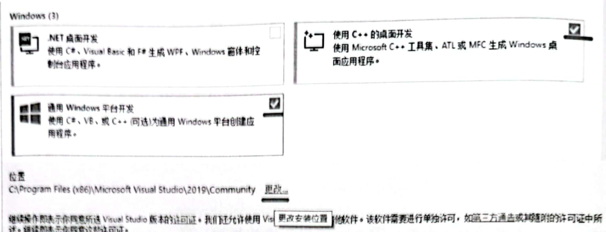
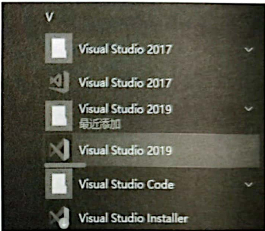

# 1.1 C++编程环境搭建说明  

## C++编程环境介绍  

本章内容主要包含4方面：①C+编程环境的搭建；②创建一个最基本的能运行的C++程序；③Visual Studio 中程序的调试方法；④开启Visual Studio 2019对C++最新标 准的编译支持。完成这些步骤，就能为本书后续内容的正常讲解铺平道路。

---

本书展示的各种范例，会在Windows操作系统平台上进行演示。对于演示环境的要求，至少需要VisualStudio2017，而VisualStudio2019就更好，以免一些新的语法无法被支持，原则上选择最新的VisualStudio版本。本书采用VisualStudio2019集成开发环境，该环境使用简单，调试方便，这意味着讲解和演示会变得特别方便，同时也能大大降低读者对一些复杂知识的理解难度。为了让读者顺利地开始学习，下面将详细阐述VisualStudio 2019的安装过程（在线安装，需要网络支持）。  

VisualStudio2019是成书时微软公司推出的最新版本的集成开发环境，可以直接访问网站（https://visual studio.microsoft.com/zh-hans/）Visual Studio 2019，分为3个版本：社区版（Community）、专业版（Professional）、企业版（Enterprise），如图1.1所示，其中社区版是免费使用的，这里下载社区版即可。  

在图1.1中单击Community2019链接，会将一个不到2MB的可执行文件下载到自己的计算机上，这个可执行文件实际是一个下载器，运行该下载器，它会按步骤提示下载和安装VisualStudio2019，这种安装方式属于在线下载和安装，整个过程持续半小时到数小时，安装时长主要取决于网速和计算机速度。  

安装过程中会出现选择界面，让用户选择安装哪些组件，如图1.2所示。  

这里只选择“使用 $\mathbf{C}^{++}$ 的桌面开发”以及“通用Windows平台开发”。在选择这两个选项时，安装界面右侧会出现额外的安装详细信息，其中有很多选项，保持默认，不做进一步勾选。请记住一个原则：只安装看上去与 $\mathbf{C++}$ 开发有关的选项，即便错过了一些选项，以后可以重复这个步骤补充安装，但切不可图省事而完全安装，因为那可能会耗费数十甚至上百吉比特（GB）的磁盘空间，完全没有必要。    

  

图1.1VisualStudio2019可供下载的3个版本  

  
图1.2 Visual Studio 2019  

在图1.2下方的“位置”处，可以单击“更改”，尽量把安装位置设置到非C盘（非系统盘），以尽量减少对系统盘空间的耗费。系统盘空间非常宝贵，一旦空间耗尽，可能导致计算机运行变慢甚至崩溃等各种问题，这一点也请切记。  

安装完成后，很可能在计算机的桌面上看不到VisualStudio2019程序图标，此时必须到操作系统左下角单击“开始”按钮，在菜单中找到VisualStudio2019图标，如图1.3所示，将图标拖动到桌面上以创建桌面快捷方式，下次双击该快捷方式即可运行VisualStudio2019。  

运行VisualStudio2019，启动界面如图1.4所示。  

  
图1.3“开始”菜单中的VisualStudio2019图标  

  
图1.4 Visual Studio 2019  

单击右下角的“继续但无需代码”链接直接进人开发环境，因为这是一个集成开发环境，可以编写很多种计算机编程语言的代码，所以第1步先设置开发环境为使用 $\mathbf{C}^{++}$ 语言。  

在开发环境中，进行以下操作。  

（1）执行菜单栏中“工具” $\rightarrow$ “导入和导出设置”命令。  

（2）在弹出的对话框中，选择“重置所有设置”选项并单击“下一步”按钮。

（3）选择“否，仅重置设置，从而覆盖当前设置”选项并单击“下一步”按钮。  

（4）选择“Visual $\mathbf{C++}$ ”选项并单击“完成”按钮。  

等待数秒，设置完成后单击“关闭”按钮并退出VisualStudio2019，就完成了将开发环境设置为 $\mathbf{C}^{++}$ 语言的操作步骤。  

VisualStudio2019会不定时更新，当需要更新时，在VisualStudio2019界面上会有提示，单击提示会出现一些操作步骤，按照操作步骤进行就可以在线更新。值得一提的是，可能需要注册一个账号才能进行正常的在线更新，根据系统提示进行注册即可。  

特别提醒：在成书过程中，估计因VisualStudio2019官方更新产生的Bug，导致inline功能变得有些不正常，如果读者在实践过程中发现与inline相关的内容或话题与笔者所讲述的不一致，请使用VisualStudio2017进行实践。