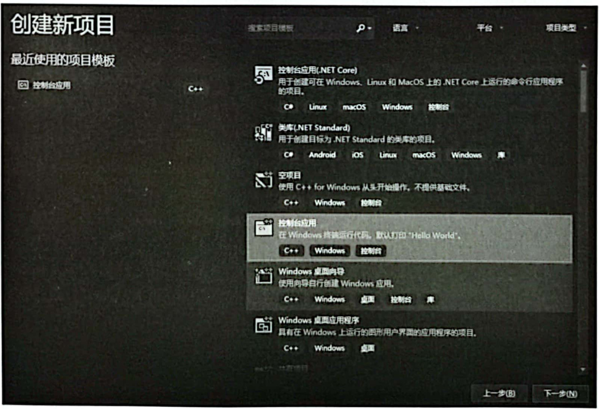
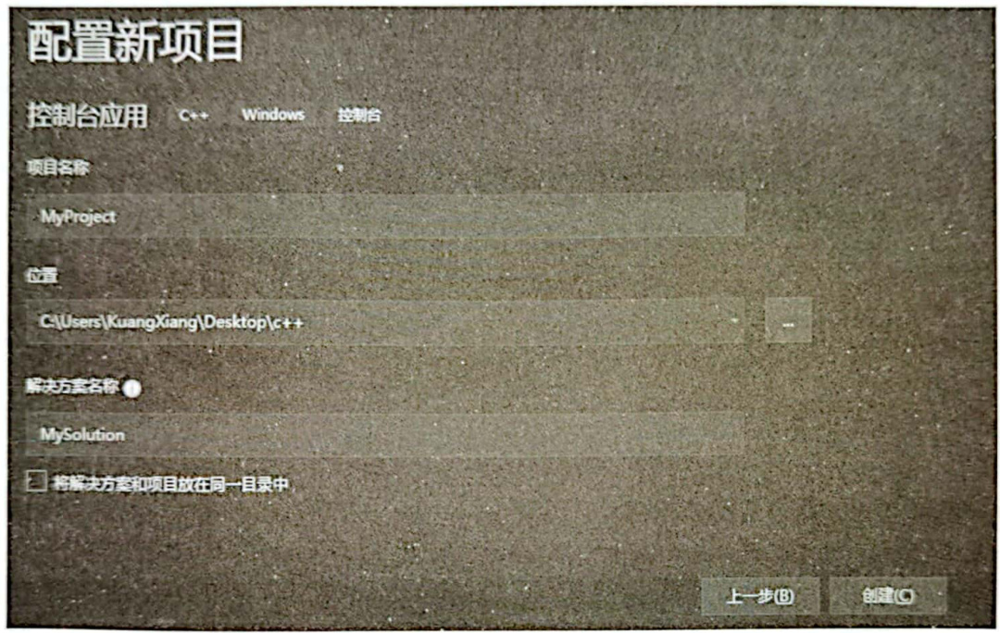
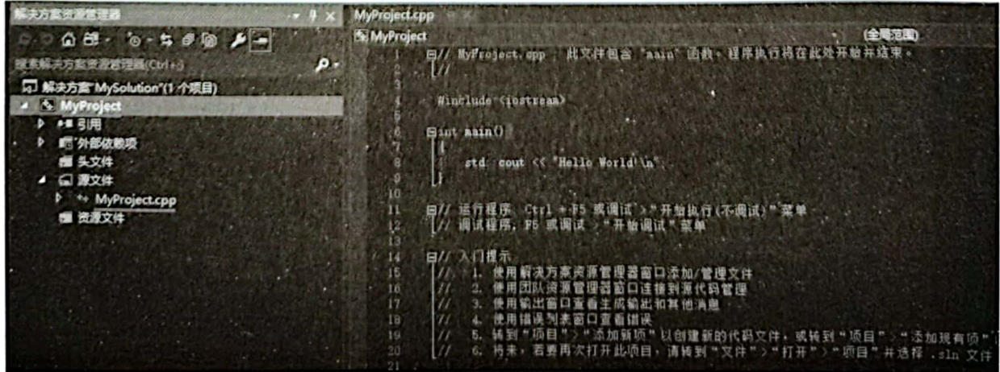
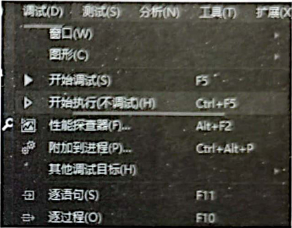
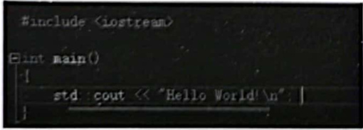

# 1.2创建最基本的能运行的 $\mathsf{C++}$ 程序  

为了方便后续的范例演示，首先要做的就是创建一个最基本的能运行的 $\mathbf{C}^{++}$ 程序。在VisualStudio2019中，只需要几步操作就能创建出一个最基本的能运行的 $\mathbf{C}^{++}$ 程序，其他的VisualStudio版本操作也类似，以下步骤供参考。  

（1）Visual Studio 2019。  

（2）单击右下角“创建新项目”选项，会弹出如图1.5所示的“创建新项目”对话框，选择“控制台应用”选项，并单击“下一步”按钮。  

  
图1.5VisualStudio2019创建新项目  

（3）让系统新创建一个项目，请记住，VisualStudio2019中，任何一个可执行程序都是通过新建一个项目的手段得来，所以必须新建一个项目。在如图1.6所示的“配置新项目”对话框中填写一些项目的配置信息。  

- 项目名称：为创建的项目起的名字，如MyProject。
- 位置：保存此项目的位置，可以直接输人一个目录路径或单击后面的“.”按钮选择一个已存在的目录，这里导航到事先创建好的路径C：\Users\KuangXiang\Desktopl $\mathtt{c}^{++}$ （读者可根据需要自由选择路径）。
- 解决方案名称：一个解决方案中可以包含多个项目，VisualStudio开发环境硬性要求一个项目必须被包含在一个解决方案中，同时，一个项目最终可以生成一个可执行程序。所以，创建MyProject项目时，VisualStudio2019会连带创建一个解决方案并My Project，My Solution。  

  
图1.6新项目的一些配置信息  

（4）单击“创建”按钮，系统开始创建项目，几秒钟后，系统创建好了一个名为MyProject的项目，正好位于MySolution解决方案之下，如图1.7所示，因版本不断升级变化，读者的界面内容可能会略有差异，注意不要随意改动内容，以免出错。  

  
图1.7成功创建了一个新项目  

如果读者使用其他VisualStudio版本，创建项目的步骤大同小异，只要能创建一个基于控制台的 $\mathbf{C}^{++}$ 程序项目供后续学习使用即可。如果读者对于自己使用的VisualStudio版本不确定如何创建项目，可以通过搜索引擎搜索诸如“VisualStudio2019创建新 $\mathbf{C}^{++}$ 项目”这样的关键词，就能找到详细答案。  

展开图1.7左侧的“源文件”文件夹列表，其中包含一个MyProject.cpp文件，这是系统依据项目名称生成的一个源码文件，其中已经包含一些 $\mathrm{C++}$ 源码，其实目前系统生成的该项目已经能够编译并运行了。  

项目要先编译、链接、生成可执行程序，然后才能运行，这一整套动作用快捷键 $_{\mathrm{CrI+F}5}$ 就可以完成，该快捷键在很多VisualStudio版本中通用。如果弹出一个提示窗口，可以单击提示窗口中的Yes按钮，也可以直接按回车键进行确认。  

如果按快捷键Ctrl+F5之后VisualStudio2019没有任何反应，可能是这个快捷键被其他软件占用、此时可以用VisualStudio2019中的菜单命令代替，执行如图1.8所示的菜单命令“调 试”一“开始执行（不调试）”，也能达到编译、链接、生成可执行程序并开始执行的效果。  

可执行程序运行起来后，会出现一个背景为黑色的窗口，其中显示“HelloWorld！”字符串，如图1.9所示。因为刚才创建项目时选择的是“控制台应用”，这种“控制台应用”项目运行后显示的正是一个黑色窗口，该窗口中会显示程序执行的结果，通过该窗口显示运行结果完全能够满足本书的学习要求。  

  
图1.8编译、链接、生成可执行程序并执行  

  
图1.9可执行程序的执行结果  

  
图1.10输出字符串“HelloWorld！“  

此时按任意键关闭窗口。可执行程序执行结果中之所以会显示“HelloWorld！”，是因为在MyProiect.cpp源文件中有如图1.10所示的代码行，这段代码的含义属于 $\mathrm{C++}$ 的基础开发知识，相信读者非常熟悉，在这里就不多说。