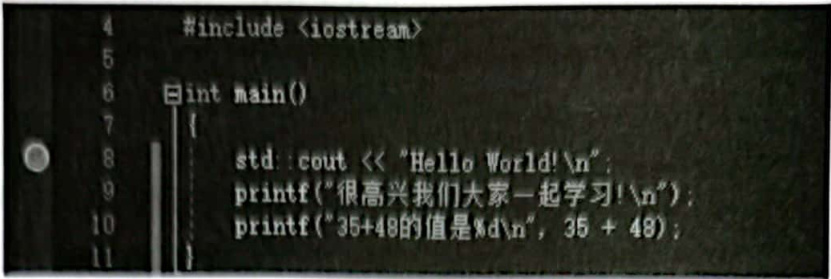
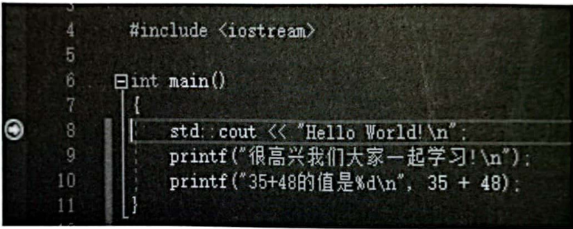
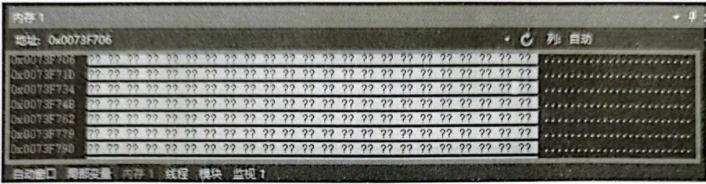
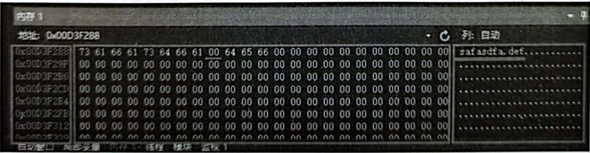
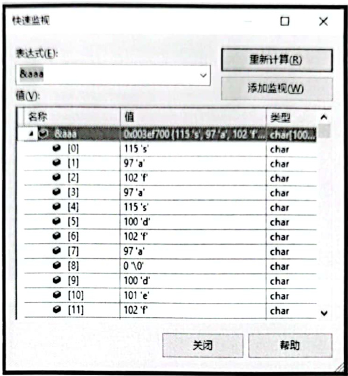
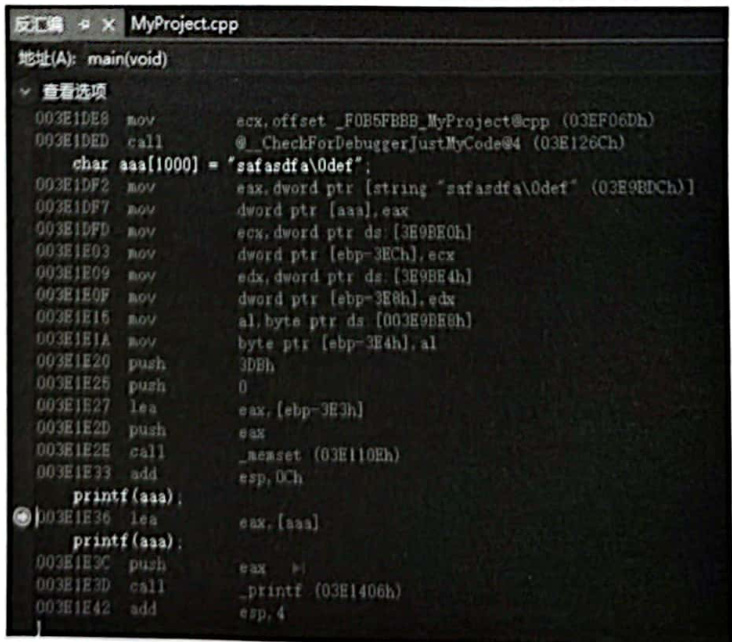

# 1.3Visual Studio  

## 1.3.1普通的断点调试（跟踪调试）  

首先介绍一下如何在VisualStudio2019（其他VisualStudio版本也类似）中进行程序调试，程序调试对于日后顺利进行范例演示和讲解将起到极其重要的作用，同时也对读者理解所讲解的知识起到极其重要的作用，所以一定要掌握程序调试的方法。  

（1）按快捷键F9（对应菜单命令“调试” $\rightarrow$ “切换断点”），用于在光标所在的行增加断点（设置断点）或取消该行已有的断点。代码行最前面有一个红色圆点，表示该行有一个断点，如图1.11所示，可以通过将光标定位到多个行并每次都按F9键为多个行增加断点。  

  
图1.11在某行增加断点  

（2）按快捷键F5（对应菜单命令“调试” $\rightarrow$ “开始调试”），开始执行程序，遇到第1个断点行就停下来，如图1.12所示，程序停在第8行，这个红色圆点中间多了一个向右指向的黄色箭头，表示程序执行流程停在这一行（虽然停在这一行，但是此刻这一行还没有被执行，表示即将要执行）。  

  
图1.12程序停在第8行  

（3）因为程序执行流程已经停了下来，处于程序员（我们）的控制之中，所以就在此刻，可以多次按快捷键F10（对应菜单命令“调试” $\rightarrow$ “逐过程”），从当前行开始，一行一行地执行下去，一边逐行执行，一边可以观察程序的执行走向（例如，如果是条件语句，就会因为不同的条件执行不同的分支）以及各种变量的值，从而达到调试的目的。  

（4）如果断点停在了一个自定义函数调用行，并且希望跟踪到这个函数里面的语句行，按快捷键F11（对应菜单命令“调试” $\rightarrow$ “逐语句”），就可以跳到函数中继续跟踪调试。如果想从当前所在的函数跳出去，可以按快捷键Shift+F11(对应菜单命令“调试” $\rightarrow$ “跳出”），就能够跳回到该函数的调用处并继续向下跟踪调试。  

## 1.3.2学会调试时查看内存中的内容  

在调试程序时学会查看内存中的内容对于深人掌握 $\mathbf{C}/\mathbf{C}++$ 语言编程益处巨大，下面是两行演示代码，按F9键把断点设置在printf行。  

``` cpp
char aaa[1000] = "safasdfa\Odef"; 
printf (aaa);
```

按F5 键执行整个程序，使程序停在 printf行上，我们此时就处于调试程序状态，如图1.13所示。  

  
图1.13处于调试程序状态  

在这种状态下，按快捷键 $\mathrm{Alit+6}$ 或执行菜单命令“调试”一“窗口” $\cdot$ “内存”一“内存1”、在整个VisualStudio2019界面的下方就打开了内存查看窗口，如图1.14所示。  

  
图1.14查看内存中的内容  

只需要在“地址”编辑框中输人地址符&，后面跟要查看的变量名，然后按回车键（如这里输入&aaa并按回车键），就可以查看该变量的地址所代表的内存中的内容。当然，在如图1.13所示的第78行，双击aaa这个变量名，直接拖动至“地址”编辑框中并按回车键，也能达到查看aaa变量所代表的内存中内容的目的，如图1.15所示。  

  
图1.15变量aaa在内存中的内容  

如图1.15所示，“地址”编辑框中显示的0x00D3F288是变量aaa所代表的内存地址。 往下看，分成3部分，左侧部分显示内存地址，为变量aaa的地址以及附近的内存地址；中间部分显示的是内存地址中保存的十六进制数字内容（内存中保存的数据都是二进制数据，为了方便观察，VisualStudio2019中把这些二进制数据以十六进制形式显示出来，4位二进制数字显示为一位十六进制数字）；右侧部分显示的是内存中的十六进制数字所代表的一些字符，有些可显示字符会显示出来，对于不可显示的字符就用“.”代替。  

将程序代码中的safasdfa\Odef与在内存中的内容进行比较，可以看到，\o这个转义字符在内存中显示的十六进制数字为00，a这个字符在内存中显示的十六进制数字为61，十六进制的61正好是十进制的97，而十进制的97正好就是字符a的ASCII码，所以在内存中存放一个字符时，存放的其实就是该字符的ASCII码。  

## 1.3.3“快速监视”对话框  

当运行着的程序停在断点处时，也可以按快捷键Shift+F9对应菜单命令“调试” $\longrightarrow$ “快速监视”），并在弹出的“快速监视”对话框输入要监视的变量内容，这样也是可以看到变量中所保存的数据的。例如，输人&aaa并按回车键，可以看到变量aaa的地址，地址中的内容也清晰可见，如图1.16所示。  

  
图1.16“快速监视”对话框  

## 1.3.4查看“反汇编”窗口  

当运行着的程序停在断点处时，有时需要查看某些源码产生的汇编代码，这可能对理解某些代码的执行有意想不到的效果。此时，可以切换到“反汇编”窗口（对应菜单命令“调试” $\rightarrow$ “窗口” $\rightarrow$ “反汇编”），如图1.17所示。  

  
图1.17“反汇编”窗口  

掌握了VisualStudio2019中程序的调试方法，读者就可以在后面的学习中利用这些手段快速掌握新知识了。