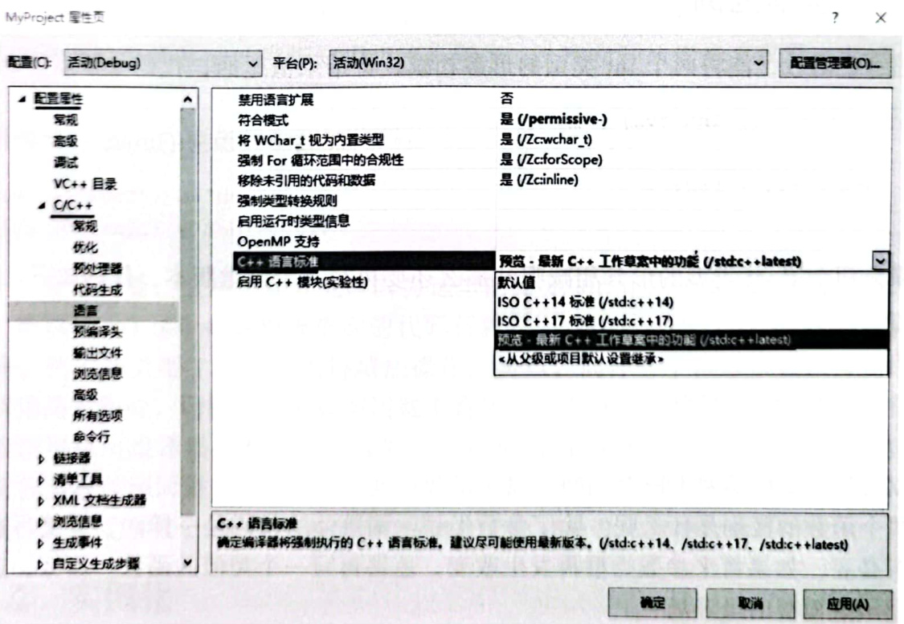

# 1.4 Visual Studio 2019 $\mathsf{c++}$ 最新标准的编译支持  

目前， $\mathbf{C}^{++}$ 标准每隔3年左右就做出一次更新，新的标准会推出一些新的语法规则。当然， $\mathbf{C}^{++}$ 编译器对这些新语法规则的支持可能也需要很久的时间，如数月甚至几年。在VisualStudio2019中，默认情况下，支持的 $\mathbf{C++}$ 标准不是最新标准，但为了让本书中的范例能够正常编译运行，需要设置为支持最新标准。本书鼓励读者使用最新的 $\mathbf{C}^{++}$ 编译器并开启它们对最新 $\mathbf{C}^{++}$ 标准的支持，程序员没有必要再去纠结那些老旧的 $\mathbf{C}^{++}$ 语法，新的 $\mathsf{C}^{++}$ 语法往往更清晰，更简洁。  

在VisualStudio2019的解决方案资源管理器（执行菜单命令“视图” $\rightarrow$ “解决方案资源管理器”）中右击项目名MyProject，在弹出的菜单中选择“属性”（或使用菜单命令 “项目” $\rightarrow$ “属性”）。在弹出的“MyProject属性页”对话框中左侧选择“配置属性” $\rightarrow$  $\mathsf{C}/\mathsf{C}++\longrightarrow$ “语言”（或“配置属性” $\rightarrow$ “常规)，在右侧查看“ $C^{++}$ 语言标准”行，在该行右侧可编辑位置显示的是“默认值”，单击下拉列表框，选择“预览－最新 $\mathbf{C}^{++}$ 工作草案中的功能（/std:c++latest）”选项，这样在VisualStudio2019中就可以支持 $\mathbf{C}^{++}$ 最新标准程序代码的编译，一些最新标准的语法规则就可以使用了，如图1.18所示。  

  
图1.18 Visual Studio $\mathbf{c}_{++}$ 标准的编译支持